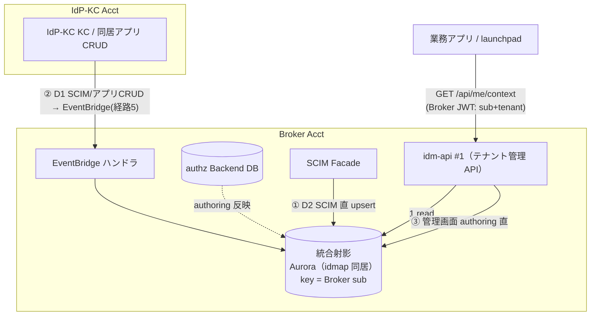
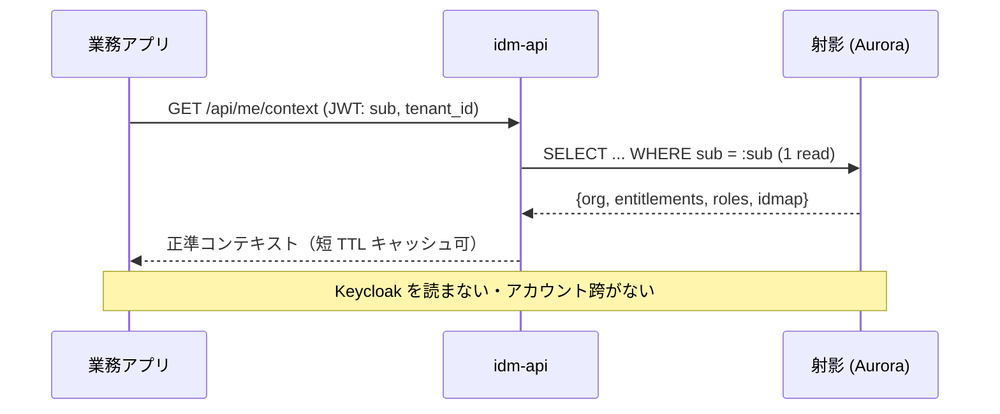
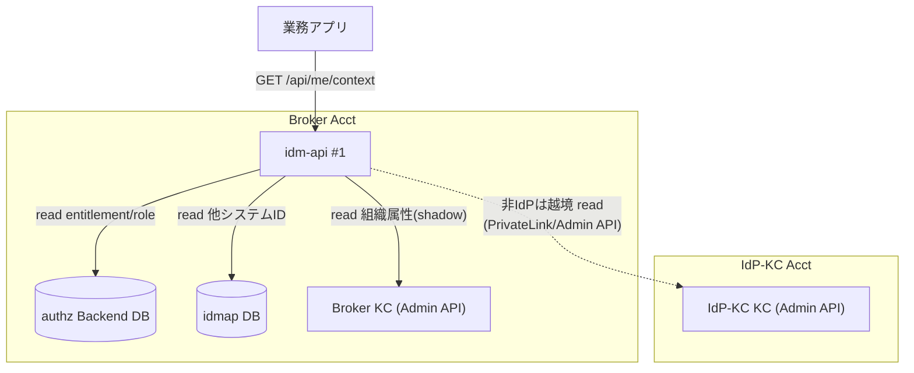
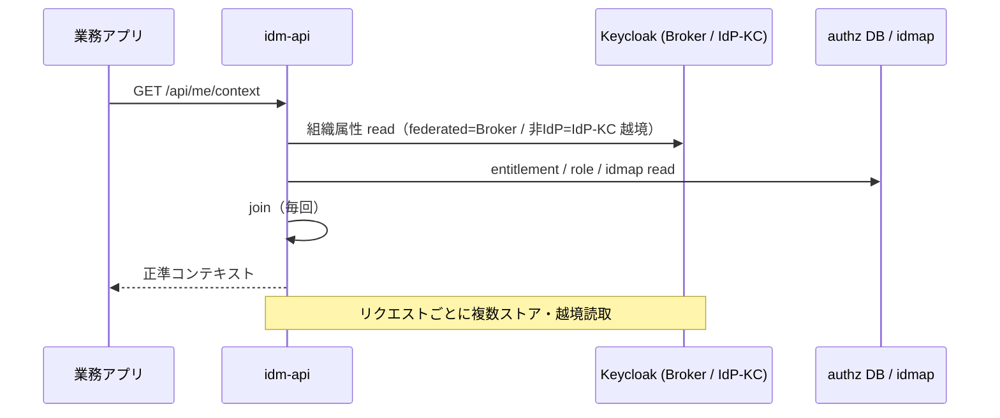

# 比較検討ノート: `/api/me/context` — 射影（Option A）vs 都度 join（Option B）

日付: 2026-08-05 / 起票理由: ユーザー検討（「射影のイメージが湧かない。都度読取との比較を、構成図・フロー付きで材料が欲しい」）。
関連: [idp-kc-user-mgmt-authz-boundary-notes.md §5.5](idp-kc-user-mgmt-authz-boundary-notes.md)（RC-1〜4）、[03-identity-provisioning-design.md §3.8](../03-identity-provisioning-design.md)（D3-14〜17）、[01-architecture-baseline.md](../01-architecture-baseline.md)（P-02 10M MAU / P-17 分離 / G-SCIM）。

> **注**: リポジトリ上、Option A（射影）は「採用方向（実測ゲート付き）」、Option B（都度 join）は**却下ベースライン**としてのみ記録されている（§5.5 で「問い」として提示し即却下）。本ノートは判断材料として **B の利点を補って両論併記**にする。

> **⚠ 2026-08-06 更新（ブランドユニット化、[ADR-063](../../adr/063-brand-unit-architecture.md)）**: authz/idmap/projection を**ブランドユニット（IdP-KC 側）**に置き、**ブランドのアプリが `/api/me/context` をブランドローカル read** する構成に確定。この前提では **A/B の対立の核だった「越境読取（非 IdP は IdP-KC 越境）」がそもそも起きない**（ブランド内で完結）。→ **per-brand では「射影 vs 都度 join」は "ブランド内でどちらでもよい（越境しない）" 問題に縮小**。射影は 10M 規模の読取最適化・KC 負荷オフロードの観点で依然有力だが、**P-17 越境という決定的理由は per-brand では消える**。以下の §1〜§9 は単一マルチテナント前提の比較として保持（ブランド内の設計選択にそのまま流用可）。

## 1. 問い

アプリが必要とするユーザーの「文脈」——identity（sub/tenant）＋組織属性（部署/上長…）＋エンタイトルメント（使えるアプリ）＋機能ロール＋他システム ID（idmap）——は、**複数ストア・2 アカウントに分散**している：

| データ | 置き場所 | アカウント |
|---|---|---|
| identity（sub/tenant）| Broker KC（shadow）/ IdP-KC KC | Broker / IdP-KC |
| 組織属性 | Keycloak user attribute（射影 or 基盤付与）| Broker / IdP-KC |
| エンタイトルメント・機能ロール割当 | authz Backend DB | Broker |
| idmap（他システム ID）| idmap DB | Broker |

**問い**: アプリがリクエストのたびに、これらを（federated は Broker、非 IdP は IdP-KC と）**アカウント跨ぎで読むのか？**

## 2. Option A：射影（read model / CQRS）

**発想**: 書込時に 1 箇所（Broker Acct の射影ストア）へ**事前に寄せ**、読取は**そこを 1 read** するだけ。

### 構成図

### 読取フロー

- **一貫性**: 書込フィード（①②③）で更新。RC-4 = at-least-once（EventBridge）+ 冪等 upsert + version 最新勝ち。**弱い結果整合**（数秒〜のラグ）。
- **sub バックフィル**: RC-3 = Event Listener SPI が `IDENTITY_PROVIDER_FIRST_LOGIN` を emit（初回ログインで sub 確定 → 射影へ）。

## 3. Option B：都度 join（projection-less）

**発想**: 射影を持たず、`/api/me/context` 要求時に **idm-api が各ストアを直接読んで join** して返す。

### 構成図

### 読取フロー

- **一貫性**: 常に最新（各ストアの現在値を読む）。ラグなし。
- **懸念**: 非 IdP ユーザーは IdP-KC を**越境 read** → Broker↔IdP-KC の相互到達（Admin API / IAM）を作る必要 → **P-17 分離に反する**。10M 規模で読取ごとに複数ストア join → レイテンシ/負荷。

## 4. 比較表

| 観点 | Option A：射影 | Option B：都度 join |
|---|---|---|
| **リクエスト時の越境読取** | ❌ しない（Broker 内 1 read）| ⚠ **する**（非 IdP は IdP-KC 越境）→ **P-17 抵触** |
| **読取レイテンシ（10M）** | ◎ 単一 read・短 TTL キャッシュ可 | △ 複数ストア join・越境 RTT |
| **Keycloak への負荷** | ◎ 読取が KC に来ない（オフロード）| △ 読取ごとに Admin API を叩く |
| **鮮度（一貫性）** | △ 結果整合（数秒ラグ）| ◎ 常に最新 |
| **実装の単純さ** | △ フィード 3 系統 + 冪等/version + バックフィル | ◎ 射影パイプライン不要 |
| **障害耐性** | ◎ フィード遅延でも読取は射影から継続 | △ どれか 1 ストア/越境が遅いと読取が劣化 |
| **越境 IAM/Admin 到達の新設** | ◎ 不要（書込時 EventBridge のみ）| ❌ 相互到達を作る＝攻撃面増 |
| **運用（10M スケール）** | ◎ 読取をスケールしやすい | △ KC/越境がボトルネック化 |

## 5. 現行の傾きと理由

- **現行 = Option A 採用方向（D3-16「採用（方向確定、実測ゲート付き）」）**。ただし RC-1（射影ストア = Aurora 同居）は research §5.5 表で「傾き（未確定）」表記＝**PoC 前の lean**。
- **A を選ぶ 2 大理由**（§5.5）: ① **P-17（Broker↔IdP-KC の相互到達を作らない）に反しない** ② **10M 規模のレイテンシ/負荷**。**越境の手間は書込（プロビ）時に寄せる**、が設計思想。

## 6. Option B の利点（判断材料として補完）

B は却下ベースラインだが、公平に利点を挙げる：
- **常に最新**（結果整合ラグが無い）。承認・即時剥奪など鮮度が命の判断に有利。
- **射影パイプライン（フィード 3 系統・冪等・version・バックフィル）が不要** → 実装/運用が単純、整合バグの余地が小さい。
- **二重管理が無い**（SSOT を読むだけ）。

→ ただし B の利点は **「越境しない」場合に限り**成立する。本基盤は identity が 2 アカウントに分かれるため、**B は構造的に P-17 越境を招く**のが致命的。**もし将来 identity を 1 アカウントに寄せる設計なら B の相対評価は上がる**（＝A/B の分岐は「アカウント分割前提」に強く依存）。

## 7. ハイブリッド案（第 3 の選択肢）

1. **射影 + 短 TTL キャッシュ（A 現行）**: 鮮度ラグを TTL で明示管理。**即時性が要る操作（剥奪）は Broker shadow 無効化（B の即時遮断）で別途担保** → 「普段は射影、遮断は即時」の役割分担。
2. **部分射影**: 変化の遅い組織属性・idmap だけ射影、変化の速いエンタイトルメントは authz DB を Broker 内で都度 read（越境しない範囲の部分 B）。**Broker 内は都度 read でも P-17 に触れない**点がポイント。
3. **射影を持たず Broker 内だけ都度 join + 非 IdP 分は書込時に Broker へ寄せる**: 実質 A のフィード②のみ採用（非 IdP を Broker へ射影）+ その他は Broker 内都度 read。

→ **論点の核心は「越境するか」**。**A も 案2/3 も "Broker 内で完結" を守る**。純 B（非 IdP を越境 read）だけが P-17 に触れる。

## 8. 推奨と次アクション

- **推奨 = Option A（射影）を基本**。理由は P-17 と 10M。ただし **RC-1 のストア選定（Aurora 同居 vs 別）と読取 p99 は G-SCIM で実測**してから確定。
- **鮮度が要る即時剥奪は射影に頼らず Broker shadow 無効化（B の項）で担保**、を明記（役割分担）。
- **検討価値のあるハイブリッド = 案2（部分射影）**：組織属性/idmap は射影、エンタイトルメントは Broker 内都度 read も選択肢。実装単純さと鮮度の折衷。G-SCIM の読取 p99 実測でどちらが要るか判断。

## 9. 未決・ゲート

- **G-SCIM 読取 p99（10M）**: 射影 1 read の p99、externalId 検索 p99、フィード遅延の実測 → A の妥当性確認。
- **RC-1 ストア**: Aurora 同居 or 別（DynamoDB 含む）。
- **鮮度 SLA**: 射影ラグの許容値（TTL）とアプリ側の欠損/遅延前提の実装契約。
- **部分射影（案2）の採否**: エンタイトルメントを射影に含めるか Broker 内都度 read にするか。
