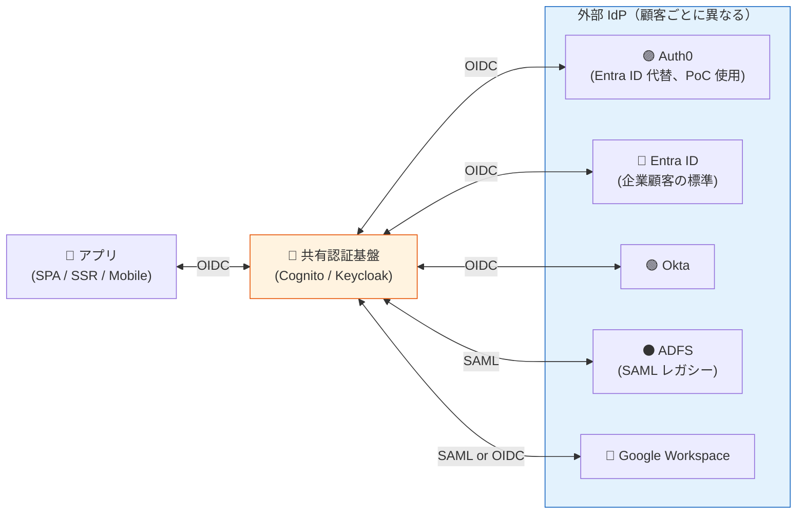
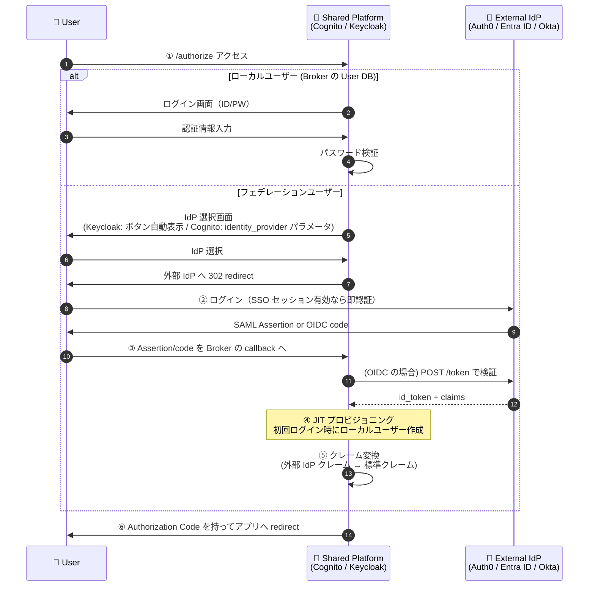
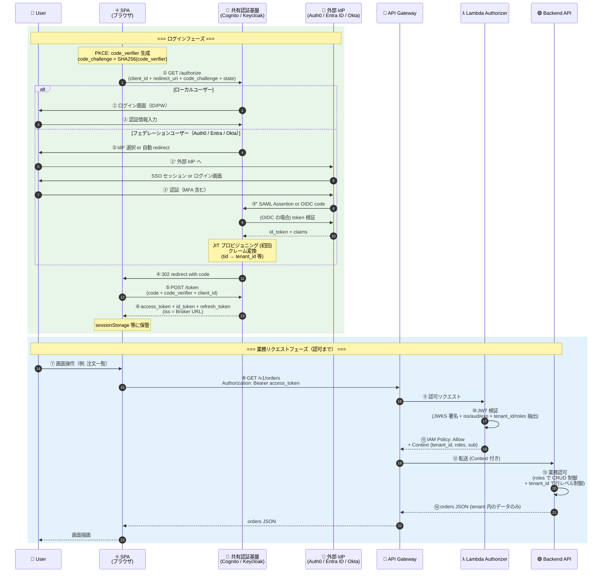
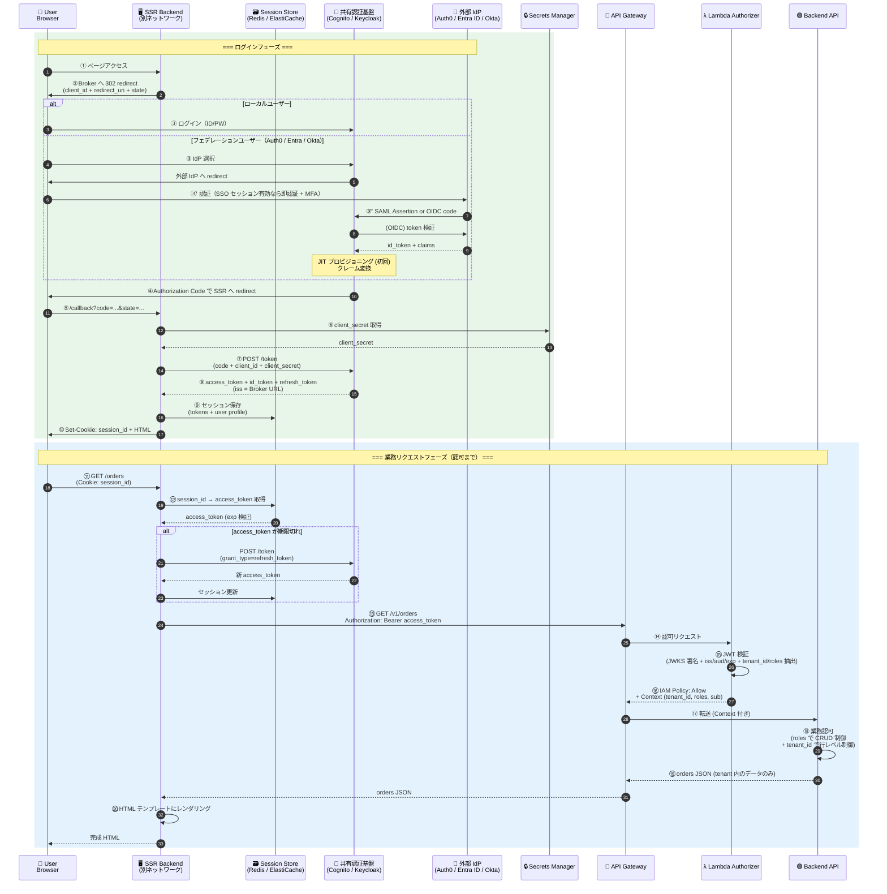
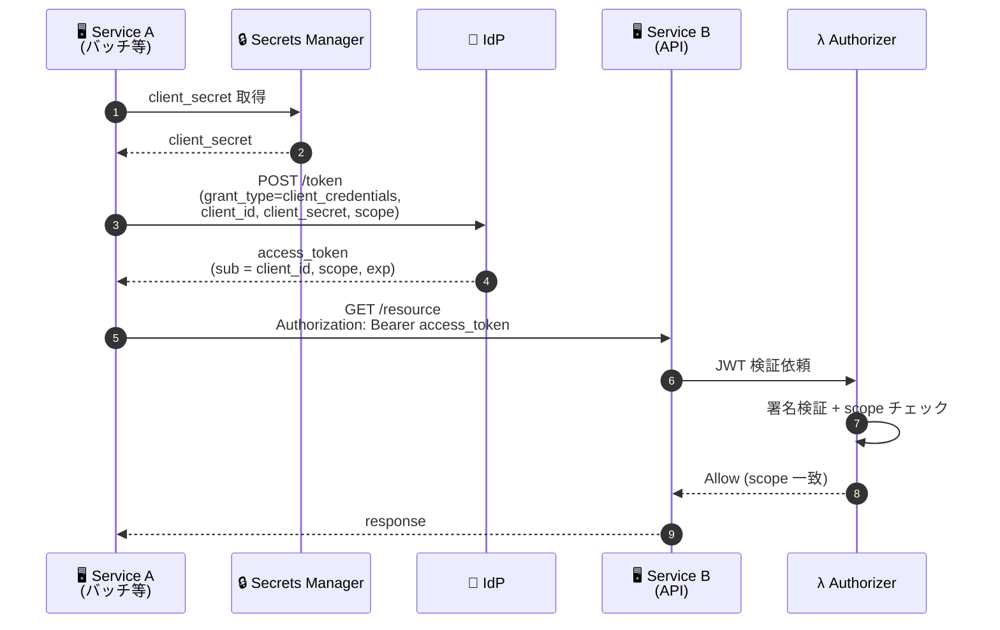
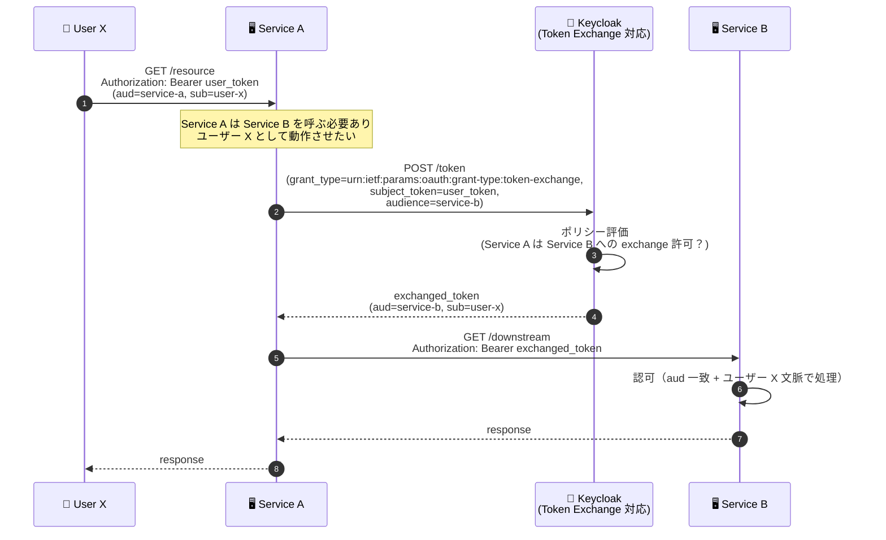
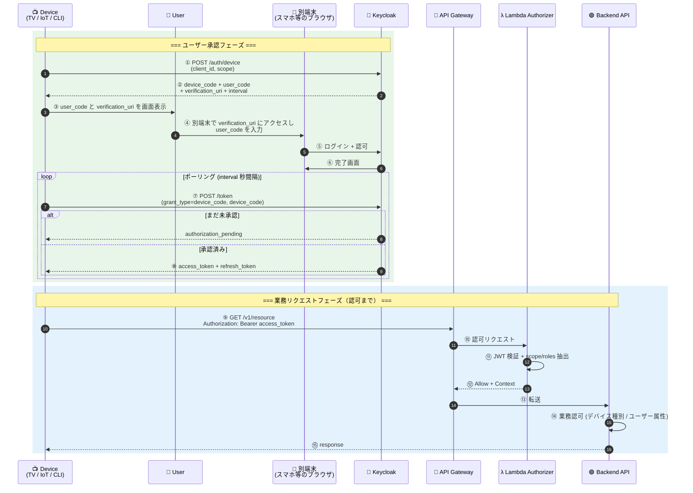

# 認証パターン総覧と Cognito / Keycloak 対応マトリクス

> 最終更新: 2026-04-24
> 対象: 共有認証基盤の利用シナリオ全体
> 関連: [ADR-014](../adr/014-auth-patterns-scope.md)（採用パターン範囲の判断）

PoC 現状は **SPA + Authorization Code + PKCE** のみ検証済。本ドキュメントでは、共有認証基盤として想定される全認証パターンを整理し、Cognito / Keycloak それぞれでの実現方法・制約・ネットワーク要件をまとめる。

---

## 1. パターン一覧

| # | パターン | OAuth Grant Type | Client 種別 | PoC 検証 |
|---|---------|----------------|-----------|:-------:|
| 1 | **SPA**（ブラウザ動作） | Authorization Code + PKCE | Public | ✅ 検証済 |
| 2 | **SSR Web App**（別ネットワーク） | Authorization Code + client_secret | Confidential | ❌ 未検証 |
| 3 | **ネイティブモバイル / デスクトップ** | Authorization Code + PKCE | Public | ❌ 未検証 |
| 4 | **M2M（Service-to-Service）** | Client Credentials | Confidential | ❌ 未検証 |
| 5 | **Token Exchange / OBO** | RFC 8693 token-exchange | Confidential | ❌ 未検証 |
| 6 | **Device Code Flow** | Device Authorization Grant | Public | ❌ 未検証 |
| 7 | **SAML（SP-initiated）** | SAML 2.0（非 OAuth） | — | ❌ 未検証 |
| 8 | **mTLS Client Authentication** | RFC 8705 | Confidential | ❌ 未検証 |
| 9 | **ROPC**（Resource Owner Password Credentials） | Password | — | ❌ 採用予定なし |

**横断トピック**:
- 上記いずれのパターンでも、認証相手は **共有認証基盤（Cognito / Keycloak）** だが、実際には裏側で**外部 IdP（Auth0 / Entra ID / Okta 等）と OIDC/SAML 連携**するケースが多い（§2.0 参照）
- 共有認証基盤は **ブローカー**として振る舞い、アプリから見ると外部 IdP は透過的

---

## 2. パターン別の詳細

### 2.0 前提: フェデレーション連携の基本構造（Auth0 / Entra ID / Okta）

本ドキュメントの各パターン（§2.1 以降）では認証相手を **「IdP（Cognito / Keycloak）」** と記載しているが、実際には **共有認証基盤（Cognito / Keycloak）がブローカー**として振る舞い、**裏側で顧客の外部 IdP（Auth0 / Entra ID / Okta / Google Workspace 等）と OIDC / SAML で連携**するケースが多い。

各パターンフローの「IdP」ステップは、**ローカル認証** と **フェデレーション認証** のいずれかに分岐する:

**アプリから見た重要な不変性**:
- アプリは**常に共有認証基盤（Cognito / Keycloak）とのみ通信**する
- 外部 IdP（Auth0/Entra 等）の存在はアプリから透過的
- JWT の `iss` は**共有認証基盤の URL**（外部 IdP ではない）
- 顧客が別 IdP に切り替わってもアプリ側の変更は不要

#### 2.0.1 フェデレーション時の内部フロー

各パターンの「IdP で認証」ステップを展開すると、以下の内部処理が発生:

**ポイント**:
- **JIT プロビジョニング**: 外部 IdP ユーザーの初回ログイン時、Broker 側にローカルユーザーを自動作成
- **クレーム変換**: 外部 IdP 固有の属性（Entra: `tid`、Okta: `org_id`）を統一クレーム（`tenant_id` 等）に変換
- **ログイン後は Broker 発行 JWT のみ使用** — アプリは外部 IdP の存在を意識しない

#### 2.0.2 Cognito / Keycloak でのフェデレーション設定比較

| 項目 | Cognito | Keycloak |
|------|---------|----------|
| 外部 OIDC IdP 登録 | `User Pool` → `Sign-in experience` → `Federated identity provider sign-in` に OIDC Provider 追加 | `Identity Providers` → `OpenID Connect v1.0` 追加 |
| 外部 SAML IdP 登録 | 同上 → SAML Provider 追加（メタデータ URL or XML） | `Identity Providers` → `SAML v2.0` 追加（メタデータ URL or XML） |
| 属性マッピング | `attribute_mapping` ブロック（User Pool 属性 = IdP 属性） PoC: [infra/cognito.tf](../../infra/cognito.tf) | `Identity Provider` の `Mappers` タブで個別定義 PoC: Keycloak Admin Console で設定 |
| ログイン画面の IdP 選択 | ⚠ `identity_provider=<Name>` パラメータ必須（ボタン自動表示なし） | ✅ IdP ボタンが自動表示される（UX 優位） |
| JIT プロビジョニング | ✅ 自動（初回 `/authorize` で User 作成） | ✅ 自動（`First Login Flow` で制御可能） |
| クレーム追加ロジック | **Pre Token Generation Lambda V2**（例: [infra/pre-token-lambda.tf](../../infra/pre-token-lambda.tf)） | **Protocol Mapper**（Realm 設定で宣言的） |
| 多重 MFA 回避 | 外部 IdP 側で MFA 済ならスキップ不可（Cognito 側も MFA 要求する場合あり） | `Conditional OTP` フローで「外部 IdP 経由ならスキップ」を実現 |
| ログアウト | ⚠ URL エンコードに落とし穴あり（PoC で実証） | Back-Channel Logout 対応、実装がシンプル |
| 複数 IdP 並行運用 | ✅（User Pool に複数 IdP 登録可） | ✅（Realm に複数 IdP 登録可） |
| マルチテナント（顧客ごと IdP） | 1 User Pool に複数 IdP or テナントごと User Pool | 1 Realm に複数 IdP or テナントごと Realm |

→ 詳細な設計パターンは [identity-broker-multi-idp.md](identity-broker-multi-idp.md) 参照。

#### 2.0.3 PoC での検証状況

| 外部 IdP | Cognito | Keycloak | 備考 |
|---------|:------:|:-------:|------|
| **Auth0**（Entra ID 代替） | ✅ Phase 2,4,5 | ✅ Phase 7 | Cognito central/local、Keycloak Identity Brokering で検証済 |
| **Entra ID 実接続** | ❌ 未検証 | ❌ 未検証 | 本番要検証（Auth0 の挙動から大きく外れる可能性は低いが未確認） |
| **Okta** | ❌ 未検証 | ❌ 未検証 | 2 社目 IdP 追加パターンの検証が本番設計で必要 |
| **ADFS（SAML）** | ❌ 未検証 | ❌ 未検証 | レガシー顧客向け |

---

### 2.1 SPA — Authorization Code + PKCE

**典型例**: React / Vue / Angular の SPA、PoC の app-keycloak 等

**フロー**: ログイン（フェデレーション分岐含む） → 業務リクエスト → Backend 認可まで。

**ポイント**:
- **外部 IdP 連携時も JWT の `iss` は Broker 発行**（Authorizer は外部 IdP を意識しない）
- フェデレーションユーザーは **MFA を外部 IdP 側で実施**（Broker 側では二重 MFA を回避、[ADR-009](../adr/009-mfa-responsibility-by-idp.md)）
- SPA はブラウザ動作のため、**access_token がブラウザに露出する**（SSR との違い）
- **認可は 2 段階**: ⑨〜⑪ の Lambda Authorizer + ⑬ の Backend 業務認可
- Refresh Token は**沈黙更新**（silent refresh）で SPA 側で透過的に取得

| 比較軸 | Cognito | Keycloak |
|-------|---------|----------|
| Client 設定 | App Client、`Generate client secret = OFF`、`Authorization code grant + PKCE` 有効 | Client、`Public Client = ON`、`Standard Flow Enabled` |
| ログイン UI | Hosted UI（カスタマイズ制約あり：CSS / ロゴのみ） | Realm Theme でフルカスタマイズ可（HTML/CSS/JS） |
| PKCE | `code_challenge_method=S256` 必須化可能 | 同左 |
| `aud` クレーム | `aud = client_id`（自動） | デフォルトで `account` を含む（Mapper で除外可） |
| Refresh Token | デフォルト 30 日 | デフォルト 30 日（Realm 設定で変更可） |
| ログアウト | `/logout` + `logout_uri`（URL エンコード必須、PoC で落とし穴） | `/logout?id_token_hint=...&post_logout_redirect_uri=...` |
| ライブラリ | oidc-client-ts / Amplify | oidc-client-ts / keycloak-js |
| **PoC 検証** | ✅ Phase 1, 4, 5 | ✅ Phase 6, 7 |

**ネットワーク要件**:
- ブラウザ → IdP の `/authorize`, `/token`, `/logout` に到達可能
- CORS: SPA オリジンを IdP 側で許可
- `redirect_uri` を IdP の Client 設定に登録

---

### 2.2 SSR Web App — Authorization Code + client_secret（Confidential Client）

**典型例**: Next.js（App Router / Pages Router の SSR）、Spring MVC、Rails、Laravel、PHP アプリ。**SSR が ECS/EC2 上、別ネットワーク（別 VPC / 別アカウント / オンプレ）で動作するケース**を含む。

**フロー**: ログイン（フェデレーション分岐含む） → 業務リクエスト → Backend 認可までを 2 フェーズで示す。

**ポイント**:
- **ログインフェーズ**（⑥〜⑩）は Server-to-Server、client_secret は Secrets Manager から取得
- **外部 IdP 連携時も JWT の `iss` は Broker 発行**（SSR / Authorizer は外部 IdP を意識しない）
- フェデレーションユーザーは **MFA を外部 IdP 側で実施**（Broker での二重 MFA を回避、[ADR-009](../adr/009-mfa-responsibility-by-idp.md)）
- **セッション管理**（⑨⑫）: SSR 側で access_token を保持、Cookie は不透明な session_id のみ（access_token をブラウザに出さない）
- **トークン更新**（⑫'）: access_token 期限切れ時は refresh_token で透過的に更新（Broker 経由、外部 IdP への再 redirect は不要）
- **認可は 2 段階**:
  - ⑭〜⑯ **Lambda Authorizer（リクエスト単位）**: JWT 署名検証 + tenant_id/roles 抽出
  - ⑱ **Backend（業務ロジック）**: roles で CRUD 制御、tenant_id で行レベルアクセス制御

| 比較軸 | Cognito | Keycloak |
|-------|---------|----------|
| Client 設定 | App Client、`Generate client secret = ON`、`Authorization code grant` 有効 | Client、`Confidential = ON`、`Standard Flow Enabled` |
| client_secret 保管 | AWS Secrets Manager（推奨） | AWS Secrets Manager / Vault / SSM Parameter Store |
| Token Endpoint | `https://<domain>.auth.<region>.amazoncognito.com/oauth2/token` | `https://<keycloak>/realms/<realm>/protocol/openid-connect/token` |
| トークン認証 | `client_id + client_secret` を Basic 認証または body に含める | 同左 |
| Refresh Token Rotation | デフォルト OFF（設定で ON 可） | デフォルト ON |
| Backend での JWT 検証 | JWKS は `https://cognito-idp.<region>.amazonaws.com/<pool>/.well-known/jwks.json` | JWKS は `<keycloak>/realms/<realm>/protocol/openid-connect/certs` |
| Refresh Token Rotation | サポート（要設定） | デフォルト有効 |
| **PoC 検証** | ❌ 未検証 | ❌ 未検証 |

**SSR 特有のネットワーク要件**:

| 要件 | 内容 |
|------|------|
| **IdP /token への到達経路** | SSR から IdP の `/token` にサーバ間通信が必須。経路選択肢: （A）Public ALB（IP allowlist で SSR 出口 IP を許可、または CloudFront 経由） （B）VPC Peering / Transit Gateway 経由で **Internal ALB** 直接 （C）PrivateLink で IdP を専用公開 |
| **redirect_uri の登録** | IdP Client 設定に SSR の `https://app.example.com/callback` を登録 |
| **CORS** | 不要（Server-to-Server のため） |
| **client_secret ローテーション** | Secrets Manager の自動ローテーション機能を活用 |
| **ログアウト** | Back-Channel Logout（Keycloak のみ）または Front-Channel Logout |

**SPA と SSR の対比**:

| 観点 | SPA | SSR |
|-----|-----|-----|
| Client 種別 | Public（secret なし） | **Confidential（secret あり）** |
| PKCE | 必須 | 任意（推奨） |
| Token 保管 | ブラウザ（XSS リスク） | サーバ側（Cookie + Redis 等、安全） |
| Refresh Token リスク | 高い（ブラウザ） | 低い（サーバ） |
| /token 呼び出し元 IP | 顧客ブラウザ（不定） | サーバ IP（固定・予測可能） |
| CORS | 必須 | 不要 |

---

### 2.3 ネイティブモバイル / デスクトップ — Authorization Code + PKCE

**典型例**: iOS / Android アプリ、Electron デスクトップアプリ

**フロー**: SPA とほぼ同じ（PKCE 必須、Public Client）。差分は:
- redirect_uri に `myapp://callback` のようなカスタムスキーム or Universal Link を使う
- Token はモバイル OS のセキュアストア（Keychain / Keystore）に保管

| 比較軸 | Cognito | Keycloak |
|-------|---------|----------|
| 推奨 SDK | AWS Amplify (iOS/Android) | keycloak-android / Keycloak SSO Manager / oidc-client |
| カスタムスキーム redirect | ✅ 対応 | ✅ 対応 |
| Universal Link / App Link | ✅ 対応 | ✅ 対応 |
| 認証 UI | アプリ内 WebView（非推奨）or System Browser（推奨）| 同左 |
| **PoC 検証** | ❌ 未検証 | ❌ 未検証 |

**ネットワーク要件**: SPA と同じ。モバイル端末 → IdP `/authorize`, `/token` への到達。

---

### 2.4 M2M（Service-to-Service）— Client Credentials Grant

**典型例**: バッチ処理、Cron Job、マイクロサービス間 API 呼び出し（**ユーザー文脈なし、サービス自身のID で認証**）

**フロー**:

| 比較軸 | Cognito | Keycloak |
|-------|---------|----------|
| 機能名 | App Client + Resource Server + Custom Scopes | Service Accounts |
| 設定手順 | (1) Resource Server を作成し custom scope 定義 (2) App Client で client_credentials grant + 該当 scope を有効化 (3) `aud` クレームは scope の `Resource Server identifier` | (1) Confidential Client を作成 (2) `Service Accounts Enabled = ON` (3) Service Account User にロール割り当て |
| Token に含まれる情報 | `sub = client_id`、`scope = "<resource_server>/<scope_name>"` | `sub = service-account-<client_id>`、`realm_access.roles = [...]` |
| ロール / 権限の表現 | Custom Scope（Resource Server で定義） | Realm Role / Client Role |
| **コスト** | **Cognito: $0.0025 / 1,000 リクエスト**（Essentials/Plus tier、無料枠超過分） | Keycloak: 追加課金なし（インフラ費のみ） |
| ユーザー文脈の付加 | 不可（Client Credentials はユーザー無関係） | 同左（Token Exchange を使えば付加可、後述） |
| **PoC 検証** | ❌ 未検証 | ❌ 未検証 |

**ネットワーク要件**:
- バッチサーバ / マイクロサービス → IdP `/token` への到達
- M2M はサービス IP が固定であることが多いため、**IP allowlist が現実的**
- VPC 内サービスなら Internal ALB 経由が望ましい

**Lambda Authorizer の拡張要件**:
- 現状の Authorizer は「ユーザー認証」前提（`sub = user_id`、`tenant_id`、`roles`）
- M2M では `sub = client_id`、ユーザー属性なし
- Authorizer に「クライアント認証モード」を追加し、`sub` の形式や scope で判別する必要あり

---

### 2.5 Token Exchange / OBO — RFC 8693

**典型例**: マイクロサービス間でユーザー文脈を伝播するケース。Service A がユーザー X のリクエストを処理中、Service B を呼び出すが Service B 側でも「ユーザー X として」処理させたい。

**フロー**:

| 比較軸 | Cognito | Keycloak |
|-------|---------|----------|
| 対応 | ❌ **ネイティブ非対応** | ✅ **対応**（Token Exchange feature） |
| 代替手段（Cognito） | Service A が自前で「ユーザー文脈付きの内部 JWT」を発行 or Service B 側で Refresh Token を渡して再認証 → いずれも RFC 8693 ではないため非標準 | — |
| Internal-to-Internal | — | サポート（同 Realm 内） |
| External-to-Internal | — | サポート（外部 IdP の Token を Realm Token に交換） |
| **PoC 検証** | ❌ 未検証（Cognito は非対応） | ❌ 未検証 |

**重要**: マイクロサービス構成で Token Exchange が必要な場合、**Keycloak 必須となる**。Cognito では非標準的な実装で代替する必要があり、保守性・標準準拠性で劣る。

---

### 2.6 Device Code Flow — Device Authorization Grant

**典型例**: スマート TV、IoT デバイス、CLI ツール（AWS CLI の `aws sso login` のような UX）

**フロー**: ユーザー承認 → トークン取得 → API 認可まで。

**ポイント**:
- デバイスにブラウザがない（TV / IoT）または操作が困難（CLI）な場合の UX
- デバイスは user_code を表示するだけで、実際の認証は別端末で行う
- トークン取得後は通常の Bearer Token 認証と同じフロー

| 比較軸 | Cognito | Keycloak |
|-------|---------|----------|
| 対応 | ❌ **非対応** | ✅ **対応**（OIDC 標準） |
| エンドポイント | — | `/realms/<realm>/protocol/openid-connect/auth/device` |
| 用途 | — | CLI、IoT、ヘッドレスデバイス |
| **PoC 検証** | ❌ 未検証（Cognito 非対応） | ❌ 未検証 |

**重要**: CLI ツールや IoT デバイスからの認証が必要な場合、**Cognito では実装不可**。Keycloak が必須となる。

---

### 2.7 SAML（SP-initiated）

**典型例**: 顧客のレガシー業務システム、既存 SaaS（SAML 専用の業務システム）

**SP / IdP の役割**:
- **共有認証基盤が SP（Service Provider）として SAML IdP を受け入れる**: 顧客の既存 SAML IdP（ADFS 等）と連携
- **共有認証基盤が IdP として SAML を発行する**: 顧客の既存 SAML SP（業務システム）に発行

| 比較軸 | Cognito | Keycloak |
|-------|---------|----------|
| **SP として SAML 受け入れ**（顧客 SAML IdP と federation） | ✅ サポート（User Pool に SAML IdP を登録） | ✅ サポート（Identity Provider として SAML 追加） |
| **IdP として SAML 発行**（業務システムへ） | ❌ **非対応**（Cognito は OIDC IdP のみ） | ✅ サポート（Realm が SAML IdP として動作） |
| 属性マッピング | attribute_mapping | SAML Mapper |
| メタデータ | XML import | XML import / URL fetch |
| **PoC 検証** | ❌ 未検証 | ❌ 未検証 |

**重要**: 既存 SAML SP（業務システム）に対して認証基盤が SAML を発行する必要がある場合、**Cognito では不可**。Keycloak 必須。

---

### 2.8 mTLS Client Authentication — RFC 8705

**典型例**: 高セキュリティ M2M（金融 API など FAPI 準拠が必要なケース）、PKI 基盤がある組織

**フロー**: client_secret の代わりに **クライアント証明書** で認証。

| 比較軸 | Cognito | Keycloak |
|-------|---------|----------|
| 対応 | ❌ **非対応** | ✅ **対応**（FAPI Profile） |
| Token Binding | — | ✅ Certificate-Bound Access Tokens |
| **PoC 検証** | ❌ 未検証 | ❌ 未検証 |

**重要**: FAPI 準拠が必要な金融・医療系では Keycloak 必須。

---

### 2.9 ROPC — Password Grant（**非推奨・原則採用しない**）

**典型例**: レガシーシステムの強制移行用（暫定）

| 比較軸 | Cognito | Keycloak |
|-------|---------|----------|
| 対応 | ✅ サポート（USER_PASSWORD_AUTH flow） | ✅ サポート（Direct Access Grants） |
| OAuth 2.1 での扱い | **非推奨** | **非推奨** |
| MFA 対応 | 限定的 | 限定的 |

**原則採用しない**。やむを得ず使う場合は移行期限を切る。

---

## 3. Cognito vs Keycloak 対応マトリクス（サマリー）

| パターン | Cognito | Keycloak | Cognito 制約 |
|---------|:-------:|:--------:|------------|
| 1. SPA | ✅ | ✅ | UI カスタマイズ制約あり |
| 2. SSR Web App | ✅ | ✅ | 同上 |
| 3. ネイティブモバイル | ✅ | ✅ | — |
| 4. M2M | ✅ | ✅ | リクエスト課金あり、Resource Server 設定必要 |
| 5. **Token Exchange** | ❌ | ✅ | **Cognito 完全非対応** |
| 6. **Device Code** | ❌ | ✅ | **Cognito 完全非対応** |
| 7. **SAML IdP として発行** | ❌ | ✅ | **Cognito は OIDC 専用、SAML 発行不可** |
| 7. SAML SP として受入 | ✅ | ✅ | — |
| 8. **mTLS** | ❌ | ✅ | **Cognito 非対応** |
| 9. ROPC | ✅ | ✅ | 両者非推奨 |

### 4 つの「Cognito では不可、Keycloak 必須」パターン

1. **Token Exchange** — マイクロサービス間でユーザー文脈伝播が必要
2. **Device Code** — CLI / IoT 認証が必要
3. **SAML IdP 発行** — 既存 SAML SP（業務システム）と連携
4. **mTLS** — FAPI 準拠 / 高セキュリティ M2M

→ これらが**1 つでも要件にあれば Keycloak 必須**。なければ Cognito で完結可能。

### 3.1 フェデレーション連携（外部 IdP 受け入れ）対応

すべての認証パターンで、裏側で外部 IdP（Auth0 / Entra / Okta 等）と連携する場合の対応状況:

| 外部 IdP | プロトコル | Cognito | Keycloak | 備考 |
|---------|:-------:|:------:|:-------:|------|
| **Auth0** | OIDC | ✅ | ✅ | PoC 検証済（Cognito: Phase 2,4,5 / Keycloak: Phase 7） |
| **Entra ID（Azure AD）** | OIDC | ✅（実機未検証） | ✅（実機未検証） | Auth0 挙動と大差なし想定、本番要検証 |
| **Okta** | OIDC | ✅（未検証） | ✅（未検証） | 2 社目 IdP 追加パターン確認用途 |
| **Google Workspace** | OIDC / SAML | ✅（未検証） | ✅（未検証） | 中小企業で多い |
| **ADFS（Active Directory）** | SAML | ✅（未検証） | ✅（未検証） | レガシー企業 |
| **LDAP / Active Directory 直接** | LDAP | ❌ **非対応** | ✅ User Federation | **Cognito 完全非対応**。直接 LDAP 連携が必要なら Keycloak 必須 |
| **任意の SAML 2.0 IdP** | SAML | ✅ | ✅ | メタデータ XML / URL |
| **任意の OIDC IdP** | OIDC | ✅ | ✅ | Discovery URL |

**フェデレーション関連の Cognito / Keycloak の差**:

| 項目 | Cognito | Keycloak |
|------|---------|----------|
| ログイン画面の IdP 選択 UX | ⚠ `identity_provider` パラメータ必須 | ✅ ボタン自動表示 |
| 多重 MFA 回避 | ⚠ 個別実装 | ✅ Conditional OTP で宣言的 |
| Back-Channel Logout（外部 IdP 連携時） | ❌ 非対応 | ✅ 対応 |
| フェデレーションユーザーへのカスタムクレーム付与 | ⚠ Pre Token Lambda V2 実装必要 | ✅ Protocol Mapper で宣言的 |
| **LDAP 直接連携** | ❌ 不可 | ✅ 対応 |

→ **LDAP 直接連携が必要な顧客がいる場合は Keycloak 必須**（前項 4 つに加えて 5 つ目の必須要因）。

---

## 4. PoC 範囲とすべき優先度（提案）

| 優先度 | パターン | 理由 |
|:-----:|---------|------|
| **必須** | SPA（既検証）、SSR、M2M | 標準的な業務システムで必ず使う |
| **強推奨** | Token Exchange（Keycloak のみ） | マイクロサービス標準、後付け困難 |
| **推奨** | SAML SP / IdP（Keycloak のみ後者） | レガシー連携が想定される場合 |
| 検討 | Device Code、ネイティブモバイル | 顧客要件次第 |
| 不採用 | ROPC、mTLS | 特殊用途のみ |

詳細は [ADR-014](../adr/014-auth-patterns-scope.md) で要件定義時に確定。

---

## 5. ネットワーク要件サマリー

各パターンが認証基盤に対して持つネットワーク要件:

| パターン | 認証基盤への到達元 | IP の予測可能性 | 推奨経路 |
|---------|----------------|--------------|---------|
| SPA | エンドユーザーブラウザ | 不定 | CloudFront 経由（WAF で保護） |
| SSR | サービスのサーバ IP | **予測可能** | Internal ALB（VPC Peering）or Public ALB（IP allowlist）|
| ネイティブモバイル | モバイルキャリア / Wi-Fi | 不定 | CloudFront 経由 |
| M2M | サービスのサーバ IP | **予測可能** | Internal ALB or Public ALB（IP allowlist） |
| Token Exchange | マイクロサービス | **予測可能** | Internal ALB |
| Device Code | デバイス | 不定 | CloudFront 経由 |
| SAML | 顧客 SAML IdP / SP | 顧客固定 | Public ALB（IP allowlist） |
| mTLS | M2M クライアント | **予測可能 + 証明書認証** | Internal ALB or Public ALB |

→ **共通基盤として「ブラウザ起点 = CloudFront」「サービス起点 = Internal ALB」の 2 経路が必要**

---

## 6. 参考

- 関連 ADR: [011](../adr/011-auth-frontend-network-design.md)、[013](../adr/013-cloudfront-waf-ip-restriction.md)、[014](../adr/014-auth-patterns-scope.md)
- ネットワーク設計: [keycloak-network-architecture.md](keycloak-network-architecture.md)
- 認可設計: [authz-architecture-design.md](authz-architecture-design.md)
- RFC 8693（Token Exchange）: https://datatracker.ietf.org/doc/html/rfc8693
- RFC 8705（mTLS）: https://datatracker.ietf.org/doc/html/rfc8705
- OAuth 2.1 Draft: https://datatracker.ietf.org/doc/html/draft-ietf-oauth-v2-1
