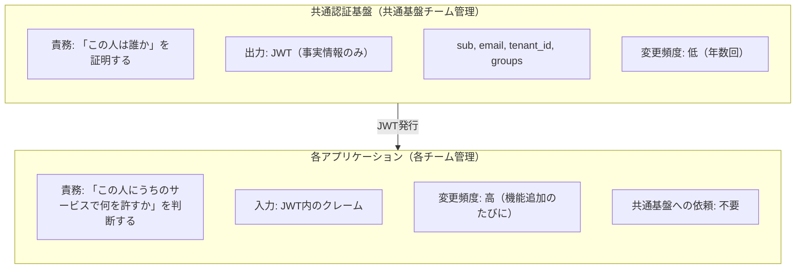
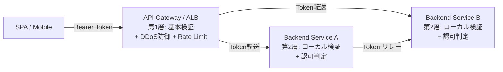
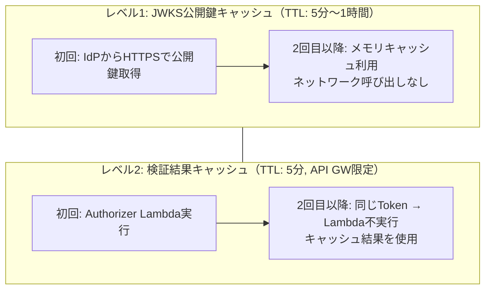
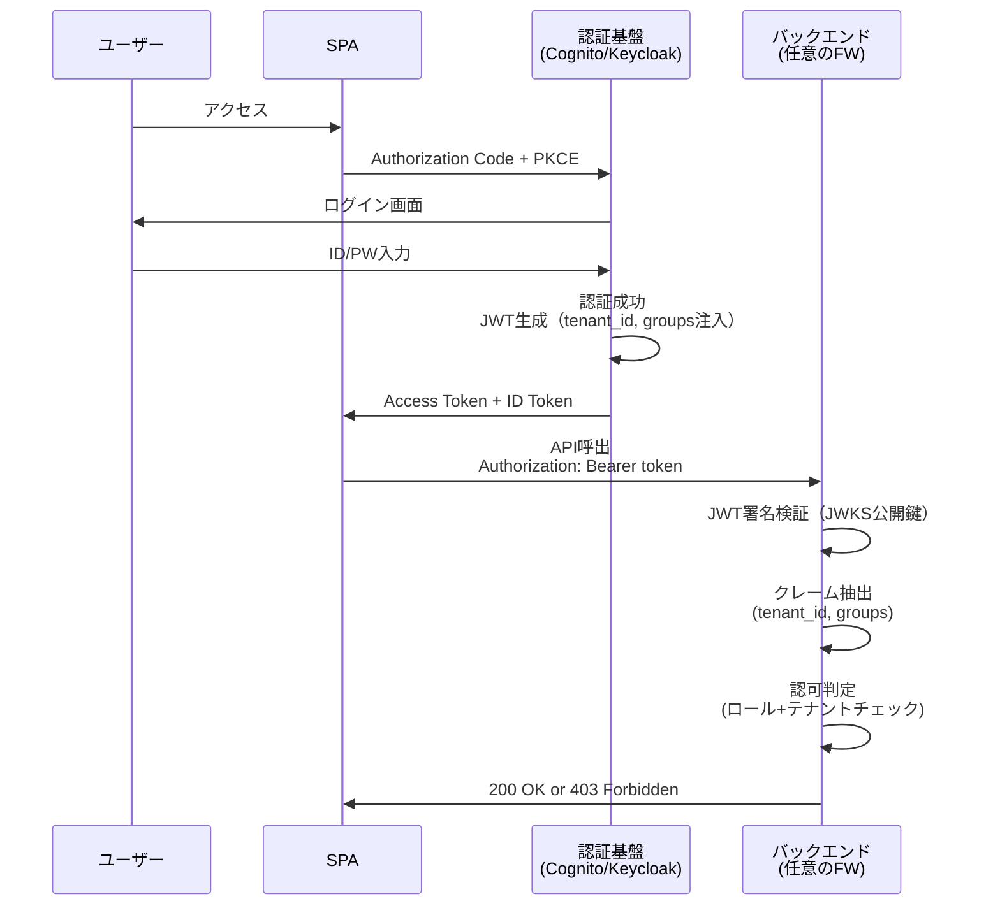
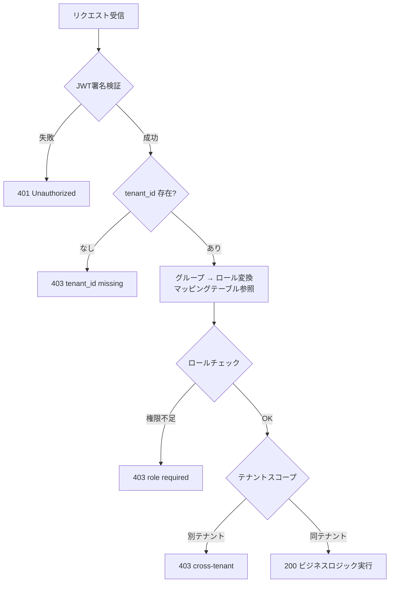
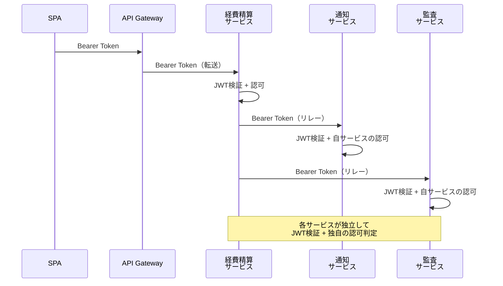

# 認可アーキテクチャ設計：バックエンド非依存の共通認証基盤

**作成日**: 2026-04-20
**目的**: 認証基盤（Cognito / Keycloak）が発行するJWTを、多様なバックエンド
（Lambda、ECS、Spring Boot、Express.js等）で一貫して利用するための設計方針を定める。

---

## 1. 設計思想

### 認証と認可の責務分離



### 原則

1. **JWT には「事実」だけ載せる** — `groups: ["managers"]` は事実。「managersだから承認可能」は判断（各サービスが決める）
2. **クレームの種類は最小限に固定** — 変更が少ないほど共通基盤への依頼が減る
3. **各サービスはJWTの中身を「解釈」するだけ** — 独自のマッピングテーブルで自律的に認可設計

---

## 2. 選定パターン：パターン2（クレーム固定 + 各サービスが解釈）

### 比較検討した3パターン

| パターン | 概要 | 共通基盤への依頼頻度 | 採用 |
|---------|------|:------------------:|:---:|
| 1. すべて共通基盤管理 | Mapper追加のたびに共通基盤が作業 | 高 | ❌ |
| **2. クレーム固定 + 各サービスが解釈** | **共通基盤はグループ配列を出すだけ、各サービスが意味づけ** | **極低** | **✅** |
| 3. アプリ別Client/Scope分離 | Keycloakで各チームがMapperを管理 | 低 | △ |

### パターン2を選んだ理由

| 評価軸 | パターン2 の評価 |
|-------|----------------|
| **共通基盤チームの負荷** | ◎ クレーム種類の追加時のみ（年数回） |
| **各チームの自律性** | ◎ マッピングテーブル変更で即対応可能 |
| **セキュリティ** | ○ JWTには事実のみ、判断は各サービス内部 |
| **バックエンド非依存** | ◎ どの言語/FWでもJWTの中身を読むだけ |
| **IdP変更時の影響** | ◎ クレーム名が同じなら各サービス変更不要 |
| **Cognito / Keycloak 両対応** | ◎ どちらも同じクレーム構造を出力 |

### パターン3を不採用とした理由

- Keycloak固有の機能に依存する（Cognitoでは不可能）
- Admin Console権限分離やGitOps構築のコストが見合わない
- そもそもクレーム固定ならMapper変更の頻度が極低で、パターン3のメリットが活きない

---

## 3. JWT クレーム設計（固定）

共通基盤が発行する JWT に載せるクレームは以下で固定する。

```json
{
  "sub": "uuid-or-provider-id",
  "email": "bob@acme.com",
  "tenant_id": "acme-corp",
  "groups": ["managers", "expense-approvers", "travel-admins"],
  "iss": "https://cognito-idp.../pool-id",
  "exp": 1234567890,
  "iat": 1234567890
}
```

| クレーム | 説明 | 変更頻度 |
|---------|------|:-------:|
| `sub` | ユーザー一意識別子 | なし |
| `email` | メールアドレス | なし |
| `tenant_id` | テナント識別子 | なし |
| `groups` | 所属グループ配列（組織のグループ名をそのまま） | 低 |
| `iss` | トークン発行者 | なし |

### groups の命名規約

- 組織横断のグループ名をそのまま使う（例: `managers`, `department-A`）
- アプリ固有のプレフィックスを付けてもよい（例: `expense-approvers`）
- **グループの追加/削除は IdP側（Entra ID/Keycloak）の管理者が行う**
- 共通基盤の Mapper/Lambda は「全グループを出力」で固定

### 各サービスの解釈例

```python
# 経費精算サービス（自チームで管理・変更時に共通基盤への依頼不要）
GROUP_TO_ROLE = {
    "expense-approvers": "manager",
    "expense-admins": "admin",
    "managers": "manager",       # 組織横断グループも活用可能
}

def resolve_role(jwt_groups: list[str]) -> str:
    """JWTのgroups配列からこのサービスでのロールを決定"""
    best_rank = 0
    best_role = "employee"
    for g in jwt_groups:
        role = GROUP_TO_ROLE.get(g)
        if role and ROLE_RANK.get(role, 0) > best_rank:
            best_rank = ROLE_RANK[role]
            best_role = role
    return best_role
```

```python
# 出張予約サービス（別チーム・独自のマッピング）
GROUP_TO_ROLE = {
    "travel-admins": "admin",
    "managers": "approver",       # 同じグループでも別の意味づけ
}
```

---

## 4. トークン検証アーキテクチャ

### 推奨: ハイブリッド（Gateway + ローカル検証）



### 検証方式の比較

| 方式 | 場所 | メリット | デメリット |
|------|------|---------|----------|
| **Gateway集約** | API Gateway | キャッシュ効く、一箇所管理 | Gateway固有ロックイン |
| **ローカル検証** | 各サービス | FW標準機能、Gateway不要でも動く | 各サービスに設定必要 |
| **Token Introspection** | IdPに問い合わせ | 即時失効反映 | パフォーマンス悪化 |

---

## 5. トークンキャッシュ戦略

### キャッシュの2つのレベル



| レベル | キャッシュ対象 | TTL | 効果 |
|-------|-------------|-----|------|
| **JWKS 公開鍵** | IdPの署名検証用公開鍵 | 5分〜1時間 | IdPへのHTTPリクエスト削減 |
| **検証結果** | 「このトークン = Allow」 | 5分（API GW） | Lambda実行自体をスキップ |

### 各フレームワークのデフォルト動作

| FW | ライブラリ | JWKS キャッシュ TTL |
|----|----------|:-----------------:|
| Spring Boot | spring-security-oauth2-resource-server | 5分 |
| Express.js | jwks-rsa | 10時間 |
| Python/Lambda | 現PoC実装（手動） | 1時間 |

### トークン失効（Revocation）への対応

| 対策 | パフォーマンス | 即時性 | 推奨場面 |
|------|:----------:|:-----:|---------|
| **短命トークン（15分）** | ◎ | △（最大15分） | 一般的なSaaS ← **推奨** |
| Token Introspection | △ | ◎ | 金融/医療等 |
| ブラックリスト（Redis） | ○ | ○ | 大規模サービス |

**本番推奨構成:**
- Access Token 有効期限: **15分**（現PoC: 1時間 → 本番で短縮）
- Refresh Token: **30日**（バックグラウンドで自動更新）
- API Gateway キャッシュ: **300秒**
- JWKS キャッシュ: **1時間**

---

## 6. バックエンド別の実装パターン

### 共通: JWT に載るクレームは同じ

どのバックエンドでも、受け取る JWT は同一形式。
検証ロジック（署名確認 + issuer確認）は各FWの標準機能で実現。

### Spring Boot（ECS）

```yaml
# application.yml - 認証設定（これだけで署名検証が動く）
spring:
  security:
    oauth2:
      resourceserver:
        jwt:
          issuer-uri: https://cognito-idp.ap-northeast-1.amazonaws.com/pool-id
```

```java
// 認可はアノテーションで宣言（各サービスが自分で定義）
@PreAuthorize("@authz.hasMinRole(authentication, 'manager')")
@PostMapping("/expenses/{id}/approve")
public Expense approve(@PathVariable String id, JwtAuthenticationToken auth) {
    String tenantId = auth.getToken().getClaimAsString("tenant_id");
    // テナントスコープチェック
}
```

### Express.js / Node.js（ECS）

```javascript
// middleware/auth.js - 認証（10行で完結）
const { expressjwt: jwt } = require('express-jwt');
const jwksRsa = require('jwks-rsa');

const authMiddleware = jwt({
  secret: jwksRsa.expressJwtSecret({
    jwksUri: `${ISSUER}/.well-known/jwks.json`,
    cache: true,
    rateLimit: true,
  }),
  algorithms: ['RS256'],
  issuer: ISSUER,
});

app.use('/v1', authMiddleware);

// routes/expenses.js - 認可（各サービスが自分で定義）
router.post('/:id/approve', (req, res) => {
  const { tenant_id, groups } = req.auth;
  if (!hasMinRole(groups, 'manager')) return res.status(403).json({...});
  if (expense.tenant_id !== tenant_id) return res.status(403).json({...});
});
```

### Lambda + API Gateway（現PoC構成）

API Gateway Lambda Authorizer + Backend Lambda の現在の構成。
Gateway固有だが、認可ロジック自体は上記FWに移植容易。

---

## 7. フロー図

### 認証フロー（全バックエンド共通）



### 認可判定フロー（各サービス内部）



### マイクロサービス間のトークンリレー



---

## 8. 共通基盤への依頼が発生するケース

### 依頼が必要（年数回）

| ケース | 作業内容 | 頻度 |
|-------|---------|:----:|
| 新しい IdP 接続 | Entra ID / Okta の OIDC設定追加 | 年1-2回 |
| カスタム属性スキーマ追加 | 例: `department` 属性を新設 | 年1-2回 |
| カスタム属性のクレーム出力追加 | Mapper/Lambda に1行追加 | 年1-2回 |
| トークン有効期限変更 | User Pool / Realm 設定 | まれ |

### 依頼が **不要**（各チームで自律対応）

| ケース | 各チームの対応 |
|-------|-------------|
| 新エンドポイントの認可設計 | 自サービスのコード変更 |
| ロール解釈の変更 | マッピングテーブル変更 |
| 新しいグループの認可定義 | マッピングテーブルに追加 |
| テナントスコープの追加 | 自サービスの if 文追加 |
| ユーザーのグループ割当 | IdP管理画面（テナント管理者が実施） |

---

## 9. 本番移行時の変更点

| 項目 | PoC | 本番 |
|------|-----|------|
| IdP | Auth0 Free | Entra ID / Okta |
| Access Token 有効期限 | 1時間 | **15分** |
| Refresh Token | 30日 | 30日（変更なし） |
| JWKS キャッシュ | 1時間 | 5分（鍵ローテーション対応） |
| データストア | インメモリ | DynamoDB/RDS（tenant_id条件付き） |
| Gateway | API Gateway REST API | API Gateway HTTP API or ALB |
| バックエンド | Lambda | ECS (Spring Boot / Express等) |
| グループ管理 | Auth0 `app_metadata` | Entra ID セキュリティグループ / SCIM |

---

## 10. PoC で検証済みの項目

| 検証項目 | 状態 | バックエンド非依存性 |
|---------|:---:|:------------------:|
| Cognito JWT 発行 + Pre Token Lambda V2 | ✅ | ◎ |
| Keycloak JWT 発行 + Protocol Mapper | 進行中 | ◎ |
| マルチ issuer 対応（Cognito/Keycloak同時） | ✅ | ◎ |
| クレーム名統一（tenant_id/roles/email） | ✅ | ◎ |
| ロール階層チェック（employee < manager < admin） | ✅ | ◎ 3行で移植可 |
| テナントスコープチェック | ✅ | ◎ if 1文で移植可 |
| フェデレーション + ローカルユーザー混在 | ✅ | ◎ |
| トークンのクレーム配列/文字列両対応 | ✅ | ◎ |
