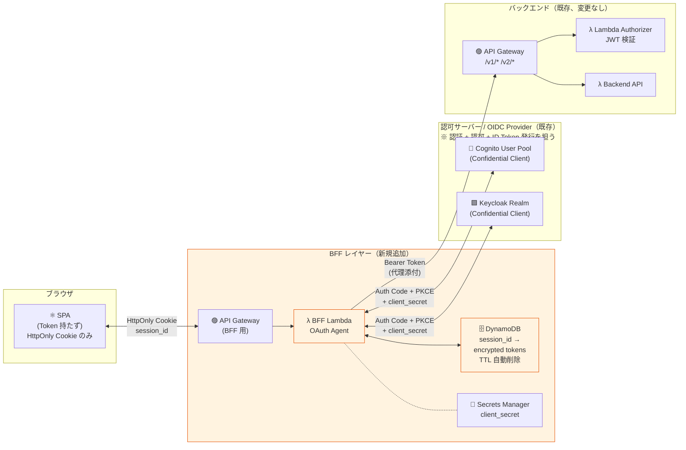
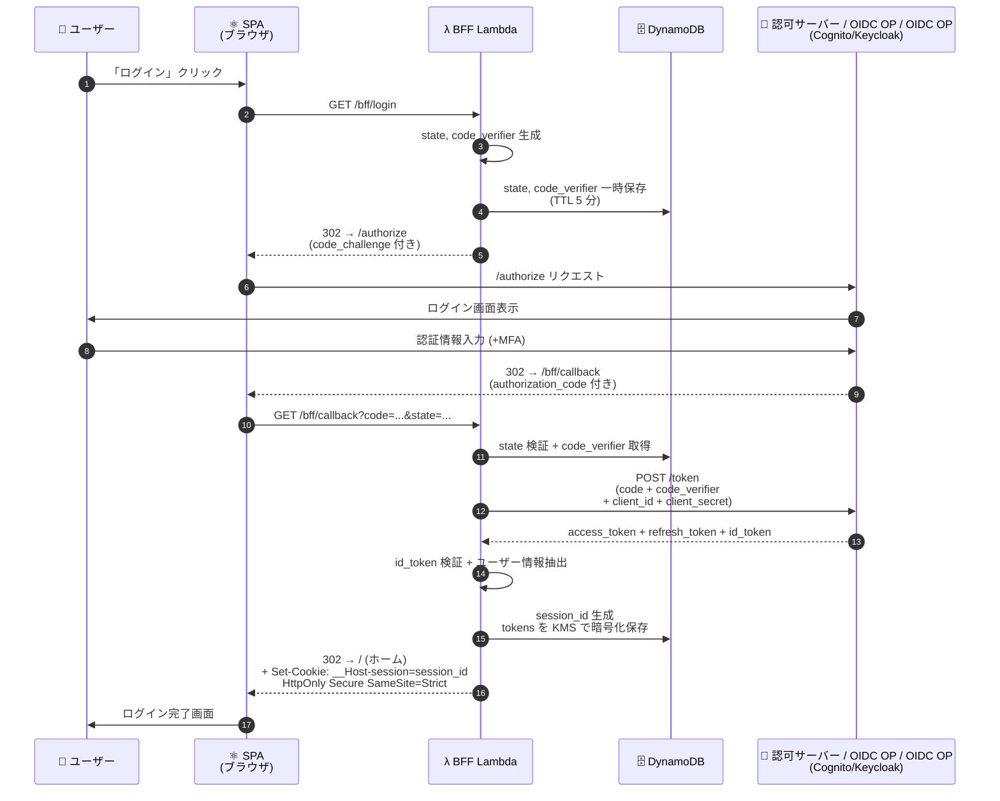
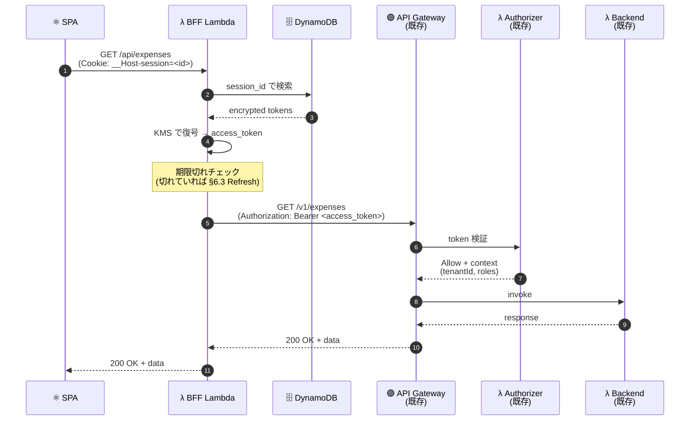
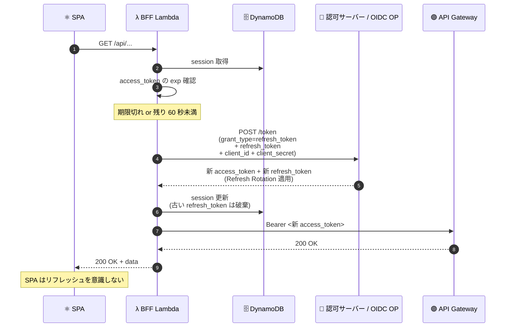
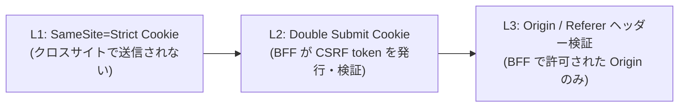
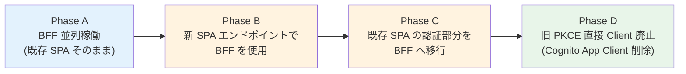
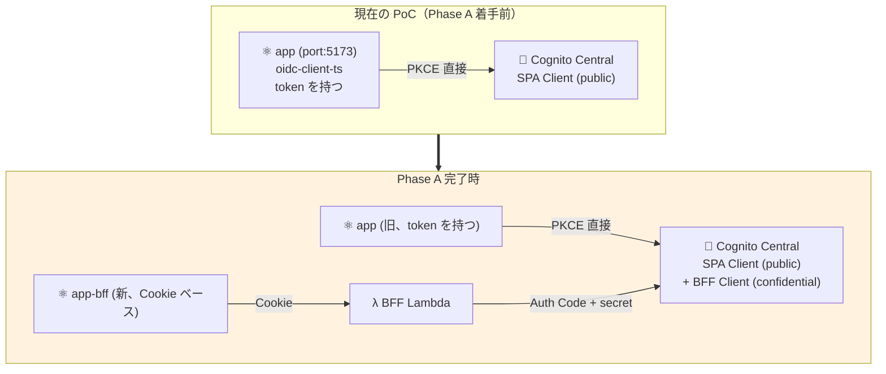
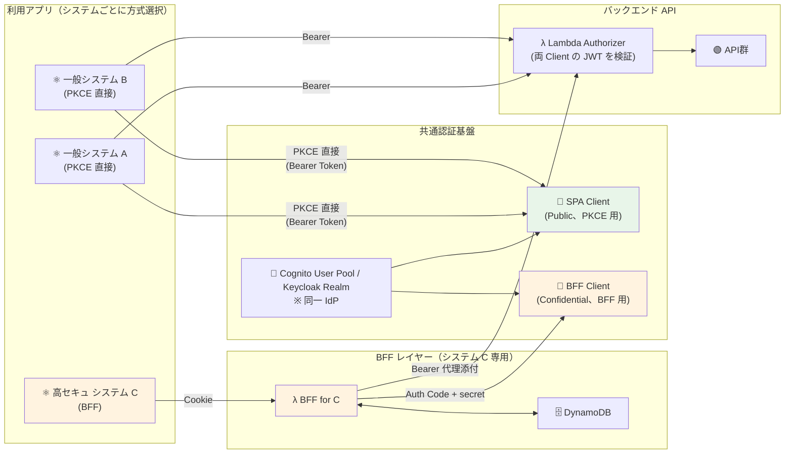
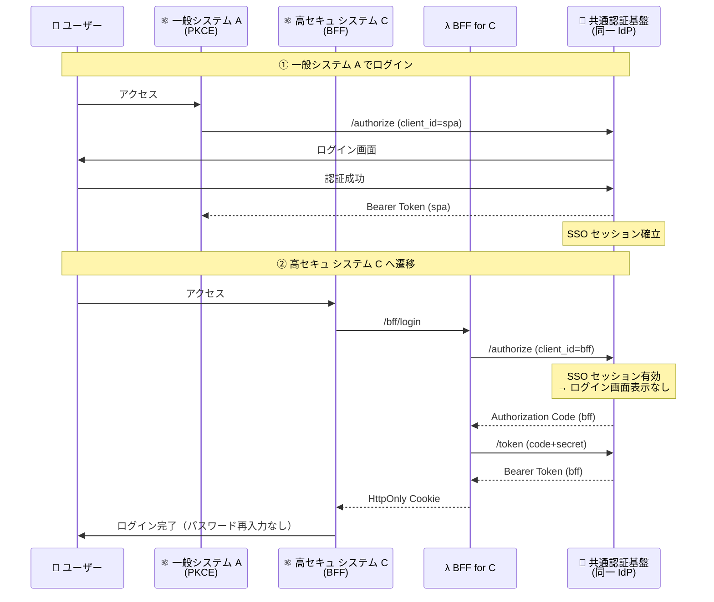
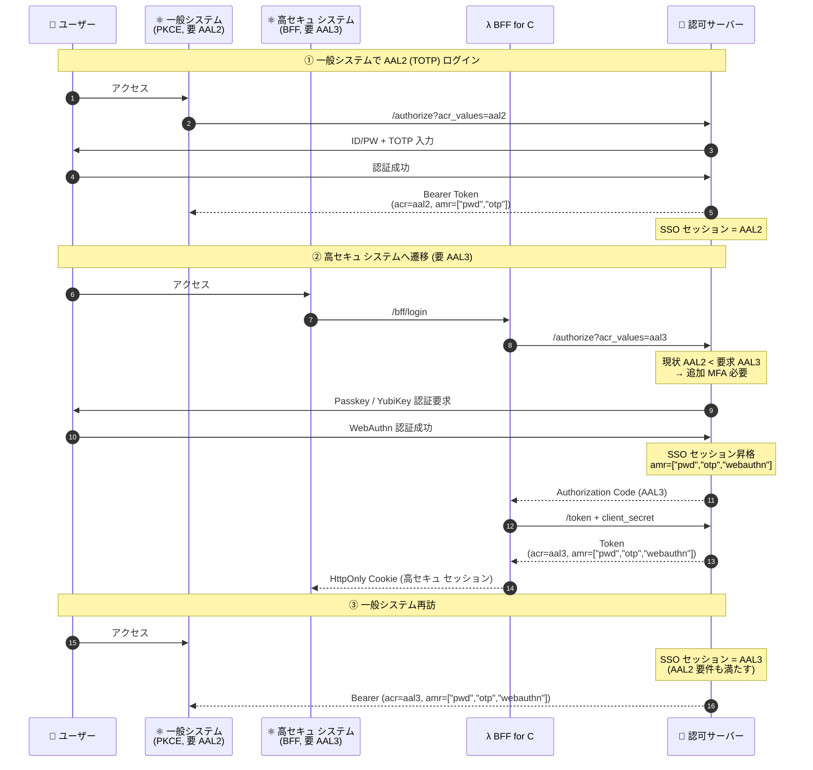

# BFF パターン実装ノート（内部技術メモ）

> 最終更新: 2026-05-14
> 位置付け: **内部技術メモ**。顧客向け説明は [proposal/fr/01-auth.md §FR-1.1](../requirements/proposal/fr/01-auth.md) に最小限のみ記載
> 関連: [auth-patterns.md §2.1](auth-patterns.md)、[authz-architecture-design.md](authz-architecture-design.md)、[architecture.md](architecture.md)、[ADR-014](../adr/014-auth-patterns-scope.md)

---

## 1. はじめに

### 1.1 ドキュメントの目的

SPA 認証で **BFF（Backend-for-Frontend）パターン**を採用する場合の、本基盤における**実装詳細・選定根拠・移行プラン**を整理する内部メモ。顧客向け要件定義資料には方向性のみ記載し、技術的詳細は本ノートに集約する。

### 1.2 BFF パターンとは

OAuth 2.0 / OIDC 仕様**外**の、クライアント側アーキテクチャパターン。**SPA がトークンを直接保持せず、サーバー側（BFF）が代理保持する**ことで、ブラウザ環境の脆弱性（XSS / ストレージ漏洩）から認証情報を守る。

| 項目 | PKCE 直接 SPA | BFF パターン |
|---|---|---|
| Access Token 保管場所 | ブラウザ（メモリ / Storage） | BFF サーバー側 |
| Refresh Token 保管場所 | ブラウザ（Storage） | BFF サーバー側（DB 暗号化） |
| ブラウザ ↔ BFF 認証 | — | **HttpOnly Cookie**（JS 不可触） |
| BFF ↔ 認可サーバー | — | Authorization Code + PKCE + client_secret |
| XSS 耐性 | Token 漏洩リスク | Cookie のみ漏洩、Token は守られる |
| 推奨用途（IETF 2025〜）| 低リスク社内ツール | **gold standard**: 金融 / 医療 / B2B SaaS / 個人情報扱う一般業務 |

### 1.3 業界動向（2026 時点）

- **IETF**: BFF を OAuth for browser-based apps の gold standard として推奨
- **Curity / Duende / Auth0 / WorkOS** など主要ベンダーが BFF を推奨
- **OAuth 2.1**: Implicit / ROPC 削除、Confidential Client にも PKCE 必須 → BFF 採用に追い風

### 1.4 用語整理（重要）

本ドキュメントで Cognito / Keycloak を**「認可サーバー」**と表記しているが、これは OAuth 2.0 仕様用語（Authorization Server）に従ったもの。**「認証サーバー」ではない**点に注意：

| 用語 | 出典 | 意味 | 本ドキュメントでの扱い |
|---|---|---|---|
| **Authorization Server**（認可サーバー）| OAuth 2.0（RFC 6749）| Access Token を発行する主体 | BFF 文脈では**この用語が正式** |
| **OpenID Provider (OP)** | OIDC | Authorization Server を拡張し、ID Token も発行 | 同義として併記可 |
| **Identity Provider (IdP)** | SAML / 汎用 | ユーザー ID を保証する広義の主体 | フェデレーション文脈で多用（[identity-broker-multi-idp.md](identity-broker-multi-idp.md) 等）|
| 認証サーバー | （日本語慣用）| — | 業界正式用語ではないため、本ドキュメントでは使わない |

**Cognito / Keycloak は機能的に 3 つの役割を兼ねる**:
1. **認証（Authentication）**: パスワード検証 / MFA / フェデレーション → 「あなたは誰か」
2. **認可サーバー（Authorization Server）**: OAuth Access Token 発行 → 「あなたに何の権限を委譲するか」
3. **OpenID Provider (OP)**: ID Token 発行 → 認証結果を JWT で表明

→ BFF 文脈では **2 番目の役割（トークン発行）が主な相互作用**なので「**認可サーバー（OIDC Provider）**」と表記する。他ドキュメントとの整合のため、必要に応じて「IdP」「OIDC OP」も併記。

---

## 2. 全体構成

### 2.1 構成図（PoC 構成への追加形）



**重要**: BFF は**既存の PoC 構成に「追加する」レイヤー**。Lambda Authorizer / Backend Lambda はそのまま再利用できる。

---

## 3. Cognito 側の設定

### 3.1 必要な App Client 構成

既存の SPA Client（`generate_secret = false`）に加えて、**BFF 用 Confidential Client を 1 つ追加**する。

```hcl
# infra/cognito.tf に追加
resource "aws_cognito_user_pool_client" "bff" {
  name         = "${var.project_name}-bff"
  user_pool_id = aws_cognito_user_pool.central.id

  # ★ ここが既存 SPA Client との違い
  generate_secret = true

  allowed_oauth_flows                  = ["code"]
  allowed_oauth_flows_user_pool_client = true
  allowed_oauth_scopes                 = ["openid", "profile", "email"]
  supported_identity_providers = var.auth0_enabled ? ["COGNITO", aws_cognito_identity_provider.auth0[0].provider_name] : ["COGNITO"]

  # BFF のコールバック URL
  callback_urls = ["https://app.example.com/bff/callback"]
  logout_urls   = ["https://app.example.com/bff/logout/callback"]

  id_token_validity      = 1   # 1 時間
  access_token_validity  = 1   # 1 時間
  refresh_token_validity = 30  # 30 日

  token_validity_units {
    id_token      = "hours"
    access_token  = "hours"
    refresh_token = "days"
  }

  read_attributes  = ["email", "email_verified", "name", "custom:tenant_id", "custom:roles"]
  write_attributes = ["email", "name", "custom:tenant_id", "custom:roles"]

  enable_token_revocation = true
  explicit_auth_flows     = ["ALLOW_REFRESH_TOKEN_AUTH", "ALLOW_USER_SRP_AUTH"]
}

resource "aws_secretsmanager_secret" "bff_client_secret" {
  name = "${var.project_name}-bff-client-secret"
}

resource "aws_secretsmanager_secret_version" "bff_client_secret" {
  secret_id     = aws_secretsmanager_secret.bff_client_secret.id
  secret_string = aws_cognito_user_pool_client.bff.client_secret
}
```

### 3.2 client_secret の管理

- **Secrets Manager に保管**（Terraform で自動連携、上記参照）
- BFF Lambda は IAM ロール経由で取得（`secretsmanager:GetSecretValue`）
- ローテーション設定可能（Cognito 側で `client_secret` を再生成して Secrets Manager に書き戻す）

---

## 4. Keycloak 側の設定

### 4.1 realm-export.json への追加

```json
{
  "clientId": "auth-poc-bff",
  "name": "Auth PoC BFF",
  "enabled": true,
  "publicClient": false,
  "clientAuthenticatorType": "client-secret",
  "secret": "${BFF_CLIENT_SECRET}",
  "standardFlowEnabled": true,
  "directAccessGrantsEnabled": false,
  "implicitFlowEnabled": false,
  "protocol": "openid-connect",
  "redirectUris": ["https://app.example.com/bff/callback"],
  "webOrigins": ["https://app.example.com"],
  "attributes": {
    "pkce.code.challenge.method": "S256",
    "post.logout.redirect.uris": "https://app.example.com/bff/logout/callback"
  },
  "defaultClientScopes": ["openid", "profile", "email", "roles"]
}
```

### 4.2 Cognito との実装差分

| 観点 | Cognito | Keycloak |
|---|---|---|
| Client 認証方式 | `client_id` + `client_secret`（基本）| `client_secret` / JWT 認証 / mTLS から選択 |
| client_secret ローテーション | Secrets Manager + 手動再生成 | Realm 設定で `Regenerate Secret` ボタン |
| Refresh Token Rotation | デフォルト OFF（要明示設定）| **デフォルト ON** |
| Token Revocation | Refresh のみ | Access / Refresh 両方（RFC 7009）|

→ BFF Lambda コードからは**両者同じ OAuth フローで叩ける**。環境変数で issuer URL と client_id / client_secret を切り替えれば良い（既存 Lambda Authorizer のマルチイシュア対応と同じ思想）。

---

## 5. バックエンド（BFF サーバー）選択肢

### 5.1 4 つの選択肢比較

| 実装 | 適合性 | 月額目安（10K MAU）| Cold Start | 状態管理 | 既存 PoC 親和性 |
|---|:---:|---|:---:|:---:|:---:|
| **Lambda + API Gateway** | ◎ 第一推奨 | $15〜25 | あり（対策可）| DynamoDB | ◎ |
| Lambda Function URL | ○ シンプル版 | $10〜15 | あり | DynamoDB | ○ |
| **ECS Fargate** | ○ ステートフル得意 | $30〜（常時）| なし | Redis or in-process | ◎（Keycloak と同居）|
| EC2 / EKS | △ 既存資産連携時 | $20〜 | なし | 任意 | △ |
| Lambda@Edge | △ グローバル特化 | $15〜 | あり | 制限あり | △ |

### 5.2 推奨：Lambda + API Gateway

**理由**:
- 既存 PoC が Lambda Authorizer / Backend Lambda 構成 → 運用統一
- サーバーレスでスケーラブル
- セッションは DynamoDB（TTL + 暗号化）で完結
- ステージング / 本番の分離が容易

**典型構成**:
```
CloudFront ─ S3(SPA) + APIGW(BFF)/Lambda(BFF) ─ Cognito/Keycloak
                              │
                              ├─ DynamoDB(sessions)
                              ├─ Secrets Manager(client_secret)
                              └─ KMS(暗号化キー)
```

### 5.3 ECS Fargate を選ぶ場合

- Keycloak が既に ECS 上にあるため、**同じクラスタに BFF タスクを追加**できる
- Sticky Session 不要（in-process セッションを避け、Redis 共有）
- ALB のターゲットグループに BFF を追加
- 月額固定費が増えるが、Cold Start ゼロ

---

## 6. 認証フロー詳細

### 6.1 ログインフロー



### 6.2 API 呼び出しフロー



**ポイント**: 既存の Lambda Authorizer / Backend Lambda は**変更不要**。BFF は単に「Authorization ヘッダーを代理添付するプロキシ」。

### 6.3 Refresh Token 自動更新（透過的）



### 6.4 ログアウトフロー（L1〜L4 対応）

```mermaid
sequenceDiagram
    autonumber
    participant U as 👤 ユーザー
    participant SPA as ⚛️ SPA
    participant BFF as λ BFF Lambda
    participant DDB as 🗄️ DynamoDB
    participant Auth as 🔴 認可サーバー / OIDC OP

    U->>SPA: 「ログアウト」クリック
    SPA->>BFF: POST /bff/logout
    BFF->>DDB: session 取得 (refresh_token + id_token)
    BFF->>Auth: POST /revoke<br/>(refresh_token)
    Note over BFF: L2: IdP セッション破棄
    BFF->>Auth: GET /logout<br/>(id_token_hint=<id_token><br/>+ post_logout_redirect_uri)
    BFF->>DDB: session 削除
    BFF-->>SPA: 302 → /authorize の logout endpoint<br/>+ Set-Cookie: __Host-session=; Max-Age=0
    SPA->>Auth: /logout (リダイレクト経由)
    Auth->>Auth: SSO セッション破棄
    Auth-->>SPA: 302 → post_logout_redirect_uri
    SPA->>U: ログアウト完了画面
```

→ proposal §6.1 のログアウトレイヤー L1〜L4 のうち、**L1（Cookie 削除）+ L2（IdP セッション破棄）+ Token Revocation** までを BFF が一元担当。L3（フェデレーション連動）/ L4（Back-Channel）も認可サーバー対応可能なら BFF 経由で実行可。

---

## 7. セッション管理設計

### 7.1 DynamoDB スキーマ

```
Table: bff-sessions
  PK: session_id (UUID v4)
  Attributes:
    encrypted_access_token  (KMS Envelope Encryption)
    encrypted_refresh_token (KMS Envelope Encryption)
    id_token                (公開 claim のみ平文保存)
    user_id                 (sub)
    tenant_id
    roles
    created_at              (epoch sec)
    expires_at              (epoch sec、TTL 属性)
  GSI: user_id-index (管理者強制ログアウト用)
  TTL: expires_at で自動削除
```

### 7.2 暗号化方針

- **KMS Customer Managed Key**（CMK）でデータキー生成 → トークンを暗号化
- BFF Lambda 実行ロールに `kms:Decrypt` / `kms:GenerateDataKey` を付与
- 復号は BFF Lambda 内のみ、ログ出力厳禁
- ローテーション：KMS 自動ローテーション（年次）+ アプリ側の Token Refresh と整合

### 7.3 Cookie 設計

| 属性 | 値 | 理由 |
|---|---|---|
| Name | `__Host-session` | `__Host-` プレフィックスで HTTPS + Path=/ + Domain なし強制 |
| Value | session_id（UUID v4 + HMAC 署名付き）| DynamoDB のキー、改ざん検知 |
| HttpOnly | true | JS から読み取り不可 |
| Secure | true | HTTPS のみ送信 |
| SameSite | Strict | CSRF 攻撃の主要経路を遮断 |
| Path | / | 全パスで送信 |
| Max-Age | 24 時間 | アイドルタイムアウト相当（NFR-SEC-004 / proposal §6.2 と整合）|

### 7.4 CSRF 対策

`SameSite=Strict` で大半は防御できるが、念のため二重防御：



---

## 8. Lambda BFF 実装の注意点

### 8.1 Cold Start 対策

| 対策 | 効果 |
|---|---|
| **ARM Graviton2 (`arm64`)** | x86 比で 20-30% 高速 + 安価 |
| **esbuild で bundle 最小化** | パッケージサイズ 1MB 以下推奨 |
| **モジュールトップで初期化** | Secrets Manager 取得、KMS Client 等は Lambda コンテキスト再利用 |
| **Provisioned Concurrency** | 高頻度認証時のみ（追加コスト）|
| **SnapStart**（Java 系のみ）| Java ランタイム選択時 |

→ 典型的な BFF Lambda の Cold Start：300〜800ms、Warm：30〜100ms。

### 8.2 同時実行 / スループット

- デフォルト 1000 同時実行 / アカウント
- MAU 数万なら余裕、要なら Service Quota 緩和申請
- Reserved Concurrency で他 Lambda への影響を分離

### 8.3 ステートレスとセッション管理

Lambda は実行間で状態を保持しないため、**セッションは DynamoDB が単一情報源**。

⚠ **NG パターン**: Lambda コンテキストの変数にトークンを保持（次の呼び出しで別コンテナに行けば消える）
✅ **OK パターン**: 毎回 DynamoDB から session_id で取得

---

## 9. コスト試算

### 9.1 月額コスト（10K MAU、Lambda 構成）

| リソース | 月額 | 内訳 |
|---|---|---|
| Lambda（BFF）| ~$5 | 10K MAU × 50 req/MAU × 200ms × 256MB |
| DynamoDB（On-Demand）| ~$3 | Read 500K + Write 100K + Storage 1GB |
| API Gateway | ~$10 | 500K req × $3.5/1M |
| KMS | ~$1 | 復号 10K/月 + CMK $1 |
| Secrets Manager | ~$1 | client_secret 1 つ |
| CloudWatch Logs | ~$2 | BFF Lambda ログ |
| **合計** | **~$22/月** | 10K MAU 想定 |

### 9.2 スケーリング

| MAU | 月額 |
|---|---|
| 1,000 | ~$5 |
| 10,000 | ~$22 |
| 100,000 | ~$120 |
| 1,000,000 | ~$1,000 |

→ BFF 自体の月額は MAU に対してスケーラブル（リニアではない）。Cognito MAU 課金（$0.015/MAU フェデレーション）の方が支配的。

### 9.3 既存 PoC からの追加リソース

| 追加 | 用途 |
|---|---|
| Cognito Confidential App Client × 1 | BFF が叩く Client（無料）|
| Lambda 関数 × 1（BFF）| OAuth Agent |
| DynamoDB テーブル × 1 | セッションストア |
| API Gateway × 1（or 既存に Path 追加）| BFF エンドポイント |
| KMS CMK × 1 | トークン暗号化 |
| Secrets Manager × 1 | client_secret 保管 |

既存リソース（Lambda Authorizer / Backend Lambda / Cognito User Pool）は**変更なし**。

---

## 10. 段階移行プラン

### 10.1 全体フェーズ



### 10.2 各フェーズの内容

| Phase | 期間 | 内容 | リスク |
|---|:---:|---|---|
| A | 1-2 週 | BFF Lambda + DynamoDB + Cognito Confidential Client を新規追加。既存 SPA は変更なし | 低（既存に影響なし）|
| B | 1 週 | 新規 SPA エンドポイント / 新規ページから BFF 経由でログイン動作確認。並行運用 | 低（部分検証）|
| C | 2-3 週 | 既存 SPA から `oidc-client-ts` を削除、`fetch(/api/...)` を Cookie ベースに置換 | 中（SPA 側コード変更大）|
| D | 1 週 | 旧 Public App Client を削除 or `enabled=false`。Confidential のみに統一 | 低（フラグオフ）|

### 10.3 PoC 構成での具体例（東京 + Cognito）



---

## 11. 採用判断のフロー

```mermaid
flowchart TB
    Start["プロジェクト開始"]
    Q1{XSS リスク評価<br/>(third-party JS / ユーザー入力 HTML)}
    Q2{扱うデータの機密性}
    Q3{BFF サーバー運用体制<br/>(Lambda 運用ができるか)}
    BFF["BFF 採用<br/>(Lambda + DynamoDB)"]
    PKCE["PKCE 直接<br/>+ XSS 対策強化<br/>(CSP / SRI / Sanitizer)"]
    HYB["ハイブリッド<br/>(高機密パスのみ BFF)"]

    Start --> Q1
    Q1 -->|高 or 不明| BFF
    Q1 -->|低| Q2
    Q2 -->|金融 / 医療 / 個人情報| BFF
    Q2 -->|社内ツール限定| Q3
    Q2 -->|混在| HYB
    Q3 -->|あり| BFF
    Q3 -->|なし| PKCE

    style BFF fill:#fff3e0
    style HYB fill:#fff8e1
    style PKCE fill:#e8f5e9
```

### 11.1 本基盤としての推奨

| 顧客タイプ | 推奨 |
|---|---|
| 金融 / 医療 / 行政 / 個人情報多用 SaaS | **BFF 採用必須** |
| B2B SaaS（一般業務） | **BFF 推奨**（北極星「絶対安全」と整合）|
| 社内ツール / 機密性低 | PKCE 直接でも可、ただし XSS 対策強化 |
| AI Agent / CLI / Mobile | PKCE 直接（Device Code 含む、BFF 不要）|

### 11.2 ハイブリッド運用：システム単位での方式選択

**「基本は PKCE 直接、高セキュリティ要件の特定システムだけ BFF」というハイブリッド運用は技術的に可能**。

#### 11.2.1 技術的可否：可能

共通認証基盤（Cognito User Pool / Keycloak Realm）に **App Client / Client を 2 種類登録**するだけで実現できる。



#### 11.2.2 認可サーバー側の設定

両 Client を並列登録する。

**Cognito**:
```hcl
# 既存（PKCE 用、Public）
resource "aws_cognito_user_pool_client" "spa" {
  name            = "auth-poc-spa"
  generate_secret = false
  ...
}

# 追加（BFF 用、Confidential）
resource "aws_cognito_user_pool_client" "bff" {
  name            = "auth-poc-bff"
  generate_secret = true  # ★
  ...
}
```

**Keycloak**（realm-export.json に両方記載）:
```json
{
  "clients": [
    { "clientId": "auth-poc-spa", "publicClient": true, ... },
    { "clientId": "auth-poc-bff", "publicClient": false, "secret": "...", ... }
  ]
}
```

#### 11.2.3 Lambda Authorizer は両方の JWT を受け入れる

既存 PoC の Lambda Authorizer は `client_id` / `azp` を許可リストで検証する設計（[lambda/authorizer/index.py:202-219](../../lambda/authorizer/index.py)）。両 Client ID を環境変数で許可リストに追加するだけで**両方の方式から発行された JWT を同じ Authorizer が処理**できる。

```python
# 環境変数
COGNITO_CLIENT_ID         = "auth-poc-spa"        # PKCE 用
COGNITO_BFF_CLIENT_ID     = "auth-poc-bff"        # BFF 用（追加）

# 検証時：client_id が ALLOWED_CLIENT_IDS のいずれかなら通す
ALLOWED_CLIENT_IDS = {COGNITO_CLIENT_ID, COGNITO_BFF_CLIENT_ID}
```

→ Backend API も変更不要。**Authorizer の許可リストに 1 件追加するだけ**。

#### 11.2.4 SSO 挙動：両方でセッション共有される

同一 User Pool / Realm 配下なので、**ユーザーが PKCE システムでログイン済なら、BFF システムでも SSO で自動認証**される（逆も同様）。



→ ユーザー視点では **「一度ログインすれば全システム使える」UX を維持**しつつ、システム C のトークンだけは安全に BFF サーバー側で管理される。

#### 11.2.5 ハイブリッド運用の制約と注意点

| 観点 | 制約・注意 |
|---|---|
| **SSO セッション共有のリスク** | XSS で PKCE 側 Token が盗まれても、SSO セッション Cookie で BFF 側 Client への再認証は通る → 共通基盤の認可サーバーまで攻撃者が到達できる |
| **ステップアップ認証で軽減** | 高セキュ システム C 側で「再認証要求」（`prompt=login` / Cognito `auth_session` 再要求 / ACR step-up）を必須化 → PKCE 側で奪取されたセッションでは突破不可 |
| **MFA レベル差をつける場合の注意** | 一般システム = TOTP / 高セキュ システム = Passkey といった**異なる MFA 強度を要求する場合、SSO だけでは弱い方の MFA で全システムに入れてしまう**。**ACR step-up MFA**（§11.2.6）で対応必須。Keycloak の Conditional Flow なら宣言的に実装可、Cognito は自前実装が必要 |
| **`amr` クレームの伝播** | 認証強度（パスワードのみ / TOTP / WebAuthn）は JWT の `amr` クレームに記録される。BFF / Backend 側で `amr` を検査して「弱い MFA セッションでは特定操作を拒否」のロジック実装が可能 |
| **ログアウト連動** | システム A からログアウトしても、BFF システム C はセッション維持する。連動が必要なら **Back-Channel Logout** で BFF にも通知（Keycloak のみ、Cognito 不可） |
| **Token TTL の独立管理** | SPA Client と BFF Client で `access_token_validity` / `refresh_token_validity` を別設定可。高セキュ システム C 側は短く設定するのが推奨 |
| **監査ログ** | CloudTrail で `client_id` 別に分析可能 → どのシステムでどんな認証が行われたか追跡可 |
| **Refresh Token の扱い** | PKCE 側はブラウザに、BFF 側はサーバーに、と分かれる → 漏洩しても影響範囲が独立 |
| **既存 SPA への影響** | なし（既存 SPA は SPA Client を使い続ける、変更不要）|
| **BFF を後付け追加** | 既存運用中に高セキュ システム C だけ後から BFF 化可能。段階的に「BFF 化したいシステム」を増やせる |

#### 11.2.6 ステップアップ認証 / MFA レベル差対応

ハイブリッド運用で **SSO リスクおよび MFA レベル差** に対応する設計パターン。

##### 11.2.6.1 用語整理（OIDC 仕様）

| 用語 | 意味 | 例 |
|---|---|---|
| **AAL** (Authentication Assurance Level) | NIST 定義の認証保証レベル | AAL1 / AAL2 / AAL3 |
| **ACR** (Authentication Context Class Reference) | OIDC の認証コンテキスト識別子 | `urn:mace:incommon:iap:silver` / カスタム値 `aal2`, `aal3` |
| **AMR** (Authentication Methods References) | 実施された認証方法の配列 | `["pwd", "otp"]` / `["pwd", "webauthn"]` |
| **`acr_values`** | クライアントが要求する最低 ACR 値（authorize リクエスト時）| `acr_values=aal3` |
| **`max_age`** | 最終認証からの最大経過秒数（超えたら再認証要求）| `max_age=300` |
| **`prompt=login`** | 強制的に再認証画面を出す | クエリパラメータ |

JWT には認証完了時の認証強度が **`acr`** クレーム（実施された値）と **`amr`** クレーム（手段の配列）として記録される。BFF / Backend はこれを検査することで「**現在のセッションがどの認証強度で確立されたか**」を判定できる。

##### 11.2.6.2 MFA レベル差対応の 3 パターン

| パターン | 説明 | 実装難易度 | UX |
|---|---|:---:|:---:|
| **A. 統一 MFA**（全システム同じレベル）| 全システムで同じ MFA 要件 → SSO で MFA 共有、UX 良好 | ◎ | ◎ |
| **B. ACR step-up MFA**（推奨）| 高セキュ システムが `acr_values` で追加認証要求 → 不足なら IdP が追加 MFA 強制 | Keycloak: 〇 / Cognito: △ | ◎ |
| **C. `prompt=login` 強制**（緊急避難）| 高セキュ システム入室時に毎回再認証 | ◎ | × 悪化 |

##### 11.2.6.3 パターン B（ACR step-up）の典型フロー



→ ユーザーは「TOTP のみで一般システムに入った後、決済画面へ遷移して Passkey で追加認証」という自然な UX。SSO セッションは AAL3 に**昇格**するので、以降の一般システム再訪では再認証なし。

##### 11.2.6.4 Cognito / Keycloak の対応差

| 機能 | Cognito | Keycloak |
|---|---|---|
| `acr_values` 標準対応 | ⚠ User Pool での公式サポート限定的 | ✅ ネイティブ対応 |
| ACR ベース step-up MFA | ⚠ **Lambda + Custom Auth Challenge で自前実装** | ✅ **Authentication Flow + LoA Condition** で宣言的 |
| `prompt=login` 強制再認証 | ✅ | ✅ |
| `max_age` パラメータ | ✅ | ✅ |
| `amr` クレーム発行 | ✅（標準）| ✅（標準）|
| `acr` クレーム発行 | ⚠ カスタム要 | ✅（Authentication Flow 出力に含まれる）|

→ **MFA ステップアップが要件なら Keycloak が圧倒的に楽**。Cognito の場合は Pre Token Lambda + Custom Auth Challenge で自前実装が必要。

##### 11.2.6.5 Keycloak の Conditional Flow 実装例（参考）

Keycloak の Authentication Flow で AAL3 ステップアップを実装する場合の構造：

```
Browser Flow:
├── Cookie (既存セッション使用可)
├── Identity Provider Redirector
├── Forms (パスワード + TOTP) → acr=aal2 を付与
└── Conditional - User Configured (Subflow)
    └── Condition - Level of Authentication
        ├── If client requests acr=aal3 AND current acr<aal3
        │   └── WebAuthn Authenticator (REQUIRED)
        │       → acr=aal3 に昇格
        └── Otherwise: pass through
```

→ ユーザーが既に AAL2 セッションを持っていて AAL3 要求が来た場合のみ、WebAuthn を強制する。

##### 11.2.6.6 Cognito での実装パス（参考）

Cognito の場合の代替実装：

1. **`prompt=login` で毎回再認証**（最もシンプル、UX 犠牲）
2. **`max_age` で短時間（例: 5 分）以内の再認証を要求**（ACR の代替）
3. **Custom Auth Challenge Lambda**（高度実装）
   - DEFINE_AUTH_CHALLENGE Lambda で要求 ACR を判定
   - CREATE_AUTH_CHALLENGE で WebAuthn チャレンジ発行
   - VERIFY_AUTH_CHALLENGE で検証
   - Pre Token Lambda で `acr` / `amr` クレームを JWT に注入

→ **Cognito で本格的な ACR step-up を実装するのは工数が大きい**。要件として MFA レベル差が必須なら、Keycloak 採用または既存システムは諦めて全 AAL3 統一の判断もあり得る。

##### 11.2.6.7 proposal §FR-3 との整合

ハイブリッド運用での MFA レベル差対応は、以下の proposal §FR-3 内容と整合する設計の延長：

- [proposal §FR-3.0 用語整理](../requirements/proposal/fr/03-mfa.md): AAL1/2/3 の定義
- [proposal §FR-3.2 MFA 適用ポリシー](../requirements/proposal/fr/03-mfa.md): 条件付き MFA / ロール単位強制
- [proposal §FR-2.2.3 MFA 重複回避](../requirements/proposal/fr/02-federation.md): 外部 IdP の `amr` クレーム尊重

→ フェデユーザーの MFA 重複回避（外部 IdP の `amr` 信頼）と、ハイブリッド運用の MFA step-up（自基盤の `amr` 検査 + `acr_values` 要求）は**同じ `amr`/`acr` 仕組みを使う**。実装の一貫性が保てる。

##### 11.2.6.8 採用判断の指針

| 状況 | 推奨パターン |
|---|---|
| 全システム同じ MFA レベル要求（一般的な企業内）| **A. 統一 MFA** |
| 一般システム + 高セキュ システム混在（金融の一部画面、決済等）| **B. ACR step-up MFA**（Keycloak 推奨）|
| 既存 Cognito 構成で MFA レベル差を急ぎ実装 | C. `prompt=login` 強制（暫定対応）|
| 完全に別 MFA セッションにしたい（システム間完全分離）| Pool/Realm 分離（B 案: テナント別分離、[§FR-2.3.A](../requirements/proposal/fr/02-federation.md) 参照）|

#### 11.2.7 採用判断の指針

| 状況 | 推奨 |
|---|---|
| 1 つの組織内で「セキュリティレベルの異なる複数システム」を運用 | **ハイブリッド推奨**（システム単位選択）|
| 全システムが同程度のセキュリティ要件 | 全 PKCE か 全 BFF（統一）|
| 既存 PKCE システム多数 + 1〜2 新規高セキュシステム | **ハイブリッド推奨**（既存は触らず、新規だけ BFF）|
| 段階的に PKCE → BFF 移行したい | **ハイブリッド経由**（並列稼働 → 順次切替）|

→ **本基盤として「ハイブリッド運用も標準サポート」と位置付ける**ことで、顧客企業の多様なシステム要件に柔軟に対応できる。

#### 11.2.8 PoC への組み込み

```hcl
# infra/cognito.tf に BFF Client 追加（既存 SPA Client はそのまま）
resource "aws_cognito_user_pool_client" "bff" {
  name            = "${var.project_name}-bff"
  user_pool_id    = aws_cognito_user_pool.central.id
  generate_secret = true
  # ... §3 と同様
}

# infra/api-gateway.tf の Lambda 環境変数に追加
resource "aws_lambda_function" "authorizer" {
  environment {
    variables = {
      COGNITO_CLIENT_ID     = aws_cognito_user_pool_client.spa.id   # 既存
      COGNITO_BFF_CLIENT_ID = aws_cognito_user_pool_client.bff.id   # 追加
      # ...
    }
  }
}
```

Lambda Authorizer 側（[lambda/authorizer/index.py](../../lambda/authorizer/index.py)）は `ALLOWED_ISSUERS` の各 issuer 設定で複数 client_id を許可するよう拡張（または `client_id` を配列で許可リスト化）。

---

## 12. プラットフォーム比較

| 観点 | Cognito + BFF | Keycloak + BFF |
|---|---|---|
| Confidential Client 設定 | App Client `generate_secret=true` | `publicClient: false` |
| client_secret ローテーション | Cognito Console 手動 → Secrets Manager 書き戻し | Realm Console `Regenerate Secret` |
| Refresh Token Rotation | **デフォルト OFF**（要明示設定）| **デフォルト ON** |
| Token Revocation API | Refresh のみ | Access / Refresh 両方（RFC 7009） |
| 認証フローのカスタマイズ | Pre Token Lambda V2 | Authentication Flow + SPI |
| BFF Lambda 実装差 | 環境変数で issuer URL / scope を切替 | 同左 |
| PoC への組み込み難易度 | ◎（既存 Cognito 構成に追加）| ◎（既存 Keycloak 構成に追加）|

→ **どちらの認可サーバーでも同一の BFF Lambda コードで動作**（`KEYCLOAK_ISSUER` / `COGNITO_USER_POOL_ID` 等を環境変数化）。

---

## 13. PoC 拡張の優先順位

要件定義で BFF 採用が固まった場合の検証順序：

| 優先度 | タスク | 目的 |
|---|---|---|
| 1 | Cognito Confidential App Client + Lambda BFF（最小実装）| Phase A 検証 |
| 2 | DynamoDB セッションストア + KMS 暗号化 | プロダクションレディ化 |
| 3 | Keycloak Confidential Client + 同 BFF Lambda コードで動作確認 | プラットフォーム非依存性検証 |
| 4 | Refresh Token Rotation 検証（Cognito 明示設定）| セキュリティ強化 |
| 5 | ログアウトフロー（Token Revocation + RP-Initiated Logout）| L1〜L2 確実な伝播 |
| 6 | CSRF 対策（Double Submit Cookie）| 完成度向上 |

---

## 14. 参考資料

### OAuth 2.1 / BFF 仕様
- [OAuth 2.1 - oauth.net](https://oauth.net/2.1/)
- [draft-ietf-oauth-v2-1-15](https://datatracker.ietf.org/doc/draft-ietf-oauth-v2-1/)
- [OAuth 2.0 for Browser-Based Apps (BCP)](https://datatracker.ietf.org/doc/html/draft-ietf-oauth-browser-based-apps)

### BFF 実装ガイド
- [Securing SPAs with BFF Pattern - Duende](https://duendesoftware.com/blog/20210326-bff)
- [BFF Security Framework - Duende](https://docs.duendesoftware.com/bff/)
- [The Backend for Frontend Pattern - Auth0](https://auth0.com/blog/the-backend-for-frontend-pattern-bff/)
- [Token Handler Pattern - Curity](https://curity.io/resources/learn/token-handler-overview/)
- [SPA Best Practices - Curity](https://curity.io/resources/learn/spa-best-practices/)

### AWS 実装パターン
- [Serverless BFF Pattern with AWS Lambda](https://awsforengineers.com/blog/serverless-bff-pattern-with-aws-lambda/)
- [Protect public clients for Amazon Cognito - AWS Security Blog](https://aws.amazon.com/blogs/security/protect-public-clients-for-amazon-cognito-by-using-an-amazon-cloudfront-proxy/)
- [Backend-for-Frontend with Cognito - aws-samples](https://github.com/aws-samples)

### Cognito / Keycloak
- [Cognito User Pool Confidential Client](https://docs.aws.amazon.com/cognito/latest/developerguide/user-pool-settings-client-apps.html)
- [Keycloak Confidential Client Discussion](https://github.com/keycloak/keycloak/discussions/22334)
- [Keycloak BFF Pattern - Skycloak](https://skycloak.io/blog/keycloak-backend-for-frontend-bff-pattern/)

### NIST AAL / ACR / AMR（ステップアップ認証）
- [NIST SP 800-63B Rev 4 Digital Identity Guidelines](https://pages.nist.gov/800-63-4/sp800-63b.html)
- [OIDC Core 1.0 §3.1.2.1 acr / amr](https://openid.net/specs/openid-connect-core-1_0.html#AuthRequest)
- [OIDC Core 1.0 §2 ID Token Claims (acr / amr)](https://openid.net/specs/openid-connect-core-1_0.html#IDToken)
- [RFC 8176 - Authentication Method Reference Values (amr)](https://www.rfc-editor.org/rfc/rfc8176)
- [Keycloak Step-up Authentication 公式](https://www.keycloak.org/docs/latest/server_admin/index.html#_step-up-flow)
- [Keycloak Level of Authentication (LoA)](https://www.keycloak.org/docs/latest/server_admin/index.html#_step-up-flow)
- [Cognito Custom Auth Challenge Lambda Triggers](https://docs.aws.amazon.com/cognito/latest/developerguide/user-pool-lambda-challenge.html)
