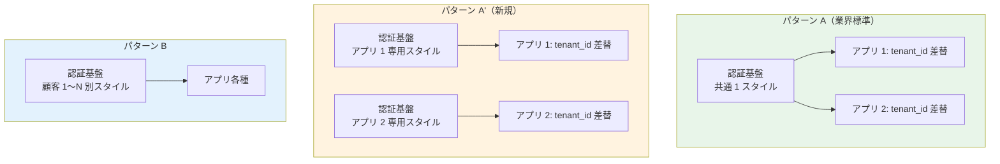
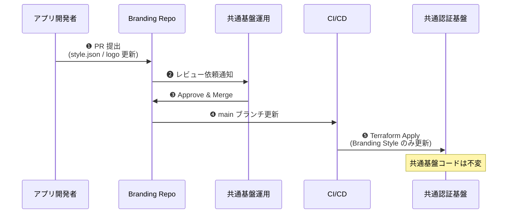
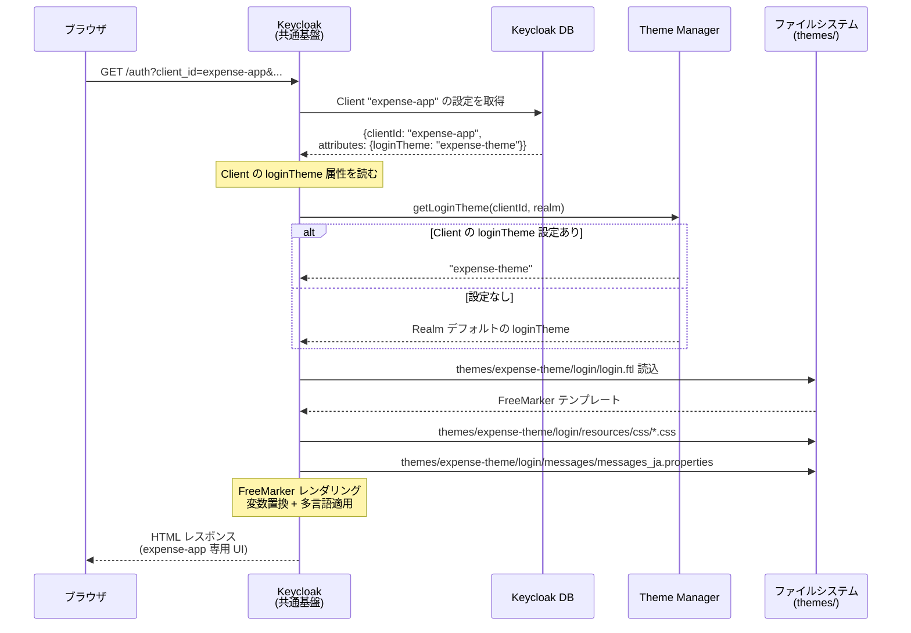

# ブランディング戦略の調査証跡（内部技術メモ）

> 最終更新: 2026-05-20  
> 位置付け: **内部技術メモ**。顧客向け説明は [proposal/fr/02-federation.md §FR-2.3.3.A](../requirements/proposal/fr/02-federation.md) を参照  
> 関連: [proposal/fr/08-admin.md §FR-8.3.A](../requirements/proposal/fr/08-admin.md)、[hearing-checklist.md A-11](../requirements/hearing-checklist.md)

---

## 1. ドキュメントの目的

A-11 ブランディング基本方針合意（パターン A / A' / B / C）の **技術的根拠を公式ソース引用付きで記録**する。本基盤プロジェクトでの設計判断・顧客対話・実装方針の根拠資料として参照される。

特に **「アプリ単位（client_id ベース）のログイン画面カスタマイズ」が技術的に可能** であることを公式ドキュメントで裏付け、A-11 の選択肢として **パターン A' を追加した経緯**を残す。

---

## 2. ブランディング戦略の 4 パターン

### 2.1 全体像

| パターン | カスタマイズ単位 | 認証基盤側設定 | アプリ側責務 | 業界実例 |
|:---:|---|---|---|---|
| **A** | テナント単位（アプリ側のみ） | 共通標準 | `tenant_id` クレーム解釈で動的差替 | Slack / Notion / Microsoft 365 / Auth0 標準 |
| **A'**（新規）| **アプリ単位（認証基盤）+ テナント単位（アプリ側）** | App Client / Client 単位 Branding | テナント別動的差替（A と同じ） | Auth0 Universal Login / Microsoft Entra App Registration / Cognito Managed Login |
| **B** | テナント単位（認証基盤側） | テナント単位 Branding | アプリ画面側もカスタマイズ | Auth0 Private Cloud / Okta Brands |
| **C** | テナント単位（完全分離） | 顧客別 Pool/Realm 分離 | アプリ画面側も顧客別 | Auth0 Enterprise Connections / Entra GCC |

### 2.2 主な違い



---

## 3. パターン A'（アプリ単位）の技術的根拠

### 3.1 Cognito - App Client 単位 Branding Style

#### 公式ドキュメントの引用

[**AWS Cognito 公式 - Apply branding to managed login pages**](https://docs.aws.amazon.com/cognito/latest/developerguide/managed-login-branding.html):

> "With managed login and the hosted UI, **your user pool can have a style for each app client. Each app client can have a distinct branding style**, but a user pool domain serves either managed login or the hosted UI."

[**AWS Cognito 公式 - The branding editor and customizing managed login**](https://docs.aws.amazon.com/cognito/latest/developerguide/managed-login-brandingeditor.html):

> "**You can assign styles to the app clients in a user pool** where a domain is set to the managed login branding version. Styles are a set of visual settings made up of image files, display options, CSS values. **When you assign a style to an app client, Amazon Cognito immediately pushes your updates to your user-interactive login pages**."

[**AWS Cognito API Reference - CreateManagedLoginBranding**](https://docs.aws.amazon.com/cognito-user-identity-pools/latest/APIReference/API_CreateManagedLoginBranding.html):

> "The `CreateManagedLoginBranding` API creates a new set of branding settings for a user pool style and **associates it with an app client**."

#### 設定方法

| 手段 | 内容 |
|---|---|
| **AWS Console（Branding Editor）** | ノーコードビジュアル編集、ライト/ダークモード、ロゴ、配色、ヘッダー/フッター、フォーム要素の個別 UI 全カスタマイズ |
| **API**（`CreateManagedLoginBranding`） | プログラマブルに App Client へ Style 割当 |
| **AWS CLI**（`create-managed-login-branding`）| CI/CD パイプライン統合 |
| **CloudFormation**（`AWS::Cognito::ManagedLoginBranding`） | IaC で管理 |

#### 制約

| 項目 | 値 | 出典 |
|---|---|---|
| **Branding Style 上限** | **20 / User Pool（Hard Limit）** | [Quotas in Amazon Cognito](https://docs.aws.amazon.com/cognito/latest/developerguide/limits.html) - "Managed login branding styles per user pool" |
| **App Client 上限** | 1,000 既定 / 10,000 最大（Soft）| 同上 - "App clients per user pool" |
| **必要ティア** | **Essentials または Plus**（Lite 不可）| [Cognito Feature Plans](https://docs.aws.amazon.com/cognito/latest/developerguide/cognito-sign-in-feature-plans.html) |
| **対応 UI** | **Managed Login のみ**（Classic Hosted UI は CSS + ロゴのみ）| [Customizing hosted UI (classic) branding](https://docs.aws.amazon.com/cognito/latest/developerguide/hosted-ui-classic-branding.html) |

### 3.2 Keycloak - Client 単位 Login Theme Override

#### 公式ドキュメントの引用

[**Keycloak 公式 - Working with themes**](https://www.keycloak.org/ui-customization/themes):

> "By default the theme configured for the realm is used, **with the exception of clients being able to override the login theme**."

[**Keycloak Server Developer Guide - Themes**](https://www.keycloak.org/docs/latest/server_development/index.html#_themes):

> "The Theme Selector SPI can be used to select a different theme based on a custom logic. This could be used to **select different themes for desktop and mobile devices** by looking at the user agent header, or based on the client requesting authentication."

#### 設定方法

```
Admin Console
  > Clients
    > [Client]
      > Settings
        > Theme Settings
          > Login Theme: <custom-app-theme>
```

または Realm Export JSON で:
```json
{
  "clientId": "expense-app",
  "attributes": {
    "loginTheme": "expense-custom-theme"
  }
}
```

#### Theme Selector SPI による高度な選択

カスタム Java 実装で、以下の条件に基づいて動的に Theme 選択可能:
- `client_id` パラメータ
- `state` パラメータ
- User Agent（モバイル / デスクトップ）
- IP アドレス / 地理
- Client 属性

```java
public class CustomThemeSelectorProviderFactory implements ThemeSelectorProviderFactory {
    @Override
    public ThemeSelectorProvider create(KeycloakSession session) {
        return new CustomThemeSelectorProvider(session);
    }
}

public class CustomThemeSelectorProvider implements ThemeSelectorProvider {
    @Override
    public String getThemeName(Theme.Type type) {
        // client_id / state / user agent から動的に Theme 選択
        return determineTheme(session);
    }
}
```

#### 制約

| 項目 | 値 |
|---|---|
| **Theme 数上限** | **制限なし** |
| **Client 数上限** | **制限なし**（[§5.A.2](platform-architecture-patterns.md) 参照）|
| **Override 範囲** | Login Theme は完全 Override / Account Theme は Realm 設定が支配 |
| **実装コスト** | カスタム Theme: FreeMarker + CSS（中）/ Theme Selector SPI: Java 実装（中〜高）|

---

## 4. 業界実例

### 4.1 主要 IdaaS のアプリ単位 Branding 対応

| サービス | アプリ単位 Branding | 実装方法 | 出典 |
|---|:---:|---|---|
| **Auth0 Universal Login** | ✅ | Application 単位で別 Branding Page 設定 | [Auth0 Docs - Universal Login](https://auth0.com/docs/customize/login-pages/universal-login) |
| **Microsoft Entra ID** | ✅ | App Registration 単位でロゴ・ブランディング設定 | [Microsoft Learn - Customize branding](https://learn.microsoft.com/en-us/entra/fundamentals/customize-branding) |
| **Okta** | ✅ | Sign-in Widget の Application 単位カスタマイズ + Brands 機能 | [Okta Developer - Customizing themes](https://developer.okta.com/docs/guides/customize-themes/) |
| **AWS Cognito Managed Login** | ✅ | App Client 単位で別 Branding Style | 上記 3.1 参照 |
| **Keycloak** | ✅ | Client 単位で Login Theme Override | 上記 3.2 参照 |
| **Ping Identity** | ✅ | Application 単位の theme | [Ping Docs](https://docs.pingidentity.com/) |

→ **業界主流の手法であり、本基盤での採用に技術的障壁はない**。

### 4.2 「アプリ単位 + テナント単位」併用の典型ケース

| サービス | パターン | 内容 |
|---|---|---|
| **Slack Enterprise Grid** | パターン A' 相当 | Workspace（アプリ）× Organization（テナント）の 2 軸 |
| **Microsoft 365** | パターン A' 相当 | App（Outlook/Teams 等）× Tenant の 2 軸 |
| **Auth0** | パターン A' 相当 | Application × Organization の 2 軸 |

---

## 5. パターン A' の採用判断（本基盤での適用）

### 5.1 採用メリット

1. **アプリ間の体験差別化**: 「経費精算」と「決済管理」で全く異なるブランド・配色・UI 要素を提供可能
2. **顧客別カスタマイズは引き続きアプリ側で**: A と同じ仕組み、テナント数は無制限
3. **URL 肥大化なし**: アプリ数 × 用途数（5-10 アプリ × 5-10 URL = 50 URL 程度）で Cognito 100 URL Hard Limit 内に十分収まる
4. **業界主流の手法**: 顧客への説明が容易（Auth0 / Entra の事例を引用可能）

### 5.2 採用注意点

1. **Cognito 採用時の制約**: Branding Style 20 上限 → アプリ 20 個までは個別 Branding 可、それ以上は共通化必要
2. **必要ティア**: Cognito Essentials または Plus（Lite 不可）
3. **管理工数**: アプリ追加時に Branding Style も追加管理が必要（Terraform / IaC 化で軽減可能）
4. **設計の一貫性**: 「ログイン画面はアプリ別 / アプリ画面は顧客別」という二重軸を顧客アプリチームに正確に伝える必要

### 5.3 採用すべきシナリオ

| シナリオ | パターン A' 採用判断 |
|---|:---:|
| 対象システム 5-10 個、いずれも異なるブランドを持つ業務系 | ✅ **強く推奨** |
| 対象システム 5-10 個、全社共通ブランド | △ パターン A で十分 |
| 対象システム 20+ 個 | △ Cognito 上限注意、Keycloak 推奨 |
| 顧客企業向け SaaS（B2B）でアプリも単一 | △ パターン A で十分 |
| 内部業務系 + 顧客向けの混在 | ✅ **推奨**（顧客向けと内部で別ブランド）|

---

## 6. 認証前後の識別子の違い（重要な技術ポイント）

A-11 のパターン A / A' を理解する上で **「認証前」と「認証後」で利用可能な識別子が異なる**点が重要。

### 6.1 認証前（ログイン画面表示時）

```
Client → /authorize?client_id=expense-app&...
        ↓
認証基盤: client_id パラメータを受け取り
        ↓ Branding Style 選択（client_id ベース）
ログイン画面表示
```

**利用可能な識別子**:
- `client_id` パラメータ（OAuth 標準、必須）
- `state` パラメータ（任意、CSRF 対策で必須）
- `redirect_uri` パラメータ
- `scope` パラメータ
- User Agent

**❌ 利用不可**: JWT クレーム（まだ発行されていない）

### 6.2 認証後（アプリ画面）

```
認証基盤 → JWT 発行 (tenant_id, azp, client_id, ...)
        ↓
アプリ: JWT 検証 + クレーム解釈
        ↓ ロゴ・配色を tenant_id ベースで動的差替
アプリ画面表示
```

**利用可能な識別子**:
- JWT クレーム: `tenant_id` / `azp` / `client_id` / `sub` 等
- セッション情報

→ **「ログイン画面のアプリ単位カスタマイズ」は `client_id` ベース**、**「アプリ画面のテナント別カスタマイズ」は JWT クレームベース**。両者を組み合わせるのが パターン A'。

---

## 7. パターン A' の実装サンプル

### 7.1 Cognito での実装

```bash
# Branding Style 作成（アプリごと）
aws cognito-idp create-managed-login-branding \
  --user-pool-id us-east-1_EXAMPLE \
  --client-id expense-app-client-id \
  --assets file://expense-branding-assets.json \
  --settings file://expense-branding-settings.json

aws cognito-idp create-managed-login-branding \
  --user-pool-id us-east-1_EXAMPLE \
  --client-id payment-app-client-id \
  --assets file://payment-branding-assets.json \
  --settings file://payment-branding-settings.json
```

```hcl
# Terraform 例
resource "aws_cognito_managed_login_branding" "expense" {
  user_pool_id = aws_cognito_user_pool.main.id
  client_id    = aws_cognito_user_pool_client.expense.id
  
  settings = jsonencode({
    "categories": {
      "global": { "colorMode": "DYNAMIC" }
      "form": { "logoUrl": "https://example.com/expense-logo.png" }
    }
  })
}
```

### 7.2 Keycloak での実装

```bash
# Theme 配置
themes/
  expense-theme/
    login/
      theme.properties
      login.ftl
      resources/css/login.css
      resources/img/expense-logo.png
  payment-theme/
    login/
      ...

# Client 設定（Terraform 例）
resource "keycloak_openid_client" "expense" {
  realm_id    = keycloak_realm.main.id
  client_id   = "expense-app"
  login_theme = "expense-theme"
}

resource "keycloak_openid_client" "payment" {
  realm_id    = keycloak_realm.main.id
  client_id   = "payment-app"
  login_theme = "payment-theme"
}
```

---

## 7.A カスタマイズレベル別マトリクス（L1〜L8）

「ロゴ・配色だけでなく配置まで」というカスタマイズ要望には、レベル別の制約があります。

| Lv | カスタマイズ内容 | Cognito Managed Login Branding | Keycloak Theme | Cognito Custom UI (SDK) |
|:---:|---|:---:|:---:|:---:|
| **L1** | 見た目（ロゴ・色・フォント・影・ボーダー半径）| ✅ | ✅ | ✅ |
| **L2** | スペーシング・間隔（要素間スペース、パディング、マージン）| ✅ | ✅ | ✅ |
| **L3** | 要素位置の選択（ロゴ位置: Header or Form 内、フォーム水平配置）| **✅ 限定的**（事前定義された選択肢のみ） | ✅ 自由 | ✅ 自由 |
| **L4** | テキスト・文言の変更（ラベル変更、メッセージ変更）| **❌ 不可**（多言語パラメータのみ。AWS 公式: "You can't modify or localize text"）| ✅ messages.properties | ✅ |
| **L5** | 要素の追加・削除（新規ボタン / リンク / 説明文）| **❌ 不可** | ✅ | ✅ |
| **L6** | 要素の並び順変更（フォームと外部 IdP ボタンの順序変更等）| **❌ 不可** | ✅ | ✅ |
| **L7** | HTML 構造の完全自由書き換え | **❌ 不可** | ✅ FreeMarker `.ftl` | ✅ 完全自前実装 |
| **L8** | カスタム JS / 動的挙動・独自バリデーション | **❌ 不可** | ✅ | ✅ |

### 公式ソース引用（Cognito の L4 制約）

[**AWS Cognito 公式 - Branding Editor**](https://docs.aws.amazon.com/cognito/latest/developerguide/managed-login-brandingeditor.html):

> "You **can't modify or localize text** in the branding editor. Instead, add a `lang` query parameter to the URL that you distribute to users."

### 公式ソース引用（Cognito の L5-L8 制約 / AWS re:Post）

[**AWS re:Post - Add CSS selectors to Cognito Managed Login Branding**](https://repost.aws/questions/QUhT7w5bHzR7Obr6MUak9oGA/add-css-selectors-to-cognito-managed-login-branding):

> "The Managed Login Branding editor allows you to customize the visual style such as colors, fonts, logos, and some component styles **but it does not support adding custom HTML attributes or stable CSS selectors** to individual input fields."

> "Additionally, **the CSS selectors in the managed login UI are often auto-generated and subject to change**"

### Cognito での Custom UI 切替判断

L4-L8 のカスタマイズが必要な場合、Cognito では Managed Login Branding を使うことができず、**Custom UI（SDK 経由 / カスタム実装）に切り替え** する必要があります:

| 項目 | Cognito Managed Login | Cognito Custom UI（SDK） |
|---|:---:|:---:|
| カスタマイズ自由度 | L1-L3 限定 | ✅ 完全自由（L1-L8） |
| ホスティング | AWS マネージド | ⚠ 自前必要（S3 + CloudFront 等） |
| スケーリング | AWS 透過 | ⚠ 自前管理 |
| 脅威保護（reCAPTCHA / Adaptive Auth）| ✅ Managed Login 経由で利用可 | ⚠ Cognito API 経由は使える、UI 統合は自前 |
| 実装コスト | 軽（Branding Editor）| **高**（数人月の SPA 実装）|
| 必要 ティア | Essentials+ | 全ティア OK |

### Keycloak Theme の優位性

L4-L8 全てに対応:
- L4: `messages.properties` で文言・多言語変更
- L5-L7: FreeMarker テンプレート（`login.ftl` 等）で HTML 完全カスタマイズ
- L8: カスタム JS / CSS を `resources/` に配置

実装コストは **中**（1-2 人月程度の Theme 開発）。

---

## 7.B カスタム UI を「アプリ側に寄せる」選択肢

L4-L8 のカスタマイズが必要なアプリが出てきた場合、**そのアプリ単独でアプリ側に Custom UI を寄せる**選択肢があります。これは共通基盤のリリース変更を回避できる重要な逃げ道です。

### 技術的に可能な手段

#### Cognito の場合

| 手段 | 内容 | OAuth フロー |
|---|---|---|
| **InitiateAuth API（USER_PASSWORD_AUTH）** | アプリが自前 UI で ID/PW 入力 → Cognito API へ直接送信 → トークン取得 | OAuth 標準フローから外れる |
| **InitiateAuth API（USER_SRP_AUTH）** | SRP プロトコルでパスワードハッシュ送信 | 同上、ただしより安全 |
| **InitiateAuth API（CUSTOM_AUTH）**| Custom Auth Challenge Lambda + アプリ側 UI で独自フロー | 完全カスタマイズ可能 |
| **Cognito SDK 利用**（amazon-cognito-identity-js 等）| SDK が裏で InitiateAuth を呼ぶ | アプリ側はライブラリで簡略化 |

#### Keycloak の場合

| 手段 | 内容 | OAuth フロー |
|---|---|---|
| **Direct Access Grants**（Resource Owner Password Credentials Grant）| アプリが自前 UI → Token Endpoint へ ID/PW を直接 POST | **非推奨**（OAuth 2.1 で削除予定） |
| **CIBA**（Client-Initiated Backchannel Authentication, OIDC 拡張）| バックエンド経由で認証要求 → ユーザー端末に通知 → 承認 | 標準準拠、SCA 等で利用 |

### 重大なトレードオフ

「アプリ側カスタム UI + API 直叩き」のアプローチには **OAuth/OIDC の利点を大きく損なう**トレードオフがあります:

| 観点 | 標準フロー（Managed UI / Hosted UI）| アプリ側カスタム UI |
|---|:---:|:---:|
| **SSO 機能** | ✅ 同 Pool/Realm 内で自動 SSO | ❌ **不可**（認証基盤の Cookie が使えない）|
| **MFA / Passkey** | ✅ 認証基盤 UI が処理 | ⚠ アプリ側で実装必要、UX 劣化 |
| **パスワードの取り扱い** | ✅ 認証基盤のドメインで完結 | ⚠ **アプリのドメインを通る**（漏洩リスク増）|
| **フェデレーション（外部 IdP）** | ✅ 認証基盤が処理 | ⚠ アプリ側で Auth Code Flow と併用が必要 |
| **OAuth 2.1 準拠** | ✅ Auth Code + PKCE 標準 | ❌ Direct Grant は OAuth 2.1 で削除予定 |
| **脅威保護** | ✅ Cognito Plus / Keycloak の保護機能利用可 | ⚠ 自前実装 |
| **業界ベストプラクティス** | ✅ IETF / Curity / Auth0 推奨 | ❌ アンチパターン |

→ **「アプリ側カスタム UI に寄せる」は技術的に可能だが、SSO / セキュリティ / 標準準拠を犠牲にする**。

### 採用判断

| シナリオ | 推奨 |
|---|---|
| **大多数のアプリ（5-20 個）の L1-L3 カスタマイズ** | パターン A'（認証基盤側 Branding）|
| **特殊アプリ 1-2 個で L4-L8 完全カスタマイズが必要** | **そのアプリのみ Custom UI（SDK 経由）+ アプリ側完結** ※ SSO を諦める or 別 App Client で隔離 |
| **全アプリで L4-L8 必要** | **Keycloak Theme**（共通基盤で対応可、SSO 維持）|
| **顧客の自社プロダクトとの完全統合**（コンシューマー向け B2C） | **Cognito Custom UI**（B2C で SSO が不要な場合）|

### 共通基盤の運用負荷を軽減する設計上の工夫（IaC / GitOps）

懸念「リリースのたびに共通基盤に変更が入って迷惑」への対応:

#### 設計原則

1. **共通基盤コードと Branding 設定の分離**: 共通基盤の Terraform module / Lambda コード本体には変更を入れず、**Branding Style 設定のみを別リポジトリで管理**
2. **PR ベース運用**: 各アプリチームが自社用 Branding の PR を独立して提出可能
3. **共通基盤のリリースサイクルと独立**: Branding Style のみの変更は共通基盤の通常リリースと無関係にデプロイ可能

#### リポジトリ構成例

```
common-auth-infra/              ← 共通基盤本体（変更は基盤チームのみ）
├── terraform/
│   ├── cognito-user-pool.tf
│   ├── lambda-pre-token.tf
│   └── ...
└── lambda/...

common-auth-branding/           ← Branding 設定リポジトリ（各アプリチームが PR）
├── app-expense/
│   ├── style.json              ← アプリチームが編集
│   ├── assets/
│   │   ├── logo.svg
│   │   └── ...
│   └── main.tf
├── app-payment/
│   ├── style.json
│   └── ...
└── app-hr/
    └── ...
```

#### PR ベース運用フロー



#### 詳細運用設計

詳細な運用設計（変更タイプ別 SLA、緊急対応プロセス、Terraform サンプル等）は [§NFR-6.4.A Branding Style 変更の PR ベース運用](../requirements/proposal/nfr/06-operations.md#nfr-64a-branding-style-変更の-pr-ベース運用パターン-a-採用時) を参照。

#### 効果

| 効果 | 内容 |
|---|---|
| **アプリチームの自律性確保** | 自社 Branding の中身を自由に変更可能 |
| **共通基盤コードの安定性** | 基盤本体に変更が入らない → 共通基盤のリリースサイクル独立 |
| **変更履歴の監査追跡** | Git 履歴 = 監査ログとして利用可能 |
| **緊急対応の Fast Track** | Branding 不具合は on-call 単独承認で即時対応可 |
| **責務の明確化** | 共通基盤チーム = レビューのみ / アプリチーム = 自社 Branding の中身 |

→ **適切な IaC + GitOps 設計により、共通基盤のリリースを介さずに Branding 更新が可能**。

#### 限界

ただし、以下の場合は **依然として共通基盤本体への変更が必要**:

- **Branding Style 数が Cognito Hard Limit（20 / Pool）に到達**: 新規アプリ追加時に共通基盤本体（User Pool の構成変更）が必要なケースあり
- **L4-L8 のカスタマイズ要件**: Managed Login Branding では対応不可、Custom UI 自前実装 or Keycloak Theme 開発（共通基盤側）が必要
- **新規 App Client の追加**: Branding Style 割当に必要な App Client の作成は共通基盤本体側

→ **アプリ追加 / Branding 変更が頻繁な場合は、最初から GitOps 化を前提とした設計を強く推奨**。

---

## 7.C Keycloak Theme の動作原理（なぜ変更容易なのか）

「Keycloak Theme は変更容易」と繰り返し述べていますが、その**技術的根拠**を解説します。

### URL 1 つで UI を振り分ける仕組み（OAuth 標準）

これは Cognito も Keycloak も **共通の OAuth/OIDC 標準動作**で、URL ではなく **クエリパラメータ `client_id`** で識別:

```
[共通の認証エンドポイント URL]
https://auth.example.com/realms/main/protocol/openid-connect/auth

[アプリ A からのリクエスト]
?client_id=expense-app   ← ここで識別
&redirect_uri=https://app.example.com/callback
&response_type=code

[アプリ B からのリクエスト]
?client_id=payment-app   ← ここで識別
&redirect_uri=https://app.example.com/callback   ← 同じ Callback URL でも OK
```

→ **Callback URL は OAuth 上「認証後のリダイレクト先」、ログイン画面のレンダリングは別レイヤー**。`client_id` で Client を識別 → Client 設定から Theme を解決。

### Keycloak の処理シーケンス



### Theme の構造（完全にファイルベース）

```
themes/
├── base/                    # ベーステーマ（Keycloak 同梱）
│   └── login/
│       ├── login.ftl        # ログイン画面のテンプレート
│       ├── login-totp.ftl   # MFA 入力画面
│       ├── error.ftl
│       ├── messages/
│       │   ├── messages_en.properties
│       │   └── messages_ja.properties
│       └── resources/
│           ├── css/
│           └── img/
│
├── keycloak/                # デフォルトテーマ（base を継承）
│   └── login/
│       ├── theme.properties # parent=base を宣言
│       └── resources/css/login.css  # CSS のみ上書き
│
└── expense-theme/           # ★ カスタムテーマ（自社作成）
    └── login/
        ├── theme.properties # parent=keycloak を宣言
        ├── login.ftl        # login.ftl を上書き
        ├── messages/
        │   └── messages_ja.properties  # 文言を上書き
        └── resources/
            ├── css/login.css
            └── img/expense-logo.svg
```

### Client 設定での Theme 割当

```json
{
  "clients": [
    {
      "clientId": "expense-app",
      "attributes": {
        "loginTheme": "expense-theme"
      },
      "redirectUris": ["https://app.example.com/callback"]
    },
    {
      "clientId": "payment-app",
      "attributes": {
        "loginTheme": "payment-theme"
      },
      "redirectUris": ["https://app.example.com/callback"]
    }
  ]
}
```

→ **Callback URL は両方共通 1 つでも OK**、Theme だけ Client 単位で別。

### 「変更容易」の本質（5 つの理由）

| 理由 | 内容 |
|---|---|
| **1. ファイルベース** | `.ftl` + `.css` + `.properties` ファイルを置くだけ。HTML を直接編集可能。Cognito Branding Editor の独自 GUI と異なり、エンジニアが慣れた Git 管理可能 |
| **2. 階層継承で差分のみ** | `theme.properties` で `parent=keycloak` を宣言 → 変更したい部分のファイルだけ書く。base / keycloak から自動継承 |
| **3. Hot Reload / 即反映** | 開発時はファイル差替で次のリクエストに反映（`spi-theme-cache-themes=false` で常に再読込）|
| **4. 標準 Web スキルで対応可能** | HTML / CSS は全 Web 開発者が扱える / FreeMarker は学習半日 / `.properties` は Java 標準でシンプル |
| **5. GitOps と相性良** | ファイル変更が Git の標準 diff として可視化 → PR レビュー、監査、ロールバックが標準化 |

### Theme Selector SPI による高度な動的選択

`client_id` ベースを超えた条件で Theme を動的選択も可能:

```java
public class CustomThemeSelectorProvider implements ThemeSelectorProvider {
    @Override
    public String getThemeName(Theme.Type type) {
        String userAgent = session.getContext().getRequestHeaders()
            .getHeaderString("User-Agent");
        ClientModel client = session.getContext().getClient();

        // 条件 1: モバイルなら mobile-theme
        if (userAgent.contains("Mobile")) {
            return "mobile-" + client.getClientId();
        }

        // 条件 2: state パラメータで決定
        String state = session.getContext().getUri().getQueryParameters()
            .getFirst("state");
        if (state != null && state.startsWith("legacy_")) {
            return "legacy-theme";
        }

        // 条件 3: デフォルト = Client 属性
        return client.getAttribute("loginTheme");
    }
}
```

→ **アプリ単位 + デバイス別 + 時期別**等の複合条件で動的振り分け可能。

### Cognito との振り分け仕組み比較

| 観点 | Cognito Managed Login Branding | Keycloak Theme |
|---|---|---|
| **識別方法** | `client_id` パラメータ → App Client 設定 → Branding Style ID | `client_id` パラメータ → Client 設定 → `loginTheme` 属性 |
| **管理単位** | Branding Style（JSON 設定） | Theme（ファイル群） |
| **管理 API** | `CreateManagedLoginBranding` 等 | ファイル配置 + Theme Selector SPI |
| **継承機構** | ❌ なし（各 Style は独立） | ✅ `parent` 指定で継承 |
| **HTML 編集** | ❌ 不可 | ✅ `.ftl` で完全自由 |
| **CSS カスタマイズ** | ✅ 限定的（Editor 経由） | ✅ 完全自由 |
| **文言変更** | ❌ 不可（多言語パラメータのみ） | ✅ `.properties` で自由 |
| **動的選択ロジック** | App Client 単位の静的割当のみ | ✅ Theme Selector SPI（User Agent / state / IP 等で動的）|
| **Hot Reload** | API 経由で即反映 | ✅ Hot Reload 設定可 |
| **管理単位の上限** | **20 Style / Pool（Hard）** | **制限なし** |

→ Cognito は「**設定の組み合わせ**」（HTML 編集不可）、Keycloak は「**完全なテンプレート編集**」（HTML / 文言 / JS 自由）。これが「変更容易」の本質的な差。

---

## 7.D User Pool 分離の代償（Pool 分離は最終手段である理由）

[§FR-2.3.3.A](../requirements/proposal/fr/02-federation.md) パターン B/C の議論で出てきた「**Cognito で L4-L8 カスタマイズが必要なら User Pool を分けるべきか**」への分析記録。

### 結論: Pool 分離は最終手段、原則回避

**User Pool 分離 = 共通基盤の意義を大きく損なう**。[§C-1 Identity Broker パターン](../requirements/proposal/common/01-architecture.md) の利点が崩れます。

### Pool 分離で失われるもの

| 要素 | 同一 Pool 内 | Pool 分離後 |
|---|:---:|:---:|
| **SSO（同一 Pool 内アプリ間）**| ✅ 自動 | ❌ **不可**（別 Pool は別 Cookie / 別セッション） |
| **同一ユーザー DB の共有** | ✅ | ❌ ユーザーは別 Pool で別途登録必要 |
| **統一 JWT 形式（同 issuer）** | ✅ | ❌ Pool 別に issuer / JWKS 別 |
| **統一クレーム正規化**（[§FR-2.2.2](../requirements/proposal/fr/02-federation.md)）| ✅ | ❌ Pool 別に IdP マッピング再構築 |
| **顧客 IdP の単一登録** | ✅ 共通基盤に 1 度 | ❌ Pool ごとに重複登録 |
| **Identity Broker パターンの利点**（[§C-1](../requirements/proposal/common/01-architecture.md)）| ✅ | ❌ **崩壊**（Hub-and-Spoke が機能しない）|
| MAU 課金（フェデユーザー）| ✅ Pool 内で共通 | ❌ Pool ごとに MAU カウント、コスト増 |
| 監査ログ統合 | ✅ 1 Pool で集約 | ❌ Pool ごとに別 CloudWatch ログ |

### Pool 分離 = ほぼ「独立基盤」化

```
[同一 Pool（パターン A 〜 A'）]
共通基盤 User Pool
  ├── App Client: 経費精算（Branding Style A）
  ├── App Client: 決済管理（Branding Style B）
  └── App Client: 人事（Branding Style C）
       ↓
    全アプリで SSO 成立
    全アプリで共通の tenant_id クレーム
    顧客 IdP は基盤に 1 度登録 → 全アプリで利用可

[Pool 分離（最終手段）]
Pool 1（経費精算用）              Pool 2（決済管理用）
  └── App Client: 経費精算          └── App Client: 決済管理
       ↓                                ↓
    Pool 1 内のみで完結          Pool 2 内のみで完結
    Pool 1 と Pool 2 間で SSO 不可
    顧客 IdP は Pool ごとに再登録必要
    全顧客のユーザーを Pool 1 と Pool 2 で別途管理
```

→ [§C-1.4 物理分離レベル](../requirements/proposal/common/01-architecture.md) の **L4-L6 に近づく状態**で、共通基盤の存在意義が薄れる。

### 「L4-L8 カスタマイズ必要 + SSO 維持」の本命解は Keycloak

| 項目 | Cognito Managed Login | Cognito + Pool 分離 | **Keycloak Theme** |
|---|:---:|:---:|:---:|
| L1-L3 カスタマイズ | ✅ | ✅ | ✅ |
| L4 文言変更 | ❌ | ❌（Pool 別でも同じ） | **✅** |
| L5-L8 高度カスタマイズ | ❌ | ⚠ Custom UI 自前実装必要 | **✅** |
| アプリ別カスタマイズ | ✅（20 個まで） | ✅ | **✅（制限なし）** |
| **SSO 維持** | ✅ | **❌** | **✅** |
| **Identity Broker 維持** | ✅ | **❌** | **✅** |
| Pool / Realm 分離不要 | ✅ | - | **✅** |

→ **L4-L8 が必要なら Keycloak 採用が圧倒的に有利**。これが [§C-2.2 A-13](../requirements/proposal/common/02-platform.md) で Keycloak 必須化要因として正式化される論点。

### Pool 分離が正当化されるケース（例外）

完全に否定するのではなく、以下のケースでは正当化される:

| ケース | 理由 |
|---|---|
| **規制要件で完全物理分離が必須**（金融・防衛等） | [§C-1.4 L3 ハイブリッド](../requirements/proposal/common/01-architecture.md) として既存設計 |
| **Cognito Hard Limit 突破**（4,000 万ユーザー / Pool 超過） | スケール要件、ただし通常は緩和申請で対応 |
| **顧客契約で「他社と Pool 共有 NG」を明示要求** | Enterprise プラン顧客の特殊要件 |
| **L4-L8 カスタマイズが特殊アプリ 1 個のみ必須** | そのアプリ専用 Pool を立てるのは「アプリ側カスタム UI 寄せ」とほぼ同等のコスト |

→ いずれも **「やむを得ない」ケースのみ**。「カスタマイズしたいから」だけでは Pool 分離は推奨しない。

---

## 8. 4 パターン比較表（決定版）

| 軸 | A | A' | B | C |
|---|:---:|:---:|:---:|:---:|
| **認証基盤側カスタマイズ** | ❌ 共通 | ✅ アプリ単位 | ✅ テナント単位 | ✅ テナント単位（物理分離） |
| **アプリ側カスタマイズ** | ✅ テナント単位 | ✅ テナント単位 | ✅ | ✅ |
| **Cognito 制約** | なし | 20 Branding Style 上限 | 20 Branding Style + 20 顧客上限 | Pool 分離（10,000 Pool 上限）|
| **Keycloak 制約** | なし | なし | Realm 分離 or カスタム Theme | Realm 分離（数千上限）|
| **必要ティア（Cognito）** | Lite OK | **Essentials+** | **Essentials+** | Lite OK（Pool 別）|
| **URL allowlist 数** | 5-10 / アプリ | 5-10 / アプリ | 顧客数 × アプリ数 | 顧客数 × アプリ数 |
| **対象システム規模** | 制限なし | **アプリ 20 個まで** | 顧客 20 社まで（Cognito）| 大口顧客のみ |
| **業界実例** | Slack / Notion | **Auth0 / Entra / Okta 等** | 規制業種 | 金融 / Enterprise |

---

## 9. 推奨される A-11 選択肢拡張

[hearing-checklist.md A-11](../requirements/hearing-checklist.md) の選択肢を以下に拡張すべき:

```
A-11 ブランディング基本方針合意（4 パターン）:

[ ] パターン A  : 認証基盤共通、アプリ側で tenant_id 別差替
                 → Slack / Notion 型、対象システム数制限なし

[ ] パターン A' : 認証基盤側でアプリ単位 Branding（client_id ベース）
                 + アプリ側で tenant_id 別差替（NEW、推奨）
                 → Auth0 / Entra 型、アプリ 5-20 個に最適

[ ] パターン B  : 認証基盤側で顧客（テナント）単位 Branding
                 → 規制業種、顧客 20 社まで

[ ] パターン C  : 顧客別完全分離（Pool / Realm 分離）
                 → 大口顧客、Enterprise プラン
```

---

## 10. 参考資料

### 10.1 Cognito 関連

- [Cognito - Apply branding to managed login pages](https://docs.aws.amazon.com/cognito/latest/developerguide/managed-login-branding.html)
- [Cognito - The branding editor](https://docs.aws.amazon.com/cognito/latest/developerguide/managed-login-brandingeditor.html)
- [Cognito - User pool managed login](https://docs.aws.amazon.com/cognito/latest/developerguide/cognito-user-pools-managed-login.html)
- [Cognito - Customizing hosted UI (classic) branding](https://docs.aws.amazon.com/cognito/latest/developerguide/hosted-ui-classic-branding.html)
- [Cognito API - CreateManagedLoginBranding](https://docs.aws.amazon.com/cognito-user-identity-pools/latest/APIReference/API_CreateManagedLoginBranding.html)
- [Cognito - Quotas](https://docs.aws.amazon.com/cognito/latest/developerguide/limits.html)
- [CloudFormation - AWS::Cognito::ManagedLoginBranding](https://docs.aws.amazon.com/AWSCloudFormation/latest/TemplateReference/aws-resource-cognito-managedloginbranding.html)

### 10.2 Keycloak 関連

- [Keycloak - Working with themes](https://www.keycloak.org/ui-customization/themes)
- [Keycloak - Server Developer Guide: Themes](https://www.keycloak.org/docs/latest/server_development/index.html#_themes)
- [Keycloak - Customizing Login Page](https://www.baeldung.com/keycloak-custom-login-page)
- [Keycloak - Theme Selector SPI documentation](https://www.keycloak.org/docs/latest/server_development/index.html#_themes_selector_spi)

### 10.3 業界実例

- [Auth0 - Universal Login](https://auth0.com/docs/customize/login-pages/universal-login)
- [Microsoft Entra - Customize branding](https://learn.microsoft.com/en-us/entra/fundamentals/customize-branding)
- [Okta - Customizing themes](https://developer.okta.com/docs/guides/customize-themes/)

### 10.4 関連内部ドキュメント

- [proposal/fr/02-federation.md §FR-2.3.3.A](../requirements/proposal/fr/02-federation.md) - 画面所在マトリクスとカスタマイズパターン
- [proposal/fr/08-admin.md §FR-8.3.A](../requirements/proposal/fr/08-admin.md) - 画面別の責務分担
- [proposal/common/02-platform.md §C-2.2](../requirements/proposal/common/02-platform.md) - プラットフォーム選定論点
- [platform-architecture-patterns.md §5.A](platform-architecture-patterns.md) - クォータ・スケール上限詳細
- [hearing-checklist.md A-11](../requirements/hearing-checklist.md) - ヒアリング項目
