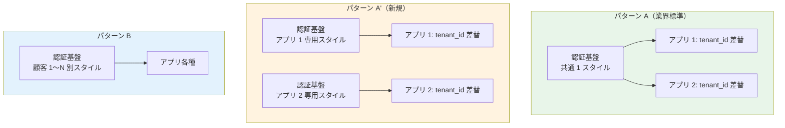

# ブランディング戦略の調査証跡（内部技術メモ）

> 最終更新: 2026-05-20  
> 位置付け: **内部技術メモ**。顧客向け説明は [proposal/fr/02-federation.md §FR-2.3.3.A](../requirements/proposal/fr/02-federation.md) を参照  
> 関連: [proposal/fr/08-admin.md §FR-8.3.A](../requirements/proposal/fr/08-admin.md)、[hearing-checklist.md A-11](../requirements/hearing-checklist.md)

---

## 1. ドキュメントの目的

A-11 ブランディング基本方針合意（パターン A / A' / B / C）の **技術的根拠を公式ソース引用付きで記録**する。本基盤プロジェクトでの設計判断・顧客対話・実装方針の根拠資料として参照される。

特に **「アプリ単位（client_id ベース）のログイン画面カスタマイズ」が技術的に可能** であることを公式ドキュメントで裏付け、A-11 の選択肢として **パターン A' を追加した経緯**を残す。

---

## 2. ブランディング戦略の 4 パターン

### 2.1 全体像

| パターン | カスタマイズ単位 | 認証基盤側設定 | アプリ側責務 | 業界実例 |
|:---:|---|---|---|---|
| **A** | テナント単位（アプリ側のみ） | 共通標準 | `tenant_id` クレーム解釈で動的差替 | Slack / Notion / Microsoft 365 / Auth0 標準 |
| **A'**（新規）| **アプリ単位（認証基盤）+ テナント単位（アプリ側）** | App Client / Client 単位 Branding | テナント別動的差替（A と同じ） | Auth0 Universal Login / Microsoft Entra App Registration / Cognito Managed Login |
| **B** | テナント単位（認証基盤側） | テナント単位 Branding | アプリ画面側もカスタマイズ | Auth0 Private Cloud / Okta Brands |
| **C** | テナント単位（完全分離） | 顧客別 Pool/Realm 分離 | アプリ画面側も顧客別 | Auth0 Enterprise Connections / Entra GCC |

### 2.2 主な違い



---

## 3. パターン A'（アプリ単位）の技術的根拠

### 3.1 Cognito - App Client 単位 Branding Style

#### 公式ドキュメントの引用

[**AWS Cognito 公式 - Apply branding to managed login pages**](https://docs.aws.amazon.com/cognito/latest/developerguide/managed-login-branding.html):

> "With managed login and the hosted UI, **your user pool can have a style for each app client. Each app client can have a distinct branding style**, but a user pool domain serves either managed login or the hosted UI."

[**AWS Cognito 公式 - The branding editor and customizing managed login**](https://docs.aws.amazon.com/cognito/latest/developerguide/managed-login-brandingeditor.html):

> "**You can assign styles to the app clients in a user pool** where a domain is set to the managed login branding version. Styles are a set of visual settings made up of image files, display options, CSS values. **When you assign a style to an app client, Amazon Cognito immediately pushes your updates to your user-interactive login pages**."

[**AWS Cognito API Reference - CreateManagedLoginBranding**](https://docs.aws.amazon.com/cognito-user-identity-pools/latest/APIReference/API_CreateManagedLoginBranding.html):

> "The `CreateManagedLoginBranding` API creates a new set of branding settings for a user pool style and **associates it with an app client**."

#### 設定方法

| 手段 | 内容 |
|---|---|
| **AWS Console（Branding Editor）** | ノーコードビジュアル編集、ライト/ダークモード、ロゴ、配色、ヘッダー/フッター、フォーム要素の個別 UI 全カスタマイズ |
| **API**（`CreateManagedLoginBranding`） | プログラマブルに App Client へ Style 割当 |
| **AWS CLI**（`create-managed-login-branding`）| CI/CD パイプライン統合 |
| **CloudFormation**（`AWS::Cognito::ManagedLoginBranding`） | IaC で管理 |

#### 制約

| 項目 | 値 | 出典 |
|---|---|---|
| **Branding Style 上限** | **20 / User Pool（Hard Limit）** | [Quotas in Amazon Cognito](https://docs.aws.amazon.com/cognito/latest/developerguide/limits.html) - "Managed login branding styles per user pool" |
| **App Client 上限** | 1,000 既定 / 10,000 最大（Soft）| 同上 - "App clients per user pool" |
| **必要ティア** | **Essentials または Plus**（Lite 不可）| [Cognito Feature Plans](https://docs.aws.amazon.com/cognito/latest/developerguide/cognito-sign-in-feature-plans.html) |
| **対応 UI** | **Managed Login のみ**（Classic Hosted UI は CSS + ロゴのみ）| [Customizing hosted UI (classic) branding](https://docs.aws.amazon.com/cognito/latest/developerguide/hosted-ui-classic-branding.html) |

### 3.2 Keycloak - Client 単位 Login Theme Override

#### 公式ドキュメントの引用

[**Keycloak 公式 - Working with themes**](https://www.keycloak.org/ui-customization/themes):

> "By default the theme configured for the realm is used, **with the exception of clients being able to override the login theme**."

[**Keycloak Server Developer Guide - Themes**](https://www.keycloak.org/docs/latest/server_development/index.html#_themes):

> "The Theme Selector SPI can be used to select a different theme based on a custom logic. This could be used to **select different themes for desktop and mobile devices** by looking at the user agent header, or based on the client requesting authentication."

#### 設定方法

```
Admin Console
  > Clients
    > [Client]
      > Settings
        > Theme Settings
          > Login Theme: <custom-app-theme>
```

または Realm Export JSON で:
```json
{
  "clientId": "expense-app",
  "attributes": {
    "loginTheme": "expense-custom-theme"
  }
}
```

#### Theme Selector SPI による高度な選択

カスタム Java 実装で、以下の条件に基づいて動的に Theme 選択可能:
- `client_id` パラメータ
- `state` パラメータ
- User Agent（モバイル / デスクトップ）
- IP アドレス / 地理
- Client 属性

```java
public class CustomThemeSelectorProviderFactory implements ThemeSelectorProviderFactory {
    @Override
    public ThemeSelectorProvider create(KeycloakSession session) {
        return new CustomThemeSelectorProvider(session);
    }
}

public class CustomThemeSelectorProvider implements ThemeSelectorProvider {
    @Override
    public String getThemeName(Theme.Type type) {
        // client_id / state / user agent から動的に Theme 選択
        return determineTheme(session);
    }
}
```

#### 制約

| 項目 | 値 |
|---|---|
| **Theme 数上限** | **制限なし** |
| **Client 数上限** | **制限なし**（[§5.A.2](platform-architecture-patterns.md) 参照）|
| **Override 範囲** | Login Theme は完全 Override / Account Theme は Realm 設定が支配 |
| **実装コスト** | カスタム Theme: FreeMarker + CSS（中）/ Theme Selector SPI: Java 実装（中〜高）|

---

## 4. 業界実例

### 4.1 主要 IdaaS のアプリ単位 Branding 対応

| サービス | アプリ単位 Branding | 実装方法 | 出典 |
|---|:---:|---|---|
| **Auth0 Universal Login** | ✅ | Application 単位で別 Branding Page 設定 | [Auth0 Docs - Universal Login](https://auth0.com/docs/customize/login-pages/universal-login) |
| **Microsoft Entra ID** | ✅ | App Registration 単位でロゴ・ブランディング設定 | [Microsoft Learn - Customize branding](https://learn.microsoft.com/en-us/entra/fundamentals/customize-branding) |
| **Okta** | ✅ | Sign-in Widget の Application 単位カスタマイズ + Brands 機能 | [Okta Developer - Customizing themes](https://developer.okta.com/docs/guides/customize-themes/) |
| **AWS Cognito Managed Login** | ✅ | App Client 単位で別 Branding Style | 上記 3.1 参照 |
| **Keycloak** | ✅ | Client 単位で Login Theme Override | 上記 3.2 参照 |
| **Ping Identity** | ✅ | Application 単位の theme | [Ping Docs](https://docs.pingidentity.com/) |

→ **業界主流の手法であり、本基盤での採用に技術的障壁はない**。

### 4.2 「アプリ単位 + テナント単位」併用の典型ケース

| サービス | パターン | 内容 |
|---|---|---|
| **Slack Enterprise Grid** | パターン A' 相当 | Workspace（アプリ）× Organization（テナント）の 2 軸 |
| **Microsoft 365** | パターン A' 相当 | App（Outlook/Teams 等）× Tenant の 2 軸 |
| **Auth0** | パターン A' 相当 | Application × Organization の 2 軸 |

---

## 5. パターン A' の採用判断（本基盤での適用）

### 5.1 採用メリット

1. **アプリ間の体験差別化**: 「経費精算」と「決済管理」で全く異なるブランド・配色・UI 要素を提供可能
2. **顧客別カスタマイズは引き続きアプリ側で**: A と同じ仕組み、テナント数は無制限
3. **URL 肥大化なし**: アプリ数 × 用途数（5-10 アプリ × 5-10 URL = 50 URL 程度）で Cognito 100 URL Hard Limit 内に十分収まる
4. **業界主流の手法**: 顧客への説明が容易（Auth0 / Entra の事例を引用可能）

### 5.2 採用注意点

1. **Cognito 採用時の制約**: Branding Style 20 上限 → アプリ 20 個までは個別 Branding 可、それ以上は共通化必要
2. **必要ティア**: Cognito Essentials または Plus（Lite 不可）
3. **管理工数**: アプリ追加時に Branding Style も追加管理が必要（Terraform / IaC 化で軽減可能）
4. **設計の一貫性**: 「ログイン画面はアプリ別 / アプリ画面は顧客別」という二重軸を顧客アプリチームに正確に伝える必要

### 5.3 採用すべきシナリオ

| シナリオ | パターン A' 採用判断 |
|---|:---:|
| 対象システム 5-10 個、いずれも異なるブランドを持つ業務系 | ✅ **強く推奨** |
| 対象システム 5-10 個、全社共通ブランド | △ パターン A で十分 |
| 対象システム 20+ 個 | △ Cognito 上限注意、Keycloak 推奨 |
| 顧客企業向け SaaS（B2B）でアプリも単一 | △ パターン A で十分 |
| 内部業務系 + 顧客向けの混在 | ✅ **推奨**（顧客向けと内部で別ブランド）|

---

## 6. 認証前後の識別子の違い（重要な技術ポイント）

A-11 のパターン A / A' を理解する上で **「認証前」と「認証後」で利用可能な識別子が異なる**点が重要。

### 6.1 認証前（ログイン画面表示時）

```
Client → /authorize?client_id=expense-app&...
        ↓
認証基盤: client_id パラメータを受け取り
        ↓ Branding Style 選択（client_id ベース）
ログイン画面表示
```

**利用可能な識別子**:
- `client_id` パラメータ（OAuth 標準、必須）
- `state` パラメータ（任意、CSRF 対策で必須）
- `redirect_uri` パラメータ
- `scope` パラメータ
- User Agent

**❌ 利用不可**: JWT クレーム（まだ発行されていない）

### 6.2 認証後（アプリ画面）

```
認証基盤 → JWT 発行 (tenant_id, azp, client_id, ...)
        ↓
アプリ: JWT 検証 + クレーム解釈
        ↓ ロゴ・配色を tenant_id ベースで動的差替
アプリ画面表示
```

**利用可能な識別子**:
- JWT クレーム: `tenant_id` / `azp` / `client_id` / `sub` 等
- セッション情報

→ **「ログイン画面のアプリ単位カスタマイズ」は `client_id` ベース**、**「アプリ画面のテナント別カスタマイズ」は JWT クレームベース**。両者を組み合わせるのが パターン A'。

---

## 7. パターン A' の実装サンプル

### 7.1 Cognito での実装

```bash
# Branding Style 作成（アプリごと）
aws cognito-idp create-managed-login-branding \
  --user-pool-id us-east-1_EXAMPLE \
  --client-id expense-app-client-id \
  --assets file://expense-branding-assets.json \
  --settings file://expense-branding-settings.json

aws cognito-idp create-managed-login-branding \
  --user-pool-id us-east-1_EXAMPLE \
  --client-id payment-app-client-id \
  --assets file://payment-branding-assets.json \
  --settings file://payment-branding-settings.json
```

```hcl
# Terraform 例
resource "aws_cognito_managed_login_branding" "expense" {
  user_pool_id = aws_cognito_user_pool.main.id
  client_id    = aws_cognito_user_pool_client.expense.id
  
  settings = jsonencode({
    "categories": {
      "global": { "colorMode": "DYNAMIC" }
      "form": { "logoUrl": "https://example.com/expense-logo.png" }
    }
  })
}
```

### 7.2 Keycloak での実装

```bash
# Theme 配置
themes/
  expense-theme/
    login/
      theme.properties
      login.ftl
      resources/css/login.css
      resources/img/expense-logo.png
  payment-theme/
    login/
      ...

# Client 設定（Terraform 例）
resource "keycloak_openid_client" "expense" {
  realm_id    = keycloak_realm.main.id
  client_id   = "expense-app"
  login_theme = "expense-theme"
}

resource "keycloak_openid_client" "payment" {
  realm_id    = keycloak_realm.main.id
  client_id   = "payment-app"
  login_theme = "payment-theme"
}
```

---

## 8. 4 パターン比較表（決定版）

| 軸 | A | A' | B | C |
|---|:---:|:---:|:---:|:---:|
| **認証基盤側カスタマイズ** | ❌ 共通 | ✅ アプリ単位 | ✅ テナント単位 | ✅ テナント単位（物理分離） |
| **アプリ側カスタマイズ** | ✅ テナント単位 | ✅ テナント単位 | ✅ | ✅ |
| **Cognito 制約** | なし | 20 Branding Style 上限 | 20 Branding Style + 20 顧客上限 | Pool 分離（10,000 Pool 上限）|
| **Keycloak 制約** | なし | なし | Realm 分離 or カスタム Theme | Realm 分離（数千上限）|
| **必要ティア（Cognito）** | Lite OK | **Essentials+** | **Essentials+** | Lite OK（Pool 別）|
| **URL allowlist 数** | 5-10 / アプリ | 5-10 / アプリ | 顧客数 × アプリ数 | 顧客数 × アプリ数 |
| **対象システム規模** | 制限なし | **アプリ 20 個まで** | 顧客 20 社まで（Cognito）| 大口顧客のみ |
| **業界実例** | Slack / Notion | **Auth0 / Entra / Okta 等** | 規制業種 | 金融 / Enterprise |

---

## 9. 推奨される A-11 選択肢拡張

[hearing-checklist.md A-11](../requirements/hearing-checklist.md) の選択肢を以下に拡張すべき:

```
A-11 ブランディング基本方針合意（4 パターン）:

[ ] パターン A  : 認証基盤共通、アプリ側で tenant_id 別差替
                 → Slack / Notion 型、対象システム数制限なし

[ ] パターン A' : 認証基盤側でアプリ単位 Branding（client_id ベース）
                 + アプリ側で tenant_id 別差替（NEW、推奨）
                 → Auth0 / Entra 型、アプリ 5-20 個に最適

[ ] パターン B  : 認証基盤側で顧客（テナント）単位 Branding
                 → 規制業種、顧客 20 社まで

[ ] パターン C  : 顧客別完全分離（Pool / Realm 分離）
                 → 大口顧客、Enterprise プラン
```

---

## 10. 参考資料

### 10.1 Cognito 関連

- [Cognito - Apply branding to managed login pages](https://docs.aws.amazon.com/cognito/latest/developerguide/managed-login-branding.html)
- [Cognito - The branding editor](https://docs.aws.amazon.com/cognito/latest/developerguide/managed-login-brandingeditor.html)
- [Cognito - User pool managed login](https://docs.aws.amazon.com/cognito/latest/developerguide/cognito-user-pools-managed-login.html)
- [Cognito - Customizing hosted UI (classic) branding](https://docs.aws.amazon.com/cognito/latest/developerguide/hosted-ui-classic-branding.html)
- [Cognito API - CreateManagedLoginBranding](https://docs.aws.amazon.com/cognito-user-identity-pools/latest/APIReference/API_CreateManagedLoginBranding.html)
- [Cognito - Quotas](https://docs.aws.amazon.com/cognito/latest/developerguide/limits.html)
- [CloudFormation - AWS::Cognito::ManagedLoginBranding](https://docs.aws.amazon.com/AWSCloudFormation/latest/TemplateReference/aws-resource-cognito-managedloginbranding.html)

### 10.2 Keycloak 関連

- [Keycloak - Working with themes](https://www.keycloak.org/ui-customization/themes)
- [Keycloak - Server Developer Guide: Themes](https://www.keycloak.org/docs/latest/server_development/index.html#_themes)
- [Keycloak - Customizing Login Page](https://www.baeldung.com/keycloak-custom-login-page)
- [Keycloak - Theme Selector SPI documentation](https://www.keycloak.org/docs/latest/server_development/index.html#_themes_selector_spi)

### 10.3 業界実例

- [Auth0 - Universal Login](https://auth0.com/docs/customize/login-pages/universal-login)
- [Microsoft Entra - Customize branding](https://learn.microsoft.com/en-us/entra/fundamentals/customize-branding)
- [Okta - Customizing themes](https://developer.okta.com/docs/guides/customize-themes/)

### 10.4 関連内部ドキュメント

- [proposal/fr/02-federation.md §FR-2.3.3.A](../requirements/proposal/fr/02-federation.md) - 画面所在マトリクスとカスタマイズパターン
- [proposal/fr/08-admin.md §FR-8.3.A](../requirements/proposal/fr/08-admin.md) - 画面別の責務分担
- [proposal/common/02-platform.md §C-2.2](../requirements/proposal/common/02-platform.md) - プラットフォーム選定論点
- [platform-architecture-patterns.md §5.A](platform-architecture-patterns.md) - クォータ・スケール上限詳細
- [hearing-checklist.md A-11](../requirements/hearing-checklist.md) - ヒアリング項目
