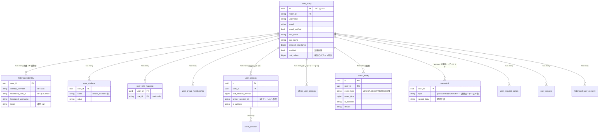

# 浅いブローカーが保持するデータモデル — 何を持ち、何を持たないか

> **目的**: 「**ブローカー側でパスワードなどを持たないとして、何を持つのか**」という根本的な問いに対し、Keycloak の DB スキーマ実態に基づいて完全リストを示す reference doc。
> **対象読者**: 認証基盤設計者 / 顧客 PoC 担当 / セキュリティレビュー担当 / 監査対応担当（GDPR / APPI 開示請求等）
> **前提**: 本基盤は **L2 浅いブローカー**（[self-service-responsibility.md §2](self-service-responsibility.md)）を採用 = JIT で broker DB にユーザー行を作るが、認証クレデンシャル・MFA キー・詳細プロフィールは顧客 IdP に集約
> **関連**:
> - [self-service-responsibility.md](self-service-responsibility.md) — セルフサービス責任配置の基本ドキュメント（broker が何を出すべきでないか）
> - [identity-broker-multi-idp.md](identity-broker-multi-idp.md) — Identity Broker パターン全体
> - [user-types-and-auth.md](user-types-and-auth.md) — 5 ユーザー種別と認証方式
> - [claim-mapping-authz-scenario.md](claim-mapping-authz-scenario.md) — JWT クレーム設計
> - [jit-scim-coexistence-keycloak.md §10.5](jit-scim-coexistence-keycloak.md) — DB 保持・削除マトリクス（実装詳細）
> - [ADR-009 MFA 責務 by IdP](../adr/009-mfa-responsibility-by-idp.md) — 認証情報帰属原則の起源

---

## 目次

1. [一行サマリ](#1-一行サマリ)
2. [Broker が保持する 7 カテゴリ](#2-broker-が保持する-7-カテゴリ)
3. [Broker が「持たない」もの（対比で重要）](#3-broker-が持たないもの対比で重要)
4. [Broker 保持データ → JWT クレームへの反映](#4-broker-保持データ--jwt-クレームへの反映)
5. [ユーザー種別ごとの差分（連携 vs ローカル）](#5-ユーザー種別ごとの差分連携-vs-ローカル)
6. [テーブル相関図](#6-テーブル相関図)
7. [運用上の含意](#7-運用上の含意)
8. [本基盤での具体例（Phase 8/9 実装値）](#8-本基盤での具体例phase-89-実装値)

---

## 1. 一行サマリ

> 浅いブローカーは **「誰が（`user_entity` + `federated_identity`）どのテナントの何の権限を持って（`user_attribute.tenant_id` + `user_role_mapping`）いつ・どのアプリにアクセスしたか（`user_session` + `event_entity`）」** を持つ。**認証クレデンシャル・MFA キー・詳細プロフィールは持たない**。

これは「broker は **認可境界の保持** が責務、認証クレデンシャルは IdP 側」という設計原則（[ADR-009](../adr/009-mfa-responsibility-by-idp.md) の一般化）と一対一に対応する。

---

## 2. Broker が保持する 7 カテゴリ

### ① IdP との紐付け情報 (`federated_identity` テーブル)

連携ユーザーを「broker のユーザー UUID と顧客 IdP のユーザー ID の対応表」として保持する。

| カラム | 内容 | 例 |
|---|---|---|
| `user_id` | broker の user_entity.id への FK | `5894bf01-...`（broker UUID）|
| `identity_provider` | broker 内の IdP alias | `entra-acme`, `okta-globex`, `auth0` |
| `federated_user_id` | **顧客 IdP 側の sub / oid** | `8a7c... (Entra ID OID)` |
| `federated_username` | 顧客 IdP 側のユーザー名 | `bob@acme.com` |
| `token` | IdP からの token | 通常 **保存しない**（IdP 設定で `storeToken=false` がデフォルト）|

**ポイント**:
- 1 ユーザーに対し **複数 IdP 連携時は複数行**（Keycloak は無制限。Cognito は 5 行/ユーザー上限あり）
- これが「broker が連携ユーザーを認識する核」。次回ログイン時 `federated_user_id` で同一人物と判定して既存 `user_entity` を再利用する
- **GDPR / APPI 削除請求時は本テーブルからも user_id を削除必須**（CASCADE 設定済み）

### ② ユーザーシェル本体 (`user_entity` テーブル)

JIT で作成される broker 内のユーザー UUID と表示用属性の最小セット。

| カラム | 内容 | 出所 |
|---|---|---|
| `id` | broker UUID（**JWT の `sub` クレームになる**）| broker 採番 |
| `realm_id` | テナント（Realm）識別 | realm 設定 |
| `username` | broker 内の一意名 | JIT 時に IdP の `email` や `preferred_username` から生成 |
| `email` | メアド | IdP コピー（`Sync Mode=FORCE` なら毎回上書き、`IMPORT` なら初回のみ）|
| `email_verified` | 検証フラグ | IdP コピー（IdP 側で `trustEmail=true` なら自動 true）|
| `first_name` / `last_name` | 表示名 | IdP コピー |
| `created_timestamp` | JIT 作成日時 | broker 採番 |
| `enabled` | 有効/無効（**論理削除はここ**）| broker 管理 |
| `not_before` | この時刻以降の token のみ有効（**強制ログアウト用**）| broker 管理 |
| `service_account_client_link` | M2M なら client UUID | null（人ユーザー）|

**ポイント**:
- 連携ユーザーは **`user_entity` 行は持つが `credential` 行は持たない** のが本基盤設計の核
- `enabled=false` で論理削除（[jit-scim-coexistence-keycloak.md §10.5](jit-scim-coexistence-keycloak.md) の削除マトリクス参照）
- `not_before` を「現在時刻」に更新すると **その時点以前に発行された全 token が即時無効化** ＝ サーバサイドの強制ログアウト機構

### ③ カスタム属性 (`user_attribute` テーブル)

**broker が IdP より一段抽象化した認可情報**を保持する場所。本基盤の認可キーである `tenant_id` はここに入る。

| 属性キー | 内容 | 出所 |
|---|---|---|
| `tenant_id` | **テナント識別（本基盤の認可キー）** | broker 管理（IdP attribute mapper or 運用者設定）|
| `roles` | （多くは `user_role_mapping` 側に分離するが属性化も可）| broker 管理 |
| `deprovisioned_at` | 90 日定期バッチで無効化された日時 | バッチ管理（[jit-scim §10.4.A](jit-scim-coexistence-keycloak.md) Event Listener SPI 版、§10.4 は 10M MAU で破綻）|
| `last_login` | 最終ログイン時刻（epoch ms）| Event Listener SPI が LOGIN イベント時に書込（[ADR-060 §C.2.2](../adr/060-auth-protocol-attack-path-residual-tbd.md) + [jit-scim §10.4.A](jit-scim-coexistence-keycloak.md)、2026-07-09 追加）|
| `provisioned_by` | プロビジョニング元識別（`jit` / `scim` / `manual` / `realm_import`）| First Broker Login Flow / SCIM Plugin / Admin API 時に書込（[jit-scim §10.4.B](jit-scim-coexistence-keycloak.md)、2026-07-09 追加）|
| `scim_active` | SCIM 管理下フラグ（`true` = 削除禁止）| Phase Two SCIM Plugin 書込（[jit-scim §10.4.B](jit-scim-coexistence-keycloak.md)、2026-07-09 追加）|
| `deprovisioned_reason` | 無効化理由 | 同上 |
| 任意の追加属性 | 顧客固有メタデータ | IdP コピー or broker 独自 |

**ポイント**:
- v26 では Realm 設定で `Unmanaged Attributes Enabled` が必要（[realm-export.json](../../keycloak/config/realm-export.json) の `attributes.userProfileEnabled = "true"`）
- 連携ユーザーが顧客 IdP では「営業部 マネージャー」だが broker では「`tenant_id=acme-corp`, `roles=[manager]`」のような **正規化形式** で保持
- これにより各システムは「IdP の組織構造を知らない」状態で `tenant_id` だけ見れば認可判定可能

### ④ ロール・グループ割当

| テーブル | 内容 |
|---|---|
| `user_role_mapping` | Realm ロール（本基盤では `employee` / `manager` / `admin`）の割当 |
| `user_group_membership` | グループ所属 |
| `client_role_mapping` | Client 別ロールの割当（本基盤では Realm ロールに集約のため通常不使用）|

**ポイント**:
- ロールは IdP 側 group claim から **Identity Provider Mapper** で自動付与可、または broker 管理者が手動設定
- `roles` クレームへの反映は `oidc-usermodel-realm-role-mapper` Protocol Mapper を経由（[claim-mapping-setup.md](../keycloak/claim-mapping-setup.md)）

### ⑤ セッション状態 (`user_session` / `client_session` / `offline_user_session`)

「いつログインしたか」「どのアプリでログイン中か」のエフェメラル情報。Keycloak v26 デフォルトで **Persistent Sessions** が ON のため、Infinispan キャッシュだけでなく DB にも記録される。

| 内容 | テーブル | 保持期間 |
|---|---|---|
| `last_session_refresh` | `user_session` | SSO Session Max Lifespan（本基盤 10 時間）|
| `broker_session_id` | `user_session` | 顧客 IdP のセッション ID（**バックチャネルログアウト用**）|
| Client session 連鎖 | `client_session` | アクティブな各 client への接続情報 |
| Offline refresh token state | `offline_user_session` | Offline Session Idle Timeout（本基盤 30 日）|

**ポイント**:
- broker は「現在ログイン中のアプリ群」を可視化できる → [self-service-responsibility.md §4.2](self-service-responsibility.md) で アカウント設定画面 の **Devices タブ**として利用
- バックチャネルログアウト（[ADR-009](../adr/009-mfa-responsibility-by-idp.md) + Phase 7 検証）は `broker_session_id` 経由で IdP からの「セッション終了」通知を受け、broker → 全 client へ伝播
- セッション情報は **GDPR / APPI 法 33 条（開示請求）対象**

### ⑥ 監査ログ (`event_entity` / `admin_event_entity`)

| イベント | 保持する情報 |
|---|---|
| `LOGIN` / `LOGOUT` | timestamp, IP address, user agent, client, IdP alias, error_code |
| `REFRESH_TOKEN` | 同上 + token JTI |
| `IDENTITY_PROVIDER_LOGIN` | broker → IdP 経由のログイン詳細（First Broker Login 含む）|
| `REGISTER` | JIT 作成イベント |
| `UPDATE_PROFILE` / `UPDATE_PASSWORD` | プロフィール変更（連携ユーザーには通常発生しない）|
| `admin_event_entity` 全般 | 管理者の CRUD 操作（誰が誰を有効化/無効化したか）|

**ポイント**:
- デフォルトは Keycloak DB に保存。**Event Listener SPI** で外部 SIEM / CloudWatch Logs / SNS へリレー可（[hook-architecture-keycloak.md](hook-architecture-keycloak.md)）
- **PCI DSS Req 10.5.1 は 12 ヶ月保存 + 3 ヶ月即時アクセス要**（[pci-dss-appi-compliance-gap.md §3.3](pci-dss-appi-compliance-gap.md)）→ S3 + Athena への定期 export が現実解
- APPI 法 26 条の漏えい等報告では **本ログが原因分析・本人特定の根拠**

### ⑦ 必須アクション / 同意

| テーブル | 内容 | 連携ユーザーで使う場面 |
|---|---|---|
| `user_required_action` | 「次回ログイン時に xxx をやれ」（VERIFY_EMAIL, UPDATE_PROFILE 等）| 通常無し（IdP 側で完結）|
| `user_consent` | client × scope の同意状態（OAuth consent）| 標準 OIDC scope はスキップ可、カスタム scope のみ蓄積 |
| `federated_user_consent` | 連携ユーザー用の同意状態 | APPI 法 28 条「外国にある第三者への提供」同意取得時にここを使う |

**ポイント**:
- 連携ユーザーは通常 `user_required_action` を持たないが、broker 管理者が「次回ログイン時に Profile 入力させたい」場合に登録
- `federated_user_consent` は **APPI 法 28 条同意 UI**（[self-service-responsibility.md §6 アンチパターン](self-service-responsibility.md) でも触れた外国提供同意）の蓄積場所として利用可能

---

## 3. Broker が「持たない」もの（対比で重要）

| データ | 理由 | 例外（持つケース）|
|---|---|---|
| **パスワードハッシュ** (`credential.type=password`) | 顧客 IdP が保管 | Platform Admin / Tenant Admin (IdP無) / End User (ローカル) は broker 側に保持 |
| **TOTP / WebAuthn / 生体認証の秘密鍵** (`credential.type=otp/webauthn`) | 顧客 IdP が保管 | broker 側で MFA を allow した場合のみ `credential` 行ができる |
| **平文の認証情報** | broker は受け取らない（PKCE redirect で IdP に直行）| なし |
| **詳細な個人プロフィール**（住所・電話・部署・職位等で IdP に存在するが broker mapper していないもの）| IdP のみ | broker mapper で都度取得し `user_attribute` に保存することは可能 |
| **顧客 IdP 側のセッション内容詳細** | `broker_session_id` で参照キーは持つが、IdP 内のセッション中身は IdP のみ | なし |
| **退職フラグ・組織変更** | 顧客 IdP の HR 連携で管理 | broker は SCIM or 定期バッチで反映する（[jit-scim §10.4.A](jit-scim-coexistence-keycloak.md) Event Listener SPI 版）|
| **IdP 側の認証履歴詳細**（顧客 IdP がいつどんな認証要素で本人確認したか）| IdP のみ | broker は `acr` クレーム経由で「LoA レベル」だけ受け取り `event_entity` に記録 |

**設計原則**: broker は「**認証ストレージ・MFA・パスワードを持たない**」ことで「浅さ」を保ち、本来 IdP 側の責務を broker 側に再実装するアンチパターンを回避する（[self-service-responsibility.md §6](self-service-responsibility.md) のアンチパターン表参照）。

---

## 4. Broker 保持データ → JWT クレームへの反映

broker が保持するデータがどう JWT に乗るか:

| broker のテーブル | 経由する Protocol Mapper | JWT クレーム |
|---|---|---|
| `user_entity.id` | （標準）| `sub` |
| `user_entity.email` | `oidc-usermodel-property-mapper` | `email` |
| `user_attribute.tenant_id` | `oidc-usermodel-attribute-mapper` | `tenant_id` |
| `user_role_mapping` (realm) | `oidc-usermodel-realm-role-mapper` | `roles` (multivalued) + `realm_access.roles` |
| `user_session.id` | （標準）| `sid` |
| `user_session.broker_session_id` | （内部、JWT には乗らない）| — |
| Realm の issuer URL | （標準）| `iss` |
| Client の audience 設定 | `oidc-audience-mapper` | `aud` |

→ 結果として bob-kc の JWT は次のようになる（[realm-export.json](../../keycloak/config/realm-export.json) Phase 8/9 設定後）:

```json
{
  "sub": "5894bf01-61fb-40f4-93f4-c408ed5cbee6",
  "iss": "http://localhost:8080/realms/auth-poc",
  "aud": "auth-poc-spa",
  "email": "bob@acme.com",
  "preferred_username": "bob-kc",
  "tenant_id": "acme-corp",
  "roles": ["manager"],
  "realm_access": { "roles": ["manager"] }
}
```

→ 各システムは `iss` + `aud` で発行元を検証、`tenant_id` でテナント境界、`roles` で認可判定。**broker が保持する情報のうち、認可判定に必要な最小限が JWT に注入される構造**。

---

## 5. ユーザー種別ごとの差分（連携 vs ローカル）

[user-types-and-auth.md](user-types-and-auth.md) の 5 ユーザー種別に broker 保持データを当てはめると:

| ユーザー種別 | `federated_identity` | `user_entity` | `user_attribute.tenant_id` | `credential` (password) | `credential` (otp/webauthn) |
|---|:-:|:-:|:-:|:-:|:-:|
| **Platform Admin**（基盤運用者）| ❌ | ✅ | ❌ (本基盤として無し) | ✅ | ✅ MFA 強制 |
| **Tenant Admin (IdP 無)** | ❌ | ✅ | ✅ | ✅ | ✅ MFA 強制 |
| **Tenant Admin (IdP 有)** | ✅ | ✅ | ✅ | ❌ | ❌（IdP 側）|
| **End User (連携)** | ✅ | ✅ | ✅ | ❌ | ❌（IdP 側）|
| **End User (ローカル)** | ❌ | ✅ | ✅ | ✅ | 任意 |

→ **`federated_identity` 行の有無が「連携 vs ローカル」の判定キー**。Lambda Authorizer / アプリ側で連携ユーザーかを判定したい場合は JWT の `identity_provider` クレーム（標準 mapper で出せる）か、Admin API で federated_identity を逆引きする。

---

## 6. テーブル相関図

連携ユーザー bob-kc のレコード相関を示す:



→ **`credential` だけが連携ユーザーで 0 行**になり、これが「浅いブローカー」の物理的な現れ。

---

## 7. 運用上の含意

| 含意 | 詳細 |
|---|---|
| **GDPR / APPI 開示請求対応** | 上記 7 カテゴリすべての user_id で WHERE 検索 → JSON 出力する Admin API スクリプトで対応可（[self-service-responsibility.md §4.3](self-service-responsibility.md) GDPR フロー）|
| **APPI 法 33 条「保有個人データ」** | 上記 7 カテゴリすべてが保有個人データに該当 |
| **APPI 法 35 条「利用停止等」** | `user_entity.enabled=false` で論理停止、`user_role_mapping` 全削除で権限剥奪、`user_session` 強制 revoke |
| **PCI DSS Req 8.2.5「退職者の即時無効化」** | 顧客 IdP 側退職反映 → SCIM DELETE → `user_entity.enabled=false` + `not_before` 現在時刻 |
| **PCI DSS Req 8.2.6「90 日未使用無効化」** | **`user_attribute.last_login`** で判定 → `enabled=false`（[jit-scim §10.4.A Event Listener SPI 版](jit-scim-coexistence-keycloak.md)、Event Listener SPI が LOGIN イベント時に書込。**⚠ 2026-07-09 訂正**：旧 §10.4 の `user_session` / `event_entity` 経由は user_session が SSO Session Max 10h で消滅 + event_entity は 10M MAU で 9 億行に肥大化するため破綻。ADR-060 §C.2.2 SPI 拡張と統合）|
| **PCI DSS Req 10.5.1「監査ログ 12 ヶ月保存」** | `event_entity` を Event Listener SPI で外部出力し S3 + Athena 保管。Keycloak DB 内は短期 retention |
| **Token Revocation（強制ログアウト）** | `user_entity.not_before` を現在時刻に更新 → 全 token が即時無効化 |
| **DB 容量管理** | `event_entity` と `user_session` が肥大化しがち。Event は外部リレー、Session は定期 purge |
| **テナント論理分離の物理的根拠** | `user_attribute.tenant_id` が認可キー。各 SQL クエリで必ず `WHERE tenant_id = ?` を入れる（[identity-broker-multi-idp.md §10.0.3](identity-broker-multi-idp.md) ）|

---

## 8. 本基盤での具体例（Phase 8/9 実装値）

[realm-export.json](../../keycloak/config/realm-export.json) で bob-kc の場合、broker DB に作られる行を再現すると:

### user_entity
```
id:                  5894bf01-61fb-40f4-93f4-c408ed5cbee6
realm_id:            auth-poc
username:            bob-kc
email:               bob@acme.com
email_verified:      true
first_name:          Bob
last_name:           Acme
created_timestamp:   1780626557000
enabled:             true
not_before:          0
service_account_client_link: NULL
```

### user_attribute（複数行）
```
user_id=5894bf01..., name=tenant_id, value=acme-corp
```

### user_role_mapping
```
user_id=5894bf01..., role_id=<manager の UUID>
```

### federated_identity（**ローカルユーザーのため 0 行**）
※ bob-kc は realm.json で credentials password 直書きの「ローカル相当」設定。本番の連携ユーザーはここに以下が入る:
```
user_id=5894bf01..., identity_provider=auth0, federated_user_id=auth0|abc123..., federated_username=bob@acme.com, token=NULL
```

### credential（**ローカルユーザーのため 1 行、連携ユーザーなら 0 行**）
※ bob-kc は realm.json で password 設定されているため:
```
user_id=5894bf01..., type=password, secret_data={"value":"<hash>","salt":"...","additionalParameters":{}}
```
本番の連携ユーザーはこの行が **存在しない** ＝ 「浅さ」の物理的な現れ。

### user_session（ログイン時に発生）
```
id=<session UUID>, user_id=5894bf01..., last_session_refresh=<時刻>,
broker_session_id=<Auth0/Entra ID 側のセッション ID>, ip_address=...
```

### event_entity（ログインのたびに 1 行）
```
id=..., user_id=5894bf01..., event_type=LOGIN, event_time=...,
ip_address=..., details={"client":"auth-poc-spa","auth_method":"openid-connect","identity_provider":"auth0"}
```

→ これらをまとめて見ると「**bob-kc はテナント acme-corp の manager で、Auth0 経由でログインしており、broker は認証情報そのものは持たない**」という実態が DB スキーマレベルで観察できる。

---

## 改訂履歴

- 2026-06-09: 初版作成。「ブローカーが何を持つか」の問いに対し Keycloak DB スキーマ実態（7 カテゴリ + 持たないもの）+ JWT クレームへの反映 + 5 ユーザー種別差分 + ER 図 + 運用上の含意 + Phase 8/9 実装値を統合
