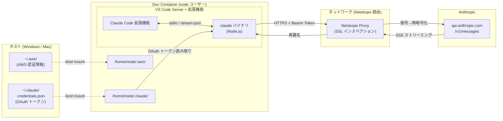
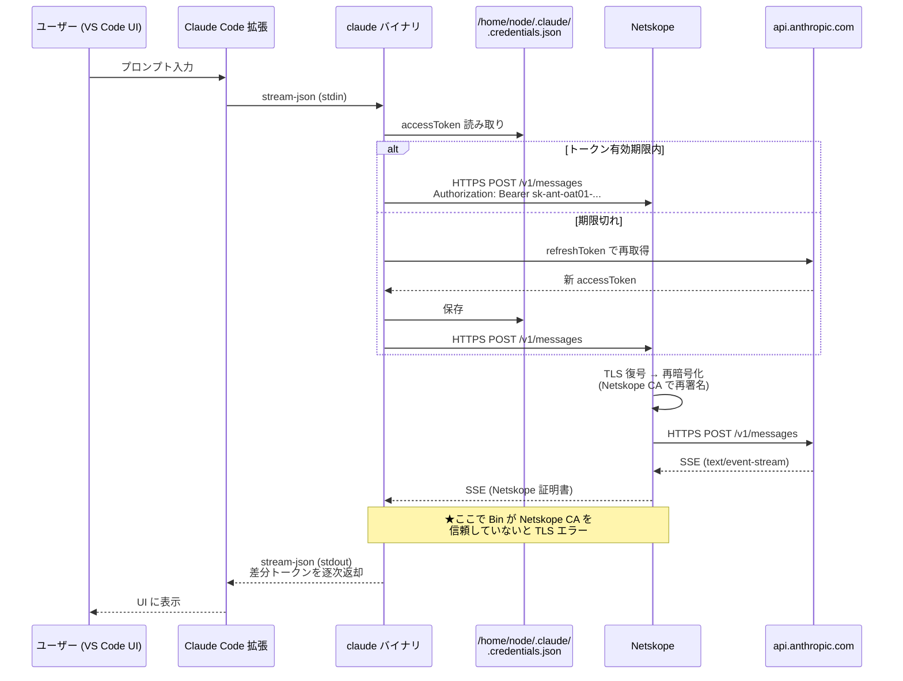
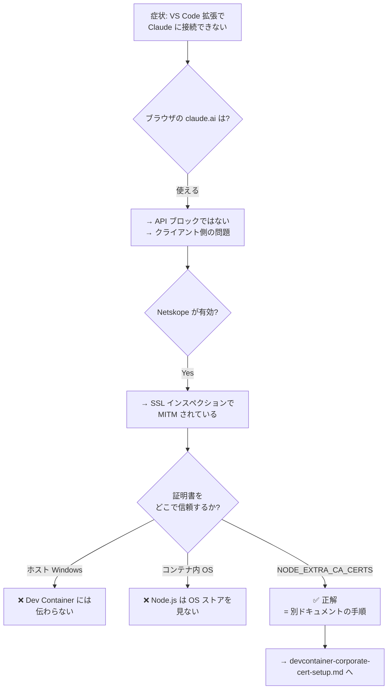
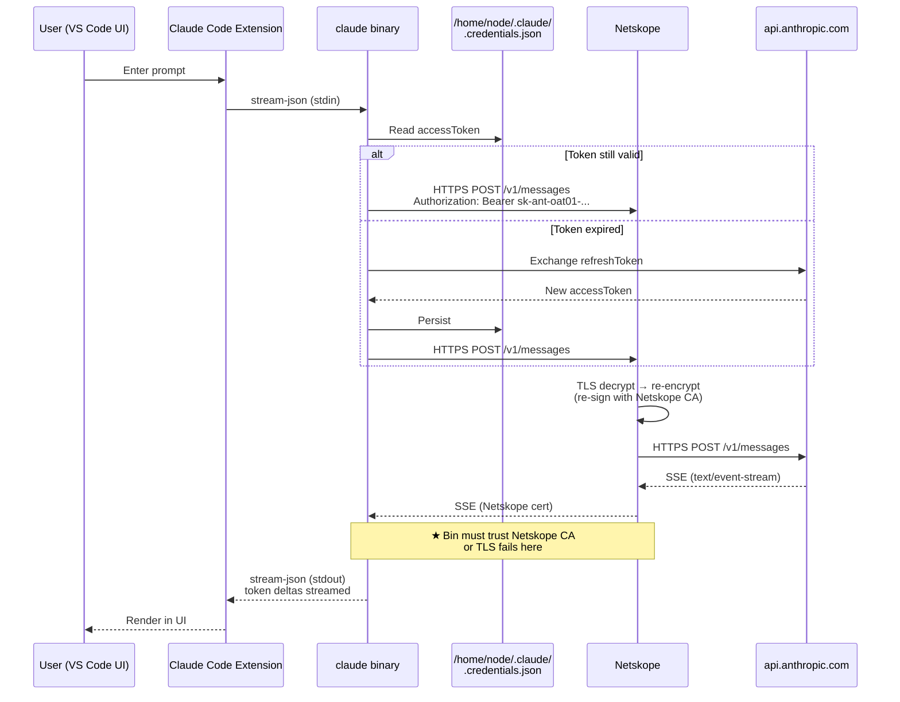
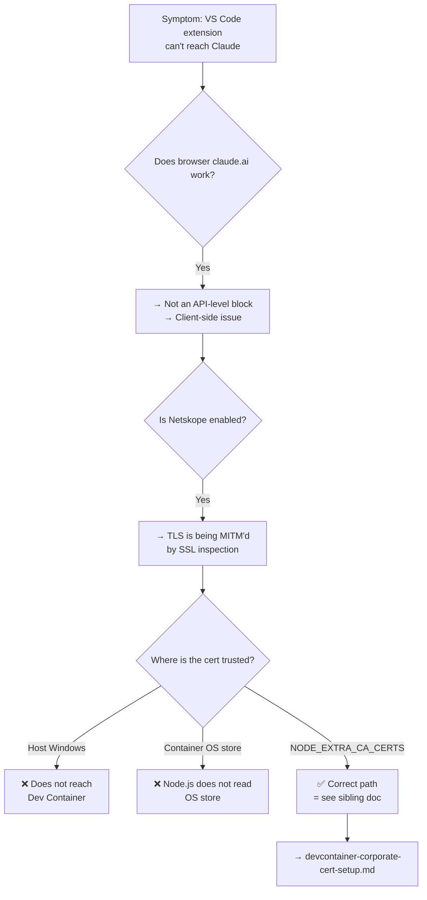

# Claude Code 通信フロー (Dev Container 環境) / Claude Code Communication Flow (Dev Container)

Dev Container 上の VS Code 拡張として動作する Claude Code が、ホストの認証情報をどのように引き継ぎ、どのようなプロトコルで Anthropic API と通信しているかを整理したドキュメント。

This document describes how Claude Code — running as a VS Code extension inside a Dev Container — inherits credentials from the host and communicates with the Anthropic API.

関連ドキュメント / Related: [devcontainer-corporate-cert-setup.md](devcontainer-corporate-cert-setup.md)

---

## 日本語版

### なぜこのドキュメントが必要か

会社PCで Netskope（SSL インスペクション型 SWG/CASB）が有効な状態だと、**ブラウザからは claude.ai が使えるのに、Dev Container 内の VS Code 拡張機能（Claude Code）からは API に到達できない** という事象が発生した。

診断の過程で以下が分かった:

1. Claude Code は Node.js ベースのバイナリで、OS 証明書ストアを参照しない
2. Netskope は MITM 方式で TLS を復号・再暗号化し、独自 CA で再署名する
3. Dev Container は独立した Linux 環境で、ホスト (Windows) の証明書ストアは見えない
4. ホストで `NODE_EXTRA_CA_CERTS` を設定しても、**コンテナ内には伝わらない**

→ **対策として、コンテナ内に Netskope ルート CA を組み込む必要があった** ([devcontainer-corporate-cert-setup.md](devcontainer-corporate-cert-setup.md) 参照)。

根本原因を正確に把握するには、**Claude Code がどこからどこへ、どんなプロトコルで通信しているか** を理解している必要がある。本ドキュメントはそのリファレンスである。

### 全体アーキテクチャ



### 認証: ホスト資格情報のバインドマウント

[.devcontainer/devcontainer.json](../../.devcontainer/devcontainer.json)

```jsonc
"mounts": [
  "source=${localEnv:HOME}${localEnv:USERPROFILE}/.aws,target=/home/node/.aws,type=bind",
  "source=${localEnv:HOME}${localEnv:USERPROFILE}/.claude,target=/home/node/.claude,type=bind",
  "source=/var/run/docker.sock,target=/var/run/docker.sock,type=bind"
]
```

| ホスト側 | コンテナ側 | 用途 |
|---|---|---|
| `~/.aws/` | `/home/node/.aws/` | AWS CLI / SDK の認証情報 |
| `~/.claude/` | `/home/node/.claude/` | Claude Code の OAuth トークン・セッション |
| `/var/run/docker.sock` | 同左 | Docker-outside-of-Docker |

**効果**: ホストで一度 `claude login` しておけば、コンテナ内では追加の認証操作なしに利用可能。

`${localEnv:HOME}${localEnv:USERPROFILE}` は Mac/Linux (`HOME`) と Windows (`USERPROFILE`) の両方に対応するためのトリック。片方しか定義されていないので文字列連結で吸収している。

### 認証プロトコル: OAuth 2.0

`~/.claude/.credentials.json` の構造:

```jsonc
{
  "claudeAiOauth": {
    "accessToken": "sk-ant-oat01-...",    // OAuth Access Token
    "refreshToken": "sk-ant-ort01-...",   // OAuth Refresh Token
    "expiresAt": 1776770257940,           // ms エポック
    "scopes": [
      "user:inference",
      "user:profile",
      "user:sessions:claude_code",
      "user:file_upload",
      "user:mcp_servers"
    ],
    "subscriptionType": "max",
    "rateLimitTier": "default_claude_max_5x"
  },
  "organizationUuid": "..."
}
```

- **認証方式**: OAuth 2.0（Authorization Code Flow + PKCE 想定）
- **トークン種別**: Anthropic 発行の Bearer トークン (`sk-ant-oat01-` / `sk-ant-ort01-`)
- **リフレッシュ**: `expiresAt` を過ぎると refresh token で自動再取得
- **スコープ**: モデル推論・プロファイル・MCP サーバー連携等

### 通信シーケンス



### プロセス構造

実行中のプロセスから確認できる内部構造:

```
VS Code Server
 └─ anthropic.claude-code 拡張機能 (Extension Host)
     └─ claude バイナリ (ネイティブ Node.js バイナリ)
         ├─ 引数: --output-format stream-json
         │        --input-format stream-json
         │        --permission-prompt-tool stdio
         │        --permission-mode acceptEdits
         │        --max-thinking-tokens 31999
         └─ HTTPS 通信 → api.anthropic.com
```

| 通信レイヤー | プロトコル | 備考 |
|---|---|---|
| Extension ↔ claude バイナリ | stdio + stream-json | JSON Lines 形式で双方向 |
| claude バイナリ → API | HTTPS (TLS 1.3) | `POST /v1/messages` |
| API → claude バイナリ | SSE (Server-Sent Events) | `text/event-stream` でストリーミング |
| 権限プロンプト | stdio | `--permission-prompt-tool stdio` |

### Netskope 経由で発生した問題との対応関係



**結論**: Claude Code の通信は **(a) OAuth トークン** と **(b) Anthropic API への TLS 接続** の2軸で成立している。Netskope 環境では (b) の TLS 検証が壊れるため、**コンテナ内の Node.js に Netskope ルート CA を信頼させる必要がある**。(a) のトークンはバインドマウントで自動的に引き継がれるので追加設定は不要。

### トラブルシューティング早見表

| 症状 | 原因候補 | 確認方法 |
|---|---|---|
| TLS エラー (`UNABLE_TO_VERIFY_LEAF_SIGNATURE` 等) | Netskope CA 未信頼 | `echo $NODE_EXTRA_CA_CERTS` → [cert-setup](devcontainer-corporate-cert-setup.md) |
| `401 Unauthorized` | OAuth トークン期限切れ / 破損 | ホストで `claude login` 再実行 |
| 認証情報が見えない | バインドマウント失敗 | `ls /home/node/.claude/.credentials.json` |
| 応答が固まる | SSE 切断 / プロキシのバッファリング | Netskope 側の HTTP/2 設定を確認 |
| ブラウザは OK だが CLI はダメ | 企業ポリシーで API カテゴリブロック | Netskope 管理画面でログ確認 |

---

## English Version

### Why this document exists

On a corporate laptop with Netskope (SSL-inspecting SWG/CASB) enabled, we hit a strange state: **the `claude.ai` site worked in the browser, but the VS Code Claude Code extension running inside the Dev Container could not reach the Anthropic API.**

Diagnosis turned up several interacting facts:

1. Claude Code is a Node.js-based binary — it does **not** consult the OS trust store
2. Netskope performs TLS MITM, decrypting and re-signing traffic with its own CA
3. A Dev Container is an isolated Linux environment; the Windows host trust store is invisible to it
4. Setting `NODE_EXTRA_CA_CERTS` on the host does **not** propagate into the container

→ **Fix**: install the Netskope root CA inside the container (see [devcontainer-corporate-cert-setup.md](devcontainer-corporate-cert-setup.md)).

To understand the root cause, you need to know **what Claude Code actually talks to, and over which protocols**. This document is that reference.

### Overall Architecture


### Authentication: Bind-Mounting Host Credentials

[.devcontainer/devcontainer.json](../../.devcontainer/devcontainer.json)

```jsonc
"mounts": [
  "source=${localEnv:HOME}${localEnv:USERPROFILE}/.aws,target=/home/node/.aws,type=bind",
  "source=${localEnv:HOME}${localEnv:USERPROFILE}/.claude,target=/home/node/.claude,type=bind",
  "source=/var/run/docker.sock,target=/var/run/docker.sock,type=bind"
]
```

| Host | Container | Purpose |
|---|---|---|
| `~/.aws/` | `/home/node/.aws/` | AWS CLI / SDK credentials |
| `~/.claude/` | `/home/node/.claude/` | Claude Code OAuth tokens & sessions |
| `/var/run/docker.sock` | same | Docker-outside-of-Docker |

**Effect**: log in once on the host (`claude login`) and the container picks up the same session — no extra auth inside the container.

The `${localEnv:HOME}${localEnv:USERPROFILE}` concatenation is a portability trick: Linux/Mac set `HOME`, Windows sets `USERPROFILE` — only one is defined at a time, so string concatenation resolves to the correct path on either OS.

### Authentication Protocol: OAuth 2.0

Structure of `~/.claude/.credentials.json`:

```jsonc
{
  "claudeAiOauth": {
    "accessToken": "sk-ant-oat01-...",    // OAuth Access Token
    "refreshToken": "sk-ant-ort01-...",   // OAuth Refresh Token
    "expiresAt": 1776770257940,           // ms epoch
    "scopes": [
      "user:inference",
      "user:profile",
      "user:sessions:claude_code",
      "user:file_upload",
      "user:mcp_servers"
    ],
    "subscriptionType": "max",
    "rateLimitTier": "default_claude_max_5x"
  },
  "organizationUuid": "..."
}
```

- **Auth**: OAuth 2.0 (Authorization Code Flow + PKCE)
- **Token format**: Anthropic-issued Bearer tokens (`sk-ant-oat01-*` / `sk-ant-ort01-*`)
- **Refresh**: when `expiresAt` passes, the refresh token is exchanged for a new access token automatically
- **Scopes**: model inference, profile, MCP servers, etc.

### Communication Sequence



### Process Structure

Observed from running processes:

```
VS Code Server
 └─ anthropic.claude-code extension (Extension Host)
     └─ claude binary (native Node.js binary)
         ├─ args: --output-format stream-json
         │        --input-format stream-json
         │        --permission-prompt-tool stdio
         │        --permission-mode acceptEdits
         │        --max-thinking-tokens 31999
         └─ HTTPS → api.anthropic.com
```

| Layer | Protocol | Notes |
|---|---|---|
| Extension ↔ claude binary | stdio + stream-json | JSON Lines, bidirectional |
| claude binary → API | HTTPS (TLS 1.3) | `POST /v1/messages` |
| API → claude binary | SSE (Server-Sent Events) | `text/event-stream` streaming |
| Permission prompts | stdio | `--permission-prompt-tool stdio` |

### Mapping to the Netskope Incident



**Bottom line**: Claude Code's comms rest on two pillars — **(a) OAuth tokens** and **(b) a TLS connection to the Anthropic API**. Under Netskope, (b) breaks because Node.js in the container doesn't trust Netskope's signing CA, so **the container must be told to trust the Netskope root CA**. (a) comes for free via bind mounts and needs no extra setup.

### Troubleshooting Cheat Sheet

| Symptom | Likely cause | How to check |
|---|---|---|
| TLS error (`UNABLE_TO_VERIFY_LEAF_SIGNATURE` etc.) | Netskope CA not trusted | `echo $NODE_EXTRA_CA_CERTS` → see [cert setup](devcontainer-corporate-cert-setup.md) |
| `401 Unauthorized` | OAuth token expired / corrupt | Re-run `claude login` on host |
| Credentials not visible | Bind mount failure | `ls /home/node/.claude/.credentials.json` |
| Hangs with no response | SSE drop / proxy buffering | Review Netskope HTTP/2 settings |
| Browser works, CLI doesn't | Corporate policy blocks API category | Check Netskope admin logs |
