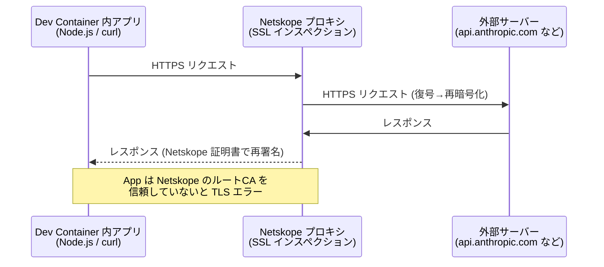
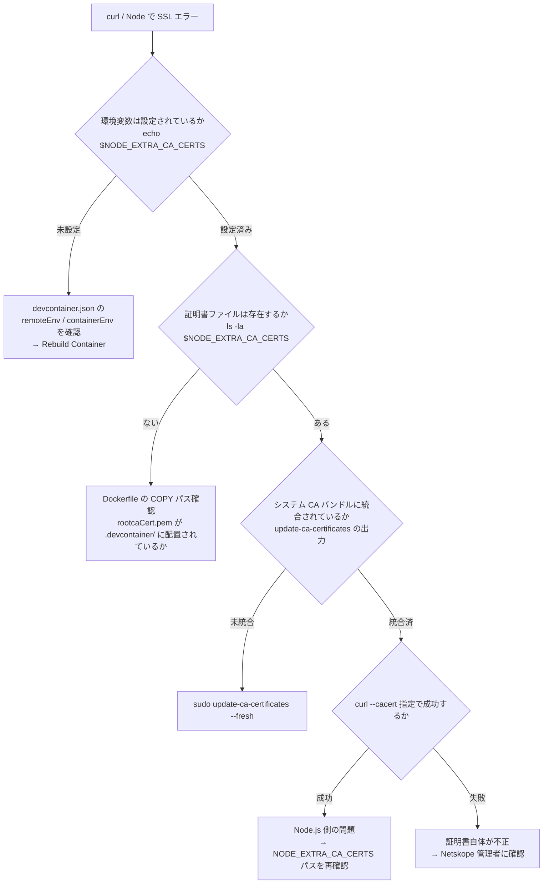
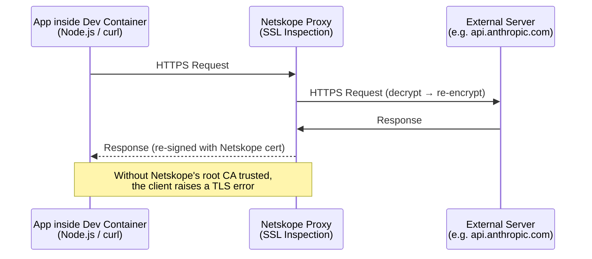
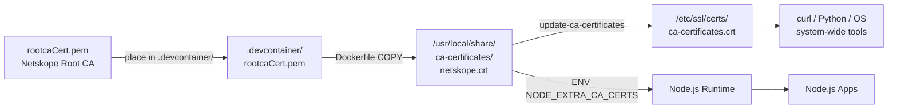
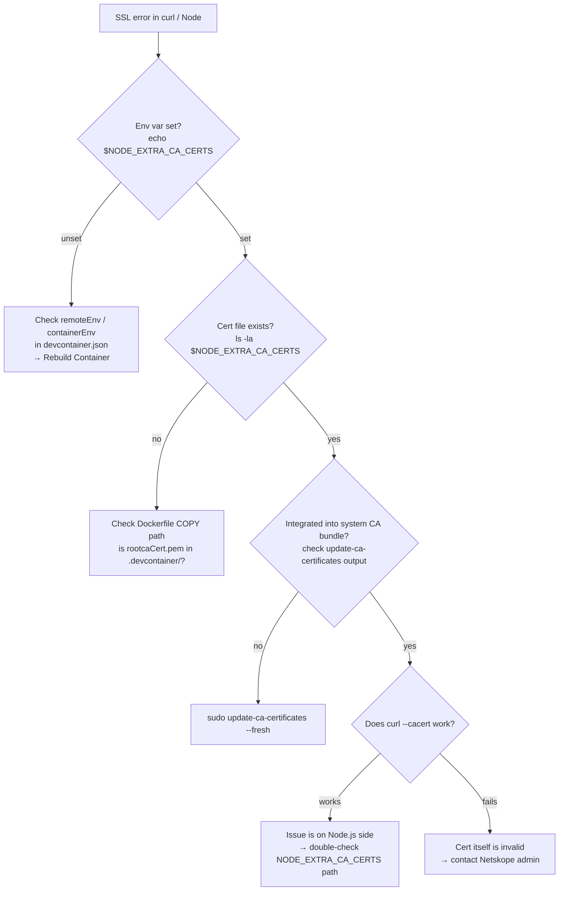

# Dev Container 企業プロキシ証明書セットアップ手順 / Corporate Proxy Certificate Setup for Dev Container

Netskope などの SSL インスペクション型プロキシ環境下で、Dev Container 内の Node.js / curl / その他ツールから HTTPS 通信が成功するように、ルートCA証明書を組み込む手順。

Procedure for installing a root CA certificate into a Dev Container so that Node.js, curl, and other tools can make HTTPS calls through an SSL-inspecting corporate proxy such as Netskope.

---

## 日本語版

### 背景

SSL インスペクション型プロキシ（Netskope など）は、HTTPS 通信を中間で復号し、プロキシ独自の証明書で再署名する。そのため、クライアント側で**プロキシのルートCAを信頼するストアに追加**しないと、自己署名証明書エラーになる。

Dev Container はホストOSと独立した Linux 環境なので、Windows ホスト側の証明書ストアは効かない。**コンテナ内に証明書を別途インストール**する必要がある。

### 通信フロー



### セットアップ構成


### 手順

#### 1. 証明書ファイルを `.devcontainer/` に配置

Netskope 管理者から入手したルートCA証明書 (`rootcaCert.pem`) を `.devcontainer/` ディレクトリに配置する。

```
.devcontainer/
├── devcontainer.json
├── Dockerfile
└── rootcaCert.pem   ← ここ
```

#### 2. Dockerfile に証明書組み込み処理を追加

[.devcontainer/Dockerfile](../../.devcontainer/Dockerfile)

```dockerfile
FROM mcr.microsoft.com/devcontainers/typescript-node:22

# Netskope ルートCA証明書をシステム証明書ストアに登録
COPY rootcaCert.pem /usr/local/share/ca-certificates/netskope.crt
RUN update-ca-certificates

# Node.js にも証明書を認識させる
ENV NODE_EXTRA_CA_CERTS=/usr/local/share/ca-certificates/netskope.crt
```

**ポイント:**

- `/usr/local/share/ca-certificates/` に `.crt` 拡張子で配置すると `update-ca-certificates` の対象になる
- `update-ca-certificates` は `/etc/ssl/certs/ca-certificates.crt` に証明書を統合し、curl / Python / OpenSSL ベースの全ツールから参照される
- Node.js は OS 証明書ストアを直接読まないため、`NODE_EXTRA_CA_CERTS` を明示的に指定する

#### 3. devcontainer.json で image → build に切り替え + 環境変数設定

[.devcontainer/devcontainer.json](../../.devcontainer/devcontainer.json)

```jsonc
{
  "name": "AWS Auth PoC",
  "build": {
    "dockerfile": "Dockerfile"
  },

  // ... 中略 ...

  "remoteEnv": {
    "NODE_EXTRA_CA_CERTS": "/usr/local/share/ca-certificates/netskope.crt"
  },
  "containerEnv": {
    "NODE_EXTRA_CA_CERTS": "/usr/local/share/ca-certificates/netskope.crt"
  },

  "remoteUser": "node"
}
```

**`remoteEnv` と `containerEnv` の違い:**

| 設定 | 適用対象 |
|---|---|
| `containerEnv` | コンテナ起動時に設定される。コンテナ内の全プロセスに継承される |
| `remoteEnv` | VS Code が開くターミナルや拡張機能プロセスに対して設定される |

両方書くのが確実。

#### 4. コンテナ再ビルド

VS Code で:

```
Ctrl+Shift+P → Dev Containers: Rebuild Container
```

#### 5. 動作確認

```bash
# 環境変数
echo $NODE_EXTRA_CA_CERTS
# → /usr/local/share/ca-certificates/netskope.crt

# システム CA バンドルへの統合確認
openssl x509 -in /usr/local/share/ca-certificates/netskope.crt -noout -subject

# curl で TLS 成功するか
curl -sSI https://api.anthropic.com | head -1
# → HTTP/2 404 など (SSL エラーにならない)

# Node.js で TLS 成功するか
node -e "require('https').get('https://api.anthropic.com', (r) => console.log('OK', r.statusCode)).on('error', (e) => console.error('ERR', e.message))"
# → OK 404 など
```

HTTP ステータスが返れば TLS ハンドシェイク成功。ステータスコード (`200` / `404` 等) は通信内容次第で問題ない。

### トラブルシューティング



### 注意事項

- **証明書ファイルのコミット**: `rootcaCert.pem` は企業プロキシのルートCAで、一般には秘匿情報ではないが、組織ポリシーによってはコミット対象外にする。`.gitignore` で除外するか判断が必要
- **Netskope OFF 時**: Netskope をオフにすると、プロキシ経由にならず通常の公的CA経由になるため、この証明書は無くても通信可能。設定したままでも副作用はない（追加CAが信頼されるだけ）
- **Python / AWS CLI**: `update-ca-certificates` でシステムバンドルに統合されているため、特別な設定不要
- **pip の場合**: `pip` は独自の CA バンドル (`certifi`) を使うため、別途 `PIP_CERT` や `REQUESTS_CA_BUNDLE` の設定が必要な場合がある

---

## English Version

### Background

SSL-inspecting proxies (such as Netskope) intercept HTTPS traffic, decrypt it, and re-sign it with the proxy's own certificate. Clients must **trust the proxy's root CA** or they will see self-signed certificate errors.

A Dev Container is an isolated Linux environment — the host OS (Windows) certificate store does not apply. The certificate must be **installed inside the container** separately.

### Traffic Flow



### Setup Architecture



### Steps

#### 1. Place the certificate in `.devcontainer/`

Obtain the root CA certificate from your Netskope administrator and drop `rootcaCert.pem` into the `.devcontainer/` directory.

```
.devcontainer/
├── devcontainer.json
├── Dockerfile
└── rootcaCert.pem   ← here
```

#### 2. Update Dockerfile to install the certificate

[.devcontainer/Dockerfile](../../.devcontainer/Dockerfile)

```dockerfile
FROM mcr.microsoft.com/devcontainers/typescript-node:22

# Register Netskope root CA to the system trust store
COPY rootcaCert.pem /usr/local/share/ca-certificates/netskope.crt
RUN update-ca-certificates

# Tell Node.js about the cert too
ENV NODE_EXTRA_CA_CERTS=/usr/local/share/ca-certificates/netskope.crt
```

**Key points:**

- Files placed under `/usr/local/share/ca-certificates/` with `.crt` extension are picked up by `update-ca-certificates`
- `update-ca-certificates` merges the cert into `/etc/ssl/certs/ca-certificates.crt`, which is read by curl, Python, and all OpenSSL-based tools
- Node.js does **not** read the OS trust store directly, so `NODE_EXTRA_CA_CERTS` must be set explicitly

#### 3. Switch devcontainer.json from `image` to `build` + set env vars

[.devcontainer/devcontainer.json](../../.devcontainer/devcontainer.json)

```jsonc
{
  "name": "AWS Auth PoC",
  "build": {
    "dockerfile": "Dockerfile"
  },

  // ... snip ...

  "remoteEnv": {
    "NODE_EXTRA_CA_CERTS": "/usr/local/share/ca-certificates/netskope.crt"
  },
  "containerEnv": {
    "NODE_EXTRA_CA_CERTS": "/usr/local/share/ca-certificates/netskope.crt"
  },

  "remoteUser": "node"
}
```

**`remoteEnv` vs `containerEnv`:**

| Setting | Scope |
|---|---|
| `containerEnv` | Set at container creation, inherited by all processes in the container |
| `remoteEnv` | Applied to VS Code's terminals and extension host processes |

Setting both is the safest.

#### 4. Rebuild the container

In VS Code:

```
Ctrl+Shift+P → Dev Containers: Rebuild Container
```

#### 5. Verify

```bash
# Env var
echo $NODE_EXTRA_CA_CERTS
# → /usr/local/share/ca-certificates/netskope.crt

# Check cert file is valid
openssl x509 -in /usr/local/share/ca-certificates/netskope.crt -noout -subject

# Check TLS works with curl
curl -sSI https://api.anthropic.com | head -1
# → HTTP/2 404 etc. (no SSL error)

# Check TLS works in Node.js
node -e "require('https').get('https://api.anthropic.com', (r) => console.log('OK', r.statusCode)).on('error', (e) => console.error('ERR', e.message))"
# → OK 404 etc.
```

Any HTTP status response means the TLS handshake succeeded. The specific status code (`200` / `404` etc.) depends on the endpoint and is not a problem here.

### Troubleshooting



### Notes

- **Committing the certificate**: `rootcaCert.pem` is a corporate proxy root CA, generally not considered secret, but check your organization's policy before committing. Consider `.gitignore` if needed.
- **When Netskope is OFF**: With Netskope disabled, traffic goes through public CAs and this cert is not required. Leaving it installed causes no side effects (just an extra trusted CA).
- **Python / AWS CLI**: No extra config needed — they read the system CA bundle populated by `update-ca-certificates`.
- **pip**: `pip` uses its own CA bundle (`certifi`). You may need to set `PIP_CERT` or `REQUESTS_CA_BUNDLE` separately.
