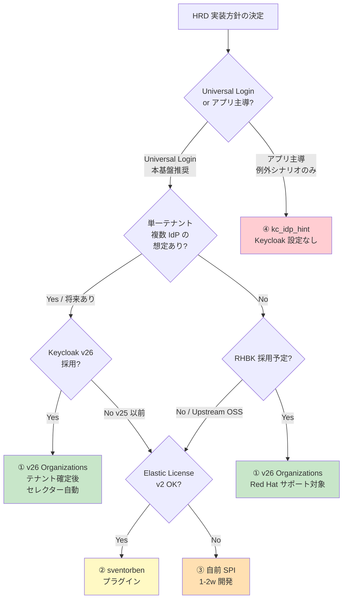

# HRD 実装リファレンス — Keycloak v26 での Home Realm Discovery 設定と単一テナント複数 IdP 対応

> **目的**: 認証基盤として HRD を実装するときの (1) アーキテクチャモデル選択（Universal Login vs アプリ主導）、(2) Keycloak v26 での 4 つの実装オプション、(3) 単一テナントが複数 IdP を持つケースの対応パターン を集約した implementation reference doc。
> **対象読者**: 認証基盤設計者 / Keycloak 実装担当 / 顧客 PoC 担当
> **前提**: 本基盤は [§FR-2.3.3](../requirements/proposal/fr/02-federation.md) で **A 案 HRD（メールドメインベース）を推奨ベースライン**、[§FR-2.3.3.C](../requirements/proposal/fr/02-federation.md) で **A+C ハイブリッド**（基本 HRD + 大口顧客のみ組織固有 URL）を方針化。本ドキュメントはその「HRD 部分」の実装層を詳述。
> **関連**:
> - [§FR-2.3.3 ログイン画面で IdP 選択 UX / Home Realm Discovery](../requirements/proposal/fr/02-federation.md) — UX パターン 3 案の比較
> - [§FR-2.3.3.C Keycloak ハイブリッド構成リファレンス](../requirements/proposal/fr/02-federation.md) — A+C ハイブリッドの実装
> - **§FR-2.3.3.D Keycloak HRD 実装方式選定**（本ドキュメントの要件定義サマリ版）
> - [identity-broker-multi-idp.md](identity-broker-multi-idp.md) — Identity Broker パターン全体
> - [realm-separation-citations.md](realm-separation-citations.md) — Single Realm + 論理分離の根拠
> - [broker-data-model.md](broker-data-model.md) — broker が保持するデータモデル

---

## 目次

1. [Universal Login vs アプリ主導 HRD](#1-universal-login-vs-アプリ主導-hrd)
2. [Keycloak v26 での HRD 実装 4 オプション](#2-keycloak-v26-での-hrd-実装-4-オプション)
3. [単一テナントが複数 IdP を持つ場合の対応 4 パターン](#3-単一テナントが複数-idp-を持つ場合の対応-4-パターン)
4. [realm.json / Organizations 設定サンプル](#4-realmjson--organizations-設定サンプル)
5. [選定フロー](#5-選定フロー)
6. [Stage B での検証推奨項目](#6-stage-b-での検証推奨項目)

---

## 1. Universal Login vs アプリ主導 HRD

### 1.1 構造の違い

| 観点 | アプリ主導 HRD | Universal Login HRD（**本基盤の前提**）| Identity-First Login（亜種）|
|---|---|---|---|
| メアド入力フィールドの場所 | 各アプリのログイン画面 | 認証基盤の `/auth` ページ | **アプリ側 + 認証基盤両方** |
| ドメイン→IdP マッピング保持 | 各アプリ or 共通 API | **認証基盤** | **認証基盤**（アプリは `login_hint` を渡すだけ）|
| 新規顧客追加時の変更箇所 | 各アプリ（マッピング更新 or API 経由）| 認証基盤 1 箇所 | 認証基盤 1 箇所 |
| マッピング知識の所在 | アプリに分散 | 認証基盤に集約 | 認証基盤に集約 |
| ブランディング統一 | アプリ間でバラつくリスク | 統一 | アプリのランディング感維持 + 認証基盤の統一 |
| 業界実例 | （ほぼなし）| Microsoft 365 / Auth0 / Okta / Cognito Hosted UI | Auth0 New Universal Login / Okta Sign-In Widget |

### 1.2 なぜ認証基盤の場合は Universal Login が論理的帰結か

[§C-1 Identity Broker パターン](../requirements/proposal/common/01-architecture.md) を採る時点で、以下の構造的制約が発生します:

1. **顧客追加で各システム変更不要**（[§FR-2.3 要件](../requirements/proposal/fr/02-federation.md)）= マッピングはアプリに分散させない
2. **複数アプリ × 複数顧客の組合せ爆発を避ける**: アプリ主導なら N アプリ × M 顧客の組合せでマッピング同期が必要
3. **issuer 統一の利点維持**（[realm-separation-citations.md](realm-separation-citations.md)）と整合: HRD は認証基盤の責務、JWT 検証は各システムの責務

→ **アプリ主導 HRD は、認証基盤を「ただのトークン発行サーバ」に格下げするアンチパターン**。

### 1.3 Identity-First Login（推奨される UX 最適化）

「メアド先取りをアプリ側でやりたいが、マッピング知識は基盤に集約したい」を両立する標準パターン:

```
[1] ユーザーがアプリのランディングページ
    ┌───────────────────────────┐
    │  Welcome to Expense App     │
    │                             │
    │  📧 メアド: [____________]   │
    │     [次へ →]                │
    └───────────────────────────┘
        ↓ (アプリ側で何もせず、ただ submit)

[2] アプリが OIDC リダイレクト
    GET /authorize?
        client_id=expense-app&
        login_hint=tanaka@acme.com&    ← メアドだけ渡す
        scope=openid&
        response_type=code

[3] Keycloak が login_hint からドメイン抽出
    "tanaka@acme.com" → "acme.com" → Acme Entra ID
    （マッピング知識は Keycloak 側）

[4] Acme Entra ID にリダイレクト（基盤側の画面は出ない）

[5] パスワード + MFA → アプリへ
```

**特徴**:
- アプリのランディング感が保たれる（UX 体験はアプリの一部）
- マッピング知識は認証基盤に集約（運用面の利点を維持）
- OIDC 標準の `login_hint` パラメータを使用（[OIDC Core §3.1.2.1](https://openid.net/specs/openid-connect-core-1_0.html)）

**[§FR-2.3.3](../requirements/proposal/fr/02-federation.md) 推奨**: 本基盤は Universal Login が基本、**Identity-First Login をオプション対応** とする。アプリ側で `login_hint` を渡す実装はアプリチームの選択肢として残す。

### 1.4 アプリ主導が許容されるシナリオ（限定的）

例外的にアプリ主導 HRD でも合理性があるケース:

| シナリオ | 理由 |
|---|---|
| アプリが 1 つしかない / 永遠に増えない | マッピング同期コスト = ゼロ |
| アプリ独立性が要件（白ラベル SaaS）| 各アプリが独立した認証 UX を持つ必要 |
| マッピング知識自体がアプリの差別化要素 | 例: HR アプリが社員 DB から IdP を推定 |

→ 本基盤は **これらに該当しない**（複数アプリ × 複数顧客 × 共通基盤運用）ため、Universal Login が答え。

---

## 2. Keycloak v26 での HRD 実装 4 オプション

### 2.1 オプション ①: Keycloak v26 Organizations 機能（ネイティブ）

v25 で Preview、**v26 で GA** した [Organizations 機能](https://www.keycloak.org/docs/latest/server_admin/index.html#configuring-organizations) は **ドメインベース HRD をネイティブサポート**。

#### 構造

```
Realm "auth-poc"
  ├─ Organization "Acme Corp"
  │    ├─ Domains: [acme.com, acme.co.jp]
  │    ├─ Identity Providers: [acme-entra]
  │    └─ Members: ...
  └─ Organization "Globex Inc"
       ├─ Domains: [globex.com]
       ├─ Identity Providers: [globex-okta]
       └─ Members: ...
```

#### 設定方法

1. **Feature flag**: `KC_FEATURES=organization` を Dockerfile or env で有効化
2. **Realm 設定**: `attributes.organizationsEnabled = "true"`（または UI から ON）
3. **各 Organization** に Domain と Identity Provider を紐付け
4. **Browser Flow** に `Organization Identity-First Login` Authenticator を追加（v26 で標準提供）

#### Browser Flow の構成

```
Browser Flow
  └─ Browser Forms
       ├─ Identity-First Login（NEW in v26、メアド入力 → Organization 解決）
       │    ├─ 既存ユーザー + Org IdP マッチ → IdP リダイレクト
       │    └─ ユーザー無し or Org 不明 → Username Password Form
       └─ Browser - Conditional OTP
```

#### メリット・デメリット

| メリット | デメリット |
|---|---|
| ✅ Red Hat 公式サポート対象（RHBK 採用時）| ⚠ v26 GA で比較的新しい、ドキュメント・実例蓄積中 |
| ✅ プラグイン不要、ライセンス問題なし | ⚠ 既存 realm.json に Organizations セクション追加要 |
| ✅ Org Roles・メンバーシップ管理も統合 | ⚠ Org メンバーシップを broker 側で管理することになる |
| ✅ 単一テナント複数 IdP もネイティブで自動セレクター（[§3.2](#32-パターン-b-テナント確定後のセレクター複数-idp-時の本命)）| ⚠ JWT クレームに `organization` が乗る（既存 `tenant_id` との関係整理要）|

### 2.2 オプション ②: コミュニティプラグイン `keycloak-home-idp-discovery`

[sventorben/keycloak-home-idp-discovery](https://github.com/sventorben/keycloak-home-idp-discovery) が業界デファクト。

#### 設定方法

```dockerfile
# Dockerfile に追加
ARG HIDP_VERSION=26.0.1
RUN curl -L -o /opt/keycloak/providers/keycloak-home-idp-discovery.jar \
    https://github.com/sventorben/keycloak-home-idp-discovery/releases/download/v${HIDP_VERSION}/keycloak-home-idp-discovery.jar

RUN /opt/keycloak/bin/kc.sh build
```

1. **JAR 配置** + `kc.sh build`
2. **Browser Flow をコピー** して "Home IdP Discovery" Authenticator に置換
3. **各 IdP の Advanced 設定** に `Home IdP Discovery domains` カスタム属性で `acme.com,acme.co.jp` を設定

#### メリット・デメリット

| メリット | デメリット |
|---|---|
| ✅ 実績豊富、業界で広く使われている | ❌ **Elastic License v2**（3rd-party 提供禁止条項あり、SaaS 提供時は確認要、[hook-architecture-keycloak.md](hook-architecture-keycloak.md) §Elastic License 評価参照）|
| ✅ Keycloak の通常の IdP 設定の延長で動く | ⚠ メンテナーは個人（sventorben 氏）、Keycloak メジャー更新時の対応待ちリスク |
| ✅ Organizations 採用判断を保留できる | ⚠ Dockerfile に組込みが必要 = ビルドパイプライン依存 |
| | ⚠ Red Hat 公式サポート対象外 |

### 2.3 オプション ③: 自前 Authenticator SPI 実装（Java）

`org.keycloak.authentication.Authenticator` インターフェース実装の独自 JAR。

#### 実装スケッチ

```java
public class CustomHomeIdpDiscoveryAuthenticator implements Authenticator {
    @Override
    public void authenticate(AuthenticationFlowContext context) {
        String email = context.getHttpRequest().getDecodedFormParameters().getFirst("email");
        String domain = extractDomain(email);

        // ドメイン → IdP 解決（外部 DB or 設定ファイル参照）
        String idpAlias = resolveIdp(domain, context.getRealm());

        if (idpAlias != null) {
            // IdP リダイレクトに進む
            context.attempted();
            context.getAuthenticationSession().setAuthNote(
                "kc.idp.hint", idpAlias
            );
        } else {
            // 通常の username/password フォームへ
            context.attempted();
        }
    }
}
```

#### メリット・デメリット

| メリット | デメリット |
|---|---|
| ✅ 完全制御（ドメイン以外の判定軸も可、例: IP / User Agent / 時刻 等）| ❌ 開発工数 1-2 週間 |
| ✅ ライセンス問題なし（自社所有）| ❌ Keycloak 内部 API 依存で更新追従コスト |
| ✅ Organizations 非依存で v25 以前にも対応可 | ❌ レビュー・テスト・運用ドキュメント全て自社負担 |

→ ライセンス問題が致命的な場合（ヘルスケア・政府機関で OSS plugin 不可など）の最終手段。

### 2.4 オプション ④: アプリ主導 + `kc_idp_hint` URL パラメータ

Keycloak 側は **何もしない**。アプリ側でドメイン→IdP 解決し、認証基盤に `?kc_idp_hint=acme-entra` を渡す。

#### 設定方法

Keycloak 標準の `Identity Provider Redirector` Authenticator が `kc_idp_hint` を読んで自動リダイレクト。Browser Flow のデフォルト構成で動く。

#### メリット・デメリット

| メリット | デメリット |
|---|---|
| ✅ Keycloak のカスタマイズ完全不要 | ❌ **Universal Login 原則に反する**（[§1.2](#12-なぜ認証基盤の場合は-universal-login-が論理的帰結か)）|
| ✅ 最も単純な実装 | ❌ マッピング知識がアプリに分散 |
| ✅ Identity-First Login の `login_hint` 経路でも使える | ❌ 顧客追加でアプリ変更が発生 |

→ **本基盤の方針外**。ただし [§FR-2.3.3.C ハイブリッド構成](../requirements/proposal/fr/02-federation.md) の C 経路（CloudFront Function が URL → `kc_idp_hint` 変換）では裏で使われている。

### 2.5 4 オプション比較表

| 観点 | ① Organizations | ② プラグイン | ③ 自前 SPI | ④ kc_idp_hint |
|---|:---:|:---:|:---:|:---:|
| 開発工数 | ◎ 設定のみ | ◎ JAR 配置のみ | ❌ 1-2 週間 | ◎ ゼロ |
| ライセンス安全性 | ✅ 公式 | ⚠ Elastic License | ✅ 自社 | ✅ 標準 |
| Red Hat サポート (RHBK 採用時) | ✅ 対象 | ❌ 対象外 | ❌ 対象外 | ✅ 対象 |
| 単一テナント複数 IdP ネイティブ対応 | ✅ | ⚠ 別途設定 | ⚠ 実装次第 | ❌ アプリで処理 |
| マッピング集約 (Universal Login) | ✅ | ✅ | ✅ | ❌ アプリ分散 |
| v25 以前との互換性 | ❌ v25+ Preview / v26 GA | ✅ | ✅ | ✅ |
| 将来の拡張性 | ✅ Red Hat ロードマップに乗る | ⚠ メンテナー次第 | ✅ 自社管理 | – 拡張対象外 |
| **本基盤推奨度** | **★★★★★** | ★★★★ | ★★ | ★（ハイブリッド C 経路の裏で使用のみ） |

### 2.6 推奨判定

```
┌─ Red Hat 公式サポート (RHBK) を採用予定? ─┐
│                                          │
└────────────┬─────────────────────────────┘
             │
        Yes  │  No (Upstream OSS のみ)
             │   │
             ▼   ▼
          [ ① Organizations ]    ← 第一推奨（どちらでも）
                │
                ├─ Elastic License が問題?
                │  ├─ Yes → ③ 自前 SPI
                │  └─ No  → ② プラグインも有力候補
                │
                └─ アプリ側 UX を優先したい?
                   └─ Yes → ①+Identity-First Login (login_hint)
```

---

## 3. 単一テナントが複数 IdP を持つ場合の対応 4 パターン

### 3.1 想定シナリオ

| シナリオ | 例 |
|---|---|
| 親会社 / 子会社で異なる IdP | Acme 本社 = Entra ID / Acme 子会社 = Okta |
| 役職別の IdP 分離 | 一般社員 = Entra ID / 役員 = 独立 PAM 用 Okta |
| 移行期の並行運用 | 旧 Okta → 新 Entra ID の 6 ヶ月並行 |
| BYOD / 個人アカウント許容 | Acme 社員アカウント or Google 個人アカウント どちらも可 |

### 3.2 パターン A: ドメインサブ分割

メアドドメインで IdP がはっきり分かれる場合 = **通常の HRD でそのまま対応可**。

```
[1] alice@hq.acme.com 入力
    → ドメイン hq.acme.com → Acme Entra ID
[2] bob@sub.acme.com 入力
    → ドメイン sub.acme.com → Subsidiary Okta
```

**Keycloak Organizations 設定**:
```json
{
  "name": "Acme Corp",
  "domains": [
    {"name": "hq.acme.com", "verified": true},
    {"name": "sub.acme.com", "verified": true}
  ],
  "identityProviders": [
    {"alias": "acme-entra", "domains": ["hq.acme.com"]},
    {"alias": "acme-okta", "domains": ["sub.acme.com"]}
  ]
}
```

→ Organizations の domain-to-IdP マッピング機能で自動振り分け。ユーザー操作はメアド入力 1 回のみ。

### 3.3 パターン B: テナント確定後のセレクター（複数 IdP 時の本命）

ドメインで分けられない場合（`@acme.com` の中に Entra ID 派と Okta 派が混在）は **2 段階フロー**:

```
[1] メアド入力: alice@acme.com
[2] 基盤が「acme.com → Acme Corp テナント」を判定
[3] Acme Corp に紐付く IdP が複数 →
    ┌─ Acme Corp のログイン方法 ─┐
    │  [Microsoft Entra でログイン] │
    │  [Okta でログイン]            │
    └──────────────────────────────┘
[4] ユーザーが選択 → 顧客 IdP へ
```

**ポイント**:
- ステップ [3] の選択肢は **「そのテナントの IdP のみ」** に絞られる
- 他社の IdP は表示されない（テナント混同リスクなし）
- 通常の IdP セレクター（[§FR-2.3.3 B 案](../requirements/proposal/fr/02-federation.md)）と違い、**テナント確定後の限定セレクター**

**Keycloak Organizations 設定**: v26 Organizations は **複数 IdP を持つ Org でデフォルトでこの 2 段階フローに自動分岐する**。

```json
{
  "name": "Acme Corp",
  "domains": [{"name": "acme.com", "verified": true}],
  "identityProviders": [
    {"alias": "acme-entra"},
    {"alias": "acme-okta"}
  ]
}
```

→ Identity-First Login Authenticator が「Org IdP が 1 つ = 即リダイレクト / 複数 = セレクター」を自動判定。

### 3.4 パターン C: 既存ユーザーの前回 IdP で直行（Account Linking 連動）

[project_account_linking_investigation](../../.claude/projects/-Users-suepie-Develop-10-project-aws-atuh-poc/memory/project_account_linking_investigation.md) の First Broker Login Flow と組み合わせ:

```
[1] alice@acme.com 入力
[2] 基盤が既存ユーザー（過去ログイン履歴あり）を発見
[3] federated_identity テーブルで「前回 Entra でログイン」と判明
[4] Entra に直行（セレクター省略）
```

**実装**: Browser Flow に `Detect Existing Broker User` + 既存ユーザーがあれば前回 IdP で直行する Conditional Authenticator を組む。

**注意**: 「**今回は別 IdP で入りたい**」ケース（普段 Entra、特権操作で Okta）を救うには:
- 強制的にセレクター表示する URL パラメータを用意（例: `?force_picker=true`）
- アプリ側に明示指定リンクを置く（例: 「別の方法でログイン」）

### 3.5 パターン D: アプリ主導の明示指定（特権ユース・例外シナリオ）

アプリ側で IdP を明示指定:

```html
<!-- アプリのログイン画面 -->
<a href="/authorize?client_id=...&kc_idp_hint=acme-entra">通常ログイン</a>
<a href="/authorize?client_id=...&kc_idp_hint=acme-okta-priv">特権ログイン</a>
```

→ 通常は HRD、特権モードはアプリから直接指定。両方使える。

### 3.6 4 パターン使い分けマトリクス

| 状況 | 推奨パターン | Keycloak 側設定 |
|---|---|---|
| メアドドメインで自然に分割可 | **A. ドメインサブ分割** | Organizations の domain ↔ IdP マッピング |
| 同一ドメイン内に複数 IdP | **B. テナント確定後セレクター** | Organizations 機能（v26 デフォルト動作）|
| 多くのユーザーは前回 IdP に直行で OK、たまに切替必要 | **C. 前回 IdP 記憶 + 切替リンク** | Browser Flow に Detect Existing User + 強制切替パラメータ |
| 特権操作・例外シナリオ | **D. アプリ主導明示指定** | 設定不要、`kc_idp_hint` クエリで足りる |

→ **多くの実プロジェクトは B が主流**（同一ドメイン内多 IdP は移行期で頻発）。Organizations を採用すれば B は自動動作。

---

## 4. realm.json / Organizations 設定サンプル

### 4.1 Dockerfile に Organizations feature を追加

[本リポの Dockerfile](../../keycloak/Dockerfile) を以下のように更新:

```dockerfile
FROM quay.io/keycloak/keycloak:26.2 AS builder

ENV KC_DB=postgres
ENV KC_HEALTH_ENABLED=true
ENV KC_METRICS_ENABLED=true
# organization feature を追加 (HRD 用)
ENV KC_FEATURES=token-exchange,token-exchange-standard,admin-fine-grained-authz,organization

RUN /opt/keycloak/bin/kc.sh build

FROM quay.io/keycloak/keycloak:26.2
COPY --from=builder /opt/keycloak/ /opt/keycloak/
COPY config/realm-export.json /opt/keycloak/data/import/
ENTRYPOINT ["/opt/keycloak/bin/kc.sh"]
```

### 4.2 realm.json に Organizations を追加

```json
{
  "realm": "auth-poc",
  "attributes": {
    "userProfileEnabled": "true",
    "organizationsEnabled": "true"
  },
  "identityProviders": [
    {
      "alias": "acme-entra",
      "displayName": "Acme Corp (Microsoft)",
      "providerId": "oidc",
      "enabled": true,
      "trustEmail": true,
      "config": {
        "issuer": "https://login.microsoftonline.com/${ACME_TENANT_ID}/v2.0",
        "clientId": "${ACME_ENTRA_CLIENT_ID}",
        "clientSecret": "${ACME_ENTRA_CLIENT_SECRET}",
        "syncMode": "IMPORT"
      }
    },
    {
      "alias": "acme-okta",
      "displayName": "Acme Corp (Okta)",
      "providerId": "oidc",
      "enabled": true,
      "trustEmail": true,
      "config": {
        "issuer": "https://${ACME_OKTA_DOMAIN}/oauth2/default",
        "clientId": "${ACME_OKTA_CLIENT_ID}",
        "clientSecret": "${ACME_OKTA_CLIENT_SECRET}",
        "syncMode": "IMPORT"
      }
    }
  ],
  "organizations": [
    {
      "name": "Acme Corp",
      "alias": "acme",
      "description": "Acme Corporation - hybrid Entra/Okta during migration",
      "redirectUrl": "",
      "domains": [
        {
          "name": "acme.com",
          "verified": true
        }
      ],
      "identityProviders": [
        {"alias": "acme-entra"},
        {"alias": "acme-okta"}
      ],
      "attributes": {
        "tenant_id": ["acme-corp"]
      }
    },
    {
      "name": "Globex Inc",
      "alias": "globex",
      "domains": [
        {"name": "globex.com", "verified": true}
      ],
      "identityProviders": [
        {"alias": "globex-okta"}
      ],
      "attributes": {
        "tenant_id": ["globex-inc"]
      }
    }
  ]
}
```

### 4.3 Identity-First Login Authenticator を Browser Flow に組込み

Admin Console 経由 or kcadm.sh:

```bash
# Browser Flow をコピー
kcadm.sh copy authentication/flows/browser \
  -r auth-poc -s "newName=browser-with-identity-first"

# Identity-First Login Authenticator を追加 (v26 で標準提供)
kcadm.sh create authentication/flows/browser-with-identity-first/executions \
  -r auth-poc \
  -s "provider=organization-identity-first-login" \
  -s "requirement=ALTERNATIVE"

# Realm のデフォルト Browser Flow を切替
kcadm.sh update realms/auth-poc \
  -s "browserFlow=browser-with-identity-first"
```

### 4.4 既存 tenant_id クレームとの整合

本基盤の Protocol Mapper（[realm-export.json](../../keycloak/config/realm-export.json)）は既に `tenant_id` を user attribute → claim 変換。Organizations 採用時は **Organization 属性 → user attribute 反映** の Mapper を追加:

```json
{
  "name": "tenant_id_from_org",
  "protocol": "openid-connect",
  "protocolMapper": "oidc-organization-mapper",
  "consentRequired": false,
  "config": {
    "id.token.claim": "true",
    "access.token.claim": "true",
    "claim.name": "tenant_id",
    "jsonType.label": "String"
  }
}
```

→ **Organization に属するユーザーは Org の `tenant_id` 属性から自動注入**、既存の手動 user attribute 設定は段階的に Organizations に移行可能。

---

## 5. 選定フロー



---

## 6. Stage B での検証推奨項目

[phase10-stage-a-verification.md](phase10-stage-a-verification.md) の Stage B に HRD 検証を追加する場合:

| Task | 内容 | 工数 | 検証目的 |
|---|---|---|---|
| HRD-B1 | Dockerfile に `KC_FEATURES=organization` を追加して fresh build | 0.5d | feature flag 有効化の動作確認 |
| HRD-B2 | realm.json に Organization "Acme Corp" + 2 IdP (entra/okta mock) を追加して import | 0.5d | Organization スキーマ習得 |
| HRD-B3 | Identity-First Login Authenticator を Browser Flow に組込み | 0.5d | v26 新機能の動作確認 |
| HRD-B4 | alice@acme.com で **メアド入力 → セレクター 2 つ表示** を確認 | 0.5d | パターン B（同一ドメイン複数 IdP）の動作 |
| HRD-B5 | bob@hq.acme.com / charlie@sub.acme.com で **ドメインサブ分割で直接 IdP リダイレクト** | 0.5d | パターン A の動作 |
| HRD-B6 | アプリから `?login_hint=alice@acme.com` を渡して **基盤側の画面スキップ** | 0.5d | Identity-First Login UX 最適化 |
| HRD-B7 | 既存の `tenant_id` クレームが Organization 属性経由でも注入されることを E2E 確認 | 1d | 既存実装との整合 |

→ Stage B で実機検証することで、本ドキュメントの設定値が机上ではなく動作確認済みリファレンスになる。

---

## 改訂履歴

- 2026-06-11: 初版作成。Universal Login vs アプリ主導の比較、Keycloak v26 での HRD 実装 4 オプション（Organizations / プラグイン / 自前 SPI / kc_idp_hint）、単一テナント複数 IdP の 4 パターン、realm.json / Organizations 設定サンプル、選定フロー、Stage B 検証推奨項目を統合
