# Identity Broker パターン：マルチ顧客IdP対応設計

**作成日**: 2026-04-20
**目的**: 複数の外部顧客がそれぞれ独自のIdP（Entra ID、Okta、Google Workspace等）を
持つ環境で、共通認証基盤をIdentity Broker（仲介者）として運用し、各システムへの
影響を最小化するアーキテクチャを定義する。

---

## 1. 背景と要件

### 想定するユースケース

- 複数の外部顧客企業が、それぞれ自社のIdP��Entra ID、Okta等）を利用している
- 社内には複数のシステム（経費精算、出張予約、勤怠管理等）が存在する
- 顧客は今後も増え続ける（IdP接続が増加する）
- **各システムは顧客追加のたびに変更したくない**

### 課題

顧客が増えるたびに各システムにIdP設定を追加していくと、
以下の問題が発生する：

- 顧客10社 × システム5個 = **50個のIdP接続設定**
- 顧客追加時に全システムのリリースが必要
- 各システムが各IdPのクレーム差異を吸収する必要がある
- テスト・セキュリティレビューの範囲が膨大になる

---

## 2. Identity Broker パターンとは

### 概要

Identity Broker（ID仲介者）とは、複数の外部IdPとアプリケーション群の間に立ち、
認証を仲介するアーキテクチャパターン。

**核心**：各システムは「共通基盤が発行したJWT」だけを検証すれば良い。
外部IdPの種類・数・プロトコル差異をすべて共通基盤が吸収する。

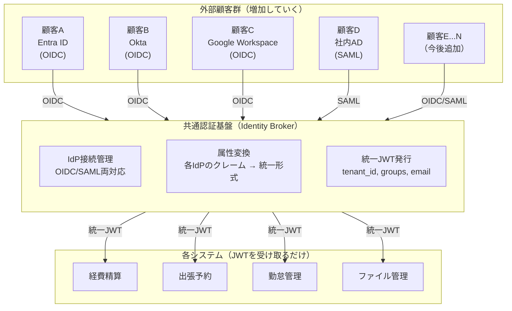

### 業界での採用実績・根拠

- **Microsoft Azure Architecture Center**: マルチテナントソリューションでは、テナントごとに
  異なるIdP（Entra ID, ADFS等）との連携をフェデレーションで集約するパターンを推奨
- **AWS re:Post / Cognito公式ドキュメント**: Cognito User Poolが複数の外部IdPとの間で
  「ブリッジ」として機能し、属性マッピングにより統一トークンを発行する設計が記載
- **Keycloak公式**: Identity Brokering機能により、OIDC/SAMLの複数外部IdPを
  1つのRealmで集約し、アプリケーションには単一のissuerとしてトークンを発行

---

## 3. アーキテクチ��比較

### パターン比較：個別連携 vs Broker

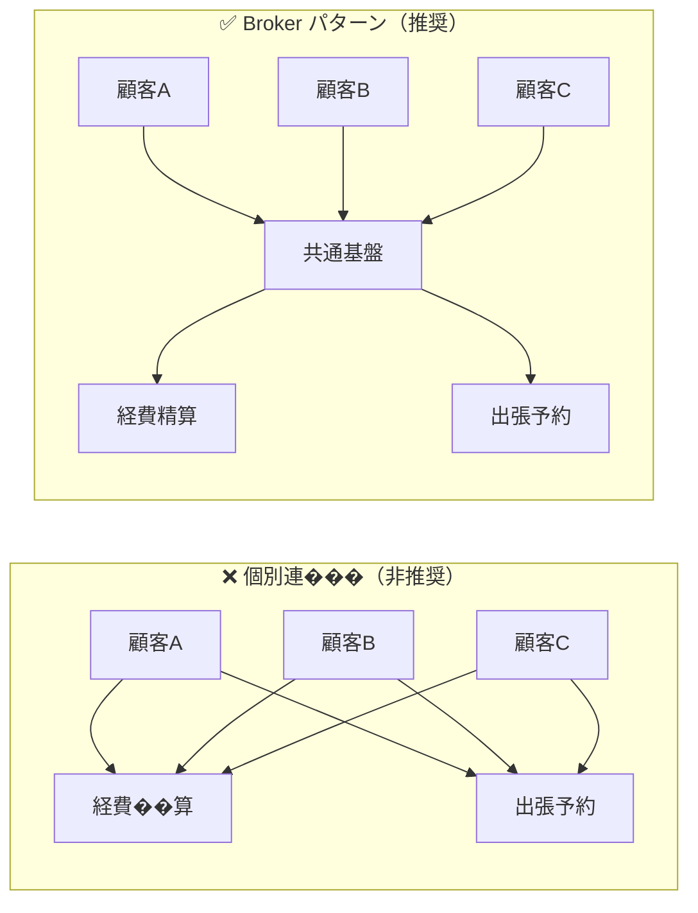

| 観点 | 個別連携 | Broker パターン |
|------|:-------:|:-------------:|
| 顧客10社 × システム5個の接続数 | **50個** | **10個** |
| 顧客追加時の各システム変更 | **全システム要変更** | **変更不要** |
| 各システムが検証するissuer数 | 顧客数分 | **1つだけ** |
| クレーム名差異の吸収 | 各システムで対応 | **共通基盤で一元変換** |
| テスト範囲 | 全組合せ | 共通基盤のみ |
| 管理運用コスト（業界調査※） | 高 | **最大60%削減** |

※ WJAETS-2025 "Understanding federated identity management" による調査

---

## 4. 認証フロー

### 新規顧客（顧客A / Entra ID）のログインフロー

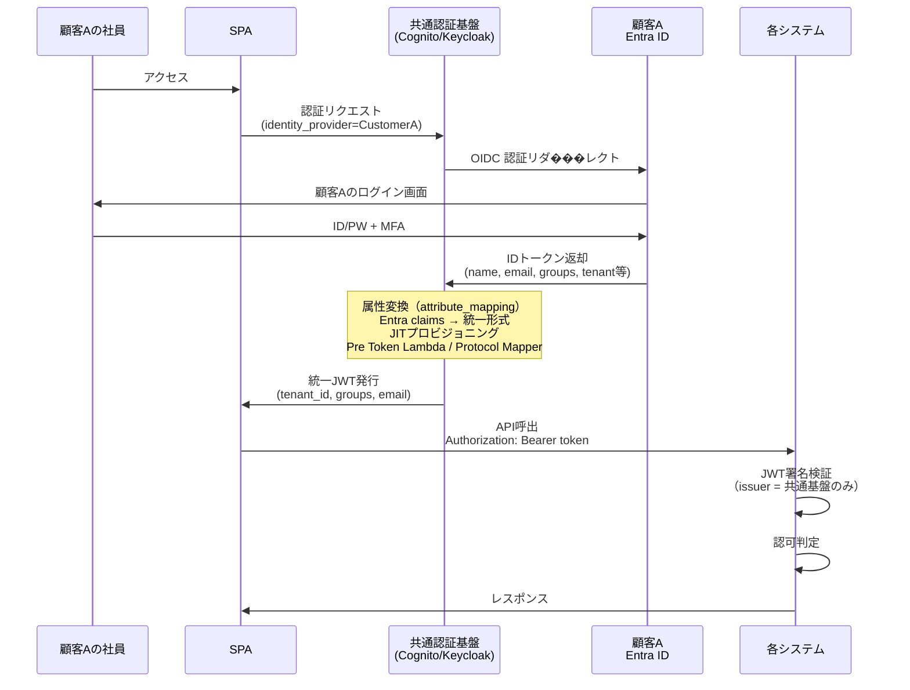

### 2社目の顧客（顧客B / Okta）追加時

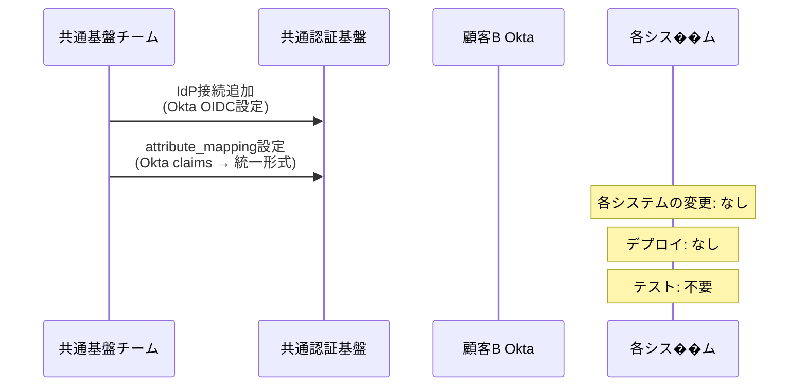

**顧客B追加で各システムに発生する作業: ゼロ**

---

## 5. 属性変換（クレーム統一）

### 各IdPのクレーム差異

各顧客のIdPはクレーム名や構造が異なる。共通基盤がこの差異を吸収する。

| クレーム | Entra ID | Okta | Google | 統一後（JWT） |
|---------|----------|------|--------|:----------:|
| テナントID | `tid` / カスタム属性 | `org_id` | `hd`（ドメイン） | **`tenant_id`** |
| グループ | `groups` (UUID配列) | `groups` (名前配列) | なし | **`groups`** (名前配列) |
| メール | `preferred_username` | `email` | `email` | **`email`** |
| 名前 | `name` | `profile.name` | `name` | **`name`** |

### 変換の実装箇所

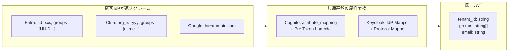

#### Cognito での実装

```hcl
# terraform: 顧客AのIdP接続
resource "aws_cognito_identity_provider" "customer_a_entra" {
  provider_name = "CustomerA-EntraID"
  provider_type = "OIDC"

  attribute_mapping = {
    email             = "preferred_username"
    "custom:tenant_id" = "tid"          # Entra の tid → tenant_id
    username          = "sub"
  }
}

# terraform: 顧客B��IdP接続
resource "aws_cognito_identity_provider" "customer_b_okta" {
  provider_name = "CustomerB-Okta"
  provider_type = "OIDC"

  attribute_mapping = {
    email             = "email"
    "custom:tenant_id" = "org_id"       # Okta の org_id → tenant_id
    username          = "sub"
  }
}
```

#### Keycloak での実装

Admin Console → Identity Providers → 各IdP → Mappers で設定。
各IdPのクレーム名を統一的な User Attribute にマッピングする。

---

## 6. 各システムの実装（変更不要の理由）

### 各システムが知るべきこと（固定）

| 項目 | 値 | 変更頻度 |
|------|-----|:-------:|
| JWT issuer | 共通基盤のURL（1つ） | なし |
| 検証するクレーム | `tenant_id`, `groups`, `email` | なし |
| JWKS エンドポイント | `{issuer}/.well-known/jwks.json` | なし |

### 各システムが知らなくてよいこと

- 顧客がどのIdPを使っているか
- 顧客IdPのクレーム名やプロトコル
- 顧客の追加・削除
- IdP接続設定の詳細

### 認可判定フロー（各システム内部）

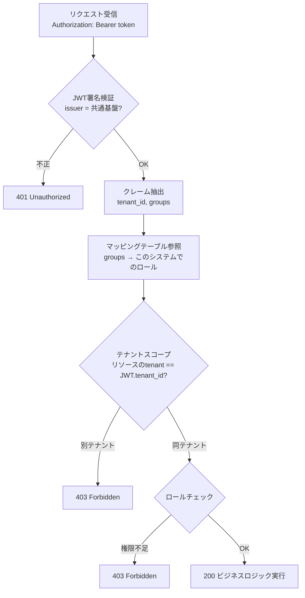

---

## 7. 顧客IdP追加時のワークフロー

### 共通基盤側の作業（30分〜1時間）

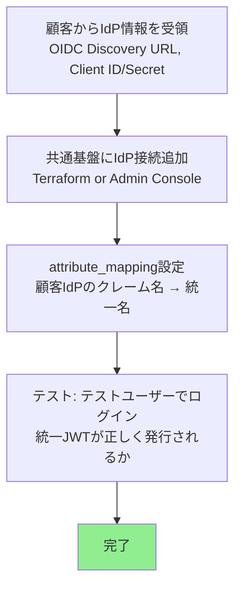

### 各システム側の作業

**なし。** 共通基盤のJWT形式は変わらないため。

---

## 8. スケーラビリティ

### 顧客数増加への耐性

| 顧客数 | IdP接続数 | 各システムへの影響 | 共通基盤の作業 |
|:------:|:--------:|:---------------:|:------------:|
| 1社 | 1 | なし | 初期構築 |
| 10社 | 10 | なし | 各30分の設定追加 |
| 50社 | 50 | なし | 同上 |
| 100社 | 100 | なし | 同上 |

### プラットフォーム別の上限

| プラットフォーム | IdP接続上限 | HA対応 |
|---------------|:---------:|:-----:|
| Cognito | User Pool あたり 300 IdP | マネージド（SLA 99.9%��� |
| Keycloak | 制限なし | クラスタリング対応 |

### 大規模環境でのパフォーマンス

- **JWKSキ��ッシュ**: 各システムはJWKS公開鍵をキャッシュ（5分〜1時間）。
  顧客が増えてもissuerは1つなので、JWKSの取得回数は増えない。
- **JWT検証**: ローカルで実行（1ms以下）。顧客数に影響されない。
- **トークンサイズ**: groups配列が大きくなる場合は注意（4KB上限目安）。

---

## 9. Cognito vs Keycloak：マルチIdP運用の比較

| 観点 | Cognito | Keycloak |
|------|---------|----------|
| IdP追加の自動化 | Terraform で IaC 管理 | Admin Console or Terraform Provider |
| ログイン画面のIdP選択 | SPA側で `identity_provider` パラメータ指定 | **自動表示（設定のみ、SPA変更不要）** |
| 顧客追加時のSPA変更 | IdPボタン追加が必要な場合あり | **不要** |
| attribute_mapping | Terraform で宣言的 | Admin Console IdP Mapper |
| SAML対応 | ✅ | ✅ |
| LDAP直接接続 | ❌ | ✅ |
| 運用負荷 | ◎（マネージド） | △（ECS/RDS管理必要） |
| コスト（175K MAU以下） | ◎（従量課金） | △（固定費 ~$2,620/月） |
| 柔軟性（認証フロー制御） | △ | ◎（Authentication Flow） |

### Keycloakの優位: ログイン画面の自動制御

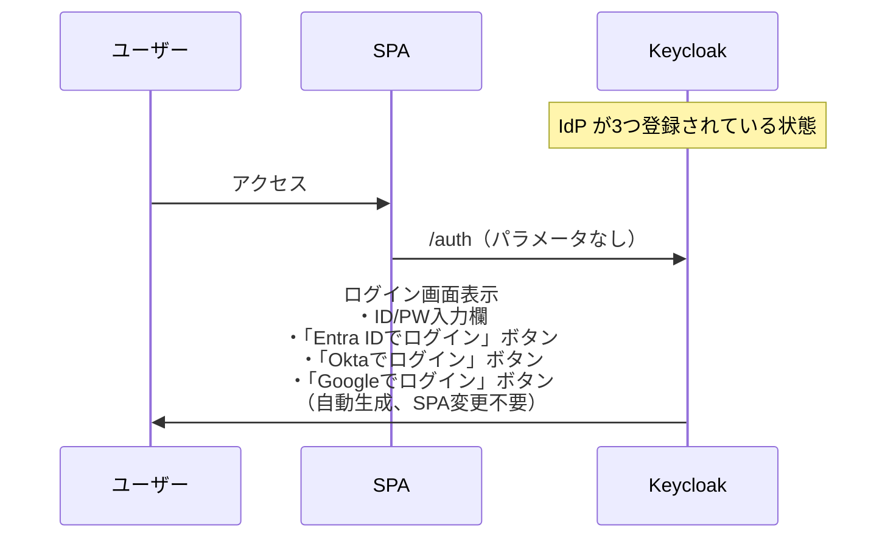

### Cognitoの場合: SPA側でIdP指定が必���

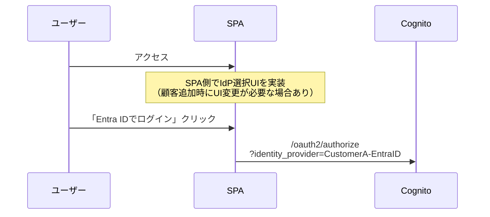

---

## 10. セキュリティ考慮事項

### 10.0 論理分離（Logical Isolation）の仕組み — マルチテナント認証基盤の核心

**論点**: Identity Broker パターン採用時、各顧客の JIT ユーザーレコードが**同一 Pool/Realm 内に同居**する。これがどう論理分離されているかを技術詳細レベルで整理する。

→ 顧客提示版の解説は [proposal §FR-2.3.A.1](../requirements/proposal/fr/02-federation.md#fr-23a1-何が分離共有されているか--論理分離の実態顧客が必ず聞く論点) 参照。本セクションは**実装方式・設定値・OWASP 対策の技術詳細**にフォーカス。

#### 10.0.1 同居の実装イメージ（Cognito 例）

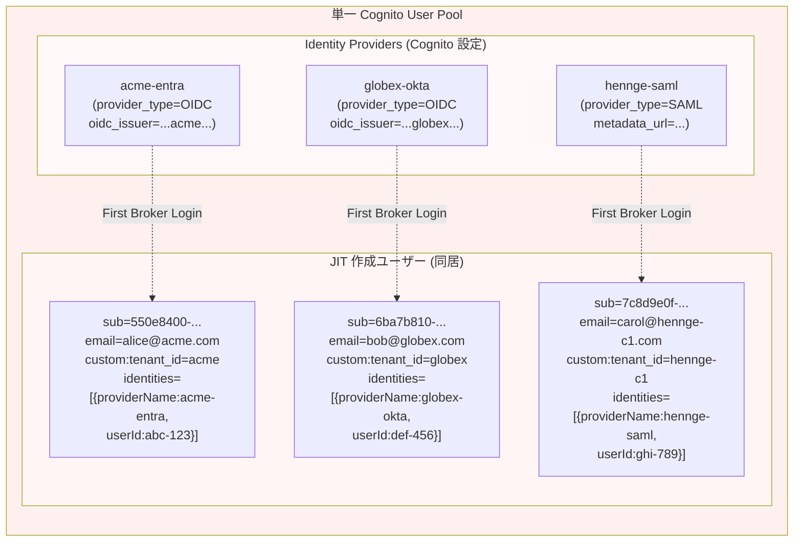

#### 10.0.2 分離・共有マトリクス（実装観点）

| 要素 | 物理場所 | 実装上の分離方式 |
|---|---|---|
| パスワードハッシュ | 各顧客 IdP のみ | OIDC は ID 連携のみで credential を渡さない |
| MFA 秘密鍵（TOTP / FIDO2）| 各顧客 IdP のみ | 同上 |
| JIT ユーザーレコード | 本基盤 User Pool / Realm 内 | `custom:tenant_id` 属性 + `identities` 配列で識別 |
| `identities` クレーム | JWT 内 | `[{providerName, userId, primary, dateCreated}]` 形式で IdP リンク情報を保持 |
| `tenant_id` クレーム | JWT 内 | **Pre Token Lambda V2 / Protocol Mapper で基盤側が必ず注入**（ユーザー自己申告 NG） |
| Cognito Groups / Keycloak Roles | 本基盤側 | テナント別に命名規約（例: `acme-admin`, `globex-admin`）|
| Admin Console | 全テナント横断 | IAM Role / Realm Admin で運用権限を絞る |

#### 10.0.3 `tenant_id` 注入の実装（必須対策）

**Cognito の場合（Pre Token Generation Lambda V2）**:

```python
def handler(event, context):
    user_attrs = event['request']['userAttributes']

    # Auth0 / Entra ID 経由のフェデユーザーなら attribute_mapping で
    # 既に custom:tenant_id がセットされているはず
    tenant_id = user_attrs.get('custom:tenant_id', '')

    # 念のため identities から検証
    identities = user_attrs.get('identities', '[]')
    # identities[0].providerName から「どの IdP 経由か」を判定
    # → tenant_id が provider と整合しているか検証
    # → 不整合なら拒否（攻撃検知）

    event['response'] = {
        'claimsAndScopeOverrideDetails': {
            'idTokenGeneration': {
                'claimsToAddOrOverride': {
                    'tenant_id': tenant_id,  # 基盤側で必ず注入
                }
            },
            'accessTokenGeneration': {
                'claimsToAddOrOverride': {
                    'tenant_id': tenant_id,
                }
            }
        }
    }
    return event
```

**Keycloak の場合（Protocol Mapper）**:

```json
{
  "name": "tenant-id-mapper",
  "protocol": "openid-connect",
  "protocolMapper": "oidc-usermodel-attribute-mapper",
  "config": {
    "user.attribute": "tenant_id",
    "claim.name": "tenant_id",
    "jsonType.label": "String",
    "id.token.claim": "true",
    "access.token.claim": "true",
    "userinfo.token.claim": "true"
  }
}
```

→ いずれも **`tenant_id` をクライアントからの入力ではなく、基盤側の属性 / マッピングから生成**。ユーザーが自己申告で書き換えることは不可能。

#### 10.0.4 JIT 作成時の混同防止（First Broker Login Flow）

**問題シナリオ**: Acme Entra ID の悪意あるユーザーが、`email=bob@globex.com` を主張して Acme として認証成功 → 本基盤側で Globex の bob と混同される可能性

**対策**:
- Cognito: `email` を自動 verified にしない（外部 IdP で verified 済の場合のみ信頼）。`tenant_id` + `email` 複合キーでユニーク制約
- Keycloak: **First Broker Login Flow** で、既存ユーザーとの email 突合せ時に「**自動リンク禁止**」「**確認画面強制**」設定

**Keycloak Realm 設定例**:
```
First Broker Login Flow:
├── Review Profile (UPDATE_PROFILE_ON_FIRST_LOGIN: missing)
├── User existence check
│   ├── Auto link: OFF (重要)
│   └── Confirm link existing account: REQUIRED
└── Create new user
```

#### 10.0.5 Cross-tenant 攻撃ベクター対策（OWASP 観点）

| 攻撃ベクター | 詳細 | 対策実装 |
|---|---|---|
| **JWT `tenant_id` 改ざん** | JWT を Base64 で復号 → `tenant_id` 書き換え → 再 Base64 化 | JWT 署名検証で改ざん検知（Lambda Authorizer / API Gateway Authorizer 標準）|
| **`tenant_id` 自己申告攻撃** | Client が `tenant_id=admin` を attribute として送信 | `write_attributes` から `tenant_id` を**除外**（Cognito App Client 設定）、Keycloak は User Attribute を**読み取り専用**化 |
| **Cross-tenant IDOR**（API レベル）| `/api/expenses/123` で他テナントのリソース ID 推測 | 各 API で `tenant_id` フィルター必須、データ層で WHERE 句強制（ORM / DAO レイヤー）|
| **Admin API 全テナント漏洩** | `ListUsers` で全テナントのユーザーリスト取得 | Admin IAM / Realm Admin Role を**テナント別に分割**、または管理 API 自体を制限 |
| **共有キャッシュ汚染** | キャッシュキー `user:123` で別テナントの 123 と衝突 | キャッシュキーに必ず `tenant_id` プレフィックス（例: `acme:user:123`）|
| **ログ漏洩** | CloudWatch / Event Listener で全テナントのログが見える | IAM 条件で `tenant_id` フィルター、または論理的にログを別ストリームに |

#### 10.0.6 監査要件への対応（SOC 2 / ISO 27001 / GDPR）

論理分離でも、以下を実装すれば**監査要件を満たせる**：

| 要件 | 実装 |
|---|---|
| **誰がいつ何にアクセスしたか追跡可能** | CloudTrail / Event Listener で `tenant_id` + `sub` + 操作内容をログ |
| **テナント間データ越境の防止証跡** | Cross-tenant 拒否（403 Forbidden）のログ記録 |
| **テナント削除時のデータ完全消去**（GDPR Right to Erasure）| `tenant_id` ベースで全データ削除可能な設計 |
| **テナント別アクセス監査** | CloudWatch Insights / Athena で `tenant_id` クエリ可能なログ形式 |

#### 10.0.7 物理分離が必要なケース（B 案 = Pool/Realm per テナント）

論理分離で対応できない場合：

| ケース | 理由 | 対応 |
|---|---|---|
| **データ所在地が契約で物理分離必須** | 金融 / 医療 / 政府系 | 別 Pool/Realm + 別 KMS キー + 別 VPC |
| **暗号化キーの個別管理**（顧客が KMS キーを持ち込み）| 顧客側鍵管理（BYOK）| Pool/Realm 別 + KMS Customer Key |
| **AWS リージョン分離**（データレジデンシー）| GDPR / 国内データ制約 | リージョン別 Pool/Realm |
| **規制上の混在禁止**（金融 vs それ以外）| 業界規制 | カテゴリ別 Pool/Realm |

→ A 案論理分離が標準、**B 案物理分離は契約・規制で要求された時のみ例外的に採用**（[proposal §FR-2.3.A](../requirements/proposal/fr/02-federation.md) 参照）。

#### 10.0.8 業界根拠

- [OWASP Multi-Tenant Security Cheat Sheet](https://cheatsheetseries.owasp.org/cheatsheets/Multi_Tenant_Security_Cheat_Sheet.html) — テナント境界の論理分離標準
- [Microsoft Azure Architecture Center - Architectural Considerations for Identity in a Multitenant Solution](https://learn.microsoft.com/en-us/azure/architecture/guide/multitenant/considerations/identity) — フェデレーション時のユーザーレコード同居は標準
- [WorkOS - Developer's Guide to SaaS Multi-tenant Architecture](https://workos.com/blog/developers-guide-saas-multi-tenant-architecture) — Slack/Notion 等の主要 B2B SaaS が論理分離採用
- [OWASP ASVS V8 Authorization §4.2.3](https://github.com/OWASP/ASVS/blob/master/5.0/en/0x17-V8-Authorization.md) — Multi-tenant access controls 要件
- [Tenant Isolation in Multi-Tenant Systems - SSOJet](https://ssojet.com/blog/tenant-isolation-in-multi-tenant-systems)

---

### 10.0.9 IdP なし顧客のローカル管理時の物理分離オプション

**論点**: フェデユーザーは認証情報（パスワード）が顧客 IdP 側に残るが、**IdP なし顧客（ローカルユーザー）はパスワードハッシュも本基盤側に保存**される。共通 Pool に集約すると**ハッシュも同居**するため、より強力な分離選択肢の検討が必要になる。

→ 顧客提示版は [proposal §FR-2.3.A.2](../requirements/proposal/fr/02-federation.md#fr-23a2-idp-なし顧客のローカルユーザー管理--パスワードハッシュの同居問題) 参照。本セクションは**実装方式の技術詳細**にフォーカス。

#### 10.0.9.1 物理分離の 3 つの実装オプション

##### オプション 1: 顧客別 User Pool (Cognito)

```hcl
# 規制顧客「FinCo」用専用 Pool
resource "aws_cognito_user_pool" "finco_dedicated" {
  name = "${var.project_name}-finco"

  password_policy {
    minimum_length    = 15  # 顧客個別要件
    require_lowercase = true
    require_uppercase = true
    require_numbers   = true
    require_symbols   = true
  }

  # 顧客個別の MFA 強制
  mfa_configuration = "ON"

  # 暗号化キーを顧客別 KMS CMK で
  user_pool_add_ons {
    advanced_security_mode = "ENFORCED"  # Plus tier
  }

  account_recovery_setting { ... }
}
```

**特徴**:
- パスワードハッシュは FinCo 専用 Pool の物理 DB に格納（AWS 管理）
- AWS の管理面では別 ARN、別 endpoint
- 設定変更も他テナントに影響しない
- **issuer が顧客ごとに変わる** → Lambda Authorizer のマルチイシュア対応必須（既存 PoC で実装済）

##### オプション 2: 顧客別 Keycloak Realm

```json
{
  "realm": "finco-dedicated",
  "enabled": true,
  "passwordPolicy": "length(15) and digits(1) and lowerCase(1) and upperCase(1) and specialChars(1) and notUsername() and passwordHistory(5)",
  "bruteForceProtected": true,
  "permanentLockout": false,
  "maxFailureWaitSeconds": 900,
  "failureFactor": 5,
  "otpPolicyType": "totp",
  "webAuthnPolicyRpEntityName": "FinCo Dedicated"
}
```

**特徴**:
- Realm = Keycloak 内の論理境界、内部的に別テーブル群（user_entity, credential 等）
- パスワードハッシュは Realm 単位で分離
- Realm ごとに別パスワードポリシー / MFA 要件 / Authentication Flow を設定可
- **Realm の Aurora 行レベルで分離**されている（厳密にはハッシュ自体は同じテーブルだが Realm ID で論理分離）
- 物理 DB 分離まで必要なら Aurora インスタンス自体を分けるか、Keycloak クラスタを別 VPC に立てる

##### オプション 3: 顧客向け Mini Keycloak（自前 IdP として接続）

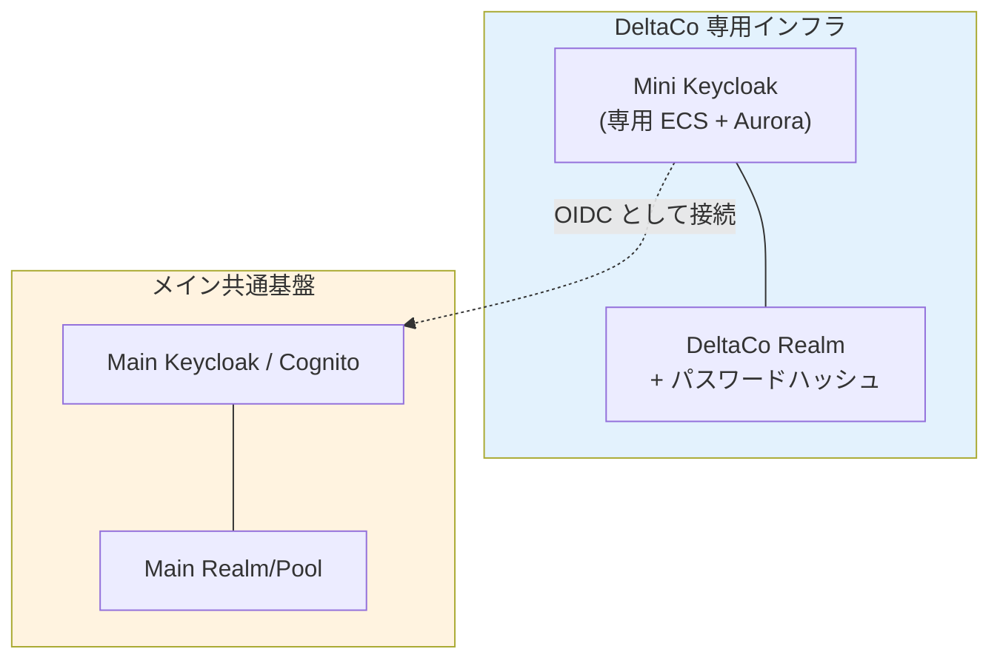

**実装**:
- DeltaCo 専用に **別 ECS + Aurora で Keycloak Realm** を立てる
- メイン共通基盤からは「DeltaCo の OIDC IdP」として接続（フェデ）
- DeltaCo のローカルユーザーは Mini Keycloak Realm のみに存在
- メイン基盤に届くのは「フェデ済みユーザー」状態（パスワードハッシュは来ない）

**メリット**:
- メイン基盤の構造はシンプル（メインから見れば「全部フェデ」）
- 完全物理分離 + 物理インフラ分離

**デメリット**:
- 認証ホップが 1 段増える（レイテンシ ~30-50ms 追加）
- インフラコスト N 倍（Mini KC + Aurora）
- 運用工数 N 倍

#### 10.0.9.2 ハイブリッド構成の実装イメージ（推奨）

```mermaid
flowchart TB
    subgraph Main["メイン共通基盤 (AWS Account: auth-shared)"]
        direction TB
        subgraph MainPool["メイン User Pool / Keycloak Realm"]
            FedAcme["Acme フェデユーザー"]
            FedGlobex["Globex フェデユーザー"]
            LocalDelta["DeltaCo ローカル<br/>+ ハッシュ"]
            LocalMore["他の一般ローカル"]
        end
    end

    subgraph FinCoInfra["金融顧客専用 (AWS Account: auth-finco)"]
        FinPool["FinCo 専用 Pool/Realm<br/>+ KMS CMK<br/>+ パスワードハッシュ<br/>+ Audit Log 分離"]
    end

    subgraph MedCoInfra["医療顧客専用 (AWS Account: auth-medco)"]
        MedPool["MedCo 専用 Pool/Realm<br/>+ KMS CMK<br/>+ パスワードハッシュ"]
    end

    R53["Route 53<br/>顧客別カスタムドメイン"]

    R53 -.auth.example.com.-> MainPool
    R53 -.auth.finco.example.com.-> FinPool
    R53 -.auth.medco.example.com.-> MedPool

    style MainPool fill:#fff8e1
    style FinPool fill:#e8f5e9
    style MedPool fill:#e8f5e9
```

**実装の要点**:
- **AWS マルチアカウント前提**: 規制顧客は別アカウントに分離（IAM 境界も強化）
- **カスタムドメイン**: 顧客ごとに別ドメイン（`auth.finco.example.com`）で識別
- **JWKS / issuer**: 顧客 Pool ごとに別 issuer URL（Lambda Authorizer のマルチイシュア対応で吸収）
- **KMS CMK 分離**: 規制顧客は別 KMS Customer Key で暗号化（BYOK 対応も可）
- **監査ログ分離**: CloudTrail / Event Listener も顧客別出力先に

#### 10.0.9.3 採用判断のフロー

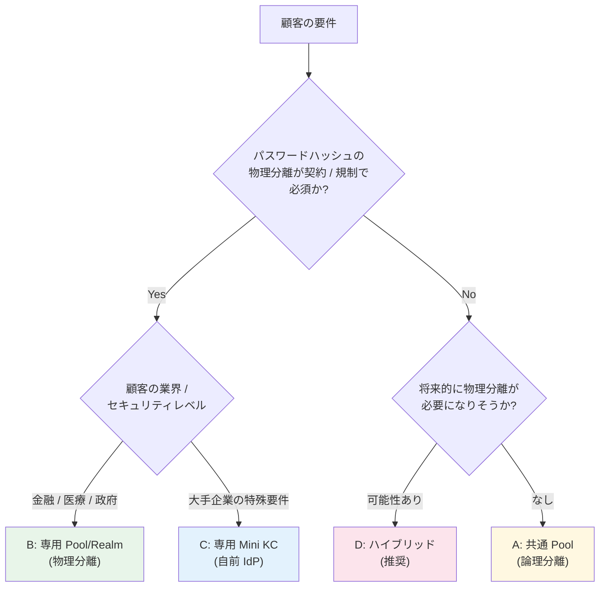

#### 10.0.9.4 コスト比較（10 顧客想定、月額）

| 構成 | 構成内訳 | 月額（インフラのみ）|
|---|---|---|
| **A 共通 Pool**（全 10 顧客）| 1 Pool / 1 Realm | Cognito ~$150 / Keycloak ~$640 |
| **B 専用 Pool × 10**（全顧客別）| 10 Pool / 10 Realm | Cognito ~$1,500 / Keycloak ~$6,400 |
| **C 専用 Mini KC × 10**（全顧客別）| 10 個の ECS + Aurora | ~$6,400+ |
| **D ハイブリッド**（一般 8 + 規制 2）| 1 共通 + 2 専用 | Cognito ~$450 / Keycloak ~$1,920 |

→ **D ハイブリッドが最も現実的**（コスト効率 + セキュリティバランス）。

#### 10.0.9.5 監査・コンプライアンス対応

物理分離（B/C/D）を採用した場合の監査メリット：

| 監査要件 | 共通 Pool（A）| 物理分離（B/C/D）|
|---|---|---|
| 「データ所在地を顧客別に証明可能か」 | ⚠ 同一 DB | ✅ 別 DB / 別アカウント |
| 「暗号化キーを顧客が管理可能か」（BYOK）| ❌ 共通 AWS 管理キー | ✅ 顧客 CMK 設定可 |
| 「障害時の他顧客への影響範囲」 | 全顧客 | 該当顧客のみ |
| 「GDPR Right to Erasure 完全削除」 | tenant_id でフィルタ削除 | Pool 全体削除可（より厳密）|
| 「PCI DSS Tokenization 環境分離」 | 要設計工夫 | ✅ 別 Pool で自然対応 |
| 「ペネトレーションテスト範囲」 | 全顧客 | 顧客別に実施可 |

→ 規制業種（金融・医療・政府）では物理分離が**監査効率化にも寄与**する。

---

### 10.1 テナント分離の保証（要約版）

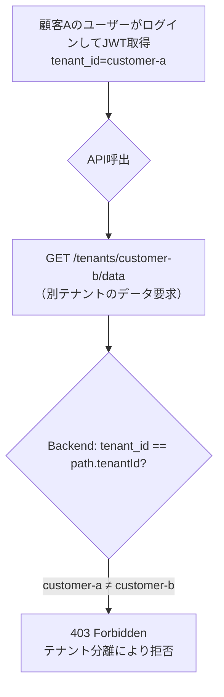

- **tenant_id は共通基盤が設定する**（ユーザーが自己申告できない、§10.0.3 参照）
- 共通基盤の attribute_mapping で、IdP側の組織識別子 → `tenant_id` に変換
- 各システムは `tenant_id` をデータアクセス条件に必ず含める

### 10.2 IdP信頼の管理

- 共通基盤に登録されたIdPのみ信頼される
- 未登録のIdPからのトークンは、共通基盤が拒否（JWTが発行されない）
- 各システムは共通基盤のissuer以外を一切信頼しない

---

## 11. 運用体制

### 役割分担

| 役割 | 担当チーム | 責務 |
|------|----------|------|
| 共通認証基盤の運用 | 共通基盤チーム | IdP接続追加、属性変換設定、障害対応 |
| 顧客IdP情報の受領 | 営業/CS | Client ID/Secret、Discovery URL取得 |
| 各システムの認可設計 | 各アプリチーム | マッピングテーブル、認可ロジック |
| グループ/ユーザー管理 | テナント管理者（顧客側） | 自社IdPでのグループ割当 |

### 共通基盤への依頼フ��ー

```mermaid
flowchart LR
    A["新規顧客契約"] --> B["営業/CSがIdP情報取得"]
    B --> C["共通基盤チームに依頼<br/>（IdP接続追加）"]
    C --> D["Terraform PR or<br/>Admin Console設��"]
    D --> E["テスト確認"]
    E --> F["完了"]

    Note over A,F: 各システムチームは関与しない
```

---

## 12. 本PoCでの検証状況

| 検証項目 | 状態 | 備考 |
|---------|:---:|------|
| Auth0をBroker経由で接続（Cognito） | ✅ | 顧客IdPの代替としてAuth0を使用 |
| attribute_mapping でクレーム統一 | ✅ | tenant_id, role → custom属性 |
| Pre Token Lambda で統一JWT発行 | ✅ | V2でAccess Tokenにも注入 |
| 各システムがissuer 1つだけ検�� | ✅ | Lambda Authorizer で実証 |
| 顧客追加時に各システム変更不要 | ✅ | Auth0追加時にBackend変更なし |
| Keycloak Identity Brokering | Phase 7で検証済 | Auth0 → Keycloak Broker |
| マルチissuer（Cognito + Keycloak） | ✅ | Authorizer で両方検証可能 |

---

## 参考文献

### プロジェクト内 関連ドキュメント

- **[realm-separation-citations.md](realm-separation-citations.md)** — 🔥 **Multi-Realm 物理分離が「システム側ゼロ作業」と両立しない理由の一次資料引用集**（OIDC Core §3.1.3.7 / RFC 9068 / Keycloak 公式 / AWS API Gateway JWT Authorizer の verbatim quote 付き、顧客説明・反論対応テンプレ）

### 外部資料

- [Microsoft Azure Architecture Center - Federated Identity Pattern](https://learn.microsoft.com/en-us/azure/architecture/patterns/federated-identity)
- [Microsoft - Architectural Considerations for Identity in a Multitenant Solution](https://learn.microsoft.com/en-us/azure/architecture/guide/multitenant/considerations/identity)
- [AWS Cognito - User pool sign-in with third party identity providers](https://docs.aws.amazon.com/cognito/latest/developerguide/cognito-user-pools-identity-federation.html)
- [AWS re:Post - Multiple enterprise SAML/OIDC IdPs with Cognito](https://repost.aws/questions/QUV5uXSqPwRtadCFAuHfvjXg)
- [Keycloak - Identity Brokering](https://www.keycloak.org/docs/latest/server_admin/index.html)
- [Keycloak - OIDC Endpoints (Securing Apps)](https://www.keycloak.org/securing-apps/oidc-layers)
- [OpenID Connect Core 1.0 - ID Token Validation §3.1.3.7](https://openid.net/specs/openid-connect-core-1_0.html)
- [RFC 9068 - JWT Profile for OAuth 2.0 Access Tokens](https://datatracker.ietf.org/doc/html/rfc9068)
- [RFC 8414 - OAuth 2.0 Authorization Server Metadata](https://datatracker.ietf.org/doc/html/rfc8414)
- [AWS API Gateway HTTP API JWT Authorizer](https://docs.aws.amazon.com/apigateway/latest/developerguide/http-api-jwt-authorizer.html)
- [AWS SaaS Lens](https://docs.aws.amazon.com/prescriptive-guidance/latest/architectural-lens-saas/welcome.html)
- [Phase Two - Keycloak as an Identity Provider Broker](https://phasetwo.io/docs/keycloak/idp/)
- [LoginRadius - SaaS Identity and Access Management Best Practices](https://www.loginradius.com/blog/engineering/saas-identity-access-management)
- [Network World - Federate your identity data with a hub](https://www.networkworld.com/article/945406/the-secret-to-a-successful-identity-provider-deployment-federate-your-identity-data-with-a-hub.html)
- [WJAETS-2025 - Understanding federated identity management: Architecture](https://journalwjaets.com/sites/default/files/fulltext_pdf/WJAETS-2025-0919.pdf)
- [AWS Samples - Amazon Cognito example for multi-tenant](https://github.com/aws-samples/amazon-cognito-example-for-multi-tenant)
- [Scalekit - Enterprise SSO to AWS Cognito](https://www.scalekit.com/blog/enterprise-sso-to-aws-cognito)
