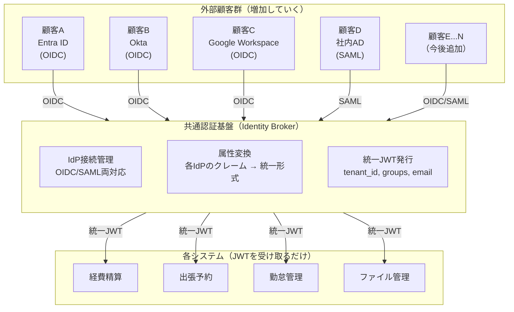
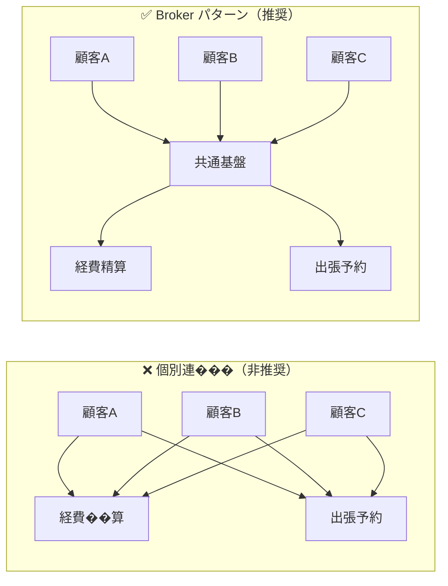
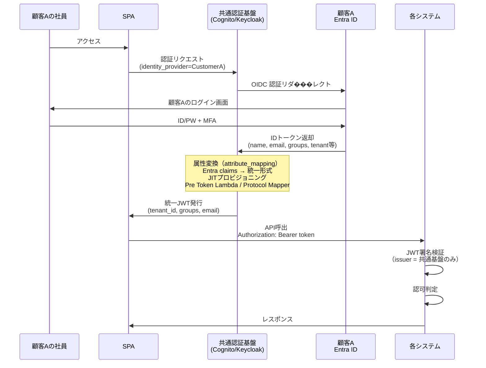
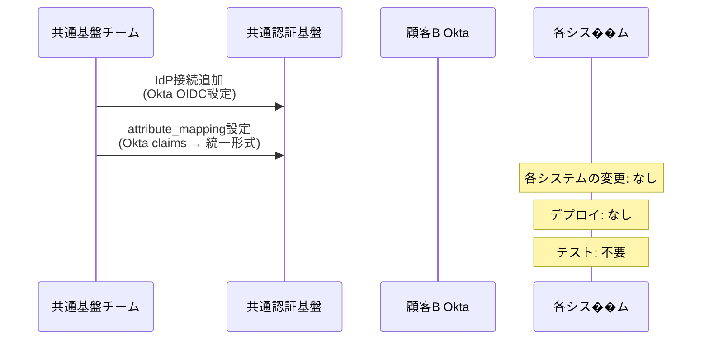
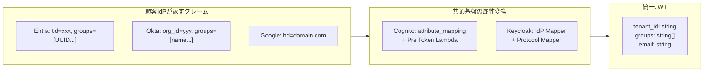
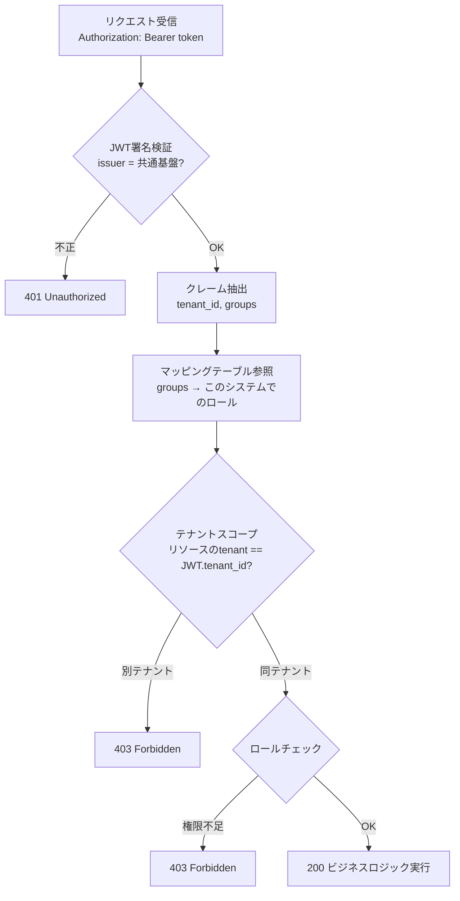
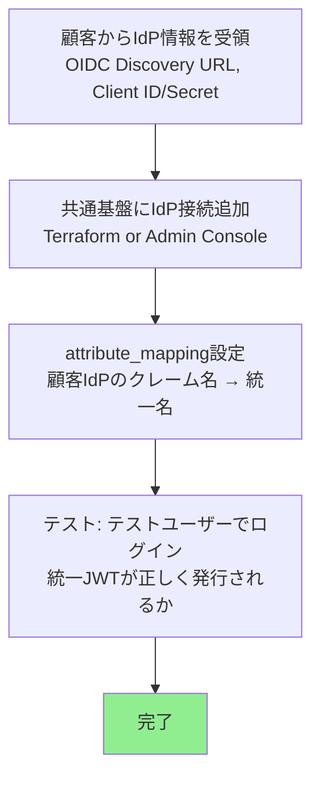
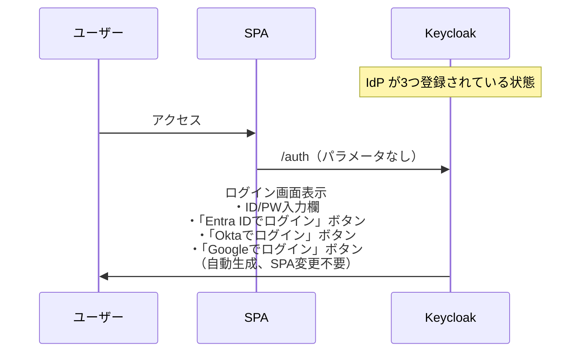
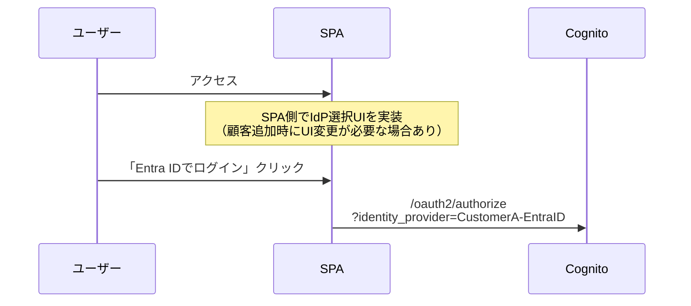
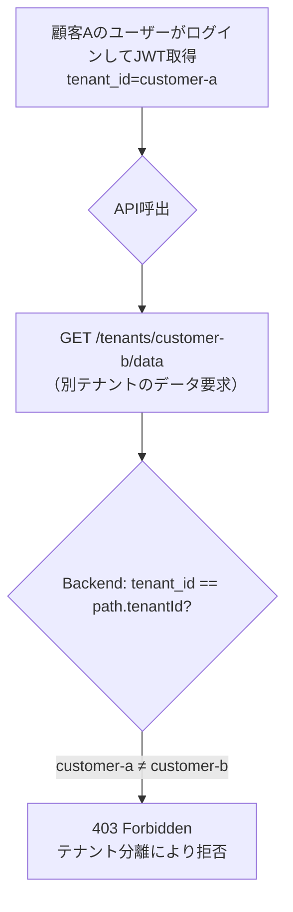

# Identity Broker パターン：マルチ顧客IdP対応設計

**作成日**: 2026-04-20
**目的**: 複数の外部顧客がそれぞれ独自のIdP（Entra ID、Okta、Google Workspace等）を
持つ環境で、共通認証基盤をIdentity Broker（仲介者）として運用し、各システムへの
影響を最小化するアーキテクチャを定義する。

---

## 1. 背景と要件

### 想定するユースケース

- 複数の外部顧客企業が、それぞれ自社のIdP��Entra ID、Okta等）を利用している
- 社内には複数のシステム（経費精算、出張予約、勤怠管理等）が存在する
- 顧客は今後も増え続ける（IdP接続が増加する）
- **各システムは顧客追加のたびに変更したくない**

### 課題

顧客が増えるたびに各システムにIdP設定を追加していくと、
以下の問題が発生する：

- 顧客10社 × システム5個 = **50個のIdP接続設定**
- 顧客追加時に全システムのリリースが必要
- 各システムが各IdPのクレーム差異を吸収する必要がある
- テスト・セキュリティレビューの範囲が膨大になる

---

## 2. Identity Broker パターンとは

### 概要

Identity Broker（ID仲介者）とは、複数の外部IdPとアプリケーション群の間に立ち、
認証を仲介するアーキテクチャパターン。

**核心**：各システムは「共通基盤が発行したJWT」だけを検証すれば良い。
外部IdPの種類・数・プロトコル差異をすべて共通基盤が吸収する。



### 業界での採用実績・根拠

- **Microsoft Azure Architecture Center**: マルチテナントソリューションでは、テナントごとに
  異なるIdP（Entra ID, ADFS等）との連携をフェデレーションで集約するパターンを推奨
- **AWS re:Post / Cognito公式ドキュメント**: Cognito User Poolが複数の外部IdPとの間で
  「ブリッジ」として機能し、属性マッピングにより統一トークンを発行する設計が記載
- **Keycloak公式**: Identity Brokering機能により、OIDC/SAMLの複数外部IdPを
  1つのRealmで集約し、アプリケーションには単一のissuerとしてトークンを発行

---

## 3. アーキテクチ��比較

### パターン比較：個別連携 vs Broker



| 観点 | 個別連携 | Broker パターン |
|------|:-------:|:-------------:|
| 顧客10社 × システム5個の接続数 | **50個** | **10個** |
| 顧客追加時の各システム変更 | **全システム要変更** | **変更不要** |
| 各システムが検証するissuer数 | 顧客数分 | **1つだけ** |
| クレーム名差異の吸収 | 各システムで対応 | **共通基盤で一元変換** |
| テスト範囲 | 全組合せ | 共通基盤のみ |
| 管理運用コスト（業界調査※） | 高 | **最大60%削減** |

※ WJAETS-2025 "Understanding federated identity management" による調査

---

## 4. 認証フロー

### 新規顧客（顧客A / Entra ID）のログインフロー



### 2社目の顧客（顧客B / Okta）追加時



**顧客B追加で各システムに発生する作業: ゼロ**

---

## 5. 属性変換（クレーム統一）

### 各IdPのクレーム差異

各顧客のIdPはクレーム名や構造が異なる。共通基盤がこの差異を吸収する。

| クレーム | Entra ID | Okta | Google | 統一後（JWT） |
|---------|----------|------|--------|:----------:|
| テナントID | `tid` / カスタム属性 | `org_id` | `hd`（ドメイン） | **`tenant_id`** |
| グループ | `groups` (UUID配列) | `groups` (名前配列) | なし | **`groups`** (名前配列) |
| メール | `preferred_username` | `email` | `email` | **`email`** |
| 名前 | `name` | `profile.name` | `name` | **`name`** |

### 変換の実装箇所



#### Cognito での実装

```hcl
# terraform: 顧客AのIdP接続
resource "aws_cognito_identity_provider" "customer_a_entra" {
  provider_name = "CustomerA-EntraID"
  provider_type = "OIDC"

  attribute_mapping = {
    email             = "preferred_username"
    "custom:tenant_id" = "tid"          # Entra の tid → tenant_id
    username          = "sub"
  }
}

# terraform: 顧客B��IdP接続
resource "aws_cognito_identity_provider" "customer_b_okta" {
  provider_name = "CustomerB-Okta"
  provider_type = "OIDC"

  attribute_mapping = {
    email             = "email"
    "custom:tenant_id" = "org_id"       # Okta の org_id → tenant_id
    username          = "sub"
  }
}
```

#### Keycloak での実装

Admin Console → Identity Providers → 各IdP → Mappers で設定。
各IdPのクレーム名を統一的な User Attribute にマッピングする。

---

## 6. 各システムの実装（変更不要の理由）

### 各システムが知るべきこと（固定）

| 項目 | 値 | 変更頻度 |
|------|-----|:-------:|
| JWT issuer | 共通基盤のURL（1つ） | なし |
| 検証するクレーム | `tenant_id`, `groups`, `email` | なし |
| JWKS エンドポイント | `{issuer}/.well-known/jwks.json` | なし |

### 各システムが知らなくてよいこと

- 顧客がどのIdPを使っているか
- 顧客IdPのクレーム名やプロトコル
- 顧客の追加・削除
- IdP接続設定の詳細

### 認可判定フロー（各システム内部）



---

## 7. 顧客IdP追加時のワークフロー

### 共通基盤側の作業（30分〜1時間）



### 各システム側の作業

**なし。** 共通基盤のJWT形式は変わらないため。

---

## 8. スケーラビリティ

### 顧客数増加への耐性

| 顧客数 | IdP接続数 | 各システムへの影響 | 共通基盤の作業 |
|:------:|:--------:|:---------------:|:------------:|
| 1社 | 1 | なし | 初期構築 |
| 10社 | 10 | なし | 各30分の設定追加 |
| 50社 | 50 | なし | 同上 |
| 100社 | 100 | なし | 同上 |

### プラットフォーム別の上限

| プラットフォーム | IdP接続上限 | HA対応 |
|---------------|:---------:|:-----:|
| Cognito | User Pool あたり 300 IdP | マネージド（SLA 99.9%��� |
| Keycloak | 制限なし | クラスタリング対応 |

### 大規模環境でのパフォーマンス

- **JWKSキ��ッシュ**: 各システムはJWKS公開鍵をキャッシュ（5分〜1時間）。
  顧客が増えてもissuerは1つなので、JWKSの取得回数は増えない。
- **JWT検証**: ローカルで実行（1ms以下）。顧客数に影響されない。
- **トークンサイズ**: groups配列が大きくなる場合は注意（4KB上限目安）。

---

## 9. Cognito vs Keycloak：マルチIdP運用の比較

| 観点 | Cognito | Keycloak |
|------|---------|----------|
| IdP追加の自動化 | Terraform で IaC 管理 | Admin Console or Terraform Provider |
| ログイン画面のIdP選択 | SPA側で `identity_provider` パラメータ指定 | **自動表示（設定のみ、SPA変更不要）** |
| 顧客追加時のSPA変更 | IdPボタン追加が必要な場合あり | **不要** |
| attribute_mapping | Terraform で宣言的 | Admin Console IdP Mapper |
| SAML対応 | ✅ | ✅ |
| LDAP直接接続 | ❌ | ✅ |
| 運用負荷 | ◎（マネージド） | △（ECS/RDS管理必要） |
| コスト（175K MAU以下） | ◎（従量課金） | △（固定費 ~$2,620/月） |
| 柔軟性（認証フロー制御） | △ | ◎（Authentication Flow） |

### Keycloakの優位: ログイン画面の自動制御



### Cognitoの場合: SPA側でIdP指定が必���



---

## 10. セキュリティ考慮事項

### テナント分離の保証



- **tenant_id は共通基盤が設定する**（ユーザーが自己申告できない）
- 共通基盤の attribute_mapping で、IdP側の組織識別子 → `tenant_id` に変換
- 各システムは `tenant_id` をデータアクセス条件に必ず含める

### IdP信頼の管理

- 共通基盤に登録されたIdPのみ信頼される
- 未登録のIdPからのトークンは、共通基盤が拒否（JWTが発行されない）
- 各システムは共通基盤のissuer以外を一切信頼しない

---

## 11. 運用体制

### 役割分担

| 役割 | 担当チーム | 責務 |
|------|----------|------|
| 共通認証基盤の運用 | 共通基盤チーム | IdP接続追加、属性変換設定、障害対応 |
| 顧客IdP情報の受領 | 営業/CS | Client ID/Secret、Discovery URL取得 |
| 各システムの認可設計 | 各アプリチーム | マッピングテーブル、認可ロジック |
| グループ/ユーザー管理 | テナント管理者（顧客側） | 自社IdPでのグループ割当 |

### 共通基盤への依頼フ��ー

```mermaid
flowchart LR
    A["新規顧客契約"] --> B["営業/CSがIdP情報取得"]
    B --> C["共通基盤チームに依頼<br/>（IdP接続追加）"]
    C --> D["Terraform PR or<br/>Admin Console設��"]
    D --> E["テスト確認"]
    E --> F["完了"]

    Note over A,F: 各システムチームは関与しない
```

---

## 12. 本PoCでの検証状況

| 検証項目 | 状態 | 備考 |
|---------|:---:|------|
| Auth0をBroker経由で接続（Cognito） | ✅ | 顧客IdPの代替としてAuth0を使用 |
| attribute_mapping でクレーム統一 | ✅ | tenant_id, role → custom属性 |
| Pre Token Lambda で統一JWT発行 | ✅ | V2でAccess Tokenにも注入 |
| 各システムがissuer 1つだけ検�� | ✅ | Lambda Authorizer で実証 |
| 顧客追加時に各システム変更不要 | ✅ | Auth0追加時にBackend変更なし |
| Keycloak Identity Brokering | Phase 7で検証済 | Auth0 → Keycloak Broker |
| マルチissuer（Cognito + Keycloak） | ✅ | Authorizer で両方検証可能 |

---

## 参考文献

- [Microsoft Azure Architecture Center - Federated Identity Pattern](https://learn.microsoft.com/en-us/azure/architecture/patterns/federated-identity)
- [Microsoft - Architectural Considerations for Identity in a Multitenant Solution](https://learn.microsoft.com/en-us/azure/architecture/guide/multitenant/considerations/identity)
- [AWS Cognito - User pool sign-in with third party identity providers](https://docs.aws.amazon.com/cognito/latest/developerguide/cognito-user-pools-identity-federation.html)
- [AWS re:Post - Multiple enterprise SAML/OIDC IdPs with Cognito](https://repost.aws/questions/QUV5uXSqPwRtadCFAuHfvjXg)
- [Keycloak - Identity Brokering](https://www.keycloak.org/docs/latest/server_admin/index.html)
- [Phase Two - Keycloak as an Identity Provider Broker](https://phasetwo.io/docs/keycloak/idp/)
- [LoginRadius - SaaS Identity and Access Management Best Practices](https://www.loginradius.com/blog/engineering/saas-identity-access-management)
- [Network World - Federate your identity data with a hub](https://www.networkworld.com/article/945406/the-secret-to-a-successful-identity-provider-deployment-federate-your-identity-data-with-a-hub.html)
- [WJAETS-2025 - Understanding federated identity management: Architecture](https://journalwjaets.com/sites/default/files/fulltext_pdf/WJAETS-2025-0919.pdf)
- [AWS Samples - Amazon Cognito example for multi-tenant](https://github.com/aws-samples/amazon-cognito-example-for-multi-tenant)
- [Scalekit - Enterprise SSO to AWS Cognito](https://www.scalekit.com/blog/enterprise-sso-to-aws-cognito)
