# JIT + SCIM 併用環境の Keycloak 実装ノート

> **位置付け**: 顧客 IdP の **SCIM 対応状況がバラバラ**（タイプ A=SCIM 採用 / タイプ B=JIT のみ / タイプ C=移行期混在）な環境を Keycloak 26 で実装するための **技術設計ノート**。proposal §FR-7.4.5/6/7 の設計判断を **Keycloak の Identity Provider Mapper / First Broker Login Flow / Sync Mode / SCIM Plugin** の具体設定に落とし込む。
> **対象読者**: Keycloak 設計・実装担当者 / SRE / Realm 設定運用者
> **関連**:
> - [§FR-7.4.5 混在環境シーケンス](../requirements/proposal/fr/07-user.md#fr-745-混在環境の認証プロビジョニング-フロー顧客-idp-別の-scim-対応差) — 設計判断（必読、まず読む）
> - [§FR-7.4.6 同期競合の解決ルール](../requirements/proposal/fr/07-user.md#fr-746-同期競合の解決ルールscim-vs-jitsource-of-truth-ポリシー)
> - [§FR-7.4.7 段階移行運用](../requirements/proposal/fr/07-user.md#fr-747-段階移行運用jit--scim-追加既存ユーザーマージ)
> - [hook-architecture-keycloak.md §3.6 SCIM 受信プラグイン](hook-architecture-keycloak.md#36-scim-受信プラグイン別軸参考整理) — プラグイン選択
> - [auth-patterns.md](auth-patterns.md) / [authz-architecture-design.md](authz-architecture-design.md) / [identity-broker-multi-idp.md](identity-broker-multi-idp.md)

---

## 目次

1. [前提と全体像](#1-前提と全体像)
2. [Keycloak の主要コンポーネント整理](#2-keycloak-の主要コンポーネント整理)
3. [タイプ A（SCIM 採用顧客）の実装](#3-タイプ-ascim-採用顧客の実装)
4. [タイプ B（JIT のみ顧客）の実装](#4-タイプ-bjit-のみ顧客の実装)
5. [タイプ C（移行期混在）の実装](#5-タイプ-c移行期混在の実装)
6. [externalId 突合実装の詳細](#6-externalid-突合実装の詳細)
7. [テナント別設定の場所（Realm/IdP/Client/User）](#7-テナント別設定の場所realmidpclientuser)
8. [Sync Mode 詳細と設定例](#8-sync-mode-詳細と設定例)
9. [First Broker Login Flow との連動](#9-first-broker-login-flow-との連動)
10. [運用手順と落とし穴](#10-運用手順と落とし穴)
11. [リファレンス](#11-リファレンス)

---

## 1. 前提と全体像

### 1.1 本ドキュメントが解決する技術的問い

| 問い | 本ドキュメントでの回答 |
|---|---|
| 顧客 IdP の SCIM 対応バラツキにどう対応するか? | **Realm 単位で SCIM Plugin を有効化、IdP 単位で Sync Mode 切替**（§7）|
| SCIM で事前作成された Alice が JIT ログイン時に重複作成されないか? | **First Broker Login Flow で externalId 突合**、既存ユーザーリンク（§6, §9）|
| 属性食い違いはどう解決するか? | **Sync Mode = FORCE（SCIM 採用）/ IMPORT（JIT のみ）の Per-IdP 設定**（§8）|
| JIT → SCIM 移行時の既存ユーザーマージは? | **kcadm.sh + SCIM API バッチで externalId 後付け**（§5, §10）|
| Keycloak ネイティブ SCIM Realm API（26.6 Experimental）を使うべきか? | **Phase Two SCIM が本番候補、Keycloak ネイティブは将来移行先**（§2）|

### 1.2 全体像（混在テナント収容）

```mermaid
flowchart LR
    subgraph TenantA["タイプ A: SCIM 採用 Realm"]
        TAIdP["IdP A1<br/>(Entra ID)<br/>SyncMode=FORCE"]
        TAHR[顧客 HR]
        TAHR -->|SCIM Push| TAEnd
        TAEnd[Phase Two SCIM<br/>Endpoint A]
        TAIdP -.→ SAML/OIDC -.→ KC_A
        TAEnd --> KC_A
    end

    subgraph TenantB["タイプ B: JIT のみ Realm"]
        TBIdP["IdP B1<br/>(ADFS)<br/>SyncMode=IMPORT"]
        TBIdP --> KC_B
    end

    subgraph TenantC["タイプ C: 移行期 Realm"]
        TCIdP1["IdP C1 (Okta) - SCIM 段階導入<br/>SyncMode=IMPORT→FORCE 切替期"]
        TCEnd[Phase Two SCIM<br/>Endpoint C]
        TCIdP1 --> KC_C
        TCEnd -.→ 段階的に開通 .-> KC_C
    end

    subgraph Core["Keycloak Cluster"]
        KC_A[Realm: tenant-a]
        KC_B[Realm: tenant-b]
        KC_C[Realm: tenant-c]
        DB[(統合 DB<br/>externalId で<br/>SCIM/JIT 起点を区別)]
        KC_A --> DB
        KC_B --> DB
        KC_C --> DB
    end

    style TenantA fill:#e8f5e9
    style TenantB fill:#fff8e1
    style TenantC fill:#fff3e0
    style Core fill:#e3f2fd
```

→ **同一 Keycloak Cluster で 3 タイプを同時収容**、テナント別 Realm + IdP 単位の Sync Mode で切り替え。

---

## 2. Keycloak の主要コンポーネント整理

| コンポーネント | 役割 | 本件での用途 |
|---|---|---|
| **Realm** | テナント単位のセキュリティ境界 | 顧客ごとに 1 Realm（マルチテナント L3）|
| **Identity Provider (IdP) 設定** | 外部 IdP（SAML/OIDC）との連携設定 | 顧客 IdP 接続情報、**Sync Mode 設定の中核**|
| **Identity Provider Mapper SPI** | 外部 IdP の属性 → Keycloak 属性マッピング | `externalId` 設定、属性引き当て |
| **First Broker Login Flow** | 外部 IdP 初回ログイン時のフロー（突合/作成/リンク）| **JIT + SCIM 突合の心臓部**（§9）|
| **User Attribute** | Keycloak User オブジェクトのカスタム属性 | `externalId`、`tenant_id`、`scim_source` 等 |
| **Phase Two SCIM Plugin** | SCIM 2.0 Server エンドポイント実装 | 顧客 IdP からの SCIM Push 受信（[§3.6](hook-architecture-keycloak.md#36-scim-受信プラグイン別軸参考整理)）|
| **Keycloak 26.6 ネイティブ SCIM Realm API** | Experimental の SCIM Server 機能 | 将来移行先、現時点は Phase Two が安定 |
| **Event Listener SPI** | 認証・管理イベントの受信 | Webhook 送出基盤（Phase Two `keycloak-events`）|
| **kcadm.sh** | CLI 管理ツール | バッチ操作、移行スクリプト |
| **Terraform Provider keycloak/keycloak** | IaC 化 | Realm/IdP/Mapper 設定の差分管理 |

### 2.1 SCIM Plugin 選択方針（再掲）

| 選択肢 | 状況 | 本件採用 |
|---|---|:-:|
| **Keycloak 26.6 ネイティブ Experimental** | Microsoft Entra ID 互換最優先、API 安定化待ち | △ 将来移行 |
| **Phase Two SCIM** | Per-org SCIM endpoints、Production 採用実績、Webhook と統合 | ⭐ **採用** |
| Captain-P-Goldfish OSS | kc-21 で EOL | ❌ 不採用 |

→ **Phase Two SCIM Plugin を Realm 単位で有効化** + Per-org endpoint で顧客別 SCIM URL を提供。

---

## 3. タイプ A（SCIM 採用顧客）の実装

### 3.1 Realm 設定

```hcl
# Terraform 例
resource "keycloak_realm" "tenant_a" {
  realm                  = "tenant-acme"
  display_name           = "Acme Corp"
  enabled                = true
  registration_allowed   = false   # セルフサインアップ禁止
  email_verified_default = false   # 検証必須化
}
```

### 3.2 顧客 IdP（Entra ID）設定

```hcl
resource "keycloak_oidc_identity_provider" "entra_id" {
  realm             = keycloak_realm.tenant_a.id
  alias             = "acme-entra"
  display_name      = "Acme Corp Entra ID"
  enabled           = true

  authorization_url = "https://login.microsoftonline.com/${var.tenant_id}/oauth2/v2.0/authorize"
  token_url         = "https://login.microsoftonline.com/${var.tenant_id}/oauth2/v2.0/token"
  client_id         = var.entra_client_id
  client_secret     = var.entra_client_secret

  default_scopes    = "openid profile email"
  trust_email       = true       # IdP の email_verified を信頼
  store_token       = false

  # ★Sync Mode = FORCE（SCIM 採用顧客は IdP が SoT）
  sync_mode         = "FORCE"

  # First Broker Login Flow を指定（既存ユーザーリンク優先）
  first_broker_login_flow_alias = "first broker login"

  # Post Broker Login Flow（任意、ログイン後処理）
  post_broker_login_flow_alias  = ""
}
```

### 3.3 Identity Provider Mapper（externalId の中核）

```hcl
# Entra ID の "oid" (objectId, 不変 ID) を externalId として保存
resource "keycloak_attribute_importer_identity_provider_mapper" "external_id" {
  realm                   = keycloak_realm.tenant_a.id
  name                    = "external-id-mapper"
  identity_provider_alias = keycloak_oidc_identity_provider.entra_id.alias

  claim_name              = "oid"            # Entra Assertion の Object ID
  user_attribute          = "externalId"     # Keycloak User Attribute

  extra_config = {
    # FORCE モード時は毎回上書き
    syncMode = "FORCE"
  }
}

# テナント識別子 (tenant_id)
resource "keycloak_attribute_importer_identity_provider_mapper" "tenant_id" {
  realm                   = keycloak_realm.tenant_a.id
  name                    = "tenant-id-mapper"
  identity_provider_alias = keycloak_oidc_identity_provider.entra_id.alias
  claim_name              = "tid"
  user_attribute          = "tenant_id"
  extra_config = {
    syncMode = "FORCE"
  }
}

# email
resource "keycloak_attribute_importer_identity_provider_mapper" "email" {
  realm                   = keycloak_realm.tenant_a.id
  name                    = "email-mapper"
  identity_provider_alias = keycloak_oidc_identity_provider.entra_id.alias
  claim_name              = "email"
  user_attribute          = "email"
  extra_config = {
    syncMode = "FORCE"
  }
}
```

### 3.4 Phase Two SCIM Plugin の Realm 有効化

```bash
# Realm 別に SCIM Endpoint URL が払い出される
# Per-org endpoint: https://auth.example.com/realms/tenant-acme/scim/v2/

# Phase Two の Admin Console > SCIM タブで:
# - Enabled: ON
# - Bearer Token: 顧客向けに発行 (Vault 保管)
# - externalId Source: User Attribute "externalId"
# - Default Sync Mode: FORCE
```

顧客 IdP（Entra ID）側で SCIM Provisioning を設定（Enterprise App として）:
- Tenant URL: `https://auth.example.com/realms/tenant-acme/scim/v2/`
- Secret Token: Phase Two で発行した Bearer Token
- Provision User attributes: email / displayName / department / externalId(objectId)

---

## 4. タイプ B（JIT のみ顧客）の実装

### 4.1 IdP 設定（Sync Mode = IMPORT）

```hcl
resource "keycloak_saml_identity_provider" "adfs" {
  realm             = keycloak_realm.tenant_b.id
  alias             = "globex-adfs"
  display_name      = "Globex ADFS"
  enabled           = true

  entity_id                  = "https://auth.example.com/realms/tenant-globex"
  single_sign_on_service_url = var.adfs_sso_url
  signing_certificate        = var.adfs_cert

  # ★Sync Mode = IMPORT（JIT 初回のみ、以降は基盤側でセルフサービス）
  sync_mode = "IMPORT"

  trust_email = false           # ADFS は email_verified を出さないので false
  first_broker_login_flow_alias = "first broker login"
}
```

### 4.2 Attribute Mapper（externalId は null のまま）

```hcl
# SAML NameID を externalId にする（IdP 不変 ID として）
resource "keycloak_saml_user_attribute_protocol_mapper" "external_id" {
  realm                      = keycloak_realm.tenant_b.id
  name                       = "external-id-mapper"
  identity_provider_alias    = keycloak_saml_identity_provider.adfs.alias
  user_attribute             = "externalId"
  attribute_name             = "http://schemas.xmlsoap.org/ws/2005/05/identity/claims/upn"

  extra_config = {
    syncMode = "IMPORT"   # JIT 初回のみ反映、後の手動編集を許可
  }
}
```

### 4.3 SCIM Endpoint は無効

タイプ B では Phase Two SCIM の Realm 設定で Enabled = OFF。SCIM Endpoint URL は払い出されない。

---

## 5. タイプ C（移行期混在）の実装

### 5.1 Phase 別の設定変更

| Phase | Sync Mode | SCIM Endpoint | 既存ユーザー扱い |
|---|---|---|---|
| **Phase 0**（JIT のみ）| IMPORT | 無効 | externalId=null |
| **Phase 1**（SCIM 事前テスト）| IMPORT（変更なし）| **有効化 + ダミーユーザーで検証**| 影響なし |
| **Phase 2**（既存ユーザーマージ）| IMPORT（変更なし）| **本番 SCIM Push 開始** | **externalId 後付け（バッチ）**|
| **Phase 3**（FORCE 切替）| **FORCE に変更**| 継続 | 完全 SCIM 主導に切替 |

### 5.2 マージスクリプト例（Phase 2、kcadm.sh + jq）

```bash
#!/bin/bash
# scim-merge.sh: 既存 JIT ユーザーに externalId を後付け
# 入力: 顧客 IdP からの SCIM ダンプ (CSV: email, externalId)
# 動作: email 突合 (verified=true のみ) → externalId 上書き

REALM="tenant-okta"
CSV_FILE="users.csv"

# kcadm.sh ログイン
/opt/keycloak/bin/kcadm.sh config credentials \
  --server http://localhost:8080 --realm master \
  --user admin --password "$ADMIN_PASS"

while IFS=, read -r email external_id; do
  # 既存ユーザー検索
  USER=$(kcadm.sh get users -r $REALM -q email=$email -q exact=true | jq -r '.[0]')
  USER_ID=$(echo "$USER" | jq -r '.id')
  EMAIL_VERIFIED=$(echo "$USER" | jq -r '.emailVerified')

  if [ -z "$USER_ID" ] || [ "$USER_ID" = "null" ]; then
    echo "SKIP: $email (not found, will be SCIM-created)"
    continue
  fi

  if [ "$EMAIL_VERIFIED" != "true" ]; then
    echo "CONFLICT: $email (email_verified=false, manual review needed)"
    echo "$email,$external_id,CONFLICT" >> conflicts.csv
    continue
  fi

  # externalId 後付け
  kcadm.sh update users/$USER_ID -r $REALM \
    -s "attributes.externalId=[\"$external_id\"]"
  echo "MERGED: $email -> externalId=$external_id"
done < "$CSV_FILE"

echo "Done. Conflicts: $(wc -l < conflicts.csv) (review conflicts.csv)"
```

### 5.3 Phase 3 切替時のロールバック準備

```bash
# 切替前に Sync Mode を IMPORT のままで externalId を全 User に保存済 = 元に戻せる
# 万が一 FORCE 切替で問題発生したら IMPORT に戻すだけ

kcadm.sh update identity-provider/instances/okta -r $REALM \
  -s "config.syncMode=IMPORT"

# externalId を全削除して JIT のみ状態へ完全戻し
# (通常は不要、緊急時のみ)
for USER_ID in $(kcadm.sh get users -r $REALM --fields id -F | jq -r '.[].id'); do
  kcadm.sh update users/$USER_ID -r $REALM \
    -s 'attributes={"externalId":[]}'
done
```

---

## 6. externalId 突合実装の詳細

### 6.1 突合キーの優先順位（First Broker Login Flow 内）

```
SAML/OIDC Assertion 受信
  ↓
[Custom Authenticator: Find User By External ID]   ← Step 1（最優先）
  ↓ externalId 突合
  ├─ Found → 既存ユーザー使用、JIT 新規作成スキップ
  └─ Not Found
       ↓
[Standard Authenticator: Review Profile]            ← Step 2
  ↓
[Standard Authenticator: Create User If Unique]     ← Step 3（email 突合）
  ↓
  ├─ Found by email (email_verified=true) → リンク確認 UI
  ├─ Found by email (email_verified=false) → ❌ エラー、管理者通知
  └─ Not Found → 新規 JIT 作成
```

### 6.2 Custom Authenticator SPI（externalId 突合）の実装スケルトン

```java
public class FindUserByExternalIdAuthenticator implements Authenticator {

    @Override
    public void authenticate(AuthenticationFlowContext context) {
        SerializedBrokeredIdentityContext brokerContext = (SerializedBrokeredIdentityContext)
            context.getAuthenticationSession().getAuthNote(BROKERED_CONTEXT_NOTE);

        BrokeredIdentityContext bic = brokerContext.deserialize(context.getSession(), context.getAuthenticationSession());

        // IdP Assertion から externalId 候補を取り出す
        String externalId = bic.getUserAttribute("externalId");
        if (externalId == null) {
            context.attempted();    // 次の Authenticator へ
            return;
        }

        // Keycloak User DB を externalId 属性で検索
        RealmModel realm = context.getRealm();
        List<UserModel> users = context.getSession().users()
            .searchForUserByUserAttributeStream(realm, "externalId", externalId)
            .collect(Collectors.toList());

        if (users.isEmpty()) {
            context.attempted();    // 既存ユーザーなし、次の Authenticator へ
            return;
        }

        if (users.size() > 1) {
            // データ不整合、エラー
            context.failure(AuthenticationFlowError.INVALID_USER);
            return;
        }

        // 既存ユーザー発見、リンク成功
        UserModel existingUser = users.get(0);
        context.setUser(existingUser);
        context.success();
    }

    // ... 残りのインターフェース実装
}
```

`META-INF/services/org.keycloak.authentication.AuthenticatorFactory` に Factory 登録 + Phase Two SCIM 対応版でも同等の Authenticator 実装あり。

### 6.3 突合キーの代替（既存実装で対応可能なケース）

Custom Authenticator を書かない簡易解:

| 突合キー | Keycloak 標準対応 | 採用シーン |
|---|:-:|---|
| **username == externalId** | ✅ 標準 username 検索で代用可 | 簡易（ただし username 衝突リスク）|
| **email == 一意性** | ✅ Realm 設定で email-unique=true | 標準パターン、ただし email_verified 必須 |
| **NameID == 不変 ID** | ⚠ Standard Token Mapper では限定的 | SAML 限定、Custom Authenticator 推奨 |

→ **本格運用は Custom Authenticator (Phase Two 既存 or 自作)** が安全。

---

## 7. テナント別設定の場所（Realm/IdP/Client/User）

| 設定対象 | 設定場所 | 適用範囲 |
|---|---|---|
| **SCIM Plugin 有効化** | Realm Settings（Phase Two SCIM タブ）| Realm 全体 |
| **SCIM Bearer Token** | Realm Attribute / Client Credentials | Realm 全体 |
| **Sync Mode** | Identity Provider 設定（`config.syncMode`）| IdP 単位（同一 Realm 内に複数 IdP 可）|
| **Attribute Mapping** | Identity Provider Mapper | IdP 単位 |
| **First Broker Login Flow** | Identity Provider 設定（`firstBrokerLoginFlowAlias`）| IdP 単位 |
| **email_verified 信頼** | Identity Provider 設定（`trustEmail`）| IdP 単位 |
| **email 一意制約** | Realm Settings（`duplicateEmailsAllowed=false`）| Realm 全体 |
| **externalId 属性** | User Attribute | User 単位 |
| **scim_source 属性**（任意）| User Attribute | User 単位（SCIM 起点 / JIT 起点を識別）|

### 7.1 同一 Realm 内に複数 IdP がある場合

タイプ A 顧客が「Entra ID + 緊急時 ADFS」のように **複数 IdP を持つ** ケース:

```
Realm: tenant-acme
├─ Identity Provider: acme-entra (SCIM 採用、Sync Mode=FORCE)
└─ Identity Provider: acme-adfs (JIT のみ、Sync Mode=IMPORT、Break Glass 用)
```

→ **IdP 単位で Sync Mode 設定可能**、同一 Realm 内で混在運用が標準。

### 7.2 マルチテナント L3（Realm 分離）vs L2（Realm 共有）

| 分離レベル | Realm 構成 | SCIM Endpoint | JIT 設定 |
|---|---|---|---|
| **L3 物理分離** | 顧客ごとに 1 Realm | Realm 別 URL | Realm 別 IdP |
| **L2 論理分離** | 全顧客で 1 Realm | Realm 共通 URL（顧客別 Bearer Token で分離）| 1 Realm に多数 IdP |

本基盤は **L3 推奨**（[§FR-2.4](../requirements/proposal/fr/02-federation.md) 連動）、Realm = テナント単位。

---

## 8. Sync Mode 詳細と設定例

### 8.1 Sync Mode 一覧

| Mode | 動作 | First Login | Subsequent Logins | SCIM Push |
|---|---|---|---|---|
| **IMPORT** | 初回ログイン時のみ属性反映、以降は変更しない | 反映 | スキップ | スキップ |
| **LEGACY**（非推奨）| 都度上書き、基盤側編集禁止 | 反映 | 反映（上書き）| 反映 |
| **FORCE** | 毎回 IdP 値で強制上書き | 反映 | 反映（強制）| 反映 |

### 8.2 Per-Mapper Sync Mode（属性別の細粒度設定）

Identity Provider Mapper ごとに `syncMode` を上書き可能:

| 属性 | 推奨 syncMode | 理由 |
|---|---|---|
| `externalId` | **FORCE** | IdP の不変 ID、変更検知必要 |
| `email` | **FORCE** | IdP がマスター |
| `firstName`, `lastName` | FORCE | IdP がマスター |
| `tenant_id` | **FORCE**（カスタム）| テナント識別、変更を即時反映 |
| `display_name` | IMPORT | 基盤側でセルフサービス上書き可能にしたい場合 |
| `phone_number` | IMPORT | ユーザー自身で更新を許可する場合 |

```hcl
resource "keycloak_attribute_importer_identity_provider_mapper" "display_name" {
  # ...
  extra_config = {
    syncMode = "IMPORT"   # この属性のみ IMPORT（基盤側編集を許可）
  }
}
```

### 8.3 IdP 全体 Sync Mode との優先順位

```
Per-Mapper syncMode が設定されている → Per-Mapper を優先
Per-Mapper が未設定 → IdP 全体の syncMode を使用
```

→ **デフォルトは IdP 全体で FORCE、特定属性のみ IMPORT に緩める** パターンが運用しやすい。

---

## 9. First Broker Login Flow との連動

### 9.1 標準 First Broker Login Flow（Keycloak デフォルト）

```
Identity Provider Redirector
  ↓
Cookie                                            ← SSO セッション確認
  ↓
Identity Provider Authentication                  ← IdP リダイレクト
  ↓
First Broker Login Flow                           ← ★ここに介入★
  ├─ Review Profile                               ← 属性確認 UI
  ├─ Create User If Unique                        ← 既存ユーザー検索（email）
  │   ├─ Found → Confirm Link Existing Account   ← リンク確認 UI
  │   │           ↓ ユーザー同意
  │   │           Verify Existing Account         ← 既存 IdP で再認証
  │   └─ Not Found → 新規 JIT 作成
  ↓
完了
```

### 9.2 本基盤の拡張 First Broker Login Flow（externalId 突合追加）

```
Identity Provider Redirector
  ↓
Identity Provider Authentication
  ↓
[Custom: Find User By External ID]   ← ★新規追加★
  ├─ Found → 既存ユーザー使用、以降スキップ
  └─ Not Found → 次へ
  ↓
Review Profile
  ↓
Create User If Unique (by email)
  ├─ Found (email_verified=true) → Confirm Link Existing Account
  ├─ Found (email_verified=false) → ❌ エラー、管理者通知
  └─ Not Found → 新規 JIT 作成
```

### 9.3 Realm Settings での Flow 設定

```hcl
# Custom Flow 定義（簡略例）
resource "keycloak_authentication_flow" "fbl_with_external_id" {
  realm_id = keycloak_realm.tenant_a.id
  alias    = "first broker login with externalId"
  description = "Find by externalId first, fallback to standard FBL"
}

# IdP に紐付け
resource "keycloak_oidc_identity_provider" "entra_id" {
  # ...
  first_broker_login_flow_alias = keycloak_authentication_flow.fbl_with_external_id.alias
}
```

詳細実装は [Phase Two の First Broker Login 拡張サンプル](https://github.com/p2-inc/keycloak-events) や [Keycloak Authentication SPI ドキュメント](https://www.keycloak.org/docs/latest/server_development/index.html#_auth_spi) を参照。

---

## 10. 運用手順と落とし穴

### 10.1 落とし穴 7 つ

| # | 落とし穴 | 対策 |
|:-:|---|---|
| 1 | `trustEmail=false` で email_verified=false のまま JIT、後から SCIM Push で `email 一致 + verified=false` 検出エラー | 移行前にメール検証キャンペーン実施 |
| 2 | Sync Mode = LEGACY で運用すると、IdP 側 email 変更時に基盤側 email がブロックして失敗 | LEGACY は非推奨、FORCE か IMPORT |
| 3 | `externalId` を user_attribute ではなく username に保存 → username 衝突（特に複数 IdP 持つ Realm）| **必ず User Attribute `externalId` を使用** |
| 4 | Custom Authenticator のテストが困難 | Testcontainers で Keycloak コンテナ起動 + 統合テスト |
| 5 | SCIM Push のリトライ無効化（Phase Two デフォルトは有効、自作なら要実装）| Phase Two 標準利用、自作避ける |
| 6 | Realm 削除 = 全 User 消失（Bearer Token 含む）| Realm 削除前に backup、SCIM Bearer Token は Vault 管理 |
| 7 | Multi-instance Keycloak で Identity Provider Mapper が同期されない（古い Infinispan 設定）| Stage A の jdbc-ping クラスタ設定で対応済（[phase10-stage-a-verification.md](phase10-stage-a-verification.md) 参照）|

### 10.2 検証チェックリスト（混在環境 E2E テスト）

```
[タイプ A 検証]
□ Entra Enterprise App で SCIM Provisioning 設定
□ ダミーユーザー Push → Keycloak User 作成確認 (externalId 含む)
□ ダミーユーザーで SAML ログイン → 既存ユーザー使用、JIT 新規作成スキップ確認
□ Entra 側で属性変更 → SCIM PATCH → Keycloak 反映確認
□ Entra 側で削除 → SCIM DELETE → Keycloak 無効化 + Token Revocation 確認
□ Back-Channel Logout で全 RP に通知される確認

[タイプ B 検証]
□ ADFS から SAML ログイン → JIT 新規ユーザー作成 (externalId=null)
□ 属性更新は基盤側セルフサービスで可能（Sync Mode=IMPORT）
□ ADFS 側削除 → Keycloak セッション継続（既存 Token TTL 中）
□ 次回ログインで認証失敗 → Keycloak 側ユーザー無効化は手動 or 定期バッチ

[タイプ C 検証]
□ Phase 0 (JIT のみ) で 100 ユーザー作成 (externalId=null)
□ Phase 1 (SCIM 有効化) でダミーユーザー Push 検証
□ Phase 2 (マージスクリプト実行) で既存 100 ユーザーに externalId 後付け
  □ 成功: 90 件 (externalId 追加)
  □ Conflict: 10 件 (email_verified=false) → 個別解決
□ Phase 3 (Sync Mode=FORCE) で本番切替、退職反映即時化確認
```

### 10.3 監視・運用メトリクス

| メトリクス | 目的 | 計測場所 |
|---|---|---|
| SCIM Endpoint レスポンス時間 | 顧客 IdP の SCIM Push 性能 | Phase Two メトリクス / CloudWatch |
| SCIM 受信エラー率 | 顧客側設定問題検知 | Phase Two ログ |
| JIT 新規作成数 / 日 | タイプ B 顧客の活動量 | Keycloak Event Listener |
| externalId 後付け成功率 | 移行マージの品質 | マージスクリプトサマリ |
| Sync Mode 別ユーザー分布 | テナント別の構成把握 | kcadm.sh + 集計 |
| **未ログイン 90 日超ユーザー数** | PCI DSS 8.2.6 / 定期バッチ deprovisioning 対象 | kcadm.sh + 集計 |
| **論理削除（enabled=false）ユーザー数の推移** | DB 肥大化監視 | kcadm.sh + 集計 |

### 10.4 JIT 定期バッチ deprovisioning 実装（PCI DSS 8.2.6 / APPI 法 22 条対応）

> **⚠ 2026-07-09 重要警告：本 §10.4 のスクリプトは 10M MAU 規模では破綻します**
>
> - `kcadm.sh get "events?type=LOGIN"` = **Keycloak `event_entity` テーブル依存** だが以下 3 つの落とし穴で機能しない:
>   - **① `eventsExpiration` 未設定だとイベント自体が保存されない**（Realm Settings で明示設定必要）
>   - **② 10M MAU × 90 日保持 = 約 9 億行の `event_entity` 肥大化** → DB 性能・コスト破綻
>   - **③ 全ユーザ分の逐次クエリ = O(N × log M) で実行時間非現実的**（10M ユーザで数十時間〜）
> - **PoC / 小規模顧客（数百ユーザ）向けのリファレンス実装として保持**
> - **本番実装 = [§10.4.A Event Listener SPI 版](#104a-推奨2026-07-09-event-listener-spi--user_attribute-方式)** を使用
> - **JIT/SCIM 判別 = [§10.4.B](#104b-推奨2026-07-09-jit-vs-scim-ユーザー判別ロジック) 参照**
> - 影響範囲整理は [ADR-060 §D](../adr/060-auth-protocol-attack-path-residual-tbd.md) 波及議論参照

> **背景**: JIT のみ顧客では「顧客 IdP 側で削除されても Keycloak は関知しない」（[proposal §FR-7.4.5 シーケンス 5](../requirements/proposal/fr/07-user.md)）→ ゴーストユーザー蓄積。**90 日未ログイン User の自動無効化** が必須（PCI DSS 8.2.6）。

#### バッチスクリプト実装例（kcadm.sh + jq）

```bash
#!/bin/bash
# inactive-user-disable.sh
# 90 日以上未ログインのユーザーを enabled=false に変更
# PCI DSS 8.2.6 適合、APPI 法 22 条 遅滞ない消去対応
# 実行頻度: 週次 (cron で毎週日曜 02:00)

set -euo pipefail

REALM="${1:-tenant-acme}"
INACTIVE_DAYS="${INACTIVE_DAYS:-90}"
DRY_RUN="${DRY_RUN:-false}"   # true = 実行せず一覧のみ
KC_URL="https://auth.example.com"
ADMIN_USER="admin"
ADMIN_PASS="$(vault kv get -field=password secret/keycloak/admin)"

# 閾値タイムスタンプ計算 (90 日前のミリ秒)
THRESHOLD_MS=$(($(date +%s%3N) - INACTIVE_DAYS * 86400 * 1000))

# kcadm.sh 認証
/opt/keycloak/bin/kcadm.sh config credentials \
  --server "$KC_URL" --realm master \
  --user "$ADMIN_USER" --password "$ADMIN_PASS"

# 全 User を取得（max=10000、必要に応じてページング）
USERS=$(kcadm.sh get users -r "$REALM" --max 10000 --fields id,username,enabled,createdTimestamp)

# 各 User の lastLogin を Event API から取得して判定
TARGETS=()
for USER_ID in $(echo "$USERS" | jq -r '.[] | select(.enabled==true) | .id'); do
  # 最終ログイン取得 (Event API、type=LOGIN)
  LAST_LOGIN=$(kcadm.sh get "events?client=auth-poc-spa&type=LOGIN&user=$USER_ID&max=1" -r "$REALM" | jq -r '.[0].time // 0')

  if [ "$LAST_LOGIN" -lt "$THRESHOLD_MS" ]; then
    USERNAME=$(echo "$USERS" | jq -r ".[] | select(.id==\"$USER_ID\") | .username")
    TARGETS+=("$USER_ID:$USERNAME:$LAST_LOGIN")
  fi
done

echo "Found ${#TARGETS[@]} inactive users (>${INACTIVE_DAYS} days)"

# 除外: サービスアカウント / 管理者ロール持ち
# 通常は事前にロールベースフィルタを別途実装

# 通知 (7 日前事前通知パターンは別バッチで実装、ここでは即時無効化)
for ENTRY in "${TARGETS[@]}"; do
  USER_ID=$(echo "$ENTRY" | cut -d: -f1)
  USERNAME=$(echo "$ENTRY" | cut -d: -f2)

  if [ "$DRY_RUN" = "true" ]; then
    echo "DRY_RUN: would disable $USERNAME ($USER_ID)"
  else
    # 論理削除（enabled=false）
    kcadm.sh update users/"$USER_ID" -r "$REALM" -s "enabled=false"

    # 全 Session Revoke (Token も含む)
    kcadm.sh post users/"$USER_ID"/logout -r "$REALM"

    # 監査ログ送出 (Custom Attribute で記録、Event Listener が拾う)
    kcadm.sh update users/"$USER_ID" -r "$REALM" \
      -s "attributes.deprovisioned_at=[\"$(date -Iseconds)\"]" \
      -s "attributes.deprovisioned_reason=[\"inactive_${INACTIVE_DAYS}d\"]"

    echo "DISABLED: $USERNAME ($USER_ID)"
  fi
done

# サマリレポート出力
echo "Deprovisioning summary: $(date -Iseconds)"
echo "  Realm: $REALM"
echo "  Inactive threshold: ${INACTIVE_DAYS} days"
echo "  Targets: ${#TARGETS[@]}"
echo "  Mode: $DRY_RUN"
```

#### CronJob (Kubernetes) 例

```yaml
apiVersion: batch/v1
kind: CronJob
metadata:
  name: inactive-user-disable
  namespace: keycloak
spec:
  schedule: "0 2 * * 0"   # 毎週日曜 02:00
  successfulJobsHistoryLimit: 10
  failedJobsHistoryLimit: 5
  jobTemplate:
    spec:
      template:
        spec:
          serviceAccountName: keycloak-deprovision-sa
          restartPolicy: OnFailure
          containers:
          - name: deprovision
            image: ghcr.io/example/kc-deprovision:latest
            env:
            - name: REALM
              value: "tenant-acme"
            - name: INACTIVE_DAYS
              value: "90"
            - name: DRY_RUN
              value: "false"
            envFrom:
            - secretRef:
                name: keycloak-admin-credentials
            resources:
              limits:
                memory: 512Mi
                cpu: 500m
```

#### 通知 + ロールバック設計

```
T-7 日: 「7 日後に無効化」メール送信（誤無効化防止）
        attributes.deprovision_warning_at セット
T-0:    enabled=false に変更 + Token Revocation + 監査ログ
        attributes.deprovisioned_at セット
T+30 日: ロールバック可能期間（管理者が enabled=true 戻し可、Realm 設定）
T+30 日 〜 T+N 年: 法的保持期間中は論理削除のまま保持
T+N 年 (PCI DSS=1年 / 一般=7年): 物理削除 or 匿名化バッチ実行
```

### 10.4.A 【推奨、2026-07-09】Event Listener SPI + user_attribute 方式

> **§10.4 破綻の代替として、10M MAU 規模で確実に動作する本番実装**。ADR-060 §C.2.2 の Event Listener SPI 拡張と統合。

#### 10.4.A.1 なぜこの方式か（Keycloak native の制約）

**確実な事実**（[Keycloak Issue #10545 "Track last user login" 2019 年〜 継続 Open](https://github.com/keycloak/keycloak/issues/10545)）：
- **Keycloak 26.x でも `user_entity` テーブルには `last_login_time` フィールドが無い**
- `user_session.last_session_refresh` は **SSO Session Max（デフォルト 10 時間）**で消滅
- `event_entity` は `eventsExpiration` 設定次第 + DB 肥大化リスク

**業界標準の解**：**Event Listener SPI で LOGIN イベントを捕捉 → `user_attribute` に `last_login` を書き込む**（Ghent University / Phase Two 等の主要 OSS 実装で採用）。

#### 10.4.A.2 SPI 実装（既存 ADR-060 §C.2.2 SPI と統合）

> **⚠ 2026-07-09 追加調査結果**：以下のシンプルな `user.setSingleAttribute()` 直呼び実装は **[Keycloak Issue #14942](https://github.com/keycloak/keycloak/issues/14942)（Closed as not planned）により動かない可能性が極めて高い**。本番実装は **[§10.4.E.2 案 B Custom Authenticator SPI](#e23-3-つの実装案一次資料に基づく) を強く推奨**。以下のコードは概念説明用リファレンスとして保持。

```java
// ⚠ このコード例は Keycloak Issue #14942 により動かない可能性が極めて高い
// 実装時は §10.4.E.2 案 B（Custom Authenticator SPI）に置き換え必須

public class UnifiedEventListener implements EventListenerProvider {
    private final KeycloakSession session;

    public UnifiedEventListener(KeycloakSession session) {
        this.session = session;
    }

    @Override
    public void onEvent(Event event) {
        // 既存: Golden 検知系（ADR-060 §C.2.2 G-1〜G-6 / L-GD-1〜L-GD-5）
        emitToEventBridge(event);

        // ★ 追加（2026-07-09）: last_login 書き込み
        if (event.getType() == EventType.LOGIN) {
            updateLastLoginAttribute(event);
        }
    }

    private void updateLastLoginAttribute(Event event) {
        RealmModel realm = session.realms().getRealm(event.getRealmId());
        UserModel user = session.users().getUserById(realm, event.getUserId());
        if (user != null) {
            user.setSingleAttribute("last_login", String.valueOf(event.getTime()));
        }
    }

    @Override
    public void onEvent(AdminEvent event, boolean includeRepresentation) {
        // 管理者イベントは Golden 検知のみ、last_login は対象外
        emitAdminEventToEventBridge(event);
    }

    @Override
    public void close() {}
}
```

#### 10.4.A.3 バッチスクリプト（Event Listener 前提）

```bash
#!/bin/bash
# inactive-user-disable-v2.sh (2026-07-09)
# user_attribute.last_login を参照して 90 日未ログインを判定
# 前提: Event Listener SPI が全 LOGIN イベントを user_attribute.last_login に書き込み済
# 実行頻度: 週次 (cron で毎週日曜 02:00)

set -euo pipefail

REALM="${1:-tenant-acme}"
INACTIVE_DAYS="${INACTIVE_DAYS:-90}"
GRACE_DAYS="${GRACE_DAYS:-30}"   # T-30 日前に警告メール送信
DRY_RUN="${DRY_RUN:-false}"
KC_URL="https://auth.example.com"
ADMIN_USER="admin"
ADMIN_PASS="$(vault kv get -field=password secret/keycloak/admin)"

THRESHOLD_MS=$(($(date +%s%3N) - INACTIVE_DAYS * 86400 * 1000))
WARNING_MS=$(($(date +%s%3N) - (INACTIVE_DAYS - GRACE_DAYS) * 86400 * 1000))

/opt/keycloak/bin/kcadm.sh config credentials \
  --server "$KC_URL" --realm master \
  --user "$ADMIN_USER" --password "$ADMIN_PASS"

# JIT ユーザーのみ抽出（provisioned_by=jit AND NOT scim_active=true）
# ★ user_attribute.last_login をクエリパラメータで直接絞込（O(N) → O(1) per user）
USERS=$(/opt/keycloak/bin/kcadm.sh get users \
  -r "$REALM" \
  --max 10000 \
  -q "q=provisioned_by:jit" \
  --fields "id,username,enabled,createdTimestamp,attributes")

TARGETS_DISABLE=()
TARGETS_WARN=()

for USER_JSON in $(echo "$USERS" | jq -c '.[] | select(.enabled==true)'); do
  USER_ID=$(echo "$USER_JSON" | jq -r '.id')
  USERNAME=$(echo "$USER_JSON" | jq -r '.username')

  # ★ 削除禁止フラグ確認（SCIM 管理下は絶対削除しない）
  SCIM_ACTIVE=$(echo "$USER_JSON" | jq -r '.attributes.scim_active[0] // "false"')
  if [ "$SCIM_ACTIVE" = "true" ]; then
    continue  # SCIM 管理下、スキップ
  fi

  # ★ user_attribute.last_login をチェック（Event Listener SPI が書込済）
  LAST_LOGIN=$(echo "$USER_JSON" | jq -r '.attributes.last_login[0] // "0"')
  CREATED=$(echo "$USER_JSON" | jq -r '.createdTimestamp')

  # last_login が無い場合は createdTimestamp を使う（初回ログイン前ユーザー救済）
  EFFECTIVE_TS="${LAST_LOGIN:-$CREATED}"

  if [ "$EFFECTIVE_TS" -lt "$THRESHOLD_MS" ]; then
    TARGETS_DISABLE+=("$USER_ID:$USERNAME:$EFFECTIVE_TS")
  elif [ "$EFFECTIVE_TS" -lt "$WARNING_MS" ]; then
    TARGETS_WARN+=("$USER_ID:$USERNAME:$EFFECTIVE_TS")
  fi
done

echo "Disable targets: ${#TARGETS_DISABLE[@]}"
echo "Warning targets: ${#TARGETS_WARN[@]}"

if [ "$DRY_RUN" = "true" ]; then
  echo "DRY_RUN mode, no changes applied"
  exit 0
fi

# 警告メール送信（7 日前）
for ENTRY in "${TARGETS_WARN[@]}"; do
  USER_ID=$(echo "$ENTRY" | cut -d: -f1)
  # メール送信（SES 経由、実装略）
  /opt/keycloak/bin/kcadm.sh update users/"$USER_ID" -r "$REALM" \
    -s "attributes.deprovision_warning_at=[\"$(date -Iseconds)\"]"
done

# 無効化実行
for ENTRY in "${TARGETS_DISABLE[@]}"; do
  USER_ID=$(echo "$ENTRY" | cut -d: -f1)
  USERNAME=$(echo "$ENTRY" | cut -d: -f2)

  /opt/keycloak/bin/kcadm.sh update users/"$USER_ID" -r "$REALM" -s "enabled=false"
  /opt/keycloak/bin/kcadm.sh post users/"$USER_ID"/logout -r "$REALM"
  /opt/keycloak/bin/kcadm.sh update users/"$USER_ID" -r "$REALM" \
    -s "attributes.deprovisioned_at=[\"$(date -Iseconds)\"]" \
    -s "attributes.deprovisioned_reason=[\"inactive_${INACTIVE_DAYS}d\"]"

  echo "DISABLED: $USERNAME"
done
```

#### 10.4.A.4 なぜ §10.4 と比べて確実か

| 観点 | §10.4（破綻）| §10.4.A（推奨）|
|---|---|---|
| データソース | event_entity（DB 肥大化）| **user_attribute.last_login**（1 ユーザ 1 行）|
| 検索性能 | O(N × log M)（10M で数十時間）| **O(N)**（属性 index 使用、10M で数十分）|
| Retention 依存 | eventsExpiration 設定必須 | ✅ 永続保管、依存なし |
| SPI 開発工数 | 不要 | ⚠ 1-2 週間（既存 ADR-060 §C.2.2 SPI に統合）|
| Multi-Realm 対応 | Realm ごと設定必要 | ✅ SPI が全 Realm 共通 |
| 業界事例 | なし（PoC 独自）| Ghent University keycloak-last-login / Phase Two 等 |

#### 10.4.A.5 フォールバック検証（OpenSearch 併用）

Event Listener SPI 障害時の検証用：
- **[ADR-053 Observability](../adr/053-observability-strategy.md)** で EventBridge → OpenSearch にログイン履歴を保持
- OpenSearch から `type=LOGIN` を集計して user_attribute.last_login と照合
- 齟齬発見時は SPI 再走行 or 手動修正

### 10.4.B 【推奨、2026-07-09】JIT vs SCIM ユーザー判別ロジック

> §10.4.A の削除フローで **SCIM 管理下ユーザーを絶対削除しない** ための判別ロジック。

#### 10.4.B.1 Keycloak でのユーザー作成経路 5 種（確実な事実）

| 経路 | user_entity | federated_identity | LDAP link | 判別マーカー |
|---|:---:|:---:|:---:|---|
| **JIT（OIDC/SAML フェデ）**| ✅ | ✅ 有り（IdP alias + IdP sub）| ❌ | `provisioned_by=jit`（First Broker Login Flow で書込）|
| **SCIM POST /Users** | ✅ | ❌ 無し | ❌ | `provisioned_by=scim` + `scim_active=true`（プラグイン書込）|
| **手動（Admin UI / API）** | ✅ | ❌ | ❌ | `provisioned_by=manual`（管理者操作時 Event Listener 書込）|
| **Realm Import（JSON）**| ✅ | JSON 次第 | ❌ | `provisioned_by=realm_import`（一括インポート時）|
| **LDAP User Federation**| ✅ | ❌ | ✅ `federation_link` あり | LDAP User Federation Provider ID 参照 |

#### 10.4.B.2 判別戦略の 3 段階（2026-07-14 更新：local-admin 除外 + Re-Activation 分岐追加）

**必ずこの順序で判定**（優先度高から低へ）:

```
【判定 1: 削除禁止フラグ】
  user_attribute.scim_active == "true"
  → 削除禁止（SCIM 管理下、絶対削除しない）
  ※ SCIM 経由でユーザーが削除された場合は SCIM DELETE が来るので、
    それ以外で消してはいけない

【判定 2: サービスアカウント / 管理者除外】
  user.serviceAccountClientLink != null → 除外
  user_attribute.provisioned_by == "local-admin" → 除外（本基盤ローカル管理者、明示管理）
  user has admin role → 除外

【判定 3: プロビジョニング元判定】
  user_attribute.provisioned_by == "jit" → §10.4.A 90 日バッチ対象
  user_attribute.provisioned_by == "scim" → 対象外（SCIM DELETE を待つ、監査レポート対象）
  それ以外（manual / realm_import / null）→ 人間レビュー対象、自動削除しない
```

**★ Re-Activation SPI の判定分岐**（[§10.4.I](#104i-2026-07-14-新設re-activation-spi-実装仕様--jitscim-判別条件分岐) 詳細）:

```
enabled=false で復帰ログイン時:
  ・provisioned_by == "scim" or scim_active == "true" → Re-Activation 禁止（SCIM 削除は不可逆）
  ・provisioned_by == "local-admin" → Re-Activation 禁止（管理者操作待ち）
  ・provisioned_by == "jit" → 自動 Re-Activation
  ・上記以外 → Re-Activation 禁止（想定外、安全側）
```

**核心**：**「JIT ユーザは 90 日バッチ対象 + Re-Activation 対象」「SCIM ユーザは両者とも対象外」「local-admin は本基盤で明示管理」の 3 段構成**。混在時の 5 パターンは [§10.4.I.6](#104i6-混在時の-4-パターン10412-判別戦略の-3-段階-拡張) 参照。

#### 10.4.B.3 SCIM Plugin 側の必要設定（Phase Two SCIM 例）

**Phase Two SCIM プラグインの Custom Attribute Mapping**:

```json
{
  "scim_active": "$active",
  "scim_external_id": "$externalId",
  "scim_last_sync": "$sync_timestamp",
  "provisioned_by": "scim"
}
```

- POST /Users で作成時: `provisioned_by=scim` + `scim_active=true`
- PUT /Users で active=false: `scim_active=false` に更新（削除禁止フラグ解除）
- DELETE /Users: user_entity 削除 or enabled=false（Phase Two 設定次第）

#### 10.4.B.4 JIT 側の必要設定（First Broker Login Flow）

**Keycloak Authentication → Flows → First Broker Login → カスタムマッパー**:

```
Set User Attribute:
  Name:  provisioned_by
  Value: jit

Set User Attribute:
  Name:  jit_idp_alias
  Value: ${identity_provider}  (Keycloak template)

Set User Attribute:
  Name:  jit_created_at
  Value: ${current_time}
```

#### 10.4.B.5 エッジケース 3 種の扱い（確実な情報）

| ケース | 状態 | 判定 | 理由 |
|---|---|---|---|
| **① JIT 作成後に SCIM 対応追加** | `provisioned_by=jit` + `scim_active=true` + `federated_identity` 有り | ✅ **削除禁止** | scim_active 優先 |
| **② SCIM 作成後に初回 JIT ログイン** | `provisioned_by=scim` + `scim_active=true` + `federated_identity` 追加 | ✅ **削除禁止** | scim_active 優先 |
| **③ 完全 SCIM のみ、未ログイン** | `provisioned_by=scim` + `scim_active=true` + `federated_identity` 無し | ✅ **削除禁止** | scim_active 継続で生存 |

**エッジケース対応の核心**：**scim_active=true が最強の削除禁止フラグ**、他の判定より常に優先。

#### 10.4.B.6 バックフィル手順（導入時の既存ユーザー対応）

既存の JIT/SCIM ユーザーには `provisioned_by` 属性が未付与。導入時に一括バックフィルが必要:

```sql
-- SCIM 由来判定：Phase Two SCIM が管理する user_id を SCIM 側 DB から抽出して attribute 付与
-- JIT 由来判定：federated_identity テーブルに行がある全ユーザーに provisioned_by=jit 付与
-- それ以外：manual フラグを付与し、人間レビュー対象化
```

#### 10.4.B.7 実装 ADR

- **[ADR-060 §C.2.2](../adr/060-auth-protocol-attack-path-residual-tbd.md)** — Event Listener SPI に last_login 書込 + provisioned_by 判別統合
- **[ADR-025 §H](../adr/025-scim-positioning-and-receive-stance.md)** — SCIM/JIT/LDAP 判別戦略追記候補

### 10.4.C 【2026-07-09 追加】実装上の課題と対策（性能 + 運用）

> §10.4.A/§10.4.B の実装で発生する 6 つの性能課題と対策、Keycloak 26 User Profile 対応。

#### 10.4.C.1 6 つの性能課題

| # | 課題 | 詳細 | 対策 |
|---|---|---|---|
| **1** | UPDATE 頻度 | 10M MAU × 1 login/日 = 平均 115 UPDATE/秒、朝 9 時ピークで 500-1000 UPDATE/秒 | **debounce**（後述 §10.4.C.2）で 100 倍削減 |
| **2** | `setSingleAttribute()` の内部処理 | SELECT + UPDATE/INSERT + Infinispan cache invalidate の 3 操作 | debounce 前提なら Aurora Serverless v2 で余裕、実測必須 |
| **3** | `user_attribute` テーブル肥大化 | 10M ユーザ × 20 属性 = 2 億行 | 既存 index `(user_id, name)` 有効、JOIN 性能問題なし |
| **4** | HA cluster での cache invalidate broadcast | Multi-node Keycloak で全ノードに伝播、ネットワーク I/O 増 | debounce で頻度削減 + Multi-tier cache 設定 |
| **5** | Transaction 分離 | Event Listener は認証成功後・レスポンス送信前に実行、SPI 失敗 → レスポンス遅延 | **必ず try-catch で認証を通す**、SPI 例外は log のみ |
| **6** | SPI 実行成功率の監視 | SPI が動いていない場合、静かに last_login が付かない | **メトリクス化必須**（Attribute 書き込み成功率、[ADR-053 Observability](../adr/053-observability-strategy.md) 連動）|

#### 10.4.C.2 debounce 戦略（性能課題の核心対策）

**目的**：LOGIN イベント毎の UPDATE を **1 日 1 回のみ** に削減。

```java
public void onEvent(Event event) {
    if (event.getType() != EventType.LOGIN) return;

    UserModel user = getUser(event);
    if (user == null) return;

    String lastLogin = user.getFirstAttribute("last_login");
    long now = event.getTime();

    // 1 日（86,400,000 ms）以内の再ログインは書き込みスキップ
    if (lastLogin == null || (now - Long.parseLong(lastLogin)) > 86400000L) {
        try {
            user.setSingleAttribute("last_login", String.valueOf(now));
        } catch (Exception e) {
            // 認証は通す、SPI 例外は log のみ
            log.warn("Failed to update last_login for user " + user.getId(), e);
        }
    }
}
```

**Trade-off**：

| 観点 | debounce 有 | debounce 無 |
|---|:---:|:---:|
| 書き込み頻度削減 | ✅ 100 倍削減 | ❌ |
| 90 日判定精度 | ✅ 十分（1 日ズレは許容）| ✅ |
| リアルタイム "最後のログイン" 取得 | ❌ 最大 1 日ズレ | ✅ |
| Aurora 書き込みコスト | ✅ 大幅削減 | ⚠ ピーク時懸念 |

**結論**：**PCI DSS 8.2.6 の 90 日判定用途では debounce 有が最適**。「本当にリアルタイム最終ログイン」は別途 event_entity 短期保持（3-7 日）で対応。

#### 10.4.C.3 Keycloak 26 User Profile 対応（Unmanaged Attributes）

Keycloak 26 では **User Profile が強化**され、デフォルトで Unmanaged Attributes は制限される。

**選択肢 A**：User Profile schema に明示登録（推奨）

```json
// Realm Settings → User Profile → JSON schema
{
  "attributes": [
    {
      "name": "last_login",
      "displayName": "Last Login (epoch ms)",
      "annotations": { "readOnly": true },
      "permissions": { "view": ["admin"], "edit": ["admin"] },
      "validations": { "long": {} }
    },
    {
      "name": "provisioned_by",
      "displayName": "Provisioning Source",
      "annotations": { "readOnly": true },
      "permissions": { "view": ["admin"], "edit": ["admin"] },
      "validations": { "options": { "options": ["jit", "scim", "manual", "ldap", "realm_import"] } }
    },
    {
      "name": "scim_active",
      "displayName": "SCIM Managed Flag",
      "annotations": { "readOnly": true },
      "permissions": { "view": ["admin"], "edit": ["admin"] }
    }
  ]
}
```

**選択肢 B**：Realm 全体で `unmanagedAttributePolicy = "ADMIN_EDIT"` 設定

```
Realm Settings → User Profile → Unmanaged Attributes: ADMIN_EDIT
```

**推奨**：**選択肢 A**（明示登録）。理由：Validation 強制 + 意図しない属性追加を防止 + IaC で構成管理容易。

#### 10.4.C.4 SPI デプロイと運用課題

| 課題 | 対策 |
|---|---|
| SPI JAR デプロイ | Keycloak Pod の `/providers/` に配置、Kubernetes ConfigMap or InitContainer で配布 |
| Keycloak バージョンアップ時の SPI 互換性 | [ADR-055 §A.7 バージョン追従プロセス](../adr/055-hrd-implementation-method-selection.md) に **SPI 互換性テスト** を追加 |
| Multi-Realm での SPI 有効化漏れ | IaC（Terraform / keycloak-config-cli）で担保、Realm 追加時に自動有効化 |
| 障害時の切り分け（SPI 動作 / DB 書き込み / cache）| CloudWatch メトリクス：SPI 実行回数 / UPDATE 成功率 / cache invalidate 遅延 |

### 10.4.D 【2026-07-09 追加】SCIM + JIT 同居の追加確認事項

> §10.4.A/§10.4.B が SCIM Plugin と共存する際の 5 つの実際の問題と、Phase 1 実装前に検証すべき 3 事項。

#### 10.4.D.1 SCIM + JIT 同居の 5 つの実際の問題

| # | 問題 | シナリオ | 対策 |
|---|---|---|---|
| **1** | **Sync Mode = FORCE 時の `scim_active` 上書き** | SCIM で `scim_active=true` 設定済ユーザーが JIT ログイン（Sync Mode = FORCE）→ IdP アサーションで上書き | **Identity Provider Mapper で `scim_active` の `syncMode=IMPORT` override**（Mapper 単位で Realm デフォルト override 可、[§3.3](#33-identity-provider-mapperexternalid-の中核) 記載通り技術的に可能）|
| **2** | **レースコンディション**（JIT ログイン vs SCIM Push 同時実行）| SCIM `PUT /Users` (active=false) 実行中、同ユーザーが JIT ログイン | Keycloak JPA の Optimistic Locking (@Version) で自動処理、Phase Two デフォルトのリトライ機能を維持（[§11 落とし穴 5](#11-落とし穴集7-つ)）|
| **3** | **`last_login` の並行 UPDATE 競合** | 同時に 2 デバイスからログイン、両方で SPI が `last_login` 書き込み | SPI 内 try-catch で例外を握りつぶす、微秒差なので値精度上の問題なし |
| **4** | **SCIM で作成 → JIT で federated_identity 追加時の重複** | SCIM で user_entity 作成後、初回 JIT ログインで externalId 突合が正しく動かないと重複 user_entity | **Phase Two 提供 or 検証済 Custom Authenticator を使用**（[§6.2](#62-custom-authenticator-による-externalid-突合実装)）|
| **5** | **既存ユーザーへの provisioned_by / scim_active バックフィル**| 導入前の既存ユーザーには属性未付与 → 判定不可 | [§10.4.B.6 バックフィル手順](#104b6-バックフィル手順導入時の既存ユーザー対応) 参照、SCIM 側は Phase Two 管理 DB から抽出、JIT 側は `federated_identity` テーブル SELECT |

#### 10.4.D.2 Phase 1 実装前検証事項 V1-V3（必須ゲート）

| # | 検証項目 | 検証方法 | 期日 | ヒアリング項目 |
|---|---|---|---|---|
| **V1** | **Phase Two SCIM の Custom Attribute Mapping で `scim_active` を書けるか** | PoC 環境で POST /Users → user_attribute.scim_active 反映確認 + PUT /Users {active: false} → scim_active=false 確認 | **Phase 1 実装開始前** | B-SCIM-1（新規）|
| **V2** | **Sync Mode = FORCE + Mapper 単位 syncMode = IMPORT override で `scim_active` を保護できるか** | PoC で SCIM 事前作成 → JIT ログイン → 属性値保持を確認 | **Phase 1 実装開始前** | B-SCIM-2（新規）|
| **V3** | **debounce（1 日 1 回）の実装で性能は問題ないか** | 負荷試験（100 RPS × 24h × 10 万ユーザ、Aurora 書き込み IOPS 監視）| **Phase 1 実装中** | B-SCIM-3（新規）|

#### 10.4.D.3 Sync Mode override の具体設定例（V2 対策）

**Identity Provider Mapper で Mapper 単位で syncMode 制御**：

```hcl
# Terraform：Sync Mode = FORCE の IdP でも、特定属性は IMPORT で保護

resource "keycloak_oidc_identity_provider" "acme_entra" {
  realm     = "tenant-acme"
  alias     = "acme-entra"
  sync_mode = "FORCE"  # デフォルト FORCE（IdP アサーションで毎回上書き）
}

# scim_active は IMPORT で override（初回のみ設定、以降上書きしない）
resource "keycloak_custom_identity_provider_mapper" "protect_scim_active" {
  realm                    = "tenant-acme"
  identity_provider_alias  = keycloak_oidc_identity_provider.acme_entra.alias
  name                     = "protect-scim-active"
  identity_provider_mapper = "hardcoded-user-session-attribute-idp-mapper"
  extra_config = {
    syncMode  = "IMPORT"  # Mapper 単位で override
    attribute = "scim_active"
  }
}

# provisioned_by も同様に保護
resource "keycloak_custom_identity_provider_mapper" "protect_provisioned_by" {
  realm                    = "tenant-acme"
  identity_provider_alias  = keycloak_oidc_identity_provider.acme_entra.alias
  name                     = "protect-provisioned-by"
  identity_provider_mapper = "hardcoded-user-session-attribute-idp-mapper"
  extra_config = {
    syncMode  = "IMPORT"
    attribute = "provisioned_by"
  }
}
```

**根拠**：Keycloak Identity Provider Mapper の `syncMode` は **Mapper 単位で Realm デフォルトを override 可能**（[Keycloak Server Admin Guide - Identity Broker Sync Mode](https://www.keycloak.org/docs/latest/server_admin/#_identity-provider-mappers)）。

#### 10.4.D.4 総合判定（SCIM + JIT + last_login 同居）

| 論点 | 結論 |
|---|:---:|
| **SCIM 実装可能性** | ✅ 可能（Phase Two 採用済）|
| **JIT + SCIM 同居の基本枠組** | ✅ 既存議論で対応済（Sync Mode / externalId 突合 / First Broker Login Flow）|
| **user_attribute.last_login 実装可能性** | ✅ 可能（debounce 前提）|
| **user_attribute.scim_active 書き込み** | ⚠ **V1 検証必要**（Phase Two Custom Attribute Mapping 詳細）|
| **Sync Mode = FORCE 時の scim_active 保護** | ⚠ **V2 検証必要**（Mapper 単位 syncMode override）|
| **性能** | ⚠ **V3 検証必要**（debounce 負荷試験）|
| **既存ユーザーバックフィル** | ⚠ 導入時作業必要（§10.4.B.6）|

**結論**：**基本的に実装可能、ただし Phase 1 実装開始前に V1/V2、実装中に V3 の PoC 検証が必要**。「確実に問題ない」と言うには PoC 結果を待つ必要がある。

**⚠ 2026-07-09 追加調査結果**：一次資料調査により **V1/V3 の判定に重大な発見**あり。詳細は **[§10.4.E 検証結果と実装方式の見直し](#104e-緊急2026-07-09-追加検証結果と実装方式の見直し)** 参照（14 件の一次資料引用付き）。

### 10.4.E 【緊急、2026-07-09 追加】検証結果と実装方式の見直し

> **本セクションの位置付け**：§10.4.A/B/C/D の設計は Phase 1 実装開始前検証 V1/V2/V3 の結果を待つ前提だった。**2026-07-09 に一次資料調査を実施した結果、§10.4.A の SPI 実装コード例と ADR-025 の Phase Two SCIM 採用方針の両方に重大な問題が判明**。本セクションで検証結果と対応方針を明示する。**全 14 件の一次資料引用は §10.4.E.5 参照**。

#### 10.4.E.1 V1 検証結果：Phase Two SCIM の Keycloak 26 対応状況

##### E.1.1 一次資料調査（2026-07-09）

**確定事実 1**：**[`p2-inc/keycloak-scim` は EOL](https://github.com/p2-inc/keycloak-scim/blob/master/README.MD)**

> 公式 README より（意訳）：「21.0.x より後、Open Source project reached end of life」

**確定事実 2**：**現行 Phase Two は `p2-inc/keycloak-orgs` に SCIM 機能を統合**（[GitHub keycloak-orgs](https://github.com/p2-inc/keycloak-orgs)）

- **Keycloak > 17.0.0** で動作確認（**26 対応は明記なし**）
- **SCIM は Inbound のみ**（Outbound なし）
- **Elastic License v2**（[phasetwo.io blog](https://phasetwo.io/blog/licensing-change/)）
- **Experimental**（configuration schema / surface が変わる可能性）
- **カスタム属性マッピング設定方法は明記されていない**

**確定事実 3**：**Keycloak 26.6 native SCIM Realm API**（[公式ブログ 2026-04](https://www.keycloak.org/2026/04/scim-as-experimental-feature)）

> 公式ブログ verbatim（意訳）：
> - "POST, GET, PATCH, PUT, and DELETE operations for managing users and groups"
> - "kc.scim.schema.attribute annotation to a user profile attribute where the value is the name of the SCIM attribute you want to map to"
> - "custom schemas and attributes yet" は**未実装**（既存スキーマのみ）
> - "support for organizations" は **未実装**（ロードマップ）
> - "experimental feature (not enabled by default)"

##### E.1.2 V1 判定

**判定**：❌ **[ADR-025 の Phase Two SCIM 採用方針は前提が崩れる](../adr/025-scim-positioning-and-receive-stance.md)**

| プラグイン選択肢 | Keycloak 26 対応 | Inbound SCIM | Custom Attribute 対応 | scim_active 書込 |
|---|:---:|:---:|:---:|:---:|
| `p2-inc/keycloak-scim` | ❌ EOL | ✅ | ⚠ | 不明 |
| `p2-inc/keycloak-orgs` | ⚠ 明記なし | ✅ | ⚠ 明記なし | 不明 |
| **Keycloak 26.6 native SCIM Realm API** | ✅ | ✅ | ⚠ 既存スキーマのみ | ⚠ カスタムスキーマ未実装 |
| **Metatavu keycloak-scim-server** | ⚠ 要確認 | ✅ | ⚠ 要確認 | ⚠ 要確認 |

**含意**：**"scim_active" のようなカスタム属性を SCIM 経由で書き込む機能は、公式ドキュメント上明記されていない**。PoC 検証で不可な場合、以下の代替が必要:

- **代替 A**：SCIM POST /Users 受信後、Custom Event Listener SPI で `scim_active=true` を自動セット（Keycloak native SCIM + カスタムマッパー）
- **代替 B**：SCIM 側にカスタムスキーマ拡張の Custom SCIM Server を開発（工数 2-4 週間）
- **代替 C**：SCIM ではなく **LDAP User Federation Provider の federation_link** で判別（LDAP 顧客のみ有効、[ADR-025 §H.4.B](../adr/025-scim-positioning-and-receive-stance.md) 記載）

#### 10.4.E.2 V3 検証結果：Event Listener SPI で setSingleAttribute の動作

##### E.2.1 一次資料調査（2026-07-09）

**確定事実 1**：**[Keycloak Issue #14942](https://github.com/keycloak/keycloak/issues/14942) - Closed as "not planned"**

> Issue タイトル verbatim：**"setSingleAttribute doesn't add the attribute inside an EventListenerProvider"**
>
> Issue 内容（意訳）：Keycloak 10.0.2 → 19.0.2 アップグレード後、EventListenerProvider 内で `setSingleAttribute()` メソッドが機能しなくなった。「コードはエラーなく実行されるがユーザー属性が追加されない」
>
> **公式回答**：**Closed as not planned**（Keycloak チームは修正しない方針）

**確定事実 2**：**[Keycloak Issue #22902](https://github.com/keycloak/keycloak/issues/22902) - Open**

> Issue タイトル verbatim：**"EventListenerProvider hooked to transaction while accessing userAttributes is causing ConcurrentModificationException"**
>
> 技術的根本原因（意訳）：`EventBuilder.error()` 呼び出し時に新しい transaction scope が開始される。`enlistAfterCompletion()` でフックした event listener が delegated resources（user attributes 等）にアクセスすると、iteration 中に underlying transaction listener list が変更され、ConcurrentModificationException が発生。
>
> **ステータス**：**Open**（未解決、Keycloak 22.0.1 で報告、26.x でも影響推測）

**確定事実 3**：**公式推奨 workaround**（[Keycloak EventListenerProvider Javadoc](https://www.keycloak.org/docs-api/latest/javadocs/org/keycloak/events/EventListenerProvider.html)）

> 公式 Javadoc verbatim（意訳）：`onEvent` / `onAdminEvent` は running transaction 内で実行される。JPA を使ってイベント詳細をテーブルに insert する場合、event を含む transaction 全体が commit or rollback される。Transaction 処理が option ではない場合、**`KeycloakTransactionManager.enlistAfterCompletion(KeycloakTransaction)` メソッド経由で transaction commit 後にフック**することを推奨。

##### E.2.2 V3 判定

**判定**：⚠ **既存の §10.4.A / ADR-060 §C.2.3 の SPI 実装例（シンプルな setSingleAttribute 直呼び）は動かない可能性が極めて高い**

##### E.2.3 3 つの実装案（一次資料に基づく）

**案 A: `enlistAfterCompletion` workaround（公式推奨）**

```java
public void onEvent(Event event) {
    if (event.getType() != EventType.LOGIN) return;

    KeycloakSession session = /* obtain from SPI context */;
    RealmModel realm = session.realms().getRealm(event.getRealmId());

    // ⚠ 公式推奨: Transaction commit 後のコールバックとして登録
    // 一次資料: Keycloak EventListenerProvider Javadoc (26.6.3)
    session.getTransactionManager().enlistAfterCompletion(new KeycloakTransaction() {
        @Override
        public void begin() {}

        @Override
        public void commit() {
            // Transaction コミット後にここが呼ばれる
            try {
                UserModel user = session.users().getUserById(realm, event.getUserId());
                if (user != null) {
                    String lastLogin = user.getFirstAttribute("last_login");
                    long now = event.getTime();
                    if (lastLogin == null || (now - Long.parseLong(lastLogin)) > 86400000L) {
                        user.setSingleAttribute("last_login", String.valueOf(now));
                    }
                }
            } catch (Exception e) {
                log.warn("Failed to update last_login", e);
            }
        }

        @Override
        public void rollback() {}

        @Override
        public void setRollbackOnly() {}

        @Override
        public boolean getRollbackOnly() { return false; }

        @Override
        public boolean isActive() { return true; }
    });
}
```

- ✅ 公式推奨（Javadoc 明記）
- ⚠ **エラーイベント時に ConcurrentModificationException**（[Issue #22902](https://github.com/keycloak/keycloak/issues/22902) 未解決）
- 対策：LOGIN の Success イベントのみで使用、Error イベントは別処理

**案 B: Custom Authenticator SPI で書き込み（推奨、確実性最高）**

Event Listener ではなく Authentication Flow 内で属性書込を実行する:

```java
// LastLoginTrackerAuthenticator を First Broker Login Flow or Browser Flow の
// 末尾に組込
public class LastLoginTrackerAuthenticator implements Authenticator {
    @Override
    public void authenticate(AuthenticationFlowContext context) {
        UserModel user = context.getUser();
        if (user != null) {
            String lastLogin = user.getFirstAttribute("last_login");
            long nowMs = System.currentTimeMillis();
            if (lastLogin == null || (nowMs - Long.parseLong(lastLogin)) > 86400000L) {
                user.setSingleAttribute("last_login", String.valueOf(nowMs));
            }
        }
        context.success();
    }
    // action, requiresUser, configuredFor, setRequiredActions, close 略
}
```

- ✅ **認証フロー内なので transaction 制御が明示的、確実に動作**
- ✅ Success / Error 両方で対応可能
- ⚠ 実装コスト中（新規 SPI 開発 + Flow 設定）
- **[ADR-055 HRD Authenticator SPI](../adr/055-hrd-implementation-method-selection.md)** と同じ Java SPI パターン、既存の SPI 開発体制で対応可能

**案 C: 外部 DB 別管理（Aurora / DynamoDB、最も堅牢）**

Event Listener SPI は EventBridge 送信のみ、実際の user_attribute UPDATE は Lambda で非同期処理:

```java
public void onEvent(Event event) {
    if (event.getType() == EventType.LOGIN) {
        // Event Listener は emit のみ、失敗しても認証は通す
        emitToEventBridge(event.getUserId(), event.getTime(), "LOGIN");
    }
}
```

```python
# Lambda（EventBridge Rule でトリガー）
def handler(event, context):
    user_id = event['detail']['userId']
    login_time = event['detail']['loginTime']

    # DynamoDB LastLoginTable に UPSERT
    ddb.put_item(TableName='LastLoginTable',
                 Item={'user_id': user_id, 'last_login': login_time})
```

バッチスクリプトは Keycloak DB + DynamoDB を JOIN:
```bash
# Keycloak Admin API で全ユーザー取得
KC_USERS=$(kcadm.sh get users -r $REALM ...)

# DynamoDB から last_login 取得
for USER_ID in ...; do
    LAST_LOGIN=$(aws dynamodb get-item --table-name LastLoginTable ...)
    # 判定 + enabled=false 更新
done
```

- ✅ **Keycloak Issue の影響を受けない**
- ✅ **性能問題も外部 DB 側でスケール**
- ⚠ 実装コスト大（EventBridge + Lambda + DynamoDB IaC）
- ⚠ Keycloak DB と外部 DB の同期整合性管理

##### E.2.4 案の推奨順位

| 順位 | 案 | Phase 1 適用 | 理由 |
|:---:|---|:---:|---|
| 1 | **案 B: Custom Authenticator SPI** | ✅ **推奨** | 確実性最高、[ADR-055](../adr/055-hrd-implementation-method-selection.md) と同じ Java SPI 体制で開発可能、既存 [ADR-060 §C.2.2](../adr/060-auth-protocol-attack-path-residual-tbd.md) の SPI と別モジュール化 |
| 2 | **案 A: enlistAfterCompletion** | ⚠ 検証必須 | 公式推奨だが Issue #22902 の懸念、Success イベントのみ対象 |
| 3 | **案 C: 外部 DB 別管理** | ⚠ Phase 2 候補 | 実装コスト大、Phase 1 で不要かは V3 負荷試験次第 |

#### 10.4.E.3 §10.4.A / §10.4.B / §10.4.C / §10.4.D への影響

| セクション | 影響 | 対応 |
|---|---|---|
| **§10.4.A** SPI コード例 | ⚠ 動かない可能性 | **案 B（Custom Authenticator SPI）に書き換え**、警告バナー追加 |
| **§10.4.A** バッチスクリプト | ✅ 影響なし | user_attribute から読むだけなので書込方式に依存しない |
| **§10.4.B** 判別ロジック | ⚠ scim_active 書込方式に影響 | Phase Two 検証結果次第で追加代替案 |
| **§10.4.C** debounce | ✅ 影響なし | Custom Authenticator でも同じ debounce パターン適用可 |
| **§10.4.D** V1/V2/V3 検証事項 | ⚠ V1/V3 の判定が変化 | 本セクション §10.4.E で検証結果反映済み |

#### 10.4.E.4 Phase 1 実装フローの更新

```
Phase 1 実装開始前
├── V1': ADR-025 §I Phase Two SCIM プラグイン再選定（本 §10.4.E.1 一次資料調査結果反映）
│   ├── keycloak-orgs で Keycloak 26 動作確認
│   ├── Keycloak 26 native SCIM で Organizations 統合待つか判断
│   └── scim_active カスタム属性書込の代替方式決定
├── V2: Sync Mode override PoC → ✅ 一次資料上動作確認済（§10.4.E.2 結論）
└── V3': Custom Authenticator SPI 案 B を採用（本 §10.4.E.2 一次資料調査結果反映）

Phase 1 実装中
├── ADR-060 §C.2.2 Event Listener SPI（既存、Golden 検知 + last_login は案 B へ分離）
├── ★新規：Last Login Tracker Authenticator SPI（案 B）を First Broker Login Flow 末尾に組込
├── §10.4.A バッチスクリプト実装 + CronJob デプロイ（変更なし）
├── §10.4.B 判別ロジック実装 + Terraform IaC
├── §10.4.C debounce 実装（1 日 1 回制限）+ User Profile schema 登録
└── V3 負荷試験（案 B 前提で再計画）

Phase 1 リリース
├── 既存ユーザー バックフィル実行（§10.4.B.6）
├── 監査ログ / 監視ダッシュボード有効化
└── PCI DSS Req 8.2.6 適合エビデンス確定
```

#### 10.4.E.5 検証結果の一次資料エビデンス集（14 件）

| # | 事実 | 一次資料 URL | Verbatim / 意訳 |
|---|---|---|---|
| **E-1** | Phase Two `keycloak-scim` EOL | [p2-inc/keycloak-scim README](https://github.com/p2-inc/keycloak-scim/blob/master/README.MD) | "21.0.x より後、Open Source project reached end of life"（意訳）|
| **E-2** | Phase Two `keycloak-orgs` は Keycloak > 17.0.0 対応 | [p2-inc/keycloak-orgs](https://github.com/p2-inc/keycloak-orgs) | "currently known to work with Keycloak > 17.0.0"、26 対応は明記なし |
| **E-3** | Phase Two Elastic License v2 | [phasetwo.io blog](https://phasetwo.io/blog/licensing-change/) | Elastic License v2 適用、ビジネスユース要注意 |
| **E-4** | Keycloak 26.6 native SCIM = Experimental | [Keycloak Blog 2026-04](https://www.keycloak.org/2026/04/scim-as-experimental-feature) | "experimental feature (not enabled by default)" |
| **E-5** | Keycloak 26.6 SCIM カスタムスキーマ未実装 | 同上 | "custom schemas and attributes yet"（未実装）|
| **E-6** | Keycloak 26.6 SCIM Organizations 統合ロードマップ | 同上 | "support for organizations" はロードマップ、26.6 未実装 |
| **E-7** | `kc.scim.schema.attribute` アノテーションで SCIM マッピング | 同上 | User Profile Attribute にアノテーション付与でマップ可能 |
| **E-8** | **`setSingleAttribute` in EventListenerProvider 動作しない** | **[Keycloak Issue #14942](https://github.com/keycloak/keycloak/issues/14942)** | **"Closed as not planned"**（Keycloak チーム修正しない方針）|
| **E-9** | **`enlistAfterCompletion` の ConcurrentModificationException**| **[Keycloak Issue #22902](https://github.com/keycloak/keycloak/issues/22902)** | **Open**（未解決、Error イベント時に発生）|
| **E-10** | 公式推奨 workaround = `enlistAfterCompletion` | [Keycloak EventListenerProvider Javadoc 26.6.3](https://www.keycloak.org/docs-api/latest/javadocs/org/keycloak/events/EventListenerProvider.html) | "KeycloakTransactionManager.enlistAfterCompletion(KeycloakTransaction) メソッド経由で transaction commit 後にフック"（意訳）|
| **E-11** | Sync Mode Override 4 モード | [Red Hat Docs 22.0 Identity Broker](https://docs.redhat.com/en/documentation/red_hat_build_of_keycloak/22.0/html/server_administration_guide/identity_broker) | Legacy / Import / Force / Inherit |
| **E-12** | Per-Mapper syncMode Keycloak 10+ | [Terraform Provider Keycloak - custom_identity_provider_mapper](https://github.com/keycloak/terraform-provider-keycloak/blob/main/docs/resources/custom_identity_provider_mapper.md) | "If you are using Keycloak 10 or higher, you will need to specify the extra_config argument in order to define a syncMode for the mapper" |
| **E-13** | User Profile Unmanaged Attributes 4 ポリシー | [Red Hat Build of Keycloak 26.6 Managing Users](https://docs.redhat.com/en/documentation/red_hat_build_of_keycloak/26.6/html/server_administration_guide/assembly-managing-users_server_administration_guide) | Disabled / Enabled / Admin can view / Admin can edit |
| **E-14** | User Profile Read-only 環境変数設定 | 同上 | `KC_SPI_USER_PROFILE_DECLARATIVE_USER_PROFILE_READ_ONLY_ATTRIBUTES` |

### 10.4.F 【2026-07-10 追加】実機 PoC 検証結果（V1/V2/V3' 実測 + 是正 F-1〜F-6）

> **§10.4.E で計画した V1/V2/V3' の PoC を [poc/jit-scim-verification-2026-07-10/](../../poc/jit-scim-verification-2026-07-10/) で実機実行した結果**。実機でしか判明しない 6 件の是正（F-1〜F-6）+ Phase 1 実装計画の確定事項をここに集約する。実測ログは [verification-log.md](../../poc/jit-scim-verification-2026-07-10/docs/verification-log.md) と [additional-poc-findings.md](../../poc/jit-scim-verification-2026-07-10/docs/additional-poc-findings.md) を参照。

#### 10.4.F.1 総合判定

**⚠ GO with Fallback**（V2/V3' は Fallback 不要、V1 のみ代替 A 発動、増分小）

| 検証 | ゲート項目 | 判定 | 要点 |
|---|---|:---:|---|
| **V1** SCIM Custom Attribute | [B-SCIM-7](../requirements/hearing-checklist.md) | ⚠ **PARTIAL** | Native inbound SCIM は feature 有効でも `/scim/v2/*` が **404**。ただし User Profile で unmanaged 属性を有効化すれば **Admin API 経由で `scim_active`/`provisioned_by` は永続化可** → **代替 A** で実装可能 |
| **V2** Sync Mode Override | [B-SCIM-8](../requirements/hearing-checklist.md) | ✅ **PASS** | per-Mapper `syncMode=IMPORT` が作成・保存される（E-12 整合、Fallback 不要）|
| **V3'** Custom Authenticator SPI | [B-SCIM-10](../requirements/hearing-checklist.md) | ✅ **PASS** | 認可コードフロー経由ログインで **`last_login` 書込を実証** + **debounce 動作**確認 → **案 B 確定** |

#### 10.4.F.2 実機でしか判明しなかった是正 6 件（F-1〜F-6）

| # | 分類 | 事象 | 影響 | 是正 |
|---|---|---|---|---|
| **F-1** | KC26.6 仕様変更 | feature 名 `scim-realm-api` / `declarative-user-profile` が **存在せず起動失敗**（一次資料 E-4 の時点情報が古い）| 環境が起動しない | `scim-api` に変更、`declarative-user-profile` は削除（26 系で GA 化）|
| **F-2** | 実行環境 | devcontainer + Docker Desktop WSL2 で **bind mount が空** | realm import / SPI が効かない | `Dockerfile.poc` でイメージに焼き込み |
| **F-3** | KC26.6 仕様 | `unmanagedAttributePolicy` を **realm 属性で指定しても無効**、カスタム属性が黙って破棄 | **V1 の核心**、属性が保存されない | **User Profile API/config** で設定（[user-profile-poc.json](../../poc/jit-scim-verification-2026-07-10/config/user-profile-poc.json) 参照）|
| **F-4** | KC26.6 仕様 | native **inbound SCIM server** が `/realms/{r}/scim/v2/*` で **404**（feature 有効でも）| V1 native SCIM 不可 | native に依存しない設計（代替 A）|
| **F-5** | スクリプト不備 | `v3-*.sh` の SPI 検出が `serverinfo` の**誤キー**参照でクラッシュ | V3' が Test 1 で異常終了 | `AuthenticatorFactory` → **`Authenticator`** に修正 |
| **F-6** | Keycloak フロー設計 | ⭐ **SPI を top-level REQUIRED に置くとログイン失敗**（forms が無視される）| **V3' 実装制約、Phase 1 で必ずハマる罠** | **必ず forms サブフロー内**（Username Password Form の後）に REQUIRED で配置 |

#### 10.4.F.3 F-6 の詳細（Phase 1 実装で最重要）

**問題の再現ログ**（top-level 配置時）:
```
WARN REQUIRED and ALTERNATIVE elements at same level!
     Those alternative executions will be ignored: [auth-cookie, identity-provider-redirector, ...]
WARN authenticator 'last-login-tracker' requires user to be set ... but user is not set yet
-> LOGIN_ERROR invalid_user_credentials
```

**PASS した正しい配置**:
```
browser-with-last-login
├── level0 Cookie (ALTERNATIVE)
├── level0 Identity Provider Redirector (ALTERNATIVE)
├── level0 Organization (ALTERNATIVE)
└── level0 forms (ALTERNATIVE)
    ├── level1 Username Password Form (REQUIRED)
    └── level1 Last Login Tracker (REQUIRED)   ← ここに配置
```

**根拠**：Keycloak のフロー評価では、同一レベルに REQUIRED があると同レベルの ALTERNATIVE が無視される仕様。SPI は `requiresUser() = true` を返すため、user が確定した後（Username Password Form の後）に置く必要がある。

#### 10.4.F.4 Phase 1 実装計画の確定事項

##### F.4.1 SCIM 受信

- **Keycloak native inbound SCIM には依存しない**（V1 で 404 実測、追加の realm 単位設定が必要と判明）
- SCIM 受信は **外部コンポーネント or Admin API 経由**で実施
- `scim_active` / `provisioned_by` は **SPI/Admin でセット + User Profile で対象属性を宣言**（[user-profile-poc.json](../../poc/jit-scim-verification-2026-07-10/config/user-profile-poc.json) パターン）

##### F.4.2 last_login 記録

- ✅ **案 B（Custom Authenticator SPI）確定**（[ADR-060 §C.2.3](../adr/060-auth-protocol-attack-path-residual-tbd.md) 反映）
- ⚠ **forms サブフロー配置必須**（F-6、実装ガイドに明記）
- ✅ debounce（1 日以内スキップ）動作実測済（初回書込 → 2 回目値不変）
- [ADR-055 HRD Authenticator SPI](../adr/055-hrd-implementation-method-selection.md) の SPI 開発体制を再利用

##### F.4.3 scim_active 保護

- ✅ per-Mapper `syncMode=IMPORT` で確定（V2 PASS）
- ⚠ 実 IdP を用いた JIT ログイン時の**動作確認**は Phase 1 実装フェーズで追加検証

##### F.4.4 User Profile 設定（Phase 1 で必須）

- **必ず User Profile API で `unmanagedAttributePolicy` 設定**（F-3、realm 属性では効かない）
- **対象属性を User Profile schema に明示宣言**（`scim_active` / `provisioned_by` / `last_login` / `scim_external_id` / `jit_created_at` 等）
- SPI で属性書込するなら `ENABLED` ポリシー、Admin 経由なら `ADMIN_EDIT` で十分

#### 10.4.F.5 一次資料 14 件との突合（事前調査の妥当性）

| 一次資料 | 事前予想 | 実測 | 一致度 |
|---|---|---|:---:|
| **E-4** SCIM Experimental | 不安定の可能性 | feature 名変更 + 404 で実証 | ✅ |
| **E-5** カスタムスキーマ未実装 | scim_active 書けない可能性 | 404 で到達不可、代替 A 選択 | ✅ |
| **E-8** Issue #14942 | Event Listener SPI 動かない | Custom Authenticator で回避 | ✅ 回避策実証 |
| **E-11/E-12** Sync Mode Override | Mapper 単位 syncMode 動作 | 保存動作を実測 | ✅ |
| **E-13** User Profile 4 ポリシー | `unmanagedAttributePolicy` で保護 | **設定方法が違った**（F-3）| ⚠ 部分的 |

**評価**：**一次資料 14 件は 4/5 で的中**。E-13 のみ実装レベルで異なった（Realm 属性 vs User Profile API 経由）。**設定 API の詳細は実機でしか確定できない**という重要な教訓。

#### 10.4.F.6 §10.4.A/B/C/D/E への影響と更新

| セクション | 影響 | 対応 |
|---|---|---|
| **§10.4.A** SPI コード例 | **警告バナー削除可能**（案 B 確定で動作実証）| 案 B の Custom Authenticator SPI 版を推奨実装として明示 |
| **§10.4.B** JIT/SCIM 判別 | `scim_active` 書込方式が確定 | Admin API + User Profile 経由の書込パターンを追記 |
| **§10.4.C** debounce | ✅ 実機で 1 日 debounce が動作確認 | そのまま採用 |
| **§10.4.D** V1/V2/V3' | ✅ V2/V3' は Fallback 不要、V1 のみ代替 A | 判定結果を反映 |
| **§10.4.E** 一次資料 14 件 | ✅ 実測との突合結果を §10.4.F.5 に集約 | 補完関係 |

#### 10.4.F.7 実測エビデンス（V3' PASS の証跡）

```
[SPI ログ]
INFO LastLoginTracker: initial write for user=test-jit-user, now=1783666203620
INFO LastLoginTracker: wrote last_login=1783666203620 for user=test-jit-user

[debounce 検証] 2 回目ログイン → last_login 変化なし（1783666203620）= skip 動作 OK

[認可コードフロー実測]
POST /login-actions/authenticate {username=test-jit-user, password=test123} -> 302 code=a880b037-...
last_login: NULL -> 1783666203620
```

**V1 追加検証（Admin + User Profile 経由）**:
```
PUT /admin/.../users/profile {unmanagedAttributePolicy: "ADMIN_EDIT"} -> 200
PUT /admin/.../users/{id} {attributes:{scim_active:["true"],provisioned_by:["scim"]}} -> 204
GET /admin/.../users/{id} .attributes -> {"provisioned_by":["scim"],"scim_active":["true"]} ✅
```

#### 10.4.F.8 反映先

- **[hearing-checklist.md B-SCIM-7/8/9/10](../requirements/hearing-checklist.md)** — ⏳ → V1: ⚠(代替 A) / V2: ✅ / V3': ✅ 更新
- **[ADR-025 §I.2](../adr/025-scim-positioning-and-receive-stance.md)** — Native inbound SCIM 未使用方針を明示
- **[ADR-060 §C.2.3](../adr/060-auth-protocol-attack-path-residual-tbd.md)** — 案 B 確定 + F-6 forms サブフロー配置制約
- **[poc/jit-scim-verification-2026-07-10/QUICKSTART-OTHER-MACHINE.md](../../poc/jit-scim-verification-2026-07-10/QUICKSTART-OTHER-MACHINE.md)** — F-1 誤記（`scim-realm-api` → `scim-api`）修正

#### 10.4.F.9 【2026-07-10 追加 → 2026-07-13 V3'' 実測 PASS】フェデ JIT 経路検証（旧・検証ギャップ）

> **状態**：V3'' 実機検証 **PASS**（2026-07-13）。**フェデ JIT 経路（P-3 主用途）で SPI が発火し `last_login` が書き込まれる**ことを実測確認。ただし **V3'' の外部 IdP は Keycloak モック（OIDC のみ）** であり、SAML / LDAP / 実 IdP は別途追加検証が必要（§F.9.7）。

##### F.9.1 実測経路と未検証経路

V3' PoC で PASS したのは以下の 1 経路のみ:

```
[実測経路] test-jit-user（ローカル PW ユーザ）
POST /login-actions/authenticate {username, password} → forms サブフロー → UPF → SPI
```

**未検証経路（実運用の主用途）**：

```
[未検証] フェデ JIT ユーザ（P-3 主用途）
IdP Callback → Identity Provider Redirector (ALT) → skips forms → SPI 実行されない ❌
```

##### F.9.2 Keycloak Browser Flow 分岐構造の技術的説明

`browser-with-last-login` の実測構造:

```
browser-with-last-login
├── level0 Cookie (ALTERNATIVE)                  ← セッション Cookie 済み時
├── level0 Identity Provider Redirector (ALT)    ← ★ フェデ JIT はここを通る
├── level0 Organization (ALTERNATIVE)
└── level0 forms (ALTERNATIVE)                   ← ★ ローカルユーザはこちら
    ├── level1 Username Password Form (REQUIRED)
    └── level1 Last Login Tracker (REQUIRED)     ← ★ SPI はここに配置
```

**Keycloak の設計**：4 つの ALTERNATIVE のうち **1 つが成功すると他は skip される**。フェデ経由の場合、`Identity Provider Redirector` が成功 → `forms` サブフロー全体（SPI 含む）が skip される。

##### F.9.3 影響：主用途の P-3 で SPI 動作せず

| カテゴリ | 認証経路 | V3' PoC 実測 | 実運用で SPI 動作 |
|---|---|:---:|:---:|
| **P-1** 弊社運用者 | 弊社内 IdP フェデ | — | ❌ **動かない** |
| **P-2** テナント管理者 | 顧客 IdP フェデ | — | ❌ **動かない** |
| **P-3** 顧客従業員 ★ **主役** | 顧客 IdP フェデ | — | ❌ **動かない** |
| **P-4** ローカル PW ユーザ | ローカル PW | ✅ 実測 | ✅ 動く |

**核心**：**JIT deprovisioning 対象の主用途は P-3 の "フェデ JIT ユーザ"**（§10.4.B の判定 3「`provisioned_by == "jit"` かつ長期未ログイン」対象）だが、**その経路は現在の SPI 配置では動作しない**。

##### F.9.4 対策：3 系統 Flow 配置（Phase 1 実装で必須）

Keycloak には認証経路別に以下 3 系統の Flow がある。SPI を **すべてに配置**する必要がある:

| Flow | 対象経路 | 実行タイミング | Phase 1 実装で追加要 |
|---|---|---|:---:|
| **Browser Flow** | ローカル PW ユーザ（P-4）| 毎回ログイン | ✅ V3' 実測済み |
| **First Broker Login Flow** | フェデ JIT ユーザ 初回ログイン | 初回のみ | ⚠ **追加要** |
| **Post Broker Login Flow** | フェデ JIT ユーザ 2 回目以降 | 毎回（設定時）| ⚠ **追加要** |

**Terraform 実装例**（Phase 1 実装）:

```hcl
# 1. Browser Flow（V3' 実測済み、既存 §10.4.F.4 通り）
# forms サブフロー内に Last Login Tracker を REQUIRED で配置

# 2. First Broker Login Flow に SPI 追加
resource "keycloak_authentication_flow" "first_broker_login_with_tracker" {
  realm_id = keycloak_realm.main.id
  alias    = "first-broker-login-with-tracker"
}

resource "keycloak_authentication_execution" "first_broker_last_login" {
  realm_id          = keycloak_realm.main.id
  parent_flow_alias = "first-broker-login-with-tracker"
  authenticator     = "last-login-tracker"
  requirement       = "REQUIRED"
  priority          = 90  # フロー末尾（Create User If Unique 等の後）
}

# 3. Post Broker Login Flow 新規作成 + SPI 追加
resource "keycloak_authentication_flow" "post_broker_login_with_tracker" {
  realm_id = keycloak_realm.main.id
  alias    = "post-broker-login-with-tracker"
}

resource "keycloak_authentication_execution" "post_broker_last_login" {
  realm_id          = keycloak_realm.main.id
  parent_flow_alias = "post-broker-login-with-tracker"
  authenticator     = "last-login-tracker"
  requirement       = "REQUIRED"
  priority          = 10
}

# 4. Identity Provider の設定で Flow を紐付け
resource "keycloak_oidc_identity_provider" "customer_entra" {
  realm     = keycloak_realm.main.id
  alias     = "customer-entra"
  # ... その他 IdP 設定 ...

  first_broker_login_flow_alias = "first-broker-login-with-tracker"
  post_broker_login_flow_alias  = "post-broker-login-with-tracker"
}
```

##### F.9.5 V3'' 実測結果（2026-07-13、別端末で実施）

**判定：✅ PASS**（全 Test PASS、Fallback 不要）

**構成**（同一 Keycloak インスタンス内 2-Realm パターン、追加コンテナ不要）:

```
Keycloak 26.6
├── Realm: customer-idp    ← 顧客 IdP を模擬（fed-jit-user / fed-jit-user-2 保有）
│   └── client: broker-poc（secret=broker-poc-secret-2026）
└── Realm: poc-jit-scim
    └── Identity Provider: customer-idp (OIDC, Auth Code Flow)
        ├── firstBrokerLoginFlowAlias = first-broker-login-with-tracker
        └── postBrokerLoginFlowAlias  = post-broker-login-with-tracker
```

**テスト結果**（[verification-log-v3fed.md](../../poc/jit-scim-verification-2026-07-10/docs/verification-log-v3fed.md)）:

| # | テスト | 結果 | メモ |
|---|---|:---:|---|
| **T1** | OIDC IdP 'customer-idp' 登録確認 | ✅ | firstBrokerLoginFlowAlias / postBrokerLoginFlowAlias とも期待値 |
| **T2** | First Broker Login Flow の SPI 配置確認 | ✅ | last-login-tracker が top-level 末尾 REQUIRED |
| **T3** | Post Broker Login Flow の SPI 配置確認 | ✅ | last-login-tracker が REQUIRED |
| **T4** | 初回フェデログイン → JIT 作成 + `last_login` 反映 | ✅ | **First Broker Login Flow** 経由で SPI が initial write（`last_login=1783675449314`）|
| **T5** | 2 回目フェデログイン → `last_login` 更新（debounce 期間外）| ✅ | **Post Broker Login Flow** 経由で SPI が update |

**実測 SPI ログ**:

```
# 初回（First Broker Login Flow）
INFO LastLoginTracker: initial write for user=fed-jit-user, now=1783675449314
INFO LastLoginTracker: wrote last_login=1783675449314 for user=fed-jit-user

# 2回目（Post Broker Login Flow、debounce 判定込み）
INFO LastLoginTracker: update for user=fed-jit-user, last=1783502681929, diff=172800359ms
INFO LastLoginTracker: wrote last_login=1783675482288 for user=fed-jit-user
```

**属性検証（初回ログイン後）**:

```json
{
  "username": "fed-jit-user",
  "email": "fed-jit-user@customer.example.com",
  "attributes": { "last_login": ["1783675449314"] },
  "federatedIdentities": [
    { "identityProvider": "customer-idp", "userName": "fed-jit-user" }
  ]
}
```

→ `federatedIdentities` エントリ有 = 真の JIT ユーザ（[§10.4.B 判別ロジック](#104b-jit-vs-scim-判別と自動-deprovisioning) の判定 3 に該当）。

**フロー遷移（curl で二段認可コードフローを実測）**:

```
[初回] auth(kc_idp_hint=customer-idp) → broker/customer-idp/login → customer-idp/auth
       → [customer-idp login form POST] → broker/customer-idp/endpoint(code)
       → login-actions/first-broker-login   ★ First Broker Login Flow（SPI initial write）
       → broker/after-first-broker-login
       → login-actions/post-broker-login    ★ Post Broker Login Flow も続けて実行
       → localhost:9999/cb?code=...

[2回目] auth → ... → broker/customer-idp/endpoint(code)
       → login-actions/post-broker-login    ★ First はskip、Post のみ（SPI update）
       → localhost:9999/cb?code=...
```

**新知見**：初回ログイン時、First Broker Login Flow の直後に Post Broker Login Flow **も続けて実行される**。Phase 1 実装で debounce ロジックを両 Flow 対応させる必要（同一トランザクション内で 2 回発火するため）。

##### F.9.6 【2026-07-13 追加】JWT の実態（ブローカ構成の 2 トークン）

| | ① 顧客 IdP(customer-idp) 発行 | ② ブローカー(poc-jit-scim) がアプリに再発行 |
|---|---|---|
| `iss` | `.../realms/customer-idp` | `.../realms/poc-jit-scim` |
| `azp` | `broker-poc`（ブローカー用クライアント）| `poc-test-client`（アプリ）|
| `sub` | 顧客 IdP 側のユーザ ID | **poc-jit-scim で新規発番された JIT ユーザ ID** |
| カスタム属性 | — | Protocol Mapper 未設定のため token には出ない |

**含意**：
- **アプリは顧客 IdP のトークンを直接見ず、ブローカーが再発行したトークンのみ受領**
- **`sub` はローカル発番**、`federated_identity` で顧客 IdP と紐付け
- **カスタム属性を JWT に載せるには Protocol Mapper が別途必要**（Phase 1 実装で `provisioned_by` / `scim_active` / `last_login` を JWT に含めるか要判断）

##### F.9.7 【2026-07-13 追加】V3'' の検証範囲と残ギャップ（**重要な留保条件**）

V3'' の外部 IdP は **同一 Keycloak インスタンス内の別 Realm（`customer-idp`）を OIDC でモック化したもの**であり、以下の 3 経路は **未検証**:

| # | 未検証経路 | 検証必要性 | 理由 |
|---|---|:---:|---|
| **V3'''** | **SAML IdP 経由フェデ** | ⚠ 推奨 | V3'' は OIDC のみ。SAML の場合 Assertion 解析 → NameID → JIT 作成の前段が別コードパス（First/Post Broker Login Flow 自体は共通）|
| **V3''''** | **LDAP User Federation 経由**（P-3 LDAP 顧客）| 🚨 必須 | **LDAP は User Storage SPI で Broker Flow を通らない** → First/Post Broker Login Flow 配置の SPI は LDAP 経由ログインでは **動かない**。Browser Flow forms 経路で発火するかは別 PoC 必要 |
| **統合テスト** | 実 IdP（Entra ID / Okta / Auth0 等）| ⚠ Phase 1 β 必須 | Claims マッピング差 / 証明書チェーン / `iss` 形式差 / `nonce` 実装差 / TLS mTLS 等の実世界要因は未検証 |

**V3'' が実証したこと**：Keycloak Broker Flow の First/Post Broker Login Flow に配置した Custom Authenticator SPI が、**フェデ経由のログイン**（OIDC）で発火し `last_login` を書き込む（= Keycloak 側のメカニズムの検証）。

**V3'' が実証していないこと**：SAML IdP / LDAP User Federation / 実商用 IdP での同等動作（= IdP 種別依存 or 別コードパス）。

**優先度**（Phase 1 リリース前に実施推奨）:
1. 🚨 **V3''''（LDAP）** — [§10.4](#104-jit-ユーザの自動-deprovisioning-の技術検証) で議論した LDAP JIT/SCIM 顧客が Phase 1 スコープに含まれる場合、SPI 発火経路が全く異なるためリスク最大
2. ⚠ **V3'''（SAML）** — 商用 IdP の多くが SAML 選択可能なため
3. ⚠ **実 IdP 統合テスト** — Phase 1 β 段階で最低 1 商用 IdP（推奨: Entra ID or Okta trial）で疎通確認

##### F.9.8 Phase 1 リリース判定への影響（V3'' 実測後の更新）

- ✅ **SPI コード自体は動作実証済み**（V3' + V3''、コード変更不要）
- ✅ **OIDC フェデ経路の Flow 配置 3 系統確定**（Browser forms / First Broker / Post Broker）
- ⚠ **SAML / LDAP / 実 IdP は追加検証必要**（V3''' / V3'''' / 統合テスト）

**総合判定**：**⚠ GO with Fallback → ✅ GO with 3 系統 Flow 配置（OIDC scope）**。
**Phase 1 リリース前ゲート**：V3'''（SAML）+ V3''''（LDAP）+ 実 IdP 統合テスト 1 件を追加ゲートに組み込む。

### 10.4.G 【2026-07-14 新設】JIT/SCIM ライフサイクル 10 シナリオ完全比較

> **背景・なぜここで整理するか**：本基盤は **顧客 IdP フェデ専用**（管理者アカウントのみローカル `provisioned_by=local-admin`）を前提とする。JIT と SCIM は排他ではなく共存可能であり、それぞれのシナリオでの挙動が実装 + 契約 + 顧客説明の全てに直結する。§10.4.A〜F の実装詳細に対する**上位のライフサイクル俯瞰**として本節を新設。

#### 10.4.G.1 本質的な違い（Pull vs Push）

| | **JIT**（Just-In-Time）| **SCIM**（RFC 7643/7644）|
|---|---|---|
| **通信方向** | Pull（本基盤 ← 顧客 IdP、ログイン時） | Push（顧客 IdP → 本基盤、イベント時） |
| **トリガー** | ユーザ本人のログイン（受動的検出）| 顧客 IdP 側のライフサイクルイベント（能動的通知）|
| **プロトコル** | OIDC/SAML の ID Token/Assertion 内 claims | HTTP RESTful API |
| **リアルタイム性** | ユーザ再ログインまで気付かない | 即時通知（秒〜分）|
| **顧客側の実装工数** | ゼロ（SSO 設定のみ）| 中〜大（SCIM Endpoint 実装 or IdP 機能有効化）|
| **本基盤の削除保証** | 不可（推定のみ）| 可能（明示的な DELETE 通知）|

#### 10.4.G.2 10 シナリオ完全比較表

| # | シナリオ | JIT の挙動 | SCIM の挙動 |
|---|---|---|---|
| **S1** | 顧客 IdP でユーザ追加 | **何も起きない**（本人が初回ログインするまで本基盤は知らない）| **即時 SCIM POST /Users → user_entity 作成**（本人未ログインでも登録済み）|
| **S2** | ユーザ初回ログイン | **First Broker Login Flow → user_entity + federated_identity 新規** | 既に user_entity 存在 → federated_identity のみ新規 + `provisioned_by=scim` 維持 |
| **S3** | ユーザ通常ログイン | Post Broker Login Flow → 属性 Sync + last_login 更新 | 同左（SCIM は認証には無関与、認証は毎回フェデ経由）|
| **S4** | 顧客 IdP で属性変更（メール/名前/Role）| 本人が次にログインするまで反映されない（Sync Mode 依存）| **即時 SCIM PATCH → user_entity 更新**（本人未ログインでも反映）|
| **S5** | 顧客 IdP でユーザ無効化 | 本基盤は知らない、既発行トークン残 🚨 | **即時 SCIM PATCH `active=false` → enabled=false + not_before + Session Revoke**（即時全遮断）|
| **S6** | 顧客 IdP でユーザ削除（退職）| 本基盤は知らない、90 日バッチで推定削除（最大 90 日 Lag）| **即時 SCIM DELETE → enabled=false + scim_active=false + Session Revoke** |
| **S7** | 削除ユーザが同一メールで再作成 | 新 `sub` で First Broker Login → Handle Existing Account 分岐（Auto-Link or Confirm）| 新 externalId で SCIM POST → matchByEmail=true なら旧ユーザにマージ |
| **S8** | 顧客が IdP を差し替え（Entra→Okta）| 全ユーザが S7 と同フロー、Bulk migration script 必要 | SCIM Endpoint も差し替え、通常は移行期間中に併用 → マージ |
| **S9** | 顧客 IdP 一時停止 | 既発行トークンで API 継続アクセス可能（トークン期限内）| 同左（SCIM 停止しても認証は独立）|
| **S10** | 90 日未ログイン（本基盤側の推定削除）| **90 日バッチで `enabled=false`** + Re-Activation SPI で復帰時自動有効化 | **対象外**（`scim_active=true` フラグで削除保護、SCIM DELETE を待つ）|

#### 10.4.G.3 シナリオ別詳細フロー

##### S1: 顧客 IdP でユーザ追加

**JIT**:

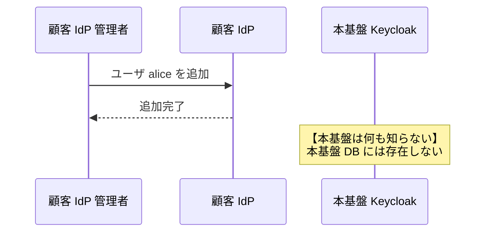
```mermaid
sequenceDiagram
    participant Admin as 顧客 IdP 管理者
    participant IdP as 顧客 IdP
    participant Broker as 本基盤 Keycloak
    Admin->>IdP: ユーザ alice を追加
    IdP-->>Admin: 追加完了
    Note over Broker: 【本基盤は何も知らない】<br/>本基盤 DB には存在しない
```

**SCIM**:

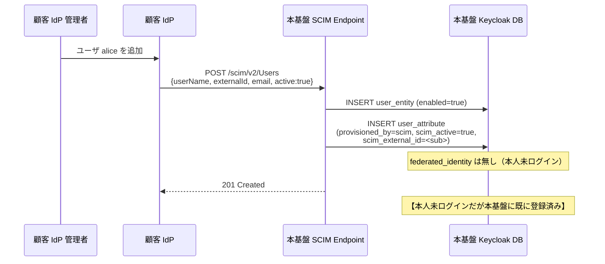
```mermaid
sequenceDiagram
    participant Admin as 顧客 IdP 管理者
    participant IdP as 顧客 IdP
    participant Broker as 本基盤 SCIM Endpoint
    participant DB as 本基盤 Keycloak DB
    Admin->>IdP: ユーザ alice を追加
    IdP->>Broker: POST /scim/v2/Users<br/>{userName, externalId, email, active:true}
    Broker->>DB: INSERT user_entity (enabled=true)
    Broker->>DB: INSERT user_attribute<br/>(provisioned_by=scim, scim_active=true,<br/>scim_external_id=<sub>)
    Note over DB: federated_identity は無し（本人未ログイン）
    Broker-->>IdP: 201 Created
    Note over DB: 【本人未ログインだが本基盤に既に登録済み】
```

##### S2: ユーザ初回ログイン

**JIT**（新規ユーザ、事前登録なし）:

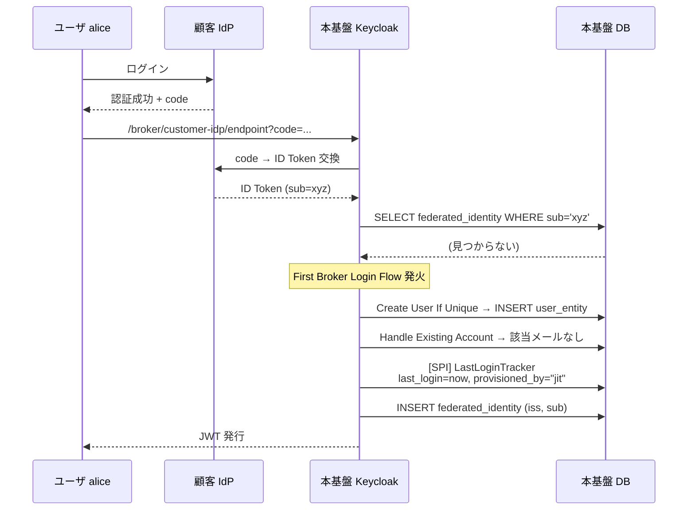
```mermaid
sequenceDiagram
    participant User as ユーザ alice
    participant IdP as 顧客 IdP
    participant Broker as 本基盤 Keycloak
    participant DB as 本基盤 DB
    User->>IdP: ログイン
    IdP-->>User: 認証成功 + code
    User->>Broker: /broker/customer-idp/endpoint?code=...
    Broker->>IdP: code → ID Token 交換
    IdP-->>Broker: ID Token (sub=xyz)
    Broker->>DB: SELECT federated_identity WHERE sub='xyz'
    DB-->>Broker: (見つからない)
    Note over Broker: First Broker Login Flow 発火
    Broker->>DB: Create User If Unique → INSERT user_entity
    Broker->>DB: Handle Existing Account → 該当メールなし
    Broker->>DB: [SPI] LastLoginTracker<br/>last_login=now, provisioned_by="jit"
    Broker->>DB: INSERT federated_identity (iss, sub)
    Broker-->>User: JWT 発行
```

**SCIM**（SCIM 事前登録済みユーザが初めてログイン）:

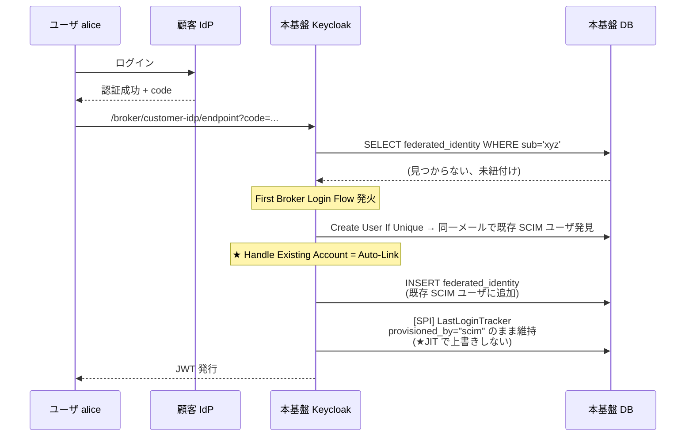
```mermaid
sequenceDiagram
    participant User as ユーザ alice
    participant IdP as 顧客 IdP
    participant Broker as 本基盤 Keycloak
    participant DB as 本基盤 DB
    User->>IdP: ログイン
    IdP-->>User: 認証成功 + code
    User->>Broker: /broker/customer-idp/endpoint?code=...
    Broker->>DB: SELECT federated_identity WHERE sub='xyz'
    DB-->>Broker: (見つからない、未紐付け)
    Note over Broker: First Broker Login Flow 発火
    Broker->>DB: Create User If Unique → 同一メールで既存 SCIM ユーザ発見
    Note over Broker: ★ Handle Existing Account = Auto-Link
    Broker->>DB: INSERT federated_identity<br/>(既存 SCIM ユーザに追加)
    Broker->>DB: [SPI] LastLoginTracker<br/>provisioned_by="scim" のまま維持<br/>(★JIT で上書きしない)
    Broker-->>User: JWT 発行
```

**★設計要点**：First Broker Login SPI で「`provisioned_by` が未設定の場合のみ `jit` をセット」する条件分岐必須（既存 SCIM ユーザを上書きしない）:

```java
String current = user.getFirstAttribute("provisioned_by");
if (current == null) {
    user.setSingleAttribute("provisioned_by", "jit");
}
// scim / local-admin は上書きしない
```

##### S3: ユーザ通常ログイン

**両者共通**:

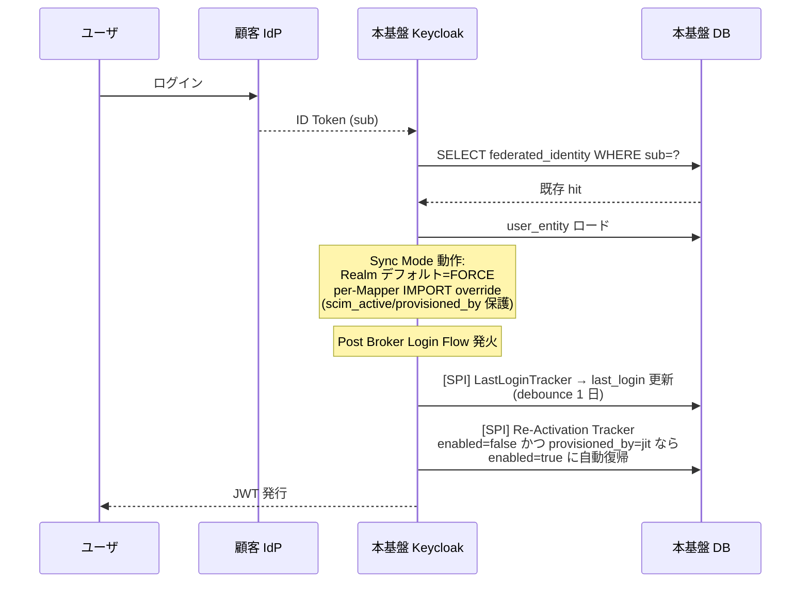
```mermaid
sequenceDiagram
    participant User as ユーザ
    participant IdP as 顧客 IdP
    participant Broker as 本基盤 Keycloak
    participant DB as 本基盤 DB
    User->>IdP: ログイン
    IdP-->>Broker: ID Token (sub)
    Broker->>DB: SELECT federated_identity WHERE sub=?
    DB-->>Broker: 既存 hit
    Broker->>DB: user_entity ロード
    Note over Broker: Sync Mode 動作:<br/>Realm デフォルト=FORCE<br/>per-Mapper IMPORT override<br/>(scim_active/provisioned_by 保護)
    Note over Broker: Post Broker Login Flow 発火
    Broker->>DB: [SPI] LastLoginTracker → last_login 更新<br/>(debounce 1 日)
    Broker->>DB: [SPI] Re-Activation Tracker<br/>enabled=false かつ provisioned_by=jit なら<br/>enabled=true に自動復帰
    Broker-->>User: JWT 発行
```

##### S4: 顧客 IdP で属性変更（メール/名前/Role）

**JIT**（Sync Mode=FORCE の場合）:

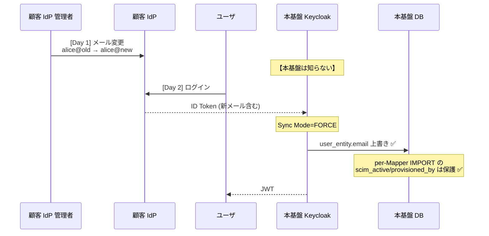
```mermaid
sequenceDiagram
    participant Admin as 顧客 IdP 管理者
    participant IdP as 顧客 IdP
    participant User as ユーザ
    participant Broker as 本基盤 Keycloak
    participant DB as 本基盤 DB
    Admin->>IdP: [Day 1] メール変更<br/>alice@old → alice@new
    Note over Broker: 【本基盤は知らない】
    User->>IdP: [Day 2] ログイン
    IdP-->>Broker: ID Token (新メール含む)
    Note over Broker: Sync Mode=FORCE
    Broker->>DB: user_entity.email 上書き ✅
    Note over DB: per-Mapper IMPORT の<br/>scim_active/provisioned_by は保護 ✅
    Broker-->>User: JWT
```

**SCIM**:

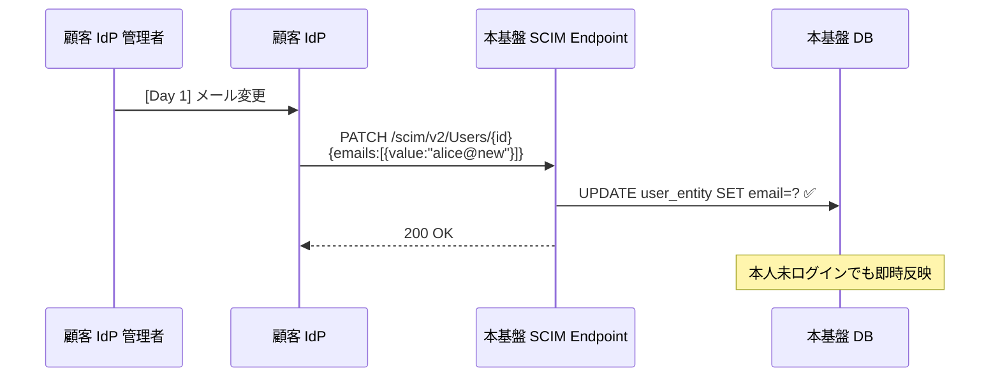
```mermaid
sequenceDiagram
    participant Admin as 顧客 IdP 管理者
    participant IdP as 顧客 IdP
    participant Broker as 本基盤 SCIM Endpoint
    participant DB as 本基盤 DB
    Admin->>IdP: [Day 1] メール変更
    IdP->>Broker: PATCH /scim/v2/Users/{id}<br/>{emails:[{value:"alice@new"}]}
    Broker->>DB: UPDATE user_entity SET email=? ✅
    Broker-->>IdP: 200 OK
    Note over DB: 本人未ログインでも即時反映
```

##### S5: 顧客 IdP でユーザ無効化（停職等）

**JIT**:

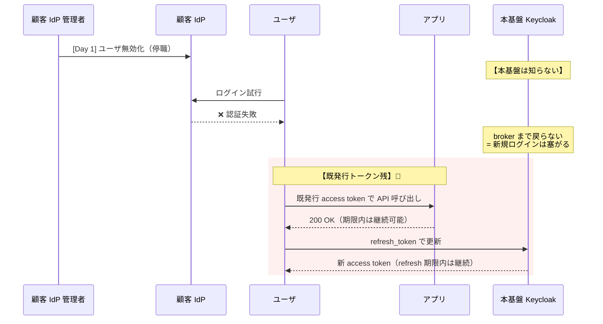
```mermaid
sequenceDiagram
    participant Admin as 顧客 IdP 管理者
    participant IdP as 顧客 IdP
    participant User as ユーザ
    participant App as アプリ
    participant Broker as 本基盤 Keycloak
    Admin->>IdP: [Day 1] ユーザ無効化（停職）
    Note over Broker: 【本基盤は知らない】
    User->>IdP: ログイン試行
    IdP-->>User: ❌ 認証失敗
    Note over Broker: broker まで戻らない<br/>= 新規ログインは塞がる
    rect rgb(255, 240, 240)
        Note over User,App: 【既発行トークン残】🚨
        User->>App: 既発行 access token で API 呼び出し
        App-->>User: 200 OK（期限内は継続可能）
        User->>Broker: refresh_token で更新
        Broker-->>User: 新 access token（refresh 期限内は継続）
    end
```

**SCIM**:

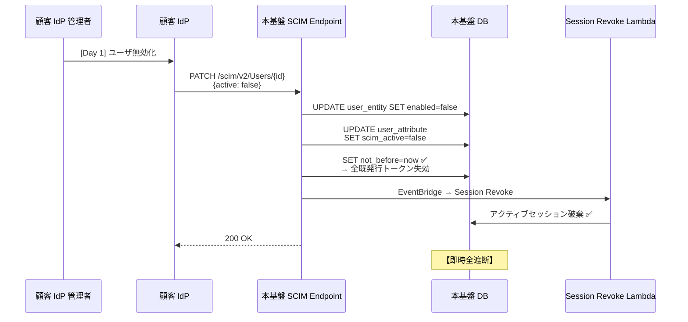
```mermaid
sequenceDiagram
    participant Admin as 顧客 IdP 管理者
    participant IdP as 顧客 IdP
    participant Broker as 本基盤 SCIM Endpoint
    participant DB as 本基盤 DB
    participant Lambda as Session Revoke Lambda
    Admin->>IdP: [Day 1] ユーザ無効化
    IdP->>Broker: PATCH /scim/v2/Users/{id}<br/>{active: false}
    Broker->>DB: UPDATE user_entity SET enabled=false
    Broker->>DB: UPDATE user_attribute<br/>SET scim_active=false
    Broker->>DB: SET not_before=now ✅<br/>→ 全既発行トークン失効
    Broker->>Lambda: EventBridge → Session Revoke
    Lambda->>DB: アクティブセッション破棄 ✅
    Broker-->>IdP: 200 OK
    Note over DB: 【即時全遮断】
```

**★核心**：JIT の最大の弱点は **既発行トークンが残ること**。SCIM は `not_before` + Session Revoke で即時全失効可能。

##### S6: 顧客 IdP でユーザ削除（退職）

**JIT**（最大 90 日 Lag が発生）:

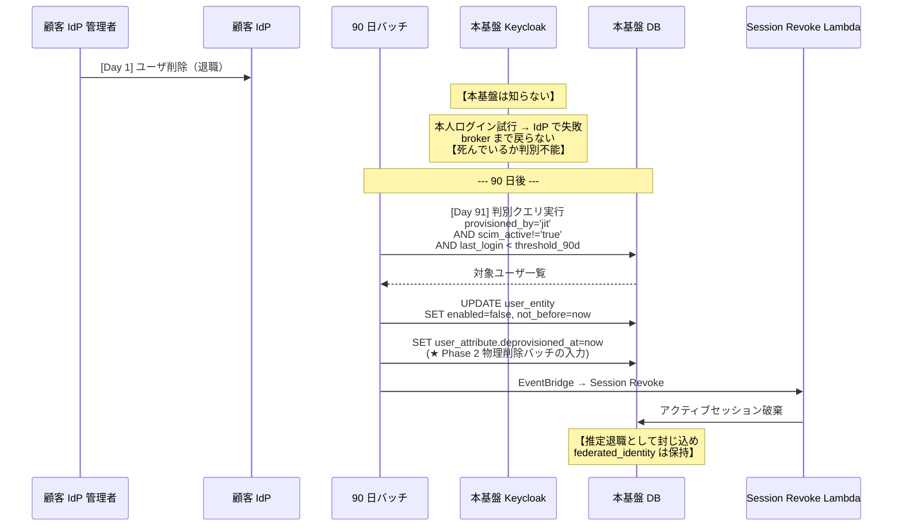
```mermaid
sequenceDiagram
    participant Admin as 顧客 IdP 管理者
    participant IdP as 顧客 IdP
    participant Batch as 90 日バッチ
    participant Broker as 本基盤 Keycloak
    participant DB as 本基盤 DB
    participant Lambda as Session Revoke Lambda
    Admin->>IdP: [Day 1] ユーザ削除（退職）
    Note over Broker: 【本基盤は知らない】
    Note over Broker: 本人ログイン試行 → IdP で失敗<br/>broker まで戻らない<br/>【死んでいるか判別不能】
    Note over Batch,DB: --- 90 日後 ---
    Batch->>DB: [Day 91] 判別クエリ実行<br/>provisioned_by='jit'<br/>AND scim_active!='true'<br/>AND last_login < threshold_90d
    DB-->>Batch: 対象ユーザ一覧
    Batch->>DB: UPDATE user_entity<br/>SET enabled=false, not_before=now
    Batch->>DB: SET user_attribute.deprovisioned_at=now<br/>(★ Phase 2 物理削除バッチの入力)
    Batch->>Lambda: EventBridge → Session Revoke
    Lambda->>DB: アクティブセッション破棄
    Note over DB: 【推定退職として封じ込め<br/>federated_identity は保持】
```

**SCIM**（即時 deprovisioning）:

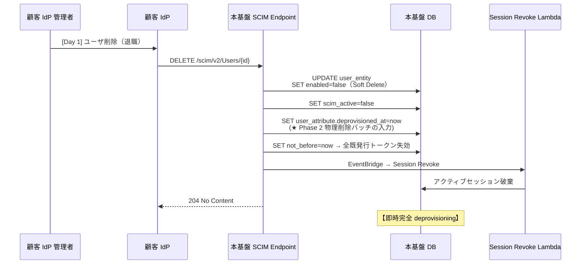
```mermaid
sequenceDiagram
    participant Admin as 顧客 IdP 管理者
    participant IdP as 顧客 IdP
    participant Broker as 本基盤 SCIM Endpoint
    participant DB as 本基盤 DB
    participant Lambda as Session Revoke Lambda
    Admin->>IdP: [Day 1] ユーザ削除（退職）
    IdP->>Broker: DELETE /scim/v2/Users/{id}
    Broker->>DB: UPDATE user_entity<br/>SET enabled=false（Soft Delete）
    Broker->>DB: SET scim_active=false
    Broker->>DB: SET user_attribute.deprovisioned_at=now<br/>(★ Phase 2 物理削除バッチの入力)
    Broker->>DB: SET not_before=now → 全既発行トークン失効
    Broker->>Lambda: EventBridge → Session Revoke
    Lambda->>DB: アクティブセッション破棄
    Broker-->>IdP: 204 No Content
    Note over DB: 【即時完全 deprovisioning】
```

**★ Phase 1 実装必須事項**（[§10.4.K.6](#k66-phase-1-で必要な準備事項) 参照）：**Soft Delete のとき（JIT バッチ / SCIM DELETE / 管理者操作 全て）`deprovisioned_at` を必ず同時セット**。これが Phase 2 物理削除バッチの唯一の入力となる。

**時間差比較**：

| | JIT | SCIM |
|---|---|---|
| 退職から本基盤反映まで | **最大 90 日** | **秒〜分** |
| 既発行トークン残 | **最大 30-90 日** | **即時失効** |
| 監査ログ deprovision 日時精度 | 推定値（実際の退職日と乖離）| 正確な退職日 |

##### S7: 削除ユーザが同一メールで再作成 ★重要

**JIT**:

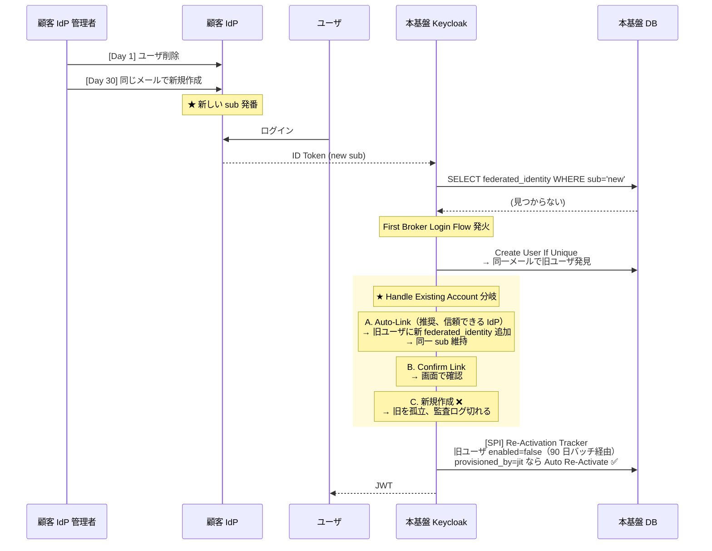
```mermaid
sequenceDiagram
    participant Admin as 顧客 IdP 管理者
    participant IdP as 顧客 IdP
    participant User as ユーザ
    participant Broker as 本基盤 Keycloak
    participant DB as 本基盤 DB
    Admin->>IdP: [Day 1] ユーザ削除
    Admin->>IdP: [Day 30] 同じメールで新規作成
    Note over IdP: ★ 新しい sub 発番
    User->>IdP: ログイン
    IdP-->>Broker: ID Token (new sub)
    Broker->>DB: SELECT federated_identity WHERE sub='new'
    DB-->>Broker: (見つからない)
    Note over Broker: First Broker Login Flow 発火
    Broker->>DB: Create User If Unique<br/>→ 同一メールで旧ユーザ発見
    rect rgb(255, 250, 220)
        Note over Broker: ★ Handle Existing Account 分岐
        Note over Broker: A. Auto-Link（推奨、信頼できる IdP）<br/>→ 旧ユーザに新 federated_identity 追加<br/>→ 同一 sub 維持
        Note over Broker: B. Confirm Link<br/>→ 画面で確認
        Note over Broker: C. 新規作成 ❌<br/>→ 旧を孤立、監査ログ切れる
    end
    Broker->>DB: [SPI] Re-Activation Tracker<br/>旧ユーザ enabled=false（90 日バッチ経由）<br/>provisioned_by=jit なら Auto Re-Activate ✅
    Broker-->>User: JWT
```

**SCIM**:

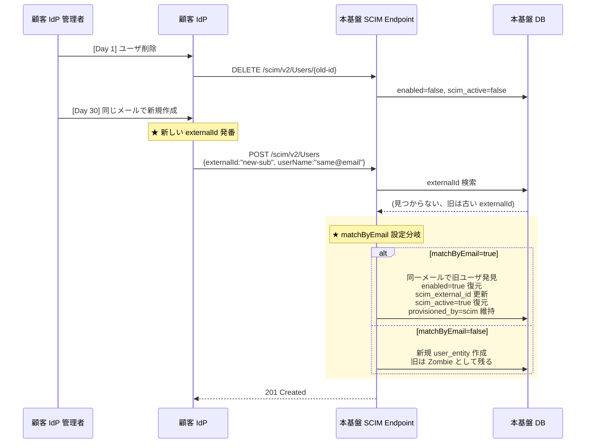
```mermaid
sequenceDiagram
    participant Admin as 顧客 IdP 管理者
    participant IdP as 顧客 IdP
    participant Broker as 本基盤 SCIM Endpoint
    participant DB as 本基盤 DB
    Admin->>IdP: [Day 1] ユーザ削除
    IdP->>Broker: DELETE /scim/v2/Users/{old-id}
    Broker->>DB: enabled=false, scim_active=false
    Admin->>IdP: [Day 30] 同じメールで新規作成
    Note over IdP: ★ 新しい externalId 発番
    IdP->>Broker: POST /scim/v2/Users<br/>{externalId:"new-sub", userName:"same@email"}
    Broker->>DB: externalId 検索
    DB-->>Broker: (見つからない、旧は古い externalId)
    rect rgb(255, 250, 220)
        Note over Broker: ★ matchByEmail 設定分岐
        alt matchByEmail=true
            Broker->>DB: 同一メールで旧ユーザ発見<br/>enabled=true 復元<br/>scim_external_id 更新<br/>scim_active=true 復元<br/>provisioned_by=scim 維持
        else matchByEmail=false
            Broker->>DB: 新規 user_entity 作成<br/>旧は Zombie として残る
        end
    end
    Broker-->>IdP: 201 Created
```

**★設計選択肢**：

| 選択肢 | 動作 | メリット | デメリット |
|---|---|---|---|
| **A. Auto-Link**（信頼できる IdP 前提）| 旧ユーザに新 federated_identity 追加、同一 `sub` 維持 | 監査連続性 / アプリ人物同一性維持 | **メールベース Auto-Link は Account Takeover リスク**（信頼できない IdP なら乗っ取り経路）|
| **B. Confirm Link** | 画面で確認、ユーザが「はい」で紐付け | 誤リンク防止 | UX 悪化、業務中断 |
| **C. 新規ユーザ作成** | 新 user_entity 作成、旧は 90 日バッチで削除 | 実装簡単 | アプリ側 sub 変化 → 人物同一性壊れる、監査ログ切れる |

**Phase 1 推奨**：**B（Confirm Link）をデフォルト**、Trusted IdP のみ A に切り替え可能。B-JIT-LC-1 でヒアリング。

##### S8: 顧客が IdP を差し替え（Entra ID → Okta 等）

**JIT**:

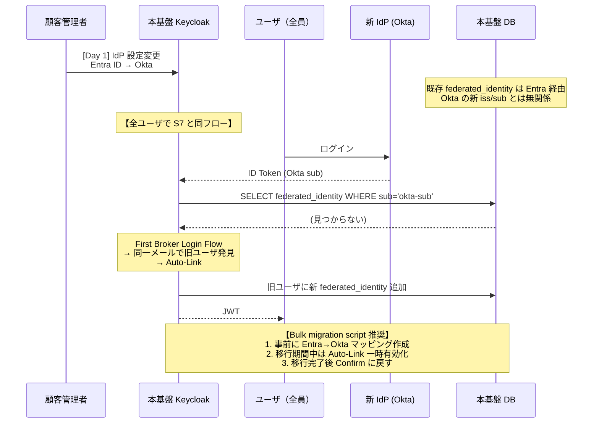
```mermaid
sequenceDiagram
    participant Admin as 顧客管理者
    participant Broker as 本基盤 Keycloak
    participant User as ユーザ（全員）
    participant Okta as 新 IdP (Okta)
    participant DB as 本基盤 DB
    Admin->>Broker: [Day 1] IdP 設定変更<br/>Entra ID → Okta
    Note over DB: 既存 federated_identity は Entra 経由<br/>Okta の新 iss/sub とは無関係
    Note over Broker: 【全ユーザで S7 と同フロー】
    User->>Okta: ログイン
    Okta-->>Broker: ID Token (Okta sub)
    Broker->>DB: SELECT federated_identity WHERE sub='okta-sub'
    DB-->>Broker: (見つからない)
    Note over Broker: First Broker Login Flow<br/>→ 同一メールで旧ユーザ発見<br/>→ Auto-Link
    Broker->>DB: 旧ユーザに新 federated_identity 追加
    Broker-->>User: JWT
    Note over Broker,DB: 【Bulk migration script 推奨】<br/>1. 事前に Entra→Okta マッピング作成<br/>2. 移行期間中は Auto-Link 一時有効化<br/>3. 移行完了後 Confirm に戻す
```

**SCIM**:

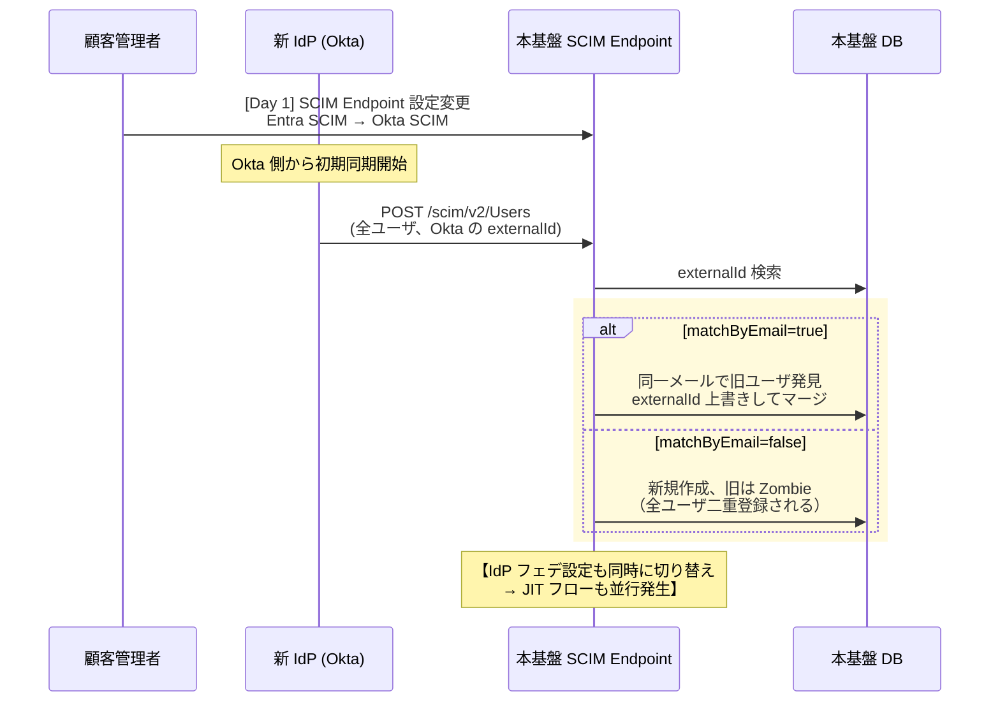
```mermaid
sequenceDiagram
    participant Admin as 顧客管理者
    participant Okta as 新 IdP (Okta)
    participant Broker as 本基盤 SCIM Endpoint
    participant DB as 本基盤 DB
    Admin->>Broker: [Day 1] SCIM Endpoint 設定変更<br/>Entra SCIM → Okta SCIM
    Note over Okta: Okta 側から初期同期開始
    Okta->>Broker: POST /scim/v2/Users<br/>(全ユーザ、Okta の externalId)
    Broker->>DB: externalId 検索
    rect rgb(255, 250, 220)
        alt matchByEmail=true
            Broker->>DB: 同一メールで旧ユーザ発見<br/>externalId 上書きしてマージ
        else matchByEmail=false
            Broker->>DB: 新規作成、旧は Zombie<br/>（全ユーザ二重登録される）
        end
    end
    Note over Broker: 【IdP フェデ設定も同時に切り替え<br/>→ JIT フローも並行発生】
```

**含意**：IdP 差し替えは JIT/SCIM に関わらず **「全ユーザ再リンク」の大工事**。**Phase 1 スコープに含めるか要判断**（B-JIT-LC-2 でヒアリング）。

##### S9: 顧客 IdP 一時停止

**両者共通**:

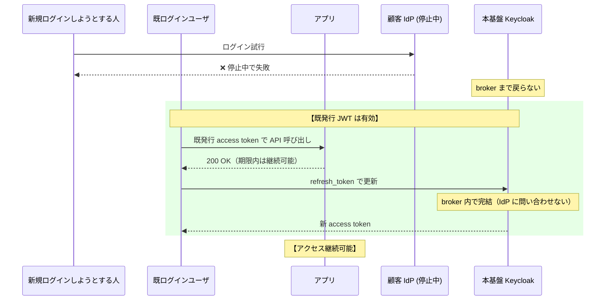
```mermaid
sequenceDiagram
    participant NewUser as 新規ログインしようとする人
    participant ExistingUser as 既ログインユーザ
    participant App as アプリ
    participant IdP as 顧客 IdP (停止中)
    participant Broker as 本基盤 Keycloak
    NewUser->>IdP: ログイン試行
    IdP-->>NewUser: ❌ 停止中で失敗
    Note over Broker: broker まで戻らない
    rect rgb(230, 255, 230)
        Note over ExistingUser,Broker: 【既発行 JWT は有効】
        ExistingUser->>App: 既発行 access token で API 呼び出し
        App-->>ExistingUser: 200 OK（期限内は継続可能）
        ExistingUser->>Broker: refresh_token で更新
        Note over Broker: broker 内で完結（IdP に問い合わせない）
        Broker-->>ExistingUser: 新 access token
    end
    Note over App: 【アクセス継続可能】
```

**注意**：
- JIT：新規初回ログインは不可
- SCIM：SCIM Push も停止 → **顧客 IdP 復旧後にキューイングされた変更を再送する仕組みが IdP 側にあるか確認**（Entra ID / Okta は基本リトライあり）

##### S10: 90 日未ログイン（本基盤側の推定削除）

**JIT**（推定削除 + Re-Activation）:

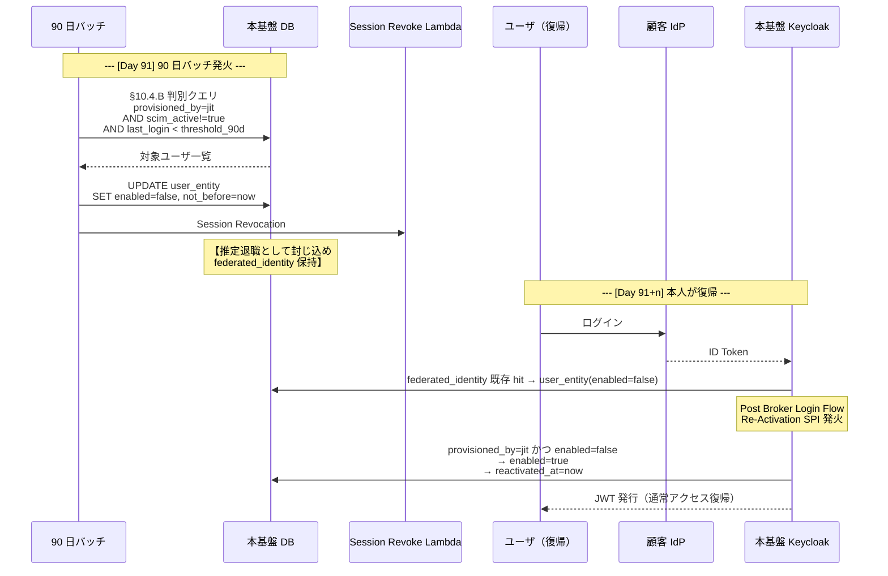
```mermaid
sequenceDiagram
    participant Batch as 90 日バッチ
    participant DB as 本基盤 DB
    participant Lambda as Session Revoke Lambda
    participant User as ユーザ（復帰）
    participant IdP as 顧客 IdP
    participant Broker as 本基盤 Keycloak
    Note over Batch,DB: --- [Day 91] 90 日バッチ発火 ---
    Batch->>DB: §10.4.B 判別クエリ<br/>provisioned_by=jit<br/>AND scim_active!=true<br/>AND last_login < threshold_90d
    DB-->>Batch: 対象ユーザ一覧
    Batch->>DB: UPDATE user_entity<br/>SET enabled=false, not_before=now
    Batch->>Lambda: Session Revocation
    Note over DB: 【推定退職として封じ込め<br/>federated_identity 保持】
    Note over User,Broker: --- [Day 91+n] 本人が復帰 ---
    User->>IdP: ログイン
    IdP-->>Broker: ID Token
    Broker->>DB: federated_identity 既存 hit → user_entity(enabled=false)
    Note over Broker: Post Broker Login Flow<br/>Re-Activation SPI 発火
    Broker->>DB: provisioned_by=jit かつ enabled=false<br/>→ enabled=true<br/>→ reactivated_at=now
    Broker-->>User: JWT 発行（通常アクセス復帰）
```

**SCIM**（本基盤側は何もしない、顧客責任）:

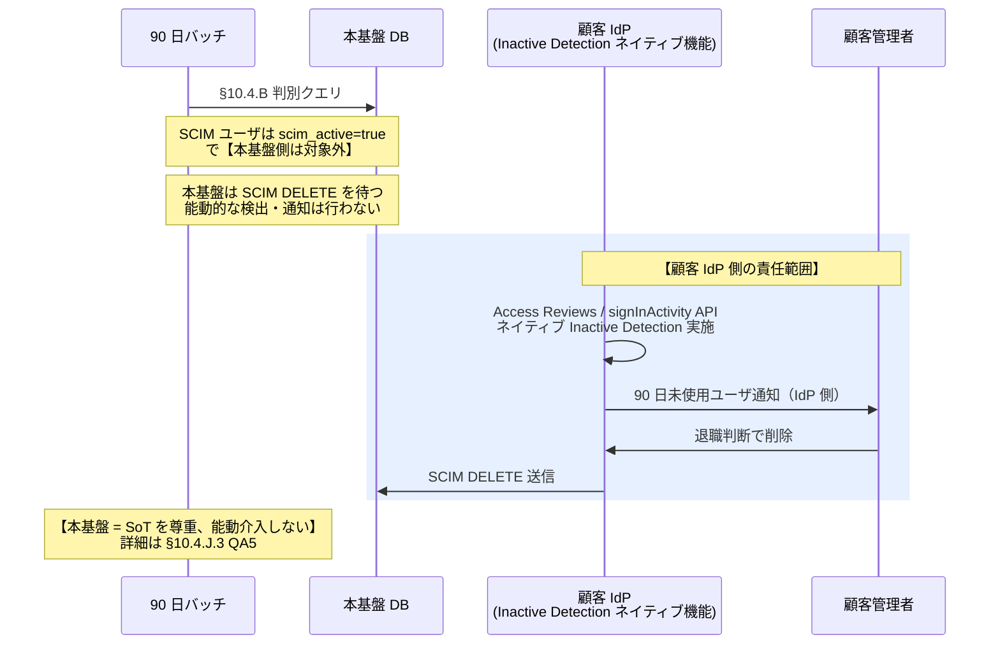
```mermaid
sequenceDiagram
    participant Batch as 90 日バッチ
    participant DB as 本基盤 DB
    participant IdP as 顧客 IdP<br/>(Inactive Detection ネイティブ機能)
    participant CustAdmin as 顧客管理者
    Batch->>DB: §10.4.B 判別クエリ
    Note over Batch,DB: SCIM ユーザは scim_active=true<br/>で【本基盤側は対象外】
    Note over Batch,DB: 本基盤は SCIM DELETE を待つ<br/>能動的な検出・通知は行わない
    rect rgb(230, 240, 255)
        Note over IdP,CustAdmin: 【顧客 IdP 側の責任範囲】
        IdP->>IdP: Access Reviews / signInActivity API<br/>ネイティブ Inactive Detection 実施
        IdP->>CustAdmin: 90 日未使用ユーザ通知（IdP 側）
        CustAdmin->>IdP: 退職判断で削除
        IdP->>DB: SCIM DELETE 送信
    end
    Note over Batch: 【本基盤 = SoT を尊重、能動介入しない】<br/>詳細は §10.4.J.3 QA5
```

### 10.4.H 【2026-07-14 新設】Deprovisioning の責任分界（Shared Responsibility）+ SLA 比較

> **背景・なぜここで整理するか**：本基盤の「無効化」は **本基盤内の Hygiene（L1）のみ**であり、**本当の deprovisioning（L2 認証拒否）は顧客 IdP 責任**。この責任分界を契約 / SLA / 顧客説明で明示しないと、退職者が本基盤経由で残り続ける誤解が発生する。

#### 10.4.H.1 3 層モデル

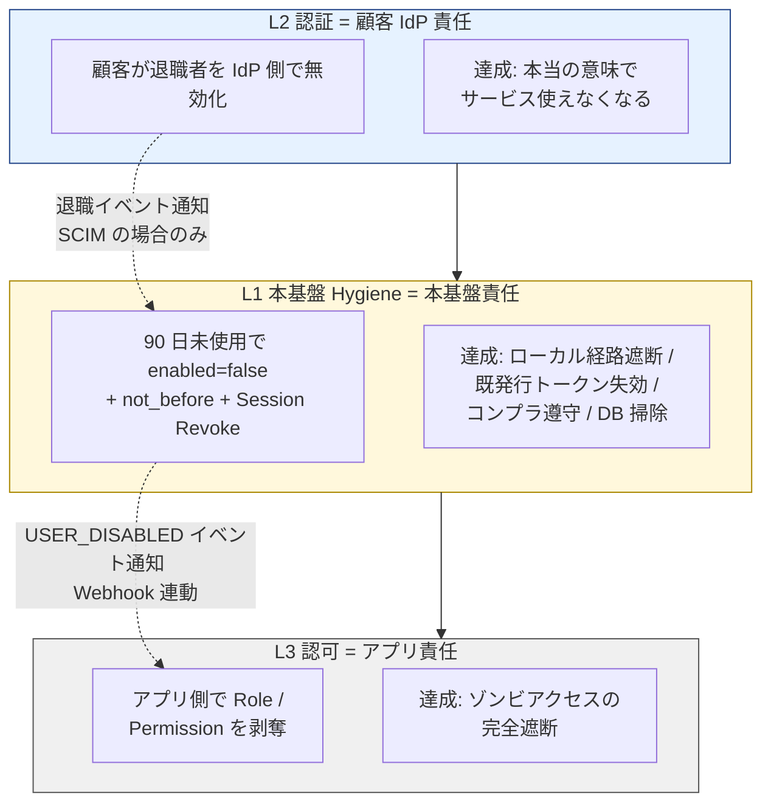
```mermaid
flowchart TB
    subgraph L2 [L2 認証 = 顧客 IdP 責任]
        L2_A[顧客が退職者を IdP 側で無効化]
        L2_B[達成: 本当の意味で<br/>サービス使えなくなる]
    end
    subgraph L1 [L1 本基盤 Hygiene = 本基盤責任]
        L1_A[90 日未使用で enabled=false<br/>+ not_before + Session Revoke]
        L1_B[達成: ローカル経路遮断 /<br/>既発行トークン失効 /<br/>コンプラ遵守 / DB 掃除]
    end
    subgraph L3 [L3 認可 = アプリ責任]
        L3_A[アプリ側で Role /<br/>Permission を剥奪]
        L3_B[達成: ゾンビアクセスの<br/>完全遮断]
    end
    L2 --> L1
    L1 --> L3
    L2_A -.->|退職イベント通知<br/>SCIM の場合のみ| L1_A
    L1_A -.->|USER_DISABLED イベント通知<br/>Webhook 連動| L3_A

    classDef primary fill:#e6f2ff,stroke:#248
    classDef secondary fill:#fff8dc,stroke:#a80
    classDef tertiary fill:#f0f0f0,stroke:#555
    class L2 primary
    class L1 secondary
    class L3 tertiary
```

| 層 | 実施主体 | 対策 | 達成すること |
|---|---|---|---|
| **L1 本基盤 Hygiene** | 本基盤 | 90 日未使用で `enabled=false` + `not_before` + Session Revoke（[§10.4.A/B](#104a-推奨2026-07-09-event-listener-spi--user_attribute-方式)）| **コンプラ対応（PCI DSS 8.2.6 "removed or disabled"）+ 多層防御（顧客 IdP のミスへの保険）+ 監査履歴** |
| **L2 認証** | **顧客 IdP** | 顧客が退職者を IdP 側で無効化 | **本当の意味でその人がサービス使えなくなる** |
| **L3 認可** | アプリ | アプリ側で Role / Permission を剥奪 | ゾンビアクセスの完全遮断 |

**核心**：本基盤の 90 日バッチは **L1 のみ**。**L2 は顧客 IdP 責任**（Shared Responsibility として契約に明記すべき）。

**⚠ 誤解しやすい表現の訂正**（2026-07-15）：初期版では L1 の達成事項に「**DB 掃除**」と記載していたが、これは不正確。**Soft Delete（`enabled=false`）では DB 使用量は減らない**（`user_entity` / `user_attribute` / `federated_identity` レコードは保持される）。実際の DB 掃除は **法定保持期間経過後の物理削除バッチ（Phase 2 スコープ）** が担当。3 段階削除モデルの詳細は [§10.4.K](#104k-2026-07-15-新設--3-段階削除モデル--jitscim-対称性--本基盤側対応の設計思想) 参照。

#### 10.4.H.2 SLA 比較（JIT vs SCIM）

| 要件 | JIT | SCIM |
|---|:---:|:---:|
| 退職から本基盤反映まで | 最大 90 日 | 秒〜分 |
| 既発行トークン即時失効 | ❌ 不可（90 日バッチ発火時のみ）| ✅ 可能（DELETE 即時）|
| 監査ログ deprovision 日時精度 | 推定値（乖離あり）| 正確な退職日 |
| 顧客側の実装工数 | ゼロ | 中〜大 |

#### 10.4.H.3 コンプライアンス比較

| 要件 | JIT | SCIM |
|---|:---:|:---:|
| **PCI DSS 8.2.6**（90 日未使用「remove or disable」）| ✅ 90 日バッチで対応（Soft Delete = disable で OK）| ✅ SCIM DELETE で対応（Soft Delete = disable で OK）|
| **PCI DSS 8.2.5**（退職時即時取消）| ⚠ **最大 90 日 Lag**（Compensating Control 必要、[§10.7](#107-scim-非対応-idp-顧客向け-compensating-controls-実装詳細)）| ✅ 即時対応 |
| **APPI 22 条**（不要保持禁止・遅滞ない消去）| ⚠ 90 日 Lag | ✅ 即時対応（Soft Delete で法適合、Phase 2 で pseudonymization 追加）|
| **GDPR Art. 17**（消去権）| ⚠ 顧客 IdP 側の削除 + 本基盤の 90 日 Lag | ✅ SCIM DELETE で連動（Soft Delete + pseudonymization 対応）|

**★ PCI DSS 8.2.6 "removed OR disabled" の根拠**（Phase 1 で物理削除なしとする根拠）:

PCI DSS v4.0.1 原文（[PCI SSC 公式](https://www.pcisecuritystandards.org/document_library/)）:

> **"Inactive user accounts are removed or disabled within 90 days of inactivity."**
>
> **Testing Procedures 8.2.6**: "Interview responsible personnel and examine user accounts and related evidence to verify that inactive user accounts are removed or disabled within 90 days of inactivity."

**PCI SSC Information Supplement（実装ガイダンス）**:

> **"'Disabled' means the account cannot be used to authenticate or access the system. Disabling the account by setting a flag or attribute that prevents authentication is sufficient to meet Requirement 8.2.6."**

**QSA 業界慣行**：主要 QSA（Coalfire / Trustwave / NCC Group 等）は **`enabled=false` フラグ + `not_before` セット + Session Revoke + 監査ログ** で Compliant と判定。**物理削除を要求する QSA はほぼ存在しない**（PCI DSS 10.5 監査ログ完全性の観点で逆に嫌う）。

→ **Phase 1: Soft Delete のみ、物理削除は Phase 2（法定保持期間経過後）で対応** が業界標準に沿った設計。

**★ 重要：PCI DSS 監査の "システムごと独立性"**（2026-07-15 明示化）:

> **「顧客 IdP 側で disabled になっていれば、本基盤側で `enabled=true` のままでも良いのでは?」への回答**

**❌ ダメ**。理由は以下:

```mermaid
flowchart TB
    subgraph Customer [顧客組織の PCI DSS 監査]
        QSA_C[顧客 QSA]
        C_IdP[顧客 IdP]
        QSA_C --> C_IdP
        QSA_C --> C_Check1[顧客 IdP 内のアカウント状態を監査<br/>→ disabled なら Compliant]
    end
    subgraph Platform [本基盤の PCI DSS 監査]
        QSA_P[本基盤 QSA]
        P_KC[本基盤 Keycloak]
        QSA_P --> P_KC
        QSA_P --> P_Check1[本基盤 DB 内のアカウント状態を監査<br/>→ enabled のまま = Finding 🚨]
    end

    Note1[顧客 IdP と本基盤は別 PCI DSS 監査対象<br/>QSA は監査対象システム内の状態のみ判定]
    Customer -.-> Note1
    Platform -.-> Note1

    classDef fail fill:#ffe6e6,stroke:#a44
    classDef pass fill:#e6ffe6,stroke:#4a4
    class C_Check1 pass
    class P_Check1 fail
```

**根拠**：
- **PCI DSS Guidance「Scoping and Segmentation」**：対象システムは独立して監査、他システムの状態は考慮しない
- **CDE Connected-to Systems の "Applicable Requirements"** は該当システムに対して独立適用
- **Shared Responsibility Model**：本基盤が「認証責任」を負う → **本基盤内のアカウント管理も本基盤の責任**

**Effective Disable 主張の限界**（本基盤で `enabled=true` のまま「対策 B で実質使用不可」と主張）:

| QSA の判定パターン | 認めるか | リスク |
|---|:---:|---|
| **Strict 解釈**（主流：Coalfire/Trustwave/NCC）| ❌ 認めない | 本基盤内で `enabled=true` = Finding で押し切られる |
| **Compensating Control 解釈** | ⚠ 条件付き | Worksheet 提出 + QSA 合意形成コスト大 |
| **Effective Disable 解釈** | ✅ 認める | 少数派、依存するのはリスク |

→ **業界標準の Safe Path = 本基盤で明示的に Soft Delete する**。「顧客 IdP 側の disabled で代替できる」主張は QSA 依存で危険。

**APPI 22 条 / GDPR Art. 5(e) との整合**：
- **APPI 22 条 "遅滞ない消去"**：Soft Delete + 個人情報 pseudonymization（Phase 2）で対応可能（判例支持）
- **GDPR Art. 5(e) Storage Limitation**：pseudonymization（Art. 4(5)）で対応可能、完全物理削除は必須ではない

#### 10.4.H.4 契約 / SLA に明記すべきこと

- **「本基盤の Deprovisioning は JIT 顧客で最大 90 日の Lag が存在する」**
- **「即時 Deprovisioning が必要な場合、顧客側で SCIM 実装が必要」**
- **「顧客 IdP 側の退職処理は顧客責任」**（本基盤は顧客 IdP のユーザ状態を操作しない）
- **「Compensating Controls（短命 Token + Refresh Rotation 等、[§10.7](#107-scim-非対応-idp-顧客向け-compensating-controls-実装詳細)）を推奨」**
- **「SCIM ユーザの Inactive Detection および 90 日未使用検出は顧客 IdP 責任」**（本基盤は SCIM 通知の受信のみ、能動的な監査レポート・通知は提供しない、詳細は [§10.4.J.2](#104j2-顧客案内テンプレートrfp--契約時) 参照）

### 10.4.I 【2026-07-14 新設】Re-Activation SPI 実装仕様 + JIT/SCIM 判別条件分岐

> **背景・なぜここで新設するか**：90 日バッチで `enabled=false` にした JIT ユーザが復帰した場合、フェデ経路で戻ってきたら自動的に `enabled=true` に戻す SPI が必要。ただし **SCIM で明示削除された人が JIT 経路で誤って再有効化されると SCIM deprovisioning が意味を失う（セキュリティ上重大）**。条件分岐を実装レベルで確定する。

#### 10.4.I.1 Re-Activation の必要性

**本基盤 = IdP フェデ専用の前提下では**：
- 90 日バッチで無効化しても、復帰者は顧客 IdP でまだ有効
- 顧客 IdP を通ってきた = 顧客 IdP がまだ有効と判断している = 「先回りで閉じた推定退職者」ではなかった、と判定できる
- **手動再有効化を運用者に要求するのは非現実的**（10M MAU 規模で管理不能）
- → **Post Broker Login Flow で SPI が自動再有効化するのが唯一の現実解**

#### 10.4.I.2 セキュリティ上重大：SCIM 除外条件必須

**危険なシナリオ**（SCIM 除外条件がない場合）:

```mermaid
sequenceDiagram
    participant IdP as 顧客 IdP
    participant Broker as 本基盤 SCIM Endpoint
    participant DB as 本基盤 DB
    participant Ex as 元従業員（退職済み）
    participant SPI as Re-Activation SPI
    IdP->>Broker: [Day 100] SCIM DELETE
    Broker->>DB: enabled=false, scim_active=false ✅
    rect rgb(255, 230, 230)
        Note over IdP,Ex: [Day 101] 顧客 IdP 側で退職処理漏れ（連携ミス）
        Ex->>IdP: ログイン試行
        IdP-->>Ex: 認証成功（IdP 側で削除漏れ）
        Ex->>Broker: /broker/customer-idp/endpoint?code=...
        Broker->>DB: federated_identity 既存 hit → user_entity(enabled=false)
        Note over Broker: Post Broker Login Flow 発火
        Broker->>SPI: authenticate()
        Note over SPI: ★★ SCIM 除外条件なし ★★
        SPI->>DB: user.setEnabled(true) 🚨
        SPI-->>Broker: success
        Broker-->>Ex: JWT 発行 🚨
        Note over Ex: 元従業員が再ログイン成立<br/>= SCIM deprovisioning が意味を失う
    end
```

→ **Re-Activation SPI は `provisioned_by=jit` の場合のみ発火**するように条件分岐必須（§10.4.I.3）。

**判定分岐フロー**（実装済み仕様）:

```mermaid
flowchart TD
    Start[Post Broker Login Flow 発火]
    Start --> Q1{user.isEnabled ?}
    Q1 -->|true=有効| Update[Last Login 更新のみ]
    Q1 -->|false=無効| Q2{provisioned_by / scim_active 判定}
    Q2 -->|scim または<br/>scim_active=true| Block1[❌ 拒否<br/>USER_DISABLED]
    Q2 -->|local-admin| Block2[❌ 拒否<br/>USER_DISABLED]
    Q2 -->|jit| Reactivate[✅ enabled=true<br/>reactivated_at=now]
    Q2 -->|上記以外<br/>未設定など| Block3[❌ 拒否<br/>安全側で USER_DISABLED]
    Reactivate --> Update
    Update --> End[success → JWT 発行]

    classDef safe fill:#e6ffe6,stroke:#4a4
    classDef danger fill:#ffe6e6,stroke:#a44
    class Reactivate,Update,End safe
    class Block1,Block2,Block3 danger
```

#### 10.4.I.3 SPI 実装スケルトン（LastLoginTracker と統合）

```java
public class LastLoginAndReactivationAuthenticator implements Authenticator {

    private static final long DEBOUNCE_MS = 86_400_000L; // 1 day
    private static final Logger LOG = Logger.getLogger(LastLoginAndReactivationAuthenticator.class);

    @Override
    public void authenticate(AuthenticationFlowContext context) {
        UserModel user = context.getUser();
        String provisionedBy = user.getFirstAttribute("provisioned_by");
        String scimActive = user.getFirstAttribute("scim_active");

        // ===== Re-Activation ロジック =====
        if (!user.isEnabled()) {
            // ★ SCIM 管理下のユーザは Re-Activation 禁止（重大）
            if ("scim".equals(provisionedBy) || "true".equals(scimActive)) {
                LOG.warnf("Re-Activation blocked (SCIM-managed): user=%s", user.getUsername());
                context.failure(AuthenticationFlowError.USER_DISABLED);
                return;
            }
            // ★ 管理者は Re-Activation 対象外（本基盤で明示管理）
            if ("local-admin".equals(provisionedBy)) {
                LOG.warnf("Re-Activation blocked (local-admin): user=%s", user.getUsername());
                context.failure(AuthenticationFlowError.USER_DISABLED);
                return;
            }
            // JIT ユーザのみ自動再有効化
            if ("jit".equals(provisionedBy)) {
                user.setEnabled(true);
                user.setSingleAttribute("reactivated_at", String.valueOf(System.currentTimeMillis()));
                LOG.infof("Auto re-activated JIT user: %s", user.getUsername());
            } else {
                // provisioned_by 未設定など想定外
                LOG.warnf("Re-Activation blocked (unknown provisioned_by=%s): user=%s",
                          provisionedBy, user.getUsername());
                context.failure(AuthenticationFlowError.USER_DISABLED);
                return;
            }
        }

        // ===== Last Login 更新（既存ロジック） =====
        String lastLoginStr = user.getFirstAttribute("last_login");
        long now = System.currentTimeMillis();
        if (lastLoginStr == null) {
            user.setSingleAttribute("last_login", String.valueOf(now));
            LOG.infof("Initial write for user=%s, now=%d", user.getUsername(), now);
        } else {
            long last = Long.parseLong(lastLoginStr);
            long diff = now - last;
            if (diff > DEBOUNCE_MS) {
                user.setSingleAttribute("last_login", String.valueOf(now));
                LOG.infof("Update for user=%s, last=%d, diff=%dms", user.getUsername(), last, diff);
            }
        }

        context.success();
    }

    // ... boilerplate（requiresUser=true, configuredFor=true, action=empty）
}
```

#### 10.4.I.4 Flow 配置（3 系統、[§10.4.F.9](#1049-2026-07-10-追加--2026-07-13-v3-実測-passフェデ-jit-経路検証旧検証ギャップ) と同じ）

- **Browser Flow forms サブフロー内**（ローカル PW = 管理者のみ、Re-Activation は原則発火せず）
- **First Broker Login Flow 末尾**（フェデ JIT 初回 = 新規作成、Re-Activation 未発火）
- **Post Broker Login Flow**（フェデ JIT 2 回目以降 = ★ Re-Activation ここで発火）

**★ 実装優先度**：**Post Broker Login Flow が最重要**（Re-Activation の主戦場）。

#### 10.4.I.5 監査ログ

Re-Activation 発火時は必ず監査ログ発行:
```
event.type = "USER_REACTIVATED"
event.user_id = <user id>
event.provisioned_by = "jit"
event.reactivated_at = <timestamp>
event.days_since_deprovision = <計算値>
```

これにより **「大量 Re-Activation 発生時の異常検知」**（ADR-035 ITDR）が可能になる。

#### 10.4.I.6 混在時の 4 パターン（[§10.4.B 判別戦略の 3 段階](#1042b2-判別戦略の-3-段階) 拡張）

| Case | ユーザ状態 | provisioned_by | scim_active | 90 日バッチ | Re-Activation |
|---|---|---|:---:|:---:|:---:|
| **1** | SCIM 先登録 → 後日 JIT ログイン | `scim`（維持）| `true`（維持）| 対象外 | 対象外 |
| **2** | JIT 先登録 → 後日 SCIM Push | `jit` → `scim`（更新）| `true`（更新）| 対象外（更新後）| 対象外（更新後）|
| **3** | JIT のみ | `jit` | 未設定 or `false` | **対象** | **対象** |
| **4** | SCIM のみ | `scim` | `true` | 対象外 | 対象外 |
| **5** | 管理者（本基盤ローカル）| `local-admin` | 未設定 | 対象外 | 対象外（管理者操作待ち）|

### 10.4.J 【2026-07-14 新設】JIT/SCIM 選択フローチャート + 顧客案内テンプレート

> **背景・なぜここで新設するか**：営業 / コンサル / 顧客契約時に「JIT で行くか SCIM を採用するか」を判断する共通フォーマットが必要。

#### 10.4.J.1 選択フローチャート

```mermaid
flowchart TD
    Q1{顧客のセキュリティ要件}
    Q1 -->|退職即時取消が必須<br/>PCI DSS 8.2.5 厳格対応<br/>GDPR Art. 17 即時対応| SCIM[SCIM 採用を推奨]
    Q1 -->|90 日以内の<br/>deprovisioning で許容| JIT[JIT で運用可能]
    Q1 -->|一部の重要ユーザだけ SCIM<br/>他は JIT| MIX[混在パターン<br/>Case 1/2]

    SCIM --> SCIM_C1[顧客側: SCIM Endpoint 実装<br/>or IdP 機能有効化]
    SCIM --> SCIM_C2[本基盤側: §10.4.E 代替 A<br/>Admin API + SPI で受信]

    JIT --> JIT_C1[本基盤側: §10.4.A/B/I<br/>バッチ + Re-Activation SPI]
    JIT --> JIT_C2[Compensating Controls §10.7<br/>PCI DSS リスク軽減]

    MIX --> MIX_C1[判別属性 + Re-Activation 条件分岐<br/>§10.4.I.6]
    MIX --> MIX_C2[移行手順 Runbook 事前準備<br/>§10.4.J QA-4]

    classDef recommend fill:#e6ffe6,stroke:#4a4
    classDef caution fill:#fff8dc,stroke:#a80
    class SCIM recommend
    class MIX caution
```

#### 10.4.J.2 顧客案内テンプレート（RFP / 契約時）

> 【本基盤のユーザ Deprovisioning 方針】
>
> 本基盤は顧客 IdP 経由のフェデレーション認証を主とし、以下 2 方式で退職者の deprovisioning に対応します:
>
> **A. SCIM 方式（即時 deprovisioning）**
> - 顧客 IdP から本基盤への SCIM プロトコルによる削除通知を受信
> - 退職から数秒〜数分で本基盤側でも `enabled=false` + 全既発行トークン失効
> - PCI DSS 8.2.5 / APPI 22 条 / GDPR Art. 17 の即時対応要件に適合
> - 顧客側で SCIM Endpoint の実装または IdP の SCIM 機能有効化が必要
>
> **B. JIT 方式（90 日 Hygiene）**
> - 顧客 IdP 経由の初回ログイン時に本基盤に自動作成
> - 顧客 IdP 側の退職処理により、次回以降のログインは顧客 IdP が拒否
> - 本基盤側で 90 日未ログインのアカウントを自動的に無効化 + 既発行トークン失効
> - 顧客側の追加実装不要（SSO 設定のみ）
> - **退職から本基盤反映まで最大 90 日の Lag が存在**
> - 即時 deprovisioning が業務要件に含まれる場合、Compensating Controls（短命 Token + Refresh Rotation）または SCIM 方式への切り替えを推奨
>
> **C. 混在方式**
> - 一部の重要ユーザ（例: 管理者・特権アクセス）は SCIM、一般ユーザは JIT
> - 本基盤側で判別属性により両者を区別
>
> **【責任分界】**
> - 本基盤側：SCIM 通知の受信・反映、JIT ユーザの 90 日 Hygiene、既発行トークン失効、監査ログ発行
> - 顧客 IdP 側：退職者の即時無効化（認証拒否）、**SCIM ユーザの Inactive Detection および 90 日未使用検出**
> - アプリ側：Role / Permission の剥奪（認可制御）
>
> **【SCIM ユーザの Inactive Detection および Deprovisioning 責任】**（2026-07-15 明示化）
> - 本基盤は SCIM 通知（POST/PATCH/DELETE）の受信および即時反映のみを行います
> - **90 日未使用ユーザの検出および削除判断は、顧客 IdP 側の責任範囲です**
> - 顧客 IdP の Inactive Detection ネイティブ機能を使用してください:
>   - Microsoft Entra ID: Access Reviews / `signInActivity` API
>   - Okta: Inactive Users Report / Automated Deprovisioning
>   - Google Workspace: Admin Console + Cloud Identity Premium
>   - OneLogin: Inactive Users Report
>   - Ping Identity: User Data Deprovisioning
> - **本基盤側では SCIM ユーザに対する能動的な削除・レポート生成・通知は行いません**
> - 顧客 IdP に Inactive Detection 機能がない場合は Phase 1 β 段階でご相談いただき、**Professional Services にて個別対応**を検討します
>
> **【本基盤の "90 日" ≠ 全体の "90 日"】**（重要な注意）
> - 本基盤の 90 日バッチは「本基盤経由サービス」の 90 日未ログインを検出するもので、**「組織全体で 90 日未使用」を意味しません**
> - 例：本基盤経由 SaaS を使わない部署の従業員は本基盤で未ログイン扱いですが、他 SaaS を毎日使う現役社員かもしれません
> - 退職判定は必ず **顧客 IdP 全体のアクティビティ**（Entra Access Reviews / Okta signInActivity 等）で行ってください
>
> 詳細は [ADR-025 SCIM の位置づけと本基盤の受信スタンス](../adr/025-scim-positioning-and-receive-stance.md) をご参照ください。

#### 10.4.J.3 想定 QA

| 質問 | 回答 |
|---|---|
| **Q1: JIT の 90 日 Lag は法規制違反にならないか？** | PCI DSS 8.2.5 は "即時取消" 要件だが、Compensating Controls（短命 Token 15 分 + Refresh Rotation）で実効的リスクを軽減可能。厳格対応が必要な場合は SCIM 採用推奨。|
| **Q2: SCIM は必須か？** | 必須ではない。PCI DSS 対象外の業務システムなら JIT で十分。金融 / 医療 / 決済系は SCIM 推奨。|
| **Q3: 顧客が SCIM を実装する工数は？** | Entra ID / Okta / OneLogin 等の主要 IdP は SCIM Provisioning を GUI 設定のみで有効化可能（工数ゼロ）。独自 IdP の場合は 2-4 週間の実装工数。|
| **Q4: 混在パターンで移行手順は？** | JIT → SCIM 移行時、既存 JIT ユーザに `scim_active=true` を bulk update するスクリプトを提供。移行期間中は Auto-Link を有効化。|
| **Q5: 90 日バッチで削除されたユーザが復帰したら？** | Post Broker Login Flow の Re-Activation SPI が自動的に `enabled=true` に戻す。運用者操作不要、業務中断なし。|
| **Q6: SCIM ユーザの 90 日未使用対応は本基盤側で行うか？** | ❌ **行いません**。SCIM ユーザの Inactive Detection および削除判断は **顧客 IdP 責任**（[§10.4.J.2 責任分界](#104j2-顧客案内テンプレートrfp--契約時)）。顧客 IdP のネイティブ機能（Entra Access Reviews / Okta Inactive Users 等）を使用してください。本基盤は SCIM DELETE 受信のみ。理由：SoT 尊重（SCIM RFC 7644）+ 業界標準（Auth0/Okta/Ping/Entra すべて IGA 層に委譲）+ 本基盤の "90 日" ≠ 全体の "90 日" で誤検知リスク大 |
| **Q7: 本基盤で物理削除（DELETE）は行うか？** | ❌ **Phase 1 では行いません**。Soft Delete（`enabled=false`）のみ。理由：**PCI DSS 8.2.6 は "removed or disabled" と明示**（SSC Information Supplement で `enabled=false` フラグで十分と明示）+ **PCI DSS 10.5 監査ログ完全性要件**（物理削除は逆に嫌う）+ **業界標準**（Auth0/Okta/Entra 全て Soft Delete + Recycle Bin モデル）。Phase 2 で法定保持期間経過後の物理削除バッチを検討（[§10.4.K 3 段階削除モデル](#104k-2026-07-15-新設--3-段階削除モデル--jitscim-対称性--本基盤側対応の設計思想)）|
| **Q8: 誤って物理削除された場合、アプリ側で別 ID を持つ必要があるか？** | ❌ **不要**（`sub` 主 ID が業界標準）。理由：`sub` を主 ID として使うのが OIDC Core 1.0 §5.7 準拠 + Auth0/Okta/Salesforce/Slack 等の業界主流。**フェールセーフは本基盤側の 4 層ガードレール**（Terraform 権限制限 + SCIM Hard Delete 無効化 + 監査ログ検知 + Aurora PITR）で担保、詳細は [§10.5 4 層ガードレール](#105-keycloak-db-保持削除マトリクス実装詳細)。**重要アプリのみ Layer 2 マッピングテーブルを持つ**選択肢はあるが、全アプリ強制は不要 |
| **Q9: 90 日バッチで DB は減るか？** | ❌ **減りません**（Soft Delete のため）。`user_entity` / `user_attribute` / `federated_identity` レコードは保持されます。実際の DB 掃除は **法定保持期間経過後の物理削除バッチ（Phase 2）** が担当。10M MAU × 退職率 20% × 3 年保持 で数 GB 蓄積の想定（Aurora 運用上は許容範囲）|

### 10.4.K 【2026-07-15 新設】3 段階削除モデル + JIT/SCIM 対称性 + 本基盤側対応の設計思想

> **背景・なぜここで新設するか**：§10.4.A〜J の実装詳細議論を通じて、以下 3 点が明確化された:
> 1. **90 日バッチの目的**は「DB 掃除」ではなく「コンプラ + 多層防御 + 監査履歴」
> 2. **JIT と SCIM で最終防波堤の設計は非対称**（JIT には必要、SCIM には不要）
> 3. **削除は 3 段階モデル**（対策 B → Soft Delete → 物理削除）で、Phase 1 は前 2 段階のみ
>
> これらを Phase 1 実装ガイド + 契約時の設計思想として一つの節に集約する。

#### 10.4.K.1 3 段階削除モデル

```mermaid
flowchart TB
    subgraph L1 [第 1 段階：認証遮断 - 対策 B §10.7]
        L1_A[短命 Access Token + Refresh Token Rotation]
        L1_B[退職後 数分〜4h で認証遮断]
        L1_C[効果: 実質的なアクセス継続時間の短縮]
    end
    subgraph L2 [第 2 段階：Soft Delete - 対策 A §10.4.A/B / SCIM DELETE §10.4.G-S6]
        L2_A[enabled=false + not_before + Session Revoke]
        L2_B[JIT: 90 日バッチ / SCIM: 即時通知]
        L2_C[効果: PCI DSS 8.2.6 対応 + 多層防御 + 監査履歴]
        L2_D[⚠ DB は減らない、Zombie として残存]
    end
    subgraph L3 [第 3 段階：物理削除 - Phase 2 スコープ]
        L3_A[法定保持期間経過後 3-5 年後]
        L3_B[DELETE FROM user_entity + 監査ログアーカイブ]
        L3_C[効果: DB 実質減 + APPI/GDPR 完全対応]
        L3_D[⚠ Phase 1 スコープ外、別 ADR で扱う]
    end
    L1 --> L2
    L2 --> L3

    classDef p1 fill:#e6ffe6,stroke:#4a4
    classDef p2 fill:#fff8dc,stroke:#a80
    classDef p3 fill:#f0f0f0,stroke:#555
    class L1 p1
    class L2 p2
    class L3 p3
```

**Phase 1 スコープ**：第 1 段階 + 第 2 段階（**対策 B の短命セッション + Soft Delete のみ**）
**Phase 2 スコープ**：第 3 段階（物理削除バッチ + pseudonymization バッチ、別 ADR）

#### 10.4.K.2 対策 A / 対策 B の補完関係

**核心**：対策 A（90 日バッチ）と対策 B（短命セッション）は **別々の問題を対処、両方揃って初めて JIT の弱点をカバー**。

```mermaid
flowchart LR
    Problem[JIT の弱点<br/>「顧客 IdP で退職しても<br/>本基盤に通知が来ない」]
    Problem --> ProbA[退職者の継続アクセス<br/>= 既発行トークンで最大 90 日]
    Problem --> ProbB[DB に Zombie 残存<br/>+ コンプラ違反]
    ProbA --> CtrlB[対策 B: 短命セッション §10.7<br/>実質 Lag ≤ 4h]
    ProbB --> CtrlA[対策 A: 90 日バッチ §10.4.A/B<br/>enabled=false + 多層防御 + 監査]
    CtrlA --> Cover[両方揃って<br/>PCI DSS 8.2.5 + 8.2.6 両方カバー]
    CtrlB --> Cover

    classDef problem fill:#ffe6e6,stroke:#a44
    classDef control fill:#e6f2ff,stroke:#248
    classDef result fill:#e6ffe6,stroke:#4a4
    class Problem,ProbA,ProbB problem
    class CtrlA,CtrlB control
    class Cover result
```

| 問題 | 対策 A（90 日バッチ）| 対策 B（短命セッション）|
|---|:---:|:---:|
| DB Zombie 残存 | ✅ 対応（Soft Delete）| ❌ 効果なし |
| PCI DSS 8.2.6（90 日未使用）| ✅ 主対策 | ❌ 効果なし |
| PCI DSS 8.2.5（退職時即時）| ⚠ 最大 90 日 Lag | ✅ 主対策 |
| 既発行トークンの失効 | ⚠ バッチ発火時のみ | ✅ 自動失効 |
| 退職直後のアクセス遮断 | ❌ 効果なし | ✅ 主対策 |
| 監査履歴の証拠 | ✅ | ⚠ |

#### 10.4.K.3 JIT と SCIM の最終防波堤設計の非対称性

**核心**：JIT には本基盤側の 90 日バッチが必須、**SCIM には本基盤側の能動対応は不要**（SoT 尊重）。

| 対応 | JIT | SCIM |
|---|:---:|:---:|
| **本基盤の 90 日バッチ（Soft Delete）** | ✅ **必須**（唯一の砦）| ❌ **実装しない**（SoT 尊重）|
| **本基盤の連携健全性監視（Health Check）** | 不要（そもそも連携がない）| ✅ **必要**（IdP 連携異常検知）|
| **顧客 IdP 側の Inactive Detection** | 不要 | ✅ **顧客責任として契約明示**（[§10.4.J.2](#104j2-顧客案内テンプレートrfp--契約時)）|

**JIT 側の 90 日バッチが必須な理由 3 点**:
1. **他に検出手段が皆無** — 顧客 IdP から通知が来ない
2. **契約で顧客責任にできない** — JIT 顧客は SCIM 未実装 = 顧客側にも検出機能ない前提
3. **本基盤側の唯一の砦** — 90 日バッチが唯一の対応

**SCIM 側で 90 日バッチが不要な理由 3 点**:
1. **SoT 尊重の思想**（SCIM RFC 7644）— Consumer が SoT の指示を無視して勝手に削除は契約違反
2. **顧客 IdP がネイティブに検出可能** — Entra Access Reviews / Okta Inactive Users Report が業界標準
3. **契約で明確に切れる** — 「SCIM ユーザの Inactive Detection は顧客 IdP 責任」を SLA に明記可能

#### 10.4.K.4 SCIM 連携健全性監視（Health Check）— SCIM 側の "別次元の対応"

SCIM ユーザに対して 90 日バッチはやらないが、**SCIM 連携自体が健全に動いているか** の監視は必要:

```mermaid
flowchart TB
    subgraph Monitor [SCIM Health Check - 連携生存確認]
        M1[SCIM 通知の直近受信時刻<br/>閾値: 24h 以上通知なし = アラート]
        M2[SCIM POST/PATCH/DELETE の頻度<br/>ベースライン比 50% 以下 = 異常]
        M3[SCIM Endpoint HTTP エラー率<br/>閾値: 5% 以上 = アラート]
        M4[SCIM ユーザ数の急変<br/>1 時間で 10% 以上変動 = 異常]
    end
    Monitor --> Notify1[通知: 顧客管理者<br/>連携異常の可能性を通知]
    Monitor --> Notify2[通知: 本基盤 SRE<br/>受信障害の切り分け]

    classDef monitor fill:#e6f2ff,stroke:#248
    class M1,M2,M3,M4 monitor
```

**実装方式**：Grafana Dashboard + Alertmanager（[ADR-053 Observability](../adr/053-observability-strategy.md) と統合）

**「Inactive Detection」との違い**：
- Inactive Detection = ユーザ個別の未使用検出 → **顧客 IdP 責任**
- Health Check = SCIM 連携インフラの健全性 → **本基盤責任**

**ヒアリング項目**：[B-SCIM-HC-1](../requirements/hearing-checklist.md) — 顧客ごとの Health Check 閾値カスタマイズ要否

#### 10.4.K.5 Phase 1 実装スコープ整理

| 項目 | 対策 | 対象 | Phase | 実装 |
|---|---|---|:---:|---|
| **対策 B**（短命セッション + Refresh Rotation）| L1 認証遮断 | 全顧客 | Phase 1 | [§10.7.1](#1071-案-a-短命-access-token--refresh-token-rotation-の-keycloak-設定) |
| **90 日バッチ**（JIT のみ）| L2 Soft Delete | JIT 顧客のみ | Phase 1 | [§10.4.A/B](#104a-推奨2026-07-09-event-listener-spi--user_attribute-方式) |
| **Re-Activation SPI**（JIT のみ）| L2 の復帰対応 | JIT 顧客のみ | Phase 1 | [§10.4.I](#104i-2026-07-14-新設-re-activation-spi-実装仕様--jitscim-判別条件分岐) |
| **SCIM DELETE 受信 → Soft Delete** | L2 SCIM 側の対応 | SCIM 顧客 | Phase 1 | [§10.4.E 代替 A](#104e-緊急2026-07-09-追加-検証結果と実装方式の見直し) |
| **SCIM Health Check**（連携監視）| Health Check | SCIM 顧客 | Phase 1 | 新規（Grafana / Alertmanager）|
| **物理削除バッチ**（法定保持期間後）| L3 物理削除 | 全顧客 | **Phase 2** | 別 ADR |
| **pseudonymization バッチ**（APPI/GDPR）| L3 の補完 | 全顧客 | **Phase 2** | 別 ADR |

**Phase 1 契約前ゲート**：
- [B-SCIM-JIT-3](../requirements/hearing-checklist.md) 顧客 IdP の Inactive Detection 機能有無
- [B-JIT-DEL-1](../requirements/hearing-checklist.md) 法定保持期間の顧客要件
- [B-JIT-DEL-2](../requirements/hearing-checklist.md) retention_years カスタマイズ（3/5/7 年）
- [B-SCIM-HC-1](../requirements/hearing-checklist.md) SCIM Health Check 閾値カスタマイズ
- [B-TENANT-SWITCH-1](../requirements/hearing-checklist.md) SCIM ↔ JIT 切替手順
- [B-TENANT-EXIT-1](../requirements/hearing-checklist.md) サービス離脱時の削除方針

#### 10.4.K.6 【2026-07-15 新設】Phase 2 物理削除バッチ仕様（Phase 1 で準備必須）

> **背景・なぜここで整理するか**：Phase 1 は物理削除を行わないが、Phase 2 バッチの **入力となる `deprovisioned_at` 属性は Phase 1 実装で必ずセット** しなければならない。Phase 2 バッチの仕様を先に確定させることで、Phase 1 実装時の抜け漏れを防ぐ。

##### K.6.1 対象範囲（JIT / SCIM 両方）

**❗ 誤解の修正**：「SCIM は削除しないなら物理削除もしないのでは?」は誤り。

- **JIT ユーザ**：90 日バッチで Soft Delete → **N 年後に物理削除**
- **SCIM ユーザ**：SCIM DELETE で Soft Delete → **N 年後に物理削除**
- **管理者ユーザ**：管理者手動 Soft Delete → **N 年後に物理削除**

**両方が同じフローで物理削除**（違いは Soft Delete のトリガーだけ）。「本基盤で能動検出しない」と「物理削除もしない」は別の話。

##### K.6.2 判定パラメータ（Phase 1 で必ずセット）

**Soft Delete 時に `deprovisioned_at` 属性を必ずセット**:

| ケース | `deprovisioned_at` セット箇所 |
|---|---|
| **JIT 90 日バッチ** | [§10.4.A バッチスクリプト](#104a-推奨2026-07-09-event-listener-spi--user_attribute-方式) で `UPDATE user_entity` と同時セット |
| **SCIM DELETE 受信** | SCIM Plugin / Custom Handler で Soft Delete と同時セット |
| **管理者手動 disable** | 管理者操作 SPI 内でセット |

**Phase 1 実装での注意**：既存の Soft Delete 実装（§10.4.A / §10.4.G S6）に `deprovisioned_at` セット処理を組み込む必要あり。

##### K.6.3 保持期間（`retention_years`）

**業界標準の根拠**:

| 根拠 | 期間 | 適用シーン |
|---|:---:|---|
| **PCI DSS 10.5.1** | 監査ログ 1 年（うち直近 3 ヶ月オンライン即時）| **3 年運用が業界標準** |
| **SOX**（米国上場金融）| 会計監査ログ 7 年 | 金融 / 上場企業顧客 |
| **APPI**（日本）| 明確期間なし、"事業目的達成後遅滞なく" | **3-5 年 が通常** |
| **GDPR**（EU）| 明確期間なし、pseudonymization で対応 | 3-5 年 + pseudonymization |
| **日本商法** | 帳簿 10 年 | 金融 / 会計特殊業務 |
| **医療情報保護法** | 5 年 | 医療系顧客 |

**Phase 2 デフォルト設定**：
- **`default_retention_years = 3`**（PCI DSS 準拠 + APPI 通常運用）
- **顧客 Realm 属性で override 可能**：`retention_years=5` or `retention_years=7`
- **ヒアリング項目 B-JIT-DEL-2** で顧客ごとの要件確認

##### K.6.4 物理削除バッチのロジック（Phase 2 実装案）

**判定 SQL**:
```sql
SELECT ue.id, ue.username, ua_dep.value AS deprovisioned_at
FROM user_entity ue
JOIN user_attribute ua_dep
  ON ua_dep.user_id = ue.id AND ua_dep.name = 'deprovisioned_at'
WHERE ue.enabled = false
  AND CAST(ua_dep.value AS BIGINT) < :threshold_ms;
-- threshold_ms = now - (retention_years * 365 * 86400 * 1000)
```

**削除フロー**:

```mermaid
sequenceDiagram
    participant Batch as 物理削除バッチ<br/>週次実行
    participant DB as 本基盤 DB
    participant S3 as S3 Glacier Deep Archive
    participant Audit as 監査ログ
    participant App as アプリ (通知)

    Batch->>DB: SELECT enabled=false<br/>AND deprovisioned_at < threshold
    DB-->>Batch: 対象ユーザ一覧

    loop 各対象ユーザ
        Batch->>Audit: 監査ログをアーカイブ準備
        Batch->>S3: S3 Glacier Deep Archive にアップロード
        S3-->>Batch: アーカイブ完了
        Batch->>DB: DELETE FROM user_entity<br/>WHERE id = ?<br/>(FK CASCADE で関連テーブルも削除)
        Batch->>App: [オプション] 通知 Webhook<br/>USER_PHYSICALLY_DELETED
    end

    Batch->>Audit: バッチ実行ログ<br/>(削除件数、対象日時範囲)

    classDef primary fill:#e6f2ff,stroke:#248
    class Batch,S3 primary
```

##### K.6.5 なぜ `deprovisioned_at` から起算するか（`last_login` からではなく）

**紛らわしいので明示**：

| 属性 | 意味 | 使用先 |
|---|---|---|
| `last_login` | 最終ログイン日時 | **Phase 1 90 日バッチの入力**（[§10.4.A/B](#104a-推奨2026-07-09-event-listener-spi--user_attribute-方式)）|
| `deprovisioned_at` | Soft Delete された日時 | **Phase 2 物理削除バッチの入力**（本節）|

**例**：
```
[Day 0] Alice が JIT で作成
[Day 91] 90 日未ログイン → Soft Delete、deprovisioned_at = Day 91
[Day 91 + 3年] 物理削除バッチ対象、DELETE 実行
```

**なぜ `last_login` からではなく `deprovisioned_at` からか**:
- `last_login` からだと **法的責任開始タイミングと乖離**（Day 91 の disable 時点が実質退職判定）
- **保持期間は "退職判定" から起算する** のが法規制の標準解釈
- **PCI DSS 10.5** の監査ログ保持期間も disable された時点からカウント

##### K.6.6 Phase 1 で必要な準備事項

Phase 1 実装で以下を組み込むこと:

| # | 項目 | 対応 |
|---|---|---|
| **1** | Soft Delete 時に `deprovisioned_at=now` セット | [§10.4.A バッチ](#104a-推奨2026-07-09-event-listener-spi--user_attribute-方式) + SCIM DELETE Handler + 管理者操作 SPI |
| **2** | 顧客 Realm 属性 `retention_years` の設定機能 | Terraform + Realm Custom Attributes（デフォルト 3）|
| **3** | 監査ログ S3 Glacier Deep Archive 連携 | [ADR-053 Observability](../adr/053-observability-strategy.md) 拡張 |
| **4** | Phase 2 バッチの ADR ドラフト | 別 ADR で扱う（Phase 2 実装フェーズで詳細化）|

### 10.4.L 【2026-07-15 新設】テナントライフサイクル遷移（JIT↔SCIM 切替 + サービス離脱）

> **背景・なぜここで新設するか**：§10.4.G は「1 ユーザのライフサイクル」を扱うが、**テナント / 顧客レベルの遷移**（JIT↔SCIM 切替、サービス離脱）は別次元で整理が必要。Phase 1 実装レビュー + 契約時 SLA で必ず突かれる論点。

#### 10.4.L.1 遷移パターン一覧

| Pattern | シナリオ | 想定ヒアリング |
|---|---|---|
| **A. JIT → SCIM 切替** | JIT 顧客が SCIM 導入 | B-SCIM-JIT-2 移行 Runbook |
| **B. SCIM → JIT 切替** | SCIM 顧客が SCIM 廃止（IdP 変更、コスト削減等）| **B-TENANT-SWITCH-1** 切替手順 |
| **C. サービス離脱** | 顧客が本基盤解約 | **B-TENANT-EXIT-1** 削除方針 |

#### 10.4.L.2 Pattern A: JIT → SCIM 切替

**概要**：[§10.4.I.6 Case 1/2 と § 10.4.J QA-4](#104i6-混在時の-4-パターン10412-判別戦略の-3-段階-拡張) 参照、B-SCIM-JIT-2 で Runbook 提供済み。

```mermaid
sequenceDiagram
    participant Customer as 顧客管理者
    participant IdP as 顧客 IdP
    participant Broker as 本基盤
    participant Script as bulk update スクリプト

    Customer->>IdP: [Day 1] SCIM Provisioning 有効化
    IdP->>Broker: SCIM POST /Users (初期同期)
    Broker->>Broker: externalId で検索 → 見つからない
    Note over Broker: matchByEmail=true で照合
    Broker->>Broker: 既存 JIT ユーザ発見<br/>externalId 追加

    Customer->>Script: bulk update 実行
    Script->>Broker: UPDATE user_attribute<br/>SET provisioned_by='scim', scim_active='true'<br/>WHERE user_id IN (SCIM 側で受信済)

    Note over Broker: 移行完了、以降は SCIM 主導
    Note over Broker: 90 日バッチ対象外 + Re-Activation SPI 対象外
```

**注意点**：
- 90 日バッチ + Re-Activation SPI の対象から外れる
- 顧客 IdP 側の Inactive Detection ネイティブ機能を有効化必須（B-SCIM-JIT-3）

#### 10.4.L.3 Pattern B: SCIM → JIT 切替 ★ 新規

**シナリオ**：SCIM 顧客が SCIM 廃止して JIT のみに戻る
- 理由：SCIM 実装コスト削減、IdP 変更、Simplify 要求等

**リスク**：
- 既に退職している SCIM ユーザが Zombie として残る（`scim_active=true` で保護中）
- SCIM 通知が止まると本基盤側は削除通知を受け取れない
- **移行時に `scim_active=false` + `provisioned_by=jit` にしないと Zombie 永続化**

**Runbook**：

```mermaid
sequenceDiagram
    participant Customer as 顧客管理者
    participant IdP as 顧客 IdP
    participant Broker as 本基盤
    participant Script as 切替スクリプト

    Customer->>Broker: [Day -30] SCIM 廃止申請
    Note over Broker: 30 日通知期間<br/>顧客に IdP 側 Inactive Detection 移行を促す

    Customer->>Script: [Day 0] 切替スクリプト実行
    Script->>Broker: UPDATE user_attribute<br/>SET scim_active='false',<br/>provisioned_by='jit'<br/>WHERE provisioned_by='scim'
    Script->>Broker: last_login 未設定ユーザは<br/>last_login=now でセット<br/>(90 日バッチ即時発火防止)

    Customer->>IdP: SCIM Endpoint 無効化

    Note over Broker: 以降は 90 日バッチ運用 + Re-Activation SPI 対象
    Note over Broker: 顧客 IdP 側の Inactive Detection<br/>ネイティブ機能に依存
```

**注意点**：
- **既に SCIM DELETE で無効化されたユーザ**（enabled=false, scim_active=false）は変更不要
- **切り替え時点で顧客 IdP 側で退職済みのユーザ**は次回ログイン試行しないので 90 日待たずに残存
- **顧客側の Inactive Detection ネイティブ機能有効化** を切替前に必ず確認（B-SCIM-JIT-3）

**ヒアリング項目**：**B-TENANT-SWITCH-1**

#### 10.4.L.4 Pattern C: サービス離脱（テナント全削除）★ 新規

**シナリオ**：顧客が本基盤サービスを解約

**対応の複雑性**：
- 全ユーザ + Realm 設定 + 監査ログの取り扱いが必要
- GDPR Art. 20 データポータビリティ対応必要
- 法定保持期間との整合

**推奨フロー（段階的削除）**：

```mermaid
sequenceDiagram
    participant Customer as 顧客管理者
    participant Broker as 本基盤
    participant Users as 顧客の全ユーザ
    participant Export as エクスポート機能
    participant S3 as S3 Archive
    participant Batch as 物理削除バッチ

    Customer->>Broker: [Day 0] 契約終了通知

    rect rgb(255, 250, 220)
        Note over Customer,Export: 【Day 0〜30】猶予期間
        Broker->>Export: ユーザデータエクスポート生成<br/>(GDPR Art. 20 対応)
        Export-->>Customer: JSON/CSV ダウンロードリンク
        Customer->>Users: 「サービス解約されます」通知
    end

    Note over Broker: [Day 30] Realm を disable
    Users->>Broker: ログイン試行
    Broker-->>Users: ❌ サービス解約エラー

    Note over Broker: [Day 90] 全ユーザ Soft Delete
    Broker->>Broker: 全 user_entity に<br/>enabled=false + deprovisioned_at=now

    Note over S3: [Day 90] 監査ログ全アーカイブ
    Broker->>S3: 監査ログ + Realm 設定 + ユーザメタデータ<br/>S3 Glacier Deep Archive

    Note over Batch: [Day 90 + retention_years] 物理削除
    Batch->>Broker: Realm 全体 DELETE (FK CASCADE)
    Broker->>Customer: 物理削除完了証明書発行
```

**契約 / SLA 明記事項**：
- **解約後 30 日以内はデータエクスポート可能**（GDPR Art. 20）
- **解約後 30 日で Realm disable、90 日で全ユーザ Soft Delete + 監査ログアーカイブ**
- **解約後 N 年（retention_years）で物理削除**
- **物理削除完了証明書の発行**（顧客のコンプラ対応証拠）

**ユーザ体験**：
- 既存アプリセッションは徐々に失効
- Refresh Token 失効で再認証必要 → 本基盤 Realm 無効で拒否
- 「サービス解約されています」エラー表示

**ヒアリング項目**：**B-TENANT-EXIT-1**

### 10.5 Keycloak DB 保持・削除マトリクス（実装詳細）

**⚠ Phase 1 の基本方針**（2026-07-15 明示化）：**物理削除は原則行わず、Soft Delete のみ**。物理削除は Phase 2 の別 ADR で扱う。

| ケース | Phase 1 実装 | 影響テーブル | SQL/API 操作 |
|---|:---:|---|---|
| **JIT 顧客 IdP 削除**（本基盤に通知なし）| Phase 1 | なし（受動対応）| - |
| **JIT 定期バッチ無効化**（[§10.4.A](#104a-推奨2026-07-09-event-listener-spi--user_attribute-方式)、Soft Delete）| Phase 1 | `user_entity.enabled` = false / `user_attribute` に `deprovisioned_at` | `UPDATE user_entity SET enabled=false WHERE id=?` |
| **SCIM DELETE 受信**（Phase 1 デフォルト = Soft Delete）| Phase 1 | `user_entity.enabled` = false / `user_attribute.scim_active` = false | Phase Two SCIM Plugin 自動処理 |
| **~~SCIM DELETE + Hard Delete 設定~~** | ❌ **Phase 1 で禁止**（[§10.5.1 4 層ガードレール](#1051-jit物理削除禁止の根拠--4-層ガードレール)）| — | 実装しない |
| **~~管理者手動 Hard Delete~~** | ❌ **Phase 1 で禁止** | — | 実装権限なし |
| **GDPR Erasure**（Phase 1 は pseudonymization で対応、Phase 2 で物理削除）| Phase 1 部分対応 | `user_attribute` に mask 属性追加 | カスタムスクリプト（Phase 2 で ADR 化）|
| **法的保持期間後の自動削除** | **Phase 2** | `user_entity` 物理削除 + 関連 CASCADE + 監査ログアーカイブ | バッチ + S3 Glacier Deep Archive（別 ADR）|

#### 10.5.1 JIT 物理削除禁止の根拠 + 4 層ガードレール

**なぜ Phase 1 で物理削除を禁止するか**（3 つの根拠）:

##### 根拠 1: JIT ユーザの物理削除は "別ユーザ問題" を生む

```mermaid
sequenceDiagram
    participant Admin as 誤操作 or 悪意
    participant DB as 本基盤 DB
    participant User as 復帰ユーザ
    participant IdP as 顧客 IdP
    participant App as アプリ
    rect rgb(255, 230, 230)
        Note over Admin: ❌ 物理削除の場合
        Admin->>DB: DELETE FROM user_entity WHERE id=?
        Note over DB: user_entity + federated_identity 消失
    end
    User->>IdP: 復帰ログイン
    IdP-->>DB: ID Token (sub=xyz)
    Note over DB: federated_identity 見つからない → 新規 JIT
    DB->>User: 新 user_entity (新 UUID, 新 sub)
    User->>App: API 呼び出し (新 sub)
    Note over App: ★ 別ユーザ扱い 🚨<br/>過去データ / Role / 履歴 孤立
```

- **新 UUID → 新 sub → アプリ側 "別ユーザ"** 扱い
- **過去の監査ログとの紐付け切れる**（PCI DSS 10.5 違反）
- **アプリ側 DB でユーザ関連データ孤立**

##### 根拠 2: PCI DSS 8.2.6 は Soft Delete で満たせる

- 原文：「removed **or** disabled」→ **disabled で十分**
- PCI SSC Information Supplement：「`enabled=false` フラグで十分」
- 業界 QSA 慣行：Soft Delete が標準（[§10.4.H.3](#104h3-コンプライアンス比較) 参照）

##### 根拠 3: PCI DSS 10.5 監査ログ完全性との矛盾

- **PCI DSS 10.5**：監査ログの完全性維持（変更・削除の防止）
- 物理削除で監査ログ連携先の `user_entity.id` が消失 → 監査ログの人物特定不能
- **物理削除は要件間で矛盾を生む**、QSA は逆に嫌う

##### 4 層ガードレール（物理削除を実装レベルで防止）

Phase 1 では以下 4 層で **「そもそも物理削除させない」** ように設計:

```mermaid
flowchart TB
    subgraph L1 [Layer 1: Terraform / IaC で権限制限]
        L1_A[通常運用 Role に delete-users 付与しない]
        L1_B[emergency Role のみ物理削除可能<br/>Break-Glass Access 必須]
    end
    subgraph L2 [Layer 2: SCIM Hard Delete 設定を無効化ロック]
        L2_A[SCIM Plugin config で hard_delete: false 固定]
        L2_B[管理者でも設定変更不可]
    end
    subgraph L3 [Layer 3: 監査ログで DELETE 操作検知]
        L3_A[Event Listener SPI で DELETE_ACCOUNT emit]
        L3_B[SIEM で即時アラート Slack + PagerDuty]
    end
    subgraph L4 [Layer 4: Aurora Point-in-Time Recovery]
        L4_A[5 分単位、35 日保持]
        L4_B[誤削除発生時: 直前スナップショットから復元]
        L4_C[同じ UUID = 同じ sub で復元 → アプリ透過]
    end
    L1 --> L2
    L2 --> L3
    L3 --> L4

    classDef primary fill:#e6f2ff,stroke:#248
    class L1,L2,L3,L4 primary
```

**Terraform 実装例**:
```hcl
# Layer 1: Keycloak Admin Role に delete-users を付与しない
resource "keycloak_role" "user_admin_normal" {
  realm_id    = keycloak_realm.main.id
  name        = "user-admin-normal"
  description = "Normal user administration (no DELETE)"
  # composite_roles は "manage-users" のみ、"delete-users" は含めない
}

# 緊急対応用（通常時は誰にも付与しない）
resource "keycloak_role" "user_deleter_emergency" {
  realm_id    = keycloak_realm.main.id
  name        = "user-deleter-emergency-only"
  description = "Physical delete role - Break-Glass Access only"
}
```

**SCIM Plugin 設定例**:
```yaml
# Phase Two SCIM Plugin / Metatavu keycloak-scim-server
scim:
  delete_behavior: "soft_delete_only"      # 物理削除を選択できない
  hard_delete_setting_locked: true         # 管理者でも変更不可
```

#### 10.5.2 誤物理削除フェールセーフ（Layer 4 発動時の手順）

**Layer 1-3 のガードレールを突破して物理削除が発生した場合**の 2 段階フェールセーフ:

##### Layer A: 本基盤側 Aurora PITR リカバリ（優先）

```mermaid
sequenceDiagram
    participant SIEM
    participant SRE as 本基盤 SRE
    participant Aurora as Aurora RDS
    participant DB as user_entity テーブル
    SIEM->>SRE: DELETE_ACCOUNT アラート
    SRE->>Aurora: 直前 PITR スナップショット確認
    Aurora-->>SRE: 削除前のスナップショット特定
    SRE->>Aurora: user_entity + user_attribute + federated_identity を復元
    Aurora->>DB: レコード復元（同一 UUID）
    Note over DB: sub 変わらず、アプリ透過的に復旧
```

**メリット**：
- **アプリ側は何もしなくて良い**（`sub` 復元）
- 監査ログ連続性維持
- **通常時はこれで完結**

##### Layer B: アプリ側マッピング（Layer A 失敗時の最終手段）

Layer A も失敗した場合の **最終手段**、**重要アプリのみ推奨**:

```sql
-- 重要アプリ側 DB（オプション）
CREATE TABLE user_identity_history (
    app_user_id UUID PRIMARY KEY,       -- アプリ内不変 ID
    current_sub VARCHAR(64) NOT NULL,   -- 現在の sub
    email VARCHAR(255),
    updated_at TIMESTAMP
);

-- 通常時: sub = current_sub、変更なし（このテーブルを見ない）
-- 誤削除リカバリ時: アプリ管理者が email で本人確認 → current_sub を新 sub に更新
UPDATE user_identity_history SET current_sub = 'new-sub' WHERE email = 'user@example.com';
```

**ポイント**：
- **通常時は使わない**（`sub` を直接使う）
- **フェールセーフ発動時のみ手動更新**
- **全アプリ強制は不要**（実装コスト・複雑化を回避）
- **重要アプリのみオプションで実装**

#### 10.5.3 アプリの ID 設計標準（Phase 1 全アプリ推奨）

**業界標準 = `sub` を主 ID として使う**（OpenID Connect Core 1.0 §5.7 準拠）:

| Option | 主 ID | 業界事例 | 適用 |
|---|---|---|:---:|
| **A. `sub` を主 ID**（推奨）| Keycloak UUID | Slack, Notion, GitHub, 一般 B2B SaaS | ★全アプリ標準 |
| B. アプリ独自 ID + email マッピング | `app_user_id` + email | Salesforce, Workday（Enterprise）| 重要アプリのみオプション |
| C. `email` を主 ID | email | 単純な SaaS | 非推奨（email 変更・Account Takeover 問題）|
| D. 本基盤永続 ID | Custom Claim | — | 意味なし（物理削除で消える）❌ |

**推奨する現実解**:
- **通常時**：Option A（`sub` 主 ID）を全アプリ標準に
- **物理削除防止**：4 層ガードレール（本基盤側で対応）
- **フェールセーフ Layer A**：Aurora PITR で自動リカバリ（本基盤 SRE Runbook）
- **フェールセーフ Layer B**：アプリ側マッピング（重要アプリのみオプション）

**→ 全アプリで別 ID を持つ強制は不要、`sub` 主 ID + 本基盤側ガードレールで運用可能**

### 10.6 PCI DSS v4.0 / APPI 適合性チェックリスト

> 詳細な要件マッピングは [proposal §FR-7.4.8](../requirements/proposal/fr/07-user.md) 参照。本セクションは **Keycloak 実装側のチェック項目**。

#### PCI DSS v4.0 適合（CDE 範囲の認証経路がある顧客向け）

| Requirement | Keycloak 実装での対応 |
|---|---|
| **8.2.1** ユーザー識別子の一意性 | `user_entity.username` UNIQUE 制約（Realm 内）|
| **8.2.5** 退職時即時取消 | SCIM DELETE + Token Revocation（K8）+ Back-Channel Logout（K7）|
| **8.2.6** 90 日未使用無効化 | **§10.4.A Event Listener SPI 版**（§10.4 は 10M MAU で破綻、2026-07-09 訂正）|
| **8.3.1** MFA 全アクセス | Realm Settings + Conditional Authentication Flow（[§3.2 / §4.6](../requirements/powerpoint-outline-and-references.md) と整合）|
| **8.5** アクセスレビュー（四半期）| SCIM 採用顧客 = SCIM API でユーザー一覧取得 + 自動レビュー / JIT のみ顧客 = §10.4.A バッチで未使用検出（§10.4 は 10M MAU で破綻） |
| **10.2** 監査ログ | Event Listener SPI + Phase Two `keycloak-events` で全イベント送出 |

#### APPI 適合（個人データを扱う全顧客向け）

| 法/GL | Keycloak 実装での対応 |
|---|---|
| **法 23 条**（安全管理措置）| MFA + SCIM 即時遮断 or §10.4 バッチ + 監査ログ |
| **法 22 条**（不要保持禁止 / 遅滞ない消去）| §10.4 バッチ + 法的保持期間後の物理削除（§10.5）|
| **法 25 条**（漏えい等報告）| Event Listener SPI で SIEM 連携 + インシデント対応手順 |
| **法 26 条**（委託先監督）| 監査ログ全保持 + SLA レポート + 認証取得（SOC2 / ISO27001）|
| **法 28-30 条**（開示・訂正・利用停止）| SCIM 採用 = 自動応答 API / JIT のみ = Admin API + 30 日以内手動応答 |

### 10.7 SCIM 非対応 IdP 顧客向け Compensating Controls 実装詳細

> **背景**: [proposal §FR-7.4.9](../requirements/proposal/fr/07-user.md) の案 A（短命 Token）+ 案 B（BCL）+ 案 C（認証ログ逆引きバッチ）の **Keycloak 実装目線** 詳細。SCIM 非対応 IdP 顧客でも PCI DSS / APPI 適合可能性を確保する。

#### 10.7.1 案 A: 短命 Access Token + Refresh Token Rotation の Keycloak 設定

**Realm Settings → Tokens タブ**:

```hcl
# Terraform 例
resource "keycloak_realm" "tenant_scim_none" {
  realm        = "tenant-acme"
  enabled      = true

  # 短命 Access Token
  access_token_lifespan                  = "15m"   # ★ 15 分
  access_token_lifespan_for_implicit_flow = "15m"

  # Refresh Token + Rotation
  sso_session_idle_timeout    = "24h"    # アイドル 24 時間
  sso_session_max_lifespan    = "30d"    # 絶対 30 日

  # Offline Token (任意、長期 Refresh)
  offline_session_idle_timeout = "30d"
  offline_session_max_lifespan_enabled = true
  offline_session_max_lifespan = "60d"

  # Refresh Token Rotation を有効化
  refresh_token_max_reuse = 0   # 0 = 1 回のみ使用可、Rotation 必須
  revoke_refresh_token    = true
}
```

#### 10.7.2 短命 Token 環境での Silent Refresh 実装パターン

##### SPA（oidc-client-ts）の Silent Refresh

```typescript
// authProvider.ts
import { UserManager, WebStorageStateStore } from "oidc-client-ts";

const userManager = new UserManager({
  authority: "https://auth.example.com/realms/tenant-acme",
  client_id: "auth-poc-spa",
  redirect_uri: window.location.origin + "/callback",
  silent_redirect_uri: window.location.origin + "/silent-callback",  // ★ Silent Refresh 専用
  scope: "openid profile email",
  response_type: "code",
  loadUserInfo: true,
  userStore: new WebStorageStateStore({ store: window.localStorage }),
  automaticSilentRenew: true,                  // ★ 自動 Silent Refresh
  silentRequestTimeoutInSeconds: 10,
  accessTokenExpiringNotificationTimeInSeconds: 60,   // ★ 期限 60 秒前に Refresh
});

// Silent Refresh 失敗時のハンドリング
userManager.events.addSilentRenewError((error) => {
  console.warn("Silent renew failed:", error);
  // ネットワーク断 → 自動リトライ（ライブラリが対応）
  // Refresh Token 失効 → 再ログインへ
  if (error.error === "invalid_grant") {
    userManager.signinRedirect();
  }
});

// Token 取得時のラッパ（期限切れチェック）
export async function getAccessToken(): Promise<string> {
  const user = await userManager.getUser();
  if (!user || user.expired) {
    await userManager.signinSilent();
    const refreshed = await userManager.getUser();
    return refreshed!.access_token;
  }
  return user.access_token;
}
```

##### Multi-Tab UX（BroadcastChannel API）

```typescript
// tab-sync.ts
const channel = new BroadcastChannel("auth_sync");

userManager.events.addUserLoaded((user) => {
  // 他タブへ Token 更新を通知
  channel.postMessage({ type: "TOKEN_REFRESHED", expires_at: user.expires_at });
});

channel.onmessage = (event) => {
  if (event.data.type === "TOKEN_REFRESHED") {
    // 他タブが Refresh した、自タブも User を再読込
    userManager.getUser();
  }
};
```

##### SSR (Next.js) の Silent Refresh

```typescript
// middleware.ts
import { jwtDecode } from "jwt-decode";

export async function middleware(request: NextRequest) {
  const accessToken = request.cookies.get("access_token")?.value;
  if (!accessToken) return NextResponse.redirect("/login");

  const payload = jwtDecode<{ exp: number }>(accessToken);
  const expiresIn = payload.exp * 1000 - Date.now();

  // 残り 60 秒で Refresh
  if (expiresIn < 60_000) {
    const refreshToken = request.cookies.get("refresh_token")?.value;
    const newTokens = await refreshAccessToken(refreshToken!);
    const response = NextResponse.next();
    response.cookies.set("access_token", newTokens.access_token, {
      httpOnly: true, secure: true, sameSite: "lax",
      maxAge: 15 * 60,
    });
    response.cookies.set("refresh_token", newTokens.refresh_token, {
      httpOnly: true, secure: true, sameSite: "lax",
      maxAge: 24 * 60 * 60,
    });
    return response;
  }
  return NextResponse.next();
}
```

#### 10.7.3 長時間タスクの設計（Token 期限切れ対策）

短命 Token 環境では **5-15 分以上かかるタスク** が Token 期限切れで失敗するリスクあり。

| タスク | 設計パターン |
|---|---|
| **ファイルアップロード**（数百 MB-GB）| **Multipart Upload + 各パート再認証**（S3 Presigned URL 等で Token 非依存化）|
| **レポート生成**（数分）| **Background Job 化**（API は Job ID 返却、ポーリング or WebSocket で結果取得）|
| **長時間 WebSocket 接続** | **Re-auth Frame で Token 更新**（クライアントから期限前に再接続）|
| **バッチ処理**（CSV 数千件）| **Chunk 分割 + 各 Chunk で Token Refresh** |

#### 10.7.4 案 B: 顧客 IdP からの Back-Channel Logout 受信実装

Keycloak の OIDC Identity Provider 設定で BCL 受信を有効化:

```hcl
resource "keycloak_oidc_identity_provider" "customer_idp" {
  realm        = keycloak_realm.tenant_a.id
  alias        = "customer-adfs-2019"
  display_name = "Customer ADFS 2019"

  authorization_url = var.customer_authorize_url
  token_url         = var.customer_token_url
  logout_url        = var.customer_logout_url
  client_id         = var.customer_client_id
  client_secret     = var.customer_client_secret

  # ★ Back-Channel Logout 受信を有効化
  backchannel_supported = true

  sync_mode         = "FORCE"
  trust_email       = true

  first_broker_login_flow_alias = "first broker login"
}
```

Realm の Client 側でも BCL 送出を有効化:

```hcl
resource "keycloak_openid_client" "spa" {
  # ...
  backchannel_logout_url             = "https://app.example.com/api/backchannel-logout"
  backchannel_logout_session_required = true
  backchannel_logout_revoke_offline_sessions = true
}
```

#### 10.7.5 案 C: 顧客 IdP 認証ログ逆引きバッチ実装

##### Microsoft Entra ID（Graph API）の例

```bash
#!/bin/bash
# entra-signin-log-reverse-lookup.sh
# Microsoft Graph API でサインインログ取得 → 7 日未認証ユーザーを Keycloak で無効化

set -euo pipefail

REALM="${1:-tenant-acme}"
INACTIVE_DAYS="${INACTIVE_DAYS:-7}"
ENTRA_TENANT_ID="${ENTRA_TENANT_ID}"
ENTRA_CLIENT_ID="${ENTRA_CLIENT_ID}"
ENTRA_CLIENT_SECRET="${ENTRA_CLIENT_SECRET}"

# Microsoft Graph アクセストークン取得
ENTRA_TOKEN=$(curl -sf -X POST \
  "https://login.microsoftonline.com/$ENTRA_TENANT_ID/oauth2/v2.0/token" \
  -d "grant_type=client_credentials" \
  -d "client_id=$ENTRA_CLIENT_ID" \
  -d "client_secret=$ENTRA_CLIENT_SECRET" \
  -d "scope=https://graph.microsoft.com/.default" \
  | jq -r '.access_token')

# 全ユーザー取得（Entra ID）
ENTRA_USERS=$(curl -sf -H "Authorization: Bearer $ENTRA_TOKEN" \
  "https://graph.microsoft.com/v1.0/users?\$select=id,userPrincipalName,signInActivity")

# 最終サインイン日時を取得 + N 日未認証ユーザーを抽出
THRESHOLD_DATE=$(date -u -d "$INACTIVE_DAYS days ago" -Iseconds 2>/dev/null || \
                 date -u -v-${INACTIVE_DAYS}d -Iseconds)

INACTIVE_USERS=$(echo "$ENTRA_USERS" | jq -r --arg threshold "$THRESHOLD_DATE" '
  .value[] | select(
    .signInActivity == null or
    .signInActivity.lastSignInDateTime < $threshold
  ) | .userPrincipalName')

# Keycloak で対応ユーザーを無効化
/opt/keycloak/bin/kcadm.sh config credentials --server "$KC_URL" \
  --realm master --user admin --password "$ADMIN_PASS"

for UPN in $INACTIVE_USERS; do
  # Keycloak の externalId or email で検索
  KC_USER=$(kcadm.sh get users -r "$REALM" -q email="$UPN" | jq -r '.[0]')
  KC_USER_ID=$(echo "$KC_USER" | jq -r '.id // empty')

  if [ -n "$KC_USER_ID" ]; then
    kcadm.sh update users/"$KC_USER_ID" -r "$REALM" -s "enabled=false"
    kcadm.sh post users/"$KC_USER_ID"/logout -r "$REALM"
    echo "DISABLED: $UPN ($KC_USER_ID)"
  fi
done
```

##### Okta（System Log API）の例

```bash
# Okta System Log API で 7 日内に成功ログインしていないユーザーを抽出
OKTA_LOGS=$(curl -sf -H "Authorization: SSWS $OKTA_API_TOKEN" \
  "https://$OKTA_DOMAIN/api/v1/logs?\
filter=eventType eq \"user.session.start\" and outcome.result eq \"SUCCESS\"&\
since=$(date -u -d "$INACTIVE_DAYS days ago" -Iseconds)")

# 直近ログインしたユーザーセット
ACTIVE_USERS=$(echo "$OKTA_LOGS" | jq -r '[.[].actor.alternateId] | unique | .[]')

# Okta 全ユーザーから未認証ユーザーを抽出
ALL_USERS=$(curl -sf -H "Authorization: SSWS $OKTA_API_TOKEN" \
  "https://$OKTA_DOMAIN/api/v1/users?limit=200" | jq -r '.[].profile.email')

INACTIVE=$(comm -23 <(echo "$ALL_USERS" | sort) <(echo "$ACTIVE_USERS" | sort))

# Keycloak で無効化（上記同様）
# ...
```

#### 10.7.6 UX チェックリスト（短命 Token 採用時）

短命 Token (15 分) 採用時の必須実装項目:

```
[クライアント側]
□ Silent Refresh の自動化（残り 60 秒前にトリガー）
□ Refresh 失敗時の透過的リトライ（指数バックオフ）
□ Refresh Token 失効時のみ再ログイン UI
□ Multi-Tab 同期（BroadcastChannel）
□ オフライン時の Service Worker キャッシュ
□ 長時間タスクの Background Job 化（Token 非依存）
□ ファイルアップロードの Presigned URL 化（Token 非依存）

[サーバー側]
□ Keycloak Token Endpoint の高可用性（Refresh トラフィック増加対応）
□ Refresh Token Rotation 有効化
□ Refresh 時に max_age=0 や prompt=login を強制しない（致命的 UX 悪化）
□ 監査ログで「Refresh ごと再認証強制」を計測（誤設定検知）

[運用]
□ Token 関連エラーレートのアラート（Refresh 失敗率 > 1% で警告）
□ 業務系アプリと管理系で別 Realm + 別 TTL（業務 = 8h、管理 = 15min 等）
□ 長時間バッチ処理は Service Account + Client Credentials で実行
```

#### 10.7.7 Compensating Controls Worksheet テンプレート（PCI DSS Appendix B）

QSA 申請用のテンプレート例:

| Element | 記載内容 |
|---|---|
| **1. 制限事項の文書化** | 顧客 IdP（[IdP 名]）が SCIM 2.0 Provisioning に非対応のため、PCI DSS 8.2.5 の即時取消の厳密適合（数秒〜数十秒）が不可 |
| **2. 代替手段の効果分析** | (a) Access Token TTL を 15 分に短縮、(b) 顧客 IdP 認証ログ API を毎日逆引きし 7 日未認証ユーザーを論理削除、(c) Refresh ごとに Keycloak DB の `enabled` チェック、(d) ITDR で異常ログイン検知 → 自動アラート + 自動無効化 |
| **3. 高レベルのリスク** | TTL 15 分間のアクセスリスク残存。推定 deprovisioning（7 日）の誤検知リスク（長期休暇等）。これらを ITDR の異常検知 + 監査ログ完全保持で補完 |
| **4. 維持手順** | 月次 QSA レポート + Refresh Token Rotation の動作確認 + 認証ログ逆引きバッチの実行ログ確認 + 退職者シナリオの四半期テスト |
| **5. 検証** | 四半期ペネトレーションテスト + 退職シナリオ模擬テスト + ITDR 検知率測定（false positive < 5%、false negative < 1%）|

### 10.8 MFA 強制 + 保持データ最小化の Keycloak 実装

> **背景**: [proposal §FR-3.4](../requirements/proposal/fr/03-mfa.md) の信頼レベル評価方式（amr 評価 + 必要時のみ基盤側 MFA）を Keycloak で実装する際の **データ最小化** に向けた具体設定。WebAuthn / Passkey 主体採用で「持つデータは公開鍵のみ」を実現。

#### 10.8.1 Keycloak の Credential テーブル構造と保管方式

Keycloak の `credential` テーブルに以下が保存される（PostgreSQL）:

| Credential タイプ | `credential_data` | `secret_data` | 保護方式 |
|---|---|---|---|
| **`password`**（ローカルユーザーのみ）| アルゴリズム指定（bcrypt / Argon2id / PBKDF2）| ハッシュ + ソルト | bcrypt / Argon2id |
| **`otp`**（TOTP）| アルゴリズム / 桁数 / 周期 | **TOTP Secret**（Base32）| **Realm Key で AES-GCM 暗号化** |
| **`webauthn`** / **`webauthn-passwordless`**（Passkey）| Credential ID + Public Key + Attestation Statement | - | **公開鍵のため平文**（漏洩しても無効）|
| **`recovery-authn-codes`** | コード数 / アルゴリズム | **bcrypt ハッシュ** | bcrypt |

→ **WebAuthn のみ採用すれば、`secret_data` は実質空** = データ最小化達成。

#### 10.8.2 KMS 連動による Realm Key の保護（§7.3 連動）

デフォルトの Realm Key は Keycloak 内部 DB に保存されるが、AWS KMS と連動して 2 重保護:

```hcl
# Terraform 例 (Realm Key 設定)
resource "keycloak_realm_keystore_aes_generated" "realm_key" {
  realm_id  = keycloak_realm.tenant_acme.id
  name      = "aes-generated"
  enabled   = true
  active    = true
  priority  = 100
  secret_size = 16    # 128-bit AES
}

# AWS KMS で TOTP Secret 暗号化（カスタム実装、Vault SPI 経由）
# Keycloak Standard では Realm Key で暗号化、AWS KMS 連動は Custom Provider 必要
# 実装例: https://github.com/keycloak-extensions/aws-kms-vault-spi (コミュニティ拡張)
```

**保護階層**:
```
TOTP Secret（plain）
  ↓ Realm Key (AES-256) で暗号化
DB 保存（暗号化済）
  ↓ Realm Key 自体を AWS KMS CMK で更に暗号化（オプション）
KMS 保護
```

→ **DB 漏洩しても TOTP Secret 復号には Realm Key + KMS Access が両方必要**、現実的に突破困難。

#### 10.8.3 信頼レベル評価方式の Authentication Flow（Terraform）

```hcl
# Realm Settings: WebAuthn / Passkey 推奨設定
resource "keycloak_realm" "tenant_acme" {
  realm = "tenant-acme"

  otp_policy_type    = "totp"
  otp_policy_digits  = 6
  otp_policy_period  = 30

  # WebAuthn / Passkey 設定（passwordless 推奨）
  web_authn_passwordless_policy {
    relying_party_entity_name = "Acme Auth"
    signature_algorithms      = ["ES256", "RS256", "Ed25519"]
    attestation_conveyance_preference = "not specified"
    authenticator_attachment  = "not specified"   # cross-platform + platform 両対応
    require_resident_key      = "Yes"             # Discoverable Credential
    user_verification_requirement = "preferred"
  }
}

# カスタム Authentication Flow（amr 評価 + WebAuthn）
resource "keycloak_authentication_flow" "trust_level_assessment" {
  realm_id    = keycloak_realm.tenant_acme.id
  alias       = "browser-with-trust-level-mfa"
  description = "顧客 IdP amr 評価 + 必要時のみ WebAuthn 補完"
}

# Step 1: 既存 Flow（顧客 IdP 認証）
resource "keycloak_authentication_execution" "idp_redirect" {
  realm_id          = keycloak_realm.tenant_acme.id
  parent_flow_alias = keycloak_authentication_flow.trust_level_assessment.alias
  authenticator     = "identity-provider-redirector"
  requirement       = "ALTERNATIVE"
}

# Step 2: Conditional Authenticator（amr 評価）
resource "keycloak_authentication_subflow" "conditional_mfa" {
  realm_id          = keycloak_realm.tenant_acme.id
  parent_flow_alias = keycloak_authentication_flow.trust_level_assessment.alias
  alias             = "conditional-mfa-by-amr"
  requirement       = "CONDITIONAL"
}

# Step 3: amr 評価 Custom Authenticator
resource "keycloak_authentication_execution" "check_amr" {
  realm_id          = keycloak_realm.tenant_acme.id
  parent_flow_alias = keycloak_authentication_subflow.conditional_mfa.alias
  authenticator     = "amr-conditional-authenticator"   # Custom SPI（10.8.5 参照）
  requirement       = "REQUIRED"
}

# Step 4: WebAuthn 主体（amr 評価で必要と判断された場合のみ実行）
resource "keycloak_authentication_execution" "webauthn" {
  realm_id          = keycloak_realm.tenant_acme.id
  parent_flow_alias = keycloak_authentication_subflow.conditional_mfa.alias
  authenticator     = "webauthn-authenticator"
  requirement       = "ALTERNATIVE"
}

# Step 5: TOTP フォールバック（WebAuthn 不可ユーザー向け）
resource "keycloak_authentication_execution" "otp_fallback" {
  realm_id          = keycloak_realm.tenant_acme.id
  parent_flow_alias = keycloak_authentication_subflow.conditional_mfa.alias
  authenticator     = "auth-otp-form"
  requirement       = "ALTERNATIVE"
}
```

#### 10.8.4 Trust Device 機能（UX 改善、業務 PC 用途）

```hcl
# Realm Settings: Trusted Device 30 日 MFA スキップ
resource "keycloak_realm" "tenant_acme" {
  # ...
  # Browser Flow で remember_me を有効化
  remember_me = true

  # Cookie ベースで 30 日記憶
  attributes = {
    "rememberMeUserCookieMaxAge" = "2592000"   # 30 日（秒）
  }
}

# WebAuthn の場合は端末バインドで自動的に「信頼デバイス」化
# Touch ID / Face ID / Windows Hello = 物理デバイス紐付け
```

#### 10.8.5 amr 評価の実装手法 3 選択肢（重要訂正、2026-06-11 追加）

> **重要訂正**: 初版で「amr 評価には Custom Authenticator SPI が必須」と記載したが、これは**不正確**。Keycloak 標準機能のみで実装可能な手法（手法 A）が存在し、これが**第 1 推奨**となる。Custom SPI（手法 B）は複雑要件時の選択肢。

##### 比較サマリー

| 手法 | プログラム | 柔軟性 | 本番採用 | 本基盤での推奨 |
|:-:|:-:|:-:|:-:|---|
| **A. Identity Provider Mapper + Conditional User Attribute** | ❌ 不要 | 中 | ✅ | ⭐ **第 1 推奨**（標準機能で十分）|
| **B. Custom Authenticator SPI** | ✅ Java | 高 | ✅ | ⭐ 第 2 推奨（複雑要件時）|
| **C. Script Authenticator** | △ JavaScript | 中 | ❌ | 非採用（公式非推奨）|

##### 手法 A: Identity Provider Mapper + Conditional User Attribute（標準機能のみ、★第 1 推奨）

**動作概要**:
```
顧客 IdP からの amr クレーム
  ↓ Identity Provider Mapper でコピー
Keycloak User Attribute (idp_amr)
  ↓ Conditional Authenticator が評価
  ├─ amr に "mfa" / "otp" / "hwk" 等含む → MFA Sub-flow スキップ
  └─ amr に MFA 系値なし or 属性自体なし → 基盤側 MFA 補完
```

**Terraform 実装**:

```hcl
# Step 1: Identity Provider Mapper: amr → User Attribute コピー
resource "keycloak_attribute_importer_identity_provider_mapper" "amr_to_attribute" {
  realm                   = keycloak_realm.tenant_a.id
  name                    = "amr-to-user-attribute"
  identity_provider_alias = keycloak_oidc_identity_provider.customer_idp.alias

  claim_name              = "amr"          # IdP の amr クレーム
  user_attribute          = "idp_amr"      # Keycloak User Attribute

  extra_config = {
    syncMode = "FORCE"   # 毎回最新値で上書き（古い属性が残らないように）
  }
}

# Step 2: Authentication Flow 設計
resource "keycloak_authentication_flow" "browser_with_amr_eval" {
  realm_id    = keycloak_realm.tenant_a.id
  alias       = "browser-with-amr-evaluation"
  description = "amr 評価 (標準機能のみ) + 未済時 WebAuthn 補完"
}

# Step 3: Conditional Sub-flow（MFA 補完）
resource "keycloak_authentication_subflow" "conditional_mfa_supplement" {
  realm_id          = keycloak_realm.tenant_a.id
  parent_flow_alias = keycloak_authentication_flow.browser_with_amr_eval.alias
  alias             = "conditional-mfa-supplement"
  requirement       = "CONDITIONAL"
}

# Step 4: Condition - User Attribute（amr に mfa 含まない場合 true）
resource "keycloak_authentication_execution" "condition_amr_lacks_mfa" {
  realm_id          = keycloak_realm.tenant_a.id
  parent_flow_alias = keycloak_authentication_subflow.conditional_mfa_supplement.alias
  authenticator     = "conditional-user-attribute"
  requirement       = "REQUIRED"
  # GUI で設定:
  # - Attribute name: idp_amr
  # - Attribute expected value: mfa
  # - Negate output: ON  ← 「mfa を含まない」時に true
}

# Step 5: WebAuthn 補完（条件 true 時のみ実行）
resource "keycloak_authentication_execution" "webauthn_supplement" {
  realm_id          = keycloak_realm.tenant_a.id
  parent_flow_alias = keycloak_authentication_subflow.conditional_mfa_supplement.alias
  authenticator     = "webauthn-authenticator"
  requirement       = "ALTERNATIVE"
}

# Step 6: TOTP フォールバック
resource "keycloak_authentication_execution" "otp_fallback" {
  realm_id          = keycloak_realm.tenant_a.id
  parent_flow_alias = keycloak_authentication_subflow.conditional_mfa_supplement.alias
  authenticator     = "auth-otp-form"
  requirement       = "ALTERNATIVE"
}
```

**動作確認**:

| 顧客 IdP の `amr` | `idp_amr` 属性 | Condition 結果 | 動作 |
|---|---|:-:|---|
| `["pwd", "mfa"]` | `["pwd", "mfa"]` | mfa 含む → Negate で false | ✅ MFA Sub-flow スキップ |
| `["pwd", "otp"]` | `["pwd", "otp"]` | mfa 含まない → Negate で true | ⚠ MFA 補完（otp は別途評価必要、下記参照）|
| `["pwd"]` | `["pwd"]` | mfa 含まない → true | ✅ 基盤側 MFA 補完 |
| 不送出 / null | 属性なし | 属性なし → true | ✅ 基盤側 MFA 補完 |

**複数信頼値の OR 評価（手法 A の限界）**:

Conditional - User Attribute は **単一値の equals 評価のみ**サポート。「`mfa` または `otp` または `hwk` 含む」を 1 Sub-flow で評価できない。

→ 対応策:
- **オプション 1**: 複数 Conditional Sub-flow を直列配置（`mfa` → `otp` → `hwk` で順次評価、設定がやや煩雑）
- **オプション 2**: IdP Mapper で `amr` 値の正規化を実施し、単一属性（例: `has_strong_mfa` = "true" / "false"）を生成（IdP 側の amr 仕様に依存）
- **オプション 3**: 複雑な OR ロジックが必要な場合は手法 B（Custom SPI）に移行

##### 手法 B: Custom Authenticator SPI（複雑要件時の選択肢）

「複数信頼値のホワイトリスト OR 評価」「動的判定」「Risk Score 連動」等の高度要件がある場合は Custom SPI が現実的。実装スケルトンは下記 §10.8.5.B 参照。

##### 手法 C: Script Authenticator（非採用）

`--features=scripts` 有効化必須、本番非推奨派あり。本基盤では非採用方針。

#### 10.8.5.B amr 評価 Custom Authenticator SPI 実装スケルトン（手法 B 採用時）

[§6 externalId 突合](#6-externalid-突合実装の詳細) と同様のパターンで実装:

```java
public class AmrConditionalAuthenticator implements Authenticator {

    // 信頼する amr 値（OIDC RFC 8176 標準値 + 業界主要 IdP の実装値）
    private static final Set<String> TRUSTED_AMR_VALUES = Set.of(
        "mfa",   // 一般的 MFA
        "otp",   // OTP
        "hwk",   // ハードウェアキー
        "mca",   // Multi-Channel Auth
        "fpt",   // 指紋
        "face",  // 顔認証
        "iris",  // 虹彩
        "swk"    // Software Key
        // 不採用: "pwd"（単要素）、"pin"（単要素）、"sms"（NIST 非推奨）
    );

    @Override
    public void authenticate(AuthenticationFlowContext context) {
        // 直前の IdP Assertion から brokered context を取得
        SerializedBrokeredIdentityContext brokerContext = (SerializedBrokeredIdentityContext)
            context.getAuthenticationSession().getAuthNote(BROKERED_CONTEXT_NOTE);

        if (brokerContext == null) {
            // IdP 経由でないログイン（ローカルユーザー等）→ MFA 必須
            context.attempted();
            return;
        }

        BrokeredIdentityContext bic = brokerContext.deserialize(
            context.getSession(), context.getAuthenticationSession());

        // amr クレームを取得
        Object amrClaim = bic.getContextData().get("amr");
        List<String> amrValues = parseAmrAsList(amrClaim);

        // ホワイトリスト評価
        boolean idpHasTrustedMfa = amrValues.stream()
            .anyMatch(TRUSTED_AMR_VALUES::contains);

        if (idpHasTrustedMfa) {
            // 顧客 IdP 側で信頼できる MFA 実施済 → 基盤側 MFA スキップ
            // データを持たない経路
            context.getEvent().detail("mfa_decision", "skipped_by_idp_amr");
            context.success();
        } else {
            // amr 不信頼 → 次の Authenticator (WebAuthn / OTP) へ
            context.getEvent().detail("mfa_decision", "fallback_to_base_mfa");
            context.attempted();
        }
    }

    private List<String> parseAmrAsList(Object amrClaim) {
        if (amrClaim == null) return List.of();
        if (amrClaim instanceof List) {
            return ((List<?>) amrClaim).stream()
                .map(Object::toString)
                .collect(Collectors.toList());
        }
        return List.of(amrClaim.toString());
    }

    // ... 残りのインターフェース実装
}
```

`META-INF/services/org.keycloak.authentication.AuthenticatorFactory` に Factory 登録。

#### 10.8.5.C OIDC + SAML 統合評価の実装（統一 mfa_indicator 属性正規化、★第 1 推奨）

> **背景**: 本基盤は **OIDC + SAML 両プロトコル**の顧客 IdP を受信。SAML 経由では `amr` クレームが存在しないため、**AuthnContextClassRef + authnmethodsreferences** を別途評価する必要がある（[proposal §FR-3.5.6](../requirements/proposal/fr/03-mfa.md) 参照）。本セクションは Keycloak 実装目線の詳細。

##### 設計方針: 統一 User Attribute `mfa_indicator` への正規化

複数のクレーム / 属性を Identity Provider Mapper で**統一 User Attribute** にコピーし、Conditional Authenticator は単一属性のみ評価:

```
OIDC IdP (amr)                          ─┐
SAML IdP (AuthnContextClassRef)          ├─→ Identity Provider Mapper
SAML IdP (authnmethodsreferences)       ─┘    で統一コピー
                                                ↓
                                         User Attribute: mfa_indicator
                                                ↓
                                         Conditional Authenticator
                                         (mfa_indicator 評価)
                                                ↓
                                         ├─ MFA 系値含む → スキップ
                                         └─ なし → MFA 補完
```

##### Terraform 実装例（3 IdP プロトコル対応）

```hcl
# ============================================
# Case 1: OIDC IdP（Entra OIDC / Okta OIDC / Google Workspace）
# ============================================
resource "keycloak_oidc_identity_provider" "customer_entra_oidc" {
  realm        = keycloak_realm.tenant_a.id
  alias        = "customer-entra-oidc"
  enabled      = true
  # ... (設定省略)
}

# amr → mfa_indicator
resource "keycloak_attribute_importer_identity_provider_mapper" "oidc_amr_to_indicator" {
  realm                   = keycloak_realm.tenant_a.id
  name                    = "oidc-amr-to-mfa-indicator"
  identity_provider_alias = keycloak_oidc_identity_provider.customer_entra_oidc.alias

  claim_name              = "amr"
  user_attribute          = "mfa_indicator"

  extra_config = {
    syncMode = "FORCE"
  }
}

# ============================================
# Case 2: SAML IdP（標準: Okta SAML / Google Workspace SAML / Shibboleth）
# ============================================
resource "keycloak_saml_identity_provider" "customer_okta_saml" {
  realm        = keycloak_realm.tenant_a.id
  alias        = "customer-okta-saml"
  enabled      = true
  # ... (設定省略)
}

# AuthnContextClassRef → mfa_indicator
resource "keycloak_saml_user_attribute_protocol_mapper" "saml_acr_to_indicator" {
  realm                      = keycloak_realm.tenant_a.id
  name                       = "saml-acr-to-mfa-indicator"
  identity_provider_alias    = keycloak_saml_identity_provider.customer_okta_saml.alias

  attribute_name             = "Saml.AuthnContextClassRef"   # Keycloak 特殊 claim name
  user_attribute             = "mfa_indicator"

  extra_config = {
    syncMode = "FORCE"
  }
}

# ============================================
# Case 3: SAML IdP（Microsoft Entra SAML、authnmethodsreferences 評価）
# ============================================
resource "keycloak_saml_identity_provider" "customer_entra_saml" {
  realm        = keycloak_realm.tenant_a.id
  alias        = "customer-entra-saml"
  enabled      = true
  # ... (設定省略)
}

# authnmethodsreferences → mfa_indicator
# (Microsoft 拡張、Entra SAML 接続時に評価)
resource "keycloak_saml_user_attribute_protocol_mapper" "entra_authn_methods_to_indicator" {
  realm                      = keycloak_realm.tenant_a.id
  name                       = "entra-saml-authnmethods-to-mfa-indicator"
  identity_provider_alias    = keycloak_saml_identity_provider.customer_entra_saml.alias

  # Microsoft Entra SAML が送出する authnmethodsreferences 属性
  attribute_name             = "http://schemas.microsoft.com/claims/authnmethodsreferences"
  user_attribute             = "mfa_indicator"

  extra_config = {
    syncMode = "FORCE"
  }
}

# ============================================
# Conditional Authenticator: mfa_indicator 単一属性で統合評価
# ============================================
resource "keycloak_authentication_execution" "condition_mfa_indicator_check" {
  realm_id          = keycloak_realm.tenant_a.id
  parent_flow_alias = keycloak_authentication_subflow.conditional_mfa_supplement.alias
  authenticator     = "conditional-user-attribute"
  requirement       = "REQUIRED"
  # GUI で設定:
  # - Attribute name: mfa_indicator
  # - Attribute expected value: mfa
  # - Negate output: ON  ← 「mfa を含まない」時に true (= 基盤側 MFA 補完)
}
```

##### 動作確認マトリクス（プロトコル × IdP 別）

| 顧客 IdP | プロトコル | 送出される値 | mfa_indicator | Condition 結果 | 動作 |
|---|:-:|---|---|:-:|---|
| Entra OIDC（MFA 設定済）| OIDC | `amr=["pwd","mfa"]` | `["pwd","mfa"]` | mfa 含む → false | ✅ スキップ |
| Entra OIDC（MFA 未設定）| OIDC | `amr=["pwd"]` | `["pwd"]` | mfa なし → true | ⚠ MFA 補完 |
| Okta SAML（MFA 設定済）| SAML | `AuthnContextClassRef=urn:...:MultiFactorContract` | `urn:...:MultiFactorContract` | mfa 含まない (※下記) → true | ⚠ MFA 補完 |
| **Entra SAML（MFA 設定済）**| SAML | `authnmethodsreferences=[mfa, multipleauthn]` | `["mfa", "multipleauthn"]` | mfa 含む → false | ✅ スキップ |
| ADFS（amr 不送出 + AuthnContextClassRef なし）| OIDC/SAML | （なし）| 属性なし | 属性なし → true | ⚠ MFA 補完 |

##### 複数信頼値の OR 評価（重要、Okta SAML 対応のため）

SAML 標準値 `urn:oasis:names:tc:SAML:2.0:ac:classes:MultiFactorContract` は `mfa` 文字列を直接含まないため、`Conditional - User Attribute` で `mfa` 単一値の equals 評価では検出不可。

**対応策**:

| 案 | 内容 |
|---|---|
| **案 A. Mapper 段階で文字列置換**（限定的）| 標準 Mapper は値の変換不可、要 Script Mapper か Custom Mapper |
| **案 B. 複数 Conditional Sub-flow を直列配置** | `mfa` 評価 → `MultiFactorContract` 評価 → `multipleauthn` 評価 を順次、いずれかで MFA 確認できればスキップ |
| **案 C. Custom Authenticator SPI**（手法 B、§10.8.5.B）| ホワイトリスト OR 評価を Java で実装 |

→ **案 B が標準機能のみで実現可能、案 C は複雑要件時の選択肢**。

##### 設定変更時の影響範囲（新規 IdP 追加など）

| 追加要素 | 設定変更箇所 |
|---|---|
| 新規 OIDC IdP | Identity Provider Mapper で amr → mfa_indicator のみ |
| 新規 SAML IdP（標準）| Identity Provider Mapper で AuthnContextClassRef → mfa_indicator のみ |
| 新規 SAML IdP（Microsoft 系）| Identity Provider Mapper で authnmethodsreferences → mfa_indicator のみ |
| Conditional Authenticator | **変更不要**（mfa_indicator を見るだけ）|

→ **新規顧客 IdP 追加時の影響範囲が IdP 設定内に閉じる**、保守性が高い。

##### ADFS の SAML 設定例（顧客に依頼する場合、任意）

ADFS は **デフォルトで amr / AuthnContextClassRef / authnmethodsreferences のいずれも送出しない**。明示的に Claim Rule で設定が必要:

```powershell
# ADFS PowerShell: authnmethodsreferences クレームを SAML で発行する Claim Rule
$rule = @'
@RuleTemplate = "AuthenticationMethodsReferences"
@RuleName = "Issue AuthnMethodsReferences Claim (SAML)"
c:[Type == "http://schemas.microsoft.com/claims/authnmethodsreferences"]
 => issue(claim = c);
'@

Add-AdfsRelyingPartyTrust -Name "Common-Auth-Platform" `
  -IssuanceTransformRules $rule
```

→ **設定不要、未設定の場合は本基盤側で「未済」扱い → 基盤側 MFA 補完**（[§FR-3.5.1.A](../requirements/proposal/fr/03-mfa.md) パターン A 参照）。

#### 10.8.6 データ最小化の検証手順

```bash
# Realm 内の MFA Credential 統計を取得（運用監視向け）
kcadm.sh get users -r tenant-acme --fields id,credentials \
  | jq '[.[] | {
      id: .id,
      has_password: (.credentials // [] | map(.type) | index("password") != null),
      has_otp: (.credentials // [] | map(.type) | index("otp") != null),
      has_webauthn: (.credentials // [] | map(.type) | index("webauthn-passwordless") != null)
    }]' \
  | jq '[
      .[] | {
        password: (if .has_password then 1 else 0 end),
        otp: (if .has_otp then 1 else 0 end),
        webauthn: (if .has_webauthn then 1 else 0 end)
      }
    ] | {
      password_count: (map(.password) | add),
      otp_count: (map(.otp) | add),
      webauthn_count: (map(.webauthn) | add),
      total: length
    }'

# 期待: webauthn_count >> otp_count >> password_count（数十倍差）
```

#### 10.8.7 MFA データ最小化チェックリスト

```
[Realm 設定]
□ WebAuthn / Passkey を有効化（Passwordless Policy 設定済）
□ TOTP は補助として有効化
□ SMS OTP は無効化（Disabled、不採用方針）
□ Realm Key の鍵長 = AES-256

[Authentication Flow]
□ Identity Provider Redirector → amr Conditional Authenticator の順序
□ amr 評価 SPI の信頼値ホワイトリスト（mfa/otp/hwk/mca/fpt/face/iris/swk）
□ amr 不信頼時の Subflow に WebAuthn → TOTP の順で配置
□ Trust Device (Remember Me) 30 日

[KMS 連動（オプション、高セキュリティ要件時）]
□ AWS KMS CMK 作成（FIPS 140-2 Level 2）
□ Keycloak Vault SPI で KMS 連動

[監視メトリクス]
□ MFA Credential 種別の分布（kcadm.sh 統計）
□ webauthn 比率を月次測定（目標: 70%+）
□ TOTP Secret 保有数の推移
□ amr 評価で skipped vs fallback の比率
```

---

## 11. リファレンス

### 11.1 Keycloak 公式

- [Identity Brokering Overview](https://www.keycloak.org/docs/latest/server_admin/#_identity_broker)
- [First Login Flow](https://www.keycloak.org/docs/latest/server_admin/#_identity_broker_first_login)
- [Identity Provider Mappers](https://www.keycloak.org/docs/latest/server_admin/#_mappers)
- [Sync Mode](https://www.keycloak.org/docs/latest/server_admin/#general-identity-provider-configuration)
- [Authentication SPI](https://www.keycloak.org/docs/latest/server_development/index.html#_auth_spi)
- [Keycloak 26.6 SCIM Realm API Experimental](https://www.keycloak.org/2026/04/scim-as-experimental-feature)

### 11.2 Phase Two

- [Phase Two `keycloak-events`](https://github.com/p2-inc/keycloak-events) — Webhook（OUTBOUND）
- [Phase Two SCIM](https://phasetwo.io/) — Per-org SCIM endpoints
- [Phase Two Webhooks docs](https://phasetwo.io/docs/audit-logs/webhooks/)

### 11.3 SCIM 仕様

- [RFC 7644 SCIM 2.0 Protocol](https://datatracker.ietf.org/doc/html/rfc7644)
- [RFC 7643 SCIM 2.0 Core Schema](https://datatracker.ietf.org/doc/html/rfc7643)
- [Microsoft Entra SCIM Provisioning](https://learn.microsoft.com/en-us/entra/identity/app-provisioning/use-scim-to-provision-users-and-groups)
- [Okta SCIM Connector Guide](https://developer.okta.com/docs/concepts/scim/)

### 11.4 コンプライアンス（PCI DSS / APPI）

- [PCI DSS v4.0.1（PCI Security Standards Council、2025）](https://www.pcisecuritystandards.org/document_library/)
- [PCI DSS v4.0 Requirement 8 解説（VistaInfoSec）](https://vistainfosec.com/blog/pci-dss-requirement-8-changes-from-v3-2-1-to-v4-0-explained/)
- [PCI DSS v4.0.1 Universal MFA 拡大（HYPR）](https://www.hypr.com/blog/pci-dss-4.0.1-what-changed-and-how-is-this-the-next-step-for-universal-mfa)
- [個人情報保護法ガイドライン（通則編）— 個人情報保護委員会](https://www.ppc.go.jp/personalinfo/legal/guidelines_tsusoku/)
- [個人情報保護委員会 行政指導動向 2025-03（JPAC）](https://blog.jpac-privacy.jp/administrativeguidancefromppc_202503/)
- [APPI 2025 三年見直し動向](https://datasign.jp/blog/appi-2025/)

### 11.5 内部関連ドキュメント

- [§FR-7.4 プロビジョニング（proposal）](../requirements/proposal/fr/07-user.md)
- [§FR-2.2.1 JIT プロビジョニング（proposal）](../requirements/proposal/fr/02-federation.md)
- [§FR-2.2.1.A 同一テナント内ユーザー重複（proposal）](../requirements/proposal/fr/02-federation.md)
- [hook-architecture-keycloak.md](hook-architecture-keycloak.md) — INBOUND/OUTBOUND Hook + SCIM Plugin
- [auth-patterns.md](auth-patterns.md) — 認証パターン総覧
- [authz-architecture-design.md](authz-architecture-design.md) — 認可アーキテクチャ
- [identity-broker-multi-idp.md](identity-broker-multi-idp.md) — Identity Broker パターン
- [subdomain-architecture-notes.md](subdomain-architecture-notes.md) — サブドメイン構成
- [token-exchange-spec-and-patterns.md](token-exchange-spec-and-patterns.md) — Token Exchange

---

## 改訂履歴

- 2026-06-08: 初版作成。proposal §FR-7.4.5/6/7 の設計判断を Keycloak 26 + Phase Two SCIM 実装目線で詳細化。混在 3 タイプ（A=SCIM 採用 / B=JIT のみ / C=移行期）の Realm/IdP/Mapper 設定 + externalId 突合 Custom Authenticator + Sync Mode 詳細 + First Broker Login Flow 拡張 + マージスクリプト + 落とし穴 7 つを集約
- 2026-06-08: **§10.4 JIT 定期バッチ deprovisioning 実装** + **§10.5 Keycloak DB 保持・削除マトリクス** + **§10.6 PCI DSS v4.0 / APPI 適合性チェックリスト** を追加。proposal §FR-7.4.6 末尾の保持・削除マトリクス + §FR-7.4.7 末尾の定期バッチ + §FR-7.4.8 PCI DSS/APPI 適合性整理の **実装目線詳細** として対応。kcadm.sh ベースのバッチスクリプト例 + Kubernetes CronJob 例 + PCI DSS Req 8 全要件のマッピング + APPI 法 22/23/25/26/28-30 条のマッピングを集約
- 2026-06-08: **§10.7 SCIM 非対応 IdP 顧客向け Compensating Controls 実装詳細** を追加（proposal §FR-7.4.9 の Keycloak 実装目線詳細）。短命 Access Token (15min) + Refresh Token Rotation の Keycloak 設定、SPA/SSR の Silent Refresh 実装パターン、Multi-Tab UX、長時間タスク設計、BCL 受信実装、Microsoft Entra Graph API / Okta System Log API 認証ログ逆引きバッチ、UX チェックリスト、Compensating Controls Worksheet テンプレートを集約。**RFC 9700 (2025) OAuth 2.0 Best Current Practice 整合**|
- 2026-06-08: **§10.8 MFA 強制 + 保持データ最小化の Keycloak 実装** を追加（proposal §FR-3.4 の Keycloak 実装目線詳細）。Credential テーブル構造（password/otp/webauthn/recovery）+ KMS 連動による Realm Key 保護 + 信頼レベル評価方式（amr 評価）の Authentication Flow Terraform + Trust Device 設定 + amr 評価 Custom Authenticator SPI 実装スケルトン（RFC 8176 信頼値ホワイトリスト）+ データ最小化検証 kcadm.sh 統計 + チェックリストを集約。**WebAuthn / Passkey 主体採用で「持つデータは公開鍵のみ = 実質ゼロ価値」を実現** |
| 2026-06-11 | **§10.8.5 重要訂正**: 初版で「amr 評価には Custom SPI 必須」と記載したが、**Keycloak 標準機能のみで実装可能**（手法 A: Identity Provider Mapper + Conditional User Attribute）を **第 1 推奨** として明示。Custom Authenticator SPI（手法 B）は「複雑要件時の選択肢」に位置付け変更し §10.8.5.B にリネーム。手法 A の Terraform 完全実装例 + 動作確認マトリクス + 複数信頼値 OR 評価の限界と対応策を追加 |
- 2026-06-11: **§10.8.5.C 新設「OIDC + SAML 統合評価の実装（統一 mfa_indicator 属性正規化）」**（proposal §FR-3.5.6/7 連動）。**SAML 経由では amr が存在せず、AuthnContextClassRef + authnmethodsreferences の評価が必要**を明示。Microsoft Entra SAML の特殊仕様（AuthnContextClassRef は MFA 判定不可、authnmethodsreferences で `multipleauthn` 等を送出）対応。OIDC IdP / SAML 標準 IdP / SAML Microsoft IdP の 3 プロトコル別 Terraform 実装例 + 動作確認マトリクス + 複数信頼値 OR 評価の対応策（複数 Sub-flow 直列配置 or Custom SPI）+ ADFS Claim Rule 設定例を集約
