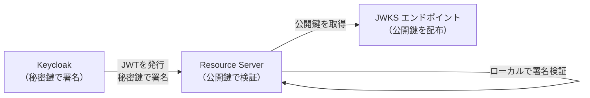
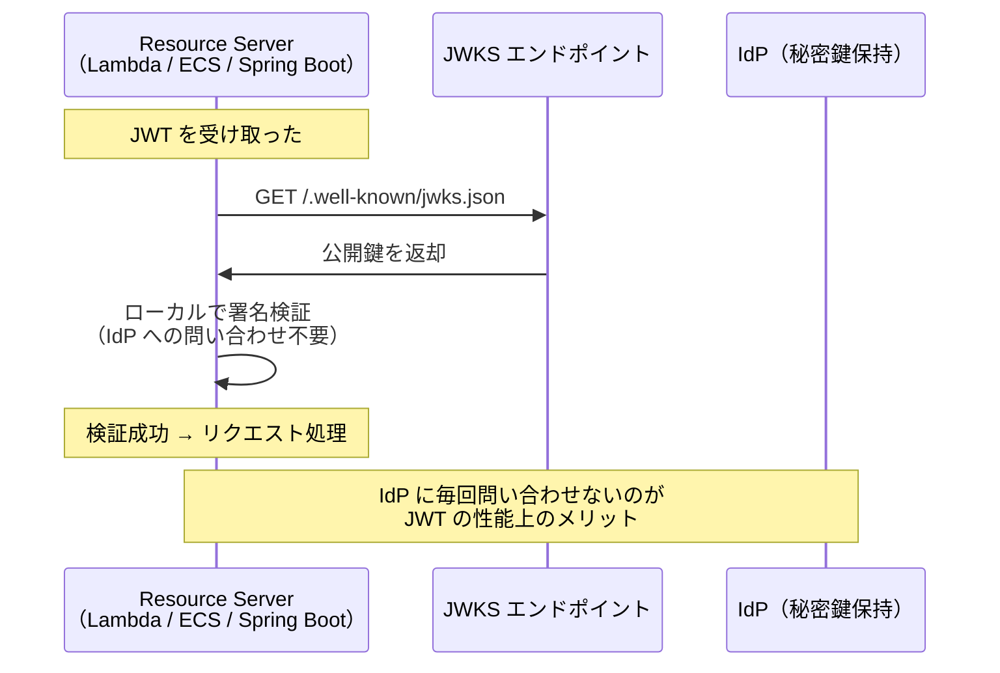
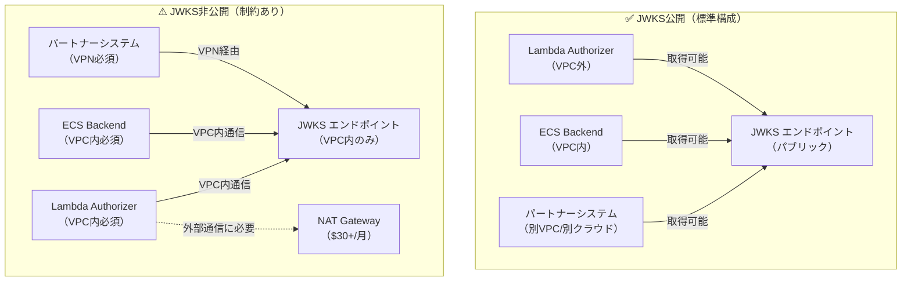
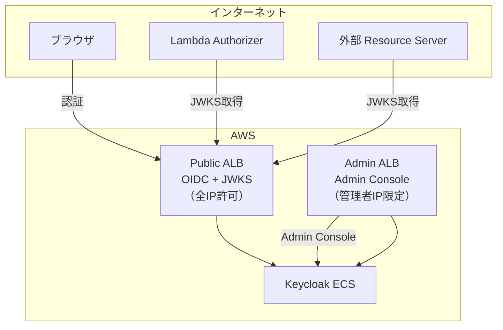

# JWKS エンドポイントの公開に関する設計判断

**作成日**: 2026-04-20
**結論**: OIDCの公開エンドポイント（JWKS含む）はインターネット公開する。
Admin Consoleは別ALBでネットワーク分離する。

---

## 1. 前提：OIDC / OAuth 2.0 の仕様上の位置づけ

### JWKS エンドポイントとは

JWKSエンドポイント（`/.well-known/jwks.json`）は、JWT の署名検証に使う
**公開鍵の配布先**である。



**RFC 7517（JSON Web Key）** で標準化されている仕様であり、
OAuth 2.0 / OpenID Connect のトークン検証インフラの根幹を成す。

### エンドポイントが返すもの

```json
{
  "keys": [
    {
      "kty": "RSA",
      "kid": "e3KFx04c50aA...",
      "use": "sig",
      "n": "0vx7agoebGcQ...",   ← 公開鍵の modulus
      "e": "AQAB"               ← 公開鍵の exponent
    }
  ]
}
```

**含まれるもの**: 公開鍵（`n`, `e`）のみ
**含まれないもの**: 秘密鍵（`d`, `p`, `q`, `dp`, `dq`, `qi`）は一切含まれない

---

## 2. 公開しても安全である根拠

### 2.1 暗号学的根拠

| 項目 | 説明 |
|------|------|
| 公開鍵の役割 | JWT署名の**検証**のみに使用 |
| 秘密鍵の役割 | JWT署名の**生成**に使用（JWKS には含まれない） |
| 公開鍵から秘密鍵を推定できるか | **不可能**（RSA / ECDSAの数学的安全性による） |

公開鍵暗号方式（RSA / ECDSA）では、公開鍵を知っていても秘密鍵を算出することは
計算量的に不可能（RSA-2048で2^112ビットセキュリティ）。
**これが「公開鍵」と呼ばれる理由であり、公開することが前提の設計**。

### 2.2 攻撃者が公開鍵を取得しても可能な行為

| 攻撃 | 可能か | 理由 |
|------|:------:|------|
| JWTの署名を検証する | ✅ | 正当な行為（公開鍵の本来の用途） |
| JWTの中身を読む | ✅ | JWTはBase64なので元々読める（暗号化ではない） |
| **偽のJWTを作成する** | **❌** | 秘密鍵がないと署名できない |
| **既存JWTを改ざんする** | **❌** | 署名が合わなくなり検証失敗する |
| **秘密鍵を推定する** | **❌** | 計算量的に不可能 |

### 2.3 HTTPS / TLS との比較

TLS証明書も同じ原理で動作している：

| | TLS証明書 | JWKS |
|--|----------|------|
| 公開鍵 | 全世界に配布（ブラウザが取得） | 全Resource Serverに配布 |
| 秘密鍵 | サーバー内に保管 | Keycloak/Cognito内に保管 |
| 公開鍵の公開 | **前提（インターネット上で公開）** | **前提（RFC 7517）** |

---

## 3. 公開する必要がある根拠

### 3.1 OIDC仕様上の要件

OpenID Connect Discovery 1.0 仕様では、`jwks_uri` は
`.well-known/openid-configuration` で公開され、全 Relying Party（Resource Server）が
アクセスできることが前提となっている。

**CognitoのJWKS**: `https://cognito-idp.{region}.amazonaws.com/{poolId}/.well-known/jwks.json`
→ **完全にパブリック**。認証不要でアクセス可能。

**Auth0のJWKS**: `https://{domain}/.well-known/jwks.json`
→ **完全にパブリック**。

**OktaのJWKS**: `https://{domain}/oauth2/default/v1/keys`
→ **完全にパブリック**。

**Google**: `https://www.googleapis.com/oauth2/v3/certs`
→ **完全にパブリック**。

**業界の全主要IdPがJWKSをパブリックに公開している。**

### 3.2 Resource Server がアクセスする必要性



Resource Server が JWT をローカル検証するためには、**公開鍵を事前に取得する必要がある**。
公開鍵が取得できなければ、以下の代替手段しかなくなる：

| 代替手段 | デメリット |
|---------|----------|
| Token Introspection（毎リクエストIdPに問い合わせ） | パフォーマンス大幅劣化、IdPが単一障害点 |
| 公開鍵をハードコード | 鍵ローテーション時にデプロイが必要 |
| 同一VPC内に全Resource Serverを配置 | Lambda等をVPC内に置く必要（NAT Gateway費用） |

### 3.3 公開しない場合のアーキテクチャへの影響



---

## 4. 公開すべきエンドポイントと非公開にすべきエンドポイント

| パス | 公開 | 理由 |
|------|:---:|------|
| `/.well-known/openid-configuration` | ✅ | OIDC Discovery（仕様上必須） |
| `/realms/{realm}/protocol/openid-connect/certs` | ✅ | JWKS公開鍵（署名検証用） |
| `/realms/{realm}/protocol/openid-connect/auth` | ✅ | 認証エンドポイント（ブラウザがアクセス） |
| `/realms/{realm}/protocol/openid-connect/token` | ✅ | トークンエンドポイント（SPA/Backend） |
| `/realms/{realm}/protocol/openid-connect/logout` | ✅ | ログアウト |
| **`/admin/*`** | **❌** | **Admin Console（管理者のみ）** |
| **`/metrics`** | **❌** | **Prometheus等の監視用** |
| **`/health/*`** | **❌** | **ヘルスチェック（内部用）** |

---

## 5. 本PoCでの設計



| ALB | 用途 | SG |
|-----|------|-----|
| Public ALB | OIDC認証 + JWKS | `0.0.0.0/0`（全IP） |
| Admin ALB | Admin Console | 管理者IP限定 |

---

## 6. 参考文献

- [RFC 7517 - JSON Web Key (JWK)](https://datatracker.ietf.org/doc/html/rfc7517)
- [OpenID Connect Discovery 1.0](https://openid.net/specs/openid-connect-discovery-1_0.html)
- [Keycloak - Configuring the hostname (v2)](https://www.keycloak.org/server/hostname) — `hostname-admin` による Admin 分離
- [Keycloak - Configuring the Management Interface](https://www.keycloak.org/server/management-interface) — 管理ポート分離
- [Keycloak - Configuring for production](https://www.keycloak.org/server/configuration-production) — 本番設定ガイド
- [AWS Cognito JWKS](https://docs.aws.amazon.com/cognito/latest/developerguide/amazon-cognito-user-pools-using-tokens-verifying-a-jwt.html) — Cognito もパブリック公開
- [Understanding the OIDC JWK Endpoint - MojoAuth](https://mojoauth.com/blog/understanding-the-oidc-json-web-key-jwk-endpoint-in-authentication)
- [Mastering JWKS: JSON Web Key Sets Explained](https://www.janbrennenstuhl.eu/jwks-json-web-key-set/)
