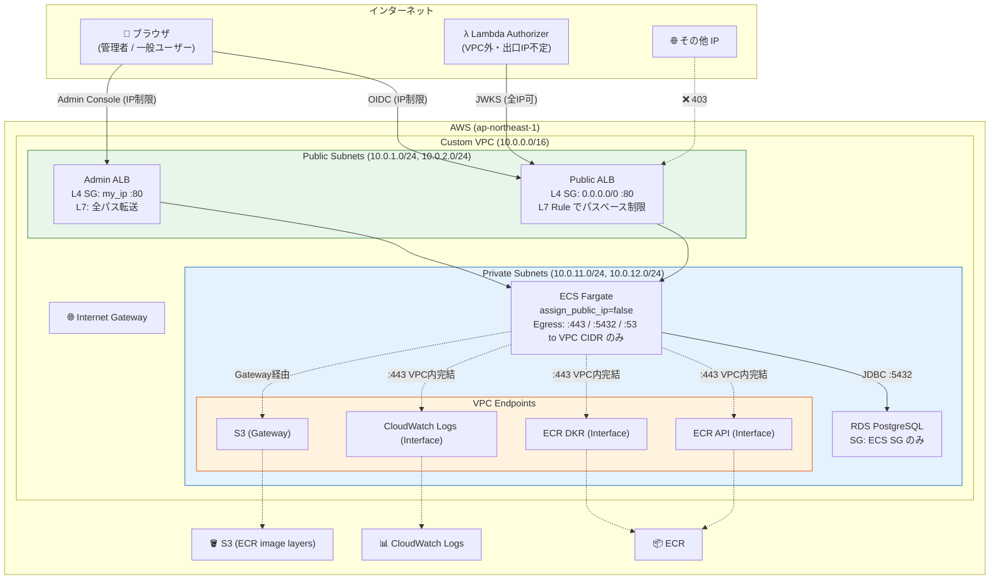
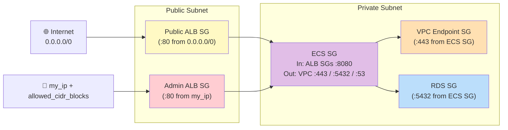

# Keycloak ネットワーク構成（実装実態ベース）

> 最終更新: 2026-04-21（Option B: カスタム VPC + VPC Endpoint 方式へ移行）
> 対象: PoC の Keycloak 環境（infra/keycloak/ 配下）

PoC 実装（Terraform コード）から導出した、**現実のネットワーク構成・IP 制限の実態**をまとめる。
`jwks-public-exposure.md` が「設計論」なのに対し、本ドキュメントは「実装ログ」の位置づけ。

---

## 1. 全体構成図

**ポイント**:
- ECS / RDS はプライベートサブネットに配置、**パブリック IP 一切なし**
- AWS サービス（ECR / S3 / CloudWatch Logs）へのアクセスは VPC Endpoint で VPC 内完結（NAT Gateway 不要）
- ALB 2 台のみがパブリックサブネットに配置（インターネットへの唯一の露出）

---

## 2. コンポーネント別 IP 制限マトリクス

**最重要**: 「IP 制限されている／されていない」を一覧で把握するための表。

| # | コンポーネント | 制限レイヤー | 制限内容 | 実装箇所 |
|---|--------------|-----------|---------|---------|
| 1 | **Public ALB SG** | L4（SG） | ❌ **制限なし**（`0.0.0.0/0` :80 許可） | [security-groups.tf](../../infra/keycloak/security-groups.tf) |
| 2 | Public ALB Rule#100（JWKS 系） | L7（Listener Rule） | ❌ **制限なし**（全 IP 許可） | [alb.tf](../../infra/keycloak/alb.tf) |
| 3 | Public ALB Rule#200（その他） | L7（Listener Rule） | ✅ **IP 制限**（my_ip + allowed_cidr_blocks） | [alb.tf](../../infra/keycloak/alb.tf) |
| 4 | Public ALB Default Action | L7 | ✅ **全拒否**（403 固定レスポンス） | [alb.tf](../../infra/keycloak/alb.tf) |
| 5 | **Admin ALB SG** | L4（SG） | ✅ **IP 制限**（my_ip + allowed_cidr_blocks） | [security-groups.tf](../../infra/keycloak/security-groups.tf) |
| 6 | Admin ALB Listener | L7 | ❌ **制限なし**（全パス Keycloak 転送） | [alb.tf](../../infra/keycloak/alb.tf) |
| 7 | **ECS SG Ingress** | L4（SG） | ✅ **ALB SG 経由のみ**（:8080） | [security-groups.tf](../../infra/keycloak/security-groups.tf) |
| 8 | **ECS SG Egress** | L4（SG） | ✅ **VPC CIDR 内の :443 / :5432 / :53 のみ** | [security-groups.tf](../../infra/keycloak/security-groups.tf) |
| 9 | ECS Task Public IP | — | ✅ **付与なし**（`assign_public_ip=false`） | [ecs.tf](../../infra/keycloak/ecs.tf) |
| 10 | ECS サブネット | Network | ✅ **Private Subnet**（IGW 経路なし） | [network.tf](../../infra/keycloak/network.tf) |
| 11 | **RDS SG** | L4（SG） | ✅ **ECS SG のみ**（:5432） | [security-groups.tf](../../infra/keycloak/security-groups.tf) |
| 12 | RDS publicly_accessible | — | ✅ **false**（パブリック IP なし） | [rds.tf](../../infra/keycloak/rds.tf) |
| 13 | RDS サブネット | Network | ✅ **Private Subnet** | [network.tf](../../infra/keycloak/network.tf) |
| 14 | VPC Endpoint SG | L4（SG） | ✅ **ECS SG からの :443 のみ** | [vpc-endpoints.tf](../../infra/keycloak/vpc-endpoints.tf) |

### 2.1 「IP 制限されていない部分」の明示

本設定で **意図的に IP 制限していない**箇所:

| # | 箇所 | なぜ制限なしか | リスク | 状態 |
|---|------|-------------|-------|------|
| 1 | Public ALB の JWKS / `.well-known` エンドポイント | **仕様上公開必須**（Lambda Authorizer 等の Resource Server が取得する。出口 IP 不定） | 公開鍵のみのため**リスクなし**（jwks-public-exposure.md 参照） | ✅ 意図通り |
| 2 | Public ALB SG（L4）が `0.0.0.0/0` | L7 の Listener Rule で制限するため | SG だけ見ると誤解を招く | ✅ 意図通り |

### 2.2 Option B 移行で解消済みの懸念

以前 PoC 初期構成で存在したリスクが、本構成で解消された:

| # | 以前の懸念 | 以前の状態 | 現在の状態 |
|---|----------|-----------|-----------|
| 1 | ECS Task にパブリック IP | `assign_public_ip=true`（デフォルト VPC） | ✅ **付与なし**（Private Subnet） |
| 2 | ECS Egress 全開 | `0.0.0.0/0` 全ポート | ✅ **VPC 内 :443/:5432/:53 のみ** |
| 3 | RDS SG にメンテ用 my_ip 許可 | `cidr_blocks = [local.my_ip_cidr]` | ✅ **削除済**（本番と同等） |
| 4 | ALB / ECS / RDS が同一サブネット | 全てデフォルトサブネット | ✅ **ALB=Public / ECS+RDS=Private 分離** |

---

## 3. パス別アクセス可否マトリクス

Public ALB 配下の Listener Rule による **L7 レベルのパスベース制限**。

| パス | Rule | JWKS 系？ | 全 IP 許可？ | 許可 IP からのみ？ | 挙動 |
|-----|------|:--------:|:-----------:|:----------------:|------|
| `/realms/*/.well-known/openid-configuration` | #100 | ✅ | ✅ | — | 全 IP からアクセス可 |
| `/realms/*/protocol/openid-connect/certs`（JWKS） | #100 | ✅ | ✅ | — | 全 IP からアクセス可 |
| `/realms/*/protocol/openid-connect/auth`（ログイン画面） | #200 | — | ❌ | ✅ | 許可 IP からのみ |
| `/realms/*/protocol/openid-connect/token`（トークン） | #200 | — | ❌ | ✅ | 許可 IP からのみ |
| `/realms/*/protocol/openid-connect/logout` | #200 | — | ❌ | ✅ | 許可 IP からのみ |
| `/realms/*/account/*` | #200 | — | ❌ | ✅ | 許可 IP からのみ |
| `/admin/*`（Public ALB 経由） | Default | — | ❌ | ❌ | **403 Forbidden** |
| `/metrics`, `/health/*` | Default | — | ❌ | ❌ | **403 Forbidden** |
| 不明なパス | Default | — | ❌ | ❌ | **403 Forbidden** |
| `/admin/*`（Admin ALB 経由） | — | — | ❌ | ✅（SG） | 管理者 IP からのみ |

### 3.1 重要な設計判断

**「JWKS は全 IP 公開、ログイン画面等は IP 制限」という L7 制限が PoC の要点。**

なぜ?
- **JWKS**: Resource Server（Lambda Authorizer 等）の出口 IP は不定のため全公開必須
- **ログイン画面・トークンエンドポイント**: ブラウザからの直接アクセスなのでクライアント IP が予測可能 → IP 制限可能

---

## 4. ネットワーク依存関係図

---

## 5. コスト影響（Option B 移行）

| 項目 | 旧構成 | 新構成 | 月額差分 |
|-----|--------|--------|---------|
| ECS + RDS + ALB × 2 | $940 | $940 | ±0 |
| VPC Endpoint Interface × 3 | $0 | $22 (※1) | +$22 |
| VPC Endpoint Gateway (S3) | $0 | $0（無料） | ±0 |
| NAT Gateway | $0 | $0（不使用） | ±0 |
| **合計** | $940 | $962 | **+$22** |

※1: Interface Endpoint は $0.01/hour × 3 endpoints × 730h = $21.9/月（+ データ処理 $0.01/GB）

---

## 6. 本番移行時のネットワーク要件（残課題）

### 6.1 【Critical】必須対応

| # | 要件 | 現状 | 本番要件 | 確認者 |
|---|------|------|---------|-------|
| N1 | HTTPS 化 | HTTP:80 | ACM 証明書 + HTTPS:443 | インフラ / セキュリティ |
| N2 | Admin ALB の非公開化 | internet-facing + SG 制限 | `internal` + VPN/DirectConnect | インフラ / セキュリティ |
| N3 | ~~RDS メンテナンス IP の削除~~ | ~~SG で `my_ip` 許可~~ | ~~Bastion / SSM Session Manager~~ | ✅ **Option B 移行で解消済** |
| N4 | ~~ECS パブリック IP 除去~~ | ~~Public subnet + assign_public_ip~~ | ~~Private subnet + VPC Endpoint~~ | ✅ **Option B 移行で解消済** |
| N5 | Keycloak の hostname 設定 | `KC_HOSTNAME_STRICT=false` | 正式ドメイン + `start --optimized` | インフラ |

### 6.2 【High】設計判断が必要

| # | 要件 | 検討内容 |
|---|------|---------|
| N6 | Public ALB の IP 制限戦略 | 顧客 IP をすべて許可 vs WAF Rate Limiting vs 制限なし + WAF での攻撃検知 |
| N7 | Admin Console のアクセス経路 | VPN / DirectConnect / AWS Client VPN / SSO 付き Bastion |
| N8 | マルチ AZ / マルチリージョン | ECS Service Auto Scaling / RDS Multi-AZ / Aurora Global DB |
| N9 | VPC 間接続 | Transit Gateway / VPC Peering（複数 AWS アカウント構成時） |
| N10 | WAF の適用 | AWS WAF による攻撃検知・レート制限・ボット対策 |
| N11 | DB メンテナンスアクセス経路 | Bastion EC2 + SSM Session Manager / AWS Client VPN / Query Editor |

### 6.3 【Medium】監視・運用

| # | 要件 | 検討内容 |
|---|------|---------|
| N12 | VPC Flow Logs | セキュリティ監査要件次第 |
| N13 | ALB アクセスログ | S3 保存・保存期間・分析基盤 |
| N14 | VPC Endpoint 使用状況 | CloudWatch Metrics での通信量監視 |
| N15 | 不正 IP ブロック | AWS WAF IP Set 連携 |

---

## 7. ドキュメント整合性チェック結果

本ドキュメント作成・更新時（2026-04-21）に、既存ドキュメントとの整合性を確認した結果:

| ドキュメント | 整合性 | 対応 |
|------------|:-----:|------|
| [architecture.md](architecture.md) | ✅ | Admin ALB + Public ALB の L7 制限を反映済 |
| [jwks-public-exposure.md](jwks-public-exposure.md) | ✅ | Public ALB の L7 パスベース制限を反映済 |
| [keycloak/setup-guide.md](../keycloak/setup-guide.md) | ⚠ 未確認 | Admin ALB 経由の Admin Console アクセス手順は要確認 |

---

## 8. 変更履歴

| 日付 | 内容 |
|------|------|
| 2026-04-21 (初版) | PoC 実装実態の文書化（デフォルト VPC ベース） |
| 2026-04-21 (改訂) | **Option B 移行**: カスタム VPC + Private Subnet + VPC Endpoint 方式へ変更、ECS パブリック IP 除去、RDS メンテ IP 許可削除 |

---

## 9. 参考

- 実装コード: [infra/keycloak/](../../infra/keycloak/)
- 設計思想: [jwks-public-exposure.md](jwks-public-exposure.md)
- ADR: [010-keycloak-private-subnet-vpc-endpoints.md](../adr/010-keycloak-private-subnet-vpc-endpoints.md)
- PoC 総括: [../requirements/poc-summary-evaluation.md](../requirements/poc-summary-evaluation.md)
