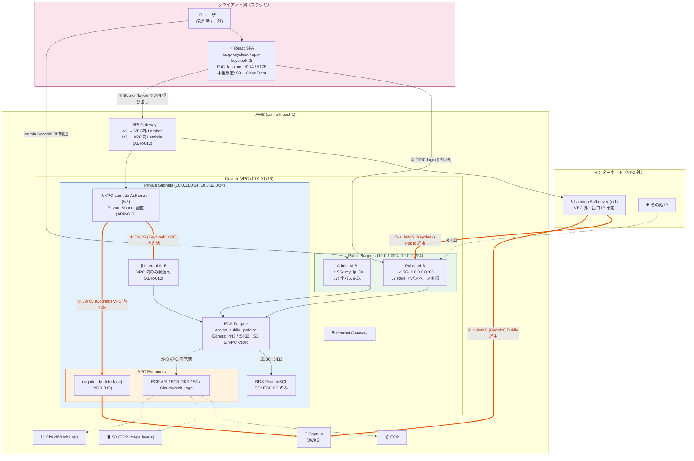
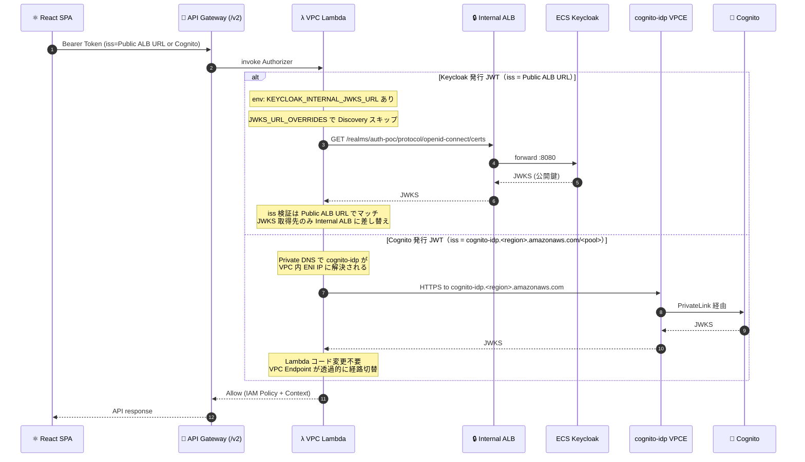
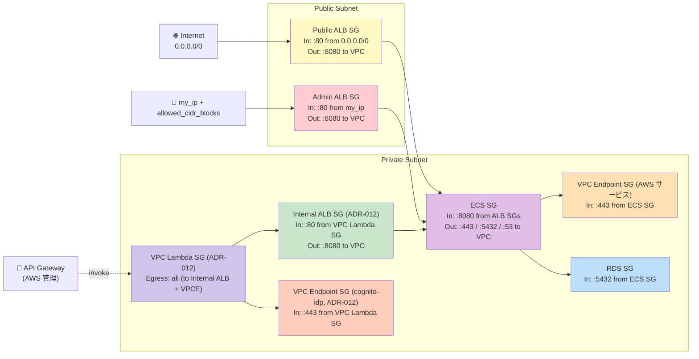
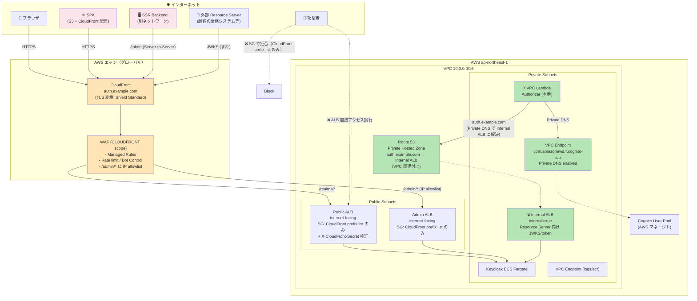
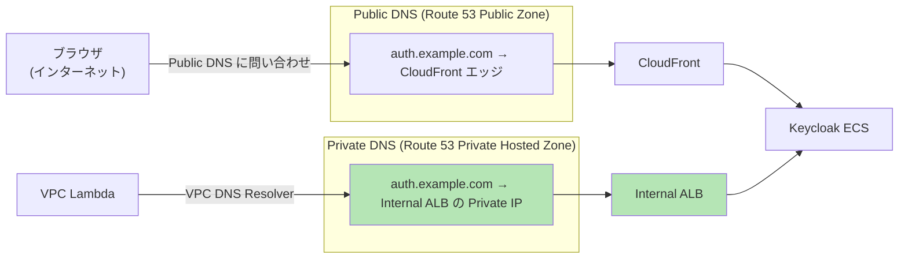

# Keycloak ネットワーク構成（実装実態ベース）

> 最終更新: 2026-04-21（Option B: カスタム VPC + VPC Endpoint 方式へ移行）
> 対象: PoC の Keycloak 環境（infra/keycloak/ 配下）

PoC 実装（Terraform コード）から導出した、**現実のネットワーク構成・IP 制限の実態**をまとめる。
`jwks-public-exposure.md` が「設計論」なのに対し、本ドキュメントは「実装ログ」の位置づけ。

---

## 1. 全体構成図

### 1.1 主な通信フロー

構成図中、**橙色の太線**が JWKS 取得経路（③④⑤）。

| # | 起点 | 経路 | 終点 | 備考 |
|---|------|------|------|------|
| ① | ブラウザ（SPA） | → Public ALB（IP 制限） | Keycloak ECS | ログイン・トークン取得 |
| ② | ブラウザ（SPA） | → API Gateway → Lambda（/v1 or /v2） | Backend | API 呼び出し |
| ③-a | Lambda /v1（VPC 外） | → Public ALB（JWKS パスのみ全 IP 可、L7 Rule#100） | Keycloak JWKS | 従来経路。インターネット経由 |
| ③-b | Lambda /v1（VPC 外） | → `cognito-idp.<region>.amazonaws.com`（パブリック） | Cognito JWKS | 従来経路。インターネット経由 |
| ④ | Lambda /v2（VPC 内） | → Internal ALB（VPC 内のみ） | Keycloak JWKS | **ADR-012**: env override で JWKS 取得先を Internal ALB に差替 |
| ⑤ | Lambda /v2（VPC 内） | → cognito-idp VPCE（Private DNS） | Cognito JWKS | **ADR-012**: PrivateLink で AWS 内部網を経由 |
| ⑥ | ブラウザ（管理者） | → Admin ALB（IP 制限） | Keycloak ECS | Admin Console |

**ポイント**:
- SPA は PoC では `localhost:5174/5175` で開発、本番想定は **S3 + CloudFront**（[ADR-011](../adr/011-auth-frontend-network-design.md) 参照）
- ECS / RDS はプライベートサブネットに配置、**パブリック IP 一切なし**
- AWS サービスへのアクセスは VPC Endpoint で VPC 内完結（NAT Gateway 不要）
- **ADR-012 により JWKS 取得経路の VPC 内完結版（/v2）が並列稼働**（/v1 はインターネット経由、比較検証用）
- **CloudFront / WAF は PoC では未導入**。本番移行時の検討事項（§6.2 の N10 / N16 参照）

### 1.2 VPC Lambda Authorizer の JWKS 取得経路（ADR-012）

VPC Lambda（/v2）は **Keycloak と Cognito の両 JWKS を VPC 内で完結して取得する**。2 つの IdP に対してそれぞれ別方式を採用:

#### 2 つの方式の違い

| 項目 | Keycloak JWKS | Cognito JWKS |
|------|--------------|--------------|
| **問題** | JWT の `iss` が Public ALB URL（VPC 外）を指すため、Discovery すると Public ALB に戻ってしまう | Cognito の JWKS URL はパブリック（`cognito-idp.<region>.amazonaws.com`） |
| **解決手段** | **Lambda コード側の override 機構** | **VPC Endpoint の Private DNS** |
| **具体策** | env `KEYCLOAK_INTERNAL_JWKS_URL` を設定すると、`get_jwks_uri()` が Discovery をスキップして Internal ALB URL を返す | `private_dns_enabled=true` で DNS 名が VPC 内 ENI IP に自動解決される |
| **実装箇所** | [lambda/authorizer/index.py L85-L95, L107-L109](../../lambda/authorizer/index.py) | [infra/keycloak/vpc-endpoint-cognito.tf](../../infra/keycloak/vpc-endpoint-cognito.tf) |
| **Lambda コード変更** | あり（override 辞書チェック 2 行） | なし（インフラのみで透過的に切替） |
| **JWT の iss 整合性** | 保持（Public ALB URL のまま検証） | 保持（Cognito URL のまま検証） |
| **経路** | VPC Lambda → Internal ALB → ECS | VPC Lambda → VPC Endpoint → Cognito（AWS 内部網） |

#### なぜこの 2 方式か

- **Keycloak**: 自前ホスティングのため DNS 切替できない（Public ALB と Internal ALB は別 DNS 名）。コード side で URL を差し替える必要がある
- **Cognito**: AWS マネージドで Private DNS 対応の VPC Endpoint が提供されているため、DNS 解決だけで透過的に経路切替できる

本番では Route 53 Private Hosted Zone で `auth.example.com` を Internal ALB に向けることで、**Keycloak も Cognito と同じく「コード変更なしで VPC 内完結」にできる**（Split-horizon DNS 方式、[ADR-012](../adr/012-vpc-lambda-authorizer-internal-jwks.md) の Follow-up 参照）。

#### JWKS キャッシュの挙動

- Lambda 内に **TTL 1 時間の JWKS キャッシュ**を保持（[index.py L83](../../lambda/authorizer/index.py#L83)）
- コールドスタート時のみ Internal ALB / VPC Endpoint に実際の HTTP リクエストが飛ぶ
- ウォーム状態では VPC 内通信すら発生しない（Lambda メモリ内から取得）
- キャッシュミス率を監視することで VPC Endpoint のデータ処理料金の予測が可能

---

## 2. コンポーネント別 IP 制限マトリクス

**最重要**: 「IP 制限されている／されていない」を一覧で把握するための表。

| # | コンポーネント | 制限レイヤー | 制限内容 | 実装箇所 |
|---|--------------|-----------|---------|---------|
| 1 | **Public ALB SG** | L4（SG） | ❌ **制限なし**（`0.0.0.0/0` :80 許可） | [security-groups.tf](../../infra/keycloak/security-groups.tf) |
| 2 | Public ALB Rule#100（JWKS 系） | L7（Listener Rule） | ❌ **制限なし**（全 IP 許可） | [alb.tf](../../infra/keycloak/alb.tf) |
| 3 | Public ALB Rule#200（その他） | L7（Listener Rule） | ✅ **IP 制限**（my_ip + allowed_cidr_blocks） | [alb.tf](../../infra/keycloak/alb.tf) |
| 4 | Public ALB Default Action | L7 | ✅ **全拒否**（403 固定レスポンス） | [alb.tf](../../infra/keycloak/alb.tf) |
| 5 | **Admin ALB SG** | L4（SG） | ✅ **IP 制限**（my_ip + allowed_cidr_blocks） | [security-groups.tf](../../infra/keycloak/security-groups.tf) |
| 6 | Admin ALB Listener | L7 | ❌ **制限なし**（全パス Keycloak 転送） | [alb.tf](../../infra/keycloak/alb.tf) |
| 7 | **ECS SG Ingress** | L4（SG） | ✅ **ALB SG 経由のみ**（:8080） | [security-groups.tf](../../infra/keycloak/security-groups.tf) |
| 8 | **ECS SG Egress** | L4（SG） | ✅ **VPC CIDR 内の :443 / :5432 / :53 のみ** | [security-groups.tf](../../infra/keycloak/security-groups.tf) |
| 9 | ECS Task Public IP | — | ✅ **付与なし**（`assign_public_ip=false`） | [ecs.tf](../../infra/keycloak/ecs.tf) |
| 10 | ECS サブネット | Network | ✅ **Private Subnet**（IGW 経路なし） | [network.tf](../../infra/keycloak/network.tf) |
| 11 | **RDS SG** | L4（SG） | ✅ **ECS SG のみ**（:5432） | [security-groups.tf](../../infra/keycloak/security-groups.tf) |
| 12 | RDS publicly_accessible | — | ✅ **false**（パブリック IP なし） | [rds.tf](../../infra/keycloak/rds.tf) |
| 13 | RDS サブネット | Network | ✅ **Private Subnet** | [network.tf](../../infra/keycloak/network.tf) |
| 14 | VPC Endpoint SG（AWS サービス用） | L4（SG） | ✅ **ECS SG からの :443 のみ** | [vpc-endpoints.tf](../../infra/keycloak/vpc-endpoints.tf) |
| 15 | **Internal ALB**（ADR-012） | Network + L4 | ✅ **`internal=true`、VPC 内のみ到達可** | [internal-alb.tf](../../infra/keycloak/internal-alb.tf) |
| 16 | **Internal ALB SG**（ADR-012） | L4（SG） | ✅ **VPC Lambda SG からの :80 のみ** | [security-groups.tf](../../infra/keycloak/security-groups.tf) |
| 17 | **VPC Lambda Authorizer**（ADR-012） | Network | ✅ **Private Subnet 配置、パブリック IP なし** | [vpc-lambda-authorizer.tf](../../infra/keycloak/vpc-lambda-authorizer.tf) |
| 18 | **cognito-idp VPC Endpoint**（ADR-012） | L4（SG） | ✅ **VPC Lambda SG からの :443 のみ** | [vpc-endpoint-cognito.tf](../../infra/keycloak/vpc-endpoint-cognito.tf) |

### 2.1 「IP 制限されていない部分」の明示

本設定で **意図的に IP 制限していない**箇所:

| # | 箇所 | なぜ制限なしか | リスク | 状態 |
|---|------|-------------|-------|------|
| 1 | Public ALB の JWKS / `.well-known` エンドポイント | **仕様上公開必須**（Lambda Authorizer 等の Resource Server が取得する。出口 IP 不定） | 公開鍵のみのため**リスクなし**（jwks-public-exposure.md 参照） | ✅ 意図通り |
| 2 | Public ALB SG（L4）が `0.0.0.0/0` | L7 の Listener Rule で制限するため | SG だけ見ると誤解を招く | ✅ 意図通り |

### 2.2 Option B / ADR-012 移行で解消済みの懸念

以前 PoC 初期構成で存在したリスクが、Option B + ADR-012 の適用で解消された:

| # | 以前の懸念 | 以前の状態 | 現在の状態 |
|---|----------|-----------|-----------|
| 1 | ECS Task にパブリック IP | `assign_public_ip=true`（デフォルト VPC） | ✅ **付与なし**（Private Subnet） |
| 2 | ECS Egress 全開 | `0.0.0.0/0` 全ポート | ✅ **VPC 内 :443/:5432/:53 のみ** |
| 3 | RDS SG にメンテ用 my_ip 許可 | `cidr_blocks = [local.my_ip_cidr]` | ✅ **削除済**（本番と同等） |
| 4 | ALB / ECS / RDS が同一サブネット | 全てデフォルトサブネット | ✅ **ALB=Public / ECS+RDS=Private 分離** |
| 5 | JWKS 取得がインターネット経由 | Lambda Authorizer（VPC 外）→ Public ALB | ✅ **/v2 経路で VPC 内完結**（ADR-012、/v1 は比較用に残存） |
| 6 | Cognito JWKS もインターネット経由 | Lambda Authorizer → Cognito 公開エンドポイント | ✅ **cognito-idp VPC Endpoint 経由で VPC 内完結**（ADR-012） |

---

## 3. パス別アクセス可否マトリクス

### 3.1 Public ALB（Listener Rule による L7 レベル制限）

| パス | Rule | JWKS 系？ | 全 IP 許可？ | 許可 IP からのみ？ | 挙動 |
|-----|------|:--------:|:-----------:|:----------------:|------|
| `/realms/*/.well-known/openid-configuration` | #100 | ✅ | ✅ | — | 全 IP からアクセス可 |
| `/realms/*/protocol/openid-connect/certs`（JWKS） | #100 | ✅ | ✅ | — | 全 IP からアクセス可 |
| `/realms/*/protocol/openid-connect/auth`（ログイン画面） | #200 | — | ❌ | ✅ | 許可 IP からのみ |
| `/realms/*/protocol/openid-connect/token`（トークン） | #200 | — | ❌ | ✅ | 許可 IP からのみ |
| `/realms/*/protocol/openid-connect/logout` | #200 | — | ❌ | ✅ | 許可 IP からのみ |
| `/realms/*/account/*` | #200 | — | ❌ | ✅ | 許可 IP からのみ |
| `/admin/*`（Public ALB 経由） | Default | — | ❌ | ❌ | **403 Forbidden** |
| `/metrics`, `/health/*` | Default | — | ❌ | ❌ | **403 Forbidden** |
| 不明なパス | Default | — | ❌ | ❌ | **403 Forbidden** |
| `/admin/*`（Admin ALB 経由） | — | — | ❌ | ✅（SG） | 管理者 IP からのみ |

### 3.2 Internal ALB（ADR-012）

Internal ALB は `internal=true` のため **VPC 内からしか到達不可**。そのため L7 でのパス制限は未設定（全パス転送）。

| パス | アクセス元 | 挙動 |
|-----|----------|------|
| `/realms/*/protocol/openid-connect/certs`（JWKS） | VPC Lambda SG 経由 | ✅ 転送（主用途） |
| `/realms/*/protocol/openid-connect/token` | VPC Lambda SG 経由 | ✅ 転送（将来の Back-Channel 用） |
| `/admin/*` | VPC 内から到達した場合 | ⚠ 転送される（VPC 外からは到達不可） |
| 任意のパス | VPC 外（インターネット） | ❌ **DNS 解決不可**（internal ALB の DNS は VPC 内のみ） |

**設計判断**: VPC 内部の信頼境界を前提とし、Internal ALB 側では L7 パス制限を掛けない。VPC Lambda SG 経由のみアクセス許可（L4）で十分とする。

### 3.3 経路別アクセスサマリー

| クライアント | 経路 | JWKS 取得可能か |
|------------|------|:-------------:|
| ブラウザ（SPA） | Public ALB `/realms/*/certs` | ✅（Rule#100） |
| 外部 Resource Server（/v1 Lambda） | Public ALB `/realms/*/certs` | ✅（Rule#100） |
| **VPC Lambda（/v2）** | **Internal ALB** `/realms/*/certs` | ✅（VPC 内のみ） |
| 管理者ブラウザ | Admin ALB | ✅ + `/admin/*` も可（IP 制限） |
| 未許可 IP | Public ALB 任意パス | ❌ 403 |

### 3.4 重要な設計判断

**「JWKS は経路に応じて異なる ALB を使う」という多層構成が PoC の要点。**

- **JWKS を Public ALB で公開する理由**: 外部 Resource Server（出口 IP 不定）のため、仕様上パブリック公開が必要
- **JWKS を Internal ALB 経由でも取得可能にする理由**: VPC 内 Resource Server がインターネットを経由せず VPC 内完結で認可を完結できるようにするため（ADR-012）
- **両経路を並列稼働する理由**: 本番移行時に Public ALB の JWKS パスを閉塞できるかを検証するため

---

## 4. ネットワーク依存関係図（Security Group 単位）

### 4.1 依存関係の 3 経路

| # | 経路 | 用途 | 制限 |
|---|------|------|------|
| A | Internet → Public ALB SG → ECS SG | ブラウザ SPA のログイン・トークン・JWKS（外部用） | L7 で JWKS のみ全公開、他は IP 制限 |
| B | my_ip → Admin ALB SG → ECS SG | 管理コンソール | SG で IP 制限 |
| C | API Gateway → VPC Lambda SG → Internal ALB SG → ECS SG | **ADR-012**: VPC 内 Authorizer の JWKS 取得（Keycloak） | VPC 内のみ |
| D | API Gateway → VPC Lambda SG → cognito-idp VPCE SG → Cognito | **ADR-012**: VPC 内 Authorizer の JWKS 取得（Cognito） | VPC 内のみ、PrivateLink |
| E | ECS SG → AWS サービス用 VPCE SG → ECR / S3 / Logs | ECS Task のデプロイ・ログ出力 | VPC 内のみ |
| F | ECS SG → RDS SG | Keycloak の永続化 | VPC 内のみ |

---

## 5. コスト影響

### 5.1 Option B 移行（デフォルト VPC → Custom VPC + VPC Endpoint）

| 項目 | 旧構成 | 新構成 | 月額差分 |
|-----|--------|--------|---------|
| ECS + RDS + ALB × 2 | $940 | $940 | ±0 |
| VPC Endpoint Interface × 3 (ECR API / ECR DKR / Logs) | $0 | $22 (※1) | +$22 |
| VPC Endpoint Gateway (S3) | $0 | $0（無料） | ±0 |
| NAT Gateway | $0 | $0（不使用） | ±0 |
| **小計** | $940 | $962 | **+$22** |

※1: Interface Endpoint は $0.01/hour × 3 endpoints × 730h = $21.9/月（+ データ処理 $0.01/GB）

### 5.2 ADR-012 追加（VPC Lambda Authorizer + Internal ALB + cognito-idp VPCE）

| 項目 | 月額 |
|-----|------|
| Internal ALB | ~$17 |
| VPC Endpoint Interface（cognito-idp） | ~$7 |
| VPC Lambda（関数自体は無料枠、ENI はタスク数に応じる） | ~$0〜$1 |
| **小計** | **+$25** |

### 5.3 現時点の総額

| 項目 | 月額 |
|-----|------|
| Option B 構成 | $962 |
| ADR-012 追加分 | +$25 |
| **合計** | **~$987** |

---

## 6. 本番移行時のネットワーク要件（残課題）

### 6.1 【Critical】必須対応

| # | 要件 | 現状 | 本番要件 | 確認者 |
|---|------|------|---------|-------|
| N1 | HTTPS 化 | HTTP:80（Public / Admin / Internal ALB すべて） | ACM 証明書 + HTTPS:443 | インフラ / セキュリティ |
| N2 | Admin ALB の非公開化 | internet-facing + SG 制限 | `internal` + VPN/DirectConnect | インフラ / セキュリティ |
| N3 | ~~RDS メンテナンス IP の削除~~ | ~~SG で `my_ip` 許可~~ | ~~Bastion / SSM Session Manager~~ | ✅ **Option B 移行で解消済** |
| N4 | ~~ECS パブリック IP 除去~~ | ~~Public subnet + assign_public_ip~~ | ~~Private subnet + VPC Endpoint~~ | ✅ **Option B 移行で解消済** |
| N5 | Keycloak の hostname 設定 | `KC_HOSTNAME_STRICT=false` + ALB 自動生成 DNS | 正式ドメイン（例: `auth.example.com`）+ `start --optimized` + Split-horizon DNS で Internal ALB も同ドメインに解決 | インフラ |

### 6.2 【High】設計判断が必要

| # | 要件 | 検討内容 |
|---|------|---------|
| N6 | Public ALB の IP 制限戦略 | **[ADR-013](../adr/013-cloudfront-waf-ip-restriction.md) で CloudFront マネージドプレフィックスリスト + カスタムヘッダー検証へ移行する方針を提案中**。ADR-012 で VPC 内 Resource Server は Internal ALB へ切替済のため、Public ALB の IP 制限を抜本的に簡素化可能 |
| N7 | Admin Console のアクセス経路 | VPN / DirectConnect / AWS Client VPN / SSO 付き Bastion |
| N8 | マルチ AZ / マルチリージョン | ECS Service Auto Scaling / RDS Multi-AZ / Aurora Global DB |
| N9 | VPC 間接続 | Transit Gateway / VPC Peering（複数 AWS アカウント構成時） |
| N10 | **WAF の適用** | ALB に regional WAFv2 / CloudFront に global WAFv2 / 未適用（IP 制限のみ）の 3 択。N16 と統合判断。**[ADR-013](../adr/013-cloudfront-waf-ip-restriction.md) で global WAFv2 + CloudFront を提案中** |
| N11 | DB メンテナンスアクセス経路 | Bastion EC2 + SSM Session Manager / AWS Client VPN / Query Editor |
| N16 | **CloudFront の配置** | ALB 前段に CloudFront を置くか否か。HTTPS/WAF/Shield を一元化できる反面、認証系の動的コンテンツはキャッシュ不可。**[ADR-013](../adr/013-cloudfront-waf-ip-restriction.md) で配置を提案中**（ADR-011 Pattern C の詳細実装） |
| N17 | **認証パターンの対応範囲** | SPA / SSR / M2M / Token Exchange / SAML / Device Code / mTLS のうち、共有基盤としてどこまで対応するかが Cognito vs Keycloak 選定に直結。**[ADR-014](../adr/014-auth-patterns-scope.md) で範囲を提案中**（[auth-patterns.md](auth-patterns.md) に詳細） |

### 6.2.1 CloudFront / WAF 設計判断の整理（N10 + N16）

CloudFront と WAF はセットで検討すべきため、論点を整理する。
**統合判断の詳細と採用パターン候補は [ADR-011](../adr/011-auth-frontend-network-design.md) 参照**（N1 HTTPS / N5 カスタムドメインも同 ADR でまとめて判断）。

| 構成パターン | HTTPS 終端 | WAF 位置 | DDoS 対策 | 月額目安 | 判断材料 |
|------------|:---------:|:-------:|:--------:|:-------:|---------|
| **A**: ALB のみ（現状） | ALB (ACM) | なし | Shield Standard | 最小 | PoC レベル。本番は不可 |
| **B**: ALB + regional WAF | ALB (ACM) | ALB | Shield Standard | +$5〜/月 + WCU 課金 | シンプル。CloudFront の機能は得られない |
| **C**: CloudFront + ALB + global WAF | CloudFront (ACM) | CloudFront | Shield Standard | +$10〜/月 + リクエスト課金 | グローバル展開・エッジ DDoS・WAF 一元管理が可能 |
| **D**: CloudFront + ALB + regional WAF + global WAF | CloudFront + ALB | 両方 | Shield Advanced 相当 | +$50〜/月 | 過剰。大規模金融等でのみ |

**認証基盤特有の考慮**:
- OIDC エンドポイント（`/token` `/userinfo` `/certs`）は動的または短命キャッシュのため、CloudFront のキャッシュ恩恵は**ほぼゼロ**
- ただし CloudFront はキャッシュを目的としなくても「HTTPS 終端 + WAF + Shield + カスタムドメイン一元管理」の器として価値あり
- 一方、ALB 直接 + regional WAFv2 でも同等のセキュリティは確保可能

**要件定義での確認ポイント**:
- 顧客の拠点が国内のみか、グローバルか（エッジ分散の必要性）
- 既存の CloudFront 運用ノウハウがあるか
- Shield Advanced の必要性（DDoS 攻撃想定の有無）
- ドメイン戦略（`auth.example.com` をどこで終端するか）

### 6.3 【Medium】監視・運用

| # | 要件 | 検討内容 |
|---|------|---------|
| N12 | VPC Flow Logs | セキュリティ監査要件次第 |
| N13 | ALB アクセスログ | S3 保存・保存期間・分析基盤 |
| N14 | VPC Endpoint 使用状況 | CloudWatch Metrics での通信量監視 |
| N15 | 不正 IP ブロック | AWS WAF IP Set 連携 |

---

## 6.5 本番理想形：完全プライベート構成（CloudFront + WAF + Internal ALB + Split-horizon DNS）

PoC 現構成（Public ALB の L7 で JWKS を公開）から、**インターネット露出を最小化した本番想定の構成**を定義する。

> **意思決定の参照**:
> - [ADR-011](../adr/011-auth-frontend-network-design.md): HTTPS / カスタムドメイン / WAF / CloudFront の統合判断（Pattern C 採用前提）
> - [ADR-013](../adr/013-cloudfront-waf-ip-restriction.md): CloudFront + WAF による IP 制限置き換えの詳細
> - [ADR-012](../adr/012-vpc-lambda-authorizer-internal-jwks.md): VPC Lambda + Internal ALB の実装

### 設計ゴール

| 目的 | 手段 |
|------|------|
| ブラウザ・SPA は CloudFront 経由でログイン画面にアクセス | CloudFront + WAF + Public ALB |
| **Public ALB の IP 制限を撤廃**し CloudFront 経由のみに限定 | ALB SG = CloudFront マネージドプレフィックスリストのみ + カスタムヘッダー検証 |
| Resource Server（Lambda 等）はインターネットに出さず JWKS を取得 | Internal ALB + Split-horizon DNS |
| SSR バックエンド（別ネットワーク）からも /token に到達可能 | CloudFront 経由（IP allowlist 不要）or VPC Peering 経由 Internal ALB |
| Cognito JWKS もインターネットに出さない | VPC Interface Endpoint (cognito-idp) |
| Admin Console は Fargate 維持 + EC2 Bastion なし | CloudFront + WAF で IP 制限相当 |

### アーキテクチャ図（CloudFront + WAF + 完全プライベート）

### 通信経路マトリクス（完全プライベート版）

| 通信 | 経路 | インターネット経由 |
|------|------|:----------------:|
| ブラウザ → Keycloak ログイン画面 | CloudFront → Public ALB → ECS | ✅ 経由（TLS + WAF） |
| ブラウザ → JWT 取得（token endpoint） | CloudFront → Public ALB → ECS | ✅ 経由 |
| ブラウザ → Admin Console | CloudFront → Admin ALB → ECS（WAF で IP制限） | ✅ 経由（WAF で厳格化） |
| **VPC Lambda → Keycloak JWKS** | PHZ → Internal ALB → ECS | ❌ **VPC 内完結** |
| **VPC Lambda → Cognito JWKS** | VPC Endpoint → Cognito IDP | ❌ **VPC 内完結** |
| VPC ECS App → 他 VPC Lambda | Lambda 直接呼出 or 内部 API | ❌ VPC 内 |
| 外部パートナー → JWKS（将来）| CloudFront 経由（Public JWKS は残す選択も可） | 要件次第 |

### Split-horizon DNS の仕組み

同じドメイン `auth.example.com` が、**アクセス元によって異なる IP に解決される**:

**ポイント**:
- Keycloak の `--hostname=https://auth.example.com` だけ設定すれば、JWT の `iss` も `jwks_uri` もすべて同じドメイン
- ブラウザから見ても VPC Lambda から見ても `iss = https://auth.example.com` で一致
- VPC Lambda は OIDC Discovery を問題なく実行できる（Private IP に解決されるため VPC 内で完結）
- `hostname-backchannel-dynamic` のような複雑な設定は **不要**

### 追加必要なリソース（現 PoC 構成から）

| リソース | 追加理由 |
|---------|---------|
| **Internal ALB**（`internal = true`）| VPC 内から Keycloak にプライベート到達 |
| Internal ALB の Target Group（ECS へ）| 既存 Public ALB と同じ ECS を共有 |
| Internal ALB の SG（VPC Lambda SG からのみ）| backchannel アクセスを限定 |
| **Route 53 Private Hosted Zone** | Split-horizon DNS 実現 |
| **Route 53 Public Zone + ACM + カスタムドメイン** | CloudFront と同じドメイン名で統一 |
| **CloudFront Distribution + WAF** | ブラウザ側の入口 + 管理画面保護 |
| **VPC Endpoint (cognito-idp)** | Cognito JWKS を VPC 内で解決 |
| **Private Subnet のルート更新** | VPC Endpoint 経由の DNS ルーティング |
| **VPC Lambda（Authorizer）** | Private Subnet 配置、NAT 不要 |

### NAT Gateway 不使用のコスト比較

| 項目 | NAT Gateway 案 | 完全プライベート案（本構成）|
|------|:--------------:|:-------------:|
| NAT Gateway | $32/月 + データ通信 | **不要** |
| VPC Endpoint (cognito-idp) | 不要 | $7/月 |
| Internal ALB | 不要 | $17/月 |
| Route 53 Private/Public Zones | 不要 | $1/月 |
| CloudFront | 使用量ベース | 使用量ベース |
| WAF (CLOUDFRONT scope) | 使用量ベース | 使用量ベース |
| **合計（固定費）** | **$32/月 + α** | **$25/月 + α** |

※ データ転送料は除く。Internal ALB と VPC Endpoint は本番相当のトラフィックでより合理的。

### Keycloak の `--hostname` 運用

| モード | 設定 | 効果 |
|-------|------|------|
| 現 PoC | `--hostname-strict=false`（未設定）| 任意の Host を受け付ける（PoC用の緩い設定）|
| 本番 | `--hostname=https://auth.example.com` | JWT の `iss` を一意に固定。ブラウザも Lambda も同じ URL |

### 実装順序（将来 PoC 化する場合）

1. ドメイン取得 → Route 53 Public Zone 作成
2. ACM 証明書（us-east-1 for CloudFront）
3. CloudFront + WAF（OIDC用と Admin用のルーティング）
4. Internal ALB 追加（Private Subnets、target = 既存 ECS）
5. Route 53 Private Hosted Zone 作成 + VPC 関連付け
6. Keycloak `--hostname` を カスタムドメインに変更
7. VPC Endpoint for cognito-idp 追加
8. VPC Lambda Authorizer 作成（Private Subnets 配置）
9. API Gateway に `/v2/*` エンドポイントを追加（VPC Lambda 参照）
10. 検証: SPA → API Gateway → VPC Lambda → Internal ALB → Keycloak

---

## 7. ドキュメント整合性チェック結果

| ドキュメント | 整合性 | 対応 |
|------------|:-----:|------|
| [architecture.md](architecture.md) | ✅ | Admin ALB + Public ALB の L7 制限を反映済 |
| [jwks-public-exposure.md](jwks-public-exposure.md) | ✅ | Public ALB の L7 パスベース制限を反映済 |
| [auth-patterns.md](auth-patterns.md) | ✅ | 2026-04-24 新規。SPA 以外の認証パターン総覧 |
| [ADR-013](../adr/013-cloudfront-waf-ip-restriction.md) | ✅ | 2026-04-24 新規。本 §6.5 と整合 |
| [ADR-014](../adr/014-auth-patterns-scope.md) | ✅ | 2026-04-24 新規。N17 と連動 |
| [keycloak/setup-guide.md](../keycloak/setup-guide.md) | ⚠ 未確認 | Admin ALB 経由の Admin Console アクセス手順は要確認 |

---

## 8. 変更履歴

| 日付 | 内容 |
|------|------|
| 2026-04-21 (初版) | PoC 実装実態の文書化（デフォルト VPC ベース） |
| 2026-04-21 (改訂) | **Option B 移行**: カスタム VPC + Private Subnet + VPC Endpoint 方式へ変更、ECS パブリック IP 除去、RDS メンテ IP 許可削除 |
| 2026-04-23 (改訂) | **ADR-012 反映**: Internal ALB + VPC Lambda Authorizer + cognito-idp VPCE を構成図・IP 制限マトリクス・コスト表に追加。**SPA をクライアント側要素として追加**し、主な通信フロー（§1.1）を新設 |
| 2026-04-23 (改訂 2) | **§1.2 VPC Lambda JWKS 取得経路の詳細**（シーケンス図 + Keycloak/Cognito の 2 方式比較）を新設。§3 に Internal ALB 経路を追加し §3.3 経路別サマリー・§3.4 設計判断を整理。§4 ネットワーク依存関係図に Internal ALB SG / VPC Lambda SG / cognito-idp VPCE SG を追加し §4.1 6 経路の表を新設。§6 で N5 に Split-horizon DNS を明記、N6 に ADR-012 影響を追記 |
| 2026-04-23 | §6.5 **本番理想形（完全プライベート構成）** を追記: Internal ALB + Split-horizon DNS + VPC Lambda + VPC Endpoint (cognito-idp) |
| 2026-04-24 | **§6.5 を CloudFront + WAF + SPA + SSR を含む完全形に拡張**（ADR-013 反映、SPA / SSR / 外部 Resource Server を図に追加）。**N6 / N10 / N16 を ADR-013 参照に更新**、**N17（認証パターン対応範囲）を新規追加**（ADR-014 参照）。§7 に auth-patterns.md / ADR-013 / ADR-014 を追加 |

---

## 9. 参考

- 実装コード: [infra/keycloak/](../../infra/keycloak/)
- 設計思想: [jwks-public-exposure.md](jwks-public-exposure.md)
- 認証パターン総覧: [auth-patterns.md](auth-patterns.md)（SPA / SSR / M2M / Token Exchange 等の Cognito vs Keycloak 比較）
- 関連 ADR:
  - [ADR-010](../adr/010-keycloak-private-subnet-vpc-endpoints.md): Private Subnet + VPC Endpoint（Accepted）
  - [ADR-011](../adr/011-auth-frontend-network-design.md): 認証基盤前段の統合判断（Proposed）
  - [ADR-012](../adr/012-vpc-lambda-authorizer-internal-jwks.md): VPC Lambda + Internal ALB（Accepted）
  - [ADR-013](../adr/013-cloudfront-waf-ip-restriction.md): CloudFront + WAF による IP 制限置き換え（Proposed）
  - [ADR-014](../adr/014-auth-patterns-scope.md): 認証パターン対応範囲（Proposed）
- PoC 総括: [../requirements/poc-summary-evaluation.md](../requirements/poc-summary-evaluation.md)
