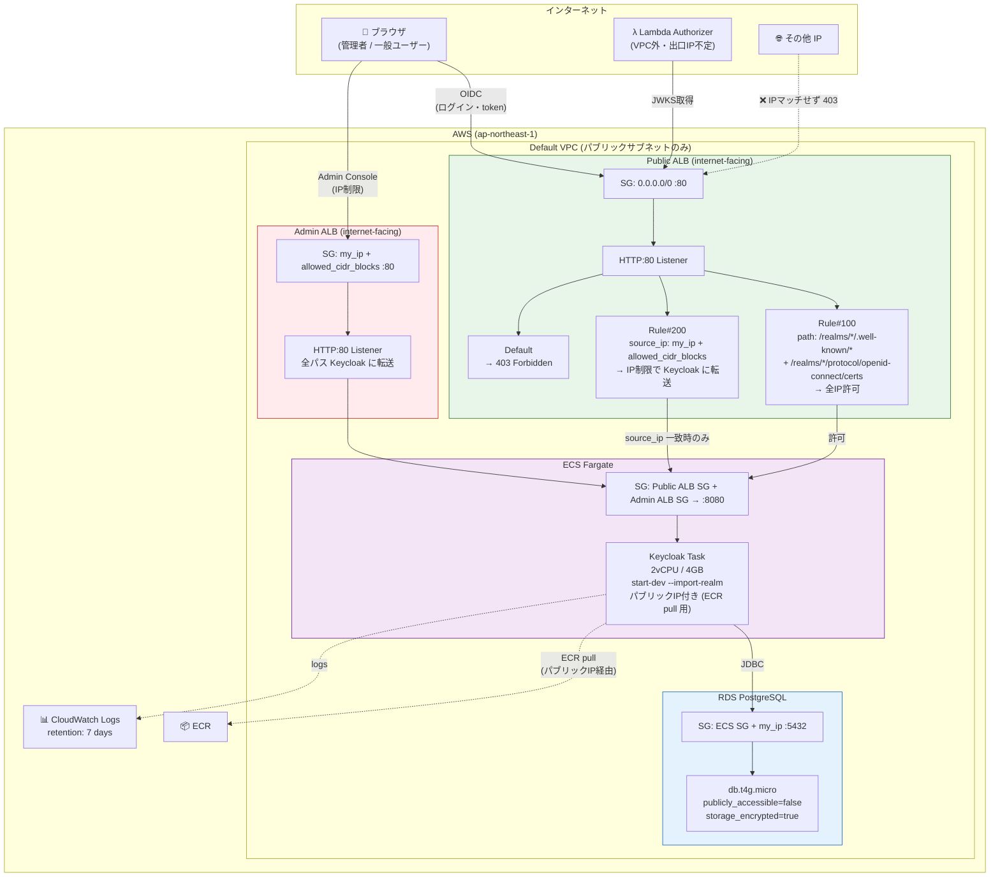
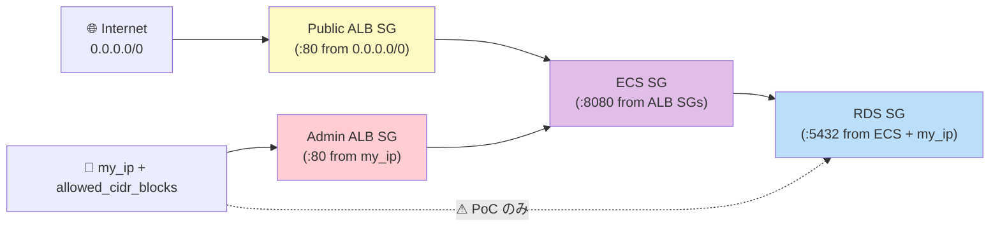

# Keycloak ネットワーク構成（実装実態ベース）

> 最終更新: 2026-04-21
> 対象: PoC の Keycloak 環境（infra/keycloak/ 配下）

PoC 実装（Terraform コード）から導出した、**現実のネットワーク構成・IP 制限の実態**をまとめる。
`jwks-public-exposure.md` が「設計論」なのに対し、本ドキュメントは「実装ログ」の位置づけ。

---

## 1. 全体構成図

---

## 2. コンポーネント別 IP 制限マトリクス

**最重要**: 「IP 制限されている／されていない」を一覧で把握するための表。

| # | コンポーネント | 制限レイヤー | 制限内容 | 実装箇所 |
|---|--------------|-----------|---------|---------|
| 1 | **Public ALB SG** | L4（SG） | ❌ **制限なし**（`0.0.0.0/0` :80 許可） | [security-groups.tf:2-22](../../infra/keycloak/security-groups.tf#L2-L22) |
| 2 | Public ALB Rule#100（JWKS 系） | L7（Listener Rule） | ❌ **制限なし**（全 IP 許可） | [alb.tf:50-67](../../infra/keycloak/alb.tf#L50-L67) |
| 3 | Public ALB Rule#200（その他） | L7（Listener Rule） | ✅ **IP 制限**（my_ip + allowed_cidr_blocks） | [alb.tf:70-84](../../infra/keycloak/alb.tf#L70-L84) |
| 4 | Public ALB Default Action | L7 | ✅ **全拒否**（403 固定レスポンス） | [alb.tf:39-47](../../infra/keycloak/alb.tf#L39-L47) |
| 5 | **Admin ALB SG** | L4（SG） | ✅ **IP 制限**（my_ip + allowed_cidr_blocks） | [security-groups.tf:25-44](../../infra/keycloak/security-groups.tf#L25-L44) |
| 6 | Admin ALB Listener | L7 | ❌ **制限なし**（全パス Keycloak 転送） | [alb.tf:120-129](../../infra/keycloak/alb.tf#L120-L129) |
| 7 | **ECS SG** | L4（SG） | ✅ **ALB SG 経由のみ**（8080） | [security-groups.tf:47-74](../../infra/keycloak/security-groups.tf#L47-L74) |
| 8 | ECS Task Public IP | — | ⚠ **パブリック IP 付与**（ECR pull 用） | [ecs.tf:169](../../infra/keycloak/ecs.tf#L169) |
| 9 | **RDS SG (ECS)** | L4（SG） | ✅ **ECS SG のみ**（5432） | [security-groups.tf:82-88](../../infra/keycloak/security-groups.tf#L82-L88) |
| 10 | **RDS SG (my_ip)** | L4（SG） | ⚠ **自分の IP 許可**（メンテ用、5432） | [security-groups.tf:90-96](../../infra/keycloak/security-groups.tf#L90-L96) |
| 11 | RDS publicly_accessible | — | ✅ **false**（パブリック IP なし） | [rds.tf:27](../../infra/keycloak/rds.tf#L27) |

### 2.1 「IP 制限されていない部分」の明示

PoC 実装で **意図的に IP 制限していない**、または **IP 制限が弱い** 箇所:

| # | 箇所 | なぜ制限なし（弱い）か | リスク | 本番での対応方針 |
|---|------|--------------------|-------|---------------|
| 1 | Public ALB の JWKS / `.well-known` エンドポイント | **仕様上公開必須**（Lambda Authorizer 等の Resource Server が取得する。出口 IP 不定） | 公開鍵のみのため**リスクなし**（jwks-public-exposure.md 参照） | 維持（公開必須） |
| 2 | Public ALB SG（L4）が `0.0.0.0/0` | L7 の Listener Rule で制限するため | SG だけ見ると誤解を招く | 維持可能（L7 制限で十分） |
| 3 | Admin ALB が `internet-facing` | PoC では VPN/社内 NW が無い | 管理画面が公開側に露出（SG 制限のみ） | **要変更**: `internal` + VPN/DirectConnect 経由 |
| 4 | ECS Task にパブリック IP 付与 | デフォルト VPC + ECR pull のため | ECS から直接インターネット経由 ECR | プライベートサブネット + VPC Endpoint / NAT Gateway |
| 5 | RDS SG に `my_ip` 許可（メンテ用） | 開発中の DB 直接メンテナンス用 | **本番では絶対 NG** | **要削除**、Bastion / SSM Session Manager 経由に変更 |
| 6 | HTTP:80（HTTPS 非対応） | start-dev モードのため | 盗聴・改ざんリスク | **要変更**: ACM 証明書 + HTTPS:443 + HTTP→HTTPS リダイレクト |

---

## 3. パス別アクセス可否マトリクス

Public ALB 配下の Listener Rule による **L7 レベルのパスベース制限**。

| パス | Rule | JWKS 系？ | 全 IP 許可？ | 許可 IP からのみ？ | 挙動 |
|-----|------|:--------:|:-----------:|:----------------:|------|
| `/realms/*/.well-known/openid-configuration` | #100 | ✅ | ✅ | — | 全 IP からアクセス可 |
| `/realms/*/protocol/openid-connect/certs`（JWKS） | #100 | ✅ | ✅ | — | 全 IP からアクセス可 |
| `/realms/*/protocol/openid-connect/auth`（ログイン画面） | #200 | — | ❌ | ✅ | 許可 IP からのみ |
| `/realms/*/protocol/openid-connect/token`（トークン） | #200 | — | ❌ | ✅ | 許可 IP からのみ |
| `/realms/*/protocol/openid-connect/logout` | #200 | — | ❌ | ✅ | 許可 IP からのみ |
| `/realms/*/account/*` | #200 | — | ❌ | ✅ | 許可 IP からのみ |
| `/admin/*`（Public ALB 経由） | Default | — | ❌ | ❌ | **403 Forbidden** |
| `/metrics`, `/health/*` | Default | — | ❌ | ❌ | **403 Forbidden** |
| 不明なパス | Default | — | ❌ | ❌ | **403 Forbidden** |
| `/admin/*`（Admin ALB 経由） | — | — | ❌ | ✅（SG） | 管理者 IP からのみ |

### 3.1 重要な設計判断

**「JWKS は全 IP 公開、ログイン画面等は IP 制限」という L7 制限が PoC の要点。**

なぜ?
- **JWKS**: Resource Server（Lambda Authorizer 等）の出口 IP は不定のため全公開必須
- **ログイン画面・トークンエンドポイント**: ブラウザからの直接アクセスなのでクライアント IP が予測可能 → IP 制限可能

**注意**: `identity-broker-multi-idp.md` のような本番想定では、ログイン画面も顧客の社内 IP からアクセスされるため、許可 IP リストの管理負担が発生する。PoC では自分の IP + `allowed_cidr_blocks` で回避。

---

## 4. セキュリティグループ依存関係図

---

## 5. 本番移行時のネットワーク要件（要件定義での確認事項）

### 5.1 【Critical】必須対応

| # | 要件 | PoC 実装 | 本番要件 | 確認者 |
|---|------|---------|---------|-------|
| N1 | HTTPS 化 | HTTP:80 | ACM 証明書 + HTTPS:443 | インフラ / セキュリティ |
| N2 | Admin ALB の非公開化 | internet-facing + SG 制限 | `internal` + VPN/DirectConnect | インフラ / セキュリティ |
| N3 | RDS メンテナンス IP の削除 | SG で `my_ip` 許可 | Bastion / SSM Session Manager | セキュリティ |
| N4 | ECS パブリック IP 除去 | Public subnet + assign_public_ip | Private subnet + VPC Endpoint (ECR/CloudWatch) | インフラ |
| N5 | Keycloak の hostname 設定 | `KC_HOSTNAME_STRICT=false` | 正式ドメイン + `start --optimized` | インフラ |

### 5.2 【High】設計判断が必要

| # | 要件 | 検討内容 |
|---|------|---------|
| N6 | Public ALB の IP 制限戦略 | 顧客 IP をすべて許可 vs WAF Rate Limiting vs 制限なし + WAF での攻撃検知 |
| N7 | Admin Console のアクセス経路 | VPN / DirectConnect / AWS Client VPN / SSO 付き Bastion |
| N8 | マルチ AZ / マルチリージョン | ECS Service Auto Scaling / RDS Multi-AZ / Aurora Global DB |
| N9 | VPC 設計 | 既存 VPC 利用 / 新規 VPC / Transit Gateway 接続 |
| N10 | WAF の適用 | AWS WAF による攻撃検知・レート制限・ボット対策 |

### 5.3 【Medium】監視・運用

| # | 要件 | 検討内容 |
|---|------|---------|
| N11 | VPC Flow Logs | セキュリティ監査要件次第 |
| N12 | ALB アクセスログ | S3 保存・保存期間・分析基盤 |
| N13 | 不正 IP ブロック | AWS WAF IP Set 連携 |

---

## 6. ドキュメント整合性チェック結果

本ドキュメント作成時（2026-04-21）に、既存ドキュメントとの整合性を確認した結果:

| ドキュメント | 整合性 | 差分 | 対応 |
|------------|:-----:|------|------|
| [architecture.md](architecture.md) | ❌ 古い | Admin ALB が未反映、単一 ALB 記載 | **本更新で Admin ALB を追記済** |
| [jwks-public-exposure.md](jwks-public-exposure.md) | ⚠ 部分的 | Admin ALB 分離は反映済、**L7 パスベース制限は未反映** | **本更新で実装実態を反映済** |
| [keycloak/setup-guide.md](../keycloak/setup-guide.md) | ⚠ 未確認 | Admin ALB 経由の Admin Console アクセス手順は要確認 | 本番移行時に更新 |

---

## 7. 参考

- 実装コード: [infra/keycloak/](../../infra/keycloak/)
- 設計思想: [jwks-public-exposure.md](jwks-public-exposure.md)
- PoC 総括: [../requirements/poc-summary-evaluation.md](../requirements/poc-summary-evaluation.md)
