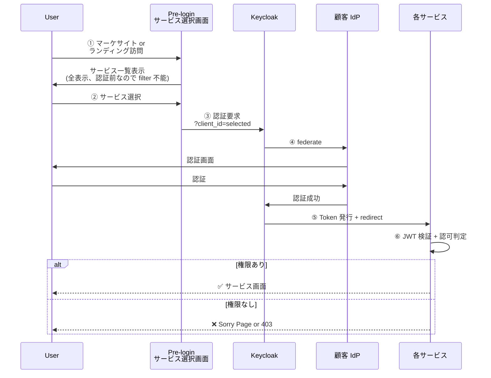
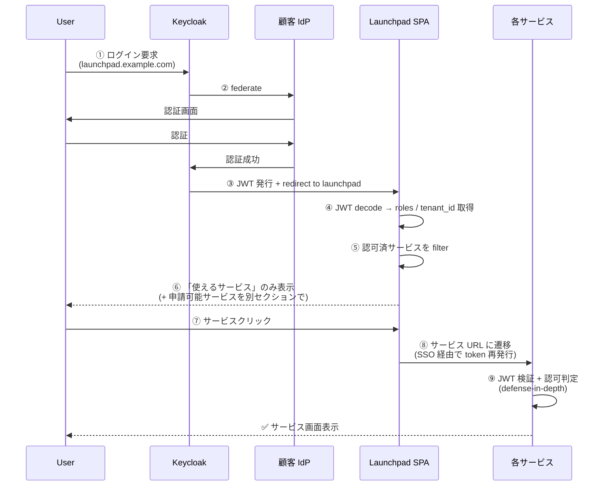

# サービス選択画面 (Launchpad) Pattern 1 移行検討資料

> **目的**: 現状の Pre-login Pattern 3（または Post-login Pattern 2）から **Post-login Pattern 1（サービス選択画面 で認可済サービスのみ表示 + アプリ側でも認可）** へ移行するための **検討資料 / 実装計画**。
> **対象読者**: 認証基盤設計者 / フロントエンド設計者 / 顧客 PoC 担当 / プロジェクトマネージャー
> **位置付け**: [§FR-4.3.D](../requirements/proposal/fr/04-sso.md) の Pattern 1 採用判断を受けた後の **移行段取り資料**。要件定義から実装計画への橋渡し。
> **関連 doc**:
> - [§FR-4.3 ログイン後のランディング UX](../requirements/proposal/fr/04-sso.md) — Pre/Post の大枠 + Pattern 1/2/3 の整理
> - [§FR-4.3.D Post-login Pattern 1/2 細分化](../requirements/proposal/fr/04-sso.md) — Pattern 選定の根拠
> - [§FR-4.3.E Sorry Page 設計詳細](../requirements/proposal/fr/04-sso.md) — Sorry の保険的役割
> - [broker-data-model.md §4](broker-data-model.md) — JWT クレーム（Launchpad が利用する `roles` / `tenant_id`）
> - [authz-architecture-design.md](authz-architecture-design.md) — アプリ側認可の責務
> - [ADR-021 Post-login Landing UX](../adr/021-post-login-landing-ux.md)
> - [ADR-022 AWS edge Sorry 制御](../adr/022-aws-edge-sorry-control.md)

---

## 目次

1. [サマリ — なぜ移行するのか](#1-サマリ--なぜ移行するのか)
2. [現状の想定パターン](#2-現状の想定パターン)
3. [目標：Pattern 1 のアーキテクチャ](#3-目標pattern-1-のアーキテクチャ)
4. [段階移行計画（4 Phase）](#4-段階移行計画4-phase)
5. [Launchpad SPA 実装ガイド](#5-launchpad-spa-実装ガイド)
6. [認可ロジック（filter）の実装パターン](#6-認可ロジックfilterの実装パターン)
7. [Defense-in-Depth — アプリ側認可の維持](#7-defense-in-depth--アプリ側認可の維持)
8. [リスクと緩和策](#8-リスクと緩和策)
9. [既存システムとの整合](#9-既存システムとの整合)
10. [移行成否の判定基準（DoD）](#10-移行成否の判定基準dod)
11. [既存 doc クロスリンク](#11-既存-doc-クロスリンク)

---

## 1. サマリ — なぜ移行するのか

### 一行サマリ

> Pattern 1（**Post-login + サービス選択画面 で認可済サービスのみ表示 + アプリ側でも認可**）は業界主流（Microsoft 365 / Google Workspace / Salesforce）で、**「権限なしクリック」を構造的に回避**しつつ **defense-in-depth** を実現する。Pattern 3（現状想定）から移行すれば、UX 品質・サポート負荷・セキュリティ強度のすべてが改善する。

### 移行で得られる効果

| 効果 | 内容 | 定量目安 |
|---|---|---|
| **「権限なしクリック」起因の問合せ削減** | ユーザーが「使えないサービス」を押せなくなる | サポート問合せ -50〜-80%（業界事例）|
| **UX 品質向上** | 「自分の世界が一目」のメンタルモデル | NPS / CSAT 改善 |
| **defense-in-depth 実現** | サービス選択画面 + アプリ両方で認可、片方のバグで穴が空きにくい | セキュリティレビュー指摘減 |
| **申請動線の自然な組込み** | 「申請可能サービス」セクションで利用拡大誘導 | プロダクトクロスセル |
| **管理者の可視性向上** | サービス選択画面 アクセスログで「誰が何を使っているか」集約 | 監査 / 棚卸し効率化 |

### 移行しない場合のリスク（現状 Pattern 3 維持）

| リスク | 影響 |
|---|---|
| 「使えないサービスをクリック → 403」を毎日経験するユーザーの離脱 | 顧客満足度低下 |
| Sorry Page の出来不出来が UX 全体を支配 | サポート工数・問合せ増 |
| サービスごとの認可エラー実装がバラつく | 一貫した UX が出せない |
| 監査時の「誰が何を使えるか」一覧化が困難 | 規制対応工数増（PCI DSS / APPI / SOC 2 監査）|

---

## 2. 現状の想定パターン

### Pattern 3（Pre-login サービス選択、現状想定）



**特徴**:
- Pre-login で全サービスをユーザーに見せる（認証前なので filter 不能）
- 認証後、選択したサービスに着くと **アプリで初めて 403** が起きる
- Sorry Page が UX 品質を決定する

**起きること**:
- 「使えないサービスを押して 403 → イラつく」が日次で発生
- Sorry Page の品質に依存する顧客満足度
- ブックマーク直行 UX は最も自然（サービス URL を直接アクセス可能）

---

## 3. 目標：Pattern 1 のアーキテクチャ

### Pattern 1（Post-login + サービス選択画面 認可 + アプリ認可）



### 構成要素

| 要素 | 役割 | 実装場所 |
|---|---|---|
| **認証基盤（Keycloak）** | 認証 + JWT 発行 + SSO セッション保持 | ECS Fargate（本基盤） |
| **Launchpad SPA** ★ NEW | 認可済サービス filter + 一覧表示 + サービス選択 | 新規 SPA（自前） or Hosted UI |
| **各サービス** | 既存通り、JWT 検証 + アプリ側認可 | 各アプリ |
| **Sorry Page（保険）** | deep-link / token 失効等の例外時 | Lambda@Edge |
| **申請動線（任意）** | 「申請可能サービス」から管理者承認フローへ | Launchpad SPA + Workflow |

### 業界実例の対応

| 実例 | 対応する Pattern 1 要素 |
|---|---|
| Microsoft 365 portal | サービス選択画面 + 申請動線 + Sorry |
| Google Workspace App Switcher | サービス選択画面（右上アイコン）|
| Salesforce App Launcher | サービス選択画面（左上アイコン）|
| Okta End-User Dashboard | サービス選択画面 + アプリタイル |
| Atlassian Cloud Start | サービス選択画面 + Recently used |

---

## 4. 段階移行計画（4 Phase）

### Phase 0: 現状確認（着手前 1 週間）

| Task | 内容 |
|---|---|
| 現状想定の確定 | Pattern 3 か Mixed か、サービス選択 UX を顧客にヒアリング |
| 既存サービス洗い出し | 何個のサービスが Launchpad 表示対象か |
| 認可モデル確認 | JWT に乗る `roles` / `tenant_id` / `scope` の現状 |
| ユーザー種別整理 | [user-types-and-auth.md](user-types-and-auth.md) と整合 |
| **顧客との合意取得** | Pattern 1 移行方針への合意 |

**Gate**: 顧客合意 + 現状想定確定

### Phase 1: Launchpad SPA MVP 構築（2-3 週間）

| Task | 内容 | 工数 |
|---|---|---|
| SPA フレームワーク選定 | React / Vue / 既存 SPA 拡張 | 0.5d |
| 認証フロー実装 | OIDC Auth Code + PKCE / oidc-client-ts | 2d |
| サービス カタログ管理 | 静的 JSON or DB or Keycloak Client 一覧 API | 2d |
| Filter ロジック実装 | JWT `roles` × カタログ → 表示判定 | 3d |
| 基本 UI 実装 | サービスタイル / クリック → サービス遷移 | 3d |
| 監査ログ送出 | 「誰が何にアクセスした」を CloudWatch Logs | 1d |
| デプロイ | S3 + CloudFront / ECS | 2d |

**Gate**: launchpad.example.com で 1 ユーザーが 1 サービスに遷移できる

### Phase 2: 既存サービスの統合（2-4 週間）

| Task | 内容 | 工数 |
|---|---|---|
| 既存サービス側の認可ロジック確認 | 各サービスが JWT 検証 + 認可判定しているか | 1d/サービス |
| サービス選択画面 → サービス遷移の SSO 動作確認 | Keycloak SSO Session で再認証なし | 1d |
| Sorry Page との連携 | 例外時のフォールバック | 2d |
| テスト（複数ユーザー × 複数サービス）| Role 別の表示確認 | 3-5d |
| 顧客テナント別検証 | tenant_id でテナント分離が効くか | 2-3d |

**Gate**: 全既存サービスが Launchpad 経由で利用可能

### Phase 3: 申請動線実装（任意、1-2 週間）

| Task | 内容 | 工数 |
|---|---|---|
| 「申請可能サービス」セクション設計 | 未許可サービスを別エリア表示 | 1d |
| 申請ボタン → ワークフロー連携 | ServiceNow / 自前ワークフロー | 3-5d |
| 管理者承認 UI | Tenant Admin Portal と統合 | 3d |
| 申請ログ・監査 | 申請・承認・拒否のイベント記録 | 1d |

**Gate**: ユーザーが申請ボタンから管理者承認まで一周可能

### Phase 4: Pre-login 系の整理（必要に応じて、1-2 週間）

| Task | 内容 |
|---|---|
| マーケサイト / Pre-login ランディングの方針確認 | B-626 ヒアリング |
| Pre-login システム選択を廃止するか維持するか判定 | Mixed パターンとして両立可（§FR-4.3.A） |
| ブックマーク直行 URL の扱い | サービス URL を直接アクセス可能に維持（推奨）|
| 旧 Pre-login UI のリダイレクト設計 | 旧 URL → Launchpad へリダイレクト |

**Gate**: ユーザーが Launchpad / 直接サービス URL の両方から利用できる

### 移行全体工数の目安

| Phase | 工数 | 顧客影響 |
|---|---|---|
| Phase 0 | 1 週間 | ヒアリング負荷 |
| Phase 1 | 2-3 週間 | なし（並行構築）|
| Phase 2 | 2-4 週間 | テスト協力依頼 |
| Phase 3 | 1-2 週間 | 任意 |
| Phase 4 | 1-2 週間 | URL 変更通知 |
| **合計** | **7-12 週間** | – |

→ 1.5-3 ヶ月の移行プロジェクト想定。並行開発できる Phase が多いので、優先度次第で短縮可能。

---

## 5. Launchpad SPA 実装ガイド

### 技術スタック推奨

| 要素 | 推奨 | 理由 |
|---|---|---|
| フロントエンド | React / TypeScript + Vite | 業界標準、エコシステム豊富 |
| 認証ライブラリ | `oidc-client-ts` | 本基盤 [ADR-003](../adr/003-oidc-client-ts.md) で採用済 |
| デプロイ | S3 + CloudFront | コスト最小、静的配信 |
| API（カタログ）| API Gateway + Lambda | サービス一覧の動的取得用 |
| 認証 | OIDC Auth Code + PKCE | 標準フロー |

### 最小構成のディレクトリ例

```
launchpad-spa/
├── src/
│   ├── App.tsx                  # ルーター
│   ├── auth/
│   │   ├── KeycloakProvider.tsx # oidc-client-ts ラッパー
│   │   └── useAuth.ts
│   ├── catalog/
│   │   ├── ServiceCatalog.ts    # サービス一覧定義 (静的 or API 取得)
│   │   └── useAuthorizedServices.ts  # roles × catalog filter
│   ├── components/
│   │   ├── ServiceTile.tsx       # サービスタイル
│   │   ├── AuthorizedSection.tsx # 利用可能セクション
│   │   ├── RequestableSection.tsx # 申請可能セクション
│   │   └── UserMenu.tsx          # ユーザーメニュー
│   └── pages/
│       └── Dashboard.tsx         # メインダッシュボード
├── public/
│   └── index.html
├── package.json
└── vite.config.ts
```

### 認可ロジックの擬似コード

```typescript
// src/catalog/useAuthorizedServices.ts
import { useAuth } from '../auth/useAuth';
import { SERVICE_CATALOG, Service } from './ServiceCatalog';

export function useAuthorizedServices() {
    const { user } = useAuth();

    // JWT から roles / tenant_id 取得
    const userRoles: string[] = user?.profile?.roles ?? [];
    const tenantId: string = user?.profile?.tenant_id ?? '';

    // カタログを 3 つに分類
    const authorized: Service[] = [];
    const requestable: Service[] = [];
    const unavailable: Service[] = [];

    for (const service of SERVICE_CATALOG) {
        // 1. テナント許容チェック
        if (service.allowedTenants && !service.allowedTenants.includes(tenantId)) {
            unavailable.push(service);
            continue;
        }

        // 2. 必要ロール持っているか
        const hasRequiredRole = service.requiredRoles.some(role =>
            userRoles.includes(role)
        );

        if (hasRequiredRole) {
            authorized.push(service);
        } else if (service.requestable) {
            // 3. 申請可能ならその扱い
            requestable.push(service);
        } else {
            unavailable.push(service);
        }
    }

    return { authorized, requestable, unavailable };
}
```

### サービスカタログ構造

```typescript
// src/catalog/ServiceCatalog.ts
export interface Service {
    id: string;
    name: string;
    icon: string;
    url: string;
    description: string;
    requiredRoles: string[];
    allowedTenants?: string[];  // 省略時は全テナント許可
    requestable: boolean;
    category: 'business' | 'admin' | 'utility';
}

export const SERVICE_CATALOG: Service[] = [
    {
        id: 'expense',
        name: '経費精算',
        icon: '📝',
        url: 'https://expense.example.com',
        description: '経費の申請・承認',
        requiredRoles: ['employee', 'manager', 'admin'],
        requestable: true,
        category: 'business',
    },
    {
        id: 'reports',
        name: 'レポート',
        icon: '📊',
        url: 'https://reports.example.com',
        description: 'ダッシュボード閲覧',
        requiredRoles: ['manager', 'admin'],
        requestable: true,
        category: 'business',
    },
    // ...
];
```

### Hosted UI 採用代替（自前 SPA を作らない選択肢）

Keycloak アカウント設定画面 を拡張する案もあるが、業界実例（M365 / Google / Salesforce）はすべて **独立 SPA** を採用。理由:
- アカウント設定画面 はユーザー個人設定向け、サービス一覧 UI には不向き
- ブランディング / カスタマイズの柔軟性が低い
- Keycloak バージョンアップで UI が変わるリスク

→ **自前 SPA 推奨**。工数は Phase 1 の 2-3 週間で十分。

---

## 6. 認可ロジック（filter）の実装パターン

### A. JWT ベース filter（推奨、最も単純）

Launchpad SPA が自身の JWT から `roles` / `tenant_id` を取り出し、カタログと照合:

```typescript
// 静的カタログ + JWT で filter
authorized = catalog.filter(s =>
  s.requiredRoles.some(r => jwt.roles.includes(r))
);
```

**メリット**: 追加 API 不要、レスポンス即時
**デメリット**: ロール変更が token expiry まで反映されない（typically 5-30 分）

### B. Server-side カタログ API + filter（精度高）

Lambda + DynamoDB 等でサービスカタログを管理、API 呼出で「あなたが使えるサービス」を返す:

```typescript
const services = await fetch('/api/launchpad/my-services', {
  headers: { Authorization: `Bearer ${jwt}` }
});
```

**メリット**: ロール変更が即時反映、サーバ側で複雑なロジック適用可
**デメリット**: API 構築工数 +1-2 週間

### C. Keycloak Authorization Services（UMA 2.0）連携（高度）

Keycloak の Authorization Services で client × resource × scope の認可を一元管理:

**メリット**: 認可ロジックを Keycloak に集約
**デメリット**: 実装複雑、運用負荷大、本基盤の `tenant_id` 設計との整合性検討必要

### 推奨判定

| 状況 | 推奨パターン |
|---|---|
| サービス数 < 20 + ロール変更が頻繁でない | **A. JWT ベース**（Phase 1 で実装容易）|
| ロール変更を即時反映したい / サービス数 20+ | **B. Server-side API** |
| 複雑な認可（ABAC / Resource-level）が必要 | **C. UMA 2.0**（将来拡張）|

→ Phase 1 では **A で MVP**、Phase 2 で必要に応じて **B に発展**が現実的。

---

## 7. Defense-in-Depth — アプリ側認可の維持

**Pattern 1 採用時、Launchpad で filter したからアプリ側で認可不要…という設計は重大なアンチパターン**。

### なぜ二重認可が必須か

| シナリオ | Launchpad のみ認可 | アプリ + Launchpad 認可 |
|---|---|---|
| ユーザーがサービス URL を直接ブックマーク | ❌ 認可スルー可能 | ✅ アプリで 403 |
| Launchpad の filter ロジックに bug | ❌ 全権限スルーの可能性 | ✅ アプリで防御 |
| 管理者が権限剥奪後、ユーザーが古い token で直接アクセス | ❌ 古い表示状態継続 | ✅ アプリの最新チェックで防御 |
| 内部攻撃者が Launchpad を bypass | ❌ サービス直撃可能 | ✅ アプリでブロック |

### アプリ側の最低限の認可チェック

各サービスは以下を**必ず実装**:

```
1. JWT 署名検証（iss / aud / exp / 署名）
2. roles クレームを取得
3. このサービスに必要な role を持っているか確認
4. tenant_id クレームでテナント境界確認
5. NG なら 403 + X-Sorry-Reason ヘッダ
   → CloudFront Lambda@Edge が Sorry Page にリダイレクト
```

[authz-architecture-design.md](authz-architecture-design.md) のパターン 2（Gateway + ローカル検証ハイブリッド）と一致。

### 既存サービスの認可実装が不十分な場合

Phase 2 で各サービスの認可実装を確認し、不足があれば **Pattern 1 移行と並行して認可強化**:

- API Gateway + Lambda Authorizer で集中検証（[ADR-002](../adr/002-lambda-authorizer.md)）
- アプリ自前で JWT 検証ライブラリ（jose 等）
- BFF パターン採用なら BFF で集中検証

---

## 8. リスクと緩和策

| リスク | 影響 | 緩和策 |
|---|---|---|
| 既存ユーザーが旧 URL（Pre-login）に慣れている | 移行ショック | Phase 4 で**旧 URL → Launchpad リダイレクト**実装、移行アナウンス |
| サービスカタログのメンテナンス漏れ | 新サービスが Launchpad に表示されない | カタログを **Git 管理 + PR レビュー**、または DB UI で管理 |
| Launchpad SPA のバグでユーザーが何も表示されない | 業務停止 | **Fallback: 全サービス URL リスト**を Sorry Page 化、サービス選択画面 障害時も直接アクセス可 |
| ロール変更が即時反映されない（Pattern A）| 「権限あるはずなのに表示されない」苦情 | **token TTL を短縮**（15-30 分）、または Pattern B（Server-side API）に変更 |
| 認可ロジックの二重実装（Launchpad + アプリ）の保守負荷 | 設計変更時に両方更新必要 | **ロール → サービスのマッピング表を 1 つの SSOT に**（OPA / Cedar / 共通ライブラリ）|
| Pre-login UX の喪失（マーケサイトでサービス紹介できない）| 営業活動への影響 | **Pre-login = マーケ目的、Post-login = 生産性目的** で併存（§FR-4.3.A の 2 軸論）|
| 「申請可能サービス」セクションが「使えないものの羅列」になる | UX 悪化 | **顧客テナント設定で『申請可能セクションを表示するか』を制御可能に** |

---

## 9. 既存システムとの整合

### 認証基盤（Keycloak）の変更要否

| 要素 | Pattern 3 → Pattern 1 移行で必要か |
|---|---|
| Realm 設定 | ❌ 変更不要 |
| Client 設定 | 🟡 Launchpad SPA 用の新規 Public Client 追加（PKCE 必須） |
| Protocol Mapper（roles / tenant_id）| ✅ 既存（[Phase 8/9 で実装済](../../keycloak/config/realm-export.json)）|
| Identity Provider 設定 | ❌ 変更不要 |
| Browser Flow | ❌ 変更不要 |
| User Federation | ❌ 変更不要 |

→ Keycloak 側は **Launchpad SPA 用 Client 1 つ追加するだけ**。既存サービスの Client / Realm 設定への影響なし。

### 既存サービスの変更要否

| 要素 | 必要か |
|---|---|
| 認証フロー（OIDC Auth Code）| ❌ 変更不要 |
| JWT 検証ロジック | ❌ 既存通り（[ADR-002 Lambda Authorizer](../adr/002-lambda-authorizer.md) 等）|
| 認可ロジック | ⚠ 既存が不十分なら強化（[§7](#7-defense-in-depth--アプリ側認可の維持)）|
| 403 時の挙動 | 🟡 Sorry Page リダイレクト or `X-Sorry-Reason` ヘッダ |
| URL 体系 | ❌ 既存維持（ブックマーク互換性維持）|

→ 既存サービスは原則変更不要。**サービス選択画面 経由でも直接 URL でも同じ動作**を維持。

### 既存 doc との整合

| doc | 整合状況 |
|---|---|
| [§FR-4.3](../requirements/proposal/fr/04-sso.md) | Pattern 1/2 細分化を §FR-4.3.D として追加（本資料の議論を反映） |
| [§FR-4.3.E Sorry Page](../requirements/proposal/fr/04-sso.md) | Pattern 1 採用時も Sorry Page は保険として必要 |
| [ADR-021 Post-login Landing UX](../adr/021-post-login-landing-ux.md) | 既存 ADR で Post-login Landing 採用済、本資料は Pattern 1 の細分化 |
| [ADR-022 AWS edge Sorry 制御](../adr/022-aws-edge-sorry-control.md) | Sorry Page の実装パターン詳細 |
| [authz-architecture-design.md](authz-architecture-design.md) | アプリ側認可の必要性（defense-in-depth）と整合 |
| [user-types-and-auth.md](user-types-and-auth.md) | 5 ユーザー種別すべてに Launchpad は対応可（ローカル / 連携両方）|

---

## 10. 移行成否の判定基準（DoD）

| Phase | 成功条件 |
|---|---|
| Phase 0 | ✅ 顧客が Pattern 1 移行に合意 + 既存サービス洗い出し完了 |
| Phase 1 | ✅ launchpad.example.com で 1 ユーザーが 1 サービスに遷移できる |
| Phase 2 | ✅ 全既存サービスが Launchpad 経由で表示・遷移できる<br/>✅ 複数ユーザー × 複数ロールで filter が正しく動く<br/>✅ アプリ側認可も維持されている（直接 URL アクセスで権限なし時 403）|
| Phase 3 | ✅ 「申請可能サービス」セクションで未許可サービスが表示される<br/>✅ 申請ボタンから管理者承認まで一周可能（任意） |
| Phase 4 | ✅ 旧 URL からのリダイレクトが動作<br/>✅ 移行アナウンスが完了<br/>✅ 顧客フィードバック収集 |

### 移行後の継続的な検証

| 観点 | 検証方法 | 頻度 |
|---|---|---|
| 認可漏れ検知 | アクセスログで「Launchpad 経由でないサービスアクセス + 権限なし」を検知 | 月次 |
| サポート問合せ削減 | 「権限なし」関連の問合せ件数追跡 | 月次 |
| ユーザー満足度 | NPS / CSAT 調査 | 四半期 |
| サービスカタログ完全性 | 新規サービス追加時の Launchpad 反映確認 | リリース毎 |

---

## 11. 既存 doc クロスリンク

| トピック | 参照 |
|---|---|
| Pattern 1/2/3 の判定基準・推奨 | [§FR-4.3.D](../requirements/proposal/fr/04-sso.md) |
| Sorry Page 設計詳細 | [§FR-4.3.E](../requirements/proposal/fr/04-sso.md) |
| Pre vs Post Login Landing UX 20 観点比較 | [§FR-4.3.A〜.C](../requirements/proposal/fr/04-sso.md) + [project_mixed_login_landing_ux メモリ](../../.claude/projects/-Users-suepie-Develop-10-project-aws-atuh-poc/memory/project_mixed_login_landing_ux.md) |
| broker が持つ JWT クレーム | [broker-data-model.md §4](broker-data-model.md) |
| アプリ側認可の責務 | [authz-architecture-design.md](authz-architecture-design.md) |
| Lambda Authorizer による集中検証 | [ADR-002](../adr/002-lambda-authorizer.md) |
| Post-login Landing UX 全体方針 | [ADR-021](../adr/021-post-login-landing-ux.md) |
| AWS edge Sorry 制御パターン (5 つ) | [ADR-022](../adr/022-aws-edge-sorry-control.md) |
| ユーザー種別 5 カテゴリ | [user-types-and-auth.md](user-types-and-auth.md) |
| HRD / Universal Login | [hrd-implementation-keycloak.md](hrd-implementation-keycloak.md) |
| OIDC 認証ライブラリ採用 | [ADR-003 oidc-client-ts](../adr/003-oidc-client-ts.md) |
| Phase 7-4 マルチ Client SSO 検証実績 | [mfa-sso-auth0-scenarios.md シナリオ 7-4](../keycloak/mfa-sso-auth0-scenarios.md) |

---

## 改訂履歴

- 2026-06-25: 初版作成。Pattern 1 (Post-login + Launchpad 認可 + アプリ認可) への移行計画として、現状想定 → 目標 → 4 Phase 段階移行 → SPA 実装ガイド → 認可ロジック 3 パターン (JWT/API/UMA) → defense-in-depth → リスク緩和 → 既存システム整合 → DoD を統合。[§FR-4.3.D Pattern 1/2 細分化](../requirements/proposal/fr/04-sso.md) + [§FR-4.3.E Sorry Page 設計](../requirements/proposal/fr/04-sso.md) と連動する実装計画資料
