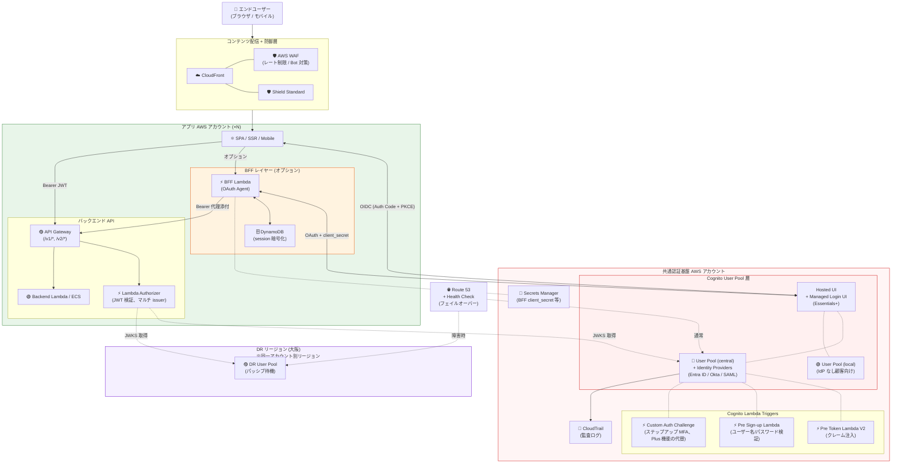
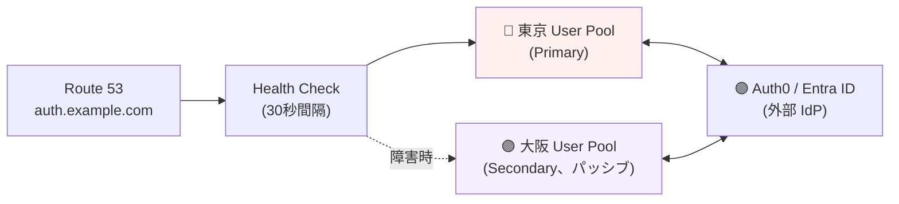
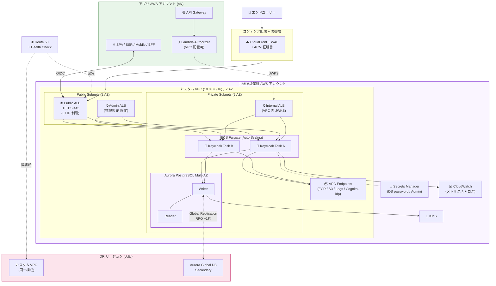
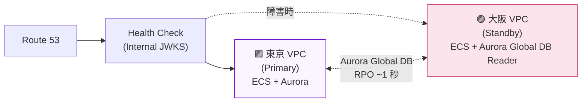
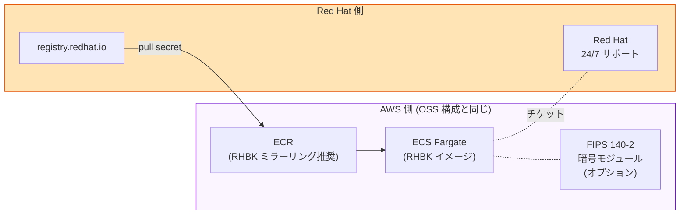
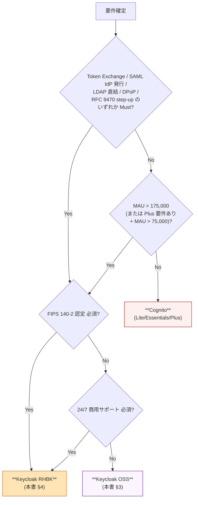
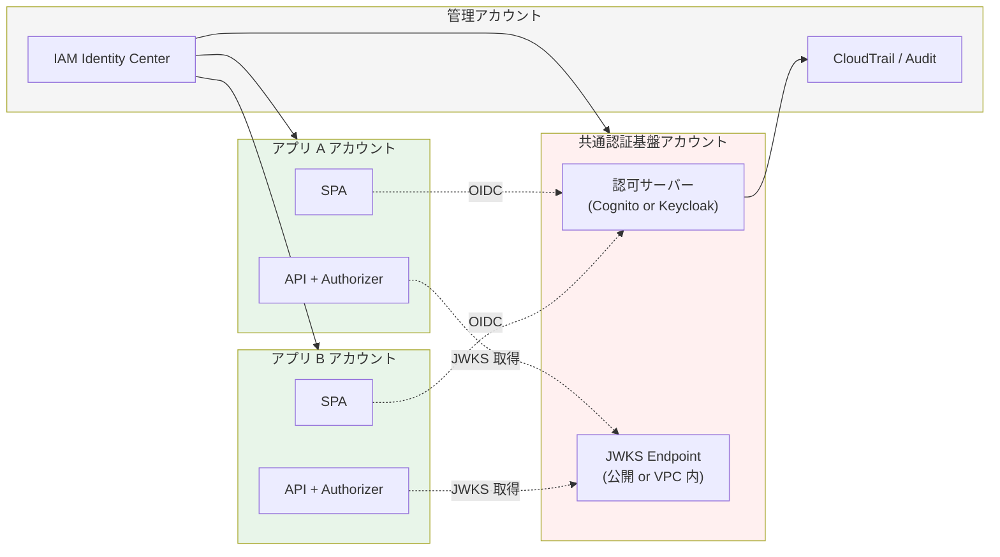

# プラットフォーム別アーキテクチャパターン（内部技術メモ）

> 最終更新: 2026-05-18
> 位置付け: **内部技術メモ**。顧客向け説明は [proposal/common/02-platform.md](../requirements/proposal/common/02-platform.md) に最小限のみ記載
> 関連: [bff-implementation-notes.md](bff-implementation-notes.md)、[architecture.md (PoC)](architecture.md)、[identity-broker-multi-idp.md](identity-broker-multi-idp.md)、[keycloak-network-architecture.md](keycloak-network-architecture.md)、[system-design-patterns.md](system-design-patterns.md)

---

## 1. はじめに

### 1.1 ドキュメントの目的

**Cognito / Keycloak OSS / Keycloak RHBK** の 3 つのプラットフォームについて、本番想定アーキテクチャを mermaid 構成図と共に整理する内部メモ。proposal §C-2 のプラットフォーム選定の**背景資料**として、また PoC から本番設計フェーズへの**移行設計の起点**として使う。

### 1.2 本ドキュメントと他の構成図ドキュメントの位置付け

| ドキュメント | 主題 | 視点 |
|---|---|---|
| **本書（platform-architecture-patterns.md）** | **3 プラットフォーム別の本番想定構成図** | **本番設計**（最新化対象）|
| [architecture.md](architecture.md) | PoC で実装した検証構成 | PoC 実装（Phase 1-9）|
| [identity-broker-multi-idp.md](identity-broker-multi-idp.md) | Broker パターンの抽象設計 / マルチ IdP | プロトコル・属性変換 |
| [keycloak-network-architecture.md](keycloak-network-architecture.md) | Keycloak ネットワーク詳細 | ネットワーク・IP 制限 |
| [system-design-patterns.md](system-design-patterns.md) | 8 つのシステム設計パターン（IdP × SPA/SSR × DR）| 抽象パターンカタログ |
| [bff-implementation-notes.md](bff-implementation-notes.md) | BFF パターン実装詳細 | 認証クライアント層 |

→ 本書は **「本番に持っていく構成」** にフォーカスし、上記他ドキュメントへの逆参照を持つ「俯瞰ハブ」として位置付ける。

### 1.3 共通の前提

すべての構成は以下を前提とする：

- **AWS マルチアカウント**（共通認証基盤アカウント + 各アプリアカウント）
- **Identity Broker パターン（Hub-and-Spoke）**採用（[§C-1](../requirements/proposal/common/01-architecture.md)）
- **マルチ AZ 必須**（[§NFR-1](../requirements/proposal/nfr/01-availability.md)）
- **TLS 1.2+ / KMS 暗号化 / Private Subnet 配置**（[§NFR-4](../requirements/proposal/nfr/04-security.md)）
- **CloudFront + WAF 前段**（高セキュ要件時、[ADR-013](../adr/013-cloudfront-waf-ip-restriction.md)）

---

## 2. Cognito 構成パターン

### 2.1 全体構成図（本番想定）

### 2.2 主要構成要素

| レイヤー | 構成要素 | 役割 |
|---|---|---|
| **コンテンツ配信** | CloudFront + WAF + Shield | レート制限・Bot 対策・DDoS 防御 |
| **認可サーバー** | Cognito User Pool（central / local / DR）| OIDC OP、トークン発行 |
| **ログイン UI** | Hosted UI / Managed Login UI（Essentials+）| ユーザー認証画面 |
| **拡張 Lambda** | Pre Token Lambda V2 / Pre Sign-up Lambda / Custom Auth Challenge | クレーム注入 / バリデーション / ステップアップ MFA |
| **シークレット管理** | Secrets Manager | BFF / IdP の client_secret |
| **DR** | DR Cognito User Pool（大阪、パッシブ）+ Route 53 | フェイルオーバー |
| **アプリ側** | SPA / SSR / Mobile / BFF（オプション）/ API Gateway / Lambda Authorizer / Backend | 各アプリで自由構成 |

### 2.3 ティア選定（[ADR-016](../adr/016-cognito-feature-tier-selection.md)）

| 要件 | 必要ティア | 月額単価（フェデ利用）|
|---|:---:|---|
| 基本認証（Must）| Lite | $0.015/MAU（フェデ）+ Lite |
| WebAuthn / Passkeys / パスワード履歴 / Managed Login UI | **Essentials+** | $0.015/MAU（Lite と同額）|
| 侵害クレデンシャル検出 / 詳細ロック / リスクベース MFA | **Plus** | +$0.02/MAU 追加 |

### 2.4 マルチ AZ / 可用性

| 項目 | 状態 |
|---|---|
| Cognito User Pool | ✅ AWS 自動マルチ AZ（SLA 99.9%）|
| 認証エンドポイント | ✅ AWS 透過 |
| Lambda Triggers | ✅ AWS Lambda 自動マルチ AZ |
| 単一障害点 | ✅ 排除済 |

### 2.5 DR 構成

- **Route 53 ヘルスチェック**（東京 JWKS endpoint）+ フェイルオーバーレコード
- **追加コスト**: $0.50/月（ホステッドゾーン）+ 障害月のみ大阪 MAU
- **既知の制約**: Auth0 IdP は大阪で `.well-known` 自動検出失敗 → 手動 endpoint で workaround（[ADR-007](../adr/007-osaka-auth0-idp-limitation.md)）

### 2.6 月額コスト試算（10K MAU、フェデ利用）

| ティア | Cognito 月額 | + DR | 合計 |
|---|---|---|---|
| Lite | ~$150 | $0.50 | **~$150** |
| Essentials | ~$150（連携課金同額）| $0.50 | **~$150** |
| Plus | ~$350（+ $0.02/MAU）| $0.50 | **~$350** |

→ MAU に比例してスケール。インフラ固定費なし。

---

## 3. Keycloak OSS 構成パターン

### 3.1 全体構成図（本番想定、Option B 完成形）

### 3.2 主要構成要素

| レイヤー | 構成要素 | 役割 |
|---|---|---|
| **コンテンツ配信** | CloudFront + WAF + ACM | HTTPS / IP 制限 / レート制限 |
| **3 系統 ALB** | Public / Admin / Internal | OIDC / 管理者 / VPC 内 JWKS（[ADR-012](../adr/012-vpc-lambda-authorizer-internal-jwks.md)）|
| **認可サーバー** | ECS Fargate（Keycloak 26.x、Auto Scaling 2-N）| OIDC OP、トークン発行 |
| **データベース** | Aurora PostgreSQL Multi-AZ | Realm 設定 / ユーザー / セッション保持 |
| **VPC Endpoints** | ECR / S3 / CloudWatch Logs / Cognito-idp | NAT Gateway 不要、Private Subnet 完結 |
| **シークレット管理** | Secrets Manager | DB password / Admin password |
| **暗号化** | KMS | Aurora encryption / Secrets 暗号化 |
| **DR** | Aurora Global DB（大阪 Secondary）+ Standby ECS + Route 53 | RPO ~1 秒 |

### 3.3 マルチ AZ / Auto Scaling

| 項目 | 構成 |
|---|---|
| ECS Fargate | Min 2 タスク（Multi-AZ）、CPU/Mem 閾値で自動スケール（〜 8 タスク程度）|
| Aurora | Multi-AZ（writer 1 + reader 1〜）、自動フェイルオーバー |
| ALB | Multi-AZ 自動（AWS 仕様）|
| Single Point of Failure | ✅ すべて冗長化済 |

### 3.4 DR 構成（Multi-Region）

- **Aurora Global DB**: 東京 ↔ 大阪、RPO ~1 秒
- **Standby ECS**: 平常時は最小タスク（or オンデマンド起動）
- **追加月額コスト**: ~$890/月（大阪側 ECS + Aurora 常時稼働）+ Route 53
- **フェイルバック**: Aurora Global DB の writer 切替 + ECS 自動復旧

### 3.5 月額コスト試算（10K MAU 想定、本番 HA 構成）

| コンポーネント | 月額 |
|---|---|
| ECS Fargate（2 vCPU × 4GB × 2 タスク Multi-AZ）| ~$200 |
| Aurora PostgreSQL Multi-AZ（db.r6g.large × 2）| ~$300 |
| 3 系統 ALB（Public / Admin / Internal）| ~$80 |
| VPC Endpoints（ECR / S3 / Logs / Cognito-idp）| ~$30 |
| その他（CloudWatch / Secrets Manager / KMS）| ~$30 |
| **インフラ小計** | **~$640/月** |
| 運用人件費（月 21h × $80）| ~$1,680 |
| **合計（運用込）** | **~$2,320/月** |

→ **MAU に依存しない固定費**。MAU 増えてもコスト変動なし → 損益分岐 175,000 MAU（[ADR-006](../adr/006-cognito-vs-keycloak-cost-breakeven.md)）。

---

## 4. Keycloak RHBK 構成パターン

### 4.1 OSS との差分（基本構成は同じ）

RHBK は OSS と**同じインフラ構成**で動作するが、以下が追加される：

### 4.2 デプロイメント選択肢（[ADR-015](../adr/015-rhbk-validation-deferred.md)）

| 構成 | Red Hat サポート対象 | 月額（OSS との差分）|
|---|:---:|---|
| **ECS Fargate + RHBK** | ⚠ **要確認**（[rhbk-vendor-inquiry.md Q1](../requirements/rhbk-vendor-inquiry.md)）| サブスクリプション $1,250〜2,500 |
| EKS Fargate + RHBK | ⚠ KB 7072950 要確認 | 同上 |
| **ROSA + RHBK** | ✅ 一級サポート | ROSA $400/月 + RHBK |
| EC2 RHEL 9 + RHBK | ✅ 一級サポート | EC2 + RHEL ライセンス |

### 4.3 月額コスト試算（10K MAU、ECS Fargate 想定）

| コンポーネント | 月額 |
|---|---|
| OSS インフラ（§3.5 参照）| ~$640 |
| RHBK サブスクリプション（2-core × 2 ノード、Standard）| ~$1,250 |
| RHBK サブスクリプション（Premium、24/7）| +$1,250（合計 ~$2,500）|
| 運用人件費（Red Hat サポート活用で半減想定）| ~$840 |
| **合計（Standard + 運用込）** | **~$2,730/月** |
| **合計（Premium + 運用込）** | **~$3,980/月** |

→ FIPS 140-2 必須 / 24/7 商用サポート必須なら有力候補。損益分岐は ~600K MAU（コスト的に大規模向け）。

---

## 5. 3 プラットフォーム比較表

[ADR-006](../adr/006-cognito-vs-keycloak-cost-breakeven.md) と [proposal §C-2](../requirements/proposal/common/02-platform.md) との整合表。

| 観点 | Cognito | Keycloak OSS | Keycloak RHBK |
|---|---|---|---|
| **タイプ** | フルマネージド SaaS | OSS 自己ホスト | OSS 商用版 + サポート |
| **インフラ月額（10K MAU）**| ~$150〜350（ティア）| ~$640 | ~$640 + RHBK |
| **運用人件費** | ~$0 | ~$1,680/月 | ~$840/月（半減想定）|
| **合計月額（10K MAU）**| ~$150〜350 | ~$2,320 | ~$2,730〜3,980 |
| **損益分岐 MAU**（vs Keycloak OSS）| 175K（連携）/ 75K（Plus）| — | ~600K |
| **マルチ AZ** | ✅ AWS 透過 | ⚠ 設計要 | ⚠ 同左 |
| **DR**（追加コスト）| $0.50/月 + 障害月 MAU | $890/月（常時）| $890 + RHBK |
| **FIPS 140-2** | ❌ | ❌ | ✅ |
| **24/7 商用サポート** | ✅ AWS Support | ❌ コミュニティ | ✅ Red Hat |
| **機能柔軟性** | 中（ティア依存）| 高 | 高 |
| **Token Exchange / SAML IdP 発行 / LDAP 直結 / DPoP / RFC 9470 step-up** | ❌ | ✅ | ✅ |
| **WebAuthn / Passkeys** | ✅（Essentials+）| ✅ | ✅ |
| **Identity Brokering**（外部 IdP）| ✅ | ✅ | ✅ |
| **IaC（Terraform）**| ✅ 完全管理可 | ⚠ Realm 部分は別管理 | 同左 |

---

## 6. プラットフォーム選定との対応

### 6.1 選定判定フロー（[proposal §C-2.4](../requirements/proposal/common/02-platform.md) と整合）

### 6.2 典型シナリオごとの推奨構成

| シナリオ | 想定 | 推奨 |
|---|---|---|
| 国内 B2B SaaS、~50K MAU、特殊要件なし | 一般的なエンプラ SaaS | **Cognito Lite/Essentials**（§2）|
| 国内 B2B SaaS、~100K MAU、リスクベース MFA Must | 金融周辺 SaaS | **Cognito Plus**（§2、~$350）|
| 大規模 B2B、~500K MAU、フェデのみ | グローバル SaaS | **Keycloak OSS**（§3）|
| 金融 / FAPI / Token Exchange / SAML IdP 発行 | 金融 API | **Keycloak OSS or RHBK**（§3/§4）|
| FIPS 140-2 必須 / 政府系 | 政府・防衛・医療 | **Keycloak RHBK**（§4）|
| AI Agent 認証 / Device Code 必須 | CLI・IoT・AI Agent | **Keycloak OSS or RHBK**（§3/§4）|

---

## 7. 共通: マルチアカウント連携設計

### 7.1 共通基盤 ↔ アプリアカウントの接続

### 7.2 信頼境界

- **共通基盤 → アプリ**: JWT 発行（基盤の私有鍵で署名）
- **アプリ → 共通基盤**: JWKS 取得（公開鍵）+ Bearer JWT 添付
- **管理者 → 共通基盤**: IAM Identity Center 経由 / Realm Admin
- **テナント境界**: JWT の `tenant_id` クレームで分離（[§FR-2.3.C](../requirements/proposal/fr/02-federation.md)）

---

## 8. 最新化方針

本ドキュメントは以下のタイミングで更新する：

| トリガー | 反映先 |
|---|---|
| プラットフォーム選定（[ADR-017 / 018](../adr/) 確定）| §6 選定フローを最終化、§2/§3/§4 のうち選定外を簡略化 |
| Cognito 料金変更 / 機能追加 | §2.3 ティア表、§2.6 コスト試算 |
| Keycloak 新バージョンリリース | §3.1〜§3.5 |
| RHBK サポート条件確定（[rhbk-vendor-inquiry.md](../requirements/rhbk-vendor-inquiry.md)）| §4 |
| マルチアカウント戦略確定（ADR-018）| §7 |
| DR 自動フェイルオーバー方式確定（ADR-019）| §2.5 / §3.4 |

→ **本書を最新化のハブ**として、他の関連ドキュメント（PoC 構成 / Broker パターン / ネットワーク詳細）への参照を維持する。

---

## 9. 参考資料

### ADR（プラットフォーム関連）
- [ADR-006 Cognito vs Keycloak コスト損益分岐](../adr/006-cognito-vs-keycloak-cost-breakeven.md)
- [ADR-010 Keycloak Private Subnet + VPC Endpoints](../adr/010-keycloak-private-subnet-vpc-endpoints.md)
- [ADR-011 認証基盤前段ネットワーク設計](../adr/011-auth-frontend-network-design.md)
- [ADR-012 VPC Lambda Authorizer + Internal ALB JWKS](../adr/012-vpc-lambda-authorizer-internal-jwks.md)
- [ADR-013 CloudFront + WAF による IP 制限](../adr/013-cloudfront-waf-ip-restriction.md)
- [ADR-014 認証パターン対応範囲](../adr/014-auth-patterns-scope.md)
- [ADR-015 RHBK 検証先送り](../adr/015-rhbk-validation-deferred.md)
- [ADR-016 Cognito 機能ティア選定基準](../adr/016-cognito-feature-tier-selection.md)

### 関連内部ドキュメント
- [bff-implementation-notes.md](bff-implementation-notes.md) — BFF パターン実装
- [architecture.md](architecture.md) — PoC 実装構成
- [identity-broker-multi-idp.md](identity-broker-multi-idp.md) — Broker パターン抽象設計
- [keycloak-network-architecture.md](keycloak-network-architecture.md) — Keycloak ネットワーク詳細
- [system-design-patterns.md](system-design-patterns.md) — 8 つのシステム設計パターン
- [proposal/common/02-platform.md](../requirements/proposal/common/02-platform.md) — 顧客提示版プラットフォーム選定
- [rhbk-vendor-inquiry.md](../requirements/rhbk-vendor-inquiry.md) — Red Hat 問い合わせ
