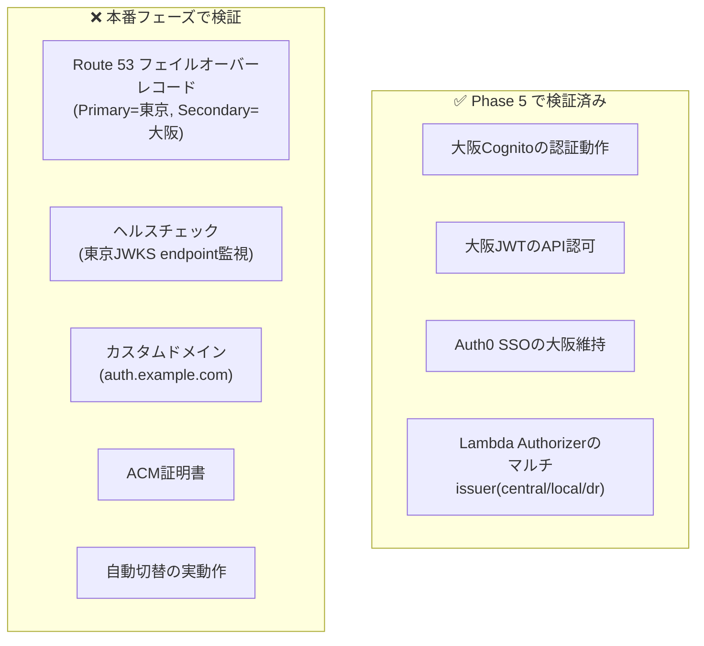
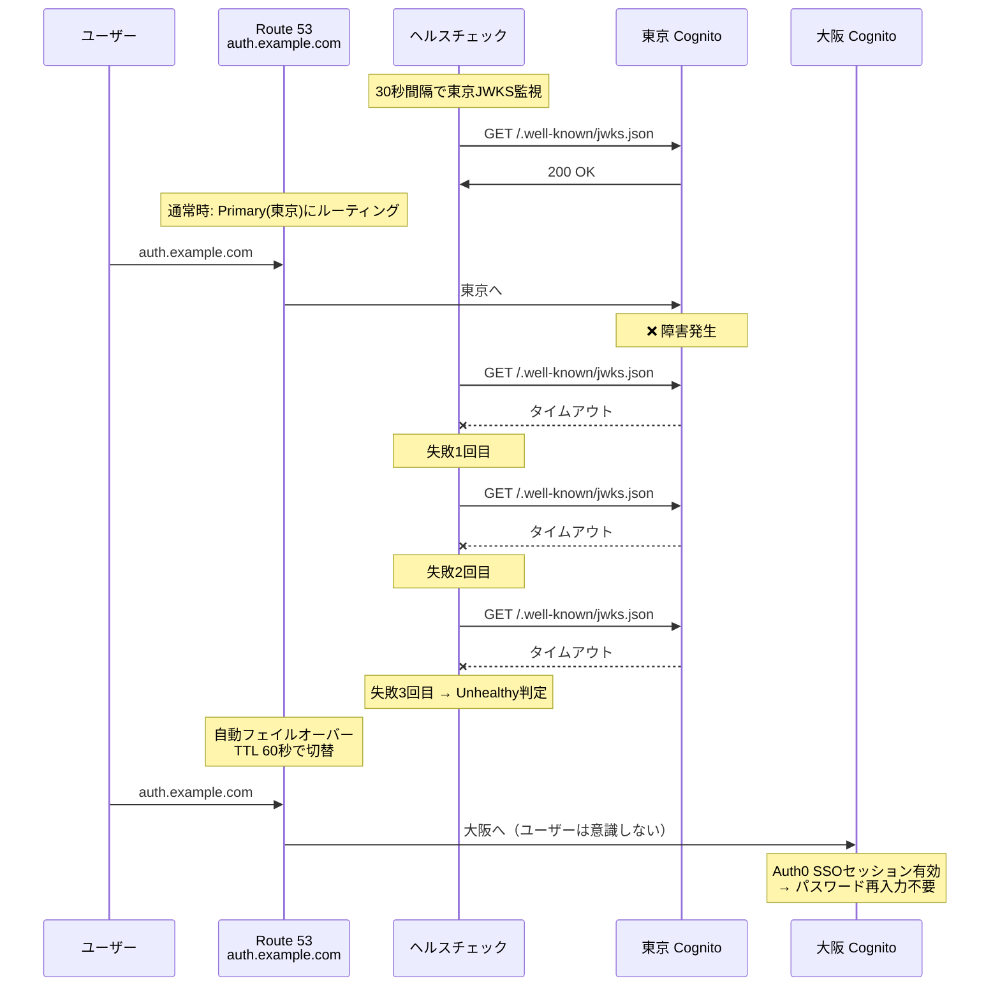
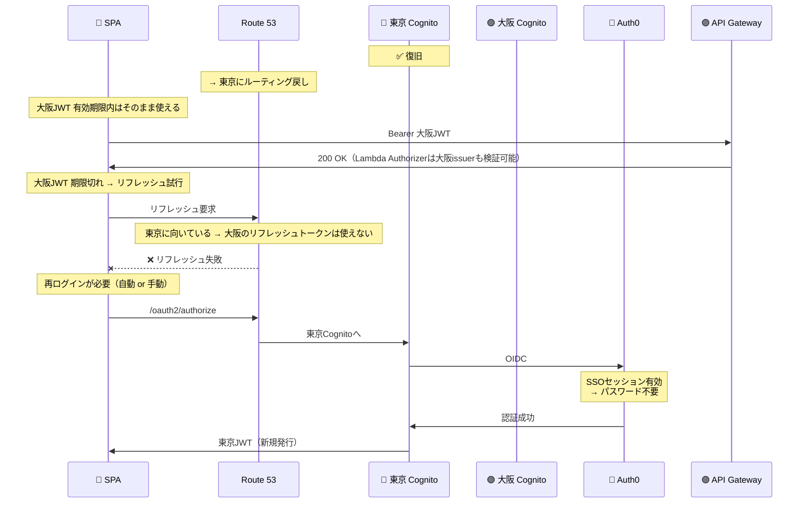

# PoC 検証結果サマリー（Phase 1〜7）

**最終更新**: 2026-03-30

---

## 1. 検証目的と達成状況

| 目的 | 達成 | Phase |
|------|:---:|-------|
| Cognito ハイブリッド構成の実現性検証 | ✅ | 1-4 |
| OIDC フェデレーション認証の動作確認 | ✅ | 2 |
| Lambda Authorizer による JWT検証 | ✅ | 3 |
| マルチissuer対応の動作確認 | ✅ | 4 |
| 認証フローの可視化 | ✅ | 1-4 |
| マルチリージョンDR検証 | ✅ | 5 |

---

## 2. 検証シナリオと結果

### 認証（5パターン）

| パターン | ログイン | JWT取得 | issuerType |
|---------|:---:|:---:|:---:|
| Hosted UI（集約Cognito） | ✅ | ✅ | central |
| Auth0 フェデレーション（集約） | ✅ | ✅ | central |
| ローカルCognito | ✅ | ✅ | local |
| DR Hosted UI（大阪） | ✅ | ✅ | dr |
| DR Auth0 フェデレーション（大阪） | ✅ | ✅ | dr |

### 認可

| テスト | 結果 |
|--------|:---:|
| トークンあり → API呼び出し | ✅ 200 OK |
| トークンなし → API呼び出し | ✅ 401 Unauthorized |
| 集約Cognitoトークン → issuerType=central | ✅ |
| ローカルCognitoトークン → issuerType=local | ✅ |
| DR Cognitoトークン → issuerType=dr | ✅ |

### ログアウト

| テスト | 結果 |
|--------|:---:|
| 通常ログアウト（集約） | ✅ |
| 通常ログアウト（ローカル） | ✅ |
| 通常ログアウト（DR） | ✅ |
| 完全ログアウト SSO破棄（集約+Auth0） | ✅ |
| 完全ログアウト SSO破棄（DR+Auth0） | ✅ |
| SSO動作確認（ログアウト後再ログインでパスワード不要） | ✅ |

### DR

| テスト | 結果 | 備考 |
|--------|:---:|------|
| 大阪Cognito作成 | ✅ | |
| 大阪Auth0フェデレーション | ✅ | コンソール手動作成 |
| 大阪JWTでAPI認可 | ✅ | issuerType=dr |
| 東京→大阪切替時のSSO維持 | ✅ | Auth0セッション有効でパスワード不要 |
| **Route 53 自動フェイルオーバー** | **未検証** | 本番フェーズで実施（下記参照） |

#### DR 検証の範囲と残課題

**検証済み（Phase 5）**: 大阪Cognitoが東京と同等に動作すること（手動切替で確認）

**未検証（本番フェーズ）**: Route 53による自動フェイルオーバー

**自動フェイルオーバーに必要な構成**:

| コンポーネント | 設定内容 | PoC状態 |
|--------------|---------|---------|
| カスタムドメイン | `auth.example.com` 等 | 未取得（PoCではCognito標準ドメイン使用） |
| ACM証明書 | カスタムドメイン用SSL証明書 | 未作成 |
| Route 53 ホステッドゾーン | ドメイン管理 | 未作成 |
| Route 53 ヘルスチェック | 東京CognitoのJWKS endpointを監視 | 未作成 |
| Route 53 フェイルオーバーレコード | Primary=東京, Secondary=大阪, TTL=60秒 | 未作成 |
| Cognito カスタムドメイン設定 | 東京・大阪両方にカスタムドメイン紐付け | 未設定 |

**本番での自動フェイルオーバーの流れ**:

**補足**: 東京のJWTで認証済みのユーザーは、トークン有効期限内は引き続きAPIアクセス可能（Lambda AuthorizerがJWKSキャッシュを保持）。トークン期限切れ後は大阪Cognitoで再認証が必要だが、Auth0のSSOセッションが有効であればパスワード不要。

#### フェイルバック（復旧）時の挙動

東京復旧後、Route 53が東京にルーティングを戻した場合の挙動：

| フェイルバック時の状況 | 動作 | ユーザー影響 |
|---------------------|------|------------|
| 大阪JWT有効期限内 | APIアクセス継続可能 | なし |
| 大阪JWT期限切れ → リフレッシュ | 失敗（リフレッシュトークンは大阪専用） | 再ログイン必要 |
| 再ログイン | 東京Cognito → Auth0（SSO有効）| パスワード不要（リダイレクトのみ） |

**改善策（本番設計で検討）**:

| 策 | 内容 | 効果 |
|----|------|------|
| トークン有効期限を短縮 | 1時間→15分 | フェイルバック時の最大待ち時間を15分に短縮 |
| SPA側で自動再ログイン | リフレッシュ失敗時に`signinRedirect()`自動実行 | ユーザーはリダイレクトが走るだけ |
| カスタムドメインでトークン・リフレッシュ統一 | `auth.example.com`を全エンドポイントに使用 | リフレッシュもフェイルオーバー対象になる |

#### DR 構成のコスト

Cognito は**User Pool単位・リージョン単位**でMAU課金される。

| 状況 | 東京MAU課金 | 大阪MAU課金 | 合計 |
|------|-----------|-----------|------|
| **通常時（障害なし）** | 通常通り | **$0**（誰もログインしない） | 東京分のみ |
| **障害月（フェイルオーバー発生）** | 障害前にログインしたユーザー分 | **障害中にログインしたユーザー分** | 最大2倍 |
| **復旧月（翌月通常運用）** | 通常通り | **$0** | 東京分のみ |

**重要ポイント**:
- 大阪Cognito User Pool自体の**維持コストは$0**（MAU課金のみ、固定費なし）
- 障害が発生しなければ大阪のMAUは常に0
- 障害月に仮に全ユーザーが大阪でログインしても、**その月だけ2リージョン分の課金**
- Route 53ヘルスチェック: AWSエンドポイント50個まで**無料**
- Route 53ホステッドゾーン: **$0.50/月**

**コスト試算（フェデレーション $0.015/MAU）**:

| 規模 | 通常月（東京のみ） | 障害月（東京+大阪） | DR追加コスト |
|------|-----------------|-------------------|------------|
| 1,000 MAU | $15 | 最大 $30 | +$15 |
| 10,000 MAU | $150 | 最大 $300 | +$150 |
| 100,000 MAU | $1,500 | 最大 $3,000 | +$1,500 |

※ 実際には障害時間が短ければ大阪のMAUは全ユーザーにはならない。
※ Route 53: +$0.50/月（ホステッドゾーン）のみ常時発生。

---

## 3. 技術的知見

### Cognito 固有

| 知見 | 詳細 | 対応 |
|------|------|------|
| アクセストークンに`aud`がない | `client_id`クレームが代わり | PyJWTの`verify_aud`オフ + 手動検証 |
| フェデレーションでUser Pool内にユーザー作成 | JITプロビジョニング | MAU課金（$0.015/MAU）が発生 |
| Hosted UIログアウトは外部IdPセッション非破棄 | SSO仕様 | 完全ログアウトは多段リダイレクト |
| 大阪から Auth0 の .well-known 自動検出失敗 | 原因不明（Entra IDでは発生しない可能性） | コンソール Manual input で回避 |

### Lambda / ビルド

| 知見 | 詳細 | 対応 |
|------|------|------|
| cryptographyバイナリの互換性 | macOSビルドはLambda(Linux)で動かない | `--platform manylinux2014_x86_64` |
| venv 使用推奨 | システムpipの問題回避 | `build.sh` でvenv自動作成 |

### SPA / oidc-client-ts

| 知見 | 詳細 | 対応 |
|------|------|------|
| UserManagerインスタンス共有必須 | CallbackPageで別インスタンスを作るとイベント不達 | Context経由で共有 |
| マルチUserManagerのstateStore衝突 | 同じsessionStorageキーでstate消費競合 | プレフィックス分離（oidc.central./local./dr.） |
| ログアウト先の動的切替 | ログイン元のCognitoに合わせる必要 | JWTのissクレームでgetUserType()判定 |
| Auth0 Allowed Logout URLsの完全一致 | URLエンコード済みの形で登録必要 | returnToパラメータと同一文字列で登録 |

---

## 4. 本番適用に向けた残課題

| カテゴリ | 課題 | 優先度 |
|---------|------|--------|
| 認証 | Entra ID / Okta での実地検証 | 高 |
| 認証 | Pre Token Lambda（テナント識別グループ付与） | 高 |
| 認証 | クレームマッピング（IdP属性→カスタム属性） | 高 |
| 認可 | グループベース認可ルール実装 | 高 |
| 認可 | テナントスコープ検証 | 中 |
| DR | Route 53 フェイルオーバー（自動切替） | 中 |
| DR | 大阪Cognito+Entra IDの接続検証 | 中 |
| 比較 | Keycloak構成の構築・比較（Phase 6） | 中 |
| コスト | 顧客のMAU規模確認（損益分岐点17.5万MAU） | 高 |

---

## 5. Phase 6: Keycloak検証結果

### 検証シナリオと結果

| シナリオ | 結果 | 重要な発見 |
|---------|:---:|-----------|
| 1-1. 基本ログイン | ✅ | OIDC Discovery自動、metadata手動指定不要 |
| 1-3. ログアウト | ✅ | signoutRedirect()のみで完結（Cognitoより簡単） |
| 2-1. 設定変更（トークン有効期限） | ✅ | Admin Consoleで即時反映（Terraform不要） |
| 3-1. ECSタスク障害 | ✅ | KC26のDB保存セッションにより再起動後もセッション生存、PW不要で再ログイン |
| 3-2. RDS障害 | ✅ | **RDS停止→Keycloak全停止→認証完全不可** |

### Keycloak固有の技術的知見

| 知見 | 詳細 |
|------|------|
| start-devモードが必要 | ALB(HTTP)環境ではDB内のsslRequired設定で管理画面ロックアウト |
| メモリ2GB必要 | 1GBではOOMKillでタスク再起動を繰り返す |
| CPU 100%スパイク | start-devモードの動的設定評価が原因。本番ではstart --optimizedで解消 |
| ヘルスチェックポート分離 | Management Interface(9000)とアプリ(8080)が別ポート |
| 設定の3箇所分散 | ビルド時/環境変数/DBの整合性管理が運用負荷の主因 |

### 総合評価

**運用・可用性・コストではCognito優位、機能・柔軟性ではKeycloak優位。**

詳細な対比表: [keycloak-test-scenarios.md シナリオ5](keycloak-test-scenarios.md)

---

## 6. Phase 7: MFA・SSO・Auth0連携 検証結果

### 検証シナリオと結果

| シナリオ | 結果 | 重要な発見 |
|---------|:---:|-----------|
| 7-1. MFA（TOTP）有効化 | ✅ | Required Actionsの既存ユーザーへの適用は個別設定が必要 |
| 7-2. MFA + ECS再起動 | ✅ | MFAデータはDB保存、ECS再起動で消えない |
| 7-3. MFA + RDS障害 | ✅ | RDS復旧後もMFAデータ維持 |
| 7-4. SSO（複数Client） | ✅ | 同一Realm内でネイティブSSO、外部通信不要 |
| 7-5. Auth0 Identity Brokering | ✅ | IdP追加でログイン画面に自動表示。初回はFirst Broker Login画面 |
| 7-6. Auth0 MFAスキップ | ✅ | Conditional OTP + OTP未設定で二重MFA回避 |

### Phase 7 で明らかになった Cognito vs Keycloak の差分

| 観点 | Cognito | Keycloak | 優位 |
|------|---------|----------|:---:|
| MFA条件分岐（ユーザー種別別） | カスタム実装必要 | **認証フローで設定のみ** | KC |
| MFA DR時の維持 | **別User Poolで再登録必要** | Aurora同期で自動維持 | KC |
| SSO方式 | Auth0セッション経由（外部通信） | **Realm内ネイティブ（高速）** | KC |
| IdP追加時のSPA変更 | `identity_provider` パラメータ指定が必要 | **SPA変更不要（自動表示）** | KC |
| Back-Channel Logout | 未対応 | **対応** | KC |
| 安定稼働 | **SLA 99.9%** | ECS頻繁停止（start-dev起因） | Cognito |
| 設定管理 | **Terraform一元管理** | Admin Console→export→Git（逆方向） | Cognito |

詳細な検証手順・ノウハウ: [phase7-mfa-sso-auth0-scenarios.md](phase7-mfa-sso-auth0-scenarios.md)

---

## 7. Phase 8: クレームマッピング・認可の具体化（Cognito）

**実施日**: 2026-04-15

**目的**: IdP 属性（Auth0 `app_metadata`）を Cognito カスタム属性にマッピングし、
マルチテナント経費精算 API でロール・テナントスコープの認可が機能することを確認する。

### 検証シナリオ

経費精算 SaaS を題材に、以下のエンドポイント・ロールで認可を設計。
詳細は [claim-mapping-authz-scenario.md](claim-mapping-authz-scenario.md) 参照。

| エンドポイント | 要求ロール | テナントスコープ |
|-------------|----------|---------------|
| GET /v1/expenses | employee | 自分の申請のみ |
| POST /v1/expenses | employee | JWT から tenant_id 自動付与 |
| POST /v1/expenses/{id}/approve | manager+ | 同テナント内 |
| DELETE /v1/expenses/{id} | admin | 同テナント内 |
| GET /v1/tenants/{tenantId}/expenses | manager+ | tenantId == JWT.tenant_id |

### 実装要素

1. **Auth0 側**: `app_metadata.tenant_id` / `app_metadata.role` を設定
2. **Auth0 Post Login Action**: app_metadata を IDトークンカスタムクレームに注入
3. **Cognito attribute_mapping**: Auth0 クレーム → `custom:tenant_id` / `custom:roles`
4. **Pre Token Generation Lambda V2**:
   - Access Token / ID Token 両方に `tenant_id` / `roles` / `email` を注入
   - Cognito 自動付与のフェデレーション内部グループ（`<pool>_Auth0` 等）を除外
5. **Lambda Authorizer**: Context に `tenantId` / `roles` を伝播
6. **Backend Lambda**: ロール階層 (`employee<manager<admin`) とテナントスコープ検証

### 検証結果

| テストケース | ユーザー | エンドポイント | 期待 | 実測 |
|-----------|---------|-------------|-----|-----|
| 自分の申請一覧 | alice (employee) | GET /v1/expenses | 200 | ✅ |
| 申請作成 | alice (employee) | POST /v1/expenses | 201 | ✅ |
| 承認 (権限不足) | alice (employee) | POST /v1/expenses/x/approve | 403 | ✅ |
| 承認 | bob (manager) | 同上 | 200 | ✅ |
| 削除 (権限不足) | bob (manager) | DELETE /v1/expenses/x | 403 | ✅ |
| 削除 | carol (admin) | 同上 | 200 | ✅ |
| 別テナント遮断 | bob (manager, acme) | GET /v1/tenants/globex-inc/expenses | 403 | ✅ |
| 自テナント閲覧 | dave (manager, globex) | GET /v1/tenants/globex-inc/expenses | 200 | ✅ |
| ローカルユーザー | eve (local, employee) | GET /v1/expenses | 200 | ✅ |
| tenant_id 欠落 | (カスタム属性なし) | GET /v1/expenses | 403 | ✅ |

### 技術的知見（Phase 8）

| 知見 | 詳細 | 対応 |
|------|------|------|
| **Pre Token V1 では Access Token にクレーム注入できない** | V1 は ID Token 限定。API Gateway Authorizer が Access Token を使う場合 V2 必須 | `lambda_version = "V2_0"` + `claimsAndScopeOverrideDetails` |
| **Cognito Access Token には `email` が入らない** | 認可ロジックで email が必要な場合は明示注入 | Pre Token Lambda で email をトップレベルに |
| **フェデレーションユーザーに内部グループが自動付与される** | 例: `ap-northeast-1_xxx_Auth0` が roles に混入 | Pre Token Lambda で正規表現除外 |
| **attribute_mapping 変更後の既存ユーザー** | JIT 済ユーザーは再ログインしても属性が上書きされない | Cognito 側で手動更新 or ユーザー削除して再 JIT |
| **Auth0 Action Deploy だけでは実行されない** | Login Flow に配置しないと動作しない | Actions → Triggers → post-login にドラッグ |

---

## 8. 残課題

| カテゴリ | 課題 | 優先度 |
|---------|------|--------|
| 認証 | Entra ID / Okta での実地検証 | 高 |
| 認可 | Keycloak 版でも同じシナリオが通ることを確認 (Protocol Mapper) | 中 |
| 認可 | 行レベルデータ分離（DynamoDB/RDS の tenant_id 条件）| 中 |
| DR | Route 53 フェイルオーバー（自動切替） | 中 |
| コスト | **顧客のMAU規模確認（損益分岐点17.5万MAU）** | **最高** |
