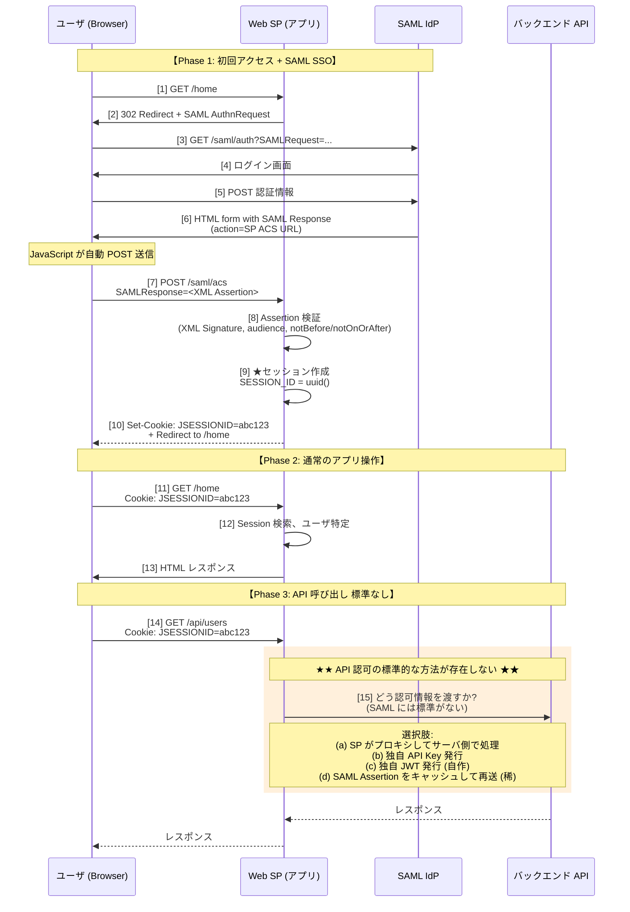
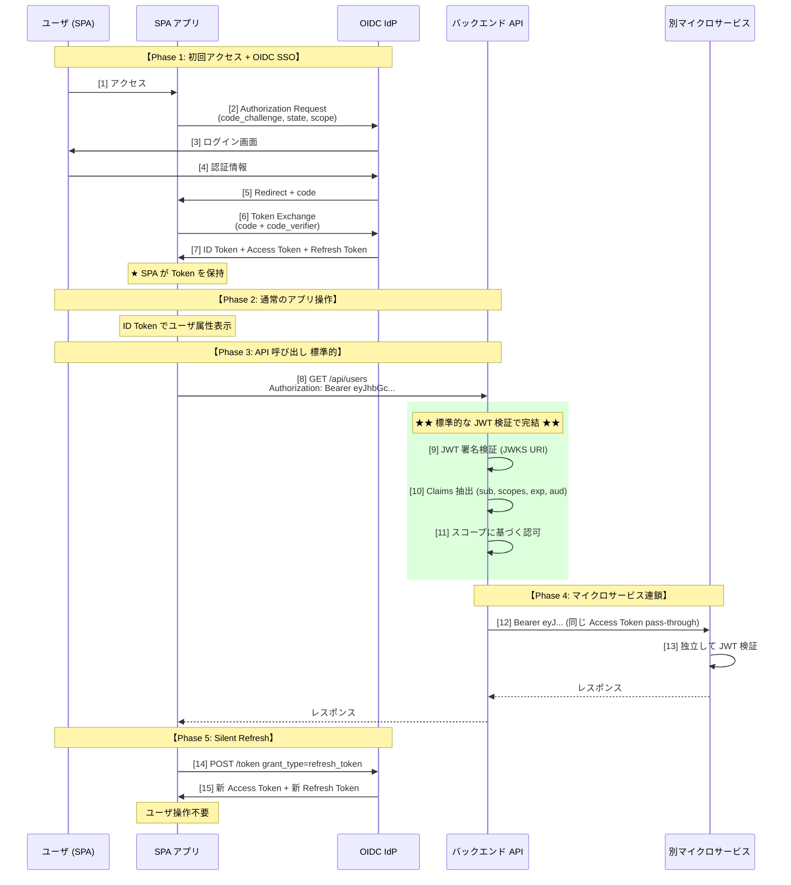
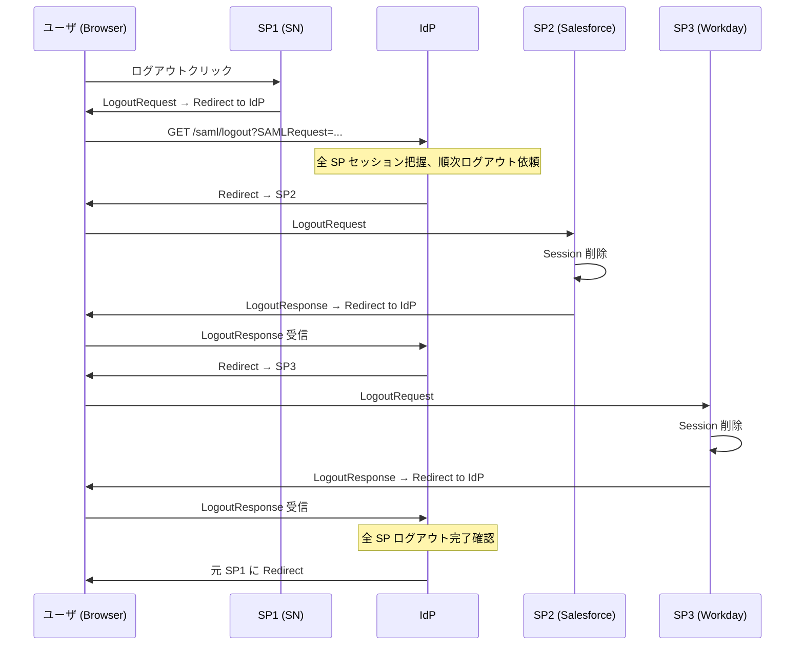
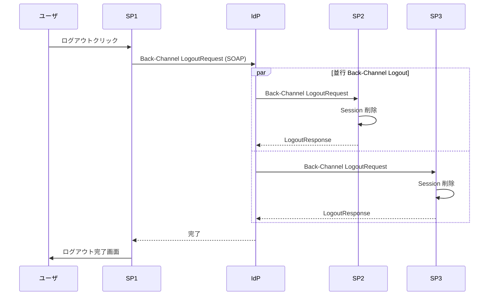
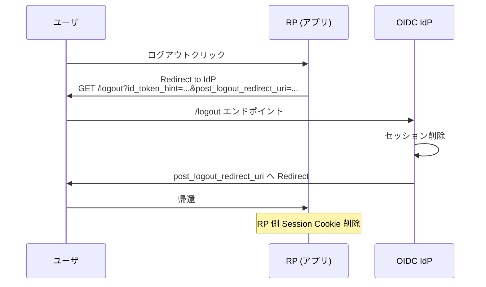
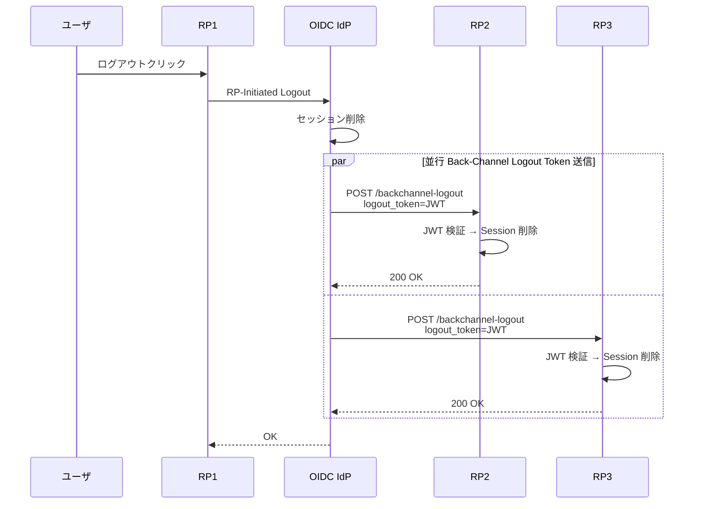
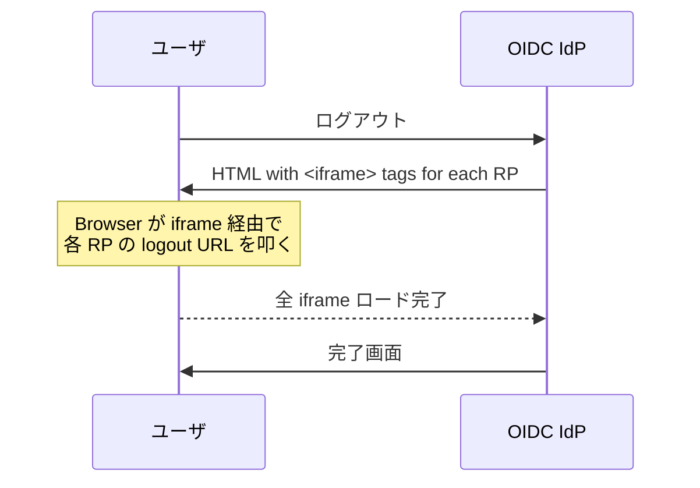

# SAML と OIDC の違い — 包括比較（設計哲学 / トークン / 暗号 / 脆弱性 / 適材適所）

> **作成日**: 2026-07-06
> **対象**: 顧客説明・社内技術教育・設計判断のリファレンス
> **元情報**: OASIS SAML 2.0 / OpenID Connect Core 1.0 / RFC 7515-7519 / RFC 8252 / OWASP / W3C XML DSig・XML Enc
> **本プロジェクトでの位置**: [ADR-023 ServiceNow SP 連携（SAML）](../adr/023-servicenow-sp-integration.md) / [ADR-030 最小 JWT クレーム設計（OIDC）](../adr/030-minimal-jwt-claim-design.md) / [ADR-057 CSRF 対策の責任分界](../adr/057-csrf-protection-responsibility-boundary.md) / [ADR-058 認証プラットフォーム代替 6 パターン](../adr/058-auth-platform-alternatives-comparison.md)

---

## 0. 本ドキュメントの目的

「SAML と OIDC の違いは XML と JSON の差だけか」「暗号化の位置・強度は違うか」「どちらがセキュアか」— 顧客レビュー・社内技術教育で頻出する質問に対する **裏どり済み・引用付きの技術リファレンス**。設計判断（本基盤は OIDC 主軸 + SAML は既存 SaaS 連携）の根拠として使う。

**要点先出し**：

1. **設計哲学が違う**：SAML = 認証+認可アサーション一体 / OIDC = OAuth 2.0（認可）+ 認証層 分離
2. **暗号強度は同等**（RSA-SHA256 = RS256、AES-GCM 共通）だが、**実装脆弱性の発生率は SAML が高い**（XSW 系）
3. **どちらがセキュア** = プロトコル自体は引き分け、実装難易度で OIDC 有利
4. **「認証と認可の非分離」が実装を難しくする 7 シナリオ**（属性肥大化 / マイクロサービス委譲不可 / セッション更新非対称 / スコープ制御不可 / 漏洩時 Blast Radius / SLO 複雑 / Broker パターン）を §1.5 で深掘り
5. **SAML 改ざんの攻撃経路 11 パターン**（TLS で半分、SP 側実装 XSW / IdP 侵害 Golden SAML / IdP-initiated CSRF の 3 系統が残る）を §7.4 で深掘り、防御可否 + 本基盤対応マッピング
6. **OIDC / OAuth 2.0 攻撃経路 22 パターン**（Chain of Custody 6 フェーズ、PKCE / Mix-Up / alg confusion / Refresh Token 盗難 4 経路深掘り、SAML との比較）を §7.5 で深掘り
7. **本基盤の方針** = OIDC 主軸（[ADR-030](../adr/030-minimal-jwt-claim-design.md)）+ SAML は既存 SaaS 連携時のみ（[ADR-023](../adr/023-servicenow-sp-integration.md)）

---

## 1. 設計哲学（最も本質的な違い）

| 観点 | SAML 2.0（OASIS、2005） | OIDC 1.0（OpenID Foundation、2014） |
|---|---|---|
| **設計思想** | **認証 + 認可アサーション + 属性 を 1 プロトコルで完結** | **OAuth 2.0（認可）を土台に、認証層（OIDC）を分離** |
| **土台プロトコル** | 独自 XML プロトコル（AuthnRequest / Response）| **OAuth 2.0（RFC 6749）+ JWT（RFC 7519）** |
| **認可との関係** | Assertion に「認証したこと」+「属性」+「認可情報」を全部載せる | 認証は **ID Token**、API 認可は **Access Token** に **分離** |
| **時代背景** | XML + SOAP + WS-* エコシステム | REST + JSON + モバイル + SPA |
| **標準化団体** | OASIS | OpenID Foundation（RFC 発行は IETF）|
| **バージョン** | 2.0 で事実上凍結（大きな更新なし）| OIDC は継続進化（FAPI 2.0 / CIBA / SIOP v2 等）|

**含意**：
- SAML は「1 発で全部渡す」→ ペイロード肥大化・SLO 実装複雑
- OIDC は「認証と認可を分離」→ マイクロサービス・多層委譲（Token Exchange）と相性 ✅

---

## 1.5 「分離されていない」の意味と、それが複雑さを生む 7 シナリオ

「SAML は認証と認可が分離されていない、だから実装が複雑」という言い方はよく聞くが、**正確には 3 つの視点で分けて理解する必要がある**。かつ、**"非分離" は複雑さの主因のうちの 1 つ**であって、最大要因は §7 で扱う XML DOM モデルの脆弱性である。以下、非分離が具体的にどんな摩擦を生むかを 7 シナリオで示す。

### 1.5.0 前提：「実装複雑さ」の 3 大要因

| 主因 | 寄与度 | 何を複雑にするか | 参照 |
|---|:---:|---|---|
| **A. XML DOM + 署名参照モデル**| 大 | XSW 攻撃の温床、ライブラリ実装バグ多発 | §7.1 |
| **B. 認証・認可・属性の非分離設計**| **中**（本節）| 属性肥大化・SLO 複雑・スコープ制御不可・委譲不可 | 本節 |
| **C. 20 年前のプロトコル前提**| 中 | モバイル/SPA/マイクロサービス/短寿命トークン想定なし | §3, §4 |

**質問される順に整理すれば**：
- 「XSW みたいな脆弱性が起きやすいのはなぜ？」→ **A**
- 「実装の設計自体がなぜ複雑？」→ **B**（本節）
- 「モバイルで使いにくいのはなぜ？」→ **C**

### 1.5.1 「分離されていない」の 3 次元

SAML の "非分離" は 1 つの話ではなく、以下の 3 次元がある。**この 3 つを一括りに「非分離」と呼ぶと議論が噛み合わなくなる**。

#### 次元 1：認証情報 + 属性 + 認可判定を **1 つのアサーション** に束ねる

SAML Assertion は 3 種類の Statement を含める設計:

```xml
<saml:Assertion>
  <saml:AuthnStatement>          <!-- 認証イベント：誰が、いつ、どう認証した -->
    <saml:AuthnContextClassRef>
      urn:oasis:names:tc:SAML:2.0:ac:classes:PasswordProtectedTransport
    </saml:AuthnContextClassRef>
  </saml:AuthnStatement>

  <saml:AttributeStatement>       <!-- 属性：メール、部署、ロール... -->
    <saml:Attribute Name="email">...</saml:Attribute>
    <saml:Attribute Name="dept">engineering</saml:Attribute>
    <saml:Attribute Name="roles">admin</saml:Attribute>
    <!-- ... 30-50 個 -->
  </saml:AttributeStatement>

  <saml:AuthzDecisionStatement>   <!-- 認可判定（実運用ではほぼ使わない）-->
    <saml:Action>read</saml:Action>
    <saml:Decision>Permit</saml:Decision>
  </saml:AuthzDecisionStatement>
</saml:Assertion>
```

OIDC ではこれが **4 つの手段に分離**:

| 手段 | 対応 SAML | 何を運ぶか | 寿命 |
|---|---|---|---|
| **ID Token（JWT）**| AuthnStatement | 認証イベント（`sub`, `iss`, `auth_time`, `amr`, `acr`）| 5-15 分 |
| **Access Token（JWT）**| AttributeStatement + AuthzDecisionStatement | API 呼び出し権限（`scope`, `aud`）| 15-60 分 |
| **Refresh Token**| ❌（SAML 対応物なし）| 新 Access Token 取得用 | 30 日 |
| **UserInfo Endpoint**| AttributeStatement の追加属性 | 追加 claim を別 API 呼び出しで取得 | on-demand |

#### 次元 2：短寿命 + 長寿命の **時間軸分離がない**

- **SAML**：Assertion は 1 種類、寿命 5-15 分。切れたら **再認証（IdP に戻る）**
- **OIDC**：Access Token 短命（15-60 分）+ Refresh Token 長命（30 日）+ **Rotation**（更新のたび新しい RT に置き換え）

#### 次元 3：発行者（Issuer）と **リソース保護者（Resource Server）の分離がない**

- **SAML**：IdP = 認証 + 属性 + 認可判定を全部発行、SP は「受け取ったら全部信じる」
- **OIDC**：**Identity Provider（ID Token 発行）** と **Authorization Server（Access Token 発行）** と **Resource Server（API 保護）** の役割が分離可能

### 1.5.2 具体的複雑さ — 7 シナリオ

#### シナリオ 1：属性肥大化 → SP は使わない属性も受け取り責任を持つ

**SAML**：属性を「全部」載せて送る設計。IdP 側で SP ごとにフィルタするポリシー設定が必要。

```xml
<!-- 経費精算 SP に部署情報だけ渡したいのに... -->
<saml:AttributeStatement>
  <saml:Attribute Name="email">...</saml:Attribute>
  <saml:Attribute Name="dept">engineering</saml:Attribute>  <!-- これだけ必要 -->
  <saml:Attribute Name="phone">...</saml:Attribute>          <!-- 不要 -->
  <saml:Attribute Name="address">...</saml:Attribute>        <!-- 不要 -->
  <saml:Attribute Name="birthday">...</saml:Attribute>       <!-- 不要 -->
  <saml:Attribute Name="social_id">...</saml:Attribute>      <!-- 不要（機微情報）-->
</saml:AttributeStatement>
```

**問題**：
- IdP 側で **SP 別ポリシーを維持**するコスト（漏れると個人情報流出）
- SP は使わない属性も **受け取り責任** を持つ（GDPR / APPI 論点）
- Assertion が **数 KB → 数十 KB** に肥大化しやすい

**OIDC の対称的な設計**：

```
GET /authorize?scope=openid email dept
```

RP が `scope` で必要な属性だけリクエスト、追加が必要になったら **UserInfo Endpoint** に別コールする。**"データ最小化" が構造的に実装しやすい**。

#### シナリオ 2：マイクロサービス間の委譲が不可能

現代的なアーキテクチャで頻出：

```
ブラウザ → 経費 API → 承認 API → 通知 API
```

各サービスにユーザーコンテキストを渡す必要がある。

**SAML**：Assertion は **SP 宛の一発物**。他サービスに渡すのは想定外の設計。渡してしまうと:
- 属性が全部見えてしまう（承認 API は通知に個人情報渡したくない）
- 有効期限が短すぎて途中で切れる
- **Delegation vs Impersonation の区別不可**（誰が誰の代理か表現できない）

**OIDC**：**OAuth 2.0 Token Exchange（RFC 8693）** で権限縮小しつつ委譲可能:

```json
// Access Token の act claim で「実行者は経費 API、対象は tanaka」を明示
{
  "sub": "tanaka",
  "aud": "notification-api",
  "scope": "send:notification",       // 通知送信だけに絞る
  "act": { "sub": "expense-api" }     // 代理実行の主体
}
```

**非分離のせいでできない**：SAML では認証情報と属性を「切り離して権限だけ渡す」ができない。

詳細は [token-exchange-spec-and-patterns.md](token-exchange-spec-and-patterns.md) 参照。

#### シナリオ 3：Long-lived セッションの更新が非対称

**SAML**：Assertion 有効期限が切れたら、SP は **認証イベントごとやり直し**（IdP にリダイレクト、パスワード or SSO Cookie 検証）。

- ユーザーは MFA を再度求められる可能性
- IdP 側の **認証コスト**（DB アクセス、ログイン画面表示）が発生
- モバイルアプリで **バックグラウンド更新** ができない（システムブラウザ起動が要る）

**OIDC**：**Refresh Token で認証イベントなしに Access Token 更新**。

```
POST /token
grant_type=refresh_token&
refresh_token=xxx
→ 新しい Access Token 発行
```

- ユーザー体感なし（サイレント更新）
- IdP 認証負荷ゼロ
- モバイルアプリでバックグラウンドで動く

**非分離のせい**：SAML では「認証イベント」と「アクセス権限」が同じアサーションに束ねられているため、**片方だけ更新** ができない。

#### シナリオ 4：スコープ / 権限縮小の不可能性

**SAML**：SP は Assertion の **全属性** を受け取る。SP 側で「今回は読み取りだけの権限に絞りたい」ができない。

**OIDC**：`scope` で最小権限化。同じユーザーが同じ IdP でログインしても、**呼び出し先に応じた最小権限 Access Token** を発行できる:

```
# 経費一覧を読むだけ
scope=read:expense

# 承認までする管理者操作
scope=read:expense write:approval
```

これは **Zero Trust 原則の "least privilege"** で必須の機能。SAML では実現できない。

#### シナリオ 5：漏洩時被害の広さ（Blast Radius）

**SAML**：Assertion 1 つに認証情報 + 属性 + 認可判定が全部入っている。漏洩すると:
- 認証済み扱いになる
- 全属性が漏れる（個人情報流出）
- 認可情報も漏れる（内部ロール構造の漏洩）

**OIDC**：**トークン別に被害範囲が分離**:
- Access Token 漏洩 → API 権限のみ、認証情報は別
- ID Token 漏洩 → 認証情報のみ、API 権限は別
- 有効期限が短い（15-60 分）ので被害限定的
- **Revocation（RFC 7009）** で個別無効化可能

**非分離のせい**：SAML では被害範囲を絞る設計手段がない。

#### シナリオ 6：Single Logout (SLO) の複雑さ

**SAML SLO**：認証イベントと SP セッションが Assertion で紐付いているため、**全 SP に個別に「ログアウトしろ」通知** が必要:

```
User → IdP: LogoutRequest
IdP → SP1: LogoutRequest (POST or Redirect)
SP1 → IdP: LogoutResponse
IdP → SP2: LogoutRequest
SP2 → IdP: LogoutResponse
...
IdP → User: LogoutResponse
```

**問題**：
- 1 つの SP が応答しないと全体が止まる
- SP 側の実装バグで動かないケース多発（**"SAML SLO は動かないもの" が業界常識**）
- **フロントチャネル**（ブラウザ経由）と **バックチャネル**（サーバ間）が混在して実装複雑

**OIDC**：認証と認可が分離されているため、ログアウト方式も明確に分離:

| 方式 | 対象 | 実装複雑度 |
|---|---|:---:|
| **RP-initiated Logout**| 明示的なログアウト | 低 |
| **Back-channel Logout**| サーバ間通知（バックエンドで解決）| 中 |
| **Front-channel Logout**| ブラウザ経由通知 | 中 |
| **Token Revocation**| Access Token 個別無効化 | 低 |

各方式が **独立して機能** する → 1 つが動かなくても他が動く。

#### シナリオ 7：マルチ IdP / Broker パターンの実装

本基盤は **Broker Keycloak + IdP Keycloak** の 2-tier 構成（[ADR-033](../adr/033-keycloak-2tier-broker-idp-architecture.md)）。

**SAML でこれをやると**：
- Broker IdP = 「顧客 IdP から Assertion 受け取り → 自分の Assertion 再発行」
- Assertion に認証情報と属性が全部乗っている → **属性を Broker で書き換える必要**
- 認証イベントの伝搬（IdP でどう認証したか）を **AuthnContext で二重表現**

**OIDC でこれをやる**：
- Broker = 「ID Token を受け取って自分の ID Token 発行」（認証イベント伝搬）
- 別途 Access Token を自分のスコープで発行
- **役割が明確に分離しているので設計が単純**

### 1.5.3 なぜ 20 年前は「非分離」で困らなかったか

SAML 2.0 は 2005 年策定。当時のユースケース:

- **1 ユーザーが 1 SP に SSO**（同時多接続なし）
- **Web ブラウザだけ**（モバイル / SPA なし）
- **IdP → SP の一発物**（マイクロサービス委譲なし）
- **セッションは Cookie で持てば十分**（Refresh 概念不要）

このシナリオでは **非分離が問題にならなかった**。むしろ「1 発で全部渡せる」のはシンプルだった。

現代のユースケースが出てきて「非分離の歪み」が顕在化:

| 現代要件 | 非分離だと... |
|---|---|
| モバイル アプリ | Refresh 相当がないのでバックグラウンド更新できない（シナリオ 3）|
| マイクロサービス | 委譲・権限縮小できない（シナリオ 2, 4）|
| Zero Trust（最小権限）| スコープ制御ないので実現できない（シナリオ 4）|
| Data Minimization（GDPR）| 属性全部投げの構造（シナリオ 1）|
| 短寿命トークン | 認証イベントと寿命が結合（シナリオ 3, 5）|
| Broker / 多層フェデ | 認証・属性・認可の書き換えが煩雑（シナリオ 7）|

### 1.5.4 §1.5 まとめ

| 問い | 回答 |
|---|---|
| **「非分離」が複雑さの原因か？**| 半分 Yes。7 シナリオで具体的な非効率・機能不足を生む |
| **「非分離」が複雑さの最大要因か？**| No。**XML DOM + 署名参照モデル**（§7.1 XSW の温床）が最大要因 |
| **なぜ 20 年前は問題にならなかった？**| 単一 SSO シナリオでは非分離で不足なし。モバイル / マイクロサービス / Zero Trust の普及で歪みが顕在化 |
| **OIDC の分離設計の便益は？**| ID Token / Access Token / Refresh Token の 3 分離で **モダンなユースケース全てが可能** |
| **本基盤の設計判断は？**| OIDC 主軸（分離のメリット享受）、SAML は既存 SaaS 連携時のみ（ServiceNow SP、[ADR-023](../adr/023-servicenow-sp-integration.md)）|

**顧客説明で使える一言**：

> **「SAML の複雑さは "XML DOM の署名参照モデル" と "認証・認可・属性の一体設計" の 2 つ。前者は XSW 脆弱性の温床、後者は現代のマイクロサービス / モバイル / Zero Trust ユースケースでの機能不足を招く。OIDC はこの両方を解消した設計。」**

---

## 2. トークン形式と構造の比較

### 2.1 サンプル比較

#### SAML Assertion（XML、簡略化）

```xml
<saml:Assertion xmlns:saml="urn:oasis:names:tc:SAML:2.0:assertion"
                ID="_a75adf55-01d7-40cc-929f-dbd8372ebdfc"
                IssueInstant="2026-07-06T10:00:00Z" Version="2.0">
  <saml:Issuer>https://basis.example.com/saml/idp</saml:Issuer>
  <ds:Signature xmlns:ds="http://www.w3.org/2000/09/xmldsig#">
    <ds:SignedInfo>
      <ds:CanonicalizationMethod Algorithm="http://www.w3.org/2001/10/xml-exc-c14n#"/>
      <ds:SignatureMethod Algorithm="http://www.w3.org/2001/04/xmldsig-more#rsa-sha256"/>
      <ds:Reference URI="#_a75adf55-01d7-40cc-929f-dbd8372ebdfc">
        <ds:Transforms>...</ds:Transforms>
        <ds:DigestMethod Algorithm="http://www.w3.org/2001/04/xmlenc#sha256"/>
        <ds:DigestValue>abc123==</ds:DigestValue>
      </ds:Reference>
    </ds:SignedInfo>
    <ds:SignatureValue>base64-encoded-signature</ds:SignatureValue>
    <ds:KeyInfo>...</ds:KeyInfo>
  </ds:Signature>
  <saml:Subject>
    <saml:NameID Format="urn:oasis:names:tc:SAML:1.1:nameid-format:emailAddress">
      tanaka@acme.example.com
    </saml:NameID>
    <saml:SubjectConfirmation Method="urn:oasis:names:tc:SAML:2.0:cm:bearer">
      <saml:SubjectConfirmationData NotOnOrAfter="2026-07-06T10:05:00Z"
                                     Recipient="https://sp.example.com/acs"/>
    </saml:SubjectConfirmation>
  </saml:Subject>
  <saml:Conditions NotBefore="2026-07-06T09:55:00Z" NotOnOrAfter="2026-07-06T10:05:00Z">
    <saml:AudienceRestriction><saml:Audience>https://sp.example.com</saml:Audience></saml:AudienceRestriction>
  </saml:Conditions>
  <saml:AuthnStatement AuthnInstant="2026-07-06T10:00:00Z">
    <saml:AuthnContext>
      <saml:AuthnContextClassRef>urn:oasis:names:tc:SAML:2.0:ac:classes:PasswordProtectedTransport</saml:AuthnContextClassRef>
    </saml:AuthnContext>
  </saml:AuthnStatement>
  <saml:AttributeStatement>
    <saml:Attribute Name="email"><saml:AttributeValue>tanaka@acme.example.com</saml:AttributeValue></saml:Attribute>
    <saml:Attribute Name="dept"><saml:AttributeValue>engineering</saml:AttributeValue></saml:Attribute>
  </saml:AttributeStatement>
</saml:Assertion>
```

**サイズ**：この例で約 2 KB。実運用（属性 30-50 個）で **4-8 KB**。

#### OIDC ID Token（JWT、`header.payload.signature`）

```
eyJhbGciOiJSUzI1NiIsImtpZCI6InAxIn0.
eyJpc3MiOiJodHRwczovL2Jhc2lzLmV4YW1wbGUuY29tIiwic3ViIjoiYWJjLTEyMy1kZWYiLCJhdWQiOiJleHBlbnNlLXNwYSIsImV4cCI6MTc1NDQ3NjIwMCwiaWF0IjoxNzU0NDcyNjAwLCJlbWFpbCI6InRhbmFrYUBhY21lLmV4YW1wbGUuY29tIiwiYW1yIjpbInB3ZCJdLCJhY3IiOiIxIn0.
base64url-encoded-signature
```

デコードすると:

```json
// header
{
  "alg": "RS256",
  "kid": "p1"
}
// payload
{
  "iss": "https://basis.example.com",
  "sub": "abc-123-def",
  "aud": "expense-spa",
  "exp": 1754476200,
  "iat": 1754472600,
  "email": "tanaka@acme.example.com",
  "amr": ["pwd"],
  "acr": "1"
}
```

**サイズ**：この例で約 400 B。実運用でも通常 **300 B〜1 KB**。

### 2.2 形式・構造の比較まとめ

| 観点 | SAML Assertion | JWT（ID Token / Access Token）|
|---|---|---|
| 形式 | **XML**（W3C 名前空間、階層構造）| **JSON**（Base64URL エンコード 3 パート `.` 区切り）|
| サイズ | **4-8 KB**（XML 冗長 + 名前空間）| **300 B〜1 KB**（コンパクト、Cookie / URL に収まる）|
| パーサ | XML Parser 必須（重量、脆弱性の温床）| JSON Parser + Base64URL（軽量、標準ライブラリ）|
| 属性表現 | `<AttributeStatement>` 階層構造 | フラット JSON claims |
| 認証コンテキスト | `<AuthnContextClassRef>` （URI ベース）| `acr`（文字列 or `"0"`/`"1"`）+ `amr`（`["pwd","otp"]` 配列）|
| 検証ライブラリ | OpenSAML / Apache Santuario 等（**複雑・実装バグ多発**）| JOSE（`jose`, `jsonwebtoken`, Nimbus JOSE 等、**シンプル**）|
| ID の一意性 | `<Assertion ID="…">`（XML Signature の参照子）| `jti` claim（optional、revocation 用）|
| 送信手段 | HTTP POST（Form）/ Redirect（Base64 + URL）| HTTP ヘッダ `Authorization: Bearer <token>` |

---

## 3. プロトコル・バインディング

| 観点 | SAML | OIDC |
|---|---|---|
| バインディング（トランスポート）| **HTTP-POST**（Form）/ **HTTP-Redirect**（URL パラメータ）/ **HTTP-Artifact**（サーバ間解決）/ **SOAP** | **HTTPS のみ**（OAuth 2.0 標準）|
| ベースプロトコル | 独自 `<AuthnRequest>` `<Response>` XML | **OAuth 2.0（RFC 6749）**（Authorization Code / PKCE / Client Credentials / Implicit 等）|
| モバイル対応 | ❌ 標準では想定外（AppAuth 相当なし）| ✅ **RFC 8252（OAuth for Native Apps）+ PKCE（RFC 7636）**で完全対応 |
| SPA 対応 | ⚠ 難しい（XML パースコスト + POST バインディングで JS 側処理困難）| ✅ Authorization Code + PKCE + `fetch` API |
| メタデータ配布 | 複雑な XML metadata（1〜10 KB）| **`/.well-known/openid-configuration` JSON**（シンプル、キャッシュしやすい）|
| Discovery 標準 | SAML Metadata IdP Discovery Profile | **OIDC Discovery（RFC 8414）+ Dynamic Client Registration（RFC 7591）** |
| クライアントタイプ | SP（Service Provider）1 種 | **Confidential Client / Public Client** の区別（PKCE 適用可否）|

### 3.1 SAML バインディングの実装複雑さ（実務落とし穴）

- **HTTP-POST**：ブラウザ Form 経由で SAMLResponse 送信 → SPA で JS が拾えず、フル HTML ページで受ける必要
- **HTTP-Redirect**：URL パラメータ制限（〜2 KB）でペイロード肥大時に破綻、Base64 + gzip 必須
- **HTTP-Artifact**：追加のサーバ間解決コール（IdP → Artifact Resolution Service）が必要、実装ほぼ死滅
- **SOAP**：ほぼ死滅

**含意**：**モダン SPA / モバイル で SAML を使うのは実装摩擦が大きい**。既存 SaaS 連携がなければ選ばない。

---

## 4. セッション・ログアウト・トークン寿命

| 観点 | SAML | OIDC |
|---|---|---|
| SSO 起点 | **SP-initiated** / **IdP-initiated**（後者は CSRF リスク、[ADR-057 §E.2](../adr/057-csrf-protection-responsibility-boundary.md) 参照）| 原則 **SP-initiated（RP-initiated）**、IdP-initiated は非推奨 |
| SLO（Single Logout）| ✅ SAML SLO Profile（**実装複雑・IdP 依存**、事実上機能しないケース多発）| ✅ **RP-initiated Logout（OIDC RP-Initiated Logout 1.0）** + **Back-channel Logout 1.0** + **Front-channel Logout 1.0** の 3 方式明確化 |
| セッション寿命 | Assertion `NotOnOrAfter`（通常 5-15 分）+ SP セッション | **ID Token 5-15 分** + **Access Token 15-60 分** + **Refresh Token 30 日**（rotation 前提）|
| Token Revocation | ❌ 標準にない | ✅ **RFC 7009 Token Revocation** |
| Refresh Token 相当 | ❌ 標準にない（SP 独自セッション延長）| ✅ **Refresh Token + Rotation + Reuse Detection**（OAuth 2.1 で標準化進行）|
| Introspection | ❌ 標準にない | ✅ **RFC 7662 Token Introspection**（Access Token の有効性検証）|

**含意**：**モダンなセッション管理（rotation / revocation / back-channel logout）は OIDC が明確に有利**。SAML の SLO はほとんどのプロダクトで「動かない or 動くが不安定」。

---

## 5. 暗号化・署名 — 位置と強度（本ドキュメントの中核質問）

### 5.1 署名（Signature）

| 観点 | SAML: XML Signature（XML DSig、W3C）| JWT: JWS（RFC 7515）|
|---|---|---|
| **対象範囲（署名の粒度）**| **要素単位**（`<Assertion>` のみ / `<Response>` 全体 / 両方 の 3 パターン）| **トークン全体（header + payload）**、粒度なし |
| 標準策定 | W3C XML Signature Syntax and Processing（2002 / Second Edition 2008）| **RFC 7515（2015）** |
| Canonicalization | **XML C14N 必須**（`http://www.w3.org/2001/10/xml-exc-c14n#`）| **なし**（バイト列そのまま）|
| 対応アルゴリズム | RSA-SHA256（推奨）/ **RSA-SHA1（非推奨だが実装現役）**/ ECDSA-SHA256 | **RS256 / ES256 / EdDSA / PS256**（推奨）/ HS256（対称鍵）|
| アルゴリズム指定 | XML 要素 `<SignatureMethod Algorithm="…">` | JWT header `alg` claim |
| 鍵参照 | `<KeyInfo>`（証明書 or KeyName 指定）| `kid`（Key ID）+ JWKS URL |
| 署名検証実装 | **複雑**（Reference 解決 + Transform 適用 + Canonicalize + Digest 検証 + Signature 検証）| **シンプル**（Base64URL デコード + `alg` に応じた署名検証だけ）|

**署名"強度"** は同じアルゴリズムなら **同等**（RSA-SHA256 = RS256、ECDSA-SHA256 = ES256）。**問題は「検証実装の複雑さ」**で、SAML は XSW 攻撃の温床（後述 §7.1）。

### 5.2 暗号化（Encryption）

| 観点 | SAML: XML Encryption（W3C）| JWT: JWE（RFC 7516）|
|---|---|---|
| **対象範囲（暗号の粒度）**| **属性単位で暗号可能**（`<EncryptedAttribute>`）または **Assertion 全体**（`<EncryptedAssertion>`）| **トークン全体**（5 パート `header.encKey.iv.ciphertext.tag`）、粒度なし |
| 標準策定 | W3C XML Encryption（2002 / 2013 Update）| **RFC 7516（2015）** |
| 対応アルゴリズム | AES-CBC / **AES-GCM**（推奨）+ RSA-OAEP キーラップ | **AES-GCM + RSA-OAEP**（推奨）/ ECDH-ES / A128KW |
| 暗号化 vs 署名の順序 | 署名 → 暗号化（Sign then Encrypt が推奨）| 同上 |
| 実運用での採用率 | **ほぼ使われない**（TLS で十分と判断）| **ほぼ使われない**（同上、極一部のハイセキュ用途で JWE 化）|

**暗号化の"位置"の違い**：

- **SAML**：属性単位で暗号可能 → 「A 属性は SP1 に、B 属性は SP2 に」のような**部分共有**が可能（理論上）
- **JWT**：トークン全体だけ → 「一部の claim を暗号」はできない、が実運用でそれが要件になることはほぼない

**「XML Encryption が強い」「JWE が弱い」ということはない**（同じ AES-GCM）。**トークン全体を暗号する意味は TLS 使う限りほぼゼロ**（TLS 終端後の RP メモリ / ログにトークンが平文で残るリスクは JWE 化しても変わらない）。

### 5.3 実運用の輸送層セキュリティ（TLS）

- **SAML も OIDC も TLS（HTTPS）前提**で運用
- トークン自体の暗号化（XML Encryption / JWE）は **TLS 終端後の保護**なので、**実質的な差はほとんどない**
- **強度差は署名 / 暗号アルゴリズム同等の場合ゼロ**、違うのは「実装ライブラリの成熟度と脆弱性発生率」

---

## 6. メッセージ全体構造 — 暗号化・署名の適用位置

### 6.1 SAML Response のレイヤ構造

```
┌──────────────────────────────────────────────┐
│ HTTP-POST（Form 経由）or Redirect             │
│  ┌────────────────────────────────────────┐  │
│  │ TLS（HTTPS）暗号化                        │  │  ← 輸送層保護
│  │  ┌──────────────────────────────────┐  │  │
│  │  │ <samlp:Response> XML              │  │  │
│  │  │  ├── <ds:Signature> (optional)   │  │  │  ← Response 全体署名
│  │  │  │                                 │  │  │
│  │  │  └── <saml:Assertion>            │  │  │
│  │  │       ├── <ds:Signature>         │  │  │  ← Assertion 署名（推奨）
│  │  │       ├── <saml:AttributeStatement>  │  │
│  │  │       │    └── <saml:Attribute>  │  │  │
│  │  │       │         └── <saml:AttributeValue>  │
│  │  │       │              or <xenc:EncryptedData>  │  ← 属性単位で暗号（オプション）
│  │  │       └── ...                     │  │  │
│  │  │  or <saml:EncryptedAssertion>    │  │  │  ← Assertion 全体暗号（オプション）
│  │  └──────────────────────────────────┘  │  │
│  └────────────────────────────────────────┘  │
└──────────────────────────────────────────────┘
```

**署名適用箇所**：`<samlp:Response>` / `<saml:Assertion>` / **両方** の 3 パターン
**暗号適用箇所**：`<saml:Assertion>` 全体 / `<saml:Attribute>` 単位 の 2 パターン

### 6.2 OIDC JWT のレイヤ構造

```
┌──────────────────────────────────────────────┐
│ HTTP Header: Authorization: Bearer <JWT>      │
│  ┌────────────────────────────────────────┐  │
│  │ TLS（HTTPS）暗号化                        │  │  ← 輸送層保護
│  │  ┌──────────────────────────────────┐  │  │
│  │  │ JWT = header.payload.signature   │  │  │  ← 署名（JWS、標準）
│  │  │                                    │  │  │
│  │  │ or JWE = header.encKey.iv         │  │  │
│  │  │       .ciphertext.tag             │  │  │  ← 暗号（JWE、オプション、ほぼ未使用）
│  │  │                                    │  │  │
│  │  │ or Nested JWT = JWE(JWS(payload)) │  │  │  ← 署名 → 暗号の入れ子（極稀）
│  │  └──────────────────────────────────┘  │  │
│  └────────────────────────────────────────┘  │
└──────────────────────────────────────────────┘
```

**署名適用箇所**：**トークン全体一択**（粒度なし）
**暗号適用箇所**：**トークン全体一択**（実運用ではほぼ使われない）

### 6.3 実務上の意味

- **粒度**：SAML は細かい / OIDC は粗い、が、細かい粒度が必要なユースケースは 20 年間ほぼ出てこなかった
- **強度**：AES-GCM / RSA-OAEP / RSA-SHA256 で並ぶなら **同等**
- **差**：**実装の複雑さ**（SAML XML DSig は歴史的にバグの温床）

---

## 7. 有名脆弱性（実装のセキュリティに直結する本質的な差）

### 7.1 SAML 側の代表的脆弱性

| 脆弱性 | 概要 | インパクト | 発生頻度 |
|---|---|:---:|:---:|
| **XML Signature Wrapping (XSW)**| 攻撃者が偽 Assertion を正規 Assertion の兄弟要素に注入、パーサが偽 Assertion を読むが署名検証器は正規側を検証 → 認証バイパス | 極大（認証迂回）| **高**（Duo Security 2012、GitHub 2020、Cisco DUO 2023、大量事例） |
| **XML External Entity (XXE)** | DTD 経由でファイル読取 / SSRF / DoS | 中〜大 | 中（レガシー XML パーサで頻発）|
| **SAML Response Injection**| `<Response>` に複数 `<Assertion>` を注入、SP が誤って攻撃者 Assertion を採用 | 大 | 中 |
| **Golden SAML**| IdP の署名鍵を盗んで**任意の Assertion を発行**（オンプレ ADFS で SolarWinds 事件、2020） | 極大 | 稀だが影響甚大 |
| **Cert Faking**| `<KeyInfo>` の証明書を差し替え、正規 IdP になりすまし | 大 | 稀 |
| **Timing / Replay**| Assertion に `NotOnOrAfter` / `Recipient` チェックがゆるい実装で再送信通る | 中 | 中 |

**XSW の実演イメージ**：

```xml
<!-- 攻撃者が挿入する偽 Assertion -->
<saml:Response>
  <saml:Assertion ID="attacker">
    <saml:Subject><saml:NameID>attacker@evil.com</saml:NameID></saml:Subject>
  </saml:Assertion>
  <!-- 正規 Assertion（署名済）-->
  <saml:Assertion ID="genuine" ds:Signature="..." >
    <saml:Subject><saml:NameID>victim@corp.com</saml:NameID></saml:Subject>
  </saml:Assertion>
</saml:Response>
```

- **署名検証器**：`genuine` Assertion の署名を検証、OK
- **アプリロジック**：`response.assertion[0]`（先頭）= `attacker` を採用 → **なりすまし成立**

**根本原因**：XML DOM + 参照子 (`URI="#…"`) を使う設計の宿命。ライブラリ実装が難しい。

### 7.2 JWT 側の代表的脆弱性

| 脆弱性 | 概要 | 対策 | 発生頻度 |
|---|---|---|:---:|
| **`alg: none`**| 署名なしを許容する実装がある（初期 `jsonwebtoken` 等）| ライブラリ最新化、`none` を明示拒否 | 中（2015-2016 頻発、現在は減少）|
| **`alg` 混乱（RS256 → HS256）**| 攻撃者が `alg=HS256` に書換、公開鍵を HMAC 鍵として使わせる | ライブラリ最新化、`alg` ホワイトリスト | 中 |
| **`jku` / `x5u` SSRF**| 攻撃者制御の鍵配布 URL を注入 | JWKS ホワイトリスト検証、`jku`/`x5u` 無効化 | 稀 |
| **鍵ロールオーバー漏れ**| 廃止鍵で署名した token が通る | `kid` 検証 + JWKS 定期リロード | 中 |
| **未検証 `exp` / `nbf`**| 有効期限チェックを忘れる実装 | ライブラリの標準機能を有効化 | 稀 |
| **弱いシークレット（HS256）**| HMAC の共有鍵が短い / 予測可能 | 32B 以上、`crypto.randomBytes` 使用 | 中 |
| **claim injection**| 攻撃者が payload を操作（署名なしで通る場合）| 上記の署名検証必須化 | 稀 |

**特徴**：JWT の脆弱性は **単純**（ライブラリの alg 検証を厳密にすれば大半解決）。SAML の XSW のような**構造的脆弱性**ではない。

### 7.3 脆弱性発生率の比較（総合評価）

| 観点 | SAML | JWT |
|---|:---:|:---:|
| プロトコル理論の堅牢性 | 引き分け | 引き分け |
| **実装難易度** | **難しい**（XML DSig の複雑さ）| **易しい**（Base64URL + JSON パース）|
| **CVE 発生数（2020-2025）**| 多い | 少ない |
| **ライブラリ成熟度** | 一部で古いバグ現役 | 主要ライブラリで概ね対策済 |
| **脆弱性発見時の直しやすさ**| 難しい（XML DSig 全体の設計問題）| 易しい（`alg` チェック追加等）|

**業界コンセンサス**：**「モダンなライブラリで正しく使うなら OIDC の方が実装ミス率が低い」**（OWASP / Auth0 / Okta / Microsoft）。

---

### 7.4 SAML 改ざんの攻撃経路（Attack Path）と防御

§7.1 で扱った XSW / Golden SAML 等は「**改ざんされた Response を受信した後の挙動**」の話だった。本節では「**そもそもどこで改ざんされるか**」= 攻撃者がどこで介入するかを、SAML Response の **Chain of Custody（受け渡しの連鎖）** に沿って整理する。

#### 7.4.1 なぜ「経路」を分けて理解する必要があるか

「TLS 使ってるから安全」「IdP 側で防げる」「SP 側で防げる」— この 3 つの主張はよく聞くが、経路によって当てはまる / 当てはまらないが異なる:

- 「TLS 使ってるから安全」→ **XSW は TLS の外で発生**（気づかない）
- 「IdP 側で防げる」→ **Browser 内で改ざんされる場合は防げない**
- 「SP 側で防げる」→ **Golden SAML は SP からは検出不可能**

**経路を理解しないと防御戦略の穴が見えない**。

#### 7.4.2 SAML Response の Chain of Custody（受け渡しの連鎖）

SAML Response は **発行 → 転送 → Browser 経由 → 転送 → 受信** の 5 フェーズで運ばれる。各フェーズに固有の攻撃点がある。

```
【フェーズ A: 発行元】     【B: 転送 1】       【C: Browser】       【D: 転送 2】       【E: 受信側】
     IdP                   HTTPS               Browser             HTTPS               SP
      │                     │                    │                   │                    │
      │ Response 生成        │ IdP→Browser        │ HTML Form 保持    │ Browser→SP         │ Parser + Sig 検証
      │ + 署名               │ 転送               │ auto-submit       │ 転送               │ + Assertion 消費
      │                     │                    │                   │                    │
      ▼                     ▼                    ▼                   ▼                    ▼
   P3 Golden SAML         P1 MITM              P5 Browser拡張     P7 MITM              P8 XSW 攻撃
   P4 メタデータ改ざん     P2 Referer 漏洩       P6 Phishing 差替   (P1 と同じ)          P9 Replay 攻撃
                                                P10 IdP-init CSRF                        P11 ログ漏洩
```

#### 7.4.3 攻撃経路 11 パターン一覧

| # | 経路 | フェーズ | 攻撃概要 | 検知難度 | 本基盤で防げるか |
|---|---|:---:|---|:---:|:---:|
| **P1** | MITM（IdP ↔ Browser）| B | TLS 破り / 悪意 CA / DNS 汚染で Response 傍受・改ざん | 高 | ✅ TLS 1.3 + HSTS + Cert Transparency |
| **P2** | HTTP-Redirect binding の URL 漏洩 | B | URL パラメータに Response が入る → Referer / ブラウザ履歴 / プロキシログに残る | 中 | ✅ **HTTP-POST binding 使用**（[ADR-023](../adr/023-servicenow-sp-integration.md)）|
| **P3** | **Golden SAML（IdP 侵害）**| A | IdP 署名鍵を盗んで**任意の Response を偽造**（SolarWinds 事件、2020）| **極高** | ⚠ **完全防御不可**（HSM + 鍵ローテ + 検知で影響最小化）|
| **P4** | メタデータ改ざん | A | SP が信頼する IdP metadata の証明書を攻撃者のものに置換 → 攻撃者 IdP のなりすまし | 高 | ✅ Signed Metadata + out-of-band 検証 |
| **P5** | Browser 拡張 / XSS で DOM 改ざん | C | 悪意ブラウザ拡張 or XSS が Auto-submit フォームの `SAMLResponse` 値を書き換え | 高 | ⚠ 部分防御（CSP + XSS 対策、拡張は本質的に防げない）|
| **P6** | Phishing サイトでの Response 差替 | C | 攻撃者が「偽の SP」を作り、被害者から受け取った Response を本物 SP に横流し | 中 | ✅ **Audience Restriction + Recipient 検証** |
| **P7** | MITM（Browser ↔ SP）| D | P1 と同じ、SP 側の TLS 終端で発生 | 高 | ✅ TLS 1.3 + HSTS + CT |
| **P8** | **XSW（XML Signature Wrapping）**| E | 攻撃者が正規 Response をどこかで入手 → 兄弟要素に偽 Assertion 注入 → SP パーサと署名検証器で参照食い違い | **極高** | ⚠ **ライブラリ次第**（詳細 §7.4.4A）|
| **P9** | Replay 攻撃 | E | 有効期限内の Assertion を再送信 | 中 | ✅ `NotOnOrAfter`（5-15 分）+ **Replay Cache**（Assertion ID 記録）|
| **P10** | **IdP-initiated CSRF**| C | 攻撃者が自身の SAML Response を被害者ブラウザに投げ込ませる → 被害者が攻撃者アカウントで SP にログインさせられる | 中 | ✅ **SP-initiated 必須化**（[ADR-023 §J](../adr/023-servicenow-sp-integration.md) + [ADR-057 §E.2](../adr/057-csrf-protection-responsibility-boundary.md)）|
| **P11** | ログ漏洩（事後）| — | ALB access log / CloudWatch / SP debug ログに SAMLResponse 平文残存 | 低 | ⚠ **Log scrubbing 要対応**（現状 TBD）|

#### 7.4.4 特に重要な 3 経路の深掘り

##### A. XSW 攻撃（P8）— なぜ XSW は「経路」ではなく「入手後の悪用」か

XSW 自体は「正規 Response を入手した後の改ざん技法」なので、**入手経路は P1-P7 のいずれか**。よくあるパターン:

```
1. 攻撃者が自分のアカウントで IdP に正規ログイン → 自分宛の Response を入手
2. 入手した Response の Assertion を兄弟要素に注入し、Subject を被害者に書換
3. 正規の署名は残したまま、SP に POST
4. SP パーサが偽 Assertion を先に読む → 被害者としてログイン成立
```

**なぜ TLS で防げないか**：TLS は転送を保護するだけ。攻撃者は**正規手段で自分宛の Response を入手**し、**TLS 終端後にペイロードを改ざん**して自分の SP セッションを開始する。**TLS の外側での攻撃**。

**防御はライブラリ次第**：

| 対策 | 説明 |
|---|---|
| ✅ **Strict Schema Validation**| `<Response>` に `<Assertion>` は 1 つだけ許容 |
| ✅ **Only-first-signed 選択**| 署名済み Assertion のうち最初のものだけ採用 |
| ✅ **XML Canonical Form 比較**| 署名検証で使った DOM ノードと、アプリロジックが読む DOM ノードの ID / XPath 一致確認 |
| ⚠ 古いライブラリ現役脆弱性 | Java OpenSAML < 3.0、python3-saml < 1.10、ruby-saml < 1.11、Node.js `saml2-js` 一部バージョン等 |

**本基盤の防御**：**Keycloak の SAML 実装は 2018 年以降 XSW 対策済**（CVE-2018-14657 修正）。ServiceNow 連携（[ADR-023](../adr/023-servicenow-sp-integration.md)）では **Keycloak が IdP 側**なので、SP 側 XSW は ServiceNow の実装依存。ServiceNow SAML 実装は公式に XSW 対策済。

##### B. Golden SAML（P3）— 唯一「完全防御不可」な経路

**攻撃**：IdP の SAML 署名鍵を盗まれると、攻撃者は **任意の Assertion を任意の Subject で発行可能**。SP からは正規と見分けられない（署名検証は通る）。

**発生事例**：
- **SolarWinds 事件（2020）**：Nobelium グループが ADFS の署名鍵を盗み、任意ユーザーで Microsoft 365 にログイン
- CISA [Alert AA20-352A](https://www.cisa.gov/news-events/cybersecurity-advisories/aa20-352a) で警告

**なぜ SP 側で防げないか**：SP は「正規 IdP からの署名済み Response を信頼する」設計。**署名鍵が本物である以上、SP から見て偽装との区別は不可能**。

**部分防御（多層防御 = Defense in Depth）**：

| 対策 | 効果 | 本基盤の対応 |
|---|---|---|
| **HSM / CloudHSM で鍵保管**| 鍵の物理的窃取を困難化 | [ADR-045](../adr/045-cryptographic-key-management-strategy.md) で KMS L2 CMK + CloudHSM は Phase 2 |
| **鍵ローテーション**（半年-1 年）| 漏洩後の悪用期間を制限 | [ADR-045](../adr/045-cryptographic-key-management-strategy.md) で年 1 回自動ローテ |
| **署名操作の監査ログ + 異常検知**| 通常時 vs 異常時（謎の Subject で大量発行）を検知 | [ADR-035 ITDR](../adr/035-identity-threat-detection-response.md) で対応 |
| **KMS + STS で鍵の直接アクセス禁止**| API 経由の署名依頼のみ許可、鍵は取り出し不可 | Keycloak は KMS backend で対応可 |
| **Zero Trust + Adaptive Auth（SP 側）**| SAML 認証だけでなく、IP / デバイス / 行動異常でリスク判定 | [ADR-034 Adaptive Auth](../adr/034-adaptive-authentication.md) で対応 |

**本基盤の位置づけ**：Keycloak が **Broker IdP** として SAML Response を再発行する場合（ServiceNow 連携）、**Keycloak 署名鍵の漏洩は Golden SAML 相当のリスク**。ADR-045 + ADR-034 + ADR-035 の 3 段構えで対処。**完全防御は理論上不可能だが、"検知 + 影響最小化" は可能**。

##### C. IdP-initiated CSRF（P10）— 本基盤で最重要の SAML 経路

**攻撃シナリオ**：

```
1. 攻撃者が自分のアカウントで IdP にログイン、正規 SAML Response を入手
2. 攻撃者は悪意サイト（www.evil.com）を用意
3. 被害者がそのサイトを訪問
4. サイト内の hidden form が「攻撃者の Response」を被害者ブラウザから SP に POST
5. SP は正規署名を検証、Assertion 通る → 被害者ブラウザが「攻撃者アカウントで」ログイン状態
6. 被害者は自分のアカウントだと思って作業 → 攻撃者アカウントに情報流出（機密文書アップロードなど）
```

**なぜ CSRF なのか**：被害者ブラウザが「意図せず」認証 Request を投げるため。

**防御**：**SP-initiated 必須化 + `InResponseTo` 検証**（Response が「特定の Request への応答」であることを検証）。IdP-initiated では `InResponseTo` が使えないので **`RelayState` に nonce を入れ、Cookie と一致確認する**代替策になる。

**本基盤の防御**：[ADR-023 §J](../adr/023-servicenow-sp-integration.md) と [ADR-057 §E.2](../adr/057-csrf-protection-responsibility-boundary.md) で **SP-initiated 推奨 + IdP-initiated は原則不許可** を確定済。

#### 7.4.5 「防げる / 防げない」総まとめ

| 経路 | 完全防御可能か | 本基盤の対応 |
|---|:---:|---|
| P1 MITM（TLS 中）| ✅ | TLS 1.3 + HSTS + Cert Transparency |
| P2 HTTP-Redirect URL 漏洩 | ✅ | HTTP-POST binding 使用 |
| **P3 Golden SAML**| ❌ **完全防御不可** | HSM + 鍵ローテ + 監査 + Adaptive Auth（多層防御）|
| P4 メタデータ改ざん | ✅ | Signed Metadata + out-of-band |
| P5 Browser 拡張 / XSS | ⚠ 部分 | CSP + XSS 対策（拡張は本質的に防げない、Zero Trust で補完）|
| P6 Phishing 差替 | ✅ | Audience Restriction + Recipient 検証 |
| P7 MITM（TLS 中）| ✅ | TLS 1.3 + HSTS |
| **P8 XSW**| ⚠ ライブラリ次第 | Keycloak / ServiceNow は対策済 |
| P9 Replay | ✅ | NotOnOrAfter 短縮 + Replay Cache |
| P10 IdP-initiated CSRF | ✅ | **SP-initiated 必須化**（ADR-023 §J + ADR-057 §E.2）|
| P11 ログ漏洩 | ⚠ 要対応 | **Log scrubbing 実装が要 TBD** |

**残る TBD 課題（本基盤の対応検討事項）**：

1. **P3 Golden SAML の多層防御強化**：**[ADR-060 §C](../adr/060-auth-protocol-attack-path-residual-tbd.md) で統合対応**（Adaptive Auth 連動、G-1〜G-6 検知シグナル、Phase 1 実装）
2. **P5 Browser 拡張対策**：Zero Trust + Device Trust で「危険な拡張入りのデバイス」からのログイン制限（将来検討、ADR-060 スコープ外）
3. **P11 ログ scrubbing**：**[ADR-060 §A](../adr/060-auth-protocol-attack-path-residual-tbd.md) で統合対応**（Fluent Bit マスキング + Lambda 変換 + 監査スキャン、Phase 1 実装、OIDC O22 と共通）

#### 7.4.6 顧客説明で使える一言

> **「SAML 改ざんは 11 経路ある。TLS で防げるのは半分。残りは "SP 側の実装ミス（XSW）" "IdP 侵害（Golden SAML）" "ブラウザ経由の攻撃（IdP-initiated CSRF）" の 3 系統に集約される。本基盤は Keycloak の対策済実装 + SP-initiated 必須化 + KMS + Adaptive Auth の多層で防御。完全防御不可能な Golden SAML は "検知 + 影響最小化" で対処する」**

#### 7.4.7 OIDC / JWT との対比（参考）

同様の Chain of Custody 分析を JWT で行うと:

| SAML 経路 | JWT 対応経路 | 差 |
|---|---|---|
| P1/P7 MITM | 同じ | 引き分け |
| P2 URL 漏洩 | JWT の Authorization Code は短寿命 code、Access Token は URL に載せない | **JWT 有利** |
| P3 Golden SAML | JWKS 鍵漏洩 = **Golden JWT** 相当（同じ脅威）| 引き分け（HSM 対策同じ）|
| P4 メタデータ改ざん | OIDC Discovery `/.well-known/openid-configuration` 改ざん | 引き分け（HTTPS + 署名対策）|
| P5 Browser 拡張 | localStorage 保管なら **JWT の方が危険**（[ADR-057 §C](../adr/057-csrf-protection-responsibility-boundary.md)）| **SAML 有利**（Response はメモリ内のみ）|
| P6 Phishing | Redirect URI 完全一致 + PKCE で防御 | 引き分け |
| P8 XSW | **JWT に対応脆弱性なし**（JSON パースはシンプル）| **JWT 圧倒的有利** |
| P9 Replay | JWT の `jti` + Introspection で対応 | 引き分け |
| P10 IdP-initiated CSRF | OIDC の `state` パラメータで防御（RFC 6749 §10.12）| 引き分け |
| P11 ログ漏洩 | 同じ問題（JWT も log に漏れうる）| 引き分け |

**総合**：**JWT は P8（XSW）が構造的に存在しない**のが最大の差。**P5（Browser Storage）だけは JWT の localStorage が SAML より脆弱**（XSS 対策とセットで対処、詳細 [ADR-057 §C](../adr/057-csrf-protection-responsibility-boundary.md)）。

---

### 7.5 OIDC / OAuth 2.0 攻撃経路（Attack Path）と防御

§7.4 で SAML の攻撃経路を分析したので、対称的に OIDC 側も同じ Chain of Custody アプローチで整理する。

#### 7.5.1 なぜ OIDC 側も独立整理が必要か

- **OIDC は SAML より部品が多い**（Authz Request / Authz Response / Token Exchange / Token Usage / Refresh / Logout の 6 フェーズ）→ **経路が SAML の 11 に対して 22 と約 2 倍**
- ただし **プロトコル自体が新しい設計なので "本質的に防ぎ切れない" 経路が少ない**（Golden JWT 以外は理論上防御可能、Mix-Up も RFC 9207 で対処可）
- **実装ミスに起因する経路は SAML より多い**（部品が多い分、RP 側で漏れが起きやすい）
- 「OIDC はセキュア」という言い方は不正確 — **プロトコルは堅牢、実装ミスの余地は SAML より広い**

#### 7.5.2 OIDC の Chain of Custody（6 フェーズ）

```
【A: 発行前設定】       【B: 認可要求】        【C: 認可応答+コード交換】     【D: トークン検証】     【E: トークン利用+更新】   【F: 事後】
IdP + RP 設定          Browser → IdP        Browser → RP → IdP           RP                    SPA/API + Refresh         Logout / ログ
     │                       │                       │                        │                        │                       │
     ▼                       ▼                       ▼                        ▼                        ▼                       ▼
  O1 Discovery 改ざん   O5 state 未検証     O10 Code Interception    O14 alg=none          O18 Bearer 盗難        O21 Logout CSRF
  O2 JWKS 注入          O6 Redirect URI      O11 Code Injection       O15 alg 混乱          O19 Refresh 盗難       O22 ログ漏洩
  O3 Golden JWT          ハイジャック         O12 Mix-Up Attack        O16 Cross-JWT 混乱    O20 Token Substitution
  O4 Rogue Client Reg  O7 PKCE downgrade   O13 Client Secret 盗難   O17 aud/iss 未検証
                       O8 Response Type Conf
                       O9 nonce 未検証
```

#### 7.5.3 攻撃経路 22 パターン一覧

##### A. 発行前設定（IdP / RP 側の信頼確立）

| # | 経路 | 攻撃概要 | 検知難度 | 本基盤で防げるか |
|---|---|---|:---:|:---:|
| **O1** | Discovery `/.well-known/openid-configuration` 改ざん | MITM で `token_endpoint` / `jwks_uri` を攻撃者サーバに置換 | 高 | ✅ HTTPS + Cache 検証（起動時 pin）|
| **O2** | JWKS 鍵注入 / JKU SSRF | RP が `jku` / `x5u` claim を検証せず攻撃者鍵 URL に fetch | 中 | ✅ **`jku`/`x5u` 無効化 + JWKS ホワイトリスト** |
| **O3** | **Golden JWT（IdP 署名鍵盗難）**| Keycloak/IdP の JWT 署名鍵を盗んで任意 token 偽造 | **極高** | ⚠ **完全防御不可**（HSM + KMS + ローテ + 検知で影響最小化）|
| **O4** | Rogue Client Registration | Dynamic Client Registration（DCR）で攻撃者が悪意 client 登録、後で悪用 | 中 | ✅ **DCR 無効化 or 承認制**（本基盤方針）|

##### B. 認可要求（Authorization Request）

| # | 経路 | 攻撃概要 | 検知難度 | 本基盤で防げるか |
|---|---|---|:---:|:---:|
| **O5** | **`state` 未検証 → OAuth CSRF**（RFC 6749 §10.12）| 攻撃者が自分の code を被害者ブラウザで RP callback に投入、被害者が攻撃者アカウントでログイン | 中 | ✅ **`state` 必須化 + Session 保存値と一致確認**（[ADR-057 §D.2](../adr/057-csrf-protection-responsibility-boundary.md)）|
| **O6** | Redirect URI ハイジャック | RP が redirect_uri を部分一致で検証 → `example.com.evil.com` 等で漏洩、または open redirect 悪用 | 中 | ✅ **完全一致必須**（RFC 8252 §7.5、Keycloak デフォルト）|
| **O7** | PKCE downgrade | Public Client で PKCE 使わず Authorization Code Interception 可能に | 中 | ✅ **Public Client は PKCE 必須**（[ADR-050](../adr/050-mobile-sdk-native-auth.md)）|
| **O8** | Response Type Confusion | Implicit Flow (`response_type=token`) で Access Token を URL fragment に載せる → 漏洩リスク | 低 | ✅ **Authorization Code + PKCE のみ許容**（Implicit 無効化）|
| **O9** | **`nonce` 未検証**（ID Token 再生攻撃）| 過去の ID Token を別セッションで再送信、RP が nonce 検証してないと通る | 中 | ✅ **`nonce` 必須 + Session 保存値と一致確認** |

##### C. 認可応答 + コード交換（Authorization Response + Token Exchange）

| # | 経路 | 攻撃概要 | 検知難度 | 本基盤で防げるか |
|---|---|---|:---:|:---:|
| **O10** | **Authorization Code Interception**| Referer / URL log / モバイル Custom URI scheme 乗っ取りで code 盗難 | 中 | ✅ **PKCE で防御**（code_verifier なしでは token 交換不可、RFC 7636）|
| **O11** | **Authorization Code Injection**| 攻撃者が自分の code を被害者に使わせる（O5 の変種）| 中 | ✅ **PKCE + `state` 併用**（code_verifier は攻撃者 SPA が持たない）|
| **O12** | **Mix-Up Attack**（IETF draft-jones-oauth）| 複数 IdP 環境で被害者を攻撃者 IdP に誘導 → 得た code を正規 IdP に流用 → RP は正規 IdP のセッション作成 | **極高** | ✅ **`iss` パラメータ検証**（RFC 9207、Keycloak 26 対応）|
| **O13** | Client Secret 盗難 | Confidential Client の secret がリポジトリ / ログ / 環境変数から漏洩 | 中 | ✅ **[ADR-041 Workload Identity](../adr/041-workload-identity-spiffe.md)**（EKS Pod Identity + KC FedID で secret 廃止）|

##### D. トークン検証（RP / Resource Server 側）

| # | 経路 | 攻撃概要 | 検知難度 | 本基盤で防げるか |
|---|---|---|:---:|:---:|
| **O14** | **`alg: none` 攻撃**| 署名なしを許容する古いライブラリ（初期 `jsonwebtoken` 等）| 高 | ✅ **`alg` ホワイトリスト（RS256/ES256）** + `none` 拒否 |
| **O15** | **RS256 → HS256 confusion**| 攻撃者が `alg=HS256` に書換、公開鍵を HMAC 鍵として署名検証させる | 高 | ✅ **`alg` ホワイトリスト（RS256/ES256）** |
| **O16** | Cross-JWT confusion | Access Token を ID Token として使わせる（または逆）| 中 | ✅ **`aud` + `typ` 検証**（RFC 8725 §3.11）|
| **O17** | `aud` / `iss` 未検証 | 別 client 向け token を通してしまう / 別 IdP 発行 token を通してしまう | 中 | ✅ **`aud` + `iss` 必須検証**（RFC 7519 §4.1）|

##### E. トークン利用・更新（Access Token / Refresh Token）

| # | 経路 | 攻撃概要 | 検知難度 | 本基盤で防げるか |
|---|---|---|:---:|:---:|
| **O18** | **Bearer Token 盗難**（XSS / localStorage / MITM / ログ）| Access Token が XSS で localStorage から盗まれる、または log に平文残存 | 高 | ⚠ **Memory 保管 + CSP + Log scrubbing**（[ADR-057 §C](../adr/057-csrf-protection-responsibility-boundary.md)）|
| **O19** | **Refresh Token 盗難**| 30 日の長寿命 → 漏洩時被害大 | 高 | ✅ **Refresh Token Rotation + Reuse Detection**（OAuth 2.1 標準、Keycloak デフォルト）|
| **O20** | Token Substitution / Replay | 別ユーザーの token を注入 / MITM で盗んで再送信 | 中 | ⚠ **DPoP (RFC 9449) / mTLS Bound Token は Phase 2 候補**、現状は短寿命化 |

##### F. 事後（Logout / ログ）

| # | 経路 | 攻撃概要 | 検知難度 | 本基盤で防げるか |
|---|---|---|:---:|:---:|
| **O21** | **Logout CSRF**| logout endpoint を GET で強制ログアウト、業務中断攻撃 | 低 | ✅ **`logout` を POST 化 + `id_token_hint`**（[ADR-057 §A.2 B](../adr/057-csrf-protection-responsibility-boundary.md)）|
| **O22** | ログ漏洩 | ALB access log / CloudWatch に Authorization Code / Access Token 残存 | 低 | ⚠ **Log scrubbing 要対応**（現状 TBD、SAML §7.4.5 と共通課題）|

#### 7.5.4 特に重要な 4 経路の深掘り

##### A. Authorization Code Interception + Injection（O10 + O11）— なぜ PKCE が必要か

**攻撃シナリオ（O10 Code Interception）— 特にモバイル**:

```
1. 攻撃者がモバイルデバイスに悪意アプリを仕込む（Custom URI scheme を同じに設定）
2. 正規アプリがブラウザで OAuth 認可要求 → 認可コードが Redirect URI に返る
3. Custom URI scheme が競合 → 悪意アプリが先に code を受信
4. 悪意アプリが code を IdP token endpoint に送信 → Access Token 取得
5. 被害者アカウントで API アクセス可能
```

**攻撃シナリオ（O11 Code Injection）**:

```
1. 攻撃者が自分のアカウントで正規 IdP にログイン、認可コードを入手
2. 攻撃者は悪意サイトを用意
3. 被害者がそのサイトを訪問
4. サイトが被害者ブラウザに「攻撃者のコード」を持たせて RP callback に投入
5. RP は Token Exchange して token 発行 → 被害者ブラウザが「攻撃者アカウント」でログイン状態
6. 被害者は自分のアカウントだと思って作業 → 攻撃者アカウントに情報流出（SAML §7.4 P10 IdP-initiated CSRF の OIDC 版）
```

**PKCE（RFC 7636）による防御原理**:

```
【認可要求時】
SPA が code_verifier を生成（ランダム 128bit）
code_challenge = SHA-256(code_verifier)  ← ハッシュだけ IdP に送る
GET /authorize?...&code_challenge=xxx&code_challenge_method=S256

【IdP は code_challenge を保存】

【コード交換時】
SPA が code_verifier を送る
POST /token?...&code=xxx&code_verifier=yyy

【IdP は SHA-256(code_verifier) が保存済 code_challenge と一致するか検証】
```

**なぜ Interception を防げるか**：**code_verifier は SPA のメモリにしかない**。悪意アプリが code を盗んでも、code_verifier がないので Token Exchange できない。

**なぜ Injection を防げるか**：攻撃者は自分の code に対応する code_verifier しか持たない。被害者 SPA に自分の code を注入しても、被害者 SPA は**自分が生成した別の code_verifier** を送るので、IdP 側の一致確認で失敗。

**本基盤の対応**：全 SPA / モバイルアプリで **PKCE 必須化**（[ADR-050](../adr/050-mobile-sdk-native-auth.md) + [ADR-057 §D.2](../adr/057-csrf-protection-responsibility-boundary.md)）。

##### B. Mix-Up Attack（O12）— 多層 IdP 環境の落とし穴

**攻撃シナリオ**：本基盤のような **Broker + 顧客 IdP** 環境（[ADR-020 HRD](../adr/020-hrd-hint-keys-mixed-login.md)）で特に危険。

```
[被害者は Acme 社所属（Acme IdP でログイン想定）]

1. 攻撃者が悪意サイトで「Broker を通して Acme IdP にログイン」ボタンを設置
2. 実は攻撃者が「Evil IdP」を用意しており、被害者は Evil IdP のログインページに誘導
3. 被害者は Evil IdP で普段通り認証（気づかない、フィッシング）
4. Evil IdP は攻撃者が発行した Authorization Code を返す
5. 被害者ブラウザが Broker callback に code + Evil IdP を通知 → Broker は「Acme IdP から来た」と誤解
6. Broker が Acme IdP の token_endpoint に code を送る（攻撃者は code を Acme に事前に流用済み）
7. Acme IdP が正規 token を発行 → Broker は「Acme のセッション」を張る
8. 被害者ブラウザが Broker に対して Acme 権限で操作可能に見えるが、実は攻撃者の権限
```

**問題**：**「code を交換する IdP はどれか」を Authorization Response が明示していない**設計。従来の OAuth 2.0 では `iss`（issuer identifier）が Authorization Response に含まれなかった。

**防御（RFC 9207 - OAuth 2.0 Authorization Server Issuer Identification）**:

```
Authorization Response に iss パラメータを必須化:
HTTP/1.1 302 Found
Location: https://client.example.com/cb?
  code=xyz&
  state=abc&
  iss=https://acme-idp.example.com    ← RP は「どの IdP からか」を検証

RP は事前登録した iss と一致するか確認、不一致なら拒否
```

**本基盤の対応**：**Keycloak 26 で RFC 9207 対応済**。Broker → 顧客 IdP → Broker の 2 段構造で **各段で `iss` 検証** を有効化。

##### C. alg confusion 系（O14 + O15）— JWT 実装バグの典型

**O14 `alg: none` 攻撃**:

```
1. 攻撃者は JWT payload を任意に書換
2. header を { "alg": "none" } に変更
3. Signature 部分を空に
4. RP のライブラリが "none" を許容していると、署名検証をスキップして通す
5. なりすまし成立
```

初期の `jsonwebtoken`（2015 頃）等で頻発。現在は主要ライブラリで対策済だが、**手作り実装で再発**する。

**O15 RS256 → HS256 confusion**:

```
【正常フロー】
IdP は RS256 (RSA) で署名 → RP は IdP 公開鍵で検証

【攻撃】
1. 攻撃者が JWT header を { "alg": "HS256" } に書換
2. IdP 公開鍵をシークレットとして HMAC 署名を生成（公開鍵は誰でも入手可能）
3. RP に送信
4. RP のライブラリが alg を判定 → HS256 なので HMAC 検証 → 公開鍵で検証 → 通ってしまう
5. なりすまし成立
```

**防御は 1 行**：**`alg` を RP 側でホワイトリスト化**（`RS256` / `ES256` のみ許容、`HS256` / `none` は拒否）。

**本基盤の対応**：Keycloak 発行 token は **ES256（推奨）+ RS256（互換）**、RP 実装ガイドで **`alg` ホワイトリスト必須化** を明記。

##### D. Refresh Token 盗難（O19）— 長寿命ゆえの Blast Radius

**攻撃シナリオ**：

```
1. XSS / localStorage 盗難 / ログ漏洩で Refresh Token（30 日有効）が漏洩
2. 攻撃者が Refresh Token で任意タイミングで新 Access Token 取得
3. 30 日間、被害者アカウントを乗っ取り可能
```

**Rotation + Reuse Detection の原理（OAuth 2.1 標準）**:

```
【正常フロー】
1. RP: refresh_token=RT1 を送信
2. IdP: 新 Access Token + RT2（新 Refresh Token）を返却、RT1 を失効
3. RP: RT2 で次回更新
4. IdP: RT2 を失効、RT3 発行

【攻撃検知フロー】
1. 攻撃者: 盗んだ RT1 を送信 → IdP は RT1 が失効済（Reuse）と検知
2. IdP: 「盗難発生」と判定、当該ユーザーの全 Refresh Token を失効
3. 被害者: 次のログイン時に「セッション切れ、再認証してください」→ 気づく
```

**本基盤の対応**：Keycloak デフォルトで **Refresh Token Rotation + Reuse Detection 有効**。[ADR-030](../adr/030-minimal-jwt-claim-design.md) で明記。

#### 7.5.5 「防げる / 防げない」総まとめ

| 経路 | 完全防御可能か | 本基盤の対応 |
|---|:---:|---|
| O1 Discovery 改ざん | ✅ | HTTPS + 起動時 pin |
| O2 JWKS 注入 / JKU SSRF | ✅ | `jku`/`x5u` 無効化 + JWKS ホワイトリスト |
| **O3 Golden JWT**| ❌ **完全防御不可** | KMS L2 + ローテ + 監査 + Adaptive Auth（多層防御、[ADR-045](../adr/045-cryptographic-key-management-strategy.md) + [ADR-034](../adr/034-adaptive-authentication.md) + [ADR-035](../adr/035-identity-threat-detection-response.md)）|
| O4 Rogue Client Reg | ✅ | Dynamic Client Registration 承認制 |
| O5 `state` CSRF | ✅ | `state` 必須化 + Session 検証（ADR-057）|
| O6 Redirect URI ハイジャック | ✅ | 完全一致必須（Keycloak デフォルト）|
| O7 PKCE downgrade | ✅ | Public Client は PKCE 必須（ADR-050）|
| O8 Response Type Confusion | ✅ | Implicit Flow 無効化 |
| O9 `nonce` 未検証 | ✅ | `nonce` 必須化 |
| **O10 Code Interception**| ✅ | **PKCE で完全防御** |
| **O11 Code Injection**| ✅ | **PKCE + `state` で完全防御** |
| **O12 Mix-Up Attack**| ✅ | RFC 9207 `iss` 検証（Keycloak 26 対応）|
| O13 Client Secret 盗難 | ✅ | Workload Identity で secret 廃止（ADR-041）|
| **O14 `alg: none`**| ✅ | `alg` ホワイトリスト |
| **O15 RS256→HS256 confusion**| ✅ | `alg` ホワイトリスト |
| O16 Cross-JWT confusion | ✅ | `aud` + `typ` 検証 |
| O17 `aud` / `iss` 未検証 | ✅ | RP 実装ガイドで必須化 |
| **O18 Bearer 盗難**| ⚠ 部分 | Memory 保管 + CSP + XSS 対策（[ADR-057 §C](../adr/057-csrf-protection-responsibility-boundary.md)）|
| **O19 Refresh Token 盗難**| ✅ | **Rotation + Reuse Detection** |
| O20 Token Substitution | ⚠ 部分 | **DPoP / mTLS Bound Token は Phase 2 候補**、現状は短寿命化 |
| O21 Logout CSRF | ✅ | POST 化 + `id_token_hint` |
| O22 ログ漏洩 | ⚠ 要対応 | **Log scrubbing 要 TBD（SAML §7.4.5 と共通）** |

**残る TBD 課題**：

1. **O20 Token Substitution の DPoP / mTLS Bound Token 導入**：**[ADR-060 §B](../adr/060-auth-protocol-attack-path-residual-tbd.md) で統合対応**（Phase 2 候補、DPoP RFC 9449 + mTLS RFC 8705、[ADR-057 §I](../adr/057-csrf-protection-responsibility-boundary.md) 統合先）
2. **O22 ログ scrubbing**：**[ADR-060 §A](../adr/060-auth-protocol-attack-path-residual-tbd.md) で統合対応**（SAML P11 と共通、Phase 1 実装）

#### 7.5.6 SAML と OIDC の攻撃経路比較

| 観点 | SAML（§7.4）| OIDC（§7.5）|
|---|:---:|:---:|
| 経路総数 | 11 | 22（部品多い）|
| **完全防御不可経路** | 1（P3 Golden SAML）| 1（O3 Golden JWT）|
| **構造脆弱性**（プロトコル設計由来）| **1**（P8 XSW、XML DOM モデル）| **0**（Mix-Up も RFC 9207 で対処可）|
| 実装ミス系脆弱性 | 少（P5 Browser 拡張 + ライブラリバグ）| **多**（O5/O6/O7/O9/O14-O17 全部 RP 実装ミス）|
| Browser 経由攻撃 | 中（P5/P6/P10）| 中〜多（O10-O12 の Code 系）|
| モバイル対応の防御 | ❌ 想定外 | ✅ **PKCE + Custom URI + Attest** |
| ログ漏洩リスク | 高（Response がフォームに載る）| 中（code が URL に載る、Access Token はヘッダ）|

**総合評価**：
- **プロトコル設計に起因する脆弱性は OIDC の方が少ない**（Mix-Up も RFC 9207 で対処可、XSW 相当なし）
- **実装ミスの余地は OIDC の方が広い**（部品が多い分、RP 側で漏れが起きやすい）
- **正しく実装すれば OIDC の方が堅牢**（業界コンセンサス）
- **本基盤は Keycloak 共通実装 + RP 実装ガイドで実装ミス防止**

#### 7.5.7 顧客説明で使える一言

> **「OIDC の攻撃経路は 22 あり、SAML の 11 より多い。ただし完全防御不可なのは Golden JWT 1 つだけ（SAML と同じ）。構造脆弱性（プロトコル設計由来）は OIDC はゼロ（Mix-Up も RFC 9207 で対処済）、SAML は 1 つ（XSW）。実装ミス系は OIDC が多いが、Keycloak 共通実装 + RP 実装ガイドで防げる。本基盤は PKCE 必須 + `state`/`nonce` 必須 + `iss` 検証 + Rotation + `alg` ホワイトリスト + Adaptive Auth の多層防御。」**

---

## 8. 属性・スコープ・プライバシー

| 観点 | SAML | OIDC |
|---|---|---|
| 属性の運び方 | `<AttributeStatement>` に**全部**載せる（IdP 側で SP ごとにフィルタする設計）| 最小限を **ID Token**、追加は **UserInfo Endpoint**（別 API 呼び出し）|
| スコープ制御 | ❌ 全属性リリース（SP 側の設定でフィルタ不可）| ✅ **`scope=openid profile email`** で必要な分だけリクエスト |
| Data Minimization | ⚠ IdP 側の SP 別ポリシー設定が必須（漏れ発生源）| ✅ **RP がリクエスト時に明示**（GDPR / APPI と相性 ◎）|
| ペイロード肥大化 | 属性多いと Assertion が数十 KB になる | ID Token は常に最小、追加は UserInfo で分離 |
| Claims 抽象度 | XML 名前空間で表現（実質フリー、SP 側マッピング必要）| **OIDC 標準 claims**（`email` / `name` / `given_name` 等）+ カスタム claim |
| 匿名化 / Pseudonymous | `<NameID Format="…transient">` で SP 別匿名 ID | `sub` を SP 別に発行（Pairwise Subject Identifier）|

**含意**：**プライバシー・最小化の観点で OIDC が明確に有利**（[ADR-030 最小 JWT クレーム設計](../adr/030-minimal-jwt-claim-design.md) の思想は OIDC ネイティブ）。

---

## 9. どちらがセキュアか？ — 公平な結論

**プロトコル理論の絶対的優劣はない。実装難易度で OIDC 有利。既存 SaaS 連携では SAML 必須。**

| 観点 | 勝者 | 理由 |
|---|:---:|---|
| プロトコル理論の堅牢性 | **引き分け** | 両方とも 20 年以上の運用実績、標準化団体が保守 |
| **実装難易度・脆弱性発生率** | ✅ **OIDC** | JOSE ライブラリが標準化・簡素、XSW 相当の構造脆弱性なし |
| **モバイル / SPA 適性** | ✅ **OIDC** | AppAuth + PKCE + RFC 8252 で完全対応 |
| **モダンなセッション管理**| ✅ **OIDC** | Refresh Rotation / Back-channel Logout / Introspection / Revocation |
| **既存 SaaS 連携（ServiceNow / Salesforce / Workday / Zoom）**| ✅ **SAML** | 多くの伝統 SaaS は SAML のみ、または SAML が第一級 |
| **プライバシー最小化**| ✅ **OIDC** | scope + UserInfo 分離で Data Minimization しやすい |
| **政府・大企業レガシー**| ✅ **SAML** | 2010 年代 SSO の事実上標準、まだ現役 |
| **署名・暗号アルゴリズム強度**| 引き分け | RSA-SHA256 = RS256、AES-GCM 共通 |
| **暗号化の粒度**| 引き分け（実運用差ゼロ）| SAML は属性単位可能だが実運用で不要 |
| **CVE 数（過去 5 年）**| ✅ **OIDC**（少ない）| SAML は XSW 系の実装バグが継続発生 |

**結論**：**「セキュアかどうか」はライブラリと運用次第、"OIDC はセキュア / SAML は不安全" ではない。ただし新規実装なら OIDC 一択、既存 SaaS 連携で SAML が必要なら Keycloak 等の成熟実装を使い、SP-initiated + Assertion 単位署名 + `RelayState` + `InResponseTo` 検証を徹底する。**

---

## 10. 適材適所

### 10.1 SAML を選ぶべきユースケース

- **既存 SaaS 連携**：ServiceNow / Salesforce / Workday / Zoom / Slack Enterprise 等の伝統 SaaS が SAML のみ対応、または SAML が第一級
- **企業間フェデ**：Shibboleth / eduGAIN 等の教育・研究機関連携
- **政府系**：GIF（政府相互運用性フレームワーク）等で SAML 指定
- **オンプレ ADFS 統合**：Active Directory Federation Services が SAML 主軸（近年は OIDC 対応進行）
- **既存 IdP が SAML のみ発行**：置き換えるより連携する方が経済合理

### 10.2 OIDC を選ぶべきユースケース

- **新規 SPA / モバイルアプリ**：AppAuth + PKCE + RFC 8252
- **マイクロサービス間認証**：Token Exchange（RFC 8693）+ DPoP（RFC 9449）
- **B2C**：Google / Facebook / Apple ソーシャルログイン
- **API アクセス委譲**：OAuth 2.0 の Access Token モデル
- **モダンな SSO**：Back-channel Logout / RP-initiated Logout / Revocation
- **プライバシー最小化要件**：GDPR / APPI / CCPA で Data Minimization 必須

### 10.3 本プロジェクトでの位置づけ

| 用途 | プロトコル | 該当 ADR |
|---|---|---|
| **メイン**：エンドユーザ SSO / SPA / モバイル / API 認可 | **OIDC**（JWT）| [ADR-030](../adr/030-minimal-jwt-claim-design.md) / [ADR-055](../adr/055-hrd-implementation-method-selection.md) / [ADR-050](../adr/050-mobile-sdk-native-auth.md) |
| **既存 SaaS 連携**：ServiceNow SP | **SAML JIT**（SP-initiated 必須）| [ADR-023](../adr/023-servicenow-sp-integration.md) |
| **顧客 IdP フェデ受信**：Entra ID / Okta 等 | **両対応**（顧客側の IdP プロトコル次第）| [ADR-020](../adr/020-hrd-hint-keys-mixed-login.md) |
| CSRF 対策 | 両プロトコル対応（`state`/`RelayState`）| [ADR-057](../adr/057-csrf-protection-responsibility-boundary.md) |
| プラットフォーム | Keycloak（**両対応**、統合実装）| [ADR-058](../adr/058-auth-platform-alternatives-comparison.md) |

---

## 11. 顧客説明で押さえたい 5 ポイント

1. **「SAML と OIDC の差は "XML vs JSON" じゃない」** → 認証+認可一体（SAML）vs 分離設計（OIDC）の違い
2. **「暗号強度は同等」** → RSA-SHA256 = RS256、AES-GCM 共通、TLS 前提なら実質差ゼロ
3. **「実装脆弱性は SAML の方が起きやすい」** → XSW 系の構造的脆弱性が SAML 特有、OIDC は単純なので直しやすい
4. **「SAML は既存 SaaS 連携で必要、OIDC は今後の新規アプリで主軸」** → 本基盤も同方針、Keycloak 両対応
5. **「どちらでも "セキュアに使える"、"セキュアに使えない"」** → プロトコル選択 = セキュリティ判断 ではなく、実装ライブラリ + 運用の問題

---

## 12. 参考資料・裏どり

### SAML 標準・仕様

- [OASIS SAML 2.0 Technical Overview](https://docs.oasis-open.org/security/saml/Post2.0/sstc-saml-tech-overview-2.0.html)
- [SAML V2.0 Metadata Interoperability Profile](https://docs.oasis-open.org/security/saml/Post2.0/sstc-metadata-iop.html)
- [W3C XML Signature Syntax and Processing (Second Edition)](https://www.w3.org/TR/xmldsig-core/)
- [W3C XML Encryption Syntax and Processing](https://www.w3.org/TR/xmlenc-core1/)

### OIDC / OAuth 2.0 標準・仕様

- [OpenID Connect Core 1.0](https://openid.net/specs/openid-connect-core-1_0.html)
- [RFC 6749 The OAuth 2.0 Authorization Framework](https://datatracker.ietf.org/doc/html/rfc6749)
- [RFC 7519 JSON Web Token (JWT)](https://datatracker.ietf.org/doc/html/rfc7519)
- [RFC 7515 JSON Web Signature (JWS)](https://datatracker.ietf.org/doc/html/rfc7515)
- [RFC 7516 JSON Web Encryption (JWE)](https://datatracker.ietf.org/doc/html/rfc7516)
- [RFC 7636 Proof Key for Code Exchange (PKCE)](https://datatracker.ietf.org/doc/html/rfc7636)
- [RFC 8252 OAuth 2.0 for Native Apps](https://datatracker.ietf.org/doc/html/rfc8252)
- [RFC 9068 JWT Profile for OAuth 2.0 Access Tokens](https://datatracker.ietf.org/doc/html/rfc9068)

### 脆弱性・セキュリティ

- [OWASP SAML Security Cheat Sheet](https://cheatsheetseries.owasp.org/cheatsheets/SAML_Security_Cheat_Sheet.html)
- [OWASP JWT Cheat Sheet](https://cheatsheetseries.owasp.org/cheatsheets/JSON_Web_Token_for_Java_Cheat_Sheet.html)
- [XML Signature Wrapping (XSW) 攻撃解説（Duo Security）](https://duo.com/blog/duo-finds-saml-vulnerabilities-affecting-multiple-implementations)
- [Golden SAML（SolarWinds 事件解説、CISA）](https://www.cisa.gov/news-events/cybersecurity-advisories/aa20-352a)
- [Auth0: SAML vs OIDC 比較記事](https://auth0.com/docs/authenticate/protocols/saml)
- [Okta: SAML vs OIDC 選定ガイド](https://developer.okta.com/docs/concepts/saml/)

### 本プロジェクト内リファレンス

- [ADR-023 ServiceNow SP 連携（SAML JIT + SP-initiated）](../adr/023-servicenow-sp-integration.md)
- [ADR-030 最小 JWT クレーム設計（OIDC 主軸）](../adr/030-minimal-jwt-claim-design.md)
- [ADR-050 モバイルアプリ認証（AppAuth + PKCE）](../adr/050-mobile-sdk-native-auth.md)
- [ADR-055 HRD 実装方式選定（OIDC 前提）](../adr/055-hrd-implementation-method-selection.md)
- [ADR-057 CSRF 対策の責任分界（SAML `RelayState` + OIDC `state`）](../adr/057-csrf-protection-responsibility-boundary.md)
- [ADR-058 認証プラットフォーム代替 6 パターン比較（Keycloak 両対応の根拠）](../adr/058-auth-platform-alternatives-comparison.md)
- [auth-patterns.md § SAML パターン](auth-patterns.md)
- [token-exchange-spec-and-patterns.md（OIDC 拡張）](token-exchange-spec-and-patterns.md)
- [identity-broker-multi-idp.md（Keycloak IdP ブローカー）](identity-broker-multi-idp.md)

---

## 13. 【2026-07-23 新設】API 認可の実態 — Session Model vs Token Model の根本差

> **背景・なぜここで新設するか**：§4 でセッション / ログアウト / トークン寿命を簡単に触れたが、**"SAML では API 呼び出しにどう認可を渡すか" の実装ギャップ**が現代のモダンアーキテクチャ選定に決定的な影響を与える。契約 / 実装レビュー時に必ず突かれる論点なので詳細フローで整理。

### 13.1 よくある誤解の訂正

**誤解**：「SAML では API 呼び出し毎に Assertion を送る必要がある」
**正確**：**Assertion は認証時に 1 回だけ送信、以降 SP のセッション Cookie で管理**

だが、**API 認可の標準プロトコルが SAML に存在しない** ため、以下 4 選択肢のいずれかを SP 独自実装する必要が生じる:

| 選択肢 | 内容 | 問題 |
|---|---|---|
| **A. SP プロキシ** | SP がプロキシとして API を代理呼び出し | モノリシック前提、分散不可 |
| **B. 独自 API Key** | SAML 認証後、SP が API Key 発行 | 標準なし、SP ごと独自実装 |
| **C. 独自 JWT 発行** | SP が独自 JWT を発行 | **実質 OIDC を再発明**、標準不適合 |
| **D. Assertion 毎回送信** | Assertion をキャッシュして毎回送信 | HTTP ヘッダ 8KB 制限超過、GET 不可、業界事例皆無 |

### 13.2 SAML の完全フロー（API 呼び出し含む）



### 13.3 OIDC の完全フロー（API 呼び出し + マイクロサービス連鎖）



### 13.4 OIDC の 3 トークン Model（役割分離）

| Token 種類 | 用途 | 形式 | 寿命 | 送信方法 |
|---|---|---|---|---|
| **ID Token** | ユーザ属性表示（"誰がログインした"）| JWT | 5-60 min | Client 内保持 |
| **Access Token** | API 認可（"何ができる"）| JWT | 5-15 min（推奨）| `Authorization: Bearer` |
| **Refresh Token** | Token 更新 | opaque or JWT | 30-90 days | POST /token |

**核心**：**3 種類で役割分離** → 個別に寿命 / スコープ / 保管方法を最適化可能。**SAML には Access Token 相当の概念自体がない**。

### 13.5 サイズと HTTP プロトコル制約

| 項目 | SAML Assertion | OIDC Access Token (JWT) |
|---|---|---|
| **フォーマット** | XML | JSON (Base64URL) |
| **サイズ** | 5-10 KB | 400-800 バイト |
| **HTTP ヘッダに収まるか**（8 KB 制限）| ❌ 収まらない | ✅ 余裕 |
| **GET リクエストで送信可能か** | ❌ 不可（Body に載せる必要）| ✅ 可能 |
| **パース** | XML DOM 操作（SPA 困難）| JSON.parse（全言語標準）|
| **署名検証コスト** | XML Signature（重い、canonicalization 必要）| JWT Signature（軽い）|
| **キャッシュ性** | Signature 検証済みか毎回判定 | 期限内なら再検証不要 |

### 13.6 API Gateway / マイクロサービス基盤の対応状況（2026 年）

| 基盤 | JWT/OIDC 標準対応 | SAML 対応 |
|---|:---:|:---:|
| **AWS API Gateway** | ✅ | ❌ |
| **Azure API Management** | ✅ | ⚠ 限定 |
| **Google Cloud Endpoints** | ✅ | ❌ |
| **Kong** | ✅ 標準 plugin | ❌ サードパーティ限定 |
| **Envoy** | ✅ JWT Authn Filter | ❌ |
| **Istio** | ✅ RequestAuthentication | ❌ |
| **NGINX Plus** | ✅ | ⚠ 限定 |
| **Linkerd** | ✅ | ❌ |

→ **モダン API Gateway / マイクロサービス基盤の 99% は JWT/OIDC 前提**。SAML は想定されていない。

### 13.7 過去の "SAML API 認可統一" 試みの失敗

| 試み | 内容 | 結果 |
|---|---|:---:|
| **WS-Trust**（2005）| SAML Token を SOAP で運ぶ、エンタープライズ SOA 遺物 | ❌ モダン REST に不向き、業界消滅 |
| **SAML Bearer Grant**（RFC 7522）| SAML Assertion を OAuth 2.0 の Grant として使う | ⚠ **結局 Access Token 発行** → OAuth/JWT に統合 |
| **SAML ECP Profile** | Enhanced Client/Proxy でブラウザ以外対応を試みる | ❌ 実装複雑、業界普及せず |

**核心**：**SAML 単体では API 層まで貫通する認可統一は成立しない**。試みても最終的に OAuth/JWT に変換される。

### 13.8 §13 まとめ

**SAML と OIDC の "API 認可" の実態差**：

| 観点 | SAML | OIDC |
|---|:---:|:---:|
| Assertion / Token 送信頻度 | 認証時 1 回 | 認証時 1 回（Access Token は API 毎）|
| API 認可の標準 | ❌ **存在しない**、SP 独自実装 | ✅ Bearer Token（RFC 6750）|
| セッション管理 | SP 独自 Cookie | Client が Token 保持、Stateless |
| マイクロサービス Token Propagation | ❌ 不可 | ✅ 同じ Access Token を pass-through |
| API Gateway 統合 | ❌ | ✅ 標準 |
| モバイル / SPA 対応 | ❌ | ✅ |
| Refresh 標準 | ❌ | ✅ Refresh Token + Rotation |

---

## 14. 【2026-07-23 新設】Logout フロー — SLO vs RP-Initiated vs Back-Channel

> **背景・なぜここで新設するか**：SAML の Single Logout（SLO）と OIDC のログアウト機構は設計 / 実装複雑度が大きく異なり、**ログアウトはセキュリティ運用（退職者遮断、Session 汚染対策）の根幹**。契約 SLA + 実装レビュー時の判断に直結。

### 14.1 SAML SLO（Single Logout）フロー

**Front-Channel SLO**（Browser 仲介）:



**問題点**：
- **Browser が仲介必須** → ユーザが途中でウィンドウ閉じると SLO 中断
- **各 SP のログアウトに失敗すると全体失敗**
- **タイムアウトエラー / ブラウザ制約で成功率 60-80% 程度**（業界実測）
- **iframe 経由の Front-Channel Logout も選択肢だが 3rd Party Cookie ブロックで失敗**（2024 年以降）

**Back-Channel SLO**（Server-to-Server）:



**利点 / 制約**：
- **Browser 非仲介** → 信頼性高い
- **SOAP over HTTP** で SP 間通信、実装複雑
- **各 SP が Back-Channel Endpoint を公開する必要**
- **業界実装事例少**（コスト高、標準化されているが採用率低）

### 14.2 OIDC の 3 種類の Logout

#### 14.2.1 RP-Initiated Logout（RFC 8484 相当）



**特徴**：シンプル、標準化、実装容易

#### 14.2.2 Back-Channel Logout（OpenID Connect Back-Channel Logout 1.0）



**特徴**：
- **JWT ベースの logout_token**（軽量、標準）
- **Browser 非仲介** → 信頼性高い
- **HTTP POST** で SP 間通信（SOAP でなく）→ 実装容易
- **OIDC IdP の標準機能**（Keycloak / Auth0 / Okta 全て対応）

#### 14.2.3 Front-Channel Logout（OpenID Connect Front-Channel Logout 1.0）



**特徴**：
- SAML Front-Channel SLO と同等
- **3rd Party Cookie ブロックで失敗** → 現代では非推奨
- Back-Channel Logout が推奨

### 14.3 SAML SLO vs OIDC Back-Channel Logout の実装複雑度

| 項目 | SAML SLO | OIDC Back-Channel Logout |
|---|---|---|
| **プロトコル** | SOAP over HTTP | HTTP POST + JWT |
| **標準化** | SAML 2.0 標準 | OpenID Connect 標準 |
| **Browser 仲介** | Front-Channel は必須、Back-Channel は不要 | 不要 |
| **実装複雑度** | 高（SOAP 実装、SP メタデータ交換）| 低（JWT 検証のみ）|
| **業界採用率** | 20-30%（SLO 実装している SP 少数）| 60-80%（主要 OIDC IdP は標準対応）|
| **3rd Party Cookie 影響** | Front-Channel は影響大 | 影響なし |
| **ログアウト成功率** | 60-80%（Front-Channel）| 90%+（Back-Channel）|

→ **OIDC Back-Channel Logout が現代標準**、SAML SLO は複雑で成功率低い。

### 14.4 §14 まとめ

- **SAML SLO は仕様上存在するが業界採用率低い**（60-80% 成功率、実装複雑）
- **OIDC Back-Channel Logout が現代標準**（90%+ 成功率、JWT ベース、シンプル）
- **Front-Channel Logout は 3rd Party Cookie ブロックで両方非推奨**（2024 年以降）

---

## 15. 【2026-07-23 新設】Session 管理 + Cross-origin + Token Binding

### 15.1 Session 管理モデルの根本差

| 項目 | SAML | OIDC |
|---|---|---|
| **Session 保管場所** | SP サーバ側（DB / Cache）| Client 側（SPA memory / モバイル SecureStorage）|
| **Session 識別子** | Cookie（domain 制約）| Access Token（domain 非依存）|
| **Session 共有** | SP 間で共有不可（別 domain 不可）| Access Token で共有可能 |
| **スケール** | Session Store が単一障害点 | 完全 Stateless、無限スケール |
| **Silent Renewal** | 困難（iframe 経由）| `prompt=none` で標準対応 |

**核心**：**SAML は SP 側 Session 前提**、**OIDC は Client 側 Token 前提**。設計思想が根本的に違う。

### 15.2 Cross-origin / CORS 対応

**SAML の制約**：
- Session Cookie は **domain 固定**（Same-Origin Policy）
- SP1（`sp1.example.com`）と SP2（`sp2.example.com`）で Session 共有不可
- Cross-domain iframe による Silent SSO 実現困難（3rd Party Cookie ブロック）

**OIDC の対応**：
- **Access Token は HTTP Authorization ヘッダで送信** → CORS で明示的に許可可能
- **Cross-Origin Resource Sharing (CORS) 標準サポート**
- モダン SPA（`spa.example.com`）→ API（`api.example.com`）の cross-origin API 呼び出しが自然に動く

**実装例（OIDC の SPA + Cross-Origin API）**：

```javascript
// SPA (spa.example.com) から API (api.example.com) 呼び出し
fetch('https://api.example.com/users', {
  headers: {
    'Authorization': `Bearer ${accessToken}`,
    'Content-Type': 'application/json'
  }
})
// API 側 CORS 設定:
// Access-Control-Allow-Origin: https://spa.example.com
// Access-Control-Allow-Headers: Authorization, Content-Type
```

**SAML で同じことをすると**：SAML Assertion を JavaScript から扱う必要 → XML DOM 操作 + XML Signature 検証 = SPA では実質不可能。

### 15.3 Token Binding — セキュリティ強化オプション（OIDC 独占）

#### 15.3.1 DPoP（RFC 9449、Demonstration of Proof of Possession）

**目的**：Access Token 盗難時のリプレイ攻撃を防ぐ

```
[通常の Bearer Token]
  Authorization: Bearer eyJhbGc...
  → Token を持っている人なら誰でも使える（Stolen Token = 完全な鍵）

[DPoP Bound Token]
  Authorization: DPoP eyJhbGc...
  DPoP: eyJhbGciOiJFUzI1NiIsInR5cCI6ImRwb3Arand0Iiwia... (proof JWT)
  → Client が保持する秘密鍵で proof JWT を毎回生成
  → Token を盗んでも proof が作れないので使えない
```

**適用**：SPA / モバイル / Public Client で有効。

#### 15.3.2 mTLS Bound Token（RFC 8705）

**目的**：Access Token を発行時の Client 証明書に紐付け

```
[Token 発行時]
  Client が mTLS で Token Endpoint にアクセス
  IdP が Client 証明書のハッシュを Token に含める (cnf.x5t#S256)

[API 呼び出し時]
  Client が同じ mTLS 証明書で API に接続
  API が Token 内の cnf.x5t#S256 と接続証明書ハッシュを照合
  → 一致しないと拒否
```

**適用**：Server-to-Server（B2B API）で有効。

#### 15.3.3 SAML に相当機能はあるか

**❌ SAML には Token Binding 概念自体がない**。SAML Assertion 自体を "所有証明" として使う設計思想。近い機能:
- **Holder-of-Key Subject Confirmation Method**：Assertion に受信者の公開鍵を埋め込む（SAML 2.0 標準）
- しかし業界実装事例は極めて少ない

→ **モダンセキュリティ強化オプションは OIDC 一択**。

### 15.4 モバイルアプリ対応

| 項目 | SAML | OIDC |
|---|:---:|:---:|
| **モバイル SDK** | ❌ 事実上なし | ✅ AppAuth-iOS/Android（公式）|
| **Custom URL Scheme** | ❌ 想定外 | ✅ 標準対応 |
| **App-to-App SSO** | ❌ | ✅ Universal Links / App Links |
| **Biometric 連携** | ❌ | ✅ WebAuthn / FIDO2 統合可能 |
| **Refresh Token** | ❌ 概念なし | ✅ SecureStorage 保管 |
| **Offline Token** | ❌ | ✅ `offline_access` scope |

**モバイル前提システム = OIDC 一択**。

### 15.5 §15 まとめ

**セキュリティ / スケーラビリティ / モダン UX 観点で OIDC が構造的に優位**:

- Session vs Token モデル → OIDC は Stateless で無限スケール
- Cross-origin → OIDC は CORS で自然対応、SAML は Same-Origin 前提
- Token Binding → OIDC のみ DPoP / mTLS 対応、SAML には概念なし
- モバイル → OIDC のみ実質的対応、SAML はほぼ不可能

---

## 16. 【2026-07-23 新設】アプリ標準 OIDC 推奨の根拠マトリクス（顧客説明用）

> **背景・なぜここで新設するか**：契約 / 開発ガイドライン / 顧客向け技術説明で **「新規アプリは OIDC で組んでください」の根拠** を体系的に提示する必要がある。§13-15 の技術根拠を "顧客に説明できる形" に集約。

### 16.1 3 大根拠マトリクス（優先順位付き）

| 優先度 | 根拠 | 詳細 | 影響 |
|---|---|---|---|
| **★1** | **Public Client 対応**（SPA / モバイル）| SAML は Confidential Client 前提、Public Client 想定なし。OIDC は PKCE で Public Client 標準対応 | **モダンアプリの前提**、SAML は選択肢外 |
| **★2** | **API 認可の Access Token 標準** | SAML は API 認可の標準プロトコルなし → SP 独自実装。OIDC は Bearer Token（RFC 6750）標準 | **マイクロサービス / API Gateway 必須要件** |
| **★3** | **エコシステム / DX 圧倒的優位** | 全 API Gateway / マイクロサービス基盤 / モバイル SDK が JWT 前提。SAML 対応は限定的 | **開発 / 保守コスト 100 倍差** |

### 16.2 副次的根拠（強化材料）

| # | 根拠 | 詳細 |
|---|---|---|
| ★4 | **セキュリティ強化オプション** | DPoP (RFC 9449) / mTLS Bound Token (RFC 8705) / PKCE (RFC 7636) は OIDC 独占 |
| ★5 | **Cross-origin 対応** | SPA + 別 domain API を CORS で自然対応、SAML は Same-Origin 制約 |
| ★6 | **Silent Renewal** | `prompt=none` で標準対応、SAML は iframe 経由で 3rd Party Cookie ブロック影響大 |
| ★7 | **Logout の信頼性** | OIDC Back-Channel Logout 成功率 90%+、SAML SLO は 60-80% |
| ★8 | **Refresh Token 標準** | Access Token 短命化 + Rotation + Reuse Detection で退職即時遮断（Compensating Control）|
| ★9 | **Modern IdP 主流** | Entra / Okta / Google / Auth0 全て OIDC 主推奨 |
| ★10 | **API Gateway 対応 99%** | AWS / Kong / Envoy / Istio 全て JWT/OIDC 標準対応 |

### 16.3 SAML を選択すべき場合の限定シーン

**新規アプリで SAML を選ぶべきケース**：**ほぼない**。ただし以下は SAML 選択継続:

| シーン | 理由 |
|---|---|
| **既存エンタープライズ SP 統合**（ServiceNow / Salesforce / Workday 等）| SP 側が SAML 前提、業界標準 |
| **オンプレ既存 SAML アプリ** | レガシー統合、大規模改修不可 |
| **顧客側の SAML SSO ポリシー厳格な業界**（一部の官公庁）| 契約上の要件 |

→ **業務 SP は SAML、新規アプリは OIDC** の使い分けが業界標準。

### 16.4 顧客説明用 3 分プレゼンテーション

**Slide 1: 結論**
> **「新規アプリは OIDC 標準」**
> - モダンアプリの構造的前提（SPA / モバイル / API）
> - SAML は 2005 年の Web SSO 用、モダンアーキテクチャ対応不可

**Slide 2: 最大の理由 = Public Client 対応**
> **「SAML は SPA / モバイルで使えない」**
> - SAML は Confidential Client 前提、Public Client 想定外
> - OIDC は PKCE で Public Client 標準対応
> - モダンアプリの 80% は SPA / モバイル → OIDC 必須

**Slide 3: API 認可の標準**
> **「SAML には API 認可の標準がない」**
> - SAML Assertion は認証 1 回のみ、API 呼び出しに使えない
> - SP 独自実装が必要（独自 JWT 発行 = OIDC の再発明）
> - OIDC は Bearer Token 標準、API Gateway / マイクロサービス全域で貫通

**Slide 4: エコシステム**
> **「モダン基盤は JWT 前提」**
> - AWS / Azure / GCP の API Gateway 全て JWT 標準対応
> - Kong / Envoy / Istio 等の Service Mesh も同様
> - モバイル SDK も AppAuth 公式、SAML SDK は事実上ない

**Slide 5: セキュリティ強化**
> **「OIDC は新しい脅威対策が使える」**
> - DPoP（トークン盗難対策）
> - mTLS Bound Token（B2B API）
> - PKCE（Public Client）
> - Silent Refresh（短命 Token + UX 継続）

### 16.5 「アプリ = OIDC、SP = SAML」使い分けポリシー

| カテゴリ | 対象 | プロトコル | 理由 |
|---|---|:---:|---|
| **新規開発アプリ** | 社内新規 SaaS、SPA、モバイルアプリ、Backend API | **OIDC** | 業界標準、モダンアーキテクチャ対応 |
| **既存 SaaS SP 統合** | ServiceNow / Salesforce / Workday | **SAML** | SP 側が SAML 主推奨、10 年以上の成熟実装 |
| **顧客 IdP → 本基盤（L1）** | フェデレーション | **SAML or OIDC 両対応** | 顧客 IdP 次第 |
| **本基盤 → 業務 SP（L2）** | フェデレーション | **SAML デフォルト / OIDC オプション** | SP 側の推奨に従う（[ADR-023](../adr/023-servicenow-sp-integration.md)）|
| **本基盤 → 新規アプリ** | 認証 + 認可 | **OIDC 標準** | ★本セクション主題 |

### 16.6 契約書 / 開発ガイドラインへの明記事項

> **【アプリ側認証プロトコル標準】**（2026-07-23 明示化）
>
> - **新規開発アプリの認証プロトコルは OIDC を標準とする**
> - **SAML は既存エンタープライズ SP 統合（ServiceNow / Salesforce 等）でのみ使用**
> - **API 認可は OAuth 2.0 Access Token（JWT）で統一**
> - **公開クライアント（SPA / モバイル）は PKCE 必須**
> - **セキュリティ強化オプション**（DPoP / mTLS Bound Token）は Phase 2 で導入検討
> - **短命 Access Token（15 min 以下）+ Refresh Token Rotation** で退職即時遮断要件対応（[Compensating Control §10.7](jit-scim-coexistence-keycloak.md)）

### 16.7 §16 まとめ

**「新規アプリは OIDC」は好みではなく技術的必然**:

1. **Public Client 対応** — SAML は構造的に不可
2. **API 認可の標準** — マイクロサービス / API Gateway 必須要件
3. **エコシステム** — モダン基盤の 99% が JWT 前提

**残る SAML の位置**：**既存エンタープライズ SP 統合の限定用途のみ**。

---

**変更履歴**

| 日付 | 内容 |
|---|---|
| 2026-07-06 | 初版作成（顧客説明・技術教育向けリファレンス、暗号強度・脆弱性・適材適所の 12 章構成）|
| 2026-07-06 | **§1.5「分離されていない」の意味と、それが複雑さを生む 7 シナリオ 追加**（実装複雑さ 3 大要因整理 / "非分離" 3 次元定義 / 属性肥大化・委譲不可・セッション更新非対称・スコープ制御不可・Blast Radius・SLO 複雑・Broker パターン の 7 シナリオ深掘り / 20 年前は問題にならなかった理由）|
| 2026-07-06 | **§7.4 SAML 改ざんの攻撃経路（Attack Path）と防御 追加**（Chain of Custody 5 フェーズ図 / 攻撃経路 11 パターン + フェーズ + 検知難度 + 本基盤防御マッピング / P3 Golden SAML・P8 XSW・P10 IdP-initiated CSRF の 3 経路深掘り / 完全防御可否総まとめ / 残 TBD 3 件（Adaptive Auth 連動 / Device Trust / Log scrubbing）/ OIDC/JWT との対比）|
| 2026-07-06 | **§7.5 OIDC / OAuth 2.0 攻撃経路（Attack Path）と防御 追加**（Chain of Custody 6 フェーズ図 / 攻撃経路 22 パターン A〜F 分類 + 検知難度 + 本基盤防御マッピング / PKCE と Authorization Code Interception+Injection・Mix-Up Attack RFC 9207・alg confusion 系・Refresh Token 盗難 Rotation の 4 経路深掘り / 完全防御可否総まとめ / 残 TBD 2 件（DPoP/mTLS Bound Token / Log scrubbing）/ SAML との比較マトリクス）|
| 2026-07-23 | **§13-16 深掘り新設**：§13 API 認可の実態（Session vs Token モデル / 完全フロー mermaid × 2 / 4 選択肢比較 / SAML API 統一化試み失敗史）+ §14 Logout フロー（SAML SLO Front/Back Channel / OIDC RP-Initiated + Back-Channel + Front-Channel Logout / 実装複雑度比較）+ §15 Session 管理 + Cross-origin + Token Binding（DPoP / mTLS / モバイル対応）+ §16 アプリ標準 OIDC 推奨根拠マトリクス（3 大根拠 + 副次 7 + 3 分プレゼン + 「アプリ = OIDC / SP = SAML」使い分けポリシー + 契約書明記事項）|
