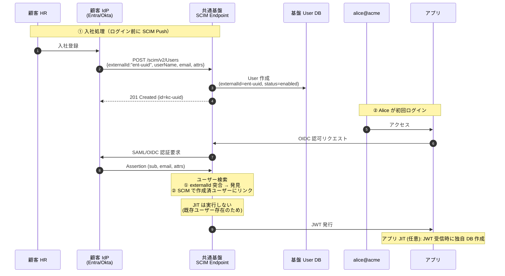
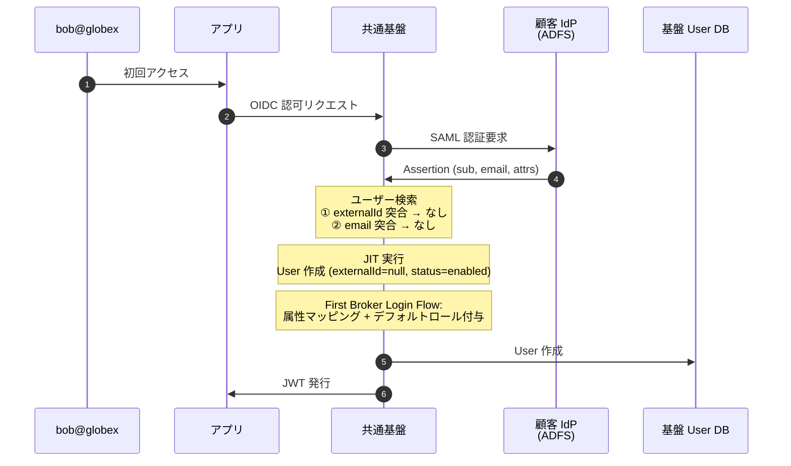
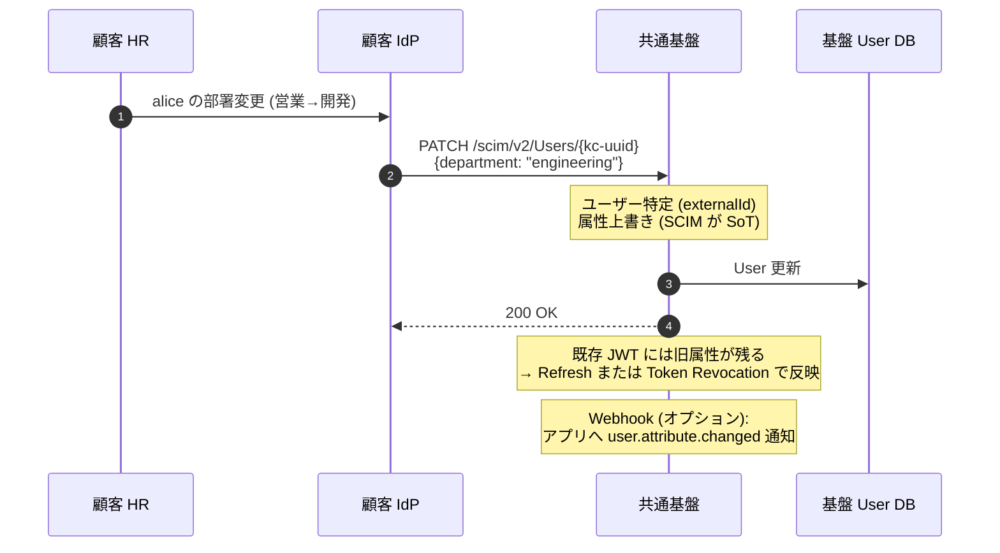
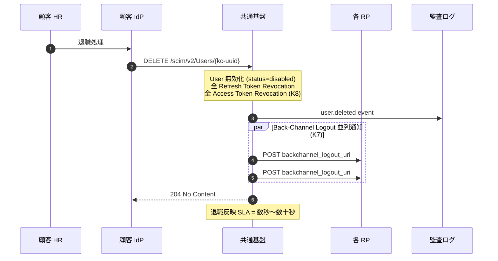
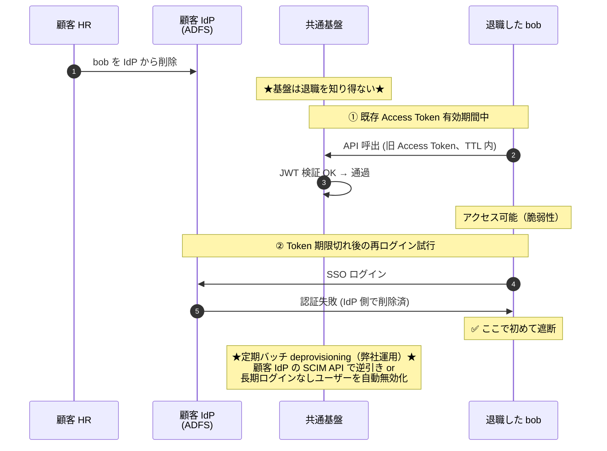
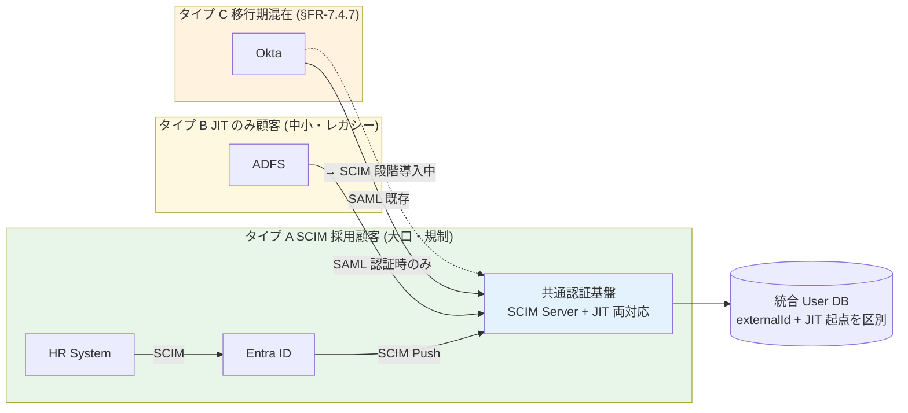
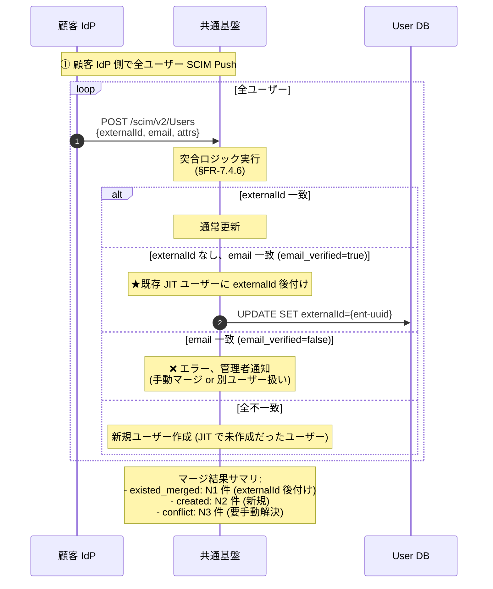
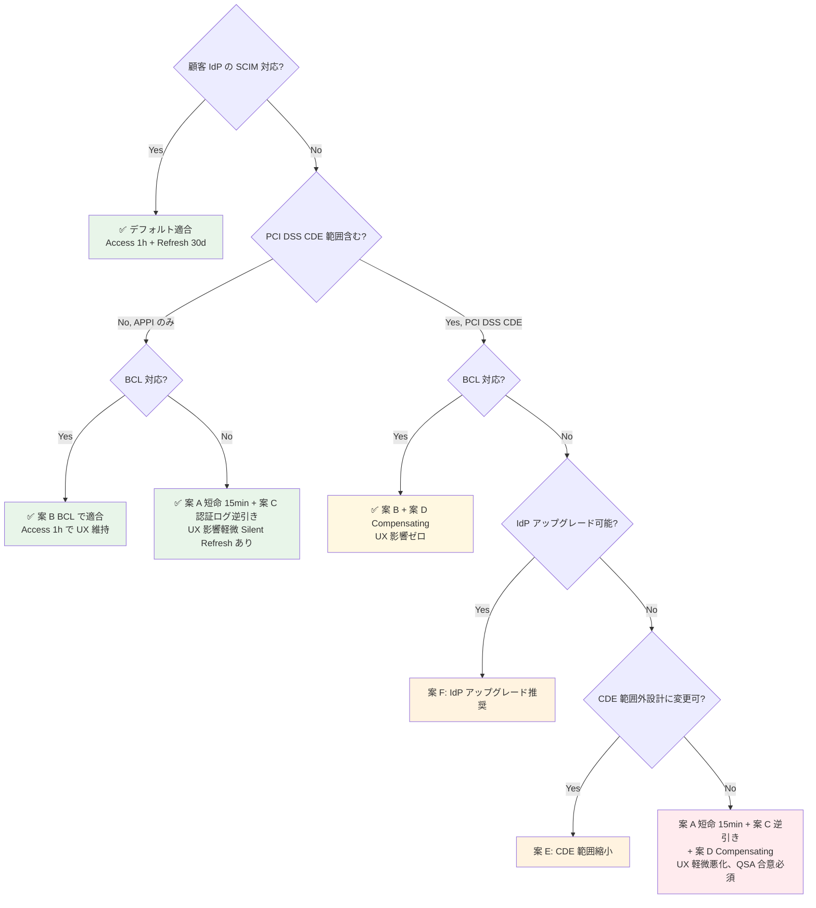

# SCIM 運用ガイド — 混在環境 / 同期競合 / 段階移行 / コンプライアンス / 非対応対応

> **目的**: §FR-7.4 プロビジョニングのうち、運用面の詳細パターンを集約した technical reference doc。
> **対象読者**: SCIM 採用検討者 / 運用設計者 / 顧客 IdP 連携実装者
> **前提**:
> - SCIM 受信機能の本基盤実装は [ADR-025](../adr/025-scim-positioning-and-receive-stance.md) で確定済
> - 顧客 IdP 連携の方向性は [§FR-7.4.0](../requirements/proposal/fr/07-user.md#fr-740-scim-の位置づけと本基盤のスタンス) で確定済
> **関連**:
> - [§FR-7.4 プロビジョニング](../requirements/proposal/fr/07-user.md#fr-74-プロビジョニング--fr-user-64)
> - [ADR-025 SCIM 2.0 の位置づけと本基盤の受信スタンス](../adr/025-scim-positioning-and-receive-stance.md)
> - [ADR-023 ServiceNow SP 連携設計](../adr/023-servicenow-sp-integration.md)
> - [jit-scim-coexistence-keycloak.md](jit-scim-coexistence-keycloak.md) — Keycloak 実装詳細
> - **[reference/scim-deletion-realtime-detection.md](../reference/scim-deletion-realtime-detection.md)** — 削除リアルタイム検知 + Broker PII 最小化（2026-07-08 追加）

---

> **⚠ 重要な注意事項（2026-07-08 追加、実装前必読）**:
>
> **Auth0 顧客の Outbound SCIM は Native 非対応**（2026-07 時点）。Auth0 → 本基盤への SCIM Push はネイティブで動作せず、**Event Streams + Custom Actions で workaround が必要**。詳細は [reference/scim-deletion-realtime-detection.md §7](../reference/scim-deletion-realtime-detection.md#7-顧客-idp-別の-scim-対応状況)。B-SCIM 系ヒアリング項目で Auth0 顧客の有無を確認する。
>
> **外部 SaaS の Rate Limit 情報の誤り訂正**:
> - ServiceNow SCIM: 公式に固定値なし（インスタンス単位で管理者設定、旧記述「20 req/sec」は誤り）
> - Salesforce SCIM: 公式に per-second 値なし（実運用 15 req/sec 以下推奨、旧記述「100 req/sec」は誤り）
> - Slack SCIM: Write 600/min (burst 180) / Read 1000/min (burst 1000) が正しい（旧記述「Tier 2 = 20 req/min per method」は Web API と混同）
> - Workday: 5 req/sec（唯一明確に公表されている値、Strategic Sourcing SCIM）
> 
> 詳細は [reference/scim-deletion-realtime-detection.md §11](../reference/scim-deletion-realtime-detection.md#11-rate-limit-の正確な値過去の誤り訂正) 参照。

---

## 目次

1. [混在環境の認証/プロビジョニング フロー（顧客 IdP 別の SCIM 対応差）](#1-混在環境の認証プロビジョニング-フロー顧客-idp-別の-scim-対応差)
2. [同期競合の解決ルール（SCIM vs JIT、Source of Truth ポリシー）](#2-同期競合の解決ルールscim-vs-jitsource-of-truth-ポリシー)
3. [段階移行運用（JIT → SCIM 追加、既存ユーザーマージ）](#3-段階移行運用jit--scim-追加既存ユーザーマージ)
4. [PCI DSS / APPI 適合性整理](#4-pci-dss--appi-適合性整理コンプライアンス要件と-jitscim-選定)
5. [SCIM 非対応 IdP 顧客への適合アプローチ](#5-scim-非対応-idp-顧客への適合アプローチ回避受容パターン)

---

## 1. 混在環境の認証/プロビジョニング フロー（顧客 IdP 別の SCIM 対応差）

> **本サブセクションで定めること**: §FR-7.4.0.A の「**全部 SCIM 可能**」スタンスの結果、**同一基盤に SCIM 採用顧客と非採用顧客が同居**することになる。両者が同一基盤内でどう振る舞うか、認証/プロビジョニング のシーケンスを **5 パターン** で図解する。
> **主な判断軸**: 顧客 IdP の SCIM 対応 / 顧客側の SCIM 採用意思 / 既存ユーザーの存在 / 退職反映 SLA
> **§FR-7.4 全体との関係**: §FR-7.4.0 が「**いつ・誰が・どう使うか**」のスタンス、本サブセクションは「**実際の動作シーケンス**」を補完

#### 混在パターンの 3 分類

| 顧客タイプ | 想定 IdP | SCIM 連携 | JIT 動作 | 主用途 |
|---|---|:-:|:-:|---|
| **タイプ A: SCIM 採用** | Entra ID P1+ / Okta / HENNGE / Google Workspace Premium | ✅ Push 受信 | ✅ 補完（SCIM 非対象ユーザーをカバー）| 大口顧客 / 規制業種 / 退職 SLA 厳格 |
| **タイプ B: JIT のみ** | ADFS / 独自 IdP / Google Workspace Free | ❌ なし | ✅ メイン | 中小規模 / レガシー IdP / コスト重視 |
| **タイプ C: 移行期混在** | 同一テナント内で SCIM 採用前後 | △ 段階的 | ✅ 常時 | 移行中（→ §FR-7.4.7）|

→ **共通基盤は 3 タイプを同時に収容**（テナント別設定で実現）。

#### シーケンス 1: タイプ A SCIM 採用顧客 — 事前作成 → 初回ログイン



→ **SCIM 採用顧客では「JIT による新規作成」は走らない**、既存ユーザーへの**リンクのみ**実行。

#### シーケンス 2: タイプ B JIT のみ顧客 — 初回ログイン時に新規作成



→ SCIM 非対応顧客では **JIT が主用途**、`externalId` は **null** のまま保持。

#### シーケンス 3: タイプ A の Mover（異動） — SCIM PATCH で属性更新



→ **SCIM が Source of Truth**、基盤側で属性手動編集は**上書きされる**設計（[§FR-7.4.6](#fr-746-同期競合の解決ルール) 参照）。

#### シーケンス 4: タイプ A の Leaver（退職） — SCIM DELETE で即時遮断



→ **タイプ A の最大価値**: 退職時の即時アクセス遮断（[§5.3 / §6.8](../powerpoint-outline-and-references.md) 連動）。

#### シーケンス 5: タイプ B の Leaver — JIT のみでの deprovisioning（限界あり）



→ **タイプ B の弱点**: 退職反映が「**次回ログイン拒否**」までかかる。SLA 厳格な場合は**契約で deprovisioning 責任を顧客に明示**するか、**弊社による定期バッチ運用** で補完（[§FR-7.4.0 Q4](#顧客への-qa-4-段階フロー) 参照）。

> **⚠ 重要な含意（2026-06-08 追加）**: シーケンス 4（SCIM DELETE）の「**User 無効化**」と シーケンス 5（JIT 顧客 IdP 削除）の「**Keycloak 関知せず**」は、ともに **Keycloak DB のレコード自体は残る** ことを意味する。物理削除と論理削除（無効化）の使い分けは [§FR-7.4.6 末尾の保持・削除マトリクス](#fr-746-同期競合の解決ルールscim-vs-jitsource-of-truth-ポリシー) 参照。JIT のみ顧客のゴーストユーザー問題は [§FR-7.4.7 末尾の定期バッチ deprovisioning](#fr-747-段階移行運用jit--scim-追加既存ユーザーマージ) で対応。

#### 全体図: 混在テナントの収容



## 2. 同期競合の解決ルール（SCIM vs JIT、Source of Truth ポリシー）

> **本サブセクションで定めること**: 混在環境で **同一ユーザーが SCIM と JIT 両方で接触される** ケースの動作と、属性食い違いの解決優先順位。
> **主な判断軸**: Source of Truth 設計（IdP vs 基盤 vs アプリ）、Keycloak Sync Mode 選択
> **§FR-7.4 全体との関係**: §FR-7.4.5 のシーケンスで「Alice が SCIM 事前作成済 + JIT ログイン」「Bob が JIT 作成済 + 後から SCIM Push」が発生 → 本節で解決ルール定義

#### ユーザー突合のキー優先順位

ログイン時 / SCIM 受信時の **ユーザー検索キー優先順位**:

```
1. externalId (SCIM 由来) ★最優先
2. email (検証済み email_verified=true のみ)
3. username (Realm 固有のローカル識別子)
   ↓ いずれも該当なし
4. JIT 新規作成 or SCIM POST
```

| 検索キー | 使用場面 | 優先度 | 注意点 |
|---|---|:-:|---|
| **externalId** | SCIM 採用顧客の SCIM Push 時 / SCIM 後の JIT ログイン時 | ⭐ 最優先 | IdP 側の不変 ID（Entra `objectId` / Okta `id`）必須 |
| **email** | JIT のみ顧客の SAML/OIDC ログイン時 | ◯ | **email_verified=true** が前提（OWASP 推奨）|
| **username** | ローカル管理者 / Break Glass | △ | 顧客企業横断で衝突しない命名（`<tenant>:<user>`）|

#### 競合パターンと解決

##### パターン 1: SCIM 事前作成 → JIT 初回ログイン
```
SCIM POST: {externalId: "ent-uuid-001", email: alice@acme}
↓ ユーザー作成 (status=enabled, externalId=ent-uuid-001)

Alice が SAML ログイン (Assertion sub = ent-uuid-001)
↓ externalId 突合 → 既存ユーザー発見
↓ JIT 新規作成は実行しない
↓ 属性のみ Sync Mode に従って更新 / リンクのみ
```
→ **競合なし**、SCIM が先導し JIT は確認のみ。

##### パターン 2: JIT 既存 → 後から SCIM Push（タイプ C 移行期）

```
Bob が JIT で作成済 (externalId=null, email=bob@globex)
↓ 半年後、顧客が SCIM 導入

SCIM POST: {externalId: "ent-uuid-002", email: bob@globex}
↓ externalId 突合 → なし
↓ email 突合 → 発見 (email_verified=true 確認)
↓ 既存ユーザーに externalId 追加付与 (リンクのみ、データ保持)
```
→ **既存データは保持**、`externalId` 後付け付与のみ。`email_verified=false` なら衝突エラー → 管理者解決。

##### パターン 3: 属性食い違い（SCIM と JIT で値が違う）

例: SCIM Push で `department=engineering`、その後 IdP 側で SAML Assertion `department=sales`

| Keycloak Sync Mode | 動作 | Source of Truth | 推奨用途 |
|---|---|---|:-:|
| **IMPORT**（初回のみ）| JIT 初回作成時のみ反映、以降は基盤側で管理 | 基盤側 | △ セルフサービス重視 |
| **LEGACY**（都度上書き）| 都度 IdP 値で上書き、基盤側編集不可 | IdP 側 | △ |
| **FORCE**（毎回強制）| 毎回 IdP 値で強制上書き、基盤側編集も上書き | IdP 側 | **★ 本基盤推奨**（SCIM 採用顧客向け）|

**本基盤のデフォルト方針**:
- **タイプ A（SCIM 採用）= FORCE モード**（SCIM/IdP が SoT）
- **タイプ B（JIT のみ）= IMPORT モード**（初回のみ、以降は基盤側でセルフサービス）
- **属性別の細粒度設定も可能**（email = FORCE、display_name = IMPORT 等）

#### 重複検出時の挙動（OWASP 推奨パターン）

| 状況 | 挙動 |
|---|---|
| externalId 一致 + email 不一致 | externalId 優先、email は新値で上書き or 警告 |
| externalId なし + email 一
致 + email_verified=true | 既存ユーザーリンク（externalId 後付け）|
| externalId なし + email 一致 + email_verified=false | **エラー**、管理者手動解決 |
| 全キー不一致 | 新規 JIT 作成 / SCIM POST |
| 同一 email が複数ユーザーで存在 | **設計エラー**、Realm 設定見直し |

詳細は [§FR-2.2.1.A 同一テナント内ユーザー重複](02-federation.md#fr-2-2-1-a-同一テナント内ユーザー重複) と整合。

#### Keycloak User DB 保持・削除マトリクス（JIT/SCIM × 論理/物理）

> **重要**: 「ユーザーを削除する」には **論理削除（`enabled=false`）** と **物理削除（レコード INSERT 取消）** の 2 種類があり、業界標準は **論理削除**。Keycloak User DB のレコードは多くのケースで残る。

| ケース | `user_entity` レコード | `enabled` | Token Revocation | DB クリーンアップ責務 |
|---|:-:|:-:|:-:|---|
| **JIT 顧客 IdP 削除（基盤に通知なし）** | ✅ 残る | **true のまま** | ❌ なし | **基盤側の定期バッチで対応必須**（→ §FR-7.4.7 末尾）|
| **JIT 定期バッチ削除**（弊社運用、推奨）| ⚠ 設定次第 | false → 物理削除 | 連動 | バッチで実施 |
| **SCIM DELETE 受信**（デフォルト動作）| ✅ 残る | **false に変更（論理削除）** | ✅ 自動連動 | 不要（無効化で十分）|
| **SCIM DELETE + Hard Delete 設定** | ❌ 物理削除 | - | ✅ | 不要 |
| **管理者の手動 Hard Delete** | ❌ 物理削除 | - | ⚠ 手動連動必要 | 不要 |
| **GDPR Article 17 Erasure 要求** | ❌ 物理削除 or **匿名化** | - | ✅ | 法的義務 |
| **テナント解約（Realm 削除）** | ❌ 全消失 | - | - | - |
| **N 年経過後の保管期間終了** | ❌ 物理削除（バッチ）| - | - | 法的保持期間（PCI DSS 1年 / 金融 7年 等）後 |

#### 論理削除 vs 物理削除の判断基準

| 観点 | **論理削除推奨** | **物理削除推奨** |
|---|---|---|
| **典型タイミング** | 退職・無効化（即時遮断目的）| 法的保持期間経過後 / GDPR Erasure |
| **監査ログとの紐付け** | ✅ 維持される | ⚠ 匿名化が必要 |
| **復職時の復旧** | ✅ 簡単（`enabled=true` 戻すだけ）| ❌ 再作成必要 |
| **業務データへの参照**（アプリ DB の `kc_sub` FK）| ✅ 維持 | ⚠ 切れる、別途処理必要 |
| **SOC2 / ISO27001 / PCI DSS / FISC 監査** | ✅ 「アクセス取消の検証可能性」を満たす | ⚠ 監査ログ匿名化必須 |
| **GDPR Article 17 適合**（権利請求時のみ）| ⚠ 不適合 | ✅ 適合 |
| **GDPR Article 17.3 例外**（法的義務）| ✅ 適合 | - |
| **DB 性能**（蓄積長期化）| ⚠ 数年で肥大化 | ✅ 軽量 |

**本基盤の推奨ポリシー**:
- **第 1 段階（即時）**: 論理削除（`enabled=false` + Token Revocation）→ 業務遮断完了
- **第 2 段階（法的保持期間経過後）**: 定期バッチで物理削除 or 匿名化（PCI DSS = 1 年 / 一般 = 7 年）
- **GDPR Erasure 要求時のみ**: 即時物理削除 + 監査ログ匿名化（§7.4 Privacy 連動）

## 3. 段階移行運用（JIT → SCIM 追加、既存ユーザーマージ）

> **本サブセクションで定めること**: 顧客が「**最初 JIT のみ → 半年後 SCIM 導入**」する移行期の運用手順と既存ユーザーマージ方法。
> **主な判断軸**: 既存 JIT ユーザーの突合キー、移行期の重複防止、ロールバック容易性
> **§FR-7.4 全体との関係**: §FR-7.4.5 タイプ C（移行期混在）の具体的運用手順を定義

#### 移行シナリオの典型

```
時系列:
├─ Day 0 (顧客契約): JIT のみで運用開始
│   └─ Bob / Carol / Dave が JIT で作成（externalId=null）
├─ Month 6 (顧客側 SCIM 導入決定): 移行計画開始
└─ Month 7 (SCIM 連携開始): 既存ユーザーのマージ + 新規は SCIM 主導
```

#### 推奨移行手順（3 ステップ）

##### Step 1: 事前準備（顧客側 IdP の SCIM 設定）

| 作業 | 担当 | 内容 |
|---|---|---|
| 顧客 IdP の SCIM 機能有効化 | 顧客情シス | Entra: Enterprise App 追加 / Okta: SCIM Provisioning 設定 |
| 共通基盤の SCIM Token 発行 | 弊社 | テナント別 Bearer Token、Vault 保管 |
| Attribute Mapping 設計 | 双方 | IdP 属性 → 基盤属性 / `externalId` ソース確定（Entra `objectId` 等）|
| **テスト用ダミー Push** | 双方 | 1 ユーザーで動作確認、突合・競合ルール検証 |

##### Step 2: 既存ユーザーマージ（最重要）



**移行前後の状態**:

| 状態 | externalId | email_verified | 同期方向 | Sync Mode |
|---|:-:|:-:|---|---|
| **移行前**（JIT のみ）| null | true / false 混在 | IdP → 基盤（ログイン時のみ）| IMPORT |
| **移行後**（SCIM 採用）| ent-uuid 付与済 | **true 必須** | IdP → 基盤（SCIM Push + ログイン）| FORCE |

##### Step 3: 切替後の運用切り替え

| 設定 | 移行前 | 移行後 |
|---|---|---|
| 顧客 IdP の SCIM Provisioning | OFF | **ON** |
| Sync Mode | IMPORT | **FORCE** |
| 退職反映 | 次回ログイン時拒否 | **数秒〜数十秒（SCIM DELETE）**|
| Deprovisioning 責任 | 顧客側 / 定期バッチ | **SCIM Push 経由で自動**|
| 監査ログ | ログインイベントのみ | **SCIM 全操作 + ログインイベント**|

#### 移行期の重複防止策

| リスク | 対策 |
|---|---|
| **email_verified=false な既存 JIT ユーザー多数** | 移行前にメール検証キャンペーン実施（リマインドメール送信、未検証ユーザーに promptly 警告）|
| **顧客 IdP 側のメール変更で突合不能** | externalId 後付け前に IdP 側で email 整合性確認、Excel 突合表で事前検証 |
| **マージ中の新規ログインで重複ユーザー作成** | Step 2 実行中は新規 JIT を一時無効化（Realm 設定 or Maintenance Mode）|
| **マージ失敗の手動解決負担** | 移行ツール（kcadm.sh + SCIM API ラッパー）でバッチ実行、サマリレポート生成 |

#### ロールバック可能性

| 問題 | ロールバック |
|---|---|
| SCIM Push 障害 | 顧客 IdP 側で SCIM Provisioning OFF → JIT のみ運用に戻る |
| マージ失敗 | externalId 後付けを `UPDATE SET externalId=null` で削除（JIT のみ状態に戻る、データ保持）|
| 完全失敗 | 全 externalId 削除 + Sync Mode を IMPORT に戻す（5 分作業）|

→ **段階移行は逆方向にも戻せる**設計、リスクは限定的。

#### JIT のみ顧客向け定期バッチ deprovisioning 設計（Should、§FR-7.4.0 Q4 Fallback 実装）

> **本セクションの位置付け**: §FR-7.4.5 シーケンス 5 で示した「JIT のみでは退職を基盤が知り得ない」問題と、§FR-7.4.6 で示した「Keycloak DB レコードが残り続ける」問題への運用解決策。
>
> **⚠ 2026-07-09 重要訂正**：本セクションの実装ガイドは **[jit-scim-coexistence-keycloak.md §10.4.A Event Listener SPI 版](jit-scim-coexistence-keycloak.md)** を参照すること。**旧 §10.4（event_entity 依存）は 10M MAU 規模で破綻**（① eventsExpiration 未設定でイベント消失、② 90 日で 9 億行 DB 肥大化、③ 全ユーザ逐次クエリで実行時間非現実的）。SCIM/JIT 判別は **[§10.4.B](jit-scim-coexistence-keycloak.md)** の scim_active=true 削除禁止フラグ + provisioned_by 属性 3 段階戦略を使用。

**目的**:
- ゴーストユーザー（Keycloak DB に残った退職者）の蓄積防止
- 過去 Token の再利用防止（既に Refresh 失効していても監査上の懸念）
- PCI DSS 8.2.6（90 日未使用無効化）等のコンプラ対応（→ §FR-7.4.8）

**バッチ方式の選択肢**:

| 方式 | 動作 | コスト | 精度 |
|---|---|---|:-:|
| **A. 最終ログイン基準**（推奨、§10.4.A Event Listener SPI + `user_attribute.last_login`）| N 日（例 90 日）以上ログインしないユーザーを `enabled=false` | ⚠ SPI 開発 1-2w、運用は軽量 | ◯ |
| **B. 顧客 IdP 逆引き**（高精度）| 顧客 IdP API でユーザー一覧取得 → 突合 → 不在ユーザーを無効化 | ⚠ 顧客 IdP 側 API 必要 | ✅ 最高 |
| **C. 契約終了通知ベース** | 顧客側からの通知 + 弊社サポートで手動 | ◯ | △ 顧客次第 |

**推奨運用シナリオ**:

```
Day 0: 顧客 IdP で退職処理（基盤は関知せず）
↓
Day 30-90: 退職者の Token が全 TTL 期限切れ（Refresh Token 90 日想定）
       → 次回ログイン試行 = 顧客 IdP 側で認証失敗
↓
Day 90: 弊社定期バッチ実行（毎週 or 毎月）
       → 90 日未ログインユーザーを抽出
       → 自動 `enabled=false`（論理削除）
       → 監査ログ送出（user.batch.disabled）
↓
Year N+: 法的保持期間経過後、物理削除 or 匿名化（§FR-7.4.6 ポリシー）
```

**バッチ実装ガイドライン**:

| 項目 | 推奨設定 |
|---|---|
| **未ログイン閾値** | 90 日（PCI DSS 8.2.6 と整合）/ 30 日（より厳格な場合）|
| **実行頻度** | 週次 or 月次（リソース消費とのトレードオフ）|
| **対象除外** | サービスアカウント / 管理者ロール / B2C ユーザー（別ポリシー）|
| **通知** | 無効化 7 日前にユーザー or 管理者へ通知（誤無効化防止）|
| **監査ログ** | 全無効化操作を CloudWatch Logs / SIEM 連携 |
| **ロールバック** | 無効化後 30 日は `enabled=true` 戻しで復活可能（論理削除のため）|

**Keycloak 実装の詳細**は [common/jit-scim-coexistence-keycloak.md §10](../../../common/jit-scim-coexistence-keycloak.md) 参照（kcadm.sh + バッチスクリプト例）。

## 4. PCI DSS / APPI 適合性整理（コンプライアンス要件と JIT/SCIM 選定）

> **本サブセクションで定めること**: 認証基盤の代表的コンプライアンス要件である **PCI DSS v4.0**（カード会員データ保護）と **APPI**（日本個人情報保護法）に対し、JIT のみ / SCIM 併用の各方式がどの程度適合するか、必要な追加対策は何かを整理。
> **主な判断軸**: PCI DSS Requirement 8（識別・認証）/ APPI 法 23 条（安全管理措置）/ 法 22 条（不要保持禁止）
> **§FR-7.4 全体との関係**: §FR-7.4.0 のスタンス（全部 SCIM 可能）と §FR-7.4.7 の定期バッチを実装上の前提として、コンプライアンス観点から再評価

#### PCI DSS v4.0 (v4.0.1, 2025) の認証基盤関連要件

**適用範囲**: 認証基盤が **カード会員データ環境（CDE）への認証経路** となる場合、Requirement 8 が直接適用。CDE 外なら間接的な参考要件。

| Requirement | 内容 | JIT のみ | SCIM 併用 |
|---|---|:-:|:-:|
| **8.2.1** | ユーザー識別子の一意性 | ✅ `sub` で保証 | ✅ |
| **8.2.2** | 共有 ID 禁止 | ✅ | ✅ |
| **8.2.5** | **退職ユーザーのアクセス即時取消** | ❌ **困難**（基盤は退職を知り得ない）| ✅ **数秒〜数十秒** |
| **8.2.6** | **90 日未使用アカウント無効化** | ⚠ 定期バッチ必須（→ §FR-7.4.7 末尾）| ✅ 自動化容易 |
| **8.3** | MFA 必須（v4.0.1 で拡大）| ✅ §3.2 で対応、JIT/SCIM 独立 | ✅ |
| **8.5** | アクセスレビュー実施 | ⚠ ユーザー一覧が JIT 起点のみ、不完全 | ✅ SCIM 起点の完全な一覧で実施可 |
| **10.2** | 監査ログ | ✅ Event Listener SPI で対応 | ✅ |

**判定**:
- **CDE 内認証経路 = SCIM 併用が事実上必須**（8.2.5 即時取消、8.2.6 90 日無効化が JIT のみでは精度不足）
- **CDE 外 = JIT のみ + 定期バッチ deprovisioning（§FR-7.4.7）で許容範囲**

#### APPI（個人情報保護法、令和 4 年改正 + 2025 三年見直し）の関連要件

**適用範囲**: 本基盤は **個人データを取り扱う委託先**（事業者の従業員等の認証）として APPI の安全管理措置義務が及ぶ。

| 法/ガイドライン | 内容 | JIT のみ | SCIM 併用 |
|---|---|:-:|:-:|
| **法 23 条 / GL 通則編 10**（安全管理措置）| 適切なアクセス制御・識別・認証 | ⚠ 退職時即時遮断が困難 | ✅ |
| **法 22 条**（個人データの正確性確保・遅滞ない消去）| 利用する必要がなくなったときの遅滞ない消去（努力義務）| ⚠ Keycloak DB にゴースト残存（→ §FR-7.4.7 末尾の定期バッチで対応）| ✅ |
| **法 26 条**（漏えい等の報告）| 個人情報保護委員会への報告（速報 3〜5 日 / 確報 30 日、不正アクセス起因は確報 60 日）| ✅ 監査ログで対応 | ✅ |
| **法 25 条**（委託先の監督）| 委託元による本基盤の監督義務（規則第 7 条相当の安全管理措置）| ✅ SLA + 監査ログで対応 | ✅ |
| **法 33〜35 条**（開示・訂正等・利用停止等の請求）| 法定上限内対応 | ⚠ ユーザー一覧が不完全な可能性 | ✅ SCIM 起点で完全な一覧 |
| **2025 三年見直し動向** | 安全管理措置・委託先監督の重大事案多数指摘 | ⚠ リスク | ✅ |

> **条文番号の根拠（令和 4 年改正版 = 現行版）**:
> - 法第 22 条 = 個人データの正確性確保・遅滞ない消去（努力義務）
> - 法第 23 条 = 安全管理措置（PPC ガイドライン 通則編 §3-4-2）
> - 法第 24 条 = 従業者の監督（同 §3-4-3）
> - 法第 25 条 = 委託先の監督（同 §3-4-4）
> - 法第 26 条 = 漏えい等の報告（同 §3-5）。**速報 3〜5 日以内 / 確報 30 日以内**、規則第 7 条第 3 号（不正の目的をもって行われた行為起因）は **確報 60 日以内**
> - 法第 33 条 = 保有個人データの開示 / 法第 34 条 = 訂正等 / 法第 35 条 = 利用停止等（同 §3-8）

**判定**:
- **APPI 全般 = SCIM 推奨、JIT のみは「定期バッチ deprovisioning + 契約での deprovision 責任明示」で対応可**
- **権利請求対応（法 33〜35 条）= SCIM 採用顧客の方が応答速度が確実**

#### PCI DSS + APPI 両方準拠時の本基盤の方針

| 顧客タイプ | PCI DSS 適合 | APPI 適合 | 本基盤の対応 |
|---|:-:|:-:|---|
| **タイプ A**（SCIM 採用）| ✅ 直接適合 | ✅ 直接適合 | デフォルト構成で対応可、Phase Two SCIM + 全 Token Revocation 連動 |
| **タイプ B**（JIT のみ）| ⚠ 8.2.5/8.2.6 で条件付き | ⚠ 法 22 条で条件付き | **弊社による 90 日定期バッチ deprovisioning 必須**（§FR-7.4.7 + **[jit-scim §10.4.A Event Listener SPI 版](jit-scim-coexistence-keycloak.md)**、2026-07-09 訂正）+ 契約で deprovision 責任所在明示 |
| **タイプ C**（移行期）| ⚠ 移行完了まで条件付き | ⚠ 同左 | **移行を最短で完了**、移行期は契約上のリスク受容を顧客と合意 |

#### 顧客への提案アプローチ

**PCI DSS / APPI 適用範囲がある顧客への質問追加**（[§FR-7.4.0 顧客 QA 4 段階フロー](#顧客への-qa-4-段階フロー) に追加質問）:

| Q# | 質問 | 影響 |
|:-:|---|---|
| **Q5（コンプラ）**| **PCI DSS の CDE 範囲に本基盤を含むか?** | Yes → SCIM 強く推奨（8.2.5 適合）|
| **Q6（コンプラ）**| **APPI で個人情報保護委員会への定期報告対象か?** | Yes → SCIM 推奨（権利請求対応の確実性）|
| **Q7（責任）**| **JIT のみ採用時、退職者 deprovisioning 責任を顧客側で持てるか?** | No → SCIM 必須化 or 弊社定期バッチ前提 |
| **Q8（SLA）**| **退職時アクセス取消 SLA を契約で何分以内に設定したいか?** | 1 分以内 = SCIM 必須、24 時間以内 = JIT + 定期バッチ可 |

#### 業界実例（参考）

| ベンダー | PCI DSS / APPI 対応の認証基盤運用 |
|---|---|
| **Microsoft Entra**（PCI DSS Level 1）| SCIM 標準対応 + Conditional Access + CAE で即時遮断 |
| **Okta**（PCI DSS Level 1）| Lifecycle Management + Universal Logout で即時遮断 |
| **Auth0**（PCI DSS Level 1）| Automated Provisioning + Custom Token Exchange |
| **AWS IAM Identity Center** | SCIM + Force Logout API |

→ **業界主流の認証基盤は PCI DSS 準拠のため SCIM をネイティブ採用**。本基盤も同じ方向（[hook-architecture-keycloak.md §3.6 Phase Two SCIM](../../../common/hook-architecture-keycloak.md) 採用で対応）。

#### ベースライン（PCI DSS / APPI 両方準拠時）

| 項目 | ベースライン |
|---|---|
| **SCIM 2.0 受信機能（共通基盤側実装）** | **Must**（§FR-7.4.0.A スタンスと整合）|
| **退職時 deprovision SLA**（SCIM 採用顧客）| **即時〜数十秒**（PCI DSS 8.2.5、SCIM DELETE + Token Revocation 連動）|
| **退職時 deprovision SLA**（JIT のみ顧客）| **24 時間以内 + 弊社定期バッチ 90 日無効化**（PCI DSS 8.2.6）|
| **90 日未使用無効化** | **Must**（PCI DSS 8.2.6、§FR-7.4.7 末尾の定期バッチ = **[jit-scim §10.4.A Event Listener SPI 版](jit-scim-coexistence-keycloak.md)** で実装、2026-07-09 訂正）|
| **アクセスレビュー** | **Should**（PCI DSS 8.5、SCIM 採用顧客は完全な User 一覧取得可）|
| **MFA 全アクセス** | **Must**（§3.2 + PCI DSS 8.3.1）|
| **監査ログ完全保持** | **Must**（APPI 法 23 条 + PCI DSS 10.2、Event Listener SPI + Phase Two `keycloak-events`）|
| **権利請求対応 SLA**（APPI 法 33〜35 条 開示・訂正等・利用停止等）| **遅滞なく対応**（法定基準、ユーザー一覧取得が前提）|
| **物理削除 vs 論理削除のポリシー** | **§FR-7.4.6 末尾のポリシー**（即時 = 論理削除、法的保持期間後 = 物理削除）|

## 5. SCIM 非対応 IdP 顧客への適合アプローチ（回避・受容パターン）

> **本サブセクションで定めること**: §FR-7.4.8 で示した PCI DSS 8.2.5（即時取消）への厳密適合は **SCIM 採用が前提**だが、**顧客 IdP が SCIM 非対応**（古い ADFS / 独自 IdP 等）の場合の回避・受容パターン 6 種と、それぞれの UX 影響・コスト・適合度を整理。
> **主な判断軸**: PCI DSS CDE 範囲含む / APPI のみ / UX 許容度 / 顧客 IdP API 可用性 / 営業上の制約
> **§FR-7.4 全体との関係**: §FR-7.4.8 のベースラインに対する **例外パターンの体系化**。本基盤の営業・設計判断の重要な選択肢を提供

#### 結論: 厳密適合は困難、Compensating Controls + 短命 Token で適合可能性あり

| 規格 | SCIM 非対応 IdP 顧客の適合性 |
|---|---|
| **PCI DSS 8.2.5（即時取消）** | ❌ 厳密適合は困難、**Compensating Controls（PCI DSS Appendix B）+ 短命 Token + 認証ログ逆引き** の組合せで QSA 承認下で適合可能 |
| **PCI DSS 8.2.6（90 日未使用無効化）** | ✅ §FR-7.4.7 定期バッチで適合可（**[jit-scim §10.4.A Event Listener SPI + user_attribute.last_login 版](jit-scim-coexistence-keycloak.md)**、2026-07-09 訂正）|
| **APPI 法 22 条（遅滞ない消去）** | ✅ 「遅滞ない」= 24-72 時間〜数日（実務的解釈）、§FR-7.4.7 定期バッチで適合可 |
| **APPI 法 23 条（安全管理措置）** | ✅ 短命 Token + 監査ログ + 契約条項で適合可 |

#### 回避・受容パターン 6 種

| 案 | 内容 | 退職反映 SLA | UX 影響 | 適合度（PCI DSS）|
|:-:|---|---|:-:|:-:|
| **A. 短命 Token + Refresh Rotation** | Access TTL 5-15 分 + Refresh Rotation。Keycloak DB の `enabled` チェックを毎 Refresh で実行 | **TTL 分（5-15 分）** | ◯ Silent Refresh で軽微 | ⚠ Compensating 候補 |
| **B. 顧客 IdP からの Back-Channel Logout (BCL) 受信** | OIDC BCL (RFC 8417) で退職通知受信。SCIM 不要 | **数秒〜数十秒** | ✅ 影響ゼロ | ✅ 適合 |
| **C. 顧客 IdP 認証ログ逆引きバッチ** | 顧客 IdP の認証ログ API を定期取得、未認証ユーザーを推定 deprovisioning | **N 日（例 7 日）** | ✅ 影響ゼロ | ⚠ Compensating 候補 |
| **D. PCI DSS Compensating Controls 申請** | 案 A+C+ITDR を組合せて QSA に代替統制として申請 | 案 A+C による | 案 A による | ✅ **正式適合パス** |
| **E. CDE 範囲外運用（PCI 適用回避）** | 該当アプリを CDE 範囲外に出す（PSP 経由で決済委譲等）| - | ✅ | ✅ PCI 適用回避 |
| **F. 顧客 IdP アップグレード要求** | SCIM 対応 IdP（Entra P1+ / Okta 等）への変更を契約条件化 | SCIM 同等 | ✅ | ✅ 適合 |

#### 案 A: 短命 Token の UX 影響詳細（最重要、本基盤での主要選択肢）

> **業界トレンド**: RFC 9700 (2025) と Auth0 / Okta が「**短命 Access Token + Refresh Token Rotation**」を OAuth 2.0 Best Current Practice として確立。機密 API は 5-15 分、一般 API は 30-60 分が業界推奨。

##### UX 影響の段階別評価

| Access Token TTL | Silent Refresh 実装あり | Silent Refresh なし | 業界推奨対象 |
|---|---|---|---|
| **5 分** | ◯ わずかな遅延（~100ms） | ✕ 5 分ごと再ログイン（実質使用不能）| 金融 / 医療 / 政府（規制業種）|
| **15 分** | ✅ 影響ゼロ | ⚠ 15 分ごと再ログイン（大幅悪化）| **B2B SaaS 機密データ（PCI CDE 含む）**|
| **30 分** | ✅ 影響ゼロ | ◯ 30 分ごと（許容範囲）| B2B SaaS 一般 |
| **1 時間**（デフォルト）| ✅ 影響ゼロ | ✅ 1 時間ごと（許容）| **B2B SaaS デフォルト**（Cognito / Keycloak 既定）|
| **24 時間** | ✅ | ✅ | B2C / 低機密 |

##### UX 影響を決定する 7 つの要因

| # | 要因 | 影響内容 |
|:-:|---|---|
| 1 | **Silent Refresh の実装品質** | 適切な実装で UX 影響ゼロ、不適切だと突然の API 失敗 |
| 2 | **Refresh 時に IdP 再認証を強制するか** | ❌ `prompt=login` / `max_age=0` 強制 = 毎 TTL ごと再ログイン（致命的）<br/>✅ Keycloak DB の `enabled` チェックのみ = 影響ゼロ |
| 3 | **Refresh Token の TTL** | Refresh TTL が短い（8h 等）= 毎日朝一で再ログイン |
| 4 | **長時間タスク**（ファイル UP / レポート生成）| 5 分以上のタスクは Token 期限切れで失敗 → Web Worker / Background Job 化 |
| 5 | **Multi-Tab UX** | 全タブで Token 共有（BroadcastChannel / LocalStorage Sync）|
| 6 | **オフライン UX** | ネットワーク断中 Refresh 失敗 → Service Worker でリトライ |
| 7 | **MFA 再要求** | Refresh ごとに MFA = 大幅悪化（**通常は MFA 再要求しない**）|

##### 業界実装事例（Token TTL × UX）

| サービス | Access TTL | Refresh TTL | UX 戦略 |
|---|---|---|---|
| **Slack Enterprise Grid** | 30 分（アクティブ時延長）| 90 日 | Silent Refresh + アクティビティ検知 |
| **Notion** | 7 日 | 永続 | 長命 Token、機密度低 |
| **GitHub** | 8 時間 | 永続 | Sudo Mode で機微操作のみ再認証 |
| **Auth0**（IDaaS 製品）| 24 時間（デフォルト推奨 2 時間以下）| Rotation 推奨 | 業界標準を提示 |
| **Okta**（IDaaS 製品）| 1 時間（5 分〜24 時間）| Inactivity ベース | 最短 5 分まで設定可 |
| **Banking apps**（一般銀行アプリ）| 5-15 分 | 0 日（毎回再ログイン）| 安全性優先、UX 犠牲 |
| **Microsoft Entra**（デフォルト）| 1 時間 | 90 日 | CAE で即時取消、UX 維持 |

→ **B2B SaaS の業界中央値 = Access 30 分〜1 時間 + Refresh 30〜90 日 + Silent Refresh**。短命 5-15 分は **金融 / 医療 / PCI DSS CDE 範囲のみ** が業界実態。

##### 短命 Token と「即時取消」の関係（重要）

短命 Token = 「即時取消の近似手段」だが、**それだけでは退職時の遮断にならない**。以下の連動が必要:

```
[必要な連動チェーン]
1. 短命 Access Token (5-15 分)
   ↓ Token 期限切れ
2. クライアント → Refresh エンドポイントへ Refresh Token 提示
   ↓
3. ★Keycloak が User.enabled = true を確認★
   ↓ enabled なら
4. 新 Access Token 発行（5-15 分の遅延で取消可）

→ Keycloak DB の User.enabled が顧客 IdP の削除を反映する仕組みが必要
   = SCIM 受信 / BCL 受信 / 認証ログ逆引きバッチ（§FR-7.4.7）の **いずれか必須**
```

→ **「短命 Token だけで適合」は不可**、案 A は **案 B / C と組合せて初めて効果**。

##### 本基盤の推奨デフォルト設定

| 顧客タイプ | Access Token TTL | Refresh Token TTL | Silent Refresh | UX 評価 |
|---|---|---|:-:|:-:|
| **SCIM 対応**（業界標準）| 1 時間 | 30 日 + Rotation | ✅ | ✅ |
| **SCIM 非対応 + PCI DSS CDE 含む** | **15 分**（短命）| 24 時間 + Rotation | ✅ 必須 | ◯ |
| **SCIM 非対応 + APPI のみ** | 30 分〜1 時間 | 8-30 日 + Rotation | ✅ | ✅ |
| **業務系（社内ツール）** | 8 時間 | 30 日 | ✅ | ✅ |

#### 採用判断フロー（顧客ヒアリング時）



#### 顧客への QA 追加質問（§FR-7.4.0 の Q1-Q4 + §FR-7.4.8 の Q5-Q8 に続く Q9-Q12）

| Q# | 質問 | 影響 |
|:-:|---|---|
| **Q9** | 顧客 IdP は **Back-Channel Logout (RFC 8417)** に対応していますか? | Yes → 案 B 採用、SCIM なしで即時取消可 |
| **Q10** | 顧客 IdP の **認証ログ API** に弊社がアクセスする許可をいただけますか?（Microsoft Graph / Okta System Log / ADFS Event Log 等）| Yes → 案 C 採用、定期バッチで推定 deprovisioning |
| **Q11** | **Access Token TTL を 15 分に短縮**することで「即時取消」要件を近似する代替手段に同意いただけますか?（UX 影響: Silent Refresh で軽微）| Yes → 案 A 採用 |
| **Q12** | PCI DSS CDE 範囲含む場合、**Compensating Controls の QSA 申請**に協力いただけますか? | Yes → 案 D 採用、案 A+C+D の組合せで正式適合 |

#### 業界事例（SCIM 非対応 IdP への対応）

| サービス | SCIM 非対応 IdP 顧客への対応 |
|---|---|
| **Slack Enterprise Grid** | 案 A 短命 + 案 C 認証ログ逆引き + 案 F（Enterprise 契約時 IdP アップグレード推奨）|
| **Microsoft 365** | 案 B BCL + 案 F（顧客 IdP を Entra に統合誘導）|
| **Salesforce** | 案 A 短命 + 案 D Compensating Controls 申請 |
| **Auth0**（IDaaS）| 案 A 短命 TTL デフォルト + Anomaly Detection（ITDR 相当で異常検知）|
| **HENNGE One**（日本市場）| 案 A + SAML Single Logout 連携（BCL 類似）|

→ **業界主流は「案 A + 案 C + 案 D の組合せ」**、本基盤も同方向。

