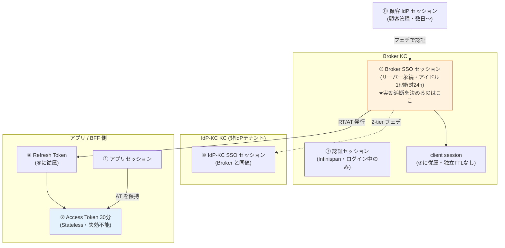
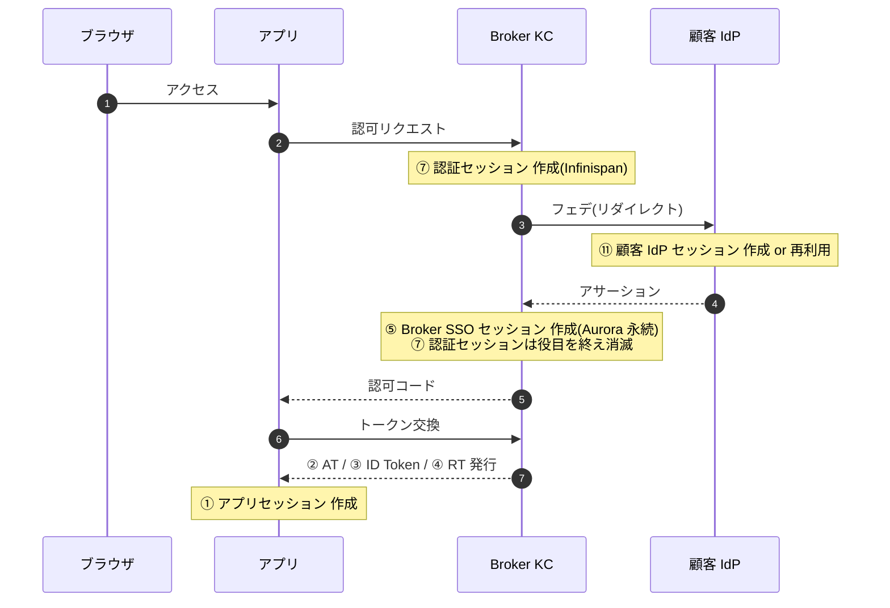
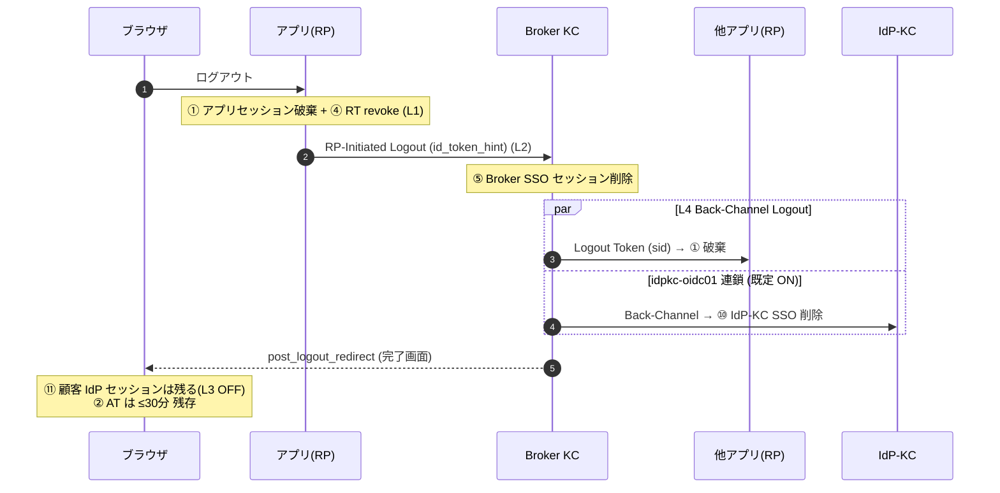

# セッションのライフサイクルと全フロー（SSOT）

作成: 2026-07-27 / 位置づけ: **セッション/トークンに関する単一の正**。要件定義（[§FR-5](../requirements/proposal/fr/05-logout-session.md)）の説明資料であり、基本設計（[U5](../basic-design/05-token-session-authz-design.md) / [U2 §2.2.5](../basic-design/02-keycloak-logical-design.md) / [U8 §8.2.2](../basic-design/08-availability-dr-design.md)）からも参照する。
関連: [session-management-deep-dive.md](../reference/session-management-deep-dive.md)（Keycloak セッションの技術背景）/ [jit-scim §10.7](jit-scim-coexistence-keycloak.md)（退職者遮断）。

---

## 0. なぜこの文書が必要か

「セッション」と一口に言っても、本基盤には **10 種類以上の独立したセッション/トークン**が存在し、それぞれ **保持場所・作成契機・寿命・削除契機・ユーザーへの見え方が異なる**。「Access Token は 30 分」だけを見て「30 分で締め出せる」と誤解すると、退職者の遮断ラグを大きく見誤る（実際は最大 24 時間）。本書はこの全体像を 1 枚に整理する。

**最重要の前提（誤解の元）**:
- **Access Token（30 分）は "遮断時間" ではない**。オフライン検証（署名確認のみ）のため、失効操作をしても期限まで有効。かつ Refresh Token で自動更新されるため、AT の 30 分は「遮断ラグ」を意味しない。
- **実効的な遮断を決めるのは「サーバー側セッション（Broker SSO セッション）」の寿命**（アイドル 1h / 絶対 24h）である。

---

## 1. セッション/トークンの完全な一覧

| # | 名称 | 保持場所 | 作成契機 | 寿命（Phase 1 確定値） | 削除契機 | ユーザーへの見え方 |
|---|------|---------|---------|----------------------|---------|-------------------|
| ① | **アプリセッション**（Cookie 等） | 各アプリ / BFF | アプリのログイン完了時 | アプリ裁量（RP ガイド） | アプリのログアウト / アプリ側期限 / Back-Channel Logout 受信（③④の失効通知） | 「このアプリにログイン中」 |
| ② | **Access Token (AT)** | アプリ / BFF が保持 | トークン取得・Refresh 時 | **30 分**（規制テナント 5-15 分） | 期限切れのみ（**サーバー側削除は不能** = Stateless JWT） | 不可視（自動更新） |
| ③ | **ID Token** | アプリが保持 | ログイン時 | 30 分（AT と同一） | 期限切れ。ログアウトの `id_token_hint` に使用 | 不可視 |
| ④ | **Refresh Token (RT)** | アプリ / BFF が保持 | ログイン・Refresh 時（Rotation で毎回更新） | **⑤に従属**（RT 単独 30 日は成立しない）。実効最大 24h | ⑤消滅 / Rotation 後の旧 RT / Reuse Detection 発火（ファミリー全停止） | 不可視 |
| ⑤ | **Broker SSO セッション**（online user session） | **Broker KC サーバー（Aurora 永続、KC26 Persistent user sessions）** | Broker でのログイン成功時 | **アイドル 1h / 絶対 24h**（規制テナント 絶対 8h） | ログアウト(L2) / アイドル・絶対タイムアウト / 管理者強制ログアウト / ITDR L3-L4 / Reuse Detection | 切れると次アクセスで再認証（見え方は §4） |
| ⑥ | Broker オフラインセッション / Offline Token | Broker KC サーバー | `offline_access` scope 使用時 | **Phase 1 無効**（30 日級。Phase 2 でアプリ単位審査） | — | Phase 1 では存在しない |
| ⑦ | **認証セッション**（authentication session） | **Broker KC の Infinispan のみ**（DR 非同期） | `/authorize` 開始時（ログインフロー中のみ） | 短命（ログイン完了 or 中断で消滅、既定数分） | ログイン完了・中断・タイムアウト | 不可視（ログイン画面の裏側の状態。切れると「最初からやり直し」） |
| ⑧ | アクショントークン | Broker KC の Infinispan | PW リセット / メール検証リンク発行時 | 短命（リンクの有効期限） | 使用 or 期限切れ | メールのリンク（期限切れで「リンク無効」） |
| ⑨ | loginFailures（ブルートフォース計数） | Broker / IdP-KC KC の Infinispan | 認証失敗時 | ロック期間（連続 5 失敗で 30 分） | ロック解除 / 成功 / 管理者解除 | ロック中は「しばらく待って」表示 |
| ⑩ | **IdP-KC SSO セッション** | **IdP-KC KC サーバー（IdP-KC Aurora）** | IdP-KC でのローカル認証成功時（非 IdP テナントのみ） | Broker と同値（アイドル 1h / 絶対 24h、GAP-2） | IdP-KC ログアウト / タイムアウト / **Broker のログアウト連鎖（idpkc-oidc01 = 既定 ON、GAP-1）** / 管理者削除 | 非 IdP ユーザの再ログイン頻度を決める |
| ⑪ | **顧客 IdP セッション** | **顧客 IdP 側（本基盤の管理外）** | 顧客 IdP でのログイン時（他社アプリ SSO と共用） | 顧客設定（実質数日〜数週間） | 顧客 IdP のログアウト / 顧客側タイムアウト。**本基盤のログアウトでは削除しない（L3 既定 OFF）** | フェデユーザの再ログイン頻度を決める |

**ご質問の 3 つ（AT / RT・Broker SSO / 顧客 IdP）は ②④⑤⑪ に対応するが、全体では 11 層ある**。特に見落としやすいのが ⑦認証セッション（ログイン途中の状態）、⑩ IdP-KC セッション（非 IdP テナント専用）、⑥オフライン（Phase 1 無効）。

### 階層関係（入れ子）

---

## 1.5 各層の補足解説（よくある疑問）

表だけでは分かりにくい概念を補足する。

### Q1. Access Token(②)とアプリセッション(①)は何が違うのか

役割が別物である。**アプリセッション = 「このブラウザはこのアプリにログイン中」**（ビルの入館証）。**Access Token = 「この Bearer はこの API を叩ける」**（サーバールームの一時入室カード）。

| | アプリセッション① | Access Token② |
|---|---|---|
| 意味 | フロントにログイン中 | API を呼ぶ資格 |
| 場所 | ブラウザの Cookie | アプリ/BFF が保持し API へ送る |
| 検証者 | アプリ自身 | 各 API（署名検証） |
| 寿命 | アプリ裁量 | 30 分 |

**BFF パターン（推奨）**: ブラウザにはアプリセッション Cookie だけ、AT はブラウザに置かず BFF が握って API を代理呼び出しする。SPA 直では SPA メモリに AT を置く。

### Q2. ログアウトで AT が 30 分残るが、ログアウトした本人は操作できなくなるのか

**本人は正しくログアウトされ、次の操作で必ず再ログインが要求される**（アプリセッション① が消え、RT④ が revoke され、SSO⑤ が削除されるため）。**「AT が 30 分残る」が問題になるのは、その AT の「別コピー」が誰かの手元にある場合だけ**（盗まれた AT / AT を握ったままのバックグラウンドジョブ）。本人のブラウザは AT を破棄するので、本人が 30 分なりすませるわけではない。だから「ゾンビ窓」は**トークン窃取シナリオのリスク**であって通常ログアウトの UX 問題ではない。

### Q3. オフラインセッション/Offline Token(⑥)とは（Phase 1 無効）

通常の RT④ は「SSO セッション⑤が生きている間だけ」で絶対 24h で必ず死ぬ。**Offline Token はこの上限を超えて生き続ける特別な RT**（`offline_access` スコープで取得、30〜60 日級）。目的は「**ユーザー不在でもアプリが代理で動く**」ケース（モバイルの「ログイン保持」数週間 / 夜間バッチ）。本設計の「絶対 24h で締め出す」防御線を骨抜きにするため **Phase 1 は無効**（必要なアプリは Phase 2 で個別審査）。

### Q4. アクショントークン(⑧)とは

「**メールのリンクを 1 回だけクリックして特定操作をする**」ための使い捨てチケット（セッションではない）。パスワードリセット / メール確認 / 「パスワードを設定してください」リンク等。Keycloak が署名した短命トークンを URL に埋めて送り、クリック時に検証してその操作だけを許可する。単目的・単回・短命。期限切れは「リンク無効」。

### Q5. Infinispan とは

**Keycloak に組み込まれた分散インメモリキャッシュ**。複数の Keycloak Pod が同じ実行時状態を共有するための仕組みで、⑦認証セッション・⑧アクショントークン・⑨loginFailures を保持する。**KC 26 の Persistent user sessions でユーザーセッション⑤は DB(Aurora) へ移り**、Infinispan に残るのは揮発してよい短命データのみ。インメモリゆえ高速だが揮発性で、**本設計では DR(大阪)へ同期しない**（Failover 時にログイン途中状態はやり直し = §6）。以前触れた `jdbc-ping` はこの Infinispan ノードが「DB 経由で互いを発見する」仕組み。

### Q6. loginFailures(⑨)はアプリで持つのか → いいえ、Keycloak 側

**認証が起きる場所(Keycloak)に置く**。本設計ではアプリはパスワードを扱わない（フェデ or Broker が認証）ので、そもそもアプリに「ログイン失敗イベント」が無い。階層は ①ローカル PW 認証の総当たり = Broker/IdP-KC の Keycloak が計数 / ②外部フェデユーザの失敗 = 顧客 IdP 側 / ③エッジの総当たり = WAF(他組織)。アプリはどのレイヤーでも持たない。

### Q7. アイドルタイムアウト（1h）の「操作あり」はどう検知するのか

**アイドルタイマーは SSO セッション⑤ に付いており、リセットされるのは「Keycloak にリフレッシュ要求（RT 使用）が届いたとき」だけ**である。アプリ内のクリックや、有効な AT を使った API 呼び出しは **Keycloak に届かないためリセットしない**（それらはアプリ/API 内で完結する）。

| 何が起きたか | Keycloak に届くか | アイドルリセット |
|---|:-:|:-:|
| アプリ画面のクリック・遷移 | ❌ | されない |
| 有効な AT で API 呼び出し | ❌ | されない |
| **AT 期限切れ → トークンリフレッシュ** | ✅ | **される（+1h）** |
| 新規認可リクエスト（別アプリログイン等） | ✅ | される |

**なぜ破綻しないか**: AT 30 分 < アイドル 1h なので、使い続けているアプリは約 30 分ごとにリフレッシュ → その都度アイドルが 1h に戻り、セッションは生存し続ける。使うのをやめると最後のリフレッシュから 1h でアイドル失効。

**絶対 24h との関係**: 絶対タイムアウト（SSO Session Max）は**ログイン時刻 t=0 からの固定上限で、リフレッシュでは一切延びない**。したがって「アクティブに使い続けても、初回作成から 24h（規制テナント 8h）で必ず強制再認証」となる。アイドル 1h = 放置検知（延長あり）／ 絶対 24h = ハード上限（延長なし）の二本立て。

> **設計上の含意**: 「アプリを操作していれば無限にログイン継続」ではなく「**リフレッシュが起き続ける限りアイドルは延びるが、24h で必ず切れる**」。この 24h の独立性が退職者遮断の上限を担保する（§5・[§FR-4.2 訂正注記](../requirements/proposal/fr/04-sso.md)）。まれにアプリがリフレッシュしない設計だと、アクティブでもアイドル失効しうる点に注意（AT 30 分 < アイドル 1h の前提が崩れるため。RP ガイドでリフレッシュ実装を必須化 — U5 §5.6）。

### Q8. Refresh Token は削除/無効化されたユーザを弾くのか（無効化の実装挙動 — 公式確認）

**リフレッシュは Broker 内で完結し、外部（顧客 IdP）を再照会しない**。Broker が見るのは (1) RT の有効性（Rotation/Reuse Detection）(2) SSO セッション⑤の生存 (3) **ローカルの `user.enabled`** の 3 点のみ。公式コア実装 `TokenManager` が `user.isEnabled()` を検証し、`false` なら `invalid_grant`（"User disabled"）で拒否する（refresh 経路は完全にローカル検証で、外部 IdP へは行かない）。

| ケース | Broker 内 shadow の enabled | リフレッシュの結果 |
|---|:-:|---|
| **JIT 単独**（SCIM なし・顧客 IdP で削除） | `true` のまま（削除を検知できない） | **通ってしまう** → §5 の最大 24h（SSO 満了で顧客 IdP 再認証時に初めて弾かれる） |
| **SCIM 併用 / mode A 削除** | `false` にされる | **次のリフレッシュが `invalid_grant` で落ちる**（数分以内） |

**⚠ 重要な注意（公式 Issue [keycloak#37981](https://github.com/keycloak/keycloak/issues/37981)、Open）**: `enabled=false` にしても **既存の user session と発行済み Access Token は自動失効しない**（refresh は次回試行で拒否されるが、生きている AT は寿命まで有効）。したがって**即時遮断には「`enabled=false` + 明示的な全セッション削除（Session Revoke）」をペアで行う必要がある**。本設計はこれを満たしている: SCIM 経路（§3 表 / [U3 §3.5](../basic-design/03-identity-provisioning-design.md)）は「`enabled=false` + Session Revoke」を即時実行、mode A 削除（[U3 D3-17](../basic-design/03-identity-provisioning-design.md)）は「shadow 無効化 + 全セッション削除（`users/{id}/logout`）」を第 1 手とする。`enabled=false` 単独では締まらない点が実装上の肝。

**⚠ バージョンゲート（[CVE-2025-14559](https://advisories.gitlab.com/pkg/maven/org.keycloak/keycloak-services/CVE-2025-14559/)）**: Token Exchange 実装の欠陥で **disabled ユーザに access/refresh token が発行される**脆弱性。該当バージョンはパッチ必須（U2 §2.7.1 バージョン固定 / G-SPI-Compat の確認項目に含める）。

---

## 2. 作成フロー（ログイン時にどのセッションが生まれるか）

### 2.1 外部フェデユーザ（P-3、大多数）

生まれるもの: ⑦(一時)→ ⑪(顧客側)→ ⑤(サーバー永続)→ ②③④(アプリ保持)→ ①(アプリ)。

### 2.2 非 IdP テナントユーザ（IdP-KC 収容）

2.1 の「顧客 IdP」が「IdP-KC」に置き換わり、**⑩ IdP-KC SSO セッション**が追加で生まれる（Broker の ⑤ と IdP-KC の ⑩ の 2 つのサーバーセッションができる）。認証は IdP-KC のローカル画面（PW + MFA ケース B/C）。

### 2.3 ローカル管理者（P-1/P-2）

2.1 の「顧客 IdP」経由がなくなり、Broker のローカルログイン画面で PW + WebAuthn。生まれるのは ⑦→⑤→②③④→① のみ（⑪⑩なし）。

---

## 3. 削除フロー（何が・どこで消え・ユーザーにどう見えるか）

**削除マトリクス** — 契機ごとに、どのセッションが消えるか（✅消える / ❌残る / —対象外）:

| 契機 | ① アプリ | ② AT | ④ RT | ⑤ Broker SSO | ⑩ IdP-KC | ⑪ 顧客 IdP | ユーザーの見え方 |
|------|:-:|:-:|:-:|:-:|:-:|:-:|------|
| **明示ログアウト**（L2 RP-Initiated） | ✅ | ❌(≤30分残) | ✅ | ✅ | ✅(連鎖 ON) | ❌**残る**(L3 OFF) | ログアウト完了画面。他アプリも L4 Back-Channel で一斉ログアウト |
| **アイドル 1h 到達** | ❌(アプリ次第) | ❌(≤30分) | ✅ | ✅ | (各自) | ❌残る | 次操作でリダイレクト → フェデは無操作復帰 / ローカルは再ログイン |
| **絶対 24h 到達**（規制 8h） | ❌ | ❌ | ✅ | ✅ | (各自) | ❌残る | 同上（使い続けていても強制的に再認証） |
| **管理者強制ログアウト**（§5.4.2） | 通知波及 | ❌(≤30分) | ✅ | ✅ | ✅ | ❌残る | 次操作で失敗 → 再ログイン |
| **ITDR L2**（HIBP 侵害検知） | — | ❌(≤30分) | ✅ | ✅ | — | ❌残る | 再認証 + PW 変更を要求される |
| **ITDR L4**（大規模侵害） | ✅(BCL) | not-before監視 | ✅ | ✅ | ✅ | ❌残る | 全端末で再ログイン |
| **Reuse Detection**（RT 盗難 Z-2） | — | ❌(≤30分) | ✅**ファミリー全停止** | ✅ | — | ❌残る | 正規・攻撃者の次回利用時に一斉失効 → 再ログイン |
| **SCIM active=false**（退職・D2） | — | ❌(≤30分) | ✅ | ✅ 即時 Revoke | (連動) | (顧客側で別途) | 数分以内に締め出し |
| **JIT 削除（SCIM なし）** | — | ❌ | ⚠ | ⚠**最大 24h 生存** | — | 顧客次第 | **§5 の重大論点（すぐには止まらない）** |
| **非 IdP mode A 削除**（管理画面） | — | ❌(≤30分) | ✅ | ✅①先 | ✅②Soft Delete | — | 管理者操作で即遮断（U3 D3-17） |

要点:
- **明示ログアウトでも ⑪顧客 IdP セッションは残す**（顧客の他システム SSO を巻き添えにしないため。L3 既定 OFF、§FR-4.2）。ただし**自社 ⑩ IdP-KC は連鎖削除する**（越境問題がないため。GAP-1）。
- **どの削除契機でも ② AT は最大 30 分残る**（Stateless の宿命。ゾンビ窓 = U5 §5.2.4 Z-1〜Z-5）。
- **⑦認証セッションはログイン中しか存在しない**ため削除マトリクスの対象外（DR でも同期せず、Failover 時はログインやり直し = §8.5 の割り切り）。

### 3.1 明示ログアウトの伝播

---

## 4. セッションが切れたときのユーザー体験（種別ごと）

| ユーザー種別 | ⑤/⑩ が切れた後の動き | 見え方 |
|-------------|---------------------|--------|
| **外部フェデ**（P-3） | 次操作 → Broker → 顧客 IdP へリダイレクト → ⑪が生きていれば無操作でアサーション返却 → 復帰 | **画面が一瞬遷移して元に戻るだけ**（ログイン画面は出ない）。再ログイン頻度は ⑪（顧客 IdP）の寿命が支配 |
| **非 IdP（IdP-KC）** | 次操作 → IdP-KC のログイン画面 → PW + MFA 再入力 | **ログイン画面が出る**。頻度は ⑩ = Broker 同値（1h/24h） |
| **ローカル管理者** | Broker のログイン画面 → PW + WebAuthn | 同上 |

**なぜ差が出るか（原理）— 「Broker より上流に、まだ生きている別セッションがあるか」で決まる**:

- **外部フェデ**: 上流の認証権限は顧客 IdP セッション⑪。これは (a) 顧客管理で長寿命（数日〜） (b) M365 等**他アプリと共用で常に延命されている** (c) Broker の 1h/24h と無関係。だから ⑤ が切れて顧客 IdP へ戻されても ⑪ が生きている → **資格情報なしでアサーションが返り一瞬遷移して復帰**。
- **IdP-KC ユーザ / ローカル管理者**: 上流にそのような長寿命セッションが無い。IdP-KC⑩ は本基盤専用で Broker と同じ短寿命、しかも**アプリのトークン更新は Broker を叩くだけで IdP-KC には触れない**ため ⑩ のアイドルは延びず、⑤ が切れる頃には ⑩ も切れている → **PW+MFA 再入力**。（技術的には ⑩ が生きていれば IdP-KC も無操作復帰しうるが、実際はほぼ生きていない。）

> **重要 — 仕様としての正しい言い方**: 「Broker セッションは IdP に準ずる」は**誤り**。正しくは **①セッション寿命そのものは IdP に準じず基盤が独立に短く持つ（アイドル 1h / 絶対 24h）**、**②再ログインを求められる「頻度」だけが上流 IdP セッション寿命に依存する**、という 2 層構造（L1 のサイレント SSO 挙動 + L2 の独立 TTL のハイブリッド）。①を独立させるからこそ §5 の「退職者は最大 24h」が担保される（IdP TTL を継承すると数週間になり崩れる）。詳細は [§FR-4.2 の 2026-07-27 訂正注記](../requirements/proposal/fr/04-sso.md)。

**共通の落とし穴**（要 RP ガイド対応）:
- フォーム入力中に ⑤ が切れると、送信時リダイレクトで**入力が消える**恐れ → アプリ側で下書き保存 or 操作直前の鮮度チェック（U5 §5.6）。
- SPA 直（BFF なし）は 3rd-party Cookie 廃止で**サイレント更新が不安定** → フェデでも一瞬フルページ遷移が見えることがある。

---

## 5. ★退職者の実効遮断ラグ（誤解しやすい最重要論点）

**「JIT 削除ユーザは 30 分で締め出せる」は誤り。** 正しい分解:

| 段階 | 何が効くか | SCIM 併用 | JIT のみ（SCIM なし） |
|------|-----------|-----------|----------------------|
| ② AT 期限 | オフライン窓（遮断ではない） | ≤30 分 | ≤30 分 |
| ④ RT / ⑤ SSO（放置） | アイドルタイムアウト | — | **1 時間** |
| ④ RT / ⑤ SSO（使い続け） | 絶対タイムアウト | — | **最大 24 時間**（規制テナント 8h） |
| 再認証時の ⑪ 拒否 | 顧客 IdP が削除済みユーザを弾くか | — | IdP 実装次第（⑪ セッション生存時はさらに伸びうる） |

- **SCIM 併用テナント**: 顧客 IdP の削除 → SCIM `active=false` → `enabled=false` + Session Revoke が即時 → 実効ラグ **数分以内**（AT の ≤30 分のみ残る）。
- **JIT のみテナント**: 本基盤は削除を**検知できない**（[jit-scim §10.7](jit-scim-coexistence-keycloak.md) S5 🚨）。⑤ SSO セッションが切れる **アイドル 1h（放置）〜絶対 24h（使い続け）** が実効上限。**リフレッシュは Broker 内で完結し顧客 IdP を再照会しないため、Broker 内 shadow が `enabled=true` の間はリフレッシュが通り続ける**（無効化を弾くのは SCIM/mode A が shadow を `enabled=false` にした時 = Q8）。しかも ⑪ 顧客 IdP セッションが生きていて削除が即反映されない実装だと、再認証もサイレント通過しうる。

**対策の優先順位**:
1. **SCIM(D2) を使ってもらう** — 実効ラグを数分に短縮。PCI/規制顧客は**契約前ゲート B-SCIM 系で必須化**。
2. **絶対セッション短縮**（規制テナント 24h → 8h、U5 §5.2.3 / Option B）— SCIM 不可の規制テナントの補完。使い続けた退職者の上限を縮める唯一の手段。
3. **90 日バッチ（対策 A）** — 退職直後の遮断には効かない（別問題への対策。[jit-scim §10.4.K.2](jit-scim-coexistence-keycloak.md)）。
4. Phase 2: DPoP（AT 盗難対策）/ Phase 3: API GW Introspection（リアルタイム失効）。

**契約説明の要点**（PCI DSS 8.2.5「退職時即時無効化」）: 「即時」を厳密に満たすのは SCIM 併用のみ。JIT のみの場合は最大 24h（規制 8h）のラグが残ることを契約で明示し、規制顧客には SCIM を必須とする。

---

## 6. DR（フェイルオーバー）時のセッションの扱い

[U8 §8.2.2/§8.5](../basic-design/08-availability-dr-design.md) の確定:
- ⑤⑩（サーバーセッション）は Aurora Global DB で複製されるが、**SLA 上は失効許容**（大阪切替後は全ユーザー再認証を許容 = RPO への割り切り）。
- ⑦⑧⑨（Infinispan のみ）は**同期しない** → Failover 時はログイン途中の操作・リセットリンクはやり直し。
- ⑪ 顧客 IdP セッションは本基盤の DR と無関係に生存 → フェデユーザは大阪切替後も無操作復帰しやすい。

---

## 8. 公式一次資料（2026-07-27 検証）

本書の主要な挙動主張は以下の公式ソースで裏付け済み:

| 主張 | 出典 |
|---|---|
| Refresh はローカル `user.enabled` を検証・外部 IdP 非照会、disabled は `invalid_grant` | Keycloak core `TokenManager`（[services/.../TokenManager.java](https://github.com/keycloak/keycloak/blob/main/services/src/main/java/org/keycloak/protocol/oidc/TokenManager.java)） |
| `enabled=false` でも既存 session / 発行済み AT は自動失効しない（要 Session Revoke） | [keycloak#37981](https://github.com/keycloak/keycloak/issues/37981)（Open） |
| Token Exchange で disabled ユーザにトークン発行される脆弱性 | [CVE-2025-14559](https://advisories.gitlab.com/pkg/maven/org.keycloak/keycloak-services/CVE-2025-14559/) |
| First Broker Login（JIT）が外部 IdP ユーザのローカル生成の標準機構 | [First Login Flow (server_admin)](https://github.com/keycloak/keycloak/blob/main/docs/documentation/server_admin/topics/identity-broker/first-login-flow.adoc) |
| SCIM 送信クライアント（outbound）は core 未実装（将来機能） | [SCIM survey feedback](https://www.keycloak.org/2026/02/scim-support-survey-feedback) / [keycloak#13484](https://github.com/keycloak/keycloak/issues/13484) |
| SCIM 受信サーバは 26.6 で experimental（非サポート） | [SCIM as experimental feature](https://www.keycloak.org/2026/04/scim-as-experimental-feature) |
| SCIM の意味論（SoT → 対象システムの provisioning） | [RFC 7644](https://www.rfc-editor.org/rfc/rfc7644.html) / [RFC 7643](https://www.rfc-editor.org/rfc/rfc7643.html) |
| SSO Session Idle/Max・Access Token Lifespan の定義 | Keycloak Server Administration Guide（Managing user sessions / Realm Settings → Tokens） |

## 7. 関連文書

- 要件: [§FR-5 ログアウト・セッション管理](../requirements/proposal/fr/05-logout-session.md) / [§FR-4.2 クロス IdP SSO 信頼レベル](../requirements/proposal/fr/04-sso.md)
- 基本設計: [U5 §5.2（TTL）/ §5.4（Revocation）/ §5.5（ログアウト 4 レイヤー）](../basic-design/05-token-session-authz-design.md) / [U2 §2.2.5（2-tier セッション整合）](../basic-design/02-keycloak-logical-design.md) / [U8 §8.2.2（DR データ分類）](../basic-design/08-availability-dr-design.md)
- 退職者遮断: [jit-scim §10.7（Compensating Controls）/ §10.4.K（削除モデル）](jit-scim-coexistence-keycloak.md)
- 技術背景: [session-management-deep-dive.md](../reference/session-management-deep-dive.md)

## 改訂履歴

- 2026-07-27 (v1.3): §1.5 に Q8（refresh はローカル user.enabled 検証・外部 IdP 非照会 / enabled=false 単独では既存セッション・AT は失効せず Session Revoke 併用が必須 = keycloak#37981 / CVE-2025-14559 バージョンゲート）追加。§5 に「refresh は顧客 IdP を見ない」注記。§8 公式一次資料の表を新設。
- 2026-07-27 (v1.2): §1.5 に Q7（アイドル検知の実体 = リフレッシュ要求で reset・アプリ内活動では reset されない / 絶対 24h は延長不能）追加。
- 2026-07-27 (v1.1): §1.5 各層の補足解説（Q1-Q6: AT vs アプリセッション / ログアウト後 AT 残の意味 / オフライン / アクショントークン / Infinispan / loginFailures）追加。§4 に「無操作復帰 vs 再ログイン」の原理（上流生存セッション依存）+ 「Broker は IdP に準じない = 独立 TTL」の仕様言明を追記。fr/04 §FR-4.2 の TTL stale 訂正と連動。
- 2026-07-27: 初版。全 11 セッション層の一覧・作成/削除フロー・削除マトリクス・退職者実効遮断ラグ（30 分は誤り = 実効 1h〜24h）を SSOT 化。Option B（規制テナント絶対セッション 8h 短縮）反映。jit-scim §10.7.1/§10.4.K の stale 数値（idle 24h/max 30d、「≤4h」）訂正と連動。
