# システム設計パターン集

> 最終更新: 2026-05-08
> 対象: 共有認証基盤を利用する 8 つの代表的システム構成
> 関連: [keycloak-network-architecture.md](keycloak-network-architecture.md)、[auth-patterns.md](auth-patterns.md)

---

## 1. はじめに

本ドキュメントは、共有認証基盤（Cognito / Keycloak）を利用する**システム側アーキテクチャ**を 8 パターンに整理する。各パターンの構成図にはローカルユーザー認証経路・外部 IdP フェデレーション経路・API 呼び出し経路・プロトコルを明示している。

### 1.1 軸となる 3 つの選択

| 軸 | 選択肢 |
|---|--------|
| **IdP**（認証基盤） | Cognito / Keycloak |
| **フロントエンド方式** | SPA（CloudFront + S3 + APIGW + Lambda + DynamoDB） / SSR（CloudFront + ECS + RDS） |
| **DR 構成** | あり（マルチリージョン） / なし（シングルリージョン） |

→ 2 × 2 × 2 = **8 パターン**

### 1.2 共通の前提

- すべての通信は **TLS 1.2 以上**（HTTPS）
- CloudFront は **AWS Shield Standard + WAF（global WAFv2）** 適用
- OIDC は **Authorization Code Flow + PKCE**（SPA）または **+ client_secret**（SSR）
- JWT 署名: **RS256**（JWKS で公開鍵配布）
- 外部 IdP: **Entra ID / Auth0 / Okta** をフェデレーション対応

---

## 2. パターン一覧

| # | IdP | フロント | DR | 用途例 | コスト感 |
|---|-----|---------|:----:|-------|--------|
| **P1** | Keycloak | SPA | あり | 高 SLA SPA + 認証カスタマイズ要 | 高 |
| **P2** | Keycloak | SPA | なし | カスタマイズ要 SPA、DR は手動 | 中 |
| **P3** | Keycloak | SSR | あり | 高 SLA SSR、業務系 | 最高 |
| **P4** | Keycloak | SSR | なし | カスタマイズ要 SSR、コスト重視 | 中高 |
| **P5** | Cognito | SPA | あり | 高 SLA SPA、運用負荷低 | 中 |
| **P6** | Cognito | SPA | なし | 標準的 SPA、最小コスト | **最小** |
| **P7** | Cognito | SSR | あり | 高 SLA SSR、運用負荷低 | 中高 |
| **P8** | Cognito | SSR | なし | 標準的 SSR、運用負荷低 | 中 |

---

## 3. 共通コンポーネント

すべてのパターンで使用するコンポーネント:

| カテゴリ | コンポーネント | 役割 |
|---------|------------|------|
| エッジ | **Route 53** | DNS、DR 時はヘルスチェック + フェイルオーバー |
| エッジ | **CloudFront** | TLS 終端、コンテンツ配信、WAF オリジン保護 |
| エッジ | **WAF (global)** | レート制限、OWASP、ボット対策 |
| エッジ | **ACM (us-east-1)** | CloudFront 用 TLS 証明書 |
| エッジ | **ACM (region)** | ALB 用 TLS 証明書 |
| 認証 | **共有認証基盤**（Cognito or Keycloak） | OIDC IdP、JWT 発行、Federation |
| 認可 | **Lambda Authorizer** | JWT 検証、tenant_id/roles 抽出、Context 生成 |
| 外部 | **外部 IdP**（Entra/Auth0/Okta） | フェデレーション元、SSO |
| シークレット | **Secrets Manager** | client_secret、DB 認証情報 |
| 監視 | **CloudWatch** | メトリクス、ログ、アラート |
| 監査 | **CloudTrail** | API コール監査 |
| ネット | **VPC + VPC Endpoints** | プライベート通信、AWS サービス VPC 内アクセス |

---

## 4. 認証フロー（全パターン共通）

各パターンの構成図で参照する **canonical な認証フロー**を先に定義する。

### 4.1 フロー A: ローカルユーザー認証（SPA / SSR 共通）

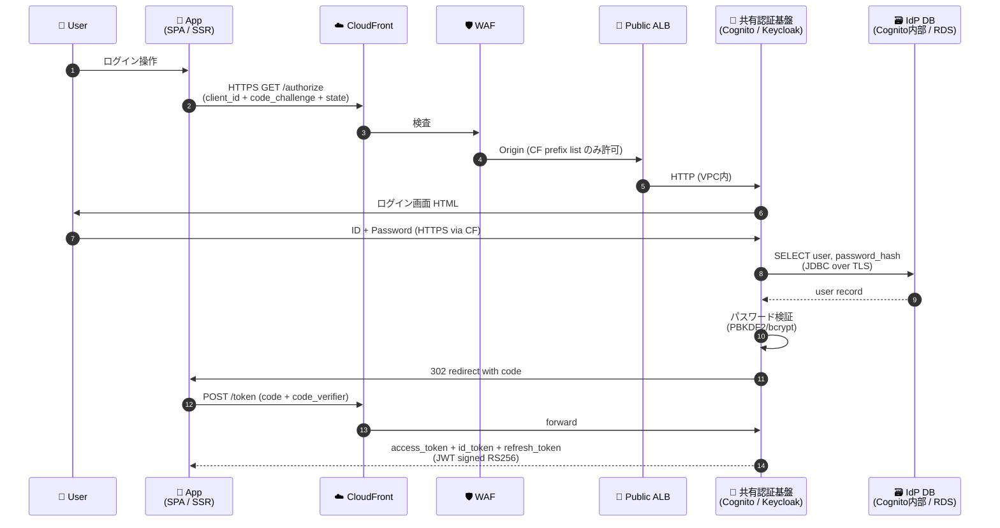

**プロトコル**: ブラウザ↔CloudFront = HTTPS / TLS 1.2+、CF↔ALB = HTTPS / TLS、ALB↔IdP（VPC内）= HTTP 8080、IdP↔DB = JDBC over TLS（Keycloak の場合）

### 4.2 フロー B: 外部 IdP フェデレーション認証（Entra ID 等）

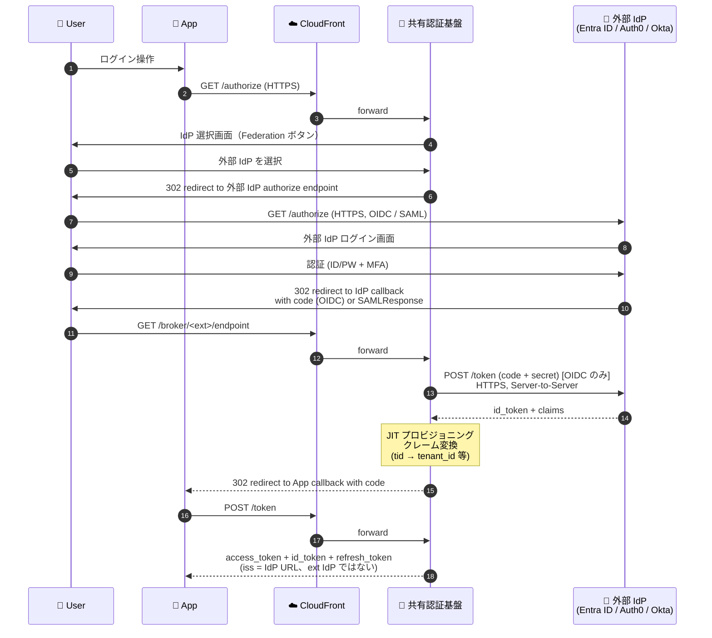

**プロトコル**: 全て HTTPS / TLS 1.2+。外部 IdP との通信は OIDC（OAuth 2.0）または SAML 2.0。

### 4.3 フロー C: API 呼び出し + JWT 検証（SPA / SSR 共通）

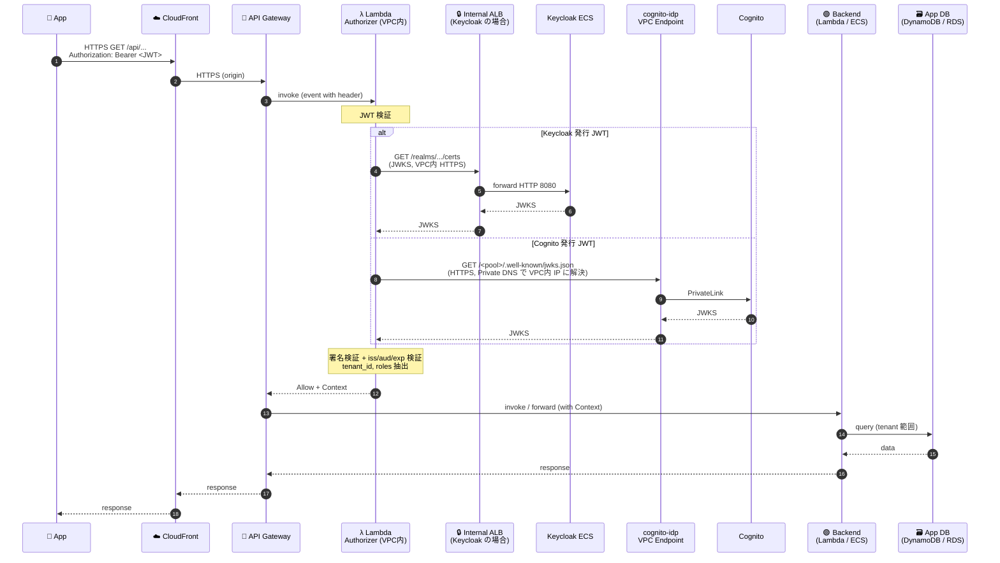

**JWKS キャッシュ**: Lambda Authorizer は 1 時間 TTL でキャッシュ → 通常はネット通信なし

### 4.4 フロー D: DR フェイルオーバー（DR あり構成のみ）

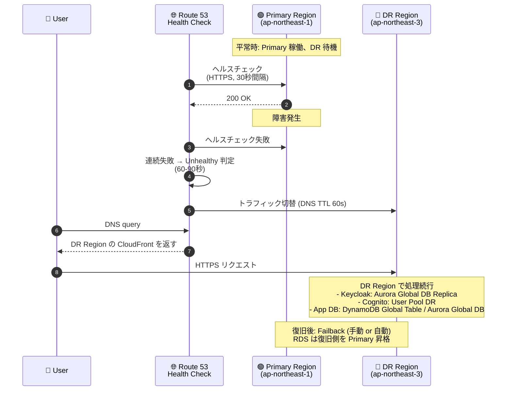

**RTO 目安**: DNS TTL 60s + ヘルスチェック判定 60-90s + DR 起動 = **2〜5 分**
**RPO 目安**: Aurora Global DB の場合 < 1 秒、DynamoDB Global Tables の場合 < 1 秒

---

## 5. パターン詳細

### 5.1 P1: Keycloak + SPA + DR あり

**用途**: 高 SLA（99.95% 以上）SPA + 認証カスタマイズ要件あり + DR 必須（金融・大企業向け）

#### 構成図

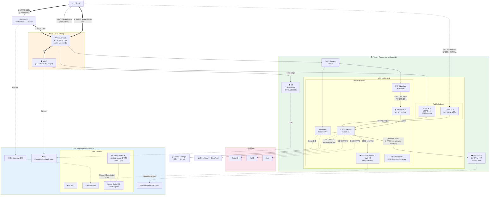

#### コンポーネント詳細

| コンポーネント | 仕様 | 月額目安 |
|------------|------|--------|
| CloudFront + WAF | グローバルエッジ | $10〜50 |
| Route 53 | Failover、ヘルスチェック | $5 |
| S3（SPA + CRR） | 静的アセット | $5 |
| API Gateway | REST API、HTTPS | $5〜（リクエスト課金） |
| Lambda（Auth + BE） | VPC 配置 | $0〜（無料枠） |
| Internal ALB | VPC 内 JWKS 配信（[ADR-012](../adr/012-vpc-lambda-authorizer-internal-jwks.md)） | $17 |
| Public ALB | HTTPS:443 | $25 |
| Admin ALB | HTTPS:443 IP 制限 | $25 |
| ECS Fargate Keycloak | 4vCPU × 8GB × 3 タスク Multi-AZ | $510 |
| Aurora PostgreSQL Multi-AZ | db.r6g.large × 2 | $300 |
| Aurora Global DB（DR） | Replica + クロスリージョン課金 | $300 + $50 |
| ECS Keycloak（DR、Pilot Light） | desired_count=0 待機 | $50（コンテナ停止） |
| DynamoDB Global Table | 2 リージョン | $20〜 |
| VPC Endpoints | ECR/S3/Logs/cognito-idp | $30 |
| Secrets Manager | client_secret 等 | $2 |
| CloudWatch + CloudTrail | 監視・監査 | $20 |
| **合計** | | **~$1,400/月** |

#### このパターンの特徴

- **完全プライベート JWKS**（[ADR-012](../adr/012-vpc-lambda-authorizer-internal-jwks.md)）: VPC Lambda → Internal ALB → Keycloak で JWKS 取得が VPC 内完結
- **DR**: Aurora Global DB（RPO < 1s）+ DynamoDB Global Table + S3 CRR + Route 53 Failover
- **認証カスタマイズ**: Keycloak の Protocol Mapper、Theme、Authentication Flow で柔軟対応
- **コスト**: 月額 ~$1,400 + Keycloak 運用工数

---

### 5.2 P2: Keycloak + SPA + DR なし

**用途**: 認証カスタマイズ要、シングルリージョンで十分（中規模・社内システム）

#### 構成図

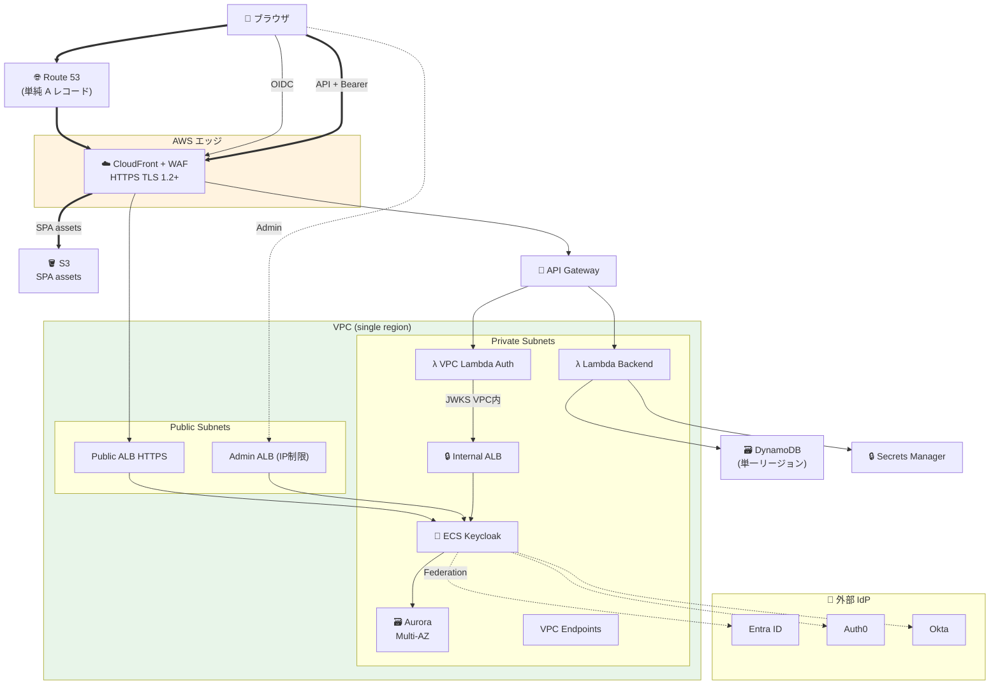

#### P1 との差分

| 項目 | P1（DR あり） | P2（DR なし） |
|------|------------|-----------|
| DR Region | 完全ミラー（Pilot Light） | なし |
| Aurora | Global DB | Multi-AZ のみ |
| DynamoDB | Global Tables | 単一リージョン |
| S3 CRR | あり | なし |
| Route 53 | Health Check + Failover | 単純 A レコード |
| **月額** | **~$1,400** | **~$950** |
| RTO | 2〜5 分 | 数時間（手動復旧） |
| RPO | < 1 秒 | バックアップ間隔次第 |

#### このパターンの特徴

- DR 機能を削減して **月額 $450 程度削減**
- バックアップは自動取得しているため復旧自体は可能、ただし時間がかかる
- 適用範囲: 業務時間外停止が許容できる業務系、社内向け SaaS

---

### 5.3 P3: Keycloak + SSR + DR あり

**用途**: 高 SLA SSR Web App + 認証カスタマイズ + DR 必須（業務系の最高 SLA 案件）

#### 構成図

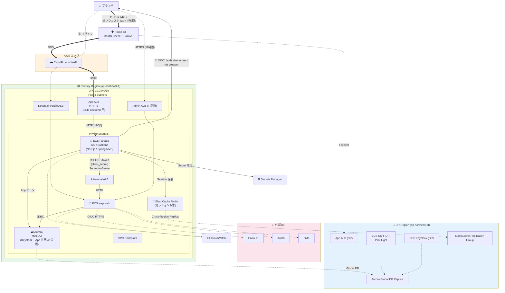

#### コンポーネント詳細

| コンポーネント | 仕様 | 月額目安 |
|------------|------|--------|
| CloudFront + WAF | グローバルエッジ | $10〜50 |
| App ALB | SSR Backend 前段 | $25 |
| **ECS Fargate SSR** | 4vCPU × 8GB × 2 タスク（業務 App） | $340 |
| ECS Keycloak | 4vCPU × 8GB × 3 タスク Multi-AZ | $510 |
| Aurora PostgreSQL Multi-AZ | db.r6g.large × 2 | $300 |
| Aurora Global DB（DR） | Replica + クロスリージョン | $350 |
| ECS SSR + Keycloak（DR） | Pilot Light | $100 |
| **ElastiCache Redis** | セッション保管 cluster.t4g.small × 2 | $50 |
| Internal ALB / Admin ALB | | $42 |
| その他（R53, SM, CW, VPCE） | | $60 |
| **合計** | | **~$1,800/月** |

#### このパターンの特徴

- **Lambda Authorizer を使わない**: SSR がトークンを自前で検証（JWKS 取得 + 署名検証ライブラリ、Spring Security / next-auth / Passport.js 等）
- **セッション管理**: SSR が Redis に access_token を保管、ブラウザには不透明な session_id Cookie のみ
- **API Gateway 不要**: SSR が直接 Aurora にアクセス（DB に直結）
- 認証フロー: [auth-patterns.md §2.2](auth-patterns.md) 参照
- **CORS 不要**（Server-to-Server）

---

### 5.4 P4: Keycloak + SSR + DR なし

#### 構成図

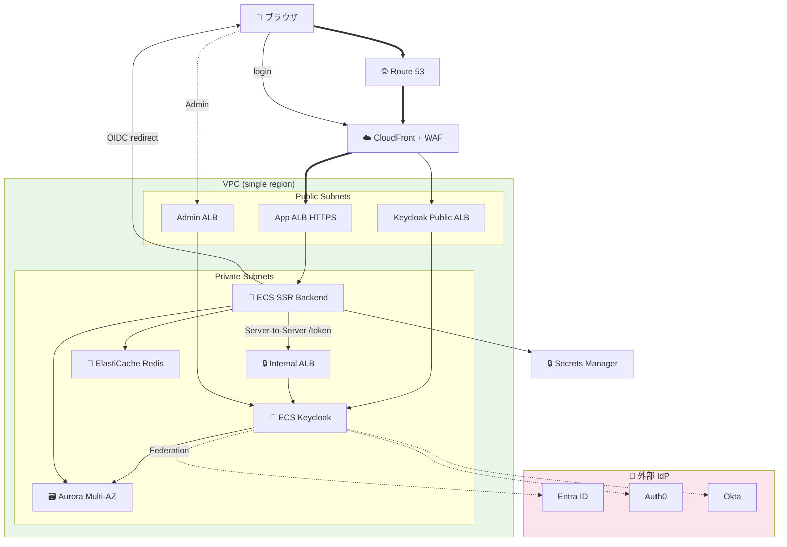

#### P3 との差分

| 項目 | P3（DR あり） | P4（DR なし） |
|------|------------|-----------|
| Aurora | Global DB | Multi-AZ |
| Redis | Cross-Region Replica | 単一クラスタ |
| DR Region | ECS / ALB Pilot Light | なし |
| **月額** | **~$1,800** | **~$1,200** |

---

### 5.5 P5: Cognito + SPA + DR あり

**用途**: 標準的な SPA + 高 SLA + DR 必須、運用負荷最小化（Cognito の典型ユースケース）

#### 構成図

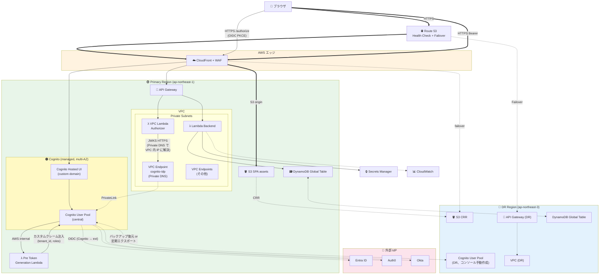

#### コンポーネント詳細

| コンポーネント | 仕様 | 月額目安 |
|------------|------|--------|
| CloudFront + WAF | グローバルエッジ | $10〜50 |
| Route 53 | Failover | $5 |
| S3 + CRR | SPA assets | $5 |
| API Gateway | HTTPS | $5〜 |
| Lambda（Auth, BE, Pre Token） | VPC 配置 | $0〜 |
| **Cognito User Pool（Primary）** | フェデレーション $0.015/MAU | $750（5 万 MAU 想定） |
| **Cognito User Pool（DR）** | 待機、ほぼ無料 | $0〜$50 |
| DynamoDB Global Table | 2 リージョン | $20〜 |
| VPC + Endpoints | cognito-idp + others | $30 |
| その他（SM, CW, CloudTrail） | | $20 |
| **合計** | | **~$900/月**（5 万 MAU） |

#### このパターンの特徴

- **Keycloak の VPC / ALB / ECS / RDS が一切不要** → 大幅なインフラ削減
- **Pre Token Generation Lambda V2** でカスタムクレーム注入（tenant_id, roles）
- **cognito-idp VPC Endpoint** で JWKS 取得を VPC 内完結
- **DR**: Cognito DR は **$0.50/月 + MAU 課金**で済む（Keycloak DR の $890/月と大差）
- **大阪リージョンでの Auth0 制約**: [ADR-007](../adr/007-osaka-auth0-idp-limitation.md)（Entra ID では発生しない想定）

---

### 5.6 P6: Cognito + SPA + DR なし

**用途**: 最小コスト SPA、運用負荷最小（多くの中小規模 SaaS が選択）

#### 構成図

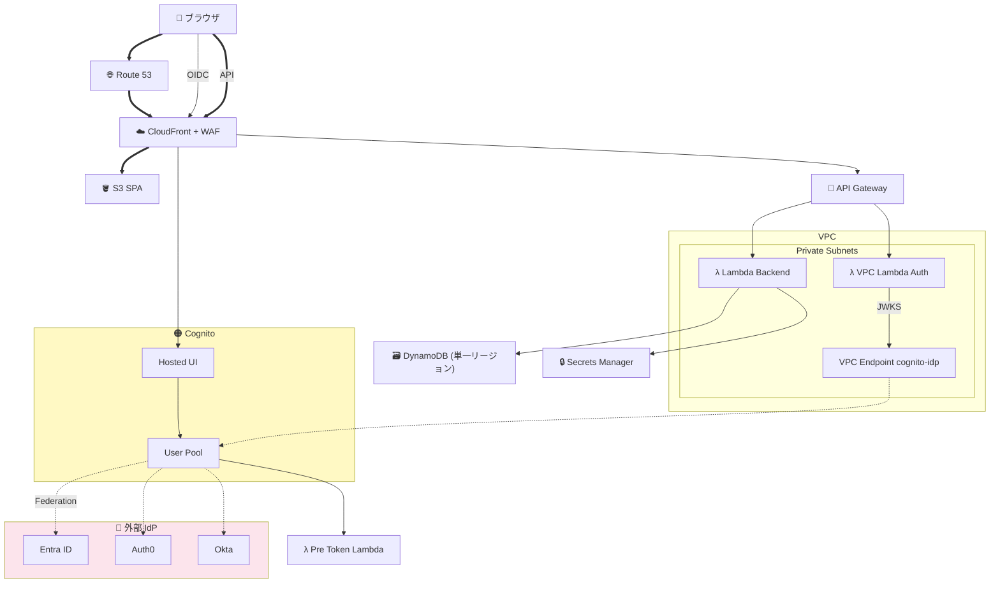

#### P5 との差分

| 項目 | P5（DR あり） | P6（DR なし） |
|------|------------|-----------|
| Cognito DR User Pool | あり | なし |
| DynamoDB | Global Table | 単一リージョン |
| S3 CRR | あり | なし |
| Route 53 Failover | あり | 単純 A レコード |
| **月額** | **~$900** | **~$700** |
| RTO | 2〜5 分 | 1 時間（手動再起動） |

#### このパターンの特徴

- **8 パターン中、最小コスト** → 多くの中小規模 SaaS の標準形
- ECS / RDS / ALB 一切なし、Cognito + Lambda + DynamoDB のフルマネージド構成
- 運用工数: ほぼゼロ（インフラ運用なし）

---

### 5.7 P7: Cognito + SSR + DR あり

**用途**: SSR + Cognito + 高 SLA + DR（運用負荷を抑えた業務系）

#### 構成図

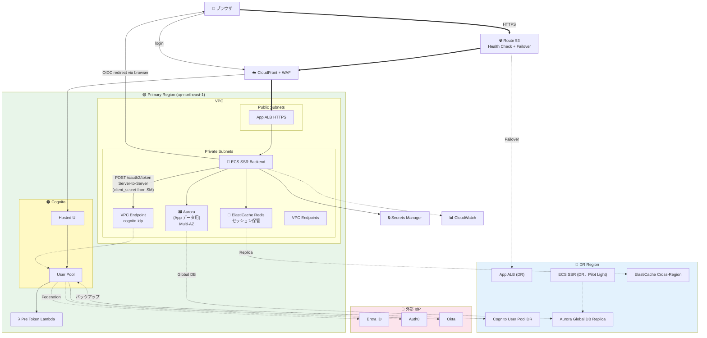

#### コンポーネント詳細

| コンポーネント | 月額目安 |
|------------|--------|
| CloudFront + WAF + Route 53 | $20〜70 |
| App ALB | $25 |
| ECS Fargate SSR（Multi-AZ × 2） | $340 |
| Aurora Multi-AZ + Global DB（DR） | $650 |
| ElastiCache Redis + Cross-Region | $80 |
| Cognito User Pool（Primary + DR） | $750〜（5 万 MAU） |
| ECS SSR DR（Pilot Light） | $50 |
| その他 | $50 |
| **合計** | **~$1,300/月** |

#### このパターンの特徴

- SSR の認証フローは [auth-patterns.md §2.2](auth-patterns.md) と同じ（IdP が Cognito になるだけ）
- **JWT 検証は SSR 内で実施**（Lambda Authorizer 経由しない）
- Cognito 非対応機能（Token Exchange / Device Code 等）が要件にないこと前提

---

### 5.8 P8: Cognito + SSR + DR なし

#### 構成図

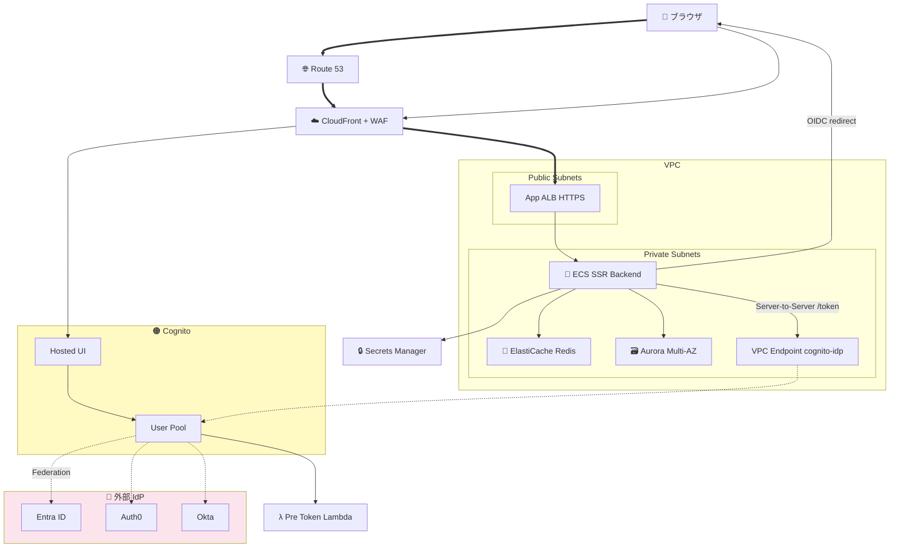

#### P7 との差分

| 項目 | P7（DR あり） | P8（DR なし） |
|------|------------|-----------|
| Cognito DR User Pool | あり | なし |
| Aurora | Global DB | Multi-AZ |
| Redis | Cross-Region | 単一クラスタ |
| **月額** | **~$1,300** | **~$900** |

---

## 6. プロトコル一覧（全パターン共通）

| 経路 | プロトコル | 暗号化 | 認証方式 |
|------|---------|--------|---------|
| ブラウザ → CloudFront | HTTPS / TLS 1.2+ | TLS | — |
| CloudFront → S3 origin | HTTPS | TLS | OAC / Origin Access Control |
| CloudFront → ALB origin | HTTPS | TLS | CloudFront prefix list + カスタムヘッダー（[ADR-013](../adr/013-cloudfront-waf-ip-restriction.md)） |
| CloudFront → API Gateway | HTTPS | TLS | カスタムヘッダー or IAM |
| 共有認証基盤 → 外部 IdP | HTTPS（OIDC） / HTTPS（SAML） | TLS | client_id + client_secret / mTLS（オプション） |
| App → Cognito Hosted UI | HTTPS | TLS | OIDC Authorization Code |
| App → Cognito /token | HTTPS | TLS | client_secret（Confidential）/ PKCE（Public）|
| ECS → Cognito | HTTPS via VPC Endpoint | TLS | client_secret + IAM |
| ALB → ECS | HTTP（PoC）/ HTTPS（本番） | TLS（本番） | SG ベース |
| Lambda → Internal ALB | HTTP（PoC）/ HTTPS（本番） | TLS（本番） | SG ベース |
| ECS → RDS / Aurora | JDBC over TLS | TLS | DB ユーザー認証（Secrets Manager 管理） |
| ECS → ElastiCache | RESP / Redis over TLS | TLS | AUTH password |
| ECS → DynamoDB | HTTPS via Gateway Endpoint | TLS | IAM |
| API Gateway → Lambda Authorizer | Lambda Invoke | AWS internal | IAM |
| Lambda → Secrets Manager | HTTPS via VPC Endpoint | TLS | IAM |

---

## 7. パターン選定ガイド

### 7.1 フローチャート

```mermaid
flowchart TB
    Start[要件確認開始]
    Q1{認証パターンに<br/>Token Exchange / Device Code /<br/>SAML IdP 発行 / mTLS のいずれか?}
    Q2{FIPS / 24/7 サポート必須?}
    Q3{SSR が必要?<br/>(Next.js / Spring MVC 等)}
    Q4{DR が必要?<br/>(SLA 99.95% 以上 or RPO < 1分)}
    Q5{MAU > 175,000?}

    KCRHBK[Keycloak RHBK]
    KCOSS[Keycloak OSS]
    Cog[Cognito]

    SPADR[SPA + DR]
    SPANoDR[SPA + DR なし]
    SSRDR[SSR + DR]
    SSRNoDR[SSR + DR なし]

    Start --> Q1
    Q1 -->|Yes| Q2
    Q1 -->|No| Q5
    Q5 -->|Yes| Q2
    Q5 -->|No| Cog
    Q2 -->|Yes| KCRHBK
    Q2 -->|No| KCOSS
    Cog --> Q3
    KCOSS --> Q3
    KCRHBK --> Q3
    Q3 -->|No SPA| Q4
    Q3 -->|Yes SSR| Q4
    Q4 -->|Yes DR| SPADR
    Q4 -->|No| SPANoDR
    Q4 -->|Yes DR for SSR| SSRDR
    Q4 -->|No for SSR| SSRNoDR

    style Cog fill:#fff9c4
    style KCRHBK fill:#ffe4b5
    style KCOSS fill:#fce4ec
```

### 7.2 推奨マトリクス

| 要件 | 推奨パターン |
|------|----------|
| 中小規模 SaaS、最小コスト | **P6** (Cognito + SPA + DR なし) |
| 中規模 SaaS、SLA 99.9%、DR 必要 | **P5** (Cognito + SPA + DR) |
| 業務系、SSR、Cognito | **P7 / P8** |
| 認証カスタマイズ必須、SPA | **P1 / P2** (Keycloak + SPA) |
| 認証カスタマイズ必須、SSR | **P3 / P4** (Keycloak + SSR) |
| 金融・規制業界、FIPS 必須 | **P3** (Keycloak RHBK + SSR + DR) |

### 7.3 コスト比較サマリー

| パターン | 月額（5 万 MAU 想定） | 1 年合計 | 3 年 TCO（運用込み） |
|---------|----------------|---------|----------------|
| P1: KC + SPA + DR | $1,400 | $16,800 | ~$80,000 |
| P2: KC + SPA | $950 | $11,400 | ~$60,000 |
| P3: KC + SSR + DR | $1,800 | $21,600 | ~$95,000 |
| P4: KC + SSR | $1,200 | $14,400 | ~$70,000 |
| P5: Cog + SPA + DR | $900 | $10,800 | ~$35,000 |
| **P6: Cog + SPA** | **$700** | **$8,400** | **~$28,000** |
| P7: Cog + SSR + DR | $1,300 | $15,600 | ~$50,000 |
| P8: Cog + SSR | $900 | $10,800 | ~$38,000 |

※ MAU 増加時は ADR-006 のコスト損益分岐参照（17.5 万 MAU で Cognito ≈ Keycloak）

---

## 8. 関連ドキュメント

- [keycloak-network-architecture.md](keycloak-network-architecture.md): Keycloak 環境のネットワーク詳細
- [auth-patterns.md](auth-patterns.md): 9 つの認証パターン詳細
- [authz-architecture-design.md](authz-architecture-design.md): 認可アーキテクチャ
- [identity-broker-multi-idp.md](identity-broker-multi-idp.md): マルチ IdP 設計
- [jwks-public-exposure.md](jwks-public-exposure.md): JWKS 公開の暗号学的根拠
- ADR-006、010〜015
