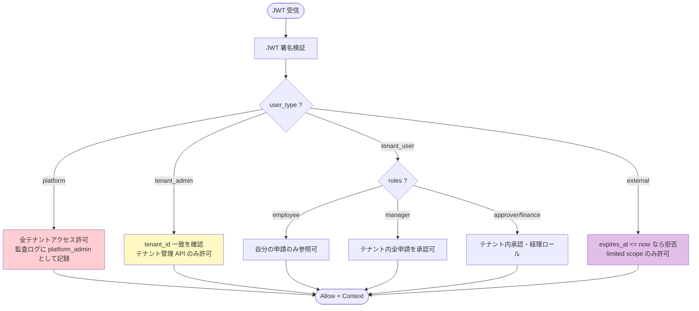
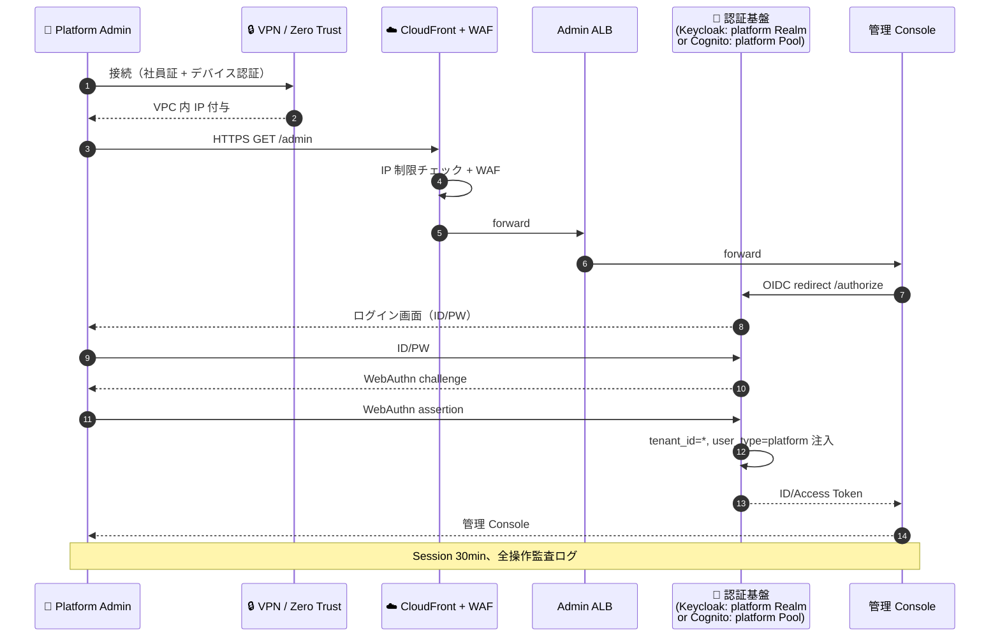
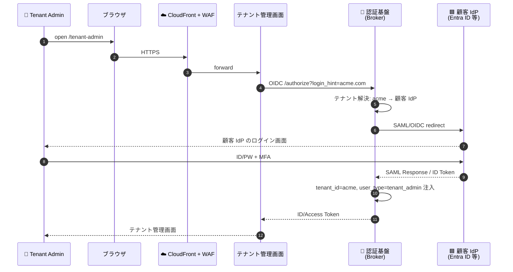
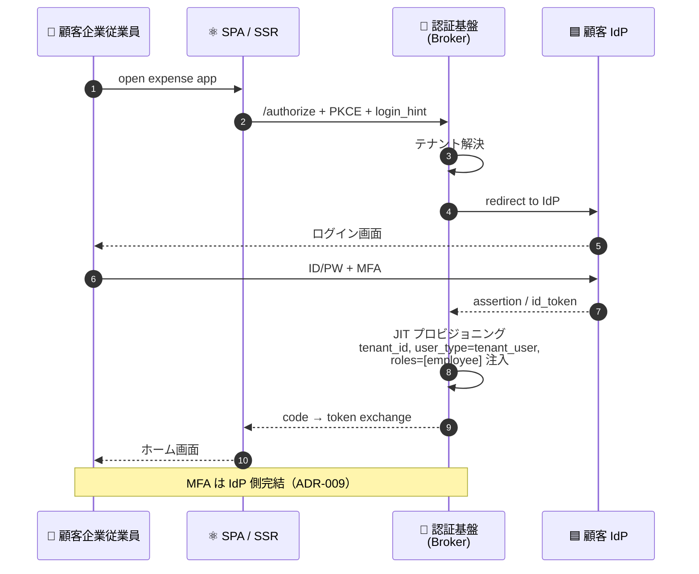
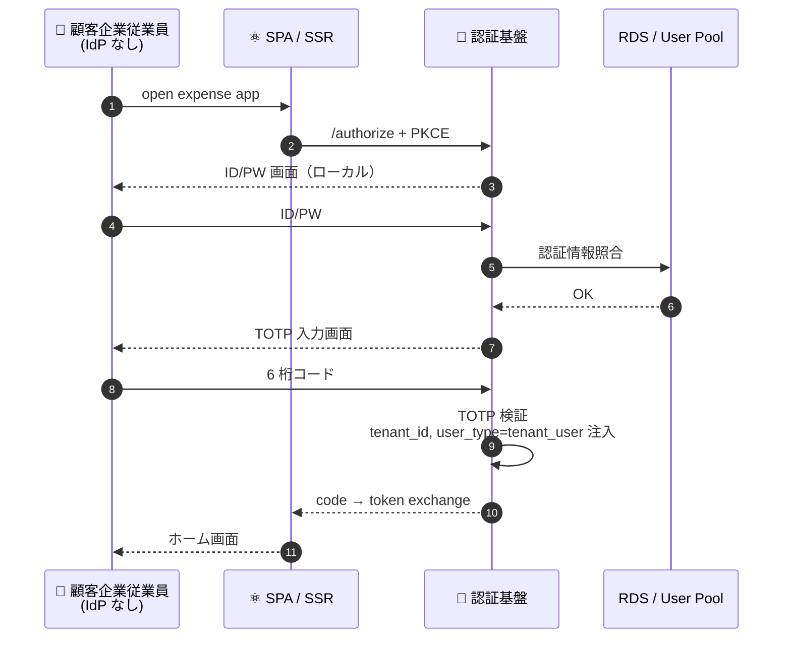
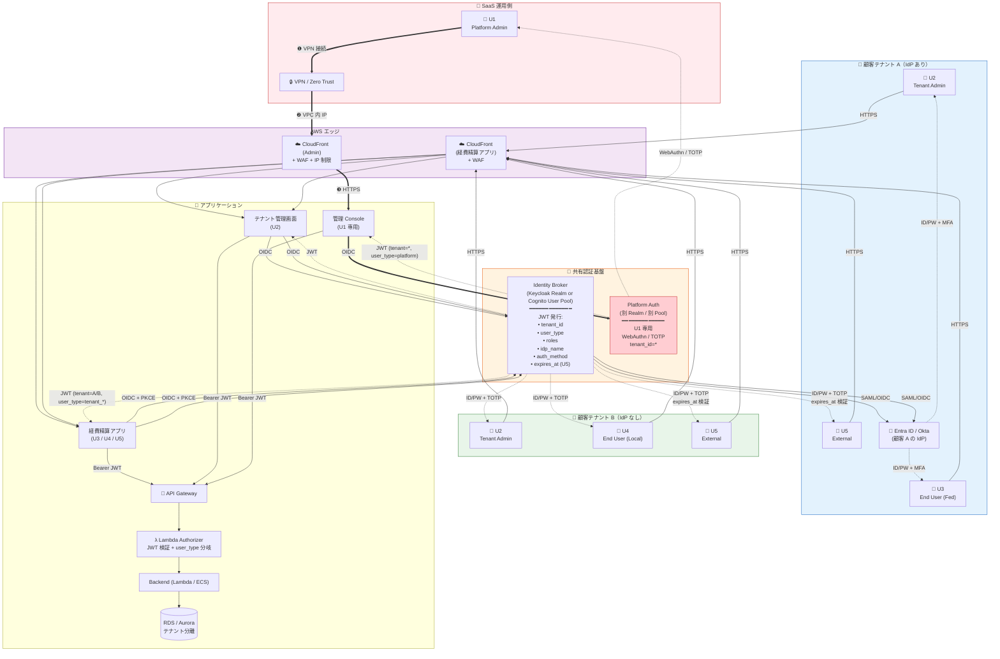

# ユーザー種別と認証方式の整理

**作成日**: 2026-05-08
**目的**: 経費精算 SaaS（マルチテナント、顧客 IdP 連携有無あり）におけるユーザー種別と、各種別の認証方式・JWT クレーム・実装上の差分を整理する
**位置づけ**: 8 つの構成図（Keycloak/Cognito × SPA/SSR × DR 有無）を描く前提の共通定義

---

## 1. 前提となるビジネス想定

### 1.1 製品形態
- **経費精算 SaaS** をパッケージとして複数の顧客企業に販売
- **マルチテナント**: 1 顧客企業 = 1 テナント。テナント間データは完全分離
- **顧客は今後も増え続ける**（IdP 接続が増加）

### 1.2 顧客の IdP 連携パターン
| パターン | 想定される顧客像 | 占有率（想定） |
|---|---|:---:|
| **連携あり** | 大手・中堅企業、既に Entra ID / Okta / Google Workspace を導入 | 約 60-70% |
| **連携なし** | 中小企業、IT 専任不在、ID 管理は SaaS 側に委ねたい | 約 30-40% |

### 1.3 関連既存ドキュメント
- [identity-broker-multi-idp.md](identity-broker-multi-idp.md): Identity Broker パターン
- [claim-mapping-authz-scenario.md](claim-mapping-authz-scenario.md): Phase 8 のテナント・ロール設計（`employee` / `manager` / `admin`）
- [auth-patterns.md](auth-patterns.md): SPA / SSR / M2M 等のパターン総覧
- [ADR-009](../adr/009-mfa-responsibility-by-idp.md): MFA 責務は IdP 側

---

## 2. ユーザー種別の定義（5 カテゴリ）

```
┌─────────────────────────────────────────────────────────────┐
│  SaaS 運用側（自社）                                          │
│  ┌───────────────────────────────┐                          │
│  │ U1: Platform Admin            │  全テナント横断、特権     │
│  │     プラットフォーム全体管理者  │  顧客 IdP 非依存           │
│  └───────────────────────────────┘                          │
└─────────────────────────────────────────────────────────────┘
┌─────────────────────────────────────────────────────────────┐
│  顧客テナント側（売り先の各企業ごと）                          │
│  ┌───────────────────────────────┐                          │
│  │ U2: Tenant Admin              │  単一テナント内管理       │
│  │     顧客企業 IT 管理者          │                          │
│  ├───────────────────────────────┤                          │
│  │ U3: End User (Federated)      │  顧客 IdP 経由（多数派）   │
│  │     IdP 連携あり一般ユーザー    │                          │
│  ├───────────────────────────────┤                          │
│  │ U4: End User (Local)          │  SaaS ローカル認証        │
│  │     IdP なし一般ユーザー        │                          │
│  ├───────────────────────────────┤                          │
│  │ U5: External Party            │  期限付き招待ベース        │
│  │     税理士・監査人 等           │                          │
│  └───────────────────────────────┘                          │
└─────────────────────────────────────────────────────────────┘
```

### U1: Platform Admin（SaaS 運用側管理者）
| 項目 | 内容 |
|---|---|
| 誰 | 自社運用チーム（SRE / カスタマーサクセス / サポート） |
| 主要操作 | テナント追加、障害対応、テナント横断のシステム設定、監査 |
| アクセス入口 | **専用管理コンソール**（経費精算 UI と別 URL） |
| ネットワーク制約 | IP 制限 + VPN/SSO + WAF |
| テナント境界 | **全テナント横断**（`tenant_id: *`） |
| 認証ソース | **必ずローカル**（顧客 IdP 非依存。緊急時のロックアウト回避） |
| MFA | SaaS 側で強制（解除不可）、**WebAuthn 強推奨** |
| Session | 30 分（短）、操作のたびに延長、長時間放置で強制ログアウト |

### U2: Tenant Admin（顧客企業 IT 管理者）
| 項目 | 内容 |
|---|---|
| 誰 | 顧客企業の情シス・経理部長・SaaS 契約担当 |
| 主要操作 | 自社ユーザー追加・無効化、IdP 連携設定、承認フロー設定、利用料金確認 |
| アクセス入口 | **テナント管理画面**（経費精算 UI 内の管理タブ or 別 URL） |
| ネットワーク制約 | WAF + 顧客側 IP 制限オプション |
| テナント境界 | **単一テナント内**（自社のみ） |
| 認証ソース | ローカル or 顧客 IdP（テナント契約時に選択） |
| MFA | 必須（IdP 経由なら IdP 側、ローカルなら SaaS 側 TOTP） |
| Session | 中（4-8 時間） |

### U3: End User - Federated（顧客側一般ユーザー・IdP 連携あり）
| 項目 | 内容 |
|---|---|
| 誰 | 顧客企業の従業員（同社が Entra ID / Okta / Google Workspace 等を導入済） |
| 主要操作 | 経費申請、承認、参照 |
| アクセス入口 | 経費精算アプリ |
| プロビジョニング | **JIT**（初回ログイン時に自動作成）or **SCIM**（IdP 側からプッシュ） |
| 認証ソース | **顧客 IdP**（フェデレーション） |
| MFA | **IdP 側で実施**（[ADR-009](../adr/009-mfa-responsibility-by-idp.md)） |
| 主要ロール | `employee` / `manager` / `approver` / `finance`（IdP のグループ属性からマッピング） |
| Session | IdP 設定依存（通常 4-8 時間） |

### U4: End User - Local（顧客側一般ユーザー・IdP 連携なし）
| 項目 | 内容 |
|---|---|
| 誰 | 顧客企業の従業員（同社が IdP 未導入 = 中小企業に多い） |
| 主要操作 | U3 と同じ |
| アクセス入口 | 経費精算アプリ |
| プロビジョニング | Tenant Admin (U2) が招待 or CSV インポート |
| 認証ソース | **SaaS ローカル**（ID/PW） |
| MFA | **SaaS 側で必須**（TOTP） |
| セルフサービス | パスワードリセット、MFA 再登録、プロフィール変更 |
| Session | 4-8 時間 |

### U5: External Party（外部関係者）
| 項目 | 内容 |
|---|---|
| 誰 | 税理士、社外監査人、会計事務所の担当者 |
| 主要操作 | 監査ログ閲覧、データエクスポート、特定期間の参照 |
| アクセス入口 | 経費精算アプリ（限定 UI） |
| プロビジョニング | **Tenant Admin (U2) が期限付きで招待** |
| 認証ソース | SaaS ローカル（招待リンクから登録） |
| MFA | 必須（TOTP） |
| 制約 | **`expires_at` クレームで有効期限を強制**、デフォルト 30 日 |
| 主要ロール | `external_auditor` / `external_advisor` |
| Session | 30 分（短） |

---

## 3. 認証特性マトリクス

| 軸 | U1 Platform Admin | U2 Tenant Admin | U3 End User Fed | U4 End User Local | U5 External |
|---|---|---|---|---|---|
| プロビジョニング | 内部稟議・手動 | テナント契約時に SaaS 発行 | JIT or SCIM | U2 が招待 | U2 が期限付き招待 |
| 認証ソース | **必ずローカル** | ローカル or 顧客 IdP | **顧客 IdP** | ローカル | ローカル |
| MFA 責務 | SaaS 側（強制） | SaaS or IdP | **IdP 側** | SaaS 側（必須） | SaaS 側（必須） |
| MFA 方式 | WebAuthn 推奨 / TOTP | TOTP | IdP 任せ | TOTP | TOTP |
| テナント境界 | **全テナント横断** | 単一テナント内 | 単一テナント内 | 単一テナント内 | 単一テナント内 |
| 主要ロール | `platform_admin` | `tenant_admin` | `employee/manager/approver/finance` | 同左 | `external_auditor/advisor` |
| アクセス UI | 専用管理 Console | テナント管理画面 | 経費精算アプリ | 同左 | 経費精算アプリ（限定 UI） |
| ネットワーク制限 | IP + VPN + WAF | WAF + 顧客 IP オプション | WAF | WAF | WAF |
| Session TTL | 30 分 | 4-8 時間 | IdP 依存 | 4-8 時間 | 30 分 |
| 有効期限 | — | — | — | — | **必須**（`expires_at`） |
| 監査ログ粒度 | 最高 | 高 | 中 | 中 | 高 |
| PoC 検証 | ❌ 未 | △ 概念設計のみ | ✅ Phase 2/7/8/9 | ✅ Phase 1/6/8 | ❌ 未 |

---

## 4. JWT クレーム設計

PoC Phase 8 では `tenant_id / roles / email` を JWT に注入していた。5 ユーザー種別を扱うために以下のクレームを追加・拡張する。

### 4.1 クレーム一覧

| クレーム | U1 | U2 | U3 | U4 | U5 | 説明 |
|---|---|---|---|---|---|---|
| `sub` | uuid | uuid | uuid | uuid | uuid | ユーザー一意 ID |
| `tenant_id` | `*` | 単一値 | 単一値 | 単一値 | 単一値 | テナント識別。`*` は全テナント |
| `user_type` | `platform` | `tenant_admin` | `tenant_user` | `tenant_user` | `external` | **新規追加**: 認可判定の高速化 |
| `roles` | `[platform_admin]` | `[tenant_admin]` | `[employee, manager, ...]` | 同左 | `[external_auditor]` | 既存 |
| `idp_name` | `internal` | `internal` or IdP 名 | IdP 名 | `local` | `local` | 発行元 IdP（監査用） |
| `auth_method` | `webauthn` / `totp` | `password+totp` / `idp` | `idp` | `password+totp` | `password+totp` | 認証手段（リスク評価用） |
| `email` | あり | あり | あり | あり | あり | 通知用 |
| `expires_at` | — | — | — | — | **必須** | U5 のアクセス有効期限 |
| `session_id` | あり | あり | あり | あり | あり | Logout / Revoke 用 |

### 4.2 認可判定のフロー（Lambda Authorizer / Backend）



### 4.3 `user_type` クレームを設ける理由

- **Lambda Authorizer の認可分岐を高速化**: `roles` だけでは「tenant 横断か否か」を判定しづらい
- **監査ログの粒度向上**: U1 の操作と U2 の操作を区別して記録
- **誤設定の検出**: U3 / U4 の JWT に `platform_admin` ロールが混入していても `user_type = tenant_user` で防御層が機能

---

## 5. ユーザー種別ごとの認証フロー

### 5.1 U1: Platform Admin



### 5.2 U2: Tenant Admin（顧客 IdP 連携の場合）



### 5.3 U3: End User - Federated



### 5.4 U4: End User - Local



### 5.5 U5: External Party

```mermaid
sequenceDiagram
    autonumber
    participant TA as Tenant Admin
    participant Ext as 👤 External (税理士)
    participant Broker as 🔐 認証基盤
    participant App as 経費精算アプリ

    TA->>Broker: 招待発行 (email, expires_at=30d, roles=[external_auditor])
    Broker-->>Ext: 招待メール（署名付きリンク）
    Ext->>Broker: リンク open + パスワード設定 + TOTP 登録
    Broker-->>Ext: 登録完了

    Note over Ext: 後日のログイン
    Ext->>App: open
    App->>Broker: /authorize
    Ext->>Broker: ID/PW + TOTP
    Broker->>Broker: expires_at &gt; now を検証<br/>user_type=external 注入
    Broker-->>App: token (limited scope)
    App-->>Ext: 限定 UI
    Note over Broker: 期限切れ後は自動失効
```

---

## 6. 5 ユーザー種別を 1 枚に集約した構成図

経費精算 SaaS の論理アーキテクチャを、**5 ユーザー種別すべての経路を 1 枚に集約**して示す。インフラの具体（SPA/SSR、DR 有無）は 8 構成図で詳細化するため、ここでは**認証基盤までの経路と外部 IdP 連携の構造**に集中。



### 6.1 構成図の重要ポイント

| 観点 | 設計判断 |
|---|---|
| **Platform Auth と Broker の分離** | U1 専用に別 Realm / 別 User Pool を立て、顧客テナント側障害が U1 に波及しないようにする |
| **CloudFront を Admin / App で分離** | Admin は IP 制限 + WAF 厳格、App は WAF のみ |
| **JIT プロビジョニング (U3)** | 初回ログイン時に Broker がユーザー作成 + テナントマッピング |
| **`tenant_id` ベースの DB アクセス制御** | Lambda Authorizer の Context に `tenant_id` を伝播、Backend で必ず WHERE 句に注入 |
| **expires_at (U5)** | Lambda Authorizer で `expires_at <= now()` を拒否、Broker でも自動失効 |

---

## 7. Keycloak vs Cognito での実装差分

5 ユーザー種別すべてを実装した場合の比較。

| 観点 | Keycloak 実装 | Cognito 実装 |
|---|---|---|
| **U1 と他の分離** | 別 Realm（`platform-admin`）を立てる | 別 User Pool を立てる |
| **テナント管理 (U2)** | 同一 Realm 内で `tenant_id` 属性で区別 | 同一 User Pool 内で `custom:tenant_id` で区別、または Pool を分ける（コスト次第） |
| **U3 IdP 連携** | Identity Brokering（Realm に複数 IdP 設定） | Cognito IdP に SAML/OIDC 登録 |
| **U4 ローカル** | Keycloak User DB | Cognito ローカルユーザー |
| **U5 期限付き** | User Attribute `expires_at` + Conditional Authentication | Pre Token Lambda で `expires_at` 注入 + Backend 検証 |
| **JIT プロビジョニング** | First Broker Login Flow | Pre Sign-up Lambda Trigger |
| **`user_type` クレーム** | Protocol Mapper（User Attribute / Group Mapping） | Pre Token Generation Lambda V2 |
| **MFA 制御** | Conditional OTP（IdP 経由なら skip） | Cognito Pool MFA + Pre Auth Lambda で IdP 判定 |
| **WebAuthn (U1)** | ✅ ネイティブ対応 | ⚠ 限定（パスキー対応は最近）、運用考慮要 |
| **テナントごとの IdP 設定追加** | Admin Console or API で動的追加可 | Cognito API で動的追加可、再デプロイ不要 |
| **PoC 検証範囲** | U3 / U4 を Phase 7-9 で検証 | U3 / U4 を Phase 1-5, 8 で検証 |
| **U1 / U2 / U5 未検証** | 両者とも未検証、要件定義で追加検証必要 | 同左 |

### 7.1 user_type クレーム注入の実装例

**Keycloak**: User Attribute → Protocol Mapper
```
User Attribute: user_type = "tenant_user"
Protocol Mapper: User Attribute Mapper
  - Token Claim Name: user_type
  - Add to ID Token / Access Token: ✓
```

**Cognito**: Pre Token Generation Lambda V2
```python
def lambda_handler(event, context):
    user_type = determine_user_type(event['request']['userAttributes'])
    event['response']['claimsAndScopeOverrideDetails'] = {
        'accessTokenGeneration': {
            'claimsToAddOrOverride': {
                'user_type': user_type,
                'tenant_id': event['request']['userAttributes']['custom:tenant_id'],
            }
        }
    }
    return event
```

---

## 8. 8 構成図への影響

提示の 8 構成（Keycloak/Cognito × SPA/SSR × DR 有無）すべてで、本ドキュメントの 5 ユーザー種別を統一的に扱う。

### 8.1 構成図ごとの差分（認証部分）

| 構成軸 | 認証フローへの影響 |
|---|---|
| Keycloak vs Cognito | §7 の実装差分。フロー骨格は同じ |
| SPA vs SSR | SPA = Authorization Code + PKCE、SSR = Authorization Code + client_secret。**ユーザー側で差は見えない** |
| DR あり vs なし | U1（運用継続）と U3 / U4（業務継続）の経路がリージョン冗長化されるか |

### 8.2 構成図で記載すべき要素チェックリスト

各構成図で以下が描かれているか確認:

- [ ] U1 専用経路（VPN / Zero Trust → 専用管理 Console）
- [ ] U2 経路（顧客 IdP 連携あり/なし両対応）
- [ ] U3 の Identity Brokering 経路（外部 IdP との SAML/OIDC）
- [ ] U4 のローカル認証経路（TOTP MFA 含む）
- [ ] U5 の期限付き招待経路（`expires_at` 検証）
- [ ] JWT 発行と Lambda Authorizer での `user_type` 分岐
- [ ] テナント境界（`tenant_id`）の伝播
- [ ] Platform Auth と Broker の分離（U1 用と他用）
- [ ] DR ありの場合は上記すべてのリージョン冗長化

### 8.3 描き分けの実務

「1 枚に 5 ユーザー種別」（§6 の集約図）を 8 構成それぞれで描くと密度が高くなる。実務的には以下のレイヤ分け推奨:

| レイヤ | 内容 |
|---|---|
| **Layer 1**: 全体集約図 | §6 のスタイルで 5 経路を 1 枚 |
| **Layer 2**: ネットワーク詳細図 | VPC / ALB / Subnet / VPC Endpoint の具体 |
| **Layer 3**: シーケンス図（U1-U5 各 1 本） | §5 のスタイルで 5 本 |

8 構成 × Layer 1〜3 = 最大 8 × 7 = 56 枚。**現実的には Layer 1 のみ 8 枚 + Layer 3 は代表構成 1 つ分のみで十分**。

---

## 9. 要件定義での確認事項

本ドキュメントで前提とした仮定を、要件定義で確定する必要がある。

| # | 確認事項 | 影響 |
|---|---|---|
| Q-U1 | Platform Admin の運用体制と人数（オンコール体制） | U1 経路の SLA・MFA 方式選定 |
| Q-U2 | Tenant Admin の最低限の機能（IdP 設定の自助範囲） | U2 経路のスコープ |
| Q-U3 | サポートする顧客 IdP の種類（Entra ID / Okta / Google Workspace / SAML / LDAP） | Broker の対応プロトコル |
| Q-U4 | ローカルユーザーのパスワードポリシー（長さ / 履歴 / 期限） | コンプライアンス |
| Q-U5 | External の最大有効期限・更新可否 | UI と Broker の実装 |
| Q-MFA-1 | U1 / U2 / U4 / U5 の MFA 方式選択肢（TOTP / WebAuthn / SMS） | UI / 運用負荷 |
| Q-PROV-1 | U3 のプロビジョニング方式（JIT or SCIM or 両方） | SCIM 実装の要否 |
| Q-AUDIT-1 | 監査ログの保存期間と取り出し API | コスト・運用 |

---

## 10. 関連ドキュメント

| ドキュメント | 役割 | 本ドキュメントとの関係 |
|---|---|---|
| [system-design-patterns.md](system-design-patterns.md) | **8 構成図（IdP × SPA/SSR × DR）の設計パターン集** | 本ドキュメント = ユーザー軸、あちら = インフラ軸。直交関係 |
| [auth-patterns.md](auth-patterns.md) | SPA / SSR / M2M 等の認証パターン総覧 | 本ドキュメントの U3 / U4 経路は SPA / SSR どちらでも適用 |
| [identity-broker-multi-idp.md](identity-broker-multi-idp.md) | Identity Broker パターン | U3 のフェデレーション経路の詳細 |
| [claim-mapping-authz-scenario.md](claim-mapping-authz-scenario.md) | Phase 8 のテナント・ロール設計 | `tenant_id` / `roles` クレームの根拠 |
| [authz-architecture-design.md](authz-architecture-design.md) | 認可アーキテクチャ | Lambda Authorizer の `user_type` 分岐の前提 |
| [keycloak-network-architecture.md](keycloak-network-architecture.md) | 本番想定ネットワーク | U1 専用経路の IP 制限 / WAF / VPN |
| [ADR-009](../adr/009-mfa-responsibility-by-idp.md) | MFA 責務 by IdP | U3 の MFA を IdP 側に委ねる根拠 |
| [ADR-014](../adr/014-auth-patterns-scope.md) | 認証パターン対応範囲 | 本ドキュメントの 5 ユーザー種別が対象範囲に収まるか |
| [requirements/platform-selection-decision.md](../requirements/platform-selection-decision.md) | プラットフォーム選定 | §9 の確認事項 Q-U1〜Q-AUDIT-1 を評価に反映 |

### 読む順序の推奨

1. **「どんなユーザーが使う？」** → 本ドキュメント
2. **「どんなインフラ構成パターン？」** → [system-design-patterns.md](system-design-patterns.md)
3. **「認証プロトコルの詳細は？」** → [auth-patterns.md](auth-patterns.md)
4. **「複数 IdP の仲介はどう設計？」** → [identity-broker-multi-idp.md](identity-broker-multi-idp.md)
5. **「JWT クレーム・認可はどう実装？」** → [claim-mapping-authz-scenario.md](claim-mapping-authz-scenario.md) + [authz-architecture-design.md](authz-architecture-design.md)

---

## 11. 変更履歴

| 日付 | 内容 |
|---|---|
| 2026-05-08 | 初版（5 ユーザー種別の定義、認証特性マトリクス、JWT クレーム設計、ユーザー別シーケンス図、5 経路集約構成図、Keycloak/Cognito 実装差分） |
