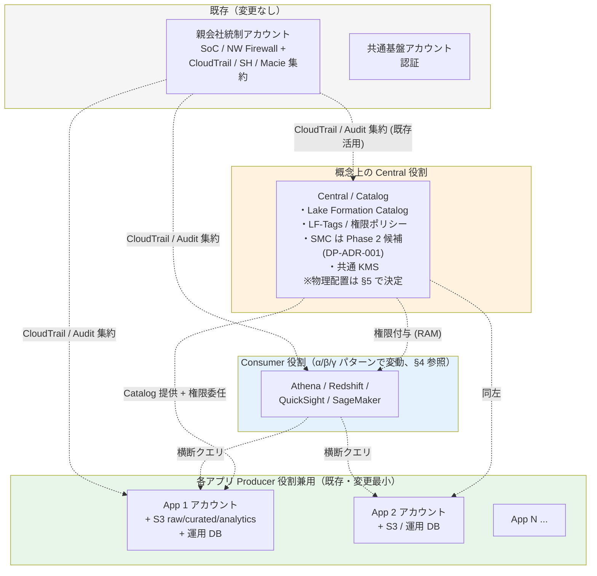
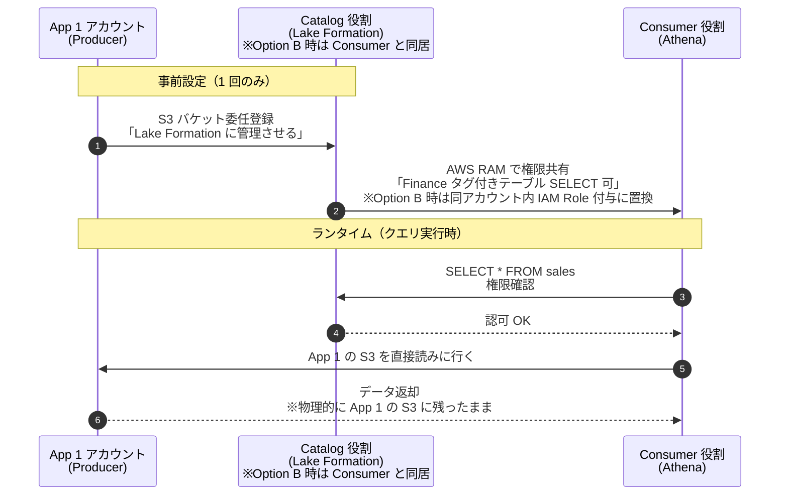
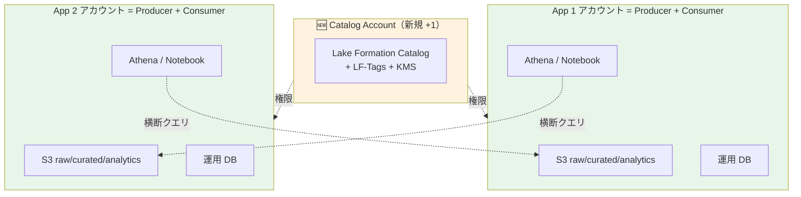
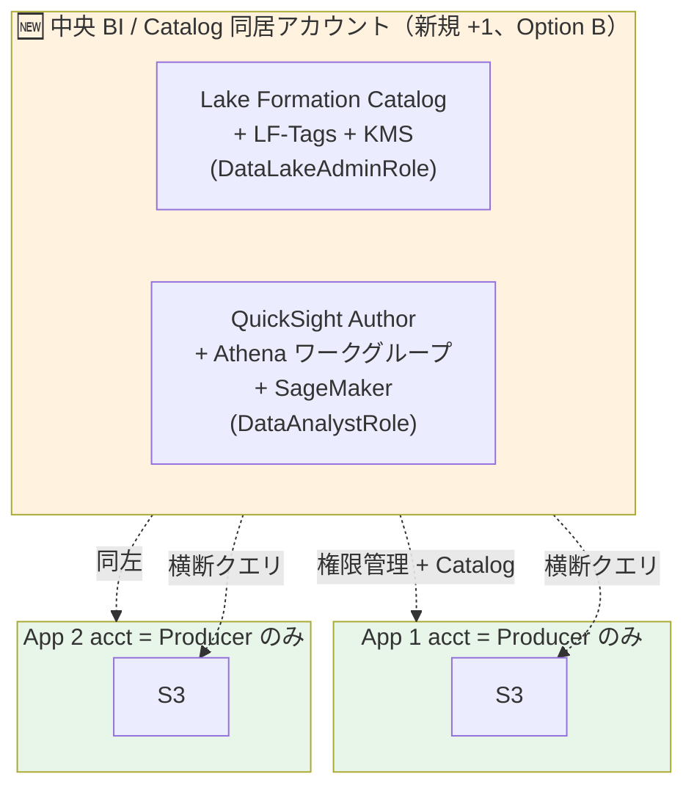
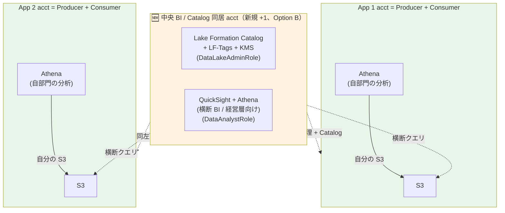
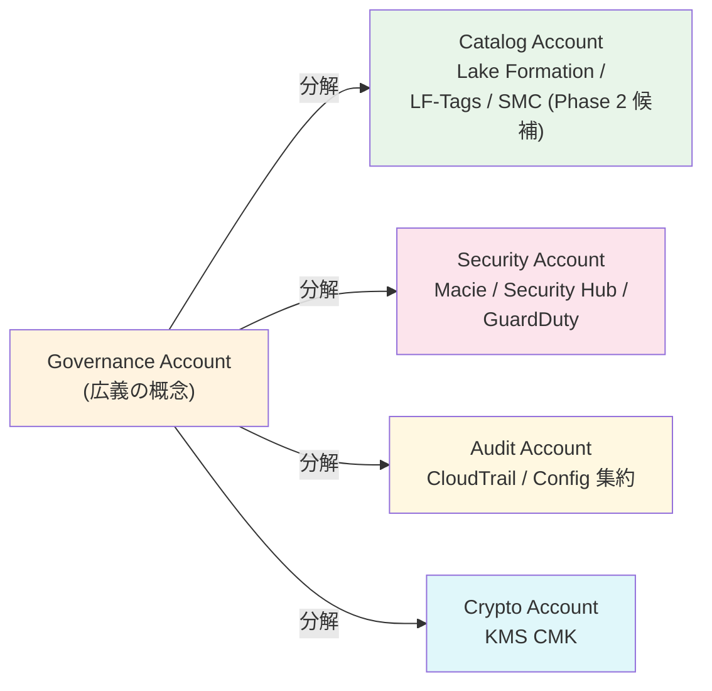
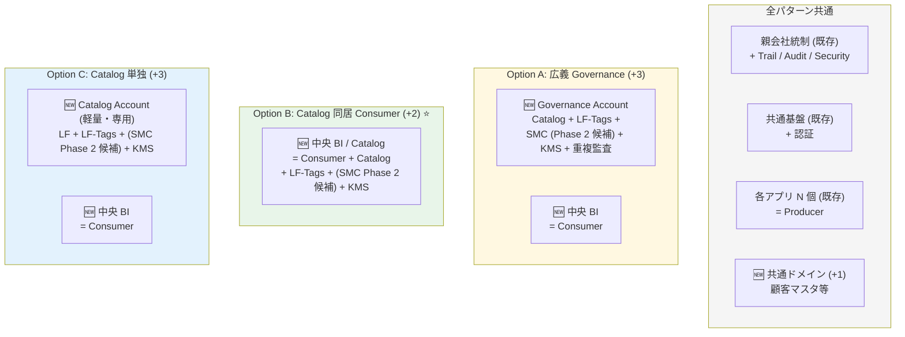
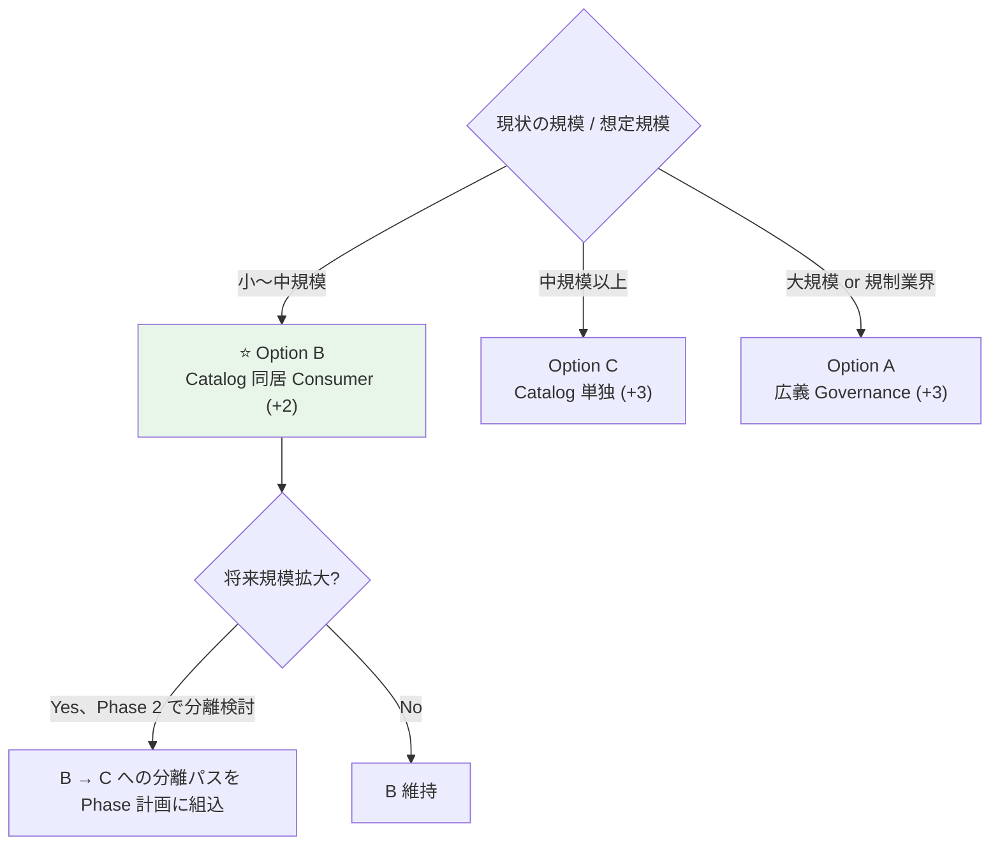
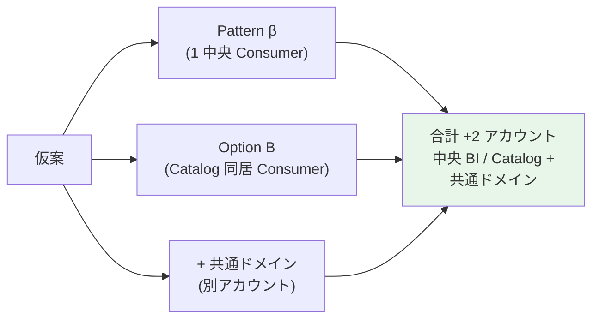
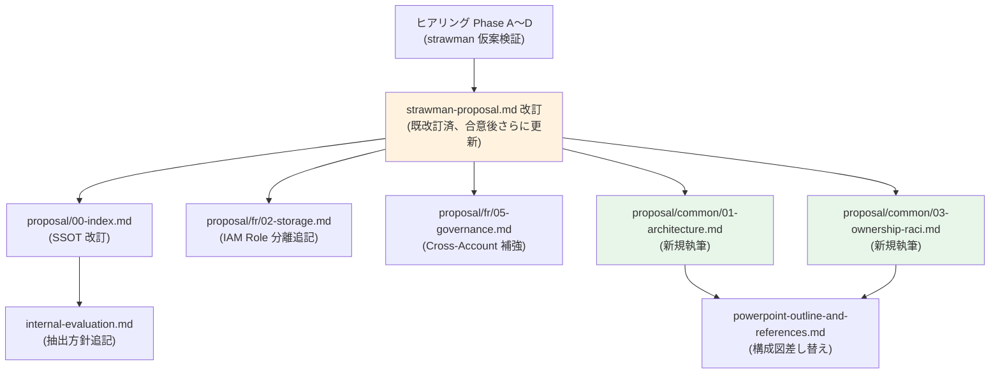

# データプラットフォーム アカウントアーキテクチャ検討（社内評価メモ）

> ステータス: 🚧 ドラフト（合意形成中）
> 対象読者: **社内のみ**。プラットフォーム標準化推進者 / アプリ運用責任者 / セキュリティ・ガバナンス担当
> 位置付け: 「データプラットフォームを独立アカウントとして立てるか、各アプリアカウントで分散するか」の検討記録
> 関連: [data-platform-document-structure.md](data-platform-document-structure.md) / [internal-evaluation.md](internal-evaluation.md) / [proposal/fr/02-storage.md](proposal/fr/02-storage.md)

---

## 0. 本資料の目的

API プラットフォーム標準が「**Federated（中央集約 + 分散）**」を採用した（[../api-platform/proposal/common/01-reference-architecture.md §C-1.5](../api-platform/proposal/common/01-reference-architecture.md)）。同じ問いをデータ標準にも適用する。

**問い**:
- データプラットフォームとして**独立した AWS アカウントを立てる**か
- 各アプリアカウントで**統一したガイドにする**か

**結論**: API と同じく **Federated 採用**。ただしデータ領域固有の理由により、**中央アカウントの責務に「データガバナンス層」が加わる**。

本資料は調査根拠と判断項目を整理し、合意形成後に [proposal/common/01-architecture.md](proposal/common/01-architecture.md) §C-DATA-1 として正式化する。

---

## 1. 結論サマリ

| 項目 | 結論 |
|---|---|
| アプローチ | **Federated**（AWS Producer / Central Governance / Consumer の 3 役割）|
| API 標準との関係 | **同型**（中央集約 + 各アプリ分散）。ただし中央のスコープが Catalog 分だけ広い |
| 既存アカウントへの影響 | **最低 +1 アカウント**（Data Governance / Catalog 専用）。Consumer は組織パターンにより +0〜+1 |
| バルクデータの集約 | **しない**（Producer の S3 に置いたまま、Catalog と権限のみ中央集約）|

> **追補（§5 参照）**: 親会社統制アカウントが CloudTrail / Security Hub / Macie 等の監査・セキュリティ集約を担う場合、データ標準で必要な中央責務は **「Catalog Account」**（Lake Formation + LF-Tags + (SMC Phase 2 候補) + KMS）に縮小される。この場合 **Catalog を Consumer に同居させる Option B（+2 アカウント）が実用解として有力**。

### 業界根拠（要約）

| 出典 | 結論 |
|---|---|
| [AWS Prescriptive Guidance: Strategy for Data Mesh](https://docs.aws.amazon.com/prescriptive-guidance/latest/strategy-data-mesh/aws-offerings-data-mesh.html) | Producer / Central Governance / Consumer の 3 役割が**規範**。「1 つの中央データレイクアカウント」は**アンチパターン** |
| [Lake Formation Cross-Account Permissions](https://docs.aws.amazon.com/lake-formation/latest/dg/cross-account-permissions.html) | バルクデータを動かさず Catalog + 権限のみで横断クエリを実現 |
| [Secure Data Mesh Guidance on AWS](https://aws.amazon.com/solutions/guidance/secure-data-mesh-with-distributed-data-asset-ownership-on-aws) | Distributed Data Asset Ownership + Central Governance パターン |
| [Well-Architected Data Analytics Lens](https://docs.aws.amazon.com/wellarchitected/latest/analytics-lens/analytics-lens.html) | 同上を Lens として体系化 |
| 業界事例 | Netflix UDA / Spotify / BBVA など主要事例も Federated（中央モノリス・完全分散の両極端は採らない）|

---

## 2. 既存アカウント体系とのマッピング（概念モデル）

> ⚠ **本章 §2-§4 は「概念モデル」を示す**: Producer / Central / Consumer の 3 役割を独立アカウントとして描いている。**実装上の推奨配置（Option B = Catalog 同居 Consumer、+2 アカウント）は §5 を参照**。本章は理解のために役割を分離した形で示すが、§5 で物理アカウント割当を最適化する。

### 2.1 マッピング表（役割と既存アカウントの対応）

| 既存 / 新規 | アカウント | 持つもの | データ標準での役割 |
|---|---|---|---|
| **既存** | **親会社統制**（SoC / NW Firewall + CloudTrail / Security Hub / Macie / GuardDuty 等の集約）| そのまま | データ標準では **Audit / Security 集約先**として活用（§5.2 参照）|
| **既存** | **共通基盤アカウント**（認証）| そのまま | データ標準には**直接関与しない**（後述 Catalog/Governance とは責務が違うので原則同居しない）|
| **既存** | **各アプリ アカウント**（複数）| アプリ + API GW + S3 + 運用 DB | ⭐ **Producer**（生産者）兼用 |
| **概念上** | **Central Governance / Catalog 役割** | Lake Formation Catalog + LF-Tags + (SMC は Phase 2 候補、[DP-ADR-001](adr/DP-ADR-001-sagemaker-catalog-adoption-deferred.md)) + 共通 KMS | ⭐ **Central**（中央統制）— 物理配置は §5 Option A/B/C で選択 |
| **概念上** | **Consumer 役割** | Athena / Redshift / QuickSight / SageMaker | ⭐ **Consumer**（消費者）— 物理配置は §4 Pattern α/β/γ で選択 |

> **物理アカウント追加数の整理**（仮案 = Option B + Pattern β + 共通ドメイン の場合）:
> - 中央 BI / Catalog アカウント（Consumer + Catalog 同居）: **+1**
> - 共通ドメインアカウント（顧客マスタ等）: **+1**
> - 合計: **+2 アカウント**

### 2.2 図解（概念モデル）

> ⚠ 下図は **3 役割の概念モデル**を独立アカウントとして示したもの。**実装上の推奨配置（Catalog を Consumer に同居させる Option B）は §5.3 の図を参照**。

### 2.3 中央 Catalog/Governance 責務を共通基盤（認証）に同居させない理由

| 観点 | 同居（共通基盤 + Catalog/Governance）| 分離（別アカウント or Consumer 同居、推奨）|
|---|:---:|:---:|
| 責務分離 | ❌ 認証 + データ統制が混在 | ✅ |
| 障害影響 | ❌ 認証障害がデータ参照を巻き込む | ✅ |
| 権限境界 | ❌ 認証管理者 ≠ データ管理者だが同 IAM 内 | ✅ |
| AWS Well-Architected | ❌ 違反（責務単一原則）| ✅ |
| コスト・運用負荷 | ◎ 1 アカウント節約 | △ 別アカウント |

→ Catalog/Governance 責務は**軽量**（バルクデータなし）でランニングコストは限定的（Lake Formation 自体は無料、KMS / CloudTrail / 監査ログのみが課金対象）。**責務分離を優先**。共通基盤との同居は不採用。同じ責務分離原則で **Catalog を Consumer に同居させる Option B** は IAM Role 分離による緩和策が必要（§5.5 参照）。

---

## 3. Lake Formation + RAM の動き — 「参照のみ」の意味

> 本章は概念モデル（Producer / Catalog / Consumer の 3 役割）を前提にデータの動きを示す。Option B 採用時は **「Catalog」と「Consumer」が同一アカウント内**になるため、ステップ ③〜⑤ のクロスアカウント通信が**アカウント内の IAM Role 間通信**に置き換わる。それ以外の動きは同じ。

### 3.1 データの物理配置とクエリの動き

| ステップ | 何が起きるか |
|---|---|
| ①②（事前設定）| App1（Producer）が Lake Formation に「この S3 バケットを管理させる」と委任登録。Catalog 役割の Lake Formation が App1 の S3 を「登録済みデータレイクロケーション」として扱える状態にする |
| ③（事前設定）| Catalog 役割が Consumer に **「Finance タグの付いたテーブル全部、SELECT のみ許可」** を **AWS RAM** 経由で共有（Option B 時は同アカウント内の `DataAnalystRole` への IAM 権限付与）|
| ④⑤（ランタイム）| Consumer の Athena が SQL を発行 → Lake Formation に「sales テーブルへの SELECT 権限あるか」を問い合わせ → 認可成功 |
| ⑥⑦（ランタイム）| Athena は App1 アカウントの S3 を**直接読みに行く**（バイトは Consumer のクエリエンジンを通って結果として返るだけ。データそのものは App1 の S3 から動かない）|

### 3.2 「参照のみ」の正確な定義

| 操作 | Consumer アカウントから可能か |
|---|:---:|
| App1 の S3 / Catalog テーブルを **SELECT**（読む）| ✅ |
| App1 の S3 にファイルを **書く / 削除する** | ❌ 権限分離で禁止 |
| Athena / Redshift で **クエリ結果を Consumer 自身の S3 に保存** | ✅ |
| Consumer アカウント内で **集計テーブル / ML 訓練データ作成** | ✅ Consumer の自前 S3 内 |
| App1 のソースデータを書き換える | ❌ Producer 側でだけ可能 |

→ **「ソースデータへの書込み権限はない、自分のアカウント内で派生データは作れる」** が「参照のみ」の正確な意味。

### 3.3 Lake Formation + RAM vs 単純 S3 IAM 共有

なぜ単純な S3 バケットポリシー + IAM の共有では不十分か。

| 観点 | 単純な S3 IAM 共有 | Lake Formation + RAM |
|---|:---:|:---:|
| 権限の粒度 | バケット / プレフィックス単位 | **テーブル / 列 / 行レベル** |
| 機密度別マスキング | 自前実装 | **LF データフィルタで宣言的に定義** |
| 監査 | S3 ログ単独で追跡困難 | Lake Formation 監査ログで「**誰が何のテーブルにアクセスしたか**」が記録 |
| Producer 側の関与 | バケットポリシー直接編集（変更が頻繁）| **委任モデル**（Producer は Lake Formation 管理を一度承諾するだけ）|
| 横断テーブルの定義 | 不可（バケットの寄せ集めにしかならない）| ✅ Central Catalog で論理テーブル定義可能 |
| 機密度 Restricted データ取り扱い | リスク高 | ✅ 業界推奨 |

---

## 4. Consumer アカウントは何個必要か — 3 パターン

> ⚠ **本章は「Consumer 役割の配置パターン（α/β/γ）」を扱う**。各図は **§5 Option B（Catalog 同居 Consumer）を反映した実構成**として描画している。
> - **α**: 中央 Consumer がないため Option B と組み合わせ不可。Catalog Account を独立で持つ（Option A/C 相当）
> - **β** ⭐（**仮案選定**）: Catalog を中央 BI Consumer アカウントに同居
> - **γ**: Catalog を中央 BI Consumer アカウントに同居（アプリは Producer + Consumer 兼任）
>
> 3 パターン × 3 オプション の組み合わせ整理は **§5.7 マトリクス**を参照。

### 4.1 Pattern α: 各アプリが Producer + Consumer 兼用（最小構成）

各アプリ AWS アカウントが自前の S3 を持ち（Producer）、同時に自前の Athena / QuickSight で他アプリのデータも引く（Consumer）。

> ⚠ **α は Option B と組み合わせ不可**: 中央 Consumer がないため Catalog の同居先が存在しない。Catalog は **独立した Catalog Account**（Option A or C 相当）として持つ必要がある。

**特徴**:
- **追加アカウント = Catalog Account 1 つだけ**（**+1**）
- アプリ追加 ≠ Consumer アカウント追加
- 各アプリの開発者・分析者が自分のアカウントから他アプリのデータも引ける
- **想定環境**: 小〜中規模、アプリ間の横断分析が必要だが**専属の BI チームはない**

### 4.2 Pattern β: 専用 Consumer アカウント 1 つだけ ⭐（**仮案選定**）

各アプリは Producer のみ。横断分析・BI は専属アカウントで集約。**Option B により Catalog を Consumer に同居**することで、Governance アカウントが不要に。

**特徴**:
- **追加アカウント = 中央 BI / Catalog 同居の 1 つだけ**（**+1**、Option B 効果）
- 共通ドメイン（顧客マスタ等）を別アカウントとする場合は **+2 合計**
- 専属の BI / データ分析チームがいる組織向け
- アプリ側は分析クエリを投げない（または最小限）
- 同居の責務分離は IAM Role（`DataLakeAdminRole` / `DataAnalystRole`）で実装（[§5.5 緩和策](#55-option-b-が成立する条件と緩和策) 参照）

### 4.3 Pattern γ: ハイブリッド — **業界標準推奨**（仮案 Phase 2 移行先）

各アプリは自分の分野の分析を自前で実施（Producer + Consumer）+ 中央 BI / 経営層向け横断分析は専用 Consumer。**Option B により Catalog を中央 BI Consumer に同居**。

**特徴**:
- **追加アカウント = 中央 BI / Catalog 同居の 1 つだけ**（**+1**、Option B 効果）
- 共通ドメインを別アカウントとする場合は **+2 合計**
- 各アプリは自前で自分の分析、中央 BI チームは横断分析
- **中規模以上の組織で最も一般的**
- 同居の責務分離は IAM Role で実装（[§5.5 緩和策](#55-option-b-が成立する条件と緩和策) 参照）

### 4.4 推奨マトリクス（Option B 適用後 + 共通ドメイン込み）

> 数値は **Option B（Catalog 同居 Consumer）適用後 + 共通ドメインアカウント (+1) 込み**の合計追加アカウント数。

| 組織条件 | 推奨パターン | 追加アカウント数 |
|---|:---:|:---:|
| 小規模、専属 BI / データ分析チームなし | **α** | **+2**（独立 Catalog +1、共通ドメイン +1。Option B 不適用）|
| 中央 BI / 経営 KPI ダッシュボードが重要、専属 BI チームあり、組織体制未整備で開始 | **β** ⭐（**仮案選定 = Phase 1**）| **+2**（中央 BI/Catalog 同居 +1、共通ドメイン +1）|
| 中央 BI 体制が整い、各アプリチームの自前分析も可能 | **γ**（業界標準推奨、仮案 Phase 2 移行先）| **+2**（中央 BI/Catalog 同居 +1、共通ドメイン +1）|
| 大規模、複数の分析チーム / ML チームが並行で動く | γ 拡張 | **+3 以上**（Catalog 単独 Option C、複数 Consumer）|
| アプリ側に分析機能を持たせたくない（権限統制重視）| **β** | **+2** |

> **仮案選定の根拠**: アプリチームに分析スキルなし（Q1）+ 専属 BI チームなし（Q4）→ Phase 1 では γ ではなく β、組織が整ったら Phase 2 で γ へ移行（Path C 段階移行、[strawman §4](strawman-proposal.md) 参照）。

---

## 5. Catalog vs Governance — 用語整理と配置 3 オプション

### 5.1 「Catalog Account」と「Governance Account」の用語

AWS 公式ドキュメント内で**両方の用語が使われており、スコープが違う**ものに付けられている:

| AWS ドキュメント | 使用用語 | スコープ |
|---|---|---|
| [Prescriptive Guidance: Data Mesh](https://docs.aws.amazon.com/prescriptive-guidance/latest/strategy-data-mesh/aws-offerings-data-mesh.html) | 「Central Account」「Governance Account」 | 広め（Catalog + permission + 監査）|
| [Lake Formation Cross-Account 公式](https://docs.aws.amazon.com/lake-formation/latest/dg/cross-account-permissions.html) | **「Central Catalog Account」** | 狭い（Catalog + permission のみ）|
| [DataZone Multi-Account](https://docs.aws.amazon.com/datazone/latest/userguide/working-with-accounts.html) | 「Domain Account」 | Catalog + Domain |
| [Secure Data Mesh Solutions](https://aws.amazon.com/solutions/guidance/secure-data-mesh-with-distributed-data-asset-ownership-on-aws) | 「Central Governance Account」 | 広め |
| [AWS Landing Zone Accelerator](https://aws.amazon.com/solutions/implementations/landing-zone-accelerator-on-aws/) | 「Audit Account」「Log Archive Account」 | 監査は別建て |

**用語の本質**: 「Governance Account」は複数責務を束ねた**包括用語**で、実装上は分解されることが多い。

### 5.2 既存アカウント体系を活かす責務再配置

ユーザー環境では**親会社統制アカウントが Audit / Security 集約を担う**ことを前提に、責務を再配置できる:

| 責務 | 元の置き場（§2 仮案）| 親会社統制を活かす場合 |
|---|---|---|
| CloudTrail Org Trail | Governance | **親会社統制（既存）** |
| Security Hub 集約 | Governance | **親会社統制（既存）** |
| GuardDuty 集約 | Governance | **親会社統制（既存）** |
| Macie 集約 | Governance | **親会社統制（要確認）** |
| Lake Formation Catalog | Governance | **Catalog Account（新規）** |
| LF-Tags | Governance | 同上 |
| DataZone / SageMaker Catalog（オプション）| Governance | 同上（**Phase 1 では不採用、[DP-ADR-001](adr/DP-ADR-001-sagemaker-catalog-adoption-deferred.md) で Phase 2 再評価**）|
| KMS CMK（データ専用）| Governance | Catalog Account or 既存 Crypto |
| 共通参照データ | 共通ドメイン | 共通ドメイン（変わらず）|

→ **「Governance Account」と呼ぶ必要が薄れ、実質「Catalog Account」だけで足りる可能性**。

> ⚠ **要ヒアリング確認（Q1）**: 親会社統制が Macie / Security Hub / GuardDuty / Config Aggregator の集約を実際に担当しているか。担当範囲次第で Catalog Account のスコープが変わる。

### 5.3 配置 3 オプションの比較

### 5.4 3 オプションの観点別比較

| 観点 | A 広義 Governance (+3) | **B Catalog 同居 (+2)** ⭐ | C Catalog 単独 (+3) |
|---|:---:|:---:|:---:|
| 追加アカウント数 | +3 | **+2** | +3 |
| 責務分離（Catalog vs Consumer）| ◎ アカウント分離 | △ IAM Role 分離 | ◎ アカウント分離 |
| 責務分離（監査 vs 利用）| ◎（親会社統制 + Governance）| ◎（親会社統制で代替）| ◎ |
| Catalog 管理者特権の影響範囲 | 限定 | Consumer に集中 | 限定 |
| 運用負荷 | △ アカウント多い | ◎ 最少 | △ アカウント多い |
| 将来の分離容易性 | 既に分離済み | △ 移行コスト発生 | 既に分離済み |
| AWS 公式パターン整合 | ◎ Prescriptive Guidance 準拠 | ○ Lake Formation Central Catalog Account パターンとして整合 | ◎ |
| 規模拡大時の柔軟性 | ◎ | △ Consumer 増加で破綻 | ◎ |
| 業界実例の多さ | 大企業・規制業界 | **小〜中規模で多い** | 中規模 |

### 5.5 Option B が成立する条件と緩和策

**成立条件**:
- 親会社統制が Audit / Security 集約を担当している（§5.2 の責務再配置が成立）
- BI チーム規模が小〜中（〜5 名程度）
- Consumer アカウントが当面 1 つ

**緩和策**（Option B 採用時に必須）:

| # | 緩和策 | 効果 |
|---|---|---|
| 1 | **IAM Role の厳密な分離** — `DataLakeAdminRole`（Lake Formation 管理特権）と `DataAnalystRole`（クエリ・閲覧のみ）を完全に別ユーザー集合に割当 | Catalog 管理 ≠ 利用、Role 境界での責務分離 |
| 2 | **Permission Boundary** で `DataAnalystRole` から Lake Formation 管理操作を拒否 | 自己権限上昇の防止 |
| 3 | **SCP** で Consumer アカウントの権限上昇系操作を拒否 | 予防的制御 |
| 4 | **CloudTrail を親会社統制へ強制転送** | 自己監査リスク回避（前提として既に整備）|
| 5 | **AWS Config Rules** で「Catalog 管理権限と Consumer 権限の重複ユーザー」を検出 | 検知的制御 |
| 6 | **将来 Catalog 分離の手順書** を初日から準備 | 規模拡大時の移行リスク抑制 |

### 5.6 推奨

**仮案の選定**: **Option B**（Catalog 同居 Consumer、**+2**）。将来規模拡大時に Option C へ分離可能な設計（§5.5 緩和策の #6）にしておく。

### 5.7 Pattern α/β/γ × Option A/B/C の組み合わせマトリクス

§4 の 3 パターン（Consumer 配置）と §5 の 3 オプション（Catalog 配置）は独立軸で、組み合わせ可能。**仮案は β + B + 共通ドメイン**。

| | Option A 広義 Governance（+ 別 Catalog） | **Option B Catalog 同居 Consumer** ⭐ | Option C Catalog 単独 |
|---|:---:|:---:|:---:|
| **Pattern α** 各アプリ Consumer 兼任 | +1（Governance）+ N アプリ内 Consumer | ⚠ 「Catalog 同居先」が無く成立しない ※α なら Option A or C 必須 | +1（Catalog）+ N アプリ内 Consumer |
| **Pattern β** 1 中央 Consumer | +2（Governance + Consumer）| **+1（Consumer 兼 Catalog）** ⭐ 本仮案 = β + B + 共通ドメイン = **+2 合計** | +2（Catalog + Consumer）|
| **Pattern γ** ハイブリッド（アプリ + 中央 Consumer）| +2（Governance + 中央 Consumer）| +1（中央 Consumer 兼 Catalog） | +2（Catalog + 中央 Consumer）|

**重要な制約**: **α は Option B と組み合わせ不可**（中央 Consumer がないため Catalog の同居先が存在しない）。各アプリアカウントに分散して Catalog を持たせると Catalog の中央性が失われる。

**仮案の組み合わせ**: β + Option B + 共通ドメイン = **+2 アカウント**（中央 BI / Catalog + 共通ドメイン）

---

## 6. 決定状況と残課題

### 6.1 仮案で決定済み（[strawman-proposal.md](strawman-proposal.md) に反映済）

| # | 決定事項 | 仮案での選定 | 根拠 / 参照 |
|---|---|---|---|
| 1 | **Consumer 役割のパターン**（α / β / γ）| **β**（中央 Consumer 集約）| Q1 アプリチームスキルなし / Q4 BI チームなし → α 不適合、γ は組織体制が未整備のため Phase 2 で検討。Path C 段階移行 |
| 2 | **Catalog Account / Governance Account の配置**（Option A / B / C）| **Option B**（Catalog 同居 Consumer、+2 アカウント）| §5.2 親会社統制が Audit / Security 集約を担う前提 / §5.4 Option 比較表 / 仮案規模に最適 |
| 3 | **Audit ログの最終集約先** | **親会社統制アカウント**（既存）| ユーザー環境の前提として確認済 |
| 4 | **共通参照データの扱い** | **共通ドメイン専用アカウント新設**（+1）| §3.3 案 2、業界標準（DAMA / Data Mesh）|
| 5 | **SageMaker Catalog（旧 DataZone）採否** | **Phase 1 不採用、Phase 2 再評価** | [DP-ADR-001](adr/DP-ADR-001-sagemaker-catalog-adoption-deferred.md)。Phase 1 規模では ROI 低い、+$1,360/年コスト・運用複雑度を抑制、Phase 2 で利用者拡大時に再評価 |

### 6.2 残課題（ヒアリングまたは追加検討が必要な事項）

| # | 決定事項 | 選択肢 | 影響範囲 | 確認方法 |
|---|---|---|---|---|
| 1 | **既存「共通基盤アカウント」のスコープ拡張** | 認証専用に閉じる / Service Catalog 配布元等も担わせる | API 側決定との整合 | API 標準化推進者との調整 |
| 2 | **環境分離**（prod / stg / dev）| 同一アカウントで Realm 分離 / 環境別にアカウント分離 | アカウント数の倍加、運用負荷 | ヒアリング G（インフラチーム）|
| 3 | **親会社統制の責務範囲確認**（Option B 成立の必須前提）| Macie / Security Hub / GuardDuty / Config Aggregator の集約担当範囲 | 担当範囲次第で Catalog Account のスコープが変わる、Option B/A/C 選定にも波及 | ヒアリング G-4 で確認 |
| 4 | **役割 3（Catalog 管理者）と役割 4（BI チーム）の人員分離**（Option B 成立の前提）| 完全分離可能 / 部分重複 / 重複前提 | 責務分離の実質的な強度、Config Rules 検知設計 | ヒアリング G-5 で確認 |
| 5 | **将来 Option C 移行のトリガ条件**（規模拡大時）| 4 条件のうちどれを発動条件とするか | Phase 2 計画、運用設計 | Phase 1 運用開始後にレビュー、[strawman-proposal.md §4.3](strawman-proposal.md) 参照 |
| 6 | **DR / クロスリージョン設計** | リージョン障害時の Catalog / Consumer / 共通ドメイン の復旧戦略 | NFR-DR §NFR-5（未作成）の前提 | [proposal/nfr/05-dr.md](proposal/nfr/05-dr.md)（未作成）と連動 |

---

## 7. 反映先（合意後の後続作業）

ヒアリング Phase A 以降で前提が確認できれば、以下に反映する。**Option B（Catalog 同居 Consumer、+2 アカウント）** が確定したことを前提とする。

| # | 反映先 | 内容 |
|---|---|---|
| 1 | [proposal/00-index.md §0.2 比較表](proposal/00-index.md) | 「分散標準」記述を「**Federated（3 役割、Option B Catalog 同居 Consumer 推奨）**」に改訂 |
| 2 | [proposal/fr/02-storage.md](proposal/fr/02-storage.md) | 「Producer 役割」の明示、Central（Catalog）/ Consumer 役割の追記、**Option B 採用時の同居構造**、Lake Formation 共有モデルの図解、IAM Role 分離方針（`DataLakeAdminRole` / `DataAnalystRole` / `DataReaderRole`）|
| 3 | [proposal/fr/05-governance.md](proposal/fr/05-governance.md) | §FR-5.1 権限制御を Lake Formation Cross-Account + **同アカウント内 IAM Role 分離**前提に補強、Permission Boundary / SCP / Config Rules の必須化 |
| 4 | proposal/common/01-architecture.md（未作成）| 新規執筆。本資料 §1-§5 を §C-DATA-1.5「中央集約 vs 分散ガイド」フレームに展開、API §C-1.5 と並ぶ位置付け、**Option A/B/C 配置 + Pattern α/β/γ Consumer の組み合わせマトリクス**を §C-DATA-1.6 として明示 |
| 5 | proposal/common/03-ownership-raci.md（未作成）| **7 役割と RACI** の対応（[strawman-proposal.md §3](strawman-proposal.md) 参照）、特に役割 3（Catalog 管理者 = `DataLakeAdminRole`）と役割 4（BI チーム = `DataAnalystRole`）の人員分離原則を明示 |
| 6 | [internal-evaluation.md](internal-evaluation.md) | 抽出方針に「API と同型 Federated だが中央のスコープが Catalog 分だけ広く、親会社統制が監査・セキュリティ集約を担う場合は Catalog 同居 Consumer (Option B) で +2 アカウントに圧縮可能」根拠を追記 |
| 7 | [powerpoint-outline-and-references.md §1.3-1.4](powerpoint-outline-and-references.md) | 構成概要図を **Option B 版（+2 アカウント、中央 BI / Catalog 同居）**に差し替え、§1.4「アカウント体系」スライドで Option A/B/C の選定根拠を提示 |
| 8 | [strawman-proposal.md](strawman-proposal.md) | （反映済）Option B 仕様に改訂、§2 アカウント構成 +2、§3 役割 3 を `DataLakeAdminRole` として位置付け、§5 前提 8/9 追加、§6 ヒアリング G-4/5/6 追加 |
| 9 | proposal/fr/06-personas.md（既存）| §FR-6 ペルソナ別実装パターンに **IAM Role 別の利用パターン**（`DataLakeAdminRole` / `DataAnalystRole` / `DataReaderRole`）を反映 |

### 7.1 反映の依存順序

---

## 8. 関連ドキュメント

### 本領域内

- [data-platform-document-structure.md](data-platform-document-structure.md) — 領域全体 SSOT
- [internal-evaluation.md](internal-evaluation.md) — 抽出方針の裏どり資料
- [proposal/fr/02-storage.md](proposal/fr/02-storage.md) — §FR-2 保存先標準

### 兄弟領域（API、雛形元）

- [../api-platform/proposal/common/01-reference-architecture.md](../api-platform/proposal/common/01-reference-architecture.md) — §C-1.5「中央集約 vs 分散ガイド」フレーム（本資料の元構造）

### AWS 公式

- [AWS Prescriptive Guidance: Strategy for Data Mesh](https://docs.aws.amazon.com/prescriptive-guidance/latest/strategy-data-mesh/aws-offerings-data-mesh.html)
- [Lake Formation Cross-Account Permissions](https://docs.aws.amazon.com/lake-formation/latest/dg/cross-account-permissions.html)
- [Secure Data Mesh Guidance on AWS](https://aws.amazon.com/solutions/guidance/secure-data-mesh-with-distributed-data-asset-ownership-on-aws)
- [Build enterprise data mesh with DataZone, CDK, CFN](https://docs.aws.amazon.com/prescriptive-guidance/latest/patterns/build-enterprise-data-mesh-amazon-data-zone.html)
- [AWS Well-Architected Data Analytics Lens](https://docs.aws.amazon.com/wellarchitected/latest/analytics-lens/analytics-lens.html)

### 業界・参考事例

- [Martin Fowler / Dehghani — Monolithic Data Lake to Data Mesh](https://martinfowler.com/articles/data-monolith-to-mesh.html)
- [Netflix UDA](https://netflixtechblog.com/uda-unified-data-architecture-6a6aee261d8d)
- [How Spotify Built Its Data Platform](https://blog.bytebytego.com/p/how-spotify-built-its-data-platform)
- [BBVA Global Data Platform](https://aws.amazon.com/blogs/industries/part-1-bbva-building-a-multi-region-multi-country-global-data-and-ml-platform-at-scale/)
