# データプラットフォーム アカウントアーキテクチャ検討（社内評価メモ）

> ステータス: 🚧 ドラフト（合意形成中）
> 対象読者: **社内のみ**。プラットフォーム標準化推進者 / アプリ運用責任者 / セキュリティ・ガバナンス担当
> 位置付け: 「データプラットフォームを独立アカウントとして立てるか、各アプリアカウントで分散するか」の検討記録
> 関連: [data-platform-document-structure.md](data-platform-document-structure.md) / [internal-evaluation.md](internal-evaluation.md) / [proposal/fr/02-storage.md](proposal/fr/02-storage.md)

---

## 0. 本資料の目的

API プラットフォーム標準が「**Federated（中央集約 + 分散）**」を採用した（[../api-platform/proposal/common/01-reference-architecture.md §C-1.5](../api-platform/proposal/common/01-reference-architecture.md)）。同じ問いをデータ標準にも適用する。

**問い**:
- データプラットフォームとして**独立した AWS アカウントを立てる**か
- 各アプリアカウントで**統一したガイドにする**か

**結論**: API と同じく **Federated 採用**。ただしデータ領域固有の理由により、**中央アカウントの責務に「データガバナンス層」が加わる**。

本資料は調査根拠と判断項目を整理し、合意形成後に [proposal/common/01-architecture.md](proposal/common/01-architecture.md) §C-DATA-1 として正式化する。

---

## 1. 結論サマリ

| 項目 | 結論 |
|---|---|
| アプローチ | **Federated**（AWS Producer / Central Governance / Consumer の 3 役割）|
| API 標準との関係 | **同型**（中央集約 + 各アプリ分散）。ただし中央のスコープが Catalog 分だけ広い |
| 既存アカウントへの影響 | **最低 +1 アカウント**（Data Governance / Catalog 専用）。Consumer は組織パターンにより +0〜+1 |
| バルクデータの集約 | **しない**（Producer の S3 に置いたまま、Catalog と権限のみ中央集約）|

> **追補（§5 参照）**: 親会社統制アカウントが CloudTrail / Security Hub / Macie 等の監査・セキュリティ集約を担う場合、データ標準で必要な中央責務は **「Catalog Account」**（Lake Formation + LF-Tags + (SMC Phase 2 候補) + KMS）に縮小される。この場合 **Catalog を Consumer に同居させる Option B（+2 アカウント）が実用解として有力**。
>
> **追補 2（§5.8 参照）**: 監査責務を担うのは **新規の「監査アカウント」**（データプラットフォーム標準のスコープ外、Transit Gateway 等と同様に別組織が運用）。本標準は監査アカウントに対して **「何を送るか / 何を期待するか / 何を依存するか」を定義する側**に立つ。運用メトリクスは各アプリに保持、監査・セキュリティ系のみ集約。

### 業界根拠（要約）

| 出典 | 結論 |
|---|---|
| [AWS Prescriptive Guidance: Strategy for Data Mesh](https://docs.aws.amazon.com/prescriptive-guidance/latest/strategy-data-mesh/aws-offerings-data-mesh.html) | Producer / Central Governance / Consumer の 3 役割が**規範**。「1 つの中央データレイクアカウント」は**アンチパターン** |
| [Lake Formation Cross-Account Permissions](https://docs.aws.amazon.com/lake-formation/latest/dg/cross-account-permissions.html) | バルクデータを動かさず Catalog + 権限のみで横断クエリを実現 |
| [Secure Data Mesh Guidance on AWS](https://aws.amazon.com/solutions/guidance/secure-data-mesh-with-distributed-data-asset-ownership-on-aws) | Distributed Data Asset Ownership + Central Governance パターン |
| [Well-Architected Data Analytics Lens](https://docs.aws.amazon.com/wellarchitected/latest/analytics-lens/analytics-lens.html) | 同上を Lens として体系化 |
| 業界事例 | Netflix UDA / Spotify / BBVA など主要事例も Federated（中央モノリス・完全分散の両極端は採らない）|

---

## 2. 既存アカウント体系とのマッピング（概念モデル）

> ⚠ **本章 §2-§4 は「概念モデル」を示す**: Producer / Central / Consumer の 3 役割を独立アカウントとして描いている。**実装上の推奨配置（Option B = Catalog 同居 Consumer、+2 アカウント）は §5 を参照**。本章は理解のために役割を分離した形で示すが、§5 で物理アカウント割当を最適化する。

### 2.1 マッピング表（役割と既存アカウントの対応）

| 既存 / 新規 | アカウント | 持つもの | データ標準での役割 |
|---|---|---|---|
| **既存** | **親会社統制**（SoC / NW Firewall + CloudTrail / Security Hub / Macie / GuardDuty 等の集約）| そのまま | データ標準では **Audit / Security 集約先**として活用（§5.2 参照）|
| **既存** | **共通基盤アカウント**（認証）| そのまま | データ標準には**直接関与しない**（後述 Catalog/Governance とは責務が違うので原則同居しない）|
| **既存** | **各アプリ アカウント**（複数）| アプリ + API GW + S3 + 運用 DB | ⭐ **Producer**（生産者）兼用 |
| **概念上** | **Central Governance / Catalog 役割** | Lake Formation Catalog + LF-Tags + (SMC は Phase 2 候補、[DP-ADR-001](adr/DP-ADR-001-sagemaker-catalog-adoption-deferred.md)) + 共通 KMS | ⭐ **Central**（中央統制）— 物理配置は §5 Option A/B/C で選択 |
| **概念上** | **Consumer 役割** | Athena / Redshift / QuickSight / SageMaker | ⭐ **Consumer**（消費者）— 物理配置は §4 Pattern α/β/γ で選択 |

> **物理アカウント追加数の整理**（仮案 = Option B + Pattern β + 共通ドメイン の場合）:
> - 中央 BI / Catalog アカウント（Consumer + Catalog 同居）: **+1**
> - 共通ドメインアカウント（顧客マスタ等）: **+1**
> - 合計: **+2 アカウント**

### 2.2 図解（概念モデル）

> ⚠ 下図は **3 役割の概念モデル**を独立アカウントとして示したもの。**実装上の推奨配置（Catalog を Consumer に同居させる Option B）は §5.3 の図を参照**。

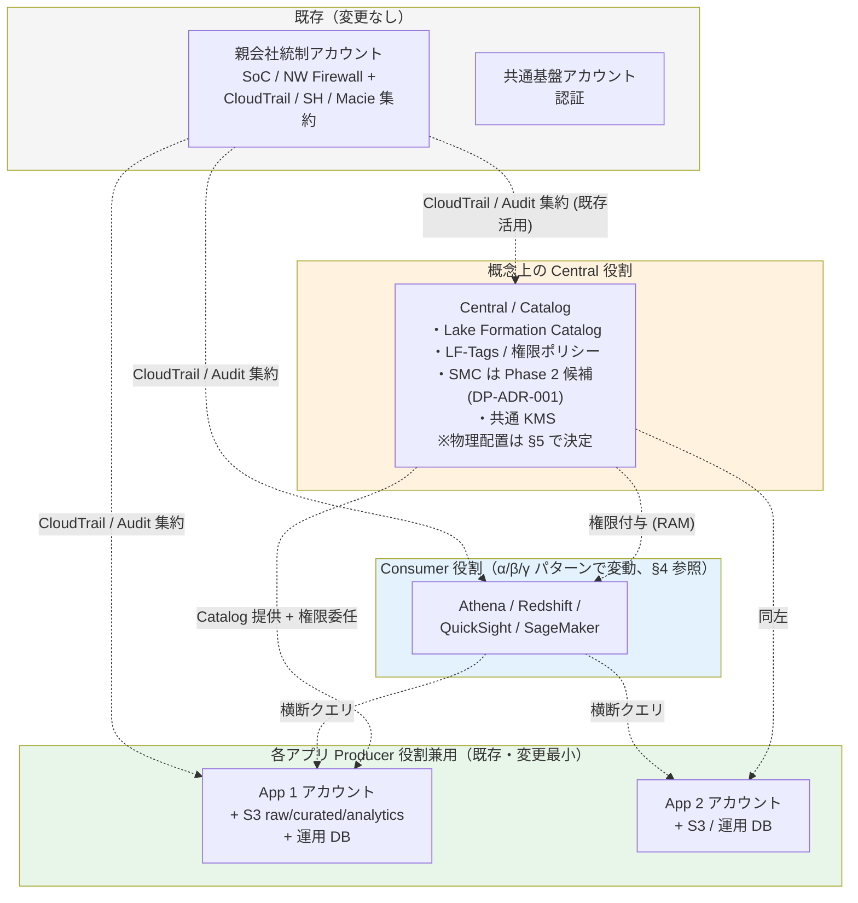
```mermaid
flowchart TB
    subgraph Existing["既存（変更なし）"]
        direction LR
        Parent["親会社統制アカウント<br/>SoC / NW Firewall +<br/>CloudTrail / SH / Macie 集約"]
        Auth["共通基盤アカウント<br/>認証"]
    end

    subgraph New["概念上の Central 役割"]
        DG["Central / Catalog<br/>・Lake Formation Catalog<br/>・LF-Tags / 権限ポリシー<br/>・SMC は Phase 2 候補 (DP-ADR-001)<br/>・共通 KMS<br/>※物理配置は §5 で決定"]
    end

    subgraph Producers["各アプリ Producer 役割兼用（既存・変更最小）"]
        direction LR
        App1["App 1 アカウント<br/>+ S3 raw/curated/analytics<br/>+ 運用 DB"]
        App2["App 2 アカウント<br/>+ S3 / 運用 DB"]
    end

    subgraph Consumer["Consumer 役割（α/β/γ パターンで変動、§4 参照）"]
        Cons["Athena / Redshift /<br/>QuickSight / SageMaker"]
    end

    DG -.Catalog 提供 + 権限委任.-> App1
    DG -.同左.-> App2
    DG -.権限付与 (RAM).-> Cons
    Cons -.横断クエリ.-> App1
    Cons -.横断クエリ.-> App2
    Parent -.CloudTrail / Audit 集約 (既存活用).-> DG
    Parent -.CloudTrail / Audit 集約.-> App1
    Parent -.CloudTrail / Audit 集約.-> Cons

    style Existing fill:#f5f5f5
    style New fill:#fff3e0
    style Producers fill:#e8f5e9
    style Consumer fill:#e3f2fd
```

### 2.3 中央 Catalog/Governance 責務を共通基盤（認証）に同居させない理由

| 観点 | 同居（共通基盤 + Catalog/Governance）| 分離（別アカウント or Consumer 同居、推奨）|
|---|:---:|:---:|
| 責務分離 | ❌ 認証 + データ統制が混在 | ✅ |
| 障害影響 | ❌ 認証障害がデータ参照を巻き込む | ✅ |
| 権限境界 | ❌ 認証管理者 ≠ データ管理者だが同 IAM 内 | ✅ |
| AWS Well-Architected | ❌ 違反（責務単一原則）| ✅ |
| コスト・運用負荷 | ◎ 1 アカウント節約 | △ 別アカウント |

→ Catalog/Governance 責務は**軽量**（バルクデータなし）でランニングコストは限定的（Lake Formation 自体は無料、KMS / CloudTrail / 監査ログのみが課金対象）。**責務分離を優先**。共通基盤との同居は不採用。同じ責務分離原則で **Catalog を Consumer に同居させる Option B** は IAM Role 分離による緩和策が必要（§5.5 参照）。

---

## 3. Lake Formation + RAM の動き — 「参照のみ」の意味

> 本章は概念モデル（Producer / Catalog / Consumer の 3 役割）を前提にデータの動きを示す。Option B 採用時は **「Catalog」と「Consumer」が同一アカウント内**になるため、ステップ ③〜⑤ のクロスアカウント通信が**アカウント内の IAM Role 間通信**に置き換わる。それ以外の動きは同じ。

### 3.1 データの物理配置とクエリの動き

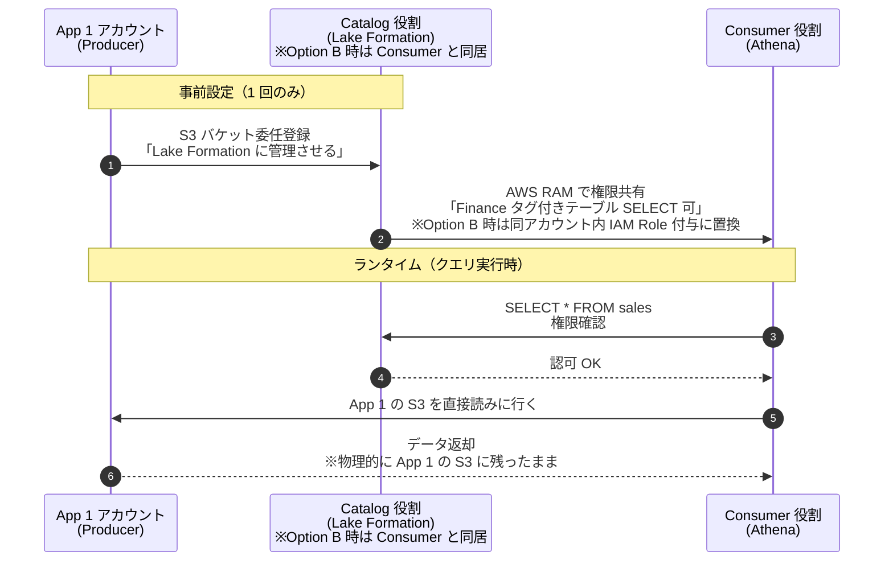
```mermaid
sequenceDiagram
    autonumber
    participant App1 as App 1 アカウント<br/>(Producer)
    participant LF as Catalog 役割<br/>(Lake Formation)<br/>※Option B 時は Consumer と同居
    participant Cons as Consumer 役割<br/>(Athena)

    Note over App1, LF: 事前設定（1 回のみ）
    App1->>LF: S3 バケット委任登録<br/>「Lake Formation に管理させる」
    LF->>Cons: AWS RAM で権限共有<br/>「Finance タグ付きテーブル SELECT 可」<br/>※Option B 時は同アカウント内 IAM Role 付与に置換

    Note over App1, Cons: ランタイム（クエリ実行時）
    Cons->>LF: SELECT * FROM sales<br/>権限確認
    LF-->>Cons: 認可 OK
    Cons->>App1: App 1 の S3 を直接読みに行く
    App1-->>Cons: データ返却<br/>※物理的に App 1 の S3 に残ったまま
```

| ステップ | 何が起きるか |
|---|---|
| ①②（事前設定）| App1（Producer）が Lake Formation に「この S3 バケットを管理させる」と委任登録。Catalog 役割の Lake Formation が App1 の S3 を「登録済みデータレイクロケーション」として扱える状態にする |
| ③（事前設定）| Catalog 役割が Consumer に **「Finance タグの付いたテーブル全部、SELECT のみ許可」** を **AWS RAM** 経由で共有（Option B 時は同アカウント内の `DataAnalystRole` への IAM 権限付与）|
| ④⑤（ランタイム）| Consumer の Athena が SQL を発行 → Lake Formation に「sales テーブルへの SELECT 権限あるか」を問い合わせ → 認可成功 |
| ⑥⑦（ランタイム）| Athena は App1 アカウントの S3 を**直接読みに行く**（バイトは Consumer のクエリエンジンを通って結果として返るだけ。データそのものは App1 の S3 から動かない）|

### 3.2 「参照のみ」の正確な定義

| 操作 | Consumer アカウントから可能か |
|---|:---:|
| App1 の S3 / Catalog テーブルを **SELECT**（読む）| ✅ |
| App1 の S3 にファイルを **書く / 削除する** | ❌ 権限分離で禁止 |
| Athena / Redshift で **クエリ結果を Consumer 自身の S3 に保存** | ✅ |
| Consumer アカウント内で **集計テーブル / ML 訓練データ作成** | ✅ Consumer の自前 S3 内 |
| App1 のソースデータを書き換える | ❌ Producer 側でだけ可能 |

→ **「ソースデータへの書込み権限はない、自分のアカウント内で派生データは作れる」** が「参照のみ」の正確な意味。

### 3.3 Lake Formation + RAM vs 単純 S3 IAM 共有

なぜ単純な S3 バケットポリシー + IAM の共有では不十分か。

| 観点 | 単純な S3 IAM 共有 | Lake Formation + RAM |
|---|:---:|:---:|
| 権限の粒度 | バケット / プレフィックス単位 | **テーブル / 列 / 行レベル** |
| 機密度別マスキング | 自前実装 | **LF データフィルタで宣言的に定義** |
| 監査 | S3 ログ単独で追跡困難 | Lake Formation 監査ログで「**誰が何のテーブルにアクセスしたか**」が記録 |
| Producer 側の関与 | バケットポリシー直接編集（変更が頻繁）| **委任モデル**（Producer は Lake Formation 管理を一度承諾するだけ）|
| 横断テーブルの定義 | 不可（バケットの寄せ集めにしかならない）| ✅ Central Catalog で論理テーブル定義可能 |
| 機密度 Restricted データ取り扱い | リスク高 | ✅ 業界推奨 |

---

## 4. Consumer アカウントは何個必要か — 3 パターン

> ⚠ **本章は「Consumer 役割の配置パターン（α/β/γ）」を扱う**。各図は **§5 Option B（Catalog 同居 Consumer）を反映した実構成**として描画している。
> - **α**: 中央 Consumer がないため Option B と組み合わせ不可。Catalog Account を独立で持つ（Option A/C 相当）
> - **β** ⭐（**仮案選定**）: Catalog を中央 BI Consumer アカウントに同居
> - **γ**: Catalog を中央 BI Consumer アカウントに同居（アプリは Producer + Consumer 兼任）
>
> 3 パターン × 3 オプション の組み合わせ整理は **§5.7 マトリクス**を参照。

### 4.1 Pattern α: 各アプリが Producer + Consumer 兼用（最小構成）

各アプリ AWS アカウントが自前の S3 を持ち（Producer）、同時に自前の Athena / QuickSight で他アプリのデータも引く（Consumer）。

> ⚠ **α は Option B と組み合わせ不可**: 中央 Consumer がないため Catalog の同居先が存在しない。Catalog は **独立した Catalog Account**（Option A or C 相当）として持つ必要がある。

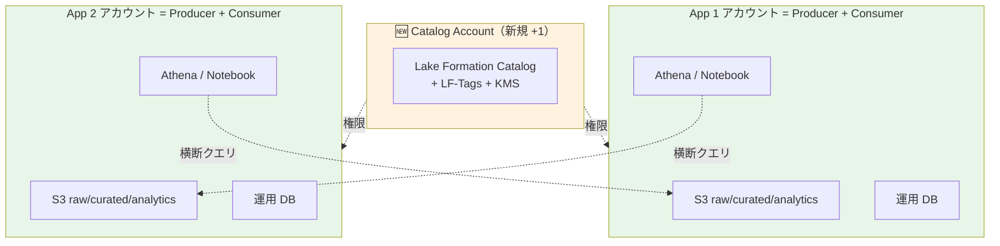
```mermaid
flowchart TB
    subgraph Cat["🆕 Catalog Account（新規 +1）"]
        LFCat["Lake Formation Catalog<br/>+ LF-Tags + KMS"]
    end

    subgraph A1["App 1 アカウント = Producer + Consumer"]
        S1["S3 raw/curated/analytics"]
        DB1["運用 DB"]
        Q1["Athena / Notebook"]
    end

    subgraph A2["App 2 アカウント = Producer + Consumer"]
        S2["S3 raw/curated/analytics"]
        DB2["運用 DB"]
        Q2["Athena / Notebook"]
    end

    Cat -.権限.-> A1
    Cat -.権限.-> A2
    Q1 -.横断クエリ.-> S2
    Q2 -.横断クエリ.-> S1

    style Cat fill:#fff3e0
    style A1 fill:#e8f5e9
    style A2 fill:#e8f5e9
```

**特徴**:
- **追加アカウント = Catalog Account 1 つだけ**（**+1**）
- アプリ追加 ≠ Consumer アカウント追加
- 各アプリの開発者・分析者が自分のアカウントから他アプリのデータも引ける
- **想定環境**: 小〜中規模、アプリ間の横断分析が必要だが**専属の BI チームはない**

### 4.2 Pattern β: 専用 Consumer アカウント 1 つだけ ⭐（**仮案選定**）

各アプリは Producer のみ。横断分析・BI は専属アカウントで集約。**Option B により Catalog を Consumer に同居**することで、Governance アカウントが不要に。

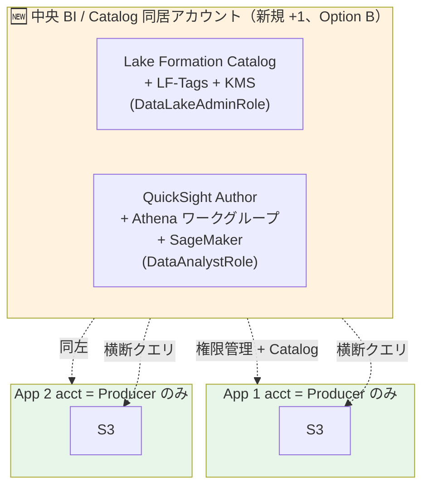
```mermaid
flowchart TB
    subgraph A1["App 1 acct = Producer のみ"]
        S1["S3"]
    end

    subgraph A2["App 2 acct = Producer のみ"]
        S2["S3"]
    end

    subgraph BICat["🆕 中央 BI / Catalog 同居アカウント（新規 +1、Option B）"]
        Cat["Lake Formation Catalog<br/>+ LF-Tags + KMS<br/>(DataLakeAdminRole)"]
        QS["QuickSight Author<br/>+ Athena ワークグループ<br/>+ SageMaker<br/>(DataAnalystRole)"]
    end

    BICat -.権限管理 + Catalog.-> A1
    BICat -.同左.-> A2
    BICat -.横断クエリ.-> S1
    BICat -.横断クエリ.-> S2

    style A1 fill:#e8f5e9
    style A2 fill:#e8f5e9
    style BICat fill:#fff3e0
```

**特徴**:
- **追加アカウント = 中央 BI / Catalog 同居の 1 つだけ**（**+1**、Option B 効果）
- 共通ドメイン（顧客マスタ等）を別アカウントとする場合は **+2 合計**
- 専属の BI / データ分析チームがいる組織向け
- アプリ側は分析クエリを投げない（または最小限）
- 同居の責務分離は IAM Role（`DataLakeAdminRole` / `DataAnalystRole`）で実装（[§5.5 緩和策](#55-option-b-が成立する条件と緩和策) 参照）

#### 4.2.1 §4.2 図に登場する AWS リソースの詳細解説

§4.2 の図は要点だけを示しているが、実際の構成には複数の AWS サービスが連携している。**Producer 側 / カタログ層 / 利用者層 / IAM Role** の 4 グループに分けて各リソースの役割を解説する。

##### 4.2.1.1 リソース関係図（AWS アカウント境界 + アクター + サービス/機能階層）

> **図の読み方**:
> - **太枠の Account** = **AWS アカウント境界**（Producer × N / 中央 BI / Catalog 同居 の 2 種類）
> - **黄色丸**（👤）= **アクター**（人間の役割、IAM Role）
> - **オレンジ枠** = **AWS サービス**（Glue、Lake Formation、Athena 等）
> - **サービス枠内のアイテム** = そのサービスの **機能・コンポーネント**（LF-Tags は Lake Formation の機能、Glue Data Catalog は Glue の機能）
> - **Catalog 層 / 利用者層 / 共通参照データ層は同じアカウント内**（Option B + D-2、§4.2 + [DP-ADR-003](adr/DP-ADR-003-common-domain-account-placement.md) で決定）— アカウント追加を最小化、IAM Role で責務分離
> - **共通参照データ層**（顧客マスタ等）は中央 BI / Catalog アカウント内に同居（Phase 1）。Phase 2 以降で D-1 新設の再評価あり → [§4.2.1.X](#421x-共通参照データの配置--d-2中央同居採用)
> - **Producer 側（案件側）の ETL パイプライン**（データソース → 取込層 → S3 → オーケストレーション）も図に含めるが、**詳細実装は本標準のスコープ外**（[§4.2.2.8](#4228-案件側-etl-の詳細イメージデータプラットフォーム標準のスコープ外参考情報) 参照）


```mermaid
flowchart TB
    %% Actors at top
    Steward(["👤 データスチュワード<br/>役割 2<br/>DataStewardRole"])
    Owner(["👤 データ責任者<br/>役割 1<br/>DataProductOwnerRole"])
    Admin(["👤 カタログ管理者<br/>役割 3<br/>DataLakeAdminRole"])
    Analyst(["👤 中央 BI チーム<br/>役割 4<br/>DataAnalystRole"])
    Reader(["👤 業務利用者<br/>役割 6<br/>DataReaderRole"])
    MasterMgr(["👤 共通参照<br/>データ管理者<br/>役割 5"])

    %% Producer Account 1
    subgraph App1Account["🟢 AWS アカウント: App 1 (Producer、既存活用) ※ETL 詳細はスコープ外 §4.2.2.8"]
        direction TB

        subgraph App1Sources["💼 データソース（業務システム）"]
            direction LR
            App1Aurora[("Aurora / RDS<br/>業務 OLTP")]
            App1Dynamo[("DynamoDB<br/>サービスメタ")]
            App1AppLog["アプリログ<br/>ECS / Lambda"]
            App1ExtSaaS["外部 SaaS<br/>Salesforce 等"]
            App1ExtCust["顧客社内システム<br/>※SFTP 連携アプリのみ<br/>オプション"]
        end

        subgraph App1Ingest["📥 取込層 (Ingestion)"]
            direction LR
            App1DMS[AWS DMS<br/>CDC / Bulk]
            App1KFH[Kinesis<br/>Data Firehose]
            App1AppFlow[AWS AppFlow]
            App1Transfer["Transfer Family<br/>+ Lambda<br/>※オプション、<br/>該当アプリのみ"]
        end

        subgraph App1S3["Amazon S3"]
            direction LR
            App1S3raw[raw 層]
            App1S3cur[curated 層]
            App1S3ana[analytics 層]
        end

        subgraph App1Glue["AWS Glue"]
            direction LR
            App1GlueCat["Glue Data Catalog<br/>※App1 自身の S3 の<br/>テーブル定義"]
            App1Crawler[Glue Crawler]
            App1ETL[Glue ETL Flex<br/>+ Glue Data Quality]
        end

        subgraph App1Orch["🔁 オーケストレーション / 監視"]
            direction LR
            App1StepFn[Step Functions]
            App1EvBridge[EventBridge<br/>Scheduler]
            App1CW[CloudWatch<br/>Alarms + Logs]
        end
    end


    %% Central BI / Catalog Account (Catalog + User + Common Reference Data layers in same account, Option B + D-2)
    subgraph CentralAccount["🟠 AWS アカウント: 中央 BI / Catalog 同居 (Option B + D-2、新規 +1 のみ)"]
        direction TB

        subgraph CatLayer["📚 カタログ層（管理: DataLakeAdminRole）"]
            direction LR
            subgraph LakeFormation["AWS Lake Formation"]
                LFTags[LF-Tags<br/>機能<br/>※domain=common 等]
                LFGrants[Cross-account Grants<br/>機能]
            end
            subgraph GlueCentral["AWS Glue"]
                GlueCatCentral["Glue Data Catalog<br/>※Lake Formation 利用基盤<br/>Producer Catalog を Federation 参照<br/>+ 'common_domain' DB を内包"]
            end
            subgraph KMSSvc["AWS KMS"]
                KMSCMK[CMK 共通暗号鍵]
            end
        end

        subgraph CommonRefLayer["🟡 共通参照データ層 (D-2 同居、管理: CommonReferenceDataManagerRole)"]
            direction LR
            subgraph CommonS3Svc["Amazon S3"]
                CommonS3["common-domain バケット<br/>顧客マスタ / 組織マスタ<br/>標準勘定科目 等"]
            end
        end

        subgraph UserLayer["📊 利用者層（管理: DataAnalystRole / DataReaderRole）"]
            direction LR
            subgraph AthenaSvc["Amazon Athena"]
                AthenaWG[Workgroups]
            end
            subgraph QSSvc["Amazon QuickSight Enterprise"]
                QSDash[ダッシュボード / SPICE]
            end
            subgraph SMSvc["Amazon SageMaker (Phase 2)"]
                SMStudio[Studio]
            end
            subgraph S3Result["Amazon S3"]
                S3Res["athena-results × WG 別<br/>クエリ結果 + Result Reuse Cache<br/>※派生データは別バケット §4.2.1.14"]
                S3Derived["central-derived<br/>CTAS 派生データ<br/>(月次集計 / ML 特徴量等)"]
            end
        end
    end

    %% Producer side - Actor responsibilities
    Steward -.実装・運用.-> App1ETL
    Steward -.実装・運用.-> App1Crawler
    Steward -.実装・運用.-> App1Ingest
    Steward -.実装・運用.-> App1Orch
    Owner -.公開承認.-> App1GlueCat

    %% Producer side - Data source → Ingestion
    App1Aurora --> App1DMS
    App1Dynamo --> App1KFH
    App1AppLog --> App1KFH
    App1ExtSaaS --> App1AppFlow
    App1ExtCust --> App1Transfer

    %% Producer side - Ingestion → S3 raw
    App1DMS --> App1S3raw
    App1KFH --> App1S3raw
    App1AppFlow --> App1S3raw
    App1Transfer --> App1S3raw

    %% Producer side - S3 transformation flow
    App1S3raw -->|raw → curated| App1ETL
    App1ETL --> App1S3cur
    App1S3cur -->|curated → analytics| App1ETL
    App1ETL --> App1S3ana

    %% Producer side - Crawler
    App1Crawler -.スキャン.-> App1S3raw
    App1Crawler -.スキャン.-> App1S3cur
    App1Crawler -.スキャン.-> App1S3ana
    App1Crawler -->|テーブル定義更新| App1GlueCat

    %% Producer side - Orchestration controls
    App1EvBridge -.起動.-> App1StepFn
    App1StepFn -.制御.-> App1DMS
    App1StepFn -.制御.-> App1ETL
    App1StepFn -.制御.-> App1Crawler
    App1ETL -.ログ.-> App1CW
    App1DMS -.ログ.-> App1CW

    %% Central catalog
    Admin -.LF / Tag 管理.-> LakeFormation
    Admin -.鍵管理.-> KMSCMK
    LakeFormation -.認可レイヤー.-> GlueCatCentral

    %% Cross-account Federation (Producer → Central)
    App1GlueCat -.Cross-account<br/>Federation.-> GlueCatCentral

    %% Encryption (KMS → Producer S3)
    KMSCMK -.暗号化.-> App1S3raw

    %% Consumer queries (利用者層 → Producer S3 を直接読込)
    Analyst -.クエリ作成.-> AthenaWG
    Analyst -.ダッシュ作成.-> QSDash
    Analyst -.ML 開発.-> SMStudio
    Reader -.閲覧.-> QSDash
    AthenaWG -.認可問合せ.-> LakeFormation
    AthenaWG -.メタデータ参照.-> GlueCatCentral
    AthenaWG -.データ直読.-> App1S3ana
    AthenaWG -.クエリ結果保存.-> S3Res
    AthenaWG -.CTAS 派生データ生成.-> S3Derived
    QSDash -.SQL.-> AthenaWG
    SMStudio -.学習データ取得.-> App1S3ana

    %% Common Reference Data Layer (D-2 同居)
    MasterMgr -.管理.-> CommonS3
    MasterMgr -.スキーマ管理.-> GlueCatCentral
    KMSCMK -.暗号化.-> CommonS3
    AthenaWG -.横断クエリ.-> CommonS3

    %% Styling - Account boundaries with thick borders
    style App1Account fill:#e8f5e9,stroke:#388e3c,stroke-width:3px
    style CentralAccount fill:#fff3e0,stroke:#e65100,stroke-width:3px

    %% Layer backgrounds - Producer side (ETL pipeline = スコープ外、点線)
    style App1Sources fill:#f5f5f5,stroke:#999,stroke-dasharray: 3 3
    style App1Ingest fill:#fff3e0,stroke:#999,stroke-dasharray: 3 3
    style App1Orch fill:#e3f2fd,stroke:#999,stroke-dasharray: 3 3

    %% Layer backgrounds - Central side
    style CatLayer fill:#ffebee
    style CommonRefLayer fill:#fff8e1
    style UserLayer fill:#e3f2fd

    %% AWS Service boxes
    style LakeFormation fill:#ffcc99
    style GlueCentral fill:#ffd5cc
    style App1Glue fill:#ffd5cc
    style App1S3 fill:#ccffcc
    style S3Result fill:#ccddff
    style CommonS3Svc fill:#ccffcc
    style AthenaSvc fill:#ccddff
    style QSSvc fill:#ccddff
    style SMSvc fill:#ccddff
    style KMSSvc fill:#fff

    %% Actors
    style Steward fill:#fffacd
    style Owner fill:#fffacd
    style Admin fill:#fffacd
    style Analyst fill:#fffacd
    style Reader fill:#fffacd
    style MasterMgr fill:#fffacd
```

###### AWS アカウント境界の整理

| アカウント | 種類 | 数 | 役割 |
|---|---|:---:|---|
| 🟢 **App アカウント**（Producer）| 既存 | **N 個** | アプリ稼働 + Producer 役割兼任。S3 にデータを保管、Glue Catalog で自身のテーブル定義 |
| 🟠 **中央 BI / Catalog アカウント**（Option B + D-2 同居）| 新規 | **1 個** | **カタログ層 / 利用者層 / 共通参照データ層を同居**。3 層は IAM Role で責務分離: `DataLakeAdminRole`（カタログ）/ `CommonReferenceDataManagerRole`（共通参照データ）/ `DataAnalystRole`+`DataReaderRole`（利用者） |

→ **アカウント追加合計: +1 のみ**
→ 共通ドメインアカウントの **D-1 新設は Phase 2 以降の再評価候補**（[DP-ADR-003](adr/DP-ADR-003-common-domain-account-placement.md)）

###### Producer 側 ETL パイプラインの構成要素（**点線枠 = 本標準のスコープ外、参考**）

Producer アカウント内には ETL パイプラインに必要な以下のコンポーネントが存在する。**本標準ではインターフェース契約（S3 への着地データの規約）のみを定め、ETL の実装は案件側の自由**:

| # | 構成要素 | 主な役割 | 代表サービス | 詳細 |
|---|---|---|---|---|
| 💼 | **データソース** | 業務システムの原本データ | Aurora / RDS / DynamoDB / アプリログ / 外部 SaaS / SFTP | [§4.2.2.8.1](#42281-案件側-etl-の全体像典型パターン) |
| 📥 | **取込層 (Ingestion)** | データソース → S3 raw への運搬 | AWS DMS / Kinesis Firehose / AppFlow / Transfer Family + Lambda | [§4.2.2.8.3](#42283-取込層の選定マトリクス--詳細) |
| 🗄 | **S3 (Medallion)** | raw → curated → analytics の 3 層構造 | Amazon S3 + パーティション + Parquet | [§4.2.2.8.4](#42284-変換層の典型実装--詳細) |
| 🛠 | **Glue (変換 + メタデータ)** | クレンジング、PII マスキング、`tenant_id` 強制、Catalog 登録 | Glue ETL Flex / Glue Data Quality / Glue Crawler | [§4.2.2.8.4](#42284-変換層の典型実装--詳細) / [§4.2.3](#423-glue-crawler-の位置付けと運用) |
| 🔁 | **オーケストレーション / 監視** | ジョブ起動・依存関係・リトライ・通知 | Step Functions / EventBridge Scheduler / CloudWatch Alarms + Logs | [§4.2.2.8.6](#42286-オーケストレーションの典型実装--詳細) |

> ⚠ **スコープの境界**: 図中の **点線枠（💼 / 📥 / 🔁）は本標準のスコープ外**。案件側のデータエンジニアリングチームが選定・実装する。本標準は「**S3 への着地データの規約**」（バケット命名 / パーティション / 暗号化 / `tenant_id` / Catalog 登録）のみを課す。詳細は [§4.2.2.8.11 案件側に守ってもらうインターフェース契約](#422811-標準として案件側に守ってもらうことインターフェース契約)。

###### アクター（役割と IAM Role）の整理

| アクター | 役割 | IAM Role | 主な操作 |
|---|---|---|---|
| 👤 **データ責任者** | 役割 1 | `DataProductOwnerRole` | データ製品公開の承認、利用申請の承認 |
| 👤 **データスチュワード** | 役割 2 | `DataStewardRole` | Producer 側 ETL / Crawler の運用、スキーマ管理、データ品質責任 |
| 👤 **カタログ管理者** | 役割 3 | `DataLakeAdminRole` | Lake Formation 管理、LF-Tag 体系、KMS、クロスアカウント Grants |
| 👤 **中央 BI チーム** | 役割 4 | `DataAnalystRole` | Athena / QuickSight / SageMaker での分析・ダッシュ作成 |
| 👤 **共通参照データ管理者** | 役割 5 | （兼任、Phase 1）| 顧客マスタ等の整備・スキーマ管理 |
| 👤 **業務利用者** | 役割 6 | `DataReaderRole` | QuickSight ダッシュボード閲覧 |
| 👤 **監査担当者**（図には表示せず）| 役割 7 | （既存 Audit Role）| 監査アカウント（§5.8 参照）経由でログ確認 |

###### サービスと機能の階層理解（重要）

| AWS サービス | このサービスが含む機能 | 単独サービス / 他サービスとの関係 |
|---|---|---|
| **AWS Glue** | Glue Data Catalog（メタデータストア）/ Glue Crawler / Glue ETL Jobs / Glue Schema Registry / Glue Data Quality | 独立したサービス、上に他のサービス（Lake Formation / Athena）が乗る基盤 |
| **AWS Lake Formation** | LF-Tags（タグベース ABAC）/ Cross-account Grants / 監査ログ | **自身は Catalog を持たず、Glue Data Catalog を利用**して認可レイヤーを提供する |
| **Amazon Athena** | Workgroups / クエリエンジン（Trino ベース）/ Result Reuse | Glue Data Catalog からメタデータ取得、Lake Formation に認可問合せ、S3 を直接読込 |
| **Amazon QuickSight** | ダッシュボード / SPICE（インメモリ）/ Q（自然言語）| データソースとして Athena 等を利用 |
| **Amazon SageMaker** | Studio / Training / Inference / Model Registry | S3 / Glue Catalog を学習データ取得経路として利用 |
| **AWS KMS** | CMK / 鍵ポリシー / 鍵ローテーション | 独立、各サービスから暗号化用途で参照 |
| **Amazon S3** | バケット / Object Lock / ライフサイクル | 独立、データの実体保存先 |

→ **「LF-Tags は Lake Formation の機能」「Glue Data Catalog は Glue の機能」**を図でも明示的に表現（各 AWS サービスの subgraph 内に機能を配置）。

###### Producer 側の Glue Data Catalog の意味（明確化）

**Producer 側 Glue Data Catalog は「その App 自身の S3 データ」を記述します**:

| 機能 | 内容 |
|---|---|
| **何を記述するか** | App 自身の S3 raw / curated / analytics 各層のデータベース定義・テーブル定義・パーティション情報 |
| **誰が書込むか** | Glue Crawler（スキーマ自動検出時）/ Glue ETL Jobs（書込み時に明示登録）/ Athena DDL（CREATE TABLE）|
| **誰が読込むか** | Glue ETL（スキーマ参照）/ Athena（クエリ時のメタデータ）/ Lake Formation（Federation 経由で中央から参照）|
| **中央への共有** | Cross-account Glue Catalog Federation で **中央 Glue Catalog から透過的に参照**される |

**Central 側 Glue Data Catalog の意味**:

| 機能 | 内容 |
|---|---|
| **何を記述するか** | Federation で参照する Producer Catalog のテーブル + 共通ドメインのテーブル + Athena CTAS 等で作成した派生テーブル |
| **Lake Formation との関係** | **Lake Formation が認可レイヤーとしてこの Catalog を利用**（Lake Formation 自身は Catalog を持たない）|
| **LF-Tags はどこに付くか** | この **中央 Glue Catalog のテーブル / 列**に LF-Tags が付与される |
| **Athena は何を見るか** | クエリ時に **中央 Glue Catalog** からメタデータを取得、Lake Formation に認可問合せ、S3 を直接読込 |

→ **「Lake Formation は Glue Catalog の上に乗る認可レイヤー」**という関係を明示的に図に反映（点線「認可レイヤー」で表現）。

##### 4.2.1.X 共通参照データの配置 — D-2（中央同居）採用

> **意思決定**: **Phase 1 では D-2（中央 BI / Catalog アカウントに同居）を採用**。共通ドメインアカウント新設（D-1）は Phase 2 以降の再評価候補として保留。
> **判断記録**: [DP-ADR-003: 共通参照データの配置](adr/DP-ADR-003-common-domain-account-placement.md)
> **背景**: 過去の議論（strawman §1.3 / 当章 §5.5）で「共通ドメインアカウント新設」を提案していたが、Phase 1 規模では責務分離効果に対しアカウント運用コストが見合わないと判断し、D-2 に集約した。**判断経緯は本節 A〜F で記録し、ADR を正とする**。

###### A. 何のためのアカウントか

「**特定のアプリに所属しないが、複数アプリから参照される共通参照データ**」を保管・管理する独立 AWS アカウント。

**典型的に置く想定のデータ**:

| データ | 例 | なぜ「共通」か |
|---|---|---|
| **顧客マスタ** | 顧客企業 ID / 名称 / 業種 / 契約プラン / 解約日 | 経費精算 SaaS の利用状況と CRM の商談履歴を突合する際に、両者が同じ顧客 ID 体系を使う必要がある |
| **組織マスタ** | 顧客企業内の部署階層 / 従業員ロール | 多くの SaaS 製品が「同じ組織階層」を前提に動く |
| **標準勘定科目マスタ** | 経費精算 SaaS の費目 / 会計連携用コード | 個別アプリのコードと SaaS 提供側の標準コードのマッピング |
| **国・地域コード / 通貨マスタ** | ISO 3166 / ISO 4217 等 | アプリ非依存の汎用マスタ |
| **共通分析ディメンション** | 業種分類 / 企業規模区分 / 商圏定義 | クロスアプリ分析の軸 |

###### B. なぜ「特定アプリに寄せない」のか

```
❌ 経費精算 SaaS のアカウントに顧客マスタを置くと:
   - CRM / 営業支援 SaaS / ERP からも参照するため、依存方向が「経費精算 → 他」と逆転
   - 経費精算チームが顧客マスタの責任を負うのは責務範囲外
   - 経費精算アカウントの障害・変更が全 SaaS の分析を止める

✅ 共通ドメインアカウントに置くと:
   - どの SaaS アプリにも従属せず、横断データの「中立な所有者」になる
   - 共通参照データ管理者（役割 5）が責任を持つ
   - 個別アプリの稼働とは独立した寿命を持てる
```

###### C. 採用した場合の構成

| 要素 | 内容 |
|---|---|
| **アカウント** | AWS Organizations 配下の独立アカウント 1 個 |
| **保管先** | S3 + Glue Data Catalog（Producer と同じ構造）|
| **管理者** | 共通参照データ管理者（役割 5）。Phase 1 では中央 BI チームが兼任する想定 |
| **更新方法** | 顧客マスタ等は契約管理システム or Salesforce 等から日次連携 / 標準コードは手動 GitOps |
| **公開方法** | Cross-account Glue Catalog Federation で中央 Catalog から参照、Athena 横断クエリで利用 |
| **コスト** | S3 数 GB + Glue Catalog 無料枠内 + 連携ジョブ（Lambda or Glue ETL）程度。月 $10-50 規模 |

###### D. 代替案との比較

| 代替案 | 概要 | メリット | デメリット | 評価 |
|---|---|---|---|---|
| **D-1: 共通ドメインアカウント新設**（現提案）| 専用アカウント +1 | 責務明確、SaaS 非依存、独立した寿命 | アカウント +1、管理者ロール定義が必要 | ⭕ **本案** |
| **D-2: 中央 BI / Catalog アカウントに同居** | Catalog アカウント内に共通マスタ S3 を置く | アカウント追加なし | カタログ層と「共通参照データ」の責務が混在、Catalog 管理者と共通参照データ管理者の責任が曖昧化 | △ |
| **D-3: 既存の代表アプリに寄せる** | 例: 経費精算 SaaS アカウントに置く | 新規アカウント不要 | **依存方向の逆転 / 責務範囲外 / 障害影響伝播**（上記 B の問題） | ❌ |
| **D-4: マスタ専用 SaaS / MDM 製品導入** | Reltio / Informatica MDM 等 | 高機能（名寄せ、来歴管理）| SaaS 不採用方針に抵触、コスト高 | ❌ |
| **D-5: 採用しない（共通参照データは持たない）** | アプリごとに独自マスタで管理、突合は都度 | アカウント +0 | クロスアプリ分析が事実上不可能 / 顧客マスタ 1 件の不整合が全社で発生 | ❌（分析価値が大きく毀損）|

###### E. 採否を分ける質問（ヒアリング）

| 質問 | 「YES なら D-1 採用」 |
|---|---|
| 複数 SaaS 製品で同じ顧客企業を参照することがあるか | ✅ クロスアプリ分析がある |
| 顧客マスタ等を「どの SaaS にも所属しない中立データ」と扱いたいか | ✅ 責務分離を重視 |
| 共通マスタの責任者を BI/Catalog チームと分離したいか | ✅ 役割 3 と役割 5 を分ける |
| 将来 SaaS 製品を増やす計画があり、毎回マスタ依存を再設計したくないか | ✅ 拡張性を重視 |

→ **3 つ以上 YES なら D-1（共通ドメインアカウント新設）を採用**、それ以外なら D-2（中央同居）に縮退、または D-5（持たない）も選択肢。

###### F. Phase 1 採用方針と Phase 2 再評価条件

**Phase 1 採用方針**: **D-2（中央 BI / Catalog アカウント同居）** → 詳細は [DP-ADR-003](adr/DP-ADR-003-common-domain-account-placement.md)

| 観点 | Phase 1 採用内容 |
|---|---|
| **F-1**: 共通参照データの配置 | **中央 BI / Catalog アカウント内に同居**。独立 S3 バケット + Glue Catalog `common_domain` DB で識別 |
| F-2: 役割 5 の兼任 | Phase 1 は中央 BI チームが兼任、`CommonReferenceDataManagerRole` を別途定義し IAM で責務分離 |
| F-3: マスタソース | 契約管理 SaaS / Salesforce 等、顧客のシステム構成依存（ヒアリング項目）|
| F-4: 書込み権限 | `CommonReferenceDataManagerRole` のみ、Producer / Consumer は読込のみ |

**Phase 2 以降の D-1 移行トリガ**（[DP-ADR-003 §4.1](adr/DP-ADR-003-common-domain-account-placement.md) 参照）:

| カテゴリ | トリガ条件 |
|---|---|
| 規模 | 共通参照データの S3 サイズが 100 GB 超 / 月間アクセス頻度が中央 BI 層の 50% 超 |
| 組織 | 役割 5 が中央 BI チームから専任化 |
| SaaS ポートフォリオ | 共通参照データに依存する SaaS 製品が 5 つ以上 |
| マスタ管理機能 | 来歴管理・名寄せ等、Glue/Athena では不足する機能が要求 |
| 障害影響 | Catalog 層障害で共通参照データ参照が年 2 回以上停止 |
| 規制・監査 | アクセスログを物理分離する規制要件 |

**移行容易性**: D-2 → D-1 は 3-4 週間で移行可能（DDL エクスポート + S3 Replication + Federation 再設定）。クエリで使う DB 名 `common_domain` を最初から固定することで、Federation 経由でも同じ名前を維持できる設計とする。

##### 4.2.1.2 Producer 側（各アプリアカウント）のリソース

| リソース | 概要 | 本構成での役割 | 補足 |
|---|---|---|---|
| **S3 (Simple Storage Service)** | AWS のオブジェクトストレージ。無制限容量・11 nines 耐久性 | データレイクの中核。各アプリが「自分のデータ」を所有 | 暗号化（SSE-KMS）必須、ライフサイクルポリシーで Standard → IA → Glacier の自動移行 |
| **S3 raw 層** | 生データ層（Bronze）| アプリから直接取り込んだ生データ（JSON / CSV / Parquet 等）| 不変、Object Lock 検討、長期保管前提 |
| **S3 curated 層** | 整形済み層（Silver）| クレンジング・正規化・PII マスキング済（Parquet 推奨）| ETL ジョブで生成、データ品質チェック後 |
| **S3 analytics 層** | 分析用層（Gold）| 集計済み・分析に最適化されたテーブル（Parquet + パーティション）| BI / ML が直接クエリする層、`tenant_id` パーティション含む |
| **Glue Data Catalog（ローカル）** | 各アプリのテーブル定義・スキーマ・パーティション情報 | アプリ内のテクニカルメタデータストア | 中央 Lake Formation に Federate されて統合される |

##### 4.2.1.3 カタログ層（`DataLakeAdminRole` が管理）のリソース

| リソース | 概要 | 本構成での役割 | 補足 |
|---|---|---|---|
| **AWS Lake Formation** | AWS の中央データレイクガバナンスサービス | データレイクの「**ガバナンス層**」。表 / 列 / 行レベルのアクセス制御、クロスアカウント Catalog 提供、監査ログ | 各 Producer の S3 を「Federated Catalog」として束ねる |
| **Glue Data Catalog（中央）** | テーブル定義・スキーマ・パーティションのメタデータストア | Lake Formation の**下層**。Athena / Redshift Spectrum / EMR がメタデータを読む層 | Lake Formation = Glue Data Catalog + 権限管理層 |
| **LF-Tags (Lake Formation Tags)** | リソース（DB / テーブル / 列）に付与するキーバリュー型タグ | **タグベースアクセス制御（TBAC）** を実装。例: `機密度=Restricted` / `ドメイン=Finance` / `PII=Yes` | 個別テーブルへの権限付与より運用効率が高い。「Finance ドメインの PII=No なテーブル全て、SELECT 許可」のような宣言的設定 |
| **KMS CMK (Customer Managed Key)** | AWS の暗号鍵管理サービス、利用者が管理する鍵 | データレイク全体の暗号化に使用。鍵の生成・ローテーション・廃棄を管理 | アカウント間で鍵ポリシーを設定すれば、App 側からも CMK を使える（クロスアカウント暗号化） |

##### 4.2.1.4 利用者層（`DataAnalystRole` が管理）のリソース

| リソース | 概要 | 本構成での役割 | 補足 |
|---|---|---|---|
| **Athena** | AWS のサーバーレス SQL クエリエンジン（Trino ベース）| S3 上のデータを直接 SQL でクエリ。スキャンしたデータ量に応じた従量課金 | Lake Formation と統合され、認可は LF 経由 |
| **Athena ワークグループ** | クエリ実行の論理コンテナ | **用途別に分離**: 探索用 / BI 用 / 監査用 / アプリ問い合わせ用 など | 各 WG にクエリ結果保存先・スキャン量上限（コスト統制）・ログ出力先・暗号化設定 |
| **QuickSight Enterprise** | AWS の BI / ダッシュボードサービス | 経営層・CS・PM 等の業務利用者向けダッシュボード提供 | Enterprise Edition は **行レベルセキュリティ（RLS）対応** → テナント分離に重要 |
| **QuickSight Author** | ダッシュボード作成可能なユーザー権限 | 中央 BI チームのリーダーが該当 | ライセンス: ユーザーあたり月額（Reader より高い）|
| **QuickSight Reader** | ダッシュボード閲覧のみ可能なユーザー権限 | 業務利用者（経営層・CS・PM 等）が該当 | ライセンス: ユーザーあたり月額（Author より安い）、Author:Reader 比率は **1:10** 想定 |
| **QuickSight SPICE** | インメモリ計算エンジン | ダッシュボード応答時間を秒オーダーに高速化 | ピーク負荷のあるダッシュボードは SPICE 利用必須 |
| **SageMaker Studio** | AWS の機械学習プラットフォーム | 解約予兆検知 / 顧客健全性スコア / 業界別利用パターン分析 等の ML 開発 | Phase 2 から本格採用想定。Notebook / Training / Inference / Model Registry |
| **S3 athena-results × WG 別** | Athena のクエリ結果保存用 S3 バケット（**ワークグループごとに分離**）| **クエリ結果 CSV + Result Reuse Cache のみ**（一時的、7-90 日で削除）| **ワークグループ単位で別バケット必須**（機密度・KMS 鍵・ライフサイクル・コスト按分を分離、詳細は [§4.2.1.14](#42114-athena-results-バケットの中身とワークグループ別分離)）|
| **S3 central-derived** | CTAS / INSERT INTO で生成する**派生データ**用 S3 バケット | 月次集計・ML 特徴量・横断 KPI 等の長期保存テーブル（12-24 ヶ月）| **athena-results とは別バケット**。CTAS 時に `external_location` で明示指定（[§4.2.1.14 B 節](#42114-athena-results-バケットの中身とワークグループ別分離)）|

##### 4.2.1.5 IAM Role 体系

[§5.5 緩和策](#55-option-b-が成立する条件と緩和策) で定めた 3 階層 Role の権限詳細:

| Role | 担当 | 主な権限 | 主な制約 |
|---|---|---|---|
| **`DataLakeAdminRole`** | 役割 3<br/>カタログ管理者（1-2 名）| ・Lake Formation 管理（Database / Table / Permission）<br/>・LF-Tags の作成・編集・付与<br/>・クロスアカウント Grant<br/>・KMS CMK 管理<br/>・データレイク全データへの読み権限（デバッグ用）| ・通常の業務 BI 操作はしない（QuickSight ダッシュボード作成等）<br/>・**Phase 1: 1-2 名のみ AssumeRole 可能**<br/>・常時ログインなし、必要時のみ一時利用 |
| **`DataAnalystRole`** | 役割 4<br/>中央 BI チーム（2 名）| ・Athena クエリ実行（許可された WG 内）<br/>・QuickSight ダッシュボード作成・編集・閲覧<br/>・自分の S3 結果バケットへの書込み<br/>・SageMaker での ML 開発（Phase 2）| ・**Lake Formation 管理操作は Permission Boundary で拒否**<br/>・他アプリの S3 への書込み不可<br/>・KMS 管理操作は不可<br/>・LF-Tags の変更不可 |
| **`DataReaderRole`** | 役割 6<br/>業務利用者（10 名）| ・QuickSight ダッシュボード閲覧のみ<br/>・許可された定形クエリのみ実行（Athena Saved Queries）| ・新規クエリ作成不可<br/>・データのダウンロード制限（QuickSight からの Export 制限）<br/>・LF-Tags / Lake Formation 管理は不可 |

##### 4.2.1.6 Permission Boundary と SCP（補強）

Role 間の境界を強制するためのガードレール:

| 制御 | 仕組み | 目的 |
|---|---|---|
| **Permission Boundary** | 各 IAM Role に付与する「上限ポリシー」 | `DataAnalystRole` から `lakeformation:*` の API 呼び出しを拒否 → 役割 4 が Catalog を操作できないことを保証 |
| **SCP (Service Control Policy)** | Organization レベルで設定するアカウント全体の制約 | 中央 BI / Catalog アカウント内で意図しない権限上昇（IAM Role 作成・PolicyVersion 変更等）を予防 |
| **AWS Config Rules** | 構成監視ルール | 「`DataLakeAdminRole` と `DataAnalystRole` を兼任するユーザー」を検出 → 役割 3 / 4 の人員重複を防止（Option B 成立前提） |

##### 4.2.1.7 図にはないが関連する重要リソース

§4.2 図は要点だけを示しているため、以下も実構成では存在する:

| リソース | 役割 | 配置 |
|---|---|---|
| **AWS RAM (Resource Access Manager)** | クロスアカウント Lake Formation 権限共有の裏で使用される AWS の基盤サービス | Lake Formation 内部で自動利用（明示的に意識不要）|
| **CloudTrail Data Events** | データプレーン操作（S3 オブジェクトアクセス、Lake Formation 操作、KMS 鍵使用）のログ | [§5.8 監査責務分離](#58-監査責務分離の具体設計option-b-採用時--新規監査アカウント前提) で監査アカウントへ送付 |
| **VPC エンドポイント** | プライベートネットワーク経由で S3 / Athena / Lake Formation にアクセス | 全アカウントで設定、データの公開ネットワーク経由を回避 |
| **Glue ETL** | データ変換ジョブ（raw → curated → analytics）| Producer 側（各アプリ）が運用 |
| **Glue Crawler** | スキーマ自動検出 + Glue Catalog 登録 | Producer 側で運用、新規データ発生時に実行 |

##### 4.2.1.8 Athena ワークグループの分離理由（権限以外）

> **質問への回答**: ワークグループを分ける理由は**権限だけではない**。Athena Workgroup は **8 つの分離軸**を一括で提供する論理コンテナであり、権限はそのうちの 1 つに過ぎない。

###### A. ワークグループが提供する 8 つの分離軸

| # | 分離軸 | 内容 | 分けないと何が困るか |
|---|---|---|---|
| 1 | **コスト統制** | per-query スキャン量上限（例: 100 GB）、per-workgroup 月次スキャン上限 | 1 人の暴走クエリ（フルテーブルスキャン）で月予算を食いつぶす |
| 2 | **クエリ結果保存先** | クエリ結果の S3 出力先バケット / プレフィックス指定 | 機密度の異なる結果が同一バケットに混在、漏洩リスク |
| 3 | **暗号化設定** | クエリ結果の暗号化方式（SSE-S3 / SSE-KMS / CSE-KMS）+ KMS CMK 指定 | 機密度の高いクエリ結果を弱い鍵で暗号化するリスク |
| 4 | **エンジンバージョン** | Athena Engine v2 / v3 / Apache Spark の選択 | 新エンジン検証中にプロダクション影響を受ける、Spark を全員に開放するとコスト爆発 |
| 5 | **クエリ履歴の隔離** | 他チームのクエリ履歴を見られないように分離 | 営業チームが経理チームの「給与テーブル参照クエリ」履歴を見てしまう |
| 6 | **CloudWatch メトリクス分離** | per-workgroup の `ProcessedBytes` / `QueryQueueTime` / `EngineExecutionTime` | チーム別の利用傾向・コスト按分が不可能 |
| 7 | **キャパシティ予約**（Phase 3+）| Athena Provisioned Capacity の DPU 予約をワークグループに紐付け | 用途別の応答時間 SLA を保証できない |
| 8 | **IAM 権限（境界）** | どの IAM Role / User がそのワークグループでクエリ実行できるか | 役割 6（業務利用者）が役割 4（BI チーム）の探索ワークグループに入ってきて誤クエリ |

→ **「権限」は 8 軸のうち 1 軸**。コスト統制・結果保存先・エンジン版・履歴分離も同等以上に重要。**ワークグループは「用途別のサンドボックス」**として機能する。

###### B. 本 PoC での想定ワークグループ構成（Phase 1）

中央 BI / Catalog アカウント内の Athena に、以下 5 ワークグループを想定:

| ワークグループ | 用途 | 主な利用者 | 主な分離理由 | スキャン量上限 |
|---|---|---|---|---|
| **`wg-bi-dashboard`** | QuickSight ダッシュボード裏側のクエリ | QuickSight サービス（Service Principal）/ 中央 BI チーム | 結果キャッシュ最適化 + SLA 担保 + コスト予測 | per-query 50 GB |
| **`wg-bi-exploration`** | 中央 BI チームの探索クエリ | 中央 BI チーム（役割 4）| エンジン v3 検証、Spark 試行も許可 | per-query 100 GB |
| **`wg-app-producer-N`** | 各 Producer アカウントから cross-account で実行する自テナント分析 | 各案件アプリのデータエンジニア（役割 2）| アプリ別コスト按分、結果は自アプリ S3 へ | per-query 100 GB |
| **`wg-reader-saved`** | 業務利用者の保存済み定形クエリ実行のみ | 業務利用者（役割 6）| 新規クエリ禁止 / Reader 限定 | per-query 10 GB |
| **`wg-audit`** | 監査担当者の調査クエリ | 監査担当者（役割 7） | クエリ履歴を別 KMS 鍵で暗号化、改竄防止 | per-query 100 GB |

###### C. ワークグループ分離の設計原則

| # | 原則 | 説明 |
|---|---|---|
| 1 | **用途別 = 1 ワークグループ** | ダッシュボード裏 / 探索 / 監査 / Producer 等、用途ごとに 1 個 |
| 2 | **per-query スキャン量上限を必ず設定** | コスト暴走防止の基本。閾値は用途で変える |
| 3 | **結果保存先を per-workgroup で分離** | 機密度別バケット、KMS 鍵分離 |
| 4 | **Service Principal は専用ワークグループ** | QuickSight / SageMaker 等の自動実行はサービス専用 WG |
| 5 | **テナント識別はクエリ側で必須** | WG レベルでテナント分離はしない（テナント分離は Lake Formation の Data Filter で実装） |
| 6 | **WG は粗粒度、Lake Formation は細粒度** | テーブル / 列 / 行レベルの分離は LF 側で行う |

→ ワークグループは **「環境境界」** を提供する役割で、データそのものの細粒度アクセス制御は次節の Lake Formation が担う。**役割分担を明確に分けるのが重要**。

##### 4.2.1.9 Lake Formation 認可フローの具体設計

> **質問への回答**: 「Athena が Lake Formation に認可問合せ」とは、内部的に **資格情報ベンディング（Credentials Vending）** と呼ぶ仕組みで、Athena は Lake Formation から **そのクエリ用に絞り込まれた STS 一時クレデンシャル**を受け取り、それで S3 を読む。クエリ単位で「読める範囲を厳密に制限した一時的な権限」が発行される、というのが核心。

###### A. クエリ実行時のシーケンス（具体フロー）

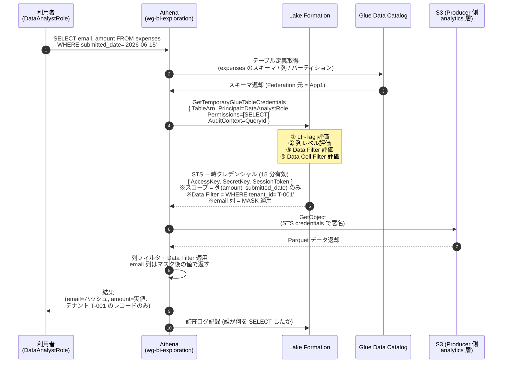
```mermaid
sequenceDiagram
    autonumber
    participant User as 利用者<br/>(DataAnalystRole)
    participant Athena as Athena<br/>(wg-bi-exploration)
    participant LF as Lake Formation
    participant Glue as Glue Data Catalog
    participant S3 as S3 (Producer 側<br/>analytics 層)

    User->>Athena: SELECT email, amount FROM expenses<br/>WHERE submitted_date='2026-06-15'
    Athena->>Glue: テーブル定義取得<br/>(expenses のスキーマ / 列 / パーティション)
    Glue-->>Athena: スキーマ返却 (Federation 元 = App1)

    Athena->>LF: GetTemporaryGlueTableCredentials<br/>{ TableArn, Principal=DataAnalystRole,<br/>  Permissions=[SELECT],<br/>  AuditContext=QueryId }

    Note over LF: ① LF-Tag 評価<br/>② 列レベル評価<br/>③ Data Filter 評価<br/>④ Data Cell Filter 評価

    LF-->>Athena: STS 一時クレデンシャル (15 分有効)<br/>{ AccessKey, SecretKey, SessionToken }<br/>※スコープ = 列(amount, submitted_date) のみ<br/>※Data Filter = WHERE tenant_id='T-001'<br/>※email 列 = MASK 適用

    Athena->>S3: GetObject<br/>(STS credentials で署名)
    S3-->>Athena: Parquet データ返却
    Athena->>Athena: 列フィルタ + Data Filter 適用<br/>email 列はマスク後の値で返す
    Athena-->>User: 結果<br/>(email=ハッシュ, amount=実値、<br/>テナント T-001 のレコードのみ)

    Athena->>LF: 監査ログ記録 (誰が何を SELECT したか)
```

| ステップ | 何が起きるか |
|---|---|
| ①-③ | Athena はまず Glue Catalog からテーブルスキーマを取得 |
| ④ | **重要ステップ**: Athena が Lake Formation の `GetTemporaryGlueTableCredentials` API を呼び、「この Principal がこのテーブルに SELECT する権限があるか」を問い合わせ |
| ⑤ | Lake Formation が **4 層の評価**を実施: LF-Tag → 列 → 行（Data Filter）→ セル（Data Cell Filter）|
| ⑥ | LF が **スコープを絞った STS 一時クレデンシャル**を返却（許可された列のみアクセス可、Data Filter 適用） |
| ⑦⑧ | Athena はこのクレデンシャルで S3 を直接読みに行く（**Athena 自身の IAM ではなく、LF から受け取ったクレデンシャル**）|
| ⑨⑩ | Athena が結果を組み立てて利用者に返却 |
| ⑪ | Lake Formation が監査ログを CloudTrail / Lake Formation 監査ログに記録 |

→ **「Athena が LF に問合せ」の正体は API コールベースの認可** であり、結果として **クエリ実行のたびに発行される STS 一時クレデンシャル**で S3 アクセスが行われる。

###### B. 設定の流れ（Phase 1 採用時の最小構成）

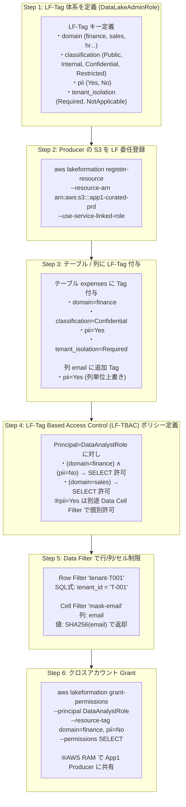
```mermaid
flowchart TB
    subgraph Step1["Step 1: LF-Tag 体系を定義 (DataLakeAdminRole)"]
        T1["LF-Tag キー定義<br/>・domain (finance, sales, hr...)<br/>・classification (Public, Internal, Confidential, Restricted)<br/>・pii (Yes, No)<br/>・tenant_isolation (Required, NotApplicable)"]
    end

    subgraph Step2["Step 2: Producer の S3 を LF 委任登録"]
        T2["aws lakeformation register-resource<br/>--resource-arn arn:aws:s3:::app1-curated-prd<br/>--use-service-linked-role"]
    end

    subgraph Step3["Step 3: テーブル / 列に LF-Tag 付与"]
        T3["テーブル expenses に Tag 付与<br/>・domain=finance<br/>・classification=Confidential<br/>・pii=Yes<br/>・tenant_isolation=Required<br/><br/>列 email に追加 Tag<br/>・pii=Yes (列単位上書き)"]
    end

    subgraph Step4["Step 4: LF-Tag Based Access Control (LF-TBAC) ポリシー定義"]
        T4["Principal=DataAnalystRole に対し<br/>・(domain=finance) ∧ (pii=No) → SELECT 許可<br/>・(domain=sales) → SELECT 許可<br/>※pii=Yes は別途 Data Cell Filter で個別許可"]
    end

    subgraph Step5["Step 5: Data Filter で行/列/セル制限"]
        T5["Row Filter 'tenant-T001'<br/>SQL式: tenant_id = 'T-001'<br/><br/>Cell Filter 'mask-email'<br/>列: email<br/>値: SHA256(email) で返却"]
    end

    subgraph Step6["Step 6: クロスアカウント Grant"]
        T6["aws lakeformation grant-permissions<br/>--principal DataAnalystRole<br/>--resource-tag domain=finance, pii=No<br/>--permissions SELECT<br/><br/>※AWS RAM で App1 Producer に共有"]
    end

    Step1 --> Step2 --> Step3 --> Step4 --> Step5 --> Step6
```

###### C. 4 層の評価（細粒度制御の正体）

Lake Formation の認可は **4 つの粒度**で行われ、すべて AND で評価される:

| 層 | 何ができるか | 設定例（経費精算 SaaS）|
|---|---|---|
| **① テーブル / DB レベル**（LF-Tag）| 「Finance ドメインのテーブル全部 SELECT 可」のような宣言的制御 | `(domain=finance) ∧ (classification ≠ Restricted) → SELECT` |
| **② 列レベル**（Column Permissions）| 「テーブルの中で `email` 列は見せない」 | `expenses` テーブルの `email` 列を `DataReaderRole` から除外 |
| **③ 行レベル**（Row Filter / Data Filter）| 「自テナントの行のみ見せる」 | `tenant_id = current_session_tenant()` の Filter を全テーブルに適用 |
| **④ セルレベル**（Data Cell Filter）| 「`email` 列はマスクして返す」 | `email` 列を `SHA256(email)` でマスク、`amount > 1,000,000` のセルは `***` |

**マルチテナント SaaS で最重要なのは ③ 行レベル**:

```sql
-- Data Filter 設定例（Lake Formation Data Filter）
-- 「DataAnalystRole が見ていいのは自社管理対象テナントのみ」

-- Method 1: 固定値
WHERE tenant_id IN ('T-001', 'T-002', 'T-003')

-- Method 2: セッションタグ連動（推奨）
WHERE tenant_id = current_session_tag('allowed_tenant_id')

-- Method 3: 監査用ロールは全テナント参照可
-- (DataAuditorRole は Data Filter なしで Grant)
```

→ **`tenant_id` 強制と PII マスキングが LF Data Filter で「クエリ書き方によらず常に効く」のが核心**。Producer 側 ETL での `tenant_id` 強制付与（[§4.2.2.8.4](#42284-変換層の典型実装--詳細)）と組み合わせることで、二重の防御となる。

###### D. Phase 1 で実装する LF 設定の具体例

```bash
# 1. LF-Tag 定義（DataLakeAdminRole で実行）
aws lakeformation create-lf-tag \
  --tag-key domain \
  --tag-values finance sales hr operations common

aws lakeformation create-lf-tag \
  --tag-key classification \
  --tag-values Public Internal Confidential Restricted

aws lakeformation create-lf-tag \
  --tag-key pii \
  --tag-values Yes No

# 2. テーブルに Tag 付与
aws lakeformation add-lf-tags-to-resource \
  --resource '{"Table":{"DatabaseName":"app1_curated","Name":"expenses"}}' \
  --lf-tags '[
    {"TagKey":"domain","TagValues":["finance"]},
    {"TagKey":"classification","TagValues":["Confidential"]},
    {"TagKey":"pii","TagValues":["Yes"]}
  ]'

# 3. LF-TBAC ポリシー: DataAnalystRole に「finance ∧ pii=No」のテーブルへの SELECT 許可
aws lakeformation grant-permissions \
  --principal '{"DataLakePrincipalIdentifier":"arn:aws:iam::123456789012:role/DataAnalystRole"}' \
  --resource '{"LFTagPolicy":{
    "CatalogId":"123456789012",
    "ResourceType":"TABLE",
    "Expression":[
      {"TagKey":"domain","TagValues":["finance"]},
      {"TagKey":"pii","TagValues":["No"]}
    ]
  }}' \
  --permissions SELECT

# 4. Data Filter (行レベル): テナント分離
aws lakeformation create-data-cells-filter \
  --table-data '{
    "TableCatalogId":"123456789012",
    "DatabaseName":"app1_curated",
    "TableName":"expenses",
    "Name":"tenant_isolation_T001",
    "RowFilter":{"FilterExpression":"tenant_id = '\''T-001'\''"},
    "ColumnNames":["amount","submitted_date","status"]
  }'

# 5. クロスアカウント共有（App1 Producer → 中央 BI/Catalog）
aws lakeformation grant-permissions \
  --principal '{"DataLakePrincipalIdentifier":"arn:aws:iam::CENTRAL_ACCOUNT:role/DataAnalystRole"}' \
  --resource '{"Table":{"DatabaseName":"app1_curated","Name":"expenses"}}' \
  --permissions SELECT
```

###### E. 運用上の注意点

| 項目 | 内容 |
|---|---|
| **LF-Tag 設計が要** | Tag キー / 値の体系設計を Phase 0 で確定し、後から変更困難なので慎重に |
| **Principal 設計** | IAM Role 単位で Grant、個別 User への直接 Grant は避ける（運用負荷）|
| **Data Filter のテスト** | 行レベルフィルタは意図しない漏洩リスクが大きいので Phase 1 で自動テスト必須 |
| **キャッシュの考慮** | LF の Permission キャッシュは最大 15 分、即時反映期待は禁物 |
| **`DROP TABLE` 等の DDL** | 認可は `ALTER` / `DROP` も含む、`DataAnalystRole` には絶対付与しない |
| **デバッグ難易度** | 認可エラー時のエラーメッセージが曖昧。Lake Formation 監査ログを必ず参照 |

##### 4.2.1.10 データアクセス制御の代替手段比較（なぜ Lake Formation か）

> **質問への回答**: アクセス制御の代替手段は複数あるが、**Athena / S3 / QuickSight を主軸とする本 PoC では Lake Formation が唯一の現実解**。代替案には技術的限界 or 運用負荷の問題がある。

###### A. 代替手段 8 案の比較

| # | 手段 | 粒度 | SQL 意味理解 | 運用負荷 | 本 PoC での適用可否 |
|---|---|---|---|---|---|
| **1** | **Lake Formation**（採用案）| **テーブル / 列 / 行 / セル** | ⭕ | ⭕ AWS マネージド | ⭕ **採用** |
| 2 | **直接 IAM + S3 バケットポリシー** | バケット / プレフィックスのみ | ❌ | △ ポリシー数が増えると管理困難 | ❌ 列/行レベル不可、PII マスキング不能 |
| 3 | **S3 Access Points + Access Grants** | プレフィックス + Principal | ❌ | △ Access Grants 設定が複雑 | ❌ SQL 意味を理解しない、Athena から制御不能 |
| 4 | **Glue Resource Policies** | Catalog メタデータのみ | ❌ | ⭕ | ❌ メタデータ閲覧制御のみ、データ実体には効かない |
| 5 | **Apache Ranger**（OSS）| テーブル / 列 / 行 | ⭕ | ❌ Ranger サーバ運用 + Athena 非対応 | ❌ Athena/Glue と未統合、EMR/Hive 用 |
| 6 | **Open Policy Agent (OPA)** | 任意 | △ カスタム実装次第 | ❌ Policy 配布基盤 + Athena 統合層を自作 | ❌ Athena ネイティブ統合なし |
| 7 | **QuickSight RLS/CLS** | 行 / 列（QuickSight 内のみ）| △ | ⭕ QuickSight マネージド | △ 補助的のみ（Athena 直クエリは保護されない）|
| 8 | **Athena ワークグループ + IAM のみ** | ワークグループ単位（粗粒度）| ❌ | ⭕ | △ 細粒度制御不可（§4.2.1.8 と補完関係）|

→ **粒度・SQL 意味理解・AWS ネイティブ統合の 3 軸**で評価すると Lake Formation が唯一の選択肢。

###### B. なぜ Lake Formation が本 PoC に最適か

| 観点 | Lake Formation の優位性 |
|---|---|
| **AWS ネイティブ統合** | Athena / Redshift Spectrum / EMR / Glue ETL / SageMaker / QuickSight が**全てネイティブで LF 認可を尊重**。外部システム追加なし |
| **テーブル / 列 / 行 / セルの 4 層**| マルチテナント分離（行）+ PII マスキング（セル）+ ドメイン分離（テーブル）を 1 つのサービスで実現 |
| **LF-Tag による宣言的管理** | 「Finance ドメインの PII=No なテーブル全て、SELECT 許可」のような**集合演算**でポリシー記述。テーブルが増えても Tag 付与だけで自動的に正しい権限になる |
| **クロスアカウント標準対応** | AWS RAM 連携で **Producer → 中央 BI** の共有が標準機能。自前実装不要 |
| **監査ログ標準対応** | CloudTrail + Lake Formation 監査ログで「**誰が何のテーブル / 列にアクセスしたか**」が記録される |
| **コスト** | Lake Formation 自体は**無料**（CloudTrail / KMS 等の周辺コストのみ）|

###### C. 代替案を採用しない理由（詳細）

| 代替案 | 不採用の決定的理由 |
|---|---|
| **直接 IAM + S3 ポリシー** | 列レベル制御不可。`SELECT email FROM expenses` と `SELECT amount FROM expenses` を権限的に区別できない。マルチテナント SaaS では**事実上採用不可** |
| **Apache Ranger** | Athena が Ranger をサポートしない。EMR / Hive 環境で Spark を使う場合の選択肢だが、本 PoC は Athena 主軸なので適用範囲外 |
| **OPA (Open Policy Agent)** | Policy-as-code の柔軟性は高いが、**Athena からの呼び出し統合層を自作必要**。運用負荷が大きく、Lake Formation の標準機能を超えるメリットが薄い |
| **QuickSight RLS のみ** | QuickSight ダッシュボード内でしか効かない。**Athena の直クエリ・SageMaker の学習データ取得・ad-hoc 探索が無防備**になる。多層防御として LF と併用は OK |
| **ワークグループ IAM のみ** | 粒度がワークグループ単位（粗い）。同じワークグループ内でテーブル A は見せて B は見せない、という制御は不可。**§4.2.1.8 で扱う環境境界と、本節の細粒度認可は別レイヤー**として両方必要 |

###### D. 多層防御の組み合わせ（推奨）

Lake Formation を中核にしつつ、他の手段を**補強**として組み合わせる:

```
レイヤー 1: ネットワーク
  └─ VPC Endpoint で S3 / Athena / LF へのアクセスを VPC 限定

レイヤー 2: ワークグループ (§4.2.1.8)
  └─ 用途別 WG 分離 + per-query スキャン量上限
  └─ Service Principal vs 人間ユーザーの分離

レイヤー 3: IAM (Permission Boundary + SCP)
  └─ DataAnalystRole から lakeformation:* / iam:* を禁止
  └─ ワークグループへの cross-account assume を制限

レイヤー 4: Lake Formation (本節 §4.2.1.9)
  └─ LF-Tag によるテーブル / DB レベル制御
  └─ 列レベル制御
  └─ Data Filter による行レベル制御 (tenant_id 強制)
  └─ Data Cell Filter による PII マスキング

レイヤー 5: QuickSight RLS (補助)
  └─ ダッシュボード閲覧者がさらに自部署データのみに絞られる

レイヤー 6: 監査
  └─ CloudTrail Data Events + LF 監査ログ
  └─ Athena Query History + 異常検知

レイヤー 7: データ自体
  └─ KMS CMK 暗号化 (鍵ポリシーで Principal 制限)
  └─ ETL での `tenant_id` 強制付与 + PII マスキング (§4.2.2.8.4)
```

→ **Lake Formation が認可の中核**だが、**7 レイヤーの多層防御**で漏洩リスクを最小化する。

###### E. 残課題（ヒアリングで確認）

| # | 質問 | 影響 |
|---|---|---|
| 1 | テナント分離は LF Data Filter 必須か、アプリ側で `WHERE tenant_id=...` 強制で済ますか | LF Data Filter の運用負荷判断 |
| 2 | PII マスキングはセル単位（LF）か、ETL 段階での恒久マスキング（curated 層）か | データの可逆性 / 監査要件次第 |
| 3 | 監査担当者は全テナント参照可能とする運用ポリシー成立可否 | LF Grant 設計、職務分掌の組織合意 |
| 4 | Lake Formation 監査ログのリテンション期間 | コンプライアンス要件 |
| 5 | LF キャッシュ 15 分の権限即時反映非対応を運用で許容できるか | 退職者対応の SLA |

##### 4.2.1.11 ダッシュボード単一化と属性ベース権限制御（QuickSight RLS / CLS）

> **質問への回答**: **YES、1 つのダッシュボードで利用者・作業者の属性によって表示内容を切り替えられる**。仕組みは **QuickSight RLS (Row-Level Security) + CLS (Column-Level Security)** で、利用者属性に応じて自動的に行・列がフィルタされる。

###### A. 結論: 「単一ダッシュボード + 属性制御」が可能（推奨パターン）

**典型的な誤解**: 「経営層用 / CS 用 / PM 用 / 監査用」と**ダッシュボードを役割数分作る**必要があると思いがち。
→ **実際は 1 つのダッシュボード**で済む。閲覧者の属性に応じて RLS/CLS が動的に行・列をフィルタする。

| 観点 | ダッシュボードを役割分作る | **単一ダッシュボード + RLS/CLS** |
|---|:---:|:---:|
| ダッシュボード数 | 役割 × 業務テーマ分（数十）| **1 つ**（業務テーマ分のみ）|
| 修正コスト | 全ダッシュボードに横展開 | **1 箇所修正で全員に反映** |
| 一貫性 | 役割間で表現が分岐するリスク | **強制的に同じ画面、同じ KPI 定義** |
| 権限漏れ | 「他役割のダッシュボードを誤公開」リスク | **属性で自動制御、漏れにくい** |
| QuickSight ライセンス | 同じ | 同じ |
| 推奨度 | ❌ アンチパターン | ⭕ **本 PoC 採用** |

###### B. 仕組み: QuickSight RLS / CLS の動作フロー

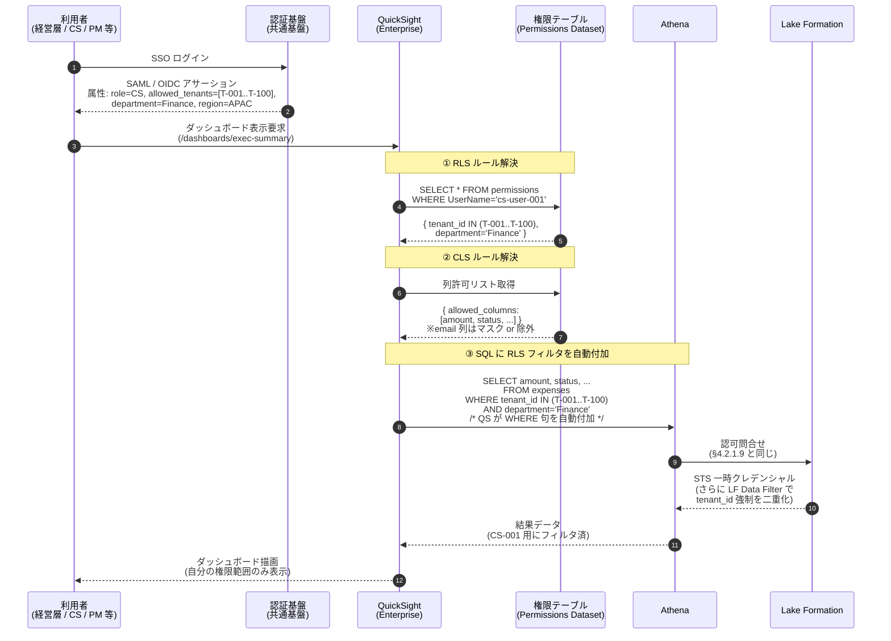
```mermaid
sequenceDiagram
    autonumber
    participant User as 利用者<br/>(経営層 / CS / PM 等)
    participant IdP as 認証基盤<br/>(共通基盤)
    participant QS as QuickSight<br/>(Enterprise)
    participant Rules as 権限テーブル<br/>(Permissions Dataset)
    participant Athena as Athena
    participant LF as Lake Formation

    User->>IdP: SSO ログイン
    IdP-->>User: SAML / OIDC アサーション<br/>属性: role=CS, allowed_tenants=[T-001..T-100],<br/>department=Finance, region=APAC

    User->>QS: ダッシュボード表示要求<br/>(/dashboards/exec-summary)

    Note over QS, Rules: ① RLS ルール解決
    QS->>Rules: SELECT * FROM permissions<br/>WHERE UserName='cs-user-001'
    Rules-->>QS: { tenant_id IN (T-001..T-100),<br/>  department='Finance' }

    Note over QS, Rules: ② CLS ルール解決
    QS->>Rules: 列許可リスト取得
    Rules-->>QS: { allowed_columns:<br/>  [amount, status, ...] }<br/>※email 列はマスク or 除外

    Note over QS, Athena: ③ SQL に RLS フィルタを自動付加
    QS->>Athena: SELECT amount, status, ...<br/>FROM expenses<br/>WHERE tenant_id IN (T-001..T-100)<br/>  AND department='Finance'<br/>  /* QS が WHERE 句を自動付加 */

    Athena->>LF: 認可問合せ<br/>(§4.2.1.9 と同じ)
    LF-->>Athena: STS 一時クレデンシャル<br/>(さらに LF Data Filter で<br/> tenant_id 強制を二重化)

    Athena-->>QS: 結果データ<br/>(CS-001 用にフィルタ済)
    QS-->>User: ダッシュボード描画<br/>(自分の権限範囲のみ表示)
```

| ステップ | 何が起きるか |
|---|---|
| ①②（事前設定）| 認証基盤から渡される属性（`role`, `allowed_tenants`, `department`, `region` 等）と、QuickSight 上の **Permissions Dataset**（権限テーブル）の組み合わせで RLS / CLS ルールを解決 |
| ③ | QuickSight が Athena への SQL に **`WHERE` 句を自動付加**（利用者には見えない透過処理）|
| ④⑤ | Athena が Lake Formation に認可問合せ。**LF Data Filter（§4.2.1.9）でテナント分離を二重化** |
| ⑥⑦ | 結果がフィルタされた状態で返り、ダッシュボードに描画 |

→ **同じ URL の同じダッシュボード**を経営層・CS・PM が開いても、**それぞれ見える行・列が異なる**。

###### C. 属性ベース権限制御の 4 つの実装方式

QuickSight には属性制御の方式が複数ある。本 PoC では **方式 3（Tag-based RLS）+ 方式 1（Permissions Dataset）の併用**を推奨。

| # | 方式 | 概要 | メリット | デメリット | 本 PoC での採否 |
|---|---|---|---|---|---|
| 1 | **Permissions Dataset (User/Group)** | QuickSight 内に権限テーブルを作り、`UserName` / `GroupName` 列でフィルタ列を定義 | 設定が単純、UI で確認可能 | ユーザー追加時に権限テーブル更新が必要 | ⭕ **採用**（固定権限の表現）|
| 2 | **Permissions Dataset + Federated Identity** | SAML/OIDC のグループ属性を `GroupName` にマッピング | グループ管理を IdP に集約 | グループ階層の表現が制限的 | ⭕ **採用**（IdP 連携時の主軸）|
| 3 | **Tag-based RLS (Session Tags)** | SAML/OIDC のセッションタグ（`PrincipalTag/allowed_tenant_id` 等）でフィルタ | 動的属性、テナント変更に即応 | 設定が複雑、Session Tag の発行設定要 | ⭕ **採用**（マルチテナント分離の主軸）|
| 4 | **動的デフォルト（Dynamic Defaults）** | ダッシュボードのパラメータ初期値を利用者属性で動的設定 | 「自分の部署」がデフォルト表示等 | 権限制御ではなく UX 補助 | ⭕ **採用**（UX 補助）|

→ **3 が主軸、1/2 が補助、4 が UX 改善**という階層構成。

###### D. 本 PoC での想定 RLS / CLS 設計

**ロール × 制御対象** マトリクス（経費精算 SaaS の例）:

| ロール | 表示テナント範囲 | 表示部門範囲 | 列制限 | 主な制御方式 |
|---|---|---|---|---|
| **経営層**（CXO 等）| **全テナント**（SaaS 全体 KPI）| 全部門 | 個人特定列（email, 個人名）は除外 | RLS なし + CLS で個人列除外 |
| **CS チーム**（CSM）| **担当顧客のみ**（例: T-001..T-100）| 全部門 | 個人列は除外 | RLS（担当顧客）+ CLS（個人列除外）|
| **PM**（プロダクト）| **全テナント**（集計のみ）| 全部門 | 詳細列除外、集計値のみ | RLS（集計レコードのみ）+ CLS（個人列除外）|
| **マーケ**| **全テナント**（集計のみ）| 全部門 | 営業関連列のみ | RLS（解約率・利用度のみ）+ CLS（営業指標のみ）|
| **エンジニアリング**| **全テナント**（性能指標のみ）| 全部門 | 業務データなし、運用メトリクスのみ | 別ダッシュボード（業務 KPI とは性質が異なる）|
| **業務利用者**（顧客企業の担当者、Phase 2+）| **自社テナントのみ** | 自部門のみ | 個人列マスク | RLS（自社・自部門）+ CLS（マスク）|
| **監査担当者**| **全テナント** | 全部門 | **全列**（PII 含む、職務として可）| RLS なし + CLS なし（特権ロール）|

→ **同じダッシュボードのファイル / URL に対して、属性ベースで動的に表示内容が変わる**設計。

###### E. Tag-based RLS の設計詳細（マルチテナント主軸）

**認証基盤から QuickSight へ渡す Session Tags**:

```json
// SAML アサーション / OIDC トークンに含める attributes 例
{
  "https://aws.amazon.com/SAML/Attributes/Role": "arn:aws:iam::CENTRAL:role/DataReaderRole",
  "https://aws.amazon.com/SAML/Attributes/PrincipalTag:allowed_tenant_ids": "T-001,T-002,T-003",
  "https://aws.amazon.com/SAML/Attributes/PrincipalTag:user_role": "CS",
  "https://aws.amazon.com/SAML/Attributes/PrincipalTag:department": "CustomerSuccess",
  "https://aws.amazon.com/SAML/Attributes/PrincipalTag:region": "APAC",
  "https://aws.amazon.com/SAML/Attributes/PrincipalTag:can_see_pii": "false"
}
```

**QuickSight 側の RLS Permissions Dataset 定義**（Tag-based の例）:

```sql
-- QuickSight 内に作成する "rls_permissions" データセット
-- アクティブな利用者ごとに 1 行、PrincipalTag を CSV で持つ

SELECT
  UserName,                              -- QuickSight 上のユーザー名
  GroupName,                             -- QuickSight Group (CS-Team, Exec, ...)
  tenant_id_filter,                      -- 例: "T-001,T-002,T-003"
  department_filter,                     -- 例: "CustomerSuccess"
  can_see_pii                            -- 例: "false"
FROM permissions_master
WHERE active = true;
```

**QuickSight のフィルタルール** (RLS UI で設定):
- `tenant_id` 列 ← Permissions Dataset の `tenant_id_filter` （CSV split）
- `department` 列 ← Permissions Dataset の `department_filter`

→ QuickSight が裏で SQL に `WHERE tenant_id IN ('T-001','T-002','T-003') AND department = 'CustomerSuccess'` を自動付加。

###### F. CLS（列レベル）の設計詳細

**列制限の典型パターン**:

```yaml
# CLS ルール例（QuickSight Dataset 設定）
column_level_security:
  - column: email
    visible_to:
      - group: Auditors
      - group: BIAuthors
    # 他の役割は列自体が見えない（NULL ではなくスキーマから消える）

  - column: full_name
    visible_to:
      - group: Auditors
    masked_for:
      - group: CS-Team   # CS には "山田 ***" のように姓のみ
      - group: PM        # PM には "**** ****" 全マスク

  - column: amount
    visible_to: ALL
    # 金額は全員見せる（ただし RLS でテナント絞り込み）
```

→ 「列自体が消える」のと「マスクして返す」の 2 種類が選択可能。

###### G. Lake Formation との関係（多層防御の役割分担）

**重要な疑問**: 「Lake Formation でも行・列・セル制御できるのに、なぜ QuickSight RLS / CLS も使うのか?」

→ **両者は補完関係。多層防御として両方使う**。

| 防御層 | 範囲 | 強み | 弱み |
|---|---|---|---|
| **Lake Formation Data Filter** | **Athena 直クエリ / SageMaker / EMR 含む全アクセス経路** | プラットフォーム全体に効く、SQL 意味理解 | 認可エラー時のエラーが曖昧、変更反映に最大 15 分 |
| **QuickSight RLS / CLS** | **QuickSight ダッシュボード閲覧のみ** | UX に密着（マスク表示、列の出し分け）、ダッシュボード設計者が見える形で管理可能 | QuickSight でしか効かない、直クエリは無防備 |

**役割分担の原則**:

| 制御対象 | 第一選択 | 補強 |
|---|---|---|
| **テナント分離**（行）| **Lake Formation Data Filter**（Athena 直も含めて強制）| QuickSight RLS（重複定義で二重化）|
| **PII マスキング**（セル）| **Lake Formation Data Cell Filter** | QuickSight CLS（マスクの UX 微調整）|
| **ダッシュボード閲覧範囲**（行）| **QuickSight RLS**（Permissions Dataset で柔軟）| Lake Formation（必要に応じて）|
| **個人列の見せ方**（列 / マスク）| **QuickSight CLS**（マスクパターン豊富）| Lake Formation 補強 |
| **ad-hoc Athena 直クエリの制限** | **Lake Formation のみ** | QS には効かない |

→ **基本ルール: 「漏れたら困る」は LF で強制、「UX のため」は QuickSight で表現**。

###### H. 単一ダッシュボードの設計指針

| # | 指針 | 内容 |
|---|---|---|
| 1 | **業務領域で切る、業務テーマはシートで分割** | 「業務領域 = Dashboard」「業務テーマ = Sheet (タブ)」の二段構成。役割では切らない。**詳細は [§4.2.1.12](#42112-業務テーマで分ける必要はあるかダッシュボード粒度の判断軸) 参照** |
| 2 | **同じ業務領域は 1 つに統合** | 「経営層用 CS サマリ」と「CS チーム用 CS サマリ」は同じダッシュボード、RLS で出し分け |
| 3 | **ビジュアル単位で属性切り替え** | ダッシュボード内のグラフは共通だが、テーブルの行数が属性で変わる、列の出し分けが属性で変わる |
| 4 | **動的デフォルトで UX 改善** | パラメータの初期値を利用者属性に応じて変える（例: CS なら「担当顧客」が最初から選択済）|
| 5 | **権限漏れの予防** | 「権限なしだとビジュアルが空白で表示」「権限なし列が見えない」が標準動作。アラート表示は不要 |
| 6 | **権限テスト必須** | 全ロール × 全ダッシュボードの組合せで「想定通りの表示か」を Phase 1 で自動テスト整備 |

###### I. 経費精算 SaaS の具体例: 「経営サマリ」ダッシュボード

**1 つのダッシュボード**:「全社向け経営サマリ」

| ビジュアル | 経営層が見るもの | CS が見るもの | 監査が見るもの |
|---|---|---|---|
| **総売上（テナント別）** | 全テナントの合計 + テナント別ランキング | 担当テナントのみ | 全テナント + 個別取引明細 |
| **解約予兆スコア** | 全テナントの分布 | 担当テナントのみ詳細 | 全テナント |
| **新規ユーザー数** | 全テナント合計 | 担当テナントのみ | 全テナント |
| **個人情報リスト** | （列自体が表示されない）| （列自体が表示されない）| **全列表示（職務）**|
| **異常検知アラート** | 集計のみ | 担当テナントのアラート詳細 | 全テナントの全アラート |

→ **URL は 1 つ、表示は属性で動的に変わる**。閲覧者が「これは自分用だ」と意識する必要はなく、ログイン時の属性で自動的に最適化される。

###### J. 残課題（ヒアリングで確認）

| # | 質問 | 影響 |
|---|---|---|
| 1 | 認証基盤から QuickSight への属性受渡しは SAML / OIDC のどちらか | Session Tag 設計の詳細 |
| 2 | 顧客企業の業務利用者（Phase 2+）の自社ダッシュボード提供方式 | QuickSight Embedded vs Anonymous Embedded |
| 3 | 監査担当者の特権モード（PII 含む全列表示）を組織として許容できるか | CLS 設計の前提 |
| 4 | 権限変更の反映 SLA（退職・異動時の即時反映必要性）| Permissions Dataset 更新頻度 |
| 5 | ダッシュボード閲覧履歴の監査要件 | CloudTrail Data Events + QuickSight Activity 設定 |

##### 4.2.1.12 業務テーマで分ける必要はあるか（ダッシュボード粒度の判断軸）

> **質問への回答**: **必ずしも分ける必要はない**。§4.2.1.11 で「業務テーマで切る」と書いたのは過度に単純化しており、正確には **QuickSight の 3 階層（Analysis / Dashboard / Sheet）を理解して使い分ける**のが正解。テーマ間の関係性によって 4 パターンに分岐する。

###### A. QuickSight の階層構造（前提知識）

| 階層 | 内容 | 1 つあたりの量 |
|---|---|---|
| **Analysis** | ダッシュボード作成中の編集環境 | Author 用、Reader には公開されない |
| **Dashboard** | 公開される閲覧用ビュー（URL 1 つ）| Reader が閲覧する単位 |
| **Sheet (タブ)** | Dashboard 内のタブ。**1 ダッシュボードに 20+ シート可能** | 章ごとに切り替え可能 |
| **Visual (ビジュアル)** | 個別のグラフ・テーブル・KPI カード | 1 シート内に複数配置 |

→ **「1 ダッシュボード = 1 業務テーマ」ではない**。1 ダッシュボード内に複数のシート（タブ）を配置できるので、「経営サマリ ダッシュボードの中に「売上」「解約」「新規」シート」のような構造が標準。

###### B. 「分ける / まとめる」の判断軸 6 つ

| # | 判断軸 | 分ける理由 | まとめる理由 |
|---|---|---|---|
| 1 | **データソース / 鮮度** | 日次バッチと秒オーダーリアルタイムは混在しにくい | 同じ Athena / 同じ refresh なら同居可 |
| 2 | **SPICE 容量** | 1 Dataset の SPICE 上限（500 GB / Enterprise）超過 | 容量内なら同居可 |
| 3 | **読込パフォーマンス** | 重いビジュアルが多いと初期表示が遅い | 軽いなら同居可 |
| 4 | **閲覧者の意図/動線** | 「経営判断」と「日次オペ」は思考モードが違う | 同じ思考フローなら同居 |
| 5 | **更新サイクル** | テーマごとに改修頻度が違うと相互影響 | 同じチームが同じ頻度で改修なら同居 |
| 6 | **公開範囲（Sharing）の差** | 一部だけ社外公開・Embedded したい等 | 全員に同じスコープで公開なら同居 |

→ **6 軸を見て、「分けないと困る」が 1 つでもあれば分ける**。なければ同居（シート分離）が原則。

###### C. 4 つの設計パターン

| パターン | 構造 | 適する状況 | 例 |
|---|---|---|---|
| **P1: 巨大単一ダッシュボード** | 1 Dashboard + 多シート（10+ タブ）| テーマが密接、同じ閲覧者層、同じデータソース | 「経営サマリ」内に売上 / 解約 / 新規 / コスト / 利用度の 5 タブ |
| **P2: テーマ別ダッシュボード（少数）** | 3〜5 個の Dashboard、各 2-5 シート | テーマが疎結合、閲覧者層が部分的に重なる | 「経営サマリ」「CS 業務」「PM 利用度分析」の 3 ダッシュ |
| **P3: 業務ごとに細分化** | 10+ 個の小さい Dashboard | テーマが完全独立、閲覧者層も別 | テーマ × 部署で 20 ダッシュ |
| **P4: ハブ + 詳細** | 1 ハブ Dashboard（KPI 概観）+ N 詳細 Dashboard（クリックで遷移）| ドリルダウン重視、トップは経営層 / 詳細は実務 | トップに全社 KPI、各カードクリックで詳細遷移 |

###### D. 各パターンの特性比較

| 観点 | P1 巨大単一 | P2 テーマ別少数 | P3 細分化 | P4 ハブ+詳細 |
|---|:---:|:---:|:---:|:---:|
| 一覧性 | ◎ 全てここ | ⭕ | △ 分散 | ⭕ |
| 初期読込速度 | ❌ 重い | ⭕ | ◎ 軽い | ⭕ |
| 改修コスト | ❌ 巨大化で属人化 | ⭕ | △ 横展開負荷 | ⭕ |
| 権限の表現自由度 | △ RLS で吸収 | ⭕ | ⭕ | ⭕ |
| 新規ユーザー学習コスト | △ 迷子になりやすい | ⭕ | ❌ どこを見るか不明 | ◎ ハブから誘導 |
| SPICE 効率 | △ 巨大 Dataset | ⭕ | ⭕ | ⭕ |
| 監査・棚卸し | ⭕ 1 箇所 | ⭕ | ❌ 漏れやすい | ⭕ |
| **本 PoC 適合性** | △ | ⭕ | ❌ | ⭕⭕ |

→ **本 PoC は P2 または P4 が現実解**。P1 は管理が崩壊しやすく、P3 はダッシュ数が爆発する。

###### E. 本 PoC の推奨: P4「ハブ + 詳細」

**構成**:

```
[ハブ Dashboard] 全社 KPI サマリ (1 個)
   ├── 経営層・部署長が日常的に開く起点
   ├── 主要 KPI カード 8 個（売上 / MRR / ARR / 解約率 / NPS / アクティブテナント / DAU / 開発生産性 等）
   └── 各カードに「詳細を見る」リンク
         ↓
[詳細 Dashboard 群] (4-6 個)
   ├── D1: CS / 解約予兆 詳細 (CSM 向け)
   ├── D2: 売上 / 契約 詳細 (営業向け)
   ├── D3: プロダクト利用度 詳細 (PM 向け)
   ├── D4: マーケ / 獲得 詳細 (マーケ向け)
   ├── D5: 運用品質 詳細 (SRE 向け)
   └── D6: 監査 / 全件 (監査向け)
```

**シート内構造**（各 Dashboard 内）:
- 各 Dashboard は **2-5 シート** で構成
- 例: D1「CS 詳細」= 「全テナント概観」「解約予兆スコア」「アクション履歴」「特定テナント詳細」の 4 シート

**ダッシュボード数の合計**: **1 ハブ + 4-6 詳細 = 5-7 ダッシュボード**（属人化しない、棚卸し可能、新規ユーザーが迷わない範囲）

###### F. RLS / CLS との関係（再確認）

P4 採用時も **役割で分けない**ことに変わりはない:

| 役割 | ハブ | D1 CS | D2 売上 | D3 PM | D4 マーケ | D5 運用 | D6 監査 |
|---|:---:|:---:|:---:|:---:|:---:|:---:|:---:|
| 経営層 | ⭕ 全テナント | ⭕ 全 | ⭕ 全 | ⭕ 全 | ⭕ 全 | ⭕ 全 | ❌ |
| CS | ⭕ 担当のみ | ⭕ 担当のみ | ⭕ 担当のみ | △ 集計のみ | ❌ | ❌ | ❌ |
| 営業 | ⭕ 担当のみ | △ サマリ | ⭕ 担当のみ | ❌ | △ サマリ | ❌ | ❌ |
| PM | ⭕ 全（集計）| △ サマリ | △ サマリ | ⭕ 全 | ⭕ 全 | ❌ | ❌ |
| マーケ | ⭕ 全（集計）| △ サマリ | △ サマリ | △ サマリ | ⭕ 全 | ❌ | ❌ |
| SRE | ⭕ 運用のみ | ❌ | ❌ | △ 性能のみ | ❌ | ⭕ 全 | ❌ |
| 監査 | ⭕ 全（PII 含む）| ⭕ | ⭕ | ⭕ | ⭕ | ⭕ | ⭕ |

→ **どのダッシュも RLS / CLS で属性に応じて表示が動的に変わる**。ダッシュは「業務領域」で分け、表示内容は「役割」で動的に変える、という二段構成。

###### G. 「業務テーマで分ける」の正確な定義

§4.2.1.11.H で書いた「ダッシュボード = 業務テーマ 1 つ」は不正確だった。正確には:

- **× 「業務テーマ 1 つ = ダッシュボード 1 つ」**（細分化しすぎ、P3 的）
- **○ 「業務領域 1 つ = ダッシュボード 1 つ、領域内のテーマはシートで分割」**（P2 / P4 的）

| 用語 | 意味 | 単位の目安 |
|---|---|---|
| **業務領域** | 大きな業務カテゴリ（CS / 営業 / プロダクト / マーケ / 運用 / 監査）| ダッシュボード単位（6 個前後）|
| **業務テーマ** | 領域内の具体テーマ（解約予兆 / NPS / 利用度 / 健全性）| **シート単位**（各 Dashboard 内 2-5 タブ）|

→ **「業務領域で Dashboard を切り、業務テーマは Sheet で切る」**が本 PoC の指針。

###### H. ダッシュボード設計のチェックリスト

新規ダッシュボード作成時に確認する:

| # | チェック | 判断 |
|---|---|---|
| 1 | この内容、既存ダッシュ内のシート追加で済まないか | YES → 既存に追加 |
| 2 | データソースは既存と同じ Athena / 同じ refresh か | YES → 同居可 |
| 3 | 主たる閲覧者層は既存ダッシュと重なるか | YES → 同居可 |
| 4 | SPICE 容量を圧迫しないか | NO → 同居可 |
| 5 | 改修頻度は既存ダッシュと同程度か | YES → 同居可 |
| 6 | 公開範囲（Sharing 設定）は既存と同じか | YES → 同居可 |

→ 5 つ以上 YES なら **新規 Dashboard を作らずシート追加で済ます**。

###### I. 残課題（ヒアリングで確認）

| # | 質問 | 影響 |
|---|---|---|
| 1 | 既存の BI / ダッシュボードの数とテーマ | 移行時のダッシュ統合の見極め |
| 2 | 経営層は「KPI 1 画面で全部見たい」か「業務領域ごとに見たい」か | P1 / P4 の選択 |
| 3 | ドリルダウン操作（クリックで詳細遷移）の慣れ度合い | P4 採用の前提となる UX |
| 4 | 新規ユーザーオンボーディング時間の目安 | ダッシュ数の上限判断 |
| 5 | ダッシュボード棚卸し（使われていないものの整理）の周期 | 細分化リスクの許容度 |

##### 4.2.1.13 SPICE の仕組みと保守（中央 BI チーム責務）

> **質問への回答**: **SPICE は中央 BI チーム（役割 4 / DataAnalystRole）の主担当**。Capacity 購入のみカタログ管理者（役割 3 / DataLakeAdminRole）が一緒に管理。具体的には **8 つの定常保守作業**がある（Refresh 設計 / 失敗監視 / サイズ最適化 / コスト管理 / スキーマ追随 等）。

###### A. SPICE とは何か

**SPICE = Super-fast, Parallel, In-memory Calculation Engine**

QuickSight の **インメモリ計算エンジン**。データセットを QuickSight のインメモリ領域にコピーしておき、ダッシュボード閲覧時に Athena を経由せず直接配信する。

| 観点 | SPICE 使わない（Direct Query）| **SPICE 使う** |
|---|---|---|
| 閲覧時のデータ取得経路 | QuickSight → Athena → S3 | **QuickSight メモリから直接配信** |
| 応答時間 | 数秒〜十数秒 | **0.1〜1 秒** |
| Athena スキャン量 | 閲覧ごとに発生（コスト高）| **更新時のみ発生** |
| 同時アクセス | Athena 同時実行数が上限 | **数百同時 OK**（QuickSight 内処理）|
| データ鮮度 | リアルタイム | Refresh 間隔依存 |
| コスト | Athena スキャン量 × 閲覧数 | **SPICE Capacity 月額固定** + 更新時の Athena スキャン |

→ **ピーク負荷のあるダッシュボードは SPICE 必須**。直クエリだと Athena の同時実行・コスト・応答時間が破綻する。

###### B. SPICE のサイズと料金体系

| 項目 | 内容 |
|---|---|
| **単位** | GB（Account レベルの Capacity プール）|
| **単価** | **$0.38/GB/月**（Enterprise Edition、US リージョン基準、Tokyo は若干高い）|
| **最小購入単位** | 1 GB から、いつでも追加・削減可能 |
| **Dataset あたり上限** | **1 TB**（Enterprise）|
| **Refresh 上限** | スケジュール **32 回 / 日 / Dataset** |
| **Refresh 時間上限** | **4 時間 / Refresh** |
| **データ圧縮率** | Athena から取り込む時に SPICE 独自圧縮で**約 30-50% に縮小** |

→ 10 GB の Dataset を SPICE に入れる → 月 $3.80。100 GB → 月 $38。

###### C. SPICE の Refresh 方式（更新方法）

| 方式 | 概要 | 使いどころ |
|---|---|---|
| **Full Refresh** | Dataset 全体を再構築 | 小規模（< 1 GB）or 履歴も含めて変動するデータ |
| **Incremental Refresh** | 直近 N 日分のみを差分更新 | 時系列データ、過去は変わらない場合（**推奨**）|
| **スケジュール Refresh** | Cron 設定で定期実行 | 日次バッチ / 時間次 / 5 分単位等 |
| **手動 Refresh** | 利用者・Author が UI から手動実行 | デバッグ / 緊急時 |
| **API Refresh** | `CreateIngestion` API で外部から起動 | **ETL 完了後に自動起動（推奨）** |

**API Refresh の典型構成**:

```
Glue ETL Job (raw → curated → analytics) 完了
       ↓ EventBridge / Step Functions
       ↓
QuickSight.CreateIngestion API
       ↓
SPICE Refresh 実行
       ↓
QuickSight ダッシュボード自動更新
```

→ **ETL とダッシュボード鮮度を連動**できる。SaaS 解約予兆検知のようにバッチ後すぐ見たいケースに必須。

###### D. SPICE 保守の 8 項目（具体的に何をやるのか）

| # | 保守項目 | 内容 | 頻度 |
|---|---|---|---|
| 1 | **Capacity プランニング** | SPICE の Account 全体使用量を監視、上限近接時に追加購入 | 月次 |
| 2 | **Refresh スケジュール設計** | Dataset ごとに Full / Incremental + 実行時間帯を設計 | Dataset 作成時 + 改修時 |
| 3 | **Refresh 失敗監視** | CloudWatch Alarm で Refresh 失敗を検知、原因調査・再実行 | 即時対応 |
| 4 | **Dataset サイズ最適化** | 不要列削除 / フィルタで行削減 / データ型最適化 / Parquet 圧縮活用 | 四半期 |
| 5 | **クエリパフォーマンス監視** | ダッシュボード描画時間を監視、遅いビジュアルの最適化 | 月次 |
| 6 | **コスト最適化** | 使われていない Dataset を SPICE から削除、Reader Capacity Pricing 検討 | 四半期 |
| 7 | **スキーマ進化対応** | Producer 側のテーブルに列追加・型変更があった場合、SPICE Dataset を更新 | スキーマ変更時 |
| 8 | **Dataset 権限維持** | 新規 Author / Reader の Dataset アクセス権限管理 | ユーザー追加時 |

###### E. 詳細: 各保守項目の中身

####### E-1. Capacity プランニング（月次）

```
作業内容:
  1. AWS Console > QuickSight > Manage QuickSight > SPICE Capacity で
     現在の使用率を確認
  2. 月次のトレンド（先月比 / 3 ヶ月平均）を把握
  3. 80% 超過したら追加購入（次月に向けて）
  4. 60% 未満で安定していたら削減検討
担当: 中央 BI チーム（役割 4） + 月次レビューで役割 3（コスト承認）
ツール: AWS Console / API（GetSPICECapacityUsage）
SLA: 月初に必ず実施
```

####### E-2. Refresh スケジュール設計

```
作業内容:
  1. Dataset の更新パターンを分類
     - 日次更新: 多数（経費精算データ等）→ 深夜 2-4 時に Full or Incremental
     - 時間次更新: 解約予兆スコア等 → 毎時 5 分
     - リアルタイム性不要: マスタデータ → 週次 Full
  2. Refresh 時間帯の分散（同時 32 回 / Account 上限）
  3. Refresh 完了 → ダッシュボード SLA に合わせた設計
  4. ETL 完了起動の場合は EventBridge / Step Functions 設計
担当: 中央 BI チーム（役割 4）が設計、Producer (役割 2) と協議
ツール: QuickSight UI / API / Step Functions
SLA: Dataset 作成時 + 大幅な業務要件変更時
```

####### E-3. Refresh 失敗監視（即時対応）

```
作業内容:
  1. CloudWatch Alarms: QuickSight メトリクス（IngestionFailed）でアラート
  2. 失敗時の通知: SNS → Slack/Teams へ
  3. 失敗原因の典型:
     - Athena クエリエラー（スキーマ変更等）
     - SPICE 容量不足
     - Glue Catalog でテーブル削除
     - データソース接続エラー
     - 4 時間タイムアウト（Dataset 巨大化）
  4. 復旧手順: 原因特定 → 修正 → 手動 Refresh
担当: 中央 BI チーム（役割 4）= オンコール ローテーション
ツール: CloudWatch / QuickSight API / Runbook
SLA: ダッシュボード SLA に応じる（通常: 翌営業日朝までに復旧）
```

####### E-4. Dataset サイズ最適化（四半期）

```
作業内容:
  1. 全 Dataset のサイズ・行数・列数をリスト化
  2. 大きい Dataset から順に:
     - ダッシュボードで使われていない列 → 削除
     - 過去データ → 期間フィルタで縮小 (例: 過去 13 ヶ月のみ)
     - 文字列 → カテゴリ ID に変換
     - フィルタ条件をデータセット段階に押し込み
     - Incremental Refresh への切替検討
  3. ビフォーアフター測定
担当: 中央 BI チーム（役割 4）
ツール: QuickSight API（DescribeDataSet）+ 集計スクリプト
SLA: 四半期 1 回、容量逼迫時は緊急
削減効果の目安: 1 Dataset あたり 30-70% 縮小実績
```

####### E-5. クエリパフォーマンス監視（月次）

```
作業内容:
  1. ダッシュボード閲覧時の描画時間を CloudWatch で取得
     - 目標: 第 1 ビジュアル 1 秒以内、全体 3 秒以内
  2. 遅いビジュアル特定 → ETL / 集計テーブル化 / SPICE 化検討
  3. 同時接続ピーク時の挙動確認
担当: 中央 BI チーム（役割 4）
ツール: QuickSight UI のパフォーマンスタブ + CloudWatch
SLA: 月次
```

####### E-6. コスト最適化（四半期）

```
作業内容:
  1. 過去 90 日アクセスのない Dataset を SPICE から削除（Direct Query に戻す）
  2. Reader Capacity Pricing 検討
     - Named Reader (月 $5/人) vs Capacity Pricing ($250/月 で多数閲覧)
     - 月間アクティブ Reader 50 人超なら Capacity Pricing 有利
  3. SPICE 全体の使用率分析
担当: 中央 BI チーム（役割 4） + 役割 3（コスト承認）
ツール: CloudWatch + Cost Explorer
SLA: 四半期
```

####### E-7. スキーマ進化対応（イベント駆動）

```
作業内容:
  1. Producer 側で業務 DB のスキーマ変更（列追加 / 型変更 / 名前変更）
  2. Producer の Glue ETL も更新（curated / analytics のスキーマ変更）
  3. Glue Crawler でスキーマ自動検出
  4. 中央 Glue Data Catalog にも反映（Federation 経由）
  5. QuickSight Dataset を再作成 or 更新
     - 列追加: Dataset 側で「フィールド追加」→ 既存ダッシュに影響なし
     - 列削除: Dataset 側で利用箇所修正必要 → ダッシュ修正
     - 列名変更: Dataset 計算フィールドで吸収 or 全面改修
担当: Producer (役割 2) → 中央 BI チーム (役割 4)
ツール: Slack / Confluence で変更通知 + Schema Registry
SLA: スキーマ変更 1 営業日前に通知、Dataset 修正は即時
```

####### E-8. Dataset 権限維持（イベント駆動）

```
作業内容:
  1. 新規 Author / Reader 追加時の Dataset アクセス権限付与
  2. グループ単位の権限管理（個別ユーザーには直接付与しない）
  3. 退職・異動時の権限剥奪
  4. RLS Permissions Dataset の更新
担当: 中央 BI チーム（役割 4）
ツール: QuickSight UI / IAM Identity Center
SLA: 入退社サイクルに従う（即時〜1 営業日）
```

###### F. 役割分担（誰がやるのか）

| 保守項目 | 中央 BI チーム<br/>(役割 4)<br/>DataAnalystRole | カタログ管理者<br/>(役割 3)<br/>DataLakeAdminRole | Producer<br/>(役割 2)<br/>DataStewardRole |
|---|:---:|:---:|:---:|
| 1. Capacity プランニング | ⭕ 実施 | ⭕ 承認（コスト面）| — |
| 2. Refresh スケジュール設計 | ⭕ 実施 | — | △ 協議 |
| 3. Refresh 失敗監視 | ⭕ 主担当 | — | △ Athena 側起因なら協力 |
| 4. Dataset サイズ最適化 | ⭕ 主担当 | — | △ Producer 側集計表化を相談 |
| 5. クエリパフォーマンス監視 | ⭕ 主担当 | — | — |
| 6. コスト最適化 | ⭕ 実施 | ⭕ 承認 | — |
| 7. スキーマ進化対応 | ⭕ 中央側修正 | — | ⭕ **Producer 側起因の修正** |
| 8. Dataset 権限維持 | ⭕ 主担当 | △ ロール構造の変更時 | — |

→ **役割 4（中央 BI チーム）が主担当**。役割 3 はコスト承認とロール構造変更のみ、Producer (役割 2) はスキーマ変更通知が主。

###### G. 本 PoC での SPICE 構成（Phase 1）

| Dataset | サイズ目安 | Refresh 方式 | スケジュール | 担当 Dataset Owner |
|---|---|---|---|---|
| **ハブ KPI Dataset** | 1 GB | Incremental | 毎時 0 分 | 中央 BI Lead |
| **CS / 解約予兆 Dataset** | 10 GB | Incremental | 毎時 15 分（ETL 完了後）| 中央 BI Lead |
| **売上 / 契約 Dataset** | 5 GB | Full | 日次 03:00 | 中央 BI Lead |
| **プロダクト利用度 Dataset** | 50 GB | Incremental | 毎時 30 分 | 中央 BI Lead |
| **マーケ / 獲得 Dataset** | 5 GB | Full | 日次 04:00 | 中央 BI Lead |
| **運用品質 Dataset** | 20 GB | Incremental | 5 分（SRE 用）| SRE 連携、中央 BI Lead 兼任 |
| **監査 / 全件 Dataset** | （SPICE 不使用、Direct Query）| — | — | 監査担当者 |
| **共通参照データ Dataset** | 1 GB | Full | 日次 02:00 | 中央 BI Lead |
| **Permissions Dataset (RLS 制御)** | 0.1 GB | Full | 5 分（権限即時反映）| 中央 BI Lead |
| **合計** | **約 92 GB** | | | |

**SPICE Capacity**: **100 GB 購入**（92 GB 使用 + 8 GB 予備）= **$38 / 月**

###### H. 監査用 Dataset を SPICE に入れない理由

監査担当者は「**全テナント・全列（PII 含む）**」を見るため、SPICE に置くと:
- SPICE に PII 含む大量データが恒久キャッシュされる → 漏洩リスク
- 大容量化（数百 GB）でコスト爆発
- 監査は調査時のみ閲覧、応答時間 SLA 不要

→ 監査ダッシュボードは **Direct Query**（SPICE 不使用、Athena 直クエリ）が適切。

###### I. SPICE 関連のコスト見積もり

| 項目 | 単価 | 月次 |
|---|---|---|
| **SPICE Capacity 100 GB** | $0.38/GB | $38 |
| **SPICE Refresh の Athena スキャン** | $5/TB | 92 GB × 24 回 × 30 日 ≈ 65 TB → $325 |
| **Incremental 化による削減** | -80% | -$260 |
| **実効 Athena スキャン** | | $65 |
| **CloudWatch メトリクス** | $0.30/メトリクス | ~$5 |
| **合計** | | **約 $108 / 月** |

→ Direct Query で運用した場合の試算（閲覧数 × Athena スキャン）と比べて **70-90% 削減**できる。ピーク時の応答時間も担保される。

###### J. SPICE と Lake Formation の関係（重要）

**SPICE は Lake Formation の認可を「Refresh 時点」で評価する**:

```
SPICE Refresh 時:
  - QuickSight が Athena に SELECT 発行
  - Athena が Lake Formation に認可問合せ
  - LF Data Filter（テナント分離・PII マスク）が適用された結果が SPICE に入る
  - つまり SPICE 上のデータは「既にフィルタ済」

ダッシュボード閲覧時:
  - QuickSight が SPICE から配信
  - LF 認可は再評価されない（既にフィルタ済データなので）
  - 代わりに QuickSight RLS / CLS（§4.2.1.11）が利用者属性で再フィルタ
```

**重要な含意**:

| 制御層 | SPICE Refresh 時 | SPICE 閲覧時 |
|---|---|---|
| **Lake Formation** | ⭕ 適用される | ❌ 再評価されない |
| **QuickSight RLS / CLS** | — | ⭕ 適用される |

→ **SPICE を使う Dataset では、LF と QS RLS の二重防御がより重要**。

特に「**Dataset Owner の権限で Refresh される**」点に注意:
- Dataset Owner = 中央 BI Lead が「全テナント・全列」を見られる Role なら、SPICE には**全データ**が入る
- QS RLS が機能しないと**閲覧者に全データが見える**ことになる
- → Dataset Owner は **「Refresh 用 Service Role」を使い、QS RLS が常に効く設計**にする

###### K. 残課題（ヒアリングで確認）

| # | 質問 | 影響 |
|---|---|---|
| 1 | 各ダッシュボードの鮮度 SLA（リアルタイム / 時間次 / 日次） | Refresh スケジュール設計 |
| 2 | Refresh 失敗時の通知ルート（Slack / Teams / メール） | 監視構成 |
| 3 | SPICE Dataset Owner を Service Role 化するか個人 Account か | セキュリティ / 監査要件 |
| 4 | Phase 2 の SPICE 容量見積もり（テナント数増加 + ML 特徴量）| Capacity プランニング前提 |
| 5 | 監査担当のダッシュボードは Direct Query で応答時間が許容できるか | SPICE 採否 |

##### 4.2.1.14 「athena-results」バケットの中身とワークグループ別分離

> **質問への回答**:
> - 「athena-results」に入るのは **クエリ実行結果（CSV）+ メタデータ + Result Reuse Cache** であり、**「派生データ」という表現は不正確**。CTAS 出力等の派生データは別バケットに置くべき
> - **ワークグループごとにバケット（最低でもプレフィックス）を分離する**のが標準。理由は権限・暗号化・ライフサイクル・コスト按分の 4 軸
> - §4.2.1.1 図の「派生データ」表記は誤解を招くため、本節で正確な分類を整理し、図を修正

###### A. 「athena-results」に実際に入るもの

Athena は **クエリ実行のたびに S3 に結果を書き出す**。これは設定省略不可（クエリ結果ロケーション必須）。

| 入るもの | 種類 | 用途 | ファイル例 |
|---|---|---|---|
| **SELECT クエリ結果** | CSV (UTF-8) | 利用者への表示前の中間保存、ダウンロード元 | `<query-id>.csv` |
| **クエリメタデータ** | `.metadata` ファイル | スキーマ情報、再利用キャッシュ用のキー | `<query-id>.csv.metadata` |
| **マニフェストファイル** | `.txt` | CTAS / INSERT 時の出力ファイルリスト | `<query-id>-manifest.csv` |
| **Result Reuse Cache** | キャッシュ entry | 同一クエリの結果再利用（最大 7 日）| `cache/<query-id>/...` |
| **Spark notebook 出力**（Phase 3+ Spark 採用時のみ）| Parquet / Notebook 結果 | Spark セッションの中間出力 | `spark/<session-id>/...` |

→ **「派生データ」ではない**。**ほとんどが一時的な実行結果**。CTAS の生成テーブル本体は別途指定の `external_location` に書かれる（後述 B 節）。

###### B. CTAS / INSERT INTO で生成される「派生データ」は別バケット

ETL / 集計で生成する**長期保存テーブル**は、`athena-results` バケットには置かない:

```sql
-- 例: 月次集計テーブル（派生データ）の作成
CREATE TABLE central_analytics.monthly_summary
WITH (
    format = 'PARQUET',
    parquet_compression = 'SNAPPY',
    partitioned_by = ARRAY['tenant_id', 'year_month'],
    external_location = 's3://central-derived-prd/monthly_summary/'  -- ← 別バケット明示
) AS
SELECT ... FROM app1_curated.expenses;
```

→ **`external_location` に専用バケットを明示**することで、`athena-results` には manifest のみ書かれ、テーブル本体は別バケットに格納される。

###### C. 派生データ・関連 S3 の正しい分類（5 種類）

| # | バケット種別 | 用途 | 例 | ライフサイクル | 担当 |
|---|---|---|---|---|---|
| 1 | **Producer raw / curated / analytics** | 業務データの正本（Medallion）| `app1-raw-prd` / `app1-curated-prd` / `app1-analytics-prd` | 長期（curated 13ヶ月 / analytics 36ヶ月）| Producer (役割 2) |
| 2 | **Central 派生データ** | 横断集計・ML 特徴量・BI 用事前集計テーブル（CTAS 出力）| `central-derived-prd/monthly_summary/` 等 | 中期（12-24 ヶ月）| 中央 BI チーム (役割 4) |
| 3 | **Central athena-results** | クエリ実行結果 + Result Reuse Cache（一時）| `central-athena-results-prd/wg-*` | 短期（7-30 日）| 中央 BI チーム (役割 4) |
| 4 | **共通参照データ** | 顧客マスタ等（D-2 中央同居）| `central-common-domain-prd` | 長期 | 共通参照データ管理者 (役割 5) |
| 5 | **ログ / 監査** | CloudTrail Data Events / LF 監査ログ | 監査アカウント側 | 長期（7 年等）| 監査アカウント |

→ **「派生データ ≠ athena-results」**。本 PoC でも 2 と 3 は明確に別バケット。

###### D. ワークグループごとにバケットを分けるか

**結論: 最低でもプレフィックス分離、機密度が異なるなら別バケット**

| 分離方式 | 概要 | 適する状況 |
|---|---|---|
| **方式 1: 1 バケット + WG 別プレフィックス** | `s3://central-athena-results-prd/wg-bi-dashboard/...` 等 | WG 間で機密度・暗号化要件が同じ |
| **方式 2: WG ごとに別バケット**（推奨）| `s3://central-results-bi-dashboard-prd` 等 | 機密度が異なる、別 KMS 鍵を使う、別ライフサイクル |
| **方式 3: 用途別 + 重要度別の混合** | 高機密 WG のみ別バケット | コストと管理負荷のバランス |

###### E. ワークグループ別分離が必要な 4 つの理由

| # | 理由 | 詳細 | 分離しないとどうなるか |
|---|---|---|---|
| 1 | **暗号化** | WG ごとに異なる KMS CMK を割当て | 監査クエリの結果が一般 KMS 鍵で暗号化される、鍵漏洩時の影響範囲が広い |
| 2 | **ライフサイクル** | 監査結果は 7 年保管、ダッシュ向けは 7 日削除等、保持期間が異なる | 全結果が監査の長期保管に合わせて巨大化、コスト悪化 |
| 3 | **IAM 権限** | 利用者ごとに自分の結果のみ参照可、他人の結果は不可視 | 探索クエリの結果（PII 含む可能性）が同僚に見える |
| 4 | **コスト按分** | バケット単位の Cost Allocation Tag で WG / チーム別コスト把握 | クエリ結果保存コストをチーム別に按分できない |

→ **特に「① 暗号化」「③ 権限」は機密度が異なる WG で必須**。

###### F. 本 PoC でのバケット構成（Phase 1）

中央 BI / Catalog アカウント内に以下のバケットを配置:

```
中央 BI / Catalog アカウント (Option B + D-2)
│
├─ S3: 派生データ（CTAS 出力、長期保存）
│   └─ central-derived-prd
│       ├─ monthly_summary/         ← BI 用事前集計
│       ├─ churn_features/          ← 解約予兆 ML 特徴量
│       └─ cross_tenant_kpi/        ← 横断 KPI
│
├─ S3: Athena クエリ結果（WG 別、短期）
│   ├─ central-results-bi-dashboard-prd      ← QuickSight Service Principal 専用
│   │   └─ Lifecycle: 7 日後削除
│   │
│   ├─ central-results-bi-exploration-prd    ← BI チーム探索用
│   │   └─ Lifecycle: 30 日後 IA、90 日後削除
│   │
│   ├─ central-results-reader-saved-prd      ← 業務利用者の定形クエリ用
│   │   └─ Lifecycle: 7 日後削除
│   │   └─ KMS: 利用者の Role からのみ復号可
│   │
│   ├─ central-results-audit-prd             ← 監査担当用
│   │   └─ Lifecycle: 7 年保管（Object Lock）
│   │   └─ KMS: 監査専用 CMK
│   │   └─ アクセスログ強制
│   │
│   └─ central-results-app-producer-prd      ← Producer cross-account 用（共有プレフィックス）
│       └─ Lifecycle: 30 日後削除
│
├─ S3: 共通参照データ（D-2 同居）
│   └─ central-common-domain-prd
│       ├─ customer_master/         ← 顧客マスタ
│       └─ org_master/              ← 組織マスタ
│
└─ S3: SPICE 取込用一時保管（QuickSight 内部、明示的バケット不要）
```

→ クエリ結果バケットは **WG ごとに 5 個に分離**。派生データ用が別途 1 個、共通参照データが別途 1 個、合計 **7 バケット**。

###### G. ワークグループ設定との対応（具体例）

各 WG の設定で結果保存先・KMS 鍵を指定:

```bash
# 例: wg-bi-exploration の設定
aws athena create-work-group \
  --name wg-bi-exploration \
  --configuration '{
    "ResultConfiguration": {
      "OutputLocation": "s3://central-results-bi-exploration-prd/queries/",
      "EncryptionConfiguration": {
        "EncryptionOption": "SSE_KMS",
        "KmsKey": "arn:aws:kms:ap-northeast-1:CENTRAL:key/exploration-cmk-id"
      }
    },
    "EnforceWorkGroupConfiguration": true,
    "BytesScannedCutoffPerQuery": 107374182400,
    "RequesterPaysEnabled": false,
    "PublishCloudWatchMetricsEnabled": true
  }' \
  --tags 'Key=team,Value=bi' 'Key=purpose,Value=exploration'

# 例: wg-audit の設定（より厳格）
aws athena create-work-group \
  --name wg-audit \
  --configuration '{
    "ResultConfiguration": {
      "OutputLocation": "s3://central-results-audit-prd/queries/",
      "EncryptionConfiguration": {
        "EncryptionOption": "SSE_KMS",
        "KmsKey": "arn:aws:kms:ap-northeast-1:CENTRAL:key/audit-cmk-id"
      }
    },
    "EnforceWorkGroupConfiguration": true,
    "BytesScannedCutoffPerQuery": 107374182400,
    "PublishCloudWatchMetricsEnabled": true
  }' \
  --tags 'Key=team,Value=audit' 'Key=purpose,Value=audit' 'Key=retention,Value=7years'
```

`EnforceWorkGroupConfiguration: true` で利用者側の上書き不可を強制。

###### H. バケットごとのライフサイクル / 暗号化 / 権限設計

| バケット | ライフサイクル | KMS 鍵 | アクセス可能 Role |
|---|---|---|---|
| `central-derived-prd` | 12-24 ヶ月（テーブル別）| 中央共通 CMK | DataAnalystRole（書）/ Producer（読）/ QS Service（読）|
| `central-results-bi-dashboard-prd` | 7 日削除 | QuickSight Service 専用 CMK | QuickSight Service Principal のみ |
| `central-results-bi-exploration-prd` | 30 日 IA → 90 日削除 | 中央 BI 用 CMK | DataAnalystRole（自分の結果のみ）|
| `central-results-reader-saved-prd` | 7 日削除 | Reader 用 CMK | DataReaderRole（自分の結果のみ）|
| `central-results-audit-prd` | **7 年（Object Lock）** | **監査専用 CMK** | DataAuditorRole のみ、改竄防止 |
| `central-results-app-producer-prd` | 30 日削除 | Producer 用共通 CMK | Producer の DataStewardRole |
| `central-common-domain-prd` | 長期 | 中央共通 CMK | CommonReferenceDataManagerRole（書）/ DataAnalystRole（読）|

###### I. 「自分の結果のみ参照可」の IAM 設計

クエリ結果バケットでは、**利用者ごとに自分の結果のみ参照可**を担保する:

```json
// central-results-bi-exploration-prd のバケットポリシー例
{
  "Version": "2012-10-17",
  "Statement": [
    {
      "Sid": "DenyAccessToOthersResults",
      "Effect": "Deny",
      "Principal": "*",
      "Action": "s3:GetObject",
      "Resource": "arn:aws:s3:::central-results-bi-exploration-prd/queries/${aws:username}/*",
      "Condition": {
        "StringNotEquals": {
          "s3:ExistingObjectTag/queryOwner": "${aws:username}"
        }
      }
    }
  ]
}
```

→ Athena が結果に `queryOwner` タグを自動付与する設定と組み合わせる（Athena Workgroup Tagging）。

###### J. 派生データ vs クエリ結果の明確な区別（用語整理）

| 用語 | 意味 | 保管先 | ライフサイクル | 例 |
|---|---|---|---|---|
| **派生データ**（Derived Data）| ETL / CTAS で**意図的に作る**長期保存テーブル | `central-derived-prd` 等 | 12-24 ヶ月 | 月次集計 / ML 特徴量 / 横断 KPI |
| **クエリ結果**（Query Result）| Athena が**実行のたびに自動生成**する一時 CSV | `central-results-*` | 7-90 日 | SELECT 結果 / CTAS の manifest |
| **キャッシュ**（Result Reuse Cache）| Athena が**性能のため自動保存**する直近結果 | `central-results-*/cache/` | 最大 7 日（Athena 管理）| 同一クエリの再実行高速化 |

→ §4.2.1.1 図の「athena-results 派生データ」表記は不正確。**「クエリ結果 + キャッシュ」**が正しい。派生データは別バケットを明示する。

###### K. 残課題（ヒアリングで確認）

| # | 質問 | 影響 |
|---|---|---|
| 1 | クエリ結果の保管期間（業界・コンプラ要件）| バケット別ライフサイクル設計 |
| 2 | 監査クエリの保管要件（7 年必要か）| `central-results-audit-prd` の Object Lock 設定 |
| 3 | 利用者間で「自分の結果のみ」の徹底度合い | IAM / バケットポリシー設計 |
| 4 | クエリ結果からの再エクスポート（ダウンロード）の禁止要件 | DLP 対応 |
| 5 | Result Reuse Cache の利用可否（PII 含むクエリで再利用される懸念）| WG ごとの Cache 設定 |

#### 4.2.2 ETL 的な処理の配置

##### 4.2.2.1 配置の原則: 「データを生む側が ETL する」

Data Mesh の **Domain Ownership** 原則に従う:
- **データの取り込み・整形・自前集計は Producer 側**（各アプリ）
- **横断集計・SaaS 提供側の派生データ生成は Central 側**（中央 BI / Catalog）
- **顧客企業ごとの分析（仮にスコープに含む場合）は Consumer 側**

##### 4.2.2.2 図解: ETL のデータフロー全体像

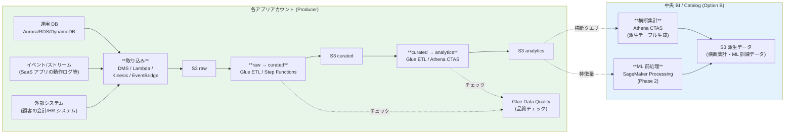
```mermaid
flowchart LR
    subgraph App["各アプリアカウント (Producer)"]
        direction TB
        DB["運用 DB<br/>Aurora/RDS/DynamoDB"]
        Stream["イベント/ストリーム<br/>(SaaS アプリの動作ログ等)"]
        Ext["外部システム<br/>(顧客の会計/HR システム)"]

        Ingest["**取り込み**<br/>DMS / Lambda /<br/>Kinesis / EventBridge"]

        S3R["S3 raw"]
        ETL1["**raw → curated**<br/>Glue ETL / Step Functions"]
        S3C["S3 curated"]
        ETL2["**curated → analytics**<br/>Glue ETL / Athena CTAS"]
        S3A["S3 analytics"]

        Quality["Glue Data Quality<br/>(品質チェック)"]
    end

    subgraph Central["中央 BI / Catalog (Option B)"]
        direction TB
        CTAS["**横断集計**<br/>Athena CTAS<br/>(派生テーブル生成)"]
        SMP["**ML 前処理**<br/>SageMaker Processing<br/>(Phase 2)"]
        S3Derived["S3 派生データ<br/>(横断集計・ML 訓練データ)"]
    end

    DB --> Ingest
    Stream --> Ingest
    Ext --> Ingest
    Ingest --> S3R
    S3R --> ETL1
    ETL1 --> S3C
    S3C --> ETL2
    ETL2 --> S3A
    ETL1 -.チェック.-> Quality
    ETL2 -.チェック.-> Quality

    S3A -.横断クエリ.-> CTAS
    CTAS --> S3Derived
    S3A -.特徴量.-> SMP
    SMP --> S3Derived

    style App fill:#e8f5e9
    style Central fill:#e3f2fd
```

##### 4.2.2.3 ETL の 3 種類と配置詳細

###### A. Producer 側 ETL（各アプリアカウント、主役）

最も多くの ETL がここに集中する。各アプリチームが**自データの所有者として実装責任**を持つ。

| 段階 | 内容 | 主な用途 |
|---|---|---|
| **データ取り込み（Ingestion）** | 運用 DB / 外部システム → S3 raw | リアルタイム性・整合性の確保 |
| **raw → curated** | クレンジング・正規化・PII マスキング・`tenant_id` 強制付与 | データ品質と機密度制御 |
| **curated → analytics** | 集計・パーティション化・Parquet 化・分析用最適化 | 分析クエリのパフォーマンス向上 |

###### B. Central 側 ETL（中央 BI / Catalog アカウント、横断分析用）

顧客企業横断・SaaS 提供側の集計が中心。中央 BI チームが実装責任を持つ。

| 内容 | 主な用途 |
|---|---|
| **横断テナント集計** | 顧客健全性スコア計算、業界別利用パターン分析 |
| **派生データ生成** | BI 用の事前集計テーブル、月次レポート用集計 |
| **ML 前処理** | 解約予兆検知モデルの訓練データ作成（Phase 2）|
| **データ統合** | 複数アプリのデータを Join した派生テーブル |

###### C. 外部連携系 ETL（Producer 側に組み込まれる）

顧客企業のシステムからデータを取り込む特殊な ETL。

| 内容 | 配置 |
|---|---|
| 顧客会計システム連携 | Producer 側（経費精算 SaaS 内）+ AWS Transfer Family / Glue Custom Connector |
| 法人カード明細 | 同上 + 外部 SaaS API 連携 |
| 人事システムからの組織マスタ取り込み | 中央 BI/Catalog アカウント内の共通参照データ層（D-2、[DP-ADR-003](adr/DP-ADR-003-common-domain-account-placement.md)）|

##### 4.2.2.4 ETL ツール選定マトリクス

| 用途 | 推奨ツール | 配置 | 補足 |
|---|---|---|---|
| **バッチ取り込み** | AWS Glue ETL, Step Functions | Producer | スケジュール実行、複数ジョブのオーケストレーション |
| **ストリーム取り込み** | Kinesis Data Firehose, MSK | Producer | リアルタイム性が必要な場合 |
| **CDC 取り込み** | DMS, Aurora Zero-ETL | Producer | 運用 DB → S3 のニアリアルタイム同期 |
| **小規模変換** | AWS Lambda | Producer | イベント駆動・軽量処理 |
| **大規模 Spark 変換** | AWS Glue ETL（Spark mode）, EMR Serverless | Producer | TB 級データの一括変換 |
| **横断集計（テナント横断）** | Athena CTAS（Create Table As Select）| Central | SQL ベースで完結、サーバーレス |
| **ML 前処理** | SageMaker Processing | Central | Phase 2 から、scikit-learn / Spark 等 |
| **データ品質チェック** | AWS Glue Data Quality | Producer 主体 | NULL 率・型違反・重複率の自動検出 |
| **パイプライン管理** | AWS Step Functions, EventBridge Scheduler | Producer | リトライ・分岐・並列実行 |
| **スキーマ自動検出** | AWS Glue Crawler | Producer | 新規データ発生時に Catalog 自動更新 |

##### 4.2.2.5 関連する非 ETL 処理（補足）

ETL とは別だが密接に関連する処理:

| 処理 | 配置 | ツール | 内容 |
|---|---|---|---|
| **データ品質監視**（NULL 率・鮮度・重複率）| Producer | Glue Data Quality | パイプライン実行後にチェック、閾値超えで通知 |
| **データリネージ追跡** | Central + Producer | Glue Lineage（将来）, OpenLineage | データの来歴可視化、SMC 採用時に強化 |
| **メタデータ更新** | Producer | Glue Crawler | スキーマ変更時の Catalog 自動同期 |
| **PII 検出・マスキング** | Producer の raw → curated 段階 | Macie（検出）+ Glue ETL（マスキング）| 個人情報を curated 層に持ち込まないための処理 |

##### 4.2.2.6 重要な設計原則

| # | 原則 | 説明 |
|---|---|---|
| 1 | **ELT を原則とする** | 生データはまず raw 層に着地、加工は下流（curated / analytics）で実施。例外は取り込み時点で PII マスキングが必須な場合のみ |
| 2 | **冪等性の徹底** | すべての ETL ジョブは冪等に設計、再実行で同じ結果を得られる |
| 3 | **テナント分離を ETL で強制** | raw → curated 変換時に `tenant_id` が確実に付与されるよう設計、欠落時はエラー |
| 4 | **個別アプリの集計は Producer で完結** | 「自分のデータの集計」はアプリ責任。Central は横断・SaaS 全体の集計のみ |
| 5 | **横断集計は SQL ファースト** | Central 側の派生データ生成は Athena CTAS が第一選択。Glue ETL は必要時のみ |
| 6 | **品質チェックを必須化** | Glue Data Quality でパイプライン後に検証、品質劣化時は自動停止 |

##### 4.2.2.7 残課題（ヒアリングで確認）

| # | 質問 | 影響 |
|---|---|---|
| 1 | 各アプリのデータエンジニアリングスキル | Producer 側 ETL の実装可否、研修必要性 |
| 2 | 既存の ETL 基盤（cron / Airflow / 自前バッチ）の取扱 | 移行戦略、並行運用期間 |
| 3 | リアルタイム性の要件（解約予兆検知の遅延許容）| ストリーム取り込みの採否 |
| 4 | 顧客企業マスタ・契約管理システムとの連携方式 | 共通参照データ層の ETL 設計（D-2 中央同居、[DP-ADR-003](adr/DP-ADR-003-common-domain-account-placement.md)）|

##### 4.2.2.8 案件側 ETL の詳細イメージ（**データプラットフォーム標準のスコープ外、参考情報**）

> ⚠ **位置付け**: 案件側（各アプリチーム）の ETL 実装は **本データプラットフォーム標準のスコープ外**。各アプリチームの責任で選定・実装する。本節は「**案件側がどのような構成になるか**」のイメージを掴むための参考資料であり、標準として強制するものではない。
>
> ただし、案件側が「データレイクに正しいフォーマットで raw データを着地させる」ためのインターフェース（S3 バケット命名・パーティション規約・暗号化要件等）は標準として定める（[../proposal/fr/03-pipeline.md](proposal/fr/03-pipeline.md)）。

###### 4.2.2.8.1 案件側 ETL の全体像（典型パターン）

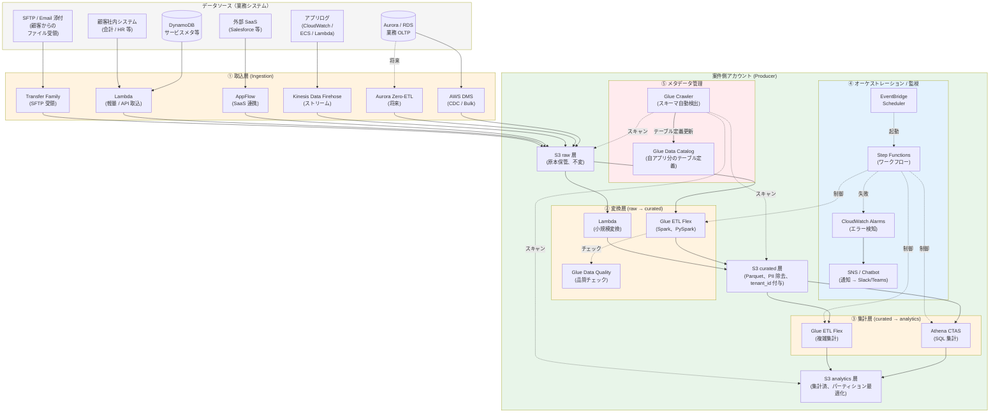
```mermaid
flowchart TB
    subgraph Sources["データソース（業務システム）"]
        direction LR
        Aurora[("Aurora / RDS<br/>業務 OLTP")]
        Dynamo[("DynamoDB<br/>サービスメタ等")]
        AppLog["アプリログ<br/>(CloudWatch /<br/>ECS / Lambda)"]
        ExtSaaS["外部 SaaS<br/>(Salesforce 等)"]
        ExtCust["顧客社内システム<br/>(会計 / HR 等)"]
        SFTP["SFTP / Email 添付<br/>(顧客からの<br/>ファイル受領)"]
    end

    subgraph Step1["① 取込層 (Ingestion)"]
        direction LR
        DMS["AWS DMS<br/>(CDC / Bulk)"]
        ZeroETL["Aurora Zero-ETL<br/>(将来)"]
        KFH["Kinesis Data Firehose<br/>(ストリーム)"]
        DataPipe["AppFlow<br/>(SaaS 連携)"]
        Lambda1["Lambda<br/>(軽量 / API 取込)"]
        Transfer["Transfer Family<br/>(SFTP 受領)"]
    end

    subgraph App["案件側アカウント (Producer)"]
        direction TB
        S3Raw["S3 raw 層<br/>(原本保管、不変)"]

        subgraph Step2["② 変換層 (raw → curated)"]
            direction LR
            GlueETL1["Glue ETL Flex<br/>(Spark、PySpark)"]
            GlueDQ["Glue Data Quality<br/>(品質チェック)"]
            LambdaXform["Lambda<br/>(小規模変換)"]
        end

        S3Cur["S3 curated 層<br/>(Parquet、PII 除去、tenant_id 付与)"]

        subgraph Step3["③ 集計層 (curated → analytics)"]
            direction LR
            AthenaCTAS["Athena CTAS<br/>(SQL 集計)"]
            GlueETL2["Glue ETL Flex<br/>(複雑集計)"]
        end

        S3Ana["S3 analytics 層<br/>(集計済、パーティション最適化)"]

        subgraph Orchestration["④ オーケストレーション / 監視"]
            direction LR
            StepFn["Step Functions<br/>(ワークフロー)"]
            EvBridge["EventBridge<br/>Scheduler"]
            CWAlarm["CloudWatch Alarms<br/>(エラー検知)"]
            SNS["SNS / Chatbot<br/>(通知 → Slack/Teams)"]
        end

        subgraph CatalogProd["⑤ メタデータ管理"]
            Crawler["Glue Crawler<br/>(スキーマ自動検出)"]
            GlueCatProd["Glue Data Catalog<br/>(自アプリ分のテーブル定義)"]
        end
    end

    Aurora --> DMS
    Aurora -.将来.-> ZeroETL
    Dynamo --> Lambda1
    AppLog --> KFH
    ExtSaaS --> DataPipe
    ExtCust --> Lambda1
    SFTP --> Transfer

    DMS --> S3Raw
    ZeroETL --> S3Raw
    KFH --> S3Raw
    DataPipe --> S3Raw
    Lambda1 --> S3Raw
    Transfer --> S3Raw

    S3Raw --> GlueETL1
    S3Raw --> LambdaXform
    GlueETL1 --> S3Cur
    LambdaXform --> S3Cur
    GlueETL1 -.チェック.-> GlueDQ

    S3Cur --> AthenaCTAS
    S3Cur --> GlueETL2
    AthenaCTAS --> S3Ana
    GlueETL2 --> S3Ana

    StepFn -.制御.-> GlueETL1
    StepFn -.制御.-> GlueETL2
    StepFn -.制御.-> AthenaCTAS
    EvBridge -.起動.-> StepFn
    StepFn -.失敗.-> CWAlarm
    CWAlarm --> SNS

    Crawler -.スキャン.-> S3Raw
    Crawler -.スキャン.-> S3Cur
    Crawler -.スキャン.-> S3Ana
    Crawler -->|テーブル定義更新| GlueCatProd

    style Sources fill:#f5f5f5
    style App fill:#e8f5e9
    style Step1 fill:#fff3e0
    style Step2 fill:#fff3e0
    style Step3 fill:#fff3e0
    style Orchestration fill:#e3f2fd
    style CatalogProd fill:#ffebee
```

###### 4.2.2.8.2 5 つのコンポーネント詳細

| # | コンポーネント | 役割 | 代表選択肢 | 選定の考え方 |
|---|---|---|---|---|
| ① | **取込層 (Ingestion)** | 業務 DB / 外部システム → S3 raw への運搬 | **AWS DMS** (CDC/Bulk) / **Aurora Zero-ETL** / **Kinesis Data Firehose** / **AppFlow** / **Lambda** / **Transfer Family** | データソースの種類とリアルタイム性で選定（後述 4.2.2.8.3）|
| ② | **変換層 (raw → curated)** | クレンジング、PII マスキング、Parquet 化、tenant_id 強制 | **Glue ETL Flex** (Spark) / **Lambda** (軽量) / **Glue Data Quality** (品質) | データ量と複雑度で選定。標準は Glue ETL Flex |
| ③ | **集計層 (curated → analytics)** | パーティション化、集計、分析最適化 | **Athena CTAS** (SQL) / **Glue ETL Flex** (複雑) | SQL で済むなら Athena CTAS、Python ロジック必要なら Glue ETL |
| ④ | **オーケストレーション / 監視** | ジョブの起動・依存関係・リトライ・通知 | **Step Functions** (ワークフロー) / **EventBridge Scheduler** (起動) / **CloudWatch Alarms** (検知) / **SNS / Chatbot** (通知) | 標準は Step Functions + EventBridge |
| ⑤ | **メタデータ管理** | スキーマ自動検出、Catalog 登録 | **Glue Crawler** / **Glue Schema Registry** | 全 Producer 共通の標準 |

###### 4.2.2.8.3 取込層の選定マトリクス（① 詳細）

最も判断が割れるのが取込層。データソースとリアルタイム性で 6 パターンに分岐:

| データソース | リアルタイム性 | 推奨ツール | 理由 / 補足 |
|---|---|---|---|
| **Aurora MySQL / PostgreSQL** | バッチ（日次）| **DMS Full Load + Glue Job** | DMS で初回全件 → Glue で日次差分（タイムスタンプ列）|
| **Aurora MySQL / PostgreSQL** | ニアリアルタイム（分単位）| **DMS CDC** | バイナリログ / WAL から変更検知、S3 Sink |
| **Aurora MySQL（v3.06+）/ PostgreSQL** | ニアリアルタイム（秒単位）| **Aurora Zero-ETL to Redshift** | 将来選択肢（Phase 3+、Redshift 採用時のみ。[DP-ADR-002](adr/DP-ADR-002-redshift-emr-not-adopted.md)）|
| **DynamoDB** | ニアリアルタイム | **DynamoDB Streams + Kinesis Firehose** | Streams → Firehose → S3 raw、24 時間以内のデータのみ |
| **DynamoDB** | バッチ | **DynamoDB Export to S3** | テーブルスナップショット、無料（ただし PITR 課金）|
| **アプリログ（ECS / Lambda / EC2）** | ストリーム | **CloudWatch Logs → Kinesis Firehose → S3** | サブスクリプションフィルタで Firehose に流す |
| **外部 SaaS（Salesforce / HubSpot 等）** | 日次 | **AWS AppFlow** | OAuth 認証、200+ SaaS コネクタ標準 |
| **外部 SaaS（カスタム API）** | 日次 | **Lambda + EventBridge Scheduler** | AppFlow に対応がない場合の自作。`requests` で API 叩き S3 PUT |
| **顧客社内システム（DB 直接接続不可）** ※オプション | 日次 | **Transfer Family (SFTP)** | 顧客が SFTP でファイル投函、S3 にランディング。**「該当アプリのみ採用」**: カード会社連携 / 顧客 HR システム / 顧客 ERP との連携など、API 不可な統合がある場合のみ。月 $216/サーバ |
| **顧客社内システム（DB 直接接続不可）** ※オプション | 日次 | **Email 受信 + SES + Lambda** | 顧客が CSV をメール添付、SES で受信 → Lambda で S3 配置。**Transfer Family より安価**な代替（SES は受信無料）|
| **既存基盤（オンプレ Hadoop / Hive）** | バッチ | **DataSync** | NAS / HDFS / S3 互換ストレージ → S3 |

> ⚠ **Transfer Family のスコープ整理**:
> - **ベースラインには含めない**。SFTP/FTPS/AS2 でしか連携できない顧客・パートナーがいる **特定アプリのみオプション採用**
> - 想定される採用ケース: ① 法人カード会社の利用明細 CSV 受領 / ② 顧客 HR システムの組織マスタ CSV 受領 / ③ 顧客 ERP への月次集計 CSV 送信 / ④ レガシー大企業との B2B ファイル連携
> - **代替案**: 月数件程度ならば SES（Email 添付）or 顧客側で S3 PUT 用 IAM Role 提供（**$0/月**）の方が安価
> - **共有化選択肢**: 複数アプリで SFTP 需要があれば、中央 BI/Catalog アカウントまたは専用「外部連携アカウント」に **1 個だけ Transfer Family** を立て、ディレクトリ単位でアプリ別に振り分ける構成も可（$216/月固定）
> - コスト試算は [§4.5.2](#452-producer-アカウント側1-アプリあたり) で「該当アプリのみ」として再計算

###### 4.2.2.8.4 変換層の典型実装（② 詳細）

**raw → curated の典型処理**（経費精算 SaaS の例）:

```python
# Glue ETL Flex Job (PySpark) の擬似コード例
# === Producer 側で実装、案件側のデータエンジニアが書く ===

import sys
from awsglue.transforms import *
from awsglue.context import GlueContext
from awsglue.dynamicframe import DynamicFrame
from pyspark.context import SparkContext
from pyspark.sql.functions import col, sha2, lit, when, current_timestamp

glueContext = GlueContext(SparkContext.getOrCreate())

# 1. raw 読込（DMS が出力した CDC 形式 JSON）
raw_df = glueContext.create_dynamic_frame.from_catalog(
    database="expense_app_raw",      # 自アプリの DB
    table_name="expenses_cdc"        # raw テーブル
).toDF()

# 2. tenant_id 強制付与（多くの場合 DB に既に列がある）
#    存在しなければエラー停止
if "tenant_id" not in raw_df.columns:
    raise ValueError("tenant_id is required for multi-tenant isolation")

# 3. PII マスキング（メールアドレスを SHA-256 ハッシュ化）
cleaned_df = raw_df \
    .withColumn("email_hash", sha2(col("submitter_email"), 256)) \
    .drop("submitter_email") \
    .withColumn("processed_at", current_timestamp())

# 4. データ品質: NULL チェック、型違反、金額の範囲チェック
quality_df = cleaned_df.filter(
    (col("tenant_id").isNotNull()) &
    (col("amount") > 0) &
    (col("amount") < 100000000)  # 1 億未満
)

# 5. Parquet で curated 層へ書込（パーティション = tenant_id + 日付）
quality_df.write \
    .mode("append") \
    .partitionBy("tenant_id", "submitted_date") \
    .parquet("s3://expense-app-curated/expenses/")
```

**変換層で典型的に行う処理**:

| 処理 | 必須 / 推奨 | 内容 |
|---|---|---|
| **`tenant_id` 強制付与** | **必須** | 多テナント分離の根幹。欠落時はジョブ失敗 |
| **PII マスキング** | **必須** | メール → SHA-256 / 個人名 → 仮名化 / 電話番号 → 末尾マスク |
| **Parquet 変換** | 推奨 | JSON / CSV → Parquet で Athena コスト 75% 削減 |
| **データ型統一** | 推奨 | 文字列の "true"/"True"/"1" → boolean に統一 |
| **パーティション設計** | **必須** | `tenant_id=XXX/year=YYYY/month=MM/day=DD/` 形式で Athena 最適化 |
| **重複排除** | 推奨 | CDC で同じレコードが複数回到着するため `row_number()` で最新のみ残す |
| **品質チェック** | 推奨 | Glue Data Quality でルール定義（NULL 率 5% 以下、外部キー整合性等）|

###### 4.2.2.8.5 集計層の典型実装（③ 詳細）

**curated → analytics は Athena CTAS が第一選択**:

```sql
-- Producer 側で Athena CTAS を実行、analytics 層に集計テーブル生成
-- 月次の経費精算サマリー（テナント別）

CREATE TABLE expense_app_analytics.monthly_summary
WITH (
    format = 'PARQUET',
    parquet_compression = 'SNAPPY',
    partitioned_by = ARRAY['tenant_id', 'year_month'],
    external_location = 's3://expense-app-analytics/monthly_summary/'
) AS
SELECT
    tenant_id,
    DATE_FORMAT(submitted_date, '%Y-%m') AS year_month,
    COUNT(*) AS submission_count,
    SUM(amount) AS total_amount,
    AVG(amount) AS avg_amount,
    COUNT(DISTINCT submitter_id) AS unique_submitters,
    SUM(CASE WHEN status = 'rejected' THEN 1 ELSE 0 END) AS rejected_count
FROM expense_app_curated.expenses
WHERE submitted_date >= DATE '2026-01-01'
GROUP BY tenant_id, DATE_FORMAT(submitted_date, '%Y-%m');
```

**Athena CTAS vs Glue ETL の選び分け**:

| 観点 | Athena CTAS | Glue ETL |
|---|---|---|
| ロジック | SQL のみ | Python / Spark（任意ロジック）|
| 開発速度 | ⭕ 速い（SQL のみ）| △ Spark コード必要 |
| 実行コスト | スキャン量課金（$5/TB）| DPU 時間課金（Flex で $0.29）|
| 大量データ向き | ❌（30 分 / クエリ制限）| ⭕ |
| ML 前処理 / 複雑なロジック | ❌ | ⭕ |
| **推奨** | **集計が中心ならこれ** | 複雑な変換や ML 前処理に |

###### 4.2.2.8.6 オーケストレーションの典型実装（④ 詳細）

**Step Functions + EventBridge Scheduler の典型構成**:

```
EventBridge Scheduler (Cron: 毎日 02:00 JST)
    ↓ 起動
Step Functions ステートマシン
    ├── State 1: DMS タスク開始 (CDC リフレッシュ)
    │       ↓ 待機 (5 分)
    ├── State 2: Glue Crawler 実行 (raw のスキーマ更新)
    │       ↓ 完了待ち
    ├── State 3: Glue ETL Job (raw → curated)
    │       ↓ 完了待ち、失敗時リトライ 3 回
    ├── State 4: Glue Data Quality チェック
    │       ↓ 失敗時 → CloudWatch Alarm → SNS → Slack 通知
    ├── State 5: Athena CTAS (curated → analytics)
    │       ↓
    └── State 6: 完了通知 → SNS → Slack
```

**この構成のメリット**:
- ジョブ間の依存関係を State Machine で宣言的に管理
- 各 State のリトライ・タイムアウト・並列実行を細かく制御
- 視覚的にパイプラインの状態が分かる（Step Functions コンソール）
- IaC（CDK / Terraform）で全体を管理可能

###### 4.2.2.8.7 IaC / CI/CD の典型構成

**案件側の標準的な IaC / CI/CD 構成**:

| レイヤー | ツール | 内容 |
|---|---|---|
| **インフラ定義** | AWS CDK (TypeScript / Python) / Terraform / SAM | S3 / Glue / Lambda / Step Functions / DMS の宣言 |
| **ETL コード管理** | Git（GitHub / GitLab / CodeCommit）| Glue PySpark / Lambda コード / SQL クエリ |
| **CI** | GitHub Actions / CodeBuild | プルリク時に PyLint / Flake8 / SQL Lint / 単体テスト |
| **CD** | GitHub Actions / CodePipeline | dev → stg → prod のステージ別デプロイ、CDK Deploy 自動化 |
| **テスト** | pytest + LocalStack / Moto（モック）| Glue Job をローカルで実行（重い場合は dev 環境で実機テスト）|
| **シークレット** | Secrets Manager / Parameter Store | DB 接続情報、外部 SaaS API キー |

###### 4.2.2.8.8 案件側 ETL のコスト見積もり（経費精算 SaaS 中規模を想定）

**月次データ量の想定**: 1,000 顧客企業 × 平均 1,000 件 / 月 = **100 万件 / 月**、データサイズ約 **50 GB / 月**

| コンポーネント | 単価 | 月次利用量 | 月額 |
|---|---|---|---|
| **DMS（t3.medium インスタンス）** | $0.044/h | 24h × 30 = 720h | ~$32 |
| **DMS 通信料** | $0.09/GB（クロス AZ 不要なら $0）| 約 5 GB（差分のみ）| ~$0.5 |
| **S3 raw 保管**（GB × 月）| $0.023/GB | 50 GB × 3 ヶ月分（90 日 lifecycle）| ~$3.5 |
| **S3 curated / analytics**（Parquet 圧縮後）| $0.023/GB | 12.5 GB（75% 圧縮）| ~$0.3 |
| **Glue ETL Flex（raw → curated）** | $0.29/DPU 時間 | 2 DPU × 0.5 h × 30 日 = 30 DPU 時間 | ~$8.7 |
| **Athena CTAS（curated → analytics）** | $5/TB スキャン | 12.5 GB × 30 日 = 0.4 TB | ~$2 |
| **Glue Crawler** | $0.44/DPU 時間 | 0.5 DPU × 0.2 h × 30 日 = 3 DPU 時間 | ~$1.3 |
| **Step Functions** | $0.025/1,000 状態遷移 | 30 日 × ~50 遷移 = 1,500 遷移 | ~$0.04 |
| **EventBridge Scheduler** | 無料枠内（< 14M 起動）| 30 起動 / 月 | $0 |
| **CloudWatch Logs** | $0.50/GB 取込 | ~5 GB | ~$2.5 |
| **Lambda（軽量変換）** | $0.20/100 万リクエスト | 数千リクエスト | ~$0.1 |
| **合計** | | | **~$51 / 月** |

→ **中規模アプリ 1 つあたり月 ~$50 程度**。10 アプリで $500 / 月、20 アプリで $1,000 / 月。Glue / Athena / S3 の課金体系上、規模が増えても準線形に拡大する。

###### 4.2.2.8.9 案件側に必要な人材スキル

データプラットフォーム標準を活かすため、案件側に必要なスキル:

| スキル | レベル | 用途 |
|---|---|---|
| **SQL（標準クエリ + ウィンドウ関数）** | 中級 | Athena CTAS による集計、データ品質チェック |
| **Python（基礎 + Pandas / boto3）** | 中級 | Lambda、Glue ETL（PySpark）、外部 API 連携 |
| **PySpark（DynamicFrame / DataFrame）** | 初級〜中級 | Glue ETL の本体実装 |
| **AWS CDK / Terraform** | 初級〜中級 | インフラ IaC |
| **CloudWatch Logs / X-Ray** | 初級 | パイプライン障害調査 |
| **Parquet / 列指向ストレージの理解** | 初級 | パーティション設計、コスト最適化 |
| **CDC / イベントソーシング** | 初級 | DMS / DynamoDB Streams の運用 |
| **データモデリング（スター / 正規化）** | 中級 | curated / analytics 層の設計 |

→ **既存の Web アプリエンジニアから 2-3 名がデータエンジニアリングに転向**するイメージ。新規採用が難しい場合は、外部研修（AWS Data Engineering 学習パス、Udemy 等）で 3-6 ヶ月のオンボーディング想定。

###### 4.2.2.8.10 案件側 ETL の運用負荷の目安

**Phase 1 で 1 アプリあたり**:

| 工数項目 | 月次 |
|---|---|
| パイプライン障害対応 | 4-8 時間 |
| スキーマ変更追従（業務 DB に列追加等）| 2-4 時間 |
| データ品質ルール調整 | 1-2 時間 |
| コスト最適化（パーティション再設計等）| 月 0、四半期 8 時間 |
| **合計（定常運用）** | **8-15 時間 / 月** |

→ **案件側 0.1 人月（16 時間 / 月）程度**を初期想定。アプリチームの既存業務に組み込むことで、専任を新たに雇う必要は通常ない。ただし、新規パイプライン構築時は別途 2-4 週間の開発工数が必要。

###### 4.2.2.8.11 標準として案件側に守ってもらうこと（インターフェース契約）

データプラットフォーム標準のスコープ外ではあるが、**案件側 ETL の出力（S3 raw 着地データ）には標準が課す要件がある**:

| カテゴリ | 案件側に求める標準 | 詳細参照 |
|---|---|---|
| **S3 バケット命名規約** | `<prefix>-<app>-<layer>-<env>` 等の命名統一 | [proposal/fr/02-storage.md](proposal/fr/02-storage.md) §FR-2.1 |
| **パーティション規約** | `tenant_id=XXX/year=YYYY/month=MM/day=DD/` 形式 | [proposal/fr/02-storage.md](proposal/fr/02-storage.md) §FR-2.3 |
| **暗号化** | SSE-KMS 必須、中央 CMK 利用 | [proposal/fr/02-storage.md](proposal/fr/02-storage.md) §FR-2.4 |
| **Glue Catalog 登録** | curated / analytics 層は Glue Catalog 登録必須（Federation 元）| [proposal/fr/02-storage.md](proposal/fr/02-storage.md) §FR-2.5 |
| **データ品質メトリクス** | Glue Data Quality 結果を中央集約用 S3 に出力 | [proposal/fr/03-pipeline.md](proposal/fr/03-pipeline.md) §FR-3.4 |
| **`tenant_id` 必須付与** | curated 層以降、全テーブルに `tenant_id` 列が存在すること | [proposal/fr/05-governance.md](proposal/fr/05-governance.md) §FR-5.2 |
| **CloudTrail Data Events 有効化** | S3 raw / curated / analytics の全バケット | [proposal/fr/05-governance.md](proposal/fr/05-governance.md) §FR-5.4 |

→ 案件側は「**インターフェース契約を守れば、ETL の中身は自由に実装してよい**」というのが標準のスタンス（[../proposal/fr/03-pipeline.md §FR-3.0.A](proposal/fr/03-pipeline.md) 参照）。

###### 4.2.2.8.12 Athena Federated Query (Data Source Connector) の位置付け

> **方針**: **主軸は ETL → S3 → Athena**。Athena Federated Query は **ad-hoc 探索の補助用途に限定**、定形バッチや BI ダッシュボードの裏側では使用しない。
> **既存方針との関係**: [proposal/fr/04-consumption.md §FR-4.1](proposal/fr/04-consumption.md) の「Federated Query は性能・コストに注意し、定形バッチでは使用しない」を本節で補強・具体化。

###### A. Athena Federated Query とは

Lambda ベースのコネクタを経由して、**S3 以外のデータソース**を Athena から直接 SQL クエリできる機能。

| カテゴリ | 公式コネクタ提供サービス |
|---|---|
| AWS RDB | Aurora MySQL / Aurora PostgreSQL / RDS MySQL / RDS PostgreSQL / Redshift |
| AWS NoSQL | DynamoDB / DocumentDB / Neptune |
| AWS その他 | OpenSearch / CloudWatch Logs / CloudWatch Metrics / Timestream |
| 外部 RDB | Snowflake / SAP HANA / Db2 / Oracle / SQL Server |
| 外部 NoSQL | MongoDB / Google BigQuery |
| 汎用 | JDBC（任意の JDBC ドライバ）|
| カスタム | Athena Connector SDK で自作可能 |

→ Lambda 関数として各 Producer アカウントに展開し、Athena から「外部カタログ」として登録して使う。

###### B. 「主軸として採用しない」根拠（6 点）

| # | 理由 | 詳細 |
|---|---|---|
| 1 | **パフォーマンス** | Lambda コールドスタート（初回数秒）、Lambda 同時実行数上限、ソース DB のレスポンス速度に律速。Athena の S3 並列読込（数百並列）に比べて 1-2 桁遅い |
| 2 | **コスト予測困難** | クエリごとに Lambda 起動コスト + Lambda 実行時間課金 + ソース DB 計算リソース消費。Athena の「スキャン量 = $5/TB」のような単純な単価予測ができない |
| 3 | **OLTP DB への負荷** | 分析クエリが業務 DB（Aurora 等）を直撃。トランザクション処理性能を毀損するリスク。読込専用レプリカ必須となるが、Producer 側に追加運用負荷 |
| 4 | **テナント分離の徹底困難** | S3 + Parquet なら `tenant_id` パーティション + LF-Tags で強制できるが、Federated Query は接続先 DB のテーブル構造に依存。テナント分離を SQL の `WHERE tenant_id = ...` 必須化で担保することになり、漏れリスク |
| 5 | **PII マスキング不能** | S3 raw → curated 経由なら ETL でマスキングしてから analytics に出せるが、Federated Query はソース DB の生データを直接参照。**PII 漏洩リスク**でガバナンス的に許容困難 |
| 6 | **クロスアカウント運用負荷** | 各 Producer アカウントに Lambda コネクタを展開・更新が必要。Lake Formation も Federated Catalog 経由でアクセスする場合、設計が複雑化。N 個のアプリで N 個のコネクタ運用 |

###### C. 「補助用途として採用する」4 ケース

| # | ユースケース | 例 | 採用条件 |
|---|---|---|---|
| 1 | **ad-hoc 探索（ETL 設計前）** | 新規アプリのデータ構造を ETL 設計前に SQL で確認 | Producer 側データエンジニアによる開発時のみ |
| 2 | **S3 レイクと OLTP の Join 探索** | analytics の月次集計結果と Aurora の現在の顧客状態を突合してドリフト確認 | データエンジニア / アナリストの調査用、ダッシュボード化禁止 |
| 3 | **小規模リファレンス参照** | DynamoDB から少量の設定マスタ（数百レコード）を Athena クエリ内で参照 | レコード数 < 10,000、頻度 < 1 回/日 |
| 4 | **インシデント時の業務 DB 状態確認** | 障害対応で「業務 DB の現在値はどうなっているか」を SQL で素早く確認 | 監査ログ必須、有限時間のみ |

###### D. 採用時の制約（Phase 1）

| 制約 | 内容 |
|---|---|
| **配置** | Producer アカウント側 Athena ワークグループ限定（**中央 BI / Catalog アカウントには配置しない**）|
| **接続先 DB** | Aurora 読込専用レプリカ / DynamoDB 読込専用テーブル / 同期遅延を許容できるソースのみ |
| **テーブルスコープ** | PII を含まないテーブルに限定（顧客マスタの個人情報列・経費明細の詳細等は禁止）|
| **クエリスキャン量** | 月次上限を Athena Workgroup で設定（例: 月 100 GB） |
| **実行時間** | クエリタイムアウト 5 分（OLTP 負荷防止）|
| **同時実行数** | アカウントあたり 1-2 並列まで |
| **監査ログ** | CloudTrail + Athena クエリ履歴で全件記録、四半期レビュー必須 |
| **承認プロセス** | データオーナー（役割 1）の事前承認、用途・期間明示 |

→ 実質的に [§FR-4.4 直接アクセス](proposal/fr/04-consumption.md) の「例外条件」と同等の運用ガードを課す。

###### E. 採用 / 不採用の判断フロー

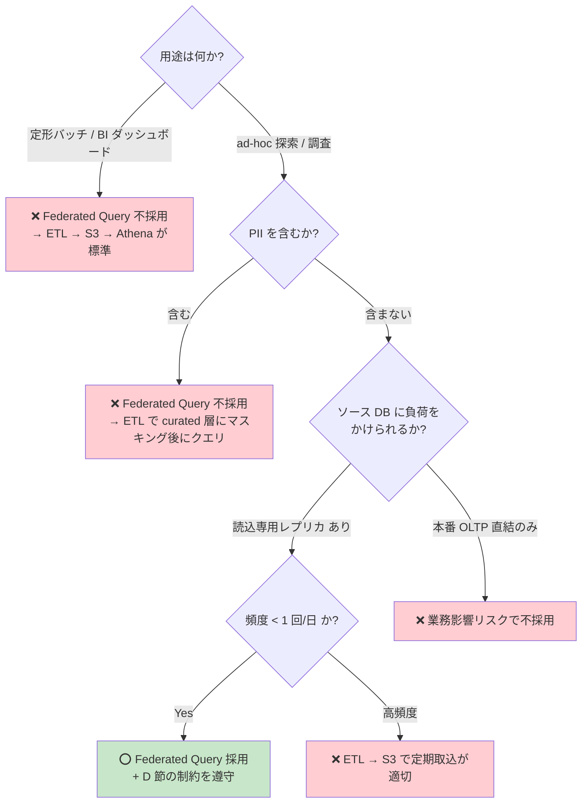
```mermaid
flowchart TD
    Q1{用途は何か?}
    Q1 -->|定形バッチ / BI ダッシュボード| NotUse[❌ Federated Query 不採用<br/>→ ETL → S3 → Athena が標準]
    Q1 -->|ad-hoc 探索 / 調査| Q2{PII を含むか?}
    Q2 -->|含む| NotUse2[❌ Federated Query 不採用<br/>→ ETL で curated 層にマスキング後にクエリ]
    Q2 -->|含まない| Q3{ソース DB に負荷を<br/>かけられるか?}
    Q3 -->|読込専用レプリカ あり| Q4{頻度 < 1 回/日 か?}
    Q3 -->|本番 OLTP 直結のみ| NotUse3[❌ 業務影響リスクで不採用]
    Q4 -->|Yes| OK[⭕ Federated Query 採用<br/>+ D 節の制約を遵守]
    Q4 -->|高頻度| NotUse4[❌ ETL → S3 で定期取込が適切]

    style NotUse fill:#ffcdd2
    style NotUse2 fill:#ffcdd2
    style NotUse3 fill:#ffcdd2
    style NotUse4 fill:#ffcdd2
    style OK fill:#c8e6c9
```

###### F. §4.2.1.1 図には現れない理由

§4.2.1.1 リソース関係図には Athena Federated Query Lambda コネクタを**意図的に描いていない**。理由:

| 理由 | 詳細 |
|---|---|
| **主軸でない** | Phase 1 の基本データフローは S3 → Athena。Federated Query は補助 |
| **Producer ごとの自由実装** | 必要な Producer のみが導入、N 個のアプリ全てに必須ではない |
| **図の複雑化回避** | Aurora 等のデータソースは既に図中にあるため、Federated Query を加えると矢印が増えてかえって読みにくくなる |

→ **本節（§4.2.2.8.12）で文章解説する**位置付けとし、図には追加しない。

###### G. ADR 化の要否

[proposal/fr/04-consumption.md §FR-4.1](proposal/fr/04-consumption.md) の「Federated Query は性能・コストに注意し、定形バッチでは使用しない」で既に方針が定められているため、**新規 ADR 化は不要**。本節を §FR-4.1 を補強する詳細解説として位置付け、必要に応じて §FR-4.1 から本節へのリンクを追加する。

#### 4.2.3 Glue Crawler の位置付けと運用

##### 4.2.3.1 Glue Crawler の役割

| 機能 | 内容 |
|---|---|
| **スキーマ自動検出** | S3 上のデータ（CSV / JSON / Parquet / ORC 等）からスキーマを推論 |
| **Glue Data Catalog 更新** | 検出したスキーマでテーブル定義を作成・更新 |
| **パーティション検出** | `s3://.../year=YYYY/month=MM/day=DD/` のような Hive 形式のパーティション認識 |
| **データフォーマット検出** | ファイル形式（Parquet vs JSON 等）の自動判定 |
| **スキーマ進化追跡** | 既存テーブルへの列追加・型変更を検出（ポリシーで挙動制御）|

##### 4.2.3.2 配置（Producer 側、各アプリアカウント内）

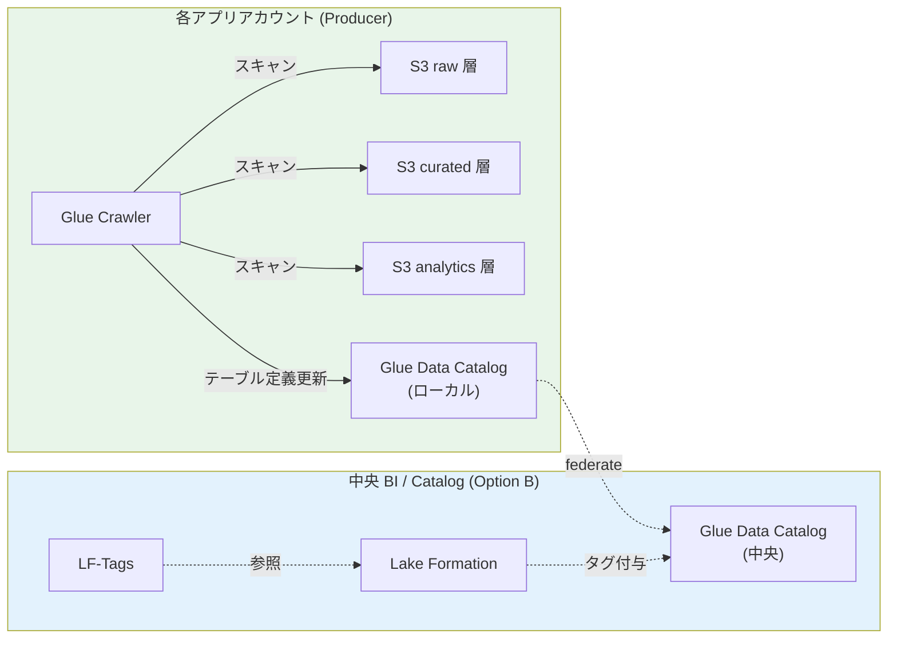
```mermaid
flowchart LR
    subgraph App["各アプリアカウント (Producer)"]
        Crawler["Glue Crawler"]
        S3R["S3 raw 層"]
        S3C["S3 curated 層"]
        S3A["S3 analytics 層"]
        GlueProd["Glue Data Catalog<br/>(ローカル)"]
    end

    subgraph Central["中央 BI / Catalog (Option B)"]
        LF["Lake Formation"]
        GlueCat["Glue Data Catalog<br/>(中央)"]
        LFTags["LF-Tags"]
    end

    Crawler -->|スキャン| S3R
    Crawler -->|スキャン| S3C
    Crawler -->|スキャン| S3A
    Crawler -->|テーブル定義更新| GlueProd
    GlueProd -.federate.-> GlueCat
    LF -.タグ付与.-> GlueCat
    LFTags -.参照.-> LF

    style App fill:#e8f5e9
    style Central fill:#e3f2fd
```

**配置の原則**: Crawler は **データに最も近い場所**（Producer 側）で動かす。ローカル Glue Data Catalog を更新し、その結果が **Cross-account Glue Catalog Federation** で中央 Lake Formation に反映される。

##### 4.2.3.3 各層での Crawler の必要性

| 層 | Crawler の必要性 | 理由 |
|---|:---:|---|
| **S3 raw 層** | ⭐⭐⭐ 高 | 取り込み元（顧客の会計システム等）からのデータ形式・スキーマが未知の可能性、外部 SaaS のスキーマ変更追従に必要 |
| **S3 curated 層** | ⭐⭐ 中 | ETL ジョブが明示的にスキーマ定義することが多いが、念のため Crawler で検証 |
| **S3 analytics 層** | ⭐ 低 | Athena CTAS / Glue ETL（Spark）が**自動的に Glue Catalog に登録**するため Crawler 不要 |

##### 4.2.3.4 実行タイミング

| トリガ | 使い分け |
|---|---|
| **スケジュール**（毎日 / 毎時）| 定期的なデータ取り込み・raw 層のスキーマドリフト検出に最適 |
| **EventBridge**（S3 ObjectCreated）| 不定期な大量データ取り込み時、リアルタイム性が必要な場合 |
| **ETL パイプライン終了時**（Step Functions から呼出）| 推奨。ETL → Crawler → 通知 の一連のフローで運用 |
| **手動実行** | 新規データソース追加時の検証 |

##### 4.2.3.5 Lake Formation との連携フロー

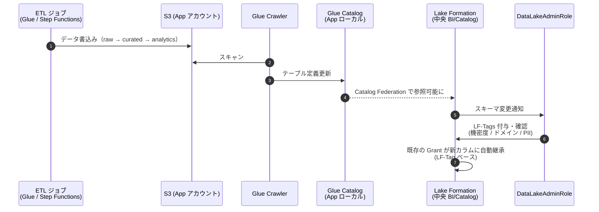
```mermaid
sequenceDiagram
    autonumber
    participant ETL as ETL ジョブ<br/>(Glue / Step Functions)
    participant S3 as S3 (App アカウント)
    participant Crawler as Glue Crawler
    participant GlueProd as Glue Catalog<br/>(App ローカル)
    participant LFCentral as Lake Formation<br/>(中央 BI/Catalog)
    participant Admin as DataLakeAdminRole

    ETL->>S3: データ書込み（raw → curated → analytics）
    Crawler->>S3: スキャン
    Crawler->>GlueProd: テーブル定義更新
    GlueProd-->>LFCentral: Catalog Federation で参照可能に
    LFCentral->>Admin: スキーマ変更通知
    Admin->>LFCentral: LF-Tags 付与・確認<br/>(機密度 / ドメイン / PII)
    LFCentral->>LFCentral: 既存の Grant が新カラムに自動継承<br/>(LF-Tag ベース)
```

**重要**: スキーマ変更時、**新カラムへの LF-Tags は自動継承されない**ケースがある（タグ設計次第）。DataLakeAdminRole の運用プロセスとして「Crawler 実行後の LF-Tags レビュー」を組み込む必要。

##### 4.2.3.6 ベストプラクティス（使う / 使わないの判断）

| 状況 | 推奨アプローチ | 理由 |
|---|---|---|
| **未知形式の raw データ取り込み**（外部システム連携）| ✅ Crawler 必須 | スキーマが事前に分からない |
| **ETL ジョブが明示的にスキーマ定義** | △ Crawler 不要 | ETL ジョブのスキーマが信頼できる |
| **Athena CTAS で派生テーブル生成** | ❌ Crawler 不要 | Athena が自動カタログ登録 |
| **大規模バケット**（数 TB 超 / 数百万ファイル）| ⚠ Crawler のスキャンコスト注意 | パーティションを限定したクロールを推奨 |
| **ストリーミングデータ**（Kinesis Firehose）| △ Glue Schema Registry を使用 | Crawler よりも Schema Registry のほうが適切 |
| **IaC 管理されたスキーマ** | ❌ Crawler 不要 | CDK / CloudFormation でスキーマを定義済み |

##### 4.2.3.7 代替手段（Crawler を使わない選択肢）

| 代替手段 | 用途 | 利点 |
|---|---|---|
| **AWS Glue Schema Registry** | ストリーミングデータ（Kinesis / MSK）のスキーマ管理 | スキーマ進化のバージョン管理、後方互換性チェック |
| **IaC（CDK / CloudFormation）でスキーマ定義** | 既知の安定したスキーマ | バージョン管理、レビュー可能、再現性 |
| **Lake Formation Resource Link** | クロスアカウント Catalog 参照 | Crawler 不要で他アカウントの Catalog を共有 |
| **ETL ジョブ内でのスキーマ宣言** | Spark / Pandas で明示定義 | 型変換・バリデーションを ETL と同時実行 |
| **Glue DataBrew** | データプロファイリング + スキーマ検出 | より高度な分析・品質チェック付き |

##### 4.2.3.8 コスト感

| 項目 | 単価 | 影響 |
|---|---|---|
| **クロール実行時間** | 1 DPU-hour あたり $0.44 | データ量・パーティション数次第で月数十 USD オーダー |
| **データスキャン** | 別途 S3 GET リクエスト課金 | 大規模バケットでは無視できない |
| **Glue Data Catalog ストレージ** | 月 100 万オブジェクトまで無料、超過後課金 | 数千テーブル程度なら無料枠内 |

**最適化のコツ**:
- **パーティション限定**: `s3://.../year=2026/month=06/` のように最新パーティションのみクロール
- **除外パターン**: `.tmp` ファイル等の不要ファイルを除外
- **更新検出モード**: 「Crawl new sub-folders only」で全スキャンを回避

##### 4.2.3.9 残課題（ヒアリングで確認）

| # | 質問 | 影響 |
|---|---|---|
| 1 | 各アプリのデータ取り込み形式の安定性 | Crawler を使うか IaC でスキーマ定義するか |
| 2 | スキーマ進化（既存カラムの型変更等）への対応ポリシー | Crawler の `SchemaChangePolicy` 設定 |
| 3 | Crawler 実行頻度の妥当性 | コスト・鮮度のバランス |
| 4 | LF-Tags 再付与プロセスの自動化要否 | スキーマ変更時の Catalog 管理者運用 |

#### 4.2.4 AWS RAM の役割と使用箇所

##### 4.2.4.1 AWS RAM とは

**AWS Resource Access Manager**: AWS リソースをアカウント間で共有するためのサービス。

| 機能 | 内容 |
|---|---|
| **リソース共有の宣言** | 「このリソースをこの相手に共有する」を Resource Share として作成 |
| **共有相手の指定** | (a) 個別 AWS アカウント ID / (b) Organization 内の OU / (c) Organization 全体 |
| **権限の付与** | Resource Share 内で何ができるか（読み専用 / 書き可 / etc.）を managed permission で指定 |
| **Auto-accept** | Organization 内なら **自動受諾** 可能（個別承認不要）|

##### 4.2.4.2 質問への回答: 子アカウント同士で共有できるか

**結論: YES、できる。Management アカウント経由は不要。**

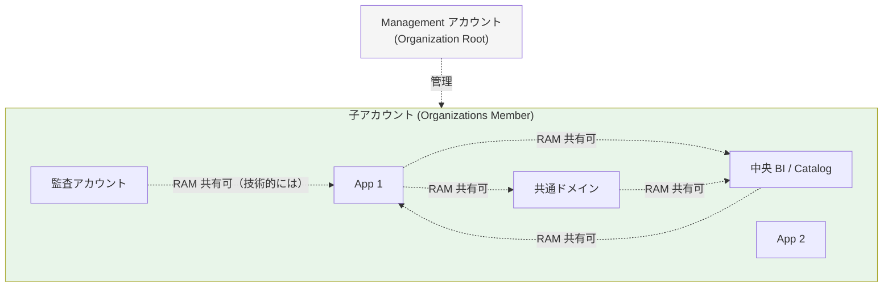
```mermaid
flowchart TB
    Mgmt["Management アカウント<br/>(Organization Root)"]

    subgraph Children["子アカウント (Organizations Member)"]
        direction LR
        Audit["監査アカウント"]
        BICat["中央 BI / Catalog"]
        App1["App 1"]
        App2["App 2"]
        Common["共通ドメイン"]
    end

    Mgmt -.管理.-> Children

    BICat -.RAM 共有可.-> App1
    App1 -.RAM 共有可.-> BICat
    Audit -.RAM 共有可（技術的には）.-> App1
    App1 -.RAM 共有可.-> Common
    Common -.RAM 共有可.-> BICat

    style Mgmt fill:#f5f5f5
    style Children fill:#e8f5e9
```

**仕組み**:
1. 共有元アカウントが Resource Share を作成
2. Resource Share に「このリソースをこの相手に共有」と宣言
3. Organization 設定で **「AWS Organizations での共有を有効化」** をオンにしておくと、Org 内の共有は受信側で自動受諾される
4. 受信側は IAM 権限を別途付与すれば共有リソースを利用可能

**制約**:
- 共有元は **そのリソースの所有者** でなければならない（自分が持っていないリソースは共有できない）
- 受信側で利用するには **IAM 権限** が別途必要（RAM は「アクセスを許可する」だけ、IAM が「使うことを許可する」）
- リソース種別ごとに共有可否が決まっている（[RAM 対応リソース一覧](https://docs.aws.amazon.com/ram/latest/userguide/shareable.html)）

##### 4.2.4.3 本構成での RAM 使用箇所一覧

| 共有元 | 共有先 | リソース | 用途 | 仕組み |
|---|---|---|---|---|
| **中央 BI / Catalog** | App アカウント（Producer）| Lake Formation 権限 | Producer が自分のデータを Lake Formation に登録できるようにする | **Lake Formation Cross-Account v3 が RAM を透過利用** |
| **App アカウント**（Producer）| 中央 BI / Catalog | Glue Data Catalog テーブル | Producer の Catalog を中央 LF が参照（Federation）| Lake Formation 経由 |
| **共通ドメインアカウント** | 中央 BI / Catalog | Glue Data Catalog テーブル | 共通参照データ（顧客マスタ等）を中央から参照 | 同上 |
| **共通ドメインアカウント** | App アカウント | Glue Data Catalog テーブル | 各アプリが共通マスタを参照（例: 経費精算が顧客マスタを Join）| 同上 |
| **将来 γ パターン採用時**: 中央 BI / Catalog | 各 Consumer アカウント | Lake Formation 権限 | 各アプリ内 Consumer がデータをクエリできる | Lake Formation Cross-Account |
| **オプション**: 中央 BI / Catalog | App アカウント | KMS CMK | 暗号化鍵を App 側からも使えるように | **KMS 鍵ポリシー**（RAM ではなく Key Policy で制御）|
| **監査アカウント** | データ標準アカウント | （基本なし）| 詳細は §4.2.4.5 参照 | — |

##### 4.2.4.4 Lake Formation での RAM 透過利用

**重要**: Lake Formation **Cross-Account Permissions v3**（現行）は、RAM を **自動的に裏で作成・管理** する。利用者が明示的に RAM Resource Share を作る必要はない。

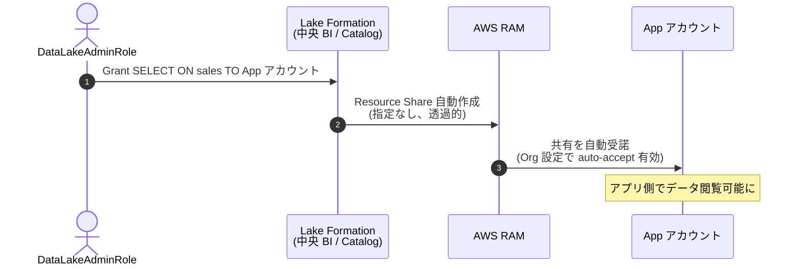
```mermaid
sequenceDiagram
    autonumber
    actor Admin as DataLakeAdminRole
    participant LF as Lake Formation<br/>(中央 BI / Catalog)
    participant RAM as AWS RAM
    participant App as App アカウント

    Admin->>LF: Grant SELECT ON sales TO App アカウント
    LF->>RAM: Resource Share 自動作成<br/>(指定なし、透過的)
    RAM->>App: 共有を自動受諾<br/>(Org 設定で auto-accept 有効)
    Note over App: アプリ側でデータ閲覧可能に
```

→ **DataLakeAdminRole は LF Grant のみ意識すればよい**。RAM の存在は知っていれば十分。

##### 4.2.4.5 監査アカウント → 案件アカウントの共有

**技術的可否**: 可能（Organizations 内の子アカウント間共有）

**ただし、本構成では基本的に不要**:
- 監査アカウントは通常 **ログを受け取る側**（受信専用）
- 監査アカウントから案件アカウントへの「リソース共有」は限定的なシナリオでのみ発生

**監査アカウント → 案件アカウントの共有が発生しうる典型シナリオ**:

| シナリオ | 内容 | 仕組み |
|---|---|---|
| **セキュリティ標準の AMI 配布** | 監査チームが標準化された AMI を全アカウントに共有 | RAM（AMI を Resource Share）|
| **共通 KMS 鍵の利用許可** | 監査チームが管理する暗号鍵を案件アカウントが使用 | KMS 鍵ポリシー（RAM ではない）|
| **Security Hub Insights / Custom Actions の共有** | カスタムフィルタを案件アカウントに展開 | Security Hub の Delegated Admin 機能 |
| **Config Conformance Pack のデプロイ** | コンプラチェックルールを案件側にデプロイ | Config の Multi-Account 機能 |
| **Network Firewall の共通ルール** | NW ファイアウォール設定を案件側に共有 | RAM（NW Firewall Rule Group を Resource Share）|

**監査アカウントが管理側のサービス使用例**:
- Security Hub Delegated Administrator
- GuardDuty Delegated Administrator
- Macie Delegated Administrator
- Config Aggregator

→ これらは **RAM ではなく各サービスの Delegated Admin / Aggregator 機能** で実現。RAM の直接利用は限定的。

##### 4.2.4.6 RAM 設定の流れ（例: Lake Formation 共有を手動で確認する場合）

```bash
# 1. Lake Formation Grant 実行
aws lakeformation grant-permissions \
    --principal DataLakePrincipalIdentifier=arn:aws:iam::APP_ACCOUNT_ID:root \
    --permissions SELECT \
    --resource Table='{DatabaseName=sales,Name=transactions}'

# 2. Lake Formation が裏で RAM Resource Share を作成
# 3. RAM 側で確認
aws ram list-resources \
    --resource-owner SELF

# 4. App アカウント側で受諾状態確認（auto-accept なら不要）
aws ram get-resource-share-invitations
```

##### 4.2.4.7 注意点と落とし穴

| # | 注意点 | 影響 |
|---|---|---|
| 1 | **Organization 設定の「RAM 共有有効化」が必須** | OFF の場合、子アカウント間共有が auto-accept にならず手動承認が必要 |
| 2 | **共有先での IAM 権限付与が別途必要** | RAM が「リソースを見える」ようにするだけ、利用には IAM 権限が必要 |
| 3 | **共有可能なリソースは限られる** | S3 バケットは RAM では共有できない（バケットポリシーで対応）|
| 4 | **Resource Share の上限**: アカウントあたり 5000 個まで | 大規模環境で要監視 |
| 5 | **Resource Link との違い**: Glue Catalog のクロスアカウント参照には **Resource Link** が必要（RAM 共有とは別）| Lake Formation 経由で自動生成される |
| 6 | **削除順序**: 共有元で削除 → 共有先で自動的に見えなくなる | データへの影響なし、メタデータのみ |
| 7 | **Auto-accept が効くのは Org 内のみ** | 別 Org への共有は手動受諾必要（本構成では発生しない）|

##### 4.2.4.8 残課題（ヒアリングで確認）

| # | 質問 | 影響 |
|---|---|---|
| 1 | Organizations の「**RAM 共有有効化**」設定状況 | 子アカウント間 auto-accept の可否 |
| 2 | 監査アカウントから案件アカウントへ配布したいリソースの有無 | RAM 使用範囲の確定 |
| 3 | KMS CMK のアカウント間利用の権限設計 | 鍵ポリシー設計（RAM ではなく Key Policy）|
| 4 | Resource Share の管理ガバナンス（誰が作成・削除できるか）| `DataLakeAdminRole` の権限範囲 |


各アプリは自分の分野の分析を自前で実施（Producer + Consumer）+ 中央 BI / 経営層向け横断分析は専用 Consumer。**Option B により Catalog を中央 BI Consumer に同居**。

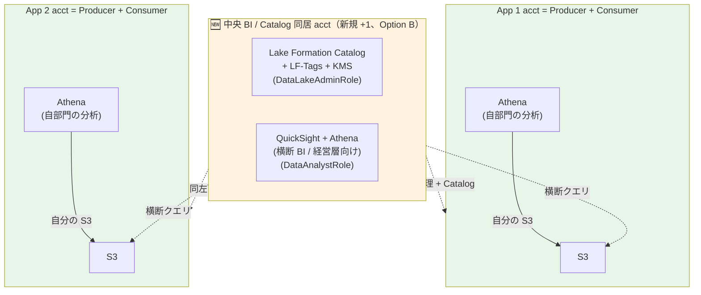
```mermaid
flowchart TB
    subgraph A1["App 1 acct = Producer + Consumer"]
        S1["S3"]
        Q1["Athena<br/>(自部門の分析)"]
    end

    subgraph A2["App 2 acct = Producer + Consumer"]
        S2["S3"]
        Q2["Athena<br/>(自部門の分析)"]
    end

    subgraph BICat["🆕 中央 BI / Catalog 同居 acct（新規 +1、Option B）"]
        Cat["Lake Formation Catalog<br/>+ LF-Tags + KMS<br/>(DataLakeAdminRole)"]
        QS["QuickSight + Athena<br/>(横断 BI / 経営層向け)<br/>(DataAnalystRole)"]
    end

    BICat -.権限管理 + Catalog.-> A1
    BICat -.同左.-> A2
    Q1 -->|自分の S3| S1
    Q2 -->|自分の S3| S2
    BICat -.横断クエリ.-> S1
    BICat -.横断クエリ.-> S2

    style A1 fill:#e8f5e9
    style A2 fill:#e8f5e9
    style BICat fill:#fff3e0
```

**特徴**:
- **追加アカウント = 中央 BI / Catalog 同居の 1 つだけ**（**+1**、Option B 効果）
- 共通ドメインを別アカウントとする場合は **+2 合計**
- 各アプリは自前で自分の分析、中央 BI チームは横断分析
- **中規模以上の組織で最も一般的**
- 同居の責務分離は IAM Role で実装（[§5.5 緩和策](#55-option-b-が成立する条件と緩和策) 参照）

### 4.4 推奨マトリクス（Option B 適用後 + 共通ドメイン込み）

> 数値は **Option B（Catalog 同居 Consumer）適用後 + 共通ドメインアカウント (+1) 込み**の合計追加アカウント数。

| 組織条件 | 推奨パターン | 追加アカウント数 |
|---|:---:|:---:|
| 小規模、専属 BI / データ分析チームなし | **α** | **+2**（独立 Catalog +1、共通ドメイン +1。Option B 不適用）|
| 中央 BI / 経営 KPI ダッシュボードが重要、専属 BI チームあり、組織体制未整備で開始 | **β** ⭐（**仮案選定 = Phase 1**）| **+2**（中央 BI/Catalog 同居 +1、共通ドメイン +1）|
| 中央 BI 体制が整い、各アプリチームの自前分析も可能 | **γ**（業界標準推奨、仮案 Phase 2 移行先）| **+2**（中央 BI/Catalog 同居 +1、共通ドメイン +1）|
| 大規模、複数の分析チーム / ML チームが並行で動く | γ 拡張 | **+3 以上**（Catalog 単独 Option C、複数 Consumer）|
| アプリ側に分析機能を持たせたくない（権限統制重視）| **β** | **+2** |

> **仮案選定の根拠**: アプリチームに分析スキルなし（Q1）+ 専属 BI チームなし（Q4）→ Phase 1 では γ ではなく β、組織が整ったら Phase 2 で γ へ移行（Path C 段階移行、[strawman §4](strawman-proposal.md) 参照）。

---

## 4.5 リソース別コスト試算（徹底版）

### 4.5.1 試算の前提と取得方法

> **データ取得日**: 2026-06-21
> **取得方法**: AWS 公式料金ページ（jp.amazon.com）への WebFetch 並列取得 + AWS 公式ドキュメント参照
> **リージョン**: `ap-northeast-1` (東京) 想定
> **為替**: USD ベース、JPY 換算は省略（運用時に CFO 部門が一括換算）
> **規模想定**: 1,000-3,000 顧客企業、Phase 1 = N アプリ × 平均 100 万件/月の業務データ、中央 BI 利用者 50-100 名
> **注意事項**:
> - **WebFetch では `aws.amazon.com/jp/*/pricing` の動的料金表（リージョン切替）が一部抽出不能**。Tokyo リージョン固有の単価は[**AWS 料金見積もりツール (calculator.aws)**](https://calculator.aws) で最終検証必須
> - 訓練データ時点（2024-2026 安定値）で補完した項目には **🔍 要 Tokyo 単価検証** マークを付与
> - 全項目に AWS 公式 URL を併記。**実発注前は必ず最新公式単価で再試算**すること

### 4.5.2 統合料金一覧表（全配置・全分類）

> 経費精算 SaaS 中規模（100 万件/月、データサイズ 50 GB/月）を想定。Producer アカウントの月額は **1 アプリあたり**。
> **配置場所**: Producer = 各案件アプリアカウント / 中央 = 中央 BI/Catalog アカウント / 横断 = 全アカウント共通
> **必須/任意**: **必須** = 標準アーキテクチャの動作に必要 / **任意** = データソース・要件に応じて採用 / **削除** = 本構成では適用しない（履歴として保持、月額 0）
> **「要Tokyo単価検証」**: WebFetch で Tokyo リージョン固有単価が抽出できなかった項目。AWS Pricing Calculator で最終検証。

| 配置場所 | 分類 | 必須/任意 | サービス | 項目 | 単価($) | 単位 | 月次想定 | 月額($) | 公式URL | 備考 |
|---|---|---|---|---|---|---|---|---|---|---|
| Producer | 取込層 | 必須 | AWS DMS | t3.medium インスタンス | 0.044 | per hour | 720h（常時稼働）| 32 | https://aws.amazon.com/jp/dms/pricing/ | Single-AZ、t3.small なら半額。要Tokyo単価検証。最適化: Compute Savings Plans で 30-40% 削減。残課題: Reserved/SP 発注タイミング |
| Producer | 取込層 | 必須 | AWS DMS | DMS Storage (gp3) | 0.096 | per GB/month | 100 GB | 9.6 | https://aws.amazon.com/jp/dms/pricing/ | DMS インスタンス付帯 EBS。CDC のキュー/バッファ、トランザクションログのマイニング作業領域、LOB キャッシュ、タスクログを保管。CDC 常時稼働で AWS 推奨 100GB（10GB ではバッファ枯渇リスク）。gp2 ($0.115) より gp3 ($0.096) が安価。要Tokyo単価検証 |
| Producer | 取込層 | 必須 | AWS DMS | 同一リージョン内データ転送 | 0 | — | — | 0 | https://aws.amazon.com/jp/dms/pricing/ | 「DMS へのデータ転送はすべて無料」明記 |
| Producer | 取込層 | 任意 | Kinesis Data Firehose | Direct PUT 取込 | 0.029 | per GB | 20 GB（アプリログ）| 0.6 | https://aws.amazon.com/jp/kinesis/data-firehose/pricing/ | 最初の 500 TB/月、5KB 単位切上げ |
| Producer | 取込層 | 任意 | Kinesis Data Firehose | Format Conversion (Parquet) | 0.018 | per GB | 20 GB | 0.4 | https://aws.amazon.com/jp/kinesis/data-firehose/pricing/ | JSON → Parquet 変換オプション |
| Producer | 取込層 | 削除 | Kinesis Data Firehose | VPC delivery（時間料金）| 0.01 | per hour per AZ | — | 0 | https://aws.amazon.com/jp/kinesis/data-firehose/pricing/ | **削除**: Firehose → S3 配信では VPC delivery 課金は発生しない（S3 は AWS パブリックサービス、内部ネットワーク配信）。VPC delivery は配信先が VPC 内（OpenSearch / HTTP endpoint / Splunk Cluster 等）の場合のみ |
| Producer | 取込層 | 削除 | Kinesis Data Firehose | VPC delivery（GB 料金）| 0.01 | per GB | — | 0 | https://aws.amazon.com/jp/kinesis/data-firehose/pricing/ | **削除**: 同上（S3 配信では適用外）|
| Producer | 取込層 | 任意 | AWS AppFlow | Flow Run | 0.001 | per run | 30 回（日次 SaaS 連携）| 0.03 | https://aws.amazon.com/jp/appflow/pricing/ | 成功した実行のみ |
| Producer | 取込層 | 任意 | AWS AppFlow | Data Processing | 0.02 | per GB | 5 GB（外部 SaaS）| 0.1 | https://aws.amazon.com/jp/appflow/pricing/ | 処理データ量 |
| Producer | 取込層 ※オプション | 任意 | AWS Transfer Family | SFTP endpoint | 0.30 | per hour | 720h（採用アプリのみ）| 216 | https://aws.amazon.com/jp/aws-transfer-family/pricing/ | **ベースライン外**。SFTP 連携が必要なアプリのみ。残課題: SFTP 受領が必要な顧客の数。最適化: 必要時のみ起動（$216→$50）または中央集約（$216/月固定でアプリ数に依存しない）。詳細 §4.2.2.8.3 |
| Producer | 取込層 ※オプション | 任意 | AWS Transfer Family | データ転送（Upload/Download）| 0.04 | per GB | 5 GB | 0.2 | https://aws.amazon.com/jp/aws-transfer-family/pricing/ | SFTP/FTPS/FTP 共通 |
| Producer | 取込層 | 必須 | AWS Lambda | リクエスト | 0.20 | per 1M | 100 万回 | 0.04 | https://aws.amazon.com/jp/lambda/pricing/ | 無料枠 1M req/月 → 実質 $0 想定 |
| Producer | 取込層 | 必須 | AWS Lambda | コンピューティング | 0.0000166667 | per GB-second | 256MB × 1s × 100 万回 = 256K GB-s | 4.3 | https://aws.amazon.com/jp/lambda/pricing/ | 無料枠 400K GB-s/月。最適化: Graviton2 で同単価 34% 性能向上（実効単価 25% 減）|
| Producer | ストレージ層 | 必須 | Amazon S3 Standard | raw 層ストレージ | 0.025 | per GB/month | 50 GB（90 日保持）× 3 ヶ月分 = 150 GB | 3.8 | https://aws.amazon.com/jp/s3/pricing/ | 要Tokyo単価検証（Virginia の +9% 程度）。最適化: S3 Lifecycle で raw→Glacier 13 ヶ月以降、80% 削減 |
| Producer | ストレージ層 | 必須 | Amazon S3 Standard | curated/analytics 層（Parquet 圧縮後）| 0.025 | per GB/month | 12.5 GB（75% 圧縮）× 13 ヶ月分 = 162 GB | 4.1 | https://aws.amazon.com/jp/s3/pricing/ | curated 13 ヶ月、analytics 36 ヶ月想定。要Tokyo単価検証 |
| Producer | ストレージ層 | 任意 | Amazon S3 Standard-IA | 13 ヶ月以降の curated | 0.0138 | per GB/month | 0 GB（Phase 1 は未到達）| 0 | https://aws.amazon.com/jp/s3/pricing/ | Lifecycle で IA 移行、最小 30 日。要Tokyo単価検証 |
| Producer | ストレージ層 | 任意 | Amazon S3 Glacier Flexible Retrieval | raw の 90 日後 | 0.0045 | per GB/month | 累積、Phase 1 後半で発生 | 0.3 | https://aws.amazon.com/jp/s3/pricing/ | 取出に 1 分〜12 時間。要Tokyo単価検証。最適化: Lifecycle 活用で長期保管コスト 80% 減 |
| Producer | ストレージ層 | 必須 | Amazon S3 | PUT/POST/COPY リクエスト | 0.0047 | per 1,000 requests | 100 万件 ÷ 1K = 1,000 → ETL バッチで 30 回 = 30K | 0.14 | https://aws.amazon.com/jp/s3/pricing/ | 大量ファイルでなく Parquet ブロック単位なら少ない。要Tokyo単価検証 |
| Producer | ストレージ層 | 必須 | Amazon S3 | GET/SELECT リクエスト | 0.00037 | per 1,000 requests | Athena からの読込数十万 | 0.4 | https://aws.amazon.com/jp/s3/pricing/ | クエリ頻度依存。要Tokyo単価検証 |
| Producer | ストレージ層 | 任意 | Amazon S3 | Lifecycle Transition リクエスト | 0.01 | per 1,000 requests | 月数百 | 0.01 | https://aws.amazon.com/jp/s3/pricing/ | Standard → IA → Glacier 移行時。要Tokyo単価検証 |
| Producer | Glue 層 | 必須 | AWS Glue ETL Flex | DPU-hour | 0.29 | per DPU-hour | 2 DPU × 0.5h × 30 日 = 30 DPU-h | 8.7 | https://aws.amazon.com/jp/glue/pricing/ | 要Tokyo単価検証。最適化: Standard $0.44 から Flex $0.29 で 34% 減（SLA 不要時に Flex を選択）|
| Producer | Glue 層 | 任意 | AWS Glue ETL Standard | DPU-hour | 0.44 | per DPU-hour | Phase 1 は Flex のみ | 0 | https://aws.amazon.com/jp/glue/pricing/ | 1 分単位、最小 1 分 |
| Producer | Glue 層 | 必須 | AWS Glue Crawler | DPU-hour | 0.44 | per DPU-hour | 0.5 DPU × 0.2h × 30 日 = 3 DPU-h | 1.3 | https://aws.amazon.com/jp/glue/pricing/ | 最小 10 分 |
| Producer | Glue 層 | 任意 | AWS Glue Data Quality | DPU-hour | 0.44 | per DPU-hour | 2 DPU × 0.1h × 30 日 = 6 DPU-h | 2.6 | https://aws.amazon.com/jp/glue/pricing/ | 品質ルール実行 |
| Producer | Glue 層 | 必須 | AWS Glue Data Catalog | ストレージ（100K オブジェクト/月）| 1.00 | per 100K objects/month | 10K objects（無料枠内）| 0 | https://aws.amazon.com/jp/glue/pricing/ | 最初の 100 万オブジェクト無料 |
| Producer | Glue 層 | 必須 | AWS Glue Data Catalog | リクエスト | 1.00 | per 1M requests | 数十万（無料枠内）| 0 | https://aws.amazon.com/jp/glue/pricing/ | 最初の 100 万リクエスト/月無料 |
| Producer | Glue 層 | 任意 | AWS Glue Schema Registry | スキーマ管理 | 0 | — | — | 0 | https://aws.amazon.com/jp/glue/pricing/ | 完全無料 |
| Producer | オーケスト層 | 必須 | AWS Step Functions Standard | 状態遷移 | 0.000025 | per state transition | 30 日 × 50 遷移 = 1,500 | 0.04 | https://aws.amazon.com/jp/step-functions/pricing/ | 無料枠 4K/月、Tokyo 単価は Virginia 換算 |
| Producer | オーケスト層 | 必須 | Amazon EventBridge Scheduler | 起動 | 1.00 | per 1M invocations | 月 30 起動（日次）| 0 | https://aws.amazon.com/jp/eventbridge/pricing/ | 無料枠 14M/月内 |
| Producer | オーケスト層 | 必須 | Amazon CloudWatch Logs | Ingestion | 0.50 | per GB | 17 GB（内訳: Glue ETL Spark 10GB + Lambda/Crawler 2GB + DMS 2GB + その他 3GB）- 無料枠 5GB = 12 GB 課金対象 | 6.0 | https://aws.amazon.com/jp/cloudwatch/pricing/ | 主要発生源: ①Glue ETL Spark ログ（Continuous Logging が最大要因、デフォルト ON で 数 GB/ジョブ）②DMS Replication Task ログ ③Lambda stdout/stderr ④Crawler / Step Functions ログ。最適化: Continuous Logging 無効化（`--enable-continuous-cloudwatch-log: false`）で 80% 削減 / ログレベル INFO→WARN で 50% 削減 / 不要 Container Insights 除外 |
| Producer | オーケスト層 | 必須 | Amazon CloudWatch Logs | Storage（アーカイブ）| 0.03 | per GB/month | 累積 51 GB（90 日 Retention 想定、17 GB × 3 ヶ月）| 1.5 | https://aws.amazon.com/jp/cloudwatch/pricing/ | デフォルト「Never expire」だと累積拡大。最適化: Retention 90 日設定で 80% 削減（無設定の 13 ヶ月分に対し） |
| Producer | オーケスト層 | 必須 | Amazon CloudWatch Alarms | Standard | 0.10 | per alarm/month | 20 アラーム | 2 | https://aws.amazon.com/jp/cloudwatch/pricing/ | 無料枠 10 アラーム |
| Producer | オーケスト層 | 任意 | Amazon CloudWatch | カスタムメトリクス | 0.30 | per metric/month | 30 メトリクス | 6 | https://aws.amazon.com/jp/cloudwatch/pricing/ | 無料枠 10 メトリクス |
| Producer | オーケスト層 | 必須 | Amazon CloudWatch | API Requests | 0.01 | per 1,000 requests | 数千リクエスト | 0.05 | https://aws.amazon.com/jp/cloudwatch/pricing/ | 無料枠 100 万/月 |
| Producer | オーケスト層 | 任意 | Amazon SNS | 通知 | 0.50 | per 1M publishes | 数百件 | 0.01 | https://aws.amazon.com/jp/sns/pricing/ | Slack/Teams 通知。要Tokyo単価検証 |
| 中央 | カタログ層 | 必須 | AWS Lake Formation | 全機能（LF-Tag, Data Filter, Cross-account Grants 含む）| 0 | — | — | 0 | https://aws.amazon.com/jp/lake-formation/pricing/ | 「無料で提供」と明記 |
| 中央 | カタログ層 | 任意 | AWS Lake Formation Storage Optimizer | スキャンバイト | バイト単位（MB 単位切上げ）| per byte | テーブル数次第 | 数 $ | https://aws.amazon.com/jp/lake-formation/pricing/ | テーブル圧縮機能 |
| 中央 | カタログ層 | 必須 | AWS Glue Data Catalog（中央）| Federation 集約分 | 0 | — | 追加コスト最小 | 0 | https://aws.amazon.com/jp/glue/pricing/ | 無料枠で吸収 |
| 中央 | カタログ層 | 必須 | AWS KMS | CMK 鍵管理 | 1.00 | per key/month | 5 鍵（中央共通 / BI 探索 / Reader / 監査 / Producer 共通）| 5 | https://aws.amazon.com/jp/kms/pricing/ | 削除予定鍵は無料 |
| 中央 | カタログ層 | 必須 | AWS KMS | API リクエスト | 0.03 | per 10K requests | 100 万 req（S3/Athena/QS 暗号化操作）| 3 | https://aws.amazon.com/jp/kms/pricing/ | 無料枠 20K/月 |
| 中央 | Athena 層 | 必須 | Amazon Athena Standard On-Demand | スキャン量 | 5.00 | per TB scanned | 300 GB スキャン/月（**想定、Parquet + パーティション + Partition Projection + Result Reuse 前提**）。レンジ: **最良 100 GB / 想定 300 GB / 最悪 1,000 GB**。最小 10MB/クエリ | 1.5 | https://aws.amazon.com/jp/athena/pricing/ | 要Tokyo単価検証。**料金は設計次第で 10-1000 倍変動**: ①ファイル形式（CSV/JSON だと Parquet の 10 倍） ②列指定（SELECT * は 10 倍）③パーティション指定（無視で全走査）④`LIMIT` は効かない（全スキャン後トリミング）。**Glue Catalog Partition Projection 採用が前提**（[§FR-4.1](proposal/fr/04-consumption.md) / Partition 数 1M 超で Glue 課金回避）。最適化: ①Parquet+Snappy 圧縮で 75-90% 削減 ②パーティション設計（tenant_id + 日付）で 50-99% 削減 ③Result Reuse で 30-70% ヒット ④CTAS で集計テーブル化（参照側 90-99% 削減）⑤Workgroup スキャン量上限必須（暴走防止）。DDL（CREATE/ALTER/DROP/SHOW/DESCRIBE）は無料、失敗クエリも無料。残課題: SPICE 未使用時は 10 倍 = $15/月 |
| 中央 | Athena 層 | 任意 | Amazon Athena Provisioned Capacity（Phase 3+ 候補）| DPU-hour | 0.30 | per DPU-hour | Phase 1 は不採用 | 0 | https://aws.amazon.com/jp/athena/pricing/ | 最小 4 DPU、損益分岐 175 TB/月 |
| 中央 | Athena 層 | 任意 | Amazon Athena Spark（Phase 3+ 候補）| DPU-hour | 0.35 | per DPU-hour | 不採用 | 0 | https://aws.amazon.com/jp/athena/pricing/ | ML 前処理用、Phase 1 は SageMaker Studio |
| 中央 | Athena 層 | 任意 | Amazon Athena Result Reuse | キャッシュ | 0 | — | キャッシュヒット率 30% 想定 | -0.15 | https://aws.amazon.com/jp/athena/pricing/ | 最適化: 同一クエリのキャッシュヒットで再スキャン削減 |
| 中央 | QuickSight 層 | 必須 | Amazon QuickSight Author | ユーザー単価 | 24 | per user/month | 中央 BI Author 5 名 | 120 | https://aws.amazon.com/jp/quicksight/pricing/ | 年契約、月契約は $33 |
| 中央 | QuickSight 層 | 任意 | Amazon QuickSight Author Pro | ユーザー単価 + 基盤費 | 40 + 250 | per user/month + 月額固定 | Phase 1 は通常 Author のみ | 0 | https://aws.amazon.com/jp/quicksight/pricing/ | Q & Paginated Reports 込み、5 名以上で検討 |
| 中央 | QuickSight 層 | 必須 | Amazon QuickSight Reader（旧 Named）| ユーザー単価 | 3 | per user/month | 50 名 | 150 | https://aws.amazon.com/jp/quicksight/pricing/ | 月額上限あり、Author の 1/8 単価。残課題: 最終想定数（50/100/300）。最適化: 50 名超で Reader Capacity Pricing 検討（$250/月〜、Named より安価）|
| 中央 | QuickSight 層 | 任意 | Amazon QuickSight Reader Pro | ユーザー単価 + 基盤費 | 20 + 250 | per user/month + 月額固定 | Phase 1 不採用 | 0 | https://aws.amazon.com/jp/quicksight/pricing/ | Q を Reader に開放したい場合 |
| 中央 | QuickSight 層 | 必須 | Amazon QuickSight SPICE | 容量 | 0.38 | per GB/month | 92 GB - 50 GB（Author 5 名 × 10 GB 無料）= 42 GB 課金 | 16 | https://aws.amazon.com/jp/quicksight/pricing/ | Author 1 名あたり 10 GB 無料、Reader 10 GB 無料。最適化: Full → Incremental Refresh で 80% 削減 |
| 中央 | QuickSight 層 | 任意 | Amazon QuickSight Paginated Reports | レポート単位 | 1.00 | per report unit | 月 100 件 | 100 | https://aws.amazon.com/jp/quicksight/pricing/ | 月次レポート用、500 件 = $500 |
| 中央 | 結果・派生データ | 必須 | Amazon S3（central-derived）| Parquet 派生データ | 0.025 | per GB/month | 50 GB（月次集計・ML 特徴量等）| 1.3 | https://aws.amazon.com/jp/s3/pricing/ | 12-24 ヶ月保持。要Tokyo単価検証 |
| 中央 | 結果・派生データ | 必須 | Amazon S3（athena-results × 5 WG）| 一時クエリ結果 | 0.025 | per GB/month | 10 GB（7-90 日 Lifecycle 後）| 0.25 | https://aws.amazon.com/jp/s3/pricing/ | 5 バケットでも合計 10 GB。要Tokyo単価検証 |
| 中央 | 結果・派生データ | 必須 | Amazon S3（audit-results、7 年 Object Lock）| 監査結果 | 0.025 + 0.0125（Glacier 移行後）| per GB/month | 累積（Phase 1 で 20 GB）| 0.5 | https://aws.amazon.com/jp/s3/pricing/ | Object Lock 7 年。残課題: 監査ログ保持年数（1/3/7 年）。要Tokyo単価検証 |
| 中央 | 結果・派生データ | 必須 | Amazon S3（central-common-domain）| 顧客マスタ等 | 0.025 | per GB/month | 5 GB | 0.13 | https://aws.amazon.com/jp/s3/pricing/ | D-2 同居。要Tokyo単価検証 |
| 中央 | 結果・派生データ | 必須 | Amazon S3 | リクエスト（全 5 バケット合算 PUT + GET）| 上記単価 | 各 | 全体で数十万 | 1 | https://aws.amazon.com/jp/s3/pricing/ | クエリ頻度依存。要Tokyo単価検証 |
| 中央 | ML 層（Phase 2）| 任意 | Amazon SageMaker Studio Notebook | ml.t3.medium | 0.05 | per hour | 100h/月（試行）| 5 | https://aws.amazon.com/jp/sagemaker-ai/pricing/ | 無料枠 250h × 2 ヶ月。要Tokyo単価検証。残課題: Phase 2 の ML 利用規模 |
| 中央 | ML 層（Phase 2）| 任意 | Amazon SageMaker Training | ml.m5.large | 0.115 | per hour | 50h/月（解約予兆モデル訓練）| 5.8 | https://aws.amazon.com/jp/sagemaker-ai/pricing/ | バッチ訓練。要Tokyo単価検証 |
| 中央 | ML 層（Phase 2）| 任意 | Amazon SageMaker Inference Endpoint | ml.m5.large | 0.115 | per hour | 720h × 1 endpoint | 83 | https://aws.amazon.com/jp/sagemaker-ai/pricing/ | リアルタイム推論用、Phase 2 で要件確定後。要Tokyo単価検証。残課題: Inference 常時稼働の有無。最適化: Compute Savings Plans で 30-40% 削減 |
| 中央 | ML 層（Phase 2）| 任意 | Amazon SageMaker Storage（EBS gp3）| ストレージ | 0.10 | per GB/month | 100 GB | 10 | https://aws.amazon.com/jp/sagemaker-ai/pricing/ | Notebook ボリューム。要Tokyo単価検証 |
| 横断 | リソース共有 | 必須 | AWS RAM | リソース共有 | 0 | — | — | 0 | https://aws.amazon.com/jp/ram/pricing/ | クロスアカウント共有の基盤、完全無料 |
| 横断 | 監査ログ | 必須 | AWS CloudTrail Management Events | 直近 90 日のイベント履歴 | 0 | — | — | 0 | https://aws.amazon.com/jp/cloudtrail/pricing/ | アカウントごとに 1 つ目の Trail は無料 |
| 横断 | 監査ログ | 必須 | AWS CloudTrail Data Events（S3）| データプレーン操作 | 0.10 | per 100K events | 中央 + Producer 10 アカウント × 月 1M events = 10M | 10 | https://aws.amazon.com/jp/cloudtrail/pricing/ | S3 Object 操作の追跡 |
| 横断 | 監査ログ | 任意 | AWS CloudTrail Insights（Management）| 分析イベント | 0.35 | per 100K events analyzed | 中央のみ、月 5M analyzed | 17.5 | https://aws.amazon.com/jp/cloudtrail/pricing/ | 異常検知（PutBucketPolicy 急増等）|
| 横断 | 監査ログ | 任意 | AWS CloudTrail Lake | データ取込（1 年保持）| 0.75 | per GB | 月 5 GB | 3.75 | https://aws.amazon.com/jp/cloudtrail/pricing/ | 一元検索基盤。残課題: 監査ログ保持年数（1/3/7 年） |
| 横断 | 監査ログ | 任意 | AWS CloudTrail Lake | クエリ（スキャン量）| 0.005 | per GB scanned | 月 100 GB スキャン | 0.5 | https://aws.amazon.com/jp/cloudtrail/pricing/ | 監査調査時のみ |
| 横断 | 監査ログ | 任意 | Amazon VPC Flow Logs | CloudWatch Logs 送信 | 0.50 | per GB | 10 GB（中規模 VPC、CloudWatch 送信設定時のみ）| 5.0 | https://aws.amazon.com/jp/cloudwatch/pricing/ | デフォルト CloudWatch 送信は割高。**推奨: S3 直送に変更**で $0.05/GB → 月 $0.5（10 倍削減）。VPC のトラフィック量に比例。要Tokyo単価検証。最適化: S3 送信 + Lifecycle で月 $4.5 削減 |
| 横断 | ネットワーク | 必須 | AWS PrivateLink VPC Interface Endpoint | 時間料金 | 0.01 | per hour per AZ | 8 endpoints × 3 AZ × 720h = 17,280 | 172.8 | https://aws.amazon.com/jp/privatelink/pricing/ | Glue / Athena / LF / KMS / STS / CloudWatch / CloudTrail / Firehose（Producer の Lambda/ECS から PutRecord する場合に Firehose 用 EP 追加）。S3/DynamoDB は Gateway Endpoint（無料）を使用。要Tokyo単価検証。最適化: 不要 EP の棚卸し、AZ 数の最小化（Multi-AZ 必須でないなら 2 AZ で月 $58 削減）|
| 横断 | ネットワーク | 必須 | AWS PrivateLink VPC Interface Endpoint | データ処理 | 0.01 | per GB processed | 100 GB | 1 | https://aws.amazon.com/jp/privatelink/pricing/ | 段階単価、1 PB 超で $0.006 |
| 横断 | ネットワーク | 必須 | AWS PrivateLink VPC Gateway Endpoint | S3 / DynamoDB | 0 | — | — | 0 | https://aws.amazon.com/jp/privatelink/pricing/ | 完全無料、優先的に使用 |
| 横断 | 構成監視 | 必須 | AWS Config | 継続記録項目 | 0.003 | per Configuration Item | 月 10,000 items | 30 | https://aws.amazon.com/jp/config/pricing/ | リソース変更履歴 |
| 横断 | 構成監視 | 任意 | AWS Config Rules | 評価 | 0.001 | per evaluation | 月 100K 評価 | 100 | https://aws.amazon.com/jp/config/pricing/ | 最初の 10 万件単価、以後段階値引き |
| 横断 | データ転送 | 必須 | AWS データ転送 | 同一リージョン内・AZ 内 | 0 | — | — | 0 | https://aws.amazon.com/jp/vpc/pricing/ | 同一 AZ は無料 |
| 横断 | データ転送 | 必須 | AWS データ転送 | クロス AZ（同一リージョン）| 0.01 | per GB | 50 GB | 0.5 | https://aws.amazon.com/jp/vpc/pricing/ | EC2/RDS 等、受信側課金。要Tokyo単価検証 |
| 横断 | データ転送 | 任意 | AWS データ転送 | インターネット egress（外向き）| 0.114 | per GB | 5 GB（小規模）| 0.6 | https://aws.amazon.com/jp/vpc/pricing/ | Tokyo 最初 10 TB。QuickSight Embedded 等で発生。要Tokyo単価検証。残課題: インターネット egress の量 |

#### 4.5.2.A 配置場所別の小計

| 配置場所 | カテゴリ | 月額($) |
|---|---|---|
| **Producer**（1 アプリ）| 取込層（ベースライン）| 47 |
| Producer（1 アプリ）| 取込層（Transfer Family 採用時 = +216）| 263 |
| Producer（1 アプリ）| ストレージ層 | 9 |
| Producer（1 アプリ）| Glue 層 | 13 |
| Producer（1 アプリ）| オーケスト層 | 16 |
| **Producer 合計**（ベースライン、1 アプリ）| | **85** |
| **Producer 合計**（Transfer Family 採用、1 アプリ）| | **301** |
| **中央**（Phase 1）| カタログ層 | 8 |
| 中央（Phase 1）| Athena 層 | 1.5 |
| 中央（Phase 1）| QuickSight 層 | 386 |
| 中央（Phase 1）| 結果・派生データ | 3 |
| 中央（Phase 2）| ML 層（+SageMaker）| 104 |
| **中央 合計**（Phase 1）| | **399** |
| **中央 合計**（Phase 2）| | **503** |
| **横断**| リソース共有 + 監査ログ + ネットワーク + 構成監視 + データ転送（VPC Flow Logs は CloudWatch 送信時 +$5）| **342** |

#### 4.5.2.B 必須/任意の行数集計（参考）

| 必須/任意 | Producer | 中央 | 横断 | 合計 |
|---|---:|---:|---:|---:|
| **必須** | 19 | 13 | 9 | **41** |
| **任意** | 14 | 11 | 6 | **31** |
| **削除** | 2 | 0 | 0 | **2** |
| **合計** | **35** | **24** | **15** | **74** |

→ **必須 41 項目**を採用すれば標準アーキテクチャは動作。**任意 31 項目**は要件・データソース・Phase に応じてオン/オフを判断する。

---

### 4.5.3 全体合計（Phase 1）

**ベースライン構成**（Transfer Family を含まない）:

| カテゴリ | 内訳 | 月額 |
|---|---|---|
| **Producer アカウント** | $85/アプリ × N | $85 × N |
| **中央 BI / Catalog アカウント** | 単一 | $399 |
| **横断インフラ** | 全アカウント分散負担（VPC Flow Logs 込み）| $342 |
| **合計（1 アプリ時）** | $85 + $399 + $342 | **~$826/月** |
| **合計（5 アプリ時）** | $85 × 5 + $399 + $342 | **~$1,166/月** |
| **合計（10 アプリ時）** | $85 × 10 + $399 + $342 | **~$1,591/月** |
| **合計（20 アプリ時）** | $85 × 20 + $399 + $342 | **~$2,441/月** |

**Transfer Family 採用時の加算**（オプション、SFTP 連携必要なアプリ数 × $216）:

| Transfer Family 配置 | 加算コスト | 想定ケース |
|---|---|---|
| Producer 個別配置（2 アプリ採用想定）| **+$432/月** | カード連携 1 アプリ + 顧客 HR 連携 1 アプリ |
| Producer 個別配置（5 アプリ採用想定）| **+$1,080/月** | SFTP 連携が広く必要な業種 |
| **中央 1 個に集約**（推奨）| **+$216/月固定** | アプリ数によらず 1 個、ディレクトリ単位で振分け |
| 不採用（API のみ） | $0 | レガシー連携なし |

→ **典型ケース（10 アプリ + 中央集約 SFTP 1 個）= $1,591 + $216 = ~$1,807/月**

**Phase 2 追加（SageMaker + リソース増分）**:

| 追加項目 | 月額 |
|---|---|
| SageMaker（ML 開発）| +$104 |
| QuickSight Reader 増（50→150 名）| +$300 |
| Athena スキャン量増（100 GB → 500 GB）| +$2 |
| SPICE 容量増（92 GB → 200 GB）| +$28 |
| **Phase 2 増分小計** | **+$434/月** |

→ Phase 2 全体（ベースライン + Transfer Family 中央集約）: 10 アプリで **~$2,241/月**、20 アプリで **~$3,091/月**

> **比較参考**: 既存の SaaS BI（Tableau Cloud 等）を採用した場合、Author 単価 $70/月、Viewer 単価 $15/月で、同規模で月 $1,500-3,000 のライセンス費のみで上記試算と同等以上。AWS ネイティブの方がトータルで安価かつ統合度が高い。

---

### 4.5.4 コスト最適化の主要レバー（10 項目）

| # | 最適化レバー | 削減効果 | 実施タイミング |
|---|---|---|---|
| 1 | **Glue ETL Flex 採用**（Standard $0.44 → Flex $0.29、34% 削減）| Producer 各アプリで月 $5-10 | Phase 1 から |
| 2 | **Parquet + パーティション**（Athena スキャン量 75% 削減）| Athena 月 $0.4 → $0.1 | Phase 1 から |
| 3 | **SPICE Incremental Refresh**（Full → Incremental で 80% 削減）| QuickSight Athena スキャン $325 → $65 | Phase 1 から |
| 4 | **Athena Result Reuse**（同一クエリのキャッシュヒット 30%）| Athena スキャン量さらに 30% 削減 | Phase 1 から |
| 5 | **VPC Gateway Endpoint（S3, DynamoDB）優先** | Interface 比 $20/月削減 | Phase 1 から |
| 6 | **S3 Lifecycle**（raw → Glacier、13 ヶ月以降）| ストレージ 80% 削減 | Phase 1 後半から |
| 7 | **Transfer Family の常時稼働回避**（必要時のみ起動）| SFTP $216 → $50 程度 | Phase 1 から |
| 8 | **Reader Capacity Pricing 検討**（Reader 50+ 名超）| 月 $250〜（Named より安）| Phase 2 で |
| 9 | **Compute Savings Plans / Reserved Instance**（DMS, SageMaker）| 30-40% 削減 | 1 年継続見込みで |
| 10 | **Lambda Graviton2**（同単価で 34% 性能向上）| 実効単価 25% 削減 | Phase 1 から |

→ 上記レバー全適用で **月コストの 20-30% 削減**が現実的（Phase 1 で月 $700-1,000 削減効果）。

---

### 4.5.5 コスト試算の残課題（ヒアリング項目）

| # | 質問 | 影響 |
|---|---|---|
| 1 | Producer 案件数の現実的な見通し（Phase 1 で 5/10/20）| 全体コストの 70-80% を占める Producer 数の確定 |
| 2 | SFTP 受領が必要な顧客の数（Transfer Family の必要性）| Transfer Family $216/月をどこまで広げるか |
| 3 | QuickSight Reader の最終想定数（50/100/300）| ライセンス vs Capacity Pricing の損益分岐 |
| 4 | 監査ログの保持年数（1 年 / 3 年 / 7 年）| CloudTrail Lake 取込・保管コスト |
| 5 | Phase 2 の SageMaker 利用規模（Inference 常時稼働 yes/no）| 推論エンドポイント $83/月の発生有無 |
| 6 | データ転送のインターネット egress の量（Embedded ダッシュ等）| egress $0.114/GB の負担 |
| 7 | Reserved / Savings Plans の発注タイミング（Phase 1 で確約可能か）| 30-40% コスト削減のタイミング |
| 8 | AWS Pricing Calculator での正式試算実施者 | 最終単価の保証 |

---

### 4.5.6 必須項目のみの構成図

§4.5.2 統合料金一覧表で「**必須**」フラグを付けた **41 項目のみ**を抽出した構成図。任意 31 項目（Firehose / AppFlow / Transfer Family / SageMaker / IA-Glacier / Provisioned Capacity / VPC Flow Logs 等）と削除 2 項目は含まない。

**ファイル**:

| 形式 | ファイル | 用途 |
|---|---|---|
| Mermaid | [drawio/required-architecture.mmd](drawio/required-architecture.mmd) | Markdown レビュー / GitHub Preview |
| drawio | [drawio/required-architecture.drawio](drawio/required-architecture.drawio) | プレゼン・印刷・編集（VS Code 拡張 / diagrams.net）|
| 説明 | [drawio/README.md](drawio/README.md) | 配置方針 + 更新ルール |

**含まれる必須リソース**（41 項目の AWS サービス内訳）:

| 配置場所 | AWS サービス（必須項目） | 数 |
|---|---|---|
| Producer（1 アプリ）| DMS / Lambda / S3 Medallion (raw/curated/analytics + 各リクエスト) / Glue (ETL Flex + Crawler + Catalog) / Step Functions / EventBridge Scheduler / CloudWatch (Logs Ingestion+Storage+Alarms+API Requests) | 19 |
| 中央 BI / Catalog | Lake Formation / Glue Data Catalog（中央）/ KMS (CMK + Requests) / Athena Standard / QuickSight (Author + Reader + SPICE) / S3 (central-derived + athena-results + audit-results + common-domain + Requests) | 13 |
| 横断インフラ | RAM / CloudTrail (Management + Data Events) / VPC Interface Endpoint (時間 + データ) / VPC Gateway Endpoint / AWS Config / データ転送 (同一AZ + クロスAZ) | 9 |

**Phase 1 月額**: 10 アプリで **~$1,591/月**（必須のみ採用時）。詳細は §4.5.3 全体合計参照。

**Mermaid 概要図**（コンパクト版）:

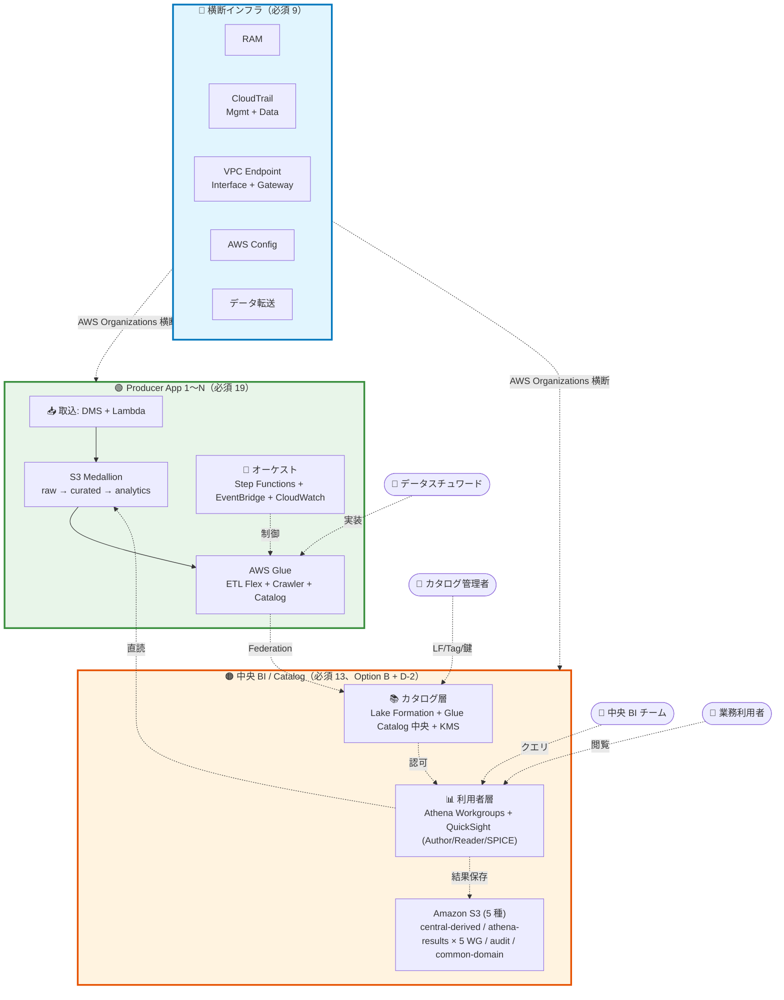
```mermaid
flowchart TB
    Steward(["👤 データスチュワード"])
    Admin(["👤 カタログ管理者"])
    Analyst(["👤 中央 BI チーム"])
    Reader(["👤 業務利用者"])

    subgraph App["🟢 Producer App 1〜N（必須 19）"]
        direction TB
        Ingest["📥 取込: DMS + Lambda"]
        S3M["S3 Medallion<br/>raw → curated → analytics"]
        Glue["AWS Glue<br/>ETL Flex + Crawler + Catalog"]
        Orch["🔁 オーケスト<br/>Step Functions + EventBridge + CloudWatch"]
        Ingest --> S3M --> Glue
        Orch -.制御.-> Glue
    end

    subgraph Central["🟠 中央 BI / Catalog（必須 13、Option B + D-2）"]
        direction TB
        Cat["📚 カタログ層<br/>Lake Formation + Glue Catalog 中央 + KMS"]
        User["📊 利用者層<br/>Athena Workgroups + QuickSight (Author/Reader/SPICE)"]
        S3C["Amazon S3 (5 種)<br/>central-derived / athena-results × 5 WG / audit / common-domain"]
        Cat -.認可.-> User
        User -.結果保存.-> S3C
    end

    subgraph Cross["🔵 横断インフラ（必須 9）"]
        direction LR
        RAM[RAM]
        CTrail[CloudTrail<br/>Mgmt + Data]
        VPCEP[VPC Endpoint<br/>Interface + Gateway]
        Config[AWS Config]
        DT[データ転送]
    end

    Steward -.実装.-> Glue
    Admin -.LF/Tag/鍵.-> Cat
    Analyst -.クエリ.-> User
    Reader -.閲覧.-> User

    Glue -.Federation.-> Cat
    User -.直読.-> S3M
    Cross -.AWS Organizations 横断.-> App
    Cross -.AWS Organizations 横断.-> Central

    style App fill:#e8f5e9,stroke:#388e3c,stroke-width:3px
    style Central fill:#fff3e0,stroke:#e65100,stroke-width:3px
    style Cross fill:#e1f5fe,stroke:#0277bd,stroke-width:3px
```

→ **詳細版**（アクター・データフロー・暗号化・全リソース表示）は [drawio/required-architecture.mmd](drawio/required-architecture.mmd) を参照。

**更新方針**: 設計変更で必須/任意の分類が変わった場合は、§4.5.2 統合表 + Mermaid + drawio の 3 箇所を同期更新。

---

### 4.5.7 公式リソース一覧（再掲）

| サービス | 公式料金ページ |
|---|---|
| AWS Pricing Calculator（最終検証）| https://calculator.aws |
| Amazon Athena | https://aws.amazon.com/jp/athena/pricing/ |
| AWS Glue | https://aws.amazon.com/jp/glue/pricing/ |
| Amazon QuickSight | https://aws.amazon.com/jp/quicksight/pricing/ |
| Amazon S3 | https://aws.amazon.com/jp/s3/pricing/ |
| AWS KMS | https://aws.amazon.com/jp/kms/pricing/ |
| AWS Lake Formation | https://aws.amazon.com/jp/lake-formation/pricing/ |
| AWS DMS | https://aws.amazon.com/jp/dms/pricing/ |
| Amazon Data Firehose | https://aws.amazon.com/jp/kinesis/data-firehose/pricing/ |
| Amazon AppFlow | https://aws.amazon.com/jp/appflow/pricing/ |
| AWS Transfer Family | https://aws.amazon.com/jp/aws-transfer-family/pricing/ |
| AWS Lambda | https://aws.amazon.com/jp/lambda/pricing/ |
| AWS Step Functions | https://aws.amazon.com/jp/step-functions/pricing/ |
| Amazon EventBridge | https://aws.amazon.com/jp/eventbridge/pricing/ |
| Amazon CloudWatch | https://aws.amazon.com/jp/cloudwatch/pricing/ |
| AWS CloudTrail | https://aws.amazon.com/jp/cloudtrail/pricing/ |
| AWS PrivateLink / VPC | https://aws.amazon.com/jp/privatelink/pricing/ |
| Amazon SageMaker AI | https://aws.amazon.com/jp/sagemaker-ai/pricing/ |
| AWS Config | https://aws.amazon.com/jp/config/pricing/ |
| AWS RAM | https://aws.amazon.com/jp/ram/pricing/ |

> **「要Tokyo単価検証」マーク**（§4.5.2 備考列内）= WebFetch で Tokyo リージョン固有単価が抽出できなかった項目。AWS Pricing Calculator で最終検証を必須とする。
> **WebFetch で確認済み**（Tokyo リージョンで同一単価）: Lake Formation / KMS / QuickSight / Lambda / CloudWatch / CloudTrail / Step Functions / EventBridge / AppFlow / Transfer Family / Config / Firehose / Glue Catalog 無料枠。

---

## 5. Catalog vs Governance — 用語整理と配置 3 オプション

### 5.1 「Catalog Account」と「Governance Account」の用語

AWS 公式ドキュメント内で**両方の用語が使われており、スコープが違う**ものに付けられている:

| AWS ドキュメント | 使用用語 | スコープ |
|---|---|---|
| [Prescriptive Guidance: Data Mesh](https://docs.aws.amazon.com/prescriptive-guidance/latest/strategy-data-mesh/aws-offerings-data-mesh.html) | 「Central Account」「Governance Account」 | 広め（Catalog + permission + 監査）|
| [Lake Formation Cross-Account 公式](https://docs.aws.amazon.com/lake-formation/latest/dg/cross-account-permissions.html) | **「Central Catalog Account」** | 狭い（Catalog + permission のみ）|
| [DataZone Multi-Account](https://docs.aws.amazon.com/datazone/latest/userguide/working-with-accounts.html) | 「Domain Account」 | Catalog + Domain |
| [Secure Data Mesh Solutions](https://aws.amazon.com/solutions/guidance/secure-data-mesh-with-distributed-data-asset-ownership-on-aws) | 「Central Governance Account」 | 広め |
| [AWS Landing Zone Accelerator](https://aws.amazon.com/solutions/implementations/landing-zone-accelerator-on-aws/) | 「Audit Account」「Log Archive Account」 | 監査は別建て |

**用語の本質**: 「Governance Account」は複数責務を束ねた**包括用語**で、実装上は分解されることが多い。

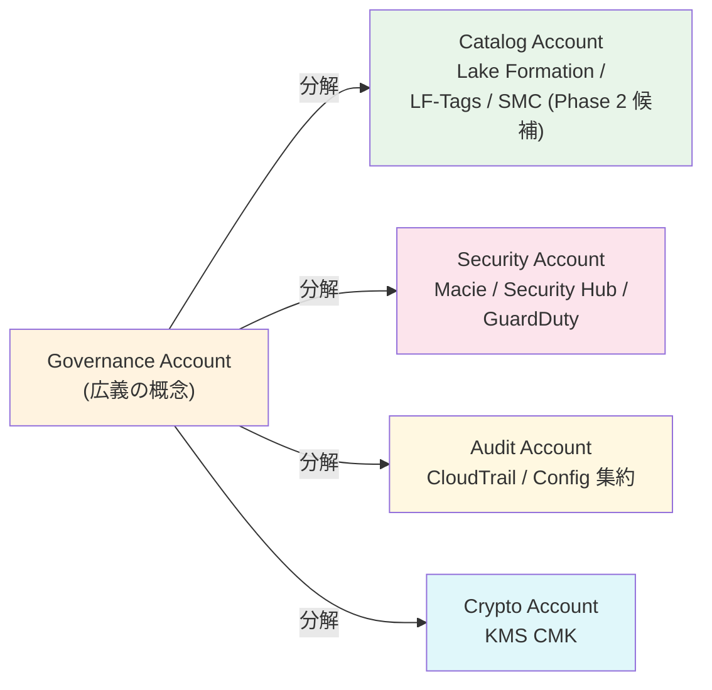
```mermaid
flowchart LR
    Broad["Governance Account<br/>(広義の概念)"]
    Broad -->|分解| Cat["Catalog Account<br/>Lake Formation /<br/>LF-Tags / SMC (Phase 2 候補)"]
    Broad -->|分解| Sec["Security Account<br/>Macie / Security Hub /<br/>GuardDuty"]
    Broad -->|分解| Audit["Audit Account<br/>CloudTrail / Config 集約"]
    Broad -->|分解| Crypto["Crypto Account<br/>KMS CMK"]

    style Broad fill:#fff3e0
    style Cat fill:#e8f5e9
    style Sec fill:#fce4ec
    style Audit fill:#fff8e1
    style Crypto fill:#e0f7fa
```

### 5.2 既存アカウント体系を活かす責務再配置

ユーザー環境では**親会社統制アカウントが Audit / Security 集約を担う**ことを前提に、責務を再配置できる:

| 責務 | 元の置き場（§2 仮案）| 親会社統制を活かす場合 |
|---|---|---|
| CloudTrail Org Trail | Governance | **親会社統制（既存）** |
| Security Hub 集約 | Governance | **親会社統制（既存）** |
| GuardDuty 集約 | Governance | **親会社統制（既存）** |
| Macie 集約 | Governance | **親会社統制（要確認）** |
| Lake Formation Catalog | Governance | **Catalog Account（新規）** |
| LF-Tags | Governance | 同上 |
| DataZone / SageMaker Catalog（オプション）| Governance | 同上（**Phase 1 では不採用、[DP-ADR-001](adr/DP-ADR-001-sagemaker-catalog-adoption-deferred.md) で Phase 2 再評価**）|
| KMS CMK（データ専用）| Governance | Catalog Account or 既存 Crypto |
| 共通参照データ | 共通ドメイン | 共通ドメイン（変わらず）|

→ **「Governance Account」と呼ぶ必要が薄れ、実質「Catalog Account」だけで足りる可能性**。

> ⚠ **要ヒアリング確認（Q1）**: 親会社統制が Macie / Security Hub / GuardDuty / Config Aggregator の集約を実際に担当しているか。担当範囲次第で Catalog Account のスコープが変わる。

### 5.3 配置 3 オプションの比較

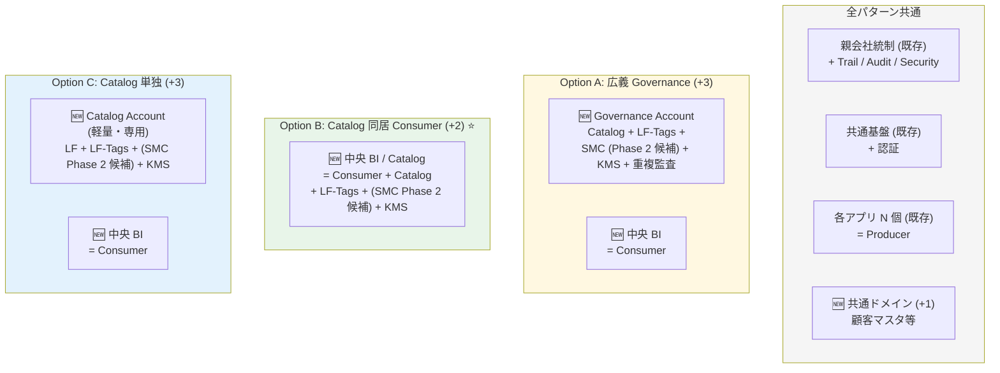
```mermaid
flowchart TB
    subgraph Common["全パターン共通"]
        P["親会社統制 (既存)<br/>+ Trail / Audit / Security"]
        A["共通基盤 (既存)<br/>+ 認証"]
        Apps["各アプリ N 個 (既存)<br/>= Producer"]
        CD["🆕 共通ドメイン (+1)<br/>顧客マスタ等"]
    end

    subgraph Opt1["Option A: 広義 Governance (+3)"]
        Gov1["🆕 Governance Account<br/>Catalog + LF-Tags +<br/>SMC (Phase 2 候補) + KMS + 重複監査"]
        BI1["🆕 中央 BI<br/>= Consumer"]
    end

    subgraph Opt2["Option B: Catalog 同居 Consumer (+2) ⭐"]
        BICat["🆕 中央 BI / Catalog<br/>= Consumer + Catalog<br/>+ LF-Tags + (SMC Phase 2 候補) + KMS"]
    end

    subgraph Opt3["Option C: Catalog 単独 (+3)"]
        Cat3["🆕 Catalog Account<br/>(軽量・専用)<br/>LF + LF-Tags + (SMC Phase 2 候補) + KMS"]
        BI3["🆕 中央 BI<br/>= Consumer"]
    end

    style Common fill:#f5f5f5
    style Opt1 fill:#fff8e1
    style Opt2 fill:#e8f5e9
    style Opt3 fill:#e3f2fd
```

### 5.4 3 オプションの観点別比較

| 観点 | A 広義 Governance (+3) | **B Catalog 同居 (+2)** ⭐ | C Catalog 単独 (+3) |
|---|:---:|:---:|:---:|
| 追加アカウント数 | +3 | **+2** | +3 |
| 責務分離（Catalog vs Consumer）| ◎ アカウント分離 | △ IAM Role 分離 | ◎ アカウント分離 |
| 責務分離（監査 vs 利用）| ◎（親会社統制 + Governance）| ◎（親会社統制で代替）| ◎ |
| Catalog 管理者特権の影響範囲 | 限定 | Consumer に集中 | 限定 |
| 運用負荷 | △ アカウント多い | ◎ 最少 | △ アカウント多い |
| 将来の分離容易性 | 既に分離済み | △ 移行コスト発生 | 既に分離済み |
| AWS 公式パターン整合 | ◎ Prescriptive Guidance 準拠 | ○ Lake Formation Central Catalog Account パターンとして整合 | ◎ |
| 規模拡大時の柔軟性 | ◎ | △ Consumer 増加で破綻 | ◎ |
| 業界実例の多さ | 大企業・規制業界 | **小〜中規模で多い** | 中規模 |

### 5.5 Option B が成立する条件と緩和策

**成立条件**:
- 親会社統制が Audit / Security 集約を担当している（§5.2 の責務再配置が成立）
- BI チーム規模が小〜中（〜5 名程度）
- Consumer アカウントが当面 1 つ

**緩和策**（Option B 採用時に必須）:

| # | 緩和策 | 効果 |
|---|---|---|
| 1 | **IAM Role の厳密な分離** — `DataLakeAdminRole`（Lake Formation 管理特権）と `DataAnalystRole`（クエリ・閲覧のみ）を完全に別ユーザー集合に割当 | Catalog 管理 ≠ 利用、Role 境界での責務分離 |
| 2 | **Permission Boundary** で `DataAnalystRole` から Lake Formation 管理操作を拒否 | 自己権限上昇の防止 |
| 3 | **SCP** で Consumer アカウントの権限上昇系操作を拒否 | 予防的制御 |
| 4 | **CloudTrail を親会社統制へ強制転送** | 自己監査リスク回避（前提として既に整備）|
| 5 | **AWS Config Rules** で「Catalog 管理権限と Consumer 権限の重複ユーザー」を検出 | 検知的制御 |
| 6 | **将来 Catalog 分離の手順書** を初日から準備 | 規模拡大時の移行リスク抑制 |

### 5.6 推奨

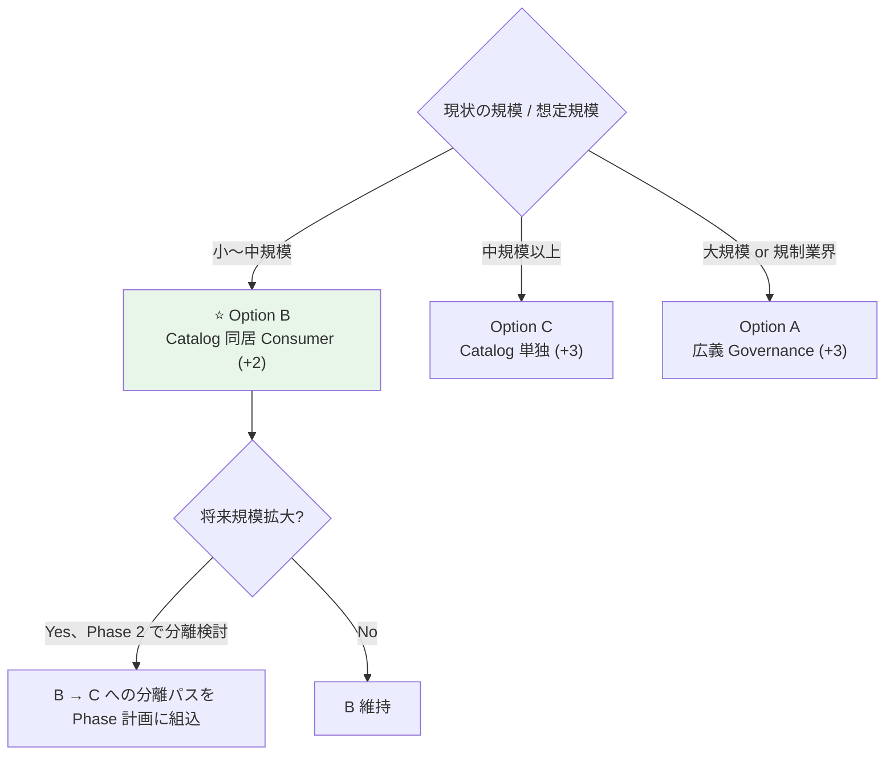
```mermaid
flowchart TB
    Q1{現状の規模 / 想定規模}

    Q1 -->|小〜中規模| OptB["⭐ Option B<br/>Catalog 同居 Consumer (+2)"]
    Q1 -->|中規模以上| OptC["Option C<br/>Catalog 単独 (+3)"]
    Q1 -->|大規模 or 規制業界| OptA["Option A<br/>広義 Governance (+3)"]

    OptB --> Future1{将来規模拡大?}
    Future1 -->|Yes、Phase 2 で分離検討| Migration["B → C への分離パスを Phase 計画に組込"]
    Future1 -->|No| Final["B 維持"]

    style OptB fill:#e8f5e9
```

**仮案の選定**: **Option B**（Catalog 同居 Consumer、**+2**）。将来規模拡大時に Option C へ分離可能な設計（§5.5 緩和策の #6）にしておく。

### 5.7 Pattern α/β/γ × Option A/B/C の組み合わせマトリクス

§4 の 3 パターン（Consumer 配置）と §5 の 3 オプション（Catalog 配置）は独立軸で、組み合わせ可能。**仮案は β + B + 共通ドメイン**。

| | Option A 広義 Governance（+ 別 Catalog） | **Option B Catalog 同居 Consumer** ⭐ | Option C Catalog 単独 |
|---|:---:|:---:|:---:|
| **Pattern α** 各アプリ Consumer 兼任 | +1（Governance）+ N アプリ内 Consumer | ⚠ 「Catalog 同居先」が無く成立しない<br/>※α なら Option A or C 必須 | +1（Catalog）+ N アプリ内 Consumer |
| **Pattern β** 1 中央 Consumer | +2（Governance + Consumer）| **+1（Consumer 兼 Catalog）** ⭐<br/>本仮案 = β + B + 共通ドメイン = **+2 合計** | +2（Catalog + Consumer）|
| **Pattern γ** ハイブリッド（アプリ + 中央 Consumer）| +2（Governance + 中央 Consumer）| +1（中央 Consumer 兼 Catalog） | +2（Catalog + 中央 Consumer）|

**重要な制約**: **α は Option B と組み合わせ不可**（中央 Consumer がないため Catalog の同居先が存在しない）。各アプリアカウントに分散して Catalog を持たせると Catalog の中央性が失われる。

**仮案の組み合わせ**: β + Option B + 共通ドメイン = **+2 アカウント**（中央 BI / Catalog + 共通ドメイン）

```mermaid
flowchart LR
    P["仮案"]
    P --> Pat["Pattern β<br/>(1 中央 Consumer)"]
    P --> Opt["Option B<br/>(Catalog 同居 Consumer)"]
    P --> Com["+ 共通ドメイン<br/>(別アカウント)"]

    Pat --> Result["合計 +2 アカウント<br/>中央 BI / Catalog +<br/>共通ドメイン"]
    Opt --> Result
    Com --> Result

    style Result fill:#e8f5e9
```

---

## 5.8 監査責務分離の具体設計（Option B 採用時 + 新規監査アカウント前提）

### 5.8.1 前提

**監査アカウントはデータプラットフォーム標準のスコープ外**で生成される。Transit Gateway / 共通 VPC エンドポイント / 共通 DNS 等の**共通インフラと同じ位置付け**で、「**他組織が運用するものを我々が利用させていただく**」という関係。

```mermaid
flowchart TB
    subgraph OutOfScope["スコープ外（他組織が運用）"]
        direction LR
        Parent["親会社統制アカウント<br/>SoC / NW Firewall"]
        AuditAcc["🔵 監査アカウント<br/>(別組織が生成・運用)<br/>・CloudTrail Org Trail<br/>・Security Hub / GuardDuty / Macie<br/>・Config Aggregator<br/>・監査ログ長期保管"]
        TGW["Transit Gateway<br/>共通 VPC エンドポイント等"]
    end

    subgraph InScope["データプラットフォーム標準のスコープ"]
        direction LR
        BICat["中央 BI / Catalog<br/>(Option B)"]
        Common["共通ドメイン"]
        Apps["各アプリ × N<br/>(Producer)"]
    end

    InScope -.ログ・監査イベント送付.-> AuditAcc
    InScope -.ネットワーク通信.-> TGW

    style OutOfScope fill:#f5f5f5
    style InScope fill:#e3f2fd
    style AuditAcc fill:#fce4ec
```

**本標準の役割**: 監査アカウントに対して **「何を送るか / 何を期待するか / 何を依存するか」** を定義する側に立つ。

### 5.8.2 アカウント体系（スコープ込み）

| カテゴリ | アカウント | 運用主体 | データプラットフォーム標準での位置付け |
|---|---|---|---|
| **スコープ外（既存・他組織）** | 親会社統制 | 親会社 SoC | データ標準には直接関与しない |
| **スコープ外（新規・他組織）** | **🔵 監査アカウント** | **別組織** | **ログ送付先・依存対象**として利用 |
| **スコープ外（既存・他組織）** | Transit Gateway / 共通ネットワーク | ネットワーク統括 | データ通信の経路として利用 |
| **スコープ内（既存）** | 共通基盤（認証）| 別チーム | 認証連携先として利用 |
| **スコープ内（既存）** | 各アプリ × N | アプリチーム | Producer 兼任、ガイド対象 |
| **スコープ内（新規 +1）** | 🆕 中央 BI / Catalog（Option B 同居）| データプラットフォームチーム | 本標準が設計・運用 |
| **スコープ内（新規 +1）** | 🆕 共通ドメイン | データプラットフォームチーム + 各データ責任者 | 本標準が設計・運用 |

### 5.8.3 監査アカウントへのログ送付経路

データプラットフォーム側から監査アカウントへ送付するログを **送信元 × 種別 × 仕組み** で整理。

| 送信元 | 種別 | 内容 | 送付の仕組み |
|---|---|---|---|
| **全アカウント** | コントロールプレーン監査 | CloudTrail Management Events | **Organization Trail**（監査アカウント側で設定済み前提）|
| 中央 BI / Catalog | データプレーン監査 | Lake Formation データアクセスイベント、KMS 鍵使用イベント | **CloudTrail Data Events**（Organization Trail に統合）|
| 中央 BI / Catalog | クエリ履歴 | Athena Workgroup クエリログ | **Athena Workgroup → S3 → クロスアカウント送付** |
| 中央 BI / Catalog | BI アクセス | QuickSight アクティビティログ | **QuickSight Activity Log → CloudTrail → 監査アカウント** |
| 各アプリ（Producer）| データアクセス | S3 サーバアクセスログ | **S3 Logging → 監査アカウントのログバケット**（クロスアカウント書込み）|
| 各アプリ（Producer）| アプリ操作 | アプリケーション操作監査ログ | **CloudWatch Logs Subscription → Kinesis Firehose → 監査アカウント S3** |
| 共通ドメイン | マスタ変更履歴 | 顧客マスタ更新ログ | 上記同様 |

### 5.8.4 メトリクスの扱い（運用は各アプリ保持）

**今回の方針確認**: 運用メトリクスは各アプリで保持（CloudWatch 標準）、監査・セキュリティ系のみ監査アカウントに集約。

| 種別 | 主用途 | 配置 | 理由 |
|---|---|---|---|
| **運用メトリクス** | 障害検知 / SLO 監視 / オートスケール判定 | **各アプリの CloudWatch**（30 日デフォルト保持）| アプリチームの責任、即時性が必要 |
| **セキュリティメトリクス** | GuardDuty Findings / Macie 検出 / Security Hub Findings | **監査アカウント集約** | 横断検知・SOC 連携 |
| **コスト系** | Cost Explorer / CUR | **親会社統制 or Organization Master** | 経理連携 |
| **長期保存メトリクス** | ML 用特徴量・容量計画 | **データプラットフォーム側で再集計**（必要に応じて）| 分析責務 |

### 5.8.5 データプラットフォーム側で実装する必須項目

監査アカウントが期待するログを「ちゃんと送る」ための実装責任:

| # | 実装項目 | 実装場所 |
|---|---|---|
| 1 | **CloudTrail Data Events 有効化**（S3 / Lake Formation / KMS）| 中央 BI / Catalog アカウント |
| 2 | **Lake Formation Audit Log 有効化** | 中央 BI / Catalog アカウント |
| 3 | **Athena Workgroup でクエリログ出力設定** | 中央 BI / Catalog アカウント |
| 4 | **QuickSight Activity Logging 有効化** | 中央 BI / Catalog アカウント |
| 5 | **S3 Server Access Logging のクロスアカウント設定** | 各アプリアカウント + 共通ドメインアカウント |
| 6 | **KMS CMK の使用イベント出力**（CloudTrail Data Events）| 中央 BI / Catalog アカウント |
| 7 | **VPC Flow Logs 出力設定** | 各アカウントの VPC（送信先は監査アカウント側の設計次第）|
| 8 | **アプリ操作ログの CloudWatch Logs Subscription 設定** | 各アプリアカウント |

### 5.8.6 監査アカウント側に期待する設定（依存事項）

データプラットフォーム標準が**監査アカウント運用主体に依頼する設定**:

| # | 期待する設定 | データプラットフォーム側への影響 |
|---|---|---|
| 1 | **CloudTrail Organization Trail** 設定（全アカウント対象）| 各アカウントで個別に CloudTrail を立てる必要なし |
| 2 | **Security Hub Delegated Admin** | 各アカウントの Security Hub 集約 |
| 3 | **GuardDuty Delegated Admin** | 同上 |
| 4 | **Macie Delegated Admin** | S3 PII スキャンの集約 |
| 5 | **Config Aggregator** | 全アカウントの構成監視 |
| 6 | **クロスアカウントログ受信用 S3 バケット**（Object Lock + 長期保管）| ログ送付先として利用 |
| 7 | **クロスアカウント書込み権限の付与**（バケットポリシー）| 各アプリ・中央 BI から書込みできる |
| 8 | **セキュリティ Findings 通知の管理プロセス** | データ標準で検出した PII 漏洩等の対応フロー |

### 5.8.7 セキュリティアラート連携の流れ

```mermaid
sequenceDiagram
    autonumber
    participant DP as データプラットフォーム<br/>(各アプリ / 中央 BI)
    participant Audit as 監査アカウント<br/>(別組織)
    participant SOC as 親会社 SoC

    Note over DP, SOC: 通常運用
    DP->>Audit: ログ送付（CloudTrail / S3 / etc.）
    Audit->>Audit: Security Hub / GuardDuty / Macie で分析

    Note over DP, SOC: インシデント検知時
    Audit->>SOC: Findings 通知
    SOC->>Audit: トリアージ
    SOC->>DP: 対応依頼（データ標準チームへ）
    DP->>DP: 該当アプリ / Catalog 側で対応
    DP->>SOC: 対応結果報告
    Audit->>Audit: Findings クローズ
```

### 5.8.8 残課題（監査アカウント別組織との合意事項）

| # | 確認事項 | 影響 |
|---|---|---|
| 1 | **監査アカウント運用主体との連絡窓口**（誰に何を聞くか）| 設計の進め方 |
| 2 | **ログ送付の権限設計**（クロスアカウント IAM Role / バケットポリシー）| 実装方法 |
| 3 | **監査アカウント側のログ保管期間** | データ標準側の §NFR-7 コンプラ要件と整合 |
| 4 | **Findings 通知の受け取りフロー**（SNS / EventBridge / メール / Slack 等）| インシデント対応設計 |
| 5 | **監査アカウント障害時のフォールバック**（自前で一時的に集約するか）| BCP / 5 nines 想定 |
| 6 | **コスト負担モデル**（監査アカウントの利用料はデータ標準側に按分されるか）| 予算計画 |
| 7 | **Athena クエリログ等のセンシティブ情報を含むログの扱い**（顧客企業データを参照したクエリ内容）| プライバシー設計 |
| 8 | **Transit Gateway 経由のクロスアカウント通信のログ取得範囲** | ネットワーク監査 |

### 5.8.9 図解: ログ送付の全体像

```mermaid
flowchart TB
    subgraph DataPlatform["データプラットフォーム標準（スコープ内）"]
        subgraph BICat["中央 BI / Catalog アカウント"]
            LF[Lake Formation]
            Athena
            QS[QuickSight]
            KMS[KMS CMK]
        end

        subgraph App1["App 1（Producer）"]
            S1[S3]
            DB1[運用 DB]
            App1Logs[CloudWatch Logs]
        end

        subgraph App2["App 2（Producer）"]
            S2[S3]
            DB2[運用 DB]
        end

        subgraph CommonD["共通ドメイン"]
            Master[顧客マスタ]
        end
    end

    subgraph Audit["監査アカウント（スコープ外）"]
        direction TB
        CT[CloudTrail Organization Trail]
        SH[Security Hub Delegated Admin]
        GD[GuardDuty Delegated Admin]
        Macie[Macie Delegated Admin]
        Cfg[Config Aggregator]
        LogBucket[(S3 長期保管バケット<br/>Object Lock)]
    end

    %% コントロールプレーン → CloudTrail
    LF -.管理イベント.-> CT
    Athena -.管理イベント.-> CT
    QS -.管理イベント.-> CT
    KMS -.管理イベント.-> CT
    App1 -.管理イベント.-> CT
    App2 -.管理イベント.-> CT
    CommonD -.管理イベント.-> CT

    %% データプレーン → CloudTrail Data Events
    LF -.データイベント.-> CT
    S1 -.S3 アクセスログ.-> LogBucket
    S2 -.S3 アクセスログ.-> LogBucket

    %% Athena クエリログ
    Athena -.クエリログ.-> LogBucket

    %% QuickSight アクティビティ
    QS -.アクティビティログ.-> CT

    %% アプリ操作ログ
    App1Logs -.subscription.-> LogBucket

    %% Macie が S3 をスキャン
    S1 -.PII スキャン対象.-> Macie
    S2 -.PII スキャン対象.-> Macie
    Master -.PII スキャン対象.-> Macie

    style DataPlatform fill:#e3f2fd
    style Audit fill:#fce4ec
```

---

## 6. 決定状況と残課題

### 6.1 仮案で決定済み（[strawman-proposal.md](strawman-proposal.md) に反映済）

| # | 決定事項 | 仮案での選定 | 根拠 / 参照 |
|---|---|---|---|
| 1 | **Consumer 役割のパターン**（α / β / γ）| **β**（中央 Consumer 集約）| Q1 アプリチームスキルなし / Q4 BI チームなし → α 不適合、γ は組織体制が未整備のため Phase 2 で検討。Path C 段階移行 |
| 2 | **Catalog Account / Governance Account の配置**（Option A / B / C）| **Option B**（Catalog 同居 Consumer、+2 アカウント）| §5.2 親会社統制が Audit / Security 集約を担う前提 / §5.4 Option 比較表 / 仮案規模に最適 |
| 3 | **Audit ログの最終集約先** | **親会社統制アカウント**（既存）| ユーザー環境の前提として確認済 |
| 4 | **共通参照データの扱い** | **共通ドメイン専用アカウント新設**（+1）| §3.3 案 2、業界標準（DAMA / Data Mesh）|
| 5 | **SageMaker Catalog（旧 DataZone）採否** | **Phase 1 不採用、Phase 2 再評価** | [DP-ADR-001](adr/DP-ADR-001-sagemaker-catalog-adoption-deferred.md)。Phase 1 規模では ROI 低い、+$1,360/年コスト・運用複雑度を抑制、Phase 2 で利用者拡大時に再評価 |

### 6.2 残課題（ヒアリングまたは追加検討が必要な事項）

| # | 決定事項 | 選択肢 | 影響範囲 | 確認方法 |
|---|---|---|---|---|
| 1 | **既存「共通基盤アカウント」のスコープ拡張** | 認証専用に閉じる / Service Catalog 配布元等も担わせる | API 側決定との整合 | API 標準化推進者との調整 |
| 2 | **環境分離**（prod / stg / dev）| 同一アカウントで Realm 分離 / 環境別にアカウント分離 | アカウント数の倍加、運用負荷 | ヒアリング G（インフラチーム）|
| 3 | **監査アカウントとの合意事項**（Option B 成立 + §5.8 監査責務分離の前提）| [§5.8.8 残課題 8 項目](#588-残課題監査アカウント別組織との合意事項)（連絡窓口 / 権限設計 / 保管期間 / Findings 通知 / 障害時 FB / コスト按分 / クエリログ機密性 / TGW 通信ログ）| 監査アカウント運用主体との合意で確定 | ヒアリング G-4 / 監査アカウント運用主体への問合せ |
| 4 | **役割 3（Catalog 管理者）と役割 4（BI チーム）の人員分離**（Option B 成立の前提）| 完全分離可能 / 部分重複 / 重複前提 | 責務分離の実質的な強度、Config Rules 検知設計 | ヒアリング G-5 で確認 |
| 5 | **将来 Option C 移行のトリガ条件**（規模拡大時）| 4 条件のうちどれを発動条件とするか | Phase 2 計画、運用設計 | Phase 1 運用開始後にレビュー、[strawman-proposal.md §4.3](strawman-proposal.md) 参照 |
| 6 | **DR / クロスリージョン設計** | リージョン障害時の Catalog / Consumer / 共通ドメイン の復旧戦略 | NFR-DR §NFR-5（未作成）の前提 | [proposal/nfr/05-dr.md](proposal/nfr/05-dr.md)（未作成）と連動 |

---

## 7. 反映先（合意後の後続作業）

ヒアリング Phase A 以降で前提が確認できれば、以下に反映する。**Option B（Catalog 同居 Consumer、+2 アカウント）** が確定したことを前提とする。

| # | 反映先 | 内容 |
|---|---|---|
| 1 | [proposal/00-index.md §0.2 比較表](proposal/00-index.md) | 「分散標準」記述を「**Federated（3 役割、Option B Catalog 同居 Consumer 推奨）**」に改訂 |
| 2 | [proposal/fr/02-storage.md](proposal/fr/02-storage.md) | 「Producer 役割」の明示、Central（Catalog）/ Consumer 役割の追記、**Option B 採用時の同居構造**、Lake Formation 共有モデルの図解、IAM Role 分離方針（`DataLakeAdminRole` / `DataAnalystRole` / `DataReaderRole`）|
| 3 | [proposal/fr/05-governance.md](proposal/fr/05-governance.md) | §FR-5.1 権限制御を Lake Formation Cross-Account + **同アカウント内 IAM Role 分離**前提に補強、Permission Boundary / SCP / Config Rules の必須化 |
| 4 | proposal/common/01-architecture.md（未作成）| 新規執筆。本資料 §1-§5 を §C-DATA-1.5「中央集約 vs 分散ガイド」フレームに展開、API §C-1.5 と並ぶ位置付け、**Option A/B/C 配置 + Pattern α/β/γ Consumer の組み合わせマトリクス**を §C-DATA-1.6 として明示 |
| 5 | proposal/common/03-ownership-raci.md（未作成）| **7 役割と RACI** の対応（[strawman-proposal.md §3](strawman-proposal.md) 参照）、特に役割 3（Catalog 管理者 = `DataLakeAdminRole`）と役割 4（BI チーム = `DataAnalystRole`）の人員分離原則を明示 |
| 6 | [internal-evaluation.md](internal-evaluation.md) | 抽出方針に「API と同型 Federated だが中央のスコープが Catalog 分だけ広く、親会社統制が監査・セキュリティ集約を担う場合は Catalog 同居 Consumer (Option B) で +2 アカウントに圧縮可能」根拠を追記 |
| 7 | [powerpoint-outline-and-references.md §1.3-1.4](powerpoint-outline-and-references.md) | 構成概要図を **Option B 版（+2 アカウント、中央 BI / Catalog 同居）**に差し替え、§1.4「アカウント体系」スライドで Option A/B/C の選定根拠を提示 |
| 8 | [strawman-proposal.md](strawman-proposal.md) | （反映済）Option B 仕様に改訂、§2 アカウント構成 +2、§3 役割 3 を `DataLakeAdminRole` として位置付け、§5 前提 8/9 追加、§6 ヒアリング G-4/5/6 追加 |
| 9 | proposal/fr/06-personas.md（既存）| §FR-6 ペルソナ別実装パターンに **IAM Role 別の利用パターン**（`DataLakeAdminRole` / `DataAnalystRole` / `DataReaderRole`）を反映 |
| 10 | [proposal/fr/05-governance.md](proposal/fr/05-governance.md) §FR-5.4 監査ログ | **§5.8 監査責務分離設計を反映**: 監査アカウントへのログ送付経路 7 種、データプラットフォーム側必須実装 8 項目、監査アカウント側に期待する 8 項目を明文化 |
| 11 | proposal/nfr/04-security.md（既存・要更新）| §NFR-4 セキュリティに **監査アカウントとの責務分離**、ログ送付経路、クロスアカウント送付の暗号化要件を追記 |
| 12 | proposal/nfr/06-operations.md（既存・要更新）| §NFR-6 運用に **メトリクスの責務分離**（運用は各アプリ / 監査・セキュリティは監査アカウント）を明示 |
| 13 | proposal/common/04-tbd-summary.md（未作成）| **監査アカウント運用主体との合意事項 8 項目**（§5.8.8 残課題）を要確認事項として記録 |
| 14 | [strawman-proposal.md §5 前提](strawman-proposal.md) | 前提 8 を **「監査アカウント運用主体との合意」** に書き換え（旧「親会社統制が CloudTrail / SH / Macie 等を集約」）|
| 15 | [hearing-slide-deck.md §4.2](hearing-slide-deck.md) | スライド §4.2 を **「監査アカウントとの責務分離 + 期待する設定」** に再構成（旧「親会社統制の責務範囲確認」）|

### 7.1 反映の依存順序

```mermaid
flowchart TB
    H["ヒアリング Phase A〜D<br/>(strawman 仮案検証)"]
    H --> Strawman["strawman-proposal.md 改訂<br/>(既改訂済、合意後さらに更新)"]

    Strawman --> P1["proposal/00-index.md<br/>(SSOT 改訂)"]
    Strawman --> P2["proposal/fr/02-storage.md<br/>(IAM Role 分離追記)"]
    Strawman --> P3["proposal/fr/05-governance.md<br/>(Cross-Account 補強)"]
    Strawman --> C1["proposal/common/01-architecture.md<br/>(新規執筆)"]
    Strawman --> C3["proposal/common/03-ownership-raci.md<br/>(新規執筆)"]

    P1 --> Internal["internal-evaluation.md<br/>(抽出方針追記)"]
    C1 --> PPT["powerpoint-outline-and-references.md<br/>(構成図差し替え)"]
    C3 --> PPT

    style Strawman fill:#fff3e0
    style C1 fill:#e8f5e9
    style C3 fill:#e8f5e9
```

---

## 8. 関連ドキュメント

### 本領域内

- [data-platform-document-structure.md](data-platform-document-structure.md) — 領域全体 SSOT
- [internal-evaluation.md](internal-evaluation.md) — 抽出方針の裏どり資料
- [proposal/fr/02-storage.md](proposal/fr/02-storage.md) — §FR-2 保存先標準

### 兄弟領域（API、雛形元）

- [../api-platform/proposal/common/01-reference-architecture.md](../api-platform/proposal/common/01-reference-architecture.md) — §C-1.5「中央集約 vs 分散ガイド」フレーム（本資料の元構造）

### AWS 公式

- [AWS Prescriptive Guidance: Strategy for Data Mesh](https://docs.aws.amazon.com/prescriptive-guidance/latest/strategy-data-mesh/aws-offerings-data-mesh.html)
- [Lake Formation Cross-Account Permissions](https://docs.aws.amazon.com/lake-formation/latest/dg/cross-account-permissions.html)
- [Secure Data Mesh Guidance on AWS](https://aws.amazon.com/solutions/guidance/secure-data-mesh-with-distributed-data-asset-ownership-on-aws)
- [Build enterprise data mesh with DataZone, CDK, CFN](https://docs.aws.amazon.com/prescriptive-guidance/latest/patterns/build-enterprise-data-mesh-amazon-data-zone.html)
- [AWS Well-Architected Data Analytics Lens](https://docs.aws.amazon.com/wellarchitected/latest/analytics-lens/analytics-lens.html)

### 業界・参考事例

- [Martin Fowler / Dehghani — Monolithic Data Lake to Data Mesh](https://martinfowler.com/articles/data-monolith-to-mesh.html)
- [Netflix UDA](https://netflixtechblog.com/uda-unified-data-architecture-6a6aee261d8d)
- [How Spotify Built Its Data Platform](https://blog.bytebytego.com/p/how-spotify-built-its-data-platform)
- [BBVA Global Data Platform](https://aws.amazon.com/blogs/industries/part-1-bbva-building-a-multi-region-multi-country-global-data-and-ml-platform-at-scale/)
