# データプラットフォーム アカウントアーキテクチャ検討（社内評価メモ）

> ステータス: 🚧 ドラフト（合意形成中）
> 対象読者: **社内のみ**。プラットフォーム標準化推進者 / アプリ運用責任者 / セキュリティ・ガバナンス担当
> 位置付け: 「データプラットフォームを独立アカウントとして立てるか、各アプリアカウントで分散するか」の検討記録
> 関連: [data-platform-document-structure.md](data-platform-document-structure.md) / [internal-evaluation.md](internal-evaluation.md) / [proposal/fr/02-storage.md](proposal/fr/02-storage.md)

---

## 0. 本資料の目的

API プラットフォーム標準が「**Federated（中央集約 + 分散）**」を採用した（[../api-platform/proposal/common/01-reference-architecture.md §C-1.5](../api-platform/proposal/common/01-reference-architecture.md)）。同じ問いをデータ標準にも適用する。

**問い**:
- データプラットフォームとして**独立した AWS アカウントを立てる**か
- 各アプリアカウントで**統一したガイドにする**か

**結論**: API と同じく **Federated 採用**。ただしデータ領域固有の理由により、**中央アカウントの責務に「データガバナンス層」が加わる**。

本資料は調査根拠と判断項目を整理し、合意形成後に [proposal/common/01-architecture.md](proposal/common/01-architecture.md) §C-DATA-1 として正式化する。

---

## 1. 結論サマリ

| 項目 | 結論 |
|---|---|
| アプローチ | **Federated**（AWS Producer / Central Governance / Consumer の 3 役割）|
| API 標準との関係 | **同型**（中央集約 + 各アプリ分散）。ただし中央のスコープが Catalog 分だけ広い |
| 既存アカウントへの影響 | **最低 +1 アカウント**（Data Governance / Catalog 専用）。Consumer は組織パターンにより +0〜+1 |
| バルクデータの集約 | **しない**（Producer の S3 に置いたまま、Catalog と権限のみ中央集約）|

> **追補（§5 参照）**: 親会社統制アカウントが CloudTrail / Security Hub / Macie 等の監査・セキュリティ集約を担う場合、データ標準で必要な中央責務は **「Catalog Account」**（Lake Formation + LF-Tags + (SMC Phase 2 候補) + KMS）に縮小される。この場合 **Catalog を Consumer に同居させる Option B（+2 アカウント）が実用解として有力**。
>
> **追補 2（§5.8 参照）**: 監査責務を担うのは **新規の「監査アカウント」**（データプラットフォーム標準のスコープ外、Transit Gateway 等と同様に別組織が運用）。本標準は監査アカウントに対して **「何を送るか / 何を期待するか / 何を依存するか」を定義する側**に立つ。運用メトリクスは各アプリに保持、監査・セキュリティ系のみ集約。

### 業界根拠（要約）

| 出典 | 結論 |
|---|---|
| [AWS Prescriptive Guidance: Strategy for Data Mesh](https://docs.aws.amazon.com/prescriptive-guidance/latest/strategy-data-mesh/aws-offerings-data-mesh.html) | Producer / Central Governance / Consumer の 3 役割が**規範**。「1 つの中央データレイクアカウント」は**アンチパターン** |
| [Lake Formation Cross-Account Permissions](https://docs.aws.amazon.com/lake-formation/latest/dg/cross-account-permissions.html) | バルクデータを動かさず Catalog + 権限のみで横断クエリを実現 |
| [Secure Data Mesh Guidance on AWS](https://aws.amazon.com/solutions/guidance/secure-data-mesh-with-distributed-data-asset-ownership-on-aws) | Distributed Data Asset Ownership + Central Governance パターン |
| [Well-Architected Data Analytics Lens](https://docs.aws.amazon.com/wellarchitected/latest/analytics-lens/analytics-lens.html) | 同上を Lens として体系化 |
| 業界事例 | Netflix UDA / Spotify / BBVA など主要事例も Federated（中央モノリス・完全分散の両極端は採らない）|

---

## 2. 既存アカウント体系とのマッピング（概念モデル）

> ⚠ **本章 §2-§4 は「概念モデル」を示す**: Producer / Central / Consumer の 3 役割を独立アカウントとして描いている。**実装上の推奨配置（Option B = Catalog 同居 Consumer、+2 アカウント）は §5 を参照**。本章は理解のために役割を分離した形で示すが、§5 で物理アカウント割当を最適化する。

### 2.1 マッピング表（役割と既存アカウントの対応）

| 既存 / 新規 | アカウント | 持つもの | データ標準での役割 |
|---|---|---|---|
| **既存** | **親会社統制**（SoC / NW Firewall + CloudTrail / Security Hub / Macie / GuardDuty 等の集約）| そのまま | データ標準では **Audit / Security 集約先**として活用（§5.2 参照）|
| **既存** | **共通基盤アカウント**（認証）| そのまま | データ標準には**直接関与しない**（後述 Catalog/Governance とは責務が違うので原則同居しない）|
| **既存** | **各アプリ アカウント**（複数）| アプリ + API GW + S3 + 運用 DB | ⭐ **Producer**（生産者）兼用 |
| **概念上** | **Central Governance / Catalog 役割** | Lake Formation Catalog + LF-Tags + (SMC は Phase 2 候補、[DP-ADR-001](adr/DP-ADR-001-sagemaker-catalog-adoption-deferred.md)) + 共通 KMS | ⭐ **Central**（中央統制）— 物理配置は §5 Option A/B/C で選択 |
| **概念上** | **Consumer 役割** | Athena / Redshift / QuickSight / SageMaker | ⭐ **Consumer**（消費者）— 物理配置は §4 Pattern α/β/γ で選択 |

> **物理アカウント追加数の整理**（仮案 = Option B + Pattern β + 共通ドメイン の場合）:
> - 中央 BI / Catalog アカウント（Consumer + Catalog 同居）: **+1**
> - 共通ドメインアカウント（顧客マスタ等）: **+1**
> - 合計: **+2 アカウント**

### 2.2 図解（概念モデル）

> ⚠ 下図は **3 役割の概念モデル**を独立アカウントとして示したもの。**実装上の推奨配置（Catalog を Consumer に同居させる Option B）は §5.3 の図を参照**。

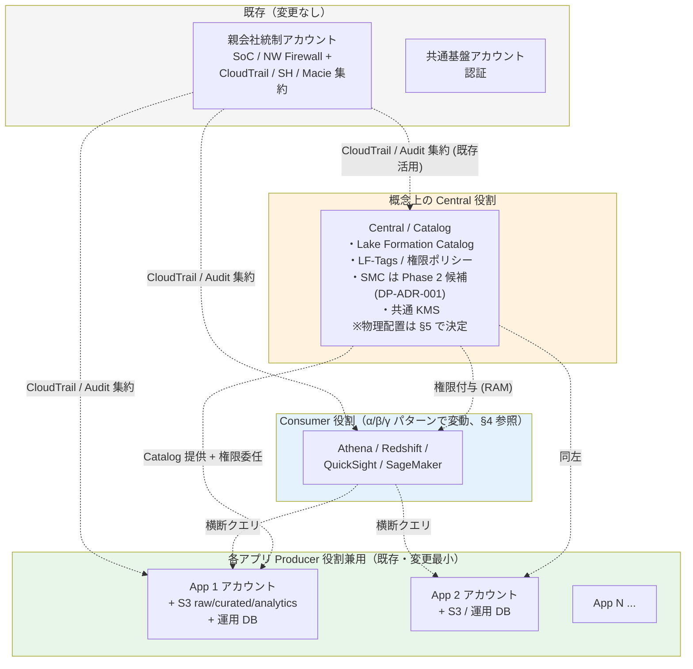
```mermaid
flowchart TB
    subgraph Existing["既存（変更なし）"]
        direction LR
        Parent["親会社統制アカウント<br/>SoC / NW Firewall +<br/>CloudTrail / SH / Macie 集約"]
        Auth["共通基盤アカウント<br/>認証"]
    end

    subgraph New["概念上の Central 役割"]
        DG["Central / Catalog<br/>・Lake Formation Catalog<br/>・LF-Tags / 権限ポリシー<br/>・SMC は Phase 2 候補 (DP-ADR-001)<br/>・共通 KMS<br/>※物理配置は §5 で決定"]
    end

    subgraph Producers["各アプリ Producer 役割兼用（既存・変更最小）"]
        direction LR
        App1["App 1 アカウント<br/>+ S3 raw/curated/analytics<br/>+ 運用 DB"]
        App2["App 2 アカウント<br/>+ S3 / 運用 DB"]
        AppN["App N ..."]
    end

    subgraph Consumer["Consumer 役割（α/β/γ パターンで変動、§4 参照）"]
        Cons["Athena / Redshift /<br/>QuickSight / SageMaker"]
    end

    DG -.Catalog 提供 + 権限委任.-> App1
    DG -.同左.-> App2
    DG -.権限付与 (RAM).-> Cons
    Cons -.横断クエリ.-> App1
    Cons -.横断クエリ.-> App2
    Parent -.CloudTrail / Audit 集約 (既存活用).-> DG
    Parent -.CloudTrail / Audit 集約.-> App1
    Parent -.CloudTrail / Audit 集約.-> Cons

    style Existing fill:#f5f5f5
    style New fill:#fff3e0
    style Producers fill:#e8f5e9
    style Consumer fill:#e3f2fd
```

### 2.3 中央 Catalog/Governance 責務を共通基盤（認証）に同居させない理由

| 観点 | 同居（共通基盤 + Catalog/Governance）| 分離（別アカウント or Consumer 同居、推奨）|
|---|:---:|:---:|
| 責務分離 | ❌ 認証 + データ統制が混在 | ✅ |
| 障害影響 | ❌ 認証障害がデータ参照を巻き込む | ✅ |
| 権限境界 | ❌ 認証管理者 ≠ データ管理者だが同 IAM 内 | ✅ |
| AWS Well-Architected | ❌ 違反（責務単一原則）| ✅ |
| コスト・運用負荷 | ◎ 1 アカウント節約 | △ 別アカウント |

→ Catalog/Governance 責務は**軽量**（バルクデータなし）でランニングコストは限定的（Lake Formation 自体は無料、KMS / CloudTrail / 監査ログのみが課金対象）。**責務分離を優先**。共通基盤との同居は不採用。同じ責務分離原則で **Catalog を Consumer に同居させる Option B** は IAM Role 分離による緩和策が必要（§5.5 参照）。

---

## 3. Lake Formation + RAM の動き — 「参照のみ」の意味

> 本章は概念モデル（Producer / Catalog / Consumer の 3 役割）を前提にデータの動きを示す。Option B 採用時は **「Catalog」と「Consumer」が同一アカウント内**になるため、ステップ ③〜⑤ のクロスアカウント通信が**アカウント内の IAM Role 間通信**に置き換わる。それ以外の動きは同じ。

### 3.1 データの物理配置とクエリの動き

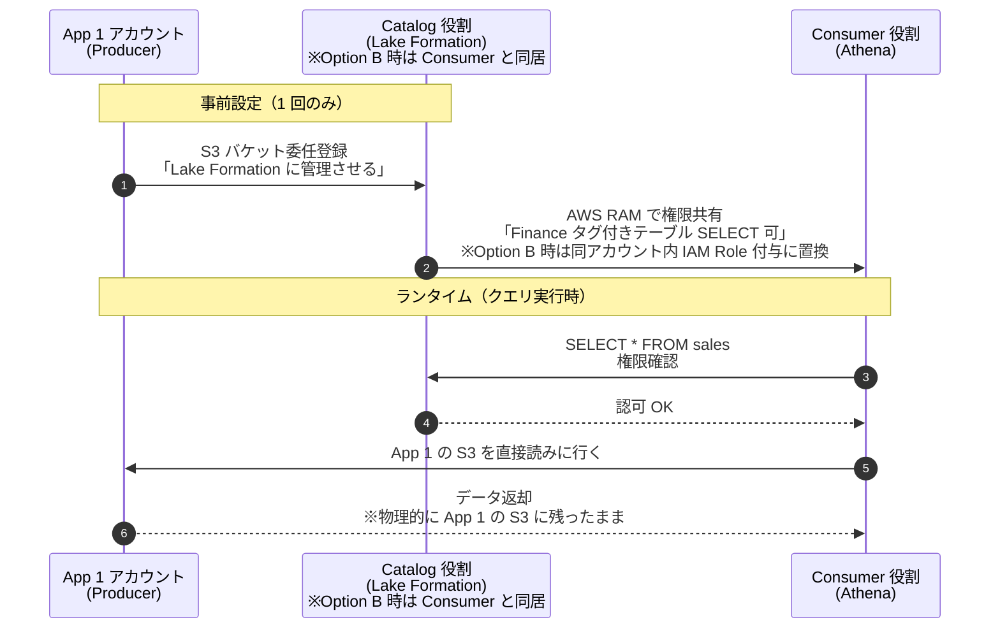
```mermaid
sequenceDiagram
    autonumber
    participant App1 as App 1 アカウント<br/>(Producer)
    participant LF as Catalog 役割<br/>(Lake Formation)<br/>※Option B 時は Consumer と同居
    participant Cons as Consumer 役割<br/>(Athena)

    Note over App1, LF: 事前設定（1 回のみ）
    App1->>LF: S3 バケット委任登録<br/>「Lake Formation に管理させる」
    LF->>Cons: AWS RAM で権限共有<br/>「Finance タグ付きテーブル SELECT 可」<br/>※Option B 時は同アカウント内 IAM Role 付与に置換

    Note over App1, Cons: ランタイム（クエリ実行時）
    Cons->>LF: SELECT * FROM sales<br/>権限確認
    LF-->>Cons: 認可 OK
    Cons->>App1: App 1 の S3 を直接読みに行く
    App1-->>Cons: データ返却<br/>※物理的に App 1 の S3 に残ったまま
```

| ステップ | 何が起きるか |
|---|---|
| ①②（事前設定）| App1（Producer）が Lake Formation に「この S3 バケットを管理させる」と委任登録。Catalog 役割の Lake Formation が App1 の S3 を「登録済みデータレイクロケーション」として扱える状態にする |
| ③（事前設定）| Catalog 役割が Consumer に **「Finance タグの付いたテーブル全部、SELECT のみ許可」** を **AWS RAM** 経由で共有（Option B 時は同アカウント内の `DataAnalystRole` への IAM 権限付与）|
| ④⑤（ランタイム）| Consumer の Athena が SQL を発行 → Lake Formation に「sales テーブルへの SELECT 権限あるか」を問い合わせ → 認可成功 |
| ⑥⑦（ランタイム）| Athena は App1 アカウントの S3 を**直接読みに行く**（バイトは Consumer のクエリエンジンを通って結果として返るだけ。データそのものは App1 の S3 から動かない）|

### 3.2 「参照のみ」の正確な定義

| 操作 | Consumer アカウントから可能か |
|---|:---:|
| App1 の S3 / Catalog テーブルを **SELECT**（読む）| ✅ |
| App1 の S3 にファイルを **書く / 削除する** | ❌ 権限分離で禁止 |
| Athena / Redshift で **クエリ結果を Consumer 自身の S3 に保存** | ✅ |
| Consumer アカウント内で **集計テーブル / ML 訓練データ作成** | ✅ Consumer の自前 S3 内 |
| App1 のソースデータを書き換える | ❌ Producer 側でだけ可能 |

→ **「ソースデータへの書込み権限はない、自分のアカウント内で派生データは作れる」** が「参照のみ」の正確な意味。

### 3.3 Lake Formation + RAM vs 単純 S3 IAM 共有

なぜ単純な S3 バケットポリシー + IAM の共有では不十分か。

| 観点 | 単純な S3 IAM 共有 | Lake Formation + RAM |
|---|:---:|:---:|
| 権限の粒度 | バケット / プレフィックス単位 | **テーブル / 列 / 行レベル** |
| 機密度別マスキング | 自前実装 | **LF データフィルタで宣言的に定義** |
| 監査 | S3 ログ単独で追跡困難 | Lake Formation 監査ログで「**誰が何のテーブルにアクセスしたか**」が記録 |
| Producer 側の関与 | バケットポリシー直接編集（変更が頻繁）| **委任モデル**（Producer は Lake Formation 管理を一度承諾するだけ）|
| 横断テーブルの定義 | 不可（バケットの寄せ集めにしかならない）| ✅ Central Catalog で論理テーブル定義可能 |
| 機密度 Restricted データ取り扱い | リスク高 | ✅ 業界推奨 |

---

## 4. Consumer アカウントは何個必要か — 3 パターン

> ⚠ **本章は「Consumer 役割の配置パターン（α/β/γ）」を扱う**。各図は **§5 Option B（Catalog 同居 Consumer）を反映した実構成**として描画している。
> - **α**: 中央 Consumer がないため Option B と組み合わせ不可。Catalog Account を独立で持つ（Option A/C 相当）
> - **β** ⭐（**仮案選定**）: Catalog を中央 BI Consumer アカウントに同居
> - **γ**: Catalog を中央 BI Consumer アカウントに同居（アプリは Producer + Consumer 兼任）
>
> 3 パターン × 3 オプション の組み合わせ整理は **§5.7 マトリクス**を参照。

### 4.1 Pattern α: 各アプリが Producer + Consumer 兼用（最小構成）

各アプリ AWS アカウントが自前の S3 を持ち（Producer）、同時に自前の Athena / QuickSight で他アプリのデータも引く（Consumer）。

> ⚠ **α は Option B と組み合わせ不可**: 中央 Consumer がないため Catalog の同居先が存在しない。Catalog は **独立した Catalog Account**（Option A or C 相当）として持つ必要がある。

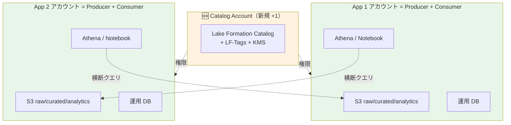
```mermaid
flowchart TB
    subgraph Cat["🆕 Catalog Account（新規 +1）"]
        LFCat["Lake Formation Catalog<br/>+ LF-Tags + KMS"]
    end

    subgraph A1["App 1 アカウント = Producer + Consumer"]
        S1["S3 raw/curated/analytics"]
        DB1["運用 DB"]
        Q1["Athena / Notebook"]
    end

    subgraph A2["App 2 アカウント = Producer + Consumer"]
        S2["S3 raw/curated/analytics"]
        DB2["運用 DB"]
        Q2["Athena / Notebook"]
    end

    Cat -.権限.-> A1
    Cat -.権限.-> A2
    Q1 -.横断クエリ.-> S2
    Q2 -.横断クエリ.-> S1

    style Cat fill:#fff3e0
    style A1 fill:#e8f5e9
    style A2 fill:#e8f5e9
```

**特徴**:
- **追加アカウント = Catalog Account 1 つだけ**（**+1**）
- アプリ追加 ≠ Consumer アカウント追加
- 各アプリの開発者・分析者が自分のアカウントから他アプリのデータも引ける
- **想定環境**: 小〜中規模、アプリ間の横断分析が必要だが**専属の BI チームはない**

### 4.2 Pattern β: 専用 Consumer アカウント 1 つだけ ⭐（**仮案選定**）

各アプリは Producer のみ。横断分析・BI は専属アカウントで集約。**Option B により Catalog を Consumer に同居**することで、Governance アカウントが不要に。

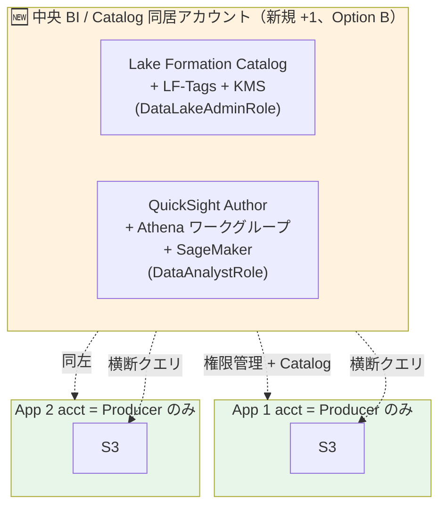
```mermaid
flowchart TB
    subgraph A1["App 1 acct = Producer のみ"]
        S1["S3"]
    end

    subgraph A2["App 2 acct = Producer のみ"]
        S2["S3"]
    end

    subgraph BICat["🆕 中央 BI / Catalog 同居アカウント（新規 +1、Option B）"]
        Cat["Lake Formation Catalog<br/>+ LF-Tags + KMS<br/>(DataLakeAdminRole)"]
        QS["QuickSight Author<br/>+ Athena ワークグループ<br/>+ SageMaker<br/>(DataAnalystRole)"]
    end

    BICat -.権限管理 + Catalog.-> A1
    BICat -.同左.-> A2
    BICat -.横断クエリ.-> S1
    BICat -.横断クエリ.-> S2

    style A1 fill:#e8f5e9
    style A2 fill:#e8f5e9
    style BICat fill:#fff3e0
```

**特徴**:
- **追加アカウント = 中央 BI / Catalog 同居の 1 つだけ**（**+1**、Option B 効果）
- 共通ドメイン（顧客マスタ等）を別アカウントとする場合は **+2 合計**
- 専属の BI / データ分析チームがいる組織向け
- アプリ側は分析クエリを投げない（または最小限）
- 同居の責務分離は IAM Role（`DataLakeAdminRole` / `DataAnalystRole`）で実装（[§5.5 緩和策](#55-option-b-が成立する条件と緩和策) 参照）

#### 4.2.1 §4.2 図に登場する AWS リソースの詳細解説

§4.2 の図は要点だけを示しているが、実際の構成には複数の AWS サービスが連携している。**Producer 側 / カタログ層 / 利用者層 / IAM Role** の 4 グループに分けて各リソースの役割を解説する。

##### 4.2.1.1 リソース関係図（カテゴリ別）

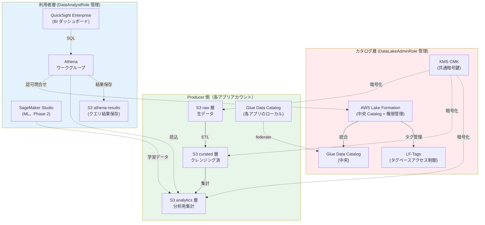
```mermaid
flowchart TB
    subgraph Producer["Producer 側（各アプリアカウント）"]
        S3raw["S3 raw 層<br/>生データ"]
        S3cur["S3 curated 層<br/>クレンジング済"]
        S3ana["S3 analytics 層<br/>分析用集計"]
        GlueProd["Glue Data Catalog<br/>(各アプリのローカル)"]
    end

    subgraph CatLayer["カタログ層 (DataLakeAdminRole 管理)"]
        LF["AWS Lake Formation<br/>(中央 Catalog + 権限管理)"]
        LFTags["LF-Tags<br/>(タグベースアクセス制御)"]
        KMS["KMS CMK<br/>(共通暗号鍵)"]
        GlueCat["Glue Data Catalog<br/>(中央)"]
    end

    subgraph UserLayer["利用者層 (DataAnalystRole 管理)"]
        Athena["Athena<br/>ワークグループ"]
        QS["QuickSight Enterprise<br/>(BI ダッシュボード)"]
        SM["SageMaker Studio<br/>(ML、Phase 2)"]
        S3Res["S3 athena-results<br/>(クエリ結果保存)"]
    end

    S3raw -->|ETL| S3cur
    S3cur -->|集計| S3ana
    LF -->|統合| GlueCat
    LF -->|タグ管理| LFTags
    GlueProd -.federate.-> GlueCat
    Athena -.認可問合せ.-> LF
    Athena -.読込.-> S3ana
    Athena -.結果保存.-> S3Res
    QS -.SQL.-> Athena
    SM -.学習データ.-> S3ana
    KMS -.暗号化.-> S3raw
    KMS -.暗号化.-> S3cur
    KMS -.暗号化.-> S3ana

    style Producer fill:#e8f5e9
    style CatLayer fill:#ffebee
    style UserLayer fill:#e3f2fd
```

##### 4.2.1.2 Producer 側（各アプリアカウント）のリソース

| リソース | 概要 | 本構成での役割 | 補足 |
|---|---|---|---|
| **S3 (Simple Storage Service)** | AWS のオブジェクトストレージ。無制限容量・11 nines 耐久性 | データレイクの中核。各アプリが「自分のデータ」を所有 | 暗号化（SSE-KMS）必須、ライフサイクルポリシーで Standard → IA → Glacier の自動移行 |
| **S3 raw 層** | 生データ層（Bronze）| アプリから直接取り込んだ生データ（JSON / CSV / Parquet 等）| 不変、Object Lock 検討、長期保管前提 |
| **S3 curated 層** | 整形済み層（Silver）| クレンジング・正規化・PII マスキング済（Parquet 推奨）| ETL ジョブで生成、データ品質チェック後 |
| **S3 analytics 層** | 分析用層（Gold）| 集計済み・分析に最適化されたテーブル（Parquet + パーティション）| BI / ML が直接クエリする層、`tenant_id` パーティション含む |
| **Glue Data Catalog（ローカル）** | 各アプリのテーブル定義・スキーマ・パーティション情報 | アプリ内のテクニカルメタデータストア | 中央 Lake Formation に Federate されて統合される |

##### 4.2.1.3 カタログ層（`DataLakeAdminRole` が管理）のリソース

| リソース | 概要 | 本構成での役割 | 補足 |
|---|---|---|---|
| **AWS Lake Formation** | AWS の中央データレイクガバナンスサービス | データレイクの「**ガバナンス層**」。表 / 列 / 行レベルのアクセス制御、クロスアカウント Catalog 提供、監査ログ | 各 Producer の S3 を「Federated Catalog」として束ねる |
| **Glue Data Catalog（中央）** | テーブル定義・スキーマ・パーティションのメタデータストア | Lake Formation の**下層**。Athena / Redshift Spectrum / EMR がメタデータを読む層 | Lake Formation = Glue Data Catalog + 権限管理層 |
| **LF-Tags (Lake Formation Tags)** | リソース（DB / テーブル / 列）に付与するキーバリュー型タグ | **タグベースアクセス制御（TBAC）** を実装。例: `機密度=Restricted` / `ドメイン=Finance` / `PII=Yes` | 個別テーブルへの権限付与より運用効率が高い。「Finance ドメインの PII=No なテーブル全て、SELECT 許可」のような宣言的設定 |
| **KMS CMK (Customer Managed Key)** | AWS の暗号鍵管理サービス、利用者が管理する鍵 | データレイク全体の暗号化に使用。鍵の生成・ローテーション・廃棄を管理 | アカウント間で鍵ポリシーを設定すれば、App 側からも CMK を使える（クロスアカウント暗号化） |

##### 4.2.1.4 利用者層（`DataAnalystRole` が管理）のリソース

| リソース | 概要 | 本構成での役割 | 補足 |
|---|---|---|---|
| **Athena** | AWS のサーバーレス SQL クエリエンジン（Trino ベース）| S3 上のデータを直接 SQL でクエリ。スキャンしたデータ量に応じた従量課金 | Lake Formation と統合され、認可は LF 経由 |
| **Athena ワークグループ** | クエリ実行の論理コンテナ | **用途別に分離**: 探索用 / BI 用 / 監査用 / アプリ問い合わせ用 など | 各 WG にクエリ結果保存先・スキャン量上限（コスト統制）・ログ出力先・暗号化設定 |
| **QuickSight Enterprise** | AWS の BI / ダッシュボードサービス | 経営層・CS・PM 等の業務利用者向けダッシュボード提供 | Enterprise Edition は **行レベルセキュリティ（RLS）対応** → テナント分離に重要 |
| **QuickSight Author** | ダッシュボード作成可能なユーザー権限 | 中央 BI チームのリーダーが該当 | ライセンス: ユーザーあたり月額（Reader より高い）|
| **QuickSight Reader** | ダッシュボード閲覧のみ可能なユーザー権限 | 業務利用者（経営層・CS・PM 等）が該当 | ライセンス: ユーザーあたり月額（Author より安い）、Author:Reader 比率は **1:10** 想定 |
| **QuickSight SPICE** | インメモリ計算エンジン | ダッシュボード応答時間を秒オーダーに高速化 | ピーク負荷のあるダッシュボードは SPICE 利用必須 |
| **SageMaker Studio** | AWS の機械学習プラットフォーム | 解約予兆検知 / 顧客健全性スコア / 業界別利用パターン分析 等の ML 開発 | Phase 2 から本格採用想定。Notebook / Training / Inference / Model Registry |
| **S3 athena-results** | Athena のクエリ結果保存用 S3 バケット | クエリ結果の中間ファイル保存、再利用・キャッシュにも使用 | ワークグループ単位で別バケット推奨（機密度別分離）|

##### 4.2.1.5 IAM Role 体系

[§5.5 緩和策](#55-option-b-が成立する条件と緩和策) で定めた 3 階層 Role の権限詳細:

| Role | 担当 | 主な権限 | 主な制約 |
|---|---|---|---|
| **`DataLakeAdminRole`** | 役割 3<br/>カタログ管理者（1-2 名）| ・Lake Formation 管理（Database / Table / Permission）<br/>・LF-Tags の作成・編集・付与<br/>・クロスアカウント Grant<br/>・KMS CMK 管理<br/>・データレイク全データへの読み権限（デバッグ用）| ・通常の業務 BI 操作はしない（QuickSight ダッシュボード作成等）<br/>・**Phase 1: 1-2 名のみ AssumeRole 可能**<br/>・常時ログインなし、必要時のみ一時利用 |
| **`DataAnalystRole`** | 役割 4<br/>中央 BI チーム（2 名）| ・Athena クエリ実行（許可された WG 内）<br/>・QuickSight ダッシュボード作成・編集・閲覧<br/>・自分の S3 結果バケットへの書込み<br/>・SageMaker での ML 開発（Phase 2）| ・**Lake Formation 管理操作は Permission Boundary で拒否**<br/>・他アプリの S3 への書込み不可<br/>・KMS 管理操作は不可<br/>・LF-Tags の変更不可 |
| **`DataReaderRole`** | 役割 6<br/>業務利用者（10 名）| ・QuickSight ダッシュボード閲覧のみ<br/>・許可された定形クエリのみ実行（Athena Saved Queries）| ・新規クエリ作成不可<br/>・データのダウンロード制限（QuickSight からの Export 制限）<br/>・LF-Tags / Lake Formation 管理は不可 |

##### 4.2.1.6 Permission Boundary と SCP（補強）

Role 間の境界を強制するためのガードレール:

| 制御 | 仕組み | 目的 |
|---|---|---|
| **Permission Boundary** | 各 IAM Role に付与する「上限ポリシー」 | `DataAnalystRole` から `lakeformation:*` の API 呼び出しを拒否 → 役割 4 が Catalog を操作できないことを保証 |
| **SCP (Service Control Policy)** | Organization レベルで設定するアカウント全体の制約 | 中央 BI / Catalog アカウント内で意図しない権限上昇（IAM Role 作成・PolicyVersion 変更等）を予防 |
| **AWS Config Rules** | 構成監視ルール | 「`DataLakeAdminRole` と `DataAnalystRole` を兼任するユーザー」を検出 → 役割 3 / 4 の人員重複を防止（Option B 成立前提） |

##### 4.2.1.7 図にはないが関連する重要リソース

§4.2 図は要点だけを示しているため、以下も実構成では存在する:

| リソース | 役割 | 配置 |
|---|---|---|
| **AWS RAM (Resource Access Manager)** | クロスアカウント Lake Formation 権限共有の裏で使用される AWS の基盤サービス | Lake Formation 内部で自動利用（明示的に意識不要）|
| **CloudTrail Data Events** | データプレーン操作（S3 オブジェクトアクセス、Lake Formation 操作、KMS 鍵使用）のログ | [§5.8 監査責務分離](#58-監査責務分離の具体設計option-b-採用時--新規監査アカウント前提) で監査アカウントへ送付 |
| **VPC エンドポイント** | プライベートネットワーク経由で S3 / Athena / Lake Formation にアクセス | 全アカウントで設定、データの公開ネットワーク経由を回避 |
| **Glue ETL** | データ変換ジョブ（raw → curated → analytics）| Producer 側（各アプリ）が運用 |
| **Glue Crawler** | スキーマ自動検出 + Glue Catalog 登録 | Producer 側で運用、新規データ発生時に実行 |

#### 4.2.2 ETL 的な処理の配置

##### 4.2.2.1 配置の原則: 「データを生む側が ETL する」

Data Mesh の **Domain Ownership** 原則に従う:
- **データの取り込み・整形・自前集計は Producer 側**（各アプリ）
- **横断集計・SaaS 提供側の派生データ生成は Central 側**（中央 BI / Catalog）
- **顧客企業ごとの分析（仮にスコープに含む場合）は Consumer 側**

##### 4.2.2.2 図解: ETL のデータフロー全体像

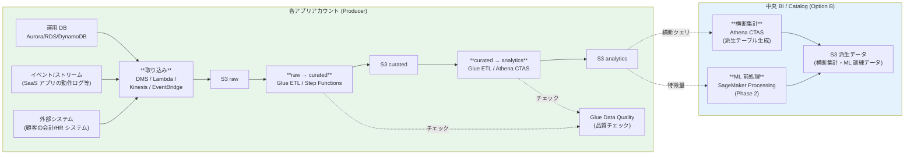
```mermaid
flowchart LR
    subgraph App["各アプリアカウント (Producer)"]
        direction TB
        DB["運用 DB<br/>Aurora/RDS/DynamoDB"]
        Stream["イベント/ストリーム<br/>(SaaS アプリの動作ログ等)"]
        Ext["外部システム<br/>(顧客の会計/HR システム)"]

        Ingest["**取り込み**<br/>DMS / Lambda /<br/>Kinesis / EventBridge"]

        S3R["S3 raw"]
        ETL1["**raw → curated**<br/>Glue ETL / Step Functions"]
        S3C["S3 curated"]
        ETL2["**curated → analytics**<br/>Glue ETL / Athena CTAS"]
        S3A["S3 analytics"]

        Quality["Glue Data Quality<br/>(品質チェック)"]
    end

    subgraph Central["中央 BI / Catalog (Option B)"]
        direction TB
        CTAS["**横断集計**<br/>Athena CTAS<br/>(派生テーブル生成)"]
        SMP["**ML 前処理**<br/>SageMaker Processing<br/>(Phase 2)"]
        S3Derived["S3 派生データ<br/>(横断集計・ML 訓練データ)"]
    end

    DB --> Ingest
    Stream --> Ingest
    Ext --> Ingest
    Ingest --> S3R
    S3R --> ETL1
    ETL1 --> S3C
    S3C --> ETL2
    ETL2 --> S3A
    ETL1 -.チェック.-> Quality
    ETL2 -.チェック.-> Quality

    S3A -.横断クエリ.-> CTAS
    CTAS --> S3Derived
    S3A -.特徴量.-> SMP
    SMP --> S3Derived

    style App fill:#e8f5e9
    style Central fill:#e3f2fd
```

##### 4.2.2.3 ETL の 3 種類と配置詳細

###### A. Producer 側 ETL（各アプリアカウント、主役）

最も多くの ETL がここに集中する。各アプリチームが**自データの所有者として実装責任**を持つ。

| 段階 | 内容 | 主な用途 |
|---|---|---|
| **データ取り込み（Ingestion）** | 運用 DB / 外部システム → S3 raw | リアルタイム性・整合性の確保 |
| **raw → curated** | クレンジング・正規化・PII マスキング・`tenant_id` 強制付与 | データ品質と機密度制御 |
| **curated → analytics** | 集計・パーティション化・Parquet 化・分析用最適化 | 分析クエリのパフォーマンス向上 |

###### B. Central 側 ETL（中央 BI / Catalog アカウント、横断分析用）

顧客企業横断・SaaS 提供側の集計が中心。中央 BI チームが実装責任を持つ。

| 内容 | 主な用途 |
|---|---|
| **横断テナント集計** | 顧客健全性スコア計算、業界別利用パターン分析 |
| **派生データ生成** | BI 用の事前集計テーブル、月次レポート用集計 |
| **ML 前処理** | 解約予兆検知モデルの訓練データ作成（Phase 2）|
| **データ統合** | 複数アプリのデータを Join した派生テーブル |

###### C. 外部連携系 ETL（Producer 側に組み込まれる）

顧客企業のシステムからデータを取り込む特殊な ETL。

| 内容 | 配置 |
|---|---|
| 顧客会計システム連携 | Producer 側（経費精算 SaaS 内）+ AWS Transfer Family / Glue Custom Connector |
| 法人カード明細 | 同上 + 外部 SaaS API 連携 |
| 人事システムからの組織マスタ取り込み | 共通ドメインアカウント（顧客マスタ等の管理用）|

##### 4.2.2.4 ETL ツール選定マトリクス

| 用途 | 推奨ツール | 配置 | 補足 |
|---|---|---|---|
| **バッチ取り込み** | AWS Glue ETL, Step Functions | Producer | スケジュール実行、複数ジョブのオーケストレーション |
| **ストリーム取り込み** | Kinesis Data Firehose, MSK | Producer | リアルタイム性が必要な場合 |
| **CDC 取り込み** | DMS, Aurora Zero-ETL | Producer | 運用 DB → S3 のニアリアルタイム同期 |
| **小規模変換** | AWS Lambda | Producer | イベント駆動・軽量処理 |
| **大規模 Spark 変換** | AWS Glue ETL（Spark mode）, EMR Serverless | Producer | TB 級データの一括変換 |
| **横断集計（テナント横断）** | Athena CTAS（Create Table As Select）| Central | SQL ベースで完結、サーバーレス |
| **ML 前処理** | SageMaker Processing | Central | Phase 2 から、scikit-learn / Spark 等 |
| **データ品質チェック** | AWS Glue Data Quality | Producer 主体 | NULL 率・型違反・重複率の自動検出 |
| **パイプライン管理** | AWS Step Functions, EventBridge Scheduler | Producer | リトライ・分岐・並列実行 |
| **スキーマ自動検出** | AWS Glue Crawler | Producer | 新規データ発生時に Catalog 自動更新 |

##### 4.2.2.5 関連する非 ETL 処理（補足）

ETL とは別だが密接に関連する処理:

| 処理 | 配置 | ツール | 内容 |
|---|---|---|---|
| **データ品質監視**（NULL 率・鮮度・重複率）| Producer | Glue Data Quality | パイプライン実行後にチェック、閾値超えで通知 |
| **データリネージ追跡** | Central + Producer | Glue Lineage（将来）, OpenLineage | データの来歴可視化、SMC 採用時に強化 |
| **メタデータ更新** | Producer | Glue Crawler | スキーマ変更時の Catalog 自動同期 |
| **PII 検出・マスキング** | Producer の raw → curated 段階 | Macie（検出）+ Glue ETL（マスキング）| 個人情報を curated 層に持ち込まないための処理 |

##### 4.2.2.6 重要な設計原則

| # | 原則 | 説明 |
|---|---|---|
| 1 | **ELT を原則とする** | 生データはまず raw 層に着地、加工は下流（curated / analytics）で実施。例外は取り込み時点で PII マスキングが必須な場合のみ |
| 2 | **冪等性の徹底** | すべての ETL ジョブは冪等に設計、再実行で同じ結果を得られる |
| 3 | **テナント分離を ETL で強制** | raw → curated 変換時に `tenant_id` が確実に付与されるよう設計、欠落時はエラー |
| 4 | **個別アプリの集計は Producer で完結** | 「自分のデータの集計」はアプリ責任。Central は横断・SaaS 全体の集計のみ |
| 5 | **横断集計は SQL ファースト** | Central 側の派生データ生成は Athena CTAS が第一選択。Glue ETL は必要時のみ |
| 6 | **品質チェックを必須化** | Glue Data Quality でパイプライン後に検証、品質劣化時は自動停止 |

##### 4.2.2.7 残課題（ヒアリングで確認）

| # | 質問 | 影響 |
|---|---|---|
| 1 | 各アプリのデータエンジニアリングスキル | Producer 側 ETL の実装可否、研修必要性 |
| 2 | 既存の ETL 基盤（cron / Airflow / 自前バッチ）の取扱 | 移行戦略、並行運用期間 |
| 3 | リアルタイム性の要件（解約予兆検知の遅延許容）| ストリーム取り込みの採否 |
| 4 | 顧客企業マスタ・契約管理システムとの連携方式 | 共通ドメインアカウントの ETL 設計 |

#### 4.2.3 Glue Crawler の位置付けと運用

##### 4.2.3.1 Glue Crawler の役割

| 機能 | 内容 |
|---|---|
| **スキーマ自動検出** | S3 上のデータ（CSV / JSON / Parquet / ORC 等）からスキーマを推論 |
| **Glue Data Catalog 更新** | 検出したスキーマでテーブル定義を作成・更新 |
| **パーティション検出** | `s3://.../year=YYYY/month=MM/day=DD/` のような Hive 形式のパーティション認識 |
| **データフォーマット検出** | ファイル形式（Parquet vs JSON 等）の自動判定 |
| **スキーマ進化追跡** | 既存テーブルへの列追加・型変更を検出（ポリシーで挙動制御）|

##### 4.2.3.2 配置（Producer 側、各アプリアカウント内）

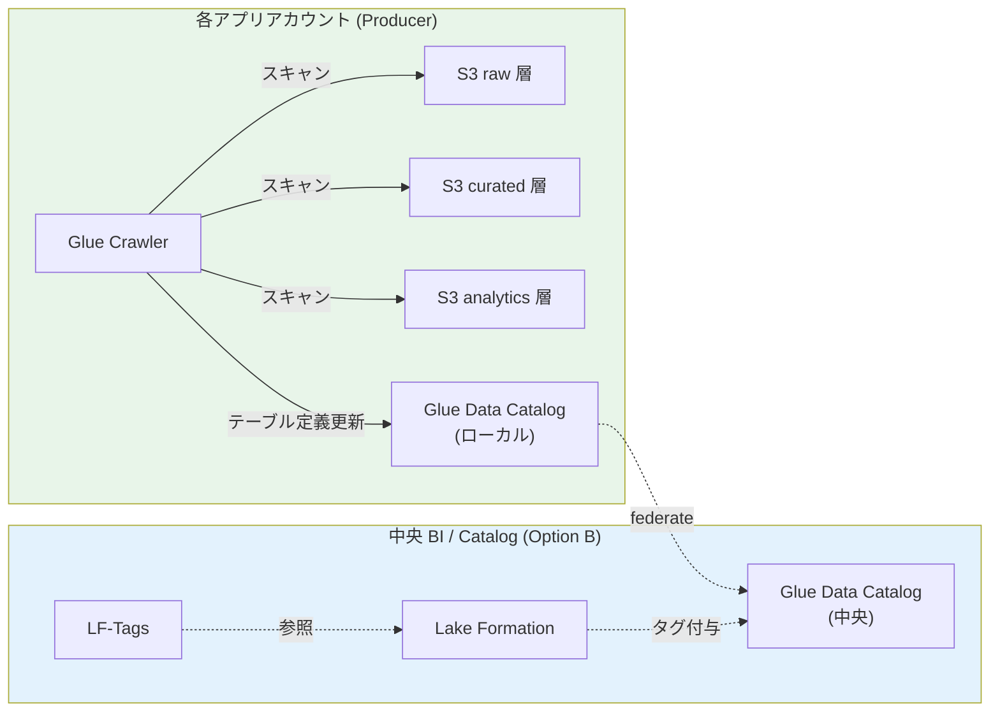
```mermaid
flowchart LR
    subgraph App["各アプリアカウント (Producer)"]
        Crawler["Glue Crawler"]
        S3R["S3 raw 層"]
        S3C["S3 curated 層"]
        S3A["S3 analytics 層"]
        GlueProd["Glue Data Catalog<br/>(ローカル)"]
    end

    subgraph Central["中央 BI / Catalog (Option B)"]
        LF["Lake Formation"]
        GlueCat["Glue Data Catalog<br/>(中央)"]
        LFTags["LF-Tags"]
    end

    Crawler -->|スキャン| S3R
    Crawler -->|スキャン| S3C
    Crawler -->|スキャン| S3A
    Crawler -->|テーブル定義更新| GlueProd
    GlueProd -.federate.-> GlueCat
    LF -.タグ付与.-> GlueCat
    LFTags -.参照.-> LF

    style App fill:#e8f5e9
    style Central fill:#e3f2fd
```

**配置の原則**: Crawler は **データに最も近い場所**（Producer 側）で動かす。ローカル Glue Data Catalog を更新し、その結果が **Cross-account Glue Catalog Federation** で中央 Lake Formation に反映される。

##### 4.2.3.3 各層での Crawler の必要性

| 層 | Crawler の必要性 | 理由 |
|---|:---:|---|
| **S3 raw 層** | ⭐⭐⭐ 高 | 取り込み元（顧客の会計システム等）からのデータ形式・スキーマが未知の可能性、外部 SaaS のスキーマ変更追従に必要 |
| **S3 curated 層** | ⭐⭐ 中 | ETL ジョブが明示的にスキーマ定義することが多いが、念のため Crawler で検証 |
| **S3 analytics 層** | ⭐ 低 | Athena CTAS / Glue ETL（Spark）が**自動的に Glue Catalog に登録**するため Crawler 不要 |

##### 4.2.3.4 実行タイミング

| トリガ | 使い分け |
|---|---|
| **スケジュール**（毎日 / 毎時）| 定期的なデータ取り込み・raw 層のスキーマドリフト検出に最適 |
| **EventBridge**（S3 ObjectCreated）| 不定期な大量データ取り込み時、リアルタイム性が必要な場合 |
| **ETL パイプライン終了時**（Step Functions から呼出）| 推奨。ETL → Crawler → 通知 の一連のフローで運用 |
| **手動実行** | 新規データソース追加時の検証 |

##### 4.2.3.5 Lake Formation との連携フロー

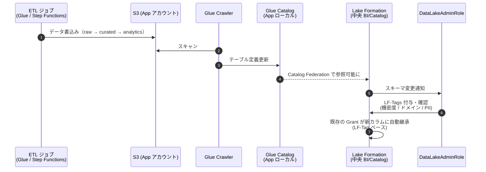
```mermaid
sequenceDiagram
    autonumber
    participant ETL as ETL ジョブ<br/>(Glue / Step Functions)
    participant S3 as S3 (App アカウント)
    participant Crawler as Glue Crawler
    participant GlueProd as Glue Catalog<br/>(App ローカル)
    participant LFCentral as Lake Formation<br/>(中央 BI/Catalog)
    participant Admin as DataLakeAdminRole

    ETL->>S3: データ書込み（raw → curated → analytics）
    Crawler->>S3: スキャン
    Crawler->>GlueProd: テーブル定義更新
    GlueProd-->>LFCentral: Catalog Federation で参照可能に
    LFCentral->>Admin: スキーマ変更通知
    Admin->>LFCentral: LF-Tags 付与・確認<br/>(機密度 / ドメイン / PII)
    LFCentral->>LFCentral: 既存の Grant が新カラムに自動継承<br/>(LF-Tag ベース)
```

**重要**: スキーマ変更時、**新カラムへの LF-Tags は自動継承されない**ケースがある（タグ設計次第）。DataLakeAdminRole の運用プロセスとして「Crawler 実行後の LF-Tags レビュー」を組み込む必要。

##### 4.2.3.6 ベストプラクティス（使う / 使わないの判断）

| 状況 | 推奨アプローチ | 理由 |
|---|---|---|
| **未知形式の raw データ取り込み**（外部システム連携）| ✅ Crawler 必須 | スキーマが事前に分からない |
| **ETL ジョブが明示的にスキーマ定義** | △ Crawler 不要 | ETL ジョブのスキーマが信頼できる |
| **Athena CTAS で派生テーブル生成** | ❌ Crawler 不要 | Athena が自動カタログ登録 |
| **大規模バケット**（数 TB 超 / 数百万ファイル）| ⚠ Crawler のスキャンコスト注意 | パーティションを限定したクロールを推奨 |
| **ストリーミングデータ**（Kinesis Firehose）| △ Glue Schema Registry を使用 | Crawler よりも Schema Registry のほうが適切 |
| **IaC 管理されたスキーマ** | ❌ Crawler 不要 | CDK / CloudFormation でスキーマを定義済み |

##### 4.2.3.7 代替手段（Crawler を使わない選択肢）

| 代替手段 | 用途 | 利点 |
|---|---|---|
| **AWS Glue Schema Registry** | ストリーミングデータ（Kinesis / MSK）のスキーマ管理 | スキーマ進化のバージョン管理、後方互換性チェック |
| **IaC（CDK / CloudFormation）でスキーマ定義** | 既知の安定したスキーマ | バージョン管理、レビュー可能、再現性 |
| **Lake Formation Resource Link** | クロスアカウント Catalog 参照 | Crawler 不要で他アカウントの Catalog を共有 |
| **ETL ジョブ内でのスキーマ宣言** | Spark / Pandas で明示定義 | 型変換・バリデーションを ETL と同時実行 |
| **Glue DataBrew** | データプロファイリング + スキーマ検出 | より高度な分析・品質チェック付き |

##### 4.2.3.8 コスト感

| 項目 | 単価 | 影響 |
|---|---|---|
| **クロール実行時間** | 1 DPU-hour あたり $0.44 | データ量・パーティション数次第で月数十 USD オーダー |
| **データスキャン** | 別途 S3 GET リクエスト課金 | 大規模バケットでは無視できない |
| **Glue Data Catalog ストレージ** | 月 100 万オブジェクトまで無料、超過後課金 | 数千テーブル程度なら無料枠内 |

**最適化のコツ**:
- **パーティション限定**: `s3://.../year=2026/month=06/` のように最新パーティションのみクロール
- **除外パターン**: `.tmp` ファイル等の不要ファイルを除外
- **更新検出モード**: 「Crawl new sub-folders only」で全スキャンを回避

##### 4.2.3.9 残課題（ヒアリングで確認）

| # | 質問 | 影響 |
|---|---|---|
| 1 | 各アプリのデータ取り込み形式の安定性 | Crawler を使うか IaC でスキーマ定義するか |
| 2 | スキーマ進化（既存カラムの型変更等）への対応ポリシー | Crawler の `SchemaChangePolicy` 設定 |
| 3 | Crawler 実行頻度の妥当性 | コスト・鮮度のバランス |
| 4 | LF-Tags 再付与プロセスの自動化要否 | スキーマ変更時の Catalog 管理者運用 |

#### 4.2.4 AWS RAM の役割と使用箇所

##### 4.2.4.1 AWS RAM とは

**AWS Resource Access Manager**: AWS リソースをアカウント間で共有するためのサービス。

| 機能 | 内容 |
|---|---|
| **リソース共有の宣言** | 「このリソースをこの相手に共有する」を Resource Share として作成 |
| **共有相手の指定** | (a) 個別 AWS アカウント ID / (b) Organization 内の OU / (c) Organization 全体 |
| **権限の付与** | Resource Share 内で何ができるか（読み専用 / 書き可 / etc.）を managed permission で指定 |
| **Auto-accept** | Organization 内なら **自動受諾** 可能（個別承認不要）|

##### 4.2.4.2 質問への回答: 子アカウント同士で共有できるか

**結論: YES、できる。Management アカウント経由は不要。**

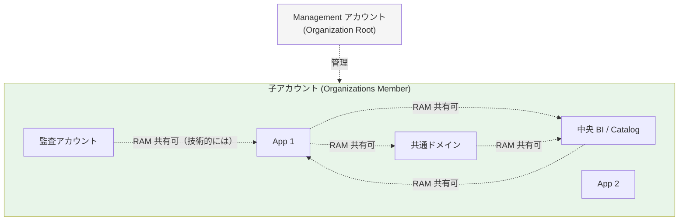
```mermaid
flowchart TB
    Mgmt["Management アカウント<br/>(Organization Root)"]

    subgraph Children["子アカウント (Organizations Member)"]
        direction LR
        Audit["監査アカウント"]
        BICat["中央 BI / Catalog"]
        App1["App 1"]
        App2["App 2"]
        Common["共通ドメイン"]
    end

    Mgmt -.管理.-> Children

    BICat -.RAM 共有可.-> App1
    App1 -.RAM 共有可.-> BICat
    Audit -.RAM 共有可（技術的には）.-> App1
    App1 -.RAM 共有可.-> Common
    Common -.RAM 共有可.-> BICat

    style Mgmt fill:#f5f5f5
    style Children fill:#e8f5e9
```

**仕組み**:
1. 共有元アカウントが Resource Share を作成
2. Resource Share に「このリソースをこの相手に共有」と宣言
3. Organization 設定で **「AWS Organizations での共有を有効化」** をオンにしておくと、Org 内の共有は受信側で自動受諾される
4. 受信側は IAM 権限を別途付与すれば共有リソースを利用可能

**制約**:
- 共有元は **そのリソースの所有者** でなければならない（自分が持っていないリソースは共有できない）
- 受信側で利用するには **IAM 権限** が別途必要（RAM は「アクセスを許可する」だけ、IAM が「使うことを許可する」）
- リソース種別ごとに共有可否が決まっている（[RAM 対応リソース一覧](https://docs.aws.amazon.com/ram/latest/userguide/shareable.html)）

##### 4.2.4.3 本構成での RAM 使用箇所一覧

| 共有元 | 共有先 | リソース | 用途 | 仕組み |
|---|---|---|---|---|
| **中央 BI / Catalog** | App アカウント（Producer）| Lake Formation 権限 | Producer が自分のデータを Lake Formation に登録できるようにする | **Lake Formation Cross-Account v3 が RAM を透過利用** |
| **App アカウント**（Producer）| 中央 BI / Catalog | Glue Data Catalog テーブル | Producer の Catalog を中央 LF が参照（Federation）| Lake Formation 経由 |
| **共通ドメインアカウント** | 中央 BI / Catalog | Glue Data Catalog テーブル | 共通参照データ（顧客マスタ等）を中央から参照 | 同上 |
| **共通ドメインアカウント** | App アカウント | Glue Data Catalog テーブル | 各アプリが共通マスタを参照（例: 経費精算が顧客マスタを Join）| 同上 |
| **将来 γ パターン採用時**: 中央 BI / Catalog | 各 Consumer アカウント | Lake Formation 権限 | 各アプリ内 Consumer がデータをクエリできる | Lake Formation Cross-Account |
| **オプション**: 中央 BI / Catalog | App アカウント | KMS CMK | 暗号化鍵を App 側からも使えるように | **KMS 鍵ポリシー**（RAM ではなく Key Policy で制御）|
| **監査アカウント** | データ標準アカウント | （基本なし）| 詳細は §4.2.4.5 参照 | — |

##### 4.2.4.4 Lake Formation での RAM 透過利用

**重要**: Lake Formation **Cross-Account Permissions v3**（現行）は、RAM を **自動的に裏で作成・管理** する。利用者が明示的に RAM Resource Share を作る必要はない。

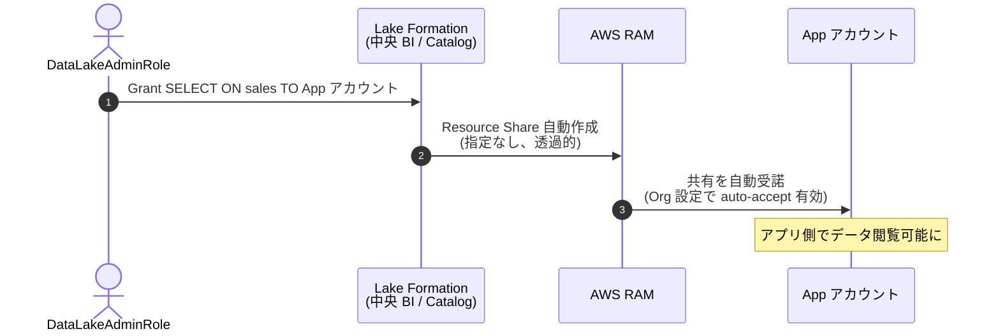
```mermaid
sequenceDiagram
    autonumber
    actor Admin as DataLakeAdminRole
    participant LF as Lake Formation<br/>(中央 BI / Catalog)
    participant RAM as AWS RAM
    participant App as App アカウント

    Admin->>LF: Grant SELECT ON sales TO App アカウント
    LF->>RAM: Resource Share 自動作成<br/>(指定なし、透過的)
    RAM->>App: 共有を自動受諾<br/>(Org 設定で auto-accept 有効)
    Note over App: アプリ側でデータ閲覧可能に
```

→ **DataLakeAdminRole は LF Grant のみ意識すればよい**。RAM の存在は知っていれば十分。

##### 4.2.4.5 監査アカウント → 案件アカウントの共有

**技術的可否**: 可能（Organizations 内の子アカウント間共有）

**ただし、本構成では基本的に不要**:
- 監査アカウントは通常 **ログを受け取る側**（受信専用）
- 監査アカウントから案件アカウントへの「リソース共有」は限定的なシナリオでのみ発生

**監査アカウント → 案件アカウントの共有が発生しうる典型シナリオ**:

| シナリオ | 内容 | 仕組み |
|---|---|---|
| **セキュリティ標準の AMI 配布** | 監査チームが標準化された AMI を全アカウントに共有 | RAM（AMI を Resource Share）|
| **共通 KMS 鍵の利用許可** | 監査チームが管理する暗号鍵を案件アカウントが使用 | KMS 鍵ポリシー（RAM ではない）|
| **Security Hub Insights / Custom Actions の共有** | カスタムフィルタを案件アカウントに展開 | Security Hub の Delegated Admin 機能 |
| **Config Conformance Pack のデプロイ** | コンプラチェックルールを案件側にデプロイ | Config の Multi-Account 機能 |
| **Network Firewall の共通ルール** | NW ファイアウォール設定を案件側に共有 | RAM（NW Firewall Rule Group を Resource Share）|

**監査アカウントが管理側のサービス使用例**:
- Security Hub Delegated Administrator
- GuardDuty Delegated Administrator
- Macie Delegated Administrator
- Config Aggregator

→ これらは **RAM ではなく各サービスの Delegated Admin / Aggregator 機能** で実現。RAM の直接利用は限定的。

##### 4.2.4.6 RAM 設定の流れ（例: Lake Formation 共有を手動で確認する場合）

```bash
# 1. Lake Formation Grant 実行
aws lakeformation grant-permissions \
    --principal DataLakePrincipalIdentifier=arn:aws:iam::APP_ACCOUNT_ID:root \
    --permissions SELECT \
    --resource Table='{DatabaseName=sales,Name=transactions}'

# 2. Lake Formation が裏で RAM Resource Share を作成
# 3. RAM 側で確認
aws ram list-resources \
    --resource-owner SELF

# 4. App アカウント側で受諾状態確認（auto-accept なら不要）
aws ram get-resource-share-invitations
```

##### 4.2.4.7 注意点と落とし穴

| # | 注意点 | 影響 |
|---|---|---|
| 1 | **Organization 設定の「RAM 共有有効化」が必須** | OFF の場合、子アカウント間共有が auto-accept にならず手動承認が必要 |
| 2 | **共有先での IAM 権限付与が別途必要** | RAM が「リソースを見える」ようにするだけ、利用には IAM 権限が必要 |
| 3 | **共有可能なリソースは限られる** | S3 バケットは RAM では共有できない（バケットポリシーで対応）|
| 4 | **Resource Share の上限**: アカウントあたり 5000 個まで | 大規模環境で要監視 |
| 5 | **Resource Link との違い**: Glue Catalog のクロスアカウント参照には **Resource Link** が必要（RAM 共有とは別）| Lake Formation 経由で自動生成される |
| 6 | **削除順序**: 共有元で削除 → 共有先で自動的に見えなくなる | データへの影響なし、メタデータのみ |
| 7 | **Auto-accept が効くのは Org 内のみ** | 別 Org への共有は手動受諾必要（本構成では発生しない）|

##### 4.2.4.8 残課題（ヒアリングで確認）

| # | 質問 | 影響 |
|---|---|---|
| 1 | Organizations の「**RAM 共有有効化**」設定状況 | 子アカウント間 auto-accept の可否 |
| 2 | 監査アカウントから案件アカウントへ配布したいリソースの有無 | RAM 使用範囲の確定 |
| 3 | KMS CMK のアカウント間利用の権限設計 | 鍵ポリシー設計（RAM ではなく Key Policy）|
| 4 | Resource Share の管理ガバナンス（誰が作成・削除できるか）| `DataLakeAdminRole` の権限範囲 |


各アプリは自分の分野の分析を自前で実施（Producer + Consumer）+ 中央 BI / 経営層向け横断分析は専用 Consumer。**Option B により Catalog を中央 BI Consumer に同居**。

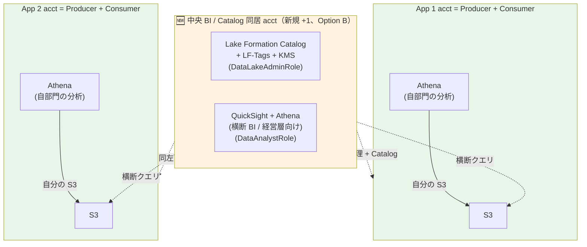
```mermaid
flowchart TB
    subgraph A1["App 1 acct = Producer + Consumer"]
        S1["S3"]
        Q1["Athena<br/>(自部門の分析)"]
    end

    subgraph A2["App 2 acct = Producer + Consumer"]
        S2["S3"]
        Q2["Athena<br/>(自部門の分析)"]
    end

    subgraph BICat["🆕 中央 BI / Catalog 同居 acct（新規 +1、Option B）"]
        Cat["Lake Formation Catalog<br/>+ LF-Tags + KMS<br/>(DataLakeAdminRole)"]
        QS["QuickSight + Athena<br/>(横断 BI / 経営層向け)<br/>(DataAnalystRole)"]
    end

    BICat -.権限管理 + Catalog.-> A1
    BICat -.同左.-> A2
    Q1 -->|自分の S3| S1
    Q2 -->|自分の S3| S2
    BICat -.横断クエリ.-> S1
    BICat -.横断クエリ.-> S2

    style A1 fill:#e8f5e9
    style A2 fill:#e8f5e9
    style BICat fill:#fff3e0
```

**特徴**:
- **追加アカウント = 中央 BI / Catalog 同居の 1 つだけ**（**+1**、Option B 効果）
- 共通ドメインを別アカウントとする場合は **+2 合計**
- 各アプリは自前で自分の分析、中央 BI チームは横断分析
- **中規模以上の組織で最も一般的**
- 同居の責務分離は IAM Role で実装（[§5.5 緩和策](#55-option-b-が成立する条件と緩和策) 参照）

### 4.4 推奨マトリクス（Option B 適用後 + 共通ドメイン込み）

> 数値は **Option B（Catalog 同居 Consumer）適用後 + 共通ドメインアカウント (+1) 込み**の合計追加アカウント数。

| 組織条件 | 推奨パターン | 追加アカウント数 |
|---|:---:|:---:|
| 小規模、専属 BI / データ分析チームなし | **α** | **+2**（独立 Catalog +1、共通ドメイン +1。Option B 不適用）|
| 中央 BI / 経営 KPI ダッシュボードが重要、専属 BI チームあり、組織体制未整備で開始 | **β** ⭐（**仮案選定 = Phase 1**）| **+2**（中央 BI/Catalog 同居 +1、共通ドメイン +1）|
| 中央 BI 体制が整い、各アプリチームの自前分析も可能 | **γ**（業界標準推奨、仮案 Phase 2 移行先）| **+2**（中央 BI/Catalog 同居 +1、共通ドメイン +1）|
| 大規模、複数の分析チーム / ML チームが並行で動く | γ 拡張 | **+3 以上**（Catalog 単独 Option C、複数 Consumer）|
| アプリ側に分析機能を持たせたくない（権限統制重視）| **β** | **+2** |

> **仮案選定の根拠**: アプリチームに分析スキルなし（Q1）+ 専属 BI チームなし（Q4）→ Phase 1 では γ ではなく β、組織が整ったら Phase 2 で γ へ移行（Path C 段階移行、[strawman §4](strawman-proposal.md) 参照）。

---

## 5. Catalog vs Governance — 用語整理と配置 3 オプション

### 5.1 「Catalog Account」と「Governance Account」の用語

AWS 公式ドキュメント内で**両方の用語が使われており、スコープが違う**ものに付けられている:

| AWS ドキュメント | 使用用語 | スコープ |
|---|---|---|
| [Prescriptive Guidance: Data Mesh](https://docs.aws.amazon.com/prescriptive-guidance/latest/strategy-data-mesh/aws-offerings-data-mesh.html) | 「Central Account」「Governance Account」 | 広め（Catalog + permission + 監査）|
| [Lake Formation Cross-Account 公式](https://docs.aws.amazon.com/lake-formation/latest/dg/cross-account-permissions.html) | **「Central Catalog Account」** | 狭い（Catalog + permission のみ）|
| [DataZone Multi-Account](https://docs.aws.amazon.com/datazone/latest/userguide/working-with-accounts.html) | 「Domain Account」 | Catalog + Domain |
| [Secure Data Mesh Solutions](https://aws.amazon.com/solutions/guidance/secure-data-mesh-with-distributed-data-asset-ownership-on-aws) | 「Central Governance Account」 | 広め |
| [AWS Landing Zone Accelerator](https://aws.amazon.com/solutions/implementations/landing-zone-accelerator-on-aws/) | 「Audit Account」「Log Archive Account」 | 監査は別建て |

**用語の本質**: 「Governance Account」は複数責務を束ねた**包括用語**で、実装上は分解されることが多い。

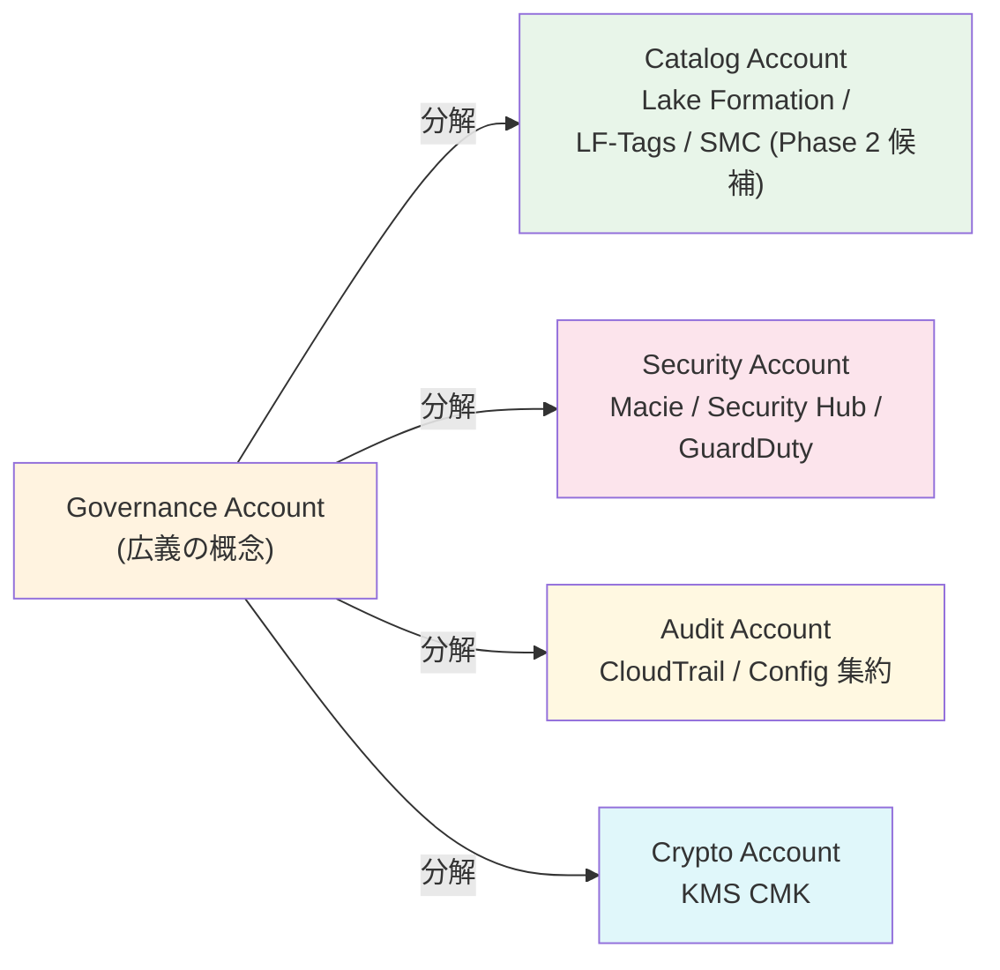
```mermaid
flowchart LR
    Broad["Governance Account<br/>(広義の概念)"]
    Broad -->|分解| Cat["Catalog Account<br/>Lake Formation /<br/>LF-Tags / SMC (Phase 2 候補)"]
    Broad -->|分解| Sec["Security Account<br/>Macie / Security Hub /<br/>GuardDuty"]
    Broad -->|分解| Audit["Audit Account<br/>CloudTrail / Config 集約"]
    Broad -->|分解| Crypto["Crypto Account<br/>KMS CMK"]

    style Broad fill:#fff3e0
    style Cat fill:#e8f5e9
    style Sec fill:#fce4ec
    style Audit fill:#fff8e1
    style Crypto fill:#e0f7fa
```

### 5.2 既存アカウント体系を活かす責務再配置

ユーザー環境では**親会社統制アカウントが Audit / Security 集約を担う**ことを前提に、責務を再配置できる:

| 責務 | 元の置き場（§2 仮案）| 親会社統制を活かす場合 |
|---|---|---|
| CloudTrail Org Trail | Governance | **親会社統制（既存）** |
| Security Hub 集約 | Governance | **親会社統制（既存）** |
| GuardDuty 集約 | Governance | **親会社統制（既存）** |
| Macie 集約 | Governance | **親会社統制（要確認）** |
| Lake Formation Catalog | Governance | **Catalog Account（新規）** |
| LF-Tags | Governance | 同上 |
| DataZone / SageMaker Catalog（オプション）| Governance | 同上（**Phase 1 では不採用、[DP-ADR-001](adr/DP-ADR-001-sagemaker-catalog-adoption-deferred.md) で Phase 2 再評価**）|
| KMS CMK（データ専用）| Governance | Catalog Account or 既存 Crypto |
| 共通参照データ | 共通ドメイン | 共通ドメイン（変わらず）|

→ **「Governance Account」と呼ぶ必要が薄れ、実質「Catalog Account」だけで足りる可能性**。

> ⚠ **要ヒアリング確認（Q1）**: 親会社統制が Macie / Security Hub / GuardDuty / Config Aggregator の集約を実際に担当しているか。担当範囲次第で Catalog Account のスコープが変わる。

### 5.3 配置 3 オプションの比較

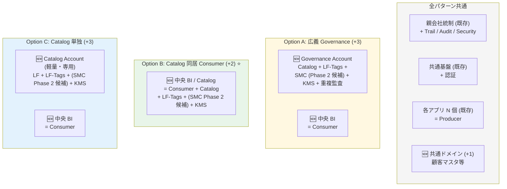
```mermaid
flowchart TB
    subgraph Common["全パターン共通"]
        P["親会社統制 (既存)<br/>+ Trail / Audit / Security"]
        A["共通基盤 (既存)<br/>+ 認証"]
        Apps["各アプリ N 個 (既存)<br/>= Producer"]
        CD["🆕 共通ドメイン (+1)<br/>顧客マスタ等"]
    end

    subgraph Opt1["Option A: 広義 Governance (+3)"]
        Gov1["🆕 Governance Account<br/>Catalog + LF-Tags +<br/>SMC (Phase 2 候補) + KMS + 重複監査"]
        BI1["🆕 中央 BI<br/>= Consumer"]
    end

    subgraph Opt2["Option B: Catalog 同居 Consumer (+2) ⭐"]
        BICat["🆕 中央 BI / Catalog<br/>= Consumer + Catalog<br/>+ LF-Tags + (SMC Phase 2 候補) + KMS"]
    end

    subgraph Opt3["Option C: Catalog 単独 (+3)"]
        Cat3["🆕 Catalog Account<br/>(軽量・専用)<br/>LF + LF-Tags + (SMC Phase 2 候補) + KMS"]
        BI3["🆕 中央 BI<br/>= Consumer"]
    end

    style Common fill:#f5f5f5
    style Opt1 fill:#fff8e1
    style Opt2 fill:#e8f5e9
    style Opt3 fill:#e3f2fd
```

### 5.4 3 オプションの観点別比較

| 観点 | A 広義 Governance (+3) | **B Catalog 同居 (+2)** ⭐ | C Catalog 単独 (+3) |
|---|:---:|:---:|:---:|
| 追加アカウント数 | +3 | **+2** | +3 |
| 責務分離（Catalog vs Consumer）| ◎ アカウント分離 | △ IAM Role 分離 | ◎ アカウント分離 |
| 責務分離（監査 vs 利用）| ◎（親会社統制 + Governance）| ◎（親会社統制で代替）| ◎ |
| Catalog 管理者特権の影響範囲 | 限定 | Consumer に集中 | 限定 |
| 運用負荷 | △ アカウント多い | ◎ 最少 | △ アカウント多い |
| 将来の分離容易性 | 既に分離済み | △ 移行コスト発生 | 既に分離済み |
| AWS 公式パターン整合 | ◎ Prescriptive Guidance 準拠 | ○ Lake Formation Central Catalog Account パターンとして整合 | ◎ |
| 規模拡大時の柔軟性 | ◎ | △ Consumer 増加で破綻 | ◎ |
| 業界実例の多さ | 大企業・規制業界 | **小〜中規模で多い** | 中規模 |

### 5.5 Option B が成立する条件と緩和策

**成立条件**:
- 親会社統制が Audit / Security 集約を担当している（§5.2 の責務再配置が成立）
- BI チーム規模が小〜中（〜5 名程度）
- Consumer アカウントが当面 1 つ

**緩和策**（Option B 採用時に必須）:

| # | 緩和策 | 効果 |
|---|---|---|
| 1 | **IAM Role の厳密な分離** — `DataLakeAdminRole`（Lake Formation 管理特権）と `DataAnalystRole`（クエリ・閲覧のみ）を完全に別ユーザー集合に割当 | Catalog 管理 ≠ 利用、Role 境界での責務分離 |
| 2 | **Permission Boundary** で `DataAnalystRole` から Lake Formation 管理操作を拒否 | 自己権限上昇の防止 |
| 3 | **SCP** で Consumer アカウントの権限上昇系操作を拒否 | 予防的制御 |
| 4 | **CloudTrail を親会社統制へ強制転送** | 自己監査リスク回避（前提として既に整備）|
| 5 | **AWS Config Rules** で「Catalog 管理権限と Consumer 権限の重複ユーザー」を検出 | 検知的制御 |
| 6 | **将来 Catalog 分離の手順書** を初日から準備 | 規模拡大時の移行リスク抑制 |

### 5.6 推奨

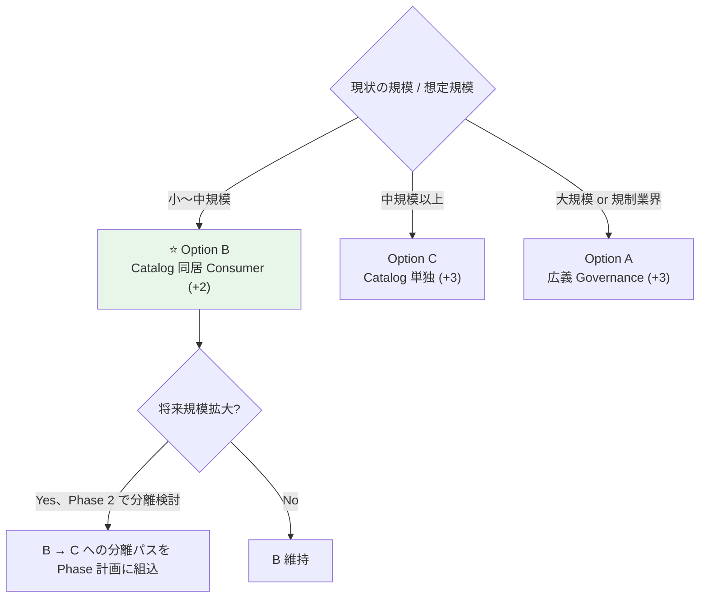
```mermaid
flowchart TB
    Q1{現状の規模 / 想定規模}

    Q1 -->|小〜中規模| OptB["⭐ Option B<br/>Catalog 同居 Consumer (+2)"]
    Q1 -->|中規模以上| OptC["Option C<br/>Catalog 単独 (+3)"]
    Q1 -->|大規模 or 規制業界| OptA["Option A<br/>広義 Governance (+3)"]

    OptB --> Future1{将来規模拡大?}
    Future1 -->|Yes、Phase 2 で分離検討| Migration["B → C への分離パスを Phase 計画に組込"]
    Future1 -->|No| Final["B 維持"]

    style OptB fill:#e8f5e9
```

**仮案の選定**: **Option B**（Catalog 同居 Consumer、**+2**）。将来規模拡大時に Option C へ分離可能な設計（§5.5 緩和策の #6）にしておく。

### 5.7 Pattern α/β/γ × Option A/B/C の組み合わせマトリクス

§4 の 3 パターン（Consumer 配置）と §5 の 3 オプション（Catalog 配置）は独立軸で、組み合わせ可能。**仮案は β + B + 共通ドメイン**。

| | Option A 広義 Governance（+ 別 Catalog） | **Option B Catalog 同居 Consumer** ⭐ | Option C Catalog 単独 |
|---|:---:|:---:|:---:|
| **Pattern α** 各アプリ Consumer 兼任 | +1（Governance）+ N アプリ内 Consumer | ⚠ 「Catalog 同居先」が無く成立しない<br/>※α なら Option A or C 必須 | +1（Catalog）+ N アプリ内 Consumer |
| **Pattern β** 1 中央 Consumer | +2（Governance + Consumer）| **+1（Consumer 兼 Catalog）** ⭐<br/>本仮案 = β + B + 共通ドメイン = **+2 合計** | +2（Catalog + Consumer）|
| **Pattern γ** ハイブリッド（アプリ + 中央 Consumer）| +2（Governance + 中央 Consumer）| +1（中央 Consumer 兼 Catalog） | +2（Catalog + 中央 Consumer）|

**重要な制約**: **α は Option B と組み合わせ不可**（中央 Consumer がないため Catalog の同居先が存在しない）。各アプリアカウントに分散して Catalog を持たせると Catalog の中央性が失われる。

**仮案の組み合わせ**: β + Option B + 共通ドメイン = **+2 アカウント**（中央 BI / Catalog + 共通ドメイン）

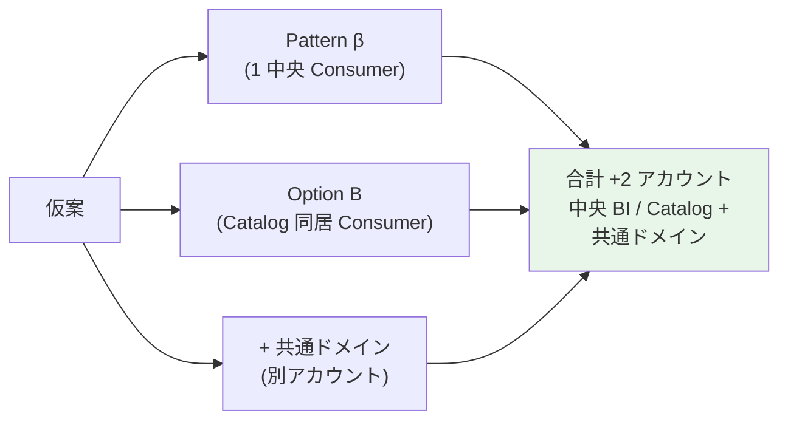
```mermaid
flowchart LR
    P["仮案"]
    P --> Pat["Pattern β<br/>(1 中央 Consumer)"]
    P --> Opt["Option B<br/>(Catalog 同居 Consumer)"]
    P --> Com["+ 共通ドメイン<br/>(別アカウント)"]

    Pat --> Result["合計 +2 アカウント<br/>中央 BI / Catalog +<br/>共通ドメイン"]
    Opt --> Result
    Com --> Result

    style Result fill:#e8f5e9
```

---

## 5.8 監査責務分離の具体設計（Option B 採用時 + 新規監査アカウント前提）

### 5.8.1 前提

**監査アカウントはデータプラットフォーム標準のスコープ外**で生成される。Transit Gateway / 共通 VPC エンドポイント / 共通 DNS 等の**共通インフラと同じ位置付け**で、「**他組織が運用するものを我々が利用させていただく**」という関係。

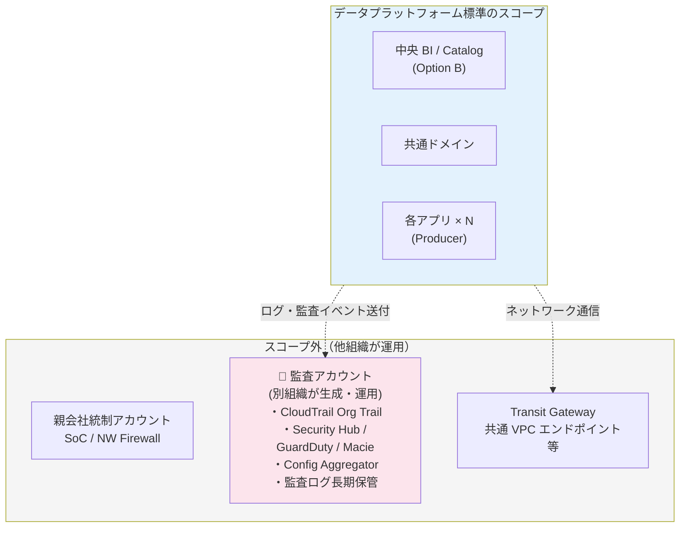
```mermaid
flowchart TB
    subgraph OutOfScope["スコープ外（他組織が運用）"]
        direction LR
        Parent["親会社統制アカウント<br/>SoC / NW Firewall"]
        AuditAcc["🔵 監査アカウント<br/>(別組織が生成・運用)<br/>・CloudTrail Org Trail<br/>・Security Hub / GuardDuty / Macie<br/>・Config Aggregator<br/>・監査ログ長期保管"]
        TGW["Transit Gateway<br/>共通 VPC エンドポイント等"]
    end

    subgraph InScope["データプラットフォーム標準のスコープ"]
        direction LR
        BICat["中央 BI / Catalog<br/>(Option B)"]
        Common["共通ドメイン"]
        Apps["各アプリ × N<br/>(Producer)"]
    end

    InScope -.ログ・監査イベント送付.-> AuditAcc
    InScope -.ネットワーク通信.-> TGW

    style OutOfScope fill:#f5f5f5
    style InScope fill:#e3f2fd
    style AuditAcc fill:#fce4ec
```

**本標準の役割**: 監査アカウントに対して **「何を送るか / 何を期待するか / 何を依存するか」** を定義する側に立つ。

### 5.8.2 アカウント体系（スコープ込み）

| カテゴリ | アカウント | 運用主体 | データプラットフォーム標準での位置付け |
|---|---|---|---|
| **スコープ外（既存・他組織）** | 親会社統制 | 親会社 SoC | データ標準には直接関与しない |
| **スコープ外（新規・他組織）** | **🔵 監査アカウント** | **別組織** | **ログ送付先・依存対象**として利用 |
| **スコープ外（既存・他組織）** | Transit Gateway / 共通ネットワーク | ネットワーク統括 | データ通信の経路として利用 |
| **スコープ内（既存）** | 共通基盤（認証）| 別チーム | 認証連携先として利用 |
| **スコープ内（既存）** | 各アプリ × N | アプリチーム | Producer 兼任、ガイド対象 |
| **スコープ内（新規 +1）** | 🆕 中央 BI / Catalog（Option B 同居）| データプラットフォームチーム | 本標準が設計・運用 |
| **スコープ内（新規 +1）** | 🆕 共通ドメイン | データプラットフォームチーム + 各データ責任者 | 本標準が設計・運用 |

### 5.8.3 監査アカウントへのログ送付経路

データプラットフォーム側から監査アカウントへ送付するログを **送信元 × 種別 × 仕組み** で整理。

| 送信元 | 種別 | 内容 | 送付の仕組み |
|---|---|---|---|
| **全アカウント** | コントロールプレーン監査 | CloudTrail Management Events | **Organization Trail**（監査アカウント側で設定済み前提）|
| 中央 BI / Catalog | データプレーン監査 | Lake Formation データアクセスイベント、KMS 鍵使用イベント | **CloudTrail Data Events**（Organization Trail に統合）|
| 中央 BI / Catalog | クエリ履歴 | Athena Workgroup クエリログ | **Athena Workgroup → S3 → クロスアカウント送付** |
| 中央 BI / Catalog | BI アクセス | QuickSight アクティビティログ | **QuickSight Activity Log → CloudTrail → 監査アカウント** |
| 各アプリ（Producer）| データアクセス | S3 サーバアクセスログ | **S3 Logging → 監査アカウントのログバケット**（クロスアカウント書込み）|
| 各アプリ（Producer）| アプリ操作 | アプリケーション操作監査ログ | **CloudWatch Logs Subscription → Kinesis Firehose → 監査アカウント S3** |
| 共通ドメイン | マスタ変更履歴 | 顧客マスタ更新ログ | 上記同様 |

### 5.8.4 メトリクスの扱い（運用は各アプリ保持）

**今回の方針確認**: 運用メトリクスは各アプリで保持（CloudWatch 標準）、監査・セキュリティ系のみ監査アカウントに集約。

| 種別 | 主用途 | 配置 | 理由 |
|---|---|---|---|
| **運用メトリクス** | 障害検知 / SLO 監視 / オートスケール判定 | **各アプリの CloudWatch**（30 日デフォルト保持）| アプリチームの責任、即時性が必要 |
| **セキュリティメトリクス** | GuardDuty Findings / Macie 検出 / Security Hub Findings | **監査アカウント集約** | 横断検知・SOC 連携 |
| **コスト系** | Cost Explorer / CUR | **親会社統制 or Organization Master** | 経理連携 |
| **長期保存メトリクス** | ML 用特徴量・容量計画 | **データプラットフォーム側で再集計**（必要に応じて）| 分析責務 |

### 5.8.5 データプラットフォーム側で実装する必須項目

監査アカウントが期待するログを「ちゃんと送る」ための実装責任:

| # | 実装項目 | 実装場所 |
|---|---|---|
| 1 | **CloudTrail Data Events 有効化**（S3 / Lake Formation / KMS）| 中央 BI / Catalog アカウント |
| 2 | **Lake Formation Audit Log 有効化** | 中央 BI / Catalog アカウント |
| 3 | **Athena Workgroup でクエリログ出力設定** | 中央 BI / Catalog アカウント |
| 4 | **QuickSight Activity Logging 有効化** | 中央 BI / Catalog アカウント |
| 5 | **S3 Server Access Logging のクロスアカウント設定** | 各アプリアカウント + 共通ドメインアカウント |
| 6 | **KMS CMK の使用イベント出力**（CloudTrail Data Events）| 中央 BI / Catalog アカウント |
| 7 | **VPC Flow Logs 出力設定** | 各アカウントの VPC（送信先は監査アカウント側の設計次第）|
| 8 | **アプリ操作ログの CloudWatch Logs Subscription 設定** | 各アプリアカウント |

### 5.8.6 監査アカウント側に期待する設定（依存事項）

データプラットフォーム標準が**監査アカウント運用主体に依頼する設定**:

| # | 期待する設定 | データプラットフォーム側への影響 |
|---|---|---|
| 1 | **CloudTrail Organization Trail** 設定（全アカウント対象）| 各アカウントで個別に CloudTrail を立てる必要なし |
| 2 | **Security Hub Delegated Admin** | 各アカウントの Security Hub 集約 |
| 3 | **GuardDuty Delegated Admin** | 同上 |
| 4 | **Macie Delegated Admin** | S3 PII スキャンの集約 |
| 5 | **Config Aggregator** | 全アカウントの構成監視 |
| 6 | **クロスアカウントログ受信用 S3 バケット**（Object Lock + 長期保管）| ログ送付先として利用 |
| 7 | **クロスアカウント書込み権限の付与**（バケットポリシー）| 各アプリ・中央 BI から書込みできる |
| 8 | **セキュリティ Findings 通知の管理プロセス** | データ標準で検出した PII 漏洩等の対応フロー |

### 5.8.7 セキュリティアラート連携の流れ

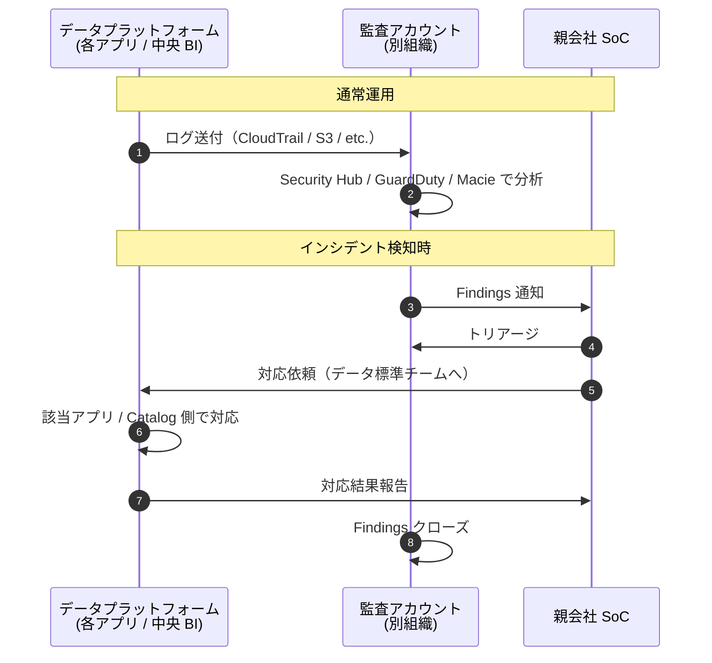
```mermaid
sequenceDiagram
    autonumber
    participant DP as データプラットフォーム<br/>(各アプリ / 中央 BI)
    participant Audit as 監査アカウント<br/>(別組織)
    participant SOC as 親会社 SoC

    Note over DP, SOC: 通常運用
    DP->>Audit: ログ送付（CloudTrail / S3 / etc.）
    Audit->>Audit: Security Hub / GuardDuty / Macie で分析

    Note over DP, SOC: インシデント検知時
    Audit->>SOC: Findings 通知
    SOC->>Audit: トリアージ
    SOC->>DP: 対応依頼（データ標準チームへ）
    DP->>DP: 該当アプリ / Catalog 側で対応
    DP->>SOC: 対応結果報告
    Audit->>Audit: Findings クローズ
```

### 5.8.8 残課題（監査アカウント別組織との合意事項）

| # | 確認事項 | 影響 |
|---|---|---|
| 1 | **監査アカウント運用主体との連絡窓口**（誰に何を聞くか）| 設計の進め方 |
| 2 | **ログ送付の権限設計**（クロスアカウント IAM Role / バケットポリシー）| 実装方法 |
| 3 | **監査アカウント側のログ保管期間** | データ標準側の §NFR-7 コンプラ要件と整合 |
| 4 | **Findings 通知の受け取りフロー**（SNS / EventBridge / メール / Slack 等）| インシデント対応設計 |
| 5 | **監査アカウント障害時のフォールバック**（自前で一時的に集約するか）| BCP / 5 nines 想定 |
| 6 | **コスト負担モデル**（監査アカウントの利用料はデータ標準側に按分されるか）| 予算計画 |
| 7 | **Athena クエリログ等のセンシティブ情報を含むログの扱い**（顧客企業データを参照したクエリ内容）| プライバシー設計 |
| 8 | **Transit Gateway 経由のクロスアカウント通信のログ取得範囲** | ネットワーク監査 |

### 5.8.9 図解: ログ送付の全体像


```mermaid
flowchart TB
    subgraph DataPlatform["データプラットフォーム標準（スコープ内）"]
        subgraph BICat["中央 BI / Catalog アカウント"]
            LF[Lake Formation]
            Athena
            QS[QuickSight]
            KMS[KMS CMK]
        end

        subgraph App1["App 1（Producer）"]
            S1[S3]
            DB1[運用 DB]
            App1Logs[CloudWatch Logs]
        end

        subgraph App2["App 2（Producer）"]
            S2[S3]
            DB2[運用 DB]
        end

        subgraph CommonD["共通ドメイン"]
            Master[顧客マスタ]
        end
    end

    subgraph Audit["監査アカウント（スコープ外）"]
        direction TB
        CT[CloudTrail Organization Trail]
        SH[Security Hub Delegated Admin]
        GD[GuardDuty Delegated Admin]
        Macie[Macie Delegated Admin]
        Cfg[Config Aggregator]
        LogBucket[(S3 長期保管バケット<br/>Object Lock)]
    end

    %% コントロールプレーン → CloudTrail
    LF -.管理イベント.-> CT
    Athena -.管理イベント.-> CT
    QS -.管理イベント.-> CT
    KMS -.管理イベント.-> CT
    App1 -.管理イベント.-> CT
    App2 -.管理イベント.-> CT
    CommonD -.管理イベント.-> CT

    %% データプレーン → CloudTrail Data Events
    LF -.データイベント.-> CT
    S1 -.S3 アクセスログ.-> LogBucket
    S2 -.S3 アクセスログ.-> LogBucket

    %% Athena クエリログ
    Athena -.クエリログ.-> LogBucket

    %% QuickSight アクティビティ
    QS -.アクティビティログ.-> CT

    %% アプリ操作ログ
    App1Logs -.subscription.-> LogBucket

    %% Macie が S3 をスキャン
    S1 -.PII スキャン対象.-> Macie
    S2 -.PII スキャン対象.-> Macie
    Master -.PII スキャン対象.-> Macie

    style DataPlatform fill:#e3f2fd
    style Audit fill:#fce4ec
```

---

## 6. 決定状況と残課題

### 6.1 仮案で決定済み（[strawman-proposal.md](strawman-proposal.md) に反映済）

| # | 決定事項 | 仮案での選定 | 根拠 / 参照 |
|---|---|---|---|
| 1 | **Consumer 役割のパターン**（α / β / γ）| **β**（中央 Consumer 集約）| Q1 アプリチームスキルなし / Q4 BI チームなし → α 不適合、γ は組織体制が未整備のため Phase 2 で検討。Path C 段階移行 |
| 2 | **Catalog Account / Governance Account の配置**（Option A / B / C）| **Option B**（Catalog 同居 Consumer、+2 アカウント）| §5.2 親会社統制が Audit / Security 集約を担う前提 / §5.4 Option 比較表 / 仮案規模に最適 |
| 3 | **Audit ログの最終集約先** | **親会社統制アカウント**（既存）| ユーザー環境の前提として確認済 |
| 4 | **共通参照データの扱い** | **共通ドメイン専用アカウント新設**（+1）| §3.3 案 2、業界標準（DAMA / Data Mesh）|
| 5 | **SageMaker Catalog（旧 DataZone）採否** | **Phase 1 不採用、Phase 2 再評価** | [DP-ADR-001](adr/DP-ADR-001-sagemaker-catalog-adoption-deferred.md)。Phase 1 規模では ROI 低い、+$1,360/年コスト・運用複雑度を抑制、Phase 2 で利用者拡大時に再評価 |

### 6.2 残課題（ヒアリングまたは追加検討が必要な事項）

| # | 決定事項 | 選択肢 | 影響範囲 | 確認方法 |
|---|---|---|---|---|
| 1 | **既存「共通基盤アカウント」のスコープ拡張** | 認証専用に閉じる / Service Catalog 配布元等も担わせる | API 側決定との整合 | API 標準化推進者との調整 |
| 2 | **環境分離**（prod / stg / dev）| 同一アカウントで Realm 分離 / 環境別にアカウント分離 | アカウント数の倍加、運用負荷 | ヒアリング G（インフラチーム）|
| 3 | **監査アカウントとの合意事項**（Option B 成立 + §5.8 監査責務分離の前提）| [§5.8.8 残課題 8 項目](#588-残課題監査アカウント別組織との合意事項)（連絡窓口 / 権限設計 / 保管期間 / Findings 通知 / 障害時 FB / コスト按分 / クエリログ機密性 / TGW 通信ログ）| 監査アカウント運用主体との合意で確定 | ヒアリング G-4 / 監査アカウント運用主体への問合せ |
| 4 | **役割 3（Catalog 管理者）と役割 4（BI チーム）の人員分離**（Option B 成立の前提）| 完全分離可能 / 部分重複 / 重複前提 | 責務分離の実質的な強度、Config Rules 検知設計 | ヒアリング G-5 で確認 |
| 5 | **将来 Option C 移行のトリガ条件**（規模拡大時）| 4 条件のうちどれを発動条件とするか | Phase 2 計画、運用設計 | Phase 1 運用開始後にレビュー、[strawman-proposal.md §4.3](strawman-proposal.md) 参照 |
| 6 | **DR / クロスリージョン設計** | リージョン障害時の Catalog / Consumer / 共通ドメイン の復旧戦略 | NFR-DR §NFR-5（未作成）の前提 | [proposal/nfr/05-dr.md](proposal/nfr/05-dr.md)（未作成）と連動 |

---

## 7. 反映先（合意後の後続作業）

ヒアリング Phase A 以降で前提が確認できれば、以下に反映する。**Option B（Catalog 同居 Consumer、+2 アカウント）** が確定したことを前提とする。

| # | 反映先 | 内容 |
|---|---|---|
| 1 | [proposal/00-index.md §0.2 比較表](proposal/00-index.md) | 「分散標準」記述を「**Federated（3 役割、Option B Catalog 同居 Consumer 推奨）**」に改訂 |
| 2 | [proposal/fr/02-storage.md](proposal/fr/02-storage.md) | 「Producer 役割」の明示、Central（Catalog）/ Consumer 役割の追記、**Option B 採用時の同居構造**、Lake Formation 共有モデルの図解、IAM Role 分離方針（`DataLakeAdminRole` / `DataAnalystRole` / `DataReaderRole`）|
| 3 | [proposal/fr/05-governance.md](proposal/fr/05-governance.md) | §FR-5.1 権限制御を Lake Formation Cross-Account + **同アカウント内 IAM Role 分離**前提に補強、Permission Boundary / SCP / Config Rules の必須化 |
| 4 | proposal/common/01-architecture.md（未作成）| 新規執筆。本資料 §1-§5 を §C-DATA-1.5「中央集約 vs 分散ガイド」フレームに展開、API §C-1.5 と並ぶ位置付け、**Option A/B/C 配置 + Pattern α/β/γ Consumer の組み合わせマトリクス**を §C-DATA-1.6 として明示 |
| 5 | proposal/common/03-ownership-raci.md（未作成）| **7 役割と RACI** の対応（[strawman-proposal.md §3](strawman-proposal.md) 参照）、特に役割 3（Catalog 管理者 = `DataLakeAdminRole`）と役割 4（BI チーム = `DataAnalystRole`）の人員分離原則を明示 |
| 6 | [internal-evaluation.md](internal-evaluation.md) | 抽出方針に「API と同型 Federated だが中央のスコープが Catalog 分だけ広く、親会社統制が監査・セキュリティ集約を担う場合は Catalog 同居 Consumer (Option B) で +2 アカウントに圧縮可能」根拠を追記 |
| 7 | [powerpoint-outline-and-references.md §1.3-1.4](powerpoint-outline-and-references.md) | 構成概要図を **Option B 版（+2 アカウント、中央 BI / Catalog 同居）**に差し替え、§1.4「アカウント体系」スライドで Option A/B/C の選定根拠を提示 |
| 8 | [strawman-proposal.md](strawman-proposal.md) | （反映済）Option B 仕様に改訂、§2 アカウント構成 +2、§3 役割 3 を `DataLakeAdminRole` として位置付け、§5 前提 8/9 追加、§6 ヒアリング G-4/5/6 追加 |
| 9 | proposal/fr/06-personas.md（既存）| §FR-6 ペルソナ別実装パターンに **IAM Role 別の利用パターン**（`DataLakeAdminRole` / `DataAnalystRole` / `DataReaderRole`）を反映 |
| 10 | [proposal/fr/05-governance.md](proposal/fr/05-governance.md) §FR-5.4 監査ログ | **§5.8 監査責務分離設計を反映**: 監査アカウントへのログ送付経路 7 種、データプラットフォーム側必須実装 8 項目、監査アカウント側に期待する 8 項目を明文化 |
| 11 | proposal/nfr/04-security.md（既存・要更新）| §NFR-4 セキュリティに **監査アカウントとの責務分離**、ログ送付経路、クロスアカウント送付の暗号化要件を追記 |
| 12 | proposal/nfr/06-operations.md（既存・要更新）| §NFR-6 運用に **メトリクスの責務分離**（運用は各アプリ / 監査・セキュリティは監査アカウント）を明示 |
| 13 | proposal/common/04-tbd-summary.md（未作成）| **監査アカウント運用主体との合意事項 8 項目**（§5.8.8 残課題）を要確認事項として記録 |
| 14 | [strawman-proposal.md §5 前提](strawman-proposal.md) | 前提 8 を **「監査アカウント運用主体との合意」** に書き換え（旧「親会社統制が CloudTrail / SH / Macie 等を集約」）|
| 15 | [hearing-slide-deck.md §4.2](hearing-slide-deck.md) | スライド §4.2 を **「監査アカウントとの責務分離 + 期待する設定」** に再構成（旧「親会社統制の責務範囲確認」）|

### 7.1 反映の依存順序

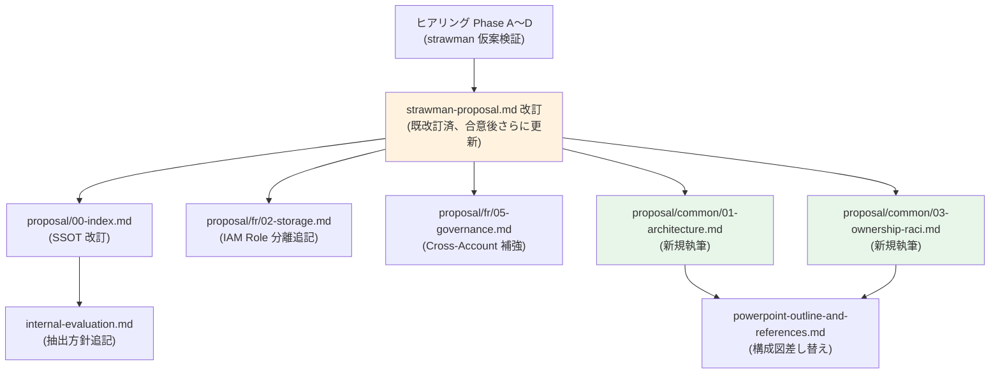
```mermaid
flowchart TB
    H["ヒアリング Phase A〜D<br/>(strawman 仮案検証)"]
    H --> Strawman["strawman-proposal.md 改訂<br/>(既改訂済、合意後さらに更新)"]

    Strawman --> P1["proposal/00-index.md<br/>(SSOT 改訂)"]
    Strawman --> P2["proposal/fr/02-storage.md<br/>(IAM Role 分離追記)"]
    Strawman --> P3["proposal/fr/05-governance.md<br/>(Cross-Account 補強)"]
    Strawman --> C1["proposal/common/01-architecture.md<br/>(新規執筆)"]
    Strawman --> C3["proposal/common/03-ownership-raci.md<br/>(新規執筆)"]

    P1 --> Internal["internal-evaluation.md<br/>(抽出方針追記)"]
    C1 --> PPT["powerpoint-outline-and-references.md<br/>(構成図差し替え)"]
    C3 --> PPT

    style Strawman fill:#fff3e0
    style C1 fill:#e8f5e9
    style C3 fill:#e8f5e9
```

---

## 8. 関連ドキュメント

### 本領域内

- [data-platform-document-structure.md](data-platform-document-structure.md) — 領域全体 SSOT
- [internal-evaluation.md](internal-evaluation.md) — 抽出方針の裏どり資料
- [proposal/fr/02-storage.md](proposal/fr/02-storage.md) — §FR-2 保存先標準

### 兄弟領域（API、雛形元）

- [../api-platform/proposal/common/01-reference-architecture.md](../api-platform/proposal/common/01-reference-architecture.md) — §C-1.5「中央集約 vs 分散ガイド」フレーム（本資料の元構造）

### AWS 公式

- [AWS Prescriptive Guidance: Strategy for Data Mesh](https://docs.aws.amazon.com/prescriptive-guidance/latest/strategy-data-mesh/aws-offerings-data-mesh.html)
- [Lake Formation Cross-Account Permissions](https://docs.aws.amazon.com/lake-formation/latest/dg/cross-account-permissions.html)
- [Secure Data Mesh Guidance on AWS](https://aws.amazon.com/solutions/guidance/secure-data-mesh-with-distributed-data-asset-ownership-on-aws)
- [Build enterprise data mesh with DataZone, CDK, CFN](https://docs.aws.amazon.com/prescriptive-guidance/latest/patterns/build-enterprise-data-mesh-amazon-data-zone.html)
- [AWS Well-Architected Data Analytics Lens](https://docs.aws.amazon.com/wellarchitected/latest/analytics-lens/analytics-lens.html)

### 業界・参考事例

- [Martin Fowler / Dehghani — Monolithic Data Lake to Data Mesh](https://martinfowler.com/articles/data-monolith-to-mesh.html)
- [Netflix UDA](https://netflixtechblog.com/uda-unified-data-architecture-6a6aee261d8d)
- [How Spotify Built Its Data Platform](https://blog.bytebytego.com/p/how-spotify-built-its-data-platform)
- [BBVA Global Data Platform](https://aws.amazon.com/blogs/industries/part-1-bbva-building-a-multi-region-multi-country-global-data-and-ml-platform-at-scale/)
