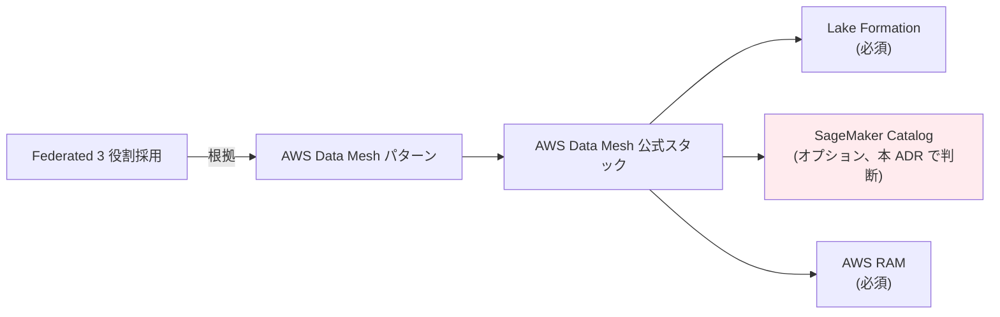
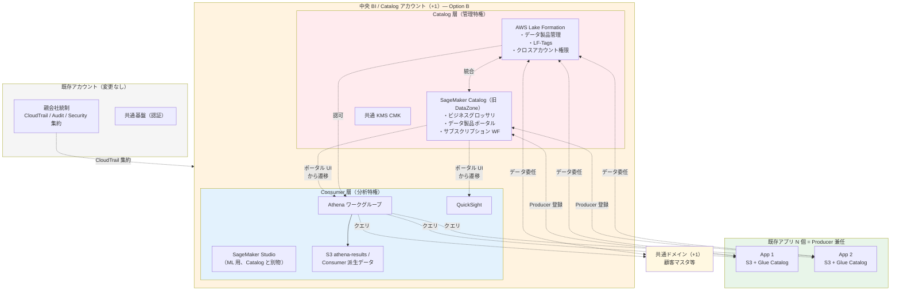
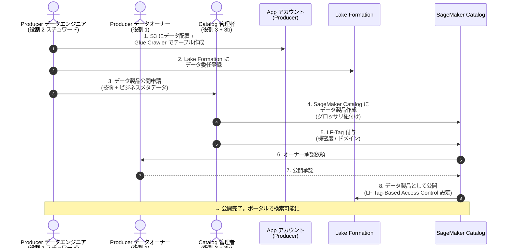
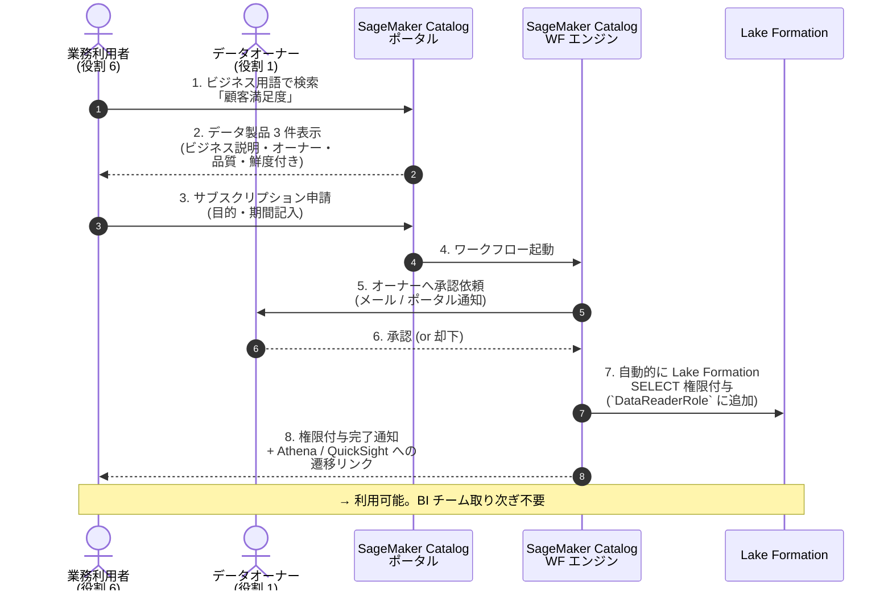
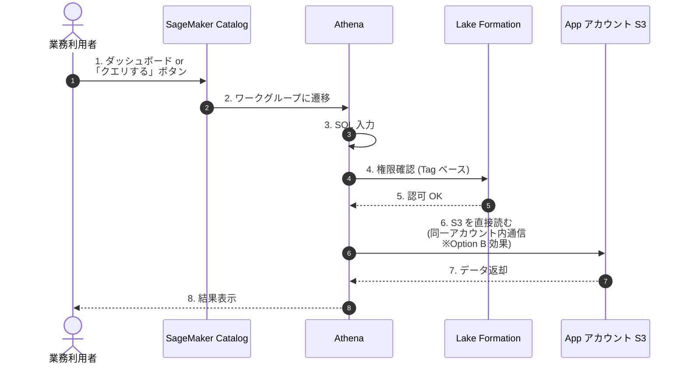
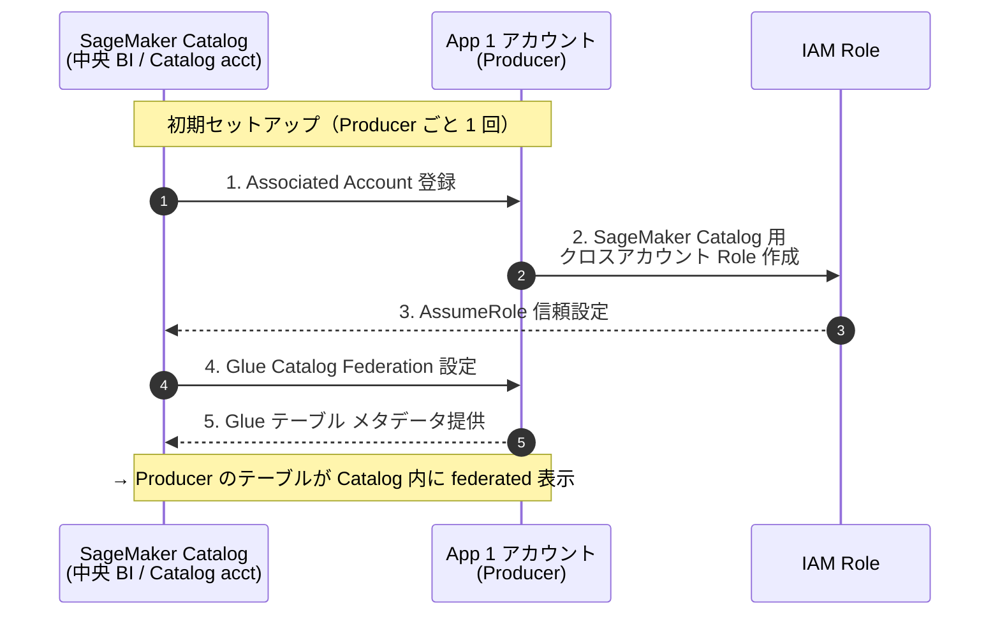
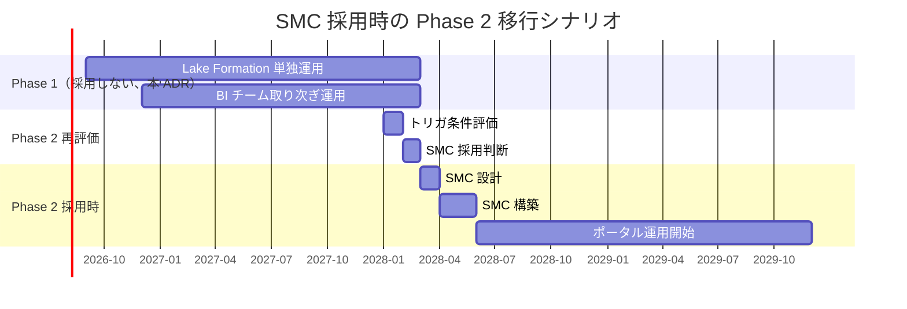

# DP-ADR-001: SageMaker Catalog（旧 DataZone）採否判断 — Phase 1 不採用、Phase 2 再評価

- **ステータス**: Accepted
- **日付**: 2026-05-27
- **関連**:
  - [../account-architecture-analysis.md §5](../account-architecture-analysis.md)（Federated 3 役割 + Option B 採用根拠）
  - [../account-architecture-analysis.md §6.1](../account-architecture-analysis.md)（決定済み事項）
  - [../strawman-proposal.md](../strawman-proposal.md)（仮案、Phase 1 = β + Option B + 共通ドメイン）
  - [../data-platform-document-structure.md](../data-platform-document-structure.md)（領域全体 SSOT）

---

## 1. Context

### 1.1 SageMaker Catalog（旧 DataZone）が選択肢に上がった経緯

データプラットフォーム標準で **Federated 3 役割（AWS Data Mesh）パターン** を採用したことに伴い（[../account-architecture-analysis.md §1](../account-architecture-analysis.md)）、AWS の Data Mesh 公式スタックの上位レイヤーとして **Amazon DataZone**（2024 後半に SageMaker Unified Studio に統合され、**SageMaker Catalog** にリブランド）が**選択肢として保留**されていた。

### 1.2 SageMaker Catalog の役割

| レイヤー | サービス | 役割 |
|---|---|---|
| 業務レイヤー（オプション）| **SageMaker Catalog** | ビジネスグロッサリ、データ製品ポータル、Self-service サブスクリプションワークフロー |
| 技術レイヤー（必須）| **Lake Formation** | 技術カタログ、権限管理、LF-Tags、クロスアカウント Grant |

Lake Formation 単独でも Data Mesh は技術的に成立するが、SageMaker Catalog を追加すると **「業務利用者が自分でデータを探す Self-service 型」** が実現できる。

### 1.3 仮案の状況（決定時点）

| 項目 | 状況 |
|---|---|
| Consumer 配置 | Pattern β（中央 Consumer 集約）|
| Catalog 配置 | Option B（Catalog 同居 Consumer、+2 アカウント）|
| 担い手戦略 | Path C 段階移行（Phase 1: β、Phase 2: γ）|
| BI チーム規模 | Phase 1: 2 名 → Phase 2: 3-5 名 |
| 想定利用者数 | Phase 1: ~12 名 → Phase 2: ~55 名 → 将来: ~100 名 |

---

## 2. Decision

### 2.1 決定内容

**Phase 1（最初 18 ヶ月）では SageMaker Catalog を採用しない**。Lake Formation 単独で Catalog 機能を構成する。

**Phase 2 以降は再評価**: 規模拡大・組織変化・利用者拡大などのトリガ条件が満たされた時点で採用を再検討する。

### 2.2 Phase 1 で打っておく布石（Phase 2 移行容易化のため）

| # | 準備項目 | 内容 |
|---|---|---|
| 1 | **メタデータ命名規約** | テーブル名・カラム名・ビジネス用語の対応表を初期から作る |
| 2 | **データオーナー / スチュワード明示** | 各データ製品にオーナー記入を必須化（[strawman §3 役割 1/2](../strawman-proposal.md) と整合）|
| 3 | **業務グロッサリの仮整備** | Confluence / スプレッドシート等で開始、Phase 2 で SMC に移行できる構造 |
| 4 | **データ製品 README 必須化** | 各製品の意味・利用想定を md で記述 |

---

## 3. Rationale（不採用の根拠）

### 3.1 規模・利用者数

| 観点 | Phase 1 状況 | 評価 |
|---|---|---|
| 利用者数 | BI 2 + コア利用者 ~10 = 12 名 | SMC ポータルの恩恵が薄い規模 |
| BI チーム規模 | 2 名 | 取り次ぎで対応可能な規模 |
| データ製品数 | 数件想定 | グロッサリ・ポータルが過剰 |
| データオーナー数 | 7 役割で明示済 | 属人化リスクは [strawman §3](../strawman-proposal.md) で対処済み |

→ Phase 1 の規模では **「BI チーム取り次ぎ + Confluence でビジネスメタデータ管理」で十分**。

### 3.2 コスト

| シナリオ | 年額 | Phase 1 追加コスト |
|---|---:|---:|
| Lake Formation 単独（採用案）| ~$600 | – |
| + SageMaker Catalog | ~$1,960 | **+$1,360/年** |

Phase 1 初期のコスト負担はわずかだが、利用者数 12 名規模では **ROI が低い**。

### 3.3 運用複雑度

| 観点 | LF 単独 | + SageMaker Catalog |
|---|---|---|
| 1 アカウント内のサービス数 | 中 | 多 |
| IAM Role 数 | 3-4 | 4-5（+ `SageMakerCatalogAdminRole`）|
| 初期セットアップ工数 | 数日 | **+1 週間** |
| 運用ノウハウ要求 | 中 | 高（SMC + LF 両方）|
| Producer アカウントへの信頼関係設定 | 不要 | アプリ数 N × 0.5 日 |
| 障害時の切り分け | 単純 | やや複雑 |

→ Phase 1 はチーム規模が小さいため、**運用負荷を抑えた構成が現実的**。

### 3.4 業界実例

| 採用パターン | 組織例 |
|---|---|
| 初期から採用 | Capital One（規制業界）、大規模 BBVA |
| **段階的に Phase 2 以降で導入** | **大手日本企業の典型例** |
| 採用しない | 小規模スタートアップ、コスト最優先 |

→ 仮案規模 + Phase C 段階移行戦略と整合する選択は **「Phase 2 以降で再評価」**。

---

## 4. Phase 2 再評価のトリガ条件

以下のいずれかに該当した時点で、本 ADR を再開して SMC 採用判断をやり直す:

| # | トリガ | 評価指標 |
|---|---|---|
| 1 | **利用者数の拡大** | アクティブ利用者が 30+ になる |
| 2 | **BI チーム取り次ぎの限界** | 月次の取り次ぎ件数が 50+ になる、または BI チーム規模が処理能力に追いつかない |
| 3 | **データ製品数の増加** | 公開データ製品数が 15+ になる |
| 4 | **γ パターン移行の現実化** | アプリチームが自前 Consumer 機能を持ち始める段階で、横断検索性の重要度が上がる |
| 5 | **Data Mesh 文化の組織的醸成要望** | 経営・組織レベルで「Self-service データ活用」の方針が出る |
| 6 | **規制対応強化** | ビジネスグロッサリ・データオーナー明示が規制対応として必要になる（金融 / 個人情報保護法改正対応など）|

**評価タイミング**: Phase 2 開始時点（Phase 1 終了から 18 ヶ月後想定 = 2028 年初）の四半期レビューで、上記指標を測定して判断する。

---

## 5. Consequences

### 5.1 Positive（採用しない選択のメリット）

- **Phase 1 初期構築コスト最小**: ~$1,360/年の追加コスト回避
- **運用シンプル**: 1 アカウント内のサービス数・IAM Role 数を抑えられる
- **学習コスト最小**: Lake Formation の習熟だけに集中できる
- **段階的成長**: 規模拡大に応じて必要時に追加可能、過剰投資を回避
- **Phase 1 撤退コスト最小**: 万一データプラットフォーム自体を見直す場合の損失最小

### 5.2 Negative（採用しない選択のデメリット）

- **利用者拡大時に BI チームがボトルネック化**: データ発見・アクセス権申請の取り次ぎが集中
- **ビジネスメタデータ管理が手動**: Confluence / スプレッドシートでの管理は属人化リスク
- **Self-service データ活用文化の醸成が遅れる**: 「自分でデータを探す」習慣が組織に根付かない
- **Phase 2 移行時の集中工数**: SMC 導入時に約 1 ヶ月の集中作業が必要（[詳細は §6.2 参照](#62-phase-2-移行作業の推定工数)）
- **Lineage（系譜）可視化の遅れ**: 派生データの来歴追跡が手動

### 5.3 Risks & Mitigations

| リスク | 対策 |
|---|---|
| 利用者拡大時の BI チーム過負荷 | 月次の取り次ぎ件数を測定、トリガ条件 #2 の評価指標とする |
| ビジネスメタデータの属人化 | §2.2 布石 #1-#4 を Phase 1 初期から運用、Confluence ページの所有者明示 |
| Phase 2 移行の負担 | §2.2 布石により移行容易化、Phase 2 開始 3 ヶ月前に準備開始 |
| 規制対応要求の突発発生 | トリガ条件 #6 を四半期レビュー対象に含める |

---

## 6. 詳細分析（保存用、再評価時の参照資料）

> 本セクションは Phase 2 再評価時に参照する分析資料を保存しておく。再評価時点での AWS サービス・価格・組織状況に合わせて再検証すること。

### 6.1 SageMaker Catalog 採用時の構成（Option B 同居前提）

**重要ポイント**:
- 同一アカウント内に Catalog 層と Consumer 層が共存（Option B）
- Lake Formation と SageMaker Catalog は連携動作（SMC の認可は内部で LF を呼び出す）
- ポータル UI 経由で Athena / QuickSight に遷移するため、利用者から見ると**ポータルがエントリポイント**

### 6.2 SMC 採用時の IAM Role 体系（拡張版）

[strawman §2.3](../strawman-proposal.md) の 3 Role に加え、SMC 管理 Role の追加が必要:

| Role | 担当者 | Lake Formation 権限 | SageMaker Catalog 権限 | Athena / QuickSight |
|---|---|---|---|---|
| **`DataLakeAdminRole`** | 役割 3（Catalog 管理者）| ◎ 全権限 | ⚠ 限定（Domain 設定の一部）| ❌ |
| **`SageMakerCatalogAdminRole`**（新規）| 役割 3b（SMC 管理者）| ❌ | ◎ Domain / Project 管理、グロッサリ設定、WF 設定 | ❌ |
| **`DataProductOwnerRole`** | 役割 1（データオーナー）| △ 自データの公開承認のみ | △ 自データのサブスクリプション承認 | ❌ |
| **`DataAnalystRole`** | 役割 4（BI チーム）| △ 読取のみ | △ 検索・サブスクリプション申請 | ◎ |
| **`DataReaderRole`** | 役割 6（利用者）| ❌ | △ 検索・サブスクリプション申請 | △ 閲覧のみ |

**役割 3 と 3b の関係**: Phase 1 採用時は統合（兼任）、Phase 2 で規模拡大したら分離検討。

### 6.3 SMC 採用時の主要フロー

#### Flow 1: データ製品公開（Producer 側）

#### Flow 2: 利用者の検索・申請

#### Flow 3: クエリ実行

### 6.4 SMC コスト試算（参考）

| 課金軸 | 単価（2026 時点参考値）|
|---|---|
| Domain | $5/月 |
| アクティブユーザー | $9/user/月 |
| メタデータ Job 実行 | スキャン量ベース（少額）|

| シナリオ | ユーザー数 | 月額 | 年額 |
|---|---:|---:|---:|
| Phase 1（BI 2 + 利用者 10）| 12 | ~$113 | ~$1,360 |
| Phase 2（BI 5 + 利用者 50）| 55 | ~$500 | ~$6,000 |
| 将来（利用者 100）| 100 | ~$905 | ~$10,860 |

### 6.5 Phase 2 移行作業の推定工数（採用時）

| 作業 | 工数目安 |
|---|---|
| SMC Domain / Project 設計 | 3 日 |
| グロッサリ整備（Phase 1 資産の移行）| 5-10 日 |
| Producer アカウント信頼関係設定（× N アプリ）| アプリ数 × 0.5 日 |
| LF-Tags 体系の SMC への統合 | 3 日 |
| ワークフロー設計（承認 / 通知）| 5 日 |
| 利用者向けポータル研修 | 3 日 |
| **合計** | **約 1 ヶ月**（アプリ 5 個想定）|

### 6.6 SMC 採用時の運用上の論点

#### 6.6.1 Lake Formation と SageMaker Catalog の権限二重管理リスク

SMC でデータ製品を公開しても、LF 側で権限が自動同期されない**例外ケース**がある:

| 操作 | LF と SMC の同期 |
|---|:---:|
| SMC でデータ製品作成 | ✅ LF に自動登録 |
| SMC でサブスクリプション承認 | ✅ LF Grant 自動付与 |
| SMC でサブスクリプション削除 | ✅ LF Grant 自動剥奪 |
| **LF 側で直接 Grant 追加 / 削除** | ❌ SMC に同期されない |
| LF Tag を SMC 外で編集 | ❌ SMC ポータル表示と齟齬 |

**運用ルール**: SMC 採用後は LF 側を直接操作することを原則禁止。すべて SMC ポータル経由にする。例外は緊急時のみ、事後 SMC に再登録。

#### 6.6.2 障害時の切り分け

| 障害症状 | 切り分け順序 |
|---|---|
| ポータルにアクセスできない | SMC Domain 障害 → AWS Health |
| 検索結果が出ない | SMC Federation 障害 → Producer アカウント疎通確認 |
| クエリは出るが認可エラー | LF 側障害 → LF Tag / 権限設定 |
| データが古い | Glue Crawler 障害 → Producer 側確認 |

#### 6.6.3 Producer アカウントへの信頼関係設定

SMC で Producer アカウントを扱うには、**各 Producer アカウントに信頼関係を設定**する必要がある:

各 Producer アカウントに +1 IAM Role 設定が必要。アプリ数 N に比例。

### 6.7 段階的な Phase 2 移行シナリオ（参考）

---

## 7. References

### AWS 公式

- [Amazon DataZone → SageMaker Catalog 統合発表](https://aws.amazon.com/blogs/big-data/implement-a-data-mesh-pattern-with-amazon-sagemaker-catalog-without-making-changes-to-your-applications/)
- [SageMaker Unified Studio Overview](https://docs.aws.amazon.com/sagemaker-unified-studio/latest/userguide/what-is-sagemaker-unified-studio.html)
- [AWS Prescriptive Guidance: Data Mesh on AWS](https://docs.aws.amazon.com/prescriptive-guidance/latest/strategy-data-mesh/aws-offerings-data-mesh.html)
- [Lake Formation Cross-Account Permissions](https://docs.aws.amazon.com/lake-formation/latest/dg/cross-account-permissions.html)

### 関連ドキュメント

- [../account-architecture-analysis.md §5](../account-architecture-analysis.md) — Option A/B/C 選定根拠
- [../account-architecture-analysis.md §6](../account-architecture-analysis.md) — 残課題（本 ADR で #1 を解決）
- [../strawman-proposal.md](../strawman-proposal.md) — 仮案、Phase 1 = β + Option B + 共通ドメイン

### 業界・参考事例

- [Martin Fowler / Dehghani — Monolithic Data Lake to Data Mesh](https://martinfowler.com/articles/data-monolith-to-mesh.html)
- [Netflix UDA](https://netflixtechblog.com/uda-unified-data-architecture-6a6aee261d8d)
- [Spotify Data Platform](https://blog.bytebytego.com/p/how-spotify-built-its-data-platform)
