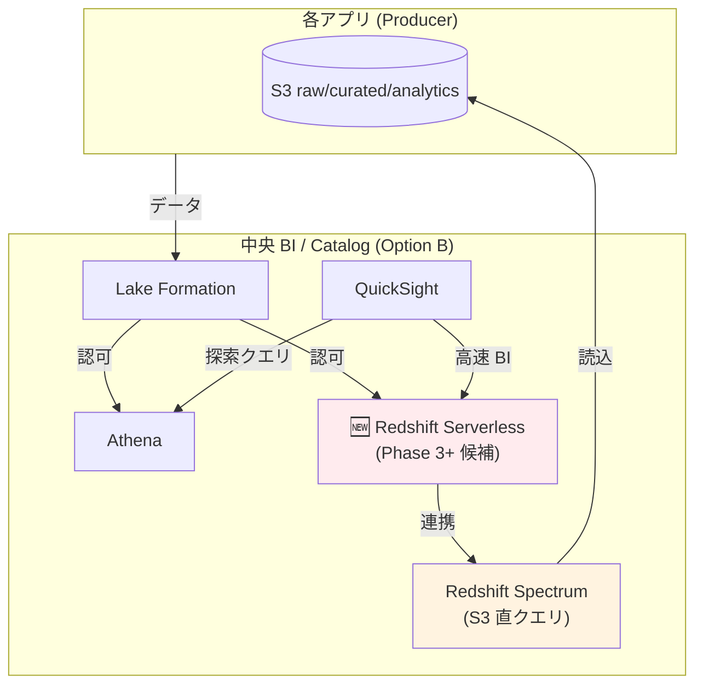
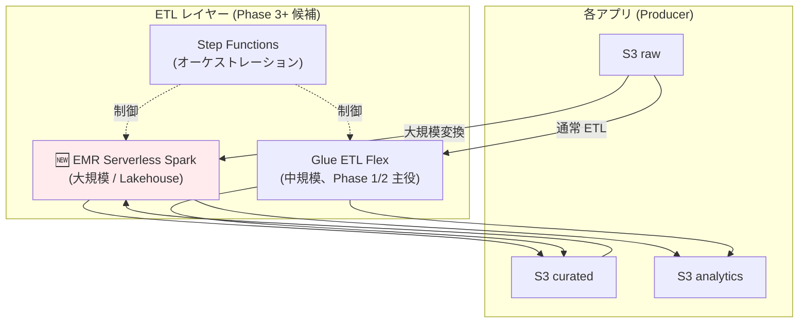

# DP-ADR-002: Phase 1/2 における Redshift / EMR の不採用判断

- **ステータス**: Accepted
- **日付**: 2026-06-17
- **関連**:
  - [../account-architecture-analysis.md](../account-architecture-analysis.md)（Federated 3 役割 + Option B 採用根拠）
  - [../strawman-proposal.md](../strawman-proposal.md)（仮案、Phase 1 = β + Option B + 共通ドメイン）
  - [../proposal/fr/02-storage.md §FR-2.2](../proposal/fr/02-storage.md)（DWH 採用条件 — Redshift）
  - [../proposal/fr/03-pipeline.md §FR-3.1](../proposal/fr/03-pipeline.md)（バッチ連携 — EMR Serverless）
  - [../proposal/fr/04-consumption.md §FR-4.1](../proposal/fr/04-consumption.md)（クエリ — Athena / Redshift）
  - [DP-ADR-001](DP-ADR-001-sagemaker-catalog-adoption-deferred.md)（SageMaker Catalog 採否判断、同様の Phase 別判断パターン）

---

## 1. Context

### 1.1 既存検討の状況

データプラットフォーム標準では、AWS の主要分析サービスを**条件付き採用**として既存 proposal/ に記載していた:

| サービス | 既存 proposal での記載 |
|---|---|
| **Athena** | 標準クエリエンジン、採用 |
| **Redshift** | DWH 用途、**条件付き採用**（[§FR-2.2](../proposal/fr/02-storage.md): 高頻度 BI / 同時実行 10+ / 秒オーダー要件）|
| **Glue ETL** | 標準 ETL、採用 |
| **EMR Serverless** | **条件付き採用**（[§FR-3.1](../proposal/fr/03-pipeline.md): Glue で性能不足 / Spark 以外）|

しかし、**「経費精算 SaaS Phase 1/2 で実際に採用するか」は ADR 化されておらず**、関係者の認識が不揃いになるリスクがあった。

### 1.2 本 ADR の目的

**Phase 1（最初 18 ヶ月）/ Phase 2（〜3 年）の規模で Redshift / EMR を採用するか、しないか**を明確に意思決定し、ADR として記録する。

---

## 2. Decision

### 2.1 決定内容

**Phase 1 および Phase 2 では、Redshift / EMR を採用しない**。

**Phase 3 以降は再評価**: 規模拡大・組織変化・データ量増加などのトリガ条件が満たされた時点で採用を再検討する。

### 2.2 採用する代替サービス（Phase 1/2）

| 用途 | 採用サービス |
|---|---|
| **クエリエンジン** | **Athena Standard On-Demand**（$5/TB スキャン）|
| **DWH 用途** | **Athena + QuickSight + SPICE** で代替 |
| **ETL** | **Glue ETL Flex**（$0.29/DPU 時間）/ SLA 要件のみ Standard |
| **大規模 Spark** | **不要**（Glue で十分） |
| **ML 開発（Phase 2）** | SageMaker Studio（ML 用途、Spark 機能含む） |

---

## 3. Rationale（不採用の根拠）

### 3.1 Redshift 不採用の根拠

#### 3.1.1 規模面で不要

経費精算 SaaS Phase 1/2 の規模を、[§FR-2.2 Redshift 採用条件](../proposal/fr/02-storage.md)に当てはめると:

| 採用条件 | Phase 1 | Phase 2 |
|---|---|---|
| 業務部門が BI ダッシュボードを定期閲覧 | △（10 名）| ✅（50 名）|
| **同時実行 10 ユーザー以上** | ❌（5 件以下）| △（10-20 件）|
| **クエリレイテンシ秒オーダー要件** | ❌（QuickSight SPICE で対応可）| ❌（同上）|

→ **「採用推奨」条件を満たさない**。

[§FR-2.2](../proposal/fr/02-storage.md) の「不要」条件:
> - 探索的クエリ中心
> - 日次バッチ集計のみ
> - 同時実行少数 → Athena で十分

→ **経費精算 SaaS Phase 1/2 はこの条件に該当**。

#### 3.1.2 コスト面で割高

| 構成 | 月額 |
|---|---|
| **Athena（採用案）** | $33-105/月（Phase 1-2）|
| **Redshift Serverless** | 最小 8 RPU × $0.36 × 730h ≈ $2,103/月 |
| **Redshift Provisioned**（ra3.xlplus 最小）| ≈ $793/月 |
| **Redshift Reserved 1 年**（30% off）| ≈ $555/月 |

→ **Phase 1/2 では 7-20 倍高い**。

#### 3.1.3 QuickSight + SPICE で代替可能

Redshift の主な優位点は QuickSight + SPICE で代替可能:

| Redshift の優位点 | QuickSight + SPICE での代替 |
|---|---|
| 同時実行の予測可能性 | SPICE のインメモリ計算で対応 |
| Materialized View | Athena CTAS + SPICE 自動更新で代替 |
| クエリレイテンシ秒オーダー | SPICE で 3 秒以内達成 |

#### 3.1.4 既存 ADR との整合

[DP-ADR-001 SageMaker Catalog 採否](DP-ADR-001-sagemaker-catalog-adoption-deferred.md)と同様の判断パターン:
- **Phase 1/2 の規模では ROI 低い**
- **コスト・運用複雑度を抑制**
- **Phase 3+ で利用拡大時に再評価**

### 3.2 EMR 不採用の根拠

#### 3.2.1 規模面で不要

経費精算 SaaS Phase 1/2 の規模を、[§FR-3.1 EMR 採用条件](../proposal/fr/03-pipeline.md)に当てはめると:

| 採用条件 | Phase 1 | Phase 2 |
|---|---|---|
| Glue で性能不足 | ❌ | ❌ |
| Spark 以外（Hive / Presto）が必要 | ❌ | ❌ |
| カスタム Spark 設定が必要 | ❌ | ❌ |

→ **「採用」条件を満たさない**。

#### 3.2.2 コスト面で Glue Flex とほぼ同等

同じ 1 時間 / 4 vCPU / 16 GB Spark ジョブ:

| サービス | 月額 |
|---|---|
| **EMR Serverless** | $0.0512 × 4 + $0.0056 × 16 = $0.30/時間 |
| **Glue ETL Standard** | $0.44/時間 |
| **Glue ETL Flex** | $0.29/時間 ⭐ |

→ **Glue Flex とほぼ同じコスト**。実装の手間・運用ノウハウ集約を考えると **Glue 一択**。

#### 3.2.3 ML 開発は SageMaker Studio で完結

EMR の数少ない優位点（ML 訓練・分散処理）は **SageMaker Studio + SageMaker Processing で代替可能**。

---

## 4. Phase 3 以降の再評価トリガ

以下のいずれかに該当した時点で、本 ADR を再開して採否を判断し直す:

### 4.1 Redshift 再評価トリガ

| # | トリガ | 評価指標 |
|---|---|---|
| 1 | **BI 利用者数の拡大** | 月間アクティブ Reader が 100 名以上 |
| 2 | **同時実行クエリの増加** | 業務時間中に日常的に 20+ クエリ同時実行 |
| 3 | **レイテンシ要件の厳格化** | 1 秒以内応答が SLA として要求 |
| 4 | **Materialized View の必要性** | 複雑集計の事前計算が常時必要 |
| 5 | **Concurrency Scaling 要件** | 経営層 BI のピーク時可用性が必須 |
| 6 | **Athena コスト超過** | 月間 1 PB スキャン超で Provisioned Capacity と比較 |

### 4.2 EMR 再評価トリガ

| # | トリガ | 評価指標 |
|---|---|---|
| 1 | **ETL データ量の急増** | 月間 ETL 対象データが 10 TB 超 |
| 2 | **Lakehouse 採用** | Iceberg / Hudi / Delta Lake の本格採用 |
| 3 | **Streaming Spark の必要性** | Kafka 直結の Spark Streaming が必須 |
| 4 | **大規模 ML 訓練** | 数十 TB の分散学習が必要 |
| 5 | **Spark 以外のフレームワーク** | Hive / Presto / Trino のカスタム実装が必要 |
| 6 | **カスタム Spark バージョン** | Glue の Spark バージョンでは不足 |

### 4.3 評価タイミング

- **Phase 3 開始時点**（Phase 2 終了 = 仮案で 2029 年初想定）の四半期レビューで上記指標を測定
- **DP-ADR-001（SMC 採否）と同時期の再評価**を推奨

---

## 5. Consequences

### 5.1 Positive（採用しない選択のメリット）

- **Phase 1 初期構築コスト最小**: Redshift Serverless 採用と比較し年 ~$24K の節約
- **運用シンプル**: AWS サービスを Athena + Glue + QuickSight + SageMaker に絞り込み
- **学習コスト最小**: BI チームが習得すべきサービスが少ない
- **データプラットフォーム標準の集中**: 主要分析パターンが 1 経路に集約
- **段階的成長**: 規模拡大に応じて必要時に追加可能、過剰投資を回避

### 5.2 Negative（採用しない選択のデメリット）

- **大規模 BI 時のレイテンシ低下リスク**: 100+ 利用者・同時実行多数時にレスポンス遅延の可能性
- **複雑な分析パターンへの対応限界**: Athena では難しい複雑な事前集計
- **既存 BI ツール（Tableau / Looker 等）が PostgreSQL 互換接続を期待する場合の対応** : Phase 1/2 で QuickSight 一本化想定なので影響少
- **Lakehouse パターンの採用が遅れる**: Iceberg / Delta Lake の本格活用は Phase 3+

### 5.3 Risks & Mitigations

| リスク | 対策 |
|---|---|
| Phase 1/2 中に予想を超える同時実行・レイテンシ要件 | Athena Provisioned Capacity を一時的に採用、トリガ条件 #2, #3 で測定 |
| Athena コストが予想を超える | コスト按分タグで監視、Workgroup でスキャン上限設定 |
| 大規模 ETL ジョブが Phase 2 中に発生 | Glue ETL の DPU 増強、または一時的に EMR Serverless 採用検討 |
| Phase 3 移行時の Redshift / EMR 導入コスト | 本 ADR §6 詳細分析を参照してスムーズな移行設計 |

---

## 6. 詳細分析（保存用、再評価時の参照資料）

> 本セクションは Phase 3 再評価時に参照する分析資料を保存しておく。再評価時点での AWS サービス・価格・組織状況に合わせて再検証すること。

### 6.1 Redshift 採用時の構成（参考）

**重要ポイント**:
- Redshift と Athena は **両方併存可能**（Catalog 共有）
- Redshift Spectrum で S3 レイクと連携、データ移動なし
- Aurora Zero-ETL で運用 DB から Redshift へ直結（採用時の優位点）

### 6.2 EMR Serverless 採用時の構成（参考）

**重要ポイント**:
- EMR Serverless と Glue ETL は **両方併存可能**
- EMR は **大規模 / Lakehouse / カスタム Spark** に特化
- Glue は **中規模 / 標準パターン** で継続

### 6.3 Redshift コスト試算（Phase 3+ 想定）

#### 6.3.1 Redshift Serverless

| 項目 | 単価 | 月額 |
|---|---|---|
| 最小 8 RPU | $0.36/RPU 時間 | 8 × $0.36 × 730 = $2,103 |
| 推奨 16 RPU（中規模 BI）| 同上 | 16 × $0.36 × 730 = $4,205 |
| ストレージ | $0.024/GB/月 | 5 TB × $0.024 × 1024 = $123 |
| **合計（16 RPU 構成）** | | **約 $4,328/月** |

#### 6.3.2 Redshift Provisioned

| 項目 | 単価 | 月額 |
|---|---|---|
| ra3.xlplus × 1 ノード | $1.086/時間 | 730 × $1.086 = $793 |
| ra3.4xlarge × 1 ノード | $3.26/時間 | 730 × $3.26 = $2,380 |
| **Reserved 1 年（30% off）** | | $793 × 0.7 = **$555/月** |

#### 6.3.3 Redshift Spectrum

- $5/TB スキャン（Athena と同額）
- Catalog 連携で Athena との併用が容易

### 6.4 EMR Serverless コスト試算

| Spark ジョブ | 単価 | 月額 |
|---|---|---|
| 1 時間 / 4 vCPU / 16 GB | $0.0512 × 4 + $0.0056 × 16 = $0.30 | $0.30 × 30 = $9 |
| 1 時間 / 16 vCPU / 64 GB | $0.0512 × 16 + $0.0056 × 64 = $1.18 | $1.18 × 30 = $35 |
| 5 時間 / 16 vCPU / 64 GB / 日 | $1.18 × 5 | $176/月 |
| 大規模 ETL（10 時間 / 32 vCPU / 128 GB / 日）| 32 × $0.0512 + 128 × $0.0056 × 10 = $23.6 × 10 = $236 | $7,080/月 |

### 6.5 機能比較（再評価時の参照）

#### 6.5.1 BI / クエリエンジン比較

| 機能 | Athena | Athena Provisioned Capacity | Redshift Serverless | Redshift Provisioned |
|---|:---:|:---:|:---:|:---:|
| サーバーレス | ✅ | ✅ | ✅ | ❌ |
| クエリレイテンシ | 秒〜分 | 秒 | 秒 | サブ秒（最適化済）|
| 同時実行 | 制限あり | DPU 数次第 | RPU 数次第 | WLM で制御 |
| Materialized View | ❌ | ❌ | ✅ | ✅ |
| ストアドプロシージャ | ❌ | ❌ | ✅ | ✅ |
| Federated Query | ✅ | ✅ | ✅ | ✅ |
| Zero-ETL Aurora 統合 | ❌ | ❌ | ✅ | ✅ |
| 月額（Phase 1/2 規模）| $33-105 | $876+ | $2,103+ | $555-793 |

#### 6.5.2 ETL / Spark 比較

| 機能 | Glue ETL Flex | Glue ETL Standard | EMR Serverless | EMR on EC2 |
|---|:---:|:---:|:---:|:---:|
| サーバーレス | ✅ | ✅ | ✅ | ❌ |
| 単価 | $0.29/DPU 時間 | $0.44/DPU 時間 | $0.30/4vCPU+16GB 時間 | EC2 料金 |
| カスタム Spark バージョン | ❌ | ❌ | ✅ | ✅ |
| Iceberg / Hudi / Delta Lake | △ | △ | ✅ | ✅ |
| Streaming Spark | △ | △ | ✅ | ✅ |
| Spark 以外（Hive / Presto） | ❌ | ❌ | ✅ | ✅ |
| 学習コスト | 低 | 低 | 中 | 高 |

### 6.6 移行時の考慮事項（Phase 3 で採用する場合）

#### Athena → Redshift 移行

1. **データの物理移行不要**: Redshift Spectrum で S3 レイクを直接クエリ可能
2. **Glue Data Catalog 共有**: 同じテーブル定義を Athena / Redshift で利用
3. **クエリ書き換え**: Athena / Trino → Redshift / PostgreSQL ベースで一部修正
4. **BI ツール接続切替**: QuickSight のデータソースを Redshift に変更
5. **Workload 分離**: 探索系は Athena、本番 BI は Redshift で運用

#### Glue → EMR Serverless 移行

1. **コード移植性**: Glue ETL の PySpark コードは EMR で大半そのまま動作
2. **Spark バージョン**: EMR で新バージョンを採用可能
3. **オーケストレーション**: Step Functions or Airflow を継続利用
4. **Catalog 共有**: Glue Data Catalog はそのまま利用可能

---

## 7. References

### AWS 公式

- [Amazon Redshift Pricing](https://aws.amazon.com/redshift/pricing/)
- [Amazon Redshift Serverless](https://aws.amazon.com/redshift/redshift-serverless/)
- [Redshift Spectrum](https://docs.aws.amazon.com/redshift/latest/dg/c-using-spectrum.html)
- [Zero-ETL Aurora to Redshift](https://aws.amazon.com/blogs/aws/new-aurora-zero-etl-integration-with-amazon-redshift/)
- [Amazon EMR Serverless Pricing](https://aws.amazon.com/emr/serverless/pricing/)
- [Amazon Athena Pricing](https://aws.amazon.com/athena/pricing/)
- [AWS Glue Pricing](https://aws.amazon.com/glue/pricing/)
- [AWS Well-Architected Data Analytics Lens](https://docs.aws.amazon.com/wellarchitected/latest/analytics-lens/)

### 関連ドキュメント

- [DP-ADR-001 SageMaker Catalog 採否判断](DP-ADR-001-sagemaker-catalog-adoption-deferred.md) — 同様の Phase 別判断パターン
- [../account-architecture-analysis.md §4.2](../account-architecture-analysis.md) — Pattern β + Option B 構成
- [../proposal/fr/02-storage.md §FR-2.2](../proposal/fr/02-storage.md) — DWH 採用条件
- [../proposal/fr/03-pipeline.md §FR-3.1](../proposal/fr/03-pipeline.md) — バッチ連携の選択肢
- [../proposal/fr/04-consumption.md §FR-4.1](../proposal/fr/04-consumption.md) — クエリエンジン
- [../strawman-proposal.md](../strawman-proposal.md) — 仮案
