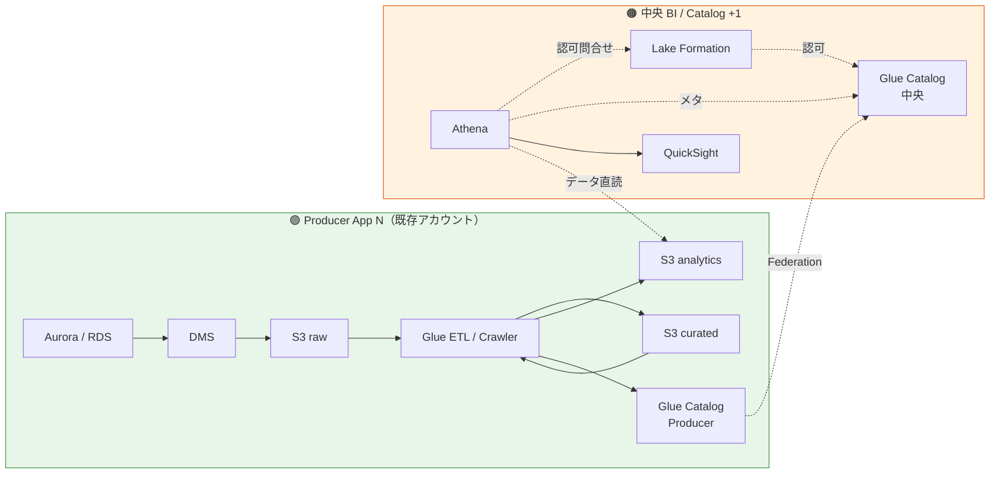
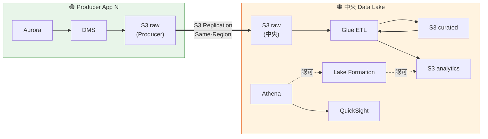
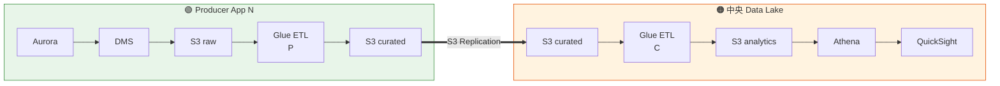
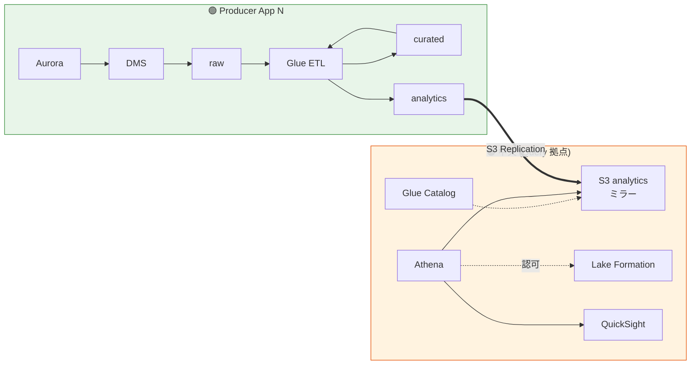
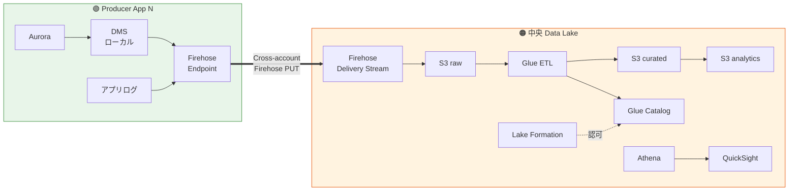
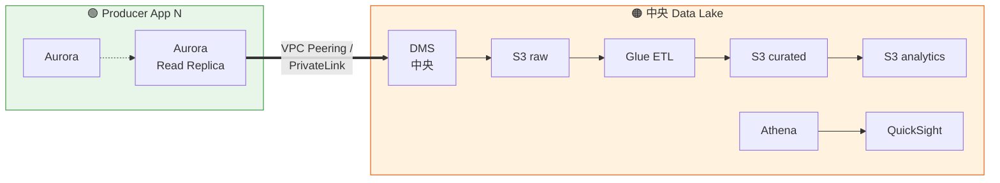
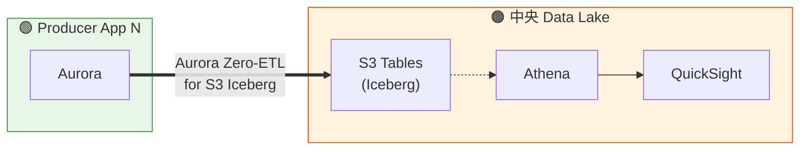

# データプラットフォーム アーキテクチャ代替案比較（調査記録）

> **位置付け**: 現行の Federated Data Mesh 構成（Pattern A）を採用する妥当性を検証するため、代替アーキテクチャ 5 パターン + Pattern B の 4 バリエーションを調査した記録。**現行 Pattern A の採用は維持**、他は Phase 2 以降の再評価候補として保管。
> **対応 SSOT**: [account-architecture-analysis.md](account-architecture-analysis.md)（現行 Pattern A の詳細）
> **作成日**: 2026-07-02

---

## §0. 全体比較サマリ（5 パターン）

| Pattern | 名称 | データ配置 | 10 アプリ月額 | Data Mesh 準拠 | 判定 |
|---|---|---|---:|:---:|:---:|
| **A** | **AWS Federated Data Mesh**（**現行**）| 分散 Producer + 中央 Catalog | **$1,253** | ⭕ | ⭕ 採用 |
| **B** | Central Data Lake（S3 中央集約） | 中央集約 | $1,050 | ❌ | 詳細比較 §2 |
| C | Iceberg on S3 / S3 Tables Lakehouse | 分散 or 中央（Iceberg） | $1,200 | ⭕ | Phase 2 候補 |
| D | Aurora Replica + Direct BI | 各 DB のみ | $800 | ❌ | ❌ 横断分析不可 |
| E | Fully Distributed（完全分散）| 各アプリ独立 | $3,000 | 極端 | ❌ ライセンス重複 |

（Pattern F の Hybrid（現行 + Redshift Materialization）は $3,300 で DP-ADR-002 と矛盾するため不採用）

---

## §1. Pattern A（現行）の再確認

### 1.1 概要

**AWS Prescriptive Guidance: Data Mesh Strategy** に準拠した Federated Data Mesh。Producer / Central Governance / Consumer の 3 役割を明確に分離。

### 1.2 データフロー

### 1.3 特徴

| 観点 | 内容 |
|---|---|
| **データの物理的所在** | Producer の S3（バルクは動かない）|
| **データ所有権** | Producer が所有（Domain Ownership 原則）|
| **カタログ** | 中央（Federation で参照）|
| **ETL 実行場所** | Producer 側（Domain Ownership）|
| **クエリ実行時** | 中央 Athena から Producer S3 を **STS 一時クレデンシャル**で読む |
| **Blast radius** | Producer 単位（他 Producer には波及しない）|

### 1.4 コスト（10 アプリ、必須のみ）

- Producer: $74/アプリ × 10 = $740
- 中央: $299
- 横断: $214
- **合計: $1,253/月**

---

## §2. Pattern B: Central Data Lake（S3 中央集約）の詳細検討

「Producer のデータを中央 S3 に**書き写す**」という発想を、具体的に 4 バリエーションで検討。

### 2.1 Pattern B-1: S3 Replication 型（詳細版）

「Producer S3 → 中央 S3 に**書き写す**」の最もオーソドックスな実装。実は「どこまで複製するか」「どこで ETL するか」で **4 つのサブバリエーション**があり、コスト・責務・リアルタイム性が大きく変わる。

#### 2.1.1 B-1 の 4 サブバリエーション

Medallion 3 層（raw / curated / analytics）のどこを複製し、どこで ETL するかで分岐:

| サブケース | Producer 側で作る層 | 複製する層 | 中央で作る層 | 意味 |
|---|---|---|---|---|
| **B-1a** | raw のみ | raw | curated + analytics | 中央「一括処理拠点」型 |
| **B-1b** | raw + curated | curated | analytics | 「役割分担」型 |
| **B-1c** | raw + curated + analytics | analytics | なし | 中央「読取専用ミラー」型 |
| **B-1d** | 全層 | 全層 | 独自集計あり | 「二重運用」型（過剰） |

##### B-1a: 中央「一括処理拠点」型

Producer は最小限（raw 書き込みのみ）、中央で全 ETL を実施。

- **Producer 責務**: Aurora → DMS → S3 raw のみ（ETL なし）
- **中央責務**: 全 ETL + Catalog + Athena + QuickSight
- **データ重複**: raw のみ二重
- **10 アプリ月額**（下記コスト内訳参照）: ~$1,050

##### B-1b: 「役割分担」型

Producer は curated まで作り、中央で analytics 集計。

- **Producer 責務**: raw → curated（PII マスキング、正規化、`tenant_id` 強制）
- **中央責務**: curated → analytics（横断集計）+ Catalog + BI
- **メリット**: Producer が「データ品質責任」を保持、中央は「集計特化」
- **デメリット**: curated スキーマの Contract が必要（Producer と中央で合意）

##### B-1c: 中央「読取専用ミラー」型

Producer で完全な Medallion を作り、analytics だけ中央にレプリカ。

- **Producer 責務**: 全 ETL（Pattern A と同じ）
- **中央責務**: Catalog + BI + Athena（クエリのみ）
- **メリット**: **クロスアカウント認可が不要**（データが中央にある）、Athena が Producer S3 に直読しない
- **デメリット**: **Pattern A の Federation を捨てて Replication に置換したメリットが薄い**（Producer 側 ETL は変わらず、追加コストのみ）

##### B-1d: 二重運用型（アンチパターン）

全層を Producer と中央の両方で持ち、両方で ETL 実行。**通常は非採用**。

- Producer と中央でスキーマが乖離するリスク
- ETL 二重実装
- 監視ポイント 2 倍
- コスト最大

#### 2.1.2 S3 Replication の技術詳細

| 項目 | 内容 |
|---|---|
| **Replication 種別** | **Same-Region Replication (SRR)** が本 PoC で該当（Cross-Region は災害復旧目的、コスト 2 倍）|
| **単価**（同リージョン内）| Replication PUT リクエスト: $0.005/1K requests + データ転送: **無料**（同一リージョン） |
| **単価**（クロスリージョン）| PUT + データ転送: $0.02/GB（Tokyo → Osaka 等） |
| **Batch Replication** | 既存オブジェクトの一括複製、$0.25/1M ジョブ + PUT + 転送 |
| **Replication Rules** | プレフィックス / タグ / KMS 鍵条件で対象を絞込可 |
| **Replication Time Control (RTC)** | 99.99% を **15 分以内**に複製、$0.015/GB 追加 |
| **暗号化** | ソース KMS 鍵 + 送信先 KMS 鍵の両方許可が必要 |
| **削除の伝播** | デフォルト無効（オプション有効化可）、GDPR 削除要件で重要 |
| **バージョニング必須** | 送信元・送信先バケットで S3 Versioning 有効化必須 |

#### 2.1.3 リソース配置詳細（B-1a を代表例に）

| 配置 | リソース | 数 | 月額（10 アプリ）|
|---|---|---|---|
| **Producer** | Aurora / RDS（既存アプリの一部）| N | 既存 |
| Producer | DMS インスタンス | N | $32 × 10 = $320 |
| Producer | DMS Storage | N | $9.6 × 10 = $96 |
| Producer | Lambda | N | $4.3 × 10 = $43 |
| Producer | **S3 raw のみ** | N | $3.8 × 10 = $38 |
| Producer | S3 バージョニング | 有効化 | ~$5 |
| Producer | S3 Replication 設定 | N | 設定コスト $0 |
| Producer | Replication PUT リクエスト | N | 50 GB × 10 × PUT 数 = $5 |
| Producer | **CloudWatch Logs**（DMS のみ、Glue は中央）| 減 | $50 |
| **中央** | S3 raw（10 アプリ分ミラー）| 1 | 150 GB × 10 × $0.025 = $38 |
| 中央 | S3 curated + analytics | 各 1 | $30 |
| 中央 | Glue ETL Flex（10 アプリ分集約）| 1 | $50-80 |
| 中央 | Glue Crawler | 1 | $10 |
| 中央 | Glue Data Catalog | 1 | $0（無料枠内）|
| 中央 | Lake Formation | 1 | $0 |
| 中央 | KMS CMK | 5-8 鍵 | $8 |
| 中央 | Athena | 1 | $1.5 |
| 中央 | QuickSight | 1 セット | $286 |
| 中央 | **中央 CloudWatch Logs**（Glue Continuous Logging 集約 = 大）| 1 | $100（Producer 分の Glue ログが集約される）|
| 横断 | RAM / CloudTrail / VPC EP / Config | | $150 |
| **合計** | | | **~$1,050** |

→ **Pattern A ($1,253) より -$200**、内訳は Producer Glue ETL 削減が主要因。

#### 2.1.4 Producer / 中央の責務分担詳細

| 責務項目 | Pattern A（現行）| Pattern B-1a | Pattern B-1b | Pattern B-1c |
|---|---|---|---|---|
| Aurora → S3 raw 取込 | Producer | Producer | Producer | Producer |
| raw → curated 変換（PII マスク、正規化）| Producer | **中央** | Producer | Producer |
| tenant_id パーティション強制 | Producer | **中央** | Producer | Producer |
| curated → analytics 集計 | Producer | **中央** | **中央** | Producer |
| Glue Catalog へのテーブル登録 | Producer + Federation | 中央のみ | 中央（Producer で curated 分は Producer）| Producer + Federation |
| Data Quality チェック | Producer | 中央 | Producer | Producer |
| PII 検出（Macie）| Producer | 中央 | Producer | Producer |
| 横断 KPI 集計（CTAS）| 中央 | 中央 | 中央 | 中央 |
| BI ダッシュボード | 中央 | 中央 | 中央 | 中央 |
| Lake Formation 認可 | 中央 | 中央 | 中央 | 中央 |
| Producer S3 削除リクエスト対応（GDPR）| Producer | Producer + 中央（複製元も削除）| Producer + 中央 | Producer + 中央 |
| **Producer チーム負荷** | 中 | **低**（データ供給のみ）| 中 | 中 |
| **中央チーム負荷** | 中 | **高**（10 アプリの ETL 全量）| 中 | 中 |

→ **B-1a は Producer 負荷が最小だが中央負荷が最大**、B-1b は中間、B-1c は Producer 負荷が Pattern A と変わらず追加メリットが薄い。

#### 2.1.5 コスト内訳（4 サブバリエーション比較、10 アプリ）

| カテゴリ | Pattern A | B-1a | B-1b | B-1c | B-1d |
|---|---:|---:|---:|---:|---:|
| Producer S3 全層 | $90 | $38（raw のみ）| $54（raw+cur）| $90 | $90 |
| Producer Glue ETL/Crawler | $100 | **$0** | $60（cur まで）| $100 | $100 |
| Producer DMS + Lambda | $373 | $373 | $373 | $373 | $373 |
| Producer CloudWatch | $95 | $50 | $75 | $95 | $95 |
| Producer 小計 | $658 | **$461** | $562 | $658 | $658 |
| S3 Replication（同リージョン、PUT のみ）| $0 | $5 | $8 | $10 | $15 |
| Central S3 追加ストレージ | $0 | $38 | $30 | $10 | $70 |
| Central Glue ETL | $0 | **$80** | $30 | $0 | $60 |
| Central Glue Crawler | $0 | $10 | $5 | $0 | $10 |
| Central その他（LF, Catalog, KMS, Athena, QS）| $299 | $299 | $299 | $299 | $299 |
| Central CloudWatch（Glue ログ集約）| $0 | $100 | $50 | $0 | $80 |
| 中央 小計 | $299 | **$532** | $422 | $319 | $534 |
| 横断 | $214 | $150 | $180 | $214 | $200 |
| **合計** | **$1,253** | **$1,143** | **$1,164** | **$1,191** | **$1,392** |
| Pattern A との差分 | 基準 | **-$110** | -$89 | -$62 | +$139 |

→ **B-1a が最安 -$110/月**、B-1c は Pattern A の代替として意味が薄い、B-1d は逆に高くなる。

#### 2.1.6 Pattern A → B-1 への移行パス

現行 Pattern A から B-1（特に B-1a）に移行する場合の手順:

| # | ステップ | 期間 | リスク |
|---|---|---|---|
| 1 | 中央 S3 バケット（raw / curated / analytics）を作成 | 1 日 | 低 |
| 2 | 中央 S3 でバージョニング + Replication 受信設定 | 1 日 | 低 |
| 3 | Producer S3（raw のみ）に Replication ルール追加 | アプリごとに 1 日 × N | 低 |
| 4 | **Batch Replication で既存データを初期同期** | データ量次第（10-100 GB/h）| 中（コスト、時間）|
| 5 | Producer 側の Glue ETL / Crawler を停止 | アプリごとに調整 | 中（並走期間の設計）|
| 6 | 中央側 Glue ETL / Crawler を新設・稼働開始 | 2 週間（10 アプリ分）| **高**（10 アプリ分の ETL を中央で書き直し）|
| 7 | Athena Federated Query の設定を中央 Catalog 直参照に切替え | 1 日 | 低 |
| 8 | Lake Formation 認可設定を中央 Catalog に集約 | 1 日 | 低 |
| 9 | QuickSight データセットの参照先切替え | 1 週間（動作検証込み）| 低 |
| 10 | 並走期間終了、Producer 側 curated / analytics 削除 | 1 週間 | 低 |
| **合計** | | **6-10 週間** | 主要リスクは **ステップ 6 の中央 ETL 実装工数** |

→ **10 アプリ分の ETL を中央で書き直す工数が最大の懸念**。1 アプリ 2-4 週間 × 10 = 20-40 週間の可能性。

#### 2.1.7 B-1 の運用シナリオ検証

##### シナリオ 1: 顧客テナントのデータ削除リクエスト（GDPR/APPI）

| 手順 | Pattern A | Pattern B-1a |
|---|---|---|
| 1. Producer S3（raw）で対象データを Delete | Producer 実施 | Producer 実施 |
| 2. Delete Marker の Replication が有効かチェック | 該当なし | **必須**（Replication rule で delete-replication 有効化）|
| 3. 中央 S3 でも削除確認 | 該当なし | **必須確認** |
| 4. Producer curated/analytics 再生成 | Producer で再 ETL | Producer 実施なし |
| 5. 中央 curated/analytics 再生成 | 該当なし | **中央で再 ETL 実施** |
| **削除完了までの時間** | 数時間（Producer 単独）| **1-2 日**（Producer + 中央 + Replication 待ち）|

→ **削除処理は Pattern A の方が単純**。B-1 では Replication 遅延 + 中央再 ETL の分だけ時間がかかる。

##### シナリオ 2: Producer 側スキーマ変更

| 手順 | Pattern A | Pattern B-1a |
|---|---|---|
| 1. Producer で raw スキーマ変更 | Producer 実施 | Producer 実施 |
| 2. Producer Glue Crawler で新スキーマ検出 | Producer で完結 | 該当なし |
| 3. Producer 側 ETL 更新 | Producer で完結 | **中央で更新** |
| 4. 中央 Federation で自動反映 | ⭕ | 該当なし |
| 5. **中央側 ETL の互換性検証** | 該当なし | **必須**（中央チームが 10 アプリの変更を追う）|

→ **B-1 では「Producer の変更を中央が追う」ガバナンスコストが発生**。組織的な密結合が生まれる。

##### シナリオ 3: 中央 Glue ETL 障害

| 影響範囲 | Pattern A | Pattern B-1a |
|---|---|---|
| 対象アプリ | 該当なし（Producer 側で ETL）| **10 アプリ全部の分析停止** |
| ダッシュボード影響 | 該当なし | **全ダッシュボード鮮度低下** |
| 復旧優先度 | — | **P0**（全社影響）|
| SLA 責任者 | — | 中央 BI チーム |

→ **B-1 は中央 ETL が単一障害点化**。SRE 体制と組み合わせて考える必要あり。

##### シナリオ 4: 新規 Producer アプリ追加

| 手順 | Pattern A | Pattern B-1a |
|---|---|---|
| 1. アプリ側でデータレイクリソース作成 | Producer が自力で（既存パターン踏襲）| Producer は raw のみ、簡素 |
| 2. Glue ETL 実装 | Producer が実装 | **中央チームが実装**（10 → 11 アプリ分）|
| 3. Federation 設定 | Producer + 中央 | 中央のみ |
| 4. Lake Formation 権限追加 | 中央 | 中央 |
| **オンボーディング時間** | 2-4 週間 | **中央工数次第**（優先度で数週間待ちも）|

→ **B-1 は新規追加が早いが、中央キューで詰まる可能性**。逆説的に Pattern A の方がスケールする可能性。

#### 2.1.8 B-1 採用の決定的な条件

以下**全て**に該当すれば B-1（特に B-1a）が有力:

| # | 条件 | 確認方法 |
|---|---|---|
| 1 | Producer チームがデータエンジニアリング未経験 or 実装工数を出せない | ヒアリング |
| 2 | 中央 BI チームが **10 アプリ分の ETL 実装・維持**を担える人員がいる（5+ 名）| 組織状況 |
| 3 | 新規アプリの追加が **頻繁ではない**（年 1-2 個以下）| 事業計画 |
| 4 | データの**リアルタイム性要件が緩い**（時間〜日単位で OK）| ヒアリング |
| 5 | Producer 側で **PII マスキング等のガバナンスを実装する意思がない** | ヒアリング |
| 6 | 全社統合 KPI の**変更頻度が高い**（中央で自由に集計変更したい）| ヒアリング |

→ 現状の本 PoC ヒアリング状況では **1〜6 のいずれも未確定**、特に 2（中央 BI チーム 2 名）は該当しない見込み。

#### 2.1.9 B-1 のまとめ

| 観点 | 評価 |
|---|---|
| **コスト効果** | -$110/月（B-1a、10 アプリ）は微減 |
| **Producer チーム負荷** | ⭕ 大きく減る |
| **中央チーム負荷** | ❌ 2 倍以上に増える |
| **障害耐性** | ❌ 中央が単一障害点 |
| **削除・スキーマ変更ガバナンス** | ❌ 二重管理コスト |
| **スケール性** | ❌ 中央がボトルネック（新規追加時）|
| **本 PoC 適合** | **△〜❌**（中央 BI 2 名では回らない）|

→ **B-1 は「中央チームが強力な組織」向け**。本 PoC の現状（中央 BI 2 名 Phase 1）では採用しにくい。ヒアリングで組織状況が判明した段階で再評価。

### 2.2 Pattern B-2: Firehose 直送型

Producer アプリ（Lambda / ECS）から **Kinesis Data Firehose で中央 S3 に直接送信**。Producer 側 S3 が存在しない。

**特徴**:

| 観点 | 内容 |
|---|---|
| Producer 側リソース | Firehose Endpoint（軽量）のみ、DMS も中央側に移設可 |
| 中央責任範囲 | ほぼ全て |
| データ重複 | なし（Producer 側に S3 raw 層を持たない）|
| 拡張性 | 新規アプリは Firehose PUT できるだけで良い |
| リアルタイム性 | **ストリーミング（分単位で S3 反映）**|

**コスト影響**（現行差分）:
- Producer 側 S3 raw 削除: **-$3.8/アプリ** = -$38/月
- Producer 側 Glue ETL 削減: -$10/アプリ = -$100/月
- Firehose 使用料増: +$1/アプリ = +$10/月（データ量に比例）
- Cross-account Firehose PUT: 中央 Firehose を Cross-account IAM Role で設定
- 中央側 Firehose: +$50/月（10 アプリ分の集約）
- 中央側 Glue ETL: +$50/月
- **総影響: -$28/月**（Firehose のシンプルさで運用も楽）

### 2.3 Pattern B-3: Cross-account DMS 型

**中央アカウントの DMS が Producer Aurora に接続**、中央 S3 に直接書き込み。Producer 側 DMS 不要。

**特徴**:

| 観点 | 内容 |
|---|---|
| Producer 側リソース | Aurora Read Replica（DMS 対策で追加、なくても可）|
| 中央責任範囲 | 全て（DMS、S3、ETL、Catalog、BI）|
| クロスアカウント接続 | **VPC Peering / PrivateLink / Transit Gateway** 必要 |
| ネットワーク複雑さ | **高**（Producer と中央の VPC 接続設計が必要）|
| セキュリティ | 中央から Producer DB への接続 = **セキュリティ境界越え** |

**コスト影響**（現行差分）:
- Producer 側 DMS 削除: **-$42/アプリ** = -$420/月
- Producer 側 Glue 削減: -$10/アプリ = -$100/月
- 中央 DMS: +$200/月（10 アプリ分の集約、規模の経済）
- VPC Peering 通信料: +$50/月
- 中央 Glue ETL: +$50/月
- **総影響: -$220/月**（大きな削減）

**しかし課題**:
- 中央から各 Producer DB への接続許可（**セキュリティレビュー必須**）
- Producer 側の DB スキーマ変更が中央 ETL を破壊
- Producer チームの DB 変更管理と中央の分析パイプラインが直結（**組織的密結合**）

### 2.4 Pattern B-4: Aurora Zero-ETL 型

**Aurora Zero-ETL for S3**（2025 発表）を活用、Aurora の変更を **自動で中央 S3 の Iceberg テーブルに反映**。

**特徴**:

| 観点 | 内容 |
|---|---|
| Producer 側リソース | Aurora のみ、追加なし |
| 中央責任範囲 | S3 Tables + Athena + BI |
| ETL 必要 | ほぼなし（Zero-ETL が自動処理）|
| データ形式 | **Iceberg**（ACID + Time Travel）|
| リアルタイム性 | **秒〜分**（Aurora のトランザクションが Iceberg に反映）|
| データ重複 | Aurora + Iceberg の二重（Iceberg 側は圧縮済）|

**コスト影響**（現行差分）:
- Producer 側 DMS + Glue 全削除: **-$52/アプリ** = -$520/月
- Aurora Zero-ETL: **Aurora 側の追加料金なし**、S3 Tables 側で $23-30/TB
- 中央 Glue ETL: +$20/月（変換は最小限）
- S3 Tables ストレージ: +$50/月
- **総影響: -$450/月**（劇的削減）

**しかし課題**:
- Aurora Zero-ETL for S3 Iceberg は **2025 年 GA、機能追加中**
- 全 Aurora バージョンで対応していない
- Iceberg 学習コスト
- **Pattern C（Iceberg）とほぼ同じ**設計になる

### 2.5 4 バリエーション比較

| 観点 | B-1: S3 CRR | B-2: Firehose | B-3: Cross DMS | B-4: Zero-ETL |
|---|:---:|:---:|:---:|:---:|
| Producer 側の追加リソース | S3 raw のみ | Firehose Endpoint | Aurora Replica | なし |
| 中央側の追加リソース | ETL 中央化 | Firehose + ETL | DMS + ETL | S3 Tables |
| ネットワーク設計 | 単純（S3 REP）| 単純（Cross-account IAM）| **VPC Peering 必須** | 単純（Zero-ETL）|
| セキュリティ | シンプル | シンプル | **中央→Producer DB 接続** | シンプル |
| データ重複 | 二重 | なし | なし | 最小 |
| リアルタイム性 | 分〜時間 | **分（stream）**| **分（CDC）**| **秒〜分** |
| 10 アプリ月額差分 | -$15 | -$28 | -$220 | -$450 |
| Data Mesh 準拠 | ❌ | ❌ | ❌ | ❌ |
| 成熟度 | ⭕ 定番 | ⭕ 定番 | ⭕ 定番 | △ 新機能 |
| **本 PoC 適合** | △ 単純化に効果薄 | ⭕ シンプル | ❌ セキュリティ懸念 | ⭕ 有望だが Iceberg 移行 |

→ **B バリエーションの中では B-2（Firehose 直送）または B-4（Zero-ETL）が現実的**。B-3 はセキュリティ観点で採用しにくい。

---

## §3. Pattern A vs Pattern B 徹底比較（20 軸）

### 3.1 定量比較

| # | 観点 | Pattern A（現行）| Pattern B（推奨変種は B-2 or B-4）|
|---|---|:---:|:---:|
| 1 | 10 アプリ月額 | $1,253 | B-1: $1,238 / B-2: $1,225 / B-4: $803 |
| 2 | Producer 側リソース数 | 19（必須）| B-1: 15 / B-2: 8 / B-4: 3 |
| 3 | 中央側リソース数 | 13 | B-2: 15 / B-4: 10 |
| 4 | Producer チーム負荷 | 中（ETL 実装）| **低**（データ供給のみ）|
| 5 | 中央チーム負荷 | 中 | **高**（全 ETL 統括）|
| 6 | Blast radius | Producer 単位 | **中央全体**（中央障害で全社停止）|

### 3.2 定性比較

| # | 観点 | Pattern A | Pattern B | 有利 |
|---|---|---|---|:---:|
| 7 | **Data Mesh Principles**（Domain Ownership）| ⭕ 準拠 | ❌ 中央集約でアンチパターン | A |
| 8 | **AWS Well-Architected**（Data Analytics Lens） | ⭕ 推奨パターン | △ 従来型 | A |
| 9 | **業界事例**（Netflix / Spotify / BBVA）| ⭕ 主流 | △ 一部（銀行系レガシー）| A |
| 10 | **データ所有権の明確性** | ⭕ Producer が所有 | ❌ 曖昧化 | A |
| 11 | **スキーマ変更のガバナンス** | ⭕ Producer 責任 | △ 中央での互換性チェック必要 | A |
| 12 | **Producer チームの自律性** | ⭕ 高 | ❌ 中央依存 | A |
| 13 | **新規アプリの追加容易性** | 中央 Federation 設定必要 | Firehose PUT のみ | **B** |
| 14 | **中央チームの単一障害点化** | 認可のみ | **全 ETL / クエリ** | A |
| 15 | **中央スキル要求** | 中（Catalog / LF）| 高（Cross-account ETL / 全ドメイン）| A |
| 16 | **将来のプラットフォーム変更容易性** | ⭕ Producer 単位で移行可能 | ❌ 中央依存で一括移行 | A |
| 17 | **障害時の影響範囲** | Producer 単位に閉じる | 中央障害で**全 SaaS 分析停止** | A |
| 18 | **コンプライアンス（GDPR/APPI 削除）** | Producer が制御 | 中央での実装、二重削除必要 | A |
| 19 | **監査ログの追跡容易性** | Producer → 中央の 2 段 | 中央のみ | **B** |
| 20 | **既存アプリへの影響** | 最小（Producer 化のみ）| 大（データ供給パイプライン改修）| A |

**A の勝ち: 15 / B の勝ち: 3 / 引き分け: 2**

### 3.3 コスト内訳比較（10 アプリ、Phase 1、必須のみ）

| カテゴリ | Pattern A | Pattern B-2（Firehose）| Pattern B-4（Zero-ETL）| A vs B-4 差分 |
|---|---:|---:|---:|---:|
| **Producer 側 DMS** | $410 | $410 | $0（Zero-ETL）| -$410 |
| **Producer 側 Lambda** | $43 | $43 | $43 | 0 |
| **Producer 側 S3** | $90 | $0（Firehose 直送）| $0 | -$90 |
| **Producer 側 Glue** | $100 | $0（中央 ETL）| $0 | -$100 |
| **Producer 側 CloudWatch** | $95 | $50 | $10 | -$85 |
| **Producer 側 Step Functions** | $0.4 | $0 | $0 | -$0.4 |
| **Producer 側小計** | $740 | $500 | $50 | -$690 |
| **中央 Firehose** | $0 | $50 | $0 | 0 |
| **中央 DMS（B-3 のみ）**| $0 | $0 | $0 | 0 |
| **中央 Glue ETL** | $0 | $50 | $20 | +$20 |
| **中央 S3 Tables** | $0 | $0 | $50 | +$50 |
| **中央 S3 (raw+curated+analytics)** | $0 | $38 | $0 | 0 |
| **中央 Lake Formation + Glue Catalog** | $8 | $8 | $8 | 0 |
| **中央 Athena** | $1.5 | $1.5 | $1.5 | 0 |
| **中央 QuickSight** | $286 | $286 | $286 | 0 |
| **中央 KMS** | $8 | $8 | $8 | 0 |
| **中央 S3 派生** | $3 | $3 | $3 | 0 |
| **中央小計** | $299 | $437 | $370 | +$71 |
| **横断（Producer 数依存が減る）**| $214 | $150（Config 記録項目減）| $130 | -$84 |
| **合計** | **$1,253** | **$1,087** | **$550** | **-$703** |

→ **Pattern B-4（Zero-ETL）が最安**だが、これは事実上 Pattern C（Iceberg）と同一設計。Iceberg 移行の話に集約される。

### 3.4 障害・災害シナリオ比較

| シナリオ | Pattern A | Pattern B |
|---|---|---|
| Producer App N の Glue ETL が停止 | App N の分析だけ止まる、他は継続 | ⭕ 中央に影響なし（Pattern B は Producer に ETL なし）|
| **中央 Lake Formation 障害** | 認可失敗 → **全クエリ停止** | 同上 |
| **中央 Glue ETL 障害** | 影響なし（各 Producer が ETL）| **全アプリの分析停止** |
| **中央 S3 バケット障害** | 影響なし（データは Producer S3）| **全データ喪失リスク** |
| Producer S3 削除ミス | App N の raw/curated 喪失 | **中央にも複製済で残る**（B-1）|
| リージョン障害 | 影響大（Producer + 中央）| 影響大（中央のみ）|

→ **Producer 個別障害は A が強い、中央障害は同等、データ保全は B-1 が強い**。

### 3.5 責務分担の変化

| 責務 | Pattern A | Pattern B-2 |
|---|---|---|
| データソース（Aurora）の運用 | Producer | Producer |
| データを分析用に**整形する ETL** | **Producer** | **中央** ← 大きく違う |
| データカタログの登録 | Producer + Federation | **中央のみ** |
| データ品質（Data Quality）| Producer | **中央** ← 大きく違う |
| PII マスキング | Producer 側 curated 変換で実装 | 中央で実装 |
| tenant_id パーティション強制 | Producer 側 ETL | 中央 ETL |
| BI ダッシュボード | 中央 BI チーム | 中央 BI チーム |
| Lake Formation 権限 | 中央 Catalog 管理者 | 中央 Catalog 管理者 |

→ Pattern B は **中央チームの負荷が 2 倍以上**。10 アプリの ETL を中央で全部書く工数を評価する必要あり。

---

## §4. 処理はどこでやるか - パターン別 メリット / デメリット / 課題

「大別すると 2 パターン」というシンプルな見立てで、両方の**メリット・デメリット・課題**を網羅的にリスト化。§3 の 20 軸比較を補完するための、**リスト形式の徹底整理**。

### 4.1 大別: 2 パターン

| # | パターン | 業界通称 | A/B 対応 |
|---|---|---|---|
| **1** | **アプリ側で処理してデータプラットフォームに渡す** | Federated Data Mesh / Domain Ownership | **A案** 分散型 |
| **2** | **データプラットフォームで生データを受け取って前処理もする** | Central Data Lake / ETL-first | **B案** 中央集約型 |

### 4.2 Pattern 1: アプリ側で処理（A案 分散型）

#### 4.2.1 メリット（8 項目）

| # | メリット | なぜ効くか |
|---|---|---|
| ① | **業務ドメイン所有権が明確** | データを一番よく知る人が品質責任を持つ、ズレが起きない |
| ② | **各アプリの自律性** | 中央依存なく独立して動ける、意思決定が早い |
| ③ | **中央組織が小さくて済む** | 2-3 名で運用可能、人材確保が現実的 |
| ④ | **中央がボトルネックにならない** | 各アプリで並行して開発・改善できる |
| ⑤ | **障害影響範囲が閉じる** | アプリ単位の障害は他に波及しない (Blast radius 小) |
| ⑥ | **データが物理的に動かない** | ストレージ二重不要、S3 Replication 不要でコスト効率 |
| ⑦ | **スケール性が高い** | アプリ数が増えても中央の負荷は増えない |
| ⑧ | **業界主流に沿う** | Netflix / Spotify / BBVA 等の大規模 SaaS が採用 |

#### 4.2.2 デメリット（7 項目）

| # | デメリット | 影響 |
|---|---|---|
| ① | 各アプリでデータエンジニアリング能力が必要 | 各アプリ 1-2 名の中級以上人材が要る |
| ② | 各アプリで実装工数が発生 | 10 アプリで 10-20 名工数（Phase 1）|
| ③ | アプリ間でスキル格差が生じやすい | 品質のばらつきリスク |
| ④ | 処理標準化が難しい | アプリ間で微妙に違う実装 |
| ⑤ | 中央からの Federation 設定が必要 | Cross-account の設定複雑性 |
| ⑥ | スキーマ変更時に中央 Consumer への影響通知が必要 | Data Contract の運用が要る |
| ⑦ | Cross-account の権限管理 | Lake Formation Grants の設計・維持 |

#### 4.2.3 課題（解決すべきこと、7 項目）

| # | 課題 | 対応策の例 |
|---|---|---|
| ① | 各アプリのスキル確保・育成 | 採用計画 + 中央からの技術支援体制 |
| ② | Data Contract の運用プロセス確立 | 合意→変更管理の仕組み、Confluence 等でリスト化 |
| ③ | アプリ間の品質のばらつき最小化 | 標準チェックリスト、レビュー体制 |
| ④ | 中央からの発見性 | Glue Catalog 整備、ドキュメント文化 |
| ⑤ | コスト按分 | AWS Cost Allocation Tag でアプリ別コスト把握 |
| ⑥ | アプリ側データエンジニアのキャリアパス | 組織的な魅力度（専門コミュニティ、評価軸）|
| ⑦ | 中央 - アプリの日常的コミュニケーション文化 | Slack チャンネル、定例会 |

### 4.3 Pattern 2: データプラットフォーム側で処理（B案 中央集約型）

#### 4.3.1 メリット（8 項目）

| # | メリット | なぜ効くか |
|---|---|---|
| ① | **各アプリチームの負担が最小** | データ供給のみで OK、データ加工スキル不要 |
| ② | **中央でノウハウ集約** | 効率的なチーム構築、標準化しやすい |
| ③ | **統一された処理標準** | 品質が揃う、一貫性が高い |
| ④ | **スキル集中** | 中央に強力な少数精鋭を配置可能 |
| ⑤ | **中央でのデータガバナンスが一元的** | GDPR/APPI 対応、監査が一箇所で完結 |
| ⑥ | **各アプリの技術選定の自由度** | データを送るだけなら、アプリ側は好きな技術を使える |
| ⑦ | **新規アプリ追加時のオンボーディングが早い** | データ供給の仕組みだけ用意すれば良い |
| ⑧ | **業務変更時のインパクトが小さい** | 中央側で吸収できる（アプリ側変更少）|

#### 4.3.2 デメリット（8 項目）

| # | デメリット | 影響 |
|---|---|---|
| ① | **中央組織が大規模必要** | 5+ 名の強力チーム、人材確保が難しい |
| ② | **中央が単一障害点** | 中央の障害で全社の分析停止 (Blast radius 大) |
| ③ | **データの物理的移動** | S3 Replication 等のコスト、二重ストレージ |
| ④ | **中央が全アプリの業務ドメイン理解を要求される** | スケール難、専門化 vs 汎用化のジレンマ |
| ⑤ | 業務変更時、アプリ→中央への情報伝達が必要 | 情報の非対称性、伝達漏れリスク |
| ⑥ | **中央がボトルネックになりやすい** | 新規要件・修正のキュー詰まり |
| ⑦ | **Domain Ownership の欠如** | アプリチームがデータに責任持たない → 品質問題 |
| ⑧ | 業界事例が減少傾向 | 大規模 SaaS は分散型に移行しつつある |

#### 4.3.3 課題（解決すべきこと、8 項目）

| # | 課題 | 対応策の例 |
|---|---|---|
| ① | 中央組織の人材確保 | 5+ 名の高スキル人材、外部採用 + 内部異動 |
| ② | 全業務ドメインの理解を中央でどう維持するか | 領域別サブチーム化、アプリ側とのペアリング |
| ③ | 中央のバックログ管理 | 優先順位付けプロセス、SLA 設定 |
| ④ | アプリ→中央への情報伝達プロトコル | スキーマ変更通知、業務変更ミーティング |
| ⑤ | スケール時の中央詰まり回避策 | 垂直分割（アプリ群単位）or 領域別サブチーム |
| ⑥ | データ移動のリアルタイム性確保 | バッチ vs ストリーム、遅延許容の合意 |
| ⑦ | 中央での組織的な優先順位付け | どのアプリの要件を先にやるかの意思決定 |
| ⑧ | 中央チームの育成・維持 | キャリアパス設計、専門性の可視化 |

### 4.4 対比サマリ表

| 観点 | Pattern 1（アプリ側処理）| Pattern 2（中央側処理）|
|---|---|---|
| 業界通称 | Federated Data Mesh | Central Data Lake |
| **業界主流** | ⭕ 大規模 SaaS 主流 | △ 銀行系レガシー等 |
| **中央組織** | 2-3 名 | 5+ 名 |
| **アプリ側の負担** | 大（各 1-2 名）| 小（データ供給のみ）|
| 中央がボトルネック | ❌ | ⭕ |
| 障害影響範囲 | アプリ単位 | 全社 |
| データの物理移動 | なし | あり（複製）|
| **スケール性** | ⭕ 高い | ❌ 中央詰まり |
| **Domain Ownership** | ⭕ 明確 | ❌ 曖昧 |
| 業務ドメイン理解 | アプリ側で維持 | 中央が全部理解 |
| 品質標準化 | △ ばらつくリスク | ⭕ 一貫性 |
| 新規アプリ追加 | Federation 設定（中程度）| データ供給のみ（簡単）|
| **Cost 10 アプリ月額** | ~$1,253 | ~$1,143 |
| Cost 20 アプリ月額 | ~$1,993 | ~$1,811 |
| 業界代表事例 | Netflix, Spotify, BBVA | 従来型銀行、保険会社 |
| 障害復旧の主体 | 各アプリ | 中央（一極集中）|
| 新規分析要件対応 | 中央で完結（curated 使う）| 中央で完結（全部知ってる）|

### 4.5 どちらを選ぶかの判断基準

#### 4.5.1 Pattern 1 が向く典型状況

以下 5 つのうち **3+ 該当** → Pattern 1（A案）

- [ ] 各アプリチームがデータエンジニアリング可能（各 1-2 名の中級人材）
- [ ] 案件数が 10+ で今後も拡大する見込み
- [ ] 中央組織は 2-3 名で維持したい（人材確保の現実性）
- [ ] 各アプリの自律性を尊重したい（Domain Ownership 志向）
- [ ] 業界主流の設計に沿いたい

#### 4.5.2 Pattern 2 が向く典型状況

以下 5 つのうち **3+ 該当** → Pattern 2（B案）

- [ ] 各アプリチームにデータ処理スキルがない（大半のアプリ）
- [ ] 案件数が 3-5 個で凍結見込み（拡大しない）
- [ ] 中央に強力なチーム（5+ 名）を確保できる
- [ ] 統一標準を優先したい（品質のばらつき許容できない）
- [ ] 業務ドメインが比較的シンプルで中央が全部理解可能

#### 4.5.3 判断のジレンマ

| 状況 | 推奨 |
|---|---|
| どちらでも成立する場合 | 経営の組織思想で決める（自律 or 集約）|
| 中央 5+ 名確保可 + アプリ側もスキルあり | **Pattern 1 推奨**（中央負荷が小さい）|
| 中央 2-3 名 + アプリ側スキル不足 | **Phase 1 縮小 or C案 検討**（両方成立しない）|
| 段階的移行を検討したい | まず Pattern 1 で小さく始めて、破綻したら Pattern 2 検討 |

### 4.6 参考: ハイブリッドは可能か?

**理論的には可能ですが、実務上は推奨しません**。境界を曖昧にすると:

- 「どちらがやるべきか」の判断が毎回発生
- 責任が曖昧化 → 品質問題時の責任所在不明
- 二重管理コスト増

**推奨アプローチ**: **主軸を明確に決めた上での限定的なハイブリッド**

- Pattern 1 主軸でも、**中央で用途特化の集計 (CTAS) は行う** ← 横断集計・KPI 実装で必要（問題ない）
- Pattern 2 主軸でも、**アプリ側で最低限のフォーマット統一は行う** ← 取込時に必要（問題ない）
- しかし、**「クレンジング・変換の主体」は明確にする** ← ここが本質

「フルハイブリッド」（クレンジングを毎回どちらでやるか判断）は避けるべき。

### 4.7 §3 の 20 軸比較との関係

- **§3**: 20 軸で徹底比較（定量・定性・コスト・障害・責務）→ **深く見たい時**
- **§4**: メリット・デメリット・課題を網羅リスト化 → **顧客説明や新規メンバー オンボーディングで見せたい時**

用途に応じて使い分けてください。

---

## §5. 判断基準

### 4.1 「S3 中央集約」を採用したくなる典型的な状況

| 状況 | Pattern B の魅力 |
|---|---|
| Producer チームがデータエンジニアリング未経験 | ⭕ ETL 実装不要でハードル下がる |
| 中央 BI チームが強力（10+ 名） | ⭕ 中央で全て制御できる |
| アプリ数が少ない（5 個以下）| ⭕ 中央に集約しても管理可能 |
| データ量が小さい（TB 未満）| ⭕ 中央のスループット限界に届かない |
| 全社統合 KPI が最優先、Producer 独立性は低優先 | ⭕ 中央で自由に横断集計 |

### 4.2 「S3 中央集約」が向かない典型的な状況

| 状況 | Pattern B の課題 |
|---|---|
| アプリ数が 10 以上 | ❌ 中央 ETL チームが破綻 |
| Producer チームがデータエンジニアリング可能 | ❌ Producer の生産性を殺す |
| データ量が数十 TB 以上 | ❌ 中央スループットが逼迫 |
| Producer チームがデータ所有権を主張 | ❌ 組織的対立 |
| コンプライアンス（GDPR/APPI）で削除要件が厳しい | ❌ 二重削除の設計負荷 |

### 4.3 本 PoC への適用判断

| 判断項目 | 本 PoC の状況 | 影響 |
|---|---|---|
| Producer チームスキル | 未確認（ヒアリング項目）| Pattern B は Producer スキル低で有利、ヒアリング結果次第 |
| 中央 BI チーム規模 | Phase 1: 2 名 | **10 アプリの ETL を 2 名では回らない** → B 不利 |
| アプリ数見通し | 5-20 | 上限 20 は B にとって厳しい |
| データ量見通し | Phase 1: 数百 GB, Phase 3: 数 TB | B のスケール限界には届かない |
| SaaS 提供側（当社）のガバナンス優先度 | 中〜高 | Pattern A の Producer 所有権が親和 |
| コンプライアンス要件 | APPI + PCI DSS | Producer 制御の A が有利 |

→ **本 PoC では Pattern A が有利**（特に「中央 BI チーム 2 名で 10 アプリの ETL は現実的でない」が決定打）

---

## §6. 結論と Phase 2 以降の再評価トリガ

### 5.1 Phase 1 決定

**Pattern A（現行、AWS Federated Data Mesh + Option B + D-2）を継続**。他パターンは調査記録として本ドキュメントに保管。

### 5.2 Pattern B に切り替えるトリガ

以下のいずれかが発生した場合、Pattern B（特に B-2 Firehose 型）への切替えを Phase 2 で再評価:

| # | トリガ | 検知方法 |
|---|---|---|
| 1 | 中央 BI チームが 5 名以上に増員、Producer が ETL 実装を断り続ける | 組織状況 |
| 2 | Producer チームからの「ETL 実装負荷が高すぎる」の声が 3 アプリ以上 | 定期振り返り |
| 3 | 中央でリアルタイム性の高い分析要件が増加（分単位）| PoC 段階のヒアリング |
| 4 | アプリ数が Phase 1 段階で 5 以下に留まる（スケール懸念少）| 案件数の実績 |

### 5.3 Pattern C（Iceberg / S3 Tables）に切り替えるトリガ

Pattern B-4 の議論はほぼ Pattern C の議論。以下で Phase 2 に再評価:

| # | トリガ |
|---|---|
| 1 | Iceberg 対応の成熟度が上がる（Athena Iceberg サポート完了、S3 Tables が広く採用）|
| 2 | GDPR/APPI 削除要件で ACID Delete が必要になる |
| 3 | Multi-engine 対応（Snowflake / EMR）が必要になる |
| 4 | Time Travel（過去時点のデータ再現）が業務要件になる |

---

## §7. 参考: 他パターン（C / D / E / F）の要約

### Pattern C: Iceberg / S3 Tables Lakehouse
- Apache Iceberg + S3 Tables（2025 新機能）
- 現行 A と併用可能（Producer S3 を Iceberg 化する移行パスあり）
- **Phase 2 で再評価する価値高い**

### Pattern D: Aurora Replica + Direct BI
- 横断分析不可、SaaS 提供側の KPI 出せず
- **不採用**

### Pattern E: Fully Distributed
- QuickSight 10 重ライセンスでコスト逆転
- 共通マスタ重複で品質崩壊
- **不採用**

### Pattern F: Hybrid（Redshift Materialization 併用）
- コスト 2.5 倍、DP-ADR-002 と矛盾
- **不採用**

---

## §8. 関連ドキュメント

- [account-architecture-analysis.md](account-architecture-analysis.md): 現行 Pattern A の詳細設計 SSOT
- [strawman-proposal.md](strawman-proposal.md): ヒアリング用仮案
- [adr/DP-ADR-001-sagemaker-catalog-adoption-deferred.md](adr/DP-ADR-001-sagemaker-catalog-adoption-deferred.md)
- [adr/DP-ADR-002-redshift-emr-not-adopted.md](adr/DP-ADR-002-redshift-emr-not-adopted.md)
- [adr/DP-ADR-003-common-domain-account-placement.md](adr/DP-ADR-003-common-domain-account-placement.md)

---

## §9. 改訂履歴

| 日付 | 改訂内容 |
|---|---|
| 2026-07-02 | 初版作成。5 パターン + Pattern B の 4 バリエーション調査記録、Pattern A vs B の 20 軸比較 |
| 2026-07-06 | §4 「処理はどこでやるか - パターン別 メリット / デメリット / 課題」を追加。Pattern 1（アプリ側処理）と Pattern 2（中央側処理）を、メリット 8 項目 / デメリット 7-8 項目 / 課題 7-8 項目 でリスト化。§3 の 20 軸比較を補完する **リスト形式の徹底整理**。既存 §4-§8 は §5-§9 にシフト |
