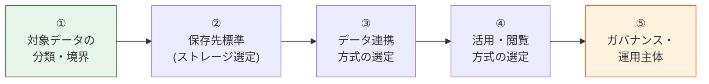
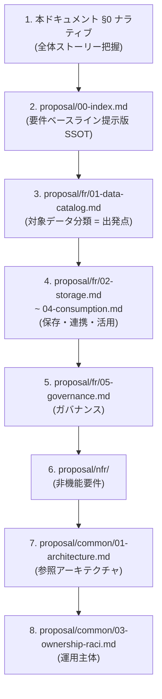
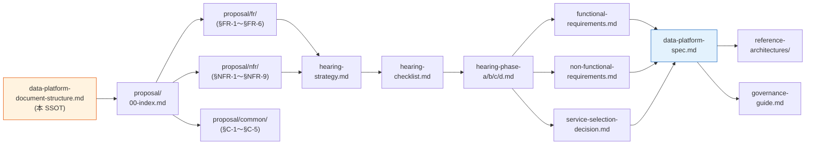

# データプラットフォーム要件定義 資料構成案（SSOT）

> 目的: データプラットフォーム標準の要件定義フェーズで作成すべきドキュメント体系・作成順序・**語る順序（ナラティブ）**・状態の単一情報源
> 位置付け: 本ドキュメントは本領域（doc/data-platform/）の **SSOT (Single Source of Truth)**。上位の枠組みは [../requirements/requirements-document-structure.md](../requirements/requirements-document-structure.md) を雛形にしているが、対象ドメインが異なるため独立して管理する。

---

## 0. 要件定義の語る順序（ナラティブ）

### 0.1 本標準の基本方針（全要件のトーン判断基準）

データプラットフォーム標準は **「絶対安全に、どんなユースケースでも、効率よくデータを活用でき、運用負荷やコストがかからない」分散標準** を目指す。共有認証基盤の基本方針 4 軸を、データプラットフォームの文脈に翻案して採用する。

| 基本方針の柱 | データプラットフォームでの解釈 |
|---|---|
| **絶対安全** | データ漏洩・改ざん・誤公開を起こさない。PII / 機密データの保護を最優先。暗号化・アクセス制御・監査が前提。 |
| **どんなユースケースでも** | 業務トランザクション / ログ / メトリクス / 監査 / 分析 など、扱うデータ区分とアクセスパターンを網羅。 |
| **効率よくデータを活用** | データの収集・連携・閲覧・分析がフリクションレス。新規データ追加・新規利用者参入の追加コストを抑える。 |
| **運用負荷・コスト最小** | **AWS ネイティブ / マネージド優先**。SaaS は原則不採用（よほどメリットがある場合のみ、ADR で意思決定経緯を残す）。自前運用は限定。 |

すべての要件は **AWS マルチアカウント前提**で、**各アプリの AWS アカウント内で同じ標準を適用する「分散標準」**として設計する。proposal/ 配下の各章（fr/ §FR-X / nfr/ §NFR-X / common/ §C-X）は、この 4 軸に対する立場を明示すること。

### 0.2 要件定義の 5 ステップ（語る順序）

要件定義書および各アプリ向け標準ガイドは、以下の 5 ステップで論理を組み立てる。**「何のデータを扱うか → どこに置くか → どう運ぶか → どう使うか → どう統制するか」** が本領域の中核ストーリー。



ステップ ① で「何を」を確定し、② で「どこに」、③ で「どう運ぶか」、④ で「誰がどう使うか」、⑤ で「誰が責任を持ち、どう統制するか」を決める。① が固まらないと ②〜④ は曖昧にしか決められないため、**対象データの分類が出発点**になる。

### 0.3 各ステップで答える問い

| Step | 答える問い | 主な決定事項 |
|:---:|---|---|
| ① | **何をデータプラットフォームで扱うか？** | 対象データの分類（業務 TX / ログ / メトリクス / 監査 / 外部連携）、機密度区分、データオーナーの存在前提 |
| ② | **どこに置くか？** | 用途別の標準ストレージ（S3 データレイク / RDS / DynamoDB / Glue Catalog / Redshift / OpenSearch 等）の使い分け |
| ③ | **どう運ぶか？** | バッチ（Glue / Step Functions）/ ストリーム（Kinesis / MSK）/ CDC（DMS）/ 直接書込み の使い分け、ETL/ELT の標準 |
| ④ | **誰がどう使うか？** | クエリ（Athena / Redshift Spectrum）/ BI（QuickSight）/ アプリ参照（API 経由）/ 直接アクセス（S3 / RDS） の使い分け、ペルソナ別の標準 |
| ⑤ | **誰が責任を持ち、どう統制するか？** | データオーナー / プラットフォーム標準化推進者 / 各アプリ運用者の RACI、権限制御（Lake Formation / IAM）、保管・削除ポリシー、PII 取り扱い |

### 0.4 ステップ間の論理構造

各ステップは前段の確定に依存する。① と ⑤（特にガバナンス要件のうち機密度区分）が確定すれば、②〜④ の選択肢空間は大きく絞り込まれる。

| 先行ステップ | 帰結（後続ステップへの制約） |
|---|---|
| ① 対象データに PII / 機密データを含む | ② 保存先は暗号化・アクセスログ前提 / ⑤ Lake Formation 等のきめ細かい権限制御が必須 |
| ① 対象データに大量ログ・メトリクスを含む | ② S3 + Glue / OpenSearch などコスト効率の良い保存先選定 / ③ ストリーム連携の必要性 |
| ① 業務 TX を分析対象に含む | ③ CDC（DMS）/ ストリーム連携 / ④ Redshift or Athena のクエリ性能要件 |
| ④ BI 利用者（業務部門・経営層）が主用途 | ④ QuickSight / Redshift の選定根拠 / ⑤ ロール・ロウレベルセキュリティ |
| ④ 開発者・分析者の探索的クエリが主用途 | ② S3 データレイク + ④ Athena が主軸 / ⑤ コスト統制（クエリ課金） |

→ ナラティブは①→⑤の順だが、要件確定は **① と ⑤ の前提が決まれば ②〜④ は自動的に絞り込まれる**構造。

---

## 1. ドキュメント体系の全体像

認証側（doc/requirements/）の体系を雛形に、データプラットフォーム標準向けに翻案する。

```
doc/data-platform/
├── 00-index.md                              ← 本フォルダのインデックス（暫定）
├── data-platform-document-structure.md      ← 本ドキュメント（SSOT）
│
├── [顧客・各アプリ向け標準提示 / 社内総括]
│   ├── proposal/                            ← 標準ベースライン提示版（fr/ nfr/ common/ にサブフォルダ化）
│   │   ├── 00-index.md                      ← proposal SSOT（基本方針・5 ステップ・章ナビ）
│   │   ├── fr/                              ← 機能要件 §FR-1 〜 §FR-6
│   │   │   ├── 00-index.md
│   │   │   ├── 01-data-catalog.md           ← §FR-1 対象データ・分類
│   │   │   ├── 02-storage.md                ← §FR-2 保存先標準
│   │   │   ├── 03-pipeline.md               ← §FR-3 データ連携
│   │   │   ├── 04-consumption.md            ← §FR-4 閲覧・活用
│   │   │   ├── 05-governance.md             ← §FR-5 ガバナンス
│   │   │   └── 06-personas.md               ← §FR-6 ペルソナ別実装パターン
│   │   ├── nfr/                             ← 非機能要件 §NFR-1 〜 §NFR-9（IPA 非機能要求グレード対応）
│   │   │   ├── 00-index.md                  ← NFR 索引 + IPA 6 大項目マッピング
│   │   │   ├── 01-availability.md           ← §NFR-1 可用性 (IPA A.)
│   │   │   ├── 02-performance.md            ← §NFR-2 性能 (IPA B.)
│   │   │   ├── 03-scalability.md            ← §NFR-3 拡張性 (IPA B.)
│   │   │   ├── 04-security.md               ← §NFR-4 セキュリティ (IPA E.)
│   │   │   ├── 05-dr.md                     ← §NFR-5 DR (IPA A. 災害対策)
│   │   │   ├── 06-operations.md             ← §NFR-6 運用 (IPA C.)
│   │   │   ├── 07-compliance.md             ← §NFR-7 コンプラ (IPA E + C)
│   │   │   ├── 08-cost.md                   ← §NFR-8 コスト (IPA 範囲外)
│   │   │   └── 09-lifecycle.md              ← §NFR-9 データライフサイクル（保管・アーカイブ・削除）
│   │   └── common/                          ← 横断章 §C-1 〜 §C-5
│   │       ├── 00-index.md
│   │       ├── 01-architecture.md           ← §C-1 参照アーキテクチャ（S3 レイク / Redshift DWH 等）
│   │       ├── 02-service-selection.md      ← §C-2 AWS サービス選定軸（Athena vs Redshift 等）
│   │       ├── 03-ownership-raci.md         ← §C-3 運用主体と責任分解（RACI）
│   │       ├── 04-tbd-summary.md            ← §C-4 TBD サマリー
│   │       └── 05-schedule.md               ← §C-5 スケジュール
│   └── internal-evaluation.md               ← 社内評価メモ（標準提示の裏どり資料、対外には出さない）
│
├── [ヒアリング]
│   ├── hearing-strategy.md                  ← ヒアリング戦略
│   ├── hearing-checklist.md                 ← ヒアリング項目（単一一覧）
│   ├── hearing-script/                      ← 章別スクリプト（必要に応じて）
│   ├── hearing-phase-a.md                   ← Phase A: 対象データ・スコープ確認
│   ├── hearing-phase-b.md                   ← Phase B: 技術要件（保存・連携・閲覧）
│   ├── hearing-phase-c.md                   ← Phase C: ガバナンス・運用要件
│   └── hearing-phase-d.md                   ← Phase D: 標準化推進体制の合意
│
├── [標準ガイド（要件定義書本体）]
│   ├── data-platform-spec.md                ← データプラットフォーム標準仕様書（本体）
│   ├── functional-requirements.md           ← 機能要件一覧（FR-DATA-* / FR-STORE-* 等）
│   ├── non-functional-requirements.md       ← 非機能要件一覧
│   └── service-selection-decision.md        ← AWS サービス選定判断書
│
└── [付録]
    ├── reference-architectures/             ← 参照アーキテクチャ実装例
    │   ├── 01-serverless-lake.md            ← S3 + Glue + Athena 構成
    │   ├── 02-dwh-redshift.md               ← Redshift 構成
    │   ├── 03-streaming.md                  ← Kinesis / MSK 構成
    │   └── 04-operational-store.md          ← RDS / DynamoDB 運用系
    ├── governance-guide.md                  ← ガバナンス実装ガイド（Lake Formation 等）
    └── cost-estimation.md                   ← コスト見積もり
```

> 上記は計画上の構成。実際の作成は §2 の Phase 順に進める。

---

## 2. 各ドキュメントの概要と作成順序

### Phase 1: 要件ベースライン提示版（proposal/）の整備

| # | ドキュメント | 目的 | 状態 |
|---|------------|------|------|
| 1 | data-platform-document-structure.md（本書） | 構成・ナラティブ・状態の SSOT | ✅ 初版 |
| 2 | proposal/00-index.md | 標準ベースライン提示版の SSOT | 🚧 骨格 |
| 3 | proposal/fr/01-data-catalog.md 〜 06-personas.md | 機能要件章 6 本（骨格） | 🚧 骨格 |
| 4 | proposal/nfr/01-availability.md 〜 09-lifecycle.md | 非機能要件章 9 本（骨格） | 🚧 骨格 |
| 5 | proposal/common/01-architecture.md 〜 05-schedule.md | 横断章 5 本（骨格） | 🚧 骨格 |
| 6 | [internal-evaluation.md](internal-evaluation.md) | 社内評価メモ（抽出方針の裏どり） | ✅ 初版 |

**proposal/ 各章の構成規約**（[../requirements/proposal/](../requirements/proposal/00-index.md) の §X.0 規約を継承）:

- **§X.0 前提と背景** を冒頭に必ず置く。構成：
  1. **用語整理** — 本章で扱う概念の定義（データプラットフォームの文脈で）
  2. **なぜここ（§X）で決めるか** — 他章との関係を mermaid で図化
  3. **§X.0.A 本標準のスタンス** — 基本方針 4 軸への立場明示
  4. **本章で扱うサブセクションの一覧**
- **NFR 章**は加えて **IPA グレードの中項目とのマッピング表**を §X.0 内に置く。
- 各サブセクションは **「ベースライン」+「TBD / 要確認」** の対構造で記載。詳細マトリクスは functional-requirements.md / non-functional-requirements.md にリンク委譲。

### Phase 2: ヒアリング実施

| # | ドキュメント | 目的 | 状態 |
|---|------------|------|------|
| 7 | hearing-strategy.md | Phase A〜D の進め方 | 📋 未着手 |
| 8 | hearing-checklist.md | 全 TBD 項目一覧 | 📋 未着手 |
| 9 | hearing-phase-a.md | 対象データ・スコープ確認結果 | 📋 未着手 |
| 10 | hearing-phase-b.md | 技術要件（保存・連携・閲覧）確認結果 | 📋 未着手 |
| 11 | hearing-phase-c.md | ガバナンス・運用要件確認結果 | 📋 未着手 |
| 12 | hearing-phase-d.md | 標準化推進体制の合意結果 | 📋 未着手 |

### Phase 3: 標準仕様書作成

| # | ドキュメント | 目的 | 状態 |
|---|------------|------|------|
| 13 | data-platform-spec.md | 標準仕様書（本体） | 📋 未着手 |
| 14 | functional-requirements.md | 機能要件の詳細 | 📋 未着手 |
| 15 | non-functional-requirements.md | 非機能要件の詳細 | 📋 未着手 |
| 16 | service-selection-decision.md | AWS サービス選定判断 | 📋 未着手 |

### Phase 4: 参照実装・付録

| # | ドキュメント | 目的 | 状態 |
|---|------------|------|------|
| 17 | reference-architectures/01-serverless-lake.md | S3 + Glue + Athena 参照構成 | 📋 未着手 |
| 18 | reference-architectures/02-dwh-redshift.md | Redshift 参照構成 | 📋 未着手 |
| 19 | reference-architectures/03-streaming.md | Kinesis / MSK 参照構成 | 📋 未着手 |
| 20 | reference-architectures/04-operational-store.md | RDS / DynamoDB 運用系参照構成 | 📋 未着手 |
| 21 | governance-guide.md | Lake Formation 等ガバナンス実装ガイド | 📋 未着手 |
| 22 | cost-estimation.md | コスト見積もり | 📋 未着手 |

---

## 3. 標準仕様書（data-platform-spec.md）の構成案

標準仕様書の中核ドキュメント。ヒアリング結果を統合して作成する。

```markdown
# データプラットフォーム標準仕様書

## 1. はじめに
  1.1 文書の目的
  1.2 対象範囲（各アプリの AWS アカウントが対象、共有アカウント基盤ではない）
  1.3 用語定義
  1.4 関連ドキュメント

## 2. ビジネス要件
  2.1 標準化の背景と目的
  2.2 対象システム範囲（標準を適用するアプリの定義）
  2.3 ステークホルダー（データオーナー / プラットフォーム標準化推進者 / アプリ運用者）
  2.4 制約事項（予算・期限・SaaS 不採用方針）

## 3. データプラットフォームの定義
  3.1 ミッション（何を実現するか）
  3.2 スコープ（含むもの / 含まないもの）
  3.3 標準の位置づけ（ガードレール vs 推奨）
  3.4 責任分界点

## 4. 機能要件（→ functional-requirements.md で詳細化）
  4.1 対象データ
    - データ区分（業務 TX / アプリログ / 監査ログ / メトリクス / 外部連携データ）
    - 機密度分類
    - データオーナーの定義
  4.2 保存先標準
    - データレイク（S3 + Glue Catalog）
    - 運用ストア（RDS / DynamoDB）
    - DWH（Redshift）
    - 検索系（OpenSearch）
    - 用途別の使い分け基準
  4.3 データ連携
    - バッチ（Glue / Step Functions）
    - ストリーム（Kinesis / MSK）
    - CDC（DMS）
    - 直接書込み
    - ETL/ELT の標準
  4.4 閲覧・活用
    - クエリ（Athena / Redshift Spectrum）
    - BI（QuickSight）
    - アプリ参照（API 経由）
    - 直接アクセス（S3 / RDS）
  4.5 ガバナンス
    - 権限制御（Lake Formation / IAM）
    - 暗号化（at-rest / in-transit）
    - PII 取り扱い
    - 監査ログ
  4.6 ペルソナ別実装パターン
    - 業務利用者（BI 中心）
    - 開発者（API 連携・運用系）
    - 分析者（探索的クエリ）
    - 監査者（ログ閲覧）

## 5. 非機能要件（→ non-functional-requirements.md で詳細化）
  5.1 可用性（保存先別の SLA / RTO / RPO）
  5.2 性能（クエリレイテンシ / スループット）
  5.3 拡張性（データ量・利用者数の増加対応）
  5.4 セキュリティ（暗号化・アクセス制御・監査）
  5.5 DR（バックアップ・クロスリージョン）
  5.6 運用（監視・データ品質・障害対応）
  5.7 コンプライアンス（個人情報保護法 / 業界規制）
  5.8 コスト（保存・転送・分析コストの統制）
  5.9 データライフサイクル（保管期間・アーカイブ・削除）

## 6. 参照アーキテクチャ
  6.1 サーバレスデータレイク（S3 + Glue + Athena）
  6.2 DWH（Redshift）
  6.3 ストリーミング（Kinesis / MSK）
  6.4 運用ストア（RDS / DynamoDB）

## 7. データガバナンス
  7.1 データオーナー制度
  7.2 権限制御（Lake Formation / IAM）
  7.3 保管・削除ポリシー
  7.4 PII 取り扱い
  7.5 監査ログ

## 8. 運用主体と責任分解
  8.1 RACI チャート
  8.2 標準化推進体制
  8.3 例外申請プロセス

## 9. 制約事項
  9.1 技術的制約（AWS ネイティブ優先、SaaS 不採用）
  9.2 法的制約（個人情報保護法 / 業界規制）
  9.3 組織的制約

## 10. 前提条件・残課題
  10.1 既存アプリの状態（標準化前）
  10.2 移行時の前提

## 11. ロードマップ
  11.1 マイルストーン
  11.2 各アプリへの展開順序
  11.3 標準の改訂サイクル
```

---

## 4. 機能要件一覧（functional-requirements.md）の構成案

### 4.1 カテゴリ体系（FR）

| § | カテゴリ | 接頭辞 | サブセクション |
|---|---|---|---|
| 1 | 対象データ | `FR-DATA-*` | §1.1 データ区分 / §1.2 機密度分類 / §1.3 データオーナー |
| 2 | 保存先標準 | `FR-STORE-*` | §2.1 データレイク / §2.2 DWH / §2.3 運用ストア / §2.4 検索系 / §2.5 用途別使い分け |
| 3 | データ連携 | `FR-PIPE-*` | §3.1 バッチ / §3.2 ストリーム / §3.3 CDC / §3.4 ETL/ELT 標準 |
| 4 | 閲覧・活用 | `FR-VIEW-*` | §4.1 クエリ / §4.2 BI / §4.3 アプリ参照 / §4.4 直接アクセス |
| 5 | ガバナンス | `FR-GOV-*` | §5.1 権限制御 / §5.2 暗号化 / §5.3 PII / §5.4 監査ログ |
| 6 | ペルソナ別実装 | `FR-PERSONA-*` | §6.1 業務利用者 / §6.2 開発者 / §6.3 分析者 / §6.4 監査者 |

### 4.2 表項目の必須カラム

| カラム | 用途 |
|---|---|
| ID | `FR-{CAT}-NNN` |
| 要件 | 短い記述 |
| 優先度 | Must / Should / Could / Won't / TBD |
| 標準実装方法 | 推奨する AWS サービス・構成 |
| 代替案 | やむを得ない場合の代替（理由付き） |
| 例外申請 | 標準から逸脱する場合の手続き |
| 状態 | ✅ 確定 / 🟡 デフォルト / 🔴 TBD |

---

## 5. 非機能要件一覧（non-functional-requirements.md）の構成案

### 5.1 カテゴリ体系（NFR）— IPA 非機能要求グレード対応

| § | カテゴリ | 接頭辞 | IPA 大項目 | サブセクション |
|---|---|---|---|---|
| 1 | 可用性 | `NFR-AVL-*` | **A. 可用性** | （フラット） |
| 2 | 性能 | `NFR-PERF-*` | **B. 性能・拡張性** | §2.1 クエリレイテンシ / §2.2 スループット |
| 3 | 拡張性 | `NFR-SCL-*` | **B. 性能・拡張性** | §3.1 データ量 / §3.2 利用者数 |
| 4 | セキュリティ | `NFR-SEC-*` | **E. セキュリティ** | §4.1 暗号化 / §4.2 アクセス制御 / §4.3 監査 / §4.4 ネットワーク境界 |
| 5 | DR | `NFR-DR-*` | **A. 災害対策** | （フラット） |
| 6 | 運用 | `NFR-OPS-*` | **C. 運用・保守性** | §6.1 監視 / §6.2 データ品質 / §6.3 体制 |
| 7 | コンプライアンス | `NFR-COMP-*` | **E + C** | §7.1 規制対応 / §7.2 業界認定 / §7.3 データガバナンス |
| 8 | コスト | `NFR-COST-*` | （IPA 範囲外） | （フラット） |
| 9 | データライフサイクル | `NFR-LCM-*` | **D. 移行性** に準じる | §9.1 保管期間 / §9.2 アーカイブ / §9.3 削除 |

> IPA グレードの **F. システム環境・エコロジー** はクラウド前提のため省略。

### 5.2 表項目の必須カラム

| カラム | 用途 |
|---|---|
| ID | `NFR-{CAT}-NNN` |
| 要件 | 短い記述 |
| 目標値 | 数値 or 定性記述（TBD 可） |
| 標準実装方法 | 推奨する AWS サービス・構成 |
| 計測方法 | 達成判定の手段 |
| 状態 | ✅ / 🟡 / 🔴 |

---

## 6. AWS サービス選定判断書（service-selection-decision.md）の構成案

```markdown
# AWS サービス選定判断書

## 1. 選定対象の論点
  1.1 クエリエンジン（Athena vs Redshift Spectrum vs Redshift）
  1.2 ETL（Glue vs EMR vs Lambda）
  1.3 ストリーム（Kinesis Data Streams vs MSK vs Kinesis Firehose）
  1.4 CDC（DMS vs Zero-ETL vs 自前）
  1.5 BI（QuickSight vs 他）
  1.6 メタデータ管理（Glue Data Catalog vs Lake Formation）

## 2. 評価基準
  - 基本方針 4 軸との適合（絶対安全 / どんなユースケース / 効率 / コスト）
  - 想定データ量・想定ワークロード
  - 既存スキルセット
  - 他 AWS サービスとの統合

## 3. 各論点のスコアリング

## 4. SaaS 検討の例外ケース
  - SaaS 採用を検討すべき条件
  - 採用時の ADR 必須事項

## 5. 推奨と根拠

## 6. リスク・懸念事項
```

---

## 7. 作成スケジュール

```
Week 0 (完了):
  ✅ 00-index.md（作業場所確保）
  ✅ data-platform-document-structure.md（本書、初版）
  ✅ proposal/00-index.md（SSOT）
  ✅ proposal/fr/ 7 ファイル（00-index + 6 章骨格）
  ✅ proposal/nfr/ 10 ファイル（00-index + 9 章骨格 + IPA マッピング）
  ✅ proposal/common/ 6 ファイル（00-index + 5 章骨格）

Week 1-2:
  📋 proposal/ 各章のサブセクション中身埋め・合意取り
  📋 §C-4 TBD サマリーへの集約
  📋 hearing-strategy.md
  📋 hearing-checklist.md

Week 3-4:
  📋 hearing-phase-a/b/c/d.md（実施に合わせて）

Week 5:
  📋 data-platform-spec.md
  📋 functional-requirements.md
  📋 non-functional-requirements.md
  📋 service-selection-decision.md

Week 6+:
  📋 reference-architectures/ 4 本
  📋 governance-guide.md
  📋 cost-estimation.md
```

> 上記はあくまで作成ペース感の目安。認証側との並走優先順位に応じて調整する。

---

## 8. ドキュメント間の依存関係と読み順

### 8.1 読み順（新規参画者向け）



### 8.2 書く順序（作成依存関係）



---

## 9. ドキュメント状態ダッシュボード

> 各ドキュメントの作成状況を一元管理。状態は実際の作成状況に応じて更新する。
> 「最終更新」列は git log で確認できるため省略。状態欄のみメンテナンスする。

### 9.1 SSOT / インデックス

| ドキュメント | 役割 | 状態 |
|---|---|:---:|
| [00-index.md](00-index.md) | 本フォルダの入口 | ✅ 初版 |
| **[data-platform-document-structure.md](data-platform-document-structure.md)（本 SSOT）** | 構成・ナラティブ・状態の単一情報源 | ✅ 初版 |

### 9.2 標準ベースライン提示版（proposal/）

| ドキュメント | 役割 | 状態 |
|---|---|:---:|
| [proposal/00-index.md](proposal/00-index.md) | proposal SSOT | 🚧 骨格 |
| [proposal/fr/00-index.md](proposal/fr/00-index.md) | FR 章一覧 | 🚧 骨格 |
| [proposal/fr/01-data-catalog.md](proposal/fr/01-data-catalog.md) | §FR-1 対象データ・分類 | 🚧 骨格 |
| [proposal/fr/02-storage.md](proposal/fr/02-storage.md) | §FR-2 保存先標準 | 🚧 骨格 |
| [proposal/fr/03-pipeline.md](proposal/fr/03-pipeline.md) | §FR-3 データ連携 | 🚧 骨格 |
| [proposal/fr/04-consumption.md](proposal/fr/04-consumption.md) | §FR-4 閲覧・活用 | 🚧 骨格 |
| [proposal/fr/05-governance.md](proposal/fr/05-governance.md) | §FR-5 ガバナンス | 🚧 骨格 |
| [proposal/fr/06-personas.md](proposal/fr/06-personas.md) | §FR-6 ペルソナ別実装パターン | 🚧 骨格 |
| [proposal/nfr/00-index.md](proposal/nfr/00-index.md) | NFR 索引 + IPA マッピング | 🚧 骨格 |
| [proposal/nfr/01-availability.md](proposal/nfr/01-availability.md) | §NFR-1 可用性 | 🚧 骨格 |
| [proposal/nfr/02-performance.md](proposal/nfr/02-performance.md) | §NFR-2 性能 | 🚧 骨格 |
| [proposal/nfr/03-scalability.md](proposal/nfr/03-scalability.md) | §NFR-3 拡張性 | 🚧 骨格 |
| [proposal/nfr/04-security.md](proposal/nfr/04-security.md) | §NFR-4 セキュリティ | 🚧 骨格 |
| [proposal/nfr/05-dr.md](proposal/nfr/05-dr.md) | §NFR-5 DR | 🚧 骨格 |
| [proposal/nfr/06-operations.md](proposal/nfr/06-operations.md) | §NFR-6 運用 | 🚧 骨格 |
| [proposal/nfr/07-compliance.md](proposal/nfr/07-compliance.md) | §NFR-7 コンプライアンス | 🚧 骨格 |
| [proposal/nfr/08-cost.md](proposal/nfr/08-cost.md) | §NFR-8 コスト | 🚧 骨格 |
| [proposal/nfr/09-lifecycle.md](proposal/nfr/09-lifecycle.md) | §NFR-9 データライフサイクル | 🚧 骨格 |
| [proposal/common/00-index.md](proposal/common/00-index.md) | Common 章一覧 | 🚧 骨格 |
| [proposal/common/01-architecture.md](proposal/common/01-architecture.md) | §C-1 参照アーキテクチャ | 🚧 骨格 |
| [proposal/common/02-service-selection.md](proposal/common/02-service-selection.md) | §C-2 AWS サービス選定軸 | 🚧 骨格 |
| [proposal/common/03-ownership-raci.md](proposal/common/03-ownership-raci.md) | §C-3 運用主体と責任分解 | 🚧 骨格 |
| [proposal/common/04-tbd-summary.md](proposal/common/04-tbd-summary.md) | §C-4 TBD サマリー | 🚧 骨格 |
| [proposal/common/05-schedule.md](proposal/common/05-schedule.md) | §C-5 スケジュール | 🚧 骨格 |
| [internal-evaluation.md](internal-evaluation.md) | 社内評価メモ（抽出方針の裏どり資料） | ✅ 初版 |

### 9.3 ヒアリング

| ドキュメント | 役割 | 状態 |
|---|---|:---:|
| hearing-strategy.md | Phase A〜D の進め方 | 📋 未着手 |
| hearing-checklist.md | 全 TBD 項目一覧 | 📋 未着手 |
| hearing-phase-a.md | 対象データ・スコープ確認 | 📋 未着手 |
| hearing-phase-b.md | 技術要件（保存・連携・閲覧）| 📋 未着手 |
| hearing-phase-c.md | ガバナンス・運用要件 | 📋 未着手 |
| hearing-phase-d.md | 標準化推進体制 | 📋 未着手 |

### 9.4 標準仕様書

| ドキュメント | 役割 | 状態 |
|---|---|:---:|
| data-platform-spec.md | 標準仕様書本体 | 📋 未着手 |
| functional-requirements.md | 機能要件一覧 | 📋 未着手 |
| non-functional-requirements.md | 非機能要件一覧 | 📋 未着手 |
| service-selection-decision.md | AWS サービス選定判断 | 📋 未着手 |

### 9.5 付録

| ドキュメント | 役割 | 状態 |
|---|---|:---:|
| reference-architectures/01-serverless-lake.md | S3 + Glue + Athena 参照構成 | 📋 未着手 |
| reference-architectures/02-dwh-redshift.md | Redshift 参照構成 | 📋 未着手 |
| reference-architectures/03-streaming.md | Kinesis / MSK 参照構成 | 📋 未着手 |
| reference-architectures/04-operational-store.md | RDS / DynamoDB 運用系参照構成 | 📋 未着手 |
| governance-guide.md | Lake Formation 等実装ガイド | 📋 未着手 |
| cost-estimation.md | コスト見積もり | 📋 未着手 |

### 9.6 状態凡例

| 記号 | 意味 |
|:---:|---|
| ✅ Done | 完成。継続的な微修正のみ |
| 🔄 進行中 | 主要内容は揃っているが、ヒアリング結果等で更新中 |
| 🚧 ドラフト | 骨格はあるが内容未確定 |
| ⏳ 未実施 | 前提イベント（ヒアリング等）待ち |
| 📋 未着手 | 着手予定 |

---

## 10. ID 体系と改廃ルール

### 10.1 ID 体系（横断ルール）

| 種別 | 形式 | 例 | 採番ルール |
|---|---|---|---|
| 機能要件 | `FR-{CAT}-NNN` | `FR-STORE-002` | カテゴリごとに連番。**一度採番した ID は再利用しない**（廃止時も欠番として残す） |
| 非機能要件 | `NFR-{CAT}-NNN` | `NFR-LCM-001` | 同上 |
| ADR | `DP-ADR-NNN` | `DP-ADR-001` | 認証側 ADR との衝突回避のため `DP-` プレフィックス |
| ヒアリング | `{Phase}-NNN` | `B-104` | Phase（A/B/C/D）+ 連番 |

**FR カテゴリ接頭辞**:
| カテゴリ | 接頭辞 | 領域 |
|---|---|---|
| 対象データ | `FR-DATA-*` | データ区分・分類・オーナー |
| 保存先標準 | `FR-STORE-*` | データレイク / DWH / 運用ストア / 検索系 |
| データ連携 | `FR-PIPE-*` | バッチ / ストリーム / CDC / ETL |
| 閲覧・活用 | `FR-VIEW-*` | クエリ / BI / API / 直接アクセス |
| ガバナンス | `FR-GOV-*` | 権限制御 / 暗号化 / PII / 監査 |
| ペルソナ別実装 | `FR-PERSONA-*` | ペルソナ別パターン |

**NFR カテゴリ接頭辞**:
| カテゴリ | 接頭辞 |
|---|---|
| 可用性 | `NFR-AVL-*` |
| 性能 | `NFR-PERF-*` |
| 拡張性 | `NFR-SCL-*` |
| セキュリティ | `NFR-SEC-*` |
| DR | `NFR-DR-*` |
| 運用 | `NFR-OPS-*` |
| コンプライアンス | `NFR-COMP-*` |
| コスト | `NFR-COST-*` |
| データライフサイクル | `NFR-LCM-*` |

### 10.2 サブセクション化の指針

要件群の性質が同一カテゴリ内で分かれる場合、ID は連続のまま**サブセクションで分ける**（既存参照を破壊しない）。認証側 SSOT §10.2 の方針を踏襲。

### 10.3 ドキュメント追加時の手順

1. 本 SSOT §9 ダッシュボードに行を追加
2. §1 体系図に位置づけを追記
3. §0 ナラティブのどの Step に対応するか明記
4. 他ドキュメントからのリンクが必要なら追記

### 10.4 ドキュメント廃止時の手順

1. ファイル削除前に**廃止理由とリンク先を本 SSOT に残す**（短い「廃止」エントリ）
2. 他ドキュメントからのリンクを grep で洗い出して更新
3. doc/old/ への移動も選択肢（読み取り専用扱い）

---

## 11. 関連ドキュメント

### 本領域内

- [00-index.md](00-index.md): 本フォルダの入口

### 兄弟領域（各アプリ標準）

- [../api-platform/00-index.md](../api-platform/00-index.md): API プラットフォーム標準（並走する分散標準）

### 認証側（雛形元）

- [../requirements/requirements-document-structure.md](../requirements/requirements-document-structure.md): 認証基盤の要件定義 SSOT（本 SSOT の雛形）
- [../requirements/proposal/00-index.md](../requirements/proposal/00-index.md): 認証基盤の proposal SSOT
- [../requirements/proposal/](../requirements/proposal/): proposal 各章の章立て規約の参考

### 全体

- [../00-index.md](../00-index.md): doc/ 全体の入口
