# データプラットフォーム 必須項目のみ構成図（Mermaid 詳細版）

> **対応 SSOT**: [account-architecture-analysis.md §4.5.2 統合料金一覧表](../account-architecture-analysis.md) で「**必須**」フラグを付けた **41 項目**のみで構成
> **対応 drawio**: [required-architecture.drawio](required-architecture.drawio)（同内容、AWS Architecture Icons 採用）
> **対応参照**: [account-architecture-analysis.md §4.5.6](../account-architecture-analysis.md) に Mermaid 概要版を埋込

## 含めるもの / 含めないもの

| 区分 | 件数 | 内容 |
|---|---|---|
| **必須**（本図に含む）| 41 | DMS / Lambda / S3 Medallion / Glue (ETL Flex + Crawler + Catalog) / Step Functions / EventBridge / CloudWatch (Logs+Alarms) / Lake Formation / KMS / Athena Standard / QuickSight (Author+Reader+SPICE) / S3 (中央 5 種) / RAM / CloudTrail / VPC Endpoint / Config / データ転送 |
| **任意**（含まない）| 31 | Firehose / AppFlow / Transfer Family / S3 IA-Glacier / Glue ETL Standard / Glue Data Quality / Schema Registry / CloudWatch カスタムメトリクス / SNS / LF Storage Optimizer / Athena Provisioned-Spark-Result Reuse / QuickSight Author Pro / Reader Pro / Paginated Reports / SageMaker（Phase 2）/ CloudTrail Insights-Lake / Config Rules / VPC Flow Logs / インターネット egress |
| **削除**（含まない）| 2 | Firehose VPC delivery（S3 配信では適用外） |

## Mermaid 詳細図

```mermaid
flowchart TB
    %% =========================================================
    %% アクター（必須運用に関わる役割のみ）
    %% =========================================================
    Steward(["👤 データスチュワード<br/>役割 2<br/>DataStewardRole"])
    Owner(["👤 データ責任者<br/>役割 1<br/>DataProductOwnerRole"])
    Admin(["👤 カタログ管理者<br/>役割 3<br/>DataLakeAdminRole"])
    Analyst(["👤 中央 BI チーム<br/>役割 4<br/>DataAnalystRole"])
    Reader(["👤 業務利用者<br/>役割 6<br/>DataReaderRole"])

    %% =========================================================
    %% Producer アカウント（N × アプリ）— 必須 19 項目
    %% =========================================================
    subgraph App1Account["🟢 AWS アカウント: App 1〜N（Producer、既存活用）"]
        direction TB

        subgraph App1Ingest["📥 取込層（必須）"]
            direction LR
            App1DMS["AWS DMS<br/>(インスタンス + Storage<br/>+ データ転送)"]
            App1Lambda["AWS Lambda<br/>(リクエスト + コンピューティング)"]
        end

        subgraph App1S3["Amazon S3 Medallion（必須）"]
            direction LR
            App1S3raw[raw 層]
            App1S3cur[curated 層]
            App1S3ana[analytics 層]
        end

        subgraph App1Glue["AWS Glue（必須）"]
            direction LR
            App1GlueCat["Glue Data Catalog<br/>(ストレージ + リクエスト)<br/>※App 自身の S3 定義"]
            App1Crawler[Glue Crawler]
            App1ETL[Glue ETL Flex]
        end

        subgraph App1Orch["🔁 オーケスト・監視（必須）"]
            direction LR
            App1StepFn[Step Functions]
            App1EvBridge[EventBridge<br/>Scheduler]
            App1CW["CloudWatch<br/>Logs Ingestion + Storage<br/>+ Alarms + API Requests"]
        end
    end

    %% =========================================================
    %% 中央 BI / Catalog アカウント — 必須 13 項目
    %% =========================================================
    subgraph CentralAccount["🟠 AWS アカウント: 中央 BI / Catalog 同居（Option B + D-2、新規 +1）"]
        direction TB

        subgraph CatLayer["📚 カタログ層（必須）"]
            direction LR
            subgraph LakeFormation["AWS Lake Formation"]
                LFCore[全機能<br/>LF-Tag/Filter/Grants]
            end
            subgraph GlueCentral["AWS Glue"]
                GlueCatCentral["Glue Data Catalog（中央）<br/>※LF 利用基盤<br/>Producer Federation"]
            end
            subgraph KMSSvc["AWS KMS"]
                KMSCMK[CMK 鍵管理]
                KMSReq[API リクエスト]
            end
        end

        subgraph UserLayer["📊 利用者層（必須）"]
            direction LR
            subgraph AthenaSvc["Amazon Athena"]
                AthenaWG[Standard On-Demand<br/>Workgroups]
            end
            subgraph QSSvc["Amazon QuickSight Enterprise"]
                QSDash[Author + Reader<br/>+ SPICE]
            end
        end

        subgraph S3Central["Amazon S3（必須）"]
            direction LR
            S3Derived[central-derived<br/>派生データ]
            S3Result[athena-results × WG 別]
            S3Audit[audit-results<br/>7 年 Object Lock]
            S3Common["common-domain<br/>共通参照データ (D-2)"]
        end
    end

    %% =========================================================
    %% 横断インフラ（全アカウント）— 必須 9 項目
    %% =========================================================
    subgraph CrossInfra["🔵 横断インフラ（全アカウント共通、必須 9 項目）"]
        direction LR
        RAM[AWS RAM<br/>リソース共有]
        CTrail["AWS CloudTrail<br/>Management + Data Events"]
        VPCEpInterface[VPC Interface<br/>Endpoint × 8 endpoints]
        VPCEpGateway[VPC Gateway Endpoint<br/>S3 / DynamoDB（無料）]
        Config[AWS Config<br/>継続記録項目]
        DataTransfer[データ転送<br/>同一リージョン + クロス AZ]
    end

    %% =========================================================
    %% Producer 接続関係
    %% =========================================================
    Steward -.実装・運用.-> App1ETL
    Steward -.実装・運用.-> App1Crawler
    Steward -.実装・運用.-> App1StepFn
    Owner -.公開承認.-> App1GlueCat

    App1DMS --> App1S3raw
    App1Lambda --> App1S3raw
    App1S3raw -->|raw → curated| App1ETL
    App1ETL --> App1S3cur
    App1S3cur -->|curated → analytics| App1ETL
    App1ETL --> App1S3ana
    App1Crawler -.スキャン.-> App1S3raw
    App1Crawler -.スキャン.-> App1S3cur
    App1Crawler -.スキャン.-> App1S3ana
    App1Crawler -->|定義更新| App1GlueCat

    App1EvBridge -.起動.-> App1StepFn
    App1StepFn -.制御.-> App1DMS
    App1StepFn -.制御.-> App1ETL
    App1StepFn -.制御.-> App1Crawler
    App1ETL -.ログ.-> App1CW
    App1DMS -.ログ.-> App1CW

    %% =========================================================
    %% 中央 接続関係
    %% =========================================================
    Admin -.LF/Tag 管理.-> LFCore
    Admin -.鍵管理.-> KMSCMK
    LFCore -.認可レイヤー.-> GlueCatCentral

    App1GlueCat -.Cross-account<br/>Federation.-> GlueCatCentral
    KMSCMK -.暗号化.-> App1S3raw
    KMSReq -.API 呼出.-> KMSCMK

    Analyst -.クエリ作成.-> AthenaWG
    Analyst -.ダッシュ作成.-> QSDash
    Reader -.閲覧.-> QSDash

    AthenaWG -.認可問合せ.-> LFCore
    AthenaWG -.メタデータ参照.-> GlueCatCentral
    AthenaWG -.データ直読.-> App1S3ana
    AthenaWG -.クエリ結果保存.-> S3Result
    AthenaWG -.CTAS 派生データ.-> S3Derived
    QSDash -.SQL.-> AthenaWG
    AthenaWG -.横断クエリ.-> S3Common

    %% =========================================================
    %% 横断インフラ 接続関係
    %% =========================================================
    RAM -.LF 権限共有.-> LFCore
    CTrail -.監査ログ収集.-> App1Account
    CTrail -.監査ログ収集.-> CentralAccount
    VPCEpInterface -.プライベート接続.-> CentralAccount
    VPCEpGateway -.S3 アクセス.-> App1S3
    VPCEpGateway -.S3 アクセス.-> S3Central
    Config -.設定監視.-> App1Account
    Config -.設定監視.-> CentralAccount
    CTrail -.保管.-> S3Audit

    %% =========================================================
    %% Styling
    %% =========================================================
    style App1Account fill:#e8f5e9,stroke:#388e3c,stroke-width:3px
    style CentralAccount fill:#fff3e0,stroke:#e65100,stroke-width:3px
    style CrossInfra fill:#e1f5fe,stroke:#0277bd,stroke-width:3px

    style App1Ingest fill:#ffecb3
    style App1Orch fill:#e3f2fd
    style CatLayer fill:#ffebee
    style UserLayer fill:#e3f2fd

    style LakeFormation fill:#ffcc99
    style GlueCentral fill:#ffd5cc
    style App1Glue fill:#ffd5cc
    style App1S3 fill:#ccffcc
    style S3Central fill:#ccffcc
    style AthenaSvc fill:#ccddff
    style QSSvc fill:#ccddff
    style KMSSvc fill:#fff

    style Steward fill:#fffacd
    style Owner fill:#fffacd
    style Admin fill:#fffacd
    style Analyst fill:#fffacd
    style Reader fill:#fffacd
```

## 月額合計（Phase 1、厳密に必須のみ）

| 規模 | Producer ($74/アプリ × N) | 中央 | 横断 | 合計 |
|---|---:|---:|---:|---:|
| 1 アプリ | $74 | $299 | $214 | **~$587/月** |
| 5 アプリ | $370 | $299 | $214 | **~$883/月** |
| 10 アプリ | $740 | $299 | $214 | **~$1,253/月** |
| 20 アプリ | $1,480 | $299 | $214 | **~$1,993/月** |

- 詳細単価は [§4.5.2 統合料金一覧表](../account-architecture-analysis.md)（41 行、必須のみ + 任意 31 + 削除 2）参照
- 「必須のみ」の集計は [§4.5.2.C](../account-architecture-analysis.md)、Phase 1 全体は [§4.5.3](../account-architecture-analysis.md) 参照
- **さらに削減余地**（レベル 1 最適化 6 項目、機能維持のまま設定絞込）: [§4.5.4.B](../account-architecture-analysis.md) 参照。全適用で 10 アプリ **~$1,011/月**

## 更新方針

設計変更で必須/任意の分類が変わった場合は、以下 **3 箇所を同期更新**:
1. [§4.5.2 統合料金一覧表](../account-architecture-analysis.md)（必須/任意 列）
2. [§4.5.6 必須項目のみの構成図](../account-architecture-analysis.md)（概要 Mermaid）
3. 本ファイル + [required-architecture.drawio](required-architecture.drawio)（詳細図）
