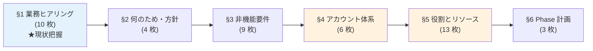
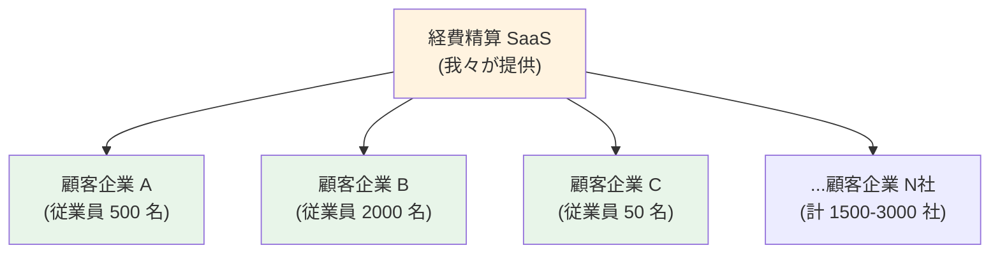
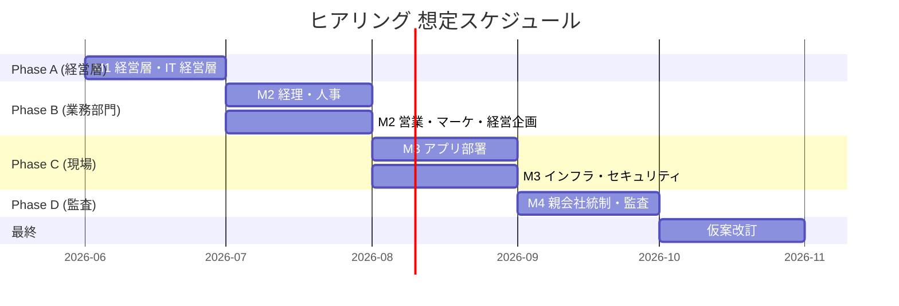

# データプラットフォーム ヒアリング用スライド集（タイトル / 内容 / 回答例）

> ステータス: 🚧 仮案（ヒアリング Phase A 前）
> 対象読者: **社内のみ**（ヒアリング実施者向け）
> 位置付け: ヒアリングで提示する PowerPoint スライド単位の内容・想定回答例
> 仮案前提: [strawman-proposal.md](strawman-proposal.md) — β + Option B + 共通ドメイン + Path C 段階移行
> 関連: [powerpoint-outline-and-references.md](powerpoint-outline-and-references.md)（戦略マトリクス）

---

## 0. 本資料の目的と使い方

### 0.1 目的

ヒアリングで各関係者（ステークホルダー）に **PowerPoint で見せる「スライド単位の内容」を表形式でまとめる**。
- 「**何を提示するか**」と「**どんな回答を期待するか**」を明示する
- ヒアリング当日にこの表からスライドを生成 / 直接ホワイトボードで見せる
- 回答が回答例の範囲を逸脱したら**仮案見直しトリガ**として認識する

### 0.2 既存資料との関係

| 資料 | 役割 |
|---|---|
| [powerpoint-outline-and-references.md](powerpoint-outline-and-references.md) | **戦略マトリクス**（章構成・参考資料・時間配分の俯瞰）|
| **本資料**（hearing-slide-deck.md）| **スライド単位の内容と回答例**（ヒアリング当日の提示物）|
| [strawman-proposal.md §6](strawman-proposal.md) | **ヒアリング対象の関係者別の質問**（A〜I グループ）|

3 資料はそれぞれ違う粒度で同じヒアリング活動を支える。

### 0.3 スライドの構成（全 6 セクション 45 枚想定）

**順序の考え方**: 業務ヒアリング（現状把握）→ 構成・方針の合意 → 詳細設計（非機能・アカウント・役割・Phase）の流れ。

**§1 業務ヒアリング** で SaaS 提供側の現状（課題・利用者・データ）を把握し、関係者がデータプラットフォームの「自分事」として何が起きるかをイメージしてから、**§2 で構成・方針の合意** に移る。§4-§5 はアーキテクチャと役割の詰め。

### 0.4 表の読み方

| 列 | 内容 |
|---|---|
| **#** | スライド番号 |
| **タイトル** | スライドのタイトル（3-7 字程度）|
| **内容** | スライド本体に書くこと（仮案の提示 + 確認したい質問）|
| **回答例** | ヒアリングで返ってくるであろう典型的な回答（議論を引き出す材料）|

### 0.5 用語集（本資料での日本語表記）

ヒアリング相手が技術用語に詳しくない場合に備え、本資料は**わかりやすい日本語**を優先する。社内ドキュメント（strawman / account-architecture-analysis 等）でのカタカナ表記との対応:

| 本資料での表記 | 社内資料の表記 | 説明 |
|---|---|---|
| **データ責任者** | データオーナー | 各データの収集・利用・公開範囲・保管期間の最終決定権を持つ役割（部署長クラス）|
| **データ管理担当者** | データスチュワード | データオーナーから委任され、スキーマ管理・データ品質・カタログ登録の実務を担当 |
| **データ分析担当者** | データアナリスト | SQL や BI ツールでデータを分析する担当者 |
| **カタログ管理者** | Catalog 管理者 | Lake Formation Catalog（データプラットフォームの中核管理機能）を運用する担当者 |
| **利用者像** | ペルソナ | 想定する利用者の典型像 |
| **利用申請** | サブスクリプション | データ製品へのアクセス権を申請するプロセス |
| **スムーズな** | フリクションレス | 抵抗のない、容易な |
| **応答時間** | レイテンシ | 要求から結果が返るまでの時間 |
| **処理量** | スループット | 単位時間あたりの処理件数・データ量 |
| **関係者** | ステークホルダー | 検討に関わる組織・人 |

### 0.6 本資料を通じての具体例: **経費精算 SaaS（B2B パッケージ販売事業）**

データプラットフォームは抽象論になりがちなため、本資料では「**経費精算 SaaS をパッケージとして複数の顧客企業に販売する事業**」を**繰り返し具体例として参照**する。

#### 0.6.1 事業文脈の前提

- 我々（SaaS 提供側）は経費精算 SaaS をパッケージ製品として、**1500-3000 社の顧客企業**に販売する事業を行っている
- 各顧客企業はそれぞれの従業員（数十〜数千名）に向けて本 SaaS を使う
- データは**マルチテナント**（顧客企業ごとに `tenant_id` で分離）
- 認証基盤も同様の構造（[共有認証基盤](../requirements/)）: 顧客 IdP 連携 + ローカルユーザーのハイブリッド

#### 0.6.2 データプラットフォームのスコープ（重要な区別）

| 種別 | 対象 | 本データプラットフォームの扱い |
|---|---|---|
| **A. SaaS 提供側の分析** | 経営判断・カスタマーサクセス・プロダクト改善 | ⭐ **本データプラットフォームの中心スコープ** |
| **B. 顧客企業向け機能としての分析** | 顧客企業の管理者が自社データを見る機能 | △ **SaaS の機能として提供するかは別検討**（本データプラットフォームに乗せるか、SaaS アプリの一機能として組み込むかは要ヒアリング）|

> **ヒアリングの中核質問**: A と B のどちらをスコープに含むか、B を含む場合の実装方式（本データプラットフォーム経由 / SaaS アプリ内蔵 / 顧客に Read 専用アクセスを提供）

#### 0.6.3 経費精算 SaaS の要素マッピング

| 経費精算 SaaS の要素 | データプラットフォームでの位置付け | テナント分離の扱い |
|---|---|---|
| 顧客企業 X の従業員 Y の経費申請データ | 業務 TX（5 区分の 1 つ目）| `tenant_id = X` で分離 |
| SaaS アプリの動作ログ | アプリログ | `tenant_id` を含む |
| 顧客企業 X の管理者の操作ログ | 監査ログ | `tenant_id = X` で分離 |
| 経費精算 API の応答時間・顧客別利用統計 | メトリクス | 顧客企業別集計 |
| 顧客企業 X の会計システムからの取り込み | 外部連携データ | 顧客企業ごと別経路 |
| 個人別の支出明細 | PII / 機密度 Confidential | 顧客企業内のみ閲覧可 |
| 顧客企業 X の役員機密接待費 | 機密度 Restricted | 顧客企業内の特定 Role のみ |
| **顧客企業別の利用状況・解約予兆** | **SaaS 提供側 BI ダッシュボード**（Internal）| 全顧客横断 |
| **不正検知モデル**（業界横断パターン）| データ分析・ML 用途 | 集計値のみ横断 |
| SaaS の **データ責任者** | データ責任者 | SaaS 提供側のプロダクトオーナーや CDO |

#### 0.6.4 SaaS 提供側が「何を見たいか・何をしたいか」の典型例

| 役割 | 何を見たい | 何をしたい |
|---|---|---|
| **経営層** | ARR / MRR / 解約率トレンド / 顧客企業別契約状況 | 経営判断、投資配分 |
| **カスタマーサクセス** | 顧客企業別の利用率・健全性スコア・サポート問い合わせ件数 | 解約予兆顧客へのアプローチ、追加提案 |
| **プロダクトマネージャー** | 機能別利用率 / 新機能のコンバージョン / 顧客フィードバック | 製品ロードマップの優先順位付け |
| **マーケティング** | リード獲得経路別の成約率 / 業界別利用パターン | キャンペーン最適化 |
| **コンプライアンス** | 顧客別の SLA 達成状況 / 監査ログ完全性 | コンプライアンス報告 |
| **エンジニアリング** | 障害発生時の影響顧客数・回復時間 / パフォーマンス劣化 | 製品品質改善、SLA 遵守 |

> ⚠ **重要**: 上記は「SaaS 提供側」の視点。「顧客企業側の管理者が見たい内容」は別軸（自社の経費利用パターン、不正検知、コンプラレポート等）。**スコープ §0.6.2 A / B のどちらに含めるかをヒアリングで確定**。

---

## 1. 業務ヒアリング — 現状把握と要件の引き出し（10 枚）

> **本セクションの中核**: SaaS 提供側の現状（課題・利用者・データ）を聞いて、関係者が「自分事として何が起きるか」をイメージできる状態を作る。**§2 で構成・方針の合意に移る前段**として位置付ける。

### 1.0 章サマリ（10 スライド一覧）

| # | タイトル | サマリ | 主な確認事項 |
|:-:|---|---|---|
| 1.1 | 想定課題（SaaS 提供側視点）| 5 課題（解約予兆検知遅延 / 製品改善判断材料散在 / 障害対応手動 / アップセル機会逸失 / コンプラ報告困難）の **根本原因 → 影響** を構造化 | 優先課題はどれか |
| 1.2 | 想定利用者像 4 種（SaaS 提供側）| 業務利用者 / 開発者 / データ分析担当者 / 監査担当者、各役割の Why と「営業/経理がない理由」を明示 | 4 種で網羅できるか |
| 1.3 | 利用者別の見たい・したい | §1.2 の **4 区分すべて**の具体役割 7 つ（業務利用者 4 サブ / 開発者 / BI チーム / 監査担当者）について、何を見たい + 「〜〜をしたいので〜〜が必要」の形で整理、Bain & Company 解約率研究を引用 | 各役割の優先度 |
| 1.4 | CS 深掘り例（中核質問）| Why CS を選んだか 3 根拠 + 健全性スコア・解約予兆アラート等 4 仮案 | 仮案の妥当性 |
| 1.5 | 想定利用者数（Phase 別）| Phase 1: 12 名 / Phase 2: 55 名 / 将来: 100 名、Author:Reader 1:10 | 規模感の妥当性 |
| 1.6 | 既存の分析手段 | Excel・直接 SQL・既存 BI・オンプレ DWH・SaaS 内蔵機能 の現状例 | 移行戦略への影響 |
| 1.7 | 想定データ種別（5 区分、テナント分離前提）| 業務 TX / アプリログ / 監査ログ / メトリクス / 外部連携、すべて `tenant_id` 分離 | 5 区分で網羅できるか |
| 1.8 | 想定データ量・成長率 | 顧客企業数 1500-3000 社、5 年で 5-10 TB（経費精算 SaaS 単独）、月末バースト想定 | データ量の数値感 |
| 1.9 | その他の業務関連ヒアリング項目 | 組織体制 / 予算 / 既存規程 / 業務カレンダー / 顧客契約 / 業界規制 | 追加で必要な情報 |

---

### 1.1 想定課題（SaaS 提供側視点）

#### スライド本体

5 つの課題を **根本原因 → 影響** の構造で整理:

| # | 課題 | 根本原因 | 影響 |
|---|---|---|---|
| (a) | **顧客企業別の利用状況が把握できない** | SaaS 内 DB を都度直接 SELECT、集計手作業 | **解約予兆検知が 2-4 週間遅延**、ハイタッチ機会逸失 |
| (b) | **製品改善の判断材料が散在** | 機能利用率（SaaS DB）/ 課金（別 DB）/ 顧客満足度（手動アンケート）が分散 | **新機能リリース効果測定が翌月以降**、PDCA 高速化困難 |
| (c) | **障害発生時のデータ収集が手動** | ログが各 SaaS に閉じている | **影響顧客の特定に 1-2 時間**、初動遅延 |
| (d) | **業界別・顧客規模別の傾向分析ができない** | 顧客企業マスタが未整備、利用データとの突合せ困難 | **アップセル提案が個別営業任せ** |
| (e) | **アプリログ・監査ログが SaaS 内に閉じている** | 横断クエリ不可 | **コンプラ報告・SOC 2 監査対応が手作業で月単位の負担** |

##### 仮案（解決の方向性）

「**5 区分分類 + 共通保存先 + 中央 BI**」で根本解決（詳細は §2 で提示）。

#### 回答例

- (a) 解約予兆検知が最優先
- (b) 製品改善が優先
- (c) 障害対応の効率化
- (d) アップセル機会発掘
- (e) 影響度合いの数値感が異なる

---

### 1.2 想定利用者像 4 種（SaaS 提供側 + Why この 4 種か）

#### スライド本体

SaaS 提供側の組織内で誰がデータを使うかを 4 種に分類:

| # | 種別 | 内訳例 | Why |
|---|---|---|---|
| (a) | **業務利用者** | 経営層 / カスタマーサクセス / プロダクトマネージャー / マーケティング | 意思決定の主体、SQL 不要・ビジュアルで素早く判断したい層 |
| (b) | **開発者** | 経費精算 SaaS の開発・運用チーム | データの供給側、IaC・CI/CD で自動化する責任を持つ |
| (c) | **データ分析担当者** | 中央 BI チーム | SQL / Python / 統計知識を持つ専門家、新規分析手法の試行錯誤を担当 |
| (d) | **監査担当者** | 内部監査 / コンプラ | ガバナンス専門家、SaaS 提供事業者として SOC 2 / 個人情報保護法対応に必須 |

##### 「営業」「経理」がない理由

SaaS 提供側では「業務利用者」のサブカテゴリに含まれる（経営層 / CS / PM / マーケが該当）。営業 KPI は CS 領域、経理は別途検討。

#### 出典

Data Mesh の標準利用者類型:

- [Dehghani 2019: Data Mesh](https://martinfowler.com/articles/data-monolith-to-mesh.html)
- [AWS Well-Architected Data Analytics Lens "Personas"](https://docs.aws.amazon.com/wellarchitected/latest/analytics-lens/)

#### 回答例

- (a) 4 種で網羅
- (b) 経営層は別建て（社内 No.1 関係者で独立スライド扱い）
- (c) 顧客企業の管理者向け機能も含める（**スコープ §0.6.2 B 拡大要、ヒアリングで確認**）
- (d) 営業組織向けの分析もスコープに追加したい

---

### 1.3 利用者別の見たい・したい（何を見たい・何をしたいので何が必要か）

#### スライド本体

§1.2 の 4 区分それぞれを **具体的な役割に分解**し、各役割について **何を見たい** と **「〜〜をしたいので、〜〜が必要」** の形で整理:

| §1.2 区分 | 具体役割 | 何を見たい | 何をしたい・なぜそれが必要か |
|---|---|---|---|
| **(a) 業務利用者** | 経営層 | ARR / MRR / 解約率トレンド / 顧客企業別契約状況 | **経営判断・投資配分・経営会議資料作成をしたい**ので、**投資家報告・予算配分・経営戦略決定の根拠となるデータ**が必要 |
| **(a) 業務利用者** | カスタマーサクセス | 顧客企業別の利用率・健全性スコア・サポート問い合わせ件数 | **解約予兆顧客へのアプローチをしたい**ので、**LTV 最大化と解約率削減に直結する指標**が必要（解約率 5% 改善で利益 25-95% 増、[Bain & Company](https://media.bain.com/Images/BB_Prescription_cutting_costs.pdf)）|
| **(a) 業務利用者** | プロダクトマネージャー | 機能別利用率・新機能コンバージョン・離脱率 | **製品ロードマップの優先順位を決めたい**ので、**開発リソース配分の合理化と機能リリース効果測定（PDCA 短縮）に資する指標**が必要 |
| **(a) 業務利用者** | マーケティング | 業界別利用パターン・リード獲得経路別の成約率 | **キャンペーンを最適化したい**ので、**CAC 削減・コンバージョン向上に資する顧客行動データ**が必要 |
| **(b) 開発者** | SaaS 開発・運用 / SRE | 障害影響顧客数・回復時間・SLA 達成率・パフォーマンス劣化 | **製品品質改善・障害対応・SLO 設計をしたい**ので、**SLA 遵守と顧客満足度向上のための運用指標と障害ポストモーテム用データ**が必要 |
| **(c) データ分析担当者** | 中央 BI チーム | 5 区分横断のデータ・メタデータ（スキーマ・鮮度・品質）・ML 用特徴量 | **探索的分析・モデル構築・新規 KPI 発見・他役割向けダッシュボード提供をしたい**ので、**データドリブン経営の中核として 5 区分横断データと自由なクエリ環境**が必要 |
| **(d) 監査担当者** | 内部監査 / コンプラ | アクセスログ・個人情報棚卸し結果・権限変更履歴・テナント越境アラート | **監査証跡確認・コンプラ報告・リスク評価をしたい**ので、**SOC 2 / 個人情報保護法 / GDPR / J-SOX 等への対応に耐える完全な監査ログ**が必要 |

#### 補足

- **(a) 業務利用者の 4 サブ役割**は、解約防止（CS）・製品改善（PM）・営業強化（マーケ）・経営判断（経営層）と業務目的で分離
- **(b) 開発者 / SRE** は障害・性能・SLO の運用視点。SaaS 提供事業者として **SLA 達成は契約義務**
- **(c) BI チーム** は他役割の「見たい・したい」を**実装する**側で、自身も探索分析・モデル構築をする
- **(d) 監査担当者** は SaaS 提供事業者として外部監査（SOC 2 / 個人情報保護法等）への対応が必須

#### 回答例

- (a) 上記が仮案として妥当
- (b) CS が最優先（解約防止が ARR 直結）
- (c) 経営 KPI が最優先
- (d) BI チーム視点をもっと深掘りしたい
- (e) 監査担当者の確認頻度・項目を増やしたい
- (f) (b) 開発者 / SRE の SLO 設計とサービスメトリクスの線引き

---

### 1.4 【中核質問】カスタマーサクセス（CS）の深掘り

#### スライド本体

##### Why CS を深掘り例に選んだか

| # | 根拠 | 説明 |
|---|---|---|
| (a) | 解約予兆検知は SaaS 事業の最重要 KPI | [Bain & Company](https://media.bain.com/Images/BB_Prescription_cutting_costs.pdf)、解約率 5% 削減で利益 25-95% 増 |
| (b) | SaaS データプラットフォームの典型ユースケース | 業界事例豊富 |
| (c) | マルチテナント分離を最大限活用する利用シーン | 全顧客横断 vs 個別顧客深掘り の両方を扱う |

##### CS が見たい / したい仮案

| # | 仮案 | 内容 |
|---|---|---|
| (α) | **顧客健全性スコア** | 月次利用率 + アクティブユーザー率 + 機能利用幅で算出 |
| (β) | **解約予兆アラート** | 過去 30 日のアクティブ率 20% 以上低下 + サポート問い合わせ 2 倍以上 |
| (γ) | **顧客企業別の利用トレンド** | 経費精算金額・件数の月次推移 |
| (δ) | **同業他社との比較** | 業界平均との乖離（要: 契約上の許容範囲確認） |

##### やること（What to do）

- ハイタッチ顧客への提案
- ロータッチ顧客へのキャンペーン
- QBR（四半期レビュー）資料作成

#### 回答例

- (a) 仮案が妥当
- (b) 健全性スコアの定義から議論したい
- (c) アラートの粒度を変えたい
- (d) 同業他社比較は競合情報なので慎重に
- (e) PM 視点の深掘りも見たい

---

### 1.5 想定利用者数（Phase 別）と内訳の根拠

#### スライド本体

##### Phase 1（18 ヶ月）: 12 名規模

- BI チーム 2 名 + 閲覧者 10 名
- 閲覧者 10 名の内訳: 経営層 3 名（CEO・CFO・COO）+ CS 5 名（経費精算 SaaS 担当）+ PM 2 名
- **Why この規模**: BI チーム最小編成（リーダー + 分析担当）でカバー可能、SageMaker Catalog 採用閾値 30 名未満（[DP-ADR-001](adr/DP-ADR-001-sagemaker-catalog-adoption-deferred.md)）

##### Phase 2: 55 名規模

- BI 5 名 + 閲覧者 50 名
- **Why この規模**: γ パターン（[strawman §4](strawman-proposal.md)）に移行する目安、組織展開後の想定値

##### 将来: 100 名規模

経費精算 SaaS 以外の SaaS 製品も展開した将来想定。

##### Author / Reader 比率

QuickSight Author / Reader 比率は **1:10** 想定（業界標準値、ダッシュボード作成者 vs 閲覧者）。

#### 回答例

- (a) 数値感が妥当
- (b) Phase 1 から 30+ になりそう（営業組織を含める場合）
- (c) Phase 2 想定が多すぎ
- (d) Author 比率は 1:10 程度

---

### 1.6 既存の分析手段の棚卸し

#### スライド本体

現状の分析方法を確認（**移行戦略の入力情報**）:

| # | 分析手段 | 現状例 |
|---|---|---|
| (a) | **Excel + メール** | PM が月末に経費精算 SaaS の利用統計を SaaS DB から SQL で抽出 → Excel で顧客企業別集計 → メール配布、**月次で 8-16 時間 / PM の負担** |
| (b) | **各アプリ DB を直接 SQL** | DBA / 開発者が依頼ベースで対応、属人化リスク |
| (c) | **既存 BI ツール** | Tableau / PowerBI、既存契約継続可否がコスト論点 |
| (d) | **既存データ基盤** | オンプレ DWH の有無、マイグレーション計画必要 |
| (e) | **SaaS 内蔵分析機能** | カスタマーサクセス用ツール例: Gainsight / ChurnZero、これらは SaaS 不採用方針との整合要 |

#### 回答例

- (a) Excel が主流
- (b) Tableau が部分的に使われている
- (c) オンプレ DWH を運用中
- (d) SaaS 内蔵機能で代替可能か検討中
- (e) Gainsight 等の CS 専用 SaaS 既導入

---

### 1.7 想定データ種別（5 区分、テナント分離前提）

#### スライド本体

すべてのデータが `tenant_id` で顧客企業ごとに分離される前提:

| # | 区分 | 経費精算 SaaS の例 |
|---|---|---|
| (a) | **業務 TX** | 経費申請データ — `tenant_id` で顧客企業ごとに分離、顧客企業内では従業員ごと |
| (b) | **アプリログ** | SaaS アプリの動作ログ、各 `tenant_id` の処理を追跡可能 |
| (c) | **監査ログ** | 顧客企業 X の管理者の操作履歴、改ざん不能保管 |
| (d) | **メトリクス** | 経費精算 API の顧客別 1 日申請件数・応答時間・エラー率 |
| (e) | **外部連携データ** | 顧客企業 X の会計システムからの仕訳取り込み、顧客企業 Y の人事システムからの組織マスタ取り込み |

各アプリの実データを 5 区分にマッピングできるか確認。

#### 回答例

- (a) 5 区分で網羅できる
- (b) テナント分離が複雑、明確化したい
- (c) 外部連携は顧客企業ごとに方式が違う
- (d) 一時データを別区分化

---

### 1.8 想定データ量・成長率

#### スライド本体

##### 顧客企業数の想定

- 仮案: **1500-3000 社**（[共有認証基盤 SSOT](../requirements/) と整合）
- 顧客企業の規模分布想定: 大手（従業員 1000+）30% / 中堅（100-1000）50% / 小規模（〜100）20%

##### 1 顧客あたりのデータ量（経費精算 SaaS の場合）

- 従業員数: 平均 **500 名**（業界・規模により 50〜5000 名で変動）
- 1 名あたり経費申請: 月 5 件 × 1 件平均 5 KB
- 月間: **5 KB × 5 件 × 500 名 = 約 12.5 MB/月/顧客**

##### 全顧客合計（仮算定）

| 項目 | 想定値 |
|---|---|
| 業務 TX（経費申請）| 12.5 MB × 1500-3000 社 × 12 ヶ月 = **約 225-450 GB/年** |
| アプリログ・監査ログ | 同等オーダー |
| 全データ区分合計 | **年 1-2 TB** |
| 5 年運用（経費精算 SaaS 単独）| **5-10 TB** |
| 5 年運用（経費精算以外の SaaS 含む）| **20-50 TB** |

##### 成長率・バースト要因

- 顧客企業数: 年 **15-30%** 増（事業計画次第）
- データ量: 顧客数増 + 利用機能拡張で **年 20-40%** 増
- バースト: **月末・期末で 1.5-2 倍**（経費申請の駆け込み）

#### 回答例

- (a) 想定量で問題ない
- (b) 顧客企業数の想定が過大 / 過小
- (c) 経費精算以外の SaaS 数の想定
- (d) 成長率は事業計画と整合
- (e) バースト要因の追加（年末調整・四半期決算など）

---

### 1.9 その他の業務関連ヒアリング項目

#### スライド本体

業務関連で確認したいその他の項目:

| # | 項目 | 確認内容 | 影響範囲 |
|---|---|---|---|
| (a) | **組織体制** | 経営層配下の部署構造、CS / PM の所属、報告ライン | 役割定義（§5）|
| (b) | **予算・投資ガバナンス** | データ基盤構築の予算化プロセス、決裁ライン、年度別配分 | コスト（§3.8）/ Phase 計画（§6）|
| (c) | **既存データ関連ガバナンス** | 社内規程（個人情報・SOC 2・データ取扱）の有無、社内コンプラ部門の意向 | セキュリティ（§3.5）/ コンプラ（§3.9）|
| (d) | **過去のデータ活用取り組み** | 過去 3 年の成功事例・失敗事例（教訓）| Phase 計画（§6）/ リスク認識 |
| (e) | **業務カレンダー・繁忙期** | 月末・期末・年度末の影響、SLA / DR の設計影響 | SLA（§3.3）/ DR（§3.6）|
| (f) | **顧客企業との契約条項** | データ閲覧範囲・第三者提供範囲・データ保管期間・解約時のデータ取扱 | スコープ（§2.3）/ 機密度（§3.1）/ ライフサイクル（§3.7）|
| (g) | **業界規制・コンプラ要件** | 経費精算固有の規制（接待費・税法）、SaaS 業界一般の要件（SOC 2 / GDPR） | コンプラ（§3.9）|

#### 回答例

- (a)〜(g) を順に確認、既に明確なものはスキップ
- 不明な点は追加調査に持ち越し
- 親会社統制チームへの確認が必要な項目もマーク

---

## 2. 何のため・方針 — 構築の目的と方向性の合意（4 枚）

業務ヒアリング（§1）で現状把握ができたうえで、データプラットフォーム標準の目的・方針・スコープ・業界準拠を順に提示する。

### 2.0 章サマリ（4 スライド一覧）

| # | タイトル | サマリ | 主な確認事項 |
|:-:|---|---|---|
| 2.1 | 本標準の目的（2 本立て）| データプラットフォーム実体の構築 + 各 SaaS アプリ向けガイド の 2 本立て、構築する具体物 10 個を明示 | 2 本立ての妥当性 / 具体物の過不足 |
| 2.2 | 基本方針 4 軸 | 認証基盤の 4 軸（絶対安全 / 網羅 / 効率 / コスト最小）をデータ領域に翻案、各軸に Why（業務上の必要性）補足 | 4 軸の重み付け |
| 2.3 | スコープ（含む / 含まない）| 含む 4 項目（5 区分・4 種保存先・統制・BI/ML）/ 含まない 4 項目（処理中データ・MDM・BI 選定・SaaS 比較）、各境界の理由を明示 | 境界の妥当性 |
| 2.4 | 業界標準準拠 | AWS Prescriptive Guidance の Federated 3 役割パターン採用、中央集約は Dehghani 2019 / AWS PG で 4 つの根拠から非推奨 | 業界標準準拠の方針 |

---

### 2.1 本標準の目的（2 本立て、具体物の明示）

#### スライド本体

データプラットフォーム標準の目的は **2 つ**:

##### ① データプラットフォーム実体の構築

構築する具体物:

- ⓐ 「**中央 BI / カタログ**」AWS アカウント 1 つ
- ⓑ 「**共通参照データ**」AWS アカウント 1 つ
- ⓒ 各 SaaS のデータレイク **3 層構造**（raw / curated / analytics）
- ⓓ 経営層・カスタマーサクセス・PM 向け BI ダッシュボード **Phase 1 で 3-5 個** 目標
- ⓔ 解約予兆検知 ML 基盤（Phase 2 から）

##### ② 各 SaaS アプリ向けガイド

ガイドが含む具体物:

- ⓐ S3 バケット命名規約・3 層構造・`tenant_id` パーティション設計
- ⓑ Lake Formation 委任登録手順
- ⓒ データ品質チェック実装パターン
- ⓓ Glue Catalog でのスキーマ管理ルール
- ⓔ PII 検出・マスキング標準

##### Why この 2 本立てか

- ① **だけ** だと各 SaaS が個別にデータ提供 → サイロ化
- ② **だけ** だと使う場所がない（ガイドがあってもデータの蓄積・分析先がない）

#### 回答例

- (a) 2 本立てで妥当
- (b) ① 実体の構築を優先（ガイドは後追い）
- (c) ② ガイド整備が先（実体は Phase 2）
- (d) ⓓ BI ダッシュボード数 3-5 個は少ない / 多い
- (e) ML 基盤は Phase 1 から欲しい

---

### 2.2 基本方針 4 軸（認証基盤との整合 + Why）

#### スライド本体

認証基盤の 4 軸（共有認証基盤 SSOT）をデータ領域に翻案。各章で 4 軸への立場明示。

| # | 軸 | 解釈 | Why（業務上の必要性）|
|---|---|---|---|
| 1️⃣ | **絶対安全** | 個人情報保護を最優先 | 顧客企業の従業員データを扱うため、漏洩は SaaS 事業の信頼性・SOC 2 認証に直結 |
| 2️⃣ | **どんな用途でも対応** | 5 区分網羅 | 業務 TX 〜 監査ログまで網羅しないと SaaS 全体の品質改善ができない |
| 3️⃣ | **効率よくデータ活用** | 申請から閲覧まで **スムーズに** | 解約予兆検知の遅延が ARR を直接毀損 |
| 4️⃣ | **運用負荷・コスト最小** | AWS ネイティブ優先・外部 SaaS は原則不採用 | SaaS 提供事業者として AWS 上で完結する設計がコスト最適、外部 SaaS は機密データ越境リスク |

#### 出典

- [proposal/00-index.md §0.2 基本方針](proposal/00-index.md)
- [共有認証基盤 SSOT](../requirements/)

#### 回答例

- (a) 4 軸とも妥当
- (b) 「絶対安全」をもっと強調
- (c) 「コスト最小」優先
- (d) 4 軸の重み付けを変えたい

---

### 2.3 スコープ（含む / 含まない + 境界の理由）

#### スライド本体

##### 含むもの

| # | 項目 | 含む理由 |
|---|---|---|
| (a) | 業務 TX / アプリログ / 監査ログ / メトリクス / 外部連携 の **5 区分** | SaaS 全体のデータ要素を網羅 |
| (b) | **データレイク・DWH・運用 DB・検索系** | AWS Well-Architected Data Analytics Lens の標準構成 |
| (c) | **統制（ガバナンス）** | マルチテナント SaaS の必須要件 |
| (d) | **BI・ML 基盤** | ① 実体の中核 |

##### 含まないもの

| # | 項目 | 含まない理由 |
|---|---|---|
| (e) | アプリ内部の処理中データ | アプリ責務、データプラットフォームの対象外 |
| (f) | 業務マスタ統合（MDM）の詳細実装 | 別領域、本標準では「マスタを参照する」までを規定 |
| (g) | BI ツール選定詳細 | §5.13 で AWS ネイティブ優先を決定済み |
| (h) | データカタログ SaaS 比較 | SaaS 不採用方針、[DP-ADR-001](adr/DP-ADR-001-sagemaker-catalog-adoption-deferred.md) で SMC 採否判断済 |

#### 回答例

- (a) 含むものは妥当
- (b) マスタデータ統合もスコープに入れたい
- (c) 既存 BI からの移行も含めたい
- (d) MDM は別領域で OK

---

### 2.4 業界標準準拠（AWS 推奨パターン + 出典明示）

#### スライド本体

##### 採用パターン

AWS 公式の **Producer / Central / Consumer の 3 役割** 連邦型（Federated）パターン採用。

##### 「1 つの中央データレイクにすべて集める」が非推奨とされる根拠

Dehghani 2019 / AWS Prescriptive Guidance から:

| # | 根拠 | 説明 |
|---|---|---|
| ① | **中央データエンジニアリングチームのボトルネック化** | 組織が拡大すると追いつかない |
| ② | **データオーナーシップの希薄化** | 中央チームはドメイン知識を持たない |
| ③ | **障害影響の集中化** | 1 つの障害で全社分析が止まる |
| ④ | **組織スケール限界** | 数十テラバイト超で実運用が破綻する事例多数 |

#### 出典

##### AWS 公式

- [AWS Prescriptive Guidance: Strategy for Data Mesh on AWS](https://docs.aws.amazon.com/prescriptive-guidance/latest/strategy-data-mesh/)（2023, AWS 公式）
- [AWS Well-Architected Data Analytics Lens](https://docs.aws.amazon.com/wellarchitected/latest/analytics-lens/)

##### Data Mesh 原典

- [Dehghani, "How to Move Beyond a Monolithic Data Lake to a Distributed Data Mesh"](https://martinfowler.com/articles/data-monolith-to-mesh.html)（Martin Fowler, 2019）

##### 業界事例

- [Netflix UDA (Unified Data Architecture)](https://netflixtechblog.com/uda-unified-data-architecture-6a6aee261d8d)
- [Spotify Data Platform](https://blog.bytebytego.com/p/how-spotify-built-its-data-platform)
- [BBVA Global Data & ML Platform](https://aws.amazon.com/blogs/industries/part-1-bbva-building-a-multi-region-multi-country-global-data-and-ml-platform-at-scale/)（大手金融）

#### 回答例

- (a) 業界標準なら従う
- (b) 「中央集約のほうが良いのでは?」（議論起点 — 出典 ①〜④ を提示して説明）
- (c) 「連邦型は複雑」（慎重論 — 段階移行で対応）
- (d) 自社規模ではどちらでも変わらない

---

## 3. 非機能要件 — 守るべき品質と制約（9 枚）

> 想定データ種別（5 区分）は §1.7 で確認済み。本セクションでは機密度・SLA・性能・セキュリティ・DR・ライフサイクル・コスト・コンプラを順に詰める。

| # | タイトル | 内容 | 回答例 |
|:-:|---|---|---|
| 3.1 | **機密度 4 階層 + テナント境界 + 個人情報** | (a) **公開**（業界平均値、ベンチマーク）、(b) **社内限定**（**例: SaaS の全社利用統計、顧客 ID 抹消済**）、(c) **限定社員のみ**（**例: 顧客企業 X の集計データ — SaaS 提供側の CS / PM が見られる**）、(d) **最高機密**（個人情報・テナント越境厳禁、**例: 顧客企業 X の従業員 Y の経費明細 — 同顧客内の管理者と SaaS 提供側の特定 Role のみ閲覧可、顧客企業 Y からは絶対に見えない**）。**テナント境界を破る操作は監査ログに即時記録 + アラート**。Macie で個人情報自動検出 | (a) 4 階層 + テナント境界の組み合わせで OK / (b) 顧客 X のデータを CS が見ることへの抵抗 / (c) テナント越境の判定基準を厳格化 / (d) 顧客企業との契約で閲覧範囲を明示する必要 |
| 3.2 | **データ責任者（オーナー）の配置** | すべてのデータに **責任者 1 名以上を必須化**。仮案は **SaaS 提供側のプロダクトオーナー or CDO**（**例: 経費精算 SaaS データの責任者は経費精算 SaaS の PO**、または CDO / Head of Data）。**顧客企業内のデータについては、当該顧客企業の管理者が「自社データの責任者」となる別レイヤー**（契約条項で規定）。月 2-4 時間の業務量想定。**データ管理担当者**（実務担当）は別途 | (a) SaaS 側 PO が責任者で OK / (b) CDO に集約 / (c) 顧客企業側の責任者役を契約で明示 / (d) PII の責任者は別建て |
| 3.3 | **可用性目標（SLA）** | 保存先別: S3 99.9%、Aurora 99.99%、Redshift 99.9%、OpenSearch 99.9%。**業務 TX（運用 DB）は 99.99%**、データレイクは 99.9%、分析は 99.9%。メンテナンス時間は週 1 回深夜 4 時間。**例: 経費精算アプリは業務時間内 99.99%、夜間は 99.5% で許容**? | (a) 業務 TX 99.99% でよい / (b) もっと厳しく / (c) 業務影響時間帯のみ 99.99% で OK |
| 3.4 | **性能目標（応答時間・処理量）** | BI ダッシュボード初回 3 秒以内、絞り込み操作 1 秒以内、探索的なクエリ 30 秒以内、API 200ms 以内。同時利用者 50 名、API 100 件/秒。**例: 経費精算データの「部署別集計」ダッシュボードは 3 秒以内で表示** | (a) 数値感は妥当 / (b) もっと厳しい / (c) ピーク時間帯のみ厳格化 |
| 3.5 | **セキュリティ要件（テナント分離が中核）** | 保存時の暗号化必須（**機密度別 KMS / 顧客別 KMS CMK の検討**）、通信時 TLS 1.2+ 必須、Lake Formation 行/列レベル制御 + **テナント境界制御**、CloudTrail / Macie で監査。**例: 経費精算 SaaS では顧客企業 X の従業員 Y の明細は「顧客 X 内の管理者 + SaaS 側の指定 Role」のみ閲覧可、顧客 Y からは絶対に見えない（行レベルフィルタ）**。テナント越境アクセスはアラート | (a) 業界標準準拠で OK / (b) 顧客別 KMS CMK が必要 / (c) 規制顧客には専用 Pool / (d) 暗号鍵は親会社統制が管理 |
| 3.6 | **災害対策（DR）要件** | リージョン障害時の **復旧目標時間 / 復旧目標時点**。仮案は **業務 TX RTO 4 時間 / RPO 1 時間**、**分析データ RTO 24 時間 / RPO 24 時間**。**例: 経費精算は月末ピークがあるため、月末は RTO 1 時間目標** | (a) 業務 TX はもっと厳しく (RTO 1 時間) / (b) 分析データはバックアップで十分 / (c) 災害対策不要 / (d) 親会社統制と整合 |
| 3.7 | **データの保管期間管理** | データ区分別保管期間: 業務 TX 7 年（**例: 経費精算は税法上 7 年保管が必須**）、アプリログ 1 年、監査ログ 10 年（規制対応）、メトリクス 90 日、外部連携 区分次第。S3 ライフサイクル（Standard → IA → Glacier）。個人情報削除権（忘れられる権利）対応 | (a) 保管期間は妥当 / (b) 監査ログは 5 年で十分 / (c) 業務 TX を 10 年に延長したい |
| 3.8 | **コスト感受度 / 予算** | Phase 1 想定: AWS 利用料 ~$5K-15K/月（規模次第）+ BI チーム人件費（$200K/年）。**SageMaker Catalog は Phase 1 不採用で $1,360/年抑制（DP-ADR-001）**。コスト按分タグで部門按分。**例: 経費精算データの分析コストは経理部に按分** | (a) 予算は通る / (b) もっと節約 / (c) ROI の試算を見せてほしい / (d) 部門按分が必要 |
| 3.9 | **適用法令・コンプライアンス** | (a) 個人情報保護法、(b) GDPR（海外拠点関連時）、(c) 業界規制（金融 FISC / 医療 / 金商法 等）、(d) SOC 2 / ISO 27001（採用判断）、(e) J-SOX 内部統制。**例: 経費精算データは税法・労基法・金商法（接待費の妥当性）の複数規制が絡む** | (a) 個人情報保護法のみ対応で OK / (b) GDPR も必須 / (c) 上場企業なので J-SOX 厳格 / (d) 業界規制（FISC）もある |

---

## 4. アカウント体系 — どう分けるか（6 枚）

| # | タイトル | 内容 | 回答例 |
|:-:|---|---|---|
| 4.1 | **既存アカウント体系の確認** | 既存: **親会社統制**（セキュリティオペレーション / ネットワークファイアウォール）+ **共通基盤**（認証）+ **各アプリ × N**。データ標準はこれを前提に + 数アカウントを追加する形 | (a) 認識通り / (b) 共通基盤に Service Catalog も同居 / (c) アプリ環境別（本番 / 検証 / 開発）分離あり |
| 4.2 | **親会社統制の責務範囲確認** | **⚠ Option B 成立の必須前提**。親会社統制が以下を担当しているか確認: ✅ CloudTrail（操作ログ）/ ✅ Security Hub（セキュリティ統合管理）/ ✅ GuardDuty（脅威検知）/ ✅ Macie（個人情報検出）/ ✅ Config Aggregator（構成監視）。**担当していなければ Option C（カタログ単独 +3）へ変更必要** | (a) 全て担当している（Option B OK）/ (b) CloudTrail のみ / (c) Macie は別 / (d) GuardDuty なし |
| 4.3 | **データ標準で追加するアカウント** | **仮案: +2 アカウント**: (1) **中央 BI / カタログ同居**（利用者層 + Lake Formation + タグ管理 + KMS）+ (2) **共通参照データ**（顧客マスタ・組織マスタ等）。SageMaker Catalog は Phase 2 再評価（DP-ADR-001）| (a) +2 で OK / (b) カタログを独立させて +3 にしたい / (c) 共通参照データを既存アプリに寄せる |
| 4.4 | **3 つの選択肢（Option A/B/C）と仮案 B** | Option A（広義 統制アカウント +3）/ **Option B（カタログを利用者層に同居 +2）⭐ 仮案** / Option C（カタログ単独 +3）。仮案は **β（中央利用者集約）+ Option B**。詳細は account-architecture-analysis.md §5 | (a) Option B で OK / (b) カタログ独立（Option C）のほうが安心 / (c) AWS 公式 Option A に合わせる |
| 4.5 | **環境分離（本番 / 検証 / 開発）** | 同一統制アカウントで論理分離 / 環境別にアカウント分離。**仮案: 残課題**（ヒアリング G で確認）。アカウント数が倍化する可能性 | (a) 環境別アカウント分離（推奨）/ (b) 論理分離で十分 / (c) 本番のみ作る（検証 / 開発は共通）|
| 4.6 | **マルチリージョン / 災害対策の構成** | 単一リージョン（東京）で開始 / 災害対策は（大阪）アカウント間バックアップ。リージョン障害時の復旧は §3.6 と整合 | (a) 単一リージョンで OK / (b) 常時両系統運用必須 / (c) 災害対策は Glacier 復旧で十分 |

---

## 5. 役割とリソース — 誰が何をするか（13 枚）

### 5.1 役割の全体像

| # | タイトル | 内容 | 回答例 |
|:-:|---|---|---|
| 5.1 | **7 役割の全体マップ** | **既存兼任**: 役割 1 **データ責任者** / 役割 2 **データ管理担当者** / 役割 7 **監査担当者**。**新設**: 役割 3 **カタログ管理者** / 役割 4 **中央 BI チーム** / 役割 5 **共通参照データ管理者**。**利用側**: 役割 6 **業務利用者** | (a) 7 役割で網羅 / (b) 役割 5 は役割 3/4 と統合 / (c) 役割 7 は親会社統制チームに委任 |

### 5.2 各役割の詳細

| # | タイトル | 内容 | 回答例 |
|:-:|---|---|---|
| 5.2 | **役割 1: データ責任者**（オーナー）| **SaaS 提供側の SaaS プロダクトオーナー or CDO クラス**。データ収集・利用範囲・公開範囲・保管期間・削除の **最終決定権**。月 2-4 時間。**既存兼任**。SaaS 製品数 × 1 名。**例: 経費精算 SaaS データの責任者は経費精算 SaaS の PO**。**顧客企業内のデータについては当該顧客の管理者が「自社データの責任者」となる別レイヤー**（契約条項で規定）| (a) SaaS の PO で OK / (b) CDO に集約 / (c) 専任の責任者を新設 / (d) 顧客企業側責任者を契約で明示 |
| 5.3 | **役割 2: データ管理担当者**（スチュワード）| **SaaS アプリの開発・運用担当の実務担当**。スキーマ管理 / カタログ登録 / データ品質 / 一次申請対応。月 8-16 時間。**既存兼任**。SaaS 製品 × 1-2 名。**例: 経費精算 SaaS の開発・運用チームのリードがデータ管理担当者を兼任、tenant_id 付きデータの整合性を担保** | (a) SaaS 開発チームのリードで OK / (b) スキル不足、研修必要 / (c) 管理担当の専任者を置きたい / (d) SRE / 運用チームに分担 |
| 5.4 | **役割 3: カタログ管理者**（`DataLakeAdminRole`）| **新設、フルタイム**。Lake Formation 管理、タグ体系、アカウント間の権限制御、共通 KMS。**配置: 中央 BI/カタログ アカウント内**。Phase 1: 1-2 名。**役割 4 と人員重複しない**ことが Option B の前提 | (a) 既存インフラ・セキュリティチームから 1 名 / (b) 中途採用 / (c) 外部委託 / (d) 人員不足 |
| 5.5 | **役割 4: 中央 BI / データ分析チーム**（`DataAnalystRole`）| **新設、フルタイム**。横断分析、経営層 KPI、カスタマーサクセス・PM 向け BI 提供、ML 推進。**Phase 1: 2 名**（リーダー 1 + 分析担当 1）→ Phase 2: 3-5 名。配置: 経営企画 / プロダクト本部 / 経営層直轄 / IT 部門配下のいずれか。**例: 経費精算 SaaS の解約予兆検知モデルや業界別利用パターン分析を本チームが担当** | (a) プロダクト本部配下 / (b) 経営企画配下 / (c) 新設「データ戦略室」/ (d) IT 部門配下 |
| 5.6 | **役割 5: 共通参照データ管理者** | **新設、Phase 1 は兼任**。**顧客企業マスタ**（契約情報・業界・規模）/ 業界マスタ / 標準勘定科目マスタ等の整備・維持。中央 BI チームと近接。Phase 1: 0.5 名兼任 → Phase 2: 専任 1 名。**例: 顧客企業マスタ（業種・従業員規模）が経費精算 SaaS の業界別比較分析の集計軸として全社で参照される** | (a) BI チームと兼任 / (b) 営業企画に専任 / (c) 各部署で持つ（移管交渉が論点）/ (d) 顧客企業マスタは契約管理システムが持つ |
| 5.7 | **役割 6: 業務利用者**（`DataReaderRole`）| **SaaS 提供側のダッシュボード閲覧者中心**。SQL 不要。経営層 / カスタマーサクセス / プロダクトマネージャー / マーケティング / 経営企画。Phase 1: 10 名、Phase 2: 50 名。**例: カスタマーサクセス担当が「顧客企業別健全性スコア」「解約予兆アラート」のダッシュボードを毎日閲覧、PM が「機能別利用率」を週次確認** | (a) 想定数で OK / (b) 編集権限も付与 / (c) 経営層用に専用ダッシュボード / (d) 顧客企業の管理者にも提供（スコープ拡大要） |
| 5.8 | **役割 7: 監査担当者** | 既存 Audit 部門（親会社統制チーム or 内部監査部）。アクセスログ閲覧、個人情報棚卸し、権限レビュー、**テナント越境アクセスのチェック**。四半期 8-16 時間。**既存兼任**。**例: SaaS 提供側の CS / PM が顧客企業 X の機密データを不適切に閲覧していないか、顧客企業間のデータ越境がないかを四半期チェック** | (a) 親会社統制チーム / (b) 内部監査部 / (c) コンプラ部 / (d) 外部監査人も含める（顧客企業との SOC 2 要求）|

### 5.9 IAM Role 分離（Option B 緩和策）

| # | タイトル | 内容 | 回答例 |
|:-:|---|---|---|
| 5.9 | **IAM Role 3 階層分離** | **Option B（カタログと利用者の同居）における責務分離を IAM Role で実装**: (a) **`DataLakeAdminRole`**（役割 3 / 管理特権）/ (b) **`DataAnalystRole`**（役割 4 / 分析、Lake Formation 管理は Permission Boundary で拒否）/ (c) **`DataReaderRole`**（役割 6 / 閲覧のみ）。**例: 経費精算データを「役割 4 が分析」「役割 1 経理部長が公開承認」と Role を分離** | (a) 妥当 / (b) もっと細かい Role 分離 / (c) Permission Boundary の運用負荷が心配 |

### 5.10 主要リソース

| # | タイトル | 内容 | 回答例 |
|:-:|---|---|---|
| 5.10 | **データレイク構成（テナント分離前提の S3 + Glue + Lake Formation）** | 各アプリで **3 層構造**: `app-data-raw`（生データ）/ `app-data-curated`（クレンジング済）/ `app-data-analytics`（分析用集計）。**テナント分離**: パーティションキーに `tenant_id` を含める（例: `s3://...raw/tenant_id=XXX/year=2026/month=06/...`）。Lake Formation 行レベルフィルタで `tenant_id` 境界制御。Parquet 標準。**例: 経費精算 SaaS なら raw に「顧客企業別申請データ」、curated に「PII マスキング済」、analytics に「顧客企業別利用統計 + 業界別集計値」** | (a) 3 層 + テナント分離で OK / (b) テナント別の暗号鍵 / (c) 規制顧客は別バケット / (d) Parquet 以外も許容 |
| 5.11 | **分析リソース（Athena / QuickSight / SageMaker）** | **Athena ワークグループ**（探索 / BI 裏 / 監査）、**QuickSight Enterprise**（高速計算 SPICE 利用 + **行レベルセキュリティで顧客企業境界制御**）、**SageMaker Studio**（ML、Phase 2 から）。すべて中央 BI / カタログ アカウント内。**例: 経費精算 SaaS のダッシュボードは QuickSight で「カスタマーサクセスは全顧客横断ヘルススコア」「顧客企業 X の管理者には自社データのみ」を行レベルで制御**、解約予兆 ML は SageMaker | (a) 構成 OK / (b) Redshift も並行 / (c) QuickSight 以外の BI も使いたい / (d) SageMaker は不要 |
| 5.12 | **共通参照データ構成** | **共通ドメイン用アカウント（+1）**: S3 + Glue Catalog +（オプション）RDS。**SaaS 提供側で必要な共通参照データ**: 顧客企業マスタ（契約情報・業界・従業員規模）/ 業界マスタ / 標準勘定科目マスタ / 標準組織マスタ / 地域マスタ。既存所管部署から移管 or 二重管理。**例: 経費精算 SaaS は「顧客企業マスタ」を参照して業界別比較、「標準勘定科目マスタ」を参照して横断分析の集計軸を統一** | (a) 5 マスタ妥当 / (b) 顧客企業マスタは契約管理システムが持つ / (c) 業界マスタは外部購入 / (d) 移管不可、二重管理 |

### 5.13 サービス選定の方針

| # | タイトル | 内容 | 回答例 |
|:-:|---|---|---|
| 5.13 | **AWS ネイティブ優先 / 外部 SaaS 原則不採用** | 原則 **AWS ネイティブのみ**。外部 SaaS（Snowflake / Databricks / Tableau / Fivetran 等）は原則不採用。**例外条件**: 3 年総コスト（TCO）で 30% 以上のメリット or 代替不可な機能要件があれば意思決定記録（ADR）必須 | (a) AWS ネイティブで OK / (b) 既存 Tableau の継続利用 / (c) Snowflake を採用したい / (d) ETL ツールとして Fivetran |

---

## 6. Phase 計画 — 段階的な構築（3 枚）

| # | タイトル | 内容 | 回答例 |
|:-:|---|---|---|
| 6.1 | **Phase 計画概要** | **Phase 0 (要件定義 4 ヶ月)** → **Phase 1 (β + Option B 構築、18 ヶ月)** → **Phase 2 (γ パターン拡張、24 ヶ月)**。BI チームは Phase 0 後半から採用開始 | (a) Phase 期間妥当 / (b) Phase 1 を 24 ヶ月に延長 / (c) Phase 2 の発動条件次第 |
| 6.2 | **Phase 1 到達目標** | (a) アカウント 2 新設 + IAM Role 分離整備 / (b) アプリの 30-50% Producer 化 / (c) 共通参照データ 2 つ稼働 / (d) 経営層向け週次 KPI + 3-5 業務ダッシュボード / (e) PII 棚卸しサイクル稼働 / (f) Catalog 分離 (Option C) 手順書整備 | (a) 達成可能 / (b) 全アプリ Producer 化必須 / (c) 経営 KPI のみで OK |
| 6.3 | **Phase 2 移行 / SMC 再評価トリガ** | **Option C (Catalog 分離) トリガ**: Consumer 2+、BI 5 名超、規制要件、Restricted データ増。**SMC (SageMaker Catalog) 再評価トリガ**: 利用者 30+、取り次ぎ 50+/月、データ製品 15+、γ 移行、経営方針、規制対応強化 (DP-ADR-001) | (a) トリガ妥当 / (b) 利用者数より組織方針で判断 / (c) コスト次第 |

---

## 7. 補足: ヒアリング当日の運用

### 7.1 質問の進め方

1. **§1 何のため** から順に提示（仮案 → 反応を見る）
2. **回答例の範囲外**の答えが返ってきたら、**仮案見直しトリガ**として記録
3. **§4 アカウント体系** と **§5 役割** が議論の中心になる想定（時間配分多めに）
4. ヒアリング後、**[strawman-proposal.md §7 改訂履歴](strawman-proposal.md)** に変更点を記録

### 7.2 ヒアリング相手別のスライド使い分け

| 相手 | 重点スライド |
|---|---|
| 経営層 / IT 経営層 | §1.1（想定課題）、§2.1（目的）、§3.8（コスト）、§5.5（BI チーム配置）、§6（Phase）|
| 業務部門（CS / PM / マーケ / 経営層）| §1.3（何を見たい・何をしたい）、§1.4（CS 深掘り）、§1.7（想定データ種別）、§5.7（業務利用者）、§5.11（BI）|
| アプリ部署・運用者 | §1.7（想定データ種別）、§1.8（想定データ量）、§4.3（Producer 化）、§5.2-5.3（データ責任者 / 管理担当者）、§5.10（データレイク）|
| インフラ / セキュリティ | §3.5-3.6（セキュリティ / DR）、§4.1-4.6、§5.4（カタログ管理者）、§5.9（IAM Role）|
| 監査部門 | §3.5（セキュリティ）、§3.9（コンプライアンス）、§5.8（監査担当者）|

### 7.3 想定スケジュール

---

## 8. 関連ドキュメント

### 本領域内
- [strawman-proposal.md](strawman-proposal.md) — 仮案（本スライド集の元となる方針）
- [account-architecture-analysis.md](account-architecture-analysis.md) — アカウント構成の詳細分析
- [powerpoint-outline-and-references.md](powerpoint-outline-and-references.md) — PowerPoint 戦略マトリクス
- [internal-evaluation.md](internal-evaluation.md) — 抽出方針の裏どり
- [adr/DP-ADR-001-...md](adr/DP-ADR-001-sagemaker-catalog-adoption-deferred.md) — SMC 採否判断

### proposal/ (合意後反映)
- [proposal/](proposal/00-index.md) — 標準ベースライン提示版

### 関連 (兄弟領域)
- [../api-platform/powerpoint-outline-and-references.md](../api-platform/powerpoint-outline-and-references.md) — API 標準 PowerPoint
- [../requirements/](../requirements/00-index.md) — 共有認証基盤

---

## 9. 改訂履歴

| 日付 | 内容 |
|---|---|
| 2026-06-16 | 初版作成。仮案（β + Option B + 共通ドメイン + Path C）を前提とした 41 スライド構成。タイトル / 内容 / 回答例 の 3 列表形式 |
| 2026-06-16 (改訂) | **3 点の見直し対応**: ① §1.1 目的を「プラットフォーム構築 + 各アプリ向けガイド」の 2 本立てに修正、② **§0.6 経費精算アプリを具体例として全章で参照**するセクション追加 + §1.2 / §2.1-2.4 / §3.1-3.10 / §5.1-5.13 に経費精算例を挭り込み、③ **わかりにくいカタカナを日本語化**（データオーナー→責任者、データスチュワード→管理担当者、データアナリスト→分析担当者、ペルソナ→利用者像、フリクションレス→スムーズ、サブスクリプション→利用申請、レイテンシ→応答時間、スループット→処理量、ステークホルダー→関係者）+ **§0.5 用語集**で社内資料との対応を明示 |
| 2026-06-16 (再改訂) | **経費精算の文脈を「自社利用」→「経費精算 SaaS をパッケージとして複数顧客企業に販売する事業」に再構成**（認証基盤と整合: 複数顧客 IdP 連携 + ローカルユーザーのハイブリッド）。**§0.6 SaaS 文脈の前提・スコープ A/B 区別・SaaS 提供側「何を見たいか・何をしたいか」典型例 6 役割を追加**。§1.1 目的に SaaS 文脈を反映、§1.2 課題を SaaS 提供側視点に書き換え（解約予兆・カスタマーサクセス・製品改善・障害対応・アップセル機会）。**§2 を中核質問「何を見たいか・何をしたいか」の引き出しに重点化、§2.3 カスタマーサクセス深掘り例を追加**（4→5 枚に拡張）。**§3.1-3.3, §3.6 にテナント分離前提を明示**（tenant_id・顧客企業境界・KMS CMK・行レベルフィルタ・テナント越境アラート）。**§5.2-5.8, §5.10-5.12 を SaaS 提供側組織の役割例に書き換え**（PO/CDO・SaaS 開発チーム・CS/PM/経営層・顧客企業マスタ）。スライド計 42 枚（§2 +1）|
| 2026-06-16 (3 改訂) | **§1・§2 の具体化と Why 補足・出典明示の補強**: ① **「データ湖」を「データレイク」に統一**（5 箇所）、② §1.1 目的に**構築する具体物 ⓐ〜ⓔ（実体側）/ ⓐ〜ⓔ（ガイド側）**を列挙、③ §1.2 課題に **根本原因 → 影響** の構造化、④ §1.3 基本方針 4 軸に **Why 補足**（認証基盤との整合）、⑤ §1.4 スコープに **境界の理由（Why 含む / Why 含まない）**、⑥ **§1.5 アンチパターンの根拠を明示**（[Dehghani 2019](https://martinfowler.com/articles/data-monolith-to-mesh.html) Data Mesh 原典 + [AWS Prescriptive Guidance Data Mesh](https://docs.aws.amazon.com/prescriptive-guidance/latest/strategy-data-mesh/) を出典化、4 つの NG 根拠①〜④を Dehghani / AWS PG から引用）、⑦ §2.1 に **「Why この 4 種か」と「営業/経理がない理由」** を追加（[Data Mesh personas](https://martinfowler.com/articles/data-monolith-to-mesh.html) を出典化）、⑧ §2.2 各役割に **Why（業務上の必要性）** 追加（[Bain & Company 解約率研究](https://media.bain.com/Images/BB_Prescription_cutting_costs.pdf) 引用）、⑨ §2.3 CS 深掘りに **「Why CS を選んだか」3 根拠** 追加、⑩ §2.4 利用者数に **「Why この規模か」根拠** 追加、⑪ §2.5 既存手段に **具体的な現状例（PM の月次工数 8-16 時間）**追加 |
| 2026-06-16 (4 改訂) | **§1・§2 を「サマリ表 + 詳細スライド」の 2 段構成に再構成**: ① **§1.0 / §2.0 章サマリ表**を新設（タイトル / サマリ / 主な確認事項 の 3 列、各 5 行）、② **§1.1〜§1.5 / §2.1〜§2.5 を詳細サブセクション化**（各スライドが #### スライド本体 / #### 出典 / #### 回答例 のサブ構造を持つ）、③   インラインから markdown table・bullet・header 形式に再フォーマット（読みやすさ向上）、④ §1.4 スコープを「含む 4 項目テーブル / 含まない 4 項目テーブル」に分割、⑤ §2.3 CS 深掘りを「Why CS 3 根拠 / 仮案 4 つ / やること」の構造化、⑥ §2.4 利用者数を Phase 別の見出しで整理（Phase 1 / Phase 2 / 将来 / Author:Reader 比率） |
| 2026-06-16 (5 改訂) | **§1 と §2 を業務ヒアリング先行構成に並び替え**: 関係者が「自分事として何が起きるか」をイメージできてから構成・方針の合意に移れる流れに変更。① **§1 を「業務ヒアリング — 現状把握と要件の引き出し」（10 スライド）に再構成**: 旧 §1.2 課題 + 旧 §2.1-2.5 全部（利用者像 / 見たい・したい / CS 深掘り / 利用者数 / 既存手段）+ 旧 §3.1 想定データ種別（テナント分離前提）+ **新規 §1.8 想定データ量・成長率**（1500-3000 社、5 年で 5-10 TB、月末 1.5-2 倍バースト）+ **新規 §1.9 その他の業務関連ヒアリング項目**（組織体制 / 予算 / 既存規程 / 業務カレンダー / 顧客契約 / 業界規制 の 7 項目）、② **§2 を「何のため・方針 — 構築の目的と方向性の合意」（4 スライド）に再構成**: 旧 §1.1 目的 / §1.3 基本方針 / §1.4 スコープ / §1.5 業界標準 を再配置、③ **§3 から §3.1 を §1.7 に移動して残りを §3.1-3.9 に繰り上げ**（10 → 9 スライド）、④ §0.3 全体構成図を新順序に更新（42 → 45 枚）、⑤ §7.2 重点スライドマッピングを新番号に更新 |
| 2026-06-16 (6 改訂) | **§1.2 と §1.3 の利用者粒度のブレを解消**: 旧 §1.3 は「経営層 / CS / PM / マーケ / エンジニアリング」の 5 役割だけで、§1.2 の 4 区分のうち **(c) データ分析担当者と (d) 監査担当者がカバーされていなかった**、また「エンジニアリング」と「開発者」の表記揺れがあった。修正: ① **§1.3 を §1.2 の 4 区分すべてカバーする 7 役割の表に拡張**（業務利用者 4 サブ / 開発者 (SRE) / 中央 BI チーム / 監査担当者）、② **「§1.2 区分」列を追加**して §1.2 と §1.3 の対応を可視化、③ **エンジニアリング → 開発者 / SRE に表記統一**、④ BI チーム / 監査担当者の What to see・What to do・Why を新規記述、⑤ §1.0 章サマリの §1.3 行を「7 役割」に更新 |
| 2026-06-16 (7 改訂) | **§1.3 の「何をしたい」と「業務上の必要性 (Why)」を 1 列にマージ**: 旧 5 列構成（§1.2 区分 / 具体役割 / 何を見たい / 何をしたい / Why）から 4 列構成（§1.2 区分 / 具体役割 / 何を見たい / **何をしたい・なぜそれが必要か**）に変更。**「〜〜をしたいので、〜〜が必要」の自然な日本語形式**で 7 役割を統一表記、読みやすさ向上。§1.0 章サマリの §1.3 行も新形式の説明に更新 |
