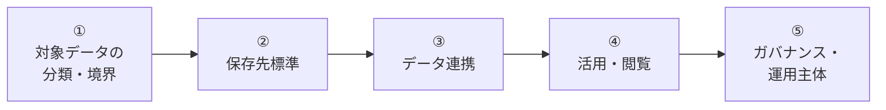

# データプラットフォーム標準 検討事項の抽出方針（社内評価メモ）

> ステータス: ✅ 初版
> 対象読者: **社内のみ**。データプラットフォーム標準を対外説明する立場の関係者向け
> 位置付け: proposal/ 各章の「ベースライン」が**どのような根拠で抽出されたか**を裏どる資料
> 関連: [data-platform-document-structure.md](data-platform-document-structure.md) / [proposal/00-index.md](proposal/00-index.md)

---

## 0. 本資料の目的

「この要件定義の検討事項はどのような方針で抽出したのか？」 — proposal/ を対外提示する際、必ず問われる問いに対する**裏どり資料**。

対外提示資料（proposal/）には抽出経緯を冗長に書かず、本資料を社内で握っておくことで、

- 説明の一貫性を担保する
- 「網羅性は担保されているのか？」「他社事例は？」等の追加質問に即答できる
- 標準改訂時に「なぜそう決めたか」を辿れる

を実現する。

**対外には出さない**前提のため、社内方針・引用元の判断材料・略語を遠慮なく使う。

---

## 1. 抽出方針の核心（一言版）

> **「依頼元から提示された 9 観点を起点に、業界標準フレーム（IPA）と社内既存方針（基本方針 4 軸・認証基盤体系）を重ねて、AWS Well-Architected と整合する形で構造化した」**

---

## 2. 抽出の 5 つの源泉

検討事項は 5 つの独立した源泉から導出している。源泉ごとに反映先と根拠を明示する。

### 2.1 源泉一覧

| # | 源泉 | 反映先 | 性格 |
|---|---|---|---|
| ① | **依頼元から提示された 9 観点** | §FR-1〜6 の章立て骨格 | 顧客起点（What） |
| ② | **IPA 非機能要求グレード 2018** | §NFR-1〜9 の章立て | 業界標準フレーム |
| ③ | **共有認証基盤の基本方針 4 軸** | 各章 §X.0.A スタンス、サービス選定軸 | 社内既存方針 |
| ④ | **AWS Well-Architected Framework / Data Analytics Lens** | 参照アーキ（§C-1）、サービス選定（§C-2）、NFR 標準値 | ベンダーベストプラクティス |
| ⑤ | **認証基盤・API プラットフォームのドキュメント体系** | フォルダ構造、SSOT/proposal、章番号、§X.0 規約 | 社内既存体系の再利用 |

### 2.2 各源泉の詳細

#### 源泉 ① — 依頼元から提示された 9 観点（What の起点）

**原文の 9 観点**（プロジェクト発議時の指示）:

1. データプラットフォームとは何か、何を実現するのか
2. 対象のデータ
3. データの保存場所
4. データ連携の方法
5. データの閲覧方法
6. データのガバナンス（権限制御、削除ポリシーなど）
7. 構成例
8. 利用者とユースケースごとの実装例
9. 運用主体と責任分解

**FR 6 章への再構成マッピング**:

| 依頼観点 | 反映先 |
|---|---|
| 1. 定義・実現するもの | proposal/00-index.md §0.1〜0.2、§FR 全章の §X.0 |
| 2. 対象データ | [§FR-1 対象データ](proposal/fr/01-data-catalog.md) |
| 3. 保存場所 | [§FR-2 保存先標準](proposal/fr/02-storage.md) |
| 4. 連携方法 | [§FR-3 データ連携](proposal/fr/03-pipeline.md) |
| 5. 閲覧方法 | [§FR-4 閲覧・活用](proposal/fr/04-consumption.md) |
| 6. ガバナンス | [§FR-5 ガバナンス](proposal/fr/05-governance.md) |
| 7. 構成例 | [§C-1 参照アーキテクチャ](proposal/common/01-architecture.md) |
| 8. 利用者×ユースケース別実装例 | [§FR-6 ペルソナ別実装パターン](proposal/fr/06-personas.md) |
| 9. 運用主体と責任分解 | [§C-3 RACI](proposal/common/03-ownership-raci.md) |

**併せて指示された前提方針**:
- AWS ネイティブサービスを優先、SaaS は原則不採用 → §0.2 本標準のスタンス、§C-2.3 SaaS 採用例外条件に反映

#### 源泉 ② — IPA 非機能要求グレード 2018（業界標準フレーム）

**選定理由**:
- 経産省外郭団体（IPA）発行の**業界標準**
- 6 大項目 / 35 中項目 / 238 メトリクス で網羅性を担保
- 認証側 NFR ですでに採用済みで、社内に解釈実績あり

**NFR 9 章へのマッピング**:

| 本標準 §NFR | IPA 大項目 |
|---|---|
| §NFR-1 可用性 | A. 可用性 |
| §NFR-2 性能 | B. 性能・拡張性 |
| §NFR-3 拡張性 | B. 性能・拡張性 |
| §NFR-4 セキュリティ | E. セキュリティ |
| §NFR-5 DR | A. 可用性（災害対策）|
| §NFR-6 運用 | C. 運用・保守性 |
| §NFR-7 コンプライアンス | E + C（独立扱い）|
| §NFR-8 コスト | （IPA 範囲外、独自項目）|
| §NFR-9 データライフサイクル | D. 移行性（拡張解釈）|

**省略項目と理由**:
- **F. システム環境・エコロジー**: AWS マネージド前提で個別検討が不要となるため独立章としては設けない（§NFR-6 運用・§NFR-8 コストに内包）。

**データ領域固有の拡張**:
- §NFR-9 を認証側の「移行性」から **「データライフサイクル」** に置き換え。既存データ移行は §NFR-9.4 として内包し、本来主題（保管期間・アーカイブ・削除・GDPR 忘れられる権利対応）を中心に据えた。
- §NFR-6 運用に「データ品質監視（§NFR-6.2）」を追加。IPA 標準項目にはないがデータ領域では中核論点。

**公式リファレンス**: [IPA 非機能要求グレード 2018](https://www.ipa.go.jp/archive/digital/iot-en-ci/jyouryuu/hikinou/index.html)

#### 源泉 ③ — 共有認証基盤の基本方針 4 軸（社内既存方針）

**原文の 4 軸**（共有認証基盤プロジェクトで全社合意済み）:

| 認証基盤での解釈 | データプラットフォームへの翻案 |
|---|---|
| 絶対安全（OAuth 2.1 / NIST SP 800-63B Rev 4）| データ漏洩・改ざん・誤公開を起こさない / PII 保護最優先 |
| どんなアプリでも（認証フロー・IdP 網羅）| どんなユースケースでも（業務 TX / ログ / メトリクス / 監査 / 分析 を網羅）|
| 効率よく認証（顧客追加フリクションレス）| 効率よくデータ活用（収集・連携・閲覧フリクションレス）|
| 運用負荷・コスト最小（マネージド優先）| AWS ネイティブ・マネージド優先（SaaS 原則不採用）|

**反映先**:
- [proposal/00-index.md §0.2 基本方針](proposal/00-index.md)
- 各章の §X.0.A 「本標準のスタンス」（用語整理直後の引用ブロック）
- §C-2 サービス選定軸の評価基準（重み付け軸）

**翻案の妥当性根拠**:
- 認証側で既に組織合意された判断軸を踏襲することで、対外説明時に「全社統一方針との整合」を主張可能
- 各軸の意味は維持しつつ、対象領域（認証→データ）に応じて評価対象だけ差し替えている

#### 源泉 ④ — AWS Well-Architected Framework / Data Analytics Lens

**選定理由**:
- AWS 公式のベストプラクティスフレーム
- 「AWS ネイティブ優先」方針との整合が自然に取れる
- ベンダー中立のフレーム（IPA）と組み合わせることでバランス確保

**Well-Architected 6 柱との対応**:

| Well-Architected 柱 | 本標準での対応 |
|---|---|
| 運用上の優秀性（Operational Excellence）| §NFR-6 運用、§C-3 RACI |
| セキュリティ（Security）| §FR-5 ガバナンス、§NFR-4 セキュリティ、§NFR-7 コンプラ |
| 信頼性（Reliability）| §NFR-1 可用性、§NFR-5 DR |
| 性能効率（Performance Efficiency）| §NFR-2 性能、§NFR-3 拡張性 |
| コスト最適化（Cost Optimization）| §NFR-8 コスト |
| 持続可能性（Sustainability）| IPA F 省略と同様、マネージド前提で透過化 |

**Data Analytics Lens 由来の採用パターン**:
- **Medallion アーキテクチャ**（Bronze/Silver/Gold = raw/curated/analytics の 3 層）→ §FR-2.1 / §C-1.1
- **ELT 推奨**（生データはレイクに着地、加工は下流）→ §FR-3.4
- **データレイク + DWH + 検索系の使い分け**（Lake House パターン）→ §FR-2.5

#### 源泉 ⑤ — 認証基盤・API プラットフォームのドキュメント体系

**選定理由**:
- 既に実績ある分散標準向けドキュメント体系を再利用することで、執筆コスト削減・読み手の学習コスト削減
- 横断で標準群を運用する際、形式が揃っていることが組織的に重要

**継承した体系要素**:

| 体系要素 | 認証側で確立 | 本標準で継承 |
|---|---|---|
| フォルダ構造 | doc/requirements/proposal/{fr,nfr,common}/ | doc/data-platform/proposal/{fr,nfr,common}/ |
| SSOT 分離 | requirements-document-structure.md | data-platform-document-structure.md |
| 章番号体系 | §FR-X / §NFR-X / §C-X | 同一 |
| §X.0 規約 | 用語整理 / なぜここで決めるか / §X.0.A スタンス / サブセクション一覧 | 同一 |
| サブセクション lead-in 3 行 | このサブセクションで定めること / 主な判断軸 / 上位章との関係 | 同一 |
| ベースライン + TBD 対構造 | 各サブセクション | 同一 |
| ID 体系 | FR-{CAT}-NNN / NFR-{CAT}-NNN | FR-{DATA/STORE/PIPE/VIEW/GOV/PERSONA}-NNN / NFR-{AVL/PERF/SCL/SEC/DR/OPS/COMP/COST/LCM}-NNN |
| ADR 体系 | ADR-NNN | DP-ADR-NNN（衝突回避）|

**兄弟領域との整合**:
- [doc/api-platform/](api-platform/) も同じ「各アプリ AWS アカウントでの分散標準」として並走。本標準の §0.2 比較表で 3 領域の対比を明示。

---

## 3. 章間の語る順序（ナラティブ）の根拠

5 ステップ（① 対象データ → ② 保存先 → ③ 連携 → ④ 活用 → ⑤ ガバナンス）の順序は、依頼観点を**データライフサイクルの自然な順序**に並べ替えたもの。

**順序選択の根拠**:
- **① が出発点である必然性**: 「何を扱うか」が決まらないと「どこに置くか」も「誰に見せるか」も決まらない。逆に ① + ⑤（特に機密度）が固まれば ②〜④ の選択肢空間は大きく絞り込まれる
- **⑤ が末端である必然性**: ガバナンスは ①〜④ すべての上に横断する統制層。最後に来ることで「すべてに横断する」位置付けが図示的に表現できる

認証側のナラティブ（① 認証フロー → ② IdP → ③ Broker → ④ プラットフォーム → ⑤ NFR）と論理構造は同型（**What → How → 統制** の流れ）だが、対象領域に合わせて具体ステップだけ差し替えている。

---

## 4. 想定される追加質問と回答

### Q1. 網羅性は担保されているのか？

> **A**: IPA 非機能要求グレード 2018 の 6 大項目に 1:1 マッピング済み（F. 環境はクラウド前提で省略を明記）。加えて AWS Well-Architected 6 柱とも整合させています。機能要件は依頼元から提示された 9 観点を 6 章に整理し、漏れがないことを §C-4 TBD サマリーで確認しています。

### Q2. 他社事例・業界事例は参考にしたか？

> **A**: AWS Well-Architected Data Analytics Lens、Medallion アーキテクチャ（Bronze/Silver/Gold）、Lake House パターンなど、業界共通の参照パターンを §C-1 参照アーキテクチャに採用しています。個別企業の事例というよりはベンダー（AWS）の集約ベストプラクティス起点です。

### Q3. なぜ SaaS 不採用を方針化したのか？

> **A**: 基本方針 4 軸目「運用負荷・コスト最小」の解釈として、AWS マネージドサービス優先を採用しました。ただし完全な禁止ではなく、§C-2.3 で例外条件（3 年 TCO で 30% 以上のメリット or 代替不可な機能要件）と ADR 必須化を定めており、合理的な例外は許容する設計です。

### Q4. データ領域固有の観点は十分に拾えているか？

> **A**: 認証側 NFR では「移行性」だった §NFR-9 を「データライフサイクル」に置き換え、保管期間・アーカイブ・削除（GDPR 忘れられる権利対応）を中心論点に据えました。また §NFR-6.2 にデータ品質監視を独立サブセクションとして追加しています。これらは IPA 標準にはないが、データ領域では中核論点です。

### Q5. 決まっていないこと（TBD）はどう扱う？

> **A**: 各サブセクションに「TBD / 要確認」を必ず併記し、§C-4 TBD サマリーで集約して優先度（Critical / High / Medium / Low）と確定タイミング（ヒアリング Phase A〜D）を付与する設計です。ヒアリング段階で順次確定させ、proposal/ から data-platform-spec.md 本体に反映していきます。

### Q6. なぜ認証基盤と同じ体系にしているのか？

> **A**: doc/requirements/（認証）・doc/api-platform/（API 標準）・doc/data-platform/（本領域）の 3 領域は、すべて「各アプリの AWS アカウント標準」または「共有認証基盤」として並走する分散標準群です。形式が揃っていることで、執筆コスト削減・読み手の学習コスト削減・横断で読みやすさが実現できます。

### Q7. proposal/ の各章でいきなり要件を出さず、§X.0「前提と背景」を入れているのはなぜか？

> **A**: 各アプリの開発・運用担当者は必ずしもデータ基盤の専門家ではないため、各章でいきなり要件案を出すと「なぜそれを決める必要があるのか」が伝わらず合意取りが空回りします。事前に「これは何の話か」「なぜここで決めるか」を共通理解にしてから本論に入ることで、合意取りが効率化します。これは認証側で実証済みの構成規約（[feedback_section_prologue](../../.claude/projects/-Users-suepie-Develop-10-project-aws-atuh-poc/memory/feedback_section_prologue.md) — 社内メモ）を継承しています。

---

## 5. 場面別の説明テンプレート

### 5.1 5 秒版（廊下立ち話・チャット即答）

> 「**ご要望の 9 観点を起点に、IPA 非機能要求グレードと AWS Well-Architected で網羅性を担保し、社内の基本方針 4 軸で一貫性を持たせた構成です。**」

### 5.2 1 分版（会議冒頭・問い合わせメール返信）

> 「検討事項の抽出は 3 層で行いました。
>
> **1 層目は依頼元から提示された 9 観点**（対象データ、保存、連携、閲覧、ガバナンス、構成例、ペルソナ別実装、運用主体）。これを機能要件 6 章に整理しています。
>
> **2 層目は業界標準フレーム**で、非機能要件は IPA 非機能要求グレード 2018 の 6 大項目にマッピングし、中項目 35・メトリクス 238 への参照を可能にしました。
>
> **3 層目は社内基本方針 4 軸**（絶対安全 / どんなユースケースでも / 効率 / 運用負荷・コスト）で、これを各章のスタンス（§X.0.A）として明示し、AWS ネイティブ優先方針もここから導出しています。
>
> これにより、対外的には業界標準、対内的には社内方針、両者の整合を担保しています。」

### 5.3 詳細版（公式説明・要件定義書序文）

§2.2 の各源泉詳細をそのまま展開する。テキスト量目安 800〜1000 字程度。
要件定義書 `data-platform-spec.md §1.4「関連ドキュメント」` 周辺で参照する想定。

---

## 6. 本資料のメンテナンス

- proposal/ 各章の中身埋め段階で、引用元（IPA 中項目番号、Well-Architected の具体節など）の精度を上げる
- ヒアリング Phase A〜D 完了時に、TBD 確定結果を踏まえた抽出方針の妥当性レビューを実施
- 標準改訂（年 2 回）時に、新規追加検討事項の出所を本資料に追記

---

## 7. 関連ドキュメント

- [data-platform-document-structure.md](data-platform-document-structure.md) — 領域全体 SSOT
- [proposal/00-index.md](proposal/00-index.md) — proposal SSOT
- [00-index.md](00-index.md) — 本フォルダ入口
- [../requirements/requirements-document-structure.md](../requirements/requirements-document-structure.md) — 認証側 SSOT（雛形元）
- [../api-platform/00-index.md](../api-platform/00-index.md) — API プラットフォーム標準（兄弟領域）
- [IPA 非機能要求グレード 2018 公式](https://www.ipa.go.jp/archive/digital/iot-en-ci/jyouryuu/hikinou/index.html)
- AWS Well-Architected Framework / Data Analytics Lens（AWS 公式ドキュメント）
