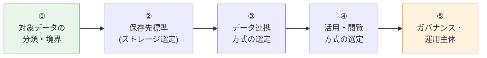

# データプラットフォーム標準 要件定義 提示版（SSOT）

> ステータス: 🚧 サブセクションごとに合意取り中
> 対象読者: 各アプリ開発・運用担当者 / プラットフォーム標準化推進者 / データオーナー候補
> 上位 SSOT: [../data-platform-document-structure.md](../data-platform-document-structure.md)

---

## 0. はじめに

### 0.1 本資料群の目的

各アプリの AWS アカウントで適用する **データプラットフォーム標準のベースラインを提示し、初期合意を取るための資料群**。各章は独立した md ファイルに分割し、本ファイル（00-index.md）が **proposal SSOT** として全章を統括する。

共有認証基盤（[../../requirements/](../../requirements/00-index.md)）が「共通アカウントに複数システムが接続する横断サービス」であるのに対し、本標準は **「各アプリの AWS アカウント内で同じルールを適用する分散標準」** である点が決定的に違う（[../00-index.md §0.2 比較表](../00-index.md) 参照）。

### 0.2 本標準の基本方針

データプラットフォーム標準は **「絶対安全に、どんなユースケースでも、効率よくデータを活用でき、運用負荷やコストがかからない」分散標準** を目指す。共有認証基盤の基本方針 4 軸を、データ領域に翻案して採用する。

| 基本方針の柱 | 解釈 | 反映先 |
|---|---|---|
| **絶対安全** | データ漏洩・改ざん・誤公開を起こさない。PII / 機密データの保護を最優先 | [§FR-5 ガバナンス](fr/05-governance.md) / [§NFR-4 セキュリティ](nfr/04-security.md) / [§NFR-7 コンプラ](nfr/07-compliance.md) |
| **どんなユースケースでも** | 業務 TX / ログ / メトリクス / 監査 / 分析 など、扱うデータ区分とアクセスパターンを網羅 | [§FR-1 対象データ](fr/01-data-catalog.md) / [§FR-2 保存先標準](fr/02-storage.md) / [§FR-6 ペルソナ別実装](fr/06-personas.md) |
| **効率よくデータを活用** | データの収集・連携・閲覧・分析がフリクションレス。新規データ・新規利用者の追加コストを抑える | [§FR-3 データ連携](fr/03-pipeline.md) / [§FR-4 閲覧・活用](fr/04-consumption.md) / [§NFR-2 性能](nfr/02-performance.md) |
| **運用負荷・コスト最小** | **AWS ネイティブ / マネージド優先**。SaaS は原則不採用（よほどメリットがある場合のみ ADR で意思決定経緯を残す） | [§C-2 サービス選定軸](common/02-service-selection.md) / [§NFR-6 運用](nfr/06-operations.md) / [§NFR-8 コスト](nfr/08-cost.md) |

すべての要件は **AWS マルチアカウント前提**で、各アプリの AWS アカウント内で**同一の標準を適用する分散標準**として設計する。

### 0.3 本資料の読み方

各章のサブセクションは以下の対構造で記載する:

| ラベル | 内容 |
|---|---|
| **ベースライン** | 標準化推進側が現時点で「こう定義したい」と提示する要件案（推奨値・想定範囲） |
| **TBD / 要確認** | 確定のために各アプリ・データオーナーから教えていただく必要がある事項（ヒアリングで確定） |

詳細マトリクスは [../functional-requirements.md](../functional-requirements.md) / [../non-functional-requirements.md](../non-functional-requirements.md) にリンクで委譲し、本資料は要件の方向性合意に集中する。

### 0.4 §X.0 章冒頭規約

proposal/ 配下の各章（§FR-X / §NFR-X / §C-X）は冒頭に **§X.0「前提と背景」** を必ず置く。構成：

1. **用語整理** — 本章で扱う概念の定義（データプラットフォーム標準の文脈で）
2. **なぜここ（§X）で決めるか** — 他章との関係を mermaid で図化
3. **§X.0.A 本標準のスタンス** — 基本方針 4 軸への立場明示
4. **本章で扱うサブセクションの一覧**

**NFR 章**は加えて **IPA 非機能要求グレードの中項目とのマッピング表**を §X.0 内に置く。

**各サブセクション冒頭の lead-in 3 行**:
1. **このサブセクションで定めること** — 何を決めるか
2. **主な判断軸** — 何を基準に決めるか
3. **§X 全体との関係** — 上位章の中での位置づけ

理由：各アプリの開発・運用担当者は必ずしもデータ基盤の専門家ではない。各章でいきなり要件案を出すと「なぜそれを決める必要があるのか」が伝わらず合意取りが空回りするため、共通理解を作ってから本論に入る。

### 0.5 フォルダ構造

```
proposal/
├── 00-index.md             ← 本ファイル（SSOT）
├── fr/                     ← 機能要件（§FR-1 〜 §FR-6）
│   ├── 00-index.md
│   ├── 01-data-catalog.md
│   ├── 02-storage.md
│   ├── 03-pipeline.md
│   ├── 04-consumption.md
│   ├── 05-governance.md
│   └── 06-personas.md
├── nfr/                    ← 非機能要件（§NFR-1 〜 §NFR-9、IPA 6 大項目マッピング）
│   ├── 00-index.md
│   ├── 01-availability.md
│   ├── 02-performance.md
│   ├── 03-scalability.md
│   ├── 04-security.md
│   ├── 05-dr.md
│   ├── 06-operations.md
│   ├── 07-compliance.md
│   ├── 08-cost.md
│   └── 09-lifecycle.md
└── common/                 ← 横断（§C-1 〜 §C-5）
    ├── 00-index.md
    ├── 01-architecture.md
    ├── 02-service-selection.md
    ├── 03-ownership-raci.md
    ├── 04-tbd-summary.md
    └── 05-schedule.md
```

---

## 1. 要件ベースラインの全体像

### 1.1 合意したい 5 ステップ



ステップ ① で「何を」を確定し、②〜④ で「どこに・どう運ぶか・どう使うか」、⑤ で「誰が責任を持ち、どう統制するか」を決める。① と ⑤（特に機密度区分）が決まれば、②〜④ の選択肢空間は大きく絞り込まれる。

### 1.2 機能要件（FR）章一覧

| 章 | ファイル | 内容 | 一次ソース（詳細） |
|---|---|---|---|
| §FR-1 | [fr/01-data-catalog.md](fr/01-data-catalog.md) | 対象データ（データ区分 / 機密度分類 / オーナー） | [FR-DATA §1](../functional-requirements.md) |
| §FR-2 | [fr/02-storage.md](fr/02-storage.md) | 保存先標準（レイク / DWH / 運用ストア / 検索系 / 使い分け） | [FR-STORE §2](../functional-requirements.md) |
| §FR-3 | [fr/03-pipeline.md](fr/03-pipeline.md) | データ連携（バッチ / ストリーム / CDC / ETL 標準） | [FR-PIPE §3](../functional-requirements.md) |
| §FR-4 | [fr/04-consumption.md](fr/04-consumption.md) | 閲覧・活用（クエリ / BI / API / 直接アクセス） | [FR-VIEW §4](../functional-requirements.md) |
| §FR-5 | [fr/05-governance.md](fr/05-governance.md) | ガバナンス（権限制御 / 暗号化 / PII / 監査） | [FR-GOV §5](../functional-requirements.md) |
| §FR-6 | [fr/06-personas.md](fr/06-personas.md) | ペルソナ別実装パターン | [FR-PERSONA §6](../functional-requirements.md) |

### 1.3 非機能要件（NFR）章一覧 — IPA 非機能要求グレード対応

| 章 | ファイル | 内容 | IPA 大項目 |
|---|---|---|---|
| - | [nfr/00-index.md](nfr/00-index.md) | NFR 全体 + IPA マッピング | - |
| §NFR-1 | [nfr/01-availability.md](nfr/01-availability.md) | 可用性（保存先別 SLA） | **A. 可用性** |
| §NFR-2 | [nfr/02-performance.md](nfr/02-performance.md) | 性能（クエリレイテンシ / スループット） | **B. 性能・拡張性** |
| §NFR-3 | [nfr/03-scalability.md](nfr/03-scalability.md) | 拡張性（データ量・利用者数の増加） | **B. 性能・拡張性** |
| §NFR-4 | [nfr/04-security.md](nfr/04-security.md) | セキュリティ（暗号化 / アクセス制御 / 監査） | **E. セキュリティ** |
| §NFR-5 | [nfr/05-dr.md](nfr/05-dr.md) | DR（バックアップ / クロスリージョン） | **A. 可用性（災害対策）** |
| §NFR-6 | [nfr/06-operations.md](nfr/06-operations.md) | 運用（監視 / データ品質 / 体制） | **C. 運用・保守性** |
| §NFR-7 | [nfr/07-compliance.md](nfr/07-compliance.md) | コンプライアンス（規制 / 認定） | **E + C**（独立章） |
| §NFR-8 | [nfr/08-cost.md](nfr/08-cost.md) | コスト（保存・転送・分析コスト統制） | （IPA 範囲外、独立章） |
| §NFR-9 | [nfr/09-lifecycle.md](nfr/09-lifecycle.md) | データライフサイクル（保管・アーカイブ・削除） | **D. 移行性** に準じる |

> 注: IPA グレードの **F. システム環境・エコロジー** はクラウド前提のため省略。

### 1.4 横断章（Common）

| 章 | ファイル | 内容 |
|---|---|---|
| §C-1 | [common/01-architecture.md](common/01-architecture.md) | 参照アーキテクチャ（S3 レイク / Redshift DWH / Streaming / 運用ストア） |
| §C-2 | [common/02-service-selection.md](common/02-service-selection.md) | AWS サービス選定軸（Athena vs Redshift / Glue vs EMR 等） |
| §C-3 | [common/03-ownership-raci.md](common/03-ownership-raci.md) | 運用主体と責任分解（RACI） |
| §C-4 | [common/04-tbd-summary.md](common/04-tbd-summary.md) | TBD / 要確認 事項サマリー |
| §C-5 | [common/05-schedule.md](common/05-schedule.md) | 想定スケジュール |

---

## 2. 全体スケジュール

（埋める：本資料合意 → ヒアリング → 標準仕様書 → 参照アーキ → 各アプリ展開 の各マイルストーン）

詳細: [common/05-schedule.md](common/05-schedule.md)

---

## 3. 関連ドキュメント

- [../data-platform-document-structure.md](../data-platform-document-structure.md): データプラットフォーム標準 全体 SSOT
- [../00-index.md](../00-index.md): 本領域の入口
- [../../requirements/proposal/00-index.md](../../requirements/proposal/00-index.md): 認証基盤の proposal SSOT（雛形元）
- [../../api-platform/00-index.md](../../api-platform/00-index.md): API プラットフォーム標準（兄弟領域）
