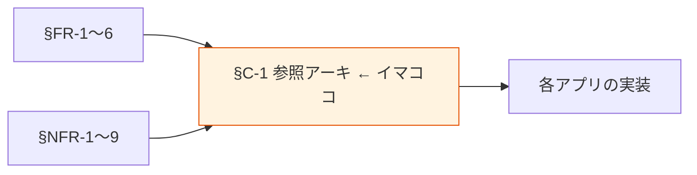

# §C-1 参照アーキテクチャ

> 上位 SSOT: [../00-index.md](../00-index.md) / [00-index.md](00-index.md)
> 詳細: [../../reference-architectures/](../../) （未着手）

---

## §C-1.0 前提と背景

### 用語整理

| 用語 | 本標準での意味 |
|---|---|
| **参照アーキテクチャ** | 各アプリが本標準に準拠して構築する際の典型的な実装パターン |
| **Medallion アーキテクチャ** | Bronze（raw）/ Silver（curated）/ Gold（analytics）の 3 層構成 |
| **Lambda アーキテクチャ** | バッチ層 + ストリーム層 + サービング層の 3 層 |
| **Kappa アーキテクチャ** | ストリーム層のみで完結する構成 |

### なぜここ（§C-1）で決めるか



§FR / §NFR で定めた**個別のルール**を、4 つの典型的な参照アーキテクチャに集約する章。各アプリは自分のユースケースに合う参照アーキを選び、それをベースに構築する。

### §C-1.0.A 本標準のスタンス

> **4 つの参照アーキテクチャを標準として提供する：(1) サーバレスデータレイク、(2) DWH、(3) ストリーミング、(4) 運用ストア。各アプリは自身のユースケースに合うものを 1 つ以上選択する。複数組み合わせも可。標準外のアーキ採用は ADR 必須。**

### 本章で扱うサブセクション

| サブセクション | 内容 |
|---|---|
| §C-1.1 サーバレスデータレイク | S3 + Glue + Athena 構成 |
| §C-1.2 DWH | Redshift 構成（Spectrum 含む） |
| §C-1.3 ストリーミング | Kinesis / MSK + Lambda / Flink 構成 |
| §C-1.4 運用ストア + 分析連携 | Aurora / DynamoDB + Zero-ETL / DMS で分析へ流す |

---

## §C-1.1 サーバレスデータレイク

> **このサブセクションで定めること**: S3 + Glue Data Catalog + Athena を中心とした最小構成。
> **主な判断軸**: 探索的分析中心 / 多様なデータ取り込み / 低コスト
> **§C-1 全体との関係**: 最も汎用的・デフォルト構成

### ベースライン構成

```
[各アプリ AWS アカウント]
取込: S3 (raw) ← DMS / Glue / Kinesis Firehose
↓
変換: Glue ETL（Spark）
↓
保管: S3 (curated / analytics) + Glue Data Catalog
↓
活用: Athena → QuickSight / API Gateway / SageMaker
↓
統制: Lake Formation / KMS / CloudTrail
```

**標準コンポーネント**:
- S3 バケット 3 層（raw / curated / analytics、SSE-KMS、ライフサイクル）
- Glue Data Catalog（メタデータ一元管理）
- Glue ETL（バッチ変換）
- Athena（クエリ）+ ワークグループ（用途別分離）
- Lake Formation（権限制御）
- QuickSight（BI）

### TBD / 要確認

- IaC テンプレ提供範囲（CDK / Terraform）
- パーティション粒度の標準値

---

## §C-1.2 DWH

> **このサブセクションで定めること**: Redshift（プロビジョンド / Serverless）を中心とした構成。
> **主な判断軸**: 高頻度 BI / 低レイテンシ / 同時実行
> **§C-1 全体との関係**: §C-1.1 を内包し、高頻度クエリ層を追加した形

### ベースライン構成

```
[各アプリ AWS アカウント]
取込: S3 (raw) + Aurora (運用ストア)
↓
連携: Zero-ETL (Aurora→Redshift) / DMS / Glue
↓
DWH: Redshift Serverless / プロビジョンド
↓
レイク連携: Redshift Spectrum で S3 横断
↓
活用: QuickSight / SQL クライアント
```

**標準コンポーネント**: 上記 + Redshift（WLM 設定済）+ Redshift Spectrum

### TBD / 要確認

- Redshift Serverless vs プロビジョンドの選定基準数値化
- Zero-ETL 採用条件

---

## §C-1.3 ストリーミング

> **このサブセクションで定めること**: Kinesis / MSK を中心としたリアルタイム処理構成。
> **主な判断軸**: リアルタイム要件 / 順序保証 / 既存 Kafka
> **§C-1 全体との関係**: §C-1.1 を補完する形（リアルタイム要件のみ追加）

### ベースライン構成

```
イベント源 → Kinesis Data Streams / MSK
↓
処理: Lambda / Kinesis Data Analytics (Flink) / MSK Connect
↓
保存: S3 (raw, Firehose 経由) / OpenSearch (リアルタイム検索)
↓
活用: OpenSearch Dashboards / リアルタイム API
```

**標準コンポーネント**: Kinesis or MSK + Schema Registry + DLQ + CloudWatch アラーム

### TBD / 要確認

- リアルタイム要件のあるアプリ範囲
- Kinesis vs MSK の選定基準

---

## §C-1.4 運用ストア + 分析連携

> **このサブセクションで定めること**: 業務 TX を持つアプリで、運用 DB から分析側にデータを流す構成。
> **主な判断軸**: トランザクション整合性 / 分析側への遅延 / 運用 DB への負荷
> **§C-1 全体との関係**: §C-1.1 / §C-1.2 と組み合わせる接続パターン

### ベースライン構成

```
業務処理 → Aurora / DynamoDB (運用ストア)
↓
連携: Zero-ETL / DMS CDC / DynamoDB Streams
↓
分析側: S3 (curated) / Redshift
↓
活用: §C-1.1 / §C-1.2 と同じ
```

**標準コンポーネント**: Aurora / DynamoDB + CDC 連携 + データ品質チェック

### TBD / 要確認

- 既存 DB エンジン（Oracle / SQL Server 等）の取り扱い
- CDC レプリカ DB 採用範囲

---

## §C-1.X 関連リンク

- [00-index.md](00-index.md): Common インデックス
- [02-service-selection.md](02-service-selection.md): §C-2 サービス選定軸
- [../fr/02-storage.md](../fr/02-storage.md): §FR-2 保存先標準
- [../fr/03-pipeline.md](../fr/03-pipeline.md): §FR-3 データ連携
