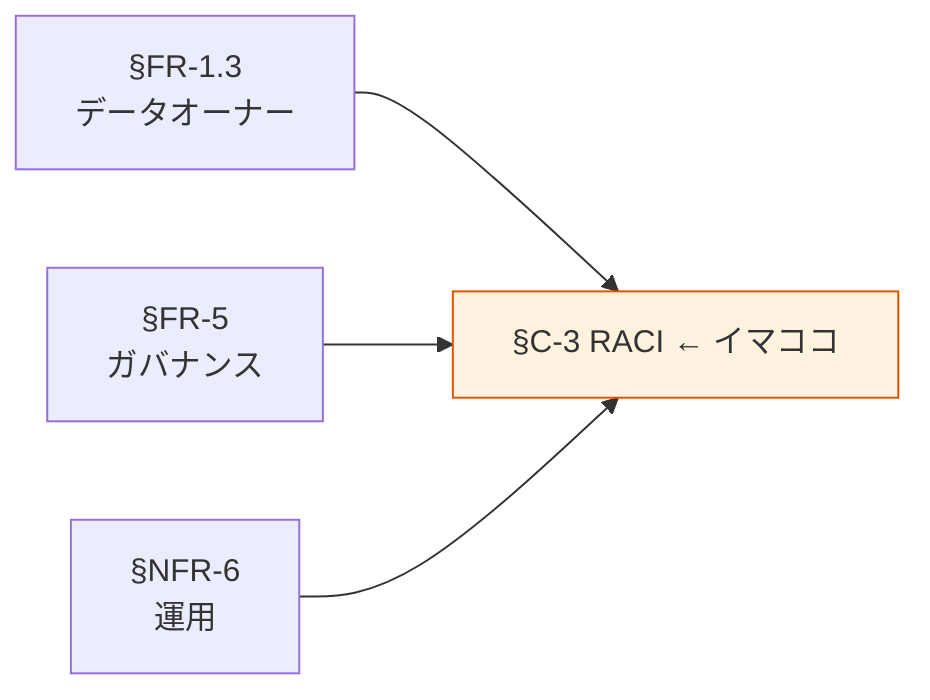

# §C-3 運用主体と責任分解（RACI）

> 上位 SSOT: [../00-index.md](../00-index.md) / [00-index.md](00-index.md)

---

## §C-3.0 前提と背景

### 用語整理

| 用語 | 本標準での意味 |
|---|---|
| **RACI** | Responsible（実行責任）/ Accountable（説明責任）/ Consulted（協議）/ Informed（報告） |
| **データオーナー** | 当該データに対して、最終決定権を持つ役割（§FR-1.3）|
| **データスチュワード** | オーナーから委任されて実務担当する役割（§FR-1.3）|
| **プラットフォーム標準化推進者** | 本標準の策定・改訂・横断課題対応を担う組織（横断組織）|
| **各アプリ運用者** | 各アプリの開発・運用を担当するチーム |

### なぜここ（§C-3）で決めるか

§FR-1.3 で登場したデータオーナーを始めとする役割を、**実際の業務シーンごとの責任分解**として体系化する章。

### §C-3.0.A 本標準のスタンス

> **3 つの主要役割（データオーナー / プラットフォーム標準化推進者 / 各アプリ運用者）を定義し、データの収集・利用・統制・運用の各シーンで RACI を明示する。各アプリは自身の運用を担いつつ、横断ガバナンスはプラットフォーム標準化推進者と協働する分散標準モデルを採用する。**

### 本章で扱うサブセクション

| サブセクション | 内容 |
|---|---|
| §C-3.1 役割定義 | 主要 3 役割の責務 |
| §C-3.2 シーン別 RACI | 業務シーンごとの責任配分 |
| §C-3.3 例外申請プロセス | 標準逸脱時の申請・承認フロー |

---

## §C-3.1 役割定義

> **このサブセクションで定めること**: 主要 3 役割の責務範囲。
> **主な判断軸**: 責務の明確性 / 重複の排除 / 抜けの排除
> **§C-3 全体との関係**: RACI 表の登場人物を定義

### ベースライン

**データオーナー**:
- 当該データに対する最終決定権を持つ。
- 部署（部長相当）または個人として明示。
- 全データに 1 名以上必須。

**プラットフォーム標準化推進者**:
- 本標準の策定・改訂・教育・横断課題対応を担当。
- 横断組織として、各アプリから独立した位置付け。
- ADR レビュー・例外承認の中核。

**各アプリ運用者**:
- 各アプリの実装・運用・障害対応を担当。
- 本標準遵守と例外申請の責任者。

**補助役割**:
- データスチュワード（オーナーから委任）
- 監査者（§FR-6.4 参照）
- セキュリティチーム（§NFR-4 / §NFR-7 連携）

### TBD / 要確認

- 標準化推進者の組織配置（既存組織との整合）
- データオーナーの兼任ルール

---

## §C-3.2 シーン別 RACI

> **このサブセクションで定めること**: 主要シーンごとの RACI 配分。
> **主な判断軸**: 業務遂行の実態 / 責務の所在の明確化
> **§C-3 全体との関係**: 役割と実務を結ぶ橋渡し

### ベースライン

| シーン | データオーナー | 標準化推進者 | 各アプリ運用者 | 備考 |
|---|:---:|:---:|:---:|---|
| 新規データ取込開始 | **A** | C | R | オーナー承認必須 |
| 新規アプリ標準採用 | I | **A** | R | 標準テンプレ提供 |
| 機密度判定 | **R/A** | C | C | 法令解釈は標準化推進者支援 |
| 権限付与 | **A** | I | R | Need-to-know 原則 |
| 越境利用承認 | **R/A** | I | C | 提供元オーナーが決定 |
| 障害対応（業務影響大） | I | I | **R/A** | エスカレーション要 |
| 障害対応（横断影響）| C | **R/A** | C | プラットフォーム共通課題 |
| 標準改訂 | C | **R/A** | C | 年 2 回改訂 |
| 例外申請承認 | C | **R/A** | R | ADR 化 |
| 棚卸し実施 | **R/A** | I | R | 四半期 / 年次 |
| 削除実行 | **A** | I | R | 監査ログ残す |

### TBD / 要確認

- シーンの追加・修正
- A（説明責任）と R（実行責任）の組織内対応

---

## §C-3.3 例外申請プロセス

> **このサブセクションで定めること**: 本標準から逸脱したい場合の申請・承認フロー。
> **主な判断軸**: 形骸化防止 / 過度な硬直化防止 / 監査対応
> **§C-3 全体との関係**: 標準が機能し続けるための逃げ道

### ベースライン

**申請フロー**:
1. 各アプリ運用者が例外申請書（標準テンプレ）を作成
2. データオーナーへ協議（C）
3. プラットフォーム標準化推進者が ADR 化して承認 / 却下
4. 承認時は ADR を本標準フォルダ（`doc/data-platform/adr/`）に保管

**承認の判断軸**:
- §C-2.3 SaaS 採用例外条件
- 一時的な対応か恒久的な対応か（恒久なら標準改訂を検討）

**有効期限**:
- 例外承認は最大 2 年、期限後は再申請または標準準拠への移行。

### TBD / 要確認

- 申請テンプレートの整備
- ADR フォルダの開設タイミング

---

## §C-3.X 関連リンク

- [00-index.md](00-index.md): Common インデックス
- [../fr/01-data-catalog.md](../fr/01-data-catalog.md): §FR-1.3 データオーナー
- [../fr/05-governance.md](../fr/05-governance.md): §FR-5 ガバナンス
- [../nfr/06-operations.md](../nfr/06-operations.md): §NFR-6 運用
