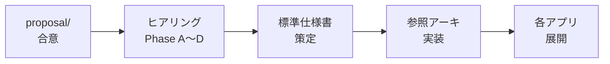

# §C-5 想定スケジュール

> 上位 SSOT: [../00-index.md](../00-index.md) / [00-index.md](00-index.md)
> 関連: [../../data-platform-document-structure.md §7](../../data-platform-document-structure.md)

---

## §C-5.0 前提と背景

### 用語整理

| 用語 | 本標準での意味 |
|---|---|
| **proposal 合意** | proposal/ の各章サブセクション「ベースライン」について関係者の方向性合意が取れた状態 |
| **ヒアリング Phase A〜D** | TBD 項目を確定するためのヒアリング 4 段階 |
| **標準仕様書策定** | data-platform-spec.md 本体の作成 |
| **参照アーキ実装** | reference-architectures/ の整備 |
| **各アプリ展開** | 整備された標準を各アプリに順次適用 |

### なぜここ（§C-5）で決めるか

要件定義 → 仕様書 → 参照アーキ → 各アプリ展開 の全体タイムラインを集約する章。

### §C-5.0.A 本標準のスタンス

> **proposal 合意 → ヒアリング → 標準仕様書 → 参照アーキ整備 → 各アプリ展開 の 5 段階で進める。認証側との並走優先順位に応じて全体ペースは調整するが、各段階の依存関係は維持する。各アプリへの展開は段階的に行い、初期は希望アプリから開始する。**

### 本章で扱うサブセクション

| サブセクション | 内容 |
|---|---|
| §C-5.1 全体マイルストーン | 5 段階の各マイルストーン |
| §C-5.2 ヒアリング Phase 配分 | A〜D の対象とタイミング |
| §C-5.3 各アプリ展開順序 | 展開優先順位・段階数 |

---

## §C-5.1 全体マイルストーン

> **このサブセクションで定めること**: 主要マイルストーンと想定期間。
> **主な判断軸**: 並走中の他施策との優先順位 / 関係者調整余裕 / 反復可能性
> **§C-5 全体との関係**: タイムラインの俯瞰

### ベースライン（暫定）

| マイルストーン | 想定期間 | 状態 |
|---|---|---|
| M1: proposal/ 全章骨格 | Week 0-1 | 🚧 進行中 |
| M2: proposal/ サブセクション中身埋め・合意取り | Week 2-4 | 📋 未着手 |
| M3: ヒアリング Phase A 完了 | Week 5 | 📋 未着手 |
| M4: ヒアリング Phase B 完了 | Week 6-7 | 📋 未着手 |
| M5: ヒアリング Phase C 完了 | Week 8 | 📋 未着手 |
| M6: ヒアリング Phase D 完了 | Week 9 | 📋 未着手 |
| M7: 標準仕様書 ドラフト | Week 10-12 | 📋 未着手 |
| M8: 標準仕様書 確定版 | Week 13 | 📋 未着手 |
| M9: 参照アーキ 4 本整備 | Week 14-18 | 📋 未着手 |
| M10: 初回アプリ展開（Pilot） | Week 19+ | 📋 未着手 |

> 上記は認証側とのリソース競合がない前提の想定。実際は調整必須。

### TBD / 要確認

- 認証側との並走優先順位
- 各マイルストーンの実工数見積もり
- 関係者調整に要する期間

---

## §C-5.2 ヒアリング Phase 配分

> **このサブセクションで定めること**: ヒアリング Phase A〜D の対象・期間・参加者。
> **主な判断軸**: 確定すべき内容の依存関係 / 参加者の都合
> **§C-5 全体との関係**: §C-4.3 確定タイミング表と同期

### ベースライン

| Phase | 期間 | 主要内容 | 参加者 |
|---|---|---|---|
| Phase A: スコープ・対象データ | Week 5 | データ区分 / 機密度 / オーナー方針 | プラットフォーム標準化推進者 + 主要アプリ代表 + データオーナー候補 |
| Phase B: 技術要件 | Week 6-7 | 保存先 / 連携 / 閲覧 | 標準化推進者 + 各アプリ開発リード |
| Phase C: ガバナンス・運用 | Week 8 | 権限・暗号化・PII / 監視・データ品質 | 標準化推進者 + 法務 + セキュリティ + 各アプリ運用リード |
| Phase D: 推進体制・スケジュール | Week 9 | RACI / 移行計画 / 改訂サイクル | 標準化推進者 + 経営層 + 各アプリ責任者 |

### TBD / 要確認

- 各 Phase の参加者選定
- ヒアリング形式（個別 vs ワークショップ）

---

## §C-5.3 各アプリ展開順序

> **このサブセクションで定めること**: 標準を各アプリに展開する順序と段階。
> **主な判断軸**: アプリの本標準準拠への近さ / 業務影響 / 改善メリット
> **§C-5 全体との関係**: M10 以降の詳細

### ベースライン

**展開段階（標準）**:
1. **Pilot**: 1〜2 アプリで標準準拠の小規模実装（標準の妥当性検証）
2. **Wave 1**: 主要アプリ（業務 TX 中心）の標準採用
3. **Wave 2**: アプリログ・分析系の標準化
4. **Wave 3**: 既存データの移行（§NFR-9.4）
5. **Steady State**: 新規アプリは常に本標準準拠で構築

**Pilot 選定基準**:
- 業務影響が比較的小さい
- 標準準拠への近さ（差分が小さい）
- 業務部門の協力姿勢

### TBD / 要確認

- Pilot 候補アプリ
- Wave 1〜3 の対象アプリ一覧
- 各 Wave の期間

---

## §C-5.X 関連リンク

- [00-index.md](00-index.md): Common インデックス
- [04-tbd-summary.md](04-tbd-summary.md): §C-4 TBD サマリー
- [../../data-platform-document-structure.md](../../data-platform-document-structure.md): 領域全体 SSOT §7 作成スケジュール
