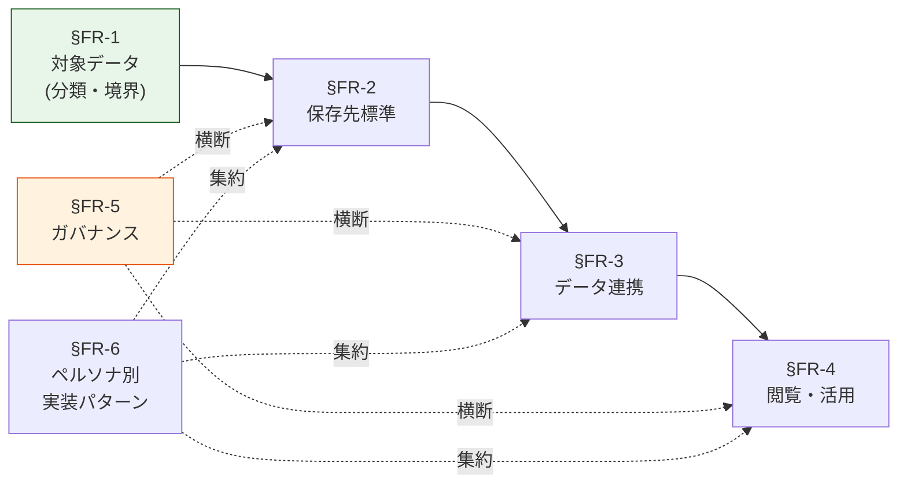

# 機能要件（§FR）章一覧

> 上位 SSOT: [../00-index.md](../00-index.md)
> 詳細マトリクス: [../../functional-requirements.md](../../functional-requirements.md)

---

## §FR の役割

「データプラットフォームとして**何を扱い、どこに置き、どう運び、どう使い、どう統制するか**」を、各章で順に決める。SSOT §0.2 の 5 ステップを §FR-1 〜 §FR-5 に対応させ、利用者ペルソナ別の実装パターンを §FR-6 で横断的にまとめる。

§FR-1 と §FR-5 が縦軸（何を / どう統制）を決める章。§FR-2〜§FR-4 が横軸（保存・連携・閲覧）を決める章。§FR-6 はこれら全てを「利用者の視点」で再構成する章。

---

## 章一覧

| 章 | ファイル | 内容 | 接頭辞 |
|---|---|---|---|
| §FR-1 | [01-data-catalog.md](01-data-catalog.md) | 対象データ（区分 / 機密度 / オーナー） | `FR-DATA-*` |
| §FR-2 | [02-storage.md](02-storage.md) | 保存先標準（レイク / DWH / 運用 / 検索） | `FR-STORE-*` |
| §FR-3 | [03-pipeline.md](03-pipeline.md) | データ連携（バッチ / ストリーム / CDC / ETL） | `FR-PIPE-*` |
| §FR-4 | [04-consumption.md](04-consumption.md) | 閲覧・活用（クエリ / BI / API / 直接） | `FR-VIEW-*` |
| §FR-5 | [05-governance.md](05-governance.md) | ガバナンス（権限 / 暗号化 / PII / 監査） | `FR-GOV-*` |
| §FR-6 | [06-personas.md](06-personas.md) | ペルソナ別実装パターン | `FR-PERSONA-*` |

---

## 各章の §X.0 規約

すべての §FR-X 章は冒頭に §X.0「前提と背景」を置く（[../00-index.md §0.4](../00-index.md) 参照）。
