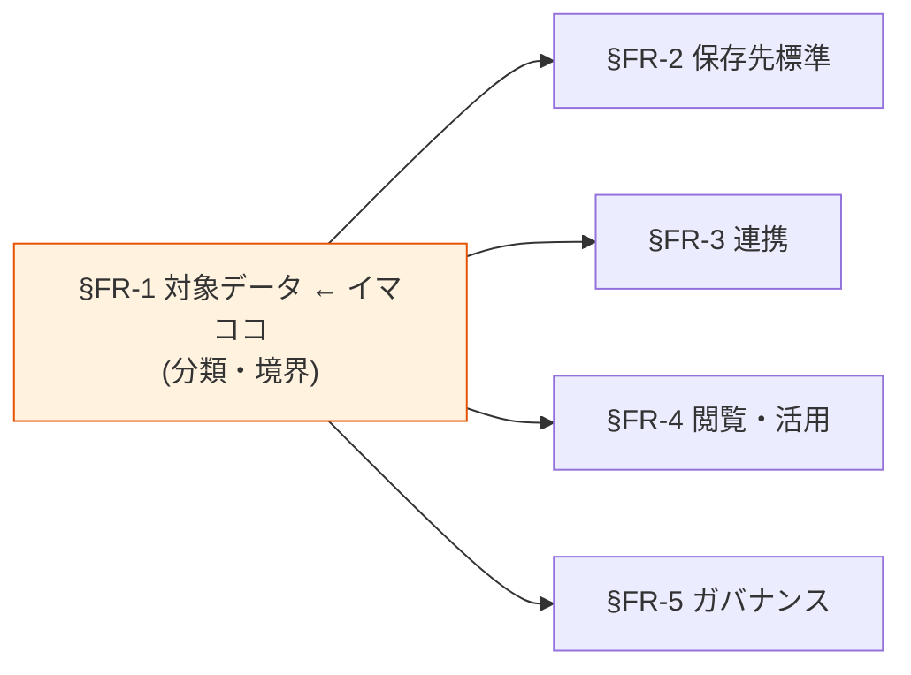

# §FR-1 対象データ（分類・境界）

> 上位 SSOT: [00-index.md](00-index.md)
> 詳細: [../../functional-requirements.md §1](../../functional-requirements.md)
> カバー範囲: FR-DATA §1.1 データ区分 / §1.2 機密度分類 / §1.3 データオーナー

---

## §FR-1.0 前提と背景

### 用語整理

| 用語 | 本標準での意味 |
|---|---|
| **データプラットフォーム** | 各アプリの AWS アカウント内で、業務・分析・監査に必要なデータを蓄積・連携・閲覧するための標準化されたサービス群（S3 / Glue / Athena / Redshift / Kinesis 等の組み合わせ） |
| **対象データ** | 本標準が扱うデータの集合。アプリの内部状態（メモリ上の処理中変数など）は含まない |
| **データ区分** | 性質ごとに分けたカテゴリ（業務 TX / アプリログ / 監査ログ / メトリクス / 外部連携データ 等） |
| **機密度** | データに含まれる情報の機微度合いを表す階層（Public / Internal / Confidential / Restricted 等の慣例的分類） |
| **PII**（Personally Identifiable Information） | 個人を識別できる情報。日本の個人情報保護法上の「個人情報」「個人データ」に対応 |
| **データオーナー** | 当該データに対して、収集・利用・公開範囲・保管期間・削除等の最終決定権を持つ役割（部署 or 個人） |
| **データスチュワード** | データオーナーから委任されて、データ品質・メタデータ管理を実務担当する役割 |

### なぜここ（§FR-1）で決めるか

§FR-1 は**全章の土台**。「何を扱うか」が決まらないと、どこに置くか（§FR-2）も、どう運ぶか（§FR-3）も、誰に見せるか（§FR-4 / §FR-5）も決められない。逆に §FR-1 が固まれば §FR-2〜§FR-5 の選択肢空間が大きく絞られる。

### §FR-1.0.A 本標準のスタンス

> **「どんなユースケースでも対応する」ことを目指し、対象データを業務 TX / アプリログ / 監査ログ / メトリクス / 外部連携データの 5 区分でカバー。機密度は 4 階層（Public / Internal / Confidential / Restricted）で分類し、PII を含むデータには専用の取り扱いルールを §FR-5 で定める。すべてのデータには 1 名以上のデータオーナーを必須とし、オーナー不在のデータは標準上の取り扱い対象外とする。**

### 共通標準として「対象データ」を定める意義

| 観点 | 各アプリで独自に決めた場合 | 共通標準を定めた場合 |
|---|---|---|
| データ区分の名付け | アプリごとに用語ばらつき（「ログ」「履歴」「イベント」「監査」が混在） | **共通の 5 区分で揃え、横断分析が可能** |
| 機密度判定 | アプリごとに恣意的、PII の見落としが発生 | **4 階層で揃え、PII は明示的に分離** |
| データオーナー | 不在 or 暗黙（「とりあえず IT 部門」） | **必須化、責任の所在が明確** |
| 越境利用（あるアプリのデータを別アプリで使う） | 都度交渉、属人化 | **オーナー承認プロセスで標準化** |

→ 対象データを共通標準で揃えることで、**横断分析・横断ガバナンス・越境利用の全てが秩序立てて運用可能**になる。

### 本章で扱うサブセクション

| サブセクション | 内容 | 関連 FR |
|---|---|---|
| §FR-1.1 データ区分 | 業務 TX / アプリログ / 監査ログ / メトリクス / 外部連携データ の 5 区分定義 | FR-DATA-001〜005（想定） |
| §FR-1.2 機密度分類 | 4 階層（Public / Internal / Confidential / Restricted）+ PII 識別 | FR-DATA-010〜014（想定） |
| §FR-1.3 データオーナー | オーナー必須化、データスチュワードとの役割分担、オーナー不在時の取り扱い | FR-DATA-020〜023（想定） |

---

## §FR-1.1 データ区分（→ FR-DATA §1.1）

> **このサブセクションで定めること**: 本標準が扱うデータを性質別に 5 区分に分け、各区分の定義と例を確定する。
> **主な判断軸**: 区分間の境界が運用上ぶれないか / 各アプリの実データを 5 区分に振り分けられるか / 横断分析の単位として意味があるか
> **§FR-1 全体との関係**: 「何を扱うか」の最も上位の枠組み。§FR-1.2 機密度・§FR-1.3 オーナーは本区分の上に乗る属性

### ベースライン

| データ区分 | 定義 | 典型例 | 標準保存先（→ §FR-2） |
|---|---|---|---|
| **業務 TX** | 業務処理の入出力・状態を表す構造化データ | 受注 / 顧客マスタ / 在庫 / 決済 | RDS / DynamoDB（運用ストア）+ レイク（分析用） |
| **アプリログ** | アプリが出力する動作ログ・イベントログ | API リクエスト / エラー / 業務イベント | S3 + Glue Catalog（レイク） |
| **監査ログ** | セキュリティ・コンプラ目的で改ざん不可・長期保管が必須なログ | CloudTrail / 管理操作ログ / 認証ログ | S3（Object Lock + WORM） |
| **メトリクス** | 数値時系列データ（性能・利用状況・KPI） | CloudWatch メトリクス / アプリカスタムメトリクス | CloudWatch + 必要に応じてレイク |
| **外部連携データ** | 他アプリ・外部システム・SaaS から取り込んだデータ | 取引先データ / SaaS エクスポート / IoT データ | レイク（着地）→ 用途に応じて再配置 |

**5 区分に収まらないデータの扱い**:
- どの区分にも当てはまらないデータが見つかった場合、まず本標準への区分追加を検討する（個別アプリ独自区分を作らない）。
- 区分追加は標準化推進体制（§C-3）の合議で決定。

### TBD / 要確認

- 各アプリで現在扱っているデータを 5 区分にマッピングしたとき、収まらないものはあるか
- 「業務 TX」と「外部連携データ」の境界（自社内 SaaS のデータをどちらに分類するか）の運用ルール
- 一時データ（処理途中の中間ファイル等）を本標準の対象とするかどうか

---

## §FR-1.2 機密度分類（→ FR-DATA §1.2）

> **このサブセクションで定めること**: 全データに付与する機密度ラベル体系（4 階層）と、PII 識別の必須化ルール。
> **主な判断軸**: 既存社内規定との整合 / 判定基準の明確性（ぶれない判定） / 暗号化・アクセス制御・保管期間との連動
> **§FR-1 全体との関係**: §FR-1.1 区分とは直交する属性。§FR-5 ガバナンス（暗号化・アクセス制御・保管期間）の判定軸として機能する

### ベースライン

| 機密度 | 定義 | 例 | §FR-5 ガバナンスの最低要件 |
|---|---|---|---|
| **Public** | 公開済み or 公開予定。外部漏洩しても被害なし | 公開済みプレスリリース / オープンデータ | 暗号化任意、アクセス制御任意 |
| **Internal** | 社内限定。外部漏洩時は軽微な影響 | 一般業務ログ / 社内マスタ | at-rest 暗号化必須、社内アクセス制御 |
| **Confidential** | 限定社員のみ。漏洩時は重大な影響 | 取引先データ / 内部資料 / 売上詳細 | at-rest + in-transit 暗号化必須、Need-to-know 制御、アクセスログ必須 |
| **Restricted** | 最高機密。漏洩時は重大インシデント | PII / 決済情報 / 認証情報 / 営業秘密 | KMS CMK 暗号化必須、Lake Formation 等きめ細かい制御、アクセスログ + 監査、定期棚卸し |

**PII 識別の必須化**:
- すべてのデータについて、PII を含むか否かのフラグを必須属性とする。
- PII を含むデータは原則 **Restricted** に分類する（例外は §FR-5 で個別判定）。
- PII 識別の判定基準は個人情報保護法および社内規定に従う。

### TBD / 要確認

- 既存の社内情報資産分類規程との整合（4 階層の名称・定義の擦り合わせ）
- 機密度の自動判定（Macie 等）と人手判定の使い分け
- 既存データへの遡及適用範囲（既存全データを再分類するか、新規データから適用か）

---

## §FR-1.3 データオーナー（→ FR-DATA §1.3）

> **このサブセクションで定めること**: 全データに必須となるデータオーナーの役割定義、オーナーの権限・責任、データスチュワードとの分担、オーナー不在データの扱い。
> **主な判断軸**: 責任の所在の明確性 / オーナー任命の現実性 / 越境利用時の承認権限
> **§FR-1 全体との関係**: §FR-1.1 区分・§FR-1.2 機密度の上に乗る「人」の属性。§FR-5 ガバナンスの権限承認者、§C-3 RACI の登場人物として再登場

### ベースライン

**データオーナーの定義**:
- 当該データに対して、収集・利用・公開範囲・保管期間・削除等の **最終決定権** を持つ役割。
- 部署（部長等の役割）または個人（実名）として明示。
- すべてのデータには 1 名以上のオーナーを必須とする。

**データオーナーの権限・責任**:
- 当該データの**収集**を許可・停止する
- 当該データの**利用範囲**（誰が、何の目的で使ってよいか）を承認する
- 当該データの**越境利用**（他アプリ・他組織への提供）を承認する
- 当該データの**保管期間・削除タイミング**を決定する
- 当該データに関する**インシデント発生時の対応指揮**を行う

**データスチュワード**:
- オーナーから委任されて、データ品質・メタデータ管理・日常的なアクセス権承認等を実務担当する。
- スチュワードは任意（オーナーが直接実務を担当することも可）。

**オーナー不在データの扱い**:
- オーナーが任命されていないデータは、本標準の対象外（=データプラットフォーム上に置いてはならない）。
- 既存データでオーナー不在のものは、移行猶予期間中にオーナー任命を完了させる。

### TBD / 要確認

- 既存データのオーナー任命の進め方（既存資産棚卸し範囲）
- 部署変更・退職時のオーナー継承プロセス
- オーナー間の対立（A 部のデータを B 部が使いたいが A 部が拒否）時の調停プロセス
- データスチュワードの兼任ルール（1 人が複数データの責任を持てるか、上限はあるか）

---

## §FR-1.X 関連リンク

- [../00-index.md](../00-index.md): proposal SSOT
- [02-storage.md](02-storage.md): §FR-2 保存先標準（本章の出力を受ける章）
- [05-governance.md](05-governance.md): §FR-5 ガバナンス（本章の機密度・オーナーを実装に落とす章）
- [../common/03-ownership-raci.md](../common/03-ownership-raci.md): §C-3 運用主体と責任分解（オーナーの組織的位置付け）
