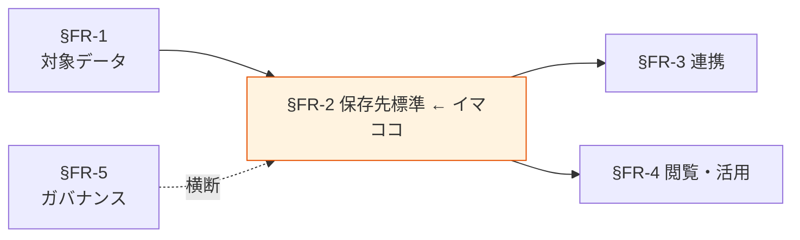

# §FR-2 保存先標準

> 上位 SSOT: [00-index.md](00-index.md)
> 詳細: [../../functional-requirements.md §2](../../functional-requirements.md)
> カバー範囲: FR-STORE §2.1 データレイク / §2.2 DWH / §2.3 運用ストア / §2.4 検索系 / §2.5 用途別使い分け

---

## §FR-2.0 前提と背景

### 用語整理

| 用語 | 本標準での意味 |
|---|---|
| **データレイク** | スキーマオンリードで多様なデータを大量・低コストに蓄える保存先。AWS では S3 + Glue Data Catalog が標準 |
| **DWH**（Data Warehouse） | 分析クエリ最適化された構造化データの保存先。AWS では Redshift |
| **運用ストア**（Operational Data Store） | アプリの業務処理が直接読み書きする OLTP 系ストア。AWS では RDS / Aurora / DynamoDB |
| **検索系** | 全文検索・ログ検索・ベクトル検索などに最適化した保存先。AWS では OpenSearch Service |
| **Glue Data Catalog** | テーブル定義・スキーマ・パーティションを一元管理するメタデータストア |
| **Lake Formation** | データレイクの権限制御・データ共有・行/列レベルセキュリティを管理する AWS サービス |
| **ホットデータ / コールドデータ** | 直近で頻繁にアクセスされるデータ / 長期保管中心でアクセス頻度が低いデータ |
| **ストレージクラス**（S3） | Standard / Standard-IA / Glacier Instant Retrieval / Glacier Deep Archive 等の階層 |

### なぜここ（§FR-2）で決めるか

§FR-1 で「何を」が決まった次に、「**どこに置くか**」を決める章。保存先の選定は §FR-3 連携方式・§FR-4 閲覧方式の選択肢を直接制約する（例：レイクに置けば Athena が使える、Redshift に置けば BI が高速）。

### §FR-2.0.A 本標準のスタンス

> **AWS ネイティブのストレージサービスを用途別に使い分ける。原則 4 種（データレイク / DWH / 運用ストア / 検索系）を標準とし、SaaS のデータストアは原則採用しない。データ区分（§FR-1.1）と機密度（§FR-1.2）から保存先が自動的に絞られるよう、明確な使い分けマトリクスを定める。**

### 共通標準として「保存先」を定める意義

| 観点 | 各アプリで独自に決めた場合 | 共通標準を定めた場合 |
|---|---|---|
| サービス選定 | アプリごとに独自選定、運用ノウハウが分散 | **4 種に集約、運用ノウハウ集約** |
| データ集約・横断分析 | 各アプリの DB を都度連携、毎回設計 | **レイクに集約 → どのアプリのデータも同じ手段で分析可能** |
| 暗号化・バックアップ標準 | アプリごとに設定 → 抜け漏れリスク | **保存先ごとに標準設定をテンプレ化** |
| コスト最適化 | ストレージクラス選定がアプリ任せ | **データ区分別の標準クラス・ライフサイクルルール** |

→ 保存先標準を共通化することで、**横断分析が一気通貫、ガバナンスが抜け漏れなく適用可能**になる。

### 本章で扱うサブセクション

| サブセクション | 内容 | 関連 FR |
|---|---|---|
| §FR-2.1 データレイク | S3 + Glue Data Catalog の標準構成、バケット設計、パーティション | FR-STORE-001〜005（想定） |
| §FR-2.2 DWH | Redshift 採用条件、Redshift Serverless との使い分け | FR-STORE-010〜013（想定） |
| §FR-2.3 運用ストア | RDS / Aurora / DynamoDB の使い分け、レイクとの連携前提 | FR-STORE-020〜024（想定） |
| §FR-2.4 検索系 | OpenSearch Service の採用条件、レイクとの使い分け | FR-STORE-030〜032（想定） |
| §FR-2.5 用途別使い分け | データ区分 × 機密度 × アクセスパターンから保存先を決める標準マトリクス | FR-STORE-040〜（想定） |

---

## §FR-2.1 データレイク（→ FR-STORE §2.1）

> **このサブセクションで定めること**: データレイクの標準構成（S3 バケット設計 / Glue Data Catalog / パーティション戦略 / ストレージクラス）。
> **主な判断軸**: アクセス頻度 / コスト / 横断分析のしやすさ / 暗号化・アクセス制御の標準化
> **§FR-2 全体との関係**: 4 種の保存先のうち最も汎用的な選択肢。§FR-2.5 使い分けで「迷ったらレイク」を基本とする

### ベースライン

**バケット設計**:
- 各アプリ AWS アカウントに `<app>-data-raw` / `<app>-data-curated` / `<app>-data-analytics` の 3 層構成を標準とする。
  - **raw**: 取り込み時の生データ（不変、Object Lock 検討）
  - **curated**: クレンジング・正規化済みデータ
  - **analytics**: 分析用に加工された集計データ
- バケットはバージョニング有効、デフォルト暗号化（SSE-KMS、Restricted は CMK）。

**Glue Data Catalog**:
- すべてのレイク内テーブルは Glue Data Catalog に登録必須。
- テーブル名・カラム名は標準命名規約に従う（snake_case、英語）。

**パーティション戦略**:
- 時系列データは原則 `year=YYYY/month=MM/day=DD` でパーティション。
- パーティション粒度はクエリパターンとファイル数のバランスで判定（小ファイル多数を避ける）。

**ストレージクラス・ライフサイクル**:
- raw: 30 日 Standard → 90 日 Standard-IA → 1 年 Glacier Instant → 7 年 Glacier Deep Archive（データ区分・保管期間要件により調整）
- curated / analytics: アクセス頻度に応じて個別設定

### TBD / 要確認

- 3 層構成（raw / curated / analytics）が各アプリの実態に合うか
- バケット命名規約（プレフィックス・サフィックス・環境識別）
- Athena クエリ前提のファイルフォーマット（Parquet / ORC）の標準化
- 既存 S3 バケットの本標準への移行・統合方針

---

## §FR-2.2 DWH（→ FR-STORE §2.2）

> **このサブセクションで定めること**: Redshift（プロビジョンド / Serverless）の採用条件と、レイク + Athena との使い分け基準。
> **主な判断軸**: クエリ性能要件（同時実行・低レイテンシ）/ データ量・想定ワークロード / コスト（プロビジョンドの常時稼働 vs Serverless の従量）
> **§FR-2 全体との関係**: レイクで足りるなら DWH は不要。BI の高頻度・低レイテンシが要件になるアプリのみ採用

### ベースライン

**採用判定基準**:
- **採用推奨**: 業務部門が BI ダッシュボードを定期的に閲覧する / 同時実行 10 ユーザー以上 / クエリレイテンシ秒オーダー要件
- **不要**: 探索的クエリ中心 / 日次バッチ集計のみ / 同時実行少数 → Athena で十分

**Redshift Serverless vs プロビジョンド**:
- 初期導入・利用ピークが読めない段階は **Serverless** を推奨。
- 24/365 高負荷で固定的なら **プロビジョンド + リザーブド** が TCO 優位。

**Redshift Spectrum**:
- S3 レイク上のデータをそのままクエリする橋渡し機能。Redshift 内データとの JOIN が可能。
- 「主は Redshift、長期データはレイク」の構成で標準的に採用。

### TBD / 要確認

- 各アプリの BI 利用想定（同時実行・レイテンシ・週次/日次/リアルタイム）
- Redshift 採用アプリ数の見込み（少数なら共有 Redshift クラスタの集約も検討）
- Zero-ETL（Aurora → Redshift）採用範囲

---

## §FR-2.3 運用ストア（→ FR-STORE §2.3）

> **このサブセクションで定めること**: アプリ業務処理が直接読み書きする OLTP ストアの標準（RDS / Aurora / DynamoDB の使い分け）、分析系（レイク・DWH）への連携前提。
> **主な判断軸**: スキーマの強い構造 vs 柔軟性 / トランザクション要件 / スケーラビリティ
> **§FR-2 全体との関係**: 本標準の「データプラットフォーム」は分析・蓄積側が主眼だが、運用ストアからのデータ抽出（§FR-3 CDC）の起点として登場

### ベースライン

| 用途 | 標準サービス | 採用条件 |
|---|---|---|
| RDB / トランザクション中心 | **Aurora PostgreSQL / Aurora MySQL** | 関係モデル、複雑なクエリ、トランザクション整合性が必要 |
| 小規模 / シンプル | **RDS PostgreSQL / RDS MySQL** | Aurora の機能・コストが過剰な場合 |
| 大規模 KVS / 高スループット | **DynamoDB** | スキーマレス、ミリ秒応答、ピーク負荷高、サーバレス親和性 |

**分析連携の前提**:
- 運用ストアのデータを分析する場合、原則 **DMS / Zero-ETL / EventBridge Pipes 等で抽出し、レイクまたは DWH に同期** する（直接運用 DB に分析クエリを投げない）。

**SaaS DB の扱い**:
- 原則不採用（Snowflake / Databricks / MongoDB Atlas 等）。採用したい場合は §C-2 サービス選定で ADR 必須。

### TBD / 要確認

- 既存アプリの DB（Oracle / SQL Server / 自前 NoSQL 等）の取り扱い
- 各アプリの DB 同時接続数・データ量の見込み（Aurora vs RDS 判定の材料）
- DynamoDB と Aurora の混在許容範囲

---

## §FR-2.4 検索系（→ FR-STORE §2.4）

> **このサブセクションで定めること**: OpenSearch Service の採用条件と、レイク + Athena との使い分け基準。
> **主な判断軸**: 全文検索 / ログ検索 / ベクトル検索の要否 / リアルタイム性 / コスト
> **§FR-2 全体との関係**: レイク + Athena でも一定の検索は可能だが、低レイテンシ全文検索が要件のアプリのみ採用

### ベースライン

**採用判定基準**:
- **採用推奨**: 全文検索（曖昧検索・形態素解析）/ ログのリアルタイム検索・可視化 / ベクトル検索（RAG 等）
- **不要**: バッチ集計中心 / 構造化クエリのみ → レイク + Athena で十分

**OpenSearch Serverless vs プロビジョンド**:
- 初期導入は **Serverless** を推奨（ピーク負荷適応）。
- 高負荷・固定的なら **プロビジョンド** が TCO 優位。

**インデックスライフサイクル**:
- ホットデータ（直近 7-30 日）のみ OpenSearch、それ以前はレイクに退避する Tiered 構成を標準とする。

### TBD / 要確認

- 各アプリの検索ユースケースの有無（多くのアプリで不要なら本標準のスコープ縮小可）
- ログ可視化（Kibana / OpenSearch Dashboards）と CloudWatch Logs Insights の使い分け
- 既存 Elasticsearch / Solr からの移行方針

---

## §FR-2.5 用途別使い分けマトリクス（→ FR-STORE §2.5）

> **このサブセクションで定めること**: データ区分（§FR-1.1）× 機密度（§FR-1.2）× アクセスパターンから保存先（§FR-2.1〜2.4）を決める標準マトリクス。
> **主な判断軸**: データ区分の性質 / クエリパターン（探索/定形/リアルタイム）/ 機密度（暗号化・アクセス制御の必要強度）
> **§FR-2 全体との関係**: §FR-2.1〜2.4 の選択を「いつ・どれを使うか」のフローチャートで集約する章

### ベースライン（標準マトリクス）

| データ区分 | 標準保存先 | 補助・段階 | 備考 |
|---|---|---|---|
| 業務 TX（運用） | 運用ストア（Aurora / RDS / DynamoDB） | 分析用にレイクへ CDC 同期 | レイクは raw → curated → analytics の 3 層 |
| 業務 TX（分析対象） | レイク（curated / analytics） | 高頻度 BI なら DWH | Redshift Spectrum でレイク横断 |
| アプリログ | レイク（raw → curated） | リアルタイム検索が要件なら OpenSearch | Athena で集計、長期は Glacier |
| 監査ログ | レイク（raw、Object Lock） | — | 改ざん不可、長期保管必須 |
| メトリクス | CloudWatch | 長期保管はレイクへ export | Grafana / QuickSight で可視化 |
| 外部連携データ | レイク（raw 着地） | 用途に応じて curated → 運用ストア or DWH | 取り込み時の検疫・PII スキャン必須 |

**機密度別の追加要件**:
- **Restricted**: KMS CMK / Lake Formation 行/列セキュリティ / アクセスログ必須
- **Confidential**: KMS（AWS マネージドキー可）/ IAM 細粒度制御 / アクセスログ必須
- **Internal**: at-rest 暗号化必須、IAM 制御
- **Public**: 暗号化任意

### TBD / 要確認

- 各アプリの実データを上記マトリクスにマッピングしたとき、当てはまらないものがあるか
- 「業務 TX（運用）」と「業務 TX（分析対象）」の二重持ちの是非（Zero-ETL で 1 本化可能か）
- 例外パターンの申請プロセス

---

## §FR-2.X 関連リンク

- [../00-index.md](../00-index.md): proposal SSOT
- [01-data-catalog.md](01-data-catalog.md): §FR-1 対象データ（本章の入力）
- [03-pipeline.md](03-pipeline.md): §FR-3 データ連携（保存先間の接続）
- [04-consumption.md](04-consumption.md): §FR-4 閲覧・活用（保存先からの取り出し）
- [../common/01-architecture.md](../common/01-architecture.md): §C-1 参照アーキテクチャ
- [../common/02-service-selection.md](../common/02-service-selection.md): §C-2 AWS サービス選定軸
