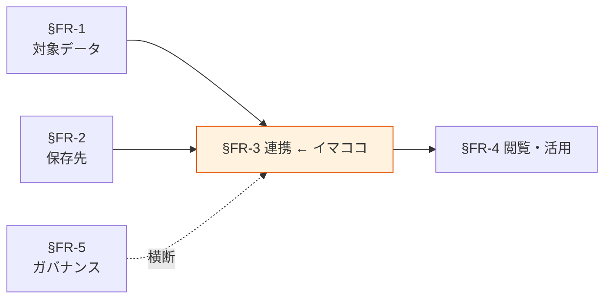

# §FR-3 データ連携

> 上位 SSOT: [00-index.md](00-index.md)
> 詳細: [../../functional-requirements.md §3](../../functional-requirements.md)
> カバー範囲: FR-PIPE §3.1 バッチ / §3.2 ストリーム / §3.3 CDC / §3.4 ETL/ELT 標準

---

## §FR-3.0 前提と背景

### 用語整理

| 用語 | 本標準での意味 |
|---|---|
| **バッチ連携** | 一定間隔（時間/日次）でまとめてデータを移送する方式 |
| **ストリーム連携** | データ発生のたびに継続的に流す方式（秒オーダー以下） |
| **CDC**（Change Data Capture） | 運用 DB の変更（INSERT/UPDATE/DELETE）を逐次キャプチャして下流に流す方式 |
| **ETL** | Extract → Transform → Load。抽出 → 加工 → 保存の順 |
| **ELT** | Extract → Load → Transform。抽出 → 保存 → 加工の順（クラウド時代の主流） |
| **Zero-ETL** | AWS が提供する DB → DWH 等の直結機能（パイプライン実装不要） |
| **Idempotent**（冪等性） | 同じ処理を複数回実行しても結果が同じになる性質。再実行の安全性に必要 |
| **冪等キー / 重複排除キー** | ストリーム連携で重複到達を排除するためのキー |

### なぜここ（§FR-3）で決めるか

§FR-1（何を）と §FR-2（どこに）が決まれば、「**どう運ぶか**」は要件次第で絞り込める。連携方式の選定は遅延要件（リアルタイム/バッチ）とソース側の制約（DB / API / ファイル）から決まる。

### §FR-3.0.A 本標準のスタンス

> **AWS ネイティブの連携サービス（Glue / Step Functions / Kinesis / MSK / DMS / EventBridge Pipes / Zero-ETL）を用途別に使い分ける。原則「ELT」を推奨（生データはまずレイクに着地、加工は下流で）。冪等性・リトライ・データ品質チェックは連携方式によらず必須。SaaS の ETL ツール（Fivetran / Airbyte SaaS 等）は原則不採用。**

### 共通標準として「連携方式」を定める意義

| 観点 | 各アプリで独自に決めた場合 | 共通標準を定めた場合 |
|---|---|---|
| 連携方式の選定 | 都度独自実装、ノウハウ分散 | **4 方式に集約、ノウハウ集約** |
| エラー処理・リトライ | 実装ばらつき、データ欠損リスク | **冪等性・リトライ・DLQ の標準パターン** |
| データ品質チェック | 抜け漏れ多発 | **連携時の必須チェック項目を標準化** |
| 監視・運用 | アプリごとに監視構築 | **CloudWatch + EventBridge の標準監視テンプレ** |

→ 連携方式を標準化することで、**実装コスト削減・障害時の調査が容易・データ品質が一定保証**される。

### 本章で扱うサブセクション

| サブセクション | 内容 | 関連 FR |
|---|---|---|
| §FR-3.1 バッチ連携 | Glue / Step Functions / Lambda の使い分け、スケジュール、リトライ | FR-PIPE-001〜005（想定） |
| §FR-3.2 ストリーム連携 | Kinesis / MSK / EventBridge Pipes の使い分け、冪等性、Schema 管理 | FR-PIPE-010〜014（想定） |
| §FR-3.3 CDC | DMS / Zero-ETL / 自前 CDC の使い分け、運用 DB への影響 | FR-PIPE-020〜023（想定） |
| §FR-3.4 ETL/ELT 標準 | ELT 推奨、冪等性、データ品質チェック、メタデータ管理 | FR-PIPE-030〜（想定） |

---

## §FR-3.1 バッチ連携（→ FR-PIPE §3.1）

> **このサブセクションで定めること**: 時間/日次のバッチ連携で使う AWS サービスと、それらの使い分け基準。
> **主な判断軸**: 処理データ量 / 変換複雑性 / 実行時間 / コスト
> **§FR-3 全体との関係**: 連携 4 方式のうち最も基本的な方式。多くの分析・集計はこれで十分

### ベースライン

> ⚠ **Phase 1/2 では EMR 不採用が確定**（[DP-ADR-002](../../adr/DP-ADR-002-redshift-emr-not-adopted.md)）。Glue ETL（Flex 推奨、$0.29/DPU 時間）と EMR Serverless（$0.30/4vCPU+16GB）は **コストほぼ同じ**だが、運用ノウハウ集約と学習コストを考えて Glue 一択。EMR は Phase 3+ 再評価時の候補として位置付け。

| 用途 | 標準サービス | 採用条件 |
|---|---|---|
| 大量データ ETL / Spark 系処理 | **AWS Glue ETL Flex**（推奨）/ Standard（SLA 必要時）| 数 GB 〜 TB、複雑な変換、Spark 利用 |
| パイプラインオーケストレーション | **Step Functions** | 複数ジョブの依存・分岐・並列・エラーハンドリング |
| 小規模・軽量処理 | **Lambda** | 5 分・10GB 以内、変換ロジックがシンプル |
| 大規模分散処理（**Phase 3+ 候補**）| ~~EMR Serverless~~ → **Phase 1/2 不採用**、Glue ETL で対応 | Phase 3+ で Glue 性能不足 / Spark 以外（Hive / Presto 等）/ Lakehouse（Iceberg / Hudi / Delta Lake）/ Streaming Spark が必要になった時に再評価 |

**スケジュール**:
- EventBridge Scheduler を標準とする（cron / rate / one-time）。
- 古い CloudWatch Events Rule は新規採用しない。

**リトライ・冪等性**:
- すべてのバッチジョブは冪等に設計する（同じ入力で何度実行しても同じ結果）。
- リトライは最大 3 回、それを超えたら DLQ または SNS 通知。

**監視**:
- CloudWatch アラーム必須（実行失敗・タイムアウト・遅延）。

### TBD / 要確認

- 各アプリで現在使っている既存バッチ基盤（cron / Airflow / Step Functions / 自前）の移行方針
- Glue ETL のジョブブックマーク利用範囲
- 長時間ジョブ（数時間以上）の許容と監視粒度

---

## §FR-3.2 ストリーム連携（→ FR-PIPE §3.2）

> **このサブセクションで定めること**: ストリーミング連携で使う AWS サービスと、それらの使い分け基準。冪等性・スキーマ管理の標準。
> **主な判断軸**: スループット / 遅延要件 / 順序保証 / 既存 Kafka 資産
> **§FR-3 全体との関係**: バッチでは間に合わない要件（リアルタイム検知・即時集計）の場合に採用。コストは高めなので必要性判定が重要

### ベースライン

| 用途 | 標準サービス | 採用条件 |
|---|---|---|
| シンプルなストリーム → S3 / 他 | **Kinesis Data Firehose** | 加工最小、ストレージへの送出が主目的 |
| 順序保証・リプレイ・複数コンシューマ | **Kinesis Data Streams** | 数万 events/sec、シャード設計可能 |
| Kafka 互換 / 既存資産 / Confluent エコシステム | **MSK / MSK Serverless** | 既存 Kafka がある / Schema Registry / Connect 利用 |
| イベント中継・軽量変換 | **EventBridge Pipes** | サービス間の単純なイベント連携、変換最小 |

**冪等性**:
- すべてのストリーム処理は冪等キー（イベント ID / 順序番号）を必須とする。
- At-least-once 配信前提で重複排除責任は consumer 側。

**スキーマ管理**:
- Glue Schema Registry または MSK 付属の Schema Registry を標準とする。
- スキーマ進化は後方互換性ルール（Backward Compatibility）を必須。

**監視**:
- ラグ（IteratorAge / ConsumerLag）監視を必須。

### TBD / 要確認

- 各アプリのリアルタイム要件の有無（多くのアプリで不要なら本サブセクションは縮小可）
- Kinesis vs MSK の選定基準（既存 Kafka 資産・スキル）
- 順序保証の必要範囲（全体順序 / パーティション内順序）

---

## §FR-3.3 CDC（→ FR-PIPE §3.3）

> **このサブセクションで定めること**: 運用 DB の変更を分析側に流す CDC 連携の標準（DMS / Zero-ETL / 自前 CDC）。
> **主な判断軸**: 運用 DB への負荷 / 遅延要件 / DB 種別 / 同期粒度
> **§FR-3 全体との関係**: 運用ストア（§FR-2.3）→ レイク/DWH（§FR-2.1/2.2）の主要連携経路

### ベースライン

| 用途 | 標準サービス | 採用条件 |
|---|---|---|
| Aurora → Redshift | **Zero-ETL** | Aurora MySQL / PostgreSQL からの DWH 同期、コード不要 |
| Aurora / RDS → S3 レイク | **DMS（CDC モード）** | レイクへの継続同期、複数 DB エンジン対応 |
| DynamoDB → S3 / その他 | **DynamoDB Streams + Lambda** / **EventBridge Pipes** | DynamoDB 変更の伝播 |
| 既存 Oracle / SQL Server → AWS | **DMS** | 移行 + CDC、ライセンス上の制約に注意 |

**運用 DB への影響**:
- CDC はソース DB に必ず負荷をかけるため、本番ワークロードへの影響を事前評価必須。
- レプリカ DB を CDC ソースにすることを推奨。

**遅延・整合性**:
- CDC は near-real-time（数秒〜分オーダー）が現実的。秒未満要件はストリーム連携と組み合わせる。
- スキーマ変更（DDL）の伝播戦略を明示する。

### TBD / 要確認

- 各アプリの運用 DB エンジンと CDC 対応状況
- Zero-ETL 採用可能アプリ範囲（Aurora 採用アプリのみ）
- スキーマ変更時の自動同期 vs 手動対応の境界

---

## §FR-3.4 ETL/ELT 標準（→ FR-PIPE §3.4）

> **このサブセクションで定めること**: ETL/ELT の方針（ELT 推奨）、冪等性・データ品質・メタデータ管理の標準。
> **主な判断軸**: 加工処理をどこで行うか / 生データ保持の必要性 / データ品質チェックの粒度
> **§FR-3 全体との関係**: §FR-3.1〜3.3 すべてに横断する設計原則

### ベースライン

**ELT を原則とする**:
- 生データはまず **レイク raw 層**に着地。加工は下流（curated / analytics）で行う。
- 理由：生データを失わない / 加工要件変更時の再処理が可能 / クラウドストレージは安価。
- 例外：個人情報を含むデータで取り込み時点でマスキングが必要な場合のみ ETL（加工後保存）を許容。

**冪等性**:
- すべての連携ジョブは冪等に設計する。
- レイク書込みは同一データの上書き or 重複排除を担保する設計とする（Glue Catalog の MERGE INTO 等）。

**データ品質チェック**:
- 必須チェック項目：レコード数 / NULL 率 / 型違反 / 重複率。
- Glue Data Quality または独自実装で運用。
- 重大な品質劣化（閾値超え）は連携を停止して通知。

**メタデータ管理**:
- すべてのレイクテーブルは Glue Data Catalog に登録（§FR-2.1 で既定）。
- 取り込み元・取り込み時刻・パイプライン ID をテーブルメタデータに付与。

**Lineage（系譜）**:
- AWS Glue / Lake Formation の Lineage 機能を将来採用（PoC 範囲で評価）。

### TBD / 要確認

- ETL（取り込み時点マスキング）の必要範囲（PII 取り込み量による）
- データ品質チェックの閾値（NULL 率・重複率の許容ライン）
- Lineage 機能の採用タイミング

---

## §FR-3.X 関連リンク

- [../00-index.md](../00-index.md): proposal SSOT
- [01-data-catalog.md](01-data-catalog.md): §FR-1 対象データ
- [02-storage.md](02-storage.md): §FR-2 保存先標準（連携の発着点）
- [04-consumption.md](04-consumption.md): §FR-4 閲覧・活用（連携後のデータ利用）
- [05-governance.md](05-governance.md): §FR-5 ガバナンス（連携時の暗号化・監査）
