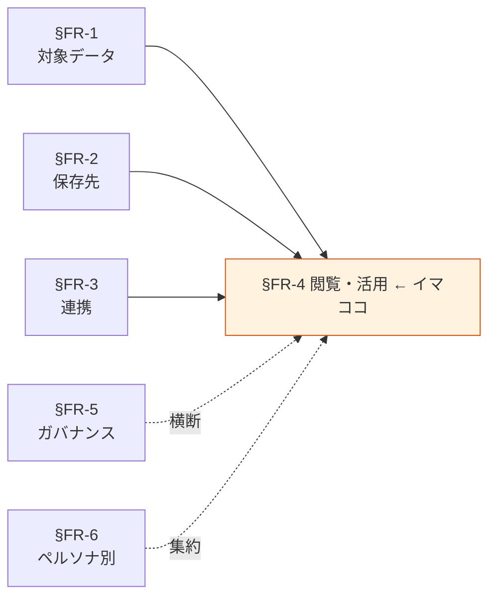

# §FR-4 閲覧・活用

> 上位 SSOT: [00-index.md](00-index.md)
> 詳細: [../../functional-requirements.md §4](../../functional-requirements.md)
> カバー範囲: FR-VIEW §4.1 クエリ / §4.2 BI / §4.3 アプリ参照 / §4.4 直接アクセス

---

## §FR-4.0 前提と背景

### 用語整理

| 用語 | 本標準での意味 |
|---|---|
| **クエリ** | SQL 等で目的のデータを取り出す操作（探索的・定形を含む） |
| **BI**（Business Intelligence） | 業務部門向けにダッシュボード・レポートを提供する仕組み |
| **アプリ参照** | アプリケーションが API 経由でデータプラットフォームのデータを利用する形態 |
| **直接アクセス** | データオーナー権限を持つ利用者が S3 / RDS 等のストレージに直接アクセスする形態（最小限・例外的） |
| **Federated Query** | 複数の保存先（レイク / DWH / RDS 等）を横断する単一クエリ |
| **Materialized View** | クエリ結果を物理的に保存し、再計算を省く仕組み |

### なぜここ（§FR-4）で決めるか

§FR-1〜3 で「何が・どこに・どう運ばれて」用意されたデータを、「**誰が・どう取り出して使うか**」を決める章。利用者の属性（ペルソナ）と用途によって標準ツールが変わるため、§FR-6 ペルソナ別実装パターンの主要素材を提供する。

### §FR-4.0.A 本標準のスタンス

> **AWS ネイティブの閲覧・活用サービス（Athena / Redshift / QuickSight / API Gateway + Lambda）を用途別に使い分ける。SaaS BI（Tableau / Looker / Power BI）は SaaS 不採用方針に照らして原則不採用、ただし既存資産・顧客要望が強い場合は ADR で例外判断を残す。直接アクセスは原則最小化し、すべての利用は SQL クエリ・BI・API のいずれかに集約する。**

### 共通標準として「閲覧・活用」を定める意義

| 観点 | 各アプリで独自に決めた場合 | 共通標準を定めた場合 |
|---|---|---|
| クエリツール | アプリごとに別ツール、学習コスト重複 | **Athena / Redshift に集約、共通スキルで運用** |
| BI ダッシュボード | 部門ごとに別ツール、コスト・データ整合性問題 | **QuickSight 1 本、データソース統一** |
| アクセス制御 | 直接アクセスが横行、漏洩リスク | **クエリ・API・BI 経由に集約、Lake Formation で一元制御** |
| 監査ログ | 散在、追跡困難 | **CloudTrail + サービス別アクセスログで一元化** |

→ 閲覧・活用を標準化することで、**スキル集約・コスト削減・ガバナンス強化が同時に実現**できる。

### 本章で扱うサブセクション

| サブセクション | 内容 | 関連 FR |
|---|---|---|
| §FR-4.1 クエリ（Athena / Redshift） | 探索的・定形クエリの標準、ワークグループ・コスト統制 | FR-VIEW-001〜004（想定） |
| §FR-4.2 BI（QuickSight） | ダッシュボード提供、データセット管理、ロール制御 | FR-VIEW-010〜013（想定） |
| §FR-4.3 アプリ参照（API） | API 経由でのデータ提供、API Gateway + Lambda 標準 | FR-VIEW-020〜022（想定） |
| §FR-4.4 直接アクセス | 例外的な直接 S3 / DB アクセスの条件と手続き | FR-VIEW-030〜（想定） |

---

## §FR-4.1 クエリ（→ FR-VIEW §4.1）

> **このサブセクションで定めること**: Athena によるクエリ実行の標準（ワークグループ / コスト統制 / Federated Query）。Phase 1/2 では Redshift は不採用（[DP-ADR-002](../../adr/DP-ADR-002-redshift-emr-not-adopted.md)）。
> **主な判断軸**: クエリパターン（探索的 vs 定形）/ 同時実行 / コスト統制（スキャン量制限）
> **§FR-4 全体との関係**: 開発者・分析者ペルソナ（§FR-6）の主要ツール。BI（§FR-4.2）の裏側でも動く

### ベースライン

> ⚠ **Phase 1/2 は Athena 一択**（[DP-ADR-002](../../adr/DP-ADR-002-redshift-emr-not-adopted.md)）。Redshift は Phase 3+ 再評価時の候補。

**Athena ワークグループ**:
- 用途別にワークグループを分離（探索 / 本番ジョブ / BI 裏側 / 監査クエリ等）。
- ワークグループごとにクエリスキャン量上限を設定（コスト暴走防止）。
- クエリ結果保存先を明示し、機密度別にバケットを分離。

**Athena Standard On-Demand**:
- $5/TB スキャン、Phase 1/2 規模では月数十ドル。
- 10 MB 最低、Parquet + 圧縮で 75% 削減推奨。
- Partition Projection を活用し Glue Catalog コストも削減。

**Athena Provisioned Capacity**（Phase 3+ 候補）:
- 採算分岐は月 175 TB スキャン以上。
- 応答時間 SLA・同時実行数確保・月次コスト予測可能性が必要な場合に検討。

**~~Redshift クエリ~~** → **Phase 1/2 不採用**（[DP-ADR-002 §3.1](../../adr/DP-ADR-002-redshift-emr-not-adopted.md)）。
- Phase 3+ 採用時は WLM でユーザー種別ごとに優先度・同時実行を制御。

**Federated Query**:
- Athena Federated Query で複数保存先横断を可能とする。
- ただし Federated Query は性能・コストに注意し、定形バッチでは使用しない。
- **採用 / 不採用の詳細判断基準**: [../../account-architecture-analysis.md §4.2.2.8.12](../../account-architecture-analysis.md) を参照（6 つの不採用根拠 / 4 つの補助用途 / 採用時の 8 制約 / 判断フロー図）。

**コスト統制**:
- Cost Explorer + AWS Budgets で月次しきい値アラート。
- Athena は **per-query スキャン量制限**を必須設定。

### TBD / 要確認

- 各アプリでの想定クエリ頻度・同時実行数
- Athena ワークグループ分離の粒度（部署別 vs 用途別）
- Federated Query 利用範囲
- Phase 3+ で Redshift 再評価のタイミング（[DP-ADR-002 §4.1 トリガ](../../adr/DP-ADR-002-redshift-emr-not-adopted.md)）

---

## §FR-4.2 BI（→ FR-VIEW §4.2）

> **このサブセクションで定めること**: QuickSight を標準 BI ツールとし、データセット・ロール・ダッシュボード公開の運用ルール。
> **主な判断軸**: 利用者数（ライセンス）/ データソース統一 / 行/列レベルセキュリティ
> **§FR-4 全体との関係**: 業務利用者ペルソナ（§FR-6）の主要ツール

### ベースライン

**標準 BI = QuickSight**:
- 各アプリ AWS アカウントで QuickSight Enterprise Edition を採用。
- 経営層向け・部門横断の全社統合ダッシュボードは別途検討（複数アカウント間共有 or 集約アカウント）。

**データソース**:
- 原則 Athena（レイク経由）または Redshift（DWH 経由）。
- 運用 DB 直接接続は禁止（負荷影響）。

**SPICE（インメモリ計算）**:
- ピーク負荷のあるダッシュボードは SPICE 利用を必須化。
- 更新頻度に応じて Direct Query / SPICE 自動更新を使い分け。

**行/列レベルセキュリティ**:
- Lake Formation の制御を QuickSight で活用、または QuickSight RLS/CLS で実装。
- 機密度 Confidential 以上のデータには適用必須。

**SaaS BI の扱い**:
- Tableau / Looker / Power BI 等は原則不採用。既存資産がある場合や強い顧客要望がある場合のみ ADR で例外判断。

### TBD / 要確認

- 想定 BI 利用者数（Reader / Author 別、ライセンス見積もり）
- 全社横断ダッシュボードの実現方式
- 既存 BI ツール（Tableau 等）の存在と移行可否

---

## §FR-4.3 アプリ参照（API）（→ FR-VIEW §4.3）

> **このサブセクションで定めること**: 他のアプリケーションがデータプラットフォームのデータを参照する場合の標準（API Gateway + Lambda）。
> **主な判断軸**: 認証・認可方式 / レイテンシ要件 / レート制限
> **§FR-4 全体との関係**: 開発者ペルソナ（§FR-6）と、データを利用する隣接アプリの接点。API プラットフォーム標準（[../../../api-platform/](../../../api-platform/)）と密接に関連

### ベースライン

**標準構成**:
- **API Gateway + Lambda + Athena/Redshift/DynamoDB** をデフォルトとする。
- 認証は共有認証基盤（[../../../requirements/](../../../requirements/)）の JWT 検証を採用。
- 認可はデータオーナーが定めるスコープ・ロールに基づく。

**レイテンシ要件**:
- リアルタイム要件（数百ms 以内）の場合、Athena は不適。DynamoDB / Redshift キャッシュ / Materialized View を使う。
- 数秒許容なら Athena でも可。

**レート制限・課金按分**:
- API プラットフォーム標準（[../../../api-platform/00-index.md §0.1 #2](../../../api-platform/00-index.md)）に準拠。

**スキーマ・契約**:
- OpenAPI で API 仕様を必須化（API プラットフォーム標準に従う）。
- データ形式の後方互換性ルールを明示。

### TBD / 要確認

- API プラットフォーム標準との分担境界（API 標準が決めること / 本標準が決めること）
- データ提供 API の SLA（レイテンシ・可用性）
- API レイヤーでのデータマスキング要否

---

## §FR-4.4 直接アクセス（→ FR-VIEW §4.4）

> **このサブセクションで定めること**: 例外的に S3 バケットや DB に直接アクセスする場合の条件・手続き・監査。
> **主な判断軸**: 必要性（クエリ・BI・API で代替不可な根拠）/ 機密度との整合 / 監査ログ
> **§FR-4 全体との関係**: 原則最小化する位置付け。本サブセクションは「採用しない」を明示するための章

### ベースライン

**原則禁止**:
- データ閲覧・活用は §FR-4.1〜4.3 のいずれかに集約する。
- 直接 S3 や DB を読みに行く運用は原則禁止。

**例外条件**（すべて満たすこと）:
- §FR-4.1〜4.3 で技術的に代替不可（具体的理由を申請書に記載）
- データオーナー（§FR-1.3）の事前承認
- アクセス期間が有限（恒久化禁止）
- アクセスログ取得必須

**典型的な例外シナリオ**:
- 大量データの一括ダウンロード（数百 GB 以上で API では非現実的）
- バックアップ・リストア作業
- データ調査（特定インシデント対応）

**監査**:
- 直接アクセスは全件 CloudTrail に記録し、四半期ごとにレビューする。

### TBD / 要確認

- 現状の直接アクセス運用の実態調査
- 申請プロセスの詳細（承認者・SLA・有効期限）
- 「直接アクセス」と「BI Author の SPICE 取得」の境界

---

## §FR-4.X 関連リンク

- [../00-index.md](../00-index.md): proposal SSOT
- [02-storage.md](02-storage.md): §FR-2 保存先標準（クエリ対象）
- [05-governance.md](05-governance.md): §FR-5 ガバナンス（権限制御・監査）
- [06-personas.md](06-personas.md): §FR-6 ペルソナ別実装パターン（本章を利用者視点で再構成）
- [../../../api-platform/00-index.md](../../../api-platform/00-index.md): API プラットフォーム標準
