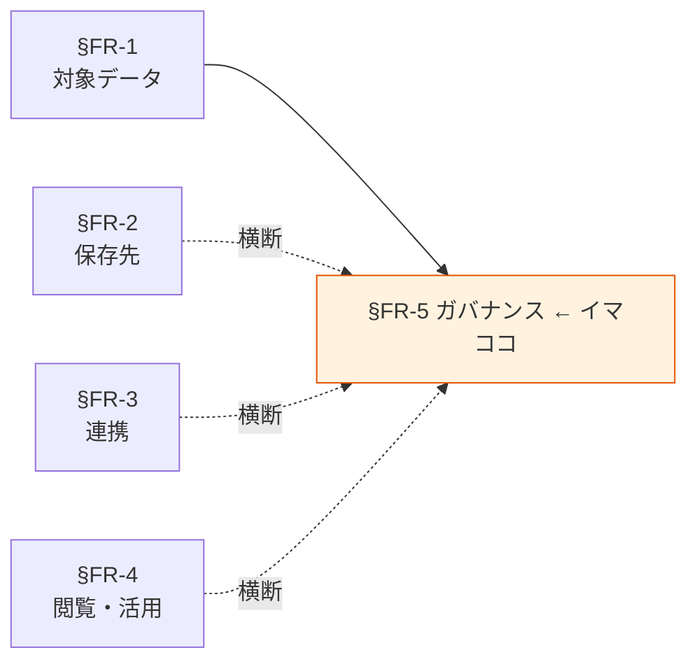

# §FR-5 ガバナンス

> 上位 SSOT: [00-index.md](00-index.md)
> 詳細: [../../functional-requirements.md §5](../../functional-requirements.md)
> カバー範囲: FR-GOV §5.1 権限制御 / §5.2 暗号化 / §5.3 PII 取り扱い / §5.4 監査ログ

---

## §FR-5.0 前提と背景

### 用語整理

| 用語 | 本標準での意味 |
|---|---|
| **Lake Formation** | データレイクの権限制御・データ共有・行/列レベルセキュリティを管理する AWS サービス |
| **IAM** | AWS の認証・認可基盤。本標準では Lake Formation と組み合わせて利用 |
| **KMS**（Key Management Service） | 暗号鍵の管理サービス。CMK（Customer Managed Key）と AWS マネージドキーがある |
| **CMK**（Customer Managed Key） | 利用者が作成・管理する KMS 鍵。Restricted データに必須 |
| **at-rest 暗号化 / in-transit 暗号化** | 保存時の暗号化 / 通信時の暗号化 |
| **PII**（Personally Identifiable Information） | 個人を識別できる情報。個人情報保護法の「個人情報」「個人データ」に対応 |
| **マスキング / 仮名化 / 匿名化** | PII の保護手法。マスキング（一部隠す）/ 仮名化（識別子を別 ID に置換）/ 匿名化（再識別不能） |
| **監査ログ** | セキュリティ・コンプラ目的で取得する、誰が・いつ・何にアクセスしたかの記録 |

### なぜここ（§FR-5）で決めるか

§FR-1〜4 の各レイヤーに横断する「**統制ルール**」を定める章。§FR-1.2 機密度・§FR-1.3 データオーナーが「何を / 誰が決める」を定めたのに対し、本章は「**実装としてどう守るか**」を定める。

### §FR-5.0.A 本標準のスタンス

> **「絶対安全」を最優先とし、データ漏洩・改ざん・誤公開を起こさない仕組みを多層で実装する。権限制御は Lake Formation + IAM、暗号化は機密度別に KMS CMK / AWS マネージドキーを使い分け、PII は識別必須・原則 Restricted 扱い、監査ログは全データアクセスで取得・改ざん不能保管を行う。例外申請の経路を §C-3 RACI で明示し、抜け穴を作らない。**

### 共通標準として「ガバナンス」を定める意義

| 観点 | 各アプリで独自に決めた場合 | 共通標準を定めた場合 |
|---|---|---|
| 権限制御 | アプリごとに別実装、漏れリスク | **Lake Formation 一元化、機密度別の標準ポリシー** |
| 暗号化 | 抜け漏れ多発 | **機密度別に at-rest / in-transit 必須化** |
| PII 取り扱い | アプリ任せ、法令違反リスク | **識別必須・マスキング標準・棚卸し** |
| 監査 | アクセスログ取得が散在 | **CloudTrail + サービス別ログを統一保管** |

→ ガバナンスを標準化することで、**情報漏洩・コンプラ違反のリスクを構造的に低減**できる。

### 本章で扱うサブセクション

| サブセクション | 内容 | 関連 FR |
|---|---|---|
| §FR-5.1 権限制御 | Lake Formation / IAM、機密度別ポリシー、Need-to-know | FR-GOV-001〜005（想定） |
| §FR-5.2 暗号化 | at-rest / in-transit、KMS CMK 利用条件、鍵ローテーション | FR-GOV-010〜014（想定） |
| §FR-5.3 PII 取り扱い | 識別必須、マスキング・仮名化、Macie 活用、棚卸し | FR-GOV-020〜023（想定） |
| §FR-5.4 監査ログ | CloudTrail / Lake Formation / Athena ログ、改ざん不能保管 | FR-GOV-030〜033（想定） |

---

## §FR-5.1 権限制御（→ FR-GOV §5.1）

> **このサブセクションで定めること**: データレイク・DWH・運用ストアへのアクセス権の制御方式（Lake Formation / IAM）、機密度別の標準ポリシー、Need-to-know 原則。
> **主な判断軸**: 機密度（§FR-1.2）/ 行/列レベル制御の必要性 / クロスアカウント共有の必要性
> **§FR-5 全体との関係**: §FR-1.2 機密度の実装としての主軸。§FR-4 閲覧・活用の前提条件

### ベースライン

**標準制御方式**:
- レイク（S3）: **Lake Formation + IAM** を標準とする。
- DWH（Redshift）: **Redshift ユーザー・ロール + Lake Formation 連携**。
- 運用ストア（RDS / DynamoDB）: **IAM** を標準とする。

**機密度別標準ポリシー**:
| 機密度 | 標準ポリシー |
|---|---|
| **Public** | 認証必須、認可は緩い（社内全般）|
| **Internal** | 認証 + 部署 / ロール単位の認可 |
| **Confidential** | Need-to-know、行/列レベル制御を検討 |
| **Restricted** | Need-to-know 必須、Lake Formation 行/列レベル制御必須、アクセスログ・四半期棚卸し |

**Need-to-know 原則**:
- 業務上の必要性なしのアクセス権は付与しない。
- アクセス権申請は当該データオーナー（§FR-1.3）の承認必須。

**クロスアカウント共有**:
- Lake Formation のクロスアカウント機能を標準とする。
- 共有先アカウントへの伝播ログを保持。

### TBD / 要確認

- 現状の権限制御実装と Lake Formation 移行範囲
- 部署・ロール体系の設計（社内マスタとの連動）
- 行/列レベル制御を必須とする具体データの範囲

---

## §FR-5.2 暗号化（→ FR-GOV §5.2）

> **このサブセクションで定めること**: at-rest / in-transit 暗号化の標準、KMS CMK 利用条件、鍵ローテーション・廃止プロセス。
> **主な判断軸**: 機密度（§FR-1.2）/ コンプラ要件 / 鍵管理運用負荷
> **§FR-5 全体との関係**: §FR-1.2 機密度の実装としてのもう 1 つの軸。権限制御（§FR-5.1）と組み合わせて多層防御

### ベースライン

**at-rest 暗号化**:
| 機密度 | 鍵 |
|---|---|
| Public | 任意（SSE-S3 / SSE-KMS のどちらでも） |
| Internal | **SSE-KMS（AWS マネージドキー）必須** |
| Confidential | **SSE-KMS（AWS マネージドキー）必須**、CMK 推奨 |
| Restricted | **SSE-KMS + CMK 必須** |

対象：S3 / EBS / RDS / Aurora / DynamoDB / Redshift / OpenSearch / Glue / Athena 結果バケット 等すべて。

**in-transit 暗号化**:
- すべての通信は TLS 1.2 以上を必須（TLS 1.3 推奨）。
- VPC エンドポイント経由を推奨（パブリック経路を最小化）。

**KMS CMK 鍵ローテーション**:
- AWS の自動ローテーション（年次）を標準とする。
- 鍵ポリシーは IaC で管理し、変更履歴を残す。

**鍵廃止**:
- データ削除（§NFR-9）に合わせて鍵廃止プロセスを定める。

### TBD / 要確認

- マルチリージョン鍵（Multi-Region KMS Key）の採用範囲（DR / クロスリージョン共有）
- 既存データの暗号化方式と本標準への移行プラン
- 鍵管理の運用主体（プラットフォーム標準化推進者 / 各アプリ）

---

## §FR-5.3 PII 取り扱い（→ FR-GOV §5.3）

> **このサブセクションで定めること**: PII 識別の必須化、マスキング・仮名化の標準、Amazon Macie 活用、定期棚卸し。
> **主な判断軸**: 個人情報保護法 / 業界ガイドライン / マスキング技術と性能のトレードオフ
> **§FR-5 全体との関係**: §FR-1.2 機密度の中でも特殊扱い。法令適合の中心

### ベースライン

**PII 識別の必須化**:
- すべてのデータについて、PII を含むか否かのフラグを必須属性とする（§FR-1.2 で既定）。
- PII を含むデータは原則 Restricted。

**マスキング・仮名化**:
| 用途 | 推奨手法 |
|---|---|
| 開発・検証環境 | 仮名化（識別子置換）or 完全マスキング |
| 分析用（部分マスキング許容） | 動的マスキング（Lake Formation データフィルタ / クエリ時マスキング） |
| 第三者提供 | 匿名化（再識別不能を保証）|

**Amazon Macie**:
- 全 S3 バケットを Macie 監視対象とし、PII 検出を定期実行。
- 未識別 PII を検出した場合は即時通知・調査。

**定期棚卸し**:
- 四半期ごとに PII 含有データの一覧棚卸しを実施。
- データオーナー責任で実施、結果を §FR-5.4 監査ログに残す。

### TBD / 要確認

- 業界規制（金融 / 医療 / 個人情報保護法）への追加対応の有無
- マスキングの実装方式（Lake Formation データフィルタ vs アプリ層）
- Macie の運用範囲・コスト（大規模 S3 でのコスト見積もり）
- 海外データ移転規制への対応（GDPR 等の影響範囲）

---

## §FR-5.4 監査ログ（→ FR-GOV §5.4）

> **このサブセクションで定めること**: データへのアクセス・操作の監査ログ取得（CloudTrail / Lake Formation / サービス別ログ）、改ざん不能保管、長期保管。
> **主な判断軸**: コンプラ要件 / インシデント対応 / コスト（長期保管）
> **§FR-5 全体との関係**: §FR-5.1〜5.3 の実装結果を「事後確認可能」にする土台

### ベースライン

**取得対象**:
- **コントロールプレーン**: CloudTrail（全リージョン / 管理イベント + データイベント有効）。
- **データプレーン**:
  - S3 アクセスログ / S3 サーバアクセスログ
  - Lake Formation アクセス監査ログ
  - Athena クエリログ（CloudTrail + ワークグループ設定）
  - Redshift 監査ログ（user activity log + connection log）
  - RDS / Aurora 監査ログ（IAM 認証ログ / 拡張モニタリング）

**保管**:
- 専用ログ用 S3 バケット（**Object Lock + Compliance モード**）に集約。
- 改ざん不能保管期間は最低 1 年、機密度・規制要件により延長（§NFR-9）。

**集中管理**:
- Organization レベルで監査アカウントへ集約（Security Hub / GuardDuty と連携）。
- 各アプリアカウントには監査ログを残さず、集中化アカウントで一元保管。

**閲覧・分析**:
- CloudTrail Lake / Athena で監査クエリ。
- 重要イベント（Restricted データへの大量アクセス等）はリアルタイムアラート。

### TBD / 要確認

- 監査アカウント集約の既存設計との整合
- 保管期間の規制要件（業界別の具体年数）
- リアルタイムアラートの閾値・通知先

---

## §FR-5.X 関連リンク

- [../00-index.md](../00-index.md): proposal SSOT
- [01-data-catalog.md](01-data-catalog.md): §FR-1.2 機密度 / §FR-1.3 オーナー（本章の入力）
- [../nfr/04-security.md](../nfr/04-security.md): §NFR-4 セキュリティ（本章を非機能要件として補強）
- [../nfr/07-compliance.md](../nfr/07-compliance.md): §NFR-7 コンプラ（規制適合）
- [../nfr/09-lifecycle.md](../nfr/09-lifecycle.md): §NFR-9 データライフサイクル（保管期間・削除）
- [../common/03-ownership-raci.md](../common/03-ownership-raci.md): §C-3 RACI（承認権限の組織展開）
