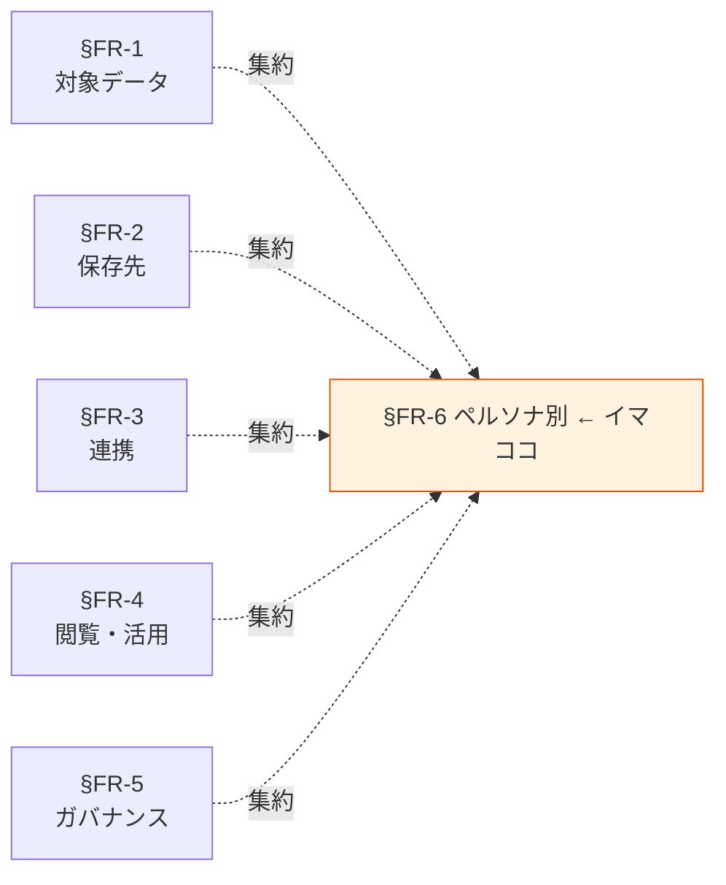

# §FR-6 ペルソナ別実装パターン

> 上位 SSOT: [00-index.md](00-index.md)
> 詳細: [../../functional-requirements.md §6](../../functional-requirements.md)
> カバー範囲: FR-PERSONA §6.1 業務利用者 / §6.2 開発者 / §6.3 分析者 / §6.4 監査者

---

## §FR-6.0 前提と背景

### 用語整理

| 用語 | 本標準での意味 |
|---|---|
| **ペルソナ** | データプラットフォームの利用者を性格別に分けた区分。役割・スキル・主目的が異なる |
| **業務利用者** | 業務部門・経営層など、データを意思決定に使う非エンジニア層 |
| **開発者** | アプリケーションを開発・運用するエンジニア。API・運用ストア中心 |
| **分析者** | データを探索・分析する役割（データアナリスト / データサイエンティスト） |
| **監査者** | 内部監査・コンプラ部門。アクセスログ・PII 取り扱い状況を確認 |

### なぜここ（§FR-6）で決めるか

§FR-1〜5 で「データ・保存先・連携・閲覧・統制」が決まったあとに、それらを**利用者の視点で再構成**する章。各ペルソナにとって「何をどう使うのが標準か」を整理することで、現場が迷わない。

### §FR-6.0.A 本標準のスタンス

> **「どんなユースケースでも対応する」ことを目指し、4 つの主要ペルソナ（業務利用者 / 開発者 / 分析者 / 監査者）に対する標準実装パターンを示す。各ペルソナの典型ユースケースに対し、§FR-2〜5 のどれを使うかの推奨ルートを明示し、現場が「何を使えばよいか」で迷わない構成とする。**

### 共通標準として「ペルソナ別実装パターン」を定める意義

| 観点 | 各アプリで独自に決めた場合 | 共通標準を定めた場合 |
|---|---|---|
| 新規利用者の立ち上げ | アプリごとに別ツール・別手順 | **ペルソナごとに標準ルートがあり、即座に作業開始** |
| ツールの選び方 | 「Athena / Redshift / BI / API どれを使う？」で迷う | **ユースケース → 推奨ツールの早見表** |
| ガバナンス徹底 | アクセスパターンが多様で監査困難 | **ペルソナ別に許容パターンを明示 → 逸脱検出が容易** |

→ ペルソナ別パターンを定めることで、**新規参入者の学習コスト低減・ガバナンス徹底**が両立する。

### 本章で扱うサブセクション

| サブセクション | 内容 | 関連 FR |
|---|---|---|
| §FR-6.1 業務利用者 | BI 中心、SQL 不要、定形ダッシュボード閲覧 | FR-PERSONA-001〜003（想定） |
| §FR-6.2 開発者 | API 連携、運用ストア、IaC、CI/CD | FR-PERSONA-010〜013（想定） |
| §FR-6.3 分析者 | 探索的クエリ、ノートブック、ML 前処理 | FR-PERSONA-020〜023（想定） |
| §FR-6.4 監査者 | アクセスログ閲覧、PII 棚卸し、棚卸し報告 | FR-PERSONA-030〜032（想定） |

---

## §FR-6.1 業務利用者（→ FR-PERSONA §6.1）

> **このサブセクションで定めること**: 業務部門・経営層など非エンジニア層が、データプラットフォームを使うときの標準ルート。
> **主な判断軸**: 操作性（SQL 不要）/ レイテンシ（即時表示）/ ガバナンス（部署別・行レベル制御）
> **§FR-6 全体との関係**: 利用者数が最も多くなる想定。BI ツールの設計品質が全体満足度を決める

### ベースライン

**主要ユースケースと推奨ルート**:
| ユースケース | 推奨ルート |
|---|---|
| 定形ダッシュボード閲覧 | **QuickSight + SPICE**（§FR-4.2） |
| KPI トラッキング | **QuickSight ダッシュボード**（更新スケジュール設定） |
| 経営報告資料の元データ | **QuickSight からエクスポート** |
| 探索的なフィルタ・スライス | **QuickSight Reader 機能内のドリルダウン** |

**スキル前提**:
- SQL 不要、QuickSight UI のみ。
- データソースは事前に分析者・開発者が用意（業務利用者はビジュアル操作のみ）。

**アクセス権**:
- QuickSight Reader ロール標準。
- 機密度に応じて行/列レベルセキュリティを適用（§FR-5.1）。

### TBD / 要確認

- 想定業務利用者数（QuickSight Reader ライセンス見積もり）
- 経営層向けと部門向けのダッシュボード分離方針
- モバイル対応の要否

---

## §FR-6.2 開発者（→ FR-PERSONA §6.2）

> **このサブセクションで定めること**: アプリ開発者がデータプラットフォームを使うときの標準ルート（API 連携 / 運用ストア / IaC / CI/CD）。
> **主な判断軸**: 開発生産性 / 運用性 / 標準準拠の自動チェック
> **§FR-6 全体との関係**: 各アプリの実装担当。標準の遵守度が現場で決まる中心ペルソナ

### ベースライン

**主要ユースケースと推奨ルート**:
| ユースケース | 推奨ルート |
|---|---|
| 業務 TX 読み書き | **運用ストア（Aurora / DynamoDB）**（§FR-2.3） |
| 分析データへのアプリからの参照 | **API Gateway + Lambda + Athena/Redshift**（§FR-4.3） |
| データ取り込み実装 | **Glue / Step Functions / Lambda**（§FR-3.1） |
| ログ・メトリクス出力 | **CloudWatch Logs / Metrics**（標準）→ 必要に応じてレイクへ集約（§FR-2.5）|

**IaC・CI/CD**:
- 全インフラリソースは IaC（CDK / Terraform）必須。
- データ連携パイプライン・QuickSight ダッシュボード・Glue ジョブも IaC で管理。
- 標準準拠の自動チェック（暗号化必須・タグ必須等）を CI に組み込む。

**ローカル開発**:
- LocalStack や Glue Docker でのローカル開発を推奨。
- 機密度 Confidential 以上のデータでの本番直結開発は禁止。

### TBD / 要確認

- IaC ツール選定（CDK / Terraform / SAM / 混在許容）
- ローカル開発環境の標準化範囲
- 開発者の AWS アカウント分離方針（dev / staging / prod）

---

## §FR-6.3 分析者（→ FR-PERSONA §6.3）

> **このサブセクションで定めること**: データアナリスト・データサイエンティストの標準ルート（探索的クエリ・ノートブック・ML 前処理）。
> **主な判断軸**: 探索の自由度 / コスト統制 / 機密データ取り扱い
> **§FR-6 全体との関係**: 高度な利用者で自由度が必要。ガバナンスとのバランスが論点

### ベースライン

**主要ユースケースと推奨ルート**:
| ユースケース | 推奨ルート |
|---|---|
| 探索的 SQL クエリ | **Athena**（ワークグループ「探索」）（§FR-4.1） |
| ノートブック（Python / SQL） | **SageMaker Studio / Athena Notebooks** |
| ML 前処理・特徴量作成 | **Glue ETL + SageMaker Processing** |
| アドホック集計 | **Athena → S3 結果 → QuickSight 任意可視化** |

**スキル前提**:
- SQL 必須、Python 推奨。

**コスト統制**:
- 探索用ワークグループに per-query スキャン量上限を設定（コスト暴走防止）。
- 月次でクエリ実績を共有、コスト意識を浸透。

**機密データ取り扱い**:
- Restricted データへの直接アクセスは事前承認制。
- 一般的にはマスキングビューを通すか、Confidential 以下に整形済みデータを用意。

### TBD / 要確認

- 分析者の想定人数とアカウント分離方針
- SageMaker 採用範囲（ML 利用の現状把握）
- 探索クエリのコスト上限設定値

---

## §FR-6.4 監査者（→ FR-PERSONA §6.4）

> **このサブセクションで定めること**: 内部監査・コンプラ部門が、データの取り扱い状況を確認するための標準ルート。
> **主な判断軸**: 監査ログ網羅性 / 第三者性（被監査側が改ざんできない構造）/ 棚卸しの頻度
> **§FR-6 全体との関係**: ガバナンス（§FR-5）の事後確認担当。読み取り専用・改ざん不能保管の前提

### ベースライン

**主要ユースケースと推奨ルート**:
| ユースケース | 推奨ルート |
|---|---|
| アクセスログ閲覧 | **CloudTrail Lake / Athena（監査ログバケット）**（§FR-5.4） |
| PII 含有データの棚卸し確認 | **Amazon Macie レポート + データオーナー棚卸し記録** |
| 権限付与の妥当性確認 | **Lake Formation / IAM Access Analyzer** |
| 異常アクセスの調査 | **GuardDuty / Security Hub アラート起点 + CloudTrail 詳細追跡** |

**アクセス権**:
- 監査者は読み取り専用の専用ロール（IAM）。
- 監査アカウントに集約された監査ログにのみアクセス可能（各アプリアカウントには触らない）。

**棚卸し頻度**:
- 四半期：PII 含有データ棚卸し、Restricted データの権限見直し。
- 年次：全データオーナー棚卸し。

**第三者性の担保**:
- 監査ログは Object Lock Compliance モードで改ざん不能保管。
- 監査者は被監査側（各アプリ運用者）から独立した組織配置を推奨。

### TBD / 要確認

- 監査者の組織体制（社内監査 / 外部監査 / 兼任の可否）
- 棚卸しレポートのフォーマット標準化
- 規制対応（業界別の必須監査項目）

---

## §FR-6.X 関連リンク

- [../00-index.md](../00-index.md): proposal SSOT
- [01-data-catalog.md](01-data-catalog.md): §FR-1 対象データ
- [02-storage.md](02-storage.md): §FR-2 保存先標準
- [04-consumption.md](04-consumption.md): §FR-4 閲覧・活用（本章のベース）
- [05-governance.md](05-governance.md): §FR-5 ガバナンス（本章のベース）
- [../common/03-ownership-raci.md](../common/03-ownership-raci.md): §C-3 RACI（ペルソナと組織役割の対応）
