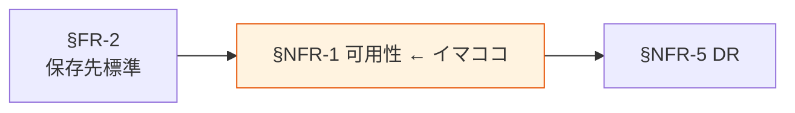

# §NFR-1 可用性

> 上位 SSOT: [../00-index.md](../00-index.md) / [00-index.md](00-index.md)
> IPA 対応: **A. 可用性**（継続性 / 耐障害性）
> 詳細: [../../non-functional-requirements.md §NFR-AVL](../../non-functional-requirements.md)

---

## §NFR-1.0 前提と背景

### 用語整理

| 用語 | 本標準での意味 |
|---|---|
| **SLA**（Service Level Agreement） | AWS が保証する稼働率 |
| **Multi-AZ** | 複数のアベイラビリティゾーンに冗長配置する構成 |
| **保存先別 SLA** | S3 / RDS / Aurora / Redshift / OpenSearch 等、保存先サービスごとに異なる AWS 公称 SLA |
| **データ可用性 vs 処理可用性** | データそのものへのアクセス可否 vs それを使う分析処理の可否 |

### なぜここ（§NFR-1）で決めるか

§FR-2 で選んだ保存先サービスごとに AWS の SLA が異なるため、各データ区分・各保存先で目標可用性を明示する必要がある。§NFR-5 DR（リージョン障害）はその上位ケース。

### IPA マッピング

| 本章サブセクション | IPA 中項目 |
|---|---|
| §NFR-1.1 保存先別 SLA | A.1 継続性 / A.2 耐障害性 |
| §NFR-1.2 計画停止・メンテ窓 | A.3 災害対策（一部）/ C.1 通常運用（メンテナンス）|

### §NFR-1.0.A 本標準のスタンス

> **AWS マネージドサービスの公称 SLA をベースに、データ区分別の可用性目標を定める。業務 TX（運用ストア）は 99.99% 級、レイクは S3 の 99.9% 級、分析処理（DWH / OpenSearch）は 99.9% 級を標準とし、これを下回る要件は例外として ADR 化する。**

### 本章で扱うサブセクション

| サブセクション | 内容 |
|---|---|
| §NFR-1.1 保存先別 SLA | S3 / RDS / Aurora / DynamoDB / Redshift / OpenSearch の各 SLA と本標準の目標値 |
| §NFR-1.2 計画停止・メンテ窓 | メンテナンスウィンドウ、ローリングアップグレード対応 |

---

## §NFR-1.1 保存先別 SLA

> **このサブセクションで定めること**: §FR-2 の各保存先について、本標準が目標とする可用性。
> **主な判断軸**: データ区分の業務影響度 / AWS 公称 SLA / 追加冗長化コスト
> **§NFR-1 全体との関係**: §NFR-1 の中核。下流の運用要件（§NFR-6）も本数値を前提に設計

### ベースライン

| 保存先 | AWS 公称 SLA | 本標準の目標 | 追加要件 |
|---|---|---|---|
| S3 Standard | 99.9% | 99.9% | デフォルト Multi-AZ、SSE-KMS 必須 |
| RDS Multi-AZ | 99.95% | 99.95% | Multi-AZ 必須、自動バックアップ有効 |
| Aurora | 99.99% | 99.99% | Multi-AZ 必須、Aurora Global Database は §NFR-5 で判断 |
| DynamoDB | 99.99%（Single-Region）/ 99.999%（Global Tables） | 99.99% | Auto Scaling 必須 |
| Redshift | 99.9%（プロビジョンド）/ 99.5%（Serverless） | 99.9% | Multi-AZ は §NFR-5 で判断 |
| OpenSearch Service | 99.9%（Multi-AZ）| 99.9% | Multi-AZ 必須 |
| Glue / Athena / Lake Formation | 99.9% | 99.9% | リージョン障害対応は §NFR-5 |

**目標値を下回る場合の扱い**:
- 採用前に ADR 必須。代替手段（Single-AZ 構成のコスト削減等）を明記。

### TBD / 要確認

- 業務 TX の可用性要件（業務部門のヒアリング必要）
- 分析処理（DWH / OpenSearch）の停止許容時間
- マルチリージョン分散の費用対効果評価

---

## §NFR-1.2 計画停止・メンテ窓

> **このサブセクションで定めること**: 定期メンテナンス・パッチ適用・バージョンアップの実施タイミングと影響範囲。
> **主な判断軸**: 業務利用時間帯 / AWS 自動メンテ機能 / ローリング対応の可否
> **§NFR-1 全体との関係**: SLA とは別軸の「計画的に止まる時間」の規定

### ベースライン

- 業務影響のあるメンテ窓は週 1 回（4 時間）以内、深夜時間帯に集約。
- RDS / Aurora / OpenSearch の自動メンテナンスウィンドウは深夜帯指定。
- バージョンアップはローリング適用を標準とする（業務停止を伴わない）。
- 計画停止は 7 営業日前までに通知。

### TBD / 要確認

- 業務利用の時間帯ピーク（24/7 / 営業時間内 / 月次クローズ等）
- メンテ通知の方法と承認フロー

---

## §NFR-1.X 関連リンク

- [00-index.md](00-index.md): NFR インデックス
- [../fr/02-storage.md](../fr/02-storage.md): §FR-2 保存先標準（本章の入力）
- [05-dr.md](05-dr.md): §NFR-5 DR（リージョン障害ケース）
- [06-operations.md](06-operations.md): §NFR-6 運用（監視・障害対応）
