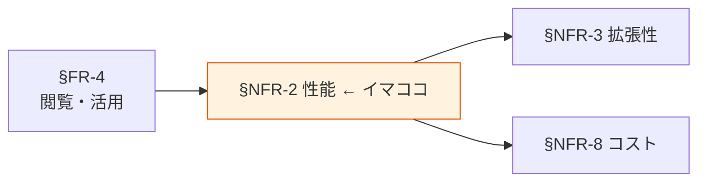

# §NFR-2 性能

> 上位 SSOT: [../00-index.md](../00-index.md) / [00-index.md](00-index.md)
> IPA 対応: **B. 性能・拡張性**（業務処理量 / 性能目標値）
> 詳細: [../../non-functional-requirements.md §NFR-PERF](../../non-functional-requirements.md)

---

## §NFR-2.0 前提と背景

### 用語整理

| 用語 | 本標準での意味 |
|---|---|
| **クエリレイテンシ** | クエリ発行から結果取得までの時間 |
| **スループット** | 単位時間あたりの処理量（読み書きバイト数・行数・イベント数）|
| **バッチ処理時間** | バッチジョブの実行時間（取り込み・変換・集計）|
| **同時実行**（Concurrency） | 同時に処理されるクエリ・ジョブの数 |
| **コールドスタート** | 初回起動時の遅延（Athena 初回 / Lambda コールドスタート 等）|

### なぜここ（§NFR-2）で決めるか

§FR-4 で選んだクエリ・BI・API の性能目標を定めると、§NFR-3 拡張性・§NFR-8 コストの判断軸が決まる。

### IPA マッピング

| 本章サブセクション | IPA 中項目 |
|---|---|
| §NFR-2.1 クエリレイテンシ | B.1 業務処理量 / B.2 性能目標値 |
| §NFR-2.2 スループット | B.1 業務処理量 |

### §NFR-2.0.A 本標準のスタンス

> **「効率よくデータを活用」を実現する性能目標を、利用形態（BI / 探索 / バッチ / API）別に明示する。BI は秒オーダー、探索は数秒〜分、バッチは時間オーダー、API はミリ秒〜数秒を標準とし、要件次第で保存先・キャッシュを使い分ける。**

### 本章で扱うサブセクション

| サブセクション | 内容 |
|---|---|
| §NFR-2.1 クエリ・参照レイテンシ | BI / 探索 / API ごとのレイテンシ目標 |
| §NFR-2.2 スループット | 取り込み・連携・分析の処理量 |

---

## §NFR-2.1 クエリ・参照レイテンシ

> **このサブセクションで定めること**: BI ダッシュボード / 探索クエリ / API 参照の各レイテンシ目標。
> **主な判断軸**: 業務体験（人が待てる時間）/ SLA 要件 / 保存先性能特性
> **§NFR-2 全体との関係**: 利用者が直接感じる「速さ」の目標値

### ベースライン

| 利用形態 | 目標レイテンシ | 推奨構成 |
|---|---|---|
| BI ダッシュボード（初回） | 3 秒以内 | QuickSight + SPICE |
| BI ダッシュボード（フィルタ操作） | 1 秒以内 | QuickSight SPICE |
| 探索クエリ（Athena）| 30 秒以内（短期データ）/ 数分（長期データ）| Athena + Parquet + パーティション |
| 定形バッチ集計 | 業務窓内に完了（日次 = 6 時間以内）| Glue ETL / Step Functions |
| API 参照（ホット）| 200 ms 以内 | DynamoDB / Redshift Materialized View |
| API 参照（中速）| 1 秒以内 | Athena Result Reuse / Redshift Spectrum |

### TBD / 要確認

- 業務利用者がストレスを感じない時間（実機での確認）
- API レイテンシ要件の具体値
- ダッシュボードの初回表示と再表示の許容差

---

## §NFR-2.2 スループット

> **このサブセクションで定めること**: 取り込み・連携・分析の各スループット目標。
> **主な判断軸**: データ発生量のピーク / SLA 要件 / コスト
> **§NFR-2 全体との関係**: §NFR-3 拡張性と表裏（現状の数値 vs 将来の伸び）

### ベースライン

| 処理種別 | 標準目標 | 備考 |
|---|---|---|
| バッチ取り込み（Glue ETL）| 数十 GB/h 級 | Spark チューニング |
| ストリーム取り込み（Kinesis）| 数千 events/sec | シャード設計 |
| バッチ集計 | 数百 GB をスキャン可 | Athena / Glue |
| 同時 BI ユーザー | 50 ユーザー級 | QuickSight + SPICE |
| 同時 API 呼び出し | 100 req/sec 級 | API Gateway + Lambda |

### TBD / 要確認

- データ発生量のピーク予測
- 将来 5 年のデータ量・利用者数増加見込み
- 同時実行の最大想定値

---

## §NFR-2.X 関連リンク

- [00-index.md](00-index.md): NFR インデックス
- [../fr/04-consumption.md](../fr/04-consumption.md): §FR-4 閲覧・活用（性能要件の起点）
- [03-scalability.md](03-scalability.md): §NFR-3 拡張性
- [08-cost.md](08-cost.md): §NFR-8 コスト
