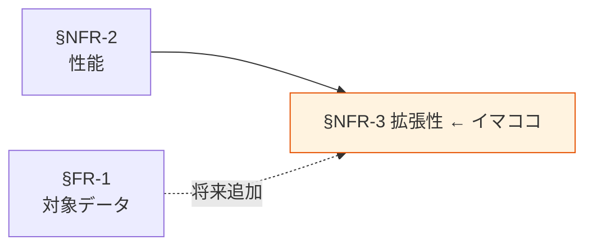

# §NFR-3 拡張性

> 上位 SSOT: [../00-index.md](../00-index.md) / [00-index.md](00-index.md)
> IPA 対応: **B. 性能・拡張性**（拡張性 / 性能品質保証）
> 詳細: [../../non-functional-requirements.md §NFR-SCL](../../non-functional-requirements.md)

---

## §NFR-3.0 前提と背景

### 用語整理

| 用語 | 本標準での意味 |
|---|---|
| **データ量拡張** | 保存データ量の増加への対応（GB→TB→PB）|
| **利用者数拡張** | 同時クエリ・BI 利用者の増加への対応 |
| **データソース拡張** | 新規アプリ・新規データ区分の追加に対する標準の適応性 |
| **垂直スケール / 水平スケール** | インスタンスサイズ拡大 / 並列度拡大 |

### なぜここ（§NFR-3）で決めるか

§NFR-2 性能は「現状の規模での目標値」、§NFR-3 拡張性は「規模が増えたときの追従性」を定める。本標準は分散標準のため、新規アプリ追加への対応が中核論点。

### IPA マッピング

| 本章サブセクション | IPA 中項目 |
|---|---|
| §NFR-3.1 データ量拡張 | B.3 拡張性 |
| §NFR-3.2 利用者数拡張 | B.3 拡張性 |
| §NFR-3.3 データソース拡張 | B.3 拡張性 |

### §NFR-3.0.A 本標準のスタンス

> **AWS マネージドサービスのオートスケール機能を活用し、データ量・利用者数の拡張をサービス選定段階で吸収する。サーバレス系（S3 / Athena / DynamoDB On-Demand / Aurora Serverless v2 / OpenSearch Serverless）を優先採用。新規アプリ追加は標準テンプレ（IaC）で即時対応可能とする。**

### 本章で扱うサブセクション

| サブセクション | 内容 |
|---|---|
| §NFR-3.1 データ量拡張 | 保存データ量の増加対応（GB→TB→PB）|
| §NFR-3.2 利用者数拡張 | 同時クエリ・BI 利用者の増加対応 |
| §NFR-3.3 データソース拡張 | 新規アプリ・新規データ区分の追加対応 |

---

## §NFR-3.1 データ量拡張

> **このサブセクションで定めること**: 保存データ量の増加（GB→TB→PB）への追従方法。
> **主な判断軸**: 各保存先の上限 / ストレージクラス使い分け / コスト
> **§NFR-3 全体との関係**: 最も基本的な拡張軸

### ベースライン

| 保存先 | 拡張性 | 標準対応 |
|---|---|---|
| S3 | 無制限 | ライフサイクル + Intelligent Tiering |
| Aurora | 128 TB / Aurora Serverless v2 自動 | Aurora Serverless v2 推奨 |
| DynamoDB | 無制限（On-Demand）| On-Demand 推奨 |
| Redshift | RA3 ノード（コンピュート/ストレージ分離） | RA3 採用 |
| OpenSearch | ノード追加で線形拡張 | Serverless 採用で透過化 |

### TBD / 要確認

- 5 年後の想定総データ量
- ペタバイト級到達の見込み

---

## §NFR-3.2 利用者数拡張

> **このサブセクションで定めること**: 同時クエリ・BI 利用者の増加への追従方法。
> **主な判断軸**: 同時実行限界 / ライセンス費用 / Auto Scaling
> **§NFR-3 全体との関係**: §NFR-2 同時実行目標値の将来見通し

### ベースライン

- QuickSight Reader: 必要数に応じて追加（月額従量）
- Athena: 同時 25 クエリ（リージョンクオータ、引き上げ可）
- API Gateway + Lambda: Auto Scaling 透過対応
- Redshift Concurrency Scaling: 必要時に追加クラスタを自動起動

### TBD / 要確認

- 想定利用者数の 5 年推移
- 同時実行ピーク予測

---

## §NFR-3.3 データソース拡張

> **このサブセクションで定めること**: 新規アプリ・新規データ区分の追加に対する本標準の適応性。
> **主な判断軸**: 標準テンプレ整備度 / IaC 化 / 既存影響回避
> **§NFR-3 全体との関係**: 分散標準ならではの観点（個別アプリの拡張ではなく、アプリ自体の数の拡張）

### ベースライン

- 新規アプリは標準 IaC テンプレ（S3 + Glue + Athena 等）で 1 日以内に立ち上げ可能とする。
- 新規データ区分（§FR-1.1）の追加は本標準の改訂を伴う。年 2 回の改訂サイクルで取り込む。
- 既存アプリへの影響なくスケールアウトする設計（各アカウント独立、共有はメタデータのみ）。

### TBD / 要確認

- 5 年以内に追加見込みのアプリ数
- 標準テンプレ整備の優先度

---

## §NFR-3.X 関連リンク

- [00-index.md](00-index.md): NFR インデックス
- [02-performance.md](02-performance.md): §NFR-2 性能
- [08-cost.md](08-cost.md): §NFR-8 コスト
