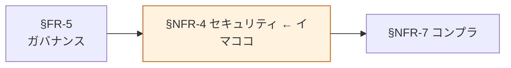

# §NFR-4 セキュリティ

> 上位 SSOT: [../00-index.md](../00-index.md) / [00-index.md](00-index.md)
> IPA 対応: **E. セキュリティ**（認証 / アクセス制限 / データ秘匿 / 不正追跡・監査）
> 詳細: [../../non-functional-requirements.md §NFR-SEC](../../non-functional-requirements.md)

---

## §NFR-4.0 前提と背景

### 用語整理

| 用語 | 本標準での意味 |
|---|---|
| **at-rest 暗号化 / in-transit 暗号化** | 保存時 / 通信時の暗号化 |
| **Lake Formation** | データレイクの権限制御サービス |
| **VPC エンドポイント** | パブリック経路を経由せず AWS サービスにアクセスする経路 |
| **GuardDuty** | 異常検知サービス |
| **Macie** | S3 内 PII 検出サービス |

### なぜここ（§NFR-4）で決めるか

§FR-5 ガバナンス（機能要件としての統制ルール）を、非機能要件として **「どの水準で実装するか」** に落とす章。

### IPA マッピング

| 本章サブセクション | IPA 中項目 |
|---|---|
| §NFR-4.1 暗号化 | E.4 データ秘匿 |
| §NFR-4.2 アクセス制御 | E.2 アクセス制限 |
| §NFR-4.3 監査 | E.6 不正追跡・監査 |
| §NFR-4.4 ネットワーク境界 | E.7 ネットワーク対策 |

### §NFR-4.0.A 本標準のスタンス

> **「絶対安全」を最優先とし、デフォルトで「暗号化・アクセス制御・監査・境界制御」の 4 層を必須化する。Restricted データには KMS CMK / Lake Formation 行列セキュリティ / VPC エンドポイント経由を全件適用。GuardDuty / Security Hub / Macie で異常を継続検知する。**

### 本章で扱うサブセクション

| サブセクション | 内容 |
|---|---|
| §NFR-4.1 暗号化 | at-rest / in-transit、KMS CMK、機密度別目標 |
| §NFR-4.2 アクセス制御 | Lake Formation / IAM、Need-to-know、棚卸し頻度 |
| §NFR-4.3 監査ログ | CloudTrail / GuardDuty / Macie 連携、保管 |
| §NFR-4.4 ネットワーク境界 | VPC エンドポイント、パブリック経路最小化 |

---

## §NFR-4.1 暗号化

> **このサブセクションで定めること**: at-rest / in-transit 暗号化の達成水準（KMS CMK 利用条件、TLS バージョン、鍵ローテーション）。
> **主な判断軸**: 機密度 / コンプラ / 鍵管理運用負荷
> **§NFR-4 全体との関係**: 最も基本的な防御層

### ベースライン

- at-rest: 機密度別に §FR-5.2 のマトリクスを適用。Restricted は KMS CMK 必須。
- in-transit: TLS 1.2 以上、TLS 1.3 推奨。
- 鍵ローテーション: KMS 自動ローテーション（年次）有効化必須。
- 鍵ポリシーは IaC 管理。

### TBD / 要確認

- マルチリージョン KMS 鍵の採用範囲
- 既存暗号鍵の本標準への統合

---

## §NFR-4.2 アクセス制御

> **このサブセクションで定めること**: 権限制御の達成水準（Lake Formation 行列レベル / 棚卸し頻度 / 例外承認）。
> **主な判断軸**: 機密度 / 監査要件 / 運用負荷
> **§NFR-4 全体との関係**: 暗号化と並ぶ防御の中核

### ベースライン

- Restricted データへの権限付与は四半期棚卸し必須。
- 90 日未利用権限の自動無効化（IAM Access Analyzer）。
- ルートアカウント・管理者権限は MFA 必須、平時利用禁止。

### TBD / 要確認

- 棚卸しの責任者（プラットフォーム標準化推進者 / 各データオーナー）
- 自動無効化の閾値（90 日が妥当か）

---

## §NFR-4.3 監査ログ

> **このサブセクションで定めること**: 監査ログの取得網羅性・保管期間・改ざん不能保管。
> **主な判断軸**: コンプラ / インシデント対応 / コスト
> **§NFR-4 全体との関係**: §FR-5.4 の実装水準を定める

### ベースライン

- CloudTrail（全リージョン、データイベント有効）。
- Lake Formation / Athena / Redshift / RDS の各サービス監査ログを取得。
- 監査ログ専用 S3 バケットに集約、Object Lock Compliance モード。
- 保管期間: 最低 1 年、Restricted データ関連は 7 年（§NFR-9）。
- GuardDuty / Security Hub / Macie 全面有効化。

### TBD / 要確認

- 業界規制による保管年数の上限
- リアルタイムアラートの閾値

---

## §NFR-4.4 ネットワーク境界

> **このサブセクションで定めること**: VPC エンドポイント経由・パブリック経路最小化の方針。
> **主な判断軸**: パブリック露出の許容範囲 / レイテンシ / コスト
> **§NFR-4 全体との関係**: 境界制御の層

### ベースライン

- S3 / DynamoDB / Glue / Athena 等は VPC エンドポイント（Gateway / Interface）経由を標準とする。
- パブリック IP を持つリソースは原則禁止（IAM 例外承認制）。
- WAF / Shield Standard 必須、機密度高いエンドポイントは Shield Advanced 検討。

### TBD / 要確認

- 既存リソースのパブリック露出状況
- VPC エンドポイント追加コストの許容範囲

---

## §NFR-4.X 関連リンク

- [00-index.md](00-index.md): NFR インデックス
- [../fr/05-governance.md](../fr/05-governance.md): §FR-5 ガバナンス（本章の機能要件側）
- [07-compliance.md](07-compliance.md): §NFR-7 コンプラ
